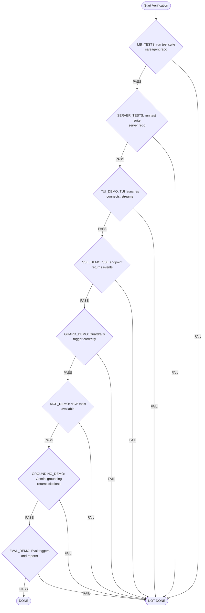
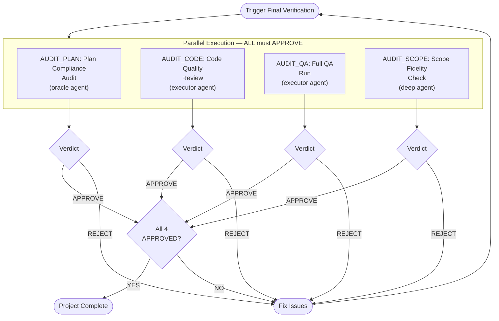
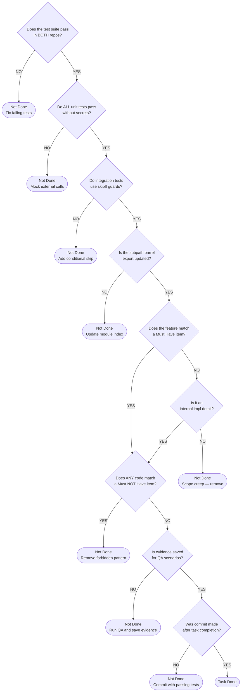

# 01 — Requirements & Constraints

This document is the **single source of truth** for all project boundaries, delivery requirements, conventions, and final verification procedures. Every implementation task must satisfy the constraints listed here. Nothing ships without meeting the Definition of Done.

---

## Table of Contents

- [Core Objective](#core-objective)
- [Concrete Deliverables](#concrete-deliverables)
- [Definition of Done](#definition-of-done)
- [Must Have — Complete Requirements](#must-have--complete-requirements)
- [Must NOT Have — Complete Exclusions](#must-not-have--complete-exclusions)
- [Runtime Clarification](#runtime-clarification)
- [Conventions](#conventions)
- [Final Verification Pipeline](#final-verification-pipeline-audit_plan-audit_code-audit_qa-audit_scope)
- [Definition of Done Decision Tree](#definition-of-done-decision-tree)
- [Summary of Verification Gates](#summary-of-verification-gates)

---

## Core Objective

Create a production-ready TypeScript library (`safeagent`) that encapsulates all AI agent logic — agent creation, guardrail composition, MCP management, SSE streaming, memory, file upload + document Q&A, and eval — with sensible defaults and full customizability. Then create a thin server project that demonstrates consumption of the library. The complete system is designed for 10 million users.

---

## Concrete Deliverables

| Deliverable | Description |
|---|---|
| **safeagent package** | Published to a package registry — core library with agent, guardrails, MCP, streaming, memory, RAG, upload, observability, cache, rate limiting, circuit breaker, logging |
| **Client SDK** | Lightweight, framework-agnostic TypeScript SDK module for consuming safeagent server APIs — SSE parsing, file upload, feedback, thread management, offline queue |
| **React Hooks** | React hooks module implementing AI SDK ChatTransport for seamless `useChat` integration with safeagent SSE protocol |
| **Web Components** | Web components module built on shadcn and Vercel ai-elements with custom trace and verbosity visualization components |
| **Native Components** | Native components module using NativeWind v4 with offline-first capabilities |
| **safeagent-tui binary** | Interactive terminal UI for agent testing with streaming chat display, textarea input, commands, and file upload |
| **Server project** | Separate repository with working SSE streaming API, file upload endpoint, guardrail configuration, MCP server definitions, agent prompts |
| **Next.js demo app** | Full-featured web chat application demonstrating all components, server switching, verbosity toggle, trace visualization |
| **Expo demo app** | Mobile chat application with offline-first behavior, all RN components, server switching |
| **Self-test infrastructure** | Promptfoo integration for evaluation with custom scorer configuration |
| **Full TDD test suite** | All tests passing under the Bun test runner — unit tests require zero secrets, integration tests use conditional skip |
| **Document Q&A pipeline** | File upload processing, per-page summarization, hybrid search, progressive retrieval, structured citations with S3 storage |

---

## Definition of Done

Every item below must be verified before the project is considered complete.

| Deliverable ID | Criterion | Verification Method |
|---|---|---|
| LIB_TESTS | Bun test runner passes in safeagent repo (all packages) | Run the Bun test runner — zero failures |
| SERVER_TESTS | Bun test runner passes in server repo | Run the Bun test runner — zero failures |
| TUI_DEMO | TUI launches, connects to agent, streams responses | Launch TUI binary, send message, observe streaming output |
| SSE_DEMO | SSE endpoint returns streaming events with streaming text | Send a request to the stream endpoint — returns SSE events starting with `data:` |
| GUARD_DEMO | Guardrail triggers correctly | Dev mode: tripwire event terminates stream (client renders fallback locally). Prod mode: fallback text injected as regular text-delta chunks |
| MCP_DEMO | MCP tools from configured servers are available to the agent | Agent lists tools from all configured MCP servers |
| GROUNDING_DEMO | Gemini grounding search returns cited responses | Send a request to the grounding agent — response contains grounding metadata |
| EVAL_DEMO | Eval triggers and reports results | Run eval command — Promptfoo self-test loop completes and reports |
| WEB_DEMO | Next.js demo renders streaming chat with trace visualization | Launch demo, send message, observe streaming text + trace-step timeline in full verbosity mode |
| MOBILE_DEMO | Expo demo renders streaming chat with offline queue | Launch demo on simulator, send message, toggle airplane mode, verify queue + sync |

---

## Must Have — Complete Requirements

Every item listed below is a non-negotiable requirement. No item may be trimmed, deferred, or marked optional.

### Agent Core

| ID | Requirement | Detail |
|---|---|---|
| MH_AGENT_DEFAULTS | Agent creation with sensible defaults | Agent creation factory with full customizability |
| MH_INPUT_GUARDRAILS | Input guardrails (server-defined) | Guardrail function list → severity+conceptId → block/flag/pass |
| MH_STREAMING_GUARDRAILS | Streaming output guardrails | Framework output guardrail list with tripwire-trigger pattern + sliding-window buffer |
| MH_GUARDRAIL_FACTORIES | Guardrail authoring factories | Factory-pattern helpers for regex, keyword, model-based, external, and composite guardrails |
| MH_MCP_CLIENT | MCP client wrapper | Multi-server support and health checks |
| MH_SSE_STREAMING | SSE streaming via Elysia | The framework's execution method emits stream event types that are forwarded through Elysia SSE generators for real-time token delivery |
| MH_GEMINI_GROUNDING | Gemini grounding search | Separate agent mode for web-grounded responses |
| MH_PROVIDER_AGNOSTIC | Provider-agnostic model configuration | No model-specific branching in core agent logic. Grounding mode is an explicit exception — it uses `@ai-sdk/google` directly because Gemini grounding is a Google-specific capability with no provider-neutral equivalent |
| MH_CONFIG_OVERRIDABLE | All configs have defaults, all defaults are overridable | Every configuration surface has sensible fallbacks |
| MH_NO_HARDCODED_PROMPTS | No hardcoded agent instructions/app-level prompts in library | Internal implementation prompts (extraction, tool descriptions) are acceptable — user-facing prompts are not |

### Language and Content Safety

| ID | Requirement | Detail |
|---|---|---|
| MH_LANG_GUARD | Language guardrail (opt-in) | `eld` detection plus intent-stage piggyback checks. Configurable supported languages, minimum text length, and confidence threshold. Unsupported intended output language triggers p0 block |
| MH_HATE_SPEECH_GUARD | Hate speech guardrail (opt-in) | Hybrid `obscenity` plus `@2toad/profanity` plus LDNOOBW supplement through `naughty-words`. Consumer can disable and can exclude or extend word lists |
| MH_LANG_OUTPUT_SCAN | Language output scanner | `eld` sliding-window output scan catches model drift into unsupported languages during generation |
| MH_LDNOOBW_ATTRIBUTION | LDNOOBW attribution compliance | CC-BY-4.0 attribution for LDNOOBW data with Shutterstock credit. PKG_PUBLISH deliverables must include this in a NOTICE or THIRD-PARTY-LICENSES file |
| MH_VI_OFFENSIVE_ATTRIBUTION | Vietnamese offensive word list attribution compliance | Include MIT attribution and upstream repo credits for `blue-eyes-vn/vietnamese-offensive-words` and `KienCuong2004/VNOffensiveWords` in NOTICE or THIRD-PARTY-LICENSES |

### Memory

| ID | Requirement | Detail |
|---|---|---|
| MH_SHORT_TERM_MEMORY | Short-term memory (Postgres) | Via Drizzle ORM, 10 turns per conversation, auto-injected |
| MH_LONG_TERM_MEMORY | Long-term memory (SurrealDB) | Graph + vector storage, LLM fact extraction, agent recall tool |
| MH_MEMORY_RECALL_TOOL | Memory recall tool factory | Agent-initiated long-term memory search |
| MH_USERID_SCOPING | `userId` scoping on all memory operations | Server passes direct `userId` parameters — every operation scoped |
| MH_NO_WRITES_WITHOUT_USER | Must not write memory, doc chunks, or file metadata without userId | Conversation and document operations require both threadId AND userId. Per-file operations (CRUD, cleanup) require fileId AND userId. Long-term memory operations require userId only (cross-thread by design — see [07 — Memory & Intelligence](./07-memory.md) Two-Tier Responsibilities). |

### Auth & Transport

| ID | Requirement | Detail |
|---|---|---|
| MH_JWT_AUTH_REQUIRED | JWT auth on all API routes when `JWT_SECRET` is set | Auth middleware factory extracts userId from JWT `sub` claim and sets request context. Reject with 401 if missing or invalid. When `JWT_SECRET` is absent: in production environment mode, the server must refuse startup (hard fail — security boundary, no fallback); in development, middleware enters dev-bypass mode (default dev userId, startup warning). No user identity header override — userId is extracted from JWT claims by the server |
| MH_BOUNDARY_INPUT_VALIDATION | Input validation at trust boundaries | All request inputs are schema-validated at route boundaries before agent execution, including chat payloads, file upload metadata, admin payloads, and feedback payloads. Invalid payloads fail closed with typed errors |
| MH_ROLE_AUTHZ_REQUIRED | Role-based authorization for privileged operations | Admin and privileged APIs require explicit role checks after JWT validation. Authorization failures return forbidden responses and are audit-logged with request identity |
| MH_CORS_POLICY | CORS allowlist enforcement | CORS policy is environment-driven with explicit origin allowlists, allowed methods, and allowed headers. Production deployments avoid wildcard origins for authenticated routes |
| MH_TRACE_THREAD_DELIVERY | `traceId` + `threadId` delivery | Emitted as first SSE custom data event for client-side feedback linking and multi-turn continuity |
| MH_ESM_ONLY | ESM-only TypeScript package | No CommonJS, no dual-format |

### TUI

| ID | Requirement | Detail |
|---|---|---|
| MH_TUI_APP | TUI with streaming chat display, textarea input, commands, and upload | `/upload` command for file upload during testing sessions |

### Evaluation

| ID | Requirement | Detail |
|---|---|---|
| MH_PROMPTFOO_SELFTEST | Promptfoo self-test | Evaluation-provider helper for prompt testing integration |
| MH_EVAL_SCORERS | Custom evaluation scorers configuration helper | Custom scoring functions for live production quality monitoring |

### Document Processing & Upload

| ID | Requirement | Detail |
|---|---|---|
| MH_FILE_UPLOAD | File upload support | PDF, DOCX, TXT, PNG, JPG/JPEG, WEBP (5MB per file, 5 files per turn). `.doc` (legacy binary) NOT supported — `.docx` only (LibreOffice converts to PDF) |
| MH_MULTIMODAL_FIRST | Multimodal-first document processing | PDF pages sent directly to Gemini (no text extraction for answering). DOCX→PDF via LibreOffice headless. Summaries/raw text are search indexes only — original PDF pages sent to LLM |
| MH_PAGE_SUMMARIZATION | Per-page detailed summarization | Dense paragraphs capturing ALL keywords, descriptions, image descriptions, table contents, entities, topics, facts. Each summary = 1 chunk in RAG. Summaries must be as detailed as possible |
| MH_PROGRESSIVE_RETRIEVAL | Progressive retrieval | Direct mode (≤6 pages), indexed mode with hybrid search (>6 pages), RAG mode (large TXT) |
| MH_HYBRID_SEARCH_RRF | Hybrid search (RRF) | Vector search on summaries + vector on raw text + keyword tsvector → top-K pages → extract original PDF pages → send to Gemini multimodal |
| MH_BACKGROUND_ENRICHMENT | Background raw text enrichment | Background stage via Trigger.dev task (production) or in-process fallback (dev) — `unpdf` text extraction + embedding + tsvector for keyword search |
| MH_IMAGE_PROCESSING | Image processing (JIMP) | JIMP resize (max 2048px) → direct multimodal on query |
| MH_PAGE_INDEX_TABLE | Own Drizzle `page_index` table | Per-page search with custom text chunking and custom pgvector access via Drizzle |
| MH_CUSTOM_QUERY_TOOL | Custom document search tool | Server-side threadId and userId filtering (NOT model-controlled access filters). Built via a document query tool factory. Retrieves all context for matched pages: original PDF page (fetched from object storage), summary, and matching raw text chunks. Be exhaustive |
| MH_STRUCTURED_CITATIONS | Structured citations | Structured output generation returns an answer with a list of citations. Canonical citation type includes source (human label), fileId (machine ID), page, quote, optional scope, and optional images with presigned URLs plus fallback API paths |

### Storage & Files

| ID | Requirement | Detail |
|---|---|---|
| MH_S3_STORAGE | S3-compatible file storage | Bun.S3Client preferred, per-user quota (100MB default) |
| MH_FILE_METADATA | File metadata tracking in Postgres | `file_uploads` + `user_storage_quotas` tables |
| MH_MAGIC_BYTES | Magic bytes file validation | Not just extension — validate actual file content type |
| MH_ASYNC_FILE_PROCESSING | Async file processing with status tracking | Polling endpoint for processing status |
| MH_PARTIAL_BATCH_FAILURE | Partial batch failure handling | One corrupt file doesn't block others |
| MH_CLEANUP_THREAD | Thread cleanup API | Thread cleanup deletes S3 files + PgVector chunks + metadata. Requires both threadId+userId for defense-in-depth, deps injected by server |
| MH_DOCKER_PGVECTOR | Docker with pgvector | pgvector-enabled Postgres image (NOT bare Postgres), MinIO for local S3 |

### Observability

| ID | Requirement | Detail |
|---|---|---|
| MH_LANGFUSE_OBSERVABILITY | Langfuse observability | Direct `langfuse` SDK instrumentation traces all LLM calls, agent runs, and tool calls |
| MH_CUSTOM_SPANS | Custom observability spans | Input guardrail + streaming output guardrail (boolean scores), RAG pipeline, file processing |
| MH_PII_FILTER | Custom PII filter | Custom PII filter via `@logtape/redaction` strips sensitive data from spans before export |
| MH_USER_FEEDBACK | User feedback endpoint | Feedback endpoint → Langfuse scores linked to traces |
| MH_LANGFUSE_SELFHOSTED | Langfuse self-hosted stack | ClickHouse + Redis + langfuse-web + langfuse-worker (Docker Compose profiles) |

### Data Layer

| ID | Requirement | Detail |
|---|---|---|
| MH_DRIZZLE_ORM | Drizzle ORM | For file metadata tables (`file_uploads`, `user_storage_quotas`) with `drizzle-orm/bun-sql` |

### CTA Streaming

| ID | Requirement | Detail |
|---|---|---|
| MH_CTA_STREAMING | CTA streaming | CTA tool factory enables model-decided, context-aware call-to-action suggestions emitted as a custom `cta` data event at end of stream |
| MH_CTA_SCHEMA | CTA schema | `{ id, label, action: 'deeplink' | 'callback' | 'dismiss', url, icon? }`, max 3 per response |
| MH_CTA_HIDDEN | CTA tool hidden from client | `suggest_cta` tool-call events suppressed from stream, only clean `cta` data event emitted |
| MH_CTA_SERVER_CATALOG | CTA catalog defined in server config | Library provides the tool factory + stream injection — catalog is thin server config |

### Location Enrichment

| ID | Requirement | Detail |
|---|---|---|
| MH_LOCATION_TOOL | Location enrichment tool (opt-in) | Location tool factory with pluggable geocoding and image-search providers. Default geocoding uses Nominatim with Valkey cache. Image provider must be configured by server. Emits `location` SSE events with coordinates and images per place. Location enrichment failures degrade silently (log + continue); unresolved places do not emit `location` events |
| MH_GEOCODE_PLUGGABLE | Geocoding provider is pluggable | Default is Nominatim. Server can override with any geocoding provider function |
| MH_GEOCODE_CACHED | Geocoding cached in Valkey | Geocoding results use thirty-day TTL. When Valkey is unavailable, caching falls back to in-memory (per-process) and cache effectiveness is reduced |
| MH_LOCATION_SUPPRESSED | Location tool hidden from client stream | `search_locations` tool-call and tool-result events are suppressed from SSE output. Client receives only clean `location` data events |

### Infrastructure

| ID | Requirement | Detail |
|---|---|---|
| MH_RATE_LIMITING | Rate limiting | Rate limiter factory — Valkey sliding-window sorted sets, configurable window and max, 429 with `Retry-After` |
| MH_STRUCTURED_LOGGING | Structured logging | LogTape with hierarchical categories — library uses `getLogger`, server calls `configure` once at startup. AsyncLocalStorage request context (requestId, userId, threadId). `@logtape/redaction` for sensitive fields, `@logtape/otel` for Langfuse correlation |
| MH_FILE_CRUD | File management CRUD | File list, file detail, and file delete server endpoints |
| MH_TTL_CLEANUP | TTL-based automatic cleanup | Trigger.dev scheduled task finds expired files, deletes S3 + PgVector chunks + metadata |
| MH_CIRCUIT_BREAKER | Circuit breaker | Circuit breaker factory — closed/open/half-open states, wraps asynchronous operations with configurable failure threshold and reset timeout |
| MH_AUTH_MIDDLEWARE | JWT auth middleware | Auth middleware factory — verifies JWT, extracts userId to Elysia request context, and supports role-based authorization via a role-check helper |
| MH_AUDIT_LOGGING | Security-relevant audit logging | Authentication failures, authorization denials, guardrail enforcement actions, budget and rate-limit denials, and deletion operations are captured in structured logs with traceable request metadata |

### Humanlikeness

| ID | Requirement | Detail |
|---|---|---|
| MH_CORRECTION_HANDLING | Correction detection and re-answering | Detect user corrections ("no I meant X", "that's wrong", "I said Y not Z") as a distinct intent type. When detected, the agent must re-examine its previous response and re-answer incorporating the correction — not just respond to the new message in isolation |
| MH_EMOTIONAL_CONTEXT | Emotional context carry-forward | Extract short-lived emotional state from user messages (grief, excitement, anxiety, frustration). Emotional state decays after a configurable number of turns (default 5). While active, emotional context is injected into the agent's system context to guide tone — e.g., gentler responses after sad events, matching enthusiasm after positive ones |
| MH_FRUSTRATION_DETECTION | Frustration escalation detection | Detect escalating user frustration across turns (caps, repeated complaints, negative sentiment progression). When detected, signal the agent to de-escalate: simplify language, acknowledge the difficulty, try a different approach rather than repeating the same type of answer |
| MH_REPEATED_QUESTION_DIFF | Repeated question differentiation | When a user asks the same question again (detected via query replay), assume the previous answer was insufficient. The agent must provide a different or more detailed answer — not repeat the same response. Previous answer context is injected so the agent knows what was already tried |
| MH_STYLE_MEMORY | Communication style preference memory | Extract and persist user meta-preferences about response style ("keep it short", "explain like I'm a beginner", "be more technical", "use examples"). Style preferences are stored as long-term memory facts (cross-thread) and injected into agent context on every request for that user |
| MH_TEMPORAL_FACTS | Temporal markers on extracted facts | Fact extraction must detect temporal indicators ("I used to live in Tokyo" = past, "I live in Bangkok" = present, "I'm moving to Berlin" = future). Facts stored with temporal state (past/present/future). Memory recall prioritizes present-tense facts and marks past-tense facts as historical when injecting context |
| MH_FACT_SUPERSESSION | Fact contradiction resolution | When a newly extracted fact contradicts an existing fact for the same user (e.g., "I love coffee" then later "I've quit coffee"), the newer fact supersedes the older one. The old fact is marked as superseded (not deleted) for audit trail. Memory recall returns only the active (latest) fact |
| MH_IMPLICIT_REFS | Implicit reference resolution support | When user messages contain anaphora or implicit references ("the other one", "do that again", "what about yesterday's thing"), the context injection must include recent conversation history AND relevant memory recall results so the LLM can resolve references. If the referent is likely outside the current context window, the engine proactively expands recall scope |
| MH_RESPONSE_ENERGY | Response length and energy matching | Compute input characteristics (message length, formality level, question complexity) and inject a response calibration hint into the agent context. Short casual inputs ("yes", "cool") should not produce multi-paragraph responses. Detailed questions deserve detailed answers. The calibration is a hint, not a hard constraint — the agent may override when the content requires it |
| MH_CONVERSATION_RESUMPTION | Conversation resumption after time gap | When thread resurrection detects a significant time gap (configurable, default 24 hours), inject a resumption context note for the agent. The agent should naturally acknowledge the gap and briefly reference what was discussed before, rather than continuing as if no time passed. The engine provides the time delta and last-topic summary to enable this |
| MH_CLARIFICATION_PATIENCE | Multi-turn clarification patience model | Track the number of consecutive clarification exchanges in a thread. After a configurable threshold (default 2 rounds), the agent must synthesize what it knows so far and attempt a best-effort answer with stated assumptions, rather than asking yet another clarifying question. Prevents infinite clarification loops |
| MH_TOPIC_ABANDONMENT | Topic abandonment detection | Detect when a user explicitly abandons a topic ("actually nevermind", "forget that", "let's talk about something else") or implicitly shifts to an unrelated subject. When detected, the agent must cleanly drop the previous topic context so it does not bleed into the new topic's response |
| MH_PROACTIVE_CLARIFICATION | Proactive clarification for ambiguous input | When user input is genuinely ambiguous (multiple valid interpretations with significantly different answers), the agent must ask a brief clarifying question rather than guessing. The intent pipeline provides an ambiguity signal when the embedding router confidence is below threshold AND the LLM intent validator detects multiple plausible interpretations. The agent presents the top interpretations and asks which one the user means |

### Frontend SDK

| ID | Requirement | Detail |
|---|---|---|
| MH_REACT_HOOKS | React hooks module for AI SDK integration | The React hooks module implements the AI SDK ChatTransport interface so `useChat` works with the safeagent SSE protocol. It exports typed hooks for chat, feedback, file upload, and thread management. It depends on the client SDK module for SSE transport |
| MH_WEB_COMPONENTS | Web UI components module | The web components module includes shadcn and Vercel ai-elements based components for conversation, messages, input, attachments, tool calls, reasoning, sources, and model selector. Every component is customizable via className and children slots. Installation follows shadcn-style copy-into-project workflow |
| MH_RN_COMPONENTS | Native UI components module | The native components module provides an equivalent React Native component set using NativeWind v4. It shares hooks and business logic with the web layer through the React hooks module while keeping separate JSX and styling. Expo is required for the `expo/fetch` polyfill |
| MH_TRACE_STEP_EVENTS | Trace-step SSE event family | `trace-step` named SSE events for real-time pipeline visibility: intent detection, memory recall, guardrail verdicts, retrieval progress, tool execution, context budget. Emitted only when verbosity is `full`. See [11 — Streaming & Transport](./11-transport.md) |
| MH_VERBOSITY_FILTER | Verbosity-level event filtering | Chat streaming endpoint accepts verbosity level (`standard` or `full`). `standard` emits user-facing events only. `full` adds trace-step events for developer debugging. Server controls via query parameter |
| MH_TRACE_UI | Trace visualization components | Custom UI components (web) for displaying trace-step events: collapsible timeline, latency indicators, token counts, pipeline step status badges. Not from ai-elements — built on top of shadcn primitives. See [18 — Frontend SDK](./18-frontend-sdk.md) |
| MH_VERBOSITY_TOGGLE | Verbosity mode toggle component | UI toggle for switching between standard (user-friendly) and full (developer) verbosity modes. When toggled, subsequent requests use the selected verbosity level |
| MH_SERVER_SWITCH | Multi-server switching in demos | Demo apps support dynamically switching between multiple safeagent server instances (like model switching in ChatGPT/Claude). Connection, auth, and thread state reset on switch |
| MH_DEMO_WEB | Next.js demo application | Full-featured chat app demonstrating all web components, server switching, verbosity toggle, file upload, tool calls, reasoning display, trace visualization. See [19 — Demos](./19-demos.md) |
| MH_DEMO_MOBILE | Expo demo application | Mobile chat app with offline-first behavior, all RN components, server switching, verbosity toggle. See [19 — Demos](./19-demos.md) |
| MH_FRONTEND_TYPE_SAFETY | End-to-end type safety | SSE event types are defined once in the safeagent library and flow through client SDK → React hooks → UI components, with type chaining across subpath modules and zero type casting or manual schema duplication |
| MH_COMPONENT_CLI | CLI for component installation | shadcn-style CLI that copies components into consumer projects. Individual component installation, not monolithic import. Follows the same pattern as ai-elements installation |
| MH_STORYBOOK | Component documentation via Storybook | Interactive component documentation with usage examples for both web and RN component packages |
| MH_FRONTEND_A11Y | Accessibility compliance | All UI components support ARIA attributes, keyboard navigation, and screen reader compatibility. ai-elements already provides this for adopted components — custom components must match |
| MH_OFFLINE_MOBILE | Offline-first mobile experience | Mobile app queues messages offline via the client SDK module offline queue, persists conversation locally, and syncs on reconnect. Visual indicators show offline state and pending messages |
| MH_AI_ELEMENTS | ai-elements as web component foundation | Adopt Vercel ai-elements components for conversation, messages, input, tool calls, reasoning, attachments, sources, code blocks. Custom components only for gaps: trace UI, server switch, verbosity toggle, thread list, message timestamps, typing indicator, error retry |

### Cross-Cutting

| ID | Requirement | Detail |
|---|---|---|
| MH_CROSS_CONV_RAG | Cross-conversation RAG knowledge base | Global document knowledge accessible across all conversations for a user — not siloed per thread |
| MH_ADMIN_API | Admin API for budget management | Server endpoints for viewing and adjusting per-user token budgets, quota overrides, and cost tracking |
| MH_PROMPT_MGMT | Langfuse prompt management | Runtime prompt fetching from Langfuse with cache, fallback to local prompts, variable interpolation, circuit breaker protection |
| MH_ZERO_LEAK | Zero-leak output guardrail | Buffered gating guardrail that holds response chunks until safety classification completes — no unsafe content reaches the client even briefly |
| MH_OFFLINE_QUEUE | Client SDK offline message queue | The client SDK module queues messages when the server is unreachable, persists to local storage, and auto-syncs on reconnect with deduplication |
| MH_SURQLIZE | SurrealDB via surqlize ORM | All SurrealDB operations use the surqlize ORM — no raw SurrealQL queries |
| MH_SECRET_MANAGEMENT | Secret management through typed env flow | Secrets are loaded through validated typed environment configuration, never hardcoded, never logged in clear text, and redacted at logging and tracing sinks |
| MH_TYPED_ENV | Typed environment configuration | `@t3-oss/env-core` validates and types all environment variables at startup — runtime access is fully typed with no raw `process.env` reads |
| MH_TYPED_ERRORS | Typed error handling with neverthrow | Result type pattern (`ok`/`err`) for all boundary operations — no thrown exceptions at module boundaries, every error path is typed |
| MH_NO_RAW_SQL | No raw database query strings | All PostgreSQL operations use Drizzle ORM's type-safe query builder and all SurrealDB operations use surqlize's typed API. Raw SQL and raw SurrealQL query strings are banned and enforced through linting and review gates to prevent injection-prone query paths |
| MH_PRECOMMIT_HOOKS | Pre-commit quality gates | Husky + lint-staged run formatting, linting, and type-checking on staged files before every commit |
| MH_WATCH_ONLY | Development watch mode | Automatic file-watching restart during development — no manual rebuild step required |
| MH_OPENAPI_DOCS | OpenAPI documentation from Elysia | Elysia auto-generates OpenAPI specification from route definitions — always in sync with actual endpoints |
| MH_SEED_DATA | Seed data for testing | Reproducible seed data fixtures for smoke tests and end-to-end tests — deterministic test state |
| MH_TYPEDOC | API documentation generation | TypeDoc generates API reference documentation from source TypeScript — published alongside the package |
| MH_BUN_LINK | Local development linking | Symlink-based local development workflow for developing safeagent library and server project simultaneously without publishing |

### Complete Must-Have → Task Ownership Mapping

Every must-have requirement maps to one or more implementation tasks in the [17 — Execution Plan](./17-execution.md). This table is the definitive traceability matrix — no must-have is unowned.

#### Agent Core

| Must-Have | Owning Task(s) |
|-----------|----------------|
| MH_AGENT_DEFAULTS | AGENT_FACTORY |
| MH_INPUT_GUARDRAILS | INPUT_GUARD |
| MH_STREAMING_GUARDRAILS | OUTPUT_GUARD |
| MH_GUARDRAIL_FACTORIES | GUARD_FACTORY |
| MH_MCP_CLIENT | MCP_CLIENT |
| MH_SSE_STREAMING | SSE_STREAMING |
| MH_GEMINI_GROUNDING | GEMINI_GROUNDING |
| MH_PROVIDER_AGNOSTIC | AGENT_FACTORY, PROVIDER_HELPERS |
| MH_CONFIG_OVERRIDABLE | CONFIG_DEFAULTS |
| MH_NO_HARDCODED_PROMPTS | AGENT_FACTORY (convention enforced by AUDIT_CODE) |

#### Language and Content Safety

| Must-Have | Owning Task(s) |
|-----------|----------------|
| MH_LANG_GUARD | LANG_GUARD |
| MH_HATE_SPEECH_GUARD | HATE_SPEECH_GUARD |
| MH_LANG_OUTPUT_SCAN | LANG_GUARD (output drift scanner is part of language guard) |
| MH_LDNOOBW_ATTRIBUTION | PKG_PUBLISH (NOTICE/THIRD-PARTY-LICENSES file) |
| MH_VI_OFFENSIVE_ATTRIBUTION | PKG_PUBLISH (NOTICE/THIRD-PARTY-LICENSES file) |

#### Memory

| Must-Have | Owning Task(s) |
|-----------|----------------|
| MH_SHORT_TERM_MEMORY | SHORT_TERM_MEM |
| MH_LONG_TERM_MEMORY | SURREALDB_CLIENT, FACT_EXTRACTION, MEMORY_RECALL |
| MH_MEMORY_RECALL_TOOL | MEMORY_RECALL |
| MH_USERID_SCOPING | CORE_TYPES (type constraint enforced across all memory tasks) |
| MH_NO_WRITES_WITHOUT_USER | CORE_TYPES (type constraint enforced across all memory tasks) |

#### Auth & Transport

| Must-Have | Owning Task(s) |
|-----------|----------------|
| MH_JWT_AUTH_REQUIRED | JWT_AUTH |
| MH_TRACE_THREAD_DELIVERY | SSE_STREAMING |
| MH_ESM_ONLY | SCAFFOLD_LIB |

#### TUI

| Must-Have | Owning Task(s) |
|-----------|----------------|
| MH_TUI_APP | TUI_SHELL, TUI_CHAT, TUI_INPUT, TUI_COMMANDS, TUI_UPLOAD, TUI_AGENT |

#### Evaluation

| Must-Have | Owning Task(s) |
|-----------|----------------|
| MH_PROMPTFOO_SELFTEST | SELF_TEST |
| MH_EVAL_SCORERS | EVAL_CONFIG |

#### Document Processing & Upload

| Must-Have | Owning Task(s) |
|-----------|----------------|
| MH_FILE_UPLOAD | UPLOAD_PIPELINE, UPLOAD_ENDPOINT |
| MH_MULTIMODAL_FIRST | DOC_PIPELINE |
| MH_PAGE_SUMMARIZATION | DOC_PIPELINE |
| MH_PROGRESSIVE_RETRIEVAL | DOC_PIPELINE, RAG_INFRA |
| MH_HYBRID_SEARCH_RRF | RAG_INFRA |
| MH_BACKGROUND_ENRICHMENT | TRIGGER_TASKS |
| MH_IMAGE_PROCESSING | UPLOAD_PIPELINE |
| MH_PAGE_INDEX_TABLE | RAG_INFRA |
| MH_CUSTOM_QUERY_TOOL | DOC_SEARCH |
| MH_STRUCTURED_CITATIONS | DOC_SEARCH |

#### Storage & Files

| Must-Have | Owning Task(s) |
|-----------|----------------|
| MH_S3_STORAGE | FILE_STORAGE |
| MH_FILE_METADATA | FILE_STORAGE |
| MH_MAGIC_BYTES | UPLOAD_PIPELINE |
| MH_ASYNC_FILE_PROCESSING | UPLOAD_PIPELINE |
| MH_PARTIAL_BATCH_FAILURE | UPLOAD_PIPELINE |
| MH_CLEANUP_THREAD | TTL_CLEANUP |
| MH_DOCKER_PGVECTOR | DOCKER_COMPOSE |

#### Observability

| Must-Have | Owning Task(s) |
|-----------|----------------|
| MH_LANGFUSE_OBSERVABILITY | LANGFUSE_MODULE |
| MH_CUSTOM_SPANS | CUSTOM_SPANS |
| MH_PII_FILTER | LANGFUSE_MODULE |
| MH_USER_FEEDBACK | FEEDBACK_ENDPOINT |
| MH_LANGFUSE_SELFHOSTED | DOCKER_COMPOSE |

#### Data Layer

| Must-Have | Owning Task(s) |
|-----------|----------------|
| MH_DRIZZLE_ORM | STORAGE_WRAPPER |

#### CTA Streaming

| Must-Have | Owning Task(s) |
|-----------|----------------|
| MH_CTA_STREAMING | CTA_STREAMING |
| MH_CTA_SCHEMA | CTA_STREAMING |
| MH_CTA_HIDDEN | CTA_STREAMING |
| MH_CTA_SERVER_CATALOG | SERVER_AGENT_CFG |

#### Location Enrichment

| Must-Have | Owning Task(s) |
|-----------|----------------|
| MH_LOCATION_TOOL | LOCATION_TOOL |
| MH_GEOCODE_PLUGGABLE | LOCATION_TOOL |
| MH_GEOCODE_CACHED | LOCATION_TOOL |
| MH_LOCATION_SUPPRESSED | LOCATION_TOOL |

#### Infrastructure

| Must-Have | Owning Task(s) |
|-----------|----------------|
| MH_RATE_LIMITING | RATE_LIMITING |
| MH_STRUCTURED_LOGGING | STRUCT_LOGGING |
| MH_FILE_CRUD | FILE_CRUD |
| MH_TTL_CLEANUP | TTL_CLEANUP |
| MH_CIRCUIT_BREAKER | CIRCUIT_BREAKER |
| MH_AUTH_MIDDLEWARE | JWT_AUTH |

#### Cross-Cutting

| Must-Have | Owning Task(s) |
|-----------|----------------|
| MH_CROSS_CONV_RAG | CROSS_CONV_RAG |
| MH_ADMIN_API | ADMIN_API |
| MH_PROMPT_MGMT | PROMPT_MGMT |
| MH_ZERO_LEAK | ZERO_LEAK_GUARD |
| MH_OFFLINE_QUEUE | CLIENT_SDK |
| MH_SURQLIZE | SURREALDB_CLIENT |
| MH_TYPED_ENV | CONFIG_DEFAULTS |
| MH_TYPED_ERRORS | CORE_TYPES (neverthrow pattern enforced across all boundary tasks) |
| MH_NO_RAW_SQL | SCAFFOLD_LIB (ESLint plugin configuration) |
| MH_PRECOMMIT_HOOKS | SCAFFOLD_LIB (husky + lint-staged) |
| MH_WATCH_ONLY | SCAFFOLD_LIB (watch mode configuration) |
| MH_OPENAPI_DOCS | SERVER_ROUTES |
| MH_SEED_DATA | SMOKE_TESTS, E2E_TESTS |
| MH_TYPEDOC | PKG_PUBLISH |
| MH_BUN_LINK | SCAFFOLD_LIB, SCAFFOLD_SERVER |

#### Humanlikeness

| Must-Have | Owning Task(s) |
|-----------|----------------|
| MH_CORRECTION_HANDLING | LLM_INTENT (correction intent type detection) |
| MH_EMOTIONAL_CONTEXT | FACT_EXTRACTION (emotional state extraction + decay) |
| MH_FRUSTRATION_DETECTION | FRUSTRATION_SIGNAL |
| MH_REPEATED_QUESTION_DIFF | QUERY_REPLAY (enhancement — inject previous answer context) |
| MH_STYLE_MEMORY | STYLE_PREFERENCES |
| MH_TEMPORAL_FACTS | FACT_EXTRACTION (enhancement — temporal marker detection) |
| MH_FACT_SUPERSESSION | FACT_SUPERSESSION |
| MH_IMPLICIT_REFS | MEMORY_RECALL, CONTEXT_BUDGET (enhancement — expanded recall for anaphora) |
| MH_RESPONSE_ENERGY | RESPONSE_CALIBRATION |
| MH_CONVERSATION_RESUMPTION | THREAD_RESURRECTION (enhancement — time-gap acknowledgment) |
| MH_CLARIFICATION_PATIENCE | CLARIFICATION_MODEL |
| MH_TOPIC_ABANDONMENT | LLM_INTENT (enhancement — topic abandon intent type) |
| MH_PROACTIVE_CLARIFICATION | CLARIFICATION_MODEL |

#### Frontend SDK

| Must-Have | Owning Task(s) |
|-----------|----------------|
| MH_REACT_HOOKS | REACT_HOOKS |
| MH_WEB_COMPONENTS | WEB_COMPONENTS |
| MH_RN_COMPONENTS | RN_COMPONENTS |
| MH_TRACE_STEP_EVENTS | SSE_STREAMING (enhancement — trace-step collector and emission) |
| MH_VERBOSITY_FILTER | SSE_STREAMING (enhancement — verbosity parameter), SERVER_ROUTES (enhancement — query parameter) |
| MH_TRACE_UI | TRACE_UI |
| MH_VERBOSITY_TOGGLE | WEB_COMPONENTS (enhancement — toggle component) |
| MH_SERVER_SWITCH | DEMO_WEB, DEMO_MOBILE |
| MH_DEMO_WEB | DEMO_WEB |
| MH_DEMO_MOBILE | DEMO_MOBILE |
| MH_FRONTEND_TYPE_SAFETY | CORE_TYPES (exports), CLIENT_SDK (re-exports), REACT_HOOKS (typed hooks) |
| MH_COMPONENT_CLI | FRONTEND_CLI |
| MH_STORYBOOK | STORYBOOK_FRONTEND |
| MH_FRONTEND_A11Y | WEB_COMPONENTS, RN_COMPONENTS (enforced across all component tasks) |
| MH_OFFLINE_MOBILE | CLIENT_SDK (offline queue), RN_COMPONENTS (offline indicators) |
| MH_AI_ELEMENTS | WEB_COMPONENTS (adoption of ai-elements as component foundation) |

Production-scale infrastructure (PgBouncer deployment, table partitioning, multi-region topology) is documented as operational guidance in [15 — Infrastructure § Capacity Planning](./15-infrastructure.md#capacity-planning). These are deployment-time provisioning decisions, not code implementation tasks — the application code is topology-agnostic by design.

---

## Must NOT Have — Complete Exclusions

Every item listed below is explicitly forbidden. Presence of any excluded item in the codebase is a verification failure.

### Bun/Library Constraints (Technical Incompatibilities)

| ID | Exclusion | Rationale |
|---|---|---|
| MN_BUN_SQLITE_PROD | `bun:sqlite` for production persistent storage | Postgres is required for all production state |
| MN_GROUNDING_TOOL_CONFLICT | Gemini grounding + custom tools in same agent call | Mutually exclusive (AI SDK bug) |
| MN_PROMPTFOO_DIRECT_IMPORT | Direct Promptfoo import in Bun runtime | `better-sqlite3` crashes |
| MN_SHARP | `sharp` for image processing | NOT Bun-compatible (native libvips) — use JIMP instead |
| MN_JIMP_LEGACY | JIMP legacy positional resize API (`image.resize(width, height)`) | Ban legacy positional arguments; require modern named-options form (`image.resize({ w: width, h: height })`) |
| MN_AWS_SDK_REDUNDANT | `@aws-sdk/client-s3` if Bun.S3Client works | Avoid 15MB dependency overhead — validate in spike |
| MN_LANGFUSE_OTEL | `@langfuse/otel` / `@langfuse/tracing` | Use direct `langfuse` SDK — `@langfuse/otel` adds unnecessary OTel complexity |
| MN_VERCEL_OTEL | `@vercel/otel` | Incompatible with OTel SDK required by Langfuse |
| MN_MCP_NAMESPACE_COLLISION | Mixed MCP namespacing (`listTools` + `listToolsets`) | Namespace collision |
| MN_MCP_DUPLICATE_INSTANCES | Multiple `MCPClient` instances with identical config | Memory leak |
| MN_OPENTUI_ONKEYPRESS | `onKeyPress` on OpenTUI TextareaRenderable | Typed but never fires |

### Architecture Constraints (Design Decisions)

| ID | Exclusion | Rationale |
|---|---|---|
| MN_LLM_CONTROLLED_ACCESS | LLM-controlled filter for access control in any query tool | Use server-side `userId`+`threadId` filtering for access control |
| MN_MAMMOTH | `mammoth` for DOCX processing | Replaced by LibreOffice DOCX→PDF conversion (multimodal-first approach) |
| MN_SUMMARIES_ONLY | Sending ONLY summaries/chunks to answering LLM without original pages | Always include original PDF pages as multimodal file parts alongside summaries and matching chunks. Be exhaustive |
| MN_CHUNKS_WITHOUT_SUMMARIES | Sending ONLY chunk embeddings without per-page summaries for indexed mode | Always summarize per page first (blocking stage), then optionally enrich with raw text (background stage) |
| MN_LOCAL_FILESYSTEM | File storage in local filesystem | S3 only for persistence |
| MN_CROSS_USER_SHARING | Cross-thread document sharing between different users | Each document belongs to exactly one user. Within a single user's account, cross-thread access via `scope: 'global'` (sentinel threadId), but documents NEVER leak across user boundaries |
| MN_MULTI_PROVIDER_ROUTING | Multi-provider load balancing / smart routing beyond simple try/catch | Out of scope complexity |
| MN_HEAVY_ORM | Heavy ORM (Prisma, TypeORM) | Drizzle only for application-managed tables |
| MN_LANGFUSE_CLOUD | Langfuse Cloud | Self-hosted only — no cloud dependency |
| MN_LANGFUSE_DATASETS | Langfuse datasets/experiments | Promptfoo handles eval |
| MN_LANG_GUARD_DEFAULT_ON | Language and hate-speech guardrails enabled by default | Both guardrails are opt-in and require explicit server configuration |
| MN_SSE_COMPRESSION | Application-level response compression (gzip/brotli) on SSE streams | Breaks real-time token-by-token streaming (gzip buffers chunks). Compression belongs at infrastructure layer (nginx, CDN) |
| MN_CTA_SERVER_RENDER | CTA rendering on server side | Clients are responsible for UI |
| MN_LOCATION_DEFAULT_IMAGES | Image search default provider for location enrichment | Image search must not have a library default provider. Server must explicitly configure an `ImageSearchProvider` with its own API key |

### Out of Scope (Different Products/Paradigms)

| ID | Exclusion | Rationale |
|---|---|---|
| MN_WORKFLOW_ENGINE | Workflow engine / HITL / branching | Different architecture paradigm |
| MN_REDIS_STORAGE | Redis storage adapter | Valkey covers all cache/counter needs |
| MN_UNSUPPORTED_MEDIA | Video/audio/spreadsheet file support | Different media processing pipelines |
| MN_VOICE_AGENT | Voice/audio agent support | Different product (STT/TTS) |
| MN_WEB_DASHBOARD | Admin dashboard / web UI | Frontend SDK provides chat components and demos only — no admin dashboard, analytics UI, or management console |
| MN_COMPLEX_MULTI_AGENT | Multi-agent orchestration beyond simple delegation | Different complexity tier |
| MN_WEBSOCKET | WebSocket for client-facing transport | SSE chosen deliberately for client-to-server streaming. Internal dependencies (e.g., SurrealDB SDK) may use WebSocket internally — this constraint applies only to the API transport layer |
| MN_EDGE_RUNTIME | Cloudflare/edge runtime support | Different deployment constraints (Bun-only) |
| MN_CUSTOM_EMBEDDINGS | Custom embedding model support | Single embedding model by design |
| MN_WEBHOOKS | Webhook / callback integrations | Out of scope |
| MN_AUTO_PROMPT_OPT | Automatic prompt optimization | Self-test is manual-trigger only |
| MN_CTA_AB_TESTING | CTA A/B testing or personalization | Analytics layer — separate concern |
| MN_COMPLEX_CTA | Complex CTA types (forms, multi-step wizards, carousels) | Simple buttons/links only |
| MN_TUI_IDE_FEATURES | TUI file editing, diff view, git integration, multi-tab | TUI is for testing, not IDE |
| MN_BUN_HOT | Must NOT use Bun hot mode for development | Native modules throw symbol-not-found errors after hot reload; debugger leaks resources |
| MN_RAW_SQL | Must NOT write raw SQL string queries | All PostgreSQL access through Drizzle ORM. Type safety is non-negotiable |
| MN_RAW_SURREALQL | Must NOT write raw SurrealQL string queries | All SurrealDB access through surqlize ORM. Type safety is non-negotiable |
| MN_DIRECT_ENV_ACCESS | Must NOT read environment variables via runtime global environment access | All access through the typed env module validated by @t3-oss/env-core |

### Frontend SDK Constraints

| ID | Exclusion | Rationale |
|---|---|---|
| MN_ASSISTANT_UI | assistant-ui library | Not adopted — use official shadcn and Vercel ai-elements only |
| MN_CUSTOM_THEME | Custom CSS variable theme system beyond shadcn | Tailwind and shadcn color variables is the opinionated styling choice. No custom theming layer, no design token abstraction |
| MN_EDEN_PRIMARY | Eden Treaty as primary client SDK | Eden Treaty is an optional alternative for TypeScript consumers who want server-inferred route types. The client SDK module is the primary SDK, while Eden Treaty SSE data is `Record<string, unknown>` and untyped |
| MN_SHARED_JSX | Shared JSX between web and React Native | Hooks and business logic are shared via the React hooks module. JSX and styling stay split between the web components module and native components module, with no universal component abstraction |

---

## Runtime Clarification

### Bun Only

| Context | Runtime | Rationale |
|---|---|---|
| **All library code** | Bun | Bun-exclusive. Bun-native APIs only |
| **All server code** | Bun | Run the entrypoint with Bun; use the Bun test runner for tests |
| **All agent functionality** | Bun | Creating agents, streaming, guardrails, MCP, memory, file processing — all Bun |
| **Drizzle ORM** | Bun | `drizzle-orm/bun-sql` adapter uses Bun's native SQL bindings |

**External dev tools** (not part of our runtime):

| Tool | Runtime | Relationship |
|---|---|---|
| **Promptfoo** | Its own process | External CLI tool for offline eval regression testing. Not imported by our code. Operator installs and runs it separately |
| **MCP server processes** | Varies | Some MCP servers use external command launchers. These are external processes spawned by configured commands — safeagent just starts them and communicates over stdio/HTTP |

**Project documentation must state**: "Bun required. Promptfoo and MCP servers are external tools with their own runtime requirements."

---

## Conventions

### Subpath Barrel Export Convention

When a task adds a new public function, type, or class to a module directory, add the corresponding `export` to that module's barrel export file. Subpath barrels are each task's responsibility. The top-level barrel is handled separately and only aggregates subpath exports.

### TDD: RED-GREEN-REFACTOR

Every implementation task follows the cycle:

1. **RED** — Write a failing test that defines the expected behavior
2. **GREEN** — Write the minimal implementation to make the test pass
3. **REFACTOR** — Clean up the implementation while keeping tests green

### Commit Strategy

Commit after every completed task. Each task produces one atomic commit. Run the test suite before each commit to ensure nothing is broken.

### Zero Human Intervention

ALL verification is agent-executed. No exceptions. Acceptance criteria requiring "user manually tests/confirms" are FORBIDDEN.

### Integration Test Isolation

ALL integration test files MUST use conditional skip as the outermost describe block. A test that fails because of a missing API key is a test infrastructure bug, not a test failure. Unit tests pass with zero secrets. Integration tests use `describe.skipIf` or a `describeIf` helper for deterministic behavior.

Every QA scenario that calls a real LLM or external API must be in the integration suite, not the unit suite.

### Test Suite Separation

| Suite | Runner | Secrets Required | CI Requirement |
|---|---|---|---|
| **Unit tests** | Bun test runner | None — all external calls mocked | MUST pass for green |
| **Integration tests** | Bun test runner (integration filter) | `GOOGLE_API_KEY` required, `OPENAI_API_KEY` optional | NOT required for green |

### ID Naming Clarification

Task and requirement IDs keep uppercase snake case. Industry-standard abbreviations that include digits are allowed when they are canonical names, not ordinal numbering schemes. Examples: `E2E_TESTS` (end-to-end), `MH_S3_STORAGE` (Amazon S3), `JWT_AUTH` (JWT).

---

## Final Verification Pipeline (AUDIT_PLAN, AUDIT_CODE, AUDIT_QA, AUDIT_SCOPE)

Four review agents run in **PARALLEL**. ALL must APPROVE. Rejection → fix → re-run.

---

## Definition of Done Decision Tree

Use this decision tree to determine if any individual task or the overall project meets the Definition of Done.

---

## Summary of Verification Gates

| Gate | When | What | Blocks |
|---|---|---|---|
| **Per-task TDD** | During implementation | RED-GREEN-REFACTOR cycle completes | Task commit |
| **Per-task QA** | After implementation | All QA scenarios pass, evidence saved | Task marked done |
| **Pre-commit check** | Before every commit | Test suite passes | Commit to repo |
| **Definition of Done (LIB_TESTS-EVAL_DEMO)** | After all tasks | All 8 criteria verified | Final verification |
| **AUDIT_PLAN: Plan Compliance** | Final batch | Must Have/Must NOT Have audit | Project sign-off |
| **AUDIT_CODE: Code Quality** | Final batch | Build + lint + test + slop check | Project sign-off |
| **AUDIT_QA: Full QA** | Final batch | Every scenario + 15 integration checks | Project sign-off |
| **AUDIT_SCOPE: Scope Fidelity** | Final batch | 1:1 spec compliance, zero creep | Project sign-off |
| **All AUDIT APPROVE** | Final gate | All four verdicts are APPROVE | Project complete |

---

*Previous: [safeagent — System Plan Overview](./overview.md) | Next: [02 — Research & Decisions](./02-research.md)*
