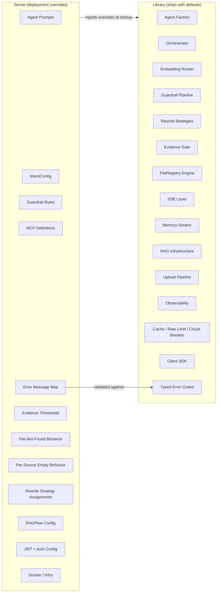
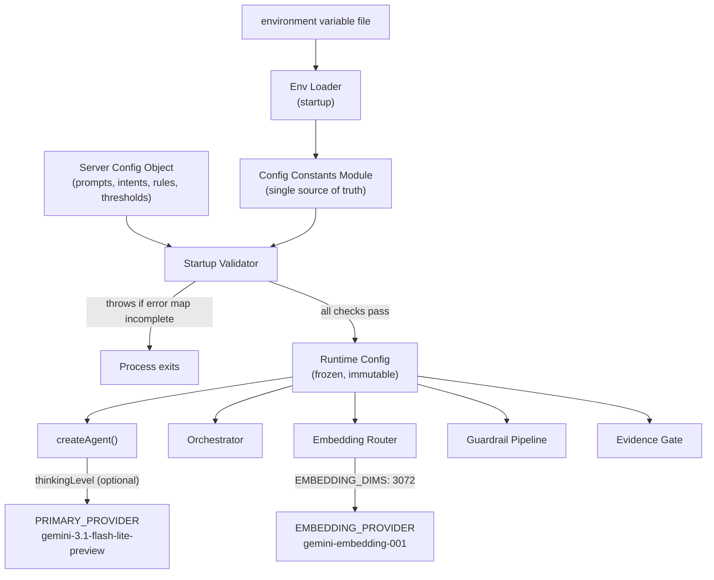
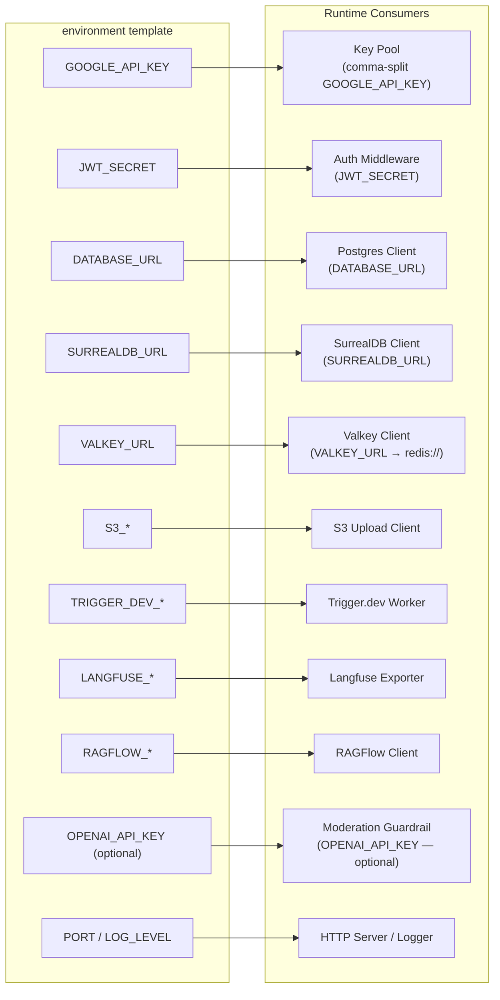
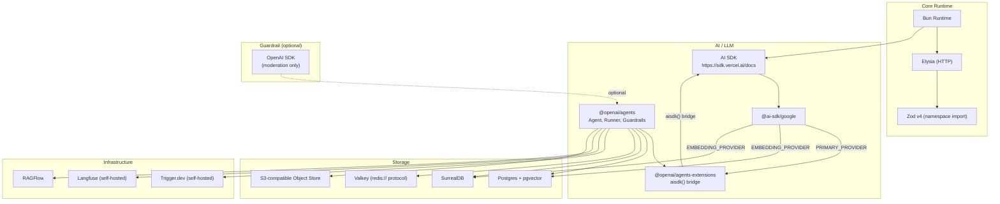

# 02 — Configuration

This document is the **single source of truth** for model configuration, provider settings, environment variables, and configuration patterns across the safeagent system. Every other plan file references the tables here for model/provider/env config. Operational limits (file size caps, TTLs, rate limits) are defined in their respective domain documents (08-Document Processing, 17-Infrastructure, etc.).

---

## Table of Contents

- [Model Configuration Constants](#model-configuration-constants)
- [Thinking Levels](#thinking-levels)
- [Library / Server Responsibility Split](#library-server-responsibility-split)
- [Configuration Flow](#configuration-flow)
- [Environment Variable Flow](#environment-variable-flow)
- [Environment Variables Reference](#environment-variables-reference)
- [Memory Configuration](#memory-configuration)
- [Dependency Graph](#dependency-graph)
- [Dependency Policy](#dependency-policy)

---

## Model Configuration Constants

All LLM and embedding work uses exactly one model family. There is no model-specific branching anywhere in the codebase.

| Constant | Value | Usage |
|---|---|---|
| **PRIMARY_MODEL** | `gemini-3.1-flash-lite-preview` | ALL LLM tasks |
| **PRIMARY_PROVIDER** | Model name string (e.g., `gemini-3.1-flash-lite-preview`) passed to `aisdk(google(PRIMARY_PROVIDER))` | Agent model configuration via aisdk() bridge |
| **EMBEDDING_MODEL** | `gemini-embedding-001` | All vector embeddings |
| **EMBEDDING_PROVIDER** | Google AI SDK text embedding model initialized with the embedding model name | AI SDK embedding call (direct, not via aisdk() bridge) |
| **EMBEDDING_DIMS** | `3072` | PgVector + SurrealDB vector dimensions |
| **KEY_POOL_ENV** | `GOOGLE_API_KEY` (comma-separated) | Single or multi-key pool |

### Key Constraints

- **ONE model for everything.** No conditional logic that selects a different model for a different task. Two exceptions exist: (a) the grounding agent mode uses Google Search grounding (a Gemini-specific feature, not a different model) — this is a capability toggle, not a model branch; (b) the TUI `/model` command allows switching between Gemini models within the same family for development/testing only — this overrides `PRIMARY_MODEL` for the current TUI session but does not constitute model-specific branching (no conditional logic paths per model, no production impact).
 - The direct provider pattern is required everywhere. Provider calls are explicit and type-safe.
- `thinkingLevel` is exposed as an optional field in `createAgent` config. Tasks that don't set it get the model's default behavior.
- No constant from this table may be duplicated or redefined elsewhere. Import from the config module.
- When multiple keys are provided as comma-separated values in `GOOGLE_API_KEY`, the key pool module (see 17-Infrastructure) distributes requests across them via round-robin.

---

## Thinking Levels

Flash Lite's thinking budget is tuned per task type. The default is to let the model decide.

| Task | Level | Rationale |
|---|---|---|
| Default (agents) | none (model default) | Let Flash Lite auto-determine |
| Classifier | minimal | Fast routing |
| Summarization | minimal | Speed over depth |
| Fact extraction | low | Needs some reasoning |
| Grounding agent | none | Factual by nature |
| Intent validation | minimal | Fast classification |
| Query rewriting | low | Needs context understanding |
| Evidence scoring | low | Needs reasoning about sufficiency |

---

## Library / Server Responsibility Split

The library ships with strong defaults. The server overrides only what's deployment-specific. This boundary is strict.

### Library Provides

- Agent creation factory and orchestrator framework
- Embedding router engine and caching logic
- Guardrail pipeline and authoring factories
- Rewrite strategy modules (HyDE, EntityExtraction, DenseKeywords — all importable)
- Source priority execution engine
- Evidence gate with scoring logic
- FileRegistry engine (temporal and ordinal resolution)
- SSE streaming layer
- Memory system (short-term and long-term)
- RAG infrastructure (hybrid search, page_index)
- Upload pipeline
- Observability (Langfuse exporter)
- Cache, rate limiting, circuit breaker
- Client SDK
- TUI testing app
- Typed error codes (all errors are typed, not string messages)
- Strongly typed pipeline interfaces

### Server Provides

- Custom agent prompts
- IntentConfig (intents, topics, example phrases, source priorities, dataset overrides)
- Guardrail rules (detection functions)
- MCP server definitions
- Error message mapping — the server **must** map ALL typed error codes. Validated at startup; throws if incomplete.
- Evidence gate thresholds per topic
- File-not-found behavior per deployment
- Per-source empty-result behavior (normal vs. suspicious)
- Rewrite strategy assignments per source
- RAGFlow credentials and dataset config
- JWT secret and auth config
- Docker and infra configuration

---

## Configuration Flow

How server-level config reaches library internals at runtime.

---

## Environment Variable Flow

---

## Environment Variables Reference

| Variable | Required | Default | Notes |
|---|---|---|---|
| `GOOGLE_API_KEY` | No | — | Comma-separated for key pool rotation. When absent, the server boots but all LLM-dependent endpoints (chat, upload summarization) return 503. Required for any AI functionality. |
| `OPENAI_API_KEY` | No | — | Only for moderation guardrail |
| `JWT_SECRET` | Production: Yes | — | Auth token signing. When absent in non-production, the server boots in dev-bypass mode (all requests treated as a default dev user). When `NODE_ENV=production` and `JWT_SECRET` is absent, the server refuses to start — authentication is a security boundary that fails closed (see [14-Server Implementation](./14-server-implementation.md)). |
| `PORT` | No | `3000` | HTTP server port |
| `DATABASE_URL` | Yes | — | Postgres connection string. The ONLY hard-required env var — server refuses to start without it. |
| `SURREALDB_URL` | No | — | SurrealDB connection string. When absent, long-term memory is disabled; short-term memory still works. |
| `VALKEY_URL` | No | — | Valkey connection (must use `redis://` scheme — ioredis requires it). When absent, falls back to in-memory cache for dev/testing. |
| `S3_ENDPOINT` | No | — | S3-compatible object storage. When absent, file upload is disabled; chat still works. |
| `S3_ACCESS_KEY` | No | — | S3 credentials. Required when `S3_ENDPOINT` is set. |
| `S3_SECRET_KEY` | No | — | S3 credentials. Required when `S3_ENDPOINT` is set. |
| `S3_BUCKET` | No | — | Target bucket name. Required when `S3_ENDPOINT` is set. |
| `TRIGGER_DEV_API_URL` | No | — | Self-hosted Trigger.dev. When absent, background jobs run in-process. |
| `TRIGGER_DEV_API_KEY` | No | — | Project API key (`tr_dev_...`). Required when `TRIGGER_DEV_API_URL` is set. |
| `CORS_ALLOWED_ORIGINS` | No | `*` | Comma-separated allowed origins for CORS |
| `LANGFUSE_PUBLIC_KEY` | No | — | Observability |
| `LANGFUSE_SECRET_KEY` | No | — | Observability |
| `LANGFUSE_BASE_URL` | No | — | Self-hosted Langfuse endpoint |
| `RAGFLOW_BASE_URL` | No | — | RAGFlow API base. When absent, RAGFlow source is disabled in the query pipeline. |
| `RAGFLOW_API_KEY` | No | — | RAGFlow auth. Required when `RAGFLOW_BASE_URL` is set. |
| `RAGFLOW_DATASET_IDS` | No | — | Comma-separated dataset IDs. Required when `RAGFLOW_BASE_URL` is set. |
| `LOG_LEVEL` | No | `info` | LogTape log level (trace, debug, info, warning, error, fatal) |

Langfuse observability is opt-in. If Langfuse keys are absent, observability degrades gracefully to no-op instrumentation.

---

## Memory Configuration

| Config Key | Default | Description |
|------------|---------|-------------|
| `USER_SHORTTERM_LIMIT` | 20 | Maximum cross-thread user messages to load for user short-term layer |
| `USER_SHORTTERM_FADEOUT` | 3 | Thread message count threshold — stop injecting user short-term after this many turns |
| `ROLLING_SUMMARY_MODEL` | Same as PRIMARY_MODEL | Model used for incremental rolling summarization of dropped turns |
| `ROLLING_SUMMARY_MAX_TOKENS` | 2048 | Maximum token budget for rolling summaries before compaction triggers |
| `THREAD_RESURRECTION_GAP` | 604800 | Seconds of thread inactivity before resurrection handling triggers (default 7 days) |
| `CONTEXT_WINDOW_BUDGET` | 120000 | Total token budget for assembled context (system prompt + history + memory + tools) |
| `MAX_RECALL_TOKENS` | 4096 | Maximum tokens for auto-recalled long-term facts |
| `MAX_INPUT_MESSAGE_LENGTH` | 32000 | Maximum character count for a single user chat message |
| `GIBBERISH_CONFIDENCE_THRESHOLD` | 0.3 | eld confidence below this -> message classified as gibberish |
| `EXTRACTION_SAFEGUARDS_ENABLED` | true | Enable attribution, sarcasm, hypothetical, and hallucination filters in fact extraction |
| `RECENCY_BOOST_24H` | 1.5 | Multiplier for memory recall scores on records created within last 24 hours |
| `RECENCY_BOOST_7D` | 1.2 | Multiplier for memory recall scores on records created within last 7 days |
| `RESULT_SET_TTL` | 7 (days) | TTL for structured result sets in Postgres |
| `MEMORY_INSPECTION_ENABLED` | true | Whether memoryInspect and memoryDelete tools are available |
| `INTERACTION_TTL` | 30 (days) | TTL for interaction records in SurrealDB |
| `MEDIA_FACT_TTL` | 30 (days) | TTL for media fact records in SurrealDB |

See [Memory System](./07-memory-system.md) for detailed memory architecture and recall mechanisms.

---

## Dependency Graph

---

## Dependency Policy

- All dependencies use `latest` at install time. No dependency pinning — all at latest.
- Zod v4 uses the namespace import pattern. The default import is not used.
- The runtime is **Bun-only** across library and server code. Promptfoo is an external dev tool that runs in its own process.
- The AI SDK documentation is the canonical reference for **model layer** (providers, `generateText`, `generateObject`, embeddings): [https://sdk.vercel.ai/docs](https://sdk.vercel.ai/docs)
- `@openai/agents` documentation is the canonical reference for **agent orchestration, streaming, guardrails, handoffs, and tracing** patterns: [https://openai.github.io/openai-agents-js/](https://openai.github.io/openai-agents-js/)
- Bun docs are the canonical reference for runtime behavior: [bun.sh/docs](https://bun.sh/docs)

---

*Previous: [01 — System Architecture](./01-system-architecture.md)*
*Next: [03 — Research & Decisions](./03-research-and-decisions.md)*
