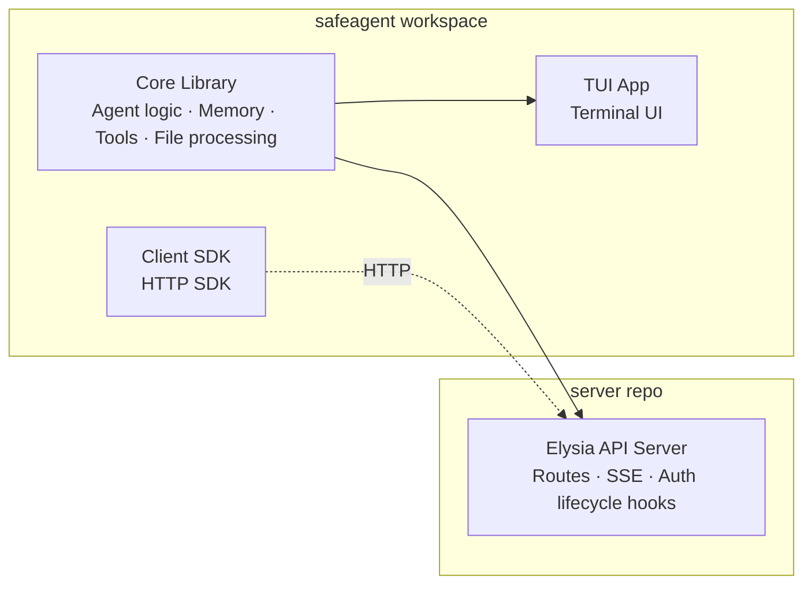
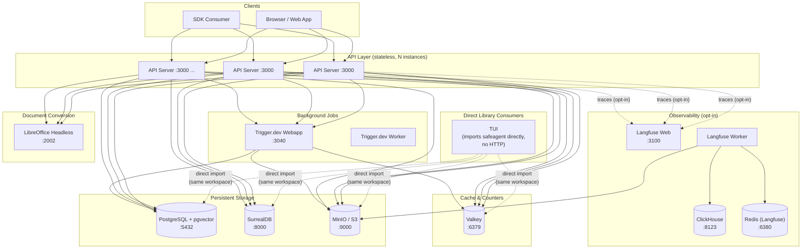
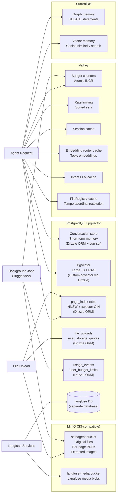
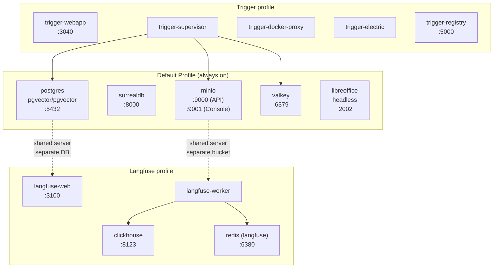
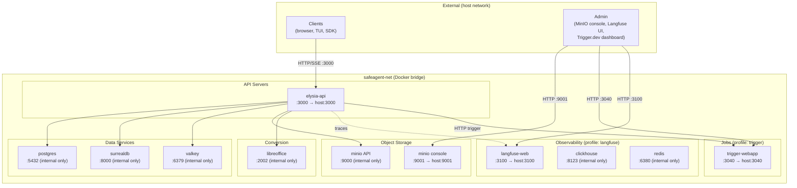
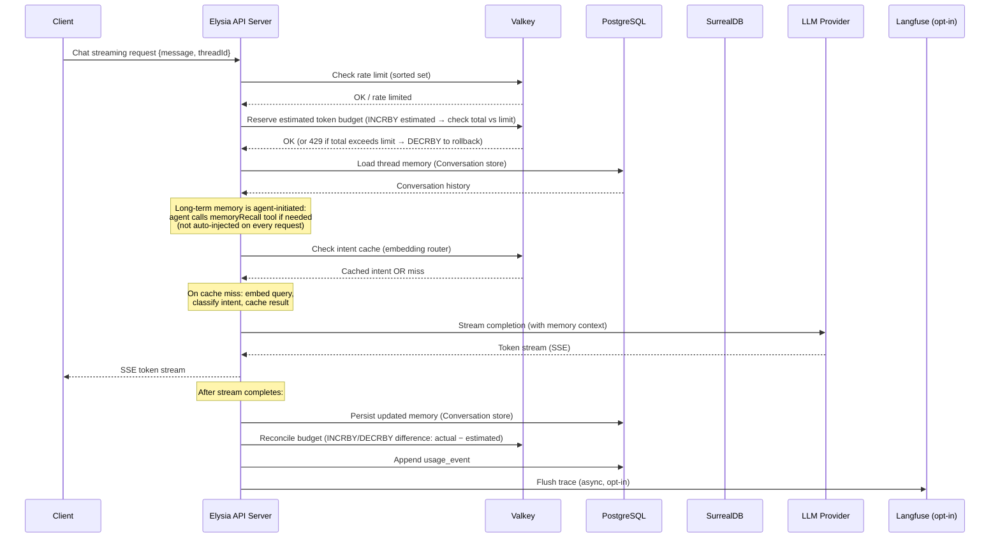
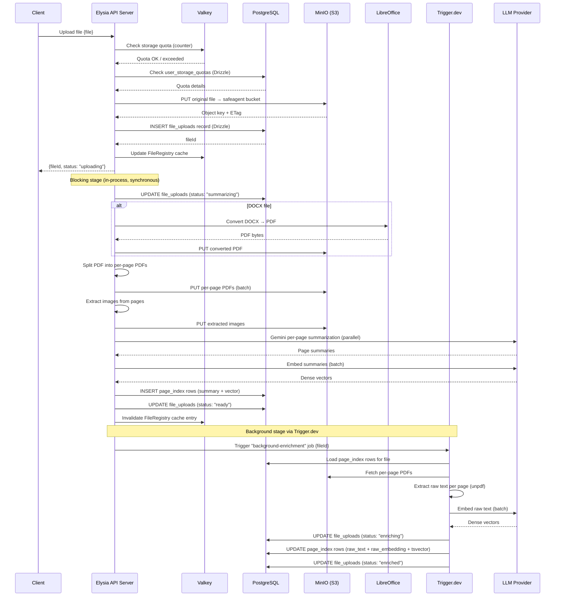
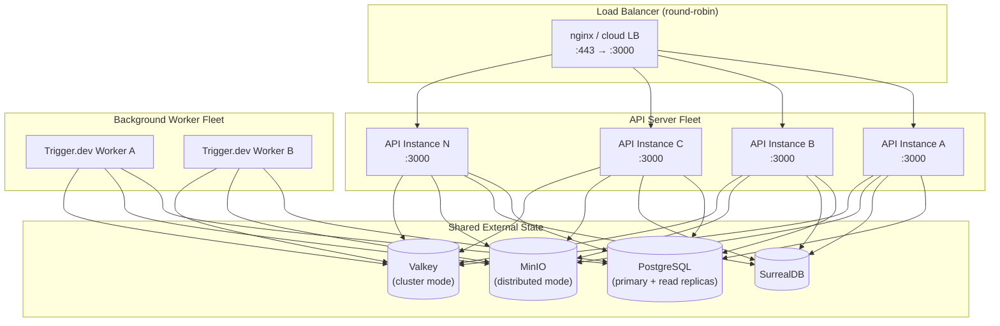
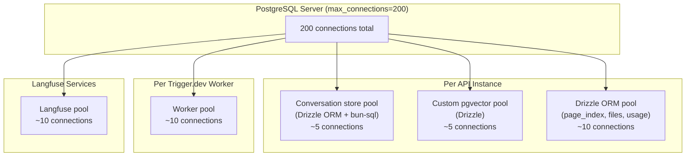

# 03 — System Architecture

> **safeagent** is a multi-tenant AI agent platform built for 10 million users. Every piece of state lives outside the API server. The server itself is stateless, horizontally scalable, and replaceable at any time without data loss.

---

## Table of Contents

- [System Component Boundaries](#system-component-boundaries)
- [Infrastructure Topology](#infrastructure-topology)
- [Storage Architecture](#storage-architecture)
- [Docker Compose Service Map](#docker-compose-service-map)
- [Network Topology](#network-topology)
- [Data Flow: Chat Request](#data-flow-chat-request)
- [Data Flow: File Upload and Processing](#data-flow-file-upload-and-processing)
- [Horizontal Scaling Model](#horizontal-scaling-model)
- [Connection Management](#connection-management)
- [Storage Decision Table](#storage-decision-table)
- [External References](#external-references)

---

## System Component Boundaries

The system is organized into two independently managed codebases that are deployed together: one for reusable agent capabilities and one for HTTP serving.

The shared library codebase contains core agent intelligence: agent definitions built on `@openai/agents` (with Gemini via `aisdk()` bridge), memory adapters, file processing pipelines, budget enforcement, and tool implementations. It also includes a terminal application and a client SDK.

The API-serving codebase remains intentionally thin: it imports the shared library, applies deployment-specific configuration, and exposes capabilities over HTTP via Elysia. This boundary keeps core logic reusable and testable in isolation while keeping transport concerns separate.

---

## Infrastructure Topology

Every service the system depends on is shown below. Arrows indicate the direction of connection initiation (client → server).

---

## Storage Architecture

Each storage system has a specific, non-overlapping responsibility. Nothing is stored in two places unless one is a cache of the other (and the cache is always the secondary source of truth).

### Storage Responsibilities in Detail

**PostgreSQL + pgvector** carries the most diverse workload. It hosts four logically separate concerns under one connection pool:

- **Conversation store** (via Drizzle ORM + bun-sql): stores short-term conversational memory as serialized thread state. Schema ownership is application-managed.
- **Custom pgvector** (via Drizzle): stores dense vector embeddings for large plain-text documents, queried with approximate nearest-neighbor search.
- **`page_index` table** (via Drizzle ORM): stores per-page document chunks with both an HNSW vector index and a tsvector GIN index, enabling hybrid retrieval with Reciprocal Rank Fusion.
- **File metadata tables** (`file_uploads`, `user_storage_quotas`): typed relational records managed by Drizzle ORM.
- **Usage and budget tables** (`usage_events`, `user_budget_limits`): append-only event log plus per-user limit configuration.
- **Langfuse database**: a completely separate Postgres database (same server, different `PGDATABASE`) used exclusively by Langfuse services.

**SurrealDB** runs in server mode (Docker container, WebSocket transport). It stores long-term memory as a graph: entities are nodes, relationships are edges created with `RELATE`. Vector similarity search runs as a sequential scan over stored embeddings — no MTREE index is needed at this scale because the long-term memory corpus per user is bounded.

**MinIO** stores all binary objects. The main `safeagent` bucket holds original uploaded files, per-page PDF splits, and images extracted during document processing. A separate `langfuse-media` bucket holds Langfuse's media attachments. Presigned URLs with a 7-day TTL serve images directly to clients without proxying through the API server.

**Valkey** handles everything that needs sub-millisecond latency and atomic operations. Budget counters use `INCR` for lock-free increment. Rate limiting uses sorted sets with sliding windows. The embedding router caches topic embeddings so intent classification doesn't re-embed on every request. FileRegistry caches temporal and ordinal file references (e.g., "the file I uploaded yesterday") with Postgres as the authoritative source of truth. Location enrichment caches geocoding and optional image lookups so repeated place mentions do not re-hit external providers.

---

## Docker Compose Service Map

Services are grouped into runtime profiles. The default profile starts the recommended local development stack. Only Postgres is strictly required to boot — all other services degrade gracefully when absent (see [15 — Infrastructure & Operations](./15-infrastructure.md) for the degradation model). Optional profiles add observability and background job infrastructure.

### Profile Details

**Default profile** starts five services:

| Service | Image | Purpose |
|---------|-------|---------|
| `postgres` | `pgvector/pgvector` | All relational data + vector indexes |
| `surrealdb` | Official SurrealDB | Long-term graph + vector memory |
| `minio` | Official MinIO | Object storage for files and media |
| `valkey` | Official Valkey | Cache, counters, rate limiting |
| `libreoffice` | Headless LibreOffice | DOCX-to-PDF conversion |

### Core Constants

All model, provider, and environment constants are defined in the single source of truth: [04 — Foundation](./04-foundation.md). No constants are duplicated here — refer to file 04 for the authoritative table.

**Trigger profile** adds Trigger.dev's self-hosted stack (five services). The webapp provides the dashboard and HTTP API. The supervisor orchestrates task execution via the docker proxy. Electric handles real-time event streaming from Postgres. A local registry hosts task container images. All services connect to the default-profile Postgres and Valkey instances. See [15 — Infrastructure & Operations](./15-infrastructure.md) for the complete service list.

**Langfuse profile** adds six services for full agent observability. Langfuse Web and Worker share the Postgres server (using a separate `langfuse` database) and the MinIO server (using a separate `langfuse-media` bucket). ClickHouse stores trace event data. A dedicated Redis instance (on port 6380 to avoid collision with Valkey on 6379) handles Langfuse's internal queue.

---

## Network Topology

All services communicate over a single Docker bridge network (`safeagent-net`). External access is limited to the API server port and the MinIO console.

### Port Reference

| Port | Service | Exposure | Protocol |
|------|---------|---------|---------|
| 3000 | Elysia API | Public | HTTP / SSE |
| 5432 | PostgreSQL | Internal | TCP (Postgres wire) |
| 8000 | SurrealDB | Internal | WebSocket |
| 9000 | MinIO API | Internal | HTTP (S3) |
| 9001 | MinIO Console | Admin | HTTP |
| 6379 | Valkey | Internal | RESP (Redis protocol) |
| 2002 | LibreOffice | Internal | HTTP |
| 3040 | Trigger.dev | Admin | HTTP |
| 3100 | Langfuse Web | Admin | HTTP |
| 8123 | ClickHouse | Internal | HTTP |
| 6380 | Redis (Langfuse) | Internal | RESP |

---

## Data Flow: Chat Request

A typical chat message travels through several layers before the agent responds. SSE keeps the connection open for streaming tokens.

The critical path (rate check → budget check → memory load → LLM stream) is kept as short as possible. Memory persistence and usage accounting happen after the stream completes so they don't add latency to the user-facing response.

---

## Data Flow: File Upload and Processing

File processing is split into a synchronous upload phase (fast, user-facing) and an asynchronous enrichment phase (background, Trigger.dev).

The synchronous path (upload → S3 → metadata record) completes in under a second. The enrichment pipeline (conversion → splitting → embedding → indexing) runs in the background and can take seconds to minutes depending on file size. The client polls the file status endpoint when processing completes.

---

## Horizontal Scaling Model

The API server is stateless. Every instance connects to the same external services. A standard round-robin load balancer distributes traffic without sticky sessions.

### Scaling Properties

**API servers** scale horizontally with no coordination. Because SSE streams are request-scoped (not persistent WebSockets), any instance can handle any request. If an instance dies mid-stream, the client reconnects and the next instance picks up from the last persisted memory state.

**PostgreSQL** scales reads with read replicas. Write traffic (memory persistence, usage events) goes to the primary. The connection pool budget (200 max connections) is divided across all API instances — adding instances requires either reducing per-instance pool size or adding a connection pooler like PgBouncer in front. At 10M-user scale, high-write tables (`page_index`, `file_uploads`, `usage_events`) should be range-partitioned by `user_id` hash to distribute write I/O and keep individual partition indexes manageable. Drizzle ORM supports partitioned tables via raw DDL migrations — the application query layer remains unchanged because all queries already include `user_id` in their WHERE clauses, which enables partition pruning automatically.

**SurrealDB** scales vertically in the initial deployment. At 10M users, the long-term memory corpus is bounded per user (hundreds to low thousands of facts), so total storage grows linearly (~1KB per fact × ~500 average facts × 10M users = ~5TB). SurrealDB's TiKV-backed distributed mode handles this range, but the deployment topology (replica count, region placement, failover) is environment-specific. Sequential scan for vector similarity remains viable because queries are always scoped to a single userId partition.

**MinIO** runs in distributed mode across multiple nodes for production, providing both redundancy and throughput scaling. Object keys use a userId-prefixed hierarchy, which can create hot prefixes if a small number of users dominate upload volume. MinIO's erasure-coding distributes data across drives regardless of key prefix, so this is a monitoring concern (watch per-drive I/O balance) rather than an architectural one. If prefix hotspotting is observed, a hash-prefix scheme (first N characters of a userId hash prepended to the key) distributes requests across the internal keyspace more evenly.

**Valkey** runs in cluster mode for production, sharding keys across nodes. Budget counters and rate limiting use hash tags to ensure related keys land on the same shard. At 10M users, baseline memory is approximately ~600 bytes per active user (rate-limit sorted set + budget counters), totaling ~6GB for the full user base if all users are concurrently active. In practice, concurrent active users are a fraction of total users — a 1% daily active rate means ~60MB of hot state. The embedding router cache (~300KB for 75 topic embeddings), FileRegistry cache, and geocoding cache add workload-dependent memory that should be monitored and budgeted separately. Valkey's `maxmemory-policy allkeys-lru` ensures graceful eviction of cold entries under memory pressure.

**Trigger.dev workers** scale independently of API servers. More workers means more parallel background jobs without affecting API latency.

---

## Connection Management

All database clients share a single Postgres server with a hard limit of 200 connections. This budget must be divided carefully across all consumers.

### Connection Budget Strategy

Each API instance uses three separate connection pools targeting the same Postgres server:

- **Conversation store pool**: application-managed memory storage. Short-lived queries, low concurrency.
- **Custom pgvector pool**: RAG embedding queries. Moderate concurrency during file processing.
- **Drizzle ORM pool**: All schema-managed tables. Highest concurrency — file metadata, usage events, page index queries all go here.

The total per-instance connection count must stay low enough that `N instances × connections_per_instance + worker_connections + langfuse_connections < max_connections`. At 10 API instances with 20 connections each, that's 200 connections consumed by API alone — zero headroom for workers or Langfuse. **PgBouncer (or equivalent connection pooler) is required in any deployment beyond single-instance development** (see [15 — Infrastructure & Operations § Postgres at Scale](./15-infrastructure.md#postgres-at-scale)). PgBouncer multiplexes hundreds of application connections onto a smaller pool of actual Postgres connections, eliminating the per-instance pool sizing constraint entirely. The `max_connections=200` value in Docker Compose is a local development default — production Postgres behind PgBouncer can serve thousands of application-side connections.

**SurrealDB** uses a persistent WebSocket connection per API instance. The TypeScript SDK manages reconnection automatically.

**Valkey** uses `ioredis` with a connection URL in `redis://` scheme (not `valkey://` — the Redis protocol is identical, but the URL scheme must match what `ioredis` expects). A single client instance per API process handles all Valkey operations.

**MinIO** connections are stateless HTTP requests via `Bun.S3Client`. No persistent connection pool needed — each request opens and closes independently.

---

## Storage Decision Table

| Concern | Storage | Reason |
|---------|---------|--------|
| Short-term memory | Postgres (Conversation store) | Application-managed via Drizzle, thread-scoped |
| Long-term memory | SurrealDB | Graph relationships + vector similarity in one store |
| Per-page doc search | Postgres (Drizzle `page_index` + pgvector + tsvector) | Hybrid RRF combining dense and sparse retrieval |
| Large TXT RAG | Custom pgvector (Drizzle) | Custom text chunking pipeline, application-managed |
| Original files | S3 via `Bun.S3Client` | Scalable object storage, presigned URL delivery |
| File metadata + quotas | Postgres (Drizzle ORM) | Type-safe relational schema, quota enforcement |
| Background jobs | Trigger.dev (self-hosted) | Containerized tasks, retries, dashboard, HTTP trigger |
| Real-time cache + counters | Valkey | Sub-millisecond budget counters, atomic INCR, rate limits |
| Embedding router cache | Valkey | Cached topic embeddings for fast intent classification |
| FileRegistry cache | Valkey (+ Postgres source of truth) | Fast temporal/ordinal file reference resolution |
| Observability traces | Langfuse (ClickHouse + Postgres + Redis) | Full agent tracing with structured span data |

---

## External References

- [OpenAI Agents SDK documentation](https://openai.github.io/openai-agents-js/)
- [AI SDK documentation (model layer)](https://sdk.vercel.ai/docs)
- [Elysia documentation](https://elysiajs.com)
- [SurrealDB documentation](https://surrealdb.com/docs)
- [Trigger.dev documentation](https://trigger.dev/docs)
- [Langfuse documentation](https://langfuse.com/docs)
- [Valkey documentation](https://valkey.io/docs)
- [MinIO documentation](https://min.io/docs)
- [Drizzle ORM documentation](https://orm.drizzle.team/docs)
- [Bun documentation](https://bun.sh/docs)

---

*Previous: [02 — Research & Decisions](./02-research.md) | Next: [04 — Foundation](./04-foundation.md)*
