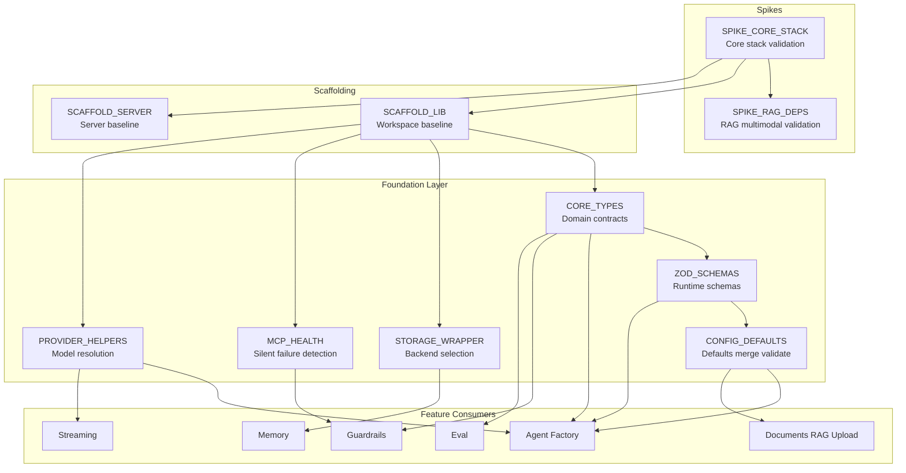
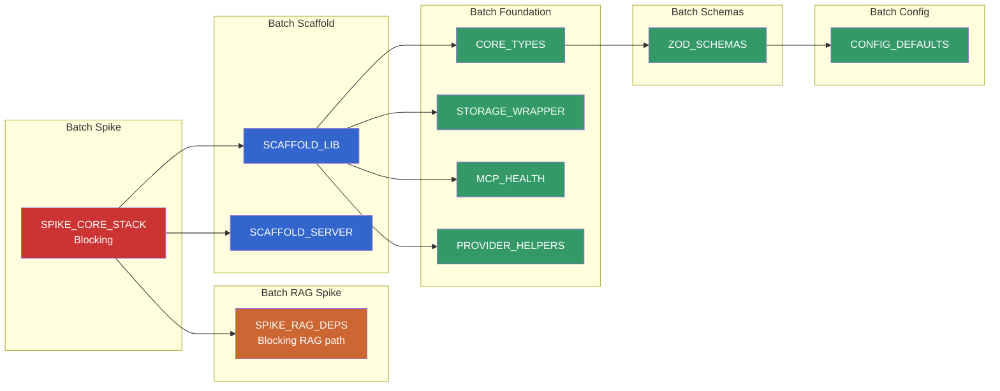
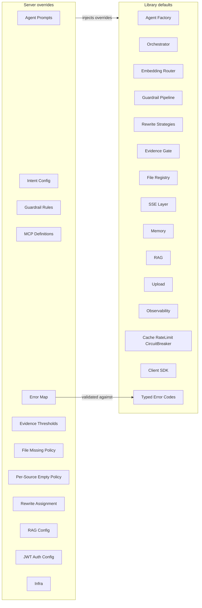
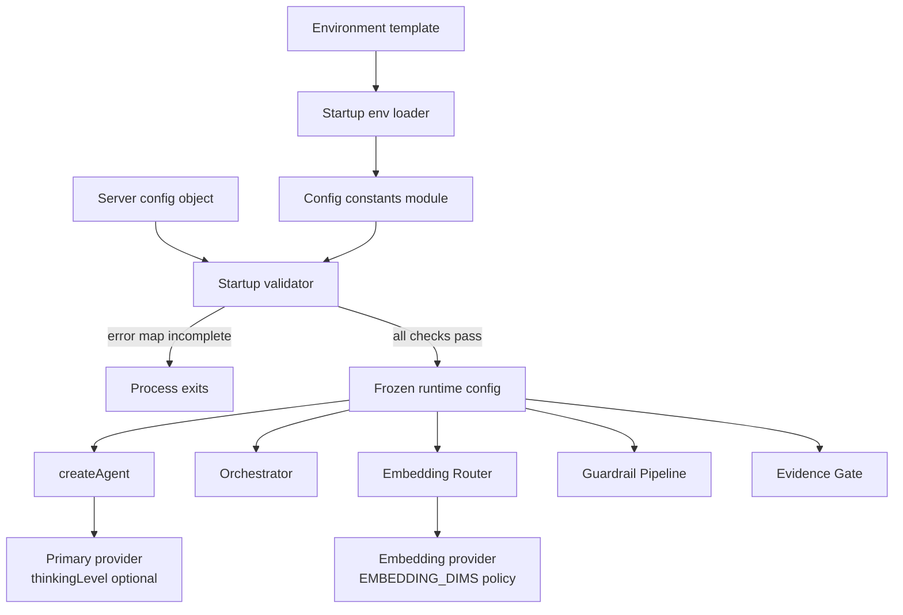
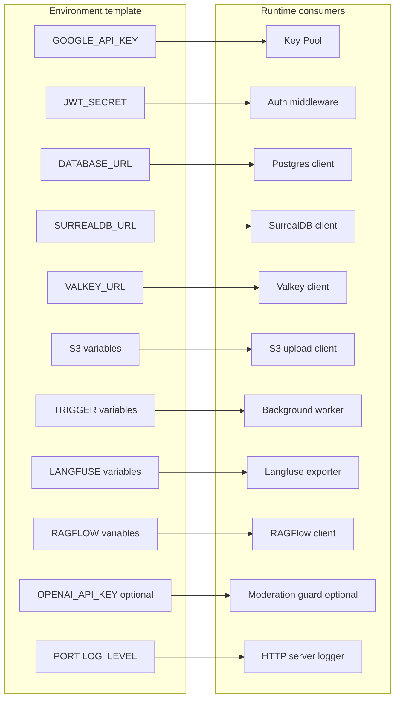
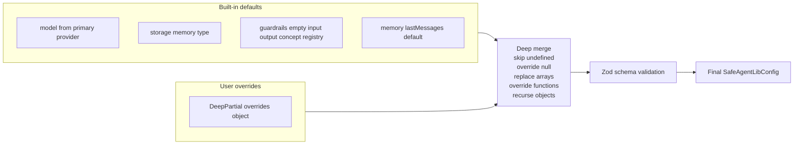
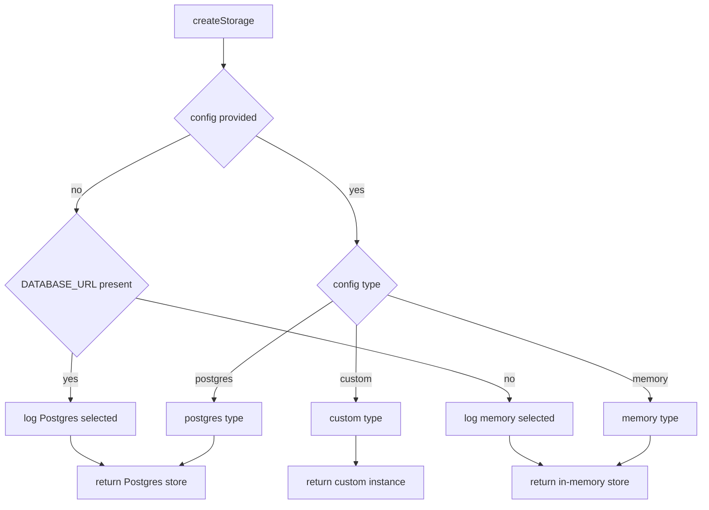
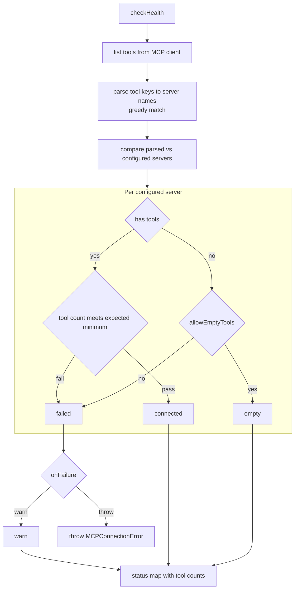
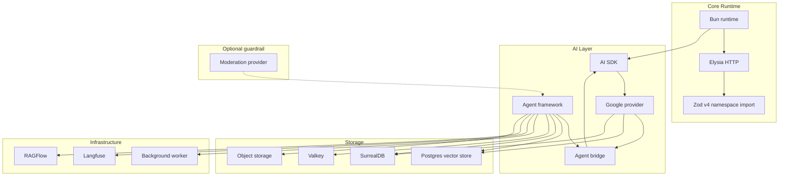

# 04 — Foundation

This document unifies foundation concerns previously split between configuration and types, defining baseline contracts and runtime guarantees that every higher layer depends on.
It is the single source of truth for type contracts, schema validation, environment flow, model constants, storage selection, MCP health, provider resolution, and memory safeguard typing.

---

## Table of Contents

- [Foundation Scope](#foundation-scope)
- [Architecture Overview](#architecture-overview)
- [Dependency Chain](#dependency-chain)
- [Model Configuration Constants](#model-configuration-constants)
- [Thinking Levels](#thinking-levels)
- [Library and Server Responsibility Split](#library-and-server-responsibility-split)
- [Configuration Flow](#configuration-flow)
- [Environment Variable Flow](#environment-variable-flow)
- [Environment Variables Reference](#environment-variables-reference)
- [Core Type System](#core-type-system)
- [Domain Type Contracts](#domain-type-contracts)
- [Memory and Extraction Safeguard Types](#memory-and-extraction-safeguard-types)
- [Zod Schemas](#zod-schemas)
- [Configuration System](#configuration-system)
- [Storage Factory](#storage-factory)
- [MCP Health Check](#mcp-health-check)
- [Provider Resolution](#provider-resolution)
- [Guardrail Safety Dependencies](#guardrail-safety-dependencies)
- [Foundation Dependency Graph](#foundation-dependency-graph)
- [Dependency Policy](#dependency-policy)
- [Core Stack Validation Spike](#core-stack-validation-spike)
- [RAG and Multimodal Dependency Spike](#rag-and-multimodal-dependency-spike)
- [Repository Foundation](#repository-foundation)
- [Subpath Barrel Export Convention](#subpath-barrel-export-convention)
- [Task Specifications](#task-specifications)
- [Cross-References](#cross-references)

---

## Foundation Scope
The foundation layer is a strict dependency stack.
Every module above it imports from these foundational pieces.
No foundation module imports feature-layer code.

Foundation responsibilities:

- Define canonical type shapes for agents, guardrails, memory, files, RAG, streaming, eval, storage, queueing, budget, and supporting contracts.
- Enforce runtime shape guarantees with Zod v4 schemas.
- Merge defaults with user overrides via deep-merge rules.
- Validate server and library runtime configuration boundaries.
- Define model constants and thinking-level policy.
- Define startup environment behavior, including mandatory production auth fail-closed behavior.
- Select storage backend through explicit and auto-detected factory behavior.
- Detect silent MCP server failures.
- Resolve provider model configuration and fallback behavior.

---

## Architecture Overview

---

## Dependency Chain

Execution constraints:

- Core stack spike is the highest-priority blocker.
- RAG dependency spike must pass before document/RAG path implementation.
- Library and server scaffolds run in parallel once spike gates pass.
- Core types gate schemas.
- Schemas gate config defaults.

---

## Model Configuration Constants

All LLM and embedding work uses one model family policy.
No model-specific branching in production logic.

| Constant | Value | Usage |
|---|---|---|
| PRIMARY_MODEL | Canonical flash-lite preview model | All LLM tasks |
| PRIMARY_PROVIDER | Model name string routed through AI SDK provider bridge | Agent model configuration |
| EMBEDDING_MODEL | Canonical embedding model | All embeddings |
| EMBEDDING_PROVIDER | Google text embedding provider initialized with embedding model name | Embedding calls |
| EMBEDDING_DIMS | 3072 | Vector dimensions |
| KEY_POOL_ENV | GOOGLE_API_KEY comma-separated | Key rotation pool |

Policy notes:

- One model policy applies across tasks.
- Grounding mode is a capability toggle, not a model branch.
- Terminal session model switching is development/testing only.
- thinkingLevel remains optional in createAgent configuration.
- Constants are not duplicated outside config source.
- Multi-key values rotate through round-robin pool logic.

---

## Thinking Levels

| Task | Level | Rationale |
|---|---|---|
| Default agent path | none | Model default behavior |
| Classifier | minimal | Fast routing |
| Summarization | minimal | Speed over depth |
| Fact extraction | low | Some reasoning needed |
| Grounding agent | none | Retrieval-focused |
| Intent validation | minimal | Fast classification |
| Query rewriting | low | Context reasoning |
| Evidence scoring | low | Sufficiency reasoning |

---

## Library and Server Responsibility Split

The library ships defaults and stable interfaces.
The server injects deployment-specific behavior.

### Library provides

- Agent factory and orchestration framework.
- Embedding router and cache logic.
- Guardrail pipeline and factories.
- Rewrite strategy modules.
- Source-priority execution engine.
- Evidence scoring gate.
- File registry with temporal and ordinal resolution.
- Streaming layer.
- Memory system.
- RAG infrastructure.
- Upload pipeline.
- Observability integration.
- Cache, rate limit, and circuit breaker primitives.
- Client SDK contracts.
- Terminal testing app.
- Typed error code system.
- Typed pipeline interfaces.

### Server provides

- Custom prompts.
- Intent configuration and topic/source policy.
- Guardrail detection rules.
- MCP server definitions.
- Error-message mapping for every typed error code.
- Evidence thresholds.
- File-not-found policy.
- Per-source empty-result policy.
- Rewrite strategy assignments.
- RAG credentials and dataset configuration.
- Auth secret and auth config.
- Deployment infrastructure configuration.

---

## Configuration Flow

---

## Environment Variable Flow

---

## Environment Variables Reference

| Variable | Required | Default | Notes |
|---|---|---|---|
| GOOGLE_API_KEY | No | none | Comma-separated pool. Server boots without it, but AI endpoints return unavailable responses. |
| OPENAI_API_KEY | No | none | Moderation guardrail only. |
| JWT_SECRET | Production yes | none | Missing in production refuses startup. Missing in non-production enables dev bypass path. |
| PORT | No | 3000 | Server port. |
| DATABASE_URL | Yes | none | Hard-required startup dependency. |
| SURREALDB_URL | No | none | Missing disables long-term memory only. |
| VALKEY_URL | No | none | Missing falls back to in-memory cache path. Uses redis URI scheme. |
| S3_ENDPOINT | No | none | Missing disables upload path. |
| S3_ACCESS_KEY | No | none | Required when endpoint is set. |
| S3_SECRET_KEY | No | none | Required when endpoint is set. |
| S3_BUCKET | No | none | Required when endpoint is set. |
| TRIGGER_DEV_API_URL | No | none | Missing runs jobs in-process. |
| TRIGGER_DEV_API_KEY | No | none | Required when worker API URL is set. |
| CORS_ALLOWED_ORIGINS | No | wildcard | Comma-separated origins. |
| LANGFUSE_PUBLIC_KEY | No | none | Observability key. |
| LANGFUSE_SECRET_KEY | No | none | Observability key. |
| LANGFUSE_BASE_URL | No | none | Observability endpoint. |
| RAGFLOW_BASE_URL | No | none | Missing disables RAGFlow source path. |
| RAGFLOW_API_KEY | No | none | Required with RAGFlow base URL. |
| RAGFLOW_DATASET_IDS | No | none | Required with RAGFlow base URL. |
| LOG_LEVEL | No | info | Runtime logging level. |

Auth hard-fail rule:

- NODE_ENV production with missing JWT_SECRET must refuse startup.
- This is a fail-closed security boundary, not a warning path.

---

## Core Type System

The core type system defines canonical contracts used across the system.
Type domains are pure contract definitions.
Runtime schema validation lives in Zod schemas.

```mermaid
flowchart TB
    subgraph AGENT_DOMAIN["Agent Domain"]
        SAFE_AGENT_CONFIG["SafeAgentConfig"]; AGENT_MODE["AgentMode"]; GROUNDING_MODE["GroundingMode"]; AGENT_RESPONSE["AgentResponse"]; STREAM_CHUNK["StreamChunk"]; PARALLEL_GROUNDING_RESULT["ParallelGroundingResult"]
    end
    subgraph GUARDRAIL_DOMAIN["Guardrail Domain"]
        GUARDRAIL_SEVERITY["GuardrailSeverity"]; GUARDRAIL_VERDICT["GuardrailVerdict"]; GUARDRAIL_FN["GuardrailFn"]; CONCEPT_CONFIG["ConceptConfig"]; CONCEPT_REGISTRY["ConceptRegistry"]; GUARDRAIL_PIPELINE_CONFIG["GuardrailPipelineConfig"]; GUARDRAIL_FLAG["GuardrailFlag"]; AGGREGATED_VERDICT["AggregatedVerdict"]; GUARD_MODE["GuardMode"]; LANGUAGE_GUARD_CONFIG["LanguageGuardConfig"]; HATE_SPEECH_GUARD_CONFIG["HateSpeechGuardConfig"]; INTENT_LANGUAGE_FIELDS["IntentLanguageFields"]
    end
    subgraph MCP_DOMAIN["MCP Domain"]
        MCP_SERVER_CONFIG["MCPServerConfig"]; MCP_CLIENT_CONFIG["MCPClientConfig"]
    end
    subgraph CONFIG_DOMAIN["Config Domain"]
        SAFE_AGENT_LIB_CONFIG["SafeAgentLibConfig"]; DEEP_PARTIAL["DeepPartial"]
    end
    subgraph STORAGE_DOMAIN["Storage Domain"]
        STORAGE_CONFIG["StorageConfig"]
    end
    subgraph MEMORY_DOMAIN["Memory Domain"]
        MEMORY_CONFIG["MemoryConfig"]
    end
    subgraph STREAM_DOMAIN["Stream Domain"]
        STREAM_CONFIG["StreamConfig"]; SSE_CONFIG["SSEConfig"]; STREAM_REQUEST_BODY["StreamRequestBody"]; SESSION_META_DELIVERY["SessionMetaDelivery"]
    end
    subgraph SSE_EVENTS_DOMAIN["SSE Events Domain"]
        SSE_TEXT_DELTA_EVENT["SSETextDeltaEvent"]; SSE_SESSION_META_EVENT["SSESessionMetaEvent"]; SSE_TRACE_STEP_EVENT["SSETraceStepEvent"]; SSE_CTA_EVENT["SSECTAEvent"]; SSE_CITATION_EVENT["SSECitationEvent"]; SSE_LOCATION_EVENT["SSELocationEvent"]; SSE_TRIPWIRE_EVENT["SSETripwireEvent"]; SSE_DONE_EVENT["SSEDoneEvent"]; SSE_ERROR_EVENT["SSEErrorEvent"]; TRACE_STEP_TYPE["TraceStepType"]; TRACE_STEP_DATA["TraceStepData"]
    end
    subgraph UPLOAD_DOMAIN["Upload Domain"]
        DIRECT_FILE_CONTEXT["DirectFileContext"]; UPLOAD_CONFIG["UploadConfig"]; UPLOAD_RESULT["UploadResult"]; FILE_RESULT["FileResult"]; BLOCKING_STAGE_CONFIG["BlockingStageConfig"]; DOCUMENT_PROCESSING_MODE["DocumentProcessingMode"]
    end
    subgraph DOCUMENTS_DOMAIN["Documents Domain"]
        PROCESSED_DOCUMENT["ProcessedDocument"]; PAGE_SPLIT["PageSplit"]; PAGE_SUMMARY_RESULT["PageSummaryResult"]; PAGE_SUMMARY["PageSummary"]; SUMMARIZATION_CONFIG["SummarizationConfig"]; IMAGE_DESCRIPTION["ImageDescription"]; EXTRACTED_RASTER_IMAGE["ExtractedRasterImage"]; PAGE_IMAGE["PageImage"]; IMAGE_EXTRACTION_RESULT["ImageExtractionResult"]
    end
    subgraph RAG_DOMAIN["RAG Domain"]
        HYBRID_RESULT["HybridResult"]; QUERY_TOOL_CONFIG["QueryToolConfig"]; CHUNK_CONFIG["ChunkConfig"]; RAG_RESULT["RAGResult"]; CITATION["Citation"]; DOCUMENT_ANSWER["DocumentAnswer"]
    end
    subgraph FILES_DOMAIN["Files Domain"]
        FILE_STORAGE["FileStorage"]; S3_CONFIG["S3Config"]; CLEANUP_DEPS["CleanupDeps"]; CLEANUP_RESULT["CleanupResult"]
    end
    subgraph EVAL_DOMAIN["Eval Domain"]
        EVAL_CONFIG["EvalConfig"]; SCORER_CONFIG["ScorerConfig"]; PROMPTFOO_CONFIG["PromptfooConfig"]
    end
    subgraph MODEL_DOMAIN["Model Domain"]
        MODEL_CONFIG["ModelConfig"]; FALLBACK_MODEL_CONFIG["FallbackModelConfig"]
    end
    subgraph LLM_DOMAIN["LLM Domain"]
        KEY_POOL_CONFIG["KeyPoolConfig"]; KEY_POOL["KeyPool"]
    end
    subgraph CACHE_DOMAIN["Cache Domain"]
        CACHE_CONFIG["CacheConfig"]; CACHE["Cache"]
    end
    subgraph LOCATION_DOMAIN["Location Domain"]
        LOCATION_TOOL_CONFIG["LocationToolConfig"]; GEOCODE_PROVIDER["GeocodeProvider"]; IMAGE_SEARCH_PROVIDER["ImageSearchProvider"]; IMAGE_RESULT["ImageResult"]; LOCATION_RESULT["LocationResult"]
    end
    subgraph QUEUE_DOMAIN["Queue Domain"]
        TASK_PAYLOAD["TaskPayload"]; BACKGROUND_STAGE_PAYLOAD["BackgroundStagePayload"]; BUDGET_AGGREGATION_PAYLOAD["BudgetAggregationPayload"]; CLEANUP_PAYLOAD["CleanupPayload"]; QUEUE_ADAPTER["QueueAdapter"]
    end
    subgraph BUDGET_DOMAIN["Budget Domain"]
        USAGE_EVENT["UsageEvent"]; BUDGET_CONFIG["BudgetConfig"]; BUDGET_CHECK_RESULT["BudgetCheckResult"]
    end
    SAFE_AGENT_CONFIG -.-> GUARD_MODE; SAFE_AGENT_CONFIG -.-> GUARDRAIL_PIPELINE_CONFIG; SAFE_AGENT_CONFIG -.-> MCP_CLIENT_CONFIG; SAFE_AGENT_CONFIG -.-> INTENT_LANGUAGE_FIELDS; SAFE_AGENT_CONFIG -.-> LOCATION_TOOL_CONFIG
    GUARDRAIL_PIPELINE_CONFIG -.-> GUARDRAIL_FN; GUARDRAIL_PIPELINE_CONFIG -.-> CONCEPT_REGISTRY; GUARDRAIL_PIPELINE_CONFIG -.-> GUARD_MODE; GUARDRAIL_PIPELINE_CONFIG -.-> LANGUAGE_GUARD_CONFIG; GUARDRAIL_PIPELINE_CONFIG -.-> HATE_SPEECH_GUARD_CONFIG
    MEMORY_CONFIG -.-> STORAGE_CONFIG; UPLOAD_CONFIG -.-> KEY_POOL
    LOCATION_TOOL_CONFIG -.-> GEOCODE_PROVIDER; LOCATION_TOOL_CONFIG -.-> IMAGE_SEARCH_PROVIDER; IMAGE_SEARCH_PROVIDER -.-> IMAGE_RESULT; LOCATION_RESULT -.-> IMAGE_RESULT
```

---

## Domain Type Contracts

Foundation contracts cover agent, guardrail, MCP, config, storage, memory, stream, SSE events (including trace-step events for pipeline visibility), upload, documents, RAG, files, eval, model, key-pool, cache, location, queue, budget, and memory-support types (temporal references, preference updates, memory control actions, interaction signals, and media facts).
SSE event types — including SSETraceStepEvent, TraceStepType, and TraceStepData — are defined in the core library and consumed by `@safeagent/client`, `@safeagent/react`, and frontend component packages. TraceStepType is a discriminated union covering intent-detected, memory-recall, guardrail-input, guardrail-output, retrieval, tool-call-start, tool-call-end, context-budget, source-fetch, and rewrite steps. TraceStepData is a corresponding discriminated union where each step type carries step-specific payload fields plus a common `latencyMs` timing field. See [11 — Streaming & Transport](./11-transport.md) for the full SSE event protocol.
GuardMode is canonical in guardrail contracts and resolves by precedence: pipeline override, then agent override, then development default.
RAG contracts include StructuredResultSet and ResultItem for persisted ranked outputs.
File contracts include FileRecord lifecycle metadata.
Eval contracts include SelfTestConfig and SelfTestResult.
Fact records include factType with values preference, attribute, derived, behavioral, and sentiment.
The error code system exports both a runtime-enumerable object and a compile-time union for startup message-map coverage validation.

---

## Memory and Extraction Safeguard Types

Memory behavior combines context assembly, extraction safeguards, and budget controls.

Memory configuration keys:

| Key | Default | Description |
|---|---|---|
| USER_SHORTTERM_LIMIT | 20 | Maximum cross-thread user messages loaded |
| USER_SHORTTERM_FADEOUT | 3 | Turn threshold after which user short-term injection stops |
| ROLLING_SUMMARY_MODEL | primary model | Model for incremental dropped-turn summarization |
| ROLLING_SUMMARY_MAX_TOKENS | 2048 | Max rolling summary token budget |
| THREAD_RESURRECTION_GAP | 604800 | Dormancy threshold before resurrection handling |
| CONTEXT_WINDOW_BUDGET | 120000 | Total assembled context budget |
| MAX_RECALL_TOKENS | 4096 | Long-term recall token cap |
| MAX_INPUT_MESSAGE_LENGTH | 32000 | Input message character cap |
| GIBBERISH_CONFIDENCE_THRESHOLD | 0.3 | Language detector confidence threshold |
| EXTRACTION_SAFEGUARDS_ENABLED | true | Enable extraction safeguards |
| RECENCY_BOOST_24H | 1.5 | Recall score multiplier within last day |
| RECENCY_BOOST_7D | 1.2 | Recall score multiplier within last week |
| RESULT_SET_TTL | 7 days | Structured result retention |
| MEMORY_INSPECTION_ENABLED | true | Enable memory inspect and delete tooling |
| INTERACTION_TTL | 30 days | Interaction signal retention |
| MEDIA_FACT_TTL | 30 days | Media fact retention |

Extraction safeguard types:

- FactAttribution captures self, third-party, or general targeting.
- FactCertainty captures stated, hypothetical, or asked certainty.
- ExtractionSafeguardConfig enables sarcasm, attribution, hypothetical, and hallucination prevention controls.
- ContextBudgetConfig defines context, recall, and summary budgets.
- ThreadResurrectionConfig defines inactivity threshold and rehydration behavior.

Memory context layers:

- ThreadShortTermContext includes thread identity, last turns, rolling summary text.
- UserShortTermContext includes user identity, cross-thread messages, and active flag.
- CombinedMemoryContext merges thread short-term, optional user short-term, and long-term recall.

Memory deep-dive is in [07 — Memory & Intelligence](./07-memory.md).

---

## Zod Schemas

Schema layer mirrors type layer and enforces runtime validity.

Zod schema rules:

- Zod v4 namespace import pattern is required.
- One-argument record form is not used.
- deepPartial helper is not used; optionality is explicit.
- Function fields and provider instances use broad schema acceptance plus runtime guards.

Key schemas:

- SafeAgentConfigSchema.
- GuardrailSeveritySchema.
- GuardrailVerdictSchema.
- ConceptRegistrySchema.
- GuardrailPipelineConfigSchema.
- MCPServerConfigSchema.
- StorageConfigSchema.
- MemoryConfigSchema.
- ModelConfigSchema.
- EvalConfigSchema.
- SSETraceStepEventSchema (discriminated by step field, used by `@safeagent/client` for runtime event parsing).
- VerbosityLevelSchema (standard or full, used by server route to configure stream handler).

Validation helpers:

- parseConfig validates and returns typed config.
- validateConfig safe-validates and returns structured result.
- Schema defaults populate omitted fields where configured.
- Schema inference aligns schema output with type contracts.

---

## Configuration System

Configuration system flow is defaults, merge, validate.

Configuration responsibilities:

- createConfig merges and validates.
- defineAgent merges per-agent overrides over library defaults.
- Invalid config returns descriptive validation errors.
- No hardcoded deployment prompt policy inside library defaults.
- Library ships no built-in concept registry contents.

Environment contract handling:

- Typed environment object uses @t3-oss/env-core with Zod v4 schemas.
- Library owns defaults and shared contracts.
- Server owns deployment-required runtime checks.

---

## Storage Factory

Storage factory chooses backend by explicit config or environment auto-detection.

Factory guarantees:

- Explicit config always wins over auto-detection.
- Postgres branch returns SQL-backed store.
- Memory branch returns in-memory development store.
- Custom branch returns user-supplied storage implementation.
- Auto-detection uses database URL presence.
- Selection path is logged.

---

## MCP Health Check

MCP tooling can fail silently when server connections fail.
Health wrapper detects configured-versus-observed mismatch.

Health statuses:

- connected: tool presence and threshold pass.
- empty: zero tools but explicitly allowed.
- failed: expected tools missing.
- unknown: no check attempt yet.

Additional behavior:

- Tool key mapping uses underscore-prefix ownership.
- Names with underscores use greedy matching to avoid ambiguity.
- Periodic health checks are supported.
- Wrapper augments MCP client and avoids duplicate client creation.

---

## Provider Resolution

Provider helper contracts:

- resolveModel accepts string identifiers and resolves provider path.
- resolveModel accepts direct provider model instances as passthrough.
- resolveModel accepts factory functions as passthrough.

Fallback helper contracts:

- createFallbackModel wraps primary model with ordered fallback chain.
- Stream and generate paths both use fallback middleware.
- onFallback callback can be invoked when fallback is used.

Provider export policy:

- Primary provider factory is re-exported.
- Other provider factories are not re-exported by default.
- Load-balancing and circuit-breaker concerns are separate modules.

---

## Guardrail Safety Dependencies

| Dependency | Purpose | License | Runtime fit |
|---|---|---|---|
| eld | Language detection | MIT | Synchronous runtime-safe behavior |
| obscenity | Evasion-resistant profanity and hate checks | MIT | Real-time moderation |
| atoad profanity package | Multilingual dictionaries | MIT | Multilingual moderation support |
| naughty words dictionaries | Supplemental multilingual coverage | Attribution-required | Supplemental language dictionaries |

These dependencies are validated in spikes and consumed through guardrail factory configuration.

---

## Foundation Dependency Graph

---

## Dependency Policy

- Dependencies are installed at latest selection.
- Zod uses namespace import style under Zod v4.
- Runtime is Bun-only for library and server code.
- Prompt evaluation tooling runs externally.
- AI SDK docs are canonical for model/provider/object/embed behavior.
- Agent framework docs are canonical for orchestration, streaming, handoff, and guardrail patterns.
- Runtime docs are canonical for runtime behavior.

---

## Core Stack Validation Spike

The core stack spike is a temporary harness preserved as a regression reference.
It validates assumptions before production modules are built.

### Agent core validations

| Validation | What is checked | Critical |
|---|---|---|
| Agent factory creation | Agent identity fields, system prompt, provider bridge wiring | Yes |
| Primary model path | Primary provider path works for factory | Yes |
| Stream event iteration | Async stream emits expected event families | Yes |
| Guardrail tripwire exceptions | Input and output tripwire behavior | Yes |
| MCP tool listing | Underscore namespacing convention | Yes |
| Grounding metadata | Grounding path returns metadata | No |
| Memory thread isolation | Concurrent runs isolate history by thread | Yes |
| requestContext propagation | User identity is available in completion and tool execution contexts | Yes |
| Concurrent stream state isolation | Independent stream state per run | Yes |
| Trace identity behavior | Stream result trace identity path unavailable; server-generated trace identity delivered in first session metadata event | Yes |
| Usage shape | prompt, completion, total token fields | Yes |

### Stream and guard validations

| Validation | What is checked | Critical |
|---|---|---|
| Event shape capture | Raw model, run item, and agent updated events captured | Yes |
| Input tripwire | Triggered input guardrail throws expected exception | Yes |
| Output tripwire | Triggered output guardrail throws expected exception | Yes |
| Handoff event | Agent updated event on transfer path | Yes |
| Async abort edge | Abort after final delta behavior documented | Yes |
| Tool-call suppression | Filtering selected tool call events | No |

### Framework and SDK validations

| Validation | What is checked | Critical |
|---|---|---|
| Stream path integration | Stream events route directly through SSE generator path | Yes |
| Historical import compatibility note | Historical root and subpath forms documented | Yes |
| Zod v4 compatibility | Namespace import and two-argument record behavior | Yes |
| AI SDK compatibility | Baseline compatibility and test model importability | No |
| Terminal render baseline | Minimal render without crash | No |
| Prompt evaluation compatibility | Evaluation runner behavior | No |
| Custom scorer importability | Scorer module execution | No |
| Direct SDK coexistence | Direct provider SDK can coexist with abstraction layer | No |

### Server and route validations

| Validation | What is checked | Critical |
|---|---|---|
| Historical HTTP integration note | Historical finding retained after runtime migration | No |
| Lifecycle hook composition | Request hooks for auth/context propagation | Yes |
| CORS preflight bypass | Preflight returns expected no-content with CORS headers | Yes |

### External service validations

| Validation | What is checked | Critical |
|---|---|---|
| SurrealDB WebSocket path | Connect auth CRUD | Yes |
| Surreal graph relations | RELATE and multi-hop traversal | Yes |
| Surreal vector search | Cosine similarity sequential scan behavior | Yes |
| Surreal embedded path | Embedded protocol local test path | Yes |
| Embedded MTREE limitation finding | Sequential scan sufficiency at per-user memory scale | Yes |
| SQL-backed memory store | Conversation store integration | Yes |
| Embedding model dimensions | Embedding output dimension correctness | Yes |
| Langfuse API method check | Feedback scoring method availability | No |
| Worker SDK compatibility | Imports and task definition under runtime | No |
| Valkey operations | Atomic counter and transaction operations | No |
| ORM adapter behavior | SQL adapter compatibility | Yes |
| Typed Surreal integration | Typed schema and relation query behavior | Yes |
| Typed environment core | Env object creation and startup validation | No |
| Result wrapper utility | Error-handling utility behavior | No |
| Structured logger utility | Logger categories and JSON sink setup | No |
| SQL adapter initialization validation | Schema initialization path validation | Yes |
| Open API re-spike requirement | Zod v4 schema mapping and OpenAPI endpoint behavior | Yes |
| Language detector package | Runtime compatibility | Yes |
| Evasion-resistant moderation package | Runtime compatibility | Yes |
| Multilingual profanity package | Runtime compatibility | Yes |
| Supplemental dictionaries | Import compatibility and attribution requirement | Yes |

Spike constraints and outcomes:

- No framework generator dependence.
- No production reliance on embedded local SQL runtime.
- No mixed grounding-search and custom function tools in same call path.
- Use supported terminal key handling path.
- Critical failures block subsequent batches.
- Non-critical failures revise affected task plans without blocking unrelated tasks.

---

## RAG and Multimodal Dependency Spike

This spike validates document-processing and retrieval assumptions before core implementation.

| Validation | What is checked |
|---|---|
| PDF page slicing | Multi-page split to valid single-page outputs and byte-stable base64 round-trip |
| Multimodal summarization | Structured page summary with image descriptions and vector chart indicator |
| Base64 text acceptance | File data accepts base64 text flow |
| Concurrency limiter | Limited parallelism behaves as expected |
| Per-page object storage upload | Upload/download byte identity and signed URL generation |
| Office conversion | Headless office conversion to valid PDF |
| Per-page text extraction | Page text array extraction output |
| Image resize path | Read resize and buffer path under runtime |
| Text chunking | Max-size and overlap chunk behavior |
| Hybrid retrieval schema and query | Vector plus text-search schema with reciprocal-rank-fusion query and thread isolation |
| Vector path for text RAG | Vector extension, table/index creation and thread filtering behavior |
| Batch embeddings | Correct-dimension vectors in batch mode |
| Object storage client behavior | Upload download delete list prefix operations and fallback note |
| Raster extraction | PDF raster extraction path |
| Vector chart render path | Rendering path with documented fallback |

RAG spike constraints:

- Do not rely on retrieval filter behavior for production access control.
- Do not use unsupported document conversion approach.
- Do not use unsupported image API form.
- Do not use unsupported image library substitution.
- Do not use conflicting test database port.
- Do not use unrelated wrapper abstraction for document search schema.

---

## Repository Foundation
Library scaffold defines three package roles (core library, terminal testing client, external client SDK placeholder) with strict typing, quality gates, typed environment schema baseline, seed capabilities, and stable placeholder exports for parallel development.
Server scaffold defines a linked runtime shell with health-check baseline and early environment contract boundaries for auth, jobs, cache, and provider integration.

---

## Subpath Barrel Export Convention
Every multi-task module must maintain its own subpath barrel exports as part of each task deliverable.
Barrel updates are not deferred.

| Module group | Contributing tasks |
|---|---|
| MCP | MCP_HEALTH, MCP_CLIENT |
| Memory | SHORT_TERM_MEM, SURREALDB_CLIENT |
| Guardrails | INPUT_GUARD, OUTPUT_GUARD, GUARD_FACTORY, GUARD_PIPELINE, LANG_GUARD, HATE_SPEECH_GUARD, ZERO_LEAK_GUARD |
| RAG | RAG_INFRA |
| Upload | UPLOAD_PIPELINE |
| Files | FILE_STORAGE, FILE_REGISTRY |
| Documents | DOC_PIPELINE |
| DB | FILE_STORAGE, COST_TRACKING |
| LLM | KEY_POOL |
| Observability | LANGFUSE_MODULE, CUSTOM_SPANS |
| Cache | VALKEY_CACHE |
| Trigger | TRIGGER_TASKS |
| Location | LOCATION_TOOL |

Any new public function, type, or class in a module group updates that module group barrel immediately. Top-level barrel assembly only aggregates subpath barrels.

---

## Task Specifications
The foundation layer task specifications remain authoritative.

| Task | Scope | Depends on | Core acceptance |
|---|---|---|---|
| SPIKE_CORE_STACK | Validate runtime stack, stream behavior, guardrails, route lifecycle, dependencies, service compatibility | None | Full spike suite pass, critical validations green, findings documented |
| SPIKE_RAG_DEPS | Validate document split, multimodal summary, extraction, hybrid retrieval, object storage, rendering | SPIKE_CORE_STACK | Full RAG spike suite pass, findings documented |
| SCAFFOLD_LIB | Create workspace baseline, core package, terminal package, SDK placeholder, strict tooling, env schema, module skeleton | SPIKE_CORE_STACK | Install success, type-check success, baseline tests clean, seed idempotent |
| SCAFFOLD_SERVER | Server scaffold baseline and health shell | SPIKE_CORE_STACK | Canonical server task behavior aligns with server plan |
| CORE_TYPES | Define all domain contracts and runtime-enumerable typed error code set | SCAFFOLD_LIB | Type-check pass, barrel import pass, DeepPartial behavior validated |
| ZOD_SCHEMAS | Build schema layer mirroring core types with Zod v4 | CORE_TYPES | Schema tests pass, defaults apply, invalid config errors are descriptive |
| CONFIG_DEFAULTS | Build createConfig and defineAgent merge+validate path | CORE_TYPES and ZOD_SCHEMAS | No-args defaults valid, partial nested overrides merge correctly |
| STORAGE_WRAPPER | Build postgres/memory/custom factory with auto-detection | SCAFFOLD_LIB | Explicit and auto-detected selection paths validated |
| MCP_HEALTH | Build MCP silent-failure detection wrapper | SCAFFOLD_LIB | Missing tools detected, throw and warn modes validated |
| PROVIDER_HELPERS | Build model resolver and fallback middleware helpers | SCAFFOLD_LIB | String resolution, passthrough, fallback activation validated |
| BARREL_EXPORTS | Aggregate top-level exports from subpath barrels | Foundation and downstream public modules | Public surface complete, no private leaks, no circular warnings |

Task QA coverage includes streaming lifecycle, guardrail tripwires, MCP namespaced tool detection, grounding and session metadata delivery, storage fallback and explicit selection, model fallback behavior, schema defaults and error messaging, hybrid retrieval ranking with thread isolation, object storage round-trip, and workspace baseline integrity.

---

## Cross-References
- Requirements and guardrails context: [01 — Requirements & Constraints](./01-requirements.md)
- System layout context: [03 — System Architecture](./03-architecture.md)
- Conversation pipeline consumers: [05 — Conversation Pipeline](./05-conversation.md)
- Memory architecture consumers: [07 — Memory & Intelligence](./07-memory.md)
- SSE event protocol and trace-step events: [11 — Streaming & Transport](./11-transport.md)
- Frontend SDK consuming foundation types: [18 — Frontend SDK](./18-frontend-sdk.md)
---

*Previous: [03 — System Architecture](./03-architecture.md) | Next: [05 — Conversation Pipeline](./05-conversation.md)*
