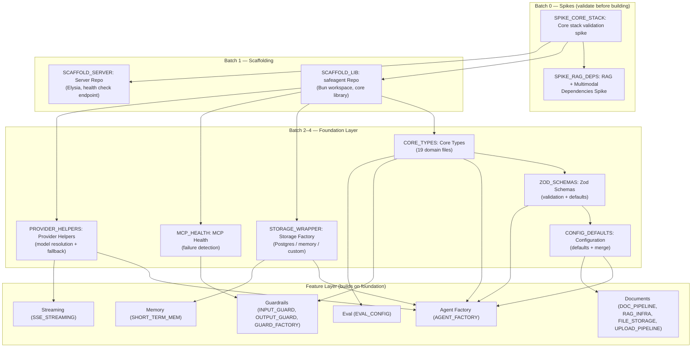
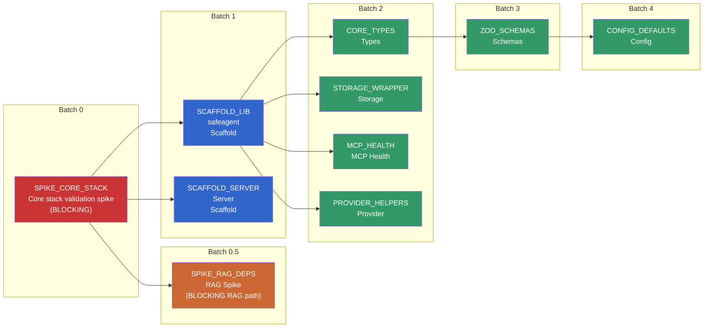
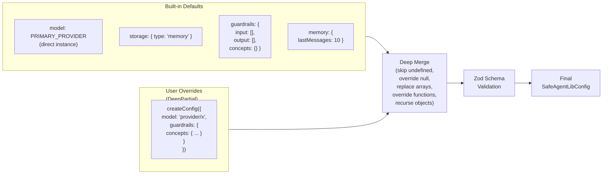
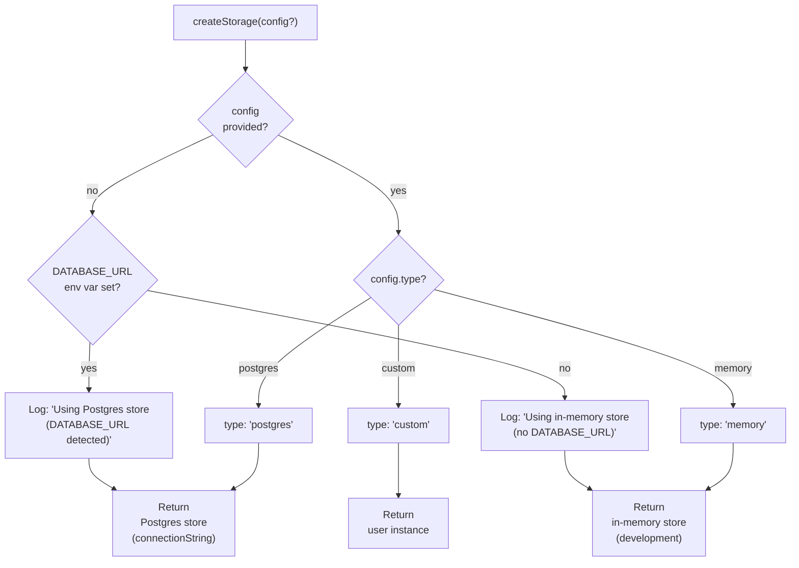
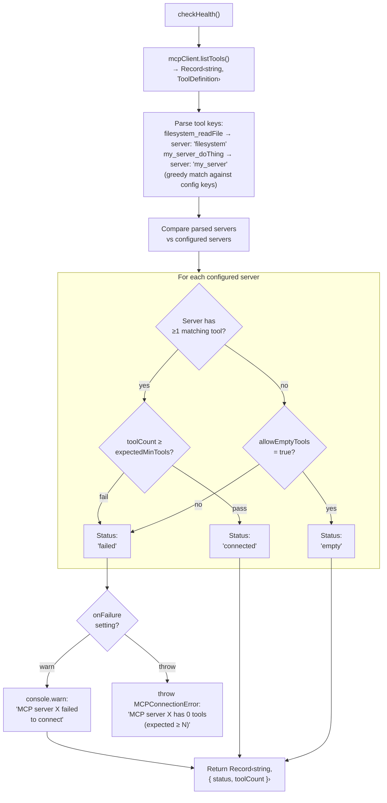

# 04 — Types & Foundation

> **Scope**: Compatibility spikes, repository scaffolding, core type system, Zod validation schemas, configuration defaults and merging, storage factory, MCP health checking, provider model resolution, and the RAG dependency spike. This document covers everything that must exist before any feature module can be built.
>
> **Tasks**: SPIKE_CORE_STACK (Core stack validation spike), SCAFFOLD_LIB (safeagent Scaffolding), SCAFFOLD_SERVER (Server Scaffolding), CORE_TYPES (Core Types), ZOD_SCHEMAS (Zod Schemas), CONFIG_DEFAULTS (Configuration System), STORAGE_WRAPPER (Storage Factory), MCP_HEALTH (MCP Health Check), PROVIDER_HELPERS (Provider Helpers), SPIKE_RAG_DEPS (RAG Spike)

---

## Table of Contents

- [Architecture Overview](#architecture-overview)
- [Dependency Chain](#dependency-chain)
- [Spike: Core stack validation (Bun + AI SDK + Drizzle + deps)](#spike-core-stack-validation-bun-ai-sdk-drizzle-deps)
- [Spike: RAG + Multimodal Dependencies](#spike-rag-multimodal-dependencies)
- [Repository Foundation](#repository-foundation)
- [Guardrail safety dependencies](#guardrail-safety-dependencies)
- [Subpath Barrel Export Convention](#subpath-barrel-export-convention)
- [Core Type System](#core-type-system)
- [Zod Validation Schemas](#zod-validation-schemas)
- [Configuration System](#configuration-system)
- [Storage Factory](#storage-factory)
- [MCP Health Check](#mcp-health-check)
- [Provider Model Resolution](#provider-model-resolution)
- [Task Specifications](#task-specifications)

---

## Architecture Overview

The foundation layer is a strict dependency stack. Every module above it — agents, guardrails, memory, streaming, documents, eval — imports from these foundational pieces. Nothing in the foundation layer imports from the feature layer.

The foundation layer is deliberately narrow. Types define the shape of everything. Schemas enforce those shapes at runtime. The configuration system merges user overrides with sensible defaults. Storage, MCP health, and provider resolution are thin factories that wrap external dependencies behind stable interfaces.

---

## Dependency Chain

Tasks execute in a strict batch order. No task starts until every task it depends on has passed its acceptance criteria.

**Batch 0 (SPIKE_CORE_STACK)** is the single most critical task. It validates every external dependency the project relies on. If the spike fails, the plan is revised before a single line of production code is written.

**Batch 0.5 (SPIKE_RAG_DEPS)** runs after SPIKE_CORE_STACK and before SCAFFOLD_LIB. It validates all RAG-specific dependencies — PDF processing, multimodal summarization, vector search, S3 storage — that the document pipeline depends on.

**Batch 1 (SCAFFOLD_LIB, SCAFFOLD_SERVER)** runs in parallel. SCAFFOLD_LIB creates the library workspace; SCAFFOLD_SERVER creates the server repo. Neither depends on the other.

**Batch 2 (CORE_TYPES, STORAGE_WRAPPER, MCP_HEALTH, PROVIDER_HELPERS)** runs in parallel. All four tasks depend on SCAFFOLD_LIB (scaffolding) but not on each other. Types, storage, MCP, and provider helpers can be built simultaneously.

**Batch 3 (ZOD_SCHEMAS)** depends on CORE_TYPES. Zod schemas mirror the types and cannot be written before the types are finalized.

**Batch 4 (CONFIG_DEFAULTS)** depends on both CORE_TYPES and ZOD_SCHEMAS. The config system uses `DeepPartial<T>` from types and validates with schemas.

---

## Spike: Core stack validation (Bun + AI SDK + Drizzle + deps)

The spike is a throwaway test harness in a temporary directory that validates every technology assumption before the real codebase is built. The spike is preserved in the repo as a regression reference — it is never deleted.

### Validations Matrix

The spike covers six categories of validation. Each produces a documented finding saved to a markdown file within the spike directory.

**Agent Core Validations**:

| Validation | What is checked | Critical? |
|---|---|---|
| Agent factory creation | Agent instantiates with both `id` and `name` fields, system prompt, and model provider via `aisdk(google(...))` bridge | Yes |
| PRIMARY_MODEL | The primary provider works with the createAgent factory via `aisdk()` bridge; direct provider passthrough confirmed | Yes |
| RunStreamEvent iteration | `Runner.run(agent, input, { stream: true })` returns `AsyncIterable<RunStreamEvent>`; all event types (`raw_model_stream_event`, `run_item_stream_event`, `agent_updated_stream_event`) fire correctly | Yes |
| Framework guardrail tripwire | `InputGuardrailTripwireTriggered` / `OutputGuardrailTripwireTriggered` exceptions fire when `tripwireTriggered: true` | Yes |
| MCP tool listing | `listTools` returns tools with underscore namespacing (`serverName_toolName`) | Yes |
| Grounding search | Second agent with Google Search tool returns `groundingMetadata` on response | No |
| Memory thread isolation | Two concurrent `Runner.run()` calls with different `threadId` values produce isolated history | Yes |
| requestContext propagation | `userId` passed in `requestContext` is accessible in both the stream completion callback and tool `execute` | Yes |
| State isolation (concurrent streams) | Two concurrent streams each get their own processor state object; counters are independent | Yes |
| traceId retrieval | The stream result does NOT expose a `traceId` property through any documented path. Resolution: server generates a UUID before calling `Runner.run()` and emits it via the first SSE event (session-meta). See Finding SPIKE_STREAM_RESULT_NO_TRACE_ID in file 03. | Yes |
| result.usage shape | Token usage object exists on the stream result with `promptTokens`, `completionTokens`, `totalTokens` | Yes |

**Stream & Production Guard Validations**:

| Validation | What is checked | Critical? |
|---|---|---|
| RunStreamEvent shape capture | Log every event type from `Runner.run()` — `raw_model_stream_event`, `run_item_stream_event`, `agent_updated_stream_event` | Yes |
| Framework guardrail: input tripwire | `InputGuardrail` with `tripwireTriggered: true` causes `InputGuardrailTripwireTriggered` exception | Yes |
| Framework guardrail: output tripwire | `OutputGuardrail` with `tripwireTriggered: true` causes `OutputGuardrailTripwireTriggered` exception | Yes |
| Handoff event | `agent_updated_stream_event` fires when `transfer_to_<agent>()` tool call routes to sub-agent | Yes |
| Async abort edge case | `abort` called after the stream's last text-delta — document: throws, no-ops, or hangs | Yes |
| Tool-call suppression | `run_item_stream_event` with specific tool names can be filtered while passing others through | No |

**Framework & SDK Validations**:

| Validation | What is checked | Critical? |
|---|---|---|
| Runner.run stream path | `Runner.run()` → `RunStreamEvent` events are emitted through Elysia `sse()` generators (no conversion step) | Yes |
| Framework subpath imports (historical — removed) | Both root (`core`) and subpath (`core/agent`) import forms documented | Yes |
| Zod v4 compatibility | Zod v4 namespace import works; 2-arg `z.record` accepted by tool definitions | Yes |
| AI SDK compatibility | Confirms latest AI SDK; `MockLanguageModel` importable from `ai/test` | No |
| OpenTUI render test | `@opentui/solid` `render` with a minimal box + text component renders without crash | No |
| Promptfoo compatibility | `evaluate` runs as an external dev tool in its own process | No |
| Custom scorer functions | Application scorer module imports and executes | No |
| `@google/genai` direct SDK | Direct SDK works alongside AI SDK wrapper | No |

**Server & Route Validations**:

| Validation | What is checked | Critical? |
|---|---|---|
| Legacy framework HTTP integration (historical, no longer applicable) | Historical spike finding from prior HTTP stack; no longer applicable after Elysia migration | No |
| Elysia lifecycle hooks | Validate `onRequest`/`derive`/`resolve` route composition for auth + context propagation | Yes |
| CORS preflight bypass | `OPTIONS` request returns 204 with CORS headers, not 401 from JWT auth middleware | Yes |

**External Service Validations**:

| Validation | What is checked | Critical? |
|---|---|---|
| SurrealDB SDK (WebSocket) | Connect from Bun, authenticate, CRUD operations | Yes |
| SurrealDB graph relations | `RELATE` statements + multi-hop traversal (`->likes->`) work | Yes |
| SurrealDB vector search | `vector::similarity::cosine` sequential scan (no MTREE index — see Finding SPIKE_SURREALDB_EMBEDDED_MTREE_LIMITATION in file 03) | Yes |
| SurrealDB embedded mode | SurrealDB embedded SDK with `mem://` protocol for unit tests without Docker | Yes |
| Embedded MTREE limitation | Confirm MTREE is NOT needed — `vector::similarity::cosine` sequential scan works in `mem://` and is sufficient at per-user memory scale | Yes |
| Drizzle Postgres conversation store | Instantiates and works with `Memory` | Yes |
| Gemini embedding model | Returns embedding array with correct dimensions | Yes |
| Langfuse SDK API | `addScoreToTrace` method or alternative for feedback scoring | No |
| Trigger.dev SDK | Imports, configures, and defines tasks without crash under Bun | No |
| Valkey (ioredis) | Connects from Bun; atomic `INCR`/`DECRBY`/`SETEX` and `MULTI/EXEC` work | No |
| Drizzle ORM | `drizzle-orm/bun-sql` adapter with Bun's native SQL bindings | Yes |
| surqlize ORM | Connects to SurrealDB, defines typed schema, executes type-safe RELATE and SELECT queries | Yes |
| @t3-oss/env-core | Creates typed env object with Zod v4 schemas, validates at startup, compile-time type inference | No |
| neverthrow | Result type wraps async operations, forces error handling at call site | No |
| @logtape/logtape | getLogger with hierarchical categories works under Bun, configure sets JSON sink | No |
| Drizzle bun-sql validation | Validate `drizzle-orm/bun-sql` adapter connects and initializes schema correctly | Yes |
| @elysiajs/openapi | Re-spike required: verify Zod v4 `mapJsonSchema: { zod: z.toJSONSchema }` and OpenAPI JSON endpoint | Yes |
| eld | Language detection package works under Bun with synchronous calls and reliability output | Yes |
| obscenity | English evasion-resistant profanity filtering package works under Bun | Yes |
| @2toad/profanity | Multilingual profanity dictionaries load and evaluate under Bun | Yes |
| naughty-words | LDNOOBW dictionaries import successfully and attribution requirement is documented | Yes |

**Constraints**:

The spike must NOT use framework CLI commands, must NOT use `bun:sqlite` for production storage, must NOT combine Google Search tools with custom function tools in the same call, and must NOT use `onKeyPress` for OpenTUI (use `onKeyDown`).

Individual validation failures are documented but do not block other validations from running. The spike blocks subsequent batches only if critical validations fail. Non-critical failures cause the affected task's plan to be revised, but other tasks proceed.

---

## Spike: RAG + Multimodal Dependencies

The RAG spike runs after SPIKE_CORE_STACK and before SCAFFOLD_LIB. It validates the entire document processing and retrieval pipeline in isolation before any library code exists.

### Validations

| Validation | What is checked |
|---|---|
| pdf-lib page slicing | Multi-page PDF split into valid single-page PDFs; base64 round-trip produces identical bytes |
| Gemini multimodal summarization | Per-page PDF bytes + extracted raster images sent to Gemini via `generateObject`; returns structured summary with `imageDescriptions` and `hasVectorCharts` |
| Gemini base64 acceptance | AI SDK accepts base64 TEXT in the `data` field of file parts (validates S3-fetch → base64 → Gemini query-time flow) |
| p-limit concurrency | 20 tasks at limit(5) complete in ~400ms, not ~100ms or ~2000ms |
| Per-page S3 upload | Upload single-page PDF to S3, download back, verify identical bytes; presigned URL generation works |
| LibreOffice DOCX→PDF | Headless LibreOffice conversion produces valid PDF when invoked by the runtime process layer |
| unpdf text extraction | Returns `{ totalPages, text[] }` with per-page text from multi-page PDF |
| JIMP image resize | `Jimp.read` → `resize` → `getBuffer` under Bun |
| Custom text chunking module | `MDocument.fromText` and constructor forms; `chunk` with `maxSize: 4000, overlap: 800` (TXT only) |
| Drizzle + pgvector + tsvector | `page_index` table with `vector`, `raw_tsvector tsvector GENERATED`; hybrid RRF query executes; thread isolation holds |
| PgVector (TXT RAG) | Auto-creates extension + table + index; threadId filter works; `createVectorQueryTool` filter mechanism documented |
| embedMany | Returns correct-dimension vectors for batch of 5 strings |
| Bun.S3Client | Upload, download, delete, list-by-prefix with MinIO; fallback to `@aws-sdk/client-s3` if needed |
| pdfjs-dist image extraction | `getOperatorList` + `OPS.paintImageXObject` extracts raster images; encoding to PNG via canvas or Jimp |
| `@napi-rs/canvas` page render | Vector chart pages rendered to PNG; `mupdf.js` WASM fallback if canvas fails |

**Constraints**: Must NOT use `createVectorQueryTool` with `enableFilter` for threadId access control in production, must NOT use `mammoth` (DOCX→PDF via LibreOffice), must NOT use JIMP legacy API (positional arguments form), must NOT use `sharp`, must NOT use port 5432 for test Postgres (conflicts with main), and must NOT use framework PgVector wrappers for document search (own Drizzle `page_index` table instead).

---

## Repository Foundation

### safeagent Library (SCAFFOLD_LIB)

The library scaffolding establishes a multi-package workspace with three roles: core agent library, terminal client, and external client SDK. The setup is strict-by-default, uses modern module semantics, and ensures terminal rendering is configured only where required so non-terminal packages remain unaffected.

The scaffold intentionally creates stable public module surfaces early, including temporary placeholder exports, so dependent tasks can progress in parallel without import breakage. Later implementation tasks replace those placeholders while preserving public API continuity.

### Server Repository (SCAFFOLD_SERVER)

The server scaffold is a separate but linked repository for local integration, beginning with a minimal runtime shell and health reporting behavior. It also defines the required environment contract up front so downstream tasks can implement authentication, background execution, caching, and provider access against a consistent configuration boundary.

---

## Guardrail safety dependencies

The foundation dependency baseline includes language and hate-speech guardrail packages validated in spikes and installed with `latest`.

| Dependency | Purpose | License | Runtime fit |
|---|---|---|---|
| `eld` | Language detection for language guardrails | MIT | Pure JavaScript, synchronous API, Bun-safe |
| `obscenity` | English hate-speech and profanity detection with evasion resistance | MIT | Real-time filtering with anti-evasion handling |
| `@2toad/profanity` | Multilingual profanity dictionaries and matcher utilities | MIT | Coverage for multilingual moderation flows |
| `naughty-words` | LDNOOBW multilingual supplemental dictionaries | CC-BY-4.0 | Attribution to Shutterstock required in notices |

These dependencies are consumed by the guardrail modules and factory exports so server implementations can enable opt-in language and hate-speech controls through configuration.

---

## Subpath Barrel Export Convention

Every task that creates or modifies files within a multi-task module must update that module's subpath barrel export file as part of its deliverable. This is mandatory, not optional.

**Multi-task modules and their contributing tasks**:

| Module | Tasks |
|---|---|
| `mcp/` | MCP_HEALTH, MCP_CLIENT |
| `memory/` | SHORT_TERM_MEM, SURREALDB_CLIENT |
| `guardrails/` | INPUT_GUARD, OUTPUT_GUARD, GUARD_FACTORY, GUARD_PIPELINE, LANG_GUARD, HATE_SPEECH_GUARD, ZERO_LEAK_GUARD |
| `rag/` | RAG_INFRA |
| `upload/` | UPLOAD_PIPELINE |
| `files/` | FILE_STORAGE, FILE_REGISTRY |
| `documents/` | DOC_PIPELINE |
| `db/` | FILE_STORAGE, COST_TRACKING |
| `llm/` | KEY_POOL |
| `observability/` | LANGFUSE_MODULE, CUSTOM_SPANS |
| `cache/` | VALKEY_CACHE |
| `trigger/` | TRIGGER_TASKS |
| `location/` | LOCATION_TOOL |

**Rule**: When a task adds a new public function, type, or class to a module directory, it adds the corresponding export to that module's barrel file. Barrel updates are NOT deferred — BARREL_EXPORTS only handles the top-level core library barrel. Subpath barrels are each task's responsibility.

For `safeagent/guardrails`, exports include language guard and hate-speech guard factory functions alongside existing guardrail factories.

---

## Core Type System

The type system is organized into nineteen domain files under `types/`. Every type domain file is a pure TypeScript interface or type alias — no runtime code, no Zod schemas (those live in ZOD_SCHEMAS), no imports of external classes (only type-level imports). The `errors/` module (separate from `types/`) is the one exception: it exports both a TypeScript union type of all error codes AND a runtime const object mirroring them, enabling the server's startup validation to iterate every error code and verify its message map is complete.

### Type Hierarchy

```mermaid
flowchart TB
    subgraph AgentDomain["Agent Domain"]
        SAC["SafeAgentConfig"]
        AM["AgentMode"]
        GM["GroundingMode"]
        AR["AgentResponse"]
        SC["StreamChunk"]
        PGR["ParallelGroundingResult"]
    end

    subgraph GuardrailDomain["Guardrail Domain"]
        GS["GuardrailSeverity"]
        GV["GuardrailVerdict"]
        GFN["GuardrailFn"]
        CC["ConceptConfig"]
        CR["ConceptRegistry"]
        GPC["GuardrailPipelineConfig"]
        GF["GuardrailFlag"]
        AV["AggregatedVerdict"]
        GMODE["GuardMode"]
        LGC["LanguageGuardConfig"]
        HSGC["HateSpeechGuardConfig"]
        ILF["IntentLanguageFields"]
    end

    subgraph MCPDomain["MCP Domain"]
        MSC["MCPServerConfig"]
        MCC["MCPClientConfig"]
    end

    subgraph ConfigDomain["Config Domain"]
        SLC["SafeAgentLibConfig"]
        DP["DeepPartial‹T›"]
    end

    subgraph StorageDomain["Storage Domain"]
        STC["StorageConfig\n(discriminated union)"]
    end

    subgraph MemoryDomain["Memory Domain"]
        MC["MemoryConfig"]
    end

    subgraph StreamDomain["Stream Domain"]
        STRC["StreamConfig"]
        SSE["SSEConfig"]
        SRB["StreamRequestBody"]
        SMD["SessionMetaDelivery"]
    end

    subgraph SSEDomain["SSE Events Domain"]
        SSETD["SSETextDeltaEvent"]
        SSESM["SSESessionMetaEvent"]
        SSECTA["SSECTAEvent"]
        SSECIT["SSECitationEvent"]
        SSELOC["SSELocationEvent"]
        SSETRIP["SSETripwireEvent"]
        SSEDONE["SSEDoneEvent"]
        SSEERR["SSEErrorEvent"]
    end

    subgraph UploadDomain["Upload Domain"]
        DFC["DirectFileContext"]
        UC["UploadConfig"]
        UR["UploadResult"]
        FR["FileResult"]
        BSC["BlockingStageConfig"]
        DPM["DocumentProcessingMode"]
    end

    subgraph DocsDomain["Documents Domain"]
        PD["ProcessedDocument"]
        PS["PageSplit"]
        PSR["PageSummaryResult"]
        PSUM["PageSummary"]
        SUMC["SummarizationConfig"]
        ID["ImageDescription"]
        ERI["ExtractedRasterImage"]
        PI["PageImage"]
        IER["ImageExtractionResult"]
    end

    subgraph RAGDomain["RAG Domain"]
        HR["HybridResult"]
        QTC["QueryToolConfig"]
        CHK["ChunkConfig"]
        RR["RAGResult"]
        CIT["Citation"]
        DA["DocumentAnswer"]
    end

    subgraph FilesDomain["Files Domain"]
        FS["FileStorage"]
        S3C["S3Config"]
        CD["CleanupDeps"]
        CLR["CleanupResult"]
    end

    subgraph EvalDomain["Eval Domain"]
        EC["EvalConfig"]
        SCR["ScorerConfig"]
        PFC["PromptfooConfig"]
    end

    subgraph ModelDomain["Model Domain"]
        MODC["ModelConfig"]
        FMC["FallbackModelConfig"]
    end

    subgraph LLMDomain["LLM Domain"]
        KPC["KeyPoolConfig"]
        KP["KeyPool"]
    end

    subgraph CacheDomain["Cache Domain"]
        CAC["CacheConfig"]
        CA["Cache"]
    end

    subgraph LocationDomain["Location Domain"]
        LTC["LocationToolConfig"]
        GCP["GeocodeProvider"]
        ISP["ImageSearchProvider"]
        IR["ImageResult"]
        LR["LocationResult"]
    end

    subgraph QueueDomain["Queue Domain"]
        TP["TaskPayload"]
        BSP["BackgroundStagePayload"]
        BAP["BudgetAggregationPayload"]
        CLP["CleanupPayload"]
        QA["QueueAdapter"]
    end

    subgraph BudgetDomain["Budget Domain"]
        UE["UsageEvent"]
        BC["BudgetConfig"]
        BCR["BudgetCheckResult"]
    end

    SAC -.->|uses| GMODE
    SAC -.->|uses| GPC
    SAC -.->|uses| MCC
    SAC -.->|uses| ILF
    SAC -.->|uses| LTC
    GPC -.->|contains| GFN
    GPC -.->|contains| CR
    GPC -.->|uses| GMODE
    GPC -.->|uses| LGC
    GPC -.->|uses| HSGC
    MC -.->|uses| STC
    UC -.->|uses| KP
    LTC -.->|uses| GCP
    LTC -.->|uses| ISP
    ISP -.->|returns| IR
    LR -.->|contains| IR
```

### Additional guardrail configuration types

**LanguageGuardConfig**: Configuration for language guard behavior, including supported language set using ISO 639-1 codes, fallback message, minimum text length before detection runs, confidence threshold that allows uncertain detections to pass, and `translationKeywords` as `Record<string, string[]>` keyed by language code (each language key maps to keyword strings for that language).

**HateSpeechGuardConfig**: Configuration for hate-speech guard behavior, including opt-in enablement, excluded terms for false-positive control, additional terms for policy extension, selected language dictionaries to load, and fallback message.

**IntentLanguageFields**: Fields piggybacked on intent detection output so language guard checks can run without another model call: intended output language, translation intent boolean, and nullable translation target language.

**LocationToolConfig**: Configuration for the location enrichment tool. Includes optional geocode provider selection (defaulting to Nominatim with Valkey-backed caching), optional image search provider selection (no default), max images per place (default 5), cache TTL settings (default thirty days for geocoding and twenty-four hours for images), and opt-in enablement.

**GeocodeProvider**: Async provider function contract that accepts a place name and optional context string, then returns either latitude and longitude coordinates or null when unresolved.

**ImageSearchProvider**: Async provider function contract that accepts a query string and requested count, then returns an array of image results.

**ImageResult**: Image metadata shape containing a primary image URL, a thumbnail URL, optional attribution text, and optional source (domain name of the image origin).

**LocationResult**: Enriched place payload with fields: `name` (string — resolved place name), `type` (string — place classification: city, neighborhood, restaurant, landmark, region, country), `lat` (number — latitude), `lng` (number — longitude), `images` (ImageResult[] — search images for the place), and `context` (optional string — relevance explanation for why this place was surfaced).

### Domain File Summary

**agent.ts** — `SafeAgentConfig` extends the library's agent config contract with safeagent-specific fields: grounding mode, guardrails pipeline config, MCP server config, guard mode, and optional location tool config for opt-in place enrichment. `AgentMode` is a union of `'chat'`, `'grounding'`, or `'tools'`. `GroundingMode` is `'parallel'` or `'search-only'`. `AgentResponse` and `StreamChunk` capture the shapes returned by the agent. `ParallelGroundingResult` holds the merged output when grounding and tools run simultaneously. The `guardMode` field uses the `GuardMode` type from `guardrails.ts` — there is only one canonical definition.

**guardrails.ts** — The full guardrail type system. `GuardrailSeverity` is the three-level union `'p0' | 'p1' | 'p2'`. `GuardrailVerdict` pairs severity with a `conceptId` string. `GuardrailFn` is the unified async function signature for both input and output guardrails. `ConceptConfig` holds the fallback message for p0 blocks. `ConceptRegistry` maps concept IDs to configs — the library ships zero built-in concepts; the server defines all of them. `GuardrailPipelineConfig` assembles input/output guardrail arrays, the concept registry, an optional guard mode, optional `LanguageGuardConfig`, optional `HateSpeechGuardConfig`, and an optional `onFlag` callback for p1 verdicts. `GuardrailFlag` is the data passed to `onFlag`. `AggregatedVerdict` is the result of running N guardrails with worst-wins aggregation. `GuardMode` is the canonical `'development' | 'production'` union — defined only here, imported everywhere else. GuardMode precedence: pipeline config, then agent config, then `'development'` default.

**mcp.ts** — `MCPServerConfig` is a discriminated union for stdio, SSE, and StreamableHttp transport variants (matching the framework's `MCPServerStdio`, `MCPServerSSE`, and `MCPServerStreamableHttp` classes). `MCPClientConfig` wraps a record of server configs plus an optional namespace setting.

**config.ts** — `SafeAgentLibConfig` is the top-level library configuration covering storage, memory, observability, and eval. `DeepPartial<T>` is a recursive utility type that makes every nested field optional.

**storage.ts** — `StorageConfig` is a discriminated union by `type`: `'postgres'` (production default when `DATABASE_URL` is set), `'memory'` (dev default, in-memory store), or `'custom'` (user-provided storage instance). This union shape matches the storage factory's switching logic.

**memory.ts** — `MemoryConfig` combines a `StorageConfig` reference with an optional `lastMessages` number defaulting to 10 and an optional `summarize` boolean (default false). When `summarize` is true, turns that fall out of the sliding window are compressed into a synthetic system message injected at the start of the context. Three-layer memory context types: `ThreadShortTermContext` contains `threadId`, `lastNTurns` (array of conversation turns), and `rollingSummaryText` (compressed history of dropped turns). `UserShortTermContext` contains `userId`, `crossThreadMessages` (user turns only from other threads), and `isActive` (boolean based on fade-out threshold). `CombinedMemoryContext` combines `threadShortTerm`, optional `userShortTerm`, and `longTermRecall` (results from semantic search) into a single context object for injection into the agent. New extraction and budgeting types are also defined in this domain: `FactAttribution` (`'self' | 'third_party' | 'general'`) captures who a candidate fact is about; `FactCertainty` (`'stated' | 'hypothetical' | 'asked'`) captures whether a fact was asserted, speculative, or only asked; `ExtractionSafeguardConfig` defines safeguard toggles such as sarcasm detection enablement, attribution filtering enablement, hypothetical filtering enablement, and hallucination-prevention mode; `ContextBudgetConfig` defines total context budget, maximum recall token cap, and maximum summary token cap; `ThreadResurrectionConfig` defines resurrection gap threshold and whether re-hydration recall is enabled when dormant threads resume.

**stream.ts** — `StreamConfig` specifies stream processing behavior, optional SSE headers, keepalive interval, and boolean flags controlling which `RunStreamEvent` types the handler emits downstream (`emitStart`, `emitFinish`, `emitReasoning`, `emitSources`). These flags control internal stream processing behavior — they are unrelated to the eight named SSE wire events defined in `sse-events.ts`. `StreamRequestBody` is the internal type used by the library's stream processing — it carries the full message history (after memory retrieval by the library's memory module) plus `threadId`. This is distinct from the HTTP request body shape (`{ message, threadId?, fileIds? }`) defined by the server endpoint; the server passes the HTTP body to the library, which loads conversation history from the memory store and constructs `StreamRequestBody` internally. `SessionMetaDelivery` defines the canonical format for delivering trace ID, thread ID, and optional agent ID to clients as the first SSE data event.

**sse-events.ts** — Shared SSE event types consumed by both the server and client SDK. Defines text delta events, session meta events (trace/thread/agent IDs), CTA events, citation events, location events, tripwire events, done events, and error events. Types are defined in the safeagent library and imported by the client SDK at compile time; the client remains a separate runtime npm package.

**upload.ts** — `DirectFileContext` is a union of text content and binary file data returned by the `contextProvider` DI hook (see file 13 — contextProvider DI Hook). `UploadConfig` specifies files, thread ID, user ID, and an optional key pool for multi-key distribution. `BlockingStageConfig` controls concurrency, key pool, and progress callbacks. `DocumentProcessingMode` is `'direct' | 'indexed' | 'rag'`.

**documents.ts** — `ProcessedDocument` is the output of document processing. `PageSplit` holds a page number, base64-encoded single-page PDF data, and byte size. `PageSummaryResult` carries the summary, page data, image descriptions, and a vector chart flag — but no embedding. `PageSummary` enriches `PageSummaryResult` with an embedding vector, added after calling the embedding model. `SummarizationConfig` controls concurrency, provider override, and progress callbacks. `ImageDescription` captures structured output from Gemini per-image analysis. `ExtractedRasterImage` holds raw pre-upload image data. `PageImage` holds post-upload S3 metadata. `ImageExtractionResult` groups extracted images by page.

**rag.ts** — `HybridResult` pairs a file ID, page number, and RRF score. `QueryToolConfig` holds optional presigned URL TTL. `ChunkConfig` sets max size and overlap for text chunking. `Citation` includes source label, optional file ID, optional page number, quote, optional scope (`'thread' | 'global'`), and optional image array with presigned URLs and fallback API paths. File ID is present for both PDF and TXT citations (both are uploaded files). Page is present for PDF citations only. Both file ID and page are absent for web grounding citations. `DocumentAnswer` combines an answer string with its citations. Structured result types: `StructuredResultSet` contains `userId`, `originatingQuery` (the query that produced results), `orderedResults` (array of `ResultItem`), `sourceThreadId`, `createdAt`, and `expiresAt` (TTL for result set, default 7 days). `ResultItem` contains `label` (string) and `metadata` (record of key-value pairs describing the item).

**files.ts** — `FileStorage` is the S3 wrapper interface. `S3Config` holds bucket and endpoint settings. `FileRecord` is the canonical file metadata shape returned by file list and detail endpoints — it contains `fileId`, `userId`, `fileName`, `fileType`, `fileSize`, `status` (one of `uploading`, `summarizing`, `ready`, `enriching`, `enriched`, `failed`, `deleted`), `scope` (`'thread'` | `'global'`), `createdAt`, `updatedAt`, optional `deletedAt`, optional `expiresAt`, optional `error`, and optional `threadId`. `CleanupDeps` bundles the database, RAG store, file storage, and optional cache for distributed locking. `CleanupResult` reports deletion counts or skip reason.

**eval.ts** — `EvalConfig`, `ScorerConfig`, and `PromptfooConfig` for the evaluation system. `SelfTestConfig` holds the configuration for agent self-testing: `agent` (the agent instance), `testCases` (array of `{ input, expectedOutput?, assertions? }`), optional `scorers` (list of scorer names), and optional `timeout` (how long to keep the HTTP server alive, default 5 minutes). `SelfTestResult` is the structured output of a self-test run: `passed` (boolean), `results` (array of per-test-case results with `input`, `output`, `passed`, and optional `gradingResult`), and `summary` (`{ total, passed, failed }`).

**model.ts** — `ModelConfig` accepts a string, an AI SDK model instance, or a factory function. `FallbackModelConfig` pairs a primary model with an ordered list of fallbacks.

**llm.ts** — `KeyPoolConfig` holds an array of API keys and optional per-key concurrency. `KeyPool` is the interface for round-robin distribution across N API keys, providing methods to get the next provider, embedder, concurrency limit, and pool size. Intent validation output also includes `IntentLanguageFields` so intended-output language checks run immediately after structured intent detection.

**cache.ts** — `CacheConfig` holds an optional URL defaulting to the `VALKEY_URL` env var. `Cache` is the interface for Valkey-backed operations: get (returns `string | null`) / set / del for string values, incr/incrBy/decrBy for atomic counters, expire for TTL, close for graceful shutdown, isHealthy for health checks, and getClient for direct ioredis access (returns null for in-memory fallback).

**location.ts** — `LocationToolConfig` defines opt-in location enrichment behavior with pluggable geocoding and image search providers, max image count, and cache TTL defaults. `GeocodeProvider` defines the async place-to-coordinate contract with optional context input. `ImageSearchProvider` defines async image lookup by query and count. `ImageResult` is the canonical image payload shape. `LocationResult` is the canonical enriched place event payload consumed by streaming and clients.

**temporal.ts** — `TemporalReference` contains `expression` (the raw text like "yesterday" or "last week"), `resolvedFrom` (datetime start of the range), and `resolvedTo` (datetime end of the range). Used by the memory recall tool to filter results by date range when temporal expressions are detected.

**preferences.ts** — `PreferenceUpdate` contains `newFact` (the updated preference fact), optional `supersededFactId` (ID of the fact being replaced), and `updateType` (one of `'addition'`, `'correction'`, or `'duplicate'`). Used by the fact extraction pipeline to track preference changes and supersession relationships.

**memory-control.ts** — `MemoryControlAction` contains `actionType` (one of `'inspect'` or `'delete'`), optional `query` (search query for inspect/delete operations), `matchedRecords` (array of records matching the query), and `confirmed` (boolean indicating user confirmation for delete operations).

**queue.ts** — `TaskPayload` is a discriminated union of background stage, budget aggregation, and cleanup payloads. `QueueAdapter` abstracts over Trigger.dev with `trigger` and optional `triggerScheduled` methods. Dev mode runs tasks in-process; production uses the Trigger.dev HTTP API.

**interactions.ts** — `InteractionSignal` contains `action` (string like `'searched_for'`, `'discussed_place'`, `'selected'`), `query` (the search query or entity discussed), and `context` (additional context about the interaction). Captured during fact extraction to record user behavior and search history.

**media-facts.ts** — `MediaFact` contains `description` (string from vision model describing the image), `extractedEntities` (array of entity strings extracted from the image), and `sourceThreadId` (the thread where the image was shared). Stored in long-term memory to enable future reference resolution for shared images.

**Fact Type Field**: All fact records stored in long-term memory include a `factType` field that categorizes the fact for targeted retrieval. Valid values are `'preference'` (user preference or taste), `'attribute'` (factual attribute about the user), `'derived'` (inferred from other facts), `'behavioral'` (observed behavior pattern), and `'sentiment'` (opinion or feeling about something). This field is used by the memory recall tool to filter and prioritize results based on the type of information being sought.

The barrel file re-exports all types from every domain file.

The subpath barrel list includes safeagent/location, exporting createLocationTool, LocationToolConfig, GeocodeProvider, ImageSearchProvider, ImageResult, and LocationResult.

---

## Zod Validation Schemas

Schemas live in the config directory, not alongside types. Every schema mirrors a TypeScript type from CORE_TYPES and uses `z.infer<>` to guarantee the shapes stay in sync.

All schemas use Zod v4 namespace import syntax. The previous named import style is not used. The 1-arg `z.record` form (removed in Zod v4) is replaced with the 2-arg form everywhere.

**Key Schemas**:

- **SafeAgentConfigSchema** — Validates agent config with sensible defaults.
- **GuardrailSeveritySchema** — `z.enum`.
- **GuardrailVerdictSchema** — Object with severity and conceptId.
- **ConceptRegistrySchema** — Record of string keys to objects with a `fallback` string. Validates the server-defined concept-to-fallback mapping.
- **GuardrailPipelineConfigSchema** — Validates the full pipeline config. Input/output arrays contain async functions; these use `z.any` with a runtime type guard since Zod cannot validate function signatures.
- **MCPServerConfigSchema** — Discriminated union for stdio, SSE, and StreamableHttp transport.
- **StorageConfigSchema** — Discriminated union with default `{ type: 'memory' }`.
- **MemoryConfigSchema** — Validates memory config.
- **ModelConfigSchema** — The `model` field accepts string, LanguageModelLike, or function. Since Zod cannot validate AI SDK provider instances, the model field uses `z.any` with a minimal runtime guard checking for `doStream` method (provider instances), string type (magic strings), or function type (factory functions).
- **EvalConfigSchema** — Validates eval config.

Each schema applies `default` values where appropriate. `parseConfig` runs Zod parse and returns the validated config. `validateConfig` runs Zod safeParse and returns a result with errors.

`deepPartial` is not used — it was removed in Zod v4. Individual fields are made optional with `z.optional` instead.

---

## Configuration System

The configuration system implements a three-step flow: establish defaults, merge user overrides, and validate the result.

**`createConfig`** — Merges user overrides with defaults and validates the result with Zod. Returns a fully populated `SafeAgentLibConfig`. Called with no arguments, it returns the complete default configuration.

**`defineAgent`** — Merges agent-specific overrides with library defaults. Used by the agent factory (AGENT_FACTORY) to assemble per-agent configuration.

**Deep Merge Rules**:

| Source Value | Behavior |
|---|---|
| `undefined` | Skip (keep target value) |
| `null` | Override target with `null` |
| Array | Replace entire array (no element merging) |
| Function | Override (keep user's function) |
| Object | Recurse into nested fields |

The configuration system does NOT hardcode prompt text (except the generic fallback message for the guardrail concept registry). It does NOT import framework classes — it works entirely with plain config objects. The library ships zero default concepts; the server defines all concept IDs and fallback messages.

---

## Storage Factory

The storage factory creates the correct application-managed storage backend based on configuration and environment detection.

### Decision Tree

When `config.type` is `'postgres'`: returns a Drizzle-backed Postgres store using the provided connection string. When `config.type` is `'memory'`: returns an in-memory application store for development. When `config.type` is `'custom'`: passes through the user-provided storage instance.

The smart default checks for a `DATABASE_URL` environment variable. If set, auto-selects postgres. Otherwise, falls back to in-memory. Both paths log which storage type is being used.

The module exports storage factory helpers only. It does NOT use `bun:sqlite` for production state and does NOT create a Redis adapter (Valkey covers cache/counter needs).

---

## MCP Health Check

The MCP client wrapper can silently swallow failed server connections. When a configured MCP server is down, its tools simply don't appear in `listTools` — no error is thrown. The `createMCPHealthCheck` factory wraps the MCP SDK client to detect this gap.

### Health Check Flow

**Tool-to-server mapping** uses underscore prefix parsing. The tool key `filesystem_readFile` maps to server `filesystem`. For server names with underscores (e.g., `my_server`), the parser matches greedily against configured server names.

**Server statuses**: `'connected'` means the server has tools and meets the minimum threshold. `'empty'` means zero tools but `allowEmptyTools: true` is set. `'failed'` means zero tools and the server should have had some. `'unknown'` means a connection was never attempted.

**Periodic health check** is available via `startHealthCheck` for long-running processes.

The wrapper does NOT reimplement the MCP protocol — it wraps the existing `MCPClient`. It does NOT create multiple MCPClient instances (which would cause memory leaks).

---

## Provider Model Resolution

The provider module resolves model configuration into AI SDK model instances and provides a fallback wrapper for error recovery.

**`resolveModel`** handles three input formats: a magic string like `'google/some-model'` (resolved via provider helper routing), a direct AI SDK model instance (passthrough — this is the default path with direct provider passthrough when needed), or a factory function that receives context and returns a model (passthrough).

**`createFallbackModel`** wraps the primary model with AI SDK middleware. When the primary model throws, the middleware catches the error and tries each fallback in order. Uses AI SDK's `wrapLanguageModel` with a custom middleware that implements `wrapStream` and `wrapGenerate`. An optional `onFallback` callback fires when a fallback is used. This is the same function signature used by PROVIDER_FALLBACK — PROVIDER_HELPERS creates the base helper, PROVIDER_FALLBACK extends with full implementation.

The module re-exports the `google` provider factory from `@ai-sdk/google` (the primary provider). It does NOT re-export anthropic or openai factories — those would add mandatory dependencies. Users who need other providers install and import them directly.

The module does NOT build load balancing or smart routing, and does NOT include circuit breaker logic (that is a separate module in CIRCUIT_BREAKER).

---

## Task Specifications

### Task SPIKE_CORE_STACK: Core stack validation (Bun + AI SDK + Drizzle + deps) Spike

**What to do**: Create a spike directory at the safeagent repo root with a minimal temporary project config and TypeScript config. Install all project dependencies at latest with no dependency specifiers. Write a comprehensive test suite validating every technology assumption the project depends on. Every validation produces a documented finding saved to a markdown file. The spike is preserved as a regression reference.

The spike instantiates an agent via `createAgent` with `id`, `name`, system prompt, and the primary model provider (via `aisdk(google(...))` bridge). It connects to a test MCP server, sets up memory with in-memory storage, calls `Runner.run(agent, input, { stream: true })`, iterates the `AsyncIterable<RunStreamEvent>`, and consumes the full stream. Framework guardrails (`InputGuardrail[]` / `OutputGuardrail[]`) are validated for tripwire behavior.

Beyond basic agent testing, the spike performs every validation listed in Section 3 of this document: production guard mode assumptions (null suppression, chunk injection, bridge survival), stream chunk shape capture, OpenTUI render test, Promptfoo compatibility, Zod v4 compatibility, Framework subpath imports (historical — removed), AI SDK compatibility confirmation, Elysia lifecycle hook validation, CORS preflight bypass, SurrealDB SDK (WebSocket + embedded mode + graph + vector), Drizzle-backed Postgres conversation store, Drizzle ORM, Bun.S3Client, requestContext propagation, state isolation for concurrent streams, traceId retrieval, memory thread isolation, Langfuse SDK API, result.usage shape, Trigger.dev SDK, Valkey via ioredis, Gemini embeddings, and async abort / last-chunk violation edge cases.

All tests use the project test suite with RED-first discipline. The spike captures exact installed packages to a machine-readable snapshot.

**Depends on**: None (Batch 0)

**Acceptance Criteria**:
- The spike test suite passes with all assertions green
- Agent instantiates without error under Bun via `aisdk(google(...))` bridge
- `Runner.run(agent, input, { stream: true })` returns `AsyncIterable<RunStreamEvent>` and iterates successfully
- Framework guardrail tripwire exceptions fire correctly
- MCP tools listed with underscore namespacing
- Gemini grounding returns `groundingMetadata`
- `aisdk()` bridge path produces valid `Model` for the framework
- OpenTUI renders a box with text without crash
- Promptfoo `evaluate` configuration helpers generate valid config files
- All core dependencies installed and package snapshots captured
- Framework subpath imports (historical — removed) validated and documented
- AI SDK compatibility confirmed; `MockLanguageModel` importable from `ai/test`
- Memory thread isolation verified
- Zod v4 2-arg `z.record` works with tool schemas
- Async abort edge case documented (throws, no-ops, or hangs)
- Last-chunk violation behavior documented (writer confirmed NOT available in stream completion callback)
- SurrealDB SDK connects from Bun; graph RELATE + traversal + vector search work
- SurrealDB embedded mode works through the validated typed SurrealDB integration layer
- Embedded `mem://` mode confirms sequential scan cosine similarity works (MTREE not needed)
- Drizzle Postgres conversation store instantiates and works with Memory
- Embedding model returns correct-dimension vectors
- requestContext propagation validated in stream completion callback and tool execute
- Stream completion callback messageList shape documented
- Elysia lifecycle hooks validated for auth/context route wiring
- CORS preflight returns 204 with headers, not 401
- Trigger.dev SDK imports and configures under Bun
- Valkey atomic operations and MULTI/EXEC work
- Drizzle ORM compiles and queries against Postgres

**QA Scenarios**:
- Agent streaming works under the runtime test environment: instantiate an agent with identity metadata, execute a streaming run, verify multiple stream events, verify output guardrail execution per chunk, and confirm completion callback behavior → all lifecycle hooks fire and the run completes cleanly
- MCP tools register with underscore namespace: list tools, verify namespaced key shape, and confirm at least one tool is available → tools appear with the expected prefixing convention
- Gemini grounding returns metadata: run grounding-enabled agent flow and verify grounding metadata is present → grounding metadata is returned
- In-memory storage fallback works: initialize memory-backed storage, persist and retrieve a message, and verify round-trip integrity → fallback storage behavior is correct
- Async abort after stream completion: invoke abort after final delta and document observed behavior (throw, no-op, or hang) → behavior is captured in spike findings
- Last-chunk violation writer unavailability: validate final-chunk handling and confirm completion callback writer unavailability → limitation is documented and chunk-time injection requirement is preserved

---

### Task SPIKE_RAG_DEPS: RAG + Multimodal Dependencies Spike

**What to do**: Create a separate spike subdirectory for RAG validations. This spike runs after SPIKE_CORE_STACK and validates every dependency the document processing pipeline relies on. Install RAG-specific packages (pdf-lib, unpdf, jimp, p-limit, pdfjs-dist, @napi-rs/canvas). Note that `mammoth` is removed — DOCX→PDF conversion uses LibreOffice CLI directly via `Bun.spawn`.

Validate pdf-lib page slicing (multi-page to single-page PDFs with base64 round-trip), Gemini multimodal summarization via `generateObject` with structured schema output, Gemini acceptance of base64 text in file parts, p-limit concurrency enforcement, per-page S3 upload round-trip with presigned URL generation, LibreOffice DOCX→PDF via headless CLI, unpdf per-page text extraction, JIMP image resizing, custom text chunking behavior (both helper and constructor forms), Drizzle with pgvector and tsvector on the `page_index` table (including full hybrid RRF query execution and thread isolation), custom pgvector path for TXT RAG, embedMany batch embedding, Bun.S3Client with MinIO (or `@aws-sdk/client-s3` fallback), pdfjs-dist raster image extraction, and `@napi-rs/canvas` page rendering for vector charts (with `mupdf.js` WASM fallback).

All findings are saved to a markdown file. Tests use the project test suite with RED-first discipline.

**Depends on**: SPIKE_CORE_STACK

**Acceptance Criteria**:
- The RAG spike test suite passes
- pdf-lib slices multi-page PDF into valid single-page PDFs
- Base64 round-trip produces identical bytes
- Gemini multimodal accepts per-page PDF bytes and returns detailed structured summary
- Gemini multimodal accepts base64 text form
- p-limit enforces concurrency ceiling
- Per-page S3 upload round-trip: identical bytes
- Presigned S3 URL generation works (approach documented)
- LibreOffice converts DOCX to valid PDF via CLI
- unpdf returns per-page text array
- JIMP resizes image under Bun
- Custom chunking module chunks text with maxSize and overlap
- Drizzle `page_index` table created with vector and tsvector columns (no page_data column)
- Hybrid RRF query returns ranked results with `rrf_score > 0` for matching rows
- Thread isolation holds in page_index queries
- PgVector auto-creates extension, table, and index; threadId filter works
- embedMany returns correct-dimension vectors
- Bun.S3Client or @aws-sdk/client-s3 works with MinIO (documented)
- All findings documented

**QA Scenarios**:
- page index hybrid search with RRF: insert representative summary and raw-text rows for one thread, verify ranked results, add another thread's rows, and confirm no cross-thread leakage → results are correctly ranked and thread-isolated
- Per-page summarization round-trip: create a multi-page document, split pages, upload page artifacts, summarize with Gemini, persist retrieval records, and verify byte-consistent retrieval and signed access flow → full blocking-stage workflow is validated
- Built-in S3 client with MinIO: validate create, upload, retrieve, delete, and prefix listing operations → storage operations work end to end
- PDF image extraction with structured output: validate raster extraction, size filtering, vector fallback rendering, and structured multimodal summary outputs → extraction and structured summaries are returned

---

### Task SCAFFOLD_LIB: safeagent Repo Scaffolding

**What to do**: Initialize a git repository at the safeagent location (the spike directory from SPIKE_CORE_STACK already exists and is preserved). Create a Bun workspace workspace config at the repo root with `workspaces: ["packages/*"]`. Create three packages: the core library package (the main library), the TUI package (the TUI testing app), and the client SDK package (HTTP SDK stub — a minimal package config with `name: "@safeagent/client"` and a stub entry exporting `{}`; implementation happens in the CLIENT_SDK task).

The core package gets the core package config with `name: "safeagent"`, `type: "module"`, and a full `exports` map listing every subpath the library will eventually expose (agent, orchestrator, intent, query, evidence, visual, guardrails, memory, mcp, stream, eval, documents, upload, files, rag, cta, llm, observability, budget, feedback, errors, health, config, router, lifecycle, db, cache, trigger, types). Each subpath points to a TypeScript source file. Bun resolves these directly without a build step. Dependencies include `@openai/agents` and `@openai/agents-extensions` (agent framework with aisdk() bridge for Gemini), `ai` and `@ai-sdk/google` (model abstraction), and all other application dependencies listed in the dependency map.

The TypeScript configuration sets `strict: true`, `jsx: "preserve"`, `jsxImportSource: "@opentui/solid"`, `moduleResolution: "bundler"`. Biome is set up for linting and formatting. husky and lint-staged are configured for pre-commit quality gates, running Biome checks on staged files. eslint-plugin-drizzle is added as a dev dependency to enforce type-safe query patterns and prevent raw SQL escape hatches. `@t3-oss/env-core` is set up with an initial typed env schema module validated by Zod v4.

Create a seed script that populates SurrealDB with sample user facts, graph relations, and vector embeddings for local development.

The full directory structure is created under the core library source directory: agent, orchestrator, intent, query, evidence, visual, guardrails, mcp, storage, memory, stream, eval, model, config, documents, upload, files, rag, llm, observability, budget, feedback, errors, health, db, types, cache, trigger. Each gets a stub barrel export file with an empty export. The TUI package gets a components directory and a commands directory.

The TUI package runtime configuration includes the mandatory OpenTUI preload, scoped to avoid polluting core library tests. A placeholder test file uses deferred test entries so the initial test run stays clean.

**Depends on**: SPIKE_CORE_STACK

**Acceptance Criteria**:
- Dependency installation succeeds at the repository root
- The core package config has all dependencies
- The core package config includes eslint-plugin-drizzle, husky, lint-staged, and @t3-oss/env-core in the correct dependency groups
- typedoc is configured as a dev dependency with a docs generation script
- Initial env schema module exists and validates required environment variables with Zod v4
- Pre-commit hook runs Biome checks on staged files through husky and lint-staged
- The client SDK config exists with `name: "@safeagent/client"` and stub entry point
- The TUI package config links to `safeagent` workspace
- Type checking completes with no emitted artifacts
- Full directory structure exists
- The core library test suite runs (placeholder tests skip, no failures)
- Seed script populates SurrealDB with sample memory graph data
- Seed script is idempotent

**QA Scenarios**:
- Workspace resolution works: install dependencies and verify all workspace packages resolve correctly → all three packages resolve without errors
- Repository structure is complete: verify expected module groups and placeholder exports are present across core and TUI surfaces → all expected foundational artifacts are present

---

> **SCAFFOLD_SERVER** — canonical task specification is in [14 — Server Implementation](./14-server-implementation.md#task-scaffold_server-server-scaffolding). The server scaffolding depends on SPIKE_CORE_STACK and produces the Elysia project structure.

---

### Task CORE_TYPES: Core Type Definitions

**What to do**: Create the types directory with all TypeScript interfaces and type aliases organized into nineteen domain files. Every type domain file uses type-level imports only — no runtime code, no Zod schemas, no external class imports. Additionally, populate the `errors/` module with a runtime-enumerable const object of all typed error codes (the server iterates this at startup to validate its error message map is complete). The errors module also exports the TypeScript union type derived from the const object.

The domain files are: `agent.ts` (SafeAgentConfig, AgentMode, GroundingMode, AgentResponse, StreamChunk, ParallelGroundingResult), `guardrails.ts` (GuardrailSeverity, GuardrailVerdict, GuardrailFn, ConceptConfig, ConceptRegistry, GuardrailPipelineConfig, GuardrailFlag, AggregatedVerdict, GuardMode), `mcp.ts` (MCPServerConfig, MCPClientConfig), `config.ts` (SafeAgentLibConfig, DeepPartial), `storage.ts` (StorageConfig — discriminated union), `memory.ts` (MemoryConfig, ThreadShortTermContext, UserShortTermContext, CombinedMemoryContext), `stream.ts` (StreamConfig, SSEConfig, StreamRequestBody, SessionMetaDelivery), `sse-events.ts` (SSETextDeltaEvent, SSESessionMetaEvent, SSECTAEvent, SSECitationEvent, SSELocationEvent, SSETripwireEvent, SSEDoneEvent, SSEErrorEvent), `upload.ts` (DirectFileContext, UploadConfig, UploadResult, FileResult, BlockingStageConfig, DocumentProcessingMode), `documents.ts` (ProcessedDocument, PageSplit, PageSummaryResult, PageSummary, SummarizationConfig, ImageDescription, ExtractedRasterImage, PageImage, ImageExtractionResult), `rag.ts` (HybridResult, QueryToolConfig, ChunkConfig, RAGResult, Citation, DocumentAnswer, StructuredResultSet, ResultItem), `files.ts` (FileStorage, S3Config, FileRecord, CleanupDeps, CleanupResult), `eval.ts` (EvalConfig, ScorerConfig, PromptfooConfig, SelfTestConfig, SelfTestResult), `model.ts` (ModelConfig, FallbackModelConfig), `llm.ts` (KeyPoolConfig, KeyPool), `cache.ts` (CacheConfig, Cache), `queue.ts` (TaskPayload, BackgroundStagePayload, BudgetAggregationPayload, CleanupPayload, QueueAdapter), `budget.ts` (UsageEvent, BudgetConfig, BudgetCheckResult, BudgetRecord), `location.ts` (LocationToolConfig, GeocodeProvider, ImageSearchProvider, ImageResult, LocationResult), `temporal.ts` (TemporalReference), `preferences.ts` (PreferenceUpdate), `memory-control.ts` (MemoryControlAction), `interactions.ts` (InteractionSignal), `media-facts.ts` (MediaFact).

A barrel export file re-exports all types from every domain file. Types should use generics where appropriate (e.g., `SafeAgentConfig<TTools>`).

RED tests import each type and use type assertions to verify they compile.

**Depends on**: SCAFFOLD_LIB

**Acceptance Criteria**:
- Type checking passes with no type errors
- All types importable from the barrel file
- `SafeAgentConfig` correctly extends the library's agent config contract
- `DeepPartial<T>` works on nested objects

**QA Scenarios**:
- Types are importable and compile: verify representative core type exports resolve from the barrel and type checking succeeds → all types compile without errors

---

### Task ZOD_SCHEMAS: Zod Validation Schemas

**What to do**: Create the schemas file in the config directory. Define Zod schemas matching every type from CORE_TYPES using Zod v4 import syntax. Schemas include SafeAgentConfigSchema, GuardrailSeveritySchema, GuardrailVerdictSchema, ConceptRegistrySchema, GuardrailPipelineConfigSchema, MCPServerConfigSchema, StorageConfigSchema, MemoryConfigSchema, ModelConfigSchema, and EvalConfigSchema.

Schemas that wrap function fields (like GuardrailPipelineConfig's input/output arrays, or ModelConfig's model field) use `z.any` with runtime type guards since Zod cannot validate function signatures or AI SDK provider instances.

Each schema applies `default` values where appropriate. Helper functions `parseConfig` and `validateConfig` wrap Zod's parse and safeParse respectively. `z.infer<>` is used to ensure schema output types match TypeScript types.

`deepPartial` is not used (removed in Zod v4). Individual fields are made optional with `z.optional`. The 1-arg `z.record` is not used — Zod v4 requires the 2-arg form. Schemas allow unknown keys for extensibility.

**Depends on**: CORE_TYPES

**Acceptance Criteria**:
- Schema tests pass
- Valid config passes validation
- Invalid config throws ZodError with descriptive message
- Default values applied when fields omitted
- `z.infer<typeof Schema>` matches TypeScript types

**QA Scenarios**:
- Schemas validate and apply defaults: validate empty-storage defaults, invalid storage type rejection, valid full agent config acceptance, and required identity field validation messaging → all validation cases pass

---

### Task CONFIG_DEFAULTS: Configuration System with Defaults

**What to do**: Create the configuration module with a defaults file and a main config API. Implement `createConfig` that merges user overrides with defaults and validates with Zod. Implement `defineAgent` for per-agent configuration. Implement the deep merge utility handling undefined (skip), null (override), arrays (replace), functions (override), and objects (recurse).

Default values: model is the primary provider instance (direct, not a magic string), storage is `{ type: 'memory' }`, guardrails have empty input/output arrays and empty concept registry, memory conversation window is 10.

**Depends on**: CORE_TYPES, ZOD_SCHEMAS

**Acceptance Criteria**:
- Configuration tests pass
- `createConfig` with no args returns full defaults
- Partial override merges correctly (only specified fields change)
- Nested overrides work
- Invalid config throws descriptive error

**QA Scenarios**:
- Configuration system merges defaults: verify default model capabilities, model override behavior, storage fallback defaults, and empty guardrail concept defaults → defaults are applied and overrides are merged

---

### Task STORAGE_WRAPPER: Storage Wrapper + Postgres Default

**What to do**: Create the storage module with a `createStorage` factory. Implement three branches based on the `config.type` discriminant: postgres returns a Drizzle-backed Postgres store, memory returns an in-memory store, and custom passes through the user's instance.

Implement smart default: if `DATABASE_URL` env var is set, auto-select postgres; otherwise, fall back to memory. Log which storage type is being used.

Export storage factory types and helpers for convenience.

**Depends on**: SCAFFOLD_LIB

**Acceptance Criteria**:
- Storage tests pass
- `DATABASE_URL` set → auto-selects Postgres store
- No `DATABASE_URL` → falls back to in-memory store
- Explicit postgres config works
- Custom storage passthrough works

**QA Scenarios**:
- Storage factory creates correct instances: validate environment-driven default selection, explicit backend selection, and custom passthrough behavior → factory auto-detects environment and returns the expected store type for each case

---

### Task MCP_HEALTH: MCP Health-Check Wrapper

**What to do**: Create the MCP health module with `createMCPHealthCheck` that wraps the MCP SDK client integration to detect silently failed connections.

After calling `mcpClient.listTools`, map each tool back to its server name by parsing the underscore prefix. Compare against configured server names. Servers with zero matching tools are evaluated against their config: `allowEmptyTools: true` results in `'empty'` status, otherwise `'failed'`. Servers meeting the `expectedMinTools` threshold (default 1) are `'connected'`.

Handle ambiguity when server names contain underscores by matching greedily against config keys. Implement configurable reaction via `onFailure: 'warn' | 'throw'`.

Implement `checkHealth` returning a record of server statuses and tool counts. Implement `startHealthCheck` for periodic checking.

**Depends on**: SCAFFOLD_LIB

**Acceptance Criteria**:
- MCP health tests pass
- Health checker detects missing tools for a configured server
- `onFailure: 'throw'` throws descriptive MCPConnectionError
- `onFailure: 'warn'` logs without throwing

**QA Scenarios**:
- Health check detects failed MCP server: validate mixed server outcomes, failure reporting in throw mode, and warning behavior in warn mode → failed servers are detected and reported

---

### Task PROVIDER_HELPERS: Provider Model Resolution Helpers

**What to do**: Create the model module with `resolveModel` and `createFallbackModel`.

`resolveModel` handles three formats: magic strings (resolve via provider helper logic), AI SDK model instances (passthrough — the default path), and factory functions (passthrough).

`createFallbackModel` takes an object with `primary`, `fallbacks` (ordered array), and optional `onFallback` callback. It uses AI SDK's `wrapLanguageModel` with custom middleware implementing `wrapStream` and `wrapGenerate`. When the primary throws, fallbacks are tried in order.

Re-export the `google` provider factory from `@ai-sdk/google`. Do not re-export other provider factories — the library is provider-agnostic.

**Depends on**: SCAFFOLD_LIB

**Acceptance Criteria**:
- Model tests pass
- Magic string resolution works
- Direct provider passthrough works (has `doStream` method)
- Fallback triggers on primary error and uses next model in the chain

**QA Scenarios**:
- Model resolution and fallback: verify provider passthrough, unchanged instance behavior, and fallback activation when the primary model fails → all resolution paths work

---

### Task BARREL_EXPORTS: Top-Level Barrel Export Assembly

**What to do**: Create the top-level barrel file that re-exports the public API surface from every subpath module. Each library task is responsible for its own subpath barrel (see Section 6 — Subpath Barrel Export Convention). BARREL_EXPORTS only assembles the top-level entry point that aggregates all subpath barrels into a single importable surface.

Walk every subpath module surface in the core library, review each subpath barrel, and add the corresponding top-level re-exports. Verify each exported symbol is intentionally public (no internal helpers leaking). Ensure the aggregate barrel compiles cleanly under type checking with no circular dependency warnings.

**Depends on**: CORE_TYPES, ZOD_SCHEMAS, CONFIG_DEFAULTS, STORAGE_WRAPPER, MCP_HEALTH, PROVIDER_HELPERS, PROVIDER_FALLBACK, AGENT_FACTORY, INPUT_GUARD, OUTPUT_GUARD, GUARD_FACTORY, GUARD_PIPELINE, LANG_GUARD, HATE_SPEECH_GUARD, MCP_CLIENT, SHORT_TERM_MEM, FACT_EXTRACTION, MEMORY_RECALL, SURREALDB_CLIENT, DOC_PIPELINE, RAG_INFRA, FILE_STORAGE, UPLOAD_PIPELINE, FILE_REGISTRY, EVIDENCE_GATE, DOC_SEARCH, VISUAL_GROUNDING, SSE_STREAMING, CTA_STREAMING, LOCATION_TOOL, CLIENT_SDK, GEMINI_GROUNDING, PROMPT_MGMT, ZERO_LEAK_GUARD, EMBED_ROUTER, LLM_INTENT, PREFETCH_COORD, RAGFLOW_CLIENT, SOURCE_ROUTER, REWRITE_STRATEGIES, REWRITE_TOOL, LANGFUSE_MODULE, EVAL_CONFIG, CUSTOM_SPANS, KEY_POOL, VALKEY_CACHE, RATE_LIMITING, COST_TRACKING, STRUCT_LOGGING, CIRCUIT_BREAKER, TTL_CLEANUP, CROSS_CONV_RAG, TRIGGER_TASKS, ORCHESTRATOR, SUBAGENT_FACTORY, AGENT_ROUTER, TUI_AGENT, SERVER_ROUTES

**Acceptance Criteria**:
- The top-level barrel file exists and re-exports all public subpath modules
- Type checking passes with zero errors on the barrel surface
- No internal helpers or private types are exposed in the top-level barrel
- No circular dependency warnings from TypeScript or bundler
- Importing `safeagent` resolves to the barrel and exposes the full public API
- Every subpath barrel referenced in the top-level barrel actually exists

**QA Scenarios**:
- Barrel completeness: import the public package surface in validation tests and confirm every documented public type, function, and class is reachable from the top-level barrel → all public symbols are accessible
- No internal leaks: verify known internal helpers are not importable from the public package surface → internal symbols are not exposed
- Clean compilation: run type checking across the barrel and all re-exported modules → zero errors and zero circular dependency warnings

---

*Previous: [03 — Research & Decisions](./03-research-and-decisions.md)*
*Next: [05 — Agent & Orchestration](./05-agent-and-orchestration.md)*
