# 05 — Agent & Orchestration

> **Scope**: Agent creation factory wrapping `@openai/agents` framework, `aisdk()` bridge for Gemini, orchestrator with handoff-based sub-agent routing, multi-intent handling, live synthesis streaming, provider fallback.
>
> **Existing tasks**: AGENT_FACTORY (Agent Factory), PROVIDER_FALLBACK (Provider Fallback), AGENT_ROUTER (Agent Router)
> **New components**: Orchestrator pattern using framework handoffs, sub-agent framework, live synthesis

---

## Table of Contents

- [Architecture Overview](#architecture-overview)
- [Agent Factory (createAgent)](#agent-factory-createagent)
- [Orchestrator Agent Pattern (NEW)](#orchestrator-agent-pattern-new)
- [Tool Registry](#tool-registry)
- [Location Enrichment Tool (LOCATION_TOOL)](#location-enrichment-tool-locationtool)
- [Agent Router (Query Classification)](#agent-router-query-classification)
- [Scaling: Queue-Based Execution](#scaling-queue-based-execution)
- [Provider Fallback](#provider-fallback)
- [Humanlikeness Agent Behaviors](#humanlikeness-agent-behaviors)
- [Cross-References](#cross-references)
- [Task Specifications](#task-specifications)
- [External References](#external-references)

---

## Architecture Overview

The agent layer has three tiers: the **factory** (wraps `@openai/agents` framework `Agent` class with safeagent defaults), the **orchestrator** (supervises multi-intent execution via framework handoffs), and **sub-agents** (handle individual intents with tools).

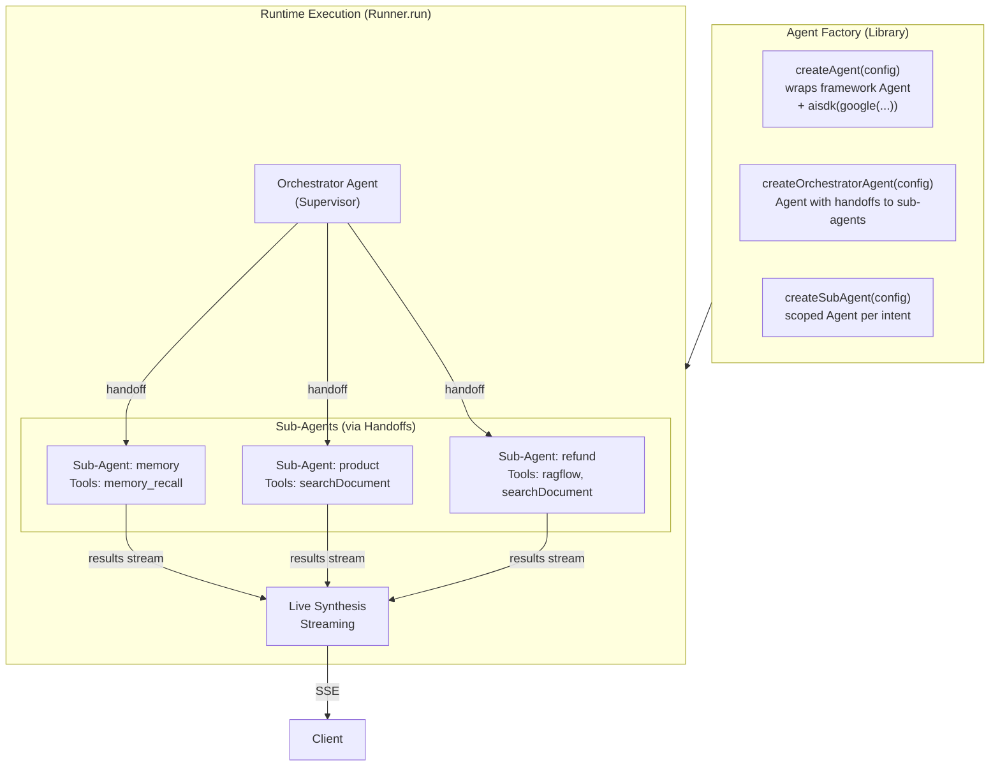

---

## Agent Factory (createAgent)

The core factory wraps `@openai/agents` framework's `Agent` class with safeagent-specific configuration. It uses `aisdk(google(...))` from `@openai/agents-extensions` to bridge Gemini into the framework's provider-agnostic `Model` interface. It's the foundation for ALL agents in the system.

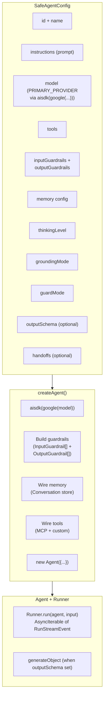

### Agent Modes

The agent operates in distinct modes depending on the use case:

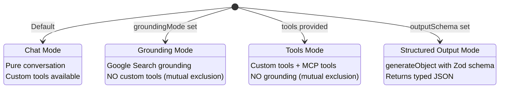

**Critical constraint**: Gemini grounding and custom tools are mutually exclusive in the same agent call (AI SDK limitation). The factory creates separate agent instances for grounding vs tool-use modes.

### Parallel Grounding

For queries that benefit from both grounding and tool responses, the library provides a parallel execution pattern:

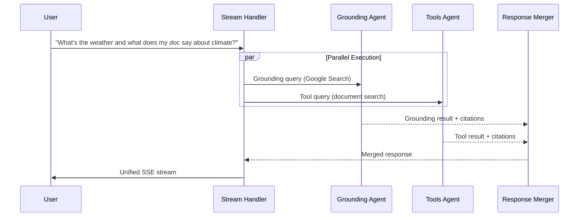

---

## Orchestrator Agent Pattern (NEW)

The orchestrator is a **supervisor agent** that handles multi-intent messages by routing to sub-agents via the framework's handoff mechanism. Handoffs are implemented as tool calls under the hood — the LLM calls `transfer_to_<agent_name>()` to route control.

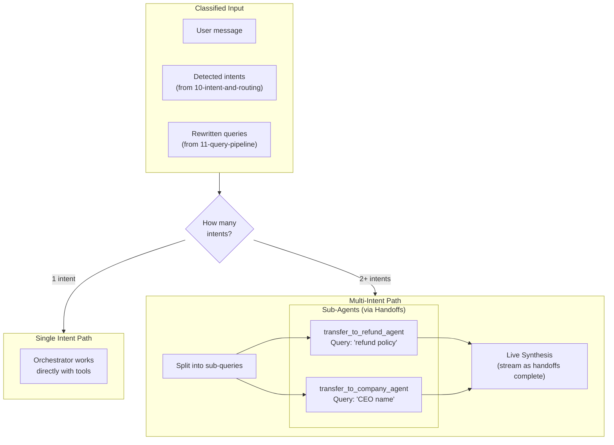

### Sub-Agent Lifecycle

Each sub-agent is an independent `Agent` instance with its own tools, scoped to a single intent. The framework's `Handoff` mechanism transfers control from the orchestrator to the sub-agent. The `inputFilter` hook on each handoff rewrites conversation history to scope the sub-agent to its assigned intent. The `onHandoff` callback logs the routing decision to Langfuse.

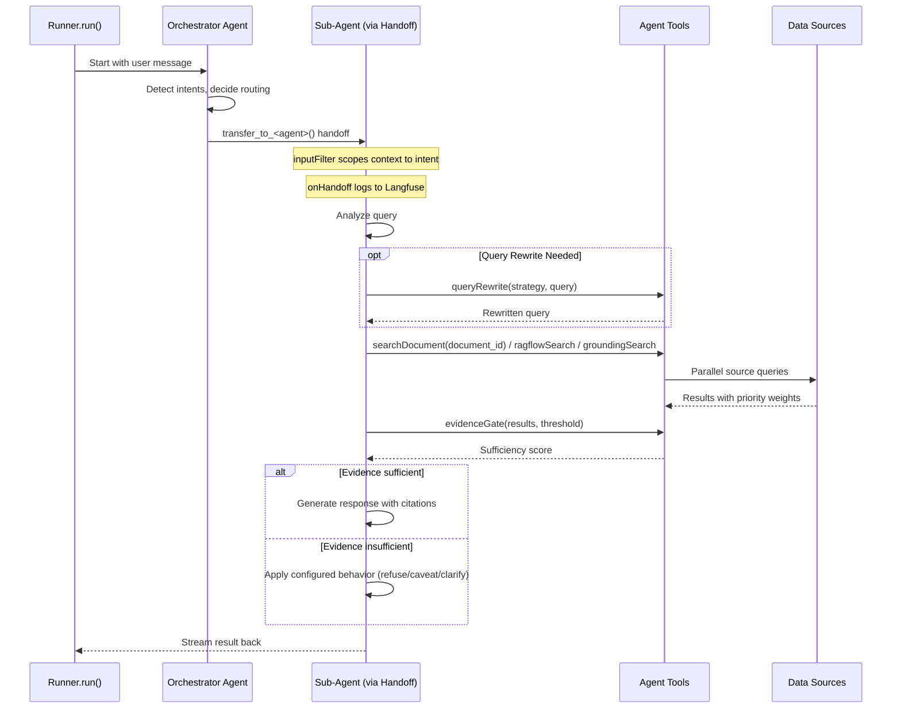

### Auto-Trigger Memory Recall on New Threads

The memory recall tool uses a hybrid access pattern: auto-triggered on the first turn of new threads, agent-initiated on subsequent turns. This balances comprehensiveness (new threads always get cross-thread context) with efficiency (established threads don't waste tokens on irrelevant memory lookups).

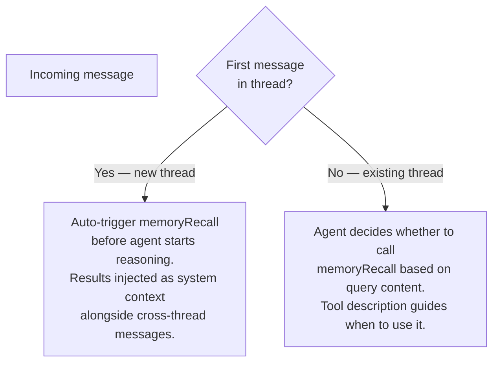

**Why auto-trigger on first turn**: In a new thread, the agent has zero context. A vague message like "the place I went yesterday" provides no signal for the agent to decide whether memory is relevant. By auto-triggering, the agent always starts a new thread with the user's recent context available.

**Why agent-initiated after**: Once the thread has established its own context, auto-triggering would waste tokens on most queries. The agent is better positioned to decide when memory is relevant based on the conversation flow.

**Injection format**: Recalled context is injected as system context alongside the thread short-term history and cross-thread messages (if the thread is young). The orchestrator receives all three layers before reasoning begins.

### Context Window Budget Enforcement

Before reasoning starts, the engine assembles full context in strict priority order:

1. System prompt
2. Current message
3. Tool definitions
4. Last N thread turns
5. Rolling summary
6. Auto-recalled facts
7. User short-term

After assembly, a token estimator (`character_count / 4`) computes the total budget usage and compares it against `CONTEXT_WINDOW_BUDGET`.

If assembled context exceeds budget, truncation runs in reverse priority order:

1. Drop user short-term context first
2. Cap auto-recalled facts to `MAX_RECALL_TOKENS`
3. Compact rolling summary
4. Drop oldest thread turns

The system prompt, current message, and tool definitions are never truncated.

### Thread Resurrection Handling

When the time gap between the current message and the previous message in thread history exceeds `THREAD_RESURRECTION_GAP`, the orchestrator treats the turn as a resurrection event.

On resurrection, the orchestrator auto-triggers memory recall using key entities from the rolling summary and injects a staleness notice into context:

"This thread has been inactive for [N days]. Some previously discussed context may no longer be available."

**Ordering guarantee**: Memory loading (all three layers in parallel) completes BEFORE intent detection runs. Auto-triggered recall uses the raw user message as its search query — it does not need a classified intent. This means there is no circular dependency between memory and intent detection. See [07-memory-system.md](./07-memory-system.md) § Memory and Intent Detection for the full two-phase pipeline.

---

### Live Synthesis Streaming

When multiple sub-agents run in parallel, the orchestrator synthesizes responses in real-time as they complete:

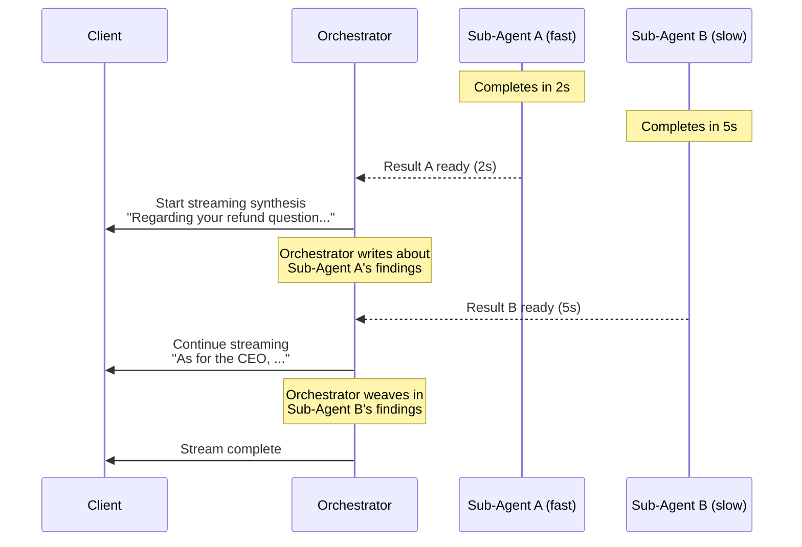

**How live synthesis works**:
1. Orchestrator starts streaming as soon as the FIRST sub-agent completes
2. It writes about the first result naturally
3. When subsequent sub-agents complete, it weaves their results into the ongoing stream
4. The final output reads as a coherent, unified response — not fragmented sections

**Why this is the best UX**:
- Time-to-first-token is bounded by the FASTEST sub-agent, not the slowest
- User sees progress immediately
- Response reads naturally (orchestrator synthesizes, not concatenates)

### Dependent Intent Handling

When the LLM validator detects dependent intents (e.g., "the place I went yesterday is terrible, find me another one" = feedback + constrained search), the orchestrator processes them sequentially, not in parallel. This ensures constraints from earlier intents are available to later intents.

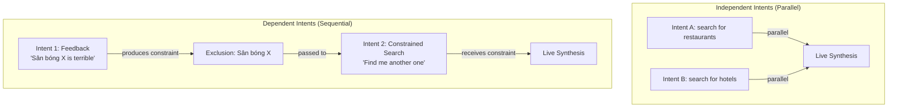

**Sequential processing flow**:
1. Feedback intent processed first → produces constraint (e.g., exclusion of disliked place)
2. Search intent processed second → receives constraint from feedback intent
3. Results synthesized as both complete

**Detection**: The LLM intent validator (from file 10) detects dependent intents by analyzing the query structure. Patterns like "the X I mentioned is bad, find me another" or "I don't like Y, what about Z" indicate dependency.

**Constraint passing mechanism**: When the first intent in the dependency chain completes, the orchestrator extracts a structured constraint object from its output. The constraint has the shape `{ type, entities, metadata }`:

| Constraint type | When produced | What it carries |
|----------------|---------------|-----------------|
| `exclusion` | Feedback intent identifies a disliked entity | `entities`: names/IDs to exclude from subsequent search results |
| `refinement` | Context intent narrows scope | `entities`: scope qualifiers (e.g., company name, location); `metadata`: additional filters |
| `context` | Context-establishment intent provides background | `entities`: key entities mentioned; `metadata`: relevant facts for grounding |

The orchestrator passes this constraint to the dependent intent's `Handoff` via the `inputFilter` hook. The `inputFilter` prepends a constraint instruction to the sub-agent's conversation history as a system message: *"The following constraints apply to your task: [serialized constraint]. You MUST respect these constraints in your response."* The sub-agent sees the constraint as part of its scoped context and applies it during tool use (e.g., passing `exclusions` to the source priority router — see [11-query-pipeline.md](./11-query-pipeline.md)).

---

## Tool Registry

Each agent (orchestrator or sub-agent) has access to a specific set of tools based on its role:

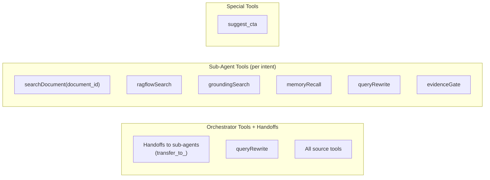

| Tool | Description | Used By |
|------|-------------|---------|
| `searchDocument` | Search uploaded documents by document_id | Sub-agents, orchestrator (single intent) |
| `ragflowSearch` | Query RAGFlow external KB | Sub-agents |
| `groundingSearch` | Google Search grounding (separate agent call — not an LLM tool; see Parallel Grounding section above) | Orchestrator (parallel agent spawn) |
| `memoryRecall` | Long-term memory semantic search with auto-trigger on new threads | Sub-agents, auto-triggered on first turn |
| `threadSummary` | Returns rolling summary for current thread | Orchestrator, sub-agents (on-demand) |
| `memoryInspect` | Returns paginated user memories organized by category | User-initiated (via agent) |
| `memoryDelete` | Deletes specific memories after user confirmation | User-initiated (via agent) |
| `resolveOrdinal` | Resolves ordinal references against recent structured result sets | Sub-agents |
| `queryRewrite` | Conditional query rewriting | Sub-agents, orchestrator |
| `evidenceGate` | Evidence sufficiency scoring | Sub-agents |
| `suggest_cta` | Call-to-action suggestions | Orchestrator only (end of response) |

### Tool Assignment Flow

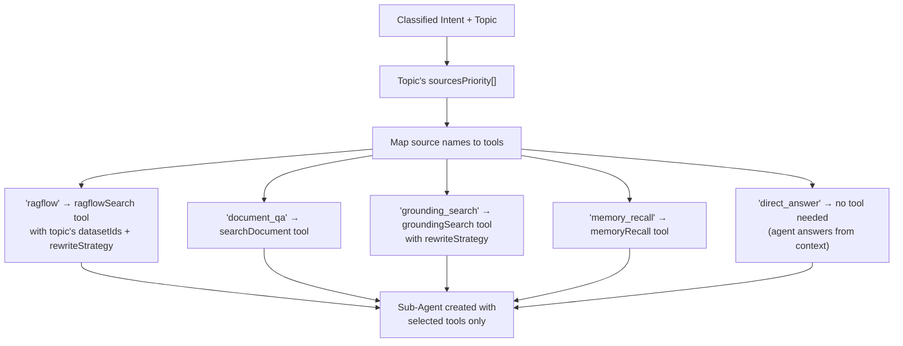

---

## Location Enrichment Tool (LOCATION_TOOL)

**Purpose**: When the model discusses places, it can call the search_locations tool so each place is enriched with coordinates and optional images. Client applications use these events to render interactive maps and inline place visuals.

**Factory**: createLocationTool accepts a LocationToolConfig and returns an AI SDK tool definition.

**Tool name**: search_locations.

**Suppression pattern**: Tool-call and tool-result stream chunks for search_locations are suppressed using the same mechanism as suggest_cta. A `createLocationStreamProcessor` intercepts `search_locations` tool chunks, suppresses them from the outbound stream, and emits clean `location` events derived from the tool result.

**Input contract**: The model passes a places list and optional context text. Context clarifies ambiguous place names and improves provider relevance.

**Internal flow**:
1. For each place, check Valkey cache first.
2. On cache miss, call the configured geocoding provider with place name and optional context.
3. If an image search provider is configured, call it with a place-context query and max image count. Otherwise set images to an empty array.
4. Cache enrichment payloads in Valkey using configured TTL rules.
5. Emit a `location` SSE event for each resolved place. If geocoding returns null for a place, skip emitting an event for that place (degrade silently: log + continue).

**LLM autonomy**: The model decides when to call search_locations. Common triggers are place recommendations, directions, and responses anchored to specific venues or regions. Generic responses do not require the tool.

```mermaid
flowchart LR
    LLM[LLM response planner] --> TOOL_CALL[AI SDK tool call: search_locations]
    TOOL_CALL --> TOOL_EXEC[search_locations execute()]

    TOOL_EXEC --> PARALLEL{Per place in parallel}
    PARALLEL --> GEOCODE[Geocode provider path]
    PARALLEL --> IMAGE[Image search provider path (optional)]

    GEOCODE --> MERGE[Merge LocationResult]
    IMAGE --> MERGE

    MERGE --> RESULT[LocationResult[]]
    RESULT --> PROC[createLocationStreamProcessor]
    PROC --> SSE[Emit location SSE events]
```

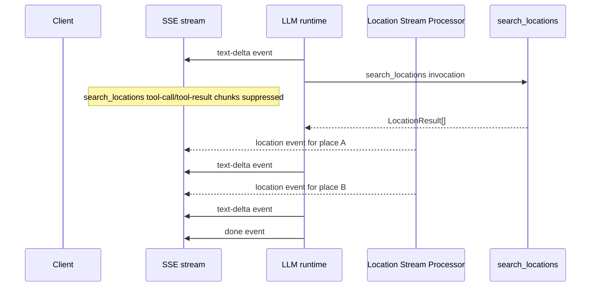

### Task LOCATION_TOOL: Location Enrichment Tool

**What to do**: Implement `createLocationTool` factory that accepts a `LocationToolConfig` and returns an AI SDK tool definition named `search_locations`. The tool receives a list of place names and optional context, resolves each place through the configured `GeocodeProvider` (Nominatim by default), optionally fetches images via the configured `ImageSearchProvider`, and returns `LocationResult[]`. Implement Valkey caching for resolved locations with configurable TTL. Implement `createLocationStreamProcessor` that intercepts `search_locations` tool-call and tool-result chunks, suppresses them from the outbound stream, and emits `location` SSE events derived from the tool result. Silent degradation: if geocoding returns null for a place, log a warning and skip that place (no event emitted, no error surfaced to client). Implement convenience adapter helpers: `createGooglePlacesImageProvider(apiKey)` wraps Google Places Photos as an `ImageSearchProvider` including place imagery and coordinates support.

**Depends on**: CORE_TYPES, AGENT_FACTORY, VALKEY_CACHE

**Acceptance Criteria**:

- `createLocationTool` returns a valid AI SDK tool definition with name `search_locations`
- Tool resolves place names through the configured GeocodeProvider
- Valkey cache is checked before calling the geocode provider; cache hits skip the provider call
- Cache entries use configurable TTL
- `createLocationStreamProcessor` suppresses `search_locations` tool-call and tool-result chunks from the outbound stream
- Each resolved place emits a `location` SSE event with `name`, `type`, `lat`, `lng`, `images`, and optional `context`
- Unresolved places (geocode returns null) are silently skipped with a log warning
- When no ImageSearchProvider is configured, `images` defaults to an empty array
- GeocodeProvider and ImageSearchProvider are pluggable — server can substitute custom implementations
- `createGooglePlacesImageProvider(apiKey)` returns a valid `ImageSearchProvider` implementation

**QA Scenarios**:

- Call tool with a known city name → LocationResult returned with valid lat/lng coordinates
- Call tool with the same city twice → second call hits Valkey cache, no geocode provider invocation
- Call tool with a nonexistent place name → geocode returns null, no location event emitted, no error
- Call tool with ImageSearchProvider configured → images array populated with results
- Call tool without ImageSearchProvider → images array is empty
- Stream a response that triggers search_locations → tool-call and tool-result chunks are not in the SSE output, but location events appear
- Configure a custom GeocodeProvider → tool uses the custom provider instead of Nominatim

---

## Agent Router (Query Classification)

For systems with multiple specialized agents (not just intents), the router dispatches to the right agent:

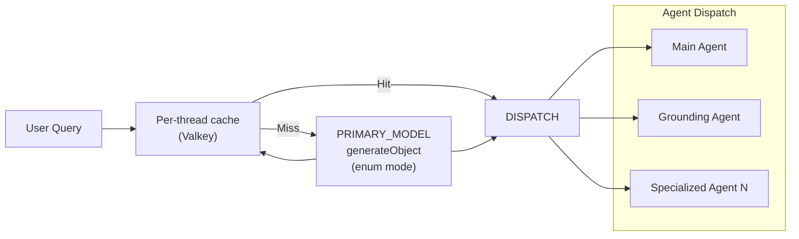

The router uses Gemini Flash Lite's `generateObject` with `output: 'enum'` for single-token classification (~50ms). Results are cached per-thread in Valkey (same thread = same agent for conversation continuity).

---

## Scaling: Queue-Based Execution

For production at scale, agent execution goes through Trigger.dev:

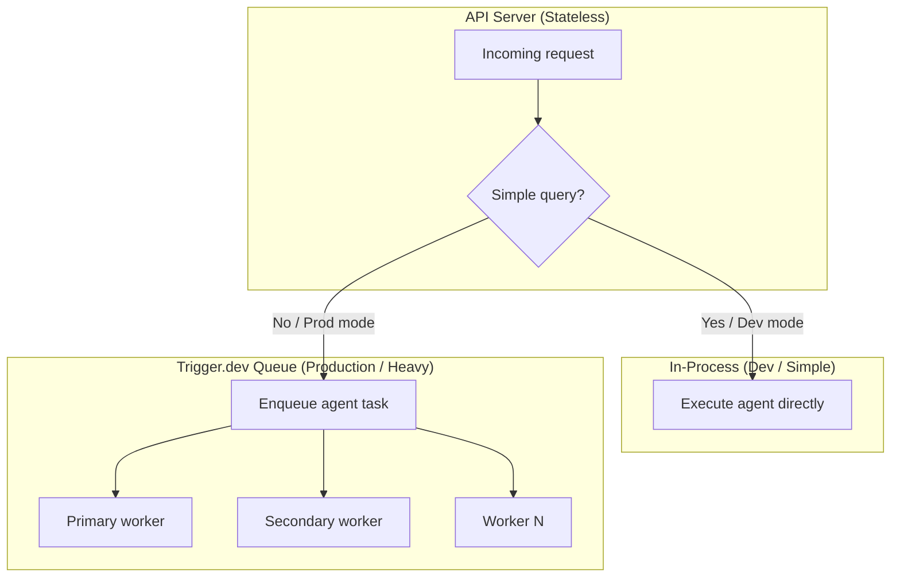

**Configurable per deployment**:
- **Dev/testing**: All agent execution in-process (no queue overhead)
- **Production (simple)**: Single-intent queries in-process, multi-intent queued
- **Production (full)**: Everything through Trigger.dev for uniform scaling and observability

---

## Provider Fallback

Simple try/catch fallback for model failures:

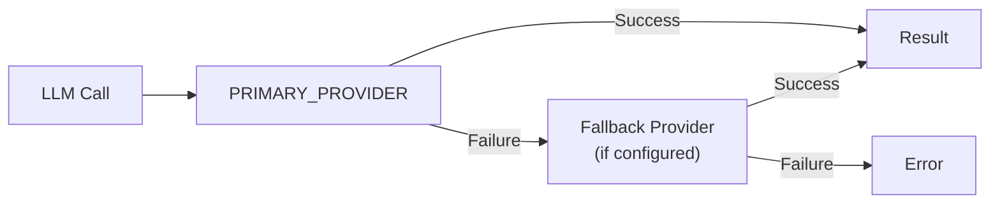

`createFallbackModel` wraps two providers. If primary fails, tries fallback. No smart routing — just sequential try/catch. This is intentionally simple.

---

## Humanlikeness Agent Behaviors

This section defines four humanlikeness enhancements that adjust orchestration behavior before generation begins. The goal is not to hard-code stylistic output, but to improve context preparation and decision shaping so the agent can respond naturally under real conversational conditions.

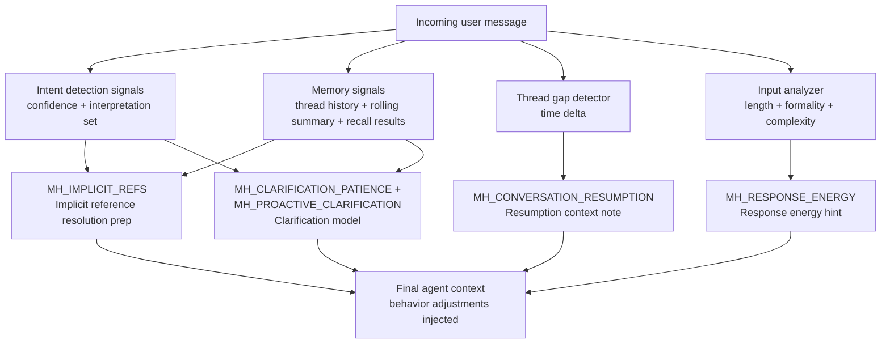

### Implicit Reference Resolution (**MH_IMPLICIT_REFS**)

Implicit references are handled as a context assembly enhancement over memory recall and context budgeting. When user language contains anaphora such as "the other one," "do that again," or "what about yesterday's thing," the engine must inject both recent conversation turns and relevant recall results before the model reasons.

If likely referents are outside the active window, the engine proactively expands recall scope to include candidates from rolling summaries and longer-term memory strata. This behavior is retrieval-first, not interpretation-first: the engine provides candidate context, and the model resolves the actual referent during normal reasoning.

### Response Energy Matching (**MH_RESPONSE_ENERGY**)

A dedicated response calibration step computes lightweight input characteristics and injects a soft calibration hint into the agent context. The signal includes message length in tokens, formality markers, and a question complexity estimate.

Short casual messages bias toward concise replies, while detailed multi-sentence prompts bias toward comprehensive responses. This remains advisory rather than mandatory: when safety, risk, or correctness requires depth, the agent overrides brevity and responds thoroughly.

### Conversation Resumption (**MH_CONVERSATION_RESUMPTION**)

Thread resurrection is extended with explicit conversational resumption behavior. When inactivity exceeds a configurable threshold (default 24 hours), the engine injects a resumption note into context that includes a human-readable time delta, the last topic summary, and a cue to acknowledge the gap naturally.

This allows the model to re-enter the thread in a human way (for example, by signaling that it is picking up prior work) instead of restarting with no transition. The behavior preserves continuity while still allowing fresh intent analysis on the new turn.

### Clarification Patience Model (**MH_CLARIFICATION_PATIENCE**, **MH_PROACTIVE_CLARIFICATION**)

The clarification model combines proactive disambiguation with loop prevention in a single policy module.

For proactive clarification, when the intent pipeline indicates genuine ambiguity (low embedding confidence and multiple plausible interpretations), the agent asks one brief clarifying question that presents the top two to three interpretations. This reduces vague back-and-forth and helps the user select direction quickly.

For patience control, the orchestrator tracks consecutive clarification rounds per thread. After a configurable threshold (default two rounds), the agent must stop re-asking and produce a best-effort answer using explicit assumptions. This ensures progress and prevents indefinite clarification loops while still being transparent about uncertainty.

---

## Cross-References

| Component | Interaction |
|-----------|------------|
| **Intent Detection** ([10](./10-intent-and-routing.md)) | Provides classified intents + rewritten queries to orchestrator; detects dependent intents for sequential processing |
| **Query Pipeline** ([11](./11-query-pipeline.md)) | Source priority and rewrite strategies assigned to sub-agent tools |
| **Guardrails** ([06](./06-guardrails-and-safety.md)) | Input processors run before agent, output processors on stream |
| **Memory** ([07](./07-memory-system.md)) | Thread short-term auto-injected, user short-term injected when thread is young, long-term via memoryRecall tool (auto-triggered on new threads); threadSummary, memoryInspect, memoryDelete tools for user control; resolveOrdinal for structured result references |
| **RAG** ([09](./09-rag-and-retrieval.md)) | searchDocument tool uses hybrid search infrastructure |
| **Evidence Gate** ([12](./12-file-intelligence.md)) | Sub-agents call evidenceGate before generating responses |
| **Streaming** ([13](./13-streaming-and-transport.md)) | Orchestrator's live synthesis goes through SSE streaming layer |
| **Observability** ([16](./16-observability-and-eval.md)) | Each sub-agent run traced as a child span in Langfuse |

---

## Task Specifications

### Task AGENT_FACTORY: Agent Creation Factory + Framework Adapter

**What to do**: Create the core `createAgent` factory that wraps `@openai/agents` framework's `Agent` class with safeagent-specific configuration. Uses `aisdk(google(...))` from `@openai/agents-extensions` to bridge Gemini into the framework's `Model` interface. Wires guardrails as framework `InputGuardrail[]` / `OutputGuardrail[]`, registers tools (custom + MCP), and configures memory integration. Agent execution uses `Runner.run()` which handles the tool call loop, maxTurns, retries, and streaming.

**Depends on**: CORE_TYPES (Types), ZOD_SCHEMAS (Schemas), CONFIG_DEFAULTS (Config), STORAGE_WRAPPER (Storage), PROVIDER_HELPERS (Provider)

**Acceptance Criteria**:
- `createAgent` returns a configured framework `Agent` instance wrapped with safeagent defaults
- `aisdk(google(PRIMARY_PROVIDER))` produces a valid `Model` for the agent
- Agent modes (chat, grounding, tools, structured) each produce a non-empty response when run through `Runner.run()`
- Guardrails wired as framework `InputGuardrail[]` and `OutputGuardrail[]` on the agent
- Memory integration: Conversation store with configurable window (history passed as input items)
- Tool binding: custom tools + MCP tools registered on the agent
- `thinkingLevel` config passed to model provider
- `guardMode` config controls which guardrails are active
- `requestContext` propagation (userId, threadId) to tools via runner context
- Unit tests with MockLanguageModel from `ai/test` wrapped via `aisdk()`

**QA Scenarios**:
- Create agent with defaults → `Runner.run()` streams `RunStreamEvent` items successfully
- Create agent with grounding → google search metadata present in response
- Create agent with tools → tool calls execute within the runner loop
- Create agent with outputSchema → returns typed JSON via structured output
- Two concurrent `Runner.run()` calls with different threadIds → no state leakage

---

### Task PROVIDER_FALLBACK: Provider Fallback Helper

**What to do**: Implement `createFallbackModel` that wraps two model providers with sequential try/catch.

**Depends on**: PROVIDER_HELPERS (Provider helpers)

**Acceptance Criteria**:
- Primary succeeds → returns primary result
- Primary fails → tries fallback, returns fallback result
- Both fail → throws original primary error
- Unit tests with mocked providers

**QA Scenarios**:
- Primary responds normally → result returned, fallback never called
- Primary throws → fallback called, its result returned
- Both throw → original primary error surfaces
- Primary times out → fallback engaged within total timeout budget

---

### Task AGENT_ROUTER: Agent Router — Query Classification + Dispatch

**What to do**: Implement query classification that routes to the correct agent using `generateObject` enum mode with per-thread Valkey caching.

**Depends on**: AGENT_FACTORY (Agent Factory), SSE_STREAMING (Streaming)

**Acceptance Criteria**:
- Classification uses PRIMARY_MODEL with thinkingLevel: 'minimal'
- `output: 'enum'` mode for single-token classification
- Per-thread caching in Valkey (same thread → same agent)
- Cache invalidation on explicit user request
- Handles new threads (no cache) gracefully
- Unit tests with mocked LLM and cache

**QA Scenarios**:
- New thread (no cache) → classification runs, result cached
- Cached thread → cached agent returned, no LLM call
- User requests reclassification → cache invalidated, fresh classification
- Two concurrent requests for same thread → no duplicate classification

---

### Task MCP_CLIENT: MCP Client Configuration + Multi-Server

**What to do**: Configure the MCP client using the framework's built-in `MCPServerStdio`, `MCPServerSSE`, and `MCPServerStreamableHttp` classes from `@openai/agents`. Create a configuration layer that accepts multiple MCP server definitions and produces framework-compatible MCP server instances. Use the framework's `toolFilter` (static allowlist/blocklist) to control which MCP tools are exposed per agent. Use `cacheToolsList: true` for stable servers. Implement health monitoring and graceful reconnection on top of the framework's MCP classes. The library provides default MCP client configuration that the server can override.

**Depends on**: CORE_TYPES (Foundation Types), MCP_HEALTH (MCP Health-Check Wrapper)

**Acceptance Criteria**:
- MCP configuration produces framework-compatible `MCPServer` instances (`MCPServerStdio`, `MCPServerSSE`, or `MCPServerStreamableHttp`)
- All healthy MCP servers connect during startup and expose tools to agents automatically
- `toolFilter` per agent controls which MCP tools are available
- `cacheToolsList` is enabled for stable servers to avoid re-listing on every request
- Health monitor detects server availability changes and updates connection state
- Reconnection logic retries with backoff after disconnects and restores tool availability
- Library defaults apply when server-specific MCP overrides are not provided
- Unit tests cover healthy startup, disconnect, reconnect, and mixed healthy/unhealthy server sets

**QA Scenarios**:
- Start with three MCP servers (all healthy) → all three connect and their tools appear in agent tool list
- Start with one unhealthy server and two healthy servers → healthy servers available, unhealthy server excluded without blocking startup
- Agent with `toolFilter` allowlist → only specified MCP tools visible to that agent
- Disconnect one active MCP server during runtime → health status changes and reconnection attempts begin automatically
- Override default MCP config from server project → override values apply without breaking base defaults

---

### Task GEMINI_GROUNDING: Gemini Grounding Agent Mode

**What to do**: Implement the Gemini grounding mode that uses Google Search grounding for real-time web queries. Configure the grounding metadata extraction and citation formatting.

**Depends on**: AGENT_FACTORY (Agent Creation Factory)

**Acceptance Criteria**:
- `mode: 'grounding'` creates an agent configured for Google Search grounding
- Grounding responses include structured metadata for sources used by the model
- Citation formatter converts grounding metadata into consistent response citations
- Grounding mode works with streaming and non-streaming response paths
- Grounding-mode failures return typed errors without crashing non-grounding agent modes
- Unit tests validate grounding metadata extraction and citation formatting

**QA Scenarios**:
- Ask a real-time query in grounding mode → response includes grounded citations from search sources
- Ask the same query in chat mode → response does not include grounding metadata
- Grounding metadata contains multiple sources → formatter outputs deterministic citation ordering
- Grounding provider error during request → typed error surfaced to caller and stream closes without hanging connections
- Streaming grounding response → citations remain aligned with final grounded answer content

---

### Task ORCHESTRATOR: Orchestrator Agent Framework

**What to do**: Implement the orchestrator supervisor pattern using the framework's `Handoff` mechanism. The orchestrator is an `Agent` with `handoffs` configured to point at sub-agents. Each handoff uses `inputFilter` to scope conversation history to the assigned intent, and `onHandoff` to log the routing decision. For multi-intent messages, the orchestrator spawns parallel sub-agent runs and synthesizes results as they stream back. The framework's `Runner` handles handoff execution automatically — when the LLM calls `transfer_to_<agent>()`, the runner switches to the target agent.

**Depends on**: AGENT_FACTORY (Agent Factory), EMBED_ROUTER (Embedding Router), LLM_INTENT (LLM Intent Validator), SOURCE_ROUTER (Source Priority Router)

**Acceptance Criteria**:
- `createOrchestratorAgent` creates an `Agent` with `handoffs` to sub-agents
- Each handoff has `inputFilter` to scope context and `onHandoff` for Langfuse logging
- Single intent → orchestrator works directly with tools (no handoff overhead)
- Multiple independent intents → parallel sub-agent runs via handoffs, one per intent
- Multiple dependent intents → sequential sub-agent runs with constraint passing via inputFilter
- Sub-agents execute independently with their own tool sets
- Auto-trigger memoryRecall on first turn of new thread before agent reasoning begins
- Recalled context injected as system context alongside thread short-term and user short-term
- After first turn, memoryRecall returns to agent-initiated mode
- Live synthesis: orchestrator streams response as handoffs complete
- First handoff completion → streaming starts immediately
- Subsequent handoff completions → woven into ongoing stream
- All sub-agents fail → error propagated with context
- One sub-agent fails → remaining results still synthesized (graceful degradation)
- Framework tracing: each handoff traced as a span automatically
- Unit tests with mocked sub-agents and dependent intent scenarios

**QA Scenarios**:
- Single intent query → no handoff, direct execution
- Dual intent query → two handoffs in parallel, results merged
- Triple intent query → three handoffs spawned, live synthesis stream contains content from all three
- One handoff times out → remaining results still delivered with note about partial failure
- All handoffs timeout → user-facing error message

---

### Task SUBAGENT_FACTORY: Sub-Agent Factory

**What to do**: Implement the sub-agent factory that creates intent-scoped `Agent` instances with the right tools based on the topic's source priority configuration. Each sub-agent is a framework `Agent` that the orchestrator references via a `Handoff`. The factory produces both the `Agent` instance and the corresponding `Handoff` configuration (including `inputFilter`, `onHandoff`, and optional `isEnabled` predicate for conditional routing).

**Depends on**: AGENT_FACTORY (Agent Factory), ORCHESTRATOR (Orchestrator), SOURCE_ROUTER (Source Priority Router)

**Acceptance Criteria**:
- `createSubAgent` creates a scoped framework `Agent` + its `Handoff` config
- Tool set determined by topic's sourcesPriority
- Each source in priority list → mapped to corresponding tool on the agent
- Rewrite strategies assigned per-tool based on topic config
- Evidence gate tool included with topic's threshold config
- Sub-agent prompt includes intent context for focused generation
- `inputFilter` on the handoff scopes conversation to the assigned intent
- Unit tests verifying correct tool assignment from IntentConfig

**QA Scenarios**:
- Topic with 3 sources → sub-agent created with 3 tools
- Topic with RAGFlow source → RAGFlow tool included with correct dataset IDs
- Topic with HyDE rewrite strategy → tool configured with HyDE rewriter
- Missing evidence threshold config → defaults applied
- Handoff `inputFilter` removes irrelevant conversation turns

---

### Task DEPENDENT_INTENT: Dependent Intent Coordination

**What to do**: Implement the orchestrator's ability to detect and process dependent intents sequentially. When the LLM intent validator detects dependent intents (e.g., "the place I went yesterday is terrible, find me another one" = feedback + constrained search), the orchestrator processes them sequentially instead of in parallel. The feedback intent is processed first, producing a constraint (e.g., exclusion of disliked place). The constraint is passed to the dependent search intent via the `inputFilter` hook on the handoff, ensuring the search respects the feedback. Implement constraint passing through the handoff context and verify sequential execution order.

**Depends on**: ORCHESTRATOR (Orchestrator Agent Framework), LLM_INTENT (LLM Intent Validator)

**Acceptance Criteria**:
- Orchestrator detects dependent intents from LLM intent validator output
- Dependent intents are processed sequentially, not in parallel
- Feedback intent executes first and produces a constraint
- Constraint is passed to dependent intent via inputFilter context
- Dependent intent receives constraint and applies it to its search/filtering logic
- Results from both intents are synthesized into a coherent response
- Independent intents continue to execute in parallel (no regression)
- Unit tests verify sequential vs parallel execution paths
- Constraint passing verified through inputFilter context inspection

**QA Scenarios**:
- Dual independent intents → both execute in parallel, results merged
- Dual dependent intents (feedback + search) → feedback executes first, constraint passed to search, search respects constraint
- Triple intents (feedback + search + other) → feedback and search sequential, other parallel with them
- Constraint prevents disliked item from appearing in results → exclusion constraint applied correctly
- One dependent intent fails → remaining results still delivered with note about partial failure
- Constraint context visible in sub-agent execution trace → inputFilter context includes constraint

---

## External References

- OpenAI Agents SDK documentation: https://openai.github.io/openai-agents-js/
- OpenAI Agents SDK — Handoffs: https://openai.github.io/openai-agents-js/guides/handoffs
- OpenAI Agents SDK — Guardrails: https://openai.github.io/openai-agents-js/guides/guardrails
- OpenAI Agents SDK — AI SDK bridge: https://openai.github.io/openai-agents-js/extensions/ai-sdk
- AI SDK generateObject (model layer): https://sdk.vercel.ai/docs/ai-sdk-core/generating-structured-data

---

*Previous: [04 — Types & Foundation](./04-types-and-foundation.md)*
*Next: [06 — Guardrails & Safety](./06-guardrails-and-safety.md)*
