# 05 — Conversation Pipeline
> **Scope**: Full conversation pipeline from input validation to response assembly.
>
> This document unifies prior intent and query pipeline plans into one coherent flow. Humanlike signals are first-class behavior within normal pipeline stages.

---
## Table of Contents
- [Why This Pipeline Matters](#why-this-pipeline-matters)
- [Unified Architecture Overview](#unified-architecture-overview)
- [Phase 0: Input Validation and Early Language Gate](#phase-0-input-validation-and-early-language-gate)
- [Phase 1: Non-Actionable Detection](#phase-1-non-actionable-detection)
- [Phase 2: Context Assembly](#phase-2-context-assembly)
- [Phase 3: Two-Stage Intent Classification with Integrated Signals](#phase-3-two-stage-intent-classification-with-integrated-signals)
- [Intent Configuration (Server-Defined)](#intent-configuration-server-defined)
- [Embedding Router Cache Strategy](#embedding-router-cache-strategy)
- [Fallback and Ambiguity Handling](#fallback-and-ambiguity-handling)
- [Multi-Intent and Dependent Multi-Intent](#multi-intent-and-dependent-multi-intent)
- [Language Validation Piggyback](#language-validation-piggyback)
- [Temporal Expression Resolution](#temporal-expression-resolution)
- [Phase 4: Unified Rewrite + Source Routing Flow](#phase-4-unified-rewrite--source-routing-flow)
- [Conditional Rewriting and the 7 Triggers](#conditional-rewriting-and-the-7-triggers)
- [Source-Specific Rewrite Strategies](#source-specific-rewrite-strategies)
- [Source Priority Execution](#source-priority-execution)
- [Result Merging with Priority Weighting](#result-merging-with-priority-weighting)
- [RAGFlow Integration](#ragflow-integration)
- [Library vs Server Responsibilities](#library-vs-server-responsibilities)
- [Cross-References](#cross-references)
- [Task Specifications](#task-specifications)
- [External References](#external-references)

---
## Why This Pipeline Matters
The system serves multiple domains (support, product info, policy, and more). Without intent-aware routing, every query fans out everywhere, increasing latency and cost while reducing quality. This pipeline classifies intent with memory context, rewrites only when needed, routes sources by priority, merges evidence with weighting, and assembles grounded responses with recovery-aware conversation behavior.

---
## Unified Architecture Overview
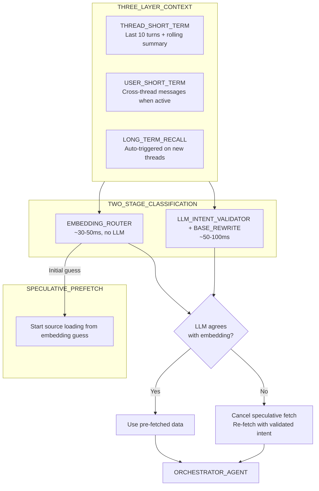
```mermaid
graph TB
    THREAD_SHORT_TERM["THREAD_SHORT_TERM<br/>Last 10 turns + rolling summary"]
    USER_SHORT_TERM["USER_SHORT_TERM<br/>Cross-thread messages when active"]
    LONG_TERM_RECALL["LONG_TERM_RECALL<br/>Auto-triggered on new threads"]
    subgraph THREE_LAYER_CONTEXT["THREE_LAYER_CONTEXT"]
        THREAD_SHORT_TERM
        USER_SHORT_TERM
        LONG_TERM_RECALL
    end
    subgraph TWO_STAGE_CLASSIFICATION["TWO_STAGE_CLASSIFICATION"]
        direction TB
        EMBEDDING_ROUTER["EMBEDDING_ROUTER<br/>~30-50ms, no LLM"]
        LLM_INTENT_VALIDATOR["LLM_INTENT_VALIDATOR + BASE_REWRITE<br/>~50-100ms"]
    end
    subgraph SPECULATIVE_PREFETCH["SPECULATIVE_PREFETCH"]
        PREFETCH_START["Start source loading from embedding guess"]
    end
    AGREEMENT{LLM agrees<br/>with embedding?}
    USE_PREFETCH["Use pre-fetched data"]
    CANCEL_REFETCH["Cancel speculative fetch<br/>Re-fetch with validated intent"]
    ORCHESTRATOR["ORCHESTRATOR_AGENT"]
    THREE_LAYER_CONTEXT --> EMBEDDING_ROUTER
    EMBEDDING_ROUTER -->|Initial guess| PREFETCH_START
    THREE_LAYER_CONTEXT --> LLM_INTENT_VALIDATOR
    EMBEDDING_ROUTER --> AGREEMENT
    LLM_INTENT_VALIDATOR --> AGREEMENT
    AGREEMENT -->|Yes| USE_PREFETCH --> ORCHESTRATOR
    AGREEMENT -->|No| CANCEL_REFETCH --> ORCHESTRATOR
```

---
## Phase 0: Input Validation and Early Language Gate
Fast language detection runs first for clear allow/block paths. Ambiguous or mixed-language content proceeds to intent classification. Intended output language is validated in the same structured intent call (piggyback), avoiding extra model latency.
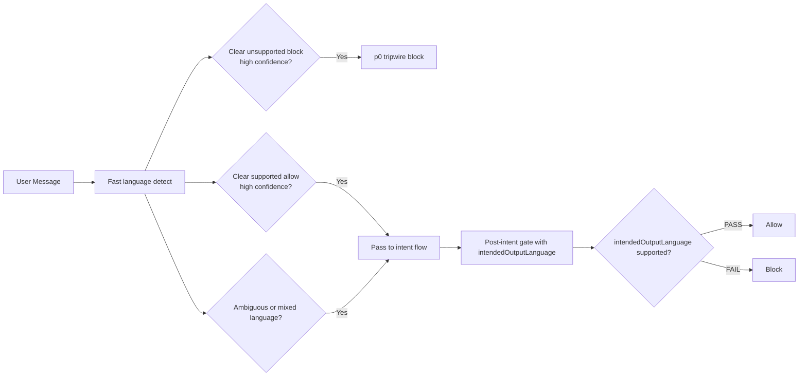
```mermaid
flowchart LR
    USER_MESSAGE[User Message] --> FAST_DETECT[Fast language detect]
    FAST_DETECT --> BLOCK_DECISION{Clear unsupported block\nhigh confidence?}
    BLOCK_DECISION -->|Yes| TRIPWIRE_BLOCK[p0 tripwire block]
    FAST_DETECT --> ALLOW_DECISION{Clear supported allow\nhigh confidence?}
    ALLOW_DECISION -->|Yes| INTENT_FLOW[Pass to intent flow]
    FAST_DETECT --> AMBIGUOUS{Ambiguous or mixed language?}
    AMBIGUOUS -->|Yes| INTENT_FLOW
    INTENT_FLOW --> POST_INTENT_GATE[Post-intent gate with intendedOutputLanguage]
    POST_INTENT_GATE --> CHECK{intendedOutputLanguage supported?}
    CHECK -->|PASS| ALLOW[Allow]
    CHECK -->|FAIL| BLOCK[Block]
```

---
## Phase 1: Non-Actionable Detection
Before embedding or LLM calls, a conservative pre-filter short-circuits only fully non-actionable turns.

First gate: pleasantries, acknowledgments, and single-emoji-only messages.

Second gate: gibberish via entropy and language reliability signals.

Return shape: non-actionable classification with subtype values for pleasantry, acknowledgment, emoji-only, or gibberish.

Short-circuit path skips embedding, LLM intent, rewriting, source routing, and fact extraction. Mixed actionable turns do not short-circuit. Tuning prioritizes false-positive avoidance for short valid tokens, abbreviations, and non-Latin scripts.
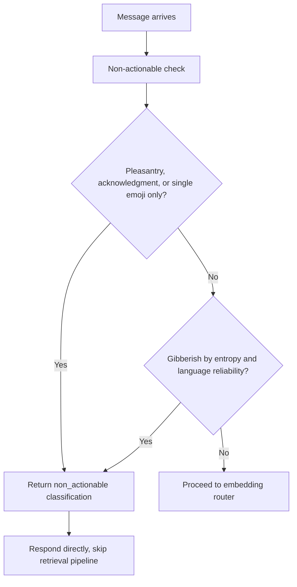
```mermaid
flowchart TB
    MESSAGE_ARRIVES[Message arrives]
    NON_ACTIONABLE_CHECK[Non-actionable check]
    PLEASANTRY_ACK_EMOJI{Pleasantry, acknowledgment, or single emoji only?}
    GIBBERISH_CHECK{Gibberish by entropy and language reliability?}
    DIRECT_NON_ACTIONABLE[Return non_actionable classification]
    DIRECT_RESPONSE[Respond directly, skip retrieval pipeline]
    FULL_PIPELINE[Proceed to embedding router]
    MESSAGE_ARRIVES --> NON_ACTIONABLE_CHECK
    NON_ACTIONABLE_CHECK --> PLEASANTRY_ACK_EMOJI
    PLEASANTRY_ACK_EMOJI -->|Yes| DIRECT_NON_ACTIONABLE --> DIRECT_RESPONSE
    PLEASANTRY_ACK_EMOJI -->|No| GIBBERISH_CHECK
    GIBBERISH_CHECK -->|Yes| DIRECT_NON_ACTIONABLE
    GIBBERISH_CHECK -->|No| FULL_PIPELINE
```

---
## Phase 2: Context Assembly
Intent routing consumes three-layer context:
- Thread short-term (last turns + rolling summary).
- User short-term (cross-thread messages when active).
- Long-term recall (auto-triggered for new threads).

Ordering guarantee: memory loading completes before intent detection. First-turn recall uses raw user message and does not depend on pre-classified intent. See [07 — Memory & Intelligence](./07-memory.md).

---
## Phase 3: Two-Stage Intent Classification with Integrated Signals
Two-stage model, one coherent flow:
- Fast embedding router provides semantic hint and confidence.
- LLM intent validator is authority and returns validated intent package plus base rewrite and control signals.

### Embedding Router Stage (~30-50ms)
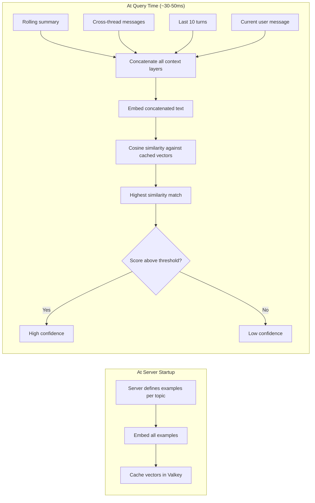
```mermaid
flowchart LR
    subgraph SETUP["At Server Startup"]
        EXAMPLES["Server defines examples per topic"] --> EMBED_EXAMPLES["Embed all examples"]
        EMBED_EXAMPLES --> CACHE_VALKEY["Cache vectors in Valkey"]
    end
    subgraph RUNTIME["At Query Time (~30-50ms)"]
        ROLLING["Rolling summary"]
        CROSS_THREAD["Cross-thread messages"]
        LAST_TURNS["Last 10 turns"]
        CURRENT["Current user message"]
        ROLLING --> CONCAT["Concatenate all context layers"]
        CROSS_THREAD --> CONCAT
        LAST_TURNS --> CONCAT
        CURRENT --> CONCAT
        CONCAT --> EMBED_QUERY["Embed concatenated text"]
        EMBED_QUERY --> COMPARE["Cosine similarity against cached vectors"]
        COMPARE --> BEST_MATCH["Highest similarity match"]
        BEST_MATCH --> THRESHOLD{Score above threshold?}
        THRESHOLD -->|Yes| HIGH["High confidence"]
        THRESHOLD -->|No| LOW["Low confidence"]
    end
```

### LLM Validation + Base Rewrite Stage (~50-100ms)
The LLM always runs and receives embedding guess as hint.

Single structured output includes:
- validated intent, validated topics, rewritten query, clarification requirement, and detected intent count.
- intended output language, translation-intent signal, and translation target language.
- temporal references, dependent intents, and dependency order.
- attribute-level negations and query replay structure.
- Correction, frustration, topic abandonment, and ambiguity signals.
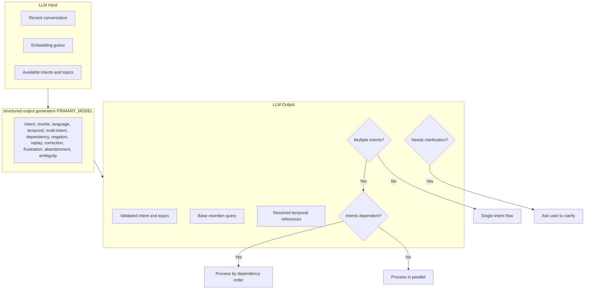
```mermaid
flowchart TB
    subgraph INPUT["LLM Input"]
        CONVERSATION["Recent conversation"]
        EMBEDDING_HINT["Embedding guess"]
        INTENT_LIST["Available intents and topics"]
    end
    subgraph LLM_CALL["structured output generation PRIMARY_MODEL"]
        SCHEMA["Intent, rewrite, language, temporal, multi-intent, dependency, negation, replay, correction, frustration, abandonment, ambiguity"]
    end
    subgraph OUTPUT["LLM Output"]
        VALIDATED["Validated intent and topics"]
        REWRITTEN["Base rewritten query"]
        TEMPORAL["Resolved temporal references"]
        MULTI{Multiple intents?}
        CLARIFY{Needs clarification?}
        DEPENDENT{Intents dependent?}
    end
    INPUT --> LLM_CALL --> OUTPUT
    MULTI -->|Yes| DEPENDENT
    MULTI -->|No| SINGLE["Single-intent flow"]
    DEPENDENT -->|Yes| ORDERED["Process by dependency order"]
    DEPENDENT -->|No| PARALLEL["Process in parallel"]
    CLARIFY -->|Yes| ASK["Ask user to clarify"]
```

### Speculative Pre-Fetching
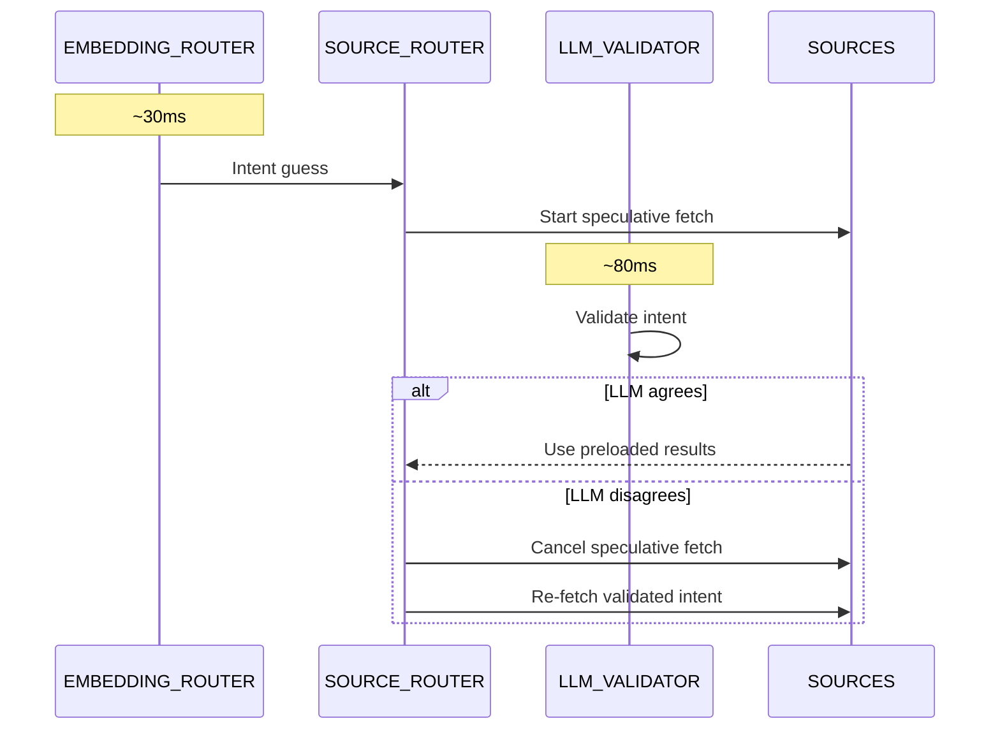
```mermaid
sequenceDiagram
    participant EMBEDDING_ROUTER as EMBEDDING_ROUTER
    participant SOURCE_ROUTER as SOURCE_ROUTER
    participant LLM_VALIDATOR as LLM_VALIDATOR
    participant SOURCES as SOURCES
    Note over EMBEDDING_ROUTER: ~30ms
    EMBEDDING_ROUTER->>SOURCE_ROUTER: Intent guess
    SOURCE_ROUTER->>SOURCES: Start speculative fetch
    Note over LLM_VALIDATOR: ~80ms
    LLM_VALIDATOR->>LLM_VALIDATOR: Validate intent
    alt LLM agrees
        SOURCES-->>SOURCE_ROUTER: Use preloaded results
    else LLM disagrees
        SOURCE_ROUTER->>SOURCES: Cancel speculative fetch
        SOURCE_ROUTER->>SOURCES: Re-fetch validated intent
    end
```

### Integrated Humanlike Signals in Intent Pipeline
Correction detection is part of LLM intent classification and triggers immediate re-interpretation against corrected user constraints.

Frustration detection is part of signal detection during intent analysis and tracks escalation across turns to inject de-escalation context.

Topic abandonment is part of intent classification and flushes stale topic context.

Proactive clarification is part of ambiguity handling in low-confidence, multi-plausible cases.
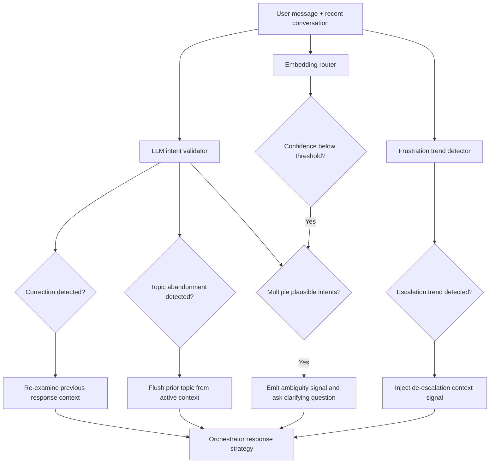
```mermaid
flowchart TB
    MESSAGE[User message + recent conversation]
    EMBED[Embedding router]
    LLM[LLM intent validator]
    FRUSTRATION_SIGNAL[Frustration trend detector]
    MESSAGE --> EMBED
    MESSAGE --> LLM
    MESSAGE --> FRUSTRATION_SIGNAL
    EMBED --> CONF_LOW{Confidence below threshold?}
    LLM --> CORRECTION{Correction detected?}
    LLM --> ABANDONMENT{Topic abandonment detected?}
    LLM --> PLAUSIBLE{Multiple plausible intents?}
    FRUSTRATION_SIGNAL --> ESCALATION{Escalation trend detected?}
    CORRECTION --> REEXAMINE[Re-examine previous response context]
    ABANDONMENT --> FLUSH[Flush prior topic from active context]
    CONF_LOW -->|Yes| PLAUSIBLE
    PLAUSIBLE -->|Yes| CLARIFY[Emit ambiguity signal and ask clarifying question]
    ESCALATION --> DEESCALATE[Inject de-escalation context signal]
    REEXAMINE --> ORCH[Orchestrator response strategy]
    FLUSH --> ORCH
    CLARIFY --> ORCH
    DEESCALATE --> ORCH
```

---
## Intent Configuration (Server-Defined)
The server defines all intents and topics; library includes no built-in business intents.
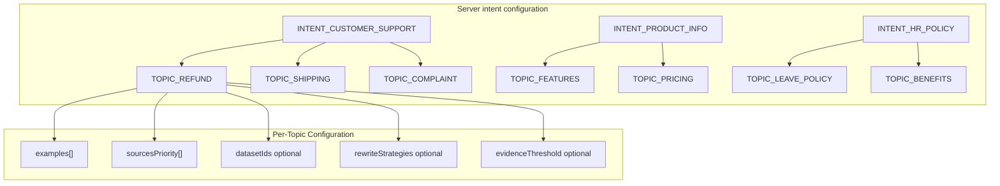
```mermaid
graph TD
    subgraph INTENT_CONFIG["Server intent configuration"]
        INTENT_CUSTOMER_SUPPORT["INTENT_CUSTOMER_SUPPORT"]
        INTENT_PRODUCT_INFO["INTENT_PRODUCT_INFO"]
        INTENT_HR_POLICY["INTENT_HR_POLICY"]
        INTENT_CUSTOMER_SUPPORT --> TOPIC_REFUND["TOPIC_REFUND"]
        INTENT_CUSTOMER_SUPPORT --> TOPIC_SHIPPING["TOPIC_SHIPPING"]
        INTENT_CUSTOMER_SUPPORT --> TOPIC_COMPLAINT["TOPIC_COMPLAINT"]
        INTENT_PRODUCT_INFO --> TOPIC_FEATURES["TOPIC_FEATURES"]
        INTENT_PRODUCT_INFO --> TOPIC_PRICING["TOPIC_PRICING"]
        INTENT_HR_POLICY --> TOPIC_LEAVE_POLICY["TOPIC_LEAVE_POLICY"]
        INTENT_HR_POLICY --> TOPIC_BENEFITS["TOPIC_BENEFITS"]
    end
    subgraph TOPIC_DETAIL["Per-Topic Configuration"]
        TOPIC_REFUND --> EXAMPLES_LIST["examples[]"]
        TOPIC_REFUND --> SOURCE_PRIORITY["sourcesPriority[]"]
        TOPIC_REFUND --> DATASET_IDS["datasetIds optional"]
        TOPIC_REFUND --> REWRITE_STRATEGIES["rewriteStrategies optional"]
        TOPIC_REFUND --> EVIDENCE_THRESHOLD["evidenceThreshold optional"]
    end
```

### Intent Configuration Type Shape
| Field | Type | Description |
|-------|------|-------------|
| intents | map of intent names to intent definitions | Named business intents |
| intent description field | text | LLM-readable domain description |
| intent topics field | map of topic names to topic definitions | Named topics |
| topic examples field | list of text | Embedding router examples |
| topic source priority field | ordered list of source names | Ordered source list |
| topic dataset override field (optional) | list of text | Topic-level dataset override |
| topic rewrite strategy override field (optional) | map from source to strategy label | Per-source strategy override |
| topic evidence threshold field (optional) | evidence threshold configuration object | Topic-specific evidence behavior |
| topic empty-result behavior field (optional) | map from source to empty-result status | Empty result handling by source |
| embedding confidence threshold field (optional) | numeric value | Embedding confidence cutoff |
| fallback behavior field | clarify | No-match fallback behavior |

### Scale Considerations
- Typical scale: multiple intents and topics.
- Cached vectors fit comfortably in Valkey at expected scale.
- Per-query classification cost is one embedding call plus one structured LLM call.
- Intent configuration update triggers full re-embedding.

---
## Embedding Router Cache Strategy

```mermaid
flowchart TB
    subgraph STARTUP["Server Startup"]
        CONFIG["intent configuration"] --> EXTRACT["Extract topic examples"]
        EXTRACT --> BATCH["Batch embed examples"]
        BATCH --> STORE["Store vectors in Valkey hash"]
    end
    subgraph QUERY["Per Query"]
        EMBED_QUERY["Embed query"] --> FETCH["Fetch cached vectors"]
        FETCH --> COSINE["Compute cosine similarity"]
        COSINE --> SORT["Sort by similarity"]
        SORT --> TOP["Return top match and score"]
    end
    subgraph INVALIDATION["Cache Invalidation"]
        CHANGE["intent configuration changes"] --> CLEAR["Delete Valkey hash"]
        CLEAR --> REEMBED["Re-embed examples"]
    end
```
Performance is dominated by embedding latency; vector fetch and cosine scoring are minor.

---
## Fallback and Ambiguity Handling
No-match fallback is fixed to clarification. Low-confidence ambiguous cases trigger proactive clarification rather than forced assumptions.
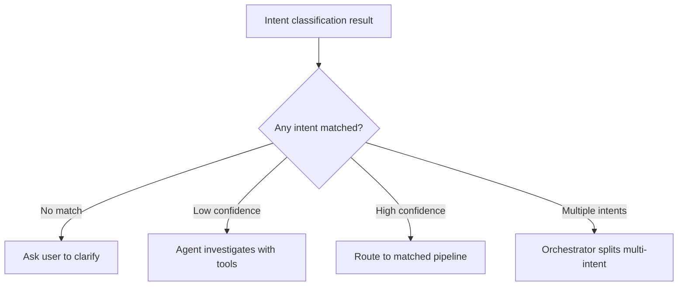
```mermaid
flowchart TB
    RESULT[Intent classification result]
    CHECK{Any intent matched?}
    CLARIFY[Ask user to clarify]
    AGENT_DECIDE[Agent investigates with tools]
    ROUTE[Route to matched pipeline]
    SPLIT[Orchestrator splits multi-intent]
    RESULT --> CHECK
    CHECK -->|No match| CLARIFY
    CHECK -->|Low confidence| AGENT_DECIDE
    CHECK -->|High confidence| ROUTE
    CHECK -->|Multiple intents| SPLIT
```

---
## Multi-Intent and Dependent Multi-Intent
Classifier outputs detected intent count and decomposition for multi-intent turns.
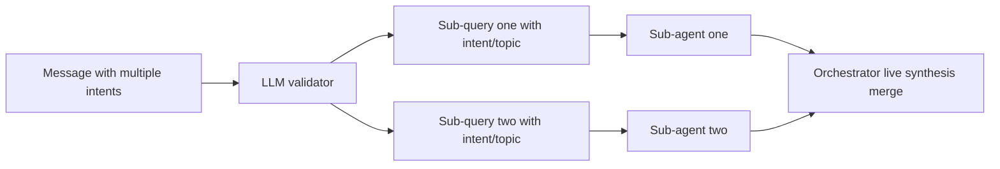
```mermaid
flowchart LR
    MSG["Message with multiple intents"]
    LLM_V["LLM validator"]
    MSG --> LLM_V
    LLM_V --> SUBQUERY_ONE["Sub-query one with intent/topic"]
    LLM_V --> SUBQUERY_TWO["Sub-query two with intent/topic"]
    SUBQUERY_ONE --> SUBAGENT_ONE["Sub-agent one"]
    SUBQUERY_TWO --> SUBAGENT_TWO["Sub-agent two"]
    SUBAGENT_ONE --> MERGE["Orchestrator live synthesis merge"]
    SUBAGENT_TWO --> MERGE
```
Dependent intents include a dependency list and explicit dependency order.
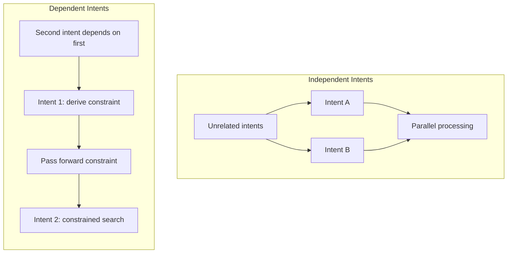
```mermaid
flowchart TB
    subgraph INDEPENDENT["Independent Intents"]
        direction LR
        MSG_IND["Unrelated intents"]
        INTENT_A["Intent A"]
        INTENT_B["Intent B"]
        MSG_IND --> INTENT_A
        MSG_IND --> INTENT_B
        INTENT_A --> PARALLEL_A["Parallel processing"]
        INTENT_B --> PARALLEL_A
    end
    subgraph DEPENDENT["Dependent Intents"]
        direction TB
        MSG_DEP["Second intent depends on first"]
        FEEDBACK["Intent 1: derive constraint"]
        SEARCH["Intent 2: constrained search"]
        CONSTRAINT["Pass forward constraint"]
        MSG_DEP --> FEEDBACK
        FEEDBACK --> CONSTRAINT
        CONSTRAINT --> SEARCH
    end
```

### Common Dependency Patterns
| Pattern | Example | Dependency |
|---------|---------|-----------|
| Feedback + constrained search | Reject one result and ask for alternatives | Search depends on exclusion constraint |
| Comparison + selection | Compare then choose | Selection depends on comparison output |
| Context establishment + query | Provide org context then ask policy | Query depends on context |
| Negation + alternative | Not that one, show different | Alternative depends on negation target |

### Attribute Negation Detection
LLM emits attribute-negation entries for property-level exclusion (for example, without parking). This differs from entity exclusion constraints used in dependent-intent flows.

### Query Replay Detection
LLM emits a query-replay structure with parameter substitutions for replay turns (for example, same search but different location). Detection uses thread short-term context to recover the referenced prior query.

---
## Language Validation Piggyback
Intended output language, translation-intent signal, and translation target language are returned by intent classification. Post-intent policy checks supported output language and resolves translation edge cases correctly.

---
## Temporal Expression Resolution
Temporal phrases are resolved in intent classification to concrete ranges using user timezone from request context; UTC is fallback.

### Resolution Examples
| Expression | Resolved Range | Example |
|-----------|----------------|---------|
| yesterday | previous day start to end | 2026-03-07 00:00:00 to 2026-03-07 23:59:59 |
| last week | seven-day window ending yesterday | 2026-02-28 00:00:00 to 2026-03-06 23:59:59 |
| this morning | today start to now | 2026-03-08 00:00:00 to 2026-03-08 14:30:00 |
| last month | thirty-day window ending yesterday | 2026-02-06 00:00:00 to 2026-03-06 23:59:59 |
| today | today start to now | 2026-03-08 00:00:00 to 2026-03-08 14:30:00 |

### Integration with Memory Recall
Resolved range is passed as `temporalHint` and applied before semantic ranking.
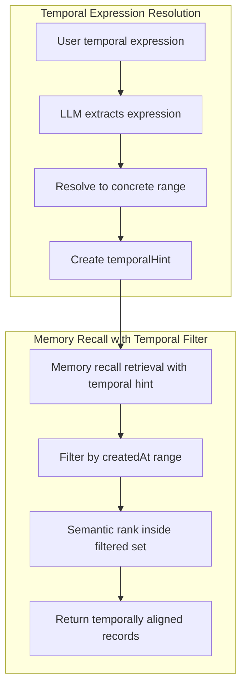
```mermaid
flowchart TB
    subgraph TEMPORAL_RESOLUTION["Temporal Expression Resolution"]
        EXPR["User temporal expression"]
        EXTRACT["LLM extracts expression"]
        RESOLVE["Resolve to concrete range"]
        HINT["Create temporalHint"]
    end
    subgraph MEMORY_RECALL["Memory Recall with Temporal Filter"]
        RECALL["Memory recall retrieval with temporal hint"]
        FILTER["Filter by createdAt range"]
        SEMANTIC["Semantic rank inside filtered set"]
        RESULT["Return temporally aligned records"]
    end
    EXPR --> EXTRACT
    EXTRACT --> RESOLVE
    RESOLVE --> HINT
    HINT --> RECALL
    RECALL --> FILTER
    FILTER --> SEMANTIC
    SEMANTIC --> RESULT
```

---
## Phase 4: Unified Rewrite + Source Routing Flow
Two-stage rewrite model as one flow:
- LLM_INTENT: trigger detection and conversation-aware base rewrite.
- REWRITE_TOOL: source-specific rewrite strategy application.
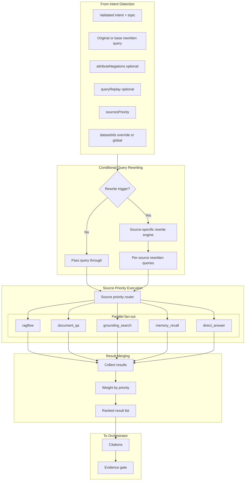
```mermaid
flowchart TB
    subgraph INPUT["From Intent Detection"]
        INTENT["Validated intent + topic"]
        QUERY["Original or base rewritten query"]
        NEGATIONS["attributeNegations optional"]
        REPLAY["queryReplay optional"]
        PRIORITY["sourcesPriority"]
        DATASETS["datasetIds override or global"]
    end
    subgraph REWRITE["Conditional Query Rewriting"]
        TRIGGER{Rewrite trigger?}
        PASS["Pass query through"]
        ENGINE["Source-specific rewrite engine"]
        PER_SOURCE["Per-source rewritten queries"]
    end
    subgraph EXECUTION["Source Priority Execution"]
        ROUTER["Source priority router"]
        subgraph PARALLEL["Parallel fan-out"]
            S_RAGFLOW["ragflow"]
            S_DOCQA["document_qa"]
            S_GROUND["grounding_search"]
            S_MEMORY["memory_recall"]
            S_DIRECT["direct_answer"]
        end
    end
    subgraph MERGE["Result Merging"]
        COLLECT["Collect results"]
        WEIGHT["Weight by priority"]
        RANKED["Ranked result list"]
    end
    subgraph OUTPUT["To Orchestrator"]
        CITATIONS["Citations"]
        EVIDENCE["Evidence gate"]
    end
    INPUT --> TRIGGER
    TRIGGER -->|No| PASS --> ROUTER
    TRIGGER -->|Yes| ENGINE --> PER_SOURCE --> ROUTER
    ROUTER --> S_RAGFLOW & S_DOCQA & S_GROUND & S_MEMORY & S_DIRECT
    S_RAGFLOW & S_DOCQA & S_GROUND & S_MEMORY & S_DIRECT --> COLLECT
    COLLECT --> WEIGHT --> RANKED --> CITATIONS --> EVIDENCE
```

---
## Conditional Rewriting and the 7 Triggers
Rewrite is conditional; no trigger means pass-through.
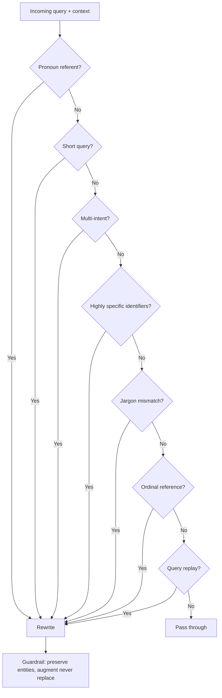
```mermaid
flowchart TB
    INCOMING_QUERY["Incoming query + context"]
    PRONOUN{Pronoun referent?}
    SHORT{Short query?}
    MULTI{Multi-intent?}
    SPECIFIC{Highly specific identifiers?}
    JARGON{Jargon mismatch?}
    ORDINAL{Ordinal reference?}
    REPLAY{Query replay?}
    PASS["Pass through"]
    REWRITE["Rewrite"]
    INCOMING_QUERY --> PRONOUN
    PRONOUN -->|Yes| REWRITE
    PRONOUN -->|No| SHORT
    SHORT -->|Yes| REWRITE
    SHORT -->|No| MULTI
    MULTI -->|Yes| REWRITE
    MULTI -->|No| SPECIFIC
    SPECIFIC -->|Yes| REWRITE
    SPECIFIC -->|No| JARGON
    JARGON -->|Yes| REWRITE
    JARGON -->|No| ORDINAL
    ORDINAL -->|Yes| REWRITE
    ORDINAL -->|No| REPLAY
    REPLAY -->|Yes| REWRITE
    REPLAY -->|No| PASS
    REWRITE --> GUARD["Guardrail: preserve entities, augment never replace"]
```
| Trigger | Example | Why it fires |
|---------|---------|--------------|
| Pronoun referent | What about that policy | Needs conversation referent |
| Short query | pricing | Too sparse for reliable retrieval |
| Multi-intent | refund policy and executive info | Needs per-intent rewrites |
| Highly specific | Error code E-4421-B | Exact identifier must be preserved |
| Jargon mismatch | cancel subscription vs terminate service agreement | Aligns source vocabulary |
| Ordinal reference | second one, last option | Must resolve prior result set entity |
| Query replay | same search but for District 7 | Reconstructs prior query with substitutions |

### Ordinal Reference Resolution
Result-set ordinals resolve using structured result memory and become explicit entity names in rewritten queries.

### Query Replay Rewriting
When replay is detected, rewriter retrieves originating query, applies parameter changes, and rebuilds full intent structure. If no suitable origin exists, fallback uses standard context rewrite.

### Critical Guardrail
All original entities (names, codes, dates, identifiers) must appear verbatim in rewritten query. If not, rewrite is discarded.

---
## Source-Specific Rewrite Strategies
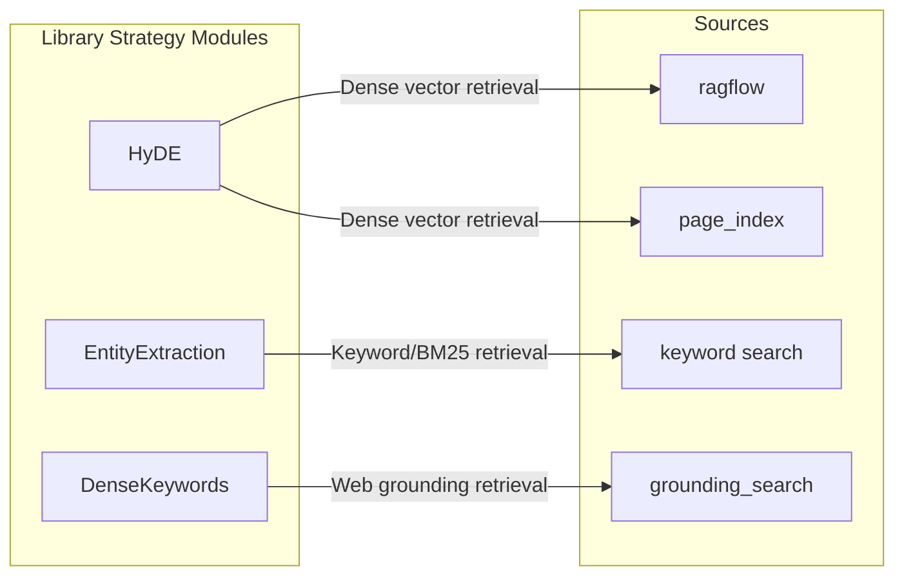
```mermaid
flowchart LR
    subgraph STRATEGIES["Library Strategy Modules"]
        HYDE["HyDE"]
        ENTITY["EntityExtraction"]
        DENSE["DenseKeywords"]
    end
    subgraph SOURCES["Sources"]
        RAGFLOW_S["ragflow"]
        PAGE_INDEX["page_index"]
        KEYWORD_ENGINE["keyword search"]
        GROUNDING_SEARCH["grounding_search"]
    end
    HYDE -->|Dense vector retrieval| RAGFLOW_S
    HYDE -->|Dense vector retrieval| PAGE_INDEX
    ENTITY -->|Keyword/BM25 retrieval| KEYWORD_ENGINE
    DENSE -->|Web grounding retrieval| GROUNDING_SEARCH
```
Strategy behavior:
- HyDE for vector retrieval sources.
- EntityExtraction for lexical retrieval sources.
- DenseKeywords for web grounding search.

Per-topic overrides apply before library defaults.
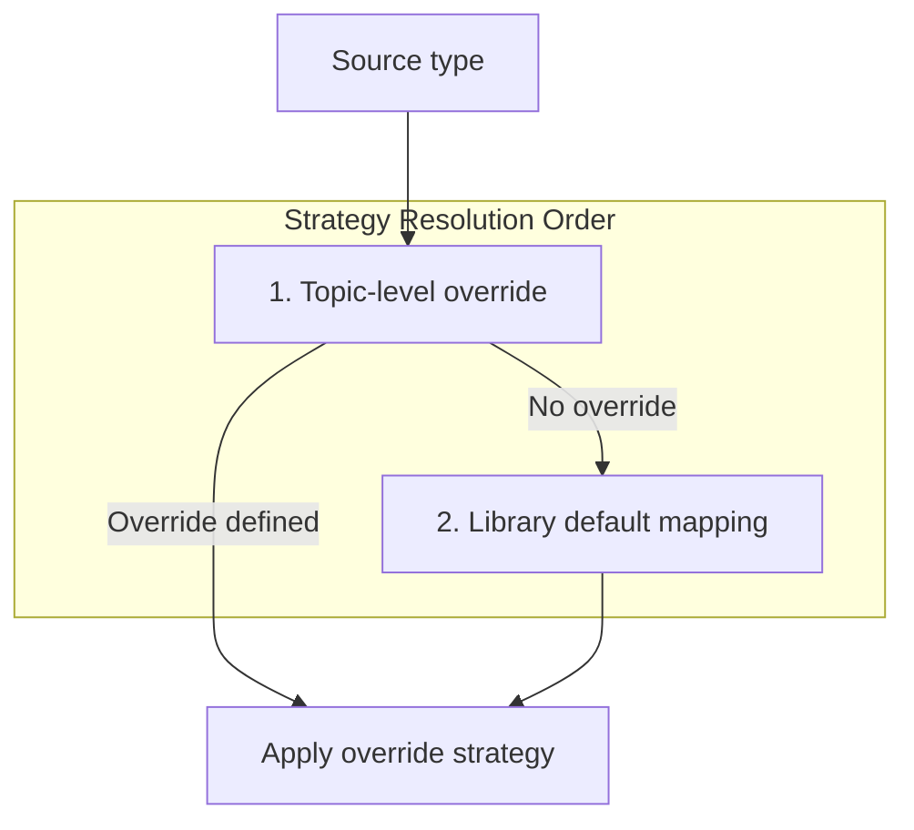
```mermaid
flowchart TB
    subgraph RESOLUTION["Strategy Resolution Order"]
        TOPIC_OVERRIDE["1. Topic-level override"]
        LIB_DEFAULT["2. Library default mapping"]
    end
    SOURCE_TYPE["Source type"] --> TOPIC_OVERRIDE
    TOPIC_OVERRIDE -->|Override defined| APPLY["Apply override strategy"]
    TOPIC_OVERRIDE -->|No override| LIB_DEFAULT --> APPLY
```

---
## Source Priority Execution
### Exclusion Constraints
Dependent-intent constraints (entity exclusions) are applied in merge filtering.
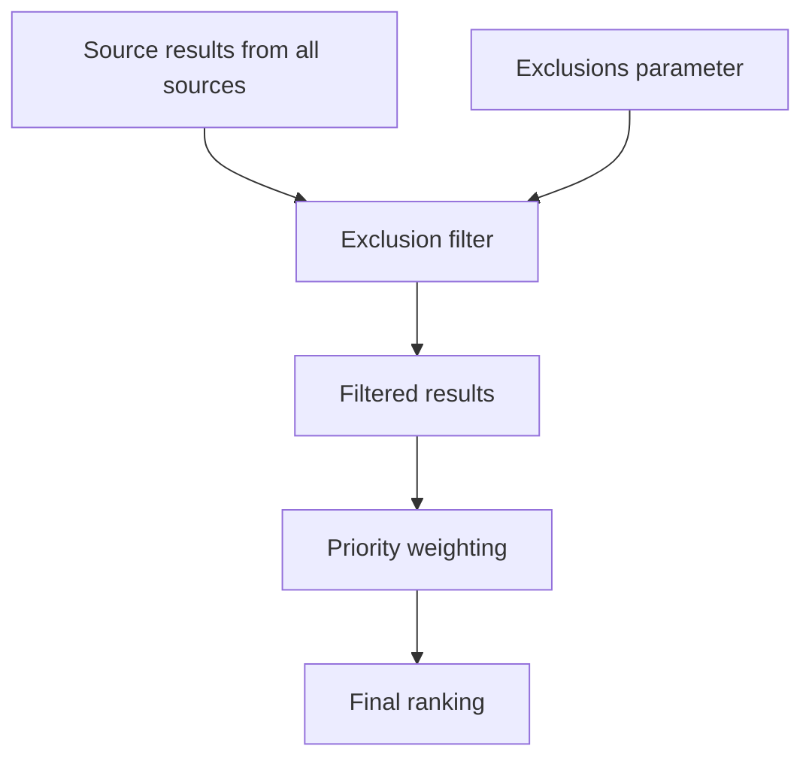
```mermaid
flowchart TB
    SOURCE_RESULTS["Source results from all sources"]
    EXCLUSIONS["Exclusions parameter"]
    FILTER_STAGE["Exclusion filter"]
    FILTERED["Filtered results"]
    PRIORITY_WEIGHT["Priority weighting"]
    FINAL_RANK["Final ranking"]
    SOURCE_RESULTS --> FILTER_STAGE
    EXCLUSIONS --> FILTER_STAGE
    FILTER_STAGE --> FILTERED
    FILTERED --> PRIORITY_WEIGHT
    PRIORITY_WEIGHT --> FINAL_RANK
```

### Attribute Negation as Search Filter
Attribute negations apply during retrieval query formulation.
| Source | Negation stage | Negation form | Benefit |
|--------|----------------|---------------|---------|
| grounding search source | Before request | Minus-prefixed negatives | Avoids pages dominated by excluded properties |
| RAG retrieval source | Before request | Contextual negative clause | Reduces irrelevant chunk retrieval |
| document question-answering source | Before request | Adapter-specific negative clause | Reduces page-level noise |
| memory recall source | Recall formulation | Negation-aware recall context | Avoids conflicting memories |
| direct answer source | Synthesis framing | Negative preference framing | Aligns generated answer with dislikes |

### Priority Configuration
| Source | Description |
|--------|-------------|
| RAG retrieval source | External read-only chunk retrieval |
| document question-answering source | Uploaded document retrieval |
| grounding search source | Web search grounding |
| memory recall source | Memory retrieval returned as context string |
| direct answer source | Direct model answer without retrieval |

All sources execute in parallel; priority affects weighting at merge time.
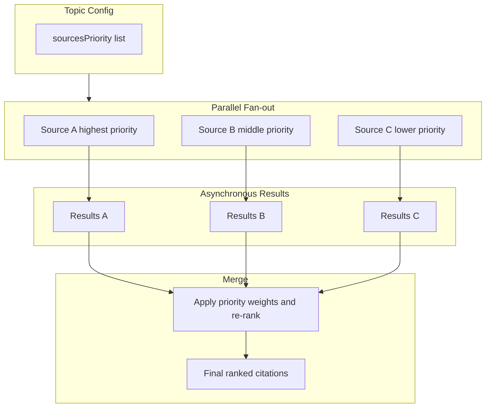
```mermaid
flowchart TB
    subgraph CONFIG["Topic Config"]
        PRIORITY_LIST["sourcesPriority list"]
    end
    subgraph EXECUTION["Parallel Fan-out"]
        direction LR
        PRIORITY_A["Source A highest priority"]
        PRIORITY_B["Source B middle priority"]
        PRIORITY_C["Source C lower priority"]
    end
    subgraph RESULTS["Asynchronous Results"]
        RESULT_A["Results A"]
        RESULT_B["Results B"]
        RESULT_C["Results C"]
    end
    subgraph MERGE["Merge"]
        WEIGHT_MERGE["Apply priority weights and re-rank"]
        FINAL["Final ranked citations"]
    end
    CONFIG --> EXECUTION
    PRIORITY_A --> RESULT_A
    PRIORITY_B --> RESULT_B
    PRIORITY_C --> RESULT_C
    RESULT_A & RESULT_B & RESULT_C --> WEIGHT_MERGE --> FINAL
```

### Fail Fast
Fan-out layer does not hide errors or auto-fallback. Source errors propagate to orchestrator. Service-level circuit breakers remain in infrastructure layer.

### Empty Result Behavior
| Behavior | Meaning |
|----------|---------|
| `normal` | Empty result expected |
| `suspicious` | Empty result unexpected and surfaced |

Suspicious empties are logged and reported to orchestrator.

---
## Result Merging with Priority Weighting
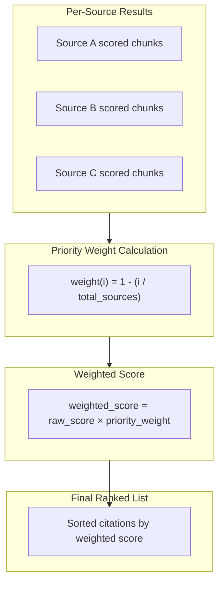
```mermaid
flowchart TB
    subgraph INPUTS["Per-Source Results"]
        R_A["Source A scored chunks"]
        R_B["Source B scored chunks"]
        R_C["Source C scored chunks"]
    end
    subgraph WEIGHTING["Priority Weight Calculation"]
        W_FORMULA["weight(i) = 1 - (i / total_sources)"]
    end
    subgraph SCORING["Weighted Score"]
        S_FORMULA["weighted_score = raw_score × priority_weight"]
    end
    subgraph OUTPUT["Final Ranked List"]
        SORTED["Sorted citations by weighted score"]
    end
    INPUTS --> WEIGHTING --> SCORING --> SORTED
```
Priority is a scaling factor, not an absolute gate.

---
## RAGFlow Integration
RAGFlow is used as a read-only retrieval engine. The system does not write to it and does not use its generation endpoint.

### Data Flow
```mermaid
sequenceDiagram
    participant QP as QUERY_PIPELINE
    participant RC as RAGFLOW_CLIENT
    participant RF as RAGFLOW_API
    participant CM as CITATION_MAPPER
    QP->>RC: question, dataset IDs, thresholds
    RC->>RF: Retrieval request with bearer token
    RF-->>RC: chunks with scores and metadata
    RC->>CM: Map to citation shape
    CM-->>QP: citations + retrieval metadata
```

### API Details
| Request Field | Type | Description |
|---------------|------|-------------|
| question field | text | Query text |
| dataset IDs field | list of text | Datasets to search |
| top-k field | numeric value | Max chunks returned |
| similarity threshold field | numeric value | Minimum similarity score |
| vector similarity weight field | numeric value | Blend vector and keyword matching |

| Response Field | Type | Description |
|----------------|------|-------------|
| content field | text | Chunk text |
| similarity field | numeric value | Combined similarity score |
| document identifier field | text | Document identifier |
| positions field | list of number pairs | Character positions |
| important keywords field | list of text | Extracted keywords |

Constraint: one request must not mix dataset embeddings that are incompatible.

### Configuration
| Config Key | Description |
|------------|-------------|
| RAGFlow base URL setting | RAGFlow base URL |
| RAGFlow API key setting | Bearer key |
| RAGFlow dataset IDs setting | Global dataset default |

Topic-level dataset overrides take precedence over global defaults.

### Chunk to Citation Mapping
```mermaid
flowchart LR
    subgraph RAGFLOW_CHUNK["RAGFlow Chunk"]
        C_CONTENT["content"]
        C_SIM["similarity"]
        C_DOC["document_keyword"]
        C_POS["positions"]
        C_KW["important_keywords"]
    end
    subgraph CITATION["Canonical Citation"]
        CI_QUOTE["quote"]
        CI_SOURCE["source"]
    end
    subgraph ENRICHMENT["Retrieval Metadata for Evidence Gate"]
        CI_SCORE["relevanceScore"]
        CI_META["positions"]
        CI_TERMS["keywords"]
    end
    C_CONTENT --> CI_QUOTE
    C_DOC --> CI_SOURCE
    C_SIM --> CI_SCORE
    C_POS --> CI_META
    C_KW --> CI_TERMS
```
Canonical citation fields are streamed; retrieval metadata remains internal for evidence scoring.

### RAGFlow in Priority Execution
```mermaid
flowchart TB
    subgraph TOPIC_CONFIG["Topic Config"]
        GLOBAL_DS["Global dataset IDs"]
        TOPIC_DS["Topic dataset override"]
    end
    subgraph RESOLUTION["Dataset Resolution"]
        CHECK{Topic has dataset override?}
        USE_TOPIC["Use topic datasets"]
        USE_GLOBAL["Use global datasets"]
    end
    subgraph CALL["RAGFlow API Call"]
        REWRITTEN["Rewritten query"]
        REQUEST["Retrieval request with resolved datasets"]
    end
    TOPIC_DS --> CHECK
    CHECK -->|Yes| USE_TOPIC --> REQUEST
    CHECK -->|No| USE_GLOBAL --> REQUEST
    REWRITTEN --> REQUEST
    REQUEST --> CHUNKS["chunks"] --> MAP["Map to citations"]
```

---
## Library vs Server Responsibilities
| Responsibility | Library | Server |
|----------------|---------|--------|
| HyDE strategy module | Exports | Assigns to sources |
| EntityExtraction strategy module | Exports | Assigns to sources |
| DenseKeywords strategy module | Exports | Assigns to sources |
| Default strategy mapping | Provides | Overrides per topic |
| Source priority execution engine | Provides | Configures via intent configuration |
| RAG retrieval client wrapper | Provides | Configures deployment values |
| Chunk-to-citation mapping | Provides | N/A |
| Priority weighting formula | Provides | N/A |
| Empty result defaults | Provides | Overrides per source/topic |
| Typed pipeline interfaces | Provides | Implements domain behavior |

---
## Cross-References
| Component | Interaction |
|-----------|------------|
| Requirements | [01 — Requirements & Constraints](./01-requirements.md) |
| Architecture | [03 — System Architecture](./03-architecture.md) |
| Agents & Orchestration | [06 — Agents & Orchestration](./06-agents.md) |
| Memory | [07 — Memory & Intelligence](./07-memory.md) |
| Retrieval | [09 — Retrieval & Evidence](./09-retrieval.md) |
| Infrastructure | [15 — Infrastructure](./15-infrastructure.md) |

---
## Task Specifications

### Task EMBED_ROUTER: Embedding Router
**What to do**: Implement embedding similarity router using cached topic vectors in Valkey.

**Depends on**: CORE_TYPES, VALKEY_CACHE, AGENT_FACTORY.

**Acceptance Criteria**:
- Startup embeds and caches topic examples.
- Input includes thread short-term, user short-term (when active), and current message.
- Concatenate context, embed once, compare by cosine similarity.
- Return top match + confidence.
- High confidence resolves intent; low confidence flags ambiguity path.
- Cache invalidates on intent configuration changes.
- Unit tests with mocked embedding provider.
- Integration tests with real Valkey.
- Vague new-thread references remain classifiable with cross-thread context.

**QA Scenarios**:
- High-confidence query resolves in target latency.
- Low-confidence ambiguous query is flagged.
- Follow-up intent continuity is preserved.
- Vague new-thread reference classifies using user short-term context.
- Cache miss gracefully re-embeds.
- Empty intent configuration does not crash.

### Task LLM_INTENT: LLM Intent Validator + Base Rewriter
**What to do**: Implement structured LLM authority for validation, conditional rewrite, and conversational signals.

**Depends on**: CORE_TYPES, AGENT_FACTORY, EMBED_ROUTER.

**Acceptance Criteria**:
- Uses structured output generation.
- Embedding guess is passed as hint.
- Outputs validated intent/topics, rewrittenQuery, needsClarification, detectedIntentsCount.
- Outputs language fields: intended output language, translation intent, translation target.
- Detects multi-intent and decomposition.
- Emits temporal references with resolved ranges.
- Emits dependentIntents and intentDependencyOrder.
- Emits attributeNegations.
- Emits queryReplay with parameter changes.
- Detects correction, frustration trend, topic abandonment, and ambiguity clarification signal.
- Rewriting is conditional and preserves original entities.
- No-match sets clarification path.
- Unit tests with mocked model.
- Meets latency target.

**QA Scenarios**:
- Embedding agreement path validates.
- Embedding mismatch is corrected.
- Independent multi-intent marked parallel.
- Dependent multi-intent marked ordered.
- Temporal phrases resolve correctly.
- Ambiguous query sets clarification.
- Pronoun query rewrites with referent.
- Short query expands with context.
- Translation edge cases resolve intended output language.
- Correction recovers prior misinterpretation.
- Abandonment flushes stale topic context.
- Frustration escalation injects de-escalation context.

### Task PREFETCH_COORD: Speculative Pre-Fetch Coordinator
**What to do**: Run embedding + LLM in parallel, prefetch sources on embedding guess, cancel/refetch on disagreement.

**Depends on**: EMBED_ROUTER, LLM_INTENT, SOURCE_ROUTER.

**Acceptance Criteria**:
- Embedding and LLM run concurrently.
- Speculative prefetch starts immediately from embedding output.
- Agreement uses prefetched data.
- Disagreement cancels and refetches validated intent.
- Embedding failure falls back to LLM result.
- LLM failure falls back to embedding result.
- Dual failure propagates error.
- Unit tests verify concurrency and cancellation.
- Performance tests verify expected latency savings.

**QA Scenarios**:
- Agreement path reduces latency.
- Disagreement path reroutes correctly.
- Slow embedding path remains correct.
- LLM timeout degrades gracefully to embedding fallback.

### Task RAGFLOW_CLIENT: RAGFlow Client + Tool
**What to do**: Implement retrieval HTTP wrapper with request/response mapping to citations.

**Depends on**: CORE_TYPES, CONFIG_DEFAULTS.

**Acceptance Criteria**:
- Raw fetch client with no SDK dependency.
- Reads base URL, API key, global dataset IDs.
- Supports per-call dataset override.
- Uses bearer authentication.
- Sends expected retrieval fields.
- Parses chunks and maps to canonical citation shape plus metadata.
- Fails fast on HTTP errors.
- Exported as tool module.
- Unit tests for success/error/malformed responses.
- Integration test against real service when configured.

**QA Scenarios**:
- Valid request returns ranked citations.
- Topic override replaces global datasets.
- Authentication failure propagates typed error.
- Empty chunks handled explicitly by caller path.
- Malformed response returns typed error.
- Missing base URL disables source gracefully.

### Task SOURCE_ROUTER: Source Priority Router
**What to do**: Implement parallel source fan-out, weighted merge, and fail-fast propagation.

**Depends on**: RAGFLOW_CLIENT, CORE_TYPES, CONFIG_DEFAULTS.

**Acceptance Criteria**:
- All sources execute concurrently.
- Weight formula is one minus source index divided by total source count.
- Weighted score merge and descending rank are stable.
- Source errors propagate immediately.
- Empty result behavior honors `normal` vs `suspicious`.
- Suspicious empties log warning and inform orchestrator.
- Strong type-safe interfaces.
- Unit tests for parallelism, weights, merge order.
- Integration tests for varied source latency.

**QA Scenarios**:
- Multi-source merge ordered by weighted score.
- Mid-priority high raw score can outrank high-priority weak score.
- One source error fails fast.
- Suspicious empty is surfaced.
- Normal empty is accepted.
- Empty priority list returns empty output.

### Task REWRITE_TOOL: Query Rewrite Tool
**What to do**: Implement conditional rewrite tool with trigger checks, strategy selection, and entity guardrail.

**Depends on**: REWRITE_STRATEGIES, CORE_TYPES, LLM_INTENT.

**Acceptance Criteria**:
- Checks all 7 triggers in order.
- No-trigger path returns original query for all sources.
- Trigger path applies source-specific strategy.
- Strategy resolution: topic override first, library default second.
- Guardrail requires verbatim entity preservation.
- Guardrail failure discards rewrite.
- Supports combined intent+rewrite structured call on qualifying paths.
- Exported as standalone tool.
- Unit tests per trigger and guardrail case.
- Uses low-thinking profile and Zod v4 schema contracts.

**QA Scenarios**:
- Pronoun query resolves referent.
- Short query expands.
- Multi-intent query yields separate rewrites.
- Specific code token preserved.
- Jargon mismatch normalized.
- No-trigger query unchanged.
- Entity loss rewrite rejected.

### Task REWRITE_STRATEGIES: Strategy Modules
**What to do**: Implement HyDE, EntityExtraction, DenseKeywords as independent modules.

**Depends on**: CORE_TYPES.

**Acceptance Criteria**:
- HyDE generates short hypothetical answer text for embedding input.
- EntityExtraction emits compact high-signal keyword output and preserves identifiers.
- DenseKeywords emits search-optimized expansions and avoids question syntax.
- All modules are named exports.
- All modules accept query and optional context/topic.
- All modules return rewritten strings.
- Unit tests with mocked model behavior.
- Modules remain independently importable.

**QA Scenarios**:
- HyDE output is concise hypothetical answer passage.
- EntityExtraction output is compact keyword string.
- DenseKeywords output is expanded keyword phrase set.
- All strategies preserve exact identifiers.
- Empty query returns typed error.

---
## External References
- AI SDK structured generation documentation
- AI SDK tools and agents documentation
- OpenAI Agents handoff guidance
- RAGFlow HTTP API reference

---
*Previous: [04 — Foundation](./04-foundation.md) | Next: [06 — Agents & Orchestration](./06-agents.md)*
