# 06 — Agents & Orchestration

> **Scope**: Agent creation factory wrapping `@openai/agents`, SDK bridge helper for Gemini, orchestrator with handoff-based sub-agent routing, multi-intent handling, live synthesis streaming, provider fallback, and context shaping behaviors that make responses feel natural under real conversational conditions.
>
> **Existing tasks**: AGENT_FACTORY (Agent Factory), PROVIDER_FALLBACK (Provider Fallback), AGENT_ROUTER (Agent Router)
> **New components**: Orchestrator pattern using framework handoffs, sub-agent framework, live synthesis

---

## Table of Contents

- [Architecture Overview](#architecture-overview)
- [Agent Factory (Agent Creation Factory)](#agent-factory-agent-creation-factory)
- [Orchestrator Agent Pattern](#orchestrator-agent-pattern)
- [Context Assembly, Budgeting, and Response Calibration](#context-assembly-budgeting-and-response-calibration)
- [Live Synthesis Streaming](#live-synthesis-streaming)
- [Dependent Intent Handling](#dependent-intent-handling)
- [Tool Registry](#tool-registry)
- [Location Enrichment Tool (LOCATION_TOOL)](#location-enrichment-tool-location_tool)
- [Agent Router (Query Classification)](#agent-router-query-classification)
- [Scaling: Queue-Based Execution](#scaling-queue-based-execution)
- [Provider Fallback](#provider-fallback)
- [Cross-References](#cross-references)
- [Task Specifications](#task-specifications)
- [External References](#external-references)

---

## Architecture Overview

The agent layer has three tiers: the **factory** (wraps `@openai/agents` framework agent class with safe defaults), the **orchestrator** (supervises multi-intent execution via the framework's handoff mechanism), and **sub-agents** (handle individual intents with scoped tools).

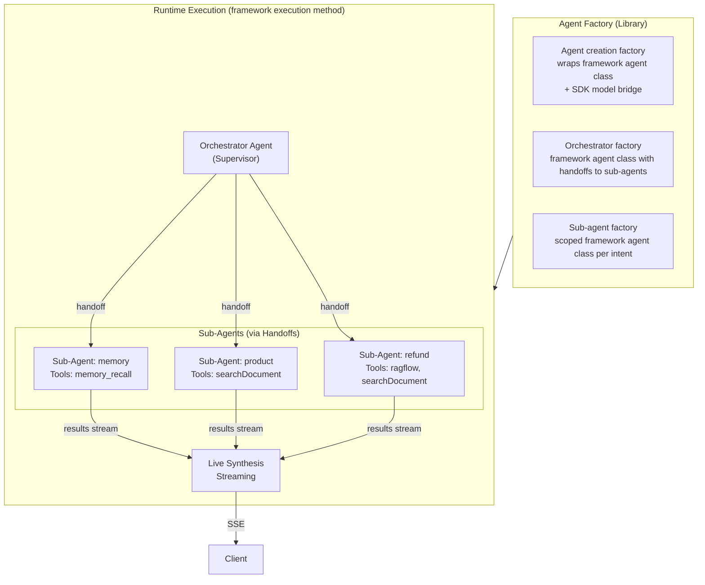

---

## Agent Factory (Agent Creation Factory)

The core factory wraps `@openai/agents` framework agent class with safeagent-specific configuration. It uses the SDK model bridge from `@openai/agents-extensions` to connect Gemini to the framework's provider-agnostic model interface. It is the foundation for all agents in the system.

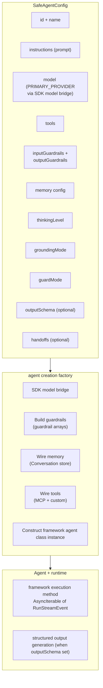

### Agent Modes

The agent operates in distinct modes depending on use case:

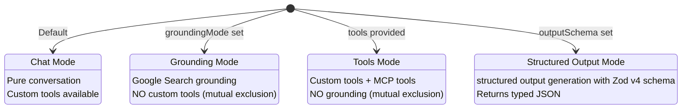

**Critical constraint**: Gemini grounding and custom tools are mutually exclusive in the same agent call (AI SDK limitation). The factory creates separate agent instances for grounding and tool-use modes.

### Parallel Grounding

For queries that benefit from both grounding and tool responses, the library provides a parallel execution pattern:

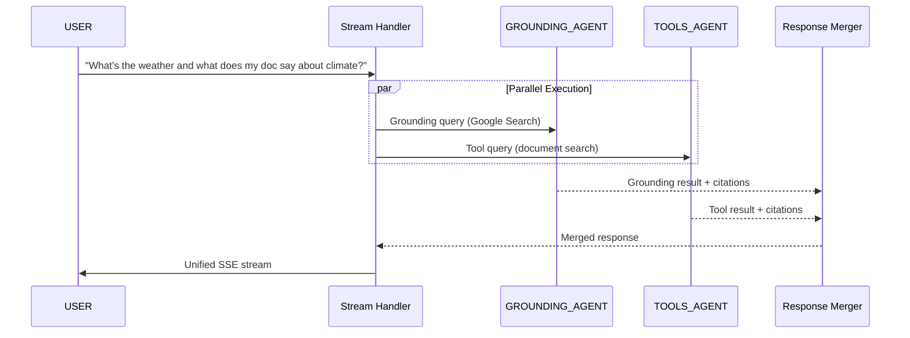

---

## Orchestrator Agent Pattern

The orchestrator is a **supervisor agent** that handles multi-intent messages by routing to sub-agents via the framework handoff mechanism. Handoffs are implemented as tool calls under the hood: the model makes an agent transfer call to route control.

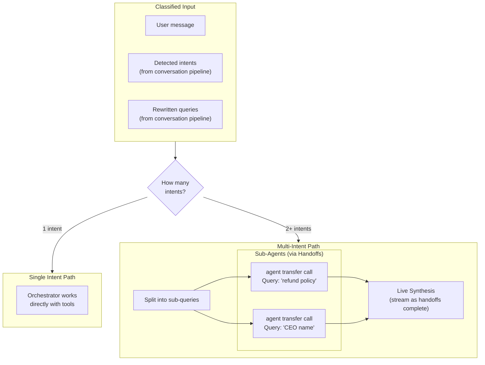

### Sub-Agent Lifecycle

Each sub-agent is an independent framework agent class instance with its own tools, scoped to a single intent. The framework's handoff mechanism transfers control from orchestrator to sub-agent. Handoff input filtering scopes conversation history so the sub-agent focuses on its assigned intent. Handoff callbacks log routing decisions.

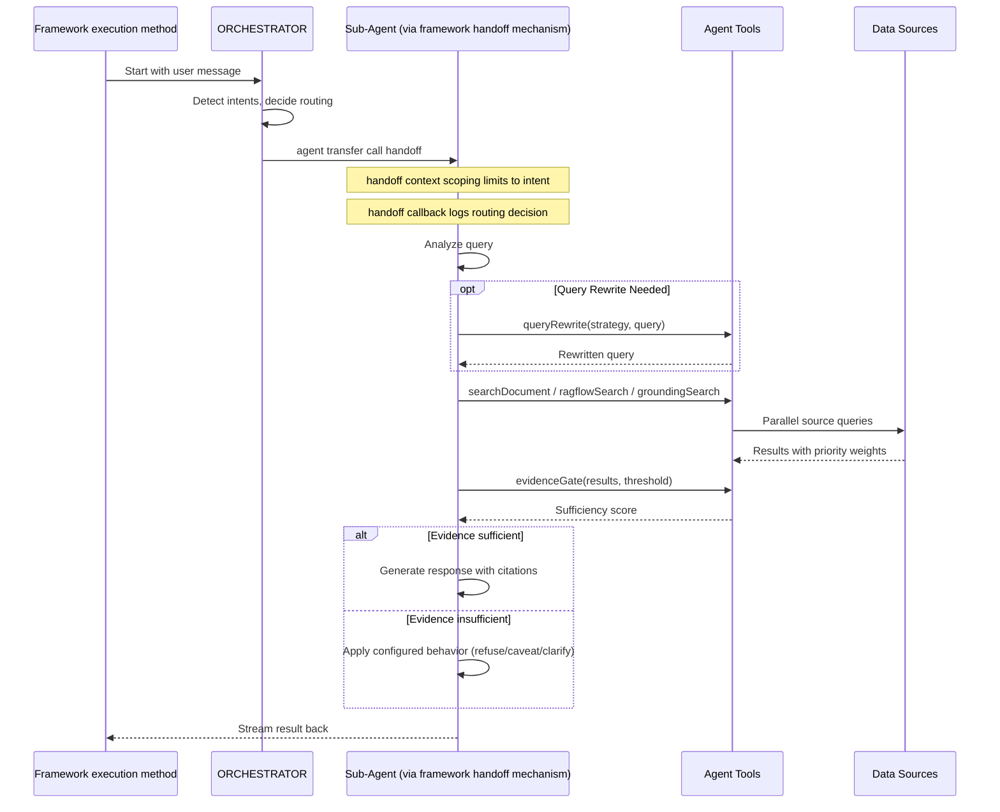

### Auto-Trigger Memory Recall on New Threads

The memory recall tool uses hybrid access: auto-triggered on the first turn of new threads, agent-initiated on later turns. This balances comprehensiveness (new threads always start with cross-thread context) and efficiency (established threads avoid unnecessary lookups).

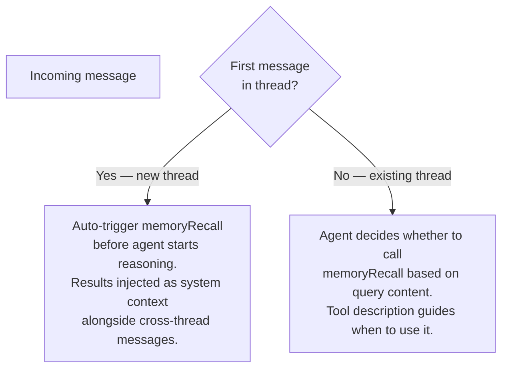

**Why auto-trigger on first turn**: In a new thread, the agent has zero local context. A vague message such as “the place I went yesterday” provides little signal for explicit tool planning. Auto-trigger ensures the first turn starts with recent user context available.

**Why agent-initiated after**: Once a thread has context, unconditional recall wastes budget. The agent can decide when memory is relevant based on conversation flow and intent confidence.

**Injection format**: Recalled context is injected as system context alongside thread short-term history and cross-thread messages (for young threads). The orchestrator receives all layers before reasoning begins.

---

## Context Assembly, Budgeting, and Response Calibration

Before reasoning starts, the engine assembles full context in strict priority order:

1. System prompt
2. Current message
3. Tool definitions
4. Last N thread turns
5. Rolling summary
6. Auto-recalled facts
7. User short-term context

After assembly, a token estimator (character count divided by four) computes budget usage and compares it against the context window budget.

If assembled context exceeds budget, truncation runs in reverse priority order:

1. Drop user short-term context first
2. Cap auto-recalled facts to the configured recall token ceiling
3. Compact rolling summary
4. Drop oldest thread turns

System prompt, current message, and tool definitions are never truncated.

At the same assembly stage, the orchestrator injects lightweight response and interpretation signals that shape generation without hard constraints:

- Implicit reference candidates are surfaced when language contains anaphora (for example: “the other one,” “do that again,” “yesterday’s thing”).
- Energy calibration hints are computed from message length, formality markers, and complexity.
- Resumption metadata is injected for long inactivity gaps.
- Clarification policy state is injected to support proactive disambiguation while avoiding clarification loops.

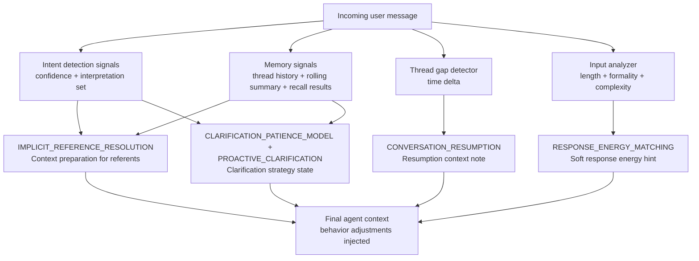

### Implicit Reference Resolution in Context Assembly

Implicit references are handled as a context assembly enhancement layered over recall and budget management. When user language contains anaphora, the engine injects both recent thread turns and relevant recalled candidates before model reasoning begins.

If likely referents are outside the active window, recall scope expands to include candidates from rolling summaries and longer-term strata. This remains retrieval-first rather than interpretation-first: the engine supplies candidates, and the model resolves the referent in normal reasoning.

### Response Energy Matching in Generation Strategy

A response calibration step computes input characteristics and injects a soft calibration hint into context. The signal includes approximate input length, formality markers, and question complexity.

Short casual messages bias toward concise responses; detailed prompts bias toward fuller responses. The hint is advisory. If safety, risk, or correctness requires depth, the agent overrides brevity.

### Thread Resurrection Handling and Conversation Resumption

When the time gap between current and previous thread message exceeds the configured resurrection gap threshold, the orchestrator treats the turn as resurrection.

On resurrection, the orchestrator auto-triggers memory recall using key entities from rolling summary and injects a staleness notice into context:

“This thread has been inactive for [N days]. Some previously discussed context may no longer be available.”

It also injects resumption metadata containing a readable time delta and last-topic summary so the model can acknowledge continuity naturally while still running fresh intent analysis for the new turn.

**Ordering guarantee**: Memory loading (all layers in parallel) completes before intent detection runs. Auto-triggered recall uses raw user message as the search query and does not depend on classified intent. This avoids circular dependency between memory loading and intent detection. See [07 — Memory & Intelligence](./07-memory.md) for the two-phase memory and intent pipeline.

### Clarification Patience Model in Orchestrator Policy

The clarification policy combines proactive disambiguation and loop prevention.

For proactive clarification, when intent signals indicate genuine ambiguity (low confidence and multiple plausible interpretations), the agent asks one brief clarifying question offering top interpretations.

For patience control, the orchestrator tracks consecutive clarification rounds per thread. After the configured threshold, the agent stops re-asking and returns a best-effort response with explicit assumptions. This guarantees progress and avoids infinite clarification loops.

---

## Live Synthesis Streaming

When multiple sub-agents run in parallel, the orchestrator synthesizes responses in real time as each sub-agent completes:

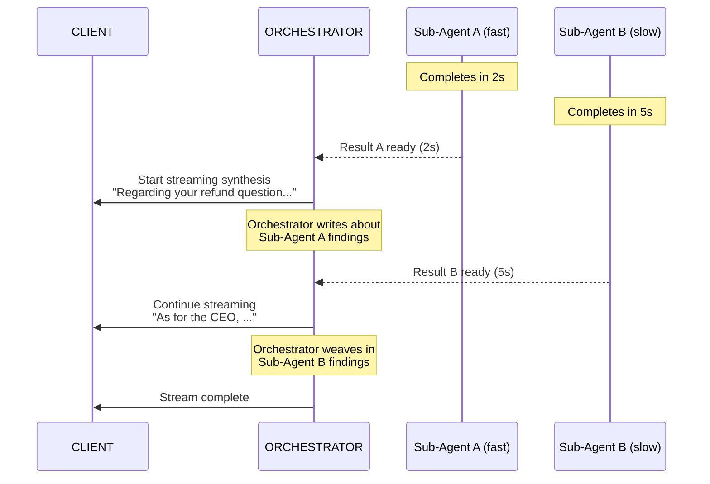

How live synthesis works:

1. Streaming starts when the first sub-agent completes.
2. The orchestrator writes naturally about that first result.
3. Later completions are woven into the same ongoing stream.
4. Final output is coherent and unified rather than concatenated fragments.

Why this improves UX:

- Time to first token is bounded by fastest sub-agent, not slowest.
- User sees progress immediately.
- Output remains natural because synthesis happens at orchestration level.

---

## Dependent Intent Handling

When the intent validator detects dependency between intents (for example, feedback + constrained search), the orchestrator processes dependent segments sequentially rather than in parallel. This guarantees constraints from earlier results are available to later stages.

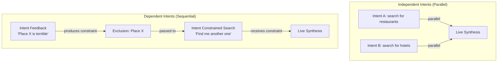

Sequential flow:

1. Feedback intent runs first and produces a constraint.
2. Search intent runs second and receives the constraint.
3. Results are synthesized once both stages complete.

Detection: The intent validator detects dependent structures such as “the one I mentioned is bad, find another” or “I do not like Y, what about Z.”

Constraint passing: After first stage completes, the orchestrator extracts a structured constraint object containing type, entities, and metadata, then passes it through handoff input filtering so the dependent sub-agent must respect it during planning and tool usage.

| Constraint type | When produced | What it carries |
|----------------|---------------|-----------------|
| exclusion | Feedback identifies disliked entity | entities: names or IDs to exclude from later results |
| refinement | Context intent narrows scope | entities: scope qualifiers; metadata: additional filters |
| context | Context-establishing intent provides background | entities: key mentions; metadata: grounding facts |

---

## Tool Registry

Each agent (orchestrator or sub-agent) receives a role-specific tool set:

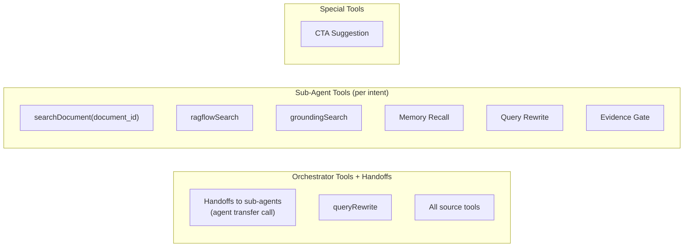

| Tool | Description | Used By |
|------|-------------|---------|
| Document search tool | Search uploaded documents by document ID | Sub-agents, orchestrator (single intent) |
| RAG flow search | Query external knowledge source | Sub-agents |
| Grounding search | Google Search grounding (separate agent call, not LLM tool) | Orchestrator (parallel agent spawn) |
| Memory recall | Long-term semantic recall with auto-trigger on new threads | Sub-agents, auto-trigger on first turn |
| Thread summary | Returns rolling summary for current thread | Orchestrator, sub-agents (on demand) |
| Memory inspector | Returns paginated user memories by category | User-initiated via agent |
| Memory deletion | Deletes specific memories after explicit user confirmation | User-initiated via agent |
| Ordinal resolver | Resolves ordinal references against recent structured result sets | Sub-agents |
| Query rewriter | Conditional query rewriting | Sub-agents, orchestrator |
| Evidence gate | Evidence sufficiency scoring | Sub-agents |
| CTA suggestion | Call-to-action suggestions | Orchestrator only (end of response) |

### Tool Assignment Flow

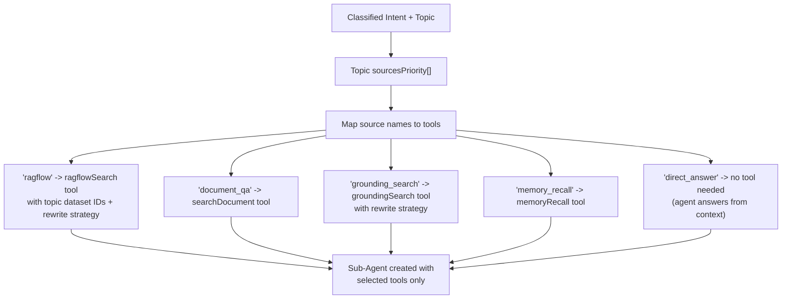

---

## Location Enrichment Tool (LOCATION_TOOL)

**Purpose**: When the model discusses places, it may call the location enrichment tool so each place is enriched with coordinates and optional images. Client applications can render interactive maps and inline place visuals from these events.

**Factory**: The location tool factory accepts a location tool configuration and returns an AI SDK tool definition.

**Tool name**: the location search tool.

**Suppression pattern**: Tool-call and tool-result stream chunks for the location search tool are suppressed using the same mechanism as the CTA suggestion tool. A location stream processor factory intercepts location-tool chunks, suppresses them from outbound stream, and emits clean `location` events derived from tool result.

**Input contract**: Model passes a place list and optional context text. Context clarifies ambiguous names and improves provider relevance.

**Internal flow**:

1. For each place, check Valkey cache first.
2. On cache miss, call configured geocoding provider with place name and optional context.
3. If image search provider is configured, call it with place-context query and max image count; otherwise set images to empty array.
4. Cache enrichment payloads in Valkey with configured TTL rules.
5. Emit a `location` SSE event per resolved place. If geocoding returns null, skip that place (degrade silently: log and continue).

**LLM autonomy**: Model decides when to call the location search tool. Typical triggers include recommendations, directions, and venue-anchored responses. Generic responses do not require this tool.

```mermaid
flowchart LR
    RESPONSE_PLANNER[LLM response planner] --> LOCATION_TOOL_CALL[AI SDK tool call: search_locations]
    LOCATION_TOOL_CALL --> LOCATION_TOOL_EXEC[search_locations execute()]

    LOCATION_TOOL_EXEC --> PLACE_PARALLEL{Per place in parallel}
    PLACE_PARALLEL --> GEOCODE_PATH[Geocode provider path]
    PLACE_PARALLEL --> IMAGE_PATH[Image search provider path (optional)]

    GEOCODE_PATH --> LOCATION_MERGE[Merge LocationResult]
    IMAGE_PATH --> LOCATION_MERGE

    LOCATION_MERGE --> LOCATION_RESULTS[LocationResult[]]
    LOCATION_RESULTS --> LOCATION_STREAM_PROCESSOR[location stream processor factory]
    LOCATION_STREAM_PROCESSOR --> LOCATION_SSE[Emit location SSE events]
```

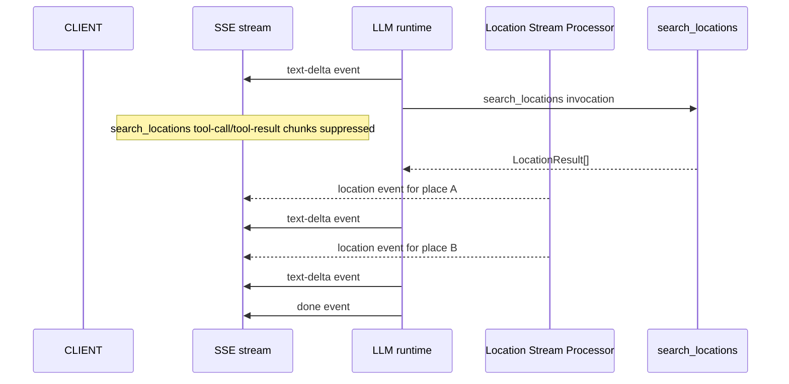

### Task LOCATION_TOOL: Location Enrichment Tool

**What to do**: Build the location tool factory that accepts location tool configuration and returns an AI SDK tool definition for location search. The tool receives place names and optional context, resolves each place through a configured geocoding provider (Nominatim default), optionally fetches images via a configured image search provider, and returns a list of location results. Build Valkey caching for resolved locations with configurable TTL. Build the location stream processor factory that intercepts location-tool call and result chunks, suppresses them from outbound stream, and emits `location` SSE events derived from tool result. Silent degradation: if geocoding returns null for a place, log warning and skip that place (no event emitted, no client-facing error). Build a places image provider factory helper that wraps Google Places Photos as an image search provider, including place imagery and coordinate support.

**Depends on**: CORE_TYPES, AGENT_FACTORY, VALKEY_CACHE

**Acceptance Criteria**:

- Location tool factory returns a valid AI SDK tool definition with the location-search name
- Tool resolves place names through configured geocode provider
- Valkey cache is checked before geocode provider call; cache hits skip provider call
- Cache entries use configurable TTL
- Location stream processor factory suppresses location-tool call and result chunks from outbound stream
- Each resolved place emits `location` SSE event with name, type, latitude, longitude, images, and optional context
- Unresolved places (geocode returns null) are silently skipped with warning log
- When no image search provider is configured, images defaults to empty array
- Geocoding and image-search provider interfaces are pluggable so server can substitute custom implementations
- Places image provider factory helper returns a valid image-search provider implementation

**QA Scenarios**:

- Call tool with known city name -> returned location result includes valid latitude and longitude coordinates
- Call tool with same city twice -> second call hits Valkey cache, no geocode invocation
- Call tool with nonexistent place -> geocode returns null, no location event, no client error
- Call tool with image-search provider configured -> images array populated
- Call tool without image-search provider -> images array empty
- Stream response that triggers location search -> tool-call/tool-result chunks hidden from SSE output, location events present
- Configure custom geocoding provider -> tool uses custom provider instead of default

---

## Agent Router (Query Classification)

For deployments with multiple specialized agents, the router dispatches each query to the right agent:

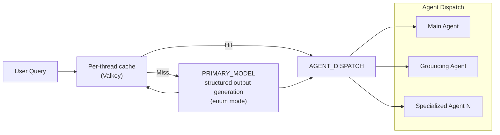

Router uses Gemini Flash Lite structured output generation with enum output mode for single-token classification latency. Results are cached per thread in Valkey so the same thread keeps consistent agent continuity.

---

## Scaling: Queue-Based Execution

For production scale, agent execution can run through Trigger.dev:

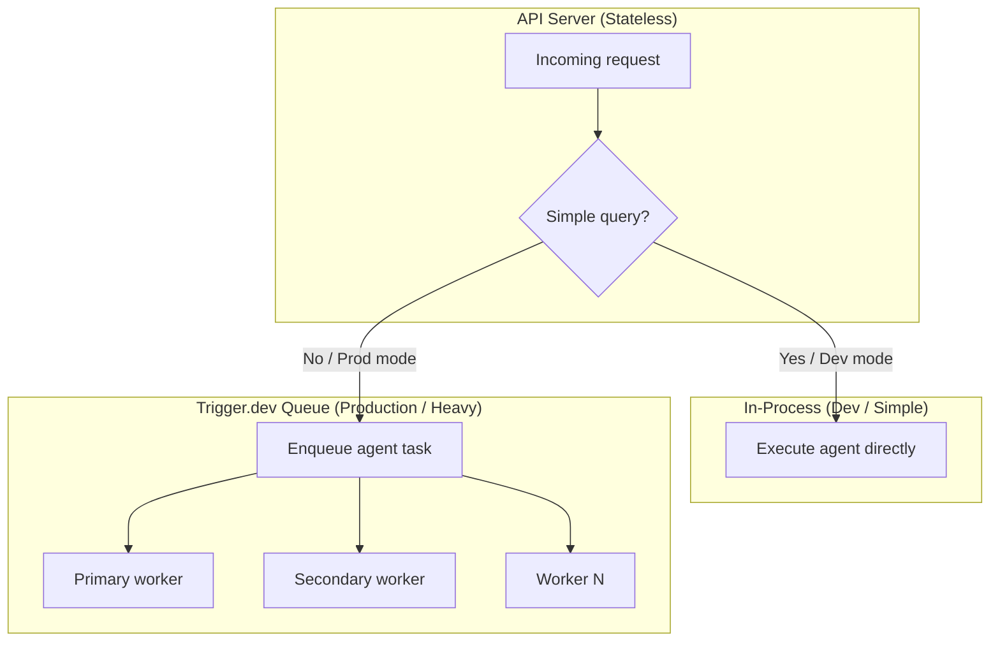

Configurable per deployment:

- Dev and testing: all execution in-process (no queue overhead)
- Production (simple): single-intent in-process, multi-intent queued
- Production (full): all requests through queue for uniform scaling and observability

---

## Provider Fallback

Simple sequential fallback for model failures:

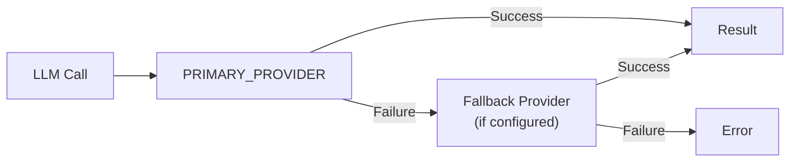

The fallback model wrapper wraps two providers. If primary fails, it tries fallback. No dynamic smart routing; only sequential try/catch for predictable behavior.

---

## Cross-References

| Component | Interaction |
|-----------|------------|
| **Requirements** ([01 — Requirements & Constraints](./01-requirements.md)) | Defines quality, safety, and behavior constraints for all orchestrated agent runs |
| **Conversation Pipeline** ([05 — Conversation Pipeline](./05-conversation.md)) | Provides intent signals, rewritten queries, ambiguity markers, and dependency hints used by orchestrator and router |
| **Memory & Intelligence** ([07 — Memory & Intelligence](./07-memory.md)) | Supplies thread short-term, user short-term, long-term recall, rolling summaries, and recall policies used during context assembly |
| **Transport** ([11 — Streaming & Transport](./11-transport.md)) | Carries live synthesis streams, location events, and structured event flow over SSE |
| **Server** ([12 — Server Implementation](./12-server.md)) | Hosts orchestration runtime, queue integration boundaries, provider fallback wiring, and deployment controls |

---

## Task Specifications

### Task AGENT_FACTORY: Agent Creation Factory + Framework Adapter

**What to do**: Build the core agent creation factory that wraps `@openai/agents` framework agent class with safeagent-specific configuration. Use the SDK model bridge from `@openai/agents-extensions` to connect Gemini into the framework model interface. Configure guardrail arrays, register tools (custom + MCP), and connect memory integration. Agent execution uses the framework's execution method to handle tool loop, maximum turn limits, retries, and streaming.

**Depends on**: CORE_TYPES (Types), ZOD_SCHEMAS (Schemas), CONFIG_DEFAULTS (Config), STORAGE_WRAPPER (Storage), PROVIDER_HELPERS (Provider)

**Acceptance Criteria**:

- Agent creation factory returns configured framework agent class instance wrapped with safe defaults
- SDK model bridge for the primary provider produces a valid framework model
- Agent modes (chat, grounding, tools, structured) each return non-empty response through the framework's execution method
- Guardrails are wired as guardrail arrays
- Memory integration includes conversation store with configurable window
- Tool binding includes custom tools and MCP tools
- Thinking level configuration is passed to provider
- Guard mode configuration controls active guardrails
- Request context propagation (user ID, thread ID) reaches tools via runner context
- Unit tests use the AI SDK test mock model from the test utilities package, wrapped via the SDK bridge helper

**QA Scenarios**:

- Create agent with defaults -> framework execution method streams events successfully
- Create agent with grounding -> grounding metadata present in response
- Create agent with tools -> tool calls execute in runner loop
- Create agent with output schema -> typed JSON returned through structured output path
- Two concurrent framework execution method calls with different thread IDs -> no state leakage

---

### Task PROVIDER_FALLBACK: Provider Fallback Helper

**What to do**: Build the fallback model wrapper that wraps two providers with sequential try/catch.

**Depends on**: PROVIDER_HELPERS (Provider helpers)

**Acceptance Criteria**:

- Primary succeeds -> primary result returned
- Primary fails -> fallback is attempted and returned when successful
- Both fail -> original primary error is thrown
- Unit tests with mocked providers

**QA Scenarios**:

- Primary responds normally -> fallback not called
- Primary throws -> fallback called and returned
- Both throw -> original primary error surfaces
- Primary timeout -> fallback engaged within total timeout budget

---

### Task AGENT_ROUTER: Agent Router — Query Classification + Dispatch

**What to do**: Build query classification that routes to the correct agent using structured output generation in enum mode with per-thread Valkey caching.

**Depends on**: AGENT_FACTORY (Agent Factory), SSE_STREAMING (Streaming)

**Acceptance Criteria**:

- Classification uses primary model with minimal thinking level
- Enum output mode is used for single-token classification
- Per-thread Valkey caching keeps same thread on same agent
- Cache invalidation available on explicit user request
- New threads with no cache handled gracefully
- Unit tests with mocked model and cache

**QA Scenarios**:

- New thread (no cache) -> classification runs and result cached
- Cached thread -> cached dispatch used and no classifier call
- User requests reclassification -> cache invalidated and fresh classification executed
- Two concurrent requests for same thread -> no duplicate classification work

---

### Task MCP_CLIENT: MCP Client Configuration + Multi-Server

**What to do**: Configure MCP client using the framework's MCP transport classes. Build a configuration layer that accepts multiple MCP server definitions and returns framework-compatible instances. Use the framework's tool filtering option (static allowlist and blocklist) to control exposed MCP tools per agent. Enable tool list caching for stable servers. Add health monitoring and graceful reconnection on top of framework MCP transport classes. Library provides default MCP client config that server may override.

**Depends on**: CORE_TYPES (Foundation Types), MCP_HEALTH (MCP Health-Check Wrapper)

**Acceptance Criteria**:

- MCP config creates framework-compatible MCP server instances using MCP transport classes
- Healthy MCP servers connect at startup and expose tools to agents automatically
- Tool filtering option per agent controls visible MCP tools
- Tool list caching is enabled for stable servers to avoid re-listing every request
- Health monitor detects availability changes and updates connection state
- Reconnection retries with backoff after disconnects and restores tool availability
- Library defaults apply when server overrides are not provided
- Unit tests cover healthy startup, disconnect, reconnect, and mixed server health

**QA Scenarios**:

- Start with three healthy MCP servers -> all connect and all tools appear in agent tool list
- Start with one unhealthy plus two healthy servers -> healthy servers available, unhealthy excluded without blocking startup
- Agent with allowlist tool filtering option -> only listed MCP tools visible to that agent
- Disconnect active MCP server during runtime -> health status changes and reconnection begins automatically
- Override default MCP config from server project -> override values apply without breaking base defaults

---

### Task GEMINI_GROUNDING: Gemini Grounding Agent Mode

**What to do**: Implement Gemini grounding mode using Google Search grounding for real-time web queries. Configure grounding metadata extraction and citation formatting.

**Depends on**: AGENT_FACTORY (Agent Creation Factory)

**Acceptance Criteria**:

- Grounding mode creates an agent configured for Google Search grounding
- Grounding responses include structured metadata for used sources
- Citation formatter converts grounding metadata into consistent citation output
- Grounding mode works in streaming and non-streaming paths
- Grounding failures return typed errors without crashing non-grounding modes
- Unit tests validate grounding metadata extraction and citation formatting

**QA Scenarios**:

- Real-time query in grounding mode -> response includes grounded citations
- Same query in chat mode -> no grounding metadata
- Grounding metadata with multiple sources -> formatter outputs deterministic citation ordering
- Grounding provider error during request -> typed error surfaced and stream closes cleanly
- Streaming grounding response -> citations remain aligned with final answer content

---

### Task ORCHESTRATOR: Orchestrator Agent Framework

**What to do**: Build the supervisor orchestrator pattern using the framework's handoff mechanism. Orchestrator is a framework agent class instance with handoffs pointing to sub-agents. Each handoff uses history scoping to the assigned intent and routing callbacks for logging. For multi-intent messages, orchestrator spawns parallel sub-agent runs and synthesizes results while streaming. The runtime handles handoff execution automatically: when the model makes an agent transfer call, execution switches to the target agent.

**Depends on**: AGENT_FACTORY (Agent Factory), EMBED_ROUTER (Embedding Router), LLM_INTENT (LLM Intent Validator), SOURCE_ROUTER (Source Priority Router)

**Acceptance Criteria**:

- Orchestrator factory creates a framework agent class instance with sub-agent handoffs
- Each handoff has context scoping and routing logging
- Single intent -> orchestrator works directly with tools without handoff overhead
- Multiple independent intents -> parallel sub-agent runs via handoffs, one per intent
- Multiple dependent intents -> sequential runs with constraint passing through handoff-scoped context
- Sub-agents execute independently with their own tool sets
- Auto-trigger memory recall on first turn before reasoning
- Recalled context injected alongside thread short-term and user short-term context
- After first turn, recall returns to agent-initiated mode
- Live synthesis streams as handoffs complete
- First handoff completion starts stream immediately
- Later handoff completions weave into ongoing stream
- If all sub-agents fail, error propagates with context
- If one sub-agent fails, remaining results still synthesize (graceful degradation)
- Framework tracing captures each handoff as span
- Unit tests include mocked sub-agents and dependent intent scenarios

**QA Scenarios**:

- Single intent query -> no handoff and direct execution
- Dual intent query -> two handoffs run in parallel and merged
- Triple intent query -> three handoffs spawned and synthesized stream includes all
- One handoff timeout -> remaining results still delivered with partial-failure note
- All handoffs timeout -> user-facing error response

---

### Task SUBAGENT_FACTORY: Sub-Agent Factory

**What to do**: Build a sub-agent factory that creates intent-scoped framework agent class instances with proper tools from topic source-priority configuration. Each sub-agent is referenced by the orchestrator through the framework's handoff mechanism. The factory produces both a sub-agent instance and corresponding handoff configuration, including context scoping, routing logging, and optional conditional routing predicates.

**Depends on**: AGENT_FACTORY (Agent Factory), ORCHESTRATOR (Orchestrator), SOURCE_ROUTER (Source Priority Router)

**Acceptance Criteria**:

- Sub-agent factory creates a scoped framework agent class instance plus handoff configuration
- Tool set determined by topic source priority
- Each source maps to corresponding tool on agent
- Rewrite strategies assigned per tool based on topic config
- Evidence gate tool included with topic threshold configuration
- Sub-agent prompt includes intent context for focused generation
- Handoff context scoping limits conversation to assigned intent
- Unit tests verify tool assignment from intent config

**QA Scenarios**:

- Topic with three sources -> sub-agent created with three tools
- Topic with external knowledge source -> corresponding tool includes correct dataset IDs
- Topic with HyDE rewrite strategy -> tool configured with HyDE rewriter
- Missing evidence threshold config -> defaults applied
- Handoff context scoping removes irrelevant conversation turns

---

### Task DEPENDENT_INTENT: Dependent Intent Coordination

**What to do**: Build orchestrator support for detecting and processing dependent intents sequentially. When the intent validator reports dependent structure (for example, feedback + constrained search), the orchestrator executes feedback first to produce a constraint, then passes that constraint into dependent search through handoff context scoping, ensuring search respects feedback.

**Depends on**: ORCHESTRATOR (Orchestrator Agent Framework), LLM_INTENT (LLM Intent Validator)

**Acceptance Criteria**:

- Orchestrator detects dependent intents from validator output
- Dependent intents execute sequentially, not in parallel
- Feedback intent executes first and produces constraint
- Constraint passes to dependent intent through handoff-scoped context
- Dependent intent receives constraint and applies it during search and filtering
- Results from both intents synthesize into coherent response
- Independent intents continue to run in parallel without regression
- Unit tests verify sequential and parallel execution paths
- Constraint passing is verified through handoff-scoped context inspection

**QA Scenarios**:

- Two independent intents -> both execute in parallel and merge
- Two dependent intents (feedback + search) -> feedback first, constraint passed, search respects constraint
- Three intents (feedback + search + other) -> dependent chain sequential, independent intent parallelized appropriately
- Constraint prevents disliked item appearing in results -> exclusion works
- One dependent stage fails -> remaining results still delivered with partial-failure note
- Constraint context visible in sub-agent trace -> handoff-scoped context includes constraint

---

## External References

- OpenAI Agents SDK documentation: https://openai.github.io/openai-agents-js/
- OpenAI Agents SDK — Handoffs: https://openai.github.io/openai-agents-js/guides/handoffs
- OpenAI Agents SDK — Guardrails: https://openai.github.io/openai-agents-js/guides/guardrails
- OpenAI Agents SDK — AI SDK bridge: https://openai.github.io/openai-agents-js/extensions/ai-sdk
- AI SDK structured output generation: https://sdk.vercel.ai/docs/ai-sdk-core/generating-structured-data

---

*Previous: [05 — Conversation Pipeline](./05-conversation.md) | Next: [07 — Memory & Intelligence](./07-memory.md)*
