# 07 — Memory System

> **Scope**: Three-layer memory architecture — thread short-term (Postgres), user short-term (Postgres, cross-thread), and long-term knowledge graph (SurrealDB). Covers rolling summaries, fact extraction with interaction signals and media facts, preference correction detection, structured result memory, temporal-aware recall with recency weighting, auto-trigger on new threads, and user memory control (inspect/delete).
>
> **Tasks**: SHORT_TERM_MEM (Thread Short-Term Memory), USER_SHORTTERM_MEM (User Short-Term Memory), SURREALDB_CLIENT (SurrealDB Client), FACT_EXTRACTION (Fact Extraction Pipeline), MEMORY_RECALL (Memory Recall Tool), STRUCTURED_RESULT_MEM (Structured Result Memory), MEMORY_CONTROL (User Memory Control)

---

## Table of Contents

- [Architecture Overview](#architecture-overview)
- [Layer 1: Thread Short-Term Memory](#layer-1-thread-short-term-memory)
- [Layer 2: User Short-Term Memory](#layer-2-user-short-term-memory)
- [Mandatory Rolling Summaries](#mandatory-rolling-summaries)
- [Long-Term Memory: SurrealDB Client](#long-term-memory-surrealdb-client)
- [Long-Term Memory: Graph Schema](#long-term-memory-graph-schema)
- [Fact Extraction Pipeline](#fact-extraction-pipeline)
- [Structured Result Memory](#structured-result-memory)
- [Memory Recall Tool](#memory-recall-tool)
- [User Memory Control](#user-memory-control)
- [Memory and Intent Detection](#memory-and-intent-detection)
- [Tradeoffs and Design Decisions](#tradeoffs-and-design-decisions)
- [Humanlikeness Memory Enhancements](#humanlikeness-memory-enhancements)
- [Cross-References](#cross-references)
- [Task Specifications](#task-specifications)
- [External References](#external-references)

---

## Architecture Overview

Memory in safeagent is a three-layer system. Each layer serves a different time horizon and access pattern. Thread short-term handles the immediate conversation window. User short-term carries recent context across thread boundaries. Long-term accumulates durable facts, interaction history, and structured results about the user across all conversations.

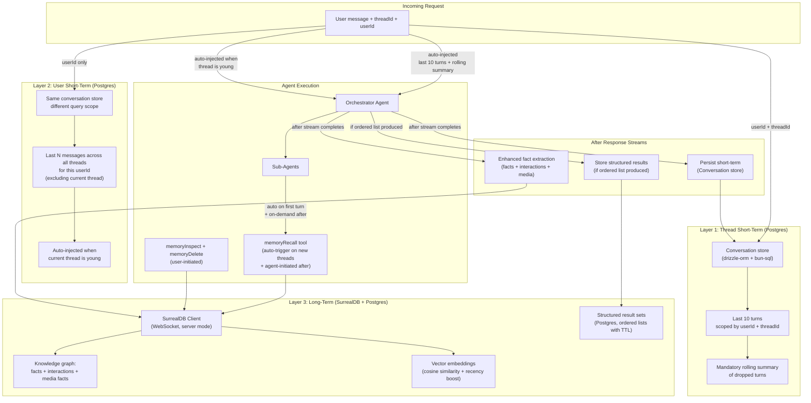

### Three-Layer Responsibilities

| Layer | Storage | Scope | Lifetime | Access Pattern | Purpose |
|-------|---------|-------|----------|----------------|---------|
| Thread short-term | Postgres (Conversation store) | Per conversation thread | Session + configurable window | Auto-injected into agent context | Within-thread continuity |
| User short-term | Postgres (same store, different query) | Per user, cross-thread | Ephemeral (recent N messages) | Auto-injected when current thread is young | Cross-thread reference resolution |
| Long-term | SurrealDB (facts) + Postgres (result sets) | Per user (all threads) | Configurable TTL (default 90 days for facts, 7 days for result sets) | Auto-trigger on new threads + agent-initiated | Durable user knowledge, interaction history, structured results |

The three layers never overlap in purpose. Thread short-term is raw conversation turns within a single thread. User short-term is raw conversation turns from OTHER threads. Long-term is extracted, structured knowledge. The agent sees all three, but through different injection mechanisms.

---

## Layer 1: Thread Short-Term Memory

### How It Works

The custom short-term memory module manages thread-scoped context. The `createAgent` factory (from [file 05](./05-agent-and-orchestration.md)) wires a `Conversation store` instance with `userId` and `threadId` scoping. On every call, the module loads the last N messages for the given `userId` + `threadId` pair and injects them into the context window before the LLM call.

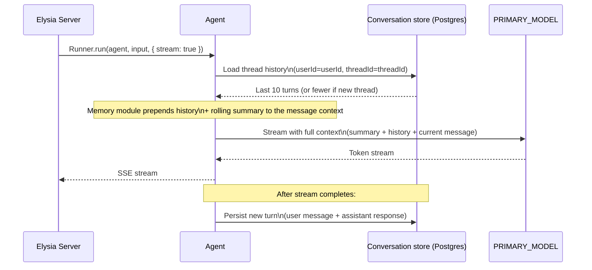

### Sliding Window

The `lastMessages` config controls how many turns stay in the active window. When a thread exceeds this limit, older turns fall out of the window. They are not deleted from Postgres — they remain stored for rolling summarization and for the user short-term layer to access.

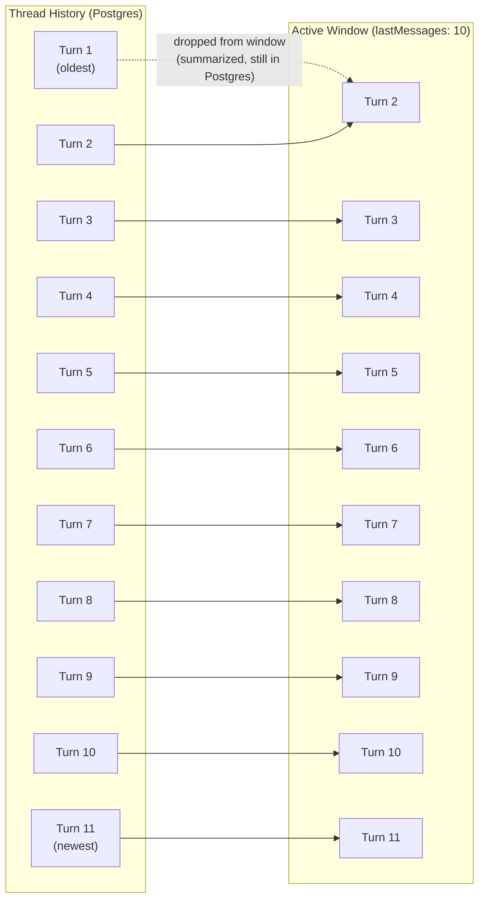

### Scoping: userId and threadId

Short-term memory uses two fields to scope memory:

- `userId` — the stable user identifier. Set to `userId` passed from the server. This is the "owner" of the thread and cannot change after thread creation.
- `threadId` — the conversation session identifier. Set to `threadId`. Each new conversation gets a new thread ID.

The server passes `userId` and `threadId` to the agent via `requestContext`. This is the only way user identity reaches the memory layer — there's no separate auth context inside the agent.

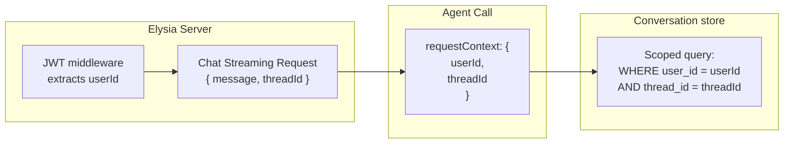

---

## Layer 2: User Short-Term Memory

### Why This Layer Exists

Users on mobile and web apps frequently start new threads for what they consider the same conversation. They say things like "that place", "the thing we discussed yesterday", "find me another one" — expecting the system to remember context from previous threads. Thread short-term memory is empty in a new thread, so these references have no referent. Long-term memory stores structured facts but not raw conversational context. User short-term fills this gap by carrying recent messages across thread boundaries.

### How It Works

The user short-term layer queries the same Postgres conversation store, but with a different scope: `userId` only, excluding the current `threadId`. It loads the most recent N messages (user turns only — assistant responses are excluded to save tokens) across all of the user's threads, ordered by creation time.

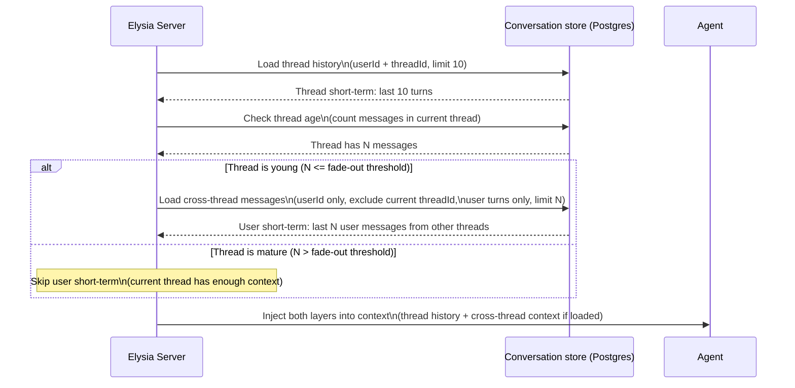

### Injection Format

Cross-thread messages are injected as a clearly framed system context block, separate from the thread history. The framing instructs the agent to use this context **only for resolving ambiguous references** and not to proactively surface it.

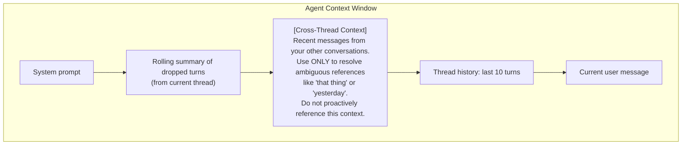

### Fade-Out Heuristic

User short-term is injected only when the current thread is "young." The fade-out uses **message count** as the primary signal: if the current thread has fewer than the configured threshold of messages, cross-thread context is loaded. Once the thread has enough of its own context, cross-thread messages become noise and are dropped.

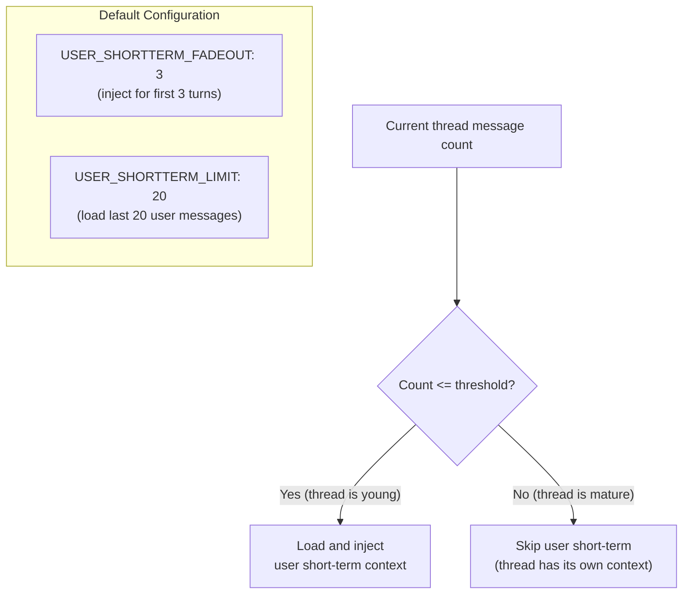

The default threshold of 3 messages means: on the first message of a new thread (empty thread), user short-term is fully active. By the fourth message, the current thread typically has enough context and cross-thread injection stops.

### What Gets Loaded

Only **user turns** are loaded from other threads. Assistant responses are excluded because:

- They are significantly longer than user messages (especially with citations), consuming excessive tokens
- The user's messages capture what was discussed; the assistant's responses are derivable from those
- Token budget impact is roughly halved by excluding assistant turns

The query is: load the most recent user messages from all threads belonging to this userId, excluding the current threadId, ordered by creation time descending, limited to N.

---

## Mandatory Rolling Summaries

### Why Mandatory

Users in long-running threads discuss many topics over days or weeks. A user might discuss football fields at turn 5, tax advice at turn 20, cooking at turn 40, then say "remember those football fields?" at turn 55. The last 10 turns are all about cooking. Without a rolling summary, the football field discussion is completely lost from context.

Rolling summarization is **mandatory**, not optional. Every thread that exceeds the sliding window produces a compressed summary of dropped turns. This summary is injected as a system message at the start of the context window, giving the agent a view of the entire thread history without consuming the full token budget.

### How It Works

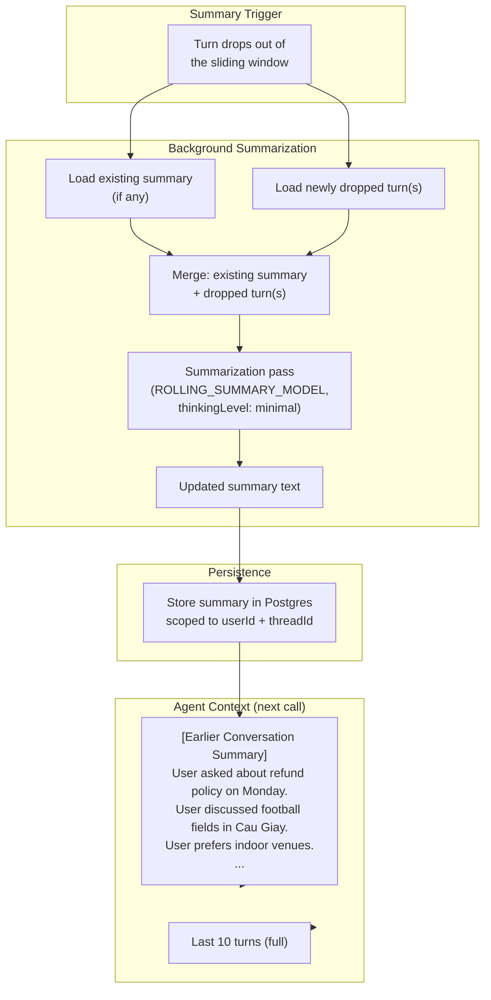

### Incremental Summarization

The summary is updated incrementally, not recomputed from scratch. When turns drop out of the window, the summarizer receives the **existing summary** plus the **newly dropped turns** and produces an updated summary. This keeps the summarization cost proportional to the delta, not the total thread length.

The summary preserves:
- **Topics discussed** with approximate timestamps ("discussed football fields on Monday")
- **User preferences and decisions** ("user chose Sân bóng X", "user prefers indoor")
- **Key entities** mentioned (place names, product names, people)
- **Unresolved questions** or pending actions

The summary does NOT preserve:
- Exact quotes or verbatim text
- Full assistant responses
- Redundant or repetitive content
- Superseded preferences (if user changed their mind, only the latest preference appears)

### Summary Size Management

Rolling summaries use a configurable maximum token budget: `ROLLING_SUMMARY_MAX_TOKENS` (default: 2048 tokens).

When the summary exceeds this budget, the summarizer enters **compaction mode**. Instead of appending more detail indefinitely, it re-summarizes the existing summary itself and aggressively compresses older material while preserving recent topics and stable user preferences.

Compaction priority order:

1. Drop old resolved questions first.
2. Compress old topic details into single-line mentions.
3. Merge related older topics into unified compact entries.

User preferences and explicit decisions are never dropped during compaction.

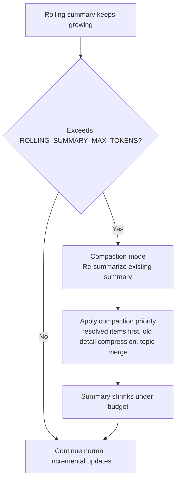

### Thread Summarization Tool

The orchestrator has access to a `threadSummary` tool that returns the rolling summary for the current thread. When a user asks "what did we discuss?" or "summarize our conversation", the agent calls this tool to retrieve the compressed history rather than attempting to read hundreds of raw turns.

### Thread Resurrection Handling

When a user resumes an old thread after a long gap, the rolling summary can mention entities whose long-term facts may have expired from SurrealDB due to TTL.

Thread resurrection is detected when the time gap between the current message and the last message in thread short-term memory exceeds `THREAD_RESURRECTION_GAP` (default: 7 days).

On resurrection detection, the engine automatically triggers a `memoryRecall` pass using key entities extracted from the rolling summary. This re-hydration step reloads any still-available long-term facts into context.

If some facts have expired, they are simply absent from recall results. The agent only receives currently available memory and does not invent missing historical details.

The system context explicitly includes a staleness note: "This thread has been inactive for [N days]. Some previously discussed context may no longer be available."

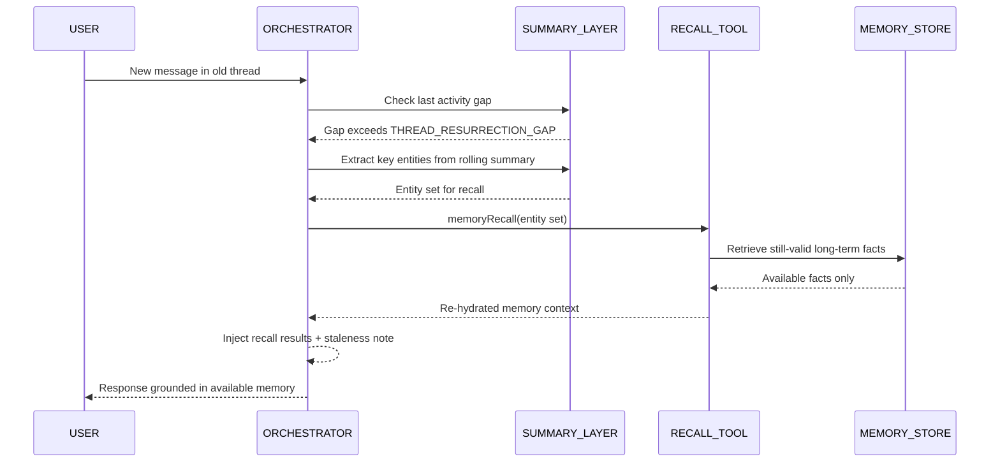

---

## Long-Term Memory: SurrealDB Client

### Deployment Mode

SurrealDB runs in **server mode** (Docker container) connected via WebSocket. The TypeScript SDK maintains a persistent WebSocket connection per API instance. Embedded mode (`mem://`) is used only in unit tests.

All SurrealDB queries use surqlize, the official type-safe ORM from the SurrealDB team. surqlize provides compile-time type safety for SurrealQL — schema definitions, RELATE statements, graph traversals, and vector similarity queries are all type-checked. The SURREALDB_CLIENT module defines the memory graph schema (user, fact, interaction, media_fact, knows, related_to tables) using surqlize's schema API, and all query helpers are built on surqlize's typed query builder rather than raw SurrealQL strings.

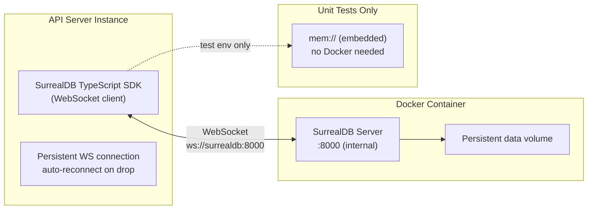

### Why Server Mode

Embedded mode would couple the database lifecycle to the API process. In a horizontally scaled fleet, each API instance would have its own isolated memory store — users would see different facts depending on which server handled their request. Server mode gives all instances a single shared store, which is the only correct behavior for a multi-tenant system.

### Connection Configuration

| Config | Value | Notes |
|--------|-------|-------|
| `SURREALDB_URL` | `ws://surrealdb:8000/rpc` | Internal Docker network |
| Namespace | `safeagent` | Single namespace for all data |
| Database | `memory` | Logical separation from other SurrealDB uses |
| Auth | Credentials embedded in `SURREALDB_URL` (e.g., `ws://user:pass@host:8000/rpc`) | Parsed from connection string at startup |

### No MTREE Index

Vector similarity search in SurrealDB uses a sequential scan over stored embeddings. No MTREE (approximate nearest neighbor) index is needed. The long-term memory corpus per user is bounded — a user accumulates hundreds to low thousands of facts over their lifetime, not millions. Sequential scan over that range is fast enough and avoids the complexity of index maintenance.

This was validated in a spike. The decision stands unless load testing reveals otherwise.

### Client API

The SurrealDB client module exposes these functions: `createUserNode` (idempotent user record creation), `storeFact` (creates fact record + RELATE user→knows→fact edge), `storeInteraction` (creates interaction record with timestamp + RELATE user→performed→interaction edge), `storeMediaFact` (creates media_fact record from vision model output + RELATE user→knows→media_fact edge), `findSimilarFacts` (cosine similarity search scoped to a userId with optional date range filtering and recency boost), `getFactsByUser` (graph traversal returning all facts linked to a user), `refreshFactTTL` (updates expiresAt and lastAccessedAt for a fact), `deleteExpiredFacts` (removes all facts past their expiration), `deleteFactById` (removes a specific fact by ID and purges related edges), `getFactsForInspection` (returns paginated facts for user review), and `supersedeFact` (marks an old fact as superseded and stores the correction).

All functions operate on a per-user scope (userId only, no threadId) — long-term memory is cross-thread by design.

---

## Long-Term Memory: Graph Schema

### Entity and Relation Model

Long-term memory is stored as a graph. Entities are nodes (facts, interactions, media facts, user records). Relations are edges created with SurrealDB's `RELATE` statement. Each entity carries a vector embedding for semantic search and a `createdAt` timestamp for temporal queries.

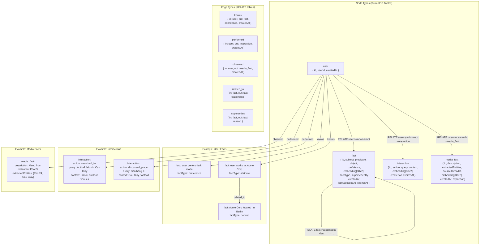

### Schema Detail

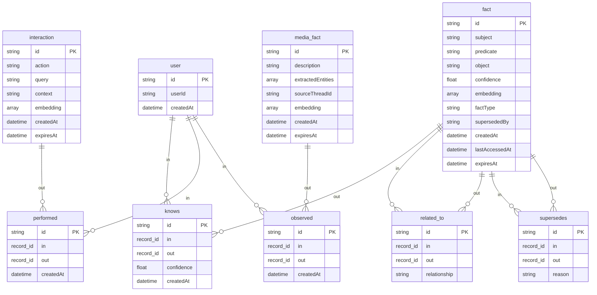

### Fact Types

The `factType` field categorizes facts for targeted retrieval:

| factType | Description | Example |
|----------|-------------|---------|
| `preference` | User preference or taste | user prefers indoor football fields |
| `attribute` | Factual attribute about the user | user works_at Acme Corp |
| `derived` | Inferred from other facts | Acme Corp located_in Berlin |
| `behavioral` | Observed behavior pattern | user frequently searches for sports venues |
| `sentiment` | Opinion or feeling about something | user dislikes Sân bóng X |

### Vector Fields

Each `fact`, `interaction`, and `media_fact` record stores an `embedding` array of `EMBEDDING_DIMS` (3072) floats. This is the embedding of the record's natural-language representation, generated via `EMBEDDING_PROVIDER`.

Similarity search uses SurrealDB's `vector::similarity::cosine` function in a `SELECT` query with an `ORDER BY` clause. No index is needed — the sequential scan is fast enough for per-user record counts.

### TTL and Access Refresh

Records have configurable TTLs that vary by type:

| Record Type | Default TTL | Rationale |
|-------------|-------------|-----------|
| `fact` | 90 days | Durable user knowledge, refreshed on access |
| `interaction` | 30 days | Recent activity context, less permanent |
| `media_fact` | 30 days | Visual context, less permanent |

The `expiresAt` field is set at creation time. When a record is accessed during a recall query, `lastAccessedAt` is updated and `expiresAt` is pushed forward by the TTL duration. Records that are never recalled expire and are cleaned up by a background job.

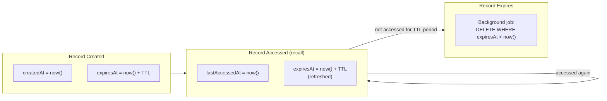

---

## Fact Extraction Pipeline

### Overview

After the orchestrator's final response streams to the client, an enhanced fact extraction pass runs in the stream completion callback. It does not block the response. The user sees the answer immediately; extraction happens in the background.

The enhanced pipeline extracts four categories of information:

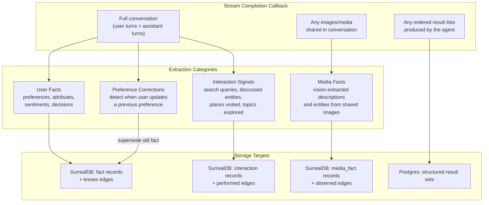

### User Facts (Existing Category)

The extractor looks for user-specific facts and preferences in the conversation. It does not extract general knowledge or information about the world — only things that are true about this specific user.

Examples of extractable facts:

| Subject | Predicate | Object | Confidence | factType |
|---------|-----------|--------|------------|----------|
| user | prefers | dark mode | 0.95 | preference |
| user | works_at | Acme Corp | 0.90 | attribute |
| user | located_in | Berlin | 0.85 | attribute |
| user | dislikes | Sân bóng X | 0.80 | sentiment |
| user | uses | Python for scripting | 0.88 | attribute |

The structured output schema is `{ facts: [{ subject, predicate, object, confidence, factType }] }`. Confidence is a float between 0 and 1. Facts with confidence below 0.6 are discarded before storage.

### Extraction Safeguards

Before any candidate fact is stored, the extraction prompt applies safeguard filters that classify attribution, contextual sentiment meaning, and certainty. Only facts that pass all safeguard checks proceed to deduplication and storage.

#### Third-party attribution filter

The extraction prompt instructs the LLM to tag every candidate fact with an `attribution` field:

- `'self'`: user explicitly stated a fact about themselves
- `'third_party'`: user described someone else (for example spouse, friend, manager, or colleague)
- `'general'`: general world knowledge, not user-specific

Storage rule:

- Only `'self'` facts are eligible for user fact storage.
- `'third_party'` facts are converted into interaction signals (the user mentioned that third-party context) rather than user preferences.
- `'general'` facts are discarded.

| Statement | attribution | Outcome |
|-----------|-------------|---------|
| I love outdoor sports | self | Stored as user fact |
| My wife loves yoga | third_party | Stored as interaction signal |
| Pho 24 is a popular restaurant | general | Discarded |

#### Sarcasm and irony detection

The extraction prompt requires sentiment polarity to be interpreted from surrounding conversational context, not isolated positive or negative words.

It includes an explicit instruction: if surrounding context contains negative indicators (complaints, rejection language, eye-roll emoji like 🙄, or contradictory tone), positive phrasing is treated as sarcasm and polarity is inverted.

Examples:

- "Great, another place with no parking 🙄" → negative (sarcastic), extract: user dislikes places without parking
- "This place is great, I'm definitely coming back!" → positive (genuine)

The LLM is suitable for this check because it can reason over multi-turn context and tone markers that keyword-only pipelines miss.

#### Hypothetical and conditional filter

The extraction prompt also tags each candidate fact with a `certainty` field:

- `'stated'`: user asserted it as true
- `'hypothetical'`: conditional or speculative framing (for example with "if", "would", or "might")
- `'asked'`: user question form, not an asserted fact

Storage rule:

- Only `'stated'` facts are stored.
- `'hypothetical'` and `'asked'` facts are discarded before storage.

| Statement | certainty | Outcome |
|-----------|-----------|---------|
| I'm vegan | stated | Stored |
| If I were vegan, I'd want... | hypothetical | Discarded |
| Am I a vegan? | asked | Discarded |
| I might try indoor fields next time | hypothetical | Discarded |

#### Hallucination feedback loop prevention

The extraction pipeline receives the full conversation, including user turns and assistant turns. To prevent assistant hallucinations from becoming stored memory, the extraction prompt includes a strict source constraint:

Extract facts only from what the user explicitly stated. Do not extract facts from assistant assumptions, inferences, or paraphrases. If the assistant says "Based on your love of outdoor sports" but the user never stated that, the pipeline must not extract "user loves outdoor sports."

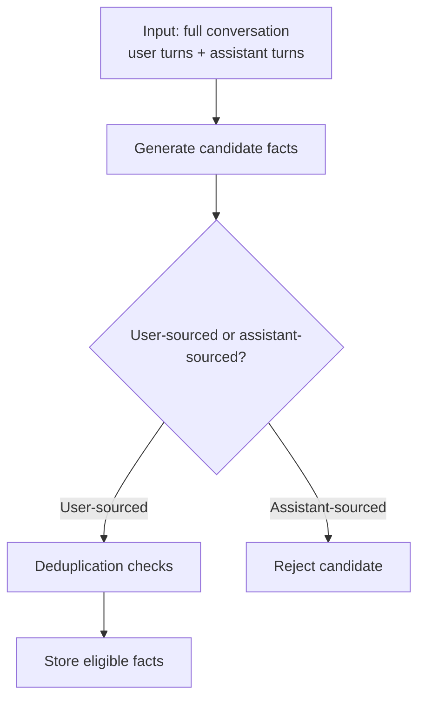

### Interaction Signal Extraction (New Category)

Search behavior, discussed entities, and user actions are valuable memory even when they don't express a preference. When a user searches for "football fields in Cau Giay, Hanoi", that interaction should be remembered so that a future reference to "that place" or "yesterday" can be resolved.

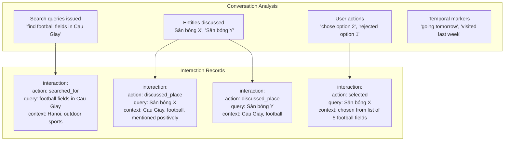

The extraction prompt instructs the LLM to capture:

- What the user searched for or asked about (the query itself, not just the topic)
- Which specific entities were discussed (place names, product names, people)
- What actions the user took (chose, rejected, bookmarked, compared)
- Any temporal context mentioned ("going tomorrow", "visited last week")

Each interaction is stored with a `createdAt` timestamp, enabling temporal recall ("what did we discuss yesterday?").

### Media/Image Fact Extraction (New Category)

When users share images in conversation (photos, screenshots, visual content), the vision model's interpretation of that image should be captured as a retrievable fact. Two days later, "that restaurant I showed you the photo of" should be resolvable.

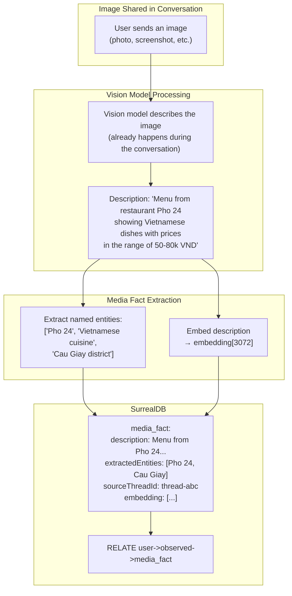

The extraction captures the vision model's description and key entities, NOT the raw image. This keeps storage efficient while preserving the semantic content that enables future recall.

### Preference Correction Detection (New Category)

When a user says "Actually, I prefer indoor fields, not outdoor", this is a **correction** to an existing preference. The extraction pipeline must detect this pattern and **supersede** the old fact rather than adding a new one alongside it.

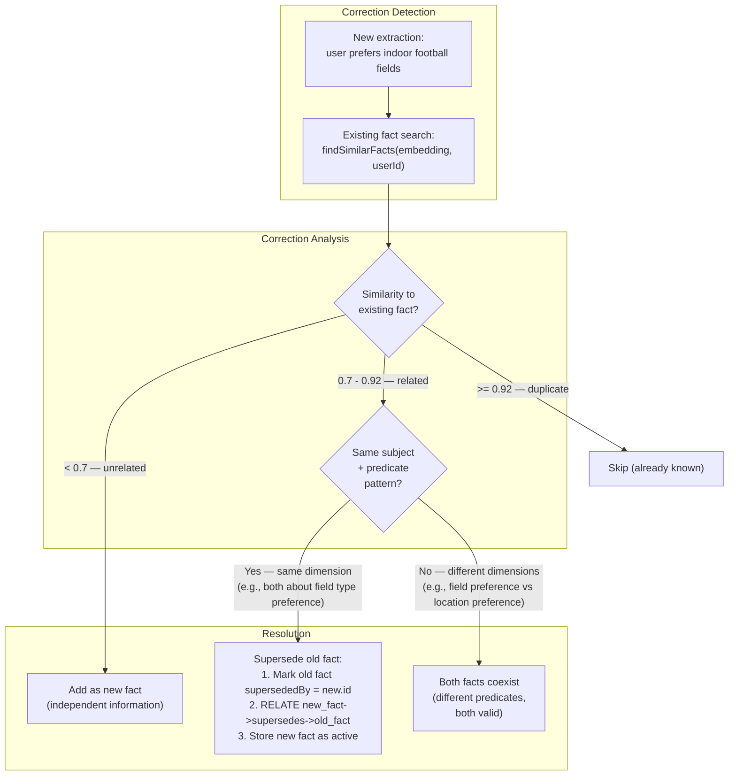

The key insight: cosine similarity alone cannot distinguish corrections from additions. Two facts can be semantically similar (~0.8) but represent either a correction ("indoor not outdoor") or independent facts ("likes football" and "likes tennis"). The pipeline uses a secondary check: do the facts share the same subject + predicate pattern? If yes, the new fact supersedes the old one. If no, both coexist.

Superseded facts are not deleted — they are marked with `supersededBy` pointing to the replacement fact. This preserves history and enables "what did I used to prefer?" queries if needed.

### Duplicate Detection

Before inserting a new fact, the pipeline checks whether a semantically similar fact already exists for this user. It embeds the new fact's text and runs a cosine similarity query against existing facts linked to the user.

```mermaid
flowchart TB
    NEW_FACT["New fact: 'user prefers dark mode'\nembedding: [...]"]

    QUERY["Cosine similarity search\nagainst user's existing facts\nORDER BY similarity DESC LIMIT 5"]

    CHECK{Highest similarity\n>= 0.92?}

    SKIP["Skip insertion\n(fact already known)"]
    CORRECT_CHECK{Correction detected?\n(same predicate pattern,\ndifferent object)}
    INSERT["INSERT fact + RELATE user->knows->fact"]
    SUPERSEDE_ACTION["Supersede old fact\n+ INSERT new fact"]

    NEW_FACT --> QUERY
    QUERY --> CHECK
    CHECK -->|"Yes — duplicate"| SKIP
    CHECK -->|"No — novel"| CORRECT_CHECK
    CORRECT_CHECK -->|"Yes"| SUPERSEDE_ACTION
    CORRECT_CHECK -->|"No"| INSERT
```

The similarity threshold for duplicate detection is 0.92. This is intentionally high — we want to catch near-identical facts ("user likes dark mode" vs "user prefers dark mode") while allowing genuinely different facts to coexist ("user prefers dark mode" vs "user prefers minimal UI").

### Fire-and-Forget Guarantee

The extraction pipeline runs in the stream completion callback, which fires after the response stream closes. If extraction fails (network error, LLM timeout, SurrealDB unavailable), the failure is logged but does not surface to the user. The conversation still happened; the facts just weren't extracted this time. The next conversation will have another opportunity.

Errored stream behavior: if the response stream fails mid-response (network interruption, model failure, or guardrail abort), the completion callback still fires with a `streamError` flag.

When `streamError` is true, fact extraction is skipped entirely. Partial assistant output can contain incomplete reasoning, cut-off statements, or hallucinated fragments, and extracting from that output can corrupt long-term memory quality.

The conversation turns from that attempt (user message plus partial assistant response) are still stored in Postgres for thread continuity, but long-term extraction does not run for that callback.

This is a deliberate tradeoff: potential facts from that failed response are dropped to prevent memory corruption. In most cases, the user retries, and the next successful completion triggers extraction normally.

---

## Structured Result Memory

### Why Structured Results Need Separate Storage

When the agent produces an ordered list of results (e.g., 5 football fields, 3 restaurant recommendations, 4 flight options), users refer back to these by ordinal position: "the second one", "the first option", "that last one you mentioned." These ordinal references require the system to remember the **ordered result set**, not just individual facts about each item.

Long-term memory stores facts like `user | discussed_place | Sân bóng X`, but it does not preserve the ordering, the full list membership, or the query that produced the list. Structured result memory fills this gap.

### What Gets Stored

```mermaid
flowchart TB
    subgraph AgentOutput["Agent Produces Ordered Results"]
        LIST["Response contains an ordered list:\n1. Sân bóng X — 2km away, outdoor\n2. Sân bóng Y — 3km away, indoor\n3. Sân bóng Z — 5km away, outdoor"]
    end

    subgraph Detection["Result Set Detection"]
        DETECT["Post-response analysis detects:\nordered list with structured items"]
    end

    subgraph Storage["Postgres: Structured Result Set"]
        RESULT_SET["ResultSet:\nuserId: user-abc\noriginatingQuery: 'football fields in Cau Giay'\norderedResults: [\n  { label: 'Sân bóng X', metadata: {distance: '2km', type: 'outdoor'} },\n  { label: 'Sân bóng Y', metadata: {distance: '3km', type: 'indoor'} },\n  { label: 'Sân bóng Z', metadata: {distance: '5km', type: 'outdoor'} }\n]\ncreatedAt: timestamp\nexpiresAt: timestamp + 7d"]
    end

    LIST --> DETECT --> RESULT_SET
```

### Ordinal Reference Resolution

When a user says "the second one" or "book the first option", the agent resolves this by looking up the most recent structured result set for that user.

```mermaid
sequenceDiagram
    participant User
    participant Agent as Orchestrator Agent
    participant PG as Postgres (Result Sets)

    Note over User: Day 1, Thread A:
    User->>Agent: "find football fields in Cau Giay"
    Agent-->>User: "Here are 5 options:\n1. Sân bóng X\n2. Sân bóng Y\n..."
    Agent->>PG: Store result set\n(userId, query, ordered results)

    Note over User: Day 2, Thread B:
    User->>Agent: "book the second one"
    Agent->>PG: Get most recent result set\n(userId, limit 1)
    PG-->>Agent: Result set from yesterday\n(5 football fields, ordered)
    Note over Agent: Index 2 → Sân bóng Y
    Agent-->>User: "I'll help you book Sân bóng Y..."
```

### Storage and TTL

Structured result sets are stored in Postgres (not SurrealDB) because they are conversation-adjacent ephemeral data, not permanent knowledge graph nodes. They have a short TTL (default 7 days) — result sets older than a week are unlikely to be referenced by ordinal position.

| Field | Type | Description |
|-------|------|-------------|
| `userId` | string | Owner of the result set |
| `originatingQuery` | string | The query that produced the results |
| `orderedResults` | structured data | Ordered array of result items, each with label and metadata |
| `sourceThreadId` | string | Thread where the results were produced |
| `createdAt` | timestamp | When the result set was created |
| `expiresAt` | timestamp | Auto-cleanup after TTL (default 7 days) |

---

## Memory Recall Tool

### Design Philosophy

The memory recall tool uses a **hybrid access pattern**: auto-triggered on the first turn of new threads, agent-initiated on subsequent turns. This balances comprehensiveness (new threads always get cross-thread context) with efficiency (established threads don't waste tokens on irrelevant memory lookups).

```mermaid
flowchart TB
    MSG["Incoming message"]

    CHECK{First message\nin thread?}

    AUTO["Auto-trigger memoryRecall\nbefore agent starts reasoning.\nResults injected as system context."]
    AGENT_DECIDE["Agent decides whether to call\nmemoryRecall based on query content.\nTool description guides when to use it."]

    CHECK -->|"Yes — new thread"| AUTO
    CHECK -->|"No — existing thread"| AGENT_DECIDE
```

**Why auto-trigger on first turn**: In a new thread, the agent has zero context. A vague message like "the place I went yesterday" provides no signal for the agent to decide whether memory is relevant. By auto-triggering, the agent always starts a new thread with the user's recent context available.

**Why agent-initiated after**: Once the thread has established its own context, auto-triggering would waste tokens on most queries. The agent is better positioned to decide when memory is relevant based on the conversation flow.

### Auto-Trigger Flow

```mermaid
sequenceDiagram
    participant Server as Elysia Server
    participant PG as Postgres
    participant Recall as memoryRecall
    participant Surreal as SurrealDB
    participant Agent as Orchestrator Agent

    Server->>PG: Check thread message count
    PG-->>Server: count = 0 (new thread)

    par Parallel Memory Loading
        Server->>PG: Load user short-term\n(cross-thread messages)
        Server->>Recall: Auto-trigger recall\n(query = user's first message)
        Recall->>Surreal: Semantic search + graph traversal\n(with recency boost + temporal filtering)
        Surreal-->>Recall: Relevant facts + interactions
    end

    PG-->>Server: Cross-thread messages
    Recall-->>Server: Recalled context string

    Server->>Agent: Start with full context:\n1. Rolling summary (empty for new thread)\n2. Cross-thread messages\n3. Auto-recalled long-term memory\n4. Current message
```

### Tool Flow

```mermaid
flowchart TB
    subgraph Agent["Sub-Agent (during tool use)"]
        DECIDE["Agent decides: 'This query needs\nuser context from past conversations'"]
        CALL["Call memoryRecall(query, temporalHint?)"]
    end

    subgraph Tool["createMemoryRecallTool()"]
        EMBED_Q["Embed query text\n(EMBEDDING_PROVIDER)"]

        subgraph Search["Parallel Search"]
            SEM["Semantic Search\nCosine similarity on fact +\ninteraction + media_fact embeddings\nwith recency boost"]
            GRAPH["Graph Traversal\nMulti-hop from user node\nuser->knows->fact->related_to->fact\nuser->performed->interaction\nuser->observed->media_fact"]
            TEMPORAL_FILTER["Temporal Filter\n(if temporalHint provided,\nrestrict to date range)"]
        end

        MERGE["Merge + deduplicate results"]
        RANK["Rank by recency-weighted\nrelevance score"]
        FORMAT["Format as context string\nfor agent response"]
    end

    subgraph SurrealDB["SurrealDB"]
        VEC_SEARCH["vector::similarity::cosine\nSELECT ... ORDER BY score"]
        GRAPH_QUERY["SELECT ->knows->fact,\n->performed->interaction,\n->observed->media_fact\nFROM user:userId"]
    end

    DECIDE --> CALL
    CALL --> EMBED_Q
    EMBED_Q --> SEM & GRAPH & TEMPORAL_FILTER
    SEM --> VEC_SEARCH
    GRAPH --> GRAPH_QUERY
    VEC_SEARCH --> MERGE
    GRAPH_QUERY --> MERGE
    TEMPORAL_FILTER --> MERGE
    MERGE --> RANK
    RANK --> FORMAT
    FORMAT -->|"Returns context string"| Agent
```

### Semantic Search

The semantic search path embeds the query and runs a cosine similarity scan over all facts, interactions, and media facts linked to the current user. It returns the top-K most relevant records across all three types.

### Graph Traversal

The graph traversal path follows relationship edges from the user node outward. This catches facts that aren't directly about the user but are connected through known entities.

```mermaid
flowchart LR
    USER_NODE["user:userId"]

    subgraph HopOne["1-hop"]
        FACT_WORK["fact: user works_at Acme Corp"]
        FACT_PREF["fact: user prefers indoor fields"]
        INT_SEARCH["interaction: searched_for\nfootball fields in Cau Giay"]
        MEDIA_MENU["media_fact: Menu from Pho 24"]
    end

    subgraph HopTwo["2-hop (via related_to)"]
        FACT_CITY["fact: Acme Corp located_in Berlin"]
        FACT_IND["fact: Acme Corp industry software"]
    end

    USER_NODE -->|"->knows->"| FACT_WORK & FACT_PREF
    USER_NODE -->|"->performed->"| INT_SEARCH
    USER_NODE -->|"->observed->"| MEDIA_MENU
    FACT_WORK -->|"->related_to->"| FACT_CITY & FACT_IND
```

### Temporal-Aware Recall

When the user's message contains temporal expressions ("yesterday", "last week", "this morning"), the recall tool can restrict results to a specific date range. The LLM validator (from [file 10](./10-intent-and-routing.md)) resolves temporal expressions into concrete date ranges and passes them as a `temporalHint` to the recall tool.

```mermaid
flowchart TB
    subgraph TemporalResolution["Temporal Expression Resolution"]
        EXPRESSION["'the place I went yesterday'"]
        RESOLVED["temporalHint: {\n  from: 2026-03-07T00:00:00,\n  to: 2026-03-07T23:59:59\n}"]
    end

    subgraph FilteredRecall["Filtered Recall"]
        ALL_RECORDS["All user's facts +\ninteractions + media_facts"]
        DATE_FILTER["Filter: createdAt\nwithin date range"]
        FILTERED["Records from 'yesterday' only"]
        SEMANTIC["Then: semantic similarity\nwithin filtered set"]
    end

    EXPRESSION --> RESOLVED
    RESOLVED --> DATE_FILTER
    ALL_RECORDS --> DATE_FILTER
    DATE_FILTER --> FILTERED --> SEMANTIC
```

Temporal filtering narrows the search space **before** semantic ranking. "The place I went yesterday" first restricts to records created yesterday, then ranks those by semantic similarity to "place I went." Without this, recall would return the most semantically similar records regardless of when they were created — "last week" might return results from a month ago that happen to be similar.

### Recency-Weighted Scoring

Even without an explicit temporal expression, recent records should be prioritized over older ones. The recall tool applies a temporal decay multiplier to the raw cosine similarity score:

```mermaid
flowchart LR
    subgraph RecencyBoost["Recency Multiplier"]
        LAST_DAY["Created within 24 hours\nmultiplier: 1.5x"]
        LAST_WEEK["Created within 7 days\nmultiplier: 1.2x"]
        OLDER["Created more than 7 days ago\nmultiplier: 1.0x (no boost)"]
    end

    subgraph Scoring["Final Score Calculation"]
        RAW["Raw cosine similarity: 0.85"]
        BOOSTED_DAY["If 24h old: 0.85 × 1.5 = 1.275"]
        BOOSTED_WEEK["If 3 days old: 0.85 × 1.2 = 1.020"]
        UNBOOSTED["If 30 days old: 0.85 × 1.0 = 0.850"]
    end

    LAST_DAY --> BOOSTED_DAY
    LAST_WEEK --> BOOSTED_WEEK
    OLDER --> UNBOOSTED
```

The multipliers are configurable via `RECENCY_BOOST_24H` and `RECENCY_BOOST_7D`. The default values (1.5x and 1.2x) mean a moderately relevant recent record outranks a highly relevant old record — which matches how users think. "That thing yesterday" is almost always about something recent, even if something from last month is more semantically similar.

### Tool Description (Agent Guidance)

The tool description tells the agent when to call it:

> Use this tool when the user's query involves their personal context, preferences, past decisions, past searches, places they've discussed, images they've shared, or anything they may have mentioned in a previous conversation. This tool searches across facts, past interactions, and visual content the user has shared. Examples: questions about their work, their preferences, their history with a product, references to "that place" or "yesterday", or any follow-up that implies prior knowledge. Do not call this tool for general knowledge questions that don't depend on who the user is.

### Return Format

The tool returns a formatted string, not raw JSON. The agent receives a human-readable summary organized by category (facts, recent interactions, media context), listing recalled records with confidence levels and timestamps. This format is designed to be directly usable in the agent's reasoning without further parsing.

### TTL Refresh on Access

When the recall tool reads records from SurrealDB, it updates `lastAccessedAt` and refreshes `expiresAt` for each returned record. Records that are actively recalled stay alive. Records that are never recalled expire naturally.

---

## User Memory Control

### Why It's Required

For a consumer mobile app, users must be able to see what the system remembers about them and delete specific memories. This is both a trust requirement (users feel in control) and a compliance requirement (right to be forgotten). The system provides two tools: `memoryInspect` and `memoryDelete`.

### Inspect Tool

The `memoryInspect` tool returns a paginated, human-readable list of everything the system remembers about the user. Users can trigger it by asking "what do you know about me?" or "what do you remember?"

```mermaid
flowchart TB
    subgraph UserRequest["User asks: 'what do you remember about me?'"]
        TRIGGER["Agent calls memoryInspect tool"]
    end

    subgraph Inspection["memoryInspect Execution"]
        FACTS_QUERY["Query all active facts\nfor userId\n(exclude superseded)"]
        INTERACTIONS_QUERY["Query recent interactions\nfor userId"]
        MEDIA_QUERY["Query media facts\nfor userId"]
        RESULTS_QUERY["Query recent result sets\nfor userId"]
    end

    subgraph Response["Formatted Response"]
        FACT_LIST["Your Preferences & Facts:\n• You prefer indoor football fields\n• You work at Acme Corp\n• You dislike Sân bóng X"]
        INT_LIST["Recent Activity:\n• Searched for football fields in Cau Giay (2 days ago)\n• Discussed Sân bóng X, Y, Z (2 days ago)\n• Selected Sân bóng X (2 days ago)"]
        MEDIA_LIST["Visual Context:\n• Menu from Pho 24 restaurant (5 days ago)"]
        RESULT_LIST["Recent Result Lists:\n• 5 football fields in Cau Giay (2 days ago)"]
    end

    TRIGGER --> FACTS_QUERY & INTERACTIONS_QUERY & MEDIA_QUERY & RESULTS_QUERY
    FACTS_QUERY --> FACT_LIST
    INTERACTIONS_QUERY --> INT_LIST
    MEDIA_QUERY --> MEDIA_LIST
    RESULTS_QUERY --> RESULT_LIST
```

### Delete Tool

The `memoryDelete` tool removes specific memories when the user requests it. Users can say "forget about the football fields" or "delete everything about Acme Corp."

```mermaid
flowchart TB
    subgraph UserRequest["User asks: 'forget about the football fields'"]
        TRIGGER["Agent calls memoryDelete tool\nwith query: 'football fields'"]
    end

    subgraph Matching["Find Matching Records"]
        EMBED_DEL["Embed deletion query"]
        SEARCH_DEL["Semantic search across\nfacts + interactions + media_facts"]
        CANDIDATES["Matching records\n(above similarity threshold)"]
    end

    subgraph Confirmation["Agent Confirms with User"]
        LIST_MATCHES["'I found these memories about football fields:\n• Preference: indoor football fields\n• Search: football fields in Cau Giay\n• Discussion: Sân bóng X, Y, Z\nShould I delete all of these?'"]
    end

    subgraph Deletion["After User Confirms"]
        DELETE_RECORDS["Delete matching records\nfrom SurrealDB"]
        DELETE_EDGES["Delete related edges\n(knows, performed, observed)"]
        PURGE_CACHE["Purge cached embeddings\nfrom Valkey"]
        DELETE_RESULTS["Delete related result sets\nfrom Postgres"]
    end

    TRIGGER --> EMBED_DEL --> SEARCH_DEL --> CANDIDATES
    CANDIDATES --> LIST_MATCHES
    LIST_MATCHES -->|"User confirms"| DELETE_RECORDS
    DELETE_RECORDS --> DELETE_EDGES --> PURGE_CACHE --> DELETE_RESULTS
```

### Cache Purge Guarantee

When facts are deleted from SurrealDB, any cached embeddings in Valkey that reference those facts must also be purged. Without this, deleted facts could resurface through stale cache entries during the next recall query. The `memoryDelete` tool calls `deleteFactById` on the SurrealDB client, which handles both the database deletion and the Valkey cache purge atomically.

### Confirmation Flow

The delete tool always confirms with the user before deleting. It shows the matched records and asks for explicit confirmation. This prevents accidental deletion from ambiguous queries like "forget that" (which could match many things).

---

## Memory and Intent Detection

All three memory layers feed the intent detection pipeline. The embedding router and LLM validator receive the combined context from thread short-term, user short-term (when active), and auto-triggered long-term recall (on new threads).

**Execution order — NOT circular**: Memory loading is a prerequisite step that completes BEFORE intent detection begins. The three layers load in parallel with **each other**, but all must resolve before the combined context feeds into the embedding router and LLM validator. This is a two-phase sequential pipeline, not a circular dependency:

1. **Phase 1 — Memory Loading** (parallel): Thread short-term, user short-term, and auto-triggered long-term recall all load concurrently. None of them depend on intent classification — they are scoped by `userId` and `threadId`, not by detected intent.
2. **Phase 2 — Intent Detection** (after Phase 1 completes): The combined context from all three layers feeds into the embedding router and LLM validator simultaneously. Intent classification uses memory; memory does not use intent classification.

The auto-triggered recall on new threads uses the user's raw first message as its search query — it does not need a classified intent. The recall returns broadly relevant user context (recent interactions, known preferences), which then helps intent detection produce a more accurate classification.

```mermaid
flowchart TB
    subgraph Phase1["Phase 1: Memory Loading (parallel, completes first)"]
        PG_THREAD_LOAD["Layer 1: Thread short-term\nLast 10 turns + rolling summary\n(userId + threadId)"]
        PG_USER_LOAD["Layer 2: User short-term\nLast N cross-thread messages\n(userId only, if thread is young)"]
        LTM_RECALL["Layer 3: Auto-triggered recall\n(on first turn of new threads only)\nUses raw user message as query\n— no intent needed"]
    end

    BARRIER["All layers resolved"]

    subgraph Phase2["Phase 2: Intent Detection (after memory loading)"]
        subgraph CombinedContext["Combined Context"]
            CONCAT_ALL["Concatenate all available context:\nrolling summary + cross-thread messages +\nrecalled facts + current message"]
        end

        subgraph EmbeddingRouter["Embedding Router"]
            EMBED_CONCAT["Embed combined context\n→ vector[3072]"]
            COMPARE_TOPICS["Cosine similarity\nvs cached topic vectors"]
            INTENT_GUESS["Intent classification\n(with full cross-thread awareness)"]
        end

        subgraph LLMValidator["LLM Validator"]
            LLM_INPUT["Receives: combined context +\nembedding router's guess"]
            LLM_OUTPUT["Outputs: validatedIntent,\nrewrittenQuery,\ntemporalReferences[],\ndependentIntents"]
        end
    end

    PG_THREAD_LOAD & PG_USER_LOAD & LTM_RECALL --> BARRIER
    BARRIER --> CONCAT_ALL
    CONCAT_ALL --> EMBED_CONCAT --> COMPARE_TOPICS --> INTENT_GUESS
    CONCAT_ALL --> LLM_INPUT --> LLM_OUTPUT
```

### Why All Three Layers Matter for Intent Detection

Without cross-thread context, a message like "the place I went yesterday is terrible, find me another one" in a new thread has no referent. The embedding router would produce a low-confidence match, and the LLM validator would set `needsClarification: true`. With all three layers:

- **Thread short-term**: Empty (new thread) — no help
- **User short-term**: Contains recent messages from Thread A about football fields — "the place" resolves to a football field
- **Long-term recall**: Contains interaction record `searched_for football fields in Cau Giay` and fact `user dislikes Sân bóng X` — confirms context and adds sentiment

The combined context gives both the embedding router and LLM validator enough signal to correctly classify the intent and rewrite the query.

### The 10-Message Window and Cross-Thread Context

The embedding router concatenation uses all available context, not just the last 10 thread messages. The concatenation order is: rolling summary (compressed older turns) → cross-thread user messages (if thread is young) → last 10 thread turns → current message. This is the same data the agent receives — both the embedding router and the agent see the same combined context.

### Memory as a Source in sourcesPriority

Long-term memory recall is one of the available sources in a topic's `sourcesPriority` list. When a topic includes `'memory_recall'` in its priority list, the source priority router calls the memory recall tool as part of the parallel fan-out alongside other sources like `ragflow` and `document_qa`.

```mermaid
flowchart LR
    subgraph TopicConfig["Topic: personal_assistant"]
        PRIO["sourcesPriority:\n['memory_recall', 'document_qa', 'direct_answer']"]
    end

    subgraph Parallel["Parallel Fan-out"]
        MR["memory_recall\n(weight: 1.0)"]
        DQ["document_qa\n(weight: 0.67)"]
        DA["direct_answer\n(weight: 0.33)"]
    end

    PRIO --> MR & DQ & DA
    MR --> CONTEXT["Returns formatted string\ninjected as agent context\n(NOT merged into Citations[])"]
    DQ --> MERGE_CITE["Merge + weight\n→ scored Citations[]"]
    DA --> MERGE_CITE
```

The `memory_recall` source is distinct from other sources: it returns a formatted context string that is injected into the agent's reasoning context, not merged into the scored `Citations[]` array. Other sources (`document_qa`, `ragflow`, `grounding_search`) produce `Citation` objects that are weighted and merged.

Fact extraction runs only once, after the orchestrator's final synthesis. It does not run per sub-agent. This prevents duplicate extraction from the same conversation and keeps the extraction cost bounded.

## Context Window Budget Management

The engine enforces a strict context budget so total injected context stays inside the model window. The configurable cap is `CONTEXT_WINDOW_BUDGET` (default: 120000 tokens, aligned to Gemini window limits with a safety margin).

Budget allocation priority from highest to lowest:

1. System prompt (never truncated)
2. Current user message (never truncated)
3. Tool definitions (never truncated)
4. Last 10 thread turns (truncate oldest first)
5. Rolling summary (compacted when above `ROLLING_SUMMARY_MAX_TOKENS`)
6. Auto-recalled long-term facts (cap at `MAX_RECALL_TOKENS`, default: 4096)
7. User short-term cross-thread messages (reduce first, then drop completely if needed)

When total estimated tokens exceed budget, the engine removes or compresses context in reverse priority order until the estimate is below the cap.

Token counting uses a fast estimator based on character length divided by four. Exact tokenizer precision is unnecessary here; the objective is reliable overflow prevention with low overhead.

```mermaid
flowchart TB
    TOTAL_BUDGET["CONTEXT_WINDOW_BUDGET"] --> RESERVE_CORE["Reserve non-truncatable core\nSystem prompt + current user message + tool definitions"]
    RESERVE_CORE --> THREAD_TURNS["Allocate thread turns\ntruncate oldest first when needed"]
    THREAD_TURNS --> ROLLING_SUMMARY["Allocate rolling summary\ncompact above max summary budget"]
    ROLLING_SUMMARY --> LONG_TERM_RECALL["Allocate recalled facts\ncap at MAX_RECALL_TOKENS"]
    LONG_TERM_RECALL --> USER_SHORTTERM["Allocate user short-term cross-thread messages\nreduce then drop if overflow remains"]
    USER_SHORTTERM --> FINAL_CONTEXT["Final injected context under budget"]
```

---

## Tradeoffs and Design Decisions

### User Short-Term: Token Cost

Injecting N cross-thread messages adds ~1-2K extra input tokens on ~30-40% of requests (new thread starts). Mitigated by:
- Loading **user turns only** (skip assistant responses) — roughly halves the token overhead
- **Fade-out** after the first few turns — stops injecting once the thread has its own context
- Configurable N and fade-out threshold — deployments can tune the balance

### User Short-Term: Context Pollution

Unrelated thread context could confuse the agent. A user discussing medical issues in Thread A and restaurants in Thread B would see medical context injected into the restaurant thread. Mitigated by:
- Prompt framing: "Use ONLY to resolve ambiguous references. Do not proactively reference this context."
- Short fade-out window (default 3 turns) — limits exposure
- The agent's own reasoning filters irrelevant context in practice

### Mandatory Rolling Summaries: Cost

Every thread that exceeds the sliding window triggers a summarization call. At scale, this adds LLM calls proportional to active threads. Mitigated by:
- Using `ROLLING_SUMMARY_MODEL` with `thinkingLevel: minimal` — fast, cheap model
- Incremental updates (not full recomputation) — cost proportional to delta, not total length
- Summarization is background work — does not add latency to the user-facing response

### Structured Result Memory: Scope

The 7-day TTL means result sets older than a week are not resolvable by ordinal reference. This is intentional — "the second one" from a month ago is unlikely to be a valid reference. Users who need longer-term access to specific results should save or bookmark them through the application layer.

### Preference Correction Detection: Accuracy

The two-stage check (cosine similarity + predicate pattern match) is heuristic, not perfect. Edge cases where the pipeline incorrectly supersedes a valid coexisting fact or fails to detect a correction are possible. The superseded fact is never deleted (only marked), so false supersession is recoverable.

---

## Humanlikeness Memory Enhancements

This section defines four memory upgrades required for humanlike continuity. They extend memory quality along emotional, stylistic, temporal, and contradiction-resolution dimensions so the assistant's behavior stays coherent across turns and across threads while preserving an auditable history. These enhancements are explicitly scoped to response quality and context accuracy, not analytics.

```mermaid
flowchart TB
    subgraph Extraction["Post-Response Extraction"]
        RAW["Conversation completion callback"]
        FACTS["FACT_EXTRACTION\nextracts user facts + emotional cues"]
        RAW --> FACTS
    end

    subgraph Temporal["Temporal Marking (MH_TEMPORAL_FACTS)"]
        MARK["Classify fact state:\nPAST / PRESENT / FUTURE"]
        FACTS --> MARK
    end

    subgraph Supersession["Fact Supersession (MH_FACT_SUPERSESSION)"]
        DETECT["FACT_SUPERSESSION\nattribute match + semantic contradiction check"]
        ACTIVE["Store new active fact"]
        OLD["Mark old fact superseded_by new fact\n(kept for audit)"]
        MARK --> DETECT
        DETECT --> ACTIVE
        DETECT --> OLD
    end

    subgraph Recall["Memory Recall"]
        FILTER["Return active facts only\nprioritize PRESENT\nannotate PAST as historical"]
        CONTEXT["Inject into agent context:\nstyle preferences + active emotional context"]
        ACTIVE --> FILTER --> CONTEXT
    end
```

### Emotional Context Carry-Forward (MH_EMOTIONAL_CONTEXT)

This enhancement extends FACT_EXTRACTION to capture short-lived emotional state signals from user messages, such as grief, excitement, anxiety, and frustration. The objective is tone calibration in subsequent responses, not sentiment tracking for reporting.

Each extracted emotional state is stored with a configurable decay counter (default 5 turns). On each new user turn, active emotional states decrement toward zero. While the counter remains above zero, the emotional context is injected into system context so the agent can adapt pacing, empathy, and response framing. When decay reaches zero, the state is marked inactive rather than deleted, preserving historical traceability without continuing to influence tone.

### Communication Style Preferences (MH_STYLE_MEMORY)

This enhancement introduces a new STYLE_PREFERENCES task dedicated to extracting user meta-preferences about how responses should be delivered. Typical examples include "keep it short," "explain like I'm a beginner," "be more technical," and "use examples."

These preferences are stored as long-term, per-user memory facts and apply across threads. They are injected on every request so response style remains consistent even when the conversation starts fresh. This memory class is separate from factual user preferences: factual preferences change answer content, while style preferences change answer presentation.

### Temporal Fact Markers (MH_TEMPORAL_FACTS)

This enhancement extends FACT_EXTRACTION to detect temporal orientation in user statements and assign each fact a temporal state enum: PAST, PRESENT, or FUTURE. For example, "I used to live in Tokyo" is marked PAST, "I live in Bangkok" is marked PRESENT, and "I'm moving to Berlin" is marked FUTURE.

Memory recall uses this temporal state during ranking and formatting. PRESENT facts are prioritized because they best represent current reality. PAST facts remain available but are clearly annotated as historical context during injection. FUTURE facts are retained as planned or upcoming state so downstream responses can acknowledge intent without treating it as already true.

### Fact Supersession (MH_FACT_SUPERSESSION)

This enhancement introduces a new FACT_SUPERSESSION task that resolves contradictions when a newly extracted fact conflicts with an existing fact on the same user attribute. Contradiction detection combines semantic similarity with attribute matching in the SurrealDB graph so supersession is tied to the same factual dimension rather than broad topical overlap.

When contradiction is confirmed, the new fact becomes active and the prior fact is marked with `superseded_by` pointing to the replacement. Older facts are retained for audit history and explainability but excluded from active recall output. Memory recall therefore returns the current fact set by default while preserving a reversible lineage of changes.

---

## Cross-References

| Component | Interaction |
|-----------|------------|
| **Intent Detection** ([10](./10-intent-and-routing.md)) | Reads combined context from all three layers for embedding router and LLM validator; receives temporal references resolved to date ranges |
| **Agent Factory** ([05](./05-agent-and-orchestration.md)) | Wires Conversation store to agent memory config; manages auto-trigger logic; registers memoryRecall, memoryInspect, memoryDelete, threadSummary tools |
| **Query Pipeline** ([11](./11-query-pipeline.md)) | `memory_recall` is a valid source in sourcesPriority; source router calls the recall tool; search queries can receive exclusion constraints from recalled sentiment facts |
| **Orchestrator** ([05](./05-agent-and-orchestration.md)) | Triggers fact extraction in stream completion callback after final synthesis; stores structured result sets when agent produces ordered lists |
| **Guardrails** ([06](./06-guardrails-and-safety.md)) | Memory deletion guardrail ensures cached embeddings are purged from Valkey when facts are deleted from SurrealDB |
| **Configuration** ([02](./02-configuration.md)) | SURREALDB_URL, DATABASE_URL, EMBEDDING_PROVIDER, EMBEDDING_DIMS, PRIMARY_MODEL, ROLLING_SUMMARY_MODEL, USER_SHORTTERM_LIMIT, USER_SHORTTERM_FADEOUT, RECENCY_BOOST_24H, RECENCY_BOOST_7D |
| **Infrastructure** ([17](./17-infrastructure.md)) | SurrealDB TTL cleanup job; Postgres connection pool budget; Valkey cache for embedding router and recall tool |
| **Streaming** ([13](./13-streaming-and-transport.md)) | Stream completion callback triggers fact extraction and structured result storage |
| **Server** ([14](./14-server-implementation.md)) | Memory control endpoints (inspect/delete) exposed as thin wrappers |

---

## Task Specifications

### Task SHORT_TERM_MEM: Thread Short-Term Memory + Mandatory Rolling Summaries

**What to do**: Wire a Drizzle-based Conversation store (`drizzle-orm` + bun-sql) into the agent factory as the thread short-term memory backend. Configure the sliding window, scoping by userId and threadId, and **mandatory** rolling summarization of dropped turns. The rolling summary is stored in Postgres per thread and injected as a system message at the start of the context window.

**Depends on**: CORE_TYPES (Types), STORAGE_WRAPPER (Storage)

**Acceptance Criteria**:
- `createShortTermMemory` returns a configured short-term memory module backed by Conversation store
- `lastMessages: 10` is the default window size (configurable)
- Memory scoped by `userId` and `threadId`
- userId flows from server to agent via `requestContext` — no other path
- Rolling summarization is **always enabled** — no opt-out
- When turns drop from the window, the summarizer incrementally updates the thread's rolling summary
- Rolling summary uses `ROLLING_SUMMARY_MODEL` with `thinkingLevel: minimal`
- Summary preserves: topics discussed with timestamps, user preferences and decisions, key entities, unresolved questions
- Summary omits: exact quotes, full assistant responses, redundant content, superseded preferences
- Summary stored in Postgres, scoped to userId + threadId
- Summary injected as a system message at the start of the context window
- `threadSummary` tool returns the current rolling summary for the active thread
- Agent factory accepts the memory instance and wires it to `createAgent`
- Two concurrent threads with different threadIds do not share state
- Two concurrent threads with the same threadId and different userIds do not share state (thread ownership enforced)
- Conversation store connection uses the shared Postgres pool (not a separate connection)
- Unit tests with mocked Conversation store
- Integration test: write 12 turns, verify only last 10 are returned plus rolling summary

**QA Scenarios**:
- New thread (no history) → agent responds without error, empty history, no summary
- Existing thread (5 turns) → all 5 turns injected into context, no summary needed
- Thread at 10 turns → all 10 injected, no overflow
- Thread at 11 turns → last 10 injected, turn 1 dropped and summarized
- Thread at 50 turns → last 10 injected, rolling summary covers turns 1-40
- User says "what did we discuss?" → agent calls `threadSummary` tool, returns rolling summary
- Long-running thread with topic switches → summary captures all topics, not just the latest
- Two users, same threadId → each user sees only their own history and summary
- Summarization model unavailable → error logged, previous summary retained, no crash
- Conversation store unavailable → typed error propagated, not silent null

---

### Task USER_SHORTTERM_MEM: User Short-Term Memory (Cross-Thread)

**What to do**: Implement the user short-term memory layer that loads recent messages from other threads for the same user. This layer is auto-injected when the current thread is young (below the fade-out threshold) and provides cross-thread context for resolving vague references in new threads.

**Depends on**: SHORT_TERM_MEM (Thread Short-Term Memory), CORE_TYPES (Types)

**Acceptance Criteria**:
- Queries the same Postgres conversation store with `userId` scope (no threadId filter), excluding current threadId
- Loads **user turns only** (assistant responses excluded to save tokens)
- Ordered by `created_at DESC`, limited to `USER_SHORTTERM_LIMIT` (default 20)
- Fade-out: only loads when current thread message count <= `USER_SHORTTERM_FADEOUT` (default 3)
- Injected into agent context as a clearly framed system block with guidance: "Use ONLY to resolve ambiguous references"
- Injection order: system prompt → rolling summary → cross-thread context → thread history → current message
- Query uses the shared Postgres pool, indexed on `(user_id, created_at)` for performance (< 5ms)
- Cross-thread context also passed to embedding router and LLM validator for intent detection
- Unit tests: verify loading logic, fade-out behavior, exclusion of current thread, user-turn-only filter
- Integration test: create messages in Thread A, start Thread B, verify Thread A's messages appear in Thread B's context

**QA Scenarios**:
- New thread (0 messages) → cross-thread context loaded and injected
- Thread with 3 messages → cross-thread context loaded (at threshold)
- Thread with 4 messages → cross-thread context NOT loaded (above threshold)
- User has no other threads → cross-thread context is empty (no error)
- User has 100 threads → only last N user messages loaded, regardless of thread count
- Two users → each user's cross-thread context contains only their own messages
- Messages from current thread excluded → no duplication with thread short-term
- Assistant responses excluded → only user turns in cross-thread context
- Cross-thread context injected into embedding router input → intent classification aware of cross-thread context

---

### Task SURREALDB_CLIENT: SurrealDB Client

**What to do**: Implement the SurrealDB client module using surqlize ORM for type-safe SurrealQL queries. The module manages the WebSocket connection, defines the enhanced memory graph schema via surqlize's schema API (including interaction and media_fact tables), provides typed query helpers built on surqlize's query builder, and handles reconnection.

**Depends on**: SCAFFOLD_LIB (safeagent Repo Scaffolding)

**Acceptance Criteria**:
- Connects to SurrealDB via WebSocket using `SURREALDB_URL` from config
- Uses surqlize ORM wrapping the TypeScript SDK — all queries are type-safe via surqlize's query builder, no raw SurrealQL strings
- Namespace: `safeagent`, Database: `memory`
- Persistent connection with automatic reconnection on drop
- Schema defined via surqlize schema API: `user`, `fact`, `interaction`, `media_fact`, `knows`, `performed`, `observed`, `related_to`, `supersedes` tables with typed fields and relations
- `fact` table includes `factType` and `supersededBy` fields
- `interaction` table includes `action`, `query`, `context`, `embedding`, `createdAt`, `expiresAt`
- `media_fact` table includes `description`, `extractedEntities`, `sourceThreadId`, `embedding`, `createdAt`, `expiresAt`
- Typed query helpers:
  - `createUserNode` — idempotent user record creation
  - `storeFact` — creates fact record + RELATE user→knows→fact
  - `storeInteraction` — creates interaction record + RELATE user→performed→interaction
  - `storeMediaFact` — creates media_fact record + RELATE user→observed→media_fact
  - `findSimilarFacts` — cosine similarity with optional date range and recency boost
  - `getFactsByUser` — graph traversal returning all facts, interactions, media_facts
  - `refreshFactTTL` — updates expiresAt and lastAccessedAt
  - `deleteExpiredFacts` — removes all records past expiration
  - `deleteFactById` — removes specific record + related edges + Valkey cache purge
  - `getFactsForInspection` — paginated facts for user review
  - `supersedeFact` — marks old fact as superseded, stores replacement
- Embedded mode when `SURREALDB_URL` is explicitly set to `mem://` (unit test convenience)
- When `SURREALDB_URL` is absent entirely, long-term memory is disabled (consistent with [file 02](./02-configuration.md) degradation model)
- Unit tests set `SURREALDB_URL=mem://` for embedded mode — no Docker required
- Integration tests use real SurrealDB (skipped if `SURREALDB_URL` not set)

**QA Scenarios**:
- Connect to server mode → connection established, namespace/database selected
- `createUserNode` called twice for same userId → idempotent, no duplicate records
- `storeFact` → fact record created with correct fields including factType, RELATE edge created
- `storeInteraction` → interaction record with action, query, context, timestamp; RELATE edge created
- `storeMediaFact` → media_fact record with description, entities, embedding; RELATE edge created
- `findSimilarFacts` with recency boost → recent records scored higher than equally-similar older records
- `findSimilarFacts` with date range → only records within range returned
- `findSimilarFacts` with unrelated query → returns empty array (no false positives)
- `supersedeFact` → old fact marked with supersededBy, supersedes edge created, new fact stored
- `deleteFactById` → record deleted, edges deleted, Valkey cache purged
- `getFactsForInspection` → paginated results, superseded facts excluded
- `refreshFactTTL` → expiresAt updated, lastAccessedAt updated
- `deleteExpiredFacts` → only expired records deleted, active records untouched
- WebSocket drops → SDK reconnects automatically, next query succeeds
- Embedded mode (unit tests) → all helpers work without Docker

---

### Task FACT_EXTRACTION: Enhanced Fact Extraction Pipeline

**What to do**: Implement the fire-and-forget fact extraction that runs in the stream completion callback after the orchestrator's final response. Extracts four categories: user facts, interaction signals, media facts, and preference corrections. Deduplicates and handles supersession for corrections. Stores in SurrealDB.

**Depends on**: SURREALDB_CLIENT (SurrealDB Client), AGENT_FACTORY (Agent Factory)

**Acceptance Criteria**:
- Runs in stream completion callback — fires after response stream closes, does not block
- Uses PRIMARY_MODEL with `thinkingLevel: 'low'`
- Extracts **user facts**: `{ subject, predicate, object, confidence, factType }`
- Extracts **interaction signals**: `{ action, query, context }` for searches, discussed entities, user actions
- Extracts **media facts** from any images shared in conversation: `{ description, extractedEntities }`
- Detects **preference corrections**: identifies when a new fact contradicts or updates an existing one
- User facts with confidence < 0.6 discarded before storage
- Each record embedded via EMBEDDING_PROVIDER before storage
- Duplicate detection: cosine similarity check (threshold 0.92)
- Preference correction detection: similarity 0.7-0.92 + same predicate pattern → supersede old fact
- Interaction signals always stored (no deduplication — each interaction is unique by timestamp)
- Media facts deduplicated by image content similarity
- Extraction failure (any error) → logged, does not surface to user
- Extraction runs only on the orchestrator's final output, not per sub-agent
- Unit tests with mocked LLM and mocked SurrealDB client
- Integration test: run a conversation with user facts, search queries, and an image → verify all three record types appear in SurrealDB

**QA Scenarios**:
- Conversation with explicit user preference → fact extracted and stored with factType: preference
- Conversation with search query ("find football fields in Cau Giay") → interaction record stored with action: searched_for
- Conversation mentioning specific places → interaction records for each place with action: discussed_place
- User shares an image → media_fact extracted with description and entities
- User says "Actually, I prefer indoor, not outdoor" → old outdoor preference superseded by indoor preference
- Similar but distinct facts ("likes football" vs "likes tennis") → both stored, no supersession
- Fact already exists (similarity >= 0.92) → duplicate detected, no new record
- Conversation with no extractable content → no records created, no error
- LLM extraction call fails → error logged, no crash
- SurrealDB unavailable → error logged, no crash
- Confidence 0.55 → discarded; Confidence 0.65 → stored

---

### Task MEMORY_RECALL: Enhanced Memory Recall Tool

**What to do**: Implement `createMemoryRecallTool` — a tool that searches long-term memory via semantic similarity and graph traversal across facts, interactions, and media facts. Supports auto-trigger on new threads, temporal filtering via date ranges, and recency-weighted scoring.

**Depends on**: SURREALDB_CLIENT (SurrealDB Client), AGENT_FACTORY (Agent Factory)

**Acceptance Criteria**:
- `createMemoryRecallTool` returns a framework-compatible tool definition
- Tool accepts `query` (string) and optional `temporalHint` (date range)
- Searches across **all three record types**: facts, interactions, media_facts
- Semantic search: embed query → cosine similarity with recency boost
- Recency boost: `RECENCY_BOOST_24H` (default 1.5x) and `RECENCY_BOOST_7D` (default 1.2x) multipliers
- Temporal filtering: when `temporalHint` provided, restrict to records within date range before ranking
- Graph traversal: follow `user->knows->fact->related_to->fact`, `user->performed->interaction`, `user->observed->media_fact` edges (up to 2 hops)
- Results from all paths merged and deduplicated
- Superseded facts excluded from results
- TTL refresh: `lastAccessedAt` and `expiresAt` updated for all returned records
- Returns formatted string organized by category (facts, interactions, media context)
- **Auto-trigger mode**: when called by the auto-trigger mechanism (first turn of new thread), results injected as system context before agent starts
- **Agent-initiated mode**: when called by the agent during reasoning, results returned as tool output
- Tool description clearly states when to use it (personal context, past searches, images shared, temporal references)
- Unit tests with mocked SurrealDB client
- Integration test: store facts + interactions + media_facts, call tool, verify correct records returned with recency boost applied

**QA Scenarios**:
- Query about user preference → semantic search returns matching fact
- Query about "yesterday" with temporalHint → only records from yesterday returned
- Query about user's employer city → graph traversal finds city via 2-hop path
- Recent interaction (today) vs old fact (30 days ago) with similar relevance → recent interaction ranked higher due to recency boost
- Auto-trigger on new thread → recalled context injected before agent starts
- Query with no relevant records → tool returns empty context string, no error
- Query matches facts, interactions, and media_facts → all three types in formatted output
- Superseded fact exists → excluded from results (only active replacement shown)
- SurrealDB unavailable → typed error returned to agent
- TTL refresh: records returned by tool have updated expiresAt
- Tool called with empty query → typed error, not silent empty result

---

### Task STRUCTURED_RESULT_MEM: Structured Result Memory

**What to do**: Implement structured result set storage and retrieval. When the agent produces an ordered list of results, the post-response callback detects this and stores the result set in Postgres with userId, the originating query, ordered results, and a configurable TTL. Provide a query helper for ordinal reference resolution.

**Depends on**: STORAGE_WRAPPER (Storage), CORE_TYPES (Types), AGENT_FACTORY (Agent Factory)

**Acceptance Criteria**:
- Post-response callback detects when the agent's output contains an ordered list of results
- Detection uses structured output analysis (the agent's response schema indicates a list was produced)
- Result set stored in Postgres with: userId, originatingQuery, orderedResults (structured data), sourceThreadId, createdAt, expiresAt
- Default TTL: 7 days (configurable via `RESULT_SET_TTL`)
- `getRecentResultSets(userId, limit)` returns the most recent result sets for a user
- `resolveOrdinalReference(userId, ordinal)` looks up the most recent result set and returns the item at the given position
- Result sets are cross-thread (scoped by userId, not threadId) — "the second one" works in any thread
- Expired result sets cleaned up by background job
- Unit tests: store result set, resolve ordinal, verify TTL cleanup
- Integration test: agent produces a list, result set stored, ordinal reference resolved from a different thread

**QA Scenarios**:
- Agent returns 5 football fields → result set stored with 5 ordered items
- User says "the second one" → resolveOrdinalReference returns item at index 2
- User says "the last one" → resolveOrdinalReference returns item at final index
- Ordinal out of range ("the tenth one" when only 5 results) → typed error, not silent null
- No recent result sets → typed error, agent can ask user to clarify
- Result set older than 7 days → expired, not returned
- Multiple recent result sets → most recent one used for ordinal resolution
- Result set from Thread A resolved in Thread B → cross-thread resolution works

---

### Task MEMORY_CONTROL: User Memory Control Tools

**What to do**: Implement `createMemoryInspectTool` and `createMemoryDeleteTool` that allow users to view and delete their stored memories. The delete tool requires user confirmation before removing records. Deletion includes Valkey cache purge and Postgres result set cleanup.

**Depends on**: SURREALDB_CLIENT (SurrealDB Client), STRUCTURED_RESULT_MEM (Structured Result Memory), AGENT_FACTORY (Agent Factory)

**Acceptance Criteria**:
- `createMemoryInspectTool` returns a framework-compatible tool definition
- Inspect tool queries all record types (facts, interactions, media_facts, result sets) for the user
- Inspect tool returns a paginated, human-readable summary organized by category
- Superseded facts shown separately (if at all) from active facts
- `createMemoryDeleteTool` returns a framework-compatible tool definition
- Delete tool accepts a `query` string describing what to delete
- Delete tool performs semantic search to find matching records
- Delete tool returns matched records for agent to confirm with user **before** deletion
- After user confirmation, delete tool removes: SurrealDB records, related edges, Valkey cached embeddings, related Postgres result sets
- Deletion is atomic per record — partial failures do not leave orphaned edges
- `MEMORY_INSPECTION_ENABLED` config flag controls whether these tools are registered (default: true)
- Unit tests: inspect returns records, delete removes records + edges + cache
- Integration test: store records, inspect, delete specific records, verify removal and cache purge

**QA Scenarios**:
- User asks "what do you know about me?" → agent calls inspect tool, shows categorized summary
- User asks "forget about football" → agent calls delete tool, shows matches, waits for confirmation
- User confirms deletion → records removed from SurrealDB, edges removed, Valkey purged, result sets cleaned
- User cancels deletion → no records removed
- Delete query matches nothing → agent informs user nothing was found to delete
- Inspect with no stored memories → agent says "I don't have any memories stored about you"
- Partial SurrealDB failure during deletion → error logged, successful deletions preserved, failed ones reported
- `MEMORY_INSPECTION_ENABLED: false` → tools not registered on agent, user requests for memory control get a standard response explaining the feature is not available

---

## External References

- AI SDK documentation (model layer): https://sdk.vercel.ai/docs
- SurrealDB documentation: https://surrealdb.com/docs
- SurrealDB RELATE statement: https://surrealdb.com/docs/surrealql/statements/relate
- SurrealDB vector functions: https://surrealdb.com/docs/surrealql/functions/database/vector
- SurrealDB TypeScript SDK: https://surrealdb.com/docs/sdk/javascript
- surqlize ORM: https://github.com/surrealdb/surqlize

---

*Previous: [06 — Guardrails & Safety](./06-guardrails-and-safety.md)*
*Next: [08 — Document Processing](./08-document-processing.md)*
