# 07 — Memory & Intelligence

> **Scope**: A three-layer memory architecture combining thread short-term continuity, user short-term cross-thread carry-forward, and long-term user intelligence. Covers rolling summaries, resilient fact extraction with safeguards, emotional carry-forward, temporal fact state, contradiction-safe fact supersession, structured result memory, recall ranking, thread resurrection, user memory control, and context budget enforcement.
>
> **Tasks**: SHORT_TERM_MEM, USER_SHORTTERM_MEM, SURREALDB_CLIENT, FACT_EXTRACTION, MEMORY_RECALL, STRUCTURED_RESULT_MEM, MEMORY_CONTROL

---

## Table of Contents

- [Architecture Overview](#architecture-overview)
- [Layer 1: Thread Short-Term Memory](#layer-1-thread-short-term-memory)
- [Layer 2: User Short-Term Memory](#layer-2-user-short-term-memory)
- [Mandatory Rolling Summaries](#mandatory-rolling-summaries)
- [Layer 3: Long-Term Memory Client](#layer-3-long-term-memory-client)
- [Layer 3: Graph Schema and Fact Lifecycle](#layer-3-graph-schema-and-fact-lifecycle)
- [Fact Extraction Pipeline](#fact-extraction-pipeline)
- [Structured Result Memory](#structured-result-memory)
- [Memory Recall Tool](#memory-recall-tool)
- [User Memory Control](#user-memory-control)
- [Memory and Intent Detection](#memory-and-intent-detection)
- [Context Window Budget Management](#context-window-budget-management)
- [Tradeoffs and Design Decisions](#tradeoffs-and-design-decisions)
- [Cross-References](#cross-references)
- [Task Specifications](#task-specifications)
- [External References](#external-references)

---

## Architecture Overview

Memory is intentionally split into three layers with non-overlapping responsibilities:

- Layer 1 keeps immediate thread continuity.
- Layer 2 carries recent context across thread boundaries while a thread is still young.
- Layer 3 stores durable user intelligence: facts, interactions, media context, and structured result references.

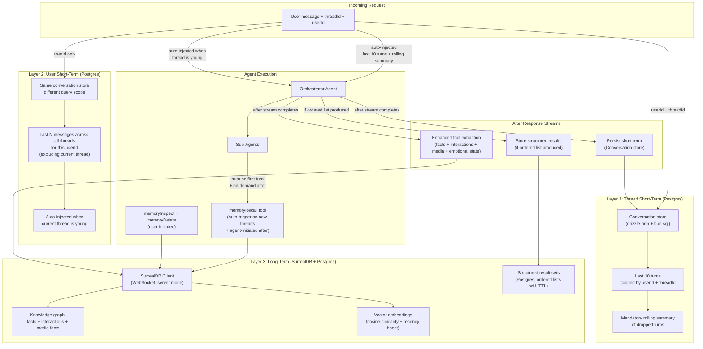

### Three-layer responsibility matrix

| Layer | Storage | Scope | Lifetime | Access Pattern | Primary Purpose |
|-------|---------|-------|----------|----------------|-----------------|
| Thread short-term | Postgres conversation store | Per thread | Session + configurable window | Auto-injected into context | Within-thread continuity |
| User short-term | Postgres conversation store (query-scope variant) | Per user, cross-thread | Ephemeral recent messages | Auto-injected for young threads | Cross-thread reference grounding |
| Long-term | SurrealDB (facts, interactions, media), Postgres (result sets) | Per user across threads | TTL-managed durability | Auto-triggered on new thread + agent-invoked | Durable memory intelligence |

Layer boundaries are strict:

- Thread short-term stores raw turns for one thread.
- User short-term stores raw turns from other threads.
- Long-term stores extracted and structured memory.

---

## Layer 1: Thread Short-Term Memory

### How it works

The agent factory wiring in [05 — Conversation Pipeline](./05-conversation.md) injects a conversation store scoped by `userId` and `threadId`. Before each model call, the memory module loads the last ten turns plus the rolling summary and prepends them to context.

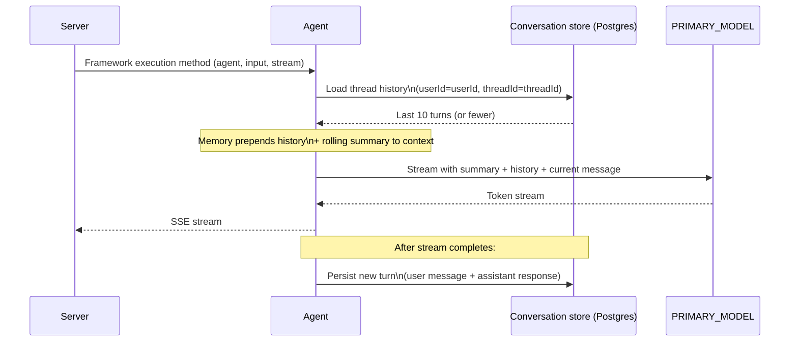

### Sliding window behavior

The active window is controlled by `lastMessages` and defaults to ten turns.

- Turns leaving the active window are dropped from context.
- Dropped turns remain persisted.
- Dropped turns are rolled into mandatory thread summary.

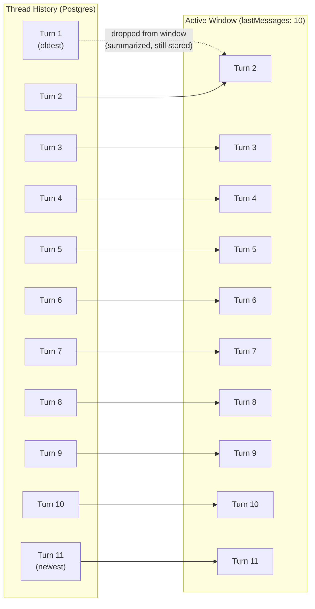

### Scoping model

- `userId`: stable memory owner identity.
- `threadId`: thread session identity.
- Both values come from request context.

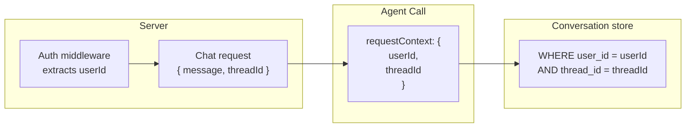

---

## Layer 2: User Short-Term Memory

### Why this layer exists

Users open fresh threads while still referencing prior context. New threads have empty thread history, so vague references like "that place" and "yesterday" lose grounding. User short-term solves this by carrying recent user messages from other threads.

### Query and injection behavior

- Scope: same conversation store, query by `userId` only.
- Excludes current `threadId`.
- Loads user turns only.
- Ordered by recency.
- Injected as framed context block.

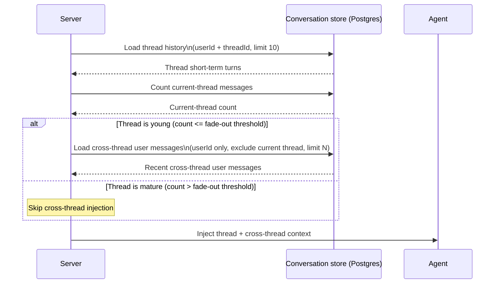

### Injection framing

Cross-thread memory is framed strictly for ambiguity resolution, not proactive mention.

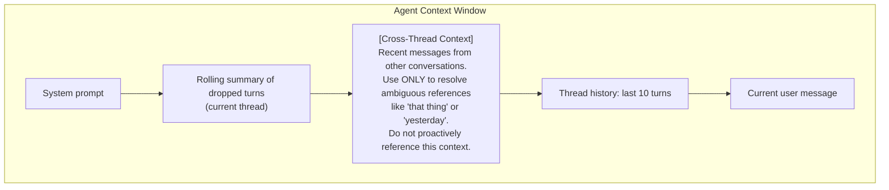

### Fade-out heuristic

Only young threads receive user short-term injection.

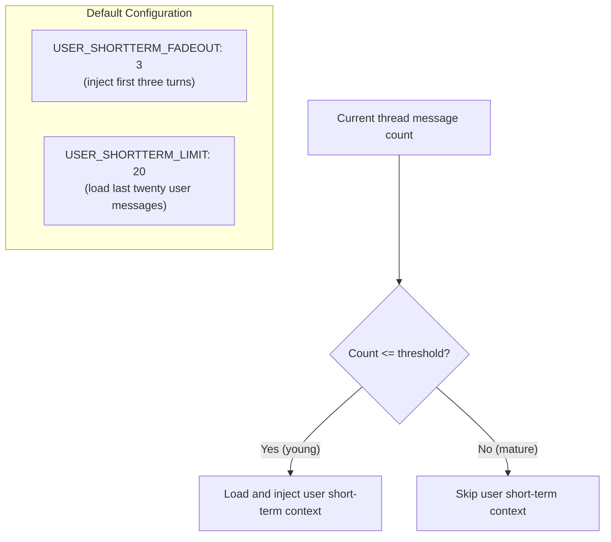

By default, user short-term is fully active at thread start and fades by turn four.

---

## Mandatory Rolling Summaries

### Why mandatory

Long threads drift topics over time. A strict ten-turn window would lose older but still relevant context. Rolling summaries preserve continuity across arbitrarily long threads with bounded token usage.

### Summary lifecycle

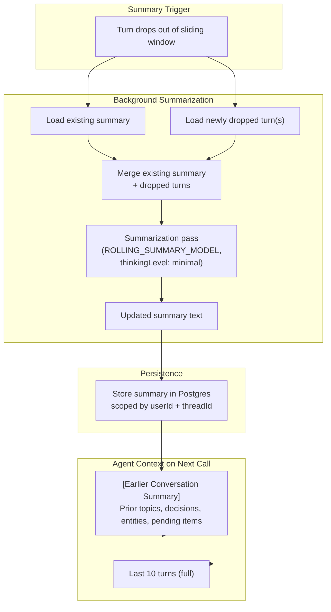

### Incremental summarization contract

Summary updates are delta-based, not full recomputation.

Summary keeps:

- Topic trajectory with rough timing.
- User decisions and preferences.
- Key entities.
- Open loops and unresolved asks.

Summary excludes:

- Verbatim transcript detail.
- Full assistant content.
- Repetition.
- Obsolete preferences that were superseded later.

### Rolling summary cap

`ROLLING_SUMMARY_MAX_TOKENS` enforces a hard summary budget.

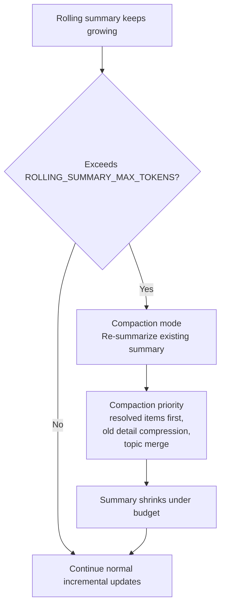

Compaction priority order:

- Remove old resolved items first.
- Collapse old detail into compact mentions.
- Merge related historical topics.

Stable user preferences and explicit decisions are retained.

### Thread summary retrieval

`threadSummary` returns the current rolling summary so direct user requests like "what did we discuss" do not require replaying large raw histories.

### Thread resurrection handling

If thread inactivity exceeds `THREAD_RESURRECTION_GAP` (default seven days), resurrection mode runs:

- Extract key entities from rolling summary.
- Trigger `memoryRecall` with entity set.
- Rehydrate available long-term records.
- Inject a staleness note indicating possible memory expiry.

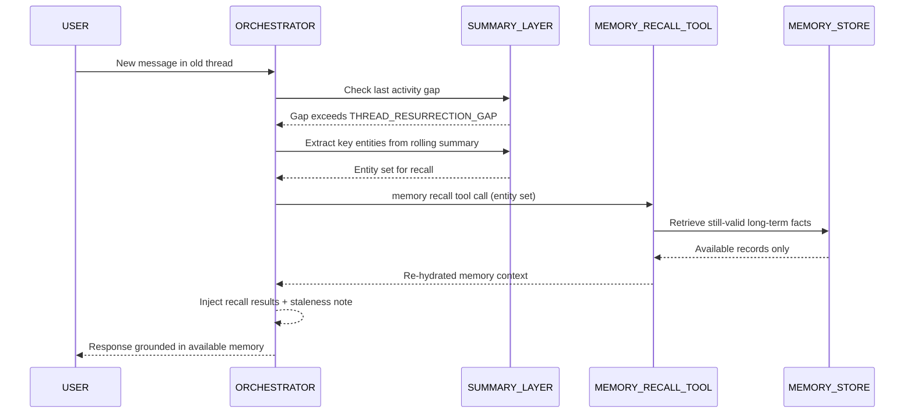

---

## Layer 3: Long-Term Memory Client

### Deployment mode

SurrealDB runs in server mode with persistent WebSocket connections. Embedded mode is used only in unit tests.

- Shared multi-instance memory consistency requires server mode.
- surqlize provides typed query and schema safety.
- All SurrealDB reads, writes, traversal, and cleanup operations run through surqlize's typed API surface.
- Raw SurrealQL query strings are prohibited in both runtime code paths and maintenance workflows.

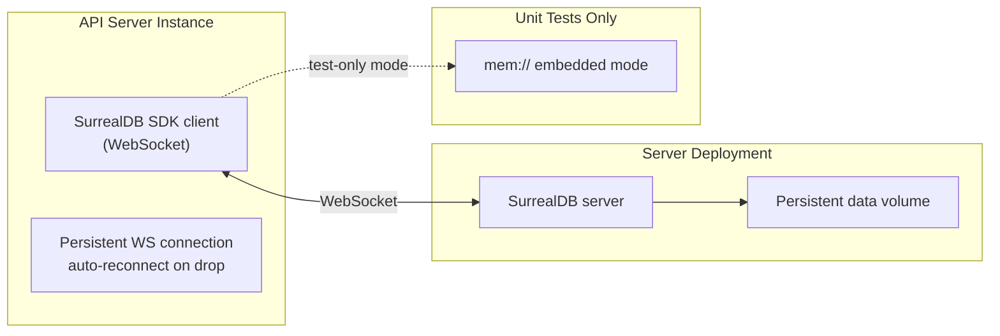

### Connection configuration

| Config | Value | Notes |
|--------|-------|-------|
| SurrealDB connection endpoint | WebSocket endpoint | Supports credentials in URL |
| Namespace | `safeagent` | Shared namespace |
| Database | `memory` | Dedicated logical database |

### Vector indexing decision

No MTREE index is required for bounded per-user memory volume. Sequential scan with cosine ranking is adequate for expected cardinality.

### Client API surface

Long-term memory client provides typed SurrealDB operations only:

- user node creation helper
- `storeFact`
- `storeInteraction`
- `storeMediaFact`
- `findSimilarFacts`
- `getFactsByUser`
- `refreshFactTTL`
- `deleteExpiredFacts`
- `deleteFactById`
- `getFactsForInspection`
- `supersedeFact`

Long-term scope is user-level and cross-thread by design.

---

## Layer 3: Graph Schema and Fact Lifecycle

### Graph model

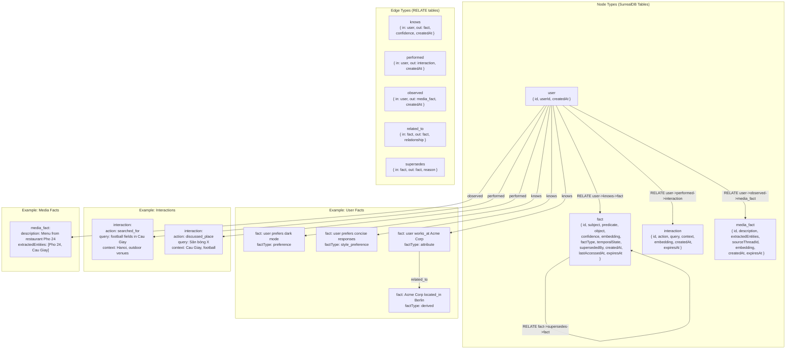

### Entity schema detail

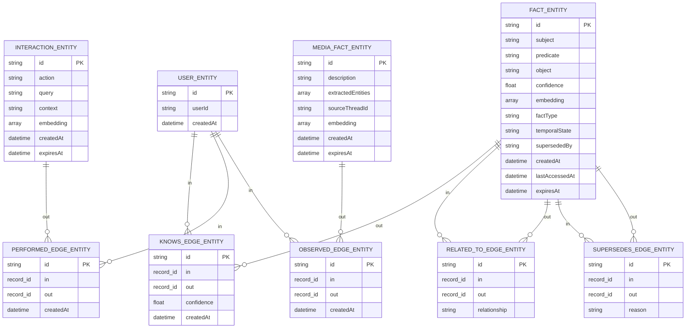

### Fact types

| factType | Description | Example |
|----------|-------------|---------|
| `preference` | User taste or preference | user prefers indoor football fields |
| `style_preference` | Communication style preference | user prefers concise responses with examples |
| `attribute` | Stable user attribute | user works_at Acme Corp |
| `derived` | Inferred from related facts | Acme Corp located_in Berlin |
| `behavioral` | Behavior pattern over time | user often searches sports venues |
| `sentiment` | Opinion polarity toward target | user dislikes Sân bóng X |
| `emotional_state` | Decaying emotional context for tone calibration | user currently frustrated about commute |

### Temporal state on facts

Each fact carries `temporalState`:

- `PAST` for historical truth.
- `PRESENT` for currently active truth.
- `FUTURE` for planned or expected state.

This state is set during extraction and used in recall ranking and formatting.

### TTL and access refresh

| Record Type | Default TTL | Rationale |
|-------------|-------------|-----------|
| `fact` | 90 days | Durable user memory with refresh-on-access |
| `interaction` | 30 days | Recent activity context |
| `media_fact` | 30 days | Visual context with shorter relevance horizon |

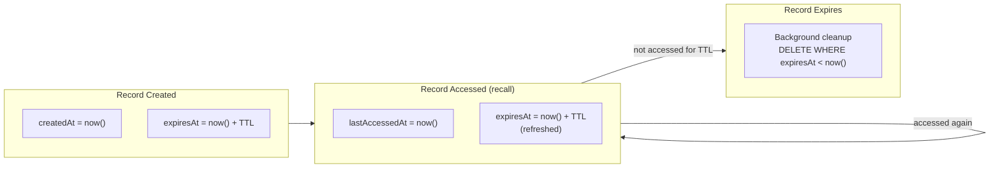

### Fact supersession and audit trail

Contradictory facts in the same dimension are superseded, never hard-overwritten.

- New fact becomes active.
- Old fact receives `supersededBy` pointer.
- `supersedes` edge records lineage and reason.
- Recall excludes superseded records by default.
- Inspection can expose superseded lineage for explainability.

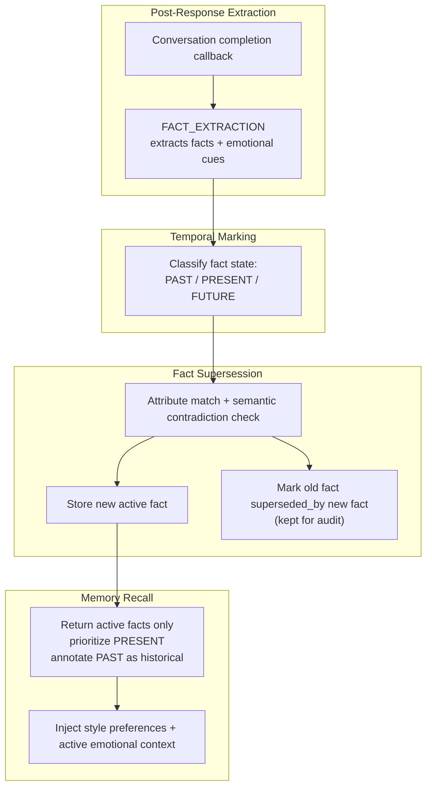

---

## Fact Extraction Pipeline

### Overview

Extraction runs after final stream completion and is non-blocking for user response latency.

Extraction categories:

- User facts.
- Interaction signals.
- Media facts.
- Correction and supersession handling.
- Emotional context with decay state.
- Temporal state marking for extracted facts.

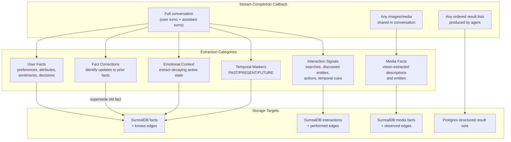

### User fact extraction

Only user-specific facts are eligible. General world knowledge is not retained as user memory.

| Subject | Predicate | Object | Confidence | factType | temporalState |
|---------|-----------|--------|------------|----------|---------------|
| user | prefers | dark mode | 0.95 | preference | PRESENT |
| user | works_at | Acme Corp | 0.90 | attribute | PRESENT |
| user | located_in | Berlin | 0.85 | attribute | PRESENT |
| user | dislikes | Sân bóng X | 0.80 | sentiment | PRESENT |
| user | uses | Python for scripting | 0.88 | attribute | PRESENT |
| user | used_to_live_in | Tokyo | 0.84 | attribute | PAST |
| user | moving_to | Berlin | 0.82 | attribute | FUTURE |

Candidate facts below 0.6 confidence are dropped.

### Extraction safeguards

All candidate facts are filtered by attribution, certainty, source, and contextual polarity.

#### Third-party attribution filter

Each candidate includes `attribution`:

- `self`
- `third_party`
- `general`

Storage rules:

- `self`: eligible as user fact.
- `third_party`: retained as interaction signal, not user preference.
- `general`: discarded.

| Statement | attribution | Outcome |
|-----------|-------------|---------|
| I love outdoor sports | self | Store as user fact |
| My wife loves yoga | third_party | Store as interaction signal |
| Pho 24 is a popular restaurant | general | Discard |

#### Sarcasm and irony handling

Polarity is inferred from local conversational context, not word-level sentiment alone.

- Complaints, contradiction tone, and sarcasm markers invert naive polarity.
- Example: "Great, another place with no parking" is treated as negative preference signal.

#### Hypothetical and certainty filter

Each candidate includes `certainty`:

- `stated`
- `hypothetical`
- `asked`

Storage rule:

- Store only `stated`.
- Discard `hypothetical` and `asked`.

| Statement | certainty | Outcome |
|-----------|-----------|---------|
| I'm vegan | stated | Stored |
| If I were vegan, I'd want... | hypothetical | Discarded |
| Am I a vegan? | asked | Discarded |
| I might try indoor fields next time | hypothetical | Discarded |

#### Hallucination feedback-loop prevention

Only user-originated content may become memory. Assistant-originated assumptions are never memory sources.

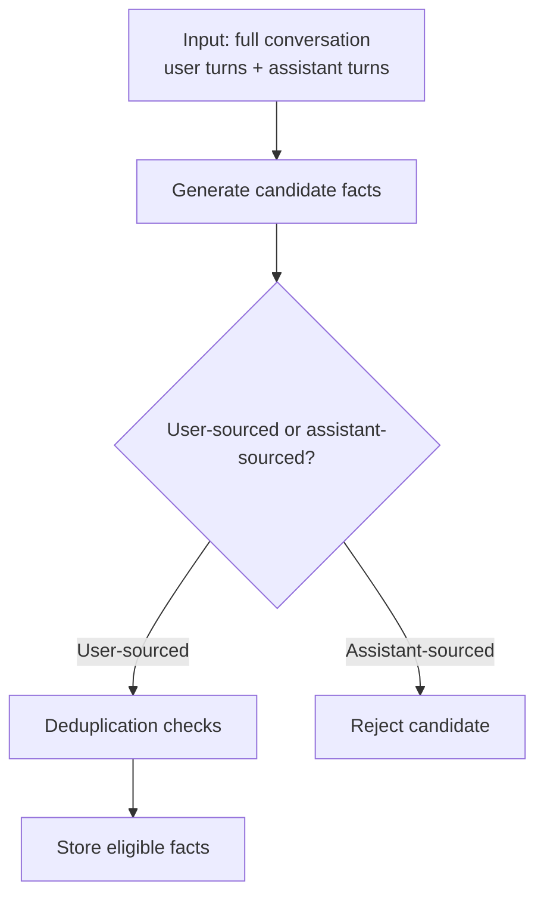

### Emotional context carry-forward with decay

Extraction also captures short-lived emotional state as `emotional_state` facts.

- Purpose: response tone calibration, not analytics.
- Each emotional state receives a decay counter (default five turns).
- On every user turn, active counters decrement.
- Active emotional state is injected into context while counter > 0.
- At zero, state becomes inactive but remains in historical audit.

### Interaction signal extraction

Interaction memory keeps operational context even when no explicit preference is present.

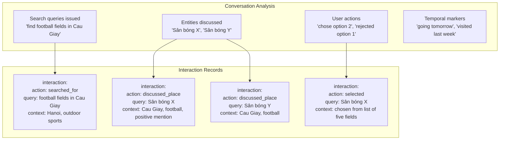

Captured interaction details include:

- Query phrasing.
- Named entities.
- User actions.
- Temporal descriptors.

Each interaction stores `createdAt` to support temporal recall queries.

### Media fact extraction

When media appears in conversation, extracted semantic description and entities become memory facts.

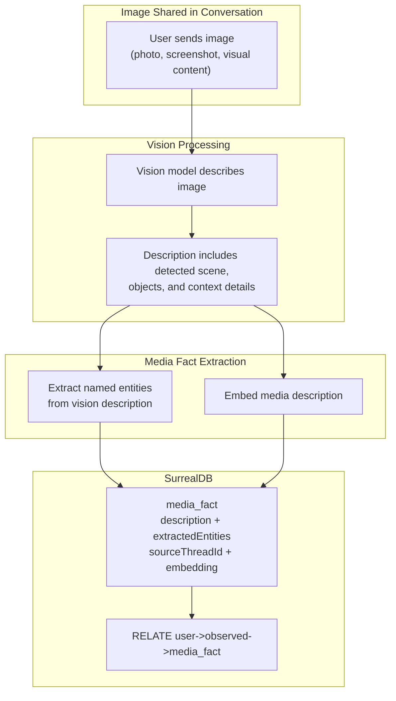

Raw media bytes are not stored as long-term memory content.

### Correction detection and fact supersession

Correction detection distinguishes duplicates, coexistence, and contradiction updates.

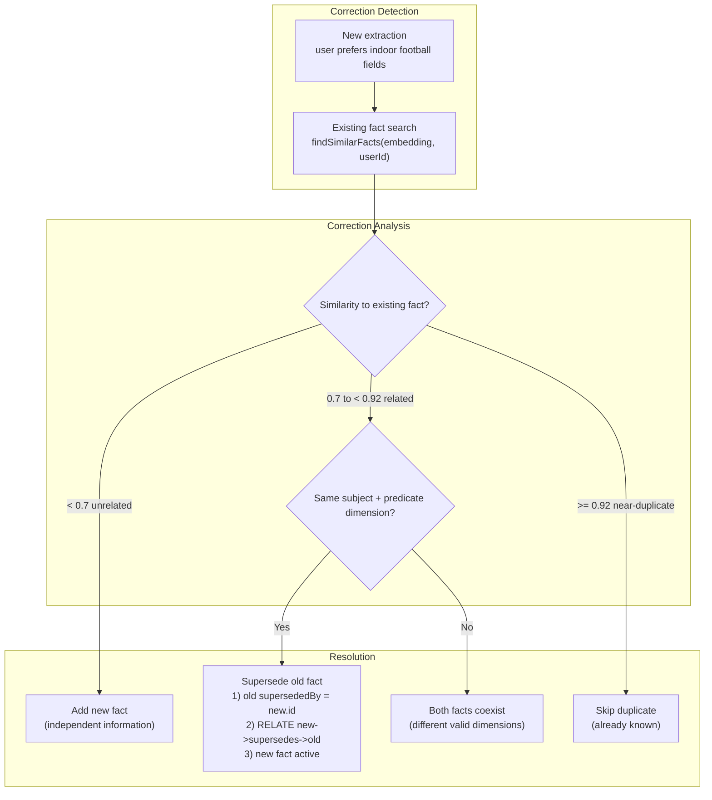

Superseded records remain for audit history and explainability.

### Duplicate detection

```mermaid
flowchart TB
    NEW_FACT_RECORD["New fact\n'user prefers dark mode'\nembedding generated"]

    SIMILARITY_QUERY["Cosine similarity search\nagainst user's existing facts\nORDER BY similarity DESC LIMIT 5"]

    DUPLICATE_THRESHOLD_CHECK{"Highest similarity >= 0.92?"}

    SKIP_INSERTION["Skip insertion\n(existing fact already known)"]
    CORRECTION_CHECK{"Correction detected?\n(same predicate pattern,\ndifferent object)"}
    STANDARD_INSERT["Insert fact + relate user->knows->fact"]
    SUPERSEDE_INSERT["Supersede old fact\n+ insert new active fact"]

    NEW_FACT_RECORD --> SIMILARITY_QUERY --> DUPLICATE_THRESHOLD_CHECK
    DUPLICATE_THRESHOLD_CHECK -->|"Yes"| SKIP_INSERTION
    DUPLICATE_THRESHOLD_CHECK -->|"No"| CORRECTION_CHECK
    CORRECTION_CHECK -->|"Yes"| SUPERSEDE_INSERT
    CORRECTION_CHECK -->|"No"| STANDARD_INSERT
```

### Fire-and-forget guarantee

- Extraction failures are logged, not user-visible.
- Partial/errored streams set `streamError` and skip extraction.
- Short-term persistence still occurs for continuity.
- This avoids memory pollution from incomplete or malformed outputs.

---

## Structured Result Memory

### Why separate storage is required

Ordinal references depend on ordered set structure, not individual facts.

- "the second one" needs list order.
- "the last option" needs list boundary.
- Long-term fact graph alone does not preserve this ordering semantics.

### What gets stored

```mermaid
flowchart TB
    subgraph AGENT_OUTPUT["Agent Produces Ordered Results"]
        ORDERED_LIST["Response contains ordered list\nwith labeled options and metadata"]
    end

    subgraph DETECTION_STAGE["Result Set Detection"]
        RESULT_LIST_DETECTOR["Post-response analysis detects\nstructured ordered result set"]
    end

    subgraph POSTGRES_STORAGE["Postgres Structured Result Set"]
        RESULT_SET_RECORD["ResultSet\nuserId\noriginatingQuery\norderedResults[]\nsourceThreadId\ncreatedAt\nexpiresAt = createdAt + 7d"]
    end

    ORDERED_LIST --> RESULT_LIST_DETECTOR --> RESULT_SET_RECORD
```

### Ordinal resolution flow

```mermaid
sequenceDiagram
    participant USER
    participant ORCHESTRATOR as Orchestrator Agent
    participant RESULT_DB as Postgres Result Sets

    Note over USER: Day 1, Thread A
    USER->>ORCHESTRATOR: find football fields in Cau Giay
    ORCHESTRATOR-->>USER: returns ordered list of options
    ORCHESTRATOR->>RESULT_DB: Store result set (userId, query, ordered results)

    Note over USER: Day 2, Thread B
    USER->>ORCHESTRATOR: book the second one
    ORCHESTRATOR->>RESULT_DB: Load most recent result set for user
    RESULT_DB-->>ORCHESTRATOR: ordered list from prior thread
    Note over ORCHESTRATOR: Resolve ordinal index to concrete item
    ORCHESTRATOR-->>USER: Continue with resolved option
```

### TTL and scope

Structured result sets:

- Live in Postgres.
- Are user-scoped across threads.
- Default TTL is seven days.
- Are cleaned by expiry jobs.

| Field | Type | Description |
|-------|------|-------------|
| `userId` | string | Owner of result set |
| `originatingQuery` | string | Query that generated results |
| `orderedResults` | structured array | Ordered items with label + metadata |
| `sourceThreadId` | string | Original thread |
| `createdAt` | timestamp | Creation time |
| `expiresAt` | timestamp | Cleanup boundary |

---

## Memory Recall Tool

### Design philosophy

Recall uses hybrid triggering:

- First message in new thread: auto-trigger recall.
- Existing thread turns: agent decides when to call.

```mermaid
flowchart TB
    INCOMING_MESSAGE["Incoming message"]

    FIRST_TURN_CHECK{"First message in thread?"}

    AUTO_RECALL_MODE["Auto-trigger memoryRecall\nbefore reasoning\nInject as system context"]
    AGENT_CONTROLLED_MODE["Agent decides whether to call\nthe memory recall tool based on query intent"]

    INCOMING_MESSAGE --> FIRST_TURN_CHECK
    FIRST_TURN_CHECK -->|"Yes"| AUTO_RECALL_MODE
    FIRST_TURN_CHECK -->|"No"| AGENT_CONTROLLED_MODE
```

### Auto-trigger flow

```mermaid
sequenceDiagram
    participant SERVER
    participant POSTGRES
    participant RECALL_TOOL
    participant SURREALDB
    participant ORCHESTRATOR

    SERVER->>POSTGRES: Check thread message count
    POSTGRES-->>SERVER: count = 0 (new thread)

    par Parallel Memory Loading
        SERVER->>POSTGRES: Load user short-term cross-thread messages
        SERVER->>RECALL_TOOL: Auto-trigger recall using first user message
        RECALL_TOOL->>SURREALDB: Semantic search + graph traversal\n(with recency boost + temporal filter)
        SURREALDB-->>RECALL_TOOL: Relevant facts + interactions + media facts
    end

    POSTGRES-->>SERVER: Cross-thread messages
    RECALL_TOOL-->>SERVER: Recalled long-term context

    SERVER->>ORCHESTRATOR: Start with rolling summary + cross-thread + recalled memory + current message
```

### Tool flow

```mermaid
flowchart TB
    subgraph AGENT_STAGE["Agent Tool Use"]
        TOOL_DECISION["Agent decides query needs prior user context"]
        TOOL_CALL["Call memory recall tool\n(query + optional temporal hint)"]
    end

    subgraph RECALL_PIPELINE["memory recall tool factory"]
        QUERY_EMBEDDING["Embed query text"]

        subgraph PARALLEL_SEARCH["Parallel Search"]
            SEMANTIC_SEARCH["Cosine similarity over facts + interactions + media facts\nwith recency weighting"]
            GRAPH_TRAVERSAL["Graph traversal\nuser->knows->fact->related_to->fact\nuser->performed->interaction\nuser->observed->media_fact"]
            TEMPORAL_FILTER["Temporal date-range filter\nwhen temporalHint exists"]
        end

        MERGE_RESULTS["Merge + deduplicate"]
        RANK_RESULTS["Rank by recency-weighted relevance"]
        FORMAT_CONTEXT["Format context for agent reasoning"]
    end

    subgraph MEMORY_BACKEND["SurrealDB"]
        VECTOR_QUERY["Cosine similarity query"]
        GRAPH_QUERY["Graph relation traversal"]
    end

    TOOL_DECISION --> TOOL_CALL --> QUERY_EMBEDDING
    QUERY_EMBEDDING --> SEMANTIC_SEARCH
    QUERY_EMBEDDING --> GRAPH_TRAVERSAL
    QUERY_EMBEDDING --> TEMPORAL_FILTER
    SEMANTIC_SEARCH --> VECTOR_QUERY --> MERGE_RESULTS
    GRAPH_TRAVERSAL --> GRAPH_QUERY --> MERGE_RESULTS
    TEMPORAL_FILTER --> MERGE_RESULTS
    MERGE_RESULTS --> RANK_RESULTS --> FORMAT_CONTEXT
```

### Graph traversal detail

```mermaid
flowchart LR
    USER_VERTEX["user:userId"]

    subgraph HOP_ONE["One hop"]
        FACT_WORK_REL["fact: user works_at Acme Corp"]
        FACT_PREF_REL["fact: user prefers indoor fields"]
        INTERACTION_REL["interaction: searched football fields in Cau Giay"]
        MEDIA_REL["media_fact: menu from Pho 24"]
    end

    subgraph HOP_TWO["Two hop via related_to"]
        FACT_CITY_REL["fact: Acme Corp located_in Berlin"]
        FACT_INDUSTRY_REL["fact: Acme Corp industry software"]
    end

    USER_VERTEX -->|"->knows->"| FACT_WORK_REL
    USER_VERTEX -->|"->knows->"| FACT_PREF_REL
    USER_VERTEX -->|"->performed->"| INTERACTION_REL
    USER_VERTEX -->|"->observed->"| MEDIA_REL
    FACT_WORK_REL -->|"->related_to->"| FACT_CITY_REL
    FACT_WORK_REL -->|"->related_to->"| FACT_INDUSTRY_REL
```

### Temporal-aware recall

Temporal expressions resolved by [06 — Agents & Orchestration](./06-agents.md) are passed as `temporalHint` date ranges.

```mermaid
flowchart TB
    subgraph TEMPORAL_RESOLUTION["Temporal Expression Resolution"]
        TEMPORAL_EXPRESSION["'the place I went yesterday'"]
        TEMPORAL_HINT["temporalHint: { from, to }"]
    end

    subgraph FILTERED_RECALL["Filtered Recall"]
        ALL_MEMORY_RECORDS["All user facts + interactions + media facts"]
        DATE_RANGE_FILTER["Filter by createdAt within range"]
        DATE_FILTERED_SET["Records from target range only"]
        SEMANTIC_RANKING["Semantic ranking inside filtered set"]
    end

    TEMPORAL_EXPRESSION --> TEMPORAL_HINT
    TEMPORAL_HINT --> DATE_RANGE_FILTER
    ALL_MEMORY_RECORDS --> DATE_RANGE_FILTER
    DATE_RANGE_FILTER --> DATE_FILTERED_SET --> SEMANTIC_RANKING
```

### Recency weighting

```mermaid
flowchart LR
    subgraph RECENCY_MULTIPLIERS["Recency Multipliers"]
        WITHIN_DAY["Created within 24h\nmultiplier 1.5x"]
        WITHIN_WEEK["Created within 7d\nmultiplier 1.2x"]
        OLDER_THAN_WEEK["Created beyond 7d\nmultiplier 1.0x"]
    end

    subgraph SCORE_CALCULATION["Final Scoring"]
        RAW_SIMILARITY["Raw cosine similarity: 0.85"]
        DAY_SCORE["24h record: 0.85 x 1.5 = 1.275"]
        WEEK_SCORE["3d record: 0.85 x 1.2 = 1.020"]
        OLD_SCORE["30d record: 0.85 x 1.0 = 0.850"]
    end

    WITHIN_DAY --> DAY_SCORE
    WITHIN_WEEK --> WEEK_SCORE
    OLDER_THAN_WEEK --> OLD_SCORE
```

### Recall output contract

Recall returns formatted context text, grouped by:

- Active facts.
- Recent interactions.
- Media context.
- Style preferences.
- Active emotional state.

Superseded facts are excluded unless explicitly requested.

### TTL refresh on recall

Records returned by recall receive updated `lastAccessedAt` and refreshed `expiresAt`.

---

## User Memory Control

Memory control is required for trust and user agency.

- `memoryInspect`: what is remembered.
- `memoryDelete`: remove specific memory scope.

### Inspect flow

```mermaid
flowchart TB
    subgraph INSPECT_REQUEST["User asks what is remembered"]
        INSPECT_TRIGGER["Agent calls memoryInspect"]
    end

    subgraph INSPECT_EXECUTION["memoryInspect Execution"]
        QUERY_FACTS["Load active facts for user\n(excluding superseded)"]
        QUERY_INTERACTIONS["Load recent interactions"]
        QUERY_MEDIA["Load media facts"]
        QUERY_RESULTS["Load recent structured result sets"]
    end

    subgraph INSPECT_RESPONSE["Formatted Response"]
        FACTS_OUTPUT["Preferences and facts"]
        INTERACTIONS_OUTPUT["Recent activity"]
        MEDIA_OUTPUT["Visual context"]
        RESULTS_OUTPUT["Recent ordered result lists"]
    end

    INSPECT_TRIGGER --> QUERY_FACTS
    INSPECT_TRIGGER --> QUERY_INTERACTIONS
    INSPECT_TRIGGER --> QUERY_MEDIA
    INSPECT_TRIGGER --> QUERY_RESULTS
    QUERY_FACTS --> FACTS_OUTPUT
    QUERY_INTERACTIONS --> INTERACTIONS_OUTPUT
    QUERY_MEDIA --> MEDIA_OUTPUT
    QUERY_RESULTS --> RESULTS_OUTPUT
```

### Delete flow

```mermaid
flowchart TB
    subgraph DELETE_REQUEST["User asks to forget a topic"]
        DELETE_TRIGGER["Agent calls memoryDelete with query"]
    end

    subgraph MATCHING_STAGE["Find Matching Records"]
        DELETE_QUERY_EMBED["Embed deletion query"]
        DELETE_SEARCH["Semantic search across facts + interactions + media facts"]
        MATCHED_RECORDS["Matched records above threshold"]
    end

    subgraph CONFIRM_STAGE["Confirmation"]
        CONFIRM_LIST["Show candidate records and request explicit confirmation"]
    end

    subgraph DELETE_EXECUTION["After Confirmation"]
        DELETE_MEMORY_RECORDS["Delete matching records from SurrealDB"]
        DELETE_MEMORY_EDGES["Delete associated edges"]
        PURGE_EMBED_CACHE["Purge related Valkey embedding cache"]
        DELETE_RESULT_SETS["Delete related structured result sets"]
    end

    DELETE_TRIGGER --> DELETE_QUERY_EMBED --> DELETE_SEARCH --> MATCHED_RECORDS
    MATCHED_RECORDS --> CONFIRM_LIST
    CONFIRM_LIST -->|"User confirms"| DELETE_MEMORY_RECORDS
    DELETE_MEMORY_RECORDS --> DELETE_MEMORY_EDGES --> PURGE_EMBED_CACHE --> DELETE_RESULT_SETS
```

### Deletion guarantees

- Confirmation is mandatory before destructive delete.
- Cache purge is required to prevent stale recall surfacing deleted content.
- Deletion is atomic per record to avoid orphaned edges.

---

## Memory and Intent Detection

Intent quality depends on memory-loaded context.

Execution is two-phase and non-circular:

- Phase 1: load memory layers in parallel.
- Phase 2: feed combined context to embedding router and validator.

```mermaid
flowchart TB
    subgraph PHASE_ONE["Phase 1: Memory Loading (parallel)"]
        LOAD_THREAD_LAYER["Layer 1\nlast 10 turns + rolling summary\n(userId + threadId)"]
        LOAD_USER_LAYER["Layer 2\ncross-thread user messages\n(userId only, if thread young)"]
        LOAD_LONGTERM_LAYER["Layer 3\nauto recall on new thread\n(raw user message as query)"]
    end

    MEMORY_BARRIER["All layers resolved"]

    subgraph PHASE_TWO["Phase 2: Intent Detection"]
        subgraph COMBINED_CONTEXT["Combined Context"]
            CONTEXT_CONCAT["rolling summary + cross-thread + recalled memory + current message"]
        end

        subgraph EMBEDDING_ROUTER["Embedding Router"]
            EMBED_CONTEXT["Embed combined context"]
            ROUTER_SIMILARITY["Cosine similarity vs topic vectors"]
            ROUTER_INTENT["Initial intent classification"]
        end

        subgraph VALIDATOR["LLM Validator"]
            VALIDATOR_INPUT["combined context + router guess"]
            VALIDATOR_OUTPUT["validatedIntent + rewrittenQuery + temporalReferences + dependentIntents"]
        end
    end

    LOAD_THREAD_LAYER --> MEMORY_BARRIER
    LOAD_USER_LAYER --> MEMORY_BARRIER
    LOAD_LONGTERM_LAYER --> MEMORY_BARRIER
    MEMORY_BARRIER --> CONTEXT_CONCAT
    CONTEXT_CONCAT --> EMBED_CONTEXT --> ROUTER_SIMILARITY --> ROUTER_INTENT
    CONTEXT_CONCAT --> VALIDATOR_INPUT --> VALIDATOR_OUTPUT
```

### Memory source in source-priority routing

`memory_recall` participates as a source in source-priority fan-out.

```mermaid
flowchart LR
    subgraph TOPIC_CONFIG["Topic configuration"]
        SOURCE_PRIORITY["sourcesPriority\n['memory_recall', 'document_qa', 'direct_answer']"]
    end

    subgraph PARALLEL_FANOUT["Parallel fan-out"]
        MEMORY_SOURCE["memory_recall\n(weight 1.0)"]
        DOCUMENT_SOURCE["document_qa\n(weight 0.67)"]
        DIRECT_SOURCE["direct_answer\n(weight 0.33)"]
    end

    SOURCE_PRIORITY --> MEMORY_SOURCE
    SOURCE_PRIORITY --> DOCUMENT_SOURCE
    SOURCE_PRIORITY --> DIRECT_SOURCE
    MEMORY_SOURCE --> MEMORY_CONTEXT_INJECT["Returns context string\ninjected into agent context\n(not merged into citation scoring)"]
    DOCUMENT_SOURCE --> CITATION_MERGE["Produces Citation objects\nweighted and merged"]
    DIRECT_SOURCE --> CITATION_MERGE
```

Fact extraction runs once after orchestrator final synthesis, not per sub-agent.

---

## Context Window Budget Management

The engine enforces `CONTEXT_WINDOW_BUDGET` with strict priority trimming.

Priority order:

1. System prompt (never truncated)
2. Current user message (never truncated)
3. Tool definitions (never truncated)
4. Last ten thread turns (drop oldest first)
5. Rolling summary (compaction when above cap)
6. Recalled long-term memory (`MAX_RECALL_TOKENS` cap)
7. User short-term cross-thread context (reduce first, then drop)

Token estimation uses character-length heuristic for low-cost overflow prevention.

```mermaid
flowchart TB
    TOTAL_BUDGET["CONTEXT_WINDOW_BUDGET"] --> RESERVE_CORE["Reserve non-truncatable core\nSystem prompt + user message + tools"]
    RESERVE_CORE --> ALLOCATE_THREAD["Allocate thread turns\ntruncate oldest first"]
    ALLOCATE_THREAD --> ALLOCATE_SUMMARY["Allocate rolling summary\ncompact above summary cap"]
    ALLOCATE_SUMMARY --> ALLOCATE_RECALL["Allocate recalled memory\ncap at MAX_RECALL_TOKENS"]
    ALLOCATE_RECALL --> ALLOCATE_CROSS_THREAD["Allocate cross-thread messages\nreduce then drop if needed"]
    ALLOCATE_CROSS_THREAD --> FINAL_CONTEXT["Final context under budget"]
```

---

## Tradeoffs and Design Decisions

### User short-term token cost

Cross-thread context adds input tokens for early thread turns.

Mitigations:

- user-turn-only loading
- fade-out threshold
- configurable limit and threshold

### User short-term context pollution risk

Unrelated prior thread content can introduce noise.

Mitigations:

- strict injection framing
- short fade-out window
- semantic relevance filtering by downstream reasoning

### Mandatory rolling summary cost

Summarization adds background model calls.

Mitigations:

- minimal-thinking summary model
- incremental updates only
- asynchronous non-blocking execution

### Structured result scope limitation

Seven-day TTL means old ordinal references eventually expire.

Decision rationale:

- ordinal references are usually short horizon
- long-horizon preservation should be explicit at application layer

### Supersession accuracy tradeoff

Contradiction detection is heuristic, not perfect.

- False supersession is recoverable because old facts remain.
- False coexistence is corrected on later updates.

### Emotional decay tradeoff

Emotional carry-forward can over-persist if decay is too long.

- default decay is intentionally short
- inactive states stop influencing tone but remain auditable

---

## Cross-References

| Component | Interaction |
|-----------|------------|
| **Requirements** ([01 — Requirements & Constraints](./01-requirements.md)) | Defines trust, controllability, and persistence constraints memory must satisfy |
| **Conversation Pipeline** ([05 — Conversation Pipeline](./05-conversation.md)) | Provides request context wiring, stream completion callback, and rolling summary insertion points |
| **Agents & Orchestration** ([06 — Agents & Orchestration](./06-agents.md)) | Defines tool invocation behavior, temporal expression resolution, and source-priority execution that consume memory context |
| **Document Processing** ([08 — Document Processing](./08-documents.md)) | Coexists with memory recall in source fan-out and citation-aware synthesis |

---

## Task Specifications

### Task SHORT_TERM_MEM: Thread Short-Term Memory + Mandatory Rolling Summaries

**What to do**: Wire a conversation store-backed short-term module into the agent factory with strict `userId` + `threadId` scoping, ten-turn sliding window, mandatory rolling summaries, and thread summary retrieval.

**Depends on**: CORE_TYPES, STORAGE_WRAPPER

**Acceptance Criteria**:

- Thread short-term memory capability returns a configured memory module backed by conversation store.
- `lastMessages` default is ten and remains configurable.
- Memory scope is enforced by `userId` + `threadId`.
- `userId` enters only through request context.
- Rolling summarization is always enabled.
- Overflow turns trigger incremental summary update.
- Summary uses `ROLLING_SUMMARY_MODEL` with minimal thinking.
- Summary retains topics, entities, decisions, unresolved items.
- Summary omits verbatim quotes, full assistant content, repetition, superseded preferences.
- Summary persists by `userId` + `threadId`.
- Summary injects as leading system context block.
- `threadSummary` returns active thread summary.
- Agent factory wiring uses provided memory instance.
- Different thread IDs remain isolated.
- Same thread ID across different users remains isolated by ownership.
- Uses shared Postgres pool.
- Unit coverage validates store behavior with mocks.
- Integration coverage validates overflow with summary + last ten turns.

**QA Scenarios**:

- New thread returns empty history and no summary.
- Five-turn thread injects all five turns.
- Ten-turn thread injects all ten turns.
- Eleven-turn thread injects last ten and summarizes dropped turn.
- Fifty-turn thread injects last ten plus rolled history summary.
- "What did we discuss" uses `threadSummary` output.
- Multi-topic thread summary reflects old and new topics.
- Same thread ID, different users do not leak context.
- Summarization outage logs error and preserves prior summary.
- Store outage returns typed error.

---

### Task USER_SHORTTERM_MEM: User Short-Term Memory (Cross-Thread)

**What to do**: Implement cross-thread user short-term retrieval from the same conversation store, active only for young threads, injected as constrained ambiguity-resolution context.

**Depends on**: SHORT_TERM_MEM, CORE_TYPES

**Acceptance Criteria**:

- Query scope is `userId`, excluding current thread.
- Loads user turns only.
- Ordered by recency, limited by `USER_SHORTTERM_LIMIT`.
- Fade-out controlled by `USER_SHORTTERM_FADEOUT`.
- Injection framing restricts proactive mention.
- Injection order is system prompt, rolling summary, cross-thread, thread turns, current message.
- Uses shared Postgres pool and efficient indexing.
- Cross-thread context also feeds embedding router and validator.
- Unit coverage validates selection and fade-out logic.
- Integration coverage validates Thread A context in new Thread B.

**QA Scenarios**:

- New thread loads cross-thread context.
- Thread at threshold still loads cross-thread context.
- Thread above threshold skips cross-thread context.
- No prior threads yields empty cross-thread block.
- High thread count still bounded by limit.
- Multi-user isolation remains strict.
- Current thread exclusion prevents duplication.
- Assistant messages excluded from cross-thread block.
- Intent classifier receives cross-thread context when active.

---

### Task SURREALDB_CLIENT: SurrealDB Client

**What to do**: Build typed SurrealDB memory client with server-mode connectivity, schema definitions, resilient reconnection, and helper APIs for fact, interaction, media, inspection, deletion, and supersession workflows.

**Depends on**: SCAFFOLD_LIB

**Acceptance Criteria**:

- Connects via the SurrealDB connection endpoint.
- Uses surqlize with typed schema and query helpers.
- All SurrealDB operations in this task flow through surqlize typed APIs; raw query strings are not permitted.
- Namespace and database are set for memory domain.
- Persistent connection auto-recovers after drop.
- Schema includes user, fact, interaction, media_fact, knows, performed, observed, related_to, supersedes.
- Fact table includes `factType`, `temporalState`, and `supersededBy`.
- Interaction table includes action/query/context/embedding/timestamps.
- Media table includes description/entities/thread source/embedding/timestamps.
- Implements helper functions for creation, search, traversal, refresh, expiry, inspection, delete, and supersession.
- Supports `mem://` for test mode.
- Missing URL disables long-term memory gracefully.
- Unit tests use embedded mode.
- Integration tests run against real server when configured.

**QA Scenarios**:

- Server mode connection initializes correctly.
- User node creation helper is idempotent.
- `storeFact` creates fact + relation edge.
- `storeInteraction` creates interaction + relation edge.
- `storeMediaFact` creates media + relation edge.
- Similarity search applies recency weighting.
- Date-range search respects temporal bounds.
- Unrelated query returns empty or low-confidence set.
- `supersedeFact` links old and new correctly.
- `deleteFactById` removes record, edges, and cache residue.
- Inspection pagination returns stable pages.
- TTL refresh updates access and expiry fields.
- Expiry cleanup removes stale records only.
- Connection drop recovers automatically.
- Embedded test mode works without server.

---

### Task FACT_EXTRACTION: Enhanced Fact Extraction Pipeline

**What to do**: Run non-blocking extraction after final stream completion to store user facts, interaction signals, media facts, temporal markers, emotional context state, and contradiction-aware supersession updates.

**Depends on**: SURREALDB_CLIENT, AGENT_FACTORY

**Acceptance Criteria**:

- Executes in stream completion callback.
- Does not block user-facing response.
- Uses PRIMARY_MODEL at low thinking.
- Extracts user facts with confidence and fact type.
- Extracts interaction signals with action/query/context.
- Extracts media facts from shared images.
- Extracts emotional states with decay metadata.
- Tags temporal state for each fact (PAST/PRESENT/FUTURE).
- Applies attribution filter (`self`, `third_party`, `general`).
- Applies certainty filter (`stated`, `hypothetical`, `asked`).
- Applies sarcasm/context polarity handling.
- Enforces user-source-only memory rule.
- Drops low-confidence facts (< 0.6).
- Embeds every stored record via embedding provider.
- Duplicate threshold is 0.92.
- Correction window 0.7 to < 0.92 plus predicate match triggers supersession.
- Interaction records are timestamp-distinct and retained.
- Media facts are deduplicated by content similarity.
- Extraction failures are logged and non-fatal.
- Errored stream callbacks skip extraction to avoid memory corruption.
- Runs once per orchestrator final output, not per sub-agent.
- Unit coverage mocks model and memory client.
- Integration coverage verifies facts + interactions + media persistence.

**QA Scenarios**:

- Explicit preference yields preference fact.
- Search query yields searched_for interaction.
- Discussed entities yield discussed_place interactions.
- Shared image yields media_fact with entities.
- Correction statement supersedes prior fact.
- Similar but distinct facts coexist.
- Near duplicate does not reinsert.
- No extractable content creates no records and no failure.
- Extraction model failure logs error without crash.
- Memory backend outage logs error without crash.
- Confidence below threshold is rejected.
- Assistant hallucinated statement is not stored.
- Emotional cue activates short-lived tone context.
- Hypothetical and question forms are discarded.

---

### Task MEMORY_RECALL: Enhanced Memory Recall Tool

**What to do**: Build the memory recall tool factory supporting semantic + graph retrieval over facts/interactions/media, temporal filtering, recency weighting, TTL refresh, and auto-trigger behavior on new threads.

**Depends on**: SURREALDB_CLIENT, AGENT_FACTORY

**Acceptance Criteria**:

- Tool definition is framework-compatible.
- Accepts required `query` and optional `temporalHint`.
- Searches facts, interactions, and media facts.
- Semantic path uses embeddings and recency multipliers.
- Recency uses 24-hour and seven-day configurable boosts.
- Temporal hint applies date-range pre-filtering.
- Graph traversal follows supported edge patterns up to two hops.
- Merges and deduplicates across paths.
- Excludes superseded facts by default.
- Prioritizes PRESENT facts and annotates PAST facts.
- Includes style preferences in recall output.
- Injects active emotional context when decay > 0.
- Refreshes TTL metadata on returned records.
- Returns formatted context string by category.
- Auto-trigger mode injects context before agent reasoning.
- Agent-initiated mode returns tool output during reasoning.
- Tool guidance text describes valid invocation conditions.
- Unit and integration tests validate ranking and retrieval.

**QA Scenarios**:

- Preference query returns matching fact.
- Temporal query with hint returns only matching date range.
- Two-hop traversal resolves related attribute.
- Recent interaction outranks older similar record.
- New-thread auto-trigger injects prior context.
- Empty relevant set returns empty context safely.
- Mixed-match query returns all categories.
- Superseded fact is hidden, active replacement shown.
- Backend outage returns typed error.
- TTL fields refresh after successful recall.
- Empty query returns typed validation error.
- Active emotional context appears while decay active.
- Style preference appears in formatted guidance block.

---

### Task STRUCTURED_RESULT_MEM: Structured Result Memory

**What to do**: Detect ordered result outputs, store result sets with TTL in Postgres, and provide ordinal resolution helpers across threads.

**Depends on**: STORAGE_WRAPPER, CORE_TYPES, AGENT_FACTORY

**Acceptance Criteria**:

- Post-response detection identifies ordered result sets.
- Detection uses structured output shape, not brittle text parsing.
- Stores userId, originatingQuery, orderedResults, sourceThreadId, createdAt, expiresAt.
- Result set TTL defaults to seven days.
- A query retrieves the most recent result sets for a user with a configurable limit.
- An ordinal resolution function maps ordinal references (e.g., "the second one") to specific items in recent result sets.
- Scope is cross-thread at user level.
- Expired sets are cleaned by background job.
- Unit coverage validates storage, lookup, and TTL cleanup.
- Integration coverage validates cross-thread ordinal resolution.

**QA Scenarios**:

- Ordered list output stores complete set.
- "second one" resolves to second item.
- "last one" resolves to final item.
- Out-of-range ordinal returns typed error.
- Missing recent set returns typed clarification error.
- Expired set is no longer available.
- Most recent of multiple sets is used.
- Result from one thread resolves in another thread.

---

### Task MEMORY_CONTROL: User Memory Control Tools

**What to do**: Build memory inspect and memory delete tool factories for user-visible memory inspection and confirmation-gated memory deletion including cache and structured-result cleanup.

**Depends on**: SURREALDB_CLIENT, STRUCTURED_RESULT_MEM, AGENT_FACTORY

**Acceptance Criteria**:

- Inspect and delete tools are framework-compatible.
- Inspect returns paginated, human-readable categories.
- Inspect covers facts, interactions, media, result sets.
- Active and superseded facts are distinguishable.
- Delete accepts semantic query string.
- Delete performs similarity-based matching.
- Delete returns candidate records before action.
- Deletion requires explicit user confirmation.
- Confirmed deletion removes records, edges, cache entries, and related result sets.
- Deletion remains atomic per record.
- Feature registration is controlled by `MEMORY_INSPECTION_ENABLED`.
- Unit coverage validates inspect and delete behavior.
- Integration coverage validates end-to-end inspect/delete lifecycle.

**QA Scenarios**:

- "What do you know about me" triggers inspect.
- "Forget football" triggers delete candidate discovery.
- Confirmation performs full deletion pipeline.
- Cancellation performs no deletion.
- No matches yields explicit no-op response.
- Empty-memory user receives explicit empty-memory response.
- Partial backend failure logs and reports failed subset.
- Disabled feature flag unregisters control tools.

---

## External References

- AI SDK documentation: https://sdk.vercel.ai/docs
- SurrealDB documentation: https://surrealdb.com/docs
- SurrealDB RELATE statement: https://surrealdb.com/docs/surrealql/statements/relate
- SurrealDB vector functions: https://surrealdb.com/docs/surrealql/functions/database/vector
- SurrealDB SDK for JavaScript: https://surrealdb.com/docs/sdk/javascript
- surqlize ORM: https://github.com/surrealdb/surqlize

---

*Previous: [06 — Agents & Orchestration](./06-agents.md) | Next: [08 — Document Processing](./08-documents.md)*
