# 09 — RAG & Retrieval

> **Scope**: Hybrid search with Reciprocal Rank Fusion (RRF), the `page_index` query system, structured citations, cross-conversation RAG, and large TXT file handling.
>
> **Tasks**: RAG_INFRA (RAG Infrastructure), CROSS_CONV_RAG (Cross-Conversation RAG)

---

## Table of Contents

- [Architecture Overview](#architecture-overview)
- [The page_index System](#the-pageindex-system)
- [Hybrid Search with RRF](#hybrid-search-with-rrf)
- [Graceful Degradation](#graceful-degradation)
- [The Query Tool](#the-query-tool)
- [Page Context Assembly](#page-context-assembly)
- [Structured Citations](#structured-citations)
- [Cross-Conversation RAG](#cross-conversation-rag)
- [Large TXT RAG](#large-txt-rag)
- [Cross-References](#cross-references)
- [Task Specifications](#task-specifications)
- [External References](#external-references)

---

## Architecture Overview

RAG in safeagent is built around the `page_index` table, which stores per-page data for uploaded PDFs. The upload endpoint returns immediately with a `fileId` and initial status (`uploading`), then processing continues asynchronously through `summarizing` to `ready`. Each page has two representations over that lifecycle: a detailed summary (available after the async summarization stage) and raw extracted text (available after background enrichment). Hybrid search fuses results from up to three arms depending on which representations are available.

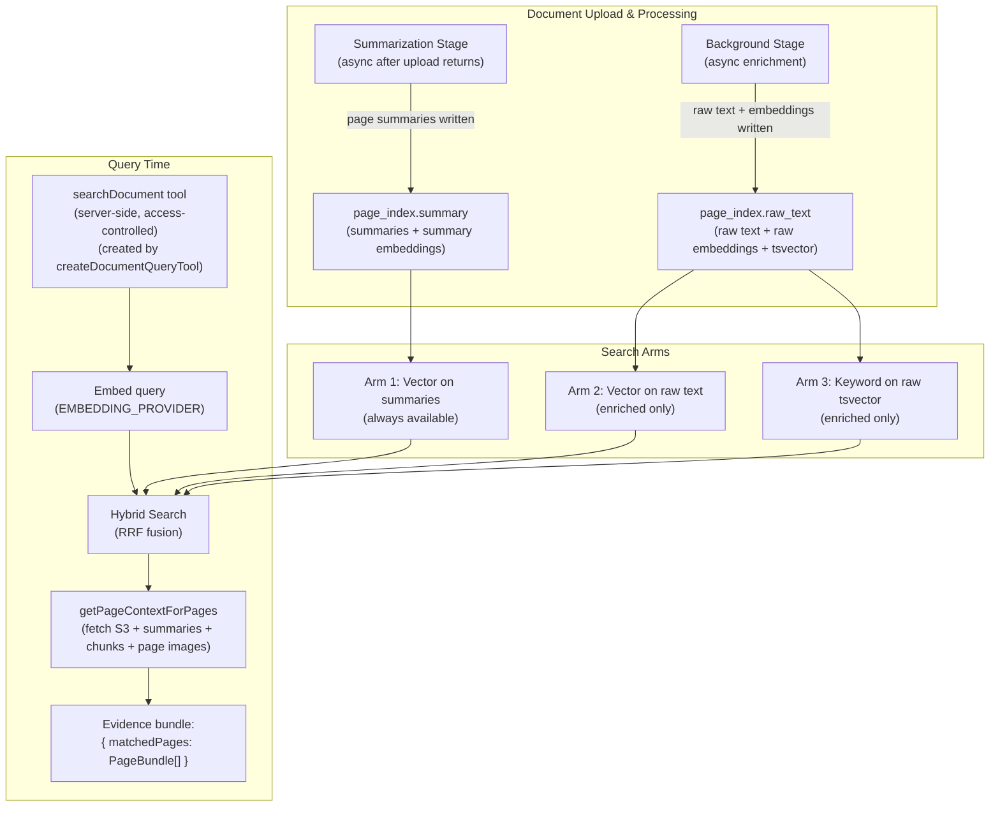

The two-stage processing model means retrieval quality improves automatically as background enrichment completes. A query that arrives seconds after upload gets summary-only results. The same query an hour later gets full three-arm fusion. The user never sees an error either way.

---

## The page_index System

### Table Structure

The `page_index` table is the central data structure for PDF retrieval. Each row represents one page of one uploaded file.

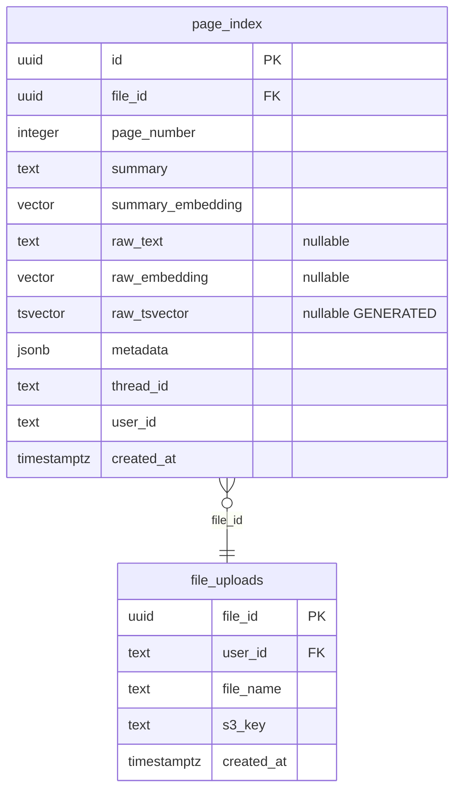

The `summary` column holds the LLM-generated page summary. It's populated during asynchronous summarization after upload acceptance. The `raw_text`, `raw_embedding`, and `raw_tsvector` columns are populated during later background enrichment. A row with null `raw_text` is in summary-only mode.

### Two Representations Per Page

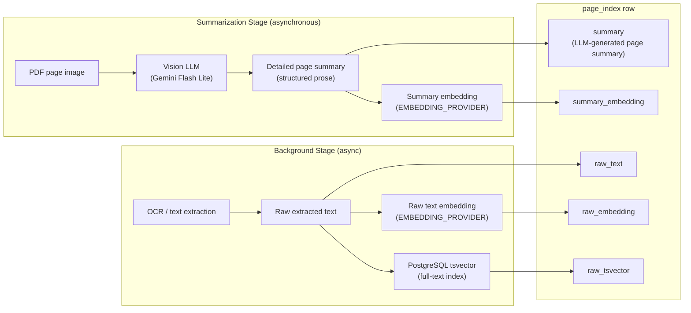

Summaries are richer than raw text for retrieval purposes. A vision LLM reading a page can describe a chart, interpret a table, and capture the semantic meaning of a diagram. Raw text misses all of that. But raw text has its own advantages: exact keyword matching, verbatim quotes, and no risk of the summary LLM paraphrasing something incorrectly. The three-arm fusion gets both.

---

## Hybrid Search with RRF

### What is Reciprocal Rank Fusion

RRF is a rank-based fusion algorithm. It doesn't normalize scores across arms (which is unreliable when arms use different scoring functions). Instead, it uses each document's rank within its arm. A document ranked first in any arm gets a high RRF contribution. A document ranked 40th gets almost nothing.

The formula for a document's RRF score is the sum of `1 / (k + rank)` across all arms where the document appears, where `k` is a smoothing constant (set to 50 here). Documents that appear in multiple arms accumulate contributions from each, which is why multi-arm fusion consistently outperforms any single arm.

### Three-Arm Fusion

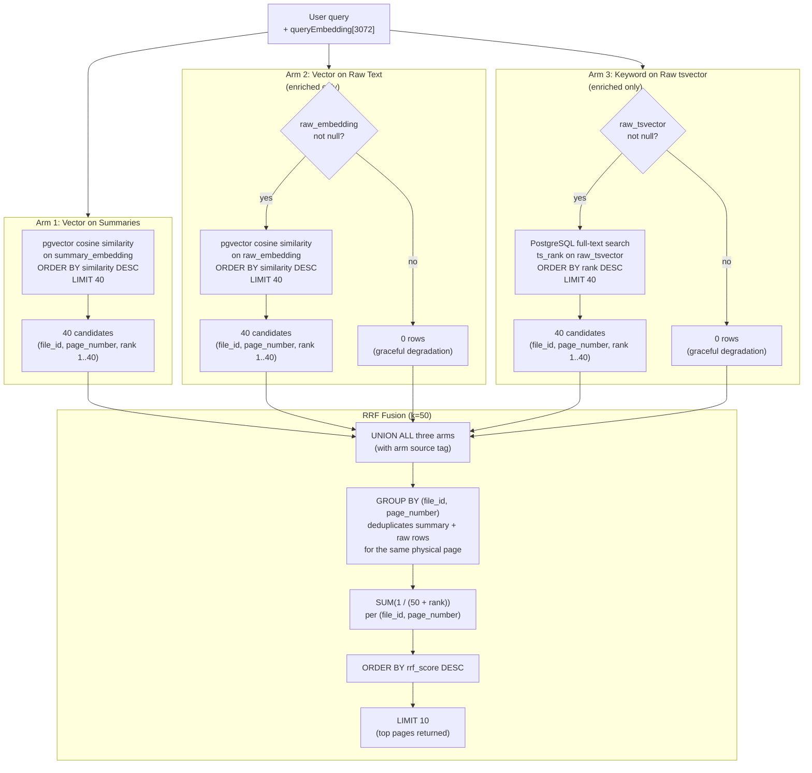

### RRF Scoring Visualization

The following shows how three hypothetical pages score across arms. Page B appears in all three arms and wins despite not ranking first in any single arm.

```mermaid
xychart-beta
    title "RRF Score Contribution by Arm (k=50)"
    x-axis ["Page A", "Page B", "Page C", "Page D"]
    y-axis "RRF Score" 0 --> 0.06
    bar [0.0196, 0.0189, 0.0182, 0.0175]
    bar [0.0000, 0.0185, 0.0000, 0.0179]
    bar [0.0000, 0.0182, 0.0179, 0.0000]
```

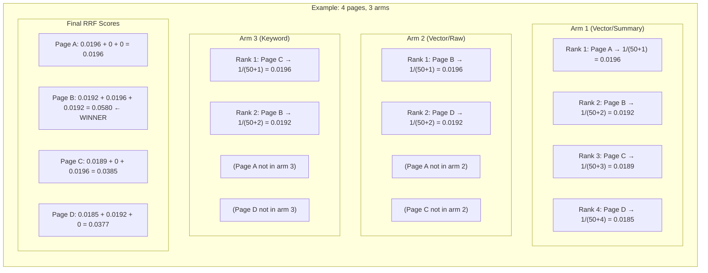

Page B wins because it's relevant across all three retrieval signals. Page A ranks first in arm 1 but appears nowhere else, so it loses to pages with broader relevance. This is the core insight of RRF: cross-arm agreement is a stronger signal than single-arm dominance.

### GROUP BY Deduplication

The `page_index` table has exactly one row per physical page. The asynchronous summarization stage writes the row with `summary` and `summary_embedding` populated, while `raw_text`, `raw_embedding`, and `raw_tsvector` remain null. Background enrichment later updates the same row to fill in these nullable columns. The RRF query groups by `(file_id, page_number)` before scoring to ensure consistent deduplication.

### Parameter Choices

| Parameter | Value | Rationale |
|-----------|-------|-----------|
| `k` (RRF smoothing) | 50 | Near-standard value from the RRF literature (Cormack et al. 2009 used k=60). Values between 30 and 70 produce similar fusion quality — the exact value is not critical. k=50 is the most commonly adopted variant in modern RAG implementations and balances rank-1 dampening with sufficient discrimination between top results. Configurable if load testing reveals a different optimum. |
| Over-fetch per arm | 40 candidates | Enough to capture relevant pages that rank lower in individual arms but score well in fusion. |
| Final top-K | 10 pages | Balances context quality against Gemini's context window budget. |

---

## Graceful Degradation

Arms 2 and 3 return zero rows when background enrichment hasn't completed. The RRF query handles this naturally: zero rows from an arm contribute nothing to the fusion, and the query still returns results from arm 1. No special-case logic is needed.

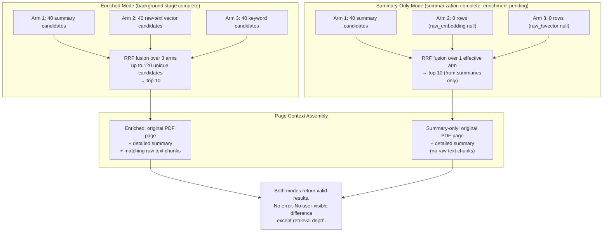

The user experience is identical in both modes. The agent answers from whatever is available. As background enrichment completes, subsequent queries automatically get richer results without any intervention.

---

## The Query Tool

### Why createDocumentQueryTool, Not createVectorQueryTool

AI SDK's `createVectorQueryTool` lets the LLM control the filter applied to vector search. That's a security problem for multi-tenant access control. If the LLM decides which `userId` or `threadId` to filter by, a prompt injection attack could instruct it to filter by a different user's ID and retrieve their documents.

`createDocumentQueryTool` is a server-side factory that returns the `searchDocument` tool. The server applies the `threadId` and `userId` filter from `requestContext` before the query runs; the LLM never sees or controls these values. It only provides the query string.

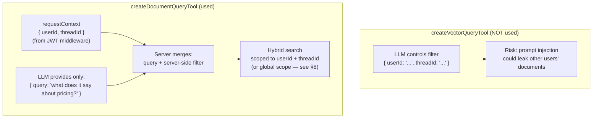

### Tool Flow

```mermaid
sequenceDiagram
    participant Agent as Orchestrator Agent
    participant Tool as searchDocument (created by createDocumentQueryTool)
    participant Embed as EMBEDDING_PROVIDER
    participant DB as Postgres (page_index)
    participant S3 as Object Storage

    Agent->>Tool: call({ query: "what are the pricing tiers?", document_id?: "file-abc" })

    Note over Tool: Server injects userId + threadId
from requestContext (not from LLM)
document_id is optional — when present,
search is scoped to that file only

    Tool->>Embed: embed(query)
    Embed-->>Tool: queryEmbedding[3072]

    Tool->>DB: hybridSearch(queryEmbedding, userId, threadId, topK=10)
    Note over DB: 3-arm RRF fusion
(or 1-arm if summary-only)
    DB-->>Tool: top 10 pages [(file_id, page_number, rrf_score)]

    Tool->>S3: fetch PDF page images (parallel, top-K pages)
    S3-->>Tool: page image files (multimodal file parts)

    Tool->>DB: getPageContextForPages(matchedPages)
    DB-->>Tool: { summary, matchingChunks } per page

    Tool-->>Agent: evidence bundle (matched pages + context bundles for Evidence Gate + response generation)
```

### S3 Fetch Latency

Fetching the original PDF page image from S3 takes roughly 50ms per page. For the top 10 pages, that's 10 parallel fetches completing in about 50-80ms total. The response model's generation (after the Evidence Bundle Gate) takes 2-5 seconds. The S3 fetches are invisible in the overall latency budget.

The images are sent as multimodal file parts, not base64-encoded strings. This keeps the request payload smaller and lets Gemini process them natively.

---

## Page Context Assembly

For each page returned by hybrid search, the tool assembles a three-part context bundle and returns it to the agent for Evidence Gate + response generation.

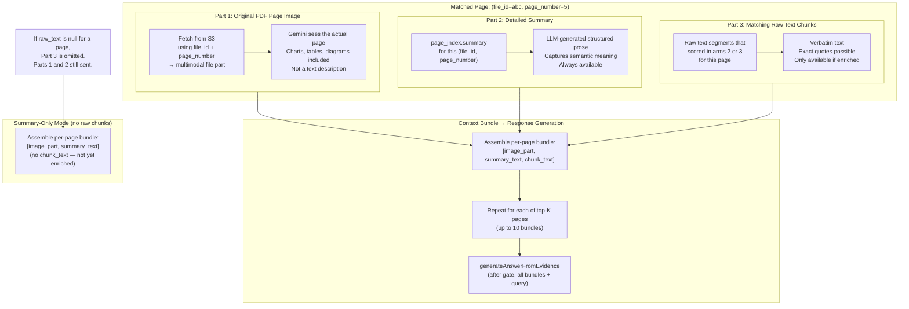

### Why Send All Three

Each part contributes something the others can't:

- **The image** lets Gemini read charts, tables, and diagrams that text extraction misses entirely. A bar chart's meaning is in its visual structure, not in the OCR'd axis labels.
- **The summary** provides semantic context. It describes what the page is about in structured prose, which helps Gemini understand the page's role in the document even before reading the raw text.
- **The raw text chunks** enable verbatim quotes. When the user asks "what exactly does it say about X?", the answer should quote the document directly. Summaries paraphrase; raw text doesn't.

Sending all three to a multimodal model is the right call. The cost is a slightly larger prompt. The benefit is answers that are simultaneously accurate, well-contextualized, and quotable.

---

## Structured Citations

### Citation Type

Every final response includes a `citations` array. Each citation is a structured object, not a free-text reference.

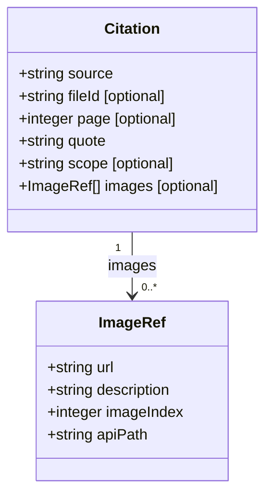

| Field | Type | Description |
|-------|------|-------------|
| `source` | string | Human-readable label shown in the UI. Typically the filename: `"Q3 Report.pdf"`. |
| `fileId` | string? | Machine identifier for API calls. Used to fetch the file, navigate to the page, or request a presigned URL. Present for both PDF and TXT citations (both are uploaded files with stable identifiers). Absent only for web grounding citations. |
| `page` | integer? | Page number within the document. 1-indexed. Optional — absent for non-PDF sources (TXT chunks, web grounding) where pages don't apply. |
| `quote` | string | Supporting excerpt from the document. When raw text is available (enriched status), this is a verbatim extract from the source text. When only summaries are available (ready status), this is an excerpt from the page summary — not verbatim from the original document. |
| `scope` | string | `'thread'` or `'global'`. Added by cross-conversation RAG (see §8). Absent for standard single-thread queries. |
| `images` | ImageRef[] | Visual references on the cited page. Present when the cited content includes charts, tables, or diagrams. |

### ImageRef Fields

| Field | Type | Description |
|-------|------|-------------|
| `url` | string | Presigned S3 URL with a 7-day TTL. The primary way the UI displays the image. |
| `description` | string | Short description of the image content: `"Revenue bar chart, Q1-Q4 2024"`. |
| `imageIndex` | integer | Position of this image on the page (for pages with multiple images). |
| `apiPath` | string | Fallback API endpoint that regenerates a presigned URL when the 7-day TTL expires. |

### Citation Flow

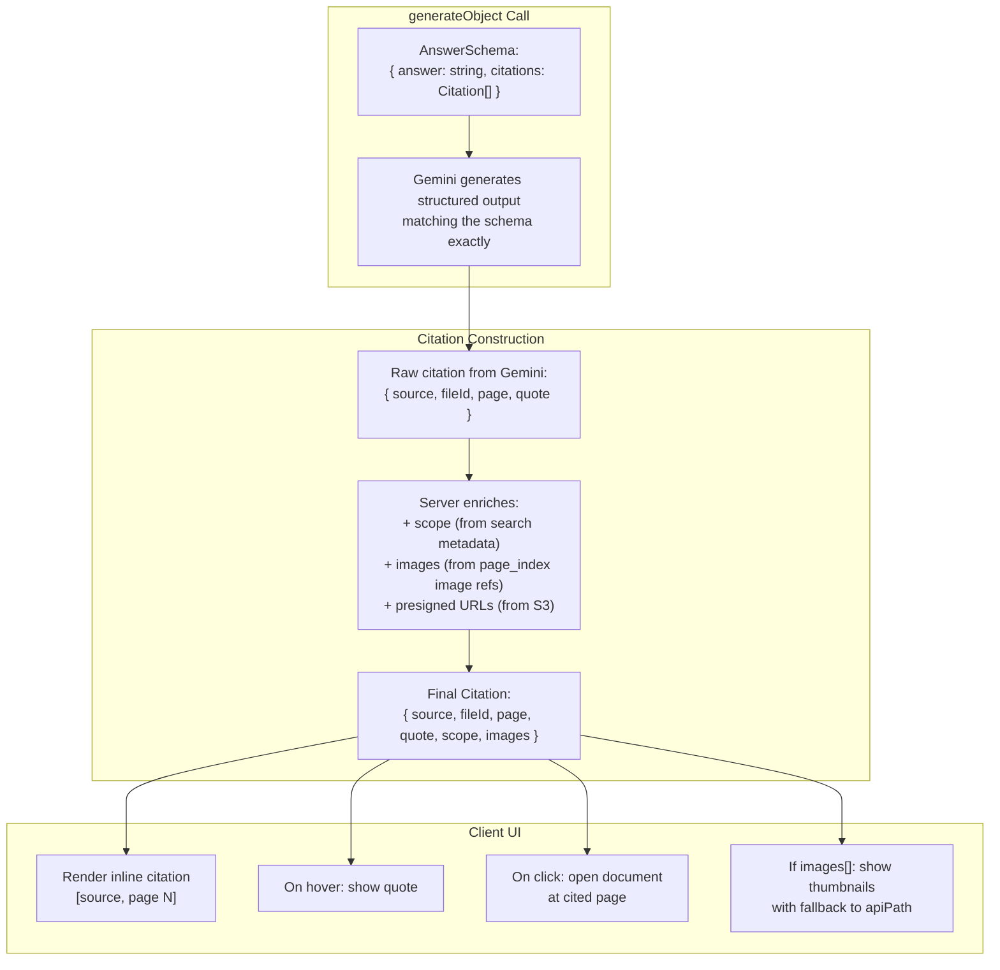

The `generateObject` call uses the Vercel AI SDK's structured output feature. The schema is passed to the model, which returns JSON that conforms to it. This eliminates citation parsing — there's no regex or post-processing needed to extract citations from prose.

---

## Cross-Conversation RAG

### The Problem

A user uploads a company handbook. They want to query it from any conversation, not just the one where they uploaded it. Without cross-conversation RAG, every new thread starts with an empty document context.

### Scope Model

Every uploaded document has a `scope` field: either `'thread'` or `'global'`.

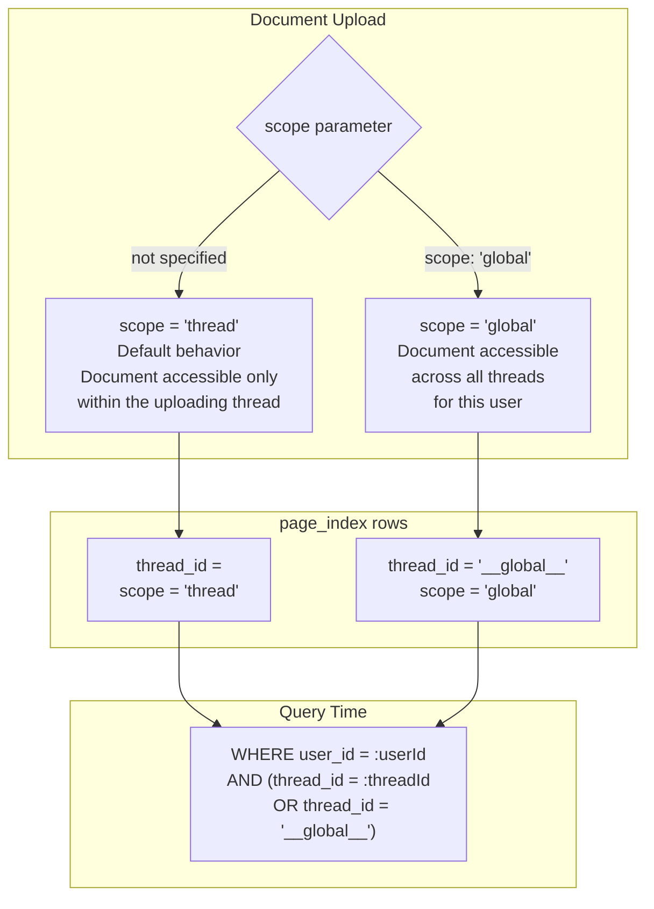

Global documents use a sentinel `threadId` value of `'__global__'`. Because this sentinel is a string literal, `thread_id` is stored as `TEXT` (not `UUID`). The query filter always includes both the current thread and the global sentinel. This means global documents are automatically included in every search without any special-case logic.

### Thread vs Global Ranking

Thread-scoped results rank higher than global results in the RRF fusion. A document uploaded in the current conversation is more likely to be what the user is asking about than a document uploaded weeks ago in a different thread.

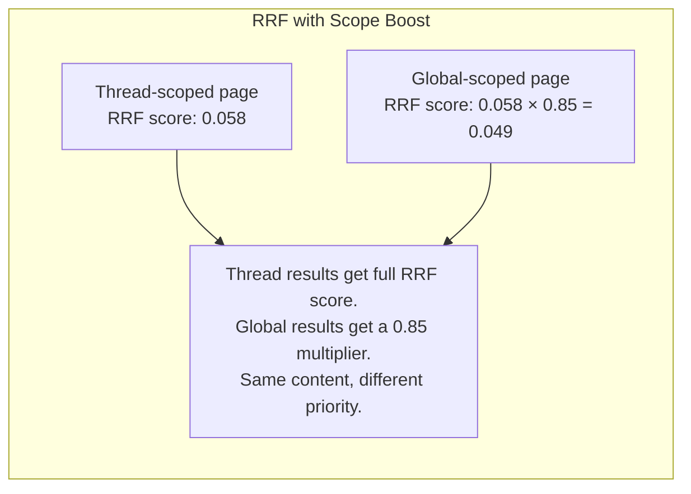

The boost factor is configurable. The default (0.85) means global documents are still retrieved and cited, but thread documents win ties.

### Cross-Conversation RAG Flow

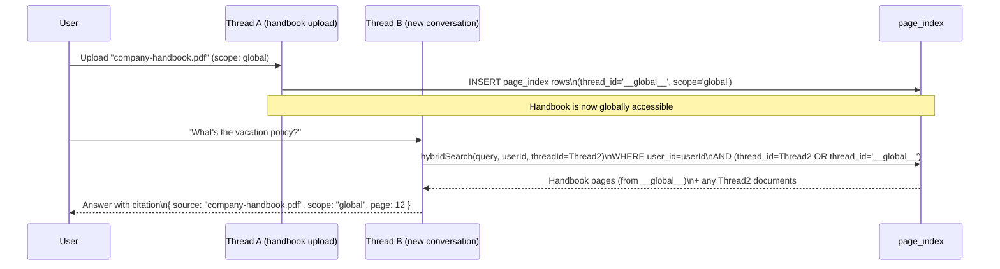

### Security Boundary

Global scope is per-user. A document uploaded as global by User A is never visible to User B. The `user_id` filter is always applied first, before the thread filter. There's no way to query across user boundaries.

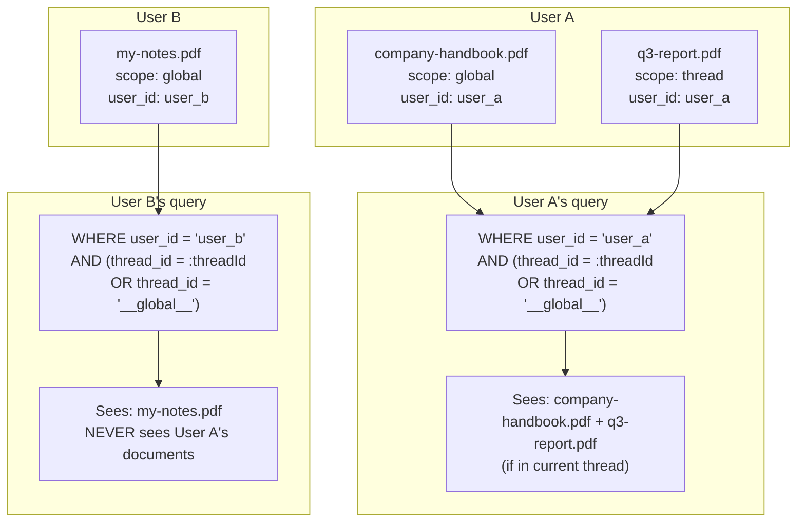

Documents never leak across user boundaries. The `user_id` column is not nullable and is always included in the WHERE clause. There's no admin override or cross-user query path.

---

## Large TXT RAG

PDF files go through the `page_index` system. Large plain-text files (`.txt`, `.md`, code files) use a separate chunking pipeline built on AI SDK's RAG utilities.

### Why a Separate Pipeline

PDFs have natural page boundaries. The page is the right unit of retrieval: it maps to a physical location in the document, it's the right size for a multimodal LLM to process, and it gives users a meaningful citation ("page 5"). Plain text has no pages. It needs to be chunked at the semantic level.

### Chunking Strategy

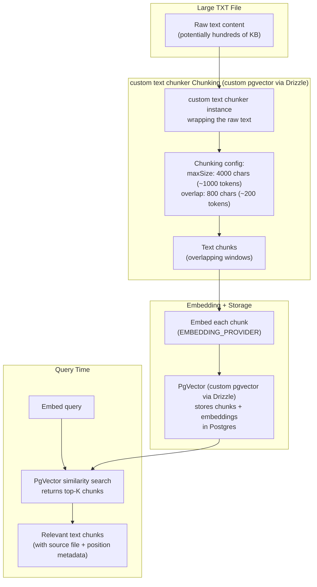

### Chunk Size Rationale

The 4000-character chunk size (roughly 1000 tokens) is larger than many RAG implementations use. Smaller chunks (256-512 tokens) improve precision but hurt recall: a question about a concept that spans two paragraphs may not match any single small chunk well. Larger chunks keep related content together, which improves retrieval quality for questions that require multi-sentence context.

The 800-character overlap ensures that content near chunk boundaries appears in at least two chunks. A sentence split across a boundary will be fully present in one of the two overlapping chunks.

### PgVector vs page_index

| Aspect | page_index (PDFs) | PgVector (TXT) |
|--------|-------------------|----------------|
| Unit of retrieval | Page | Chunk (4000 chars) |
| Citation | Page number | Character offset / chunk index |
| Visual content | Yes (PDF page image) | No |
| Hybrid search | 3-arm RRF | Vector only |
| Implementation | Custom SQL | custom pgvector via Drizzle PgVector class |

The two systems are independent. A query tool for TXT files uses PgVector search directly. A query tool for PDFs uses the hybrid RRF pipeline. The agent uses the returned evidence bundles to produce the same `Citation[]` structure in the final response.

---

## Cross-References

| Component | Interaction |
|-----------|-------------|
| **Document Processing** ([08](./08-document-processing.md)) | Blocking stage writes summaries + summary embeddings to `page_index`. Background stage writes raw text + raw embeddings + tsvector. |
| **File Intelligence** ([12](./12-file-intelligence.md)) | FileRegistry resolves file references before the query tool runs. The Evidence Bundle Gate applies after hybrid search returns results. |
| **Agent & Orchestration** ([05](./05-agent-and-orchestration.md)) | `searchDocument` (created by `createDocumentQueryTool`) is registered as an agent tool. The agent calls it when the query involves uploaded documents. |
| **Query Pipeline** ([11](./11-query-pipeline.md)) | `document_qa` is a valid source in `sourcesPriority`. The source router calls the document query tool as part of the parallel fan-out. |
| **Configuration** ([02](./02-configuration.md)) | `EMBEDDING_PROVIDER`, `EMBEDDING_DIMS`, `DATABASE_URL`, `S3_BUCKET`, `PRIMARY_MODEL` all affect RAG behavior. |
| **Memory System** ([07](./07-memory-system.md)) | Memory recall and document RAG are separate sources. Both can appear in `sourcesPriority` for the same topic. |

---

## Task Specifications

### Task RAG_INFRA: RAG Infrastructure

**What to do**: Build the complete hybrid search pipeline for PDF documents. Implement the three-arm RRF fusion query against `page_index`, the `getPageContextForPages` function that assembles per-page context bundles, and the `createDocumentQueryTool` factory with server-side access control (returns the `searchDocument` tool — retrieval only, returns an evidence bundle). Implement the `generateAnswerFromEvidence` helper function that uses `generateObject` to produce `{ answer, citations: Citation[] }` from the evidence bundle — this helper is invoked by the agent orchestration layer after the Evidence Gate opens, NOT by `searchDocument` itself. Include the graceful degradation path for summary-only mode.

**Depends on**: STORAGE_WRAPPER, DOC_PIPELINE

**Acceptance Criteria**:
- The `createDocumentQueryTool` factory (accepting database, file storage, and optional config) returns a AI SDK-compatible tool definition
- `userId` and `threadId` filters come from `requestContext`, never from LLM input
- Hybrid search runs all three arms; arms 2 and 3 return zero rows gracefully when `raw_embedding` / `raw_tsvector` are null
- RRF uses `k=50`, over-fetches 40 candidates per arm, returns top 10 pages
- `BY` deduplicates rows before scoring
- `getPageContextForPages` fetches S3 page images in parallel (not sequentially)
- Evidence bundle includes all three parts per matched page: image, summary, matching chunks
- Summary-only pages include image + summary (no chunks — not an error)
- `generateAnswerFromEvidence` helper uses `generateObject` with a typed schema: `{ answer: string, citations: Citation[] }` — called by orchestration layer post-gate, not by `searchDocument`
- Citations include `source`, `fileId`, `page`, `quote` at minimum
- `ImageRef` objects include presigned S3 URL with 7-day TTL and `apiPath` fallback
- Unit tests with mocked DB and mocked S3
- Integration test: upload a PDF, run a query, verify citations reference correct pages

**QA Scenarios**:
- Query against a freshly uploaded PDF (summary-only, no raw text) → returns valid answer from summaries, no error
- Query against an enriched PDF → three-arm fusion runs, citations include verbatim quotes from raw text
- Query with no relevant pages → `citations` array is empty, `answer` acknowledges no relevant content found
- Two users with documents on the same topic → each user's query returns only their own documents
- S3 fetch fails for one page → that page is skipped, remaining pages still processed
- `generateObject` schema validation fails → typed error propagated to agent, not silent null
- Top-K pages include pages from multiple files → citations correctly attribute each page to its source file

---

### Task CROSS_CONV_RAG: Cross-Conversation RAG

**What to do**: Extend the `page_index` schema and hybrid search pipeline to support global-scope documents. Add a `scope` field (`'thread'` | `'global'`) and use a sentinel `threadId` value of `'__global__'` for global documents. Update the hybrid search query to include global documents in every search. Apply a configurable rank boost that favors thread-scoped results over global ones. Add `scope` to the `Citation` type. Implement the upload API parameter that lets clients specify global scope.

**Depends on**: RAG_INFRA (RAG Infrastructure — must be complete before scope can be layered on top)

**Acceptance Criteria**:
- `page_index` has a non-nullable `scope` column (`'thread'` | `'global'`)
- Global documents stored with `thread_id = '__global__'`
- Hybrid search WHERE clause includes user isolation and dual scope: `WHERE user_id = :userId AND (thread_id = :threadId OR thread_id = '__global__')`
- Thread-scoped results receive full RRF score; global results receive a configurable multiplier (default 0.85)
- `Citation.scope` is `'thread'` or `'global'` depending on the source document
- Upload API accepts an optional `scope` parameter; defaults to `'thread'` if not provided
- Global documents are accessible from any thread belonging to the same user
- Global documents are never accessible to a different user (user_id filter always applied)
- Existing thread-scoped queries are unaffected when no global documents exist for the user
- Unit tests: verify global documents appear in cross-thread queries
- Unit tests: verify global documents from User A never appear in User B's queries
- Integration test: upload a global document in Thread A, query from Thread B, verify citation appears with `scope: 'global'`

**QA Scenarios**:
- User uploads handbook as global, queries from a new thread → handbook pages appear in results with `scope: 'global'`
- User uploads two documents: one thread-scoped, one global. Query matches both → thread-scoped result ranks higher
- User A uploads a global document. User B queries on the same topic → User B sees no results from User A's document
- User uploads a document as thread-scoped (default). Queries from a different thread → document not found (correct behavior)
- Global document upload, then user deletes it → subsequent queries from any thread no longer return it
- Query in a thread with both thread and global matches → `citations` array contains both, each with correct `scope` value
- Rank boost multiplier set to 1.0 in config → thread and global results treated equally (no preference)

---

## External References

- AI SDK RAG overview: https://sdk.vercel.ai/docs
- Vercel AI SDK `generateObject`: https://sdk.vercel.ai/docs/ai-sdk-core/generating-structured-data
- Reciprocal Rank Fusion: Cormack, Clarke, and Buettcher (2009). "Reciprocal Rank Fusion Outperforms Condorcet and Individual Rank Learning Methods." SIGIR 2009.

---

*Previous: [08 — Document Processing](./08-document-processing.md)*
*Next: [10 — Intent Detection & Routing](./10-intent-and-routing.md)*
