# 10 — Intent Detection & Routing

> **Scope**: Two-stage intent classification, server-defined IntentConfig, embedding router, LLM validation, speculative pre-fetching, topic resolution, fallback handling.
>
> **This is a NEW requirement** added during plan refinement. No existing tasks cover this — new tasks are defined below.

---

## Table of Contents

- [Why Intent Detection Matters](#why-intent-detection-matters)
- [Architecture Overview](#architecture-overview)
- [Two-Stage Intent Detection (Detailed)](#two-stage-intent-detection-detailed)
- [Non-Actionable Message Detection](#non-actionable-message-detection)
- [Embedding Router Stage (~30-50ms)](#embedding-router-stage-30-50ms)
- [LLM Validation and Query Rewriting Stage (~50-100ms)](#llm-validation-and-query-rewriting-stage-50-100ms)
- [IntentConfig — Server-Defined](#intentconfig-server-defined)
- [Embedding Router Cache Strategy](#embedding-router-cache-strategy)
- [Fallback Handling](#fallback-handling)
- [Multi-Intent Detection](#multi-intent-detection)
- [Dependent Multi-Intent Detection](#dependent-multi-intent-detection)
- [Attribute Negation Detection](#attribute-negation-detection)
- [Query Replay Detection](#query-replay-detection)
- [Language Validation (Piggybacked on Intent Detection)](#language-validation-piggybacked-on-intent-detection)
- [Temporal Expression Resolution](#temporal-expression-resolution)
- [Humanlikeness Signals](#humanlikeness-signals)
- [Cross-References](#cross-references)
- [Task Specifications](#task-specifications)
- [External References](#external-references)

---

## Why Intent Detection Matters

The agent system serves multiple business domains (e.g., customer support, product info, HR policies). Without intent detection, every query hits every source — wasting compute, increasing latency, and diluting answer quality. Intent detection routes queries to the right sources with the right context.

---

## Architecture Overview

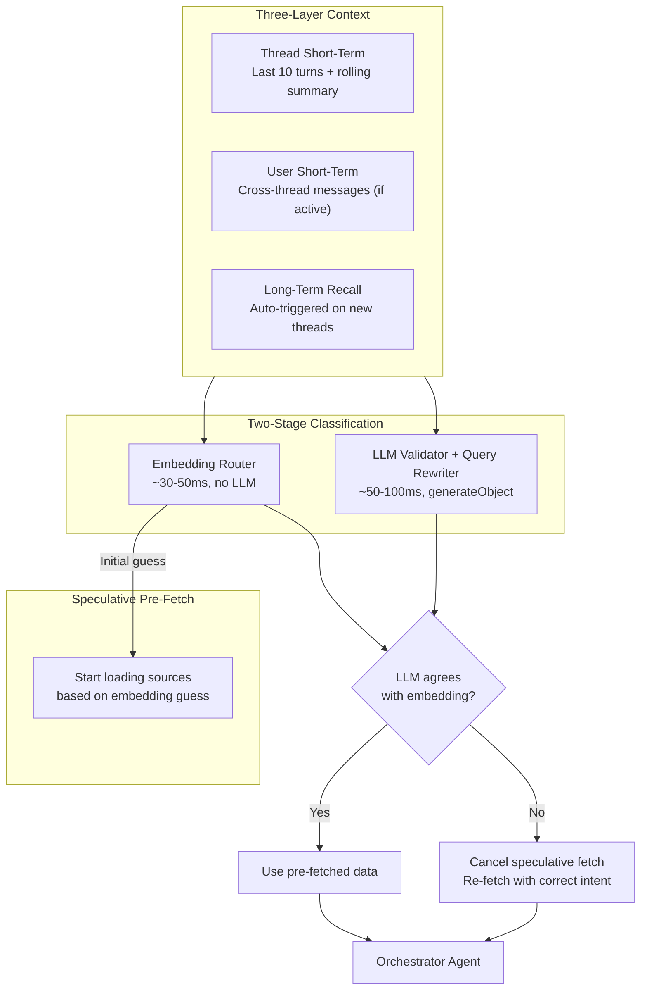

## Two-Stage Intent Detection (Detailed)

### Non-Actionable Message Detection

Before the embedding router and LLM validator run, the pipeline applies a lightweight non-actionable pre-filter. This step is intentionally fast and conservative: it only short-circuits messages that are entirely non-actionable and unambiguous.

The first pass checks clear pleasantries, acknowledgments, and single-emoji messages using a small regex set plus a single-token length check.

- Pleasantries: "thanks", "hello", "good morning", "bye"
- Acknowledgments: "ok", "got it", "sure"
- Emoji-only: "👍", "❤️", and equivalent single-emoji content

This pass makes no LLM call and no embedding call, and runs in less than one millisecond.

When matched, the pipeline returns an immediate classification:

- `{ type: 'non_actionable', subtype: 'pleasantry' | 'acknowledgment' | 'emoji' }`

The orchestrator then responds directly with a contextually appropriate reply generated by the response model, while the retrieval stack remains idle:

- No embedding router
- No LLM validator
- No query rewriting
- No source routing
- No fact extraction

The check matches only messages that are fully non-actionable. Mixed messages are not short-circuited. For example, "Thanks, but can you also find football fields near District 7" proceeds through full intent detection because it contains an actionable request.

If the pleasantry and acknowledgment pass does not match, a gibberish detector runs as the second non-actionable gate.

The gibberish detector uses entropy-based heuristics and language reliability signals:

- Very high character entropy indicating random key mashing
- Very low information density such as repeated-character noise
- Language detector reliability failure where `eld.isReliable()` is false and confidence is below threshold

When matched, the pipeline short-circuits with:

- `{ type: 'non_actionable', subtype: 'gibberish' }`

The response for this path is explicit and recovery-oriented: "I didn't catch that. Could you rephrase?" This avoids spending embedding and validator cost on content that cannot produce meaningful retrieval outcomes.

Threshold tuning prioritizes false-positive avoidance. Short valid tokens such as "ok", common abbreviations, and non-Latin scripts must not be labeled gibberish. The language detector confidence signal is the primary discriminator.

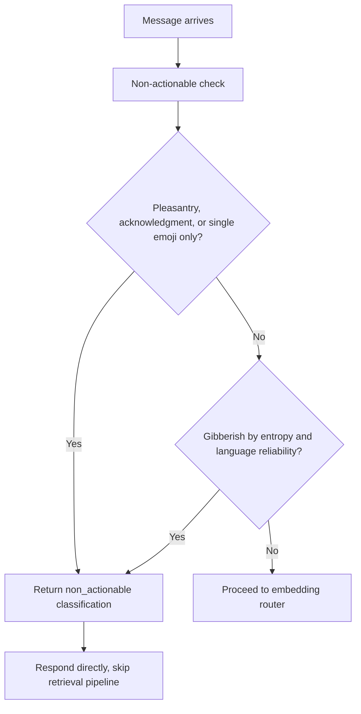

### Embedding Router Stage (~30-50ms)

The embedding router is a **fast semantic classifier** using vector similarity — zero LLM calls.

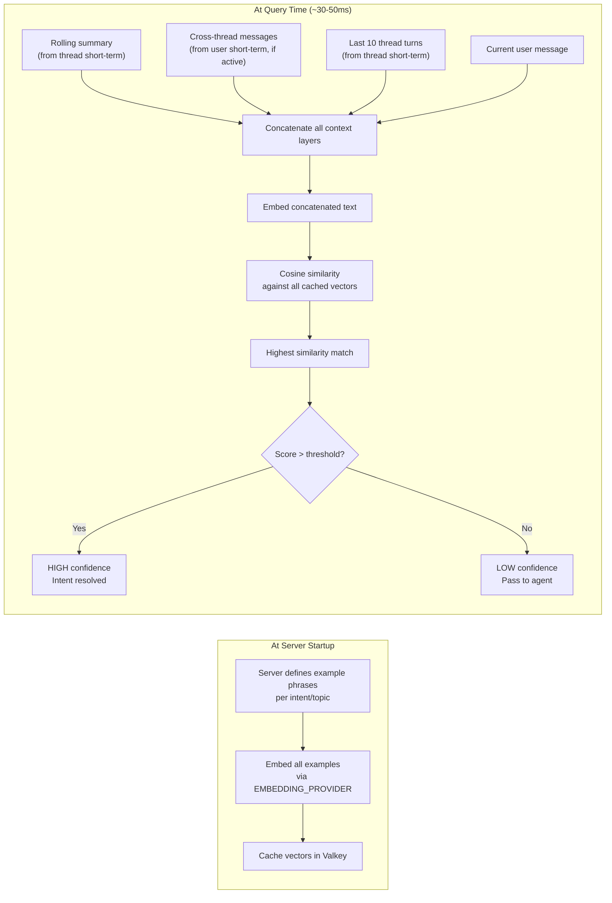

**How it works**:
1. **Startup**: Server provides `IntentConfig` with example phrases per topic. Library embeds all examples and caches vectors in Valkey
2. **Query time**: Concatenate rolling summary + cross-thread messages (if active) + last 10 thread turns + current message → embed → compare against cached vectors
3. **Result**: Best-matching topic with confidence score. High confidence → intent resolved. Low confidence → agent figures it out via tools

**Why three-layer context?** The embedding router now receives combined context from all three memory layers (see [07-memory-system.md](./07-memory-system.md)):
- **Thread short-term** (last 10 turns + rolling summary) provides within-thread continuity for follow-up questions like *"And what about international orders?"*
- **User short-term** (cross-thread messages when thread is young) enables reference resolution for vague queries in new threads like *"the place I went yesterday"*
- **Long-term recall** (auto-triggered on first turn of new threads) provides durable context for complex references

This combined context enables correct classification even in new threads with vague references, without requiring the LLM to resolve ambiguities before classification.

**Ordering guarantee**: Memory loading (all three layers) completes before intent detection begins. This is a two-phase sequential pipeline — not a circular dependency. Auto-triggered recall uses the raw user message as its query and does not need a classified intent. See [07-memory-system.md](./07-memory-system.md) § Memory and Intent Detection for the full pipeline diagram.

### LLM Validation and Query Rewriting Stage (~50-100ms)

The LLM **always runs** — it's the authority. Embedding router provides a fast hint.

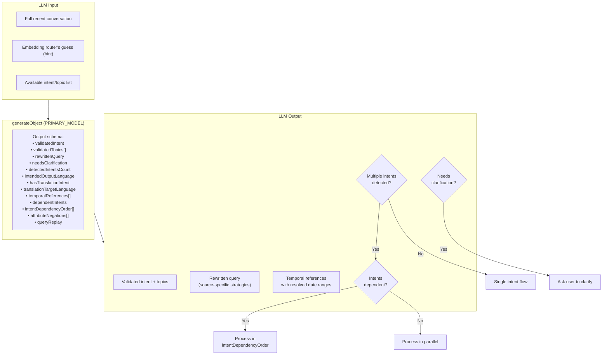

**What the LLM does in one call**:
- Validates or corrects the embedding router's intent classification
- Detects if multiple intents are present (triggers orchestrator split)
- Detects if intents have dependencies (one depends on another's output)
- Detects attribute negation constraints such as "without parking" and returns `attributeNegations[]`
- Detects query replay patterns such as "same but for District 7" and returns `queryReplay`
- Resolves temporal expressions to concrete date ranges for memory recall
- Rewrites the query for better retrieval (conditional — only when needed)
- Flags if the query is unclear and needs user clarification

### Speculative Pre-Fetching

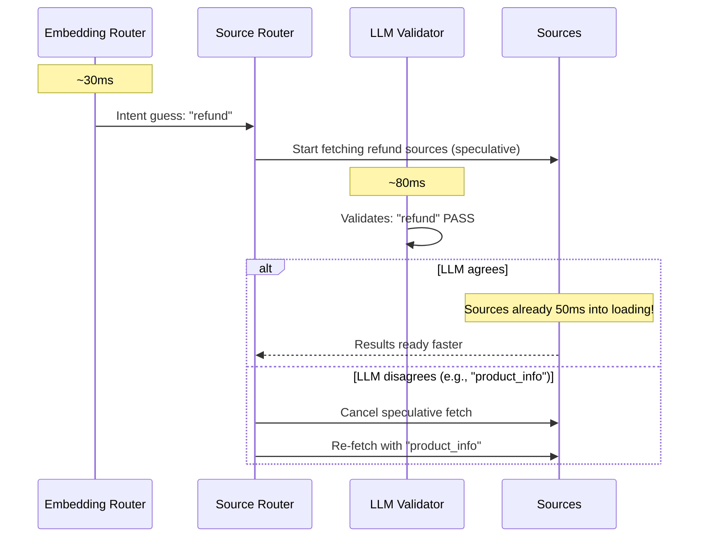

**Why it matters**: The embedding router finishes ~30-50ms before the LLM. If the LLM agrees (which it will ~80%+ of the time for trained topics), sources are already loading — saving 30-50ms on the critical path.

---

## IntentConfig — Server-Defined

The server defines ALL business intents. The library provides zero built-in intents.

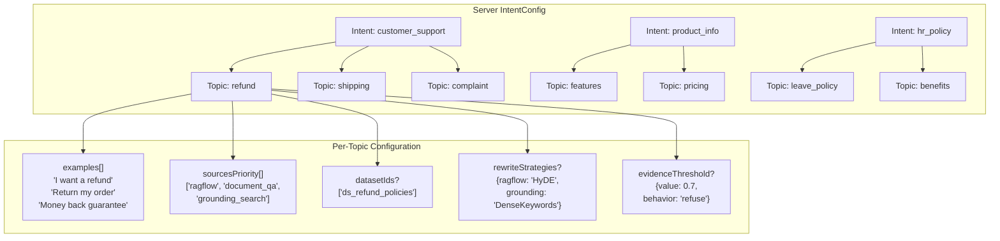

### IntentConfig Type Shape

| Field | Type | Description |
|-------|------|-------------|
| `intents` | `Record<string, IntentDefinition>` | Named intents (business domains) |
| `IntentDefinition.description` | `string` | Human description for LLM context |
| `IntentDefinition.topics` | `Record<string, TopicDefinition>` | Named topics within the intent |
| `TopicDefinition.examples` | `string[]` | Example phrases for embedding router (~5-10 per topic) |
| `TopicDefinition.sourcesPriority` | `string[]` | Ordered source list (see [11-query-pipeline.md](./11-query-pipeline.md)) |
| `TopicDefinition.datasetIds?` | `string[]` | RAGFlow dataset override (default: global datasets) |
| `TopicDefinition.rewriteStrategies?` | `Record<string, string>` | Per-source rewrite strategy override |
| `TopicDefinition.evidenceThreshold?` | `EvidenceConfig` | Override evidence gate behavior for this topic |
| `TopicDefinition.emptyResultBehavior?` | `Record<string, 'normal' \| 'suspicious'>` | Per-source empty result handling |
| `confidenceThreshold?` | `number` | Embedding router confidence cutoff (default: 0.75) |
| `fallbackBehavior` | `'clarify'` | What to do when no intent matches (always ask to clarify) |

### Scale Considerations

- **Expected scale**: 5-15 intents, 3-5 topics each = ~15-75 total topic embeddings
- **Embedding cache**: All topic embeddings fit in a single Valkey hash (~300KB for 75 topics × 3072-dim vectors)
- **Classification cost**: One embedding call per query (~30-50ms) + one LLM call (~50-100ms)
- **Cache invalidation**: Re-embed on IntentConfig change (server restart or hot reload)

---

## Embedding Router Cache Strategy

```mermaid
flowchart TB
    subgraph Startup["Server Startup"]
        CONFIG["IntentConfig"] --> EXTRACT["Extract all topic examples"]
        EXTRACT --> BATCH["Batch embed via EMBEDDING_PROVIDER"]
        BATCH --> STORE["Store in Valkey hash<br/>key: 'intent:embeddings'<br/>field: topicId<br/>value: serialized vector"]
    end
    
    subgraph Query["Per Query"]
        Q["Embed query"] --> FETCH["Fetch all cached vectors<br/>from Valkey (single HGETALL)"]
        FETCH --> COSINE["Compute cosine similarity<br/>for each topic"]
        COSINE --> SORT["Sort by similarity"]
        SORT --> TOP["Return top match + score"]
    end
    
    subgraph Invalidation["Cache Invalidation"]
        CHANGE["IntentConfig changes"] --> CLEAR["Delete Valkey hash"]
        CLEAR --> REEMBED["Re-embed all examples"]
    end
```

**Performance characteristics**:
- Valkey HGETALL for 75 vectors: < 1ms
- Cosine similarity computation for 75 vectors: < 5ms (in-memory, native math)
- Total embedding router time: ~30-50ms (dominated by embedding the query)

---

## Fallback Handling

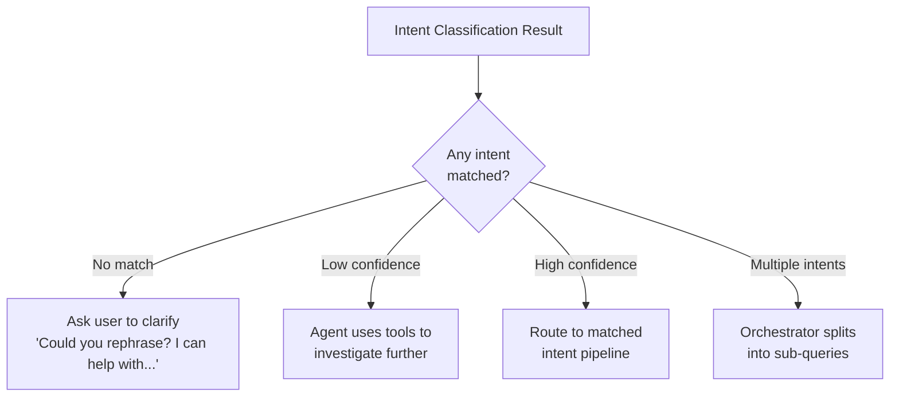

**Fallback behavior is fixed**: Always ask the user to clarify when no intent matches. This is not configurable — it's the safest behavior to prevent the agent from hallucinating answers for unknown domains.

---

## Multi-Intent Detection

When the LLM detects multiple intents in a single message, it outputs `detectedIntentsCount > 1` and a list of sub-queries. The orchestrator agent (see [05-agent-and-orchestration.md](./05-agent-and-orchestration.md)) handles the split.

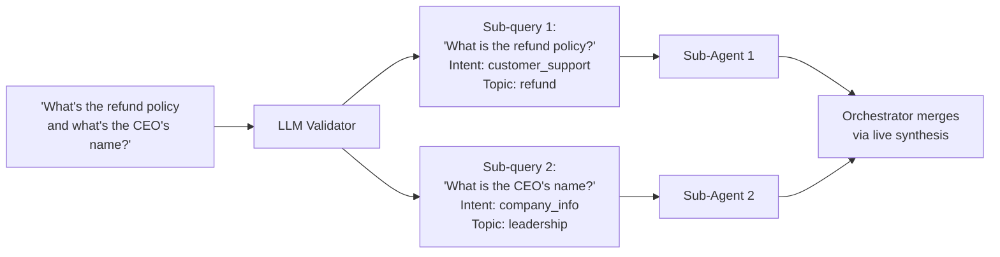

---

## Dependent Multi-Intent Detection

Not all multi-intent queries are independent. Some intents have dependencies — one intent's output constrains or enables another intent's input.

**Example**: *"The place I went yesterday is terrible, find me another one"* contains two intents:
1. **Feedback intent**: Negative feedback about a specific place (the one visited yesterday)
2. **Search intent**: Find alternative places, excluding the disliked one

Intent 2 **depends on** Intent 1's output. The search cannot proceed without knowing which place to exclude.

### Dependency Detection

The LLM validator detects dependencies by analyzing whether one intent's output constrains another intent's input. When `dependentIntents: true`, the LLM outputs `intentDependencyOrder` — an array of intent IDs showing the required processing sequence.

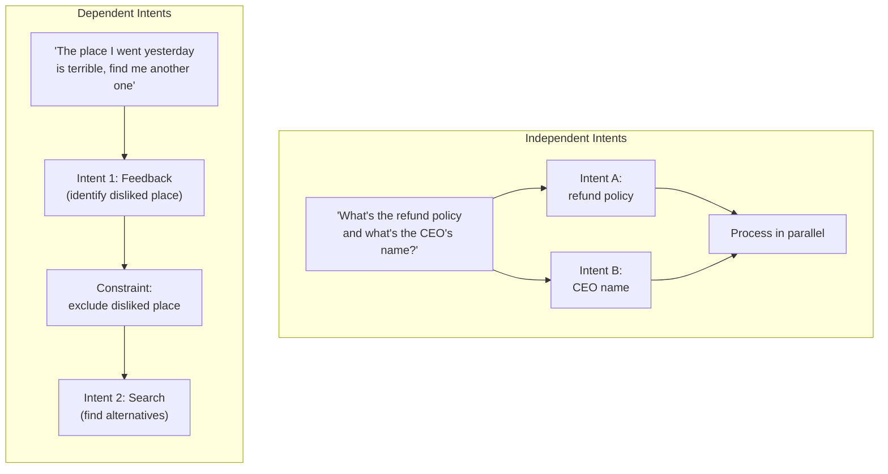

### Processing Strategy

- **Independent intents** (`dependentIntents: false`): Orchestrator spawns sub-agents in parallel, merges results via live synthesis
- **Dependent intents** (`dependentIntents: true`): Orchestrator processes intents sequentially in `intentDependencyOrder`, passing constraints forward to dependent intents

### Common Dependency Patterns

| Pattern | Example | Dependency |
|---------|---------|-----------|
| Feedback + constrained search | "X is bad, find another" | Search depends on feedback output (exclusion list) |
| Comparison + selection | "Compare A and B, pick the cheaper one" | Selection depends on comparison output (price data) |
| Context establishment + query | "I work at Acme, what's the leave policy?" | Query depends on context (company context) |
| Negation + alternative | "Not that one, show me something different" | Alternative search depends on negation (what to exclude) |

### Attribute Negation Detection

The LLM validator also detects explicit attribute negation patterns that describe properties the user does not want: "without X", "no X", "not X", "excluding X".

This is distinct from entity exclusion:

- Entity exclusion: "Not Sân bóng X" excludes a specific entity and is handled through dependent intents plus the exclusion-constraint path defined in [05-agent-and-orchestration.md](./05-agent-and-orchestration.md).
- Attribute negation: "without outdoor seating" excludes a property and is carried as a retrieval filter.

The validator emits a dedicated field:

- `attributeNegations: string[]`

Examples include `['outdoor seating', 'parking', 'reservation required']`.

This field is passed to the query pipeline together with `rewrittenQuery`, so source adapters can apply negative filters during retrieval instead of only filtering after results return.

### Query Replay Detection

The LLM validator detects query replay patterns where the user asks to repeat a previous search with one or more substitutions:

- "Same search but for District 7"
- "Do that again for Ho Chi Minh City"
- "Again but cheaper"

When detected, the validator emits:

- `queryReplay: { detected: boolean, parameterChanges: Record<string, string> }`

When `detected` is true, `parameterChanges` captures explicit substitutions such as `{ location: 'District 7' }`.

Detection uses thread short-term context (last 10 turns) to identify which earlier query is being replayed and which parameters changed. This signal is passed to the query pipeline so rewrite logic can reconstruct a high-fidelity follow-up query rather than interpreting the replay phrase in isolation.

---

## Language Validation (Piggybacked on Intent Detection)

Language validation is piggybacked on the existing intent detection LLM call, so there is no additional model round trip and no extra latency on the critical path.

The LLM receives the user message and conversation context, then returns three language fields in the same structured output: `intendedOutputLanguage`, `hasTranslationIntent`, and `translationTargetLanguage`.

After intent detection completes, the language guard checks whether `intendedOutputLanguage` is in the configured supported language set. If unsupported, this triggers a p0 block.

This design resolves edge cases that pure input-language detection misses:

- Translate this to Chinese results in intended output zh, so unsupported zh is blocked.
- Chinese input asking for Vietnamese translation results in intended output vi, so supported vi is allowed.
- English with a Chinese place name still results in intended output en, so it is allowed.
- Mixed-language ambiguous requests are resolved by the LLM using context-driven intended output.

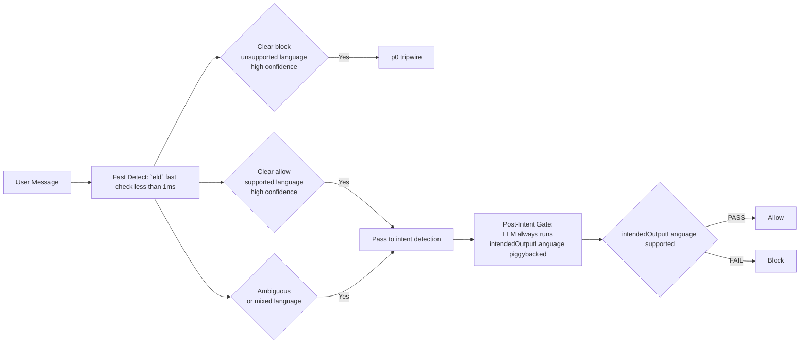

---

## Temporal Expression Resolution

Temporal expressions like "yesterday", "last week", or "this morning" are resolved to concrete date ranges as part of intent classification. This happens in the LLM validator — no additional LLM call is needed.

**Timezone handling**: The LLM validator resolves temporal expressions relative to the **user's timezone**, determined from the `X-Timezone` request header (IANA timezone string, e.g., `Asia/Saigon`). If the header is absent, UTC is used as the default. This aligns with the FileRegistry temporal resolver (see [12-file-intelligence.md](./12-file-intelligence.md)), which uses the same `X-Timezone` header for file reference resolution. The server extracts the timezone from the header and passes it to the LLM validator via the `requestContext`.

### Resolution Examples

The LLM validator maps temporal expressions to date ranges based on the current time in the user's timezone:

| Expression | Resolved Range | Example |
|-----------|----------------|---------|
| "yesterday" | Start of previous day to end of previous day | 2026-03-07 00:00:00 to 2026-03-07 23:59:59 |
| "last week" | 7 days ago start to yesterday end | 2026-02-28 00:00:00 to 2026-03-06 23:59:59 |
| "this morning" | Today 00:00 to current time | 2026-03-08 00:00:00 to 2026-03-08 14:30:00 |
| "last month" | 30 days ago start to yesterday end | 2026-02-06 00:00:00 to 2026-03-06 23:59:59 |
| "today" | Today 00:00 to current time | 2026-03-08 00:00:00 to 2026-03-08 14:30:00 |

### Integration with Memory Recall

Resolved temporal ranges are passed to the memory recall tool as `temporalHint` for filtered recall. This enables queries like *"the place I went yesterday"* to be resolved by:

1. LLM validator resolves "yesterday" → `temporalHint: { from: 2026-03-07 00:00:00, to: 2026-03-07 23:59:59 }`
2. Memory recall tool filters facts and interactions to only those created within the date range
3. Semantic search ranks results within the filtered set

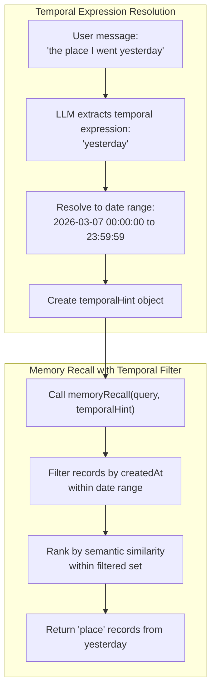

### Temporal Filtering Benefits

Without temporal filtering, semantic search would return the most similar records regardless of when they were created. "The place I went yesterday" might return a highly similar place from a month ago, which is incorrect. Temporal filtering narrows the search space first, then ranks within that window.

---

## Humanlikeness Signals

Four humanlikeness signal requirements are integrated directly into the intent pipeline to improve conversational recovery, reduce user friction, and preserve natural turn-taking behavior under ambiguity or sentiment stress.

These signals are not treated as post-processing heuristics. They are first-class classification outputs that can alter orchestrator behavior, context handling, and response strategy in the same turn.

### Correction Detection (MH_CORRECTION_HANDLING)

The LLM intent validator detects explicit correction turns such as "no I meant X", "that's wrong", and "I said Y not Z" and classifies them as correction intent within LLM_INTENT.

When a correction signal is present, the pipeline re-examines the immediately preceding response context, applies the corrected user constraint, and re-answers from the corrected interpretation instead of continuing from the stale interpretation.

This prevents the system from treating corrections as unrelated new queries and ensures the user sees direct recovery from the specific mistake they are correcting.

### Frustration Escalation Detection (MH_FRUSTRATION_DETECTION)

A new task, FRUSTRATION_SIGNAL, detects escalating negative sentiment across turns using progression indicators such as repeated complaints, all-caps emphasis, and worsening tone over consecutive messages.

This signal is injected into active agent context so downstream response generation can shift into de-escalation mode, prioritizing acknowledgement, concise recovery, and lower-friction next actions.

Because escalation is trend-based rather than single-turn sentiment, detection uses multi-turn progression rather than isolated negative words.

### Topic Abandonment Detection (MH_TOPIC_ABANDONMENT)

The LLM intent validator detects abandonment phrases such as "actually nevermind", "forget that", and "let's talk about something else", along with implicit subject shifts that indicate the user has moved away from the prior intent.

When abandonment is detected, active context linked to the prior topic is flushed from the current conversational focus so obsolete constraints do not leak into the new request.

This keeps follow-up reasoning aligned with the newly introduced topic and reduces accidental carryover from no-longer-relevant context.

### Proactive Clarification Signal (MH_PROACTIVE_CLARIFICATION)

When embedding router confidence is below threshold and LLM intent validation identifies multiple plausible interpretations, the pipeline emits an ambiguity signal rather than forcing a single inferred intent.

The agent uses this signal to ask a brief clarifying question that presents the top interpretations, allowing the user to disambiguate in one turn.

This creates a proactive clarification behavior that resolves ambiguity early, avoids wasted retrieval on incorrect assumptions, and improves perceived conversational competence.

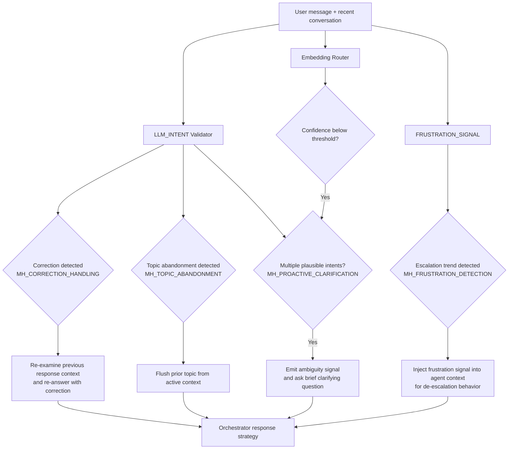

---

## Cross-References

| Component | Interaction |
|-----------|------------|
| **Orchestrator** ([05](./05-agent-and-orchestration.md)) | Receives classified intents, spawns sub-agents for multi-intent, processes dependent intents in order |
| **Query Pipeline** ([11](./11-query-pipeline.md)) | Receives rewritten query + source priority from intent classification |
| **Source Router** ([11](./11-query-pipeline.md)) | Uses topic's `sourcesPriority` to determine which sources to query |
| **RAGFlow** ([11](./11-query-pipeline.md)) | Uses topic's `datasetIds` override for targeted retrieval |
| **Evidence Gate** ([12](./12-file-intelligence.md)) | Uses topic's `evidenceThreshold` for sufficiency scoring |
| **Memory System** ([07](./07-memory-system.md)) | Provides three-layer context: thread short-term (last 10 turns + rolling summary), user short-term (cross-thread messages when thread is young), and long-term recall (auto-triggered on new threads). Intent detection receives combined context from all three layers. Temporal expressions resolved by LLM validator are passed to memory recall tool as `temporalHint` for filtered recall. |
| **Valkey Cache** ([17](./17-infrastructure.md)) | Stores cached topic embeddings for fast classification |

---

## Task Specifications

### Task EMBED_ROUTER: Embedding Router

**What to do**: Implement the embedding similarity router that classifies user intents by comparing query embeddings against cached topic example embeddings in Valkey.

**Depends on**: CORE_TYPES, VALKEY_CACHE, AGENT_FACTORY

**Acceptance Criteria**:
- Server provides IntentConfig at startup → all topic examples embedded and cached in Valkey
- Embedding router input includes combined context from all three memory layers: thread short-term (rolling summary + last 10 turns), user short-term (cross-thread messages if active), and current message
- Concatenate all context layers and embed
- Cosine similarity computed against all cached topic vectors
- Top match returned with confidence score
- High confidence (above threshold) → intent resolved
- Low confidence → flagged for agent to figure out
- Cache invalidated on IntentConfig change
- Unit tests with mocked embedding provider
- Integration test with real Valkey
- On new threads with user short-term active, classification accuracy maintained for vague references

**QA Scenarios**:
- High-confidence single intent → correct topic resolved in < 50ms
- Low-confidence ambiguous query → flagged as low confidence
- Follow-up question with conversation context → correctly maintains parent intent
- New thread with vague reference ("that place") + user short-term context → correctly classified despite ambiguity
- Cache miss (Valkey restart) → gracefully re-embeds from config
- Empty IntentConfig → all queries go to agent (no crash)

---

### Task LLM_INTENT: LLM Intent Validator + Query Rewriter

**What to do**: Implement the LLM-based intent validation that always runs alongside the embedding router, confirming or correcting intent classification and performing conditional query rewriting.

**Depends on**: CORE_TYPES, AGENT_FACTORY, EMBED_ROUTER

**Acceptance Criteria**:
- Uses `generateObject` with PRIMARY_MODEL and structured schema
- Receives embedding router's guess as a hint in the prompt
- Outputs: validatedIntent, validatedTopics, rewrittenQuery, needsClarification flag, detectedIntentsCount
- `generateObject` schema includes `intendedOutputLanguage`, `hasTranslationIntent`, and `translationTargetLanguage`
- LLM determines intended output language from full message context
- Translation intent detection recognizes multilingual translation cues including translate, 翻译, dịch, and equivalent intent phrases
- Detects multi-intent messages (count > 1) with sub-query decomposition
- Outputs `temporalReferences[]` array with resolved date ranges for temporal expressions
- Temporal expressions resolved against current server time (e.g., "yesterday" → start and end of previous day)
- Outputs `dependentIntents` boolean flag indicating whether detected intents have dependencies
- Outputs `intentDependencyOrder[]` array showing processing sequence for dependent intents
- Outputs `attributeNegations: string[]` for explicit attribute-level negation constraints
- Outputs `queryReplay: { detected: boolean, parameterChanges: Record<string, string> }` for replay-with-substitution requests
- Detects dependent intent patterns: feedback+search, comparison+selection, context establishment+query
- Query rewriting is conditional — only rewrites when needed (7 triggers: pronoun referent, short query, multi-intent, highly specific, jargon mismatch, ordinal reference, query replay — see [11-Query Pipeline](./11-query-pipeline.md))
- Always preserves original entities in rewritten query
- Handles "no match" by setting needsClarification = true
- Unit tests with mocked LLM
- Latency < 100ms with PRIMARY_MODEL

**QA Scenarios**:
- Single intent, embedding agrees → validates, returns same intent
- Single intent, embedding wrong → corrects to right intent
- Multi-intent message (independent) → returns count=2, sub-queries decomposed, `dependentIntents: false`
- Multi-intent message (dependent) → returns count=2, `dependentIntents: true`, `intentDependencyOrder: [intent1_id, intent2_id]`
- "The place I went yesterday is terrible, find me another one" → dependent intents detected, feedback before search, `temporalReferences: [{ expression: 'yesterday', resolvedFrom: ..., resolvedTo: ... }]`
- "yesterday" → `temporalReferences: [{ expression: 'yesterday', resolvedFrom: 2026-03-07T00:00:00, resolvedTo: 2026-03-07T23:59:59 }]`
- "last week" → `temporalReferences: [{ expression: 'last week', resolvedFrom: 2026-02-28T00:00:00, resolvedTo: 2026-03-06T23:59:59 }]`
- "refund policy and CEO name" (independent) → `dependentIntents: false`, both intents can process in parallel
- Ambiguous query → needsClarification = true
- Query with pronoun ("What about that?") → rewritten with explicit referent from conversation history
- Short query ("pricing") → expanded with context
- "Translate this to Chinese" → `hasTranslationIntent=true`, `translationTargetLanguage=zh`, `intendedOutputLanguage=zh`
- Chinese text asking for Vietnamese translation → `intendedOutputLanguage=vi`
- English message with embedded foreign place name → `intendedOutputLanguage=en`
- Ambiguous mixed-language message → LLM resolves intended output language deterministically

---

### Task PREFETCH_COORD: Speculative Pre-Fetch Coordinator

**What to do**: Implement the coordination layer that runs embedding router and LLM validator in parallel, using the embedding result for speculative source pre-fetching that gets cancelled if the LLM disagrees.

**Depends on**: EMBED_ROUTER, LLM_INTENT, SOURCE_ROUTER

**Acceptance Criteria**:
- Embedding router and LLM validator run concurrently (Promise.allSettled or similar)
- When embedding router resolves first (expected), source pre-fetching starts immediately
- When LLM validates and agrees → pre-fetched data is used (no waste)
- When LLM validates and disagrees → speculative fetch cancelled, re-fetch with correct intent
- When embedding router fails → LLM result used as sole authority
- When LLM fails → embedding router result used as fallback
- Both fail → error propagated (fail fast)
- Unit tests verifying parallel execution and cancellation
- Performance test: pre-fetch saves 30-50ms on the happy path

**QA Scenarios**:
- Happy path: embedding and LLM agree → sources already loading, total latency reduced
- Disagreement: embedding says "refund", LLM says "product" → speculative refund fetch cancelled, product fetch starts
- Embedding slow (>100ms) → LLM finishes first, no speculative pre-fetch benefit (still correct)
- LLM timeout → falls back to embedding result gracefully

---

## External References

- AI SDK generateObject (model layer — used for structured intent classification): https://sdk.vercel.ai/docs/ai-sdk-core/generating-structured-data
- OpenAI Agents SDK — Handoffs (agent-to-agent routing): https://openai.github.io/openai-agents-js/guides/handoffs

---

*Previous: [09 — RAG & Retrieval](./09-rag-and-retrieval.md)*
*Next: [11 — Query Pipeline](./11-query-pipeline.md)*
