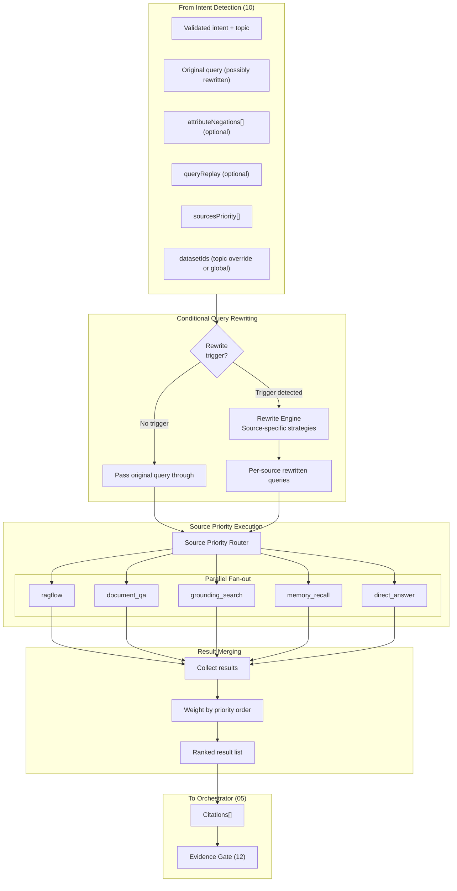
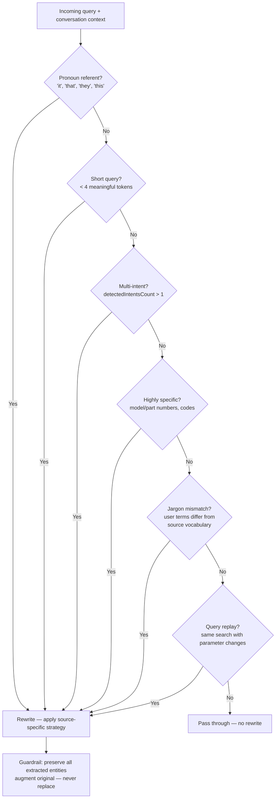
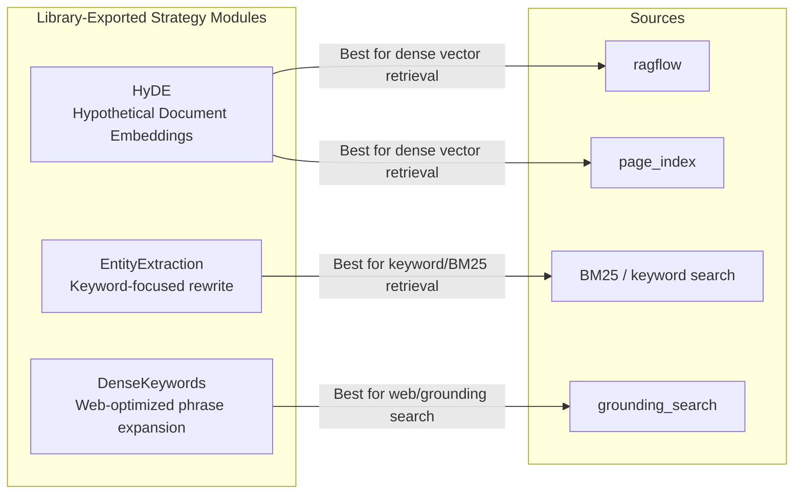
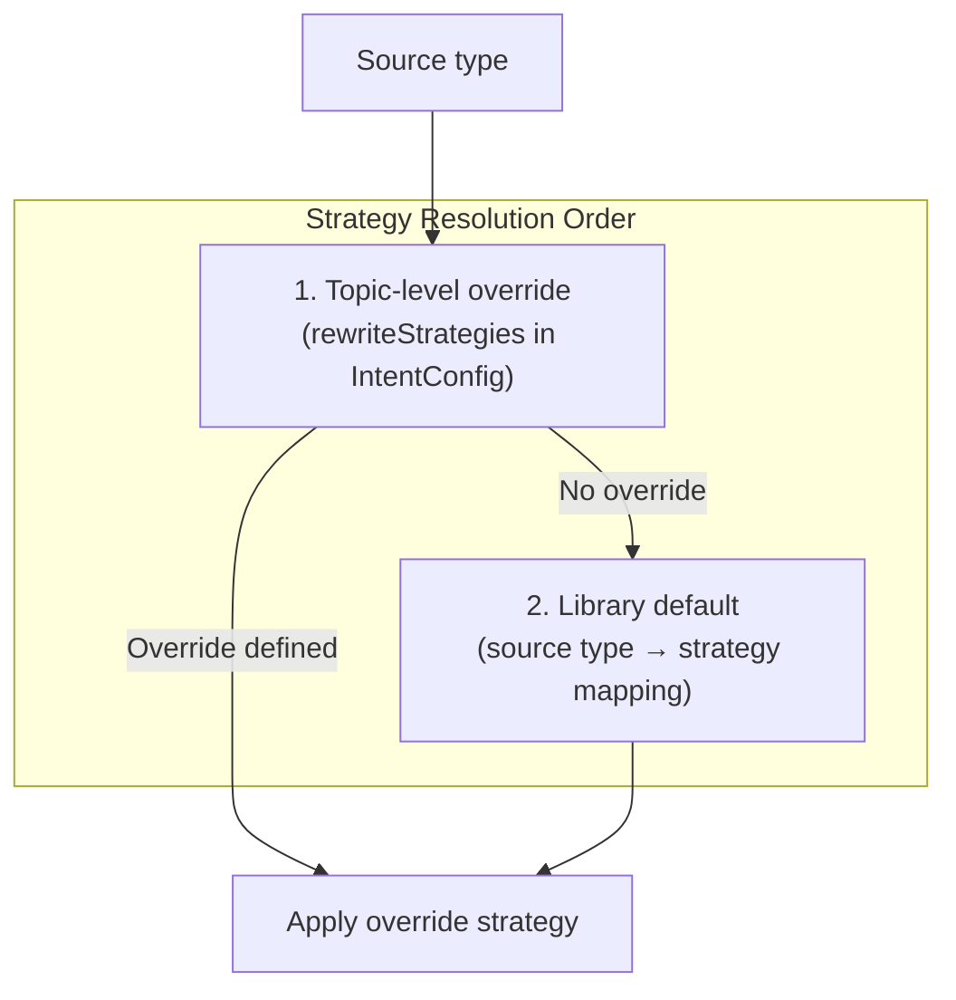
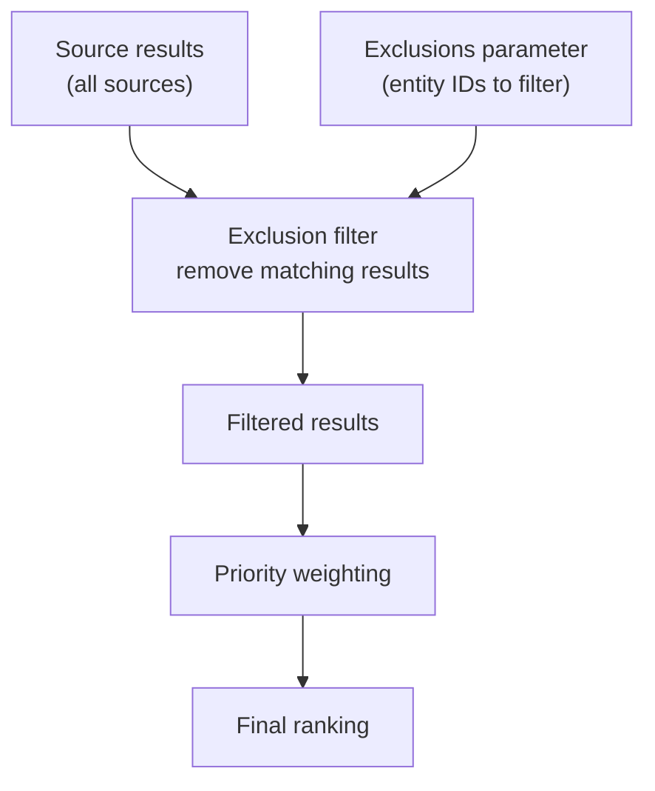
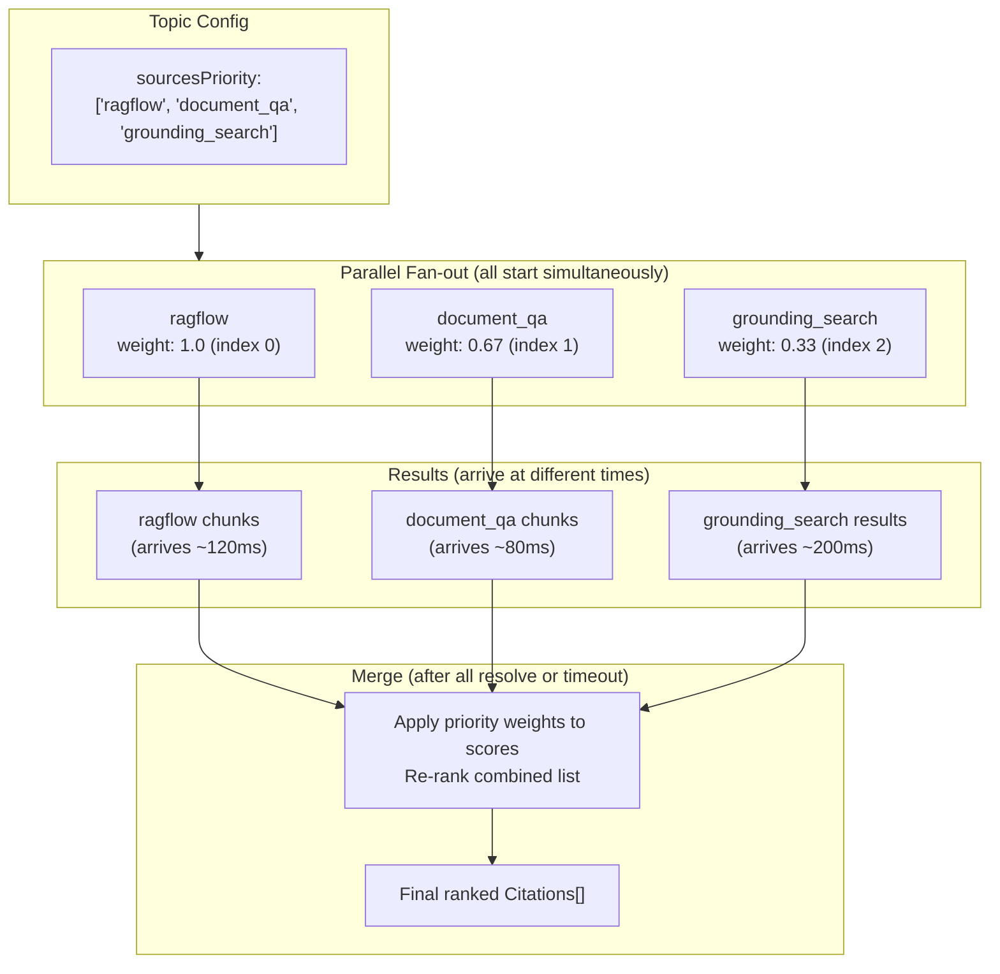
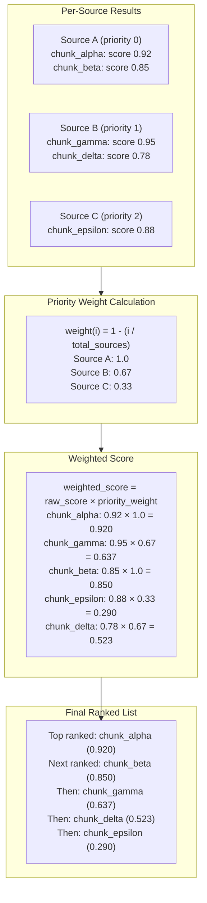
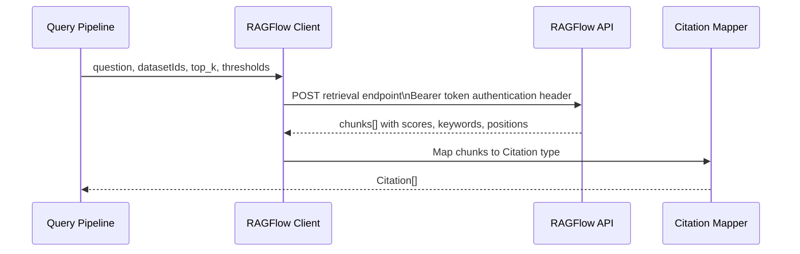
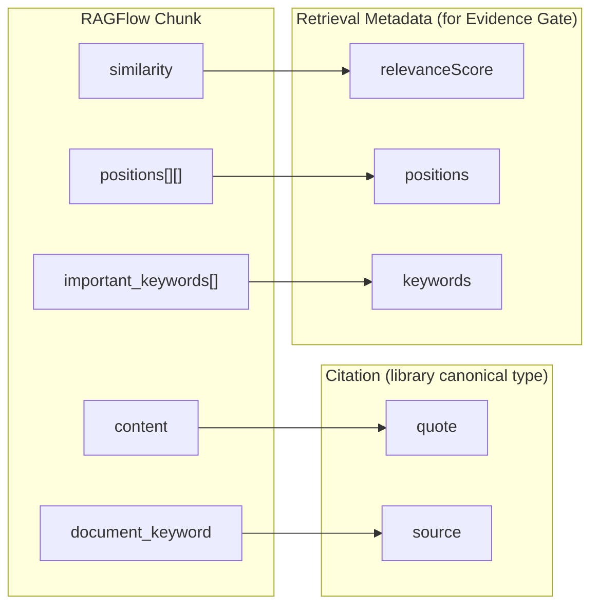
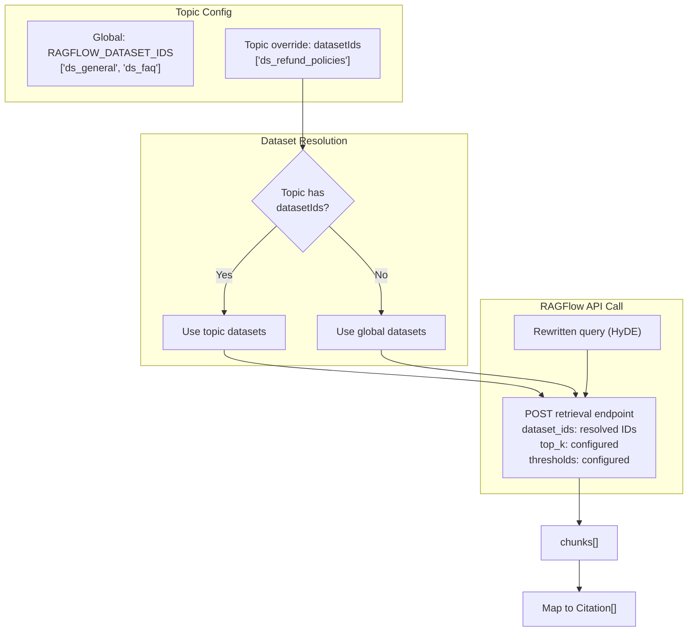

# 11 — Query Pipeline

> **Scope**: Conditional query rewriting, source-specific rewrite strategies, source priority execution, RAGFlow integration, result merging with priority weighting.
>
> **This is a NEW requirement** added during plan refinement. No existing tasks cover this — new tasks are defined below.

---

## Table of Contents

- [Where This Fits](#where-this-fits)
- [Complete Pipeline Flow](#complete-pipeline-flow)
- [Conditional Query Rewriting](#conditional-query-rewriting)
- [Source-Specific Rewrite Strategies](#source-specific-rewrite-strategies)
- [Source Priority Execution](#source-priority-execution)
- [Result Merging with Priority Weighting](#result-merging-with-priority-weighting)
- [RAGFlow Integration](#ragflow-integration)
- [Library vs Server Responsibilities](#library-vs-server-responsibilities)
- [Cross-References](#cross-references)
- [Task Specifications](#task-specifications)
- [External References](#external-references)

---

## Where This Fits

Intent detection ([10-intent-and-routing.md](./10-intent-and-routing.md)) produces a classified intent, a validated topic, and a conditionally rewritten query. The query pipeline picks up from there: it selects the right rewrite strategy per source, fans out to sources in priority order, and merges results back into a ranked list for the orchestrator agent ([05-agent-and-orchestration.md](./05-agent-and-orchestration.md)).

**Two-stage rewrite model**: Rewriting happens in two distinct stages with different responsibilities. Stage 1 (LLM_INTENT, file 10) checks the 7 rewrite triggers during intent validation and produces a conversation-context-aware rewritten query (pronoun resolution, short-query expansion, etc.) — this is combined into the same `generateObject` call as intent validation to avoid an extra LLM round-trip. Stage 2 (REWRITE_TOOL, this file) takes that rewritten query and applies **source-specific** strategies (HyDE for vector search, entity extraction for keyword search, etc.) to produce per-source rewritten queries. LLM_INTENT owns trigger detection and base rewriting; REWRITE_TOOL owns per-source strategy application. These are complementary, not competing.

---

## Complete Pipeline Flow

---

## Conditional Query Rewriting

Rewriting is not automatic. The pipeline checks for specific triggers before deciding whether to rewrite. When no trigger fires, the original query passes through unchanged — this avoids unnecessary LLM calls and prevents drift from the user's actual words.

### Rewrite Decision Tree

### The 7 Rewrite Triggers

| Trigger | Example | Why it fires |
|---------|---------|--------------|
| **Pronoun referent** | "What about that policy?" | "that" has no meaning without conversation context |
| **Short query** | "pricing" | Too sparse for vector or keyword search to return useful results |
| **Multi-intent** | "Refund policy and CEO name?" | Each sub-query needs its own focused rewrite |
| **Highly specific** | "Error code E-4421-B" | Exact identifiers need to be preserved and surfaced explicitly |
| **Jargon mismatch** | User says "cancel subscription", source says "terminate service agreement" | Vocabulary gap between user language and indexed content |
| **Ordinal reference** | "the second one", "that last option" | Query contains an ordinal reference to a previous result set; resolved to specific entity via `resolveOrdinalReference` |
| **Query replay** | "Same search but for District 7" | User requests repeat of a prior structured query with parameter substitution |

### Ordinal Reference Resolution (Result Sets)

When the query contains an ordinal reference to a **previous result set** (e.g., "the second one", "that last option"), the rewrite engine resolves it to the specific entity by looking up the most recent structured result set via `resolveOrdinalReference` (from [07-memory-system.md](./07-memory-system.md), task STRUCTURED_RESULT_MEM). The resolved entity name replaces the ordinal in the rewritten query.

**Note**: This is distinct from the FileRegistry's ordinal resolver (in [12-file-intelligence.md](./12-file-intelligence.md)), which resolves ordinals against **uploaded files** ("the third document" = third file uploaded). The two ordinal systems operate on different data: result set ordinals resolve against agent-produced ordered lists (e.g., 5 football fields), while file ordinals resolve against the user's uploaded file list. There is no overlap — they are triggered by different query patterns and query different stores (Postgres result sets vs Postgres file metadata).

### Query Replay Rewriting

Query replay is the seventh rewrite trigger. When `queryReplay.detected` is true, the rewrite engine does not treat the input as an isolated fresh query. Instead, it reconstructs the request from memory:

1. Retrieve the most recent structured result set's `originatingQuery` from structured result memory (see [07-memory-system.md](./07-memory-system.md))
2. Apply `queryReplay.parameterChanges` as targeted substitutions
3. Produce a rewritten query that preserves the full structure of the original request while updating the requested fields

Example flow:

- Original `originatingQuery`: "football fields in Cau Giay"
- Replay change: `{ location: 'District 7' }`
- Rewritten query: "football fields in District 7"

This path is preferred over interpreting phrases like "same but for District 7" directly because it retains the complete intent structure from the original search.

If no recent structured result set exists, replay reconstruction is skipped and the pipeline falls back to standard rewriting with full thread context.

### Critical Guardrail

The rewrite engine must **never replace** the original query. It augments. All entities extracted from the original query — names, codes, dates, product identifiers — must appear verbatim in the rewritten output. This prevents the rewriter from hallucinating a plausible-sounding but wrong query that loses the user's actual intent.

---

## Source-Specific Rewrite Strategies

Different sources have different retrieval mechanics. A query optimized for dense vector search looks nothing like one optimized for BM25 keyword matching. The library exports three strategy modules that the server assigns to sources.

### Strategy Mapping

### HyDE (Hypothetical Document Embeddings)

Used for vector search sources: `ragflow` and `page_index`.

Instead of embedding the raw query, HyDE generates a short hypothetical document that would answer the query, then embeds that document. The intuition: a hypothetical answer lives in the same embedding space as real answers, so it retrieves more relevant chunks than a question-shaped embedding would.

The generated hypothetical document is never shown to the user. It exists only as an embedding input.

### EntityExtraction

Used for BM25 and keyword-based retrieval.

Extracts the core entities, noun phrases, and discriminating terms from the query. Strips filler words, question structure, and conversational framing. The result is a compact, high-signal keyword string that BM25 can match precisely.

### DenseKeywords

Used for `grounding_search` (web search).

Expands the query into a set of dense, search-engine-optimized phrases. Adds synonyms, related terms, and context that web search engines use for ranking. Avoids question syntax — web search performs better with declarative keyword phrases.

### Per-Topic Strategy Override

The server can override which strategy applies to which source for a given topic via `TopicDefinition.rewriteStrategies`. The library's defaults apply when no override is set.

---

## Source Priority Execution

### Exclusion Constraints

When the orchestrator processes dependent intents, a feedback intent (e.g., "X is terrible") may produce a constraint that the subsequent search intent should exclude certain results. The source priority router accepts an optional `exclusions` parameter — a list of entity identifiers to filter out from search results.

The exclusion is applied at the result merging stage: after all sources return their results, any result whose content matches an excluded entity is removed before priority weighting and ranking.

#### Exclusion Filter Flow

### Attribute Negation as Search Filter

When `attributeNegations` is present from intent detection, the router and rewrite engine apply those constraints during retrieval, not only after retrieval.

Unlike entity exclusion, which removes specific entities at merge time, attribute negation narrows candidate retrieval before results are collected.

- Entity exclusion removes known entities from already retrieved results
- Attribute negation filters out unwanted properties during source query execution

The rewrite behavior by source type is:

- Grounding search: append explicit negative terms using minus-prefix query syntax
- RAG retrieval sources: inject a retrieval context clause stating "The user explicitly does NOT want: [attributes]"
- Source adapters: convert the same logical negation list into each source's native query syntax

| Source | Negation application stage | Negation form | Why this improves quality |
|--------|----------------------------|---------------|---------------------------|
| `grounding_search` | Query rewrite before request | Minus-prefixed negative terms appended to rewritten query | Prevents web retrieval of pages dominated by unwanted attributes |
| `ragflow` | Query rewrite before request | Contextual negative constraint in retrieval prompt | Reduces chunk retrieval for content centered on excluded attributes |
| `document_qa` | Query rewrite before request | Adapter-specific negative clause alongside extracted entities | Limits page-level retrieval noise in uploaded document corpora |
| `memory_recall` | Recall query formulation | Attribute-negation context passed with recall request | Avoids pulling memory entries whose core attributes conflict with user constraints |
| `direct_answer` | Synthesis constraint | Negative preference carried in answer framing | Keeps generated direct responses aligned with explicit user dislikes |

### Priority Configuration

Each topic defines `sourcesPriority: string[]` — an ordered list of source names. Position in the list determines priority weight. Index 0 is highest priority.

Available sources:

| Source | Description |
|--------|-------------|
| `ragflow` | External RAGFlow knowledge base (read-only) |
| `document_qa` | Uploaded document retrieval via page_index |
| `grounding_search` | Web search via grounding provider |
| `memory_recall` | Long-term memory retrieval from SurrealDB — returns a formatted string (not scored chunks); injected as additional agent context rather than merged into the scored Citations[] ranking |
| `direct_answer` | Agent answers from its own knowledge (no retrieval) |

### Parallel Execution with Priority Weighting

All sources in the priority list execute in parallel. Priority does not mean sequential — it means the weight applied during result merging.

### Fail Fast

At the pipeline fan-out level, there is no circuit breaker and no fallback. If a source errors, the error propagates immediately to the orchestrator agent, which decides how to proceed — it may retry, skip the source, or surface the failure to the user. The pipeline itself does not silently swallow errors or substitute empty results.

Note: this "no circuit breaker" applies to the source fan-out/merging layer. Individual external API calls (Gemini, RAGFlow, Langfuse, MCP servers) are each wrapped with the `createCircuitBreaker` factory from [17-Infrastructure](./17-infrastructure.md) to prevent cascading failures from repeated timeouts. These are complementary: the circuit breaker protects individual service calls; the pipeline propagates errors without hiding them.

### Empty Result Behavior

An empty result from a source is not always an error. Whether it's suspicious depends on the source type and the topic. The server configures this per source in `TopicDefinition.emptyResultBehavior`.

| Behavior | Meaning |
|----------|---------|
| `normal` | Empty results are expected and fine (e.g., `memory_recall` often returns nothing for new users) |
| `suspicious` | Empty results are unexpected and should be flagged (e.g., `ragflow` returning nothing for a topic with a large knowledge base) |

When a source returns empty and its behavior is `suspicious`, the pipeline logs a warning and the orchestrator agent is informed. The agent can then decide whether to retry, use a different source, or ask the user for clarification.

---

## Result Merging with Priority Weighting

The weight formula ensures that a high-scoring result from a lower-priority source can still outrank a low-scoring result from a higher-priority source. Priority is a tiebreaker and a scaling factor, not an absolute gate.

---

## RAGFlow Integration

### What RAGFlow Is

RAGFlow is an external, read-only knowledge base. The safeagent system does not write to it, does not manage its datasets, and does not use its built-in LLM. We use RAGFlow purely as a chunk retrieval engine: send a question, get back ranked chunks with similarity scores.

RAGFlow also exposes an OpenAI-compatible chat endpoint, but we do not use it. Our own LLM (PRIMARY_MODEL) synthesizes answers from the retrieved chunks.

### Data Flow

### API Details

**Endpoint**: RAGFlow retrieval endpoint (see RAGFlow HTTP API documentation)

**Auth**: Bearer token authentication header sourced from `RAGFLOW_API_KEY`

**No SDK**: There is no official JavaScript or TypeScript SDK for RAGFlow. The client uses raw `fetch`.

**Request fields**:

| Field | Type | Description |
|-------|------|-------------|
| `question` | `string` | The (possibly rewritten) query |
| `dataset_ids` | `string[]` | Which datasets to search |
| `top_k` | `number` | Maximum chunks to return |
| `similarity_threshold` | `number` | Minimum similarity score (0-1) |
| `vector_similarity_weight` | `number` | Balance between vector and keyword similarity (0-1) |

**Response fields** (per chunk):

| Field | Type | Description |
|-------|------|-------------|
| `content` | `string` | The chunk text |
| `similarity` | `number` | Combined similarity score |
| `document_keyword` | `string` | Source document identifier |
| `positions` | `number[][]` | Character positions within the source document |
| `important_keywords` | `string[]` | Keywords RAGFlow extracted from the chunk |

**Constraint**: All `dataset_ids` in a single call must use the same embedding model. Mixing datasets with different embedding models in one call is not supported by the API.

### Configuration

| Config Key | Description |
|------------|-------------|
| `RAGFLOW_BASE_URL` | Base URL of the RAGFlow instance |
| `RAGFLOW_API_KEY` | Bearer token for authentication |
| `RAGFLOW_DATASET_IDS` | Global default dataset IDs (used when topic has no override) |

Per-topic dataset override: `TopicDefinition.datasetIds` in IntentConfig. When set, these IDs replace the global default for that topic's RAGFlow calls.

### Chunk to Citation Mapping

RAGFlow chunks are mapped to the library's canonical `Citation` type plus separate retrieval metadata before leaving the RAGFlow client. The `Citation` fields (quote, source) are the stable public shape emitted via SSE. The retrieval metadata (relevanceScore, positions, keywords) is internal — used only by the Evidence Gate for scoring and never sent to clients. The mapping preserves:

- The chunk content → `Citation.quote`
- The document keyword → `Citation.source`
- The similarity score → retrieval metadata `relevanceScore` (Evidence Gate only)
- The important keywords → retrieval metadata `keywords` (Evidence Gate only)
- The positions array → retrieval metadata `positions` (Evidence Gate only)

The RAGFlow client maps chunk fields to canonical Citation fields (`quote`, `source`) plus retrieval metadata (`relevanceScore`, `positions`, `keywords`). The retrieval metadata enriches the Citation for downstream use by the Evidence Bundle Gate (sufficiency scoring). The `fileId`, `page`, `scope`, and `images` Citation fields are populated by other sources or left absent when not applicable. The canonical Citation shape is defined in 09-RAG and Retrieval.

### RAGFlow in the Priority Execution Flow

---

## Library vs Server Responsibilities

The library ships with strong defaults. The server overrides only what's deployment-specific.

| Responsibility | Library | Server |
|----------------|---------|--------|
| HyDE strategy module | Exports | Assigns to sources |
| EntityExtraction strategy module | Exports | Assigns to sources |
| DenseKeywords strategy module | Exports | Assigns to sources |
| Default strategy-to-source mapping | Provides | Overrides per topic |
| Source priority execution engine | Provides | Configures via IntentConfig |
| RAGFlow client (raw fetch wrapper) | Provides | Configures via env vars |
| Chunk-to-Citation mapping | Provides | N/A |
| Priority weight formula | Provides | N/A |
| Empty result behavior defaults | Provides | Overrides per source per topic |
| Strongly typed pipeline interfaces | Provides | Implements |

---

## Cross-References

| Component | Interaction |
|-----------|------------|
| **Intent Detection** ([10](./10-intent-and-routing.md)) | Provides classified intent, validated topic, sourcesPriority, and initial rewrite decision |
| **Orchestrator Agent** ([05](./05-agent-and-orchestration.md)) | Receives ranked Citations[], can call the rewrite tool if it decides routing was wrong |
| **Evidence Gate** ([12](./12-file-intelligence.md)) | Receives ranked Citations[] for sufficiency scoring |
| **Memory System** ([07](./07-memory-system.md)) | `memory_recall` source queries SurrealDB long-term memory; structured result sets stored for ordinal reference resolution and exclusion constraints |
| **Configuration** ([02](./02-configuration.md)) | RAGFLOW_BASE_URL, RAGFLOW_API_KEY, RAGFLOW_DATASET_IDS |

### Agent Rewrite Tool

The orchestrator agent has access to a rewrite tool it can call at any point during its reasoning loop. This covers cases where:

- The agent determines the initial routing was wrong after seeing partial results
- The agent wants source-specific rewrites for a follow-up retrieval call
- The agent is handling a multi-intent query and needs separate rewrites per sub-query

The tool accepts the current query, the target source, and optional conversation context. It returns a rewritten query using the appropriate strategy for that source. Internally, rewrite strategies use AI SDK's `generateObject` for structured query rewrites (e.g., intent-aware rewriting, multi-source decomposition) and `generateText` for free-form text generation (e.g., HyDE hypothetical passages).

---

## Task Specifications

### Task RAGFLOW_CLIENT: RAGFlow Client + Tool

**What to do**: Implement a raw fetch wrapper around the RAGFlow retrieval API, including configuration loading, request construction, response parsing, and chunk-to-Citation mapping. Expose this as a tool the agent can call.

**Depends on**: CORE_TYPES, CONFIG_DEFAULTS

**Acceptance Criteria**:
- Raw `fetch` — no SDK dependency
- Reads `RAGFLOW_BASE_URL`, `RAGFLOW_API_KEY`, `RAGFLOW_DATASET_IDS` from config
- Accepts per-call dataset override (for topic-level `datasetIds`)
- Sends a bearer token authentication header
- Constructs request with `question`, `dataset_ids`, `top_k`, `similarity_threshold`, `vector_similarity_weight`
- Parses response chunks and maps each to the canonical `Citation` type
- Preserves `content`, `similarity`, `document_keyword`, `positions`, `important_keywords` in the mapping
- Fails fast on HTTP errors — no retry logic in the client itself
- Exported as an importable tool module
- Unit tests with mocked fetch (happy path, HTTP error, malformed response)
- Integration test against a real RAGFlow instance (skipped in CI if `RAGFLOW_BASE_URL` not set)

**QA Scenarios**:
- Happy path: valid question + dataset IDs → returns ranked Citations[]
- Topic dataset override: topic-level IDs replace global IDs in the request
- HTTP 401: error propagates immediately with typed error code
- Empty chunks array: returns empty Citations[], behavior flag checked by caller
- Malformed response (missing fields): typed error, not silent null
- `RAGFLOW_BASE_URL` not set: RAGFlow source is disabled (returns empty results when called); no startup throw — consistent with the degradation model in file 02

---

### Task SOURCE_ROUTER: Source Priority Router

**What to do**: Implement the parallel execution engine that fans out to all sources in a topic's `sourcesPriority` list simultaneously, collects results, applies priority weighting, and returns a merged ranked Citations[] list.

**Depends on**: RAGFLOW_CLIENT, CORE_TYPES, CONFIG_DEFAULTS

**Acceptance Criteria**:
- All sources in `sourcesPriority` start executing simultaneously (no sequential waiting)
- Priority weight calculated as one minus the ratio of the source index to the total number of sources
- Each source's result scores multiplied by its priority weight before merging
- Final list sorted by weighted score descending
- Source errors propagate immediately (fail fast — no silent swallow)
- Empty result behavior checked per source: `normal` vs `suspicious` per `emptyResultBehavior` config
- `suspicious` empty results logged as warnings with source name and query
- Orchestrator agent informed of any suspicious empty results
- Strongly typed input and output interfaces
- Unit tests: parallel execution verified (all sources called before any result used), weight formula verified, merge order verified
- Integration test: two sources returning results at different latencies → correct merge order

**QA Scenarios**:
- Three sources, all return results → merged by weighted score, not arrival order
- Source B (priority 1) returns higher raw score than Source A (priority 0) → Source A still wins after weighting if scores are close; Source B wins if its raw score is significantly higher
- One source errors → error propagates, other source results discarded
- Source returns empty, behavior is `suspicious` → warning logged, agent informed
- Source returns empty, behavior is `normal` → no warning, treated as valid empty
- `sourcesPriority` is empty → no sources called, empty Citations[] returned

---

### Task REWRITE_TOOL: Query Rewrite Tool

**What to do**: Implement the conditional query rewriting tool that checks for the 7 rewrite triggers, selects the appropriate strategy per source, applies the guardrail (preserve entities, augment not replace), and returns per-source rewritten queries.

**Depends on**: REWRITE_STRATEGIES, CORE_TYPES, LLM_INTENT

**Acceptance Criteria**:
- Checks all 7 triggers in order: pronoun referent, short query, multi-intent, highly specific, jargon mismatch, ordinal reference, query replay
- If no trigger fires, returns original query unchanged for all sources
- If trigger fires, applies source-specific strategy to produce per-source rewritten queries
- Strategy selection follows: topic override first, library default second
- Guardrail enforced: all entities from original query present verbatim in rewritten output
- Guardrail failure (entity missing from rewrite) → rewrite discarded, original query used
- Combined with intent detection in a single `generateObject` call when triggered on embedding router miss
- Exported as a standalone tool the agent can call independently
- Unit tests: each trigger fires correctly, guardrail catches entity loss, no-trigger path returns original
- Thinking level: `low` (per configuration table in [02](./02-configuration.md))

**QA Scenarios**:
- "What about that?" with conversation context → pronoun trigger fires, "that" resolved to explicit referent
- "pricing" → short query trigger fires, expanded with topic context
- "Refund policy and CEO name?" → multi-intent trigger fires, two separate rewrites produced
- "Error code E-4421-B" → highly specific trigger fires, code preserved verbatim in rewrite
- "I want to cancel my subscription" (source uses "terminate service agreement") → jargon mismatch trigger fires
- "What is the refund policy for international orders?" → no trigger fires, original query passed through
- Rewrite drops entity "E-4421-B" → guardrail catches it, original query used instead

---

### Task REWRITE_STRATEGIES: Rewrite Strategy Modules

**What to do**: Implement the three rewrite strategy modules (HyDE, EntityExtraction, DenseKeywords) as independently importable modules that the server can assign to sources.

**Depends on**: CORE_TYPES

**Acceptance Criteria**:
- HyDE generates a short hypothetical document (2-4 sentences) that would answer the query, written as if it were a real answer
- HyDE uses `generateObject` or `generateText` with PRIMARY_MODEL at thinking level `low`
- HyDE output is the hypothetical document text (used as embedding input, not shown to user)
- EntityExtraction extracts core entities, noun phrases, and discriminating terms from the query
- EntityExtraction strips question structure, filler words, and conversational framing
- EntityExtraction output is a compact keyword string (no sentence structure), preserving all proper nouns, codes, and identifiers verbatim
- EntityExtraction uses thinking level `low`
- DenseKeywords expands the query into search-engine-optimized keyword phrases with synonyms and related terms
- DenseKeywords avoids question syntax — declarative phrases only
- DenseKeywords output is a comma-separated or space-separated keyword expansion at thinking level `low`
- All three modules are exported as named modules from the library
- All three accept: original query, conversation context (optional), topic description (optional)
- All three return a rewritten string
- Unit tests with mocked LLM for each module
- Each module is independently importable (no coupling between them)

**QA Scenarios**:
- HyDE on "What is the refund policy?" → returns a 2-4 sentence hypothetical policy document
- EntityExtraction on "What is the refund policy for international orders placed after January?" → returns "refund policy international orders January"
- DenseKeywords on "How do I cancel my subscription?" → returns "cancel subscription terminate account service cancellation"
- All three: entity "E-4421-B" in input → "E-4421-B" appears verbatim in output
- All three: empty query → typed error, not empty string

---

## External References

- RAGFlow HTTP API Reference: https://ragflow.io/docs/http_api_reference
- Vercel AI SDK generateObject: https://sdk.vercel.ai/docs/ai-sdk-core/generating-structured-data
- Vercel AI SDK tools: https://sdk.vercel.ai/docs/ai-sdk-core/tools-and-tool-calling
- AI SDK agent tools: https://sdk.vercel.ai/docs

---

*Previous: [10 — Intent Detection & Routing](./10-intent-and-routing.md)*
*Next: [12 — File Intelligence](./12-file-intelligence.md)*
