# 11 — Streaming & Transport

> **Scope**: SSE streaming pipeline, custom SSE event protocol boundary, trace-step event family, verbosity-level filtering, CTA tool streaming, and the client SDK module.
>
> **Tasks**: SSE_STREAMING (SSE Streaming Layer), CTA_STREAMING (CTA Streaming), CLIENT_SDK (Client SDK)

---

## Table of Contents

- [Architecture Overview](#architecture-overview)
- [SSE Streaming Layer (SSE_STREAMING)](#sse-streaming-layer-sse_streaming)
- [Stream Format Boundary](#stream-format-boundary)
- [Session Metadata Delivery](#session-metadata-delivery)
- [Trace-Step Events](#trace-step-events)
- [Verbosity Levels](#verbosity-levels)
- [Concurrent Invocation Policy (Double-Texting)](#concurrent-invocation-policy-double-texting)
- [Real-Time Voice and Audio Transport](#real-time-voice-and-audio-transport)
- [CTA Streaming (CTA_STREAMING)](#cta-streaming-cta_streaming)
- [Client SDK (CLIENT_SDK)](#client-sdk-client_sdk)
- [SSE Event Type Reference](#sse-event-type-reference)
- [Cross-References](#cross-references)
- [Task Specifications](#task-specifications)

---

## Architecture Overview

The streaming system keeps framework stream events internal to the safeagent library. At the HTTP boundary, stream handler factory iterates the internal stream output and translates framework events into a custom named-event SSE protocol (`session-meta`, `text-delta`, `trace-step`, `cta`, `citation`, `location`, `tripwire`, `done`, `error`) designed for the client SDK module and other SSE consumers. The `trace-step` events provide real-time pipeline visibility for developer debugging and are only emitted when the verbosity level is `full`.

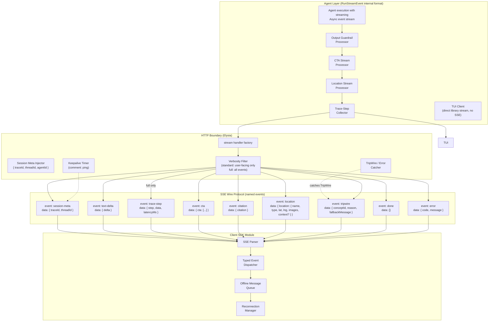

---

## SSE Streaming Layer (SSE_STREAMING)

### Stream Handler Factory

stream handler factory is an Elysia route handler factory exported by the library. It wires together every concern that touches the HTTP streaming path: context injection, agent execution stream invocation, internal stream event to SSE translation, keepalive, and error handling. The server registers it as a route and configures auth middleware; the library owns all the streaming logic inside. The library also exports the underlying framework-agnostic stream processing primitives for non-Elysia consumers (e.g., tests, TUI).

The handler executes the agent with streaming enabled and receives an async stream of framework events. Event families include model text chunks, run item events (tool calls, messages, handoffs), and agent update events for handoff switches. The handler maps these to the eight SSE event types. Framework guardrail tripwire exceptions are caught at the boundary and emitted as `tripwire` SSE events.

The factory accepts an error-message mapping parameter — a plain object keyed by error code string, where values are either a static message string or a function that derives a message from metadata. When the handler catches an error and emits an `error` SSE event, it looks up the error's code in this map to populate the `message` field. If the code is not in the map, a generic fallback message is used. The server passes its error message map (defined in [12 — Server Implementation](./12-server.md)) when constructing the handler. This is the DI mechanism that keeps the library language-agnostic while letting the server control user-facing tone.

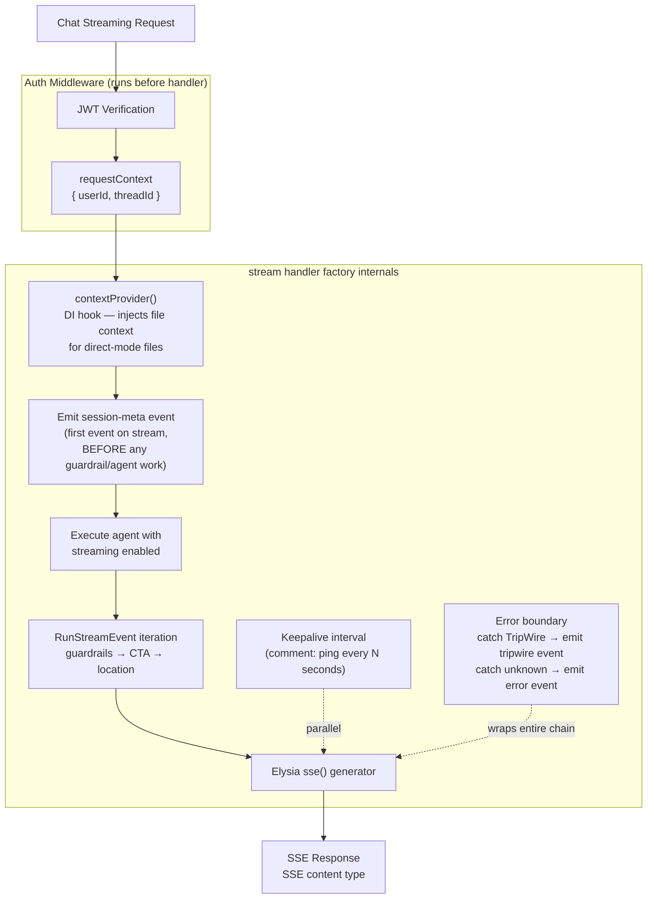

### contextProvider DI Hook

The server passes a context provider function when constructing the handler. The function signature is:

**A context provider that receives request identity fields and returns optional additional system messages.**

The returned value is an optional array of system messages to prepend to the agent's message list, where each message can carry plain text or structured multimodal parts. Returning null or an empty array means no additional context is injected.

Its primary use is injecting file context in direct mode, where the user has uploaded files that should be visible to the agent without going through the full RAG pipeline. The server implements the function to fetch file content from storage, read from a local cache, or return nothing based on whether the request includes file references.

The hook is dependency-injected so the library stays agnostic about how the server resolves files. The agent never knows the difference.

### userId Flow

The JWT auth lifecycle hook extracts `userId` from the bearer token and attaches it to Elysia context via lifecycle context augmentation hooks. stream handler factory reads `userId` from context and passes it into the agent call via the request context object along with the `threadId` from the request body. The agent and all its tools receive `userId` through this channel. Nothing in the library reads `userId` from anywhere else.

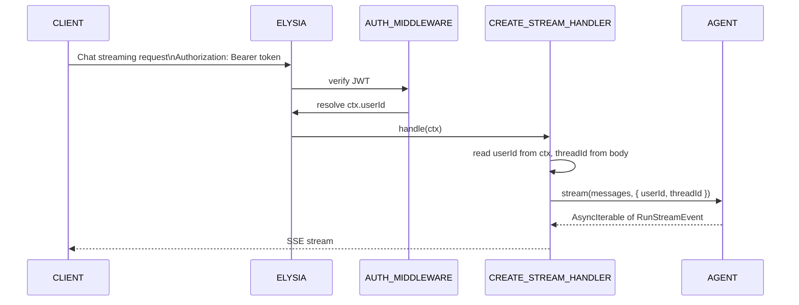

### Keepalive

Proxies and load balancers close idle connections after a timeout, typically 30 to 60 seconds. Long-running agent calls can easily exceed this. The handler starts a keepalive interval that writes SSE comment lines (`": ping"`) on a fixed cadence. Comment lines are valid SSE but carry no data, so the client ignores them. The interval is cleared when the stream ends or errors.

### Error Handling

Two error types get special treatment at the HTTP boundary:

- **TripWire**: thrown by the guardrail system when a p0 input violation is detected, or when a p0 output violation is detected in development mode. The handler catches it, stops the stream, and emits a `tripwire` SSE event containing `conceptId`, `reason`, and a fallback message. `reason` is the user-facing message, while `conceptId` is the canonical guardrail concept identifier. In production mode, output p0 violations do NOT throw TripWire — they suppress remaining chunks and inject a fallback as a normal `text-delta` event (see [10 — Guardrails & Safety](./10-guardrails.md) for details).
- **Unknown errors**: anything else becomes a generic `error` SSE event. The stream closes cleanly rather than dropping the connection mid-response.

The output sliding window used by output guardrails also runs eld language detection on accumulated text. When LanguageGuardConfig.supportedLanguages is configured and eld detects output drift into an unsupported language, the output guardrail returns p0 and the stream follows the same tripwire or suppress-and-fallback path as any other output guardrail violation. This acts as the final safety net for cases where input passed earlier checks but generated output drifts into an unsupported language.

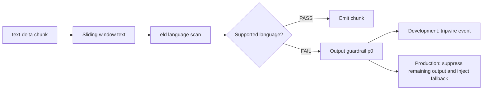

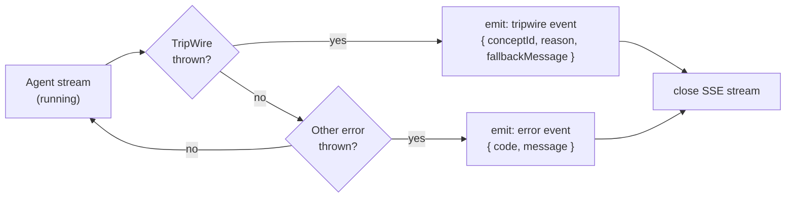

### Concurrent Invocation Policy (Double-Texting)

Concurrent invocation happens when a user sends a second message while the first run is still in-flight. The transport layer must apply one explicit policy so behavior is predictable for users, clients, and operators.

#### Policy Set

- **REJECT**: deny the second request immediately with a clear conflict error while the first run continues unchanged.
- **ENQUEUE**: accept the second request into a per-session queue and start it only after the first run reaches a terminal state. This is the default policy.
- **INTERRUPT**: stop the first run and start the second request as soon as cancellation reaches a safe boundary.
- **ROLLBACK**: stop the first run, restore state to the pre-run checkpoint, then start the second request.

#### Policy Selection

Policy selection is configurable at two scopes:

- Per agent: an agent can define its preferred concurrent invocation behavior based on interaction style.
- Per endpoint: an endpoint can override agent defaults for channels that need stricter or looser behavior.

When both are configured, endpoint policy takes precedence. If no explicit setting is present, use **ENQUEUE**.

#### In-Flight Cancellation Semantics

For **INTERRUPT** and **ROLLBACK**, cancellation is clean and ordered:

- The running step is allowed to drain to its nearest safe boundary.
- A cancellation event is emitted so clients and observability systems can correlate why output stopped.
- Partial progress is persisted as an interrupted run record before control moves to the next request.

This avoids abrupt termination that can leave transport and state machines out of sync.

#### Client Notification Contract

Clients are notified explicitly when a second message changes execution flow:

- If policy is **REJECT**, the second request receives an immediate conflict response with retry guidance.
- If policy is **ENQUEUE**, the second request receives accepted-and-queued status and later receives normal stream start signals when execution begins.
- If policy is **INTERRUPT** or **ROLLBACK**, the first stream receives an interruption/cancellation signal before closure, and the second stream begins under a new run lifecycle.

#### State Consistency Guarantees

Interrupt handling must preserve state integrity:

- No partial writes are committed as final state unless marked as interrupted partial progress.
- Message ordering remains monotonic from the client perspective even when interruption occurs.
- Queue transitions and run transitions are atomic at the session level to prevent split-brain run ownership.

#### Durable Execution Tie-In (File 25)

The **ROLLBACK** policy depends on durable execution checkpoints defined in [25 — Durable Execution](./25-durable-execution.md). Pre-run and step-level checkpoints make rollback deterministic by restoring a known-good session snapshot before replaying the replacement request.

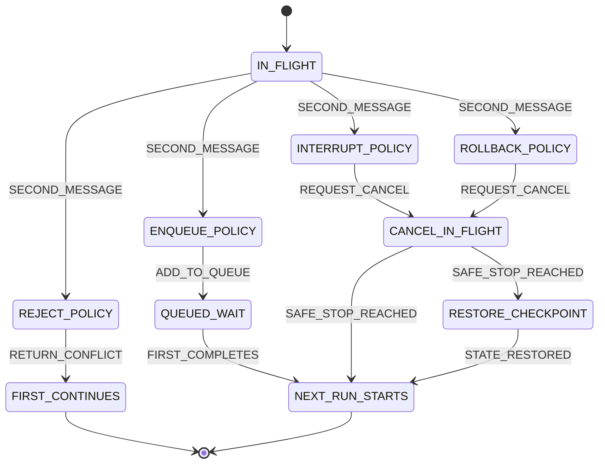

---

## Real-Time Voice and Audio Transport

Voice and audio transport is defined as a transport-layer extension with plugin boundaries so the core `safeagent` package stays lean while still supporting production voice workloads.

### Voice Provider Abstraction

The framework SHALL define a provider-agnostic voice interface with four required capabilities:

- Speech-to-text listen capability for incremental transcript production
- Text-to-speech speak capability for low-latency audio playback streaming
- Bidirectional streaming connect capability for continuous real-time exchange
- Structured event emission for transcript updates, speaker audio output, and writing indicator state

This interface is transport-contract focused and independent of any single vendor.

### Architecture Modes

Two architecture modes are first-class and selectable per voice session:

- Cascaded pipeline: STT to LLM to TTS, prioritizing control, safety gating points, and provider flexibility per stage
- Speech-to-speech (S2S): direct real-time speech model session, prioritizing lowest possible latency with reduced intermediate control points

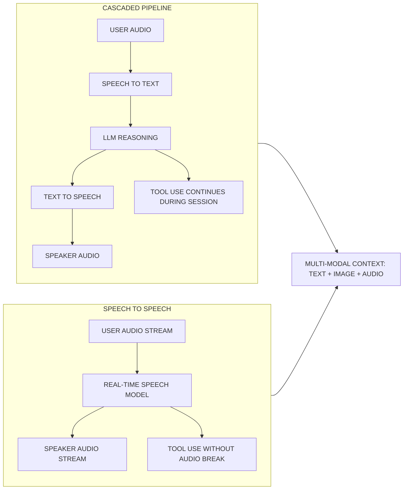

### Transport Requirements

- Primary media transport: WebRTC for real-time duplex audio streaming
- Session signaling and control channel: WebSocket for connection negotiation and live state updates
- Fallback transport: HTTP chunked transfer when real-time channels are unavailable

This preserves real-time quality while maintaining broad network compatibility.

### Transport Security

- All media and signaling channels MUST use encrypted transport (DTLS for WebRTC media, TLS for WebSocket signaling and HTTP fallback)
- Voice session establishment MUST require authenticated session authorization; unauthenticated callers are rejected before any media exchange
- Abuse controls MUST enforce per-tenant concurrent session limits, per-session duration caps, and rate limiting on session creation to prevent resource exhaustion attacks

### Turn Detection and Interruption

Voice turn management SHALL use voice activity detection with configurable controls:

- Sensitivity tuning for noisy and quiet environments
- Silence threshold duration for turn-finalization timing
- Interruption handling that allows user barge-in and immediate generation cancellation or pause

### Event Model

Voice sessions emit a structured transport event model:

- `transcript_partial`
- `transcript_final`
- `speech_started`
- `speech_ended`
- `interruption`
- `connection_state`

These events are transport-level contracts for SDK and UI synchronization.

### Plugin Boundary and Packaging

Voice providers are shipped as separate installable plugins and are NOT bundled in core `safeagent`.

- Runtime package policy: Bun only
- Core package policy: single npm package `safeagent`
- Voice integrations remain optional plugin modules to avoid default install bloat

### Reference Provider Plugins

Reference plugin implementations include:

- OpenAI Realtime API
- ElevenLabs
- Deepgram
- LiveKit

Reference material:

- OpenAI Realtime API: https://platform.openai.com/docs/guides/realtime
- LiveKit Agents: https://docs.livekit.io/agents/

### Tool Continuity During Voice

Agents MUST be able to invoke tools during active voice sessions without breaking audio continuity. Tool execution, transcript updates, and speaker streaming remain synchronized as a single live session timeline.

### Multi-Modal Context

Voice sessions can carry text, images, and audio in one shared conversation context, allowing real-time speech interaction to reference non-audio context without mode switching.

### Latency Budget

End-to-end voice response latency target SHALL be measured from user silence detection to first audio byte returned to the client, with a target of 700 ms or less under normal network conditions.

### Scalability and Load Governance

- The framework MUST enforce configurable admission limits on concurrent voice sessions per tenant and per deployment to prevent resource exhaustion
- Backpressure controls MUST throttle new session creation when infrastructure approaches capacity, returning structured rejection with retry-after guidance rather than silent failure
- Under sustained load, degraded-mode behavior MUST be available: cascaded pipeline fallback when S2S capacity is exhausted, reduced audio quality tiers, and graceful session shedding with client notification

### Session Persistence and Durability

Voice session state ties into conversation memory in File 05 and durable execution guarantees in File 25 so interruptions, reconnects, and resumed turns preserve coherent context and execution state.

---

## Stream Format Boundary

This is the most important invariant in the entire streaming system.

**Framework stream events are used inside the library. The HTTP transport emits a custom named-event SSE protocol for external clients.**

The TUI consumes the library stream directly (no SSE). Tests against the agent layer use framework stream events directly. The HTTP handler maps those events to custom SSE events for network transport. This means:

- Adding a new stream processor updates one internal stream path, while external clients still receive stable named SSE events.
- The TUI and the HTTP path share the same processor chain, so behavior is identical.
- Internal framework stream events and external SSE event names are intentionally separated by the transport boundary.

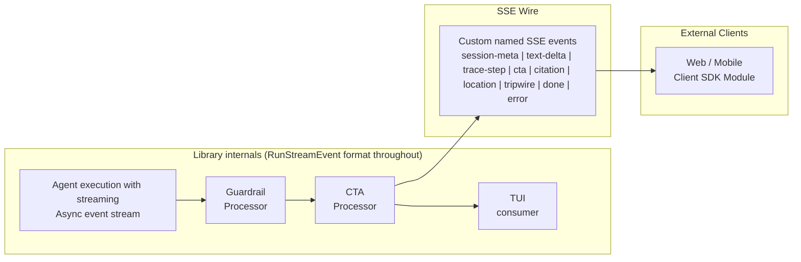

The wire protocol is custom SSE named events, not any framework-specific data format. The client SDK module parses these events directly.

Location enrichment events are emitted during the live stream, never batched at the end. A single response can emit multiple `location` events, typically one per detected place. The underlying `search_locations` tool-call and tool-result chunks are suppressed from the outbound SSE stream using a location stream processor that mirrors the CTA suppression pattern, and only the clean `location` event payload is emitted to clients. When no image provider is configured, each `location` event still includes `lat` and `lng`, and `images` is emitted as an empty array.

---

## Session Metadata Delivery

Every stream starts with a `session-meta` event before any text delta arrives. This event carries the identifiers the client needs to correlate the stream with backend records.

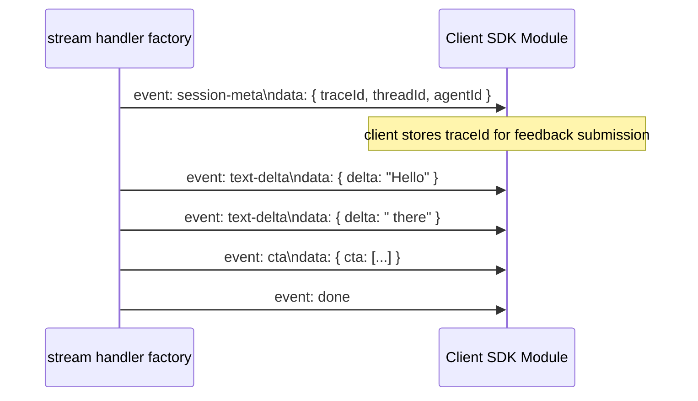

The trace identifier is a server-generated UUID created before the agent run begins and passed to Langfuse as the trace identifier. The `threadId` is the conversation thread ID for the conversation. The agent identifier is optional and identifies which agent handled the request when the server runs multiple agents.

The client SDK stores the trace identifier automatically so feedback submissions (thumbs up/down) can attach it without the application code tracking it manually.

### trace_owners Table Schema

The `trace_owners` Postgres table (managed by Drizzle ORM) enables feedback ownership verification. stream handler factory inserts a row before emitting the first SSE event; the feedback endpoint queries it to confirm the requesting user owns the trace. The Drizzle schema for this table is owned by SSE_STREAMING — it is defined and migrated as part of that task.

| Column | Type | Constraints |
|--------|------|-------------|
| traceId | text | PRIMARY KEY |
| userId | text | NOT NULL |
| createdAt | timestamp | NOT NULL, DEFAULT now() |

No additional indexes beyond the primary key — lookups are always by trace identifier.

---

## Trace-Step Events

Trace-step events provide real-time visibility into the engine pipeline for developer debugging and tracing. They expose what the engine is doing internally — intent classification, memory recall, guardrail evaluation, retrieval, tool execution, and context assembly — as structured SSE events. These events are emitted only when the verbosity level is `full`, ensuring end users never see internal pipeline details.

This is the primary mechanism for the frontend trace and debug experience described in [18 — Frontend SDK](./18-frontend-sdk.md). When verbosity is `standard` (the default), only user-facing events are emitted. When verbosity is `full`, trace-step events are interleaved with regular events to show pipeline activity in real time.

### Trace-Step Event Envelope

All trace-step events share a common envelope: `type: "trace-step"`, a `step` discriminator field, a step-specific `data` payload, a `latencyMs` timing field for visualization, and a `timestamp` for ordering.

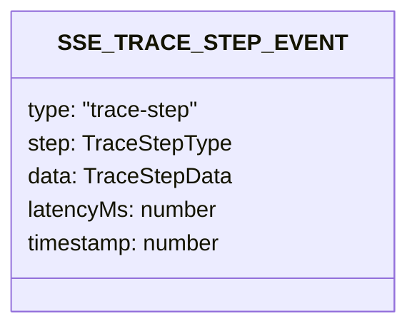

### Step Types

| Step | Emitted When | Data Summary |
|------|-------------|-------------|
| `intent-detected` | Embedding router and LLM validator complete | Intent name, confidence score, detection source (embedding or LLM override), whether LLM agreed with or corrected the embedding classification |
| `memory-recall` | Long-term memory recall returns | Number of facts recalled, top relevance score, temporal distribution summary |
| `guardrail-input` | Input guardrails aggregate | Aggregate verdict (pass, block, or flag), individual guardrail result summaries, highest severity encountered |
| `guardrail-output` | Output guardrail scan runs | Scan result (pass or flag), concept identifier if flagged, sliding window position |
| `retrieval` | RAG or document search completes | Source name, result count, retrieval mode (hybrid, direct, or external) |
| `tool-call-start` | Agent invokes a tool | Tool name, tool category |
| `tool-call-end` | Tool execution completes | Tool name, success or error indicator, result summary |
| `context-budget` | Context assembly completes | Used tokens, total budget, breakdown by layer (thread history, user short-term, long-term recall, source content) |
| `source-fetch` | Source router dispatches or completes a source fetch | Source name, status (started, completed, or failed), result count on completion |
| `rewrite` | Query rewrite applied | Strategy name (HyDE, EntityExtraction, DenseKeywords), trigger reason |

### Emission Ordering

Trace-step events are interleaved with regular events in the order they occur in the pipeline. The engine always produces trace-step data internally (it needs this data for Langfuse tracing regardless). The verbosity filter at the HTTP boundary decides whether to emit them to the SSE stream.

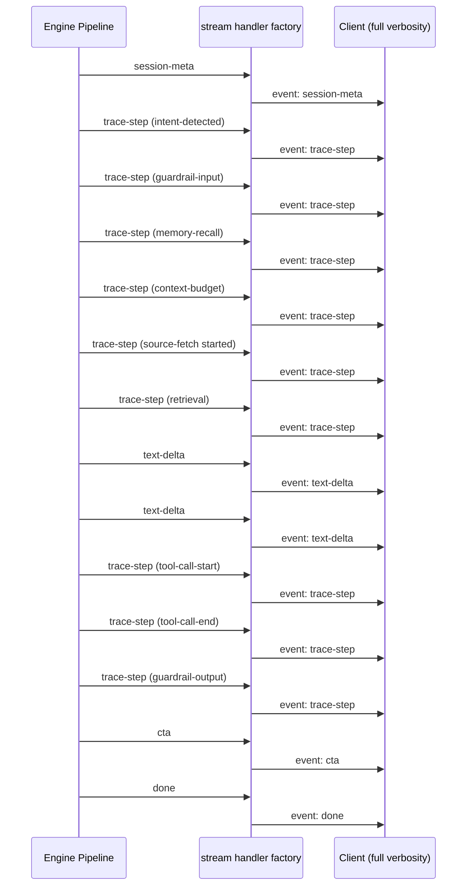

### Relationship to Langfuse

Trace-step events are a real-time subset of the data that Langfuse captures asynchronously. They share the same trace identifier (from `session-meta`). The key differences:

| Aspect | Trace-Step Events | Langfuse Traces |
|--------|------------------|----------------|
| Delivery | Real-time SSE during stream | Async batch export after stream completes |
| Audience | Developers debugging via frontend UI | Analytics and observability dashboards |
| Detail level | Summary per pipeline step | Full span tree with nested children and metadata |
| Persistence | Ephemeral (client memory only) | Permanent (Langfuse storage) |
| Correlation | Same trace identifier from `session-meta` | Same trace identifier |

A developer can watch trace-step events in real-time during a conversation, then switch to Langfuse for deep post-hoc analysis of the same request using the shared trace identifier. See [14 — Observability](./14-observability.md) for the full Langfuse tracing architecture.

### Trace-Step Collector

The trace-step collector is a stream processor that sits after the location processor in the chain. It intercepts pipeline milestone signals — timing data, classification results, guardrail verdicts — and packages them as `trace-step` data events. Unlike the CTA and location processors which suppress tool-call events, the trace-step collector emits additional events alongside the normal stream without suppressing anything.

The collector is always active regardless of verbosity. The verbosity filter at the HTTP boundary decides whether trace-step events reach the SSE wire. The TUI consumes trace-step data directly from the library stream with no filtering.

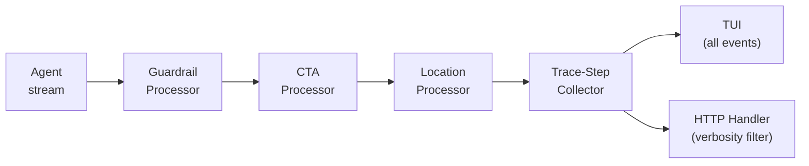

---

## Verbosity Levels

The chat streaming endpoint accepts a verbosity control parameter that controls which events are emitted on the SSE stream. This parameter is passed from the server route to stream handler factory.

| Level | Events Emitted | Target Audience |
|-------|---------------|----------------|
| `standard` (default) | `session-meta`, `text-delta`, `cta`, `citation`, `location`, `tripwire`, `done`, `error` | End users, production applications |
| `full` | All `standard` events plus `trace-step` events interleaved at their natural pipeline positions | Developers debugging pipeline behavior via [18 — Frontend SDK](./18-frontend-sdk.md) verbosity toggle |

### Verbosity Filtering

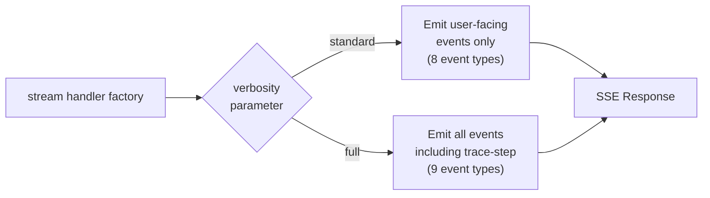

The filter is applied at the HTTP boundary, not inside the engine. The engine always produces trace-step data (it needs it for Langfuse regardless). stream handler factory decides whether to emit trace-step events to the SSE stream based on the verbosity parameter.

This design means:

- Zero performance cost when verbosity is `standard` — trace-step events are simply not written to the response
- The engine pipeline is identical regardless of verbosity — no conditional behavior in agent logic
- The TUI can consume trace-step data directly from the library stream (no verbosity filtering needed since TUI is not HTTP)
- Frontend applications control verbosity per-request, allowing a developer to toggle between standard and full modes without server restart

### Verbosity and Security

Trace-step data may contain internal pipeline details (intent names, guardrail concept IDs, tool names, token counts). When verbosity is `full`, the server trusts that the requesting client is a developer who should see this information. The server should enforce that `full` verbosity requires an authenticated user with developer-level permissions. This is an authorization concern owned by the server, not the library — the library simply respects the verbosity control parameter it receives.

---

## CTA Streaming (CTA_STREAMING)

### What CTAs Are

Call-to-action suggestions are structured UI hints the agent can emit alongside its text response. They're not hardcoded responses — the LLM decides when to suggest them based on conversation context. A CTA might be a deeplink to a relevant screen, a callback action the app handles, or a dismiss button.

Each CTA has: `id`, `label`, `action` (one of `deeplink`, `callback`, or `dismiss`), optional `url`, and optional `icon`. A response carries at most three CTAs.

### CTA Tool and Stream Processor

The server defines a CTA catalog in its config: a list of available CTAs with their IDs, labels, and actions. The library's CTA tool factory takes that catalog and returns a framework-compatible tool the agent can call. The tool's input schema is derived from the catalog so the LLM can only suggest CTAs that actually exist.

The server owns the catalog. The library owns the tool mechanics. This separation means adding a new CTA to the server config automatically makes it available to the agent without touching library code.

### CTA Tool Flow

The key behavior: tool-call events are suppressed from the SSE stream. The client never sees a raw tool call. Instead, the stream processor intercepts the tool invocation, extracts the CTA data, and emits a clean `cta` event.

```mermaid
flowchart TB
    LLM["LLM decides to\nsuggest CTAs"]
    TOOL_CALL["suggest_cta tool call\n(RunStreamEvent)"]
    PROC["CTA stream processor factory\n(stream processor)"]

    subgraph DECISION["Processor decision"]
        IS_CTA{"is suggest_cta\ntool call?"}
        SUPPRESS["suppress tool-call\nevent from stream"]
        EMIT_CTA["emit cta event\nevent: cta\ndata: {\"cta\":[...]}"]
        PASS["pass chunk\nthrough unchanged"]
    end

    CLIENT["Client receives\nclean cta event"]

    LLM --> TOOL_CALL --> PROC
    PROC --> IS_CTA
    IS_CTA -->|yes| SUPPRESS --> EMIT_CTA --> CLIENT
    IS_CTA -->|no| PASS --> CLIENT
```

### CTA Event Format

The CTA event is emitted as a custom named SSE event. The handler writes `event: cta` and a JSON payload in the `data:` line with a `cta` key.

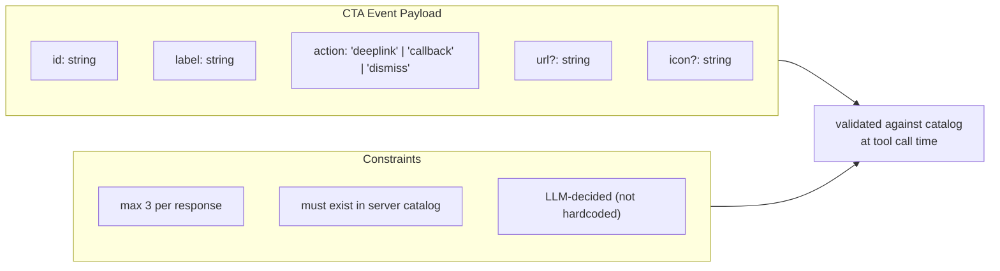

### CTA Stream Processor Placement

The CTA processor sits after the guardrail processor in the chain. This ordering matters: guardrails run first, so a p0 violation aborts the stream before any CTA events are emitted. A response that gets blocked never leaks CTAs.

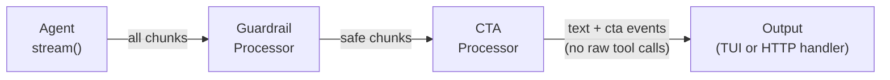

---

## Client SDK (CLIENT_SDK)

### Design Principles

The client SDK module is a framework-agnostic TypeScript package with zero runtime dependencies. It works in browsers and React Native. It doesn't import React, Vue, or any UI framework. Applications wrap it in whatever state management they use.

Zero dependencies is a hard constraint. Every feature — SSE parsing, reconnection, offline queuing, file uploads — is implemented from scratch using platform APIs.

For TypeScript consumers who want server-inferred route types, Eden Treaty (`@elysiajs/eden`) is available as an optional alternative client path. The primary SDK remains the client SDK module because it is zero-dependency and framework-agnostic, while Eden Treaty can provide auto-inferred types from `type App = typeof app` on Elysia servers.

### SSE Parsing and Typed Events

The client opens an SSE connection using the Fetch API with a streaming response body. It parses the event stream incrementally, dispatching typed events to registered callbacks as they arrive.

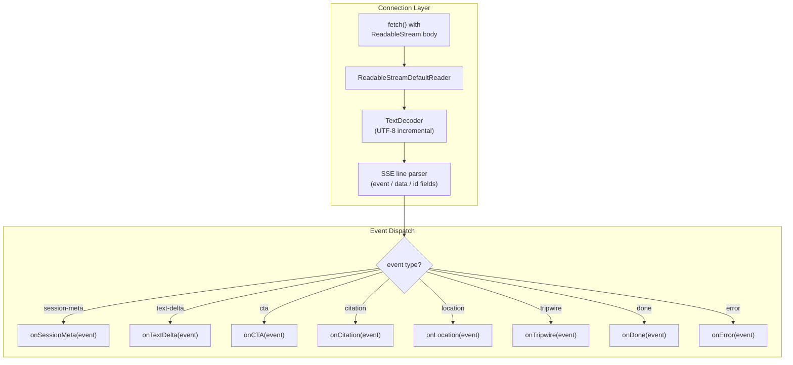

### Auto-Reconnection

The client reconnects automatically when the connection drops. It uses exponential backoff with jitter to avoid thundering herd on server restarts. The last SSE `id` field is sent as `Last-Event-ID` on reconnect so the server can resume from where it left off (if the server supports it).


### Offline Message Queue

When the network is unavailable, outbound messages (chat sends, feedback submissions) are held in an in-memory queue rather than failing immediately. When connectivity returns and the connection re-establishes, the queue drains in FIFO order.

The queue is bounded. When it reaches capacity, an `overflow` event fires and the oldest message is dropped. Applications can listen for overflow events to show a warning.

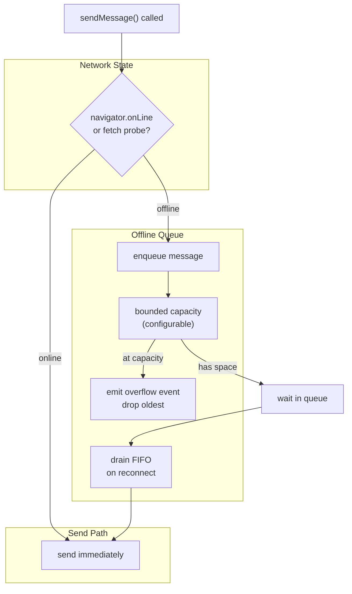

### File Upload Support

The client exposes a file upload method that posts files to the server's upload endpoint with the JWT bearer token attached. Upload progress is reported via a callback. The returned file reference (an ID or URL) can then be included in a subsequent chat message.

### Feedback Submission

The client stores the trace identifier from the most recent `session-meta` event. When the application calls the feedback submission method, the client attaches the stored trace identifier automatically. The application doesn't need to track trace IDs.

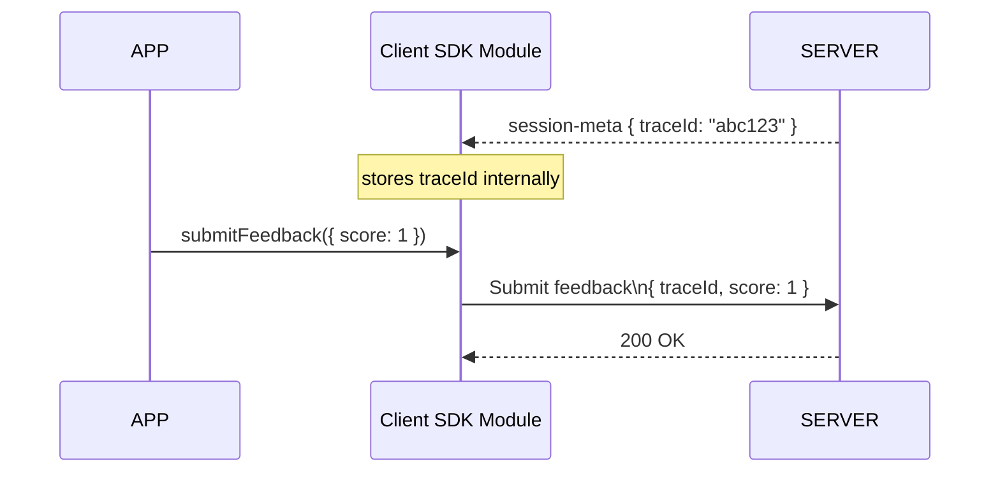

### JWT Auth

Every request the client makes — chat, upload, feedback — includes `Authorization: Bearer <token>`. The token is provided at construction time or via a refresh callback. When a refresh callback is provided, the client calls it before each request to get a fresh token, supporting short-lived JWTs without requiring the application to manage token lifecycle.

---

## SSE Event Type Reference

All event types are shared between the server (emitter) and the client (consumer). They're defined in safeagent and imported by the client SDK module at compile time.

| Event Type | Payload | Description |
|---|---|---|
| `session-meta` | Session metadata payload | First event on every stream. Carries trace and thread IDs. |
| `text-delta` | Text delta payload | Incremental text chunk from the LLM. |
| `trace-step` | Trace-step payload | Pipeline step visibility event. Only emitted when verbosity is `full`. Carries step type, step-specific data, and timing. |
| `cta` | CTA payload | Call-to-action suggestions from the CTA tool. |
| `citation` | Citation payload | Source citation metadata for grounded output. |
| `location` | Location payload | Location enrichment data for a place mentioned by the agent. Emitted progressively as places are geocoded and enriched. Client renders map pins and inline image galleries. |
| `tripwire` | Tripwire payload | Guardrail p0 violation. Stream ends after this. |
| `done` | Done payload | Stream completed normally. |
| `error` | Error payload | Unexpected error. Stream ends after this. |

For `location`, `type` is one of `city`, `neighborhood`, `restaurant`, `landmark`, `region`, or `country`. The image metadata object has the shape `{ url: string, thumbnail: string, attribution?: string, source?: string }`.

### SSESessionMetaEvent

```mermaid
classDiagram
    class SSE_SESSION_META_EVENT {
        type: "session-meta"
        traceId: string
        threadId: string
        agentId?: string
    }
```

### SSETextDeltaEvent

```mermaid
classDiagram
    class SSE_TEXT_DELTA_EVENT {
        type: "text-delta"
        delta: string
    }
```

### SSETraceStepEvent

```mermaid
classDiagram
    class SSE_TRACE_STEP_EVENT {
        type: "trace-step"
        step: TraceStepType
        data: TraceStepData
        latencyMs: number
        timestamp: number
    }

    class TRACE_STEP_TYPE {
        <<enumeration>>
        intent-detected
        memory-recall
        guardrail-input
        guardrail-output
        retrieval
        tool-call-start
        tool-call-end
        context-budget
        source-fetch
        rewrite
    }

    SSE_TRACE_STEP_EVENT --> TRACE_STEP_TYPE
```

The trace-step data payload is a discriminated union keyed by `step`. Each step type carries a step-specific payload described in the [Trace-Step Events](#trace-step-events) section.

### SSECTAEvent

```mermaid
classDiagram
    class SSECTA_EVENT {
        type: "cta"
        cta: CTA[]
    }
    class CTA {
        id: string
        label: string
        action: "deeplink" | "callback" | "dismiss"
        url?: string
        icon?: string
    }
    SSECTA_EVENT --> CTA
```

### SSECitationEvent

```mermaid
classDiagram
    class SSE_CITATION_EVENT {
        type: "citation"
        citation: Citation
    }
    class CITATION {
        source: string
        fileId?: string
        page?: number
        quote: string
        scope?: "thread" | "global"
        images?: ImageRef[]
    }
    class IMAGE_REF {
        url: string
        description: string
        imageIndex: number
        apiPath: string
    }
    CITATION --> IMAGE_REF
    SSE_CITATION_EVENT --> CITATION
```

### SSELocationEvent

```mermaid
classDiagram
    class SSE_LOCATION_EVENT {
        type: "location"
        location: LocationResult
    }
    SSE_LOCATION_EVENT --> LOCATION_RESULT
```

### SSETripwireEvent

```mermaid
classDiagram
    class SSE_TRIPWIRE_EVENT {
        type: "tripwire"
        conceptId: string
        reason: string
        fallbackMessage: string
    }
```

`conceptId` carries the canonical guardrail concept identifier. `reason` is a human-readable explanation mapped from that concept for client display.

### SSEDoneEvent

```mermaid
classDiagram
    class SSE_DONE_EVENT {
        type: "done"
    }
```

### SSEErrorEvent

```mermaid
classDiagram
    class SSE_ERROR_EVENT {
        type: "error"
        code: string
        message: string
    }
```

### SSE Payload Security

Structured SSE event payloads require validation at both the emit boundary on the server and the parse boundary on the client.

**Server-side emit validation**:
- Citation payloads validate URLs against trusted domains or user-owned document references. Arbitrary external URLs in citations are rejected to prevent URL-parameter exfiltration patterns.
- Location payloads validate coordinate ranges before emission. Location image URLs must come from the configured image provider rather than arbitrary sources.
- Trace-step payloads are sanitized so production streams do not leak internal system details through diagnostic data.

**Client-side parse validation**:
- All SSE event data is parsed with strict schema validation and unexpected fields are dropped.
- URLs in citation and location events are validated again before rendering. The client never navigates to or embeds URLs that do not match expected patterns.
- Text content in events is always treated as data and never interpolated as executable markup.

---

## Cross-References

| Document | Relationship |
|----------|-------------|
| **Requirements** ([01 — Requirements & Constraints](./01-requirements.md)) | Defines platform requirements, transport expectations, and frontend SDK requirements that this SSE boundary and client SDK must satisfy. |
| **Foundation** ([04 — Foundation](./04-foundation.md)) | Defines the SSE event type contracts (including SSETraceStepEvent and TraceStepType) consumed by this transport layer and the client SDK. |
| **Agents** ([06 — Agents & Orchestration](./06-agents.md)) | Defines orchestrator and processor-chain behavior, including location tool orchestration, that produces the framework stream event sequence consumed by this SSE transport layer. |
| **Guardrails & Safety** ([10 — Guardrails & Safety](./10-guardrails.md)) | Defines language drift detection in output sliding windows and p0 enforcement behavior used by this transport layer. |
| **Server Implementation** ([12 — Server Implementation](./12-server.md)) | Owns the Elysia route wiring, HTTP boundary, and verbosity parameter where this document's stream handler factory and SSE event protocol are applied. |
| **Observability** ([14 — Observability](./14-observability.md)) | Trace-step events share the trace identifier with Langfuse traces, providing real-time visibility that complements async post-hoc analysis. |
| **Frontend SDK** ([18 — Frontend SDK](./18-frontend-sdk.md)) | Consumes client SDK module events (including `trace-step`) and builds React hooks, web components, and React Native components on top of this transport layer. |
| **Demos** ([19 — Demos](./19-demos.md)) | Demo applications that exercise the full SSE protocol including trace-step events and verbosity toggle. |

---

## Task Specifications

---

### Task SSE_STREAMING: SSE Streaming Layer

**What to do**:

Build stream handler factory that turns internal agent stream output into a well-formed SSE response. This includes:

- Accepting an error-message mapping parameter from the server — a plain object mapping error codes to user-facing messages (string or function). Used by the error boundary to populate the `message` field in `error` SSE events.
- Extracting `userId` from the JWT auth context and combining it with `threadId` from the request body to form the request context object
- Inserting a `{ traceId, userId }` row into the `trace_owners` Postgres table before emitting the first SSE event (enables feedback ownership verification — see FEEDBACK_ENDPOINT)
- Calling the context provider DI hook to inject file context before invoking the agent
- Executing the agent with streaming enabled to get the internal async event stream
- Accepting a verbosity control parameter (`standard` or `full`) from the route handler. When `standard`, only user-facing events are emitted. When `full`, `trace-step` events are also emitted alongside user-facing events.
- Running the trace-step collector in the processor chain to capture pipeline milestone data (intent classification, guardrail verdicts, memory recall, retrieval results, tool execution, context budget) as `trace-step` data events
- Iterating internal framework stream events and mapping them to the nine SSE event types:
  - Raw model stream event (text delta) → `text-delta` SSE event
  - Run-item stream event with CTA-suggestion tool call → `cta` SSE event (tool chunks suppressed)
  - Run-item stream event with location-search tool call → `location` SSE event (tool chunks suppressed)
  - Citation metadata from tool results → `citation` SSE event
  - Pipeline milestones (from trace-step collector) → `trace-step` SSE events (only when verbosity is `full`)
  - Agent-updated stream event → logged for tracing (handoff routing)
  - Stream start → `session-meta` SSE event (first event, carries traceId + threadId)
  - Stream end → `done` SSE event
- Writing the stream through Elysia's SSE generator response path
- Running a keepalive interval that writes SSE comment lines to prevent proxy timeouts
- Catching framework guardrail tripwire exceptions and emitting a `tripwire` SSE event with `conceptId`, reason, and fallback message
- Catching all other errors, looking up the error code in the error-message mapping to get the user-facing message, and emitting an `error` SSE event with code and message fields
- Closing the stream cleanly in all exit paths

**Depends on**:

- AGENT_FACTORY (Agent Factory — internal execution must expose an async stream of framework events)
- INPUT_GUARD, OUTPUT_GUARD (Guardrail Processors — processor chain must be composable)
- SCAFFOLD_LIB (library scaffolding — `@openai/agents` + `@openai/agents-extensions` bridge packages installed)

**Acceptance Criteria**:

- The chat streaming endpoint returns a response with the SSE content type
- The first event on every stream is `session-meta` with non-empty trace identifier and `threadId`
- A `trace_owners` row is inserted before the first SSE event (traceId + userId)
- Text deltas arrive as `text-delta` events in order
- A `done` event closes the stream after normal completion
- A p0 guardrail violation produces a `tripwire` event and no further text deltas
- An unexpected thrown error produces an `error` event with a mapped user-facing message and closes the stream
- Error codes not in the map produce a generic fallback message
- Keepalive comment lines appear at the configured interval during long responses
- The TUI can consume the same processor chain output without going through the HTTP handler
- When verbosity is `full`, `trace-step` events are interleaved with user-facing events at their natural pipeline positions
- When verbosity is `standard`, zero `trace-step` events appear in the stream
- `userId` extracted from JWT is present in the agent's request context for every call

**QA Scenarios**:
- Normal chat response → `session-meta` → N × `text-delta` → `done`
- p0 guardrail on input → `session-meta` → `tripwire` (no text deltas)
- p0 guardrail mid-stream → `session-meta` → some `text-delta` → `tripwire` → stream closes
- Agent throws unexpected error → `session-meta` → `error` → stream closes
- Response takes 45 seconds → keepalive comments appear and connection stays open
- Context provider returns file content → agent receives file content prepended to messages
- Missing or invalid JWT → 401 before stream opens (auth middleware, not handler)
- Verbosity `full` → `trace-step` events interleaved with user-facing events showing pipeline activity
- Verbosity `standard` → zero `trace-step` events in stream, identical to pre-trace behavior
- Verbosity `full` with p0 guardrail → `trace-step` for `guardrail-input` appears, then `tripwire`, then stream closes

---

### Task CTA_STREAMING: CTA Streaming

**What to do**:

Build the CTA tool and stream processor pair:

- The CTA tool factory — takes a CTA catalog definition and returns a framework-compatible tool. The tool input is constrained by the catalog so the LLM can only reference valid CTA IDs. The tool execution returns the selected CTAs.
- The CTA stream processor factory — returns a stream processor that intercepts CTA-suggestion tool-call events, suppresses them from the output stream, and emits a `cta` data event in their place. All other chunks pass through unchanged.
- Define CTA data with `id`, `label`, `action` (`deeplink`, `callback`, or `dismiss`), and optional `url` and `icon` fields.
- Enforce the max-3-CTAs constraint at the tool schema level
- Document the catalog configuration shape for server authors

**Depends on**:

- AGENT_FACTORY (Agent Factory — agent must accept custom tools)
- CORE_TYPES (tool definition and stream processor type interfaces)

**Acceptance Criteria**:

- The CTA tool factory returns a valid framework-compatible tool
- The LLM cannot suggest a CTA ID that isn't in the catalog (schema validation rejects it)
- A response with CTAs produces exactly one `cta` SSE event
- No raw tool-call or tool-result events for CTA suggestion appear in the SSE stream
- A response without CTAs produces no `cta` event
- The processor passes all non-CTA chunks through without modification
- Guardrail processor runs before CTA processor — a blocked response emits no CTA events
- The catalog is defined in server config; the library has no hardcoded CTAs

**QA Scenarios**:
- LLM calls the CTA-suggestion tool with 2 valid CTAs → `cta` event has 2 items and no raw tool-call event appears
- LLM calls the CTA-suggestion tool with an invalid CTA ID → tool schema validation error and no `cta` event
- LLM calls the CTA-suggestion tool with 4 CTAs → schema rejects the call (max-3 constraint)
- Response has no CTA tool call → no `cta` event appears in the stream
- p0 guardrail fires before CTA tool call → `tripwire` event with no `cta` event
- Empty catalog passed to CTA tool factory → tool is created but the LLM has no valid CTA options to suggest

---

### Task CLIENT_SDK: Client SDK

**What to do**:

Build the client SDK module as a zero-dependency TypeScript package:

- SSE connection management using Fetch API streaming
- Incremental SSE line parser (handles chunked delivery, multi-line data fields)
- Typed event dispatch: register callbacks for each of the nine event types (including `trace-step`)
- `trace-step` event dispatch with step-type discrimination: the trace-step callback receives a discriminated union payload typed by `step` field, allowing consumers to handle each pipeline step differently
- Auto-reconnection with exponential backoff and jitter; respect `Last-Event-ID`
- Offline message queue: enabled via offline-queue config; queues send-message calls when offline; drains FIFO on reconnect; emits a client-local overflow callback (NOT an SSE event) when queue is full and drops oldest
- File upload: multipart upload request with progress callback; returns file reference
- Feedback submission: the feedback submission method attaches the stored trace identifier automatically
- JWT auth: accept token at construction or via async refresh callback
- Full TypeScript types for all events, config, and public methods
- No runtime dependencies — zero production dependencies

**Depends on**:

- SSE_STREAMING (SSE Streaming Layer — server must emit the event types the client parses)
- CTA_STREAMING (CTA Streaming — `cta` event type must be defined before client handles it)
- CORE_TYPES (shared SSE event type definitions)

**Acceptance Criteria**:

- Package installs with zero production dependencies
- All nine event types are handled with typed callbacks (including `trace-step`)
- Session-meta callback fires before text-delta callback on every stream
- The trace identifier from `session-meta` is stored and attached to feedback submission automatically
- Connection drops trigger reconnection with backoff; `Last-Event-ID` is sent
- Send-message calls while offline enqueue the message; it sends after reconnect
- Queue overflow fires the overflow callback and drops the oldest message
- File upload reports progress via callback and returns a file reference
- JWT refresh callback is called before each request
- Works in browser (Bun-compatible web APIs only in the main bundle)
- TypeScript strict mode passes with no errors

**QA Scenarios**:
- Normal stream → session-meta callback → N × text-delta callback → done callback
- Server sends `tripwire` → tripwire callback fires with `conceptId`, reason, and fallback message text
- Server sends `cta` → CTA callback fires with a typed CTA array
- Server sends `citation` → citation callback fires with typed source citation data
- Server sends `location` → location callback fires with typed place, coordinates, and image metadata
- Server sends `trace-step` (verbosity full) → trace-step callback fires with discriminated union payload; step type and step-specific data are fully typed
- Connection drops mid-stream → client reconnects with backoff and sends `Last-Event-ID`
- Max retries exceeded → error callback fires and no further reconnect attempts are made
- Send-message call while offline → message is queued and sent after reconnect
- Queue reaches max size → overflow callback fires and oldest message is dropped
- Feedback submission after stream → request includes trace identifier from the last `session-meta`
- JWT refresh callback provided → callback runs before each request and fresh token is used
- File upload → progress callback fires and a file reference is returned on completion

---

*Previous: [10 — Guardrails & Safety](./10-guardrails.md) | Next: [12 — Server Implementation](./12-server.md)*
