# 11 — Streaming & Transport

> **Scope**: SSE streaming pipeline, custom SSE event protocol boundary, CTA tool streaming, and the `@safeagent/client` SDK.
>
> **Tasks**: SSE_STREAMING (SSE Streaming Layer), CTA_STREAMING (CTA Streaming), CLIENT_SDK (Client SDK)

---

## Table of Contents

- [Architecture Overview](#architecture-overview)
- [SSE Streaming Layer (SSE_STREAMING)](#sse-streaming-layer-ssestreaming)
- [Stream Format Boundary](#stream-format-boundary)
- [Session Metadata Delivery](#session-metadata-delivery)
- [CTA Streaming (CTA_STREAMING)](#cta-streaming-ctastreaming)
- [Client SDK (CLIENT_SDK)](#client-sdk-clientsdk)
- [SSE Event Type Reference](#sse-event-type-reference)
- [Cross-References](#cross-references)
- [Task Specifications](#task-specifications)

---

## Architecture Overview

The streaming system keeps `@openai/agents` `RunStreamEvent` items internal to the safeagent library. At the HTTP boundary, `createStreamHandler` iterates `Runner.run()` stream output and translates framework events into a custom named-event SSE protocol (`session-meta`, `text-delta`, `cta`, `citation`, `location`, `tripwire`, `done`, `error`) designed for `@safeagent/client` and other SSE consumers.

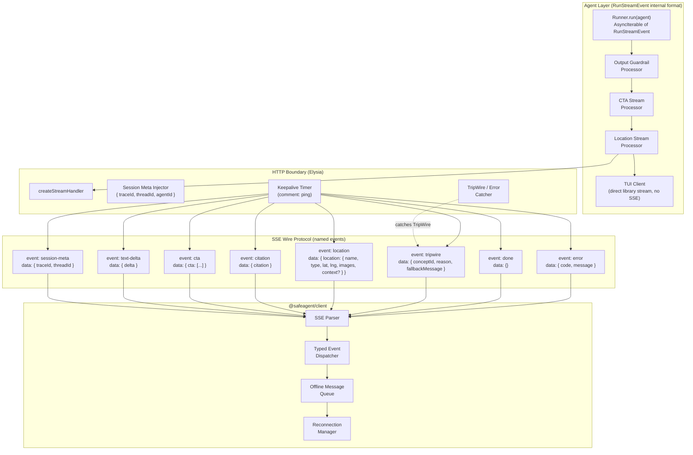

---

## SSE Streaming Layer (SSE_STREAMING)

### createStreamHandler

`createStreamHandler` is an Elysia route handler factory exported by the library. It wires together every concern that touches the HTTP streaming path: context injection, `Runner.run()` invocation, `RunStreamEvent` → SSE translation, keepalive, and error handling. The server registers it as a route and configures auth middleware; the library owns all the streaming logic inside. The library also exports the underlying framework-agnostic stream processing primitives for non-Elysia consumers (e.g., tests, TUI).

The handler calls `Runner.run(agent, input, { stream: true })` which returns `AsyncIterable<RunStreamEvent>`. Event types include `raw_model_stream_event` (text deltas), `run_item_stream_event` (tool calls, messages, handoffs), and `agent_updated_stream_event` (agent switches via handoff). The handler maps these to the eight SSE event types. Framework guardrail exceptions (`InputGuardrailTripwireTriggered`, `OutputGuardrailTripwireTriggered`) are caught at the boundary and emitted as `tripwire` SSE events.

The factory accepts an `errorMessageMap` parameter — a plain object keyed by error code string, where values are either a static message string or a function `(metadata) => string` for dynamic messages. When the handler catches an error and emits an `error` SSE event, it looks up the error's code in this map to populate the `message` field. If the code is not in the map, a generic fallback message is used. The server passes its error message map (defined in [12 — Server Implementation](./12-server.md)) when constructing the handler. This is the DI mechanism that keeps the library language-agnostic while letting the server control user-facing tone.

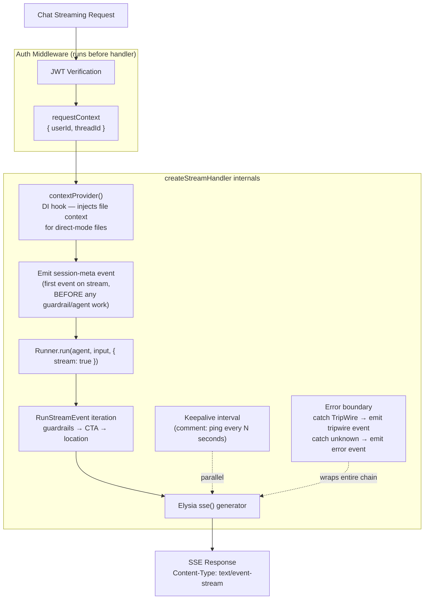

### contextProvider DI Hook

The server passes a `contextProvider` function when constructing the handler. The function signature is:

**`contextProvider: (ctx: { userId: string, threadId: string, messageId: string }) => Promise<AdditionalContext | null>`**

Where `AdditionalContext` is `{ role: 'system', content: string | MessageContentPart[] }[]` — an array of message objects to prepend to the agent's message list. Returning `null` or an empty array means no additional context is injected.

Its primary use is injecting file context in direct mode, where the user has uploaded files that should be visible to the agent without going through the full RAG pipeline. The server implements the function to fetch file content from storage, read from a local cache, or return nothing based on whether the request includes file references.

The hook is dependency-injected so the library stays agnostic about how the server resolves files. The agent never knows the difference.

### userId Flow

The JWT auth lifecycle hook extracts `userId` from the bearer token and attaches it to Elysia context via `derive` or `resolve`. `createStreamHandler` reads `userId` from context and passes it into the agent call via `requestContext` along with the `threadId` from the request body. The agent and all its tools receive `userId` through this channel. Nothing in the library reads `userId` from anywhere else.

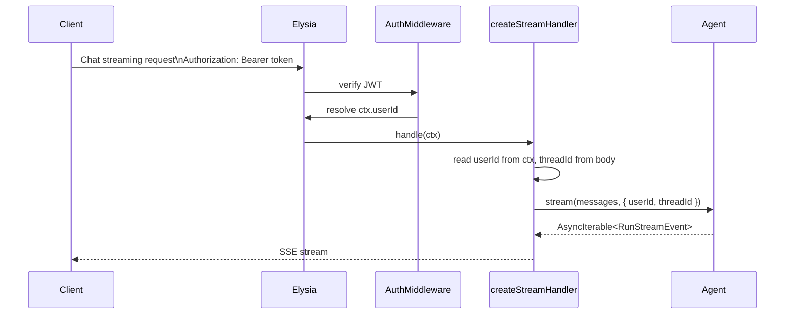

### Keepalive

Proxies and load balancers close idle connections after a timeout, typically 30 to 60 seconds. Long-running agent calls can easily exceed this. The handler starts a keepalive interval that writes SSE comment lines (`": ping"`) on a fixed cadence. Comment lines are valid SSE but carry no data, so the client ignores them. The interval is cleared when the stream ends or errors.

### Error Handling

Two error types get special treatment at the HTTP boundary:

- **TripWire**: thrown by the guardrail system when a p0 input violation is detected, or when a p0 output violation is detected in development mode. The handler catches it, stops the stream, and emits a `tripwire` SSE event containing `conceptId`, `reason`, and a fallback message. `reason` is the user-facing message, while `conceptId` is the canonical guardrail concept identifier. In production mode, output p0 violations do NOT throw TripWire — they suppress remaining chunks and inject a fallback as a normal `text-delta` event (see [10 — Guardrails & Safety](./10-guardrails.md) for details).
- **Unknown errors**: anything else becomes a generic `error` SSE event. The stream closes cleanly rather than dropping the connection mid-response.

The output sliding window used by output guardrails also runs eld language detection on accumulated text. When LanguageGuardConfig.supportedLanguages is configured and eld detects output drift into an unsupported language, the output guardrail returns p0 and the stream follows the same tripwire or suppress-and-fallback path as any other output guardrail violation. This acts as the final safety net for cases where input passed earlier checks but generated output drifts into an unsupported language.

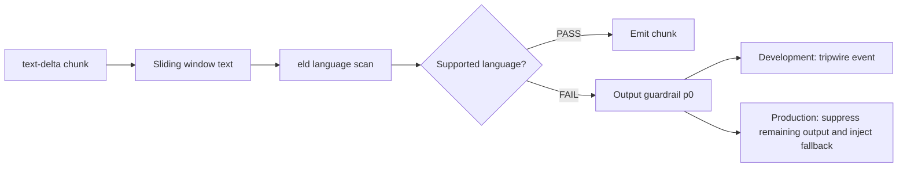

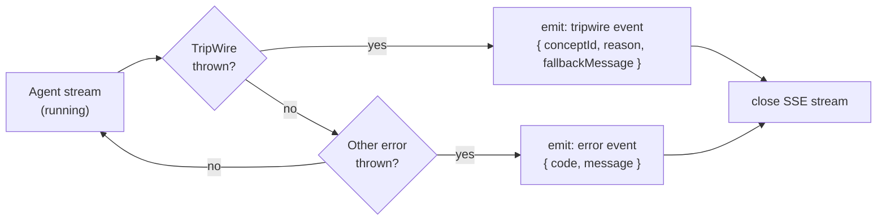

---

## Stream Format Boundary

This is the most important invariant in the entire streaming system.

**`RunStreamEvent` items (produced by `Runner.run()`) are used inside the library. The HTTP transport emits a custom named-event SSE protocol for external clients.**

The TUI consumes the library stream directly (no SSE). Tests against the agent layer use `RunStreamEvent` items directly. The HTTP handler maps those events to custom SSE events for network transport. This means:

- Adding a new stream processor updates one internal stream path, while external clients still receive stable named SSE events.
- The TUI and the HTTP path share the same processor chain, so behavior is identical.
- Internal `RunStreamEvent` items and external SSE event names are intentionally separated by the transport boundary.

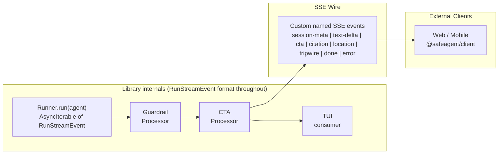

The wire protocol is custom SSE named events, not any framework-specific data format. `@safeagent/client` parses these events directly.

Location enrichment events are emitted during the live stream, never batched at the end. A single response can emit multiple `location` events, typically one per detected place. The underlying `search_locations` tool-call and tool-result chunks are suppressed from the outbound SSE stream using a `createLocationStreamProcessor` that mirrors the CTA suppression pattern, and only the clean `location` event payload is emitted to clients. When no image provider is configured, each `location` event still includes `lat` and `lng`, and `images` is emitted as an empty array.

---

## Session Metadata Delivery

Every stream starts with a `session-meta` event before any text delta arrives. This event carries the identifiers the client needs to correlate the stream with backend records.


The `traceId` is a server-generated UUID created before the agent run begins and passed to Langfuse as the trace identifier. The `threadId` is the conversation thread ID for the conversation. The `agentId` is optional and identifies which agent handled the request when the server runs multiple agents.

The client SDK stores `traceId` automatically so feedback submissions (thumbs up/down) can attach it without the application code tracking it manually.

### trace_owners Table Schema

The `trace_owners` Postgres table (managed by Drizzle ORM) enables feedback ownership verification. `createStreamHandler` inserts a row before emitting the first SSE event; the feedback endpoint queries it to confirm the requesting user owns the trace. The Drizzle schema for this table is owned by SSE_STREAMING — it is defined and migrated as part of that task.

| Column | Type | Constraints |
|--------|------|-------------|
| traceId | text | PRIMARY KEY |
| userId | text | NOT NULL |
| createdAt | timestamp | NOT NULL, DEFAULT now() |

No additional indexes beyond the primary key — lookups are always by `traceId`.

---

## CTA Streaming (CTA_STREAMING)

### What CTAs Are

Call-to-action suggestions are structured UI hints the agent can emit alongside its text response. They're not hardcoded responses — the LLM decides when to suggest them based on conversation context. A CTA might be a deeplink to a relevant screen, a callback action the app handles, or a dismiss button.

Each CTA has: `id`, `label`, `action` (one of `deeplink`, `callback`, or `dismiss`), optional `url`, and optional `icon`. A response carries at most three CTAs.

### createCTATool

The server defines a CTA catalog in its config: a list of available CTAs with their IDs, labels, and actions. The library's `createCTATool` factory takes that catalog and returns a framework-compatible tool the agent can call. The tool's input schema is derived from the catalog so the LLM can only suggest CTAs that actually exist.

The server owns the catalog. The library owns the tool mechanics. This separation means adding a new CTA to the server config automatically makes it available to the agent without touching library code.

### CTA Tool Flow

The key behavior: tool-call events are suppressed from the SSE stream. The client never sees a raw tool call. Instead, the stream processor intercepts the tool invocation, extracts the CTA data, and emits a clean `cta` event.

```mermaid
flowchart TB
    LLM["LLM decides to\nsuggest CTAs"]
    TOOL_CALL["suggest_cta tool call\n(RunStreamEvent)"]
    PROC["createCTAStreamProcessor\n(stream processor)"]

    subgraph Decision["Processor decision"]
        IS_CTA{"is suggest_cta\ntool call?"}
        SUPPRESS["suppress tool-call\nevent from stream"]
        EMIT_CTA["emit cta event\nevent: cta\ndata: {\"cta\":[...]}"]
        PASS["pass chunk\nthrough unchanged"]
    end

    CLIENT["Client receives\nclean cta event"]

    LLM --> TOOL_CALL --> PROC
    PROC --> IS_CTA
    IS_CTA -->|yes| SUPPRESS --> EMIT_CTA --> CLIENT
    IS_CTA -->|no| PASS --> CLIENT
```

### CTA Event Format

The CTA event is emitted as a custom named SSE event. The handler writes `event: cta` and a JSON payload in the `data:` line with a `cta` key.

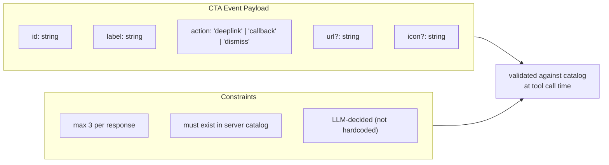

### CTA Stream Processor Placement

The CTA processor sits after the guardrail processor in the chain. This ordering matters: guardrails run first, so a p0 violation aborts the stream before any CTA events are emitted. A response that gets blocked never leaks CTAs.

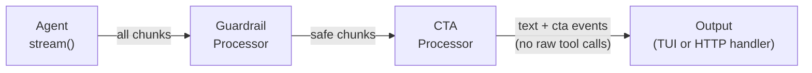

---

## Client SDK (CLIENT_SDK)

### Design Principles

`@safeagent/client` is a framework-agnostic TypeScript package with zero runtime dependencies. It works in browsers and React Native. It doesn't import React, Vue, or any UI framework. Applications wrap it in whatever state management they use.

Zero dependencies is a hard constraint. Every feature — SSE parsing, reconnection, offline queuing, file uploads — is implemented from scratch using platform APIs.

For TypeScript consumers who want server-inferred route types, Eden Treaty (`@elysiajs/eden`) is available as an optional alternative client path. The primary SDK remains `@safeagent/client` because it is zero-dependency and framework-agnostic, while Eden Treaty can provide auto-inferred types from `type App = typeof app` on Elysia servers.

### SSE Parsing and Typed Events

The client opens an SSE connection using the Fetch API with a streaming response body. It parses the event stream incrementally, dispatching typed events to registered callbacks as they arrive.

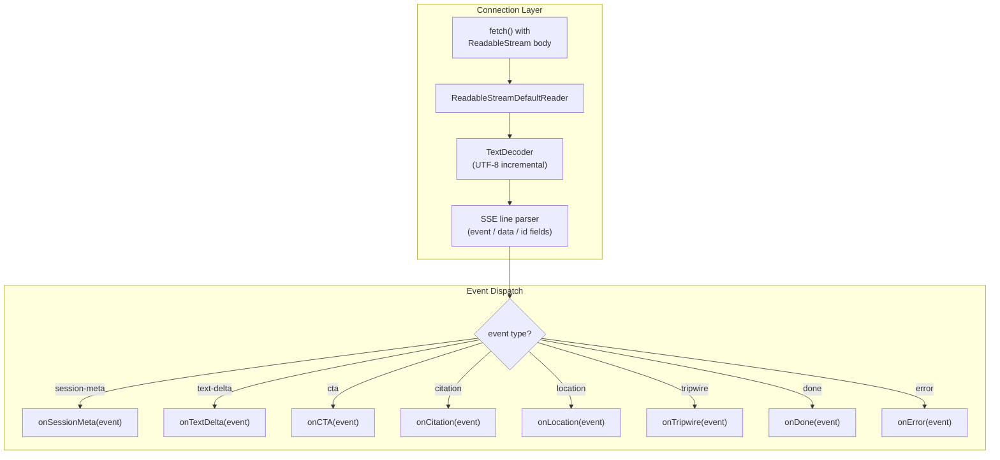

### Auto-Reconnection

The client reconnects automatically when the connection drops. It uses exponential backoff with jitter to avoid thundering herd on server restarts. The last SSE `id` field is sent as `Last-Event-ID` on reconnect so the server can resume from where it left off (if the server supports it).

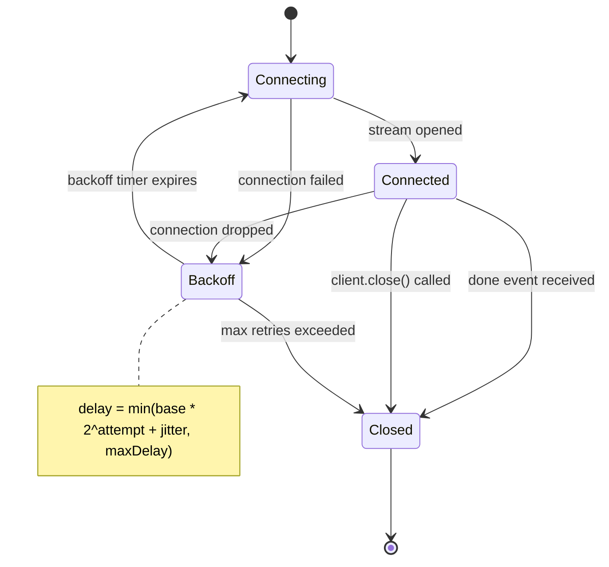

### Offline Message Queue

When the network is unavailable, outbound messages (chat sends, feedback submissions) are held in an in-memory queue rather than failing immediately. When connectivity returns and the connection re-establishes, the queue drains in FIFO order.

The queue is bounded. When it reaches capacity, an `overflow` event fires and the oldest message is dropped. Applications can listen for overflow events to show a warning.

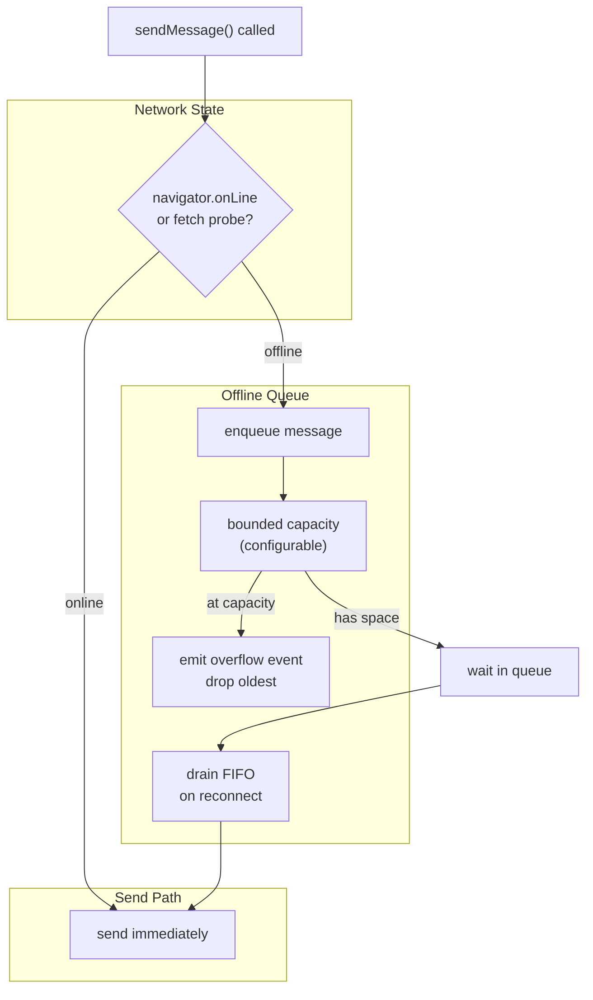

### File Upload Support

The client exposes a file upload method that posts files to the server's upload endpoint with the JWT bearer token attached. Upload progress is reported via a callback. The returned file reference (an ID or URL) can then be included in a subsequent chat message.

### Feedback Submission

The client stores the `traceId` from the most recent `session-meta` event. When the application calls `submitFeedback`, the client attaches the stored `traceId` automatically. The application doesn't need to track trace IDs.

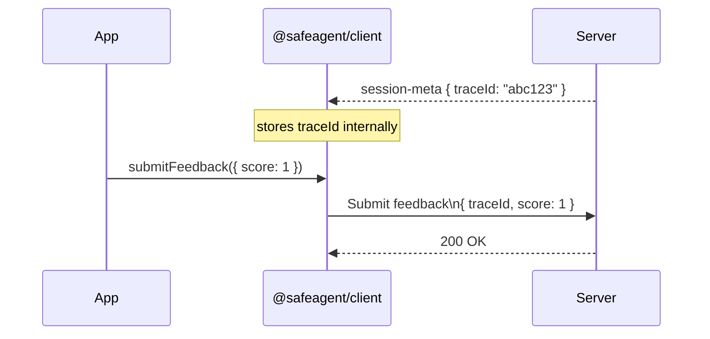

### JWT Auth

Every request the client makes — chat, upload, feedback — includes `Authorization: Bearer <token>`. The token is provided at construction time or via a refresh callback. When a refresh callback is provided, the client calls it before each request to get a fresh token, supporting short-lived JWTs without requiring the application to manage token lifecycle.

---

## SSE Event Type Reference

All event types are shared between the server (emitter) and the client (consumer). They're defined in safeagent and imported by `@safeagent/client` at compile time.

| Event Type | Payload | Description |
|---|---|---|
| `session-meta` | `SSESessionMetaEvent` | First event on every stream. Carries trace and thread IDs. |
| `text-delta` | `SSETextDeltaEvent` | Incremental text chunk from the LLM. |
| `cta` | `SSECTAEvent` | Call-to-action suggestions from the CTA tool. |
| `citation` | `SSECitationEvent` | Source citation metadata for grounded output. |
| `location` | `SSELocationEvent` | Location enrichment data for a place mentioned by the agent. Emitted progressively as places are geocoded and enriched. Client renders map pins and inline image galleries. |
| `tripwire` | `SSETripwireEvent` | Guardrail p0 violation. Stream ends after this. |
| `done` | `SSEDoneEvent` | Stream completed normally. |
| `error` | `SSEErrorEvent` | Unexpected error. Stream ends after this. |

For `location`, `type` is one of `city`, `neighborhood`, `restaurant`, `landmark`, `region`, or `country`. `ImageResult` has the shape `{ url: string, thumbnail: string, attribution?: string, source?: string }`.

### SSESessionMetaEvent

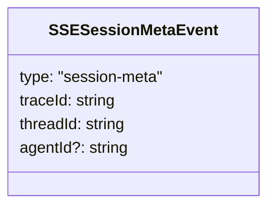

### SSETextDeltaEvent

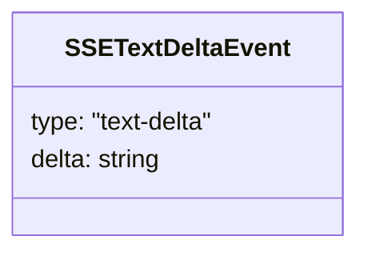

### SSECTAEvent

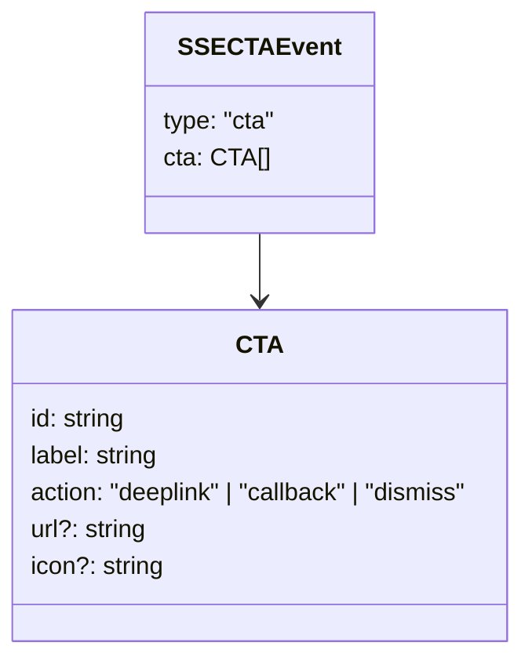

### SSECitationEvent

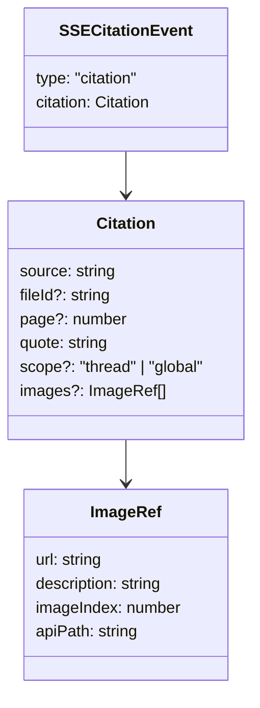

### SSELocationEvent

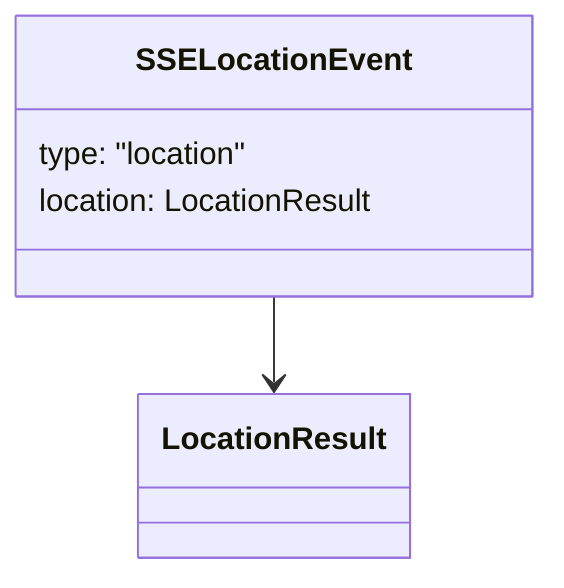

### SSETripwireEvent

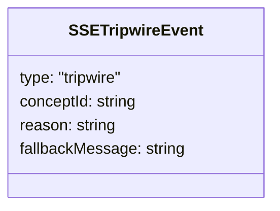

`conceptId` carries the canonical guardrail concept identifier. `reason` is a human-readable explanation mapped from that concept for client display.

### SSEDoneEvent

```mermaid
classDiagram
    class SSEDoneEvent {
        type: "done"
    }
```

### SSEErrorEvent

```mermaid
classDiagram
    class SSEErrorEvent {
        type: "error"
        code: string
        message: string
    }
```

---

## Cross-References

| Document | Relationship |
|----------|-------------|
| **Requirements** ([01](./01-requirements.md)) | Defines platform requirements and transport expectations that this SSE boundary and client SDK must satisfy. |
| **Agents** ([06](./06-agents.md)) | Defines orchestrator and processor-chain behavior, including location tool orchestration, that produces the `RunStreamEvent` stream consumed by this SSE transport layer. |
| **Guardrails & Safety** ([10](./10-guardrails.md)) | Defines language drift detection in output sliding windows and p0 enforcement behavior used by this transport layer. |
| **Server Implementation** ([12](./12-server.md)) | Owns the Elysia route wiring and HTTP boundary where this document's `createStreamHandler` and SSE event protocol are applied. |

---

## Task Specifications

---

### Task SSE_STREAMING: SSE Streaming Layer

**What to do**:

Build `createStreamHandler`, the Elysia handler factory that turns `Runner.run()` output into a well-formed SSE response. This includes:

- Accepting an `errorMessageMap` parameter from the server — a plain object mapping error codes to user-facing messages (string or function). Used by the error boundary to populate the `message` field in `error` SSE events.
- Extracting `userId` from the JWT auth context and combining it with `threadId` from the request body to form `requestContext`
- Inserting a `{ traceId, userId }` row into the `trace_owners` Postgres table before emitting the first SSE event (enables feedback ownership verification — see FEEDBACK_ENDPOINT)
- Calling the `contextProvider` DI hook to inject file context before invoking the agent
- Calling `Runner.run(agent, input, { stream: true })` to get `AsyncIterable<RunStreamEvent>`
- Iterating `RunStreamEvent` items and mapping them to the eight SSE event types:
  - `raw_model_stream_event` (text delta) → `text-delta` SSE event
  - `run_item_stream_event` with tool call for `suggest_cta` → `cta` SSE event (tool chunks suppressed)
  - `run_item_stream_event` with tool call for `search_locations` → `location` SSE event (tool chunks suppressed)
  - Citation metadata from tool results → `citation` SSE event
  - `agent_updated_stream_event` → logged for tracing (handoff routing)
  - Stream start → `session-meta` SSE event (first event, carries traceId + threadId)
  - Stream end → `done` SSE event
- Writing the stream through Elysia's `sse()` generator response path
- Running a keepalive interval that writes SSE comment lines to prevent proxy timeouts
- Catching `InputGuardrailTripwireTriggered` / `OutputGuardrailTripwireTriggered` exceptions (from framework guardrails) and emitting a `tripwire` SSE event with `conceptId`, reason, and fallback message
- Catching all other errors, looking up the error code in `errorMessageMap` to get the user-facing message, and emitting an `error` SSE event with `{ code, message }`
- Closing the stream cleanly in all exit paths

**Depends on**:

- AGENT_FACTORY (Agent Factory — `Runner.run()` must return `AsyncIterable<RunStreamEvent>`)
- INPUT_GUARD, OUTPUT_GUARD (Guardrail Processors — processor chain must be composable)
- SCAFFOLD_LIB (library scaffolding — `@openai/agents` + `@openai/agents-extensions` bridge packages installed)

**Acceptance Criteria**:

- The chat streaming endpoint returns `Content-Type: text/event-stream`
- The first event on every stream is `session-meta` with non-empty `traceId` and `threadId`
- A `trace_owners` row is inserted before the first SSE event (traceId + userId)
- Text deltas arrive as `text-delta` events in order
- A `done` event closes the stream after normal completion
- A p0 guardrail violation produces a `tripwire` event and no further text deltas
- An unexpected thrown error produces an `error` event with a `message` from the `errorMessageMap` and closes the stream
- Error codes not in the map produce a generic fallback message
- Keepalive comment lines appear at the configured interval during long responses
- The TUI can consume the same processor chain output without going through the HTTP handler
- `userId` extracted from JWT is present in the agent's `requestContext` for every call

**QA Scenarios**:
- Normal chat response → `session-meta` → N × `text-delta` → `done`
- p0 guardrail on input → `session-meta` → `tripwire` (no text deltas)
- p0 guardrail mid-stream → `session-meta` → some `text-delta` → `tripwire` → stream closes
- Agent throws unexpected error → `session-meta` → `error` → stream closes
- Response takes 45 seconds → keepalive comments appear and connection stays open
- `contextProvider` returns file content → agent receives file content prepended to messages
- Missing or invalid JWT → 401 before stream opens (auth middleware, not handler)

---

### Task CTA_STREAMING: CTA Streaming

**What to do**:

Build the CTA tool and stream processor pair:

- The `createCTATool` factory — takes a `CTACatalog` (array of `CTA` definitions) and returns a framework-compatible tool. The tool's input schema is derived from the catalog so the LLM can only reference valid CTA IDs. The tool's execute function returns the selected CTAs.
- The `createCTAStreamProcessor` factory — returns a stream processor that intercepts `suggest_cta` tool-call events, suppresses them from the output stream, and emits a `cta` data event in their place. All other chunks pass through unchanged.
- Define the `CTA` type: `{ id, label, action: 'deeplink' | 'callback' | 'dismiss', url?, icon? }`
- Enforce the max-3-CTAs constraint at the tool schema level
- Document the catalog configuration shape for server authors

**Depends on**:

- AGENT_FACTORY (Agent Factory — agent must accept custom tools)
- CORE_TYPES (tool definition and stream processor type interfaces)

**Acceptance Criteria**:

- The `createCTATool` factory returns a valid framework-compatible tool
- The LLM cannot suggest a CTA ID that isn't in the catalog (schema validation rejects it)
- A response with CTAs produces exactly one `cta` SSE event
- No `tool-call` or `tool-result` events for `suggest_cta` appear in the SSE stream
- A response without CTAs produces no `cta` event
- The processor passes all non-CTA chunks through without modification
- Guardrail processor runs before CTA processor — a blocked response emits no CTA events
- The catalog is defined in server config; the library has no hardcoded CTAs

**QA Scenarios**:
- LLM calls `suggest_cta` with 2 valid CTAs → `cta` event has 2 items and no raw tool-call event appears
- LLM calls `suggest_cta` with an invalid CTA ID → tool schema validation error and no `cta` event
- LLM calls `suggest_cta` with 4 CTAs → schema rejects the call (max-3 constraint)
- Response has no CTA tool call → no `cta` event appears in the stream
- p0 guardrail fires before CTA tool call → `tripwire` event with no `cta` event
- Empty catalog passed to `createCTATool` → tool is created but the LLM has no valid CTA options to suggest

---

### Task CLIENT_SDK: Client SDK

**What to do**:

Build `@safeagent/client`, a zero-dependency TypeScript package:

- SSE connection management using Fetch API streaming
- Incremental SSE line parser (handles chunked delivery, multi-line data fields)
- Typed event dispatch: register callbacks for each event type
- Auto-reconnection with exponential backoff and jitter; respect `Last-Event-ID`
- Offline message queue: enabled via `offline: { enabled: true, maxQueueSize: N }` config; queues `sendMessage` calls when offline; drains FIFO on reconnect; emits a client-local `overflow` callback (NOT an SSE event) when queue is full and drops oldest
- File upload: multipart POST with progress callback; returns file reference
- Feedback submission: `submitFeedback` — attaches stored `traceId` automatically
- JWT auth: accept token at construction or via async refresh callback
- Full TypeScript types for all events, config, and public methods
- No runtime dependencies — zero production dependencies

**Depends on**:

- SSE_STREAMING (SSE Streaming Layer — server must emit the event types the client parses)
- CTA_STREAMING (CTA Streaming — `cta` event type must be defined before client handles it)
- CORE_TYPES (shared SSE event type definitions)

**Acceptance Criteria**:

- Package installs with zero production dependencies
- All eight event types are handled with typed callbacks
- `onSessionMeta` fires before `onTextDelta` on every stream
- `traceId` from `session-meta` is stored and attached to `submitFeedback` automatically
- Connection drops trigger reconnection with backoff; `Last-Event-ID` is sent
- `sendMessage` while offline enqueues the message; it sends after reconnect
- Queue overflow fires `onOverflow` and drops the oldest message
- File upload reports progress via callback and returns a file reference
- JWT refresh callback is called before each request
- Works in browser (Bun-compatible web APIs only in the main bundle)
- TypeScript strict mode passes with no errors

**QA Scenarios**:
- Normal stream → `onSessionMeta` → N × `onTextDelta` → `onDone`
- Server sends `tripwire` → `onTripwire` fires with `conceptId`, reason, and `fallbackMessage`
- Server sends `cta` → `onCTA` fires with a typed CTA array
- Server sends `citation` → `onCitation` fires with typed source citation data
- Server sends `location` → `onLocation` fires with typed place, coordinates, and image metadata
- Connection drops mid-stream → client reconnects with backoff and sends `Last-Event-ID`
- Max retries exceeded → `onError` fires and no further reconnect attempts are made
- `sendMessage` while offline → message is queued and sent after reconnect
- Queue reaches `maxQueueSize` → `onOverflow` fires and oldest message is dropped
- `submitFeedback` after stream → POST includes `traceId` from the last `session-meta`
- JWT refresh callback provided → callback runs before each request and fresh token is used
- File upload → progress callback fires and a file reference is returned on completion

---

*Previous: [10 — Guardrails & Safety](./10-guardrails.md) | Next: [12 — Server Implementation](./12-server.md)*
