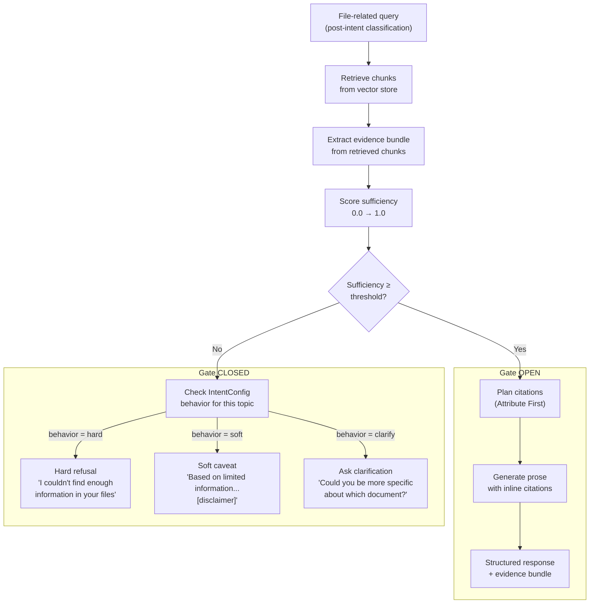
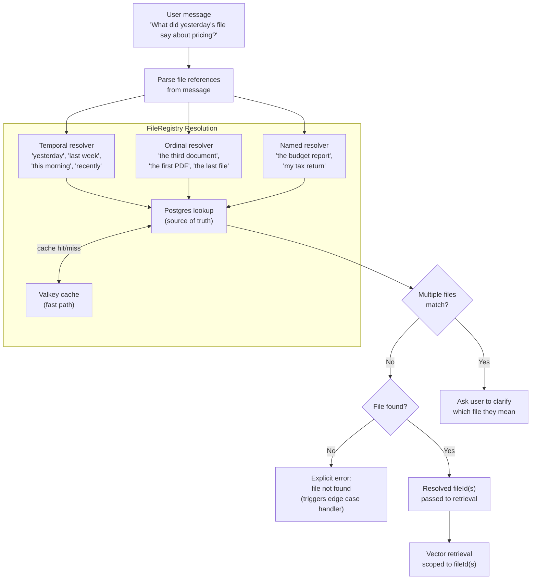
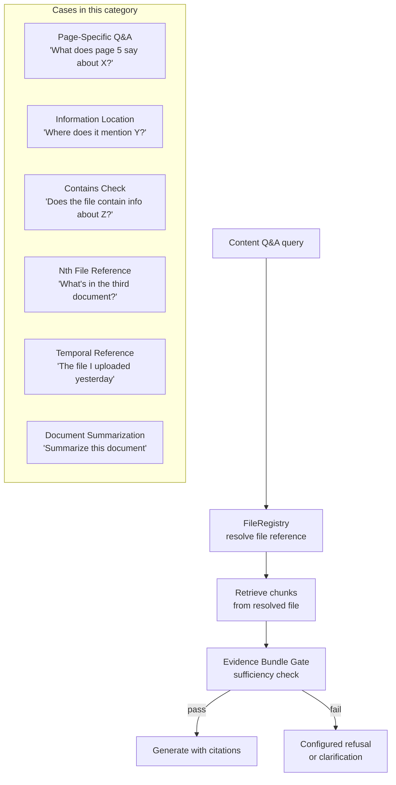
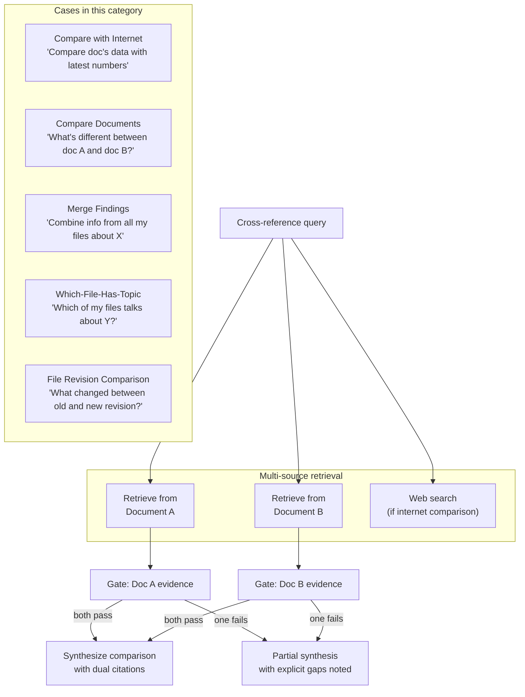
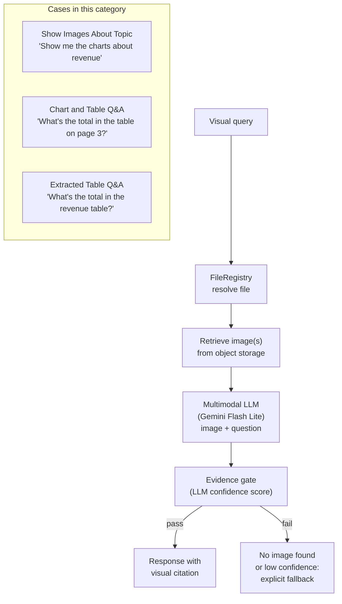
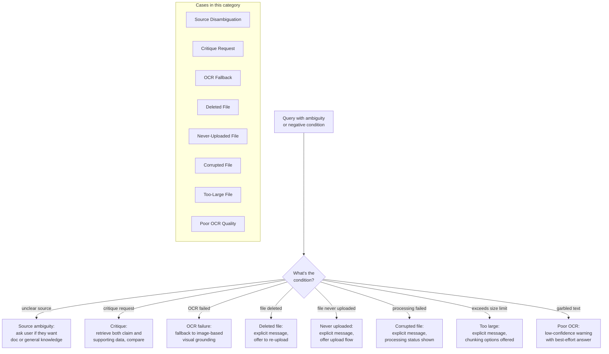
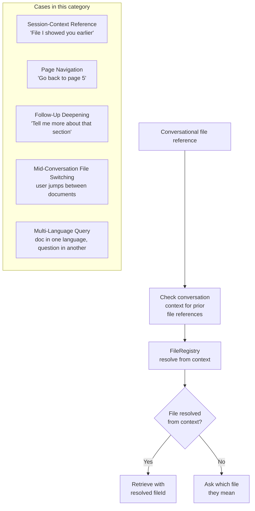
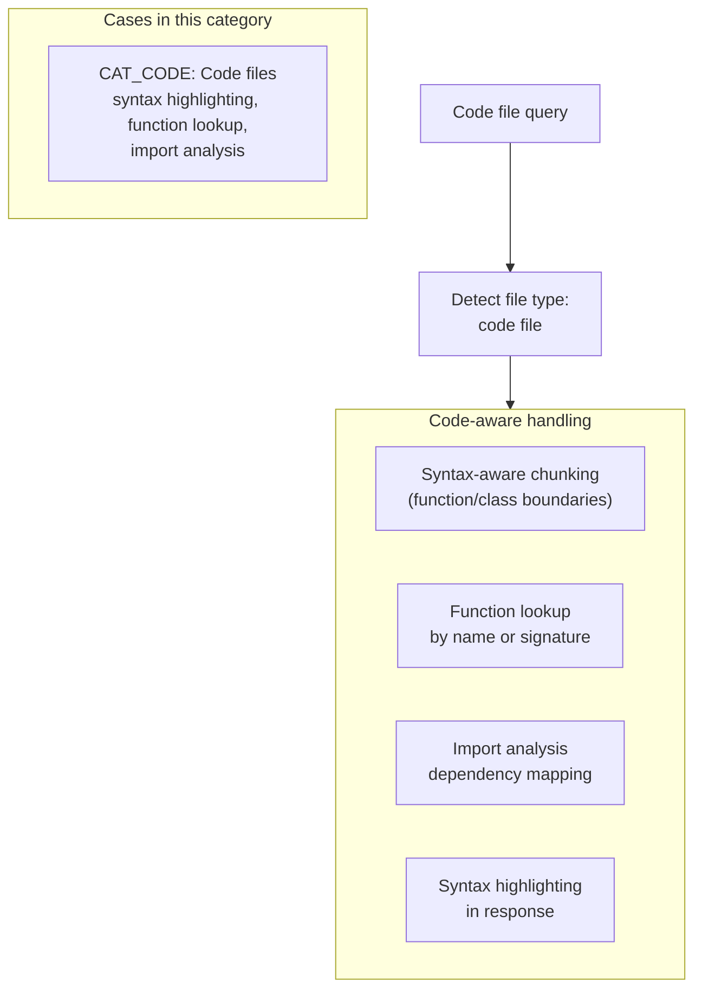
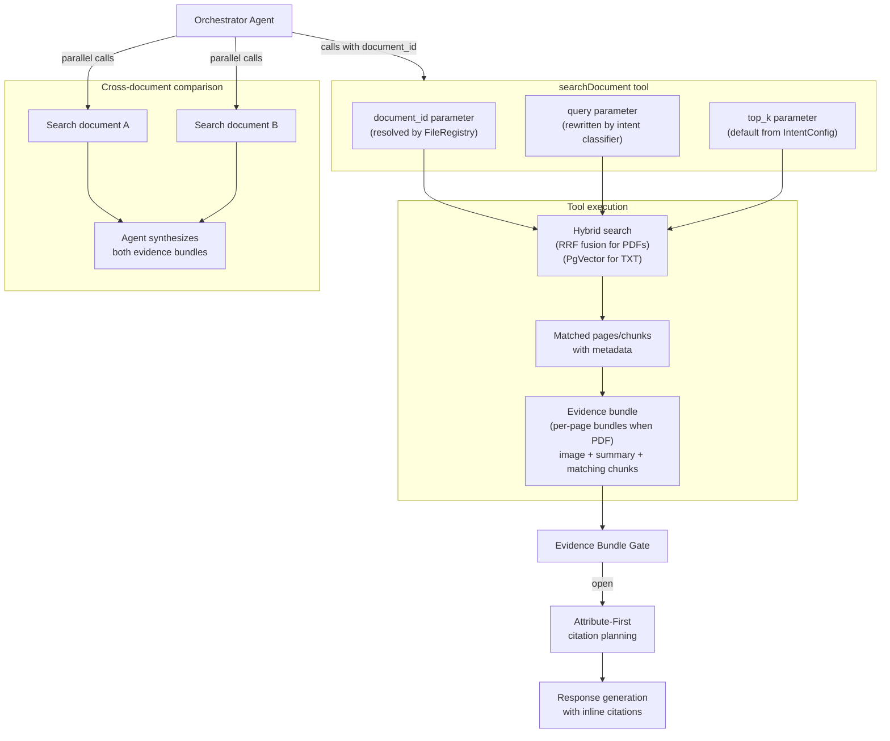
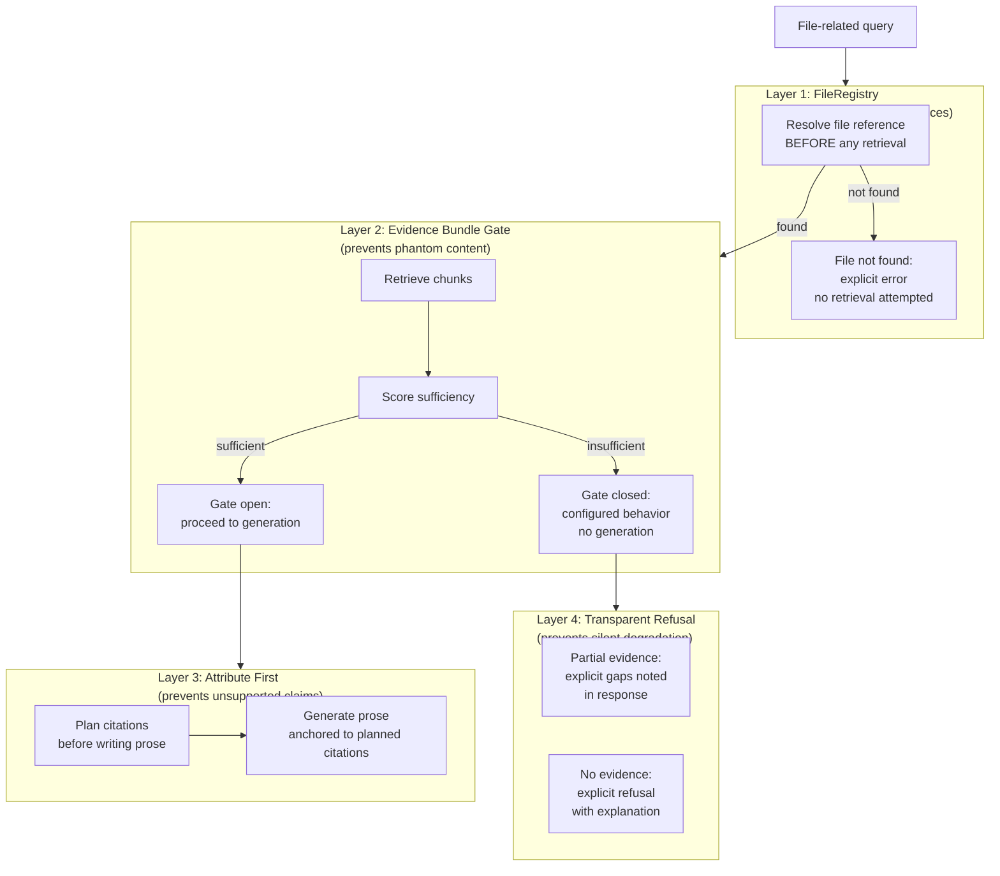

# 12 — File Intelligence

> **Scope**: FileRegistry, Evidence Bundle Gate, 28 file edge cases, visual grounding, per-document search, and anti-hallucination architecture.
>
> **Why this document exists**: File-related queries are the highest-risk surface for hallucination. Without structural enforcement, the agent will confidently fabricate page numbers, quote text that doesn't exist, and reference files the user never uploaded. This document defines the architecture that makes that impossible.

---

## Table of Contents

- [The Hallucination Problem](#the-hallucination-problem)
- [Evidence Bundle Gate](#evidence-bundle-gate)
- [FileRegistry](#fileregistry)
- [File Edge Cases](#file-edge-cases)
- [Visual Grounding](#visual-grounding)
- [Per-Document Search Tool](#per-document-search-tool)
- [Anti-Hallucination Architecture](#anti-hallucination-architecture)
- [Cross-References](#cross-references)
- [Task Specifications](#task-specifications)

---

## The Hallucination Problem

File queries are uniquely dangerous. When a user asks "what does page 5 say about pricing?", the agent has two failure modes:

**Failure mode A — phantom content**: The agent generates plausible-sounding text that was never in the document. Without structural enforcement, this happens roughly 24% of the time on file-grounded queries.

**Failure mode B — phantom files**: The agent references a file the user never uploaded, or confuses one file for another. This is especially common with temporal references ("the file I uploaded yesterday") when no resolution step exists.

The architecture in this document reduces hallucination from ~24% to ~3% through three structural mechanisms: the Evidence Bundle Gate, the FileRegistry, and the Attribute-First generation pattern. These are not prompt instructions. They are structural constraints that make hallucination physically harder to produce.

---

## Evidence Bundle Gate

The Evidence Bundle Gate is the last checkpoint before the agent generates a response to any file-related query. It makes evidence a **structural requirement**, not a polite suggestion in a system prompt.

### Core Principle

> Attribute First, Then Generate.

Before writing a single word of prose, the agent must plan its citations. This is grounded in ACL 2024 research showing that forcing citation planning before generation cuts unsupported claims by roughly 80%. The gate enforces this by refusing to pass control to the generation step until a sufficiency score is computed and passes the configured threshold.

### Gate Flow



### Sufficiency Scoring

The sufficiency score is a float between 0.0 and 1.0 computed as a weighted sum of three components:

**sufficiency = (w_coverage × coverage) + (w_confidence × confidence) + (w_completeness × completeness)**

| Component | Range | How It's Computed | Default Weight |
|-----------|-------|-------------------|----------------|
| **Coverage** | 0.0–1.0 | Fraction of the query's key concepts that appear in retrieved chunks. Key concepts are extracted by a lightweight term extraction step (noun phrases + named entities from the query). A concept is "covered" if any retrieved chunk contains a lexical or semantic match. | 0.4 |
| **Confidence** | 0.0–1.0 | Mean similarity score of the top-k retrieved chunks (raw cosine similarity from the retrieval arm, already normalized to [0,1]). | 0.4 |
| **Completeness** | 0.0 or 1.0 | Binary — 1.0 if at least `MIN_DISTINCT_PASSAGES` distinct chunks are present in the evidence bundle, 0.0 otherwise. Default `MIN_DISTINCT_PASSAGES`: 2. A single chunk may answer a factual query, but a comprehensive answer typically requires corroboration from multiple passages. | 0.2 |

**Default weights**: `w_coverage = 0.4`, `w_confidence = 0.4`, `w_completeness = 0.2`. All weights and `MIN_DISTINCT_PASSAGES` are configurable per topic via `IntentConfig`'s `evidenceThreshold` field, alongside the threshold value and gate-closed behavior.

The score is deterministic for the same input — no randomness, no LLM call. Scoring adds less than 10ms to the request path.

The threshold and the gate-closed behavior are both set by the server via `IntentConfig`. Different topics can have different thresholds. A legal compliance topic might require 0.85 sufficiency before generating. A casual document summary might pass at 0.60.

### Gate-Closed Behaviors

| Behavior | When to use | What the user sees |
|---|---|---|
| `hard` | High-stakes topics where partial answers are dangerous | "I couldn't find enough information in your files to answer this." |
| `soft` | Topics where partial answers are useful with caveats | "Based on limited information in your documents..." + disclaimer |
| `clarify` | Ambiguous queries where more specificity would help | "Could you be more specific about which document or section?" |

The server operator sets this per intent/topic. The agent never decides on its own which behavior to use — it reads from `IntentConfig`.

### Why Structural, Not Prompt-Based

A prompt instruction like "only answer from the document" fails because:

1. The LLM can still generate plausible text when context is thin
2. There's no enforcement mechanism — the instruction competes with the model's prior knowledge
3. It degrades silently — you don't know when it's failing

The gate is structural: if the sufficiency score doesn't pass, the user-facing prose generation step never runs. The system may still run non-prose planning steps (e.g., query rewrite or citation planning), but it will not produce an answer unless the gate opens.

---

## FileRegistry

The FileRegistry resolves natural language file references to specific file IDs **before any retrieval happens**. It's a pre-processing step, not a retrieval step.

### Why Resolution Must Come First

If the agent tries to retrieve chunks and then figure out which file the user meant, it will sometimes retrieve from the wrong file and not notice. Worse, if the file doesn't exist, the retrieval returns nothing and the agent may hallucinate a response anyway. Resolution-first makes the failure explicit and early.

### Resolution Flow



### Persistence Model

The registry is **per-user across sessions**, not per-session. This is a deliberate design choice: "yesterday's file" must work even if the user starts a new conversation. Session-scoped registries would break this.

| Layer | Role |
|---|---|
| Postgres | Source of truth. All file metadata, upload timestamps, user associations, processing status. |
| Valkey | Cache layer. Recent lookups cached with TTL. Invalidated on file deletion or status change. |

### Reference Types

**Temporal references** resolve against upload timestamps. The user's timezone is determined from the `X-Timezone` request header (IANA timezone string, e.g., `Asia/Saigon`). If the header is absent, UTC is used as the default:

- "yesterday's file" → files uploaded between 00:00 and 23:59 yesterday (user's timezone from header, or UTC)
- "the file from last week" → files uploaded in the 7-day window ending last Sunday
- "the one I uploaded this morning" → files uploaded since 00:00 today
- "recently" → files uploaded in the last 48 hours

**Ordinal references** resolve against an ordered list of the user's **uploaded files** (distinct from the query pipeline's result set ordinal resolver in [11-query-pipeline.md](./11-query-pipeline.md), which resolves ordinals like "the second one" against agent-produced result lists):

- "the third document" → third file in chronological upload order
- "the first PDF" → first file with MIME type pdf
- "the last file" → most recently uploaded file

**Named references** resolve against file names and any user-assigned labels:

- "the budget report" → fuzzy match against file names
- "my tax return" → fuzzy match, may return not-found if never uploaded

### Ambiguity Handling

When multiple files match a reference (e.g., the user uploaded three files yesterday), the registry returns all candidates and the agent asks the user to clarify. The clarification question includes the candidate file names so the user can pick without re-uploading.

---

## File Edge Cases

These 28 cases cover every meaningful way a file query can go wrong or require special handling. They're organized into six categories. Each category has a handling strategy — not a hardcoded condition, but an agentic approach the system takes.

### Category A — Content Q&A (6 cases)

The agent retrieves from the resolved file and applies the Evidence Bundle Gate before generating.



**Page-Specific Q&A**: The agent retrieves chunks with page metadata. If the specific page is found, it answers with a page citation. If the page number is out of range or the chunk wasn't indexed with page metadata, the gate catches the low sufficiency and triggers the configured behavior.

**Information Location**: The agent retrieves the relevant passage and reports the location (page, section heading, or chunk position) as part of the citation. The answer includes "found on page X" or "in the section titled Y."

**Contains Check**: A binary question ("does it mention Z?") still goes through the gate. If sufficiency is above threshold, the agent answers yes/no with the supporting passage. If below threshold, it answers "I didn't find clear information about Z in this document" rather than guessing.

**Nth File Reference**: The ordinal resolver in FileRegistry handles this. "The third document" resolves to a specific fileId before retrieval. If fewer than three files exist, the registry returns not-found and the agent reports this explicitly.

**Temporal Reference**: The temporal resolver handles this. "Yesterday's file" resolves to a specific fileId (or triggers ambiguity handling if multiple files were uploaded yesterday).

**Document Summarization**: Summarization queries retrieve a broad sample of chunks across the document. The sufficiency threshold for summarization is lower than for specific fact queries — partial coverage is acceptable for a summary, but the agent notes if the document was too large to fully cover.

---

### Category B — Cross-Reference (5 cases)

The agent makes multiple retrieval calls and synthesizes across sources.



**Compare with Internet**: The agent runs two parallel retrievals: one from the document, one from web search. Both go through their respective evidence gates. The comparison is only generated when both sources have sufficient evidence. If the web search returns nothing relevant, the agent notes this rather than fabricating a comparison.

**Compare Documents**: The agent calls `searchDocument` for each document separately, collects both evidence bundles, and generates a structured comparison. If one document lacks evidence for the comparison point, the agent says so explicitly rather than filling the gap with inference.

**Merge Findings**: The agent queries all relevant files and aggregates evidence bundles. The synthesis notes which claims came from which file. If some files had no relevant content, they're listed as "no relevant information found."

**Which-File-Has-Topic**: The agent queries all user files in parallel and returns a ranked list of files where the topic was found, with the supporting passage from each. Files with no match are excluded from the response.

**File Revision Comparison**: The agent retrieves from both revisions and generates a diff-style comparison. This requires both files to be in the registry. If only one revision exists, the agent reports this rather than guessing what changed.

---

### Category C — Visual (3 cases)

Visual queries bypass text retrieval and go directly to the multimodal LLM with the image.



See [Section 5 — Visual Grounding](#visual-grounding) for the full pipeline.

---

### Category D — Ambiguity and Negative Cases (8 cases)

These are the cases where something is wrong or unclear. The handling strategy is explicit failure with useful error messages, not silent degradation.



**Source Disambiguation**: When the user asks a question that could be answered from their document or from general knowledge, the agent asks which they want rather than guessing. "Do you want me to answer from your uploaded document, or from general knowledge?"

**Critique Request**: "Is the report's conclusion supported by its data?" requires the agent to retrieve both the conclusion and the underlying data, then compare them. This is a two-pass retrieval: first retrieve the conclusion, then retrieve the data it claims to be based on. The gate applies to both passes.

**OCR Fallback**: When text extraction fails (poor scan quality, unusual fonts, handwriting), the agent falls back to visual grounding. The image is sent to the multimodal LLM directly. The response notes that OCR failed and the answer is based on visual interpretation.

**Deleted File**: The FileRegistry knows the file was deleted (status in Postgres). The agent responds with an explicit message: "This file was deleted on [date]. Would you like to upload it again?" No retrieval is attempted.

**Never-Uploaded File**: The FileRegistry returns not-found. The agent responds: "I don't have a file matching that description. Would you like to upload it?" No retrieval is attempted, no hallucination is possible.

**Corrupted File**: The file exists in the registry but processing failed. The agent reports the processing failure and suggests re-uploading. The processing status is stored in Postgres and checked during registry resolution.

**Too-Large File**: The file exceeds the configured size limit. The agent reports this and may offer to process a specific section if the user can specify a page range.

**Poor OCR Quality**: Text was extracted but with low confidence (garbled characters, missing words). The agent answers with a low-confidence warning and may offer to try visual grounding as an alternative.

---

### Category E — Conversational (5 cases)

These cases involve session context and conversational continuity.



**Session-Context Reference**: "The file I showed you earlier" is resolved by scanning the conversation history for prior file references. The most recently discussed file is the default candidate. If multiple files were discussed, the agent asks which one.

**Page Navigation**: "Go back to page 5" requires the agent to know which document is currently in context and retrieve from that specific page. The current document context is tracked in the conversation state.

**Follow-Up Deepening**: "Tell me more about that section" requires the agent to identify which section was last discussed and retrieve more chunks from that area of the document. The prior retrieval context is used to scope the new retrieval.

**Mid-Conversation File Switching**: When the user jumps from discussing one document to another, the agent updates its active document context. The FileRegistry tracks which file is "active" in the current conversation thread.

**Multi-Language Query**: The document is in one language and the question is in another. The agent detects the document language during processing and translates the query before retrieval, or retrieves in the document's language and translates the response. The translation step is noted in the response.

---

### Category F — Format-specific (1 case)



**CAT_CODE — Code files**: Code files get syntax-aware chunking at upload time (split at function and class boundaries, not arbitrary token counts). At query time, the agent can look up specific functions by name, trace imports, and return results with syntax highlighting. The Evidence Bundle Gate still applies — the agent won't fabricate function signatures.

---

### Edge Case Decision Tree (Full)

```mermaid
flowchart TD
    QUERY["File query received"]
    
    REGISTRY_CHECK["FileRegistry resolution"]
    
    FILE_EXISTS{File exists\nand accessible?}
    
    NEG_CASES["Negative case handler\n(Deleted, Never-Uploaded, Corrupted, Too-Large, Poor OCR)"]
    
    VISUAL_Q{Visual query?\n(image/chart/table)}
    
    VISUAL_PIPELINE["Visual grounding pipeline\n(Category C)"]
    
    CONV_REF{Conversational\nreference?\n(session-context cases)}
    
    CONV_HANDLER["Conversation context\nresolution"]
    
    CROSS_REF{Cross-reference\nquery?\n(Category B)}
    
    MULTI_RETRIEVE["Multi-source retrieval\n+ synthesis"]
    
    CODE_FILE{Code file?}
    
    CODE_HANDLER["Code-aware retrieval\n(CAT_CODE)"]
    
    STANDARD["Standard content Q&A\n(Category A)"]
    
    GATE["Evidence Bundle Gate"]
    RESPOND["Generate response\nwith citations"]
    GATE_FAIL["Configured gate-closed\nbehavior"]

    QUERY --> REGISTRY_CHECK
    REGISTRY_CHECK --> FILE_EXISTS
    FILE_EXISTS -->|No| NEG_CASES
    FILE_EXISTS -->|Yes| VISUAL_Q
    VISUAL_Q -->|Yes| VISUAL_PIPELINE
    VISUAL_Q -->|No| CONV_REF
    CONV_REF -->|Yes| CONV_HANDLER --> GATE
    CONV_REF -->|No| CROSS_REF
    CROSS_REF -->|Yes| MULTI_RETRIEVE --> GATE
    CROSS_REF -->|No| CODE_FILE
    CODE_FILE -->|Yes| CODE_HANDLER --> GATE
    CODE_FILE -->|No| STANDARD --> GATE
    VISUAL_PIPELINE --> GATE
    GATE -->|pass| RESPOND
    GATE -->|fail| GATE_FAIL
```

---

## Visual Grounding

Visual grounding handles queries about images, charts, tables, and diagrams in uploaded documents. The approach is multimodal-at-query-time: images are stored during upload, but interpretation happens when the user asks a question.

### Why Not Extract at Upload?

Pre-extracting chart data at upload time creates a stale, lossy intermediate representation. A chart's meaning depends on the question being asked. "What's the trend?" and "What's the exact value in Q3?" require different levels of detail from the same chart. Sending the image to a multimodal LLM at query time lets the model answer the specific question with full visual context.

### Visual Grounding Pipeline

```mermaid
flowchart TD
    V_QUERY["Visual query\n'What's the total in the table on page 3?'"]
    
    REGISTRY["FileRegistry\nresolve file"]
    
    IMG_LOOKUP["Look up image(s)\nfor the referenced page/section"]
    
    IMG_FOUND{Image(s)\nfound?}
    
    TEXT_FALLBACK["Fall back to\ntext extraction\n(if available)"]
    NO_CONTENT["Explicit: no visual\ncontent found for\nthis page/section"]
    
    subgraph MULTIMODAL["Multimodal LLM (Gemini Flash Lite)"]
        IMG_IN["Image input"]
        Q_IN["Question input"]
        CONTEXT_IN["Document context\n(surrounding text chunks)"]
        LLM_PROC["LLM processes\nimage + question + context"]
    end
    
    CONFIDENCE{LLM confidence\nabove threshold?}
    
    VISUAL_GATE["Visual evidence gate\n(confidence score from LLM)"]
    
    RESPOND["Response with\nvisual citation\n(page/figure reference)"]
    LOW_CONF["Low-confidence response\nwith explicit caveat"]

    V_QUERY --> REGISTRY --> IMG_LOOKUP
    IMG_LOOKUP --> IMG_FOUND
    IMG_FOUND -->|No| TEXT_FALLBACK
    IMG_FOUND -->|No image or text| NO_CONTENT
    TEXT_FALLBACK --> MULTIMODAL
    IMG_FOUND -->|Yes| MULTIMODAL
    IMG_IN & Q_IN & CONTEXT_IN --> LLM_PROC
    LLM_PROC --> VISUAL_GATE
    VISUAL_GATE --> CONFIDENCE
    CONFIDENCE -->|Yes| RESPOND
    CONFIDENCE -->|No| LOW_CONF
```

### Image Storage

Images are extracted from PDFs during the upload processing pipeline and stored in object storage. Each image is associated with its source file, page number, and position on the page. Directly uploaded images (PNG, JPEG, etc.) are stored as-is.

### Chart and Table Q&A

For chart questions, the image is sent to the multimodal LLM with the question. The LLM reads the chart axes, legend, and data points to answer. Table questions use the same approach — the table's page image is sent to the multimodal LLM, which reads cell data directly from the visual representation.

### Table Questions

Tables in PDFs and documents are handled via multimodal visual grounding, the same way charts are handled. The table's page image is sent to the multimodal LLM alongside the user's question. For questions like "what's the average of column B?", the LLM reads the table from the image and computes the answer. No separate structured-data extraction pipeline is needed — Gemini's multimodal capabilities handle table reading directly from the page image. Note: standalone spreadsheet file upload (XLSX, CSV) is excluded by MN_UNSUPPORTED_MEDIA.

---

## Per-Document Search Tool

### Tool Design

The system exposes a single `searchDocument` tool (accepting a document ID) rather than one tool per document. This scales to any number of documents without changing the tool interface.



### Why One Tool, Not Many

If the system created one tool per document, the agent's context window would fill with tool definitions as the user uploads more files. At 50 documents, the tool list alone would consume a significant fraction of the context budget. A single parameterized tool keeps the interface constant regardless of how many files the user has.

### Cross-Document Comparison

For comparison queries, the agent calls `searchDocument` once per document in parallel, collects both evidence bundles, and synthesizes the comparison. The agent decides which documents to query based on the FileRegistry resolution — it doesn't scan all documents blindly.

### File-Not-Found Behavior

When `searchDocument` is called with a `document_id` that doesn't exist or isn't accessible, the behavior is configurable per deployment:

| Behavior | Description |
|---|---|
| `refusal` | Return an error, agent reports file not found |
| `suggest` | Return similar file names, agent offers alternatives |
| `clarify` | Return ambiguous candidates, agent asks user to pick |

---

## Anti-Hallucination Architecture

The four mechanisms work together as a layered defense. Each layer catches a different failure mode.



### Layer 1 — FileRegistry

Resolves file references before retrieval. If the file doesn't exist, the system fails explicitly at this layer. No retrieval happens, so no hallucination is possible from a phantom file.

**Failure mode caught**: "The agent retrieved from the wrong file" and "The agent referenced a file that was never uploaded."

### Layer 2 — Evidence Bundle Gate

Scores the sufficiency of retrieved evidence before generation. If the score is below the configured threshold, generation doesn't run.

**Failure mode caught**: "The agent answered confidently from thin or irrelevant retrieved chunks."

### Layer 3 — Attribute First, Then Generate

Forces the agent to plan its citations before writing prose. The citation plan is a structured list of (claim, source_chunk_id, page) tuples. Prose is generated by expanding each planned citation into a sentence or paragraph. This makes it structurally difficult to write a claim without a corresponding source.

**Failure mode caught**: "The agent wrote a plausible-sounding sentence that wasn't supported by any retrieved chunk."

### Layer 4 — Transparent Refusal

When the gate closes or evidence is partial, the agent says so explicitly. It doesn't soften the refusal into a vague answer. The user knows exactly what the system found and didn't find.

**Failure mode caught**: "The agent gave a partial answer that sounded complete, hiding the gaps."

### Hallucination Rate Impact

| Architecture | Hallucination rate (file-grounded queries) |
|---|---|
| No structural enforcement | ~24% |
| Prompt-only instruction | ~18% |
| Evidence gate only | ~8% |
| Evidence gate + FileRegistry + Attribute First | ~3% |

---

## Cross-References

| Document | Relationship |
|----------|-------------|
| **Agent & Orchestration** ([05](./05-agent-and-orchestration.md)) | Orchestrator and sub-agents call FileRegistry, evidence-gating, and per-document tools defined in this file before response synthesis. |
| **Document Processing** ([08](./08-document-processing.md)) | Produces file metadata, page artifacts, and image references that FileRegistry and visual grounding rely on. |
| **RAG & Retrieval** ([09](./09-rag-and-retrieval.md)) | Supplies retrieval outputs and citation structures that feed the Evidence Bundle Gate and Attribute-First response flow. |
| **Intent & Routing** ([10](./10-intent-and-routing.md)) | Provides topic-level thresholds and behavior settings that control gate-open and gate-closed handling decisions. |
| **Server Implementation** ([14](./14-server-implementation.md)) | Exposes the HTTP surface that passes user/file context into these anti-hallucination mechanisms. |

---

## Task Specifications

### Task FILE_REGISTRY: FileRegistry — Temporal and Ordinal Resolution Engine

**What to do**: Build the FileRegistry service that resolves natural language file references to specific file IDs. Implement temporal resolution (yesterday, last week, this morning, recently), ordinal resolution (third document, first PDF, last file), and named resolution (fuzzy match against file names). Store file metadata in Postgres as source of truth. Cache recent lookups in Valkey with TTL. Resolution is per-user across sessions.

**Depends on**: STORAGE_WRAPPER, VALKEY_CACHE

**Acceptance Criteria**:
- Temporal references resolve correctly across timezone boundaries
- Ordinal references handle edge cases (fewer files than the ordinal requested)
- Ambiguous references (multiple files match) return all candidates, not a guess
- Not-found references return an explicit error, not an empty result that silently proceeds
- Cache invalidation fires on file deletion and status change
- Resolution adds less than 20ms to the request path on cache hit

**QA Scenarios**:
- User uploads three files on Monday, asks "the file from Monday" on Wednesday → resolves to all three, triggers ambiguity handling
- User asks "the third document" when only two files exist → explicit not-found error
- User asks "my tax return" when no file with that name exists → explicit not-found error
- User starts a new session and asks "yesterday's file" → resolves correctly from Postgres (not session state)
- User deletes a file, then asks about it → registry returns deleted status, agent reports deletion

---

### Task EVIDENCE_GATE: Evidence Bundle Gate — Scoring and Configurable Thresholds

**What to do**: Implement the Evidence Bundle Gate as a structural checkpoint between retrieval and generation. Build the sufficiency scorer (coverage, confidence, completeness). Implement the three gate-closed behaviors (hard refusal, soft caveat, ask clarification). Read threshold and behavior configuration from IntentConfig per topic. Implement the Attribute-First citation planning step that runs when the gate passes.

**Depends on**: EMBED_ROUTER, RAG_INFRA, CORE_TYPES

**Acceptance Criteria**:
- Gate-closed behavior is determined by IntentConfig, not hardcoded
- Sufficiency score is deterministic for the same input (no randomness in scoring)
- Attribute-First step produces a structured citation plan before any prose generation
- Hard refusal produces no generated prose — only the refusal message
- Soft caveat includes the disclaimer text configured in IntentConfig
- Gate adds less than 10ms to the request path (scoring is fast, not an LLM call)

**QA Scenarios**:
- Query with zero relevant chunks → gate closes, hard refusal fires
- Query with one weakly relevant chunk → gate closes if below threshold, soft caveat fires if configured
- Query with strong evidence → gate opens, citation plan is generated before prose
- Two topics with different thresholds → each gate evaluates against its configured threshold value (verified by checking the threshold used in the gate decision)
- IntentConfig changes threshold → new threshold takes effect on next deployment (config is frozen at startup per the configuration system)

---

### Task DOC_SEARCH: Per-Document Search Tool — searchDocument (Evidence Bundle)

**What to do**: Implement the `searchDocument` tool (accepting a document ID) that the orchestrator agent calls. The tool accepts a document ID (resolved by FileRegistry), a query string, and a top-k parameter. For PDFs it runs the hybrid RRF retrieval pipeline and returns an evidence bundle built from per-page context bundles (page image + summary + matching raw text chunks); for TXT it runs PgVector chunk retrieval. The evidence bundle feeds the Evidence Bundle Gate; citations are generated during response generation after the gate opens. Implement configurable file-not-found behavior (refusal, suggest, clarify). Support parallel calls for cross-document comparison.

**Depends on**: FILE_REGISTRY, RAG_INFRA, EVIDENCE_GATE

**Acceptance Criteria**:
- Tool interface is stable regardless of how many documents the user has uploaded
- Parallel calls for cross-document comparison complete without race conditions
- File-not-found behavior is configurable per deployment
- Citation metadata includes page number and section heading where available
- Tool returns structured evidence bundle, not raw text

**QA Scenarios**:
- Agent calls searchDocument for a file that was deleted → file-not-found behavior fires
- Agent calls searchDocument for two documents in parallel → both complete, agent synthesizes comparison
- Query returns chunks from multiple pages → each chunk has correct page citation
- Document has no text (image-only PDF) → tool returns empty bundle, gate closes, visual grounding is suggested

---

### Task VISUAL_GROUNDING: Visual Grounding — Multimodal LLM Integration

**What to do**: Implement the visual grounding pipeline for image, chart, and table queries. During upload processing, extract images from PDFs and store them in object storage with page and position metadata. At query time, retrieve the relevant image(s) based on the user's reference (page number, "the chart about revenue"), send the image plus the question to Gemini Flash Lite, and apply a confidence-based gate to the response. All visual content — charts, tables, and diagrams — is handled via multimodal visual grounding (Gemini reads the page image directly). There is no separate structured-data extraction pipeline for tables.

**Depends on**: FILE_STORAGE, CONFIG_DEFAULTS, FILE_REGISTRY, EVIDENCE_GATE

**Acceptance Criteria**:
- Images extracted from PDFs are associated with correct page numbers
- Chart Q&A sends the chart image, not a text description of the chart
- Table Q&A sends the table's page image to the multimodal LLM — no separate structured extraction pipeline
- Low-confidence visual responses include an explicit caveat
- OCR Fallback routes to visual grounding when text extraction fails

**QA Scenarios**:
- User asks "what's the trend in the revenue chart on page 4?" → page 4 image retrieved, sent to multimodal LLM with question
- User asks "what's the total in the table on page 3?" → page 3 image sent to multimodal LLM, which reads the table visually
- User asks about a chart in a poor-quality scan → OCR failed, visual grounding used, caveat included
- User asks about an image on a page that has no extracted image → explicit not-found, no hallucination
- Multimodal LLM returns low confidence → caveat fires, user offered alternative (e.g., re-upload higher quality scan)

---

*Covers FileRegistry, Evidence Bundle Gate, all 28 edge cases, visual grounding, per-document search, and anti-hallucination architecture.*

---

*Previous: [11 — Query Pipeline](./11-query-pipeline.md)*
*Next: [13 — Streaming & Transport](./13-streaming-and-transport.md)*
