# 14 — Observability
> **Scope**: Langfuse integration via the `@openai/agents` framework tracing exporter interface and direct Langfuse SDK usage, complete trace lifecycle instrumentation, span taxonomy, custom observability spans for guardrails, retrieval, file processing, and memory operations, user feedback scoring, prompt management, production logging strategy, dashboard and alerting design, cost tracking metrics, and Promptfoo self-test infrastructure.
>
> **Tasks**: LANGFUSE_MODULE (Langfuse Observability Module), CUSTOM_SPANS (Custom Observability Spans), FEEDBACK_ENDPOINT (User Feedback Endpoint), PROMPT_MGMT (Langfuse Prompt Management), EVAL_CONFIG (Eval/Scoring Configuration), SELF_TEST (Self-Test Infrastructure)
---
## Table of Contents
- [Architecture Overview](#architecture-overview)
- [Langfuse Self-Hosted Stack](#langfuse-self-hosted-stack)
- [Trace Lifecycle and Span Taxonomy](#trace-lifecycle-and-span-taxonomy)
- [Langfuse Observability Module](#langfuse-observability-module)
- [Custom Observability Spans](#custom-observability-spans)
- [Custom Metrics and Cost Tracking](#custom-metrics-and-cost-tracking)
- [PII Redaction Layer](#pii-redaction-layer)
- [Logging Strategy](#logging-strategy)
- [User Feedback Endpoint](#user-feedback-endpoint)
- [Langfuse Prompt Management](#langfuse-prompt-management)
- [Eval/Scoring Configuration](#evalscoring-configuration)
- [Dashboard and Alerting](#dashboard-and-alerting)
- [Self-Test Infrastructure](#self-test-infrastructure)
- [Cross-References](#cross-references)
- [Task Specifications](#task-specifications)
- [External References](#external-references)
---
## Architecture Overview
Observability in safeagent flows from agent execution through the `@openai/agents` framework's tracing system into Langfuse. The framework provides a pluggable tracing exporter interface — safeagent implements an exporter that translates framework trace/span events into Langfuse API calls. The framework automatically creates spans for agent runs, LLM generations, tool calls, guardrail executions, and handoffs. Custom domain spans (guardrails, RAG stages, file processing) are added on top using the framework's custom span API. User feedback from client apps feeds back into Langfuse as scores linked to original traces, closing the quality loop.
Eval operates on a separate axis. Custom evaluation scorers run in production for live monitoring (toxicity, hallucination, faithfulness). Promptfoo runs offline for regression testing — it is an external CLI tool, not a library import. Our code spawns it as a subprocess via subprocess spawning for fully automated, zero-human-intervention eval execution.
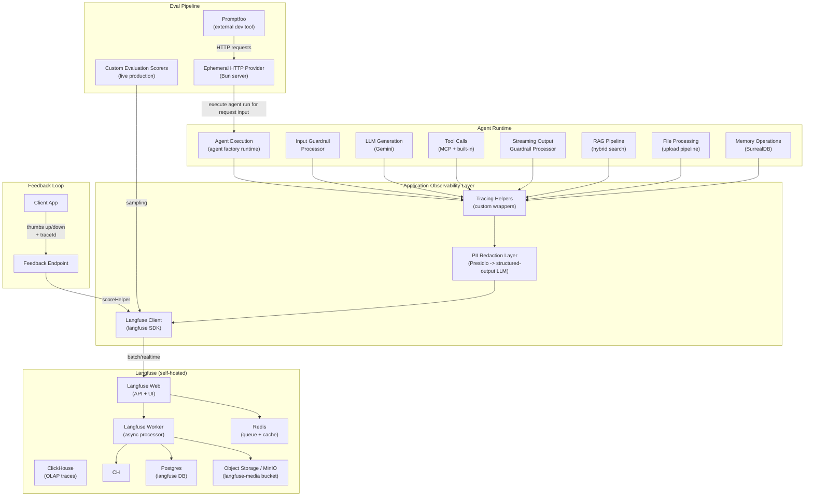
The design separates concerns cleanly. Application instrumentation traces structural events (agent lifecycle, LLM calls, tool invocations). Custom spans add domain semantics (guardrail verdicts, search arm scores, page processing progress). Scoring links trace quality to user outcomes. Prompt management enables runtime instruction changes without redeployment.
---
## Langfuse Self-Hosted Stack
Langfuse runs self-hosted to keep trace data on-premises. The stack requires six services, two of which share infrastructure with safeagent's existing Postgres and MinIO instances (separate databases and buckets) to reduce memory overhead by roughly 2 GB.
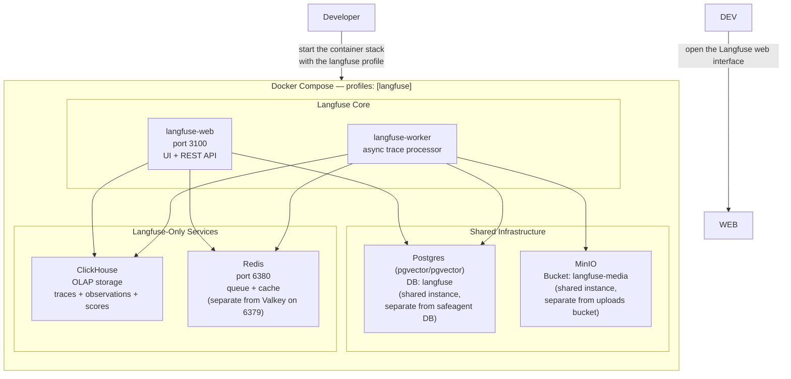
All six Langfuse services sit behind an optional Langfuse profile in the container stack. Developers opt in by enabling that profile. Without it, safeagent operates normally — the observability module returns no-ops. This keeps the development experience lightweight for contributors who do not need tracing.
### Service Responsibilities
| Service | Role | Resource Sharing |
|---------|------|------------------|
| **langfuse-web** | UI dashboard, REST API, prompt management | — |
| **langfuse-worker** | Async trace ingestion, event processing | — |
| **Postgres** | Relational metadata, prompt storage | Shared instance, separate `langfuse` database |
| **ClickHouse** | OLAP columnar storage for traces, observations, scores | Langfuse-only |
| **Redis** | Queue for worker, cache for web | Langfuse-only (port 6380, Valkey on 6379) |
| **MinIO** | Media attachments, large payloads | Shared instance, separate `langfuse-media` bucket |
### Environment Variables
| Variable | Purpose | Default |
|----------|---------|---------|
| `LANGFUSE_PUBLIC_KEY` | Client-side key for trace ingestion | — (disables Langfuse when absent) |
| `LANGFUSE_SECRET_KEY` | Server-side key for score writes + prompt reads | — |
| `LANGFUSE_BASE_URL` | Langfuse API URL | — (required, self-hosted endpoint) |
When `LANGFUSE_PUBLIC_KEY` is not set, the entire observability module returns no-ops — the exporter is null, and score helper methods silently do nothing. No consumer needs null checks.
---
## Trace Lifecycle and Span Taxonomy
Every agent interaction produces a trace in Langfuse and moves through a full lifecycle: trace creation, parent span creation, child span enrichment, generation capture, score writes, flush, retention, and dashboard aggregation. Core instrumentation populates the top-level structure. Custom spans add domain-specific detail at each stage.
```mermaid
graph TB
    subgraph TRACE["Trace (one per agent request)"]
        direction TB
        subgraph AUTO["Auto-traced by application wrappers"]
            AGENT_SPAN["Agent Run Span\n(total duration, model, agent ID)"]
            GEN["Generation\n(LLM call: tokens, cost, TTFT,\nmodel, temperature)"]
            TOOL_SPAN["Tool Call Span\n(tool name, input/output, duration)"]
        end
        subgraph CUSTOM["Custom Spans (CUSTOM_SPANS)"]
            GI_SPAN["guardrail.input\n(verdict, severity, conceptId)"]
            GO_SPAN["guardrail.output\n(buffer state, chunk count, tripwire)"]
            RAG_SPAN["rag.pipeline\n(query, mode, result count)"]
            FILE_SPAN["file.process\n(fileName, fileType, mode)"]
            MEM_SPAN["memory.operation\n(op type, userId)"]
        end
        subgraph SCORES["Scores"]
            S_GI["guardrail_input_pass\n(boolean)"]
            S_GO["guardrail_output_pass\n(boolean)"]
            S_UF["user_feedback\n(boolean — thumbs up/down)"]
            S_TOX["toxicity\n(numeric — custom scorer)"]
            S_HALL["hallucination\n(numeric — custom scorer)"]
        end
        AGENT_SPAN --> GEN
        AGENT_SPAN --> TOOL_SPAN
        AGENT_SPAN --> GI_SPAN
        AGENT_SPAN --> GO_SPAN
        AGENT_SPAN --> RAG_SPAN
        AGENT_SPAN --> FILE_SPAN
        AGENT_SPAN --> MEM_SPAN
        GI_SPAN -.->|"boolean score"| S_GI
        GO_SPAN -.->|"boolean score"| S_GO
        TRACE -.->|"Submit feedback"| S_UF
        TRACE -.->|"sampling"| S_TOX
        TRACE -.->|"sampling"| S_HALL
    end
```
### Span Taxonomy Levels
| Level | Source | Examples |
|-------|--------|----------|
| **Trace** | One per agent request | Entire user interaction from input to response |
| **Span** | Auto or custom | `guardrail.input`, `rag.pipeline`, `file.process`, tool calls |
| **Generation** | Auto (LLM calls) | Token count, cost, TTFT, model name, temperature |
| **Score** | Boolean or numeric | `guardrail_input_pass`, `user_feedback`, `toxicity` |
Scores can attach to traces (user feedback) or to specific spans (guardrail verdicts). The scoring-helper abstraction handles both cases, with optional span targeting.

### Trace-Step Events and Langfuse Correlation

Trace-step SSE events (defined in [11 — Streaming & Transport](./11-transport.md)) are a real-time subset of Langfuse trace data, projected through the streaming layer for frontend visualization. Both share the same traceId: the engine generates a traceId per request, includes it in the `session-meta` SSE event, and uses it for Langfuse trace creation. This means:

- Each trace-step event corresponds to a custom span or generation in Langfuse.
- The frontend trace timeline and the Langfuse dashboard show the same pipeline execution from different perspectives — real-time streaming vs post-hoc analysis.
- User feedback submitted via the frontend carries the traceId from `session-meta`, linking thumbs-up/down scores to the correct Langfuse trace.
- Verbosity level (`standard` vs `full`) controls only SSE emission — Langfuse always receives the full trace regardless of verbosity setting.
### Trace Lifecycle Phases
| Phase | What Happens | Primary Outputs |
|-------|--------------|-----------------|
| **Start** | Agent request enters runtime and a trace is opened with request metadata. | Trace root object with request context, user scope, and routing labels. |
| **Execution** | Runtime emits core spans and generations while domain modules emit custom spans. | Agent span, generation spans, tool spans, guardrail and retrieval spans. |
| **Scoring** | Guardrail, feedback, and scorer values are attached to trace or span level. | Boolean and numeric score entries linked to trace identifiers. |
| **Export** | Exporter batches or flushes events to Langfuse based on runtime mode and sampling policy. | Persisted observations and score objects in Langfuse services. |
| **Review** | Dashboards and alerts consume traces, scores, and derived metrics for operational decisions. | Quality, safety, latency, and cost signal views with alert routing. |
---
## Langfuse Observability Module
The observability module is a thin factory that composes direct `langfuse` SDK initialization and custom redaction helpers into a single creation point. It returns two things: the tracing exporter for framework tracing, and a pre-wired scoring helper for writing scores to traces.
### Factory Design
observability factory reads configuration from its argument or falls back to environment variables. It constructs a `Langfuse` client, builds the tracing exporter, attaches the two-stage PII redaction layer (Presidio followed by structured-output LLM review), and returns both components.
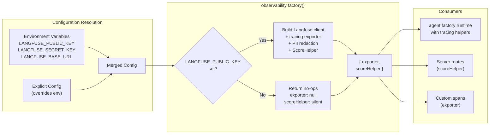
### Package Responsibilities
| Package | Role |
|---------|------|
| `langfuse` | Direct SDK client (`Langfuse`) used for manual trace/span/generation instrumentation and scoring writes. |
| `presidio` | Deterministic entity detection and masking for known PII classes before export. |
| `structured-output LLM` | Typed secondary review that catches residual sensitive fragments and normalizes masking behavior. |
### Flush Modes
| Environment | `realtime` | Behavior |
|-------------|-----------|----------|
| Development | `true` | Flush per event. Every span appears in Langfuse immediately. Higher overhead, instant visibility. |
| Production | `false` | Batch flush. Events buffered and sent periodically. Lower overhead, slight delay. |
The `realtime` flag defaults based on the environment mode from the typed env module (`@t3-oss/env-core`). In development, traces appear in the dashboard the moment they happen — critical for debugging guardrail logic and RAG relevance. In production, batch mode reduces network overhead.
### Sampling
Production deployments can reduce trace volume with sampling. The factory accepts a `sampling` config with three modes:
| Mode | Behavior |
|------|----------|
| `always` | Trace every request (default in dev) |
| `ratio` | Trace a percentage of requests (e.g., `probability: 0.1` for 10%) |
| `custom` | Caller-provided sampler function for conditional tracing (e.g., always trace flagged requests) |
### Score Helper
Scoring helper factory wraps the exporter's trace-score write call into a cleaner two-method API:
| Method | Signature | Use Case |
|--------|-----------|----------|
| boolean scoring method | accepts trace ID, optional span target, score name, value, and optional comment | Guardrail pass/fail, user feedback |
| numeric scoring method | accepts trace ID, optional span target, score name, value, and optional comment | Custom scorer results, custom metrics |
The span target parameter is optional. When omitted, the score attaches to the trace itself rather than a specific span. User feedback always omits span targeting because feedback applies to the entire interaction.
### No-Op Behavior
When `LANGFUSE_PUBLIC_KEY` is absent, the factory returns fully functional no-ops for both return values. The exporter is null. The scoring helper's boolean and numeric methods are silent no-ops. This means every consumer — the agent runtime, feedback endpoint, custom spans — can destructure and call methods without any null checks or conditional logic.
---
## Custom Observability Spans
Core instrumentation traces the structural skeleton (agent lifecycle, LLM calls, tool invocations). Custom spans fill in domain semantics: did the guardrail pass? Which search arms contributed? How long did page summarization take?
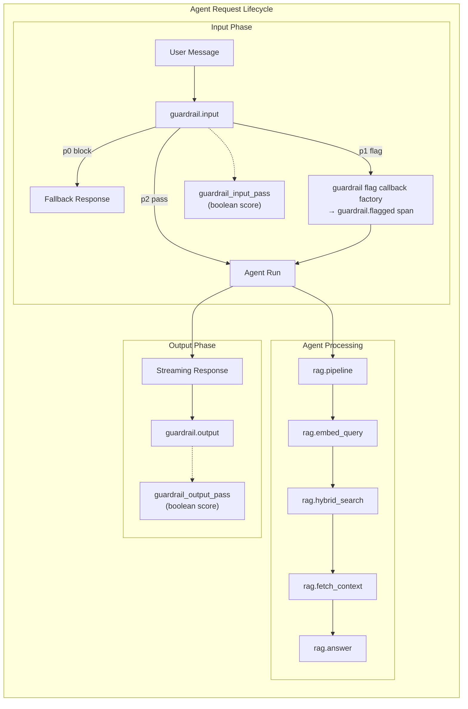
### Span Catalog
#### Input Guardrail Span
Added to input guardrail processor factory via an optional scoring-helper parameter. After the guardrail check completes:
| Attribute | Value |
|-----------|-------|
| Span name | `guardrail.input` |
| Captured data | Input text, aggregated verdict, severity, conceptId, duration |
| Boolean score | `guardrail_input_pass` — `true` if p2 (safe), `false` if p0 (blocked) |
| On p0 | Additional score: `guardrail_blocked` on the trace with conceptId |
| On p1 | Additional score: `guardrail_flagged` on the trace with conceptId |
The p1 flag callback (guardrail flag callback factory) is a standalone export that emits a custom Langfuse span for flagged content details. The server passes this as `onFlag` in the guardrail pipeline configuration object — guardrail code never imports observability code. This decoupling means the guardrail module has zero knowledge of Langfuse.
#### Streaming Output Guardrail Span
Added to output guardrail processor factory via an optional scoring-helper parameter. After the stream completes or a tripwire fires:
| Attribute | Value |
|-----------|-------|
| Span name | `guardrail.output` |
| Captured data | Buffer content at violation point, chunk count, duration |
| Boolean score | `guardrail_output_pass` — `true` if stream completed safely |
| Tripwire score | `guardrail_tripwire` if `abort` was called |
#### RAG Pipeline Span
Wraps the RAG query path with a parent span and child spans for each stage. The child spans differ by processing mode:
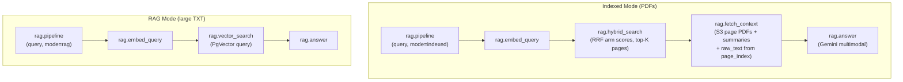
Each child span captures its own input, output, and duration. The `rag.hybrid_search` span additionally records per-arm scores and matched page numbers — critical for debugging relevance issues.
#### File Processing Span
Wraps per-file processing in the upload pipeline:
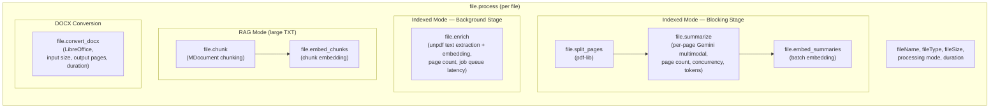
#### Memory Operation Spans
Wraps long-term memory operations:
| Parent Span | Child Spans |
|-------------|-------------|
| `memory.operation` (op type, userId, duration) | `memory.store_fact` (fact count, embedding duration) |
| | `memory.search` (query, result count, search latency) |
| | `memory.graph_traverse` (depth, nodes visited) |
| | `memory.expire_stale` (expired count) |
#### PII redaction integration
All spans pass through a two-layer PII redaction pipeline before export. The first stage uses Presidio for deterministic entity detection and masking. The second stage uses a structured-output LLM pass that classifies and normalizes residual sensitive fragments missed by deterministic detection. Redaction is enabled by default in observability factory and can be disabled only in tightly controlled debugging sessions.
#### Graceful No-Op
Every custom span checks whether the scoring-helper parameter was provided. When observability is not configured, the parameter is undefined and no span or score creation is attempted. Guardrail logic, RAG queries, and file processing all work identically with or without tracing.
---
## Custom Metrics and Cost Tracking
Beyond traces and spans, observability tracks latency, quality, safety, retrieval, and spend metrics across requests, users, agents, and environments. Cost telemetry is emitted with token usage and model metadata so budget drift is visible before hard limits are reached.
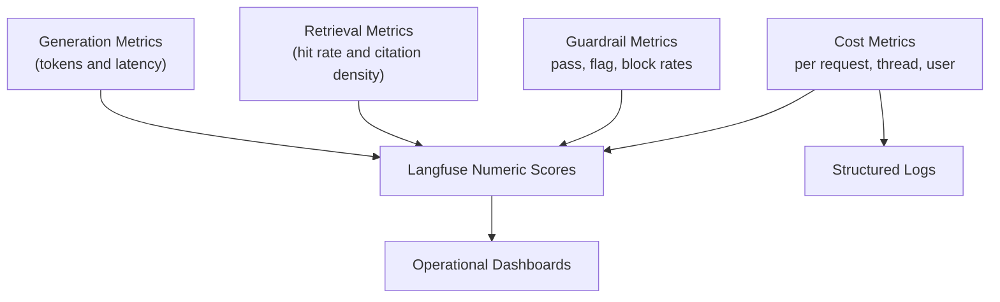
Metric families include latency, quality, safety, retrieval effectiveness, and spend. Cost attribution is maintained at request, conversation, user, agent, and environment levels to support budget enforcement and comparative efficiency analysis.
---
## PII Redaction Layer
PII handling is an explicit pipeline between runtime instrumentation and export. The design minimizes leakage risk while preserving enough semantic fidelity for debugging and evaluation.
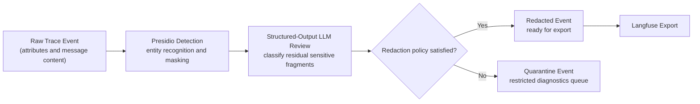
### Redaction Guarantees
- Layered detection combines deterministic Presidio detection with structured-output LLM review.
- Structured outputs enforce bounded redaction categories and predictable masking actions.
- Redaction is default-on in production and confidence failures route events to quarantine.
- Redaction counters and reason tags remain visible for audit and tuning workflows.
---
## Logging Strategy
Logging complements tracing by capturing operational context, failures, and policy decisions in a format optimized for search, correlation, and incident response.
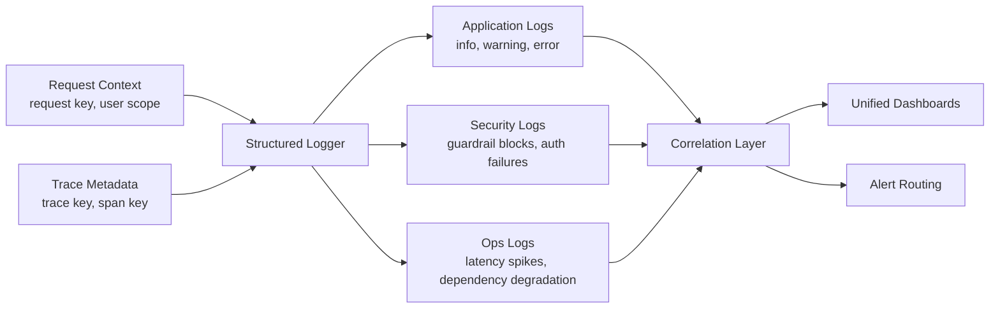
### Logging Principles
- Structured typed events with stable correlation fields are required.
- Request and trace identifiers are attached to lifecycle, safety, retrieval, cost, and infrastructure logs.
- Sensitive content is masked before emission, and noisy high-frequency events are sampled.
---
## User Feedback Endpoint
Client applications send thumbs-up/down feedback linked to a specific agent trace. The feedback flows through a simple feedback endpoint into Langfuse as a score on the original trace.
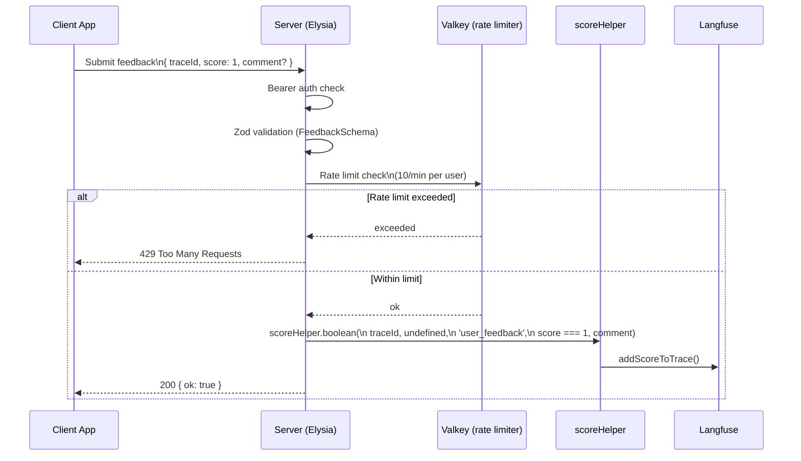
### Endpoint Design
| Aspect | Detail |
|--------|--------|
| Method | Submit request to feedback endpoint |
| Auth | Bearer token (same middleware as other API routes) |
| Body schema | `{ traceId: string, score: 0 \| 1, comment?: string }` |
| Rate limit | 10 requests per user per minute (Valkey-backed) |
| Score target | Entire trace (not a specific span — span targeting omitted) |
| Score name | `user_feedback` |
| Langfuse link | Score linked to original trace via `traceId` |
### Trace ownership
The server records `{ traceId, userId }` when the SSE stream starts in a Postgres `trace_owners` table (managed by Drizzle ORM, inserted by stream handler factory before the first SSE event) and checks this mapping before accepting feedback. This is not storing feedback content; it is a minimal ownership check to prevent a user from submitting scores for another user's trace.
### Graceful Degradation
When Langfuse is not configured (`LANGFUSE_PUBLIC_KEY` absent), the endpoint still accepts requests. The no-op scoring helper silently drops the score. The response is `200 { ok: true, traced: false }` instead of `200 { ok: true }`. Client apps never need error handling for the no-Langfuse case.
### Why Not Store in Postgres
Langfuse is the source of truth for scores. Storing feedback in Postgres would create a synchronization problem and duplicate data. Langfuse's score API already supports filtering, aggregation, and dashboard visualization. The feedback endpoint is a thin pass-through.
---
## Langfuse Prompt Management
Langfuse doubles as a prompt management system. Agent instructions can be edited in the Langfuse dashboard and fetched at runtime — enabling prompt iteration without redeployment.
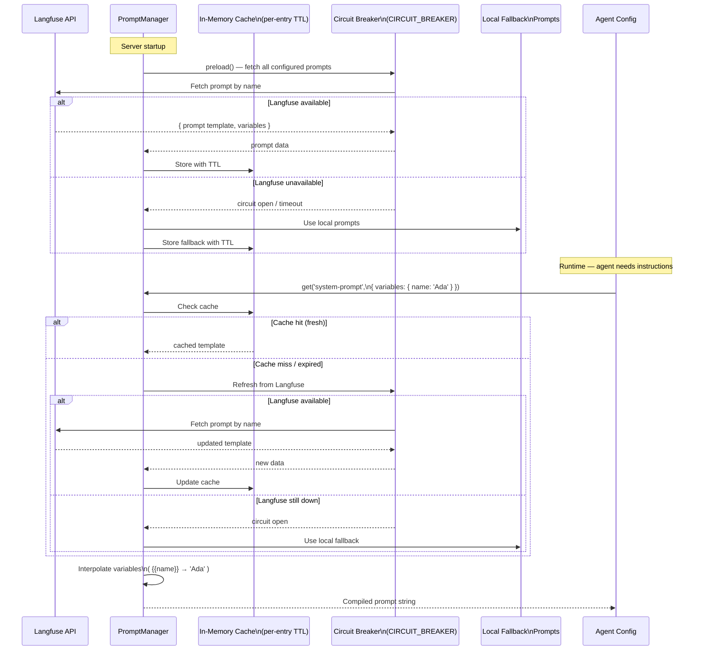
### Factory Design
Prompt management factory returns a prompt manager with four methods:
| Method | Purpose |
|--------|---------|
| startup preload | Fetches all configured prompt keys from Langfuse at startup. Hydrates the in-memory cache. Non-fatal on failure — falls back to local prompts with a warning. |
| prompt fetch | Returns a compiled prompt string. Serves from cache when fresh. On cache miss or expiry, attempts refresh then falls back. Supports variable interpolation (`{{var}}`). |
| manual refresh | Force-refreshes a specific prompt or all prompts from Langfuse. |
| cache stats | Returns cache diagnostics for entry count and last refresh time. |
### Configuration
| Config Field | Purpose | Default |
|-------------|---------|---------|
| `langfuseBaseUrl` | Langfuse API URL | — (required if using remote prompts) |
| `publicKey` | Langfuse public key | — |
| `secretKey` | Langfuse secret key | — |
| `cacheTtlMs` | Per-entry cache expiry | Explicit, configurable |
| `fallbackPrompts` | `Record<string, string>` of local prompts | — (required) |
| `logger` | Structured logger for warnings/errors | — |
| `fetchImpl` | Custom fetch for testing | `globalThis.fetch` |
### Reliability Guarantees
1. **Langfuse outage at startup**: the preload method logs a warning and loads all fallback prompts. Agent starts normally.
2. **Langfuse outage at runtime**: Cache miss triggers refresh attempt. Circuit breaker (from CIRCUIT_BREAKER) prevents repeated latency spikes. Falls back to local prompt.
3. **Cache TTL**: Configurable. Expired entries trigger a background refresh. The stale value is served until the refresh completes (stale-while-revalidate semantics).
4. **Variable interpolation**: Uses `{{var}}` token syntax with strict missing-variable checks. A missing variable throws rather than producing a prompt with `{{undefined}}`.
5. **Secret redaction**: Langfuse secret key is never emitted in logs or thrown error messages.
6. **Timeout**: Remote fetch calls use request-abort controls to bound network latency. Never blocks the critical path indefinitely.
### Server Integration
The server creates a prompt manager during startup and passes compiled prompts into agent config composition. Agents receive their instructions as strings — they have no knowledge of whether the prompt came from Langfuse or a local fallback. This is an opt-in feature. If the server does not configure prompt management, agents use instructions defined in code.
---
## Eval/Scoring Configuration
Evaluation has two modes: live production scoring via custom scorer functions, and offline regression testing via Promptfoo. The scorer configuration builder helper bridges these into safeagent's agent system.
### Custom evaluation scorers (live production)
The project defines custom scorer functions that run on a configurable sample of production traffic. Each scorer evaluates a specific quality dimension:
| Scorer Category | Examples |
|----------------|----------|
| Relevance | answer relevancy scorer, prompt alignment scorer |
| Safety | `toxicity`, `bias` |
| Accuracy | `hallucination`, `faithfulness` |
| Quality | `completeness`, `coherence` |
Scorers are imported from application scorer modules. The scorer configuration builder helper takes a record of scorer names to scorer instances with optional sampling configuration and returns a valid scorer config for agent construction.
### Sampling Configuration
| Sampling Type | Behavior |
|--------------|----------|
| `ratio` | Run scorer on N% of requests (e.g., `rate: 0.1` for 10%) |
| `always` | Run scorer on every request |
| `custom` | Caller-provided predicate function |
In production, `ratio` sampling is recommended to avoid adding latency to every request. Safety scorers (toxicity, bias) may use higher sampling rates than quality scorers.
### Scorer Results → Langfuse
When the observability module is configured, scorer results flow automatically into Langfuse as numeric scores on the trace. This enables dashboard monitoring of quality metrics over time — toxicity trends, hallucination rates, answer relevancy distributions.
---
## Dashboard and Alerting
Dashboards convert trace, score, log, and cost data into operational views for engineering, safety, and product teams. Alerts turn those views into actionable signals with clear ownership and escalation paths.
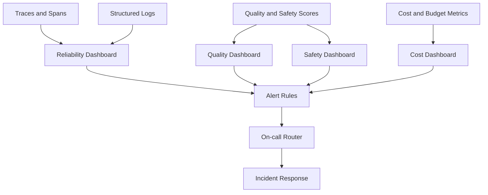
Core dashboard views cover reliability, quality, safety, and cost. Alert classes include availability, latency, quality drift, safety spikes, and spend velocity anomalies, each routed through explicit ownership and escalation policy.
---
## Self-Test Infrastructure
Self-testing allows agents to validate themselves against a test suite. Promptfoo is the eval engine — an external CLI tool that must be installed in the environment (dev dependency or CI image). The safeagent library spawns Promptfoo as a subprocess via subprocess spawning for fully automated eval execution with zero human intervention.
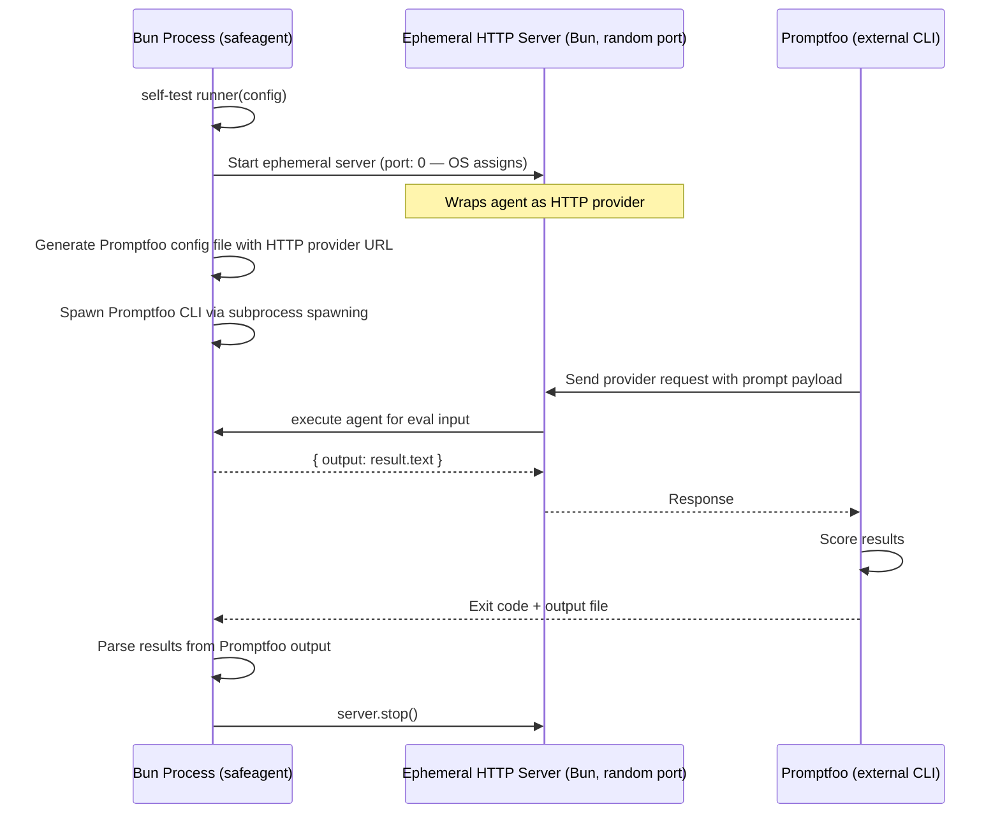
### How It Works
The self-test runner function starts an ephemeral HTTP server on a random port that wraps the agent as a Promptfoo-compatible HTTP provider. It generates eval configuration pointing to this server, then spawns Promptfoo as a subprocess via subprocess spawning. When the subprocess exits, self-test runner parses the output file, shuts down the HTTP server, and returns structured results. The entire flow is fully automated — no human intervention required.
Promptfoo is a CLI dependency (dev/CI only), not a library import — our code never imports the `promptfoo` package and has zero dependency on `better-sqlite3` or any Promptfoo transitive dependency. The subprocess spawning pattern keeps the dependency boundary clean.
### Eval Helpers
evaluation runner is the lower-level helper that handles the HTTP server, Promptfoo configuration generation, and subprocess spawning. It starts an ephemeral HTTP server wrapping the agent, generates Promptfoo configuration with the HTTP provider URL, and spawns the Promptfoo CLI via subprocess spawning. self-test runner composes evaluation runner with test case management and result parsing.
### Self-Test API
self-test runner is the high-level entry point:
| Config Field | Purpose |
|-------------|---------|
| `agent` | The agent instance to test |
| `testCases` | Array of `{ input, expectedOutput?, assertions? }` |
| `scorers` | Optional list of scorer names to apply |
| `timeout` | How long to keep the HTTP server alive (default: 5 minutes) |
The function starts the HTTP server, generates the Promptfoo config file, and waits for eval to complete or timeout.
### Eval Provider
Wraps a safeagent Agent as a Promptfoo custom provider:
| Field | Value |
|-------|-------|
| provider call method | Runs an agent evaluation request and returns the model output plus token usage totals |
This provider is used in the direct in-process path (when Promptfoo runs in Bun) and as the agent-facing adapter in the HTTP bridge.
---
## Cross-References
| Component | Interaction |
|-----------|-------------|
| **Requirements** ([01 — Requirements & Constraints](./01-requirements.md)) | Defines reliability, safety, privacy, and quality targets that observability validates continuously. |
| **Conversation Pipeline** ([05 — Conversation Pipeline](./05-conversation.md)) | Trace and span taxonomy maps directly to pipeline stages and classification outcomes. |
| **Agents** ([06 — Agents & Orchestration](./06-agents.md)) | Agent runtime consumes tracing helpers and emits lifecycle traces for every run. |
| **Server** ([12 — Server Implementation](./12-server.md)) | Server wiring provides feedback ingestion, score submission, and trace ownership checks. |
| **Infrastructure** ([15 — Infrastructure](./15-infrastructure.md)) | Deployment topology hosts Langfuse services, storage dependencies, and alert routing infrastructure. |
| **Frontend SDK** ([18 — Frontend SDK](./18-frontend-sdk.md)) | Trace visualization components consume trace-step events correlated with Langfuse traces via shared traceId. Frontend feedback hooks submit scores to Langfuse through the feedback endpoint. |
| **Demo Applications** ([19 — Demo Applications](./19-demos.md)) | Both demos implement feedback submission (traceId-linked), verbosity toggle (triggers trace-step event emission), and trace timeline rendering — all flowing into Langfuse observability. |
| **Circuit Breaker** (CIRCUIT_BREAKER) | Prompt manager wraps remote fetches with the circuit breaker to avoid repeated latency spikes during Langfuse outages. |
---
## Task Specifications
### Task LANGFUSE_MODULE: Langfuse Observability Module
**What to do**: Build the tracing exporter that implements the `@openai/agents` framework's tracing exporter interface. The exporter translates framework trace and span objects into Langfuse API calls via the direct `langfuse` SDK. Register it with the framework tracing processor pipeline. Build observability factory that sets up the exporter, score helper, and PII redaction. Return an object containing both exporter and score helper. Implement scoring helper factory with boolean and numeric scoring methods, with optional span targeting for trace-level scores. Default to env vars. Enable the Presidio plus structured-output LLM redaction pipeline by default. Implement the full no-op path when `LANGFUSE_PUBLIC_KEY` is absent: disable tracing on the framework and return a score helper with silent no-op boolean and numeric methods. Dev mode uses realtime flushes, production uses batched flushes with configurable ratio sampling.
**Depends on**: CORE_TYPES (types — observability configuration type definition)
**Acceptance Criteria**:
- tracing exporter implements the framework's tracing exporter interface (accepts trace and span items, returns a promise)
- Exporter registered through the framework's batch trace processor registration — framework handles batching and retry
- Framework auto-traces agent runs, LLM generations, tool calls, guardrail checks, and handoffs — all appear in Langfuse
- observability factory returns `{ exporter, scoreHelper }` — both accessible
- Graceful no-op when Langfuse public key not set: tracing is disabled, scoring helpers silently do nothing
- PII redaction enabled by default, disableable via config
- scoring helper factory returns helper with boolean and numeric methods
- Config defaults read from env vars: `LANGFUSE_PUBLIC_KEY`, `LANGFUSE_SECRET_KEY`, `LANGFUSE_BASE_URL`
- Realtime mode defaults to enabled in development, disabled in production
**QA Scenarios**:
- Set Langfuse env vars → framework traces appear in Langfuse dashboard with correct hierarchy (trace → agent span → generation span → tool spans)
- Unset Langfuse env vars → tracing is disabled, no crash, no trace attempts
- Pass explicit config overriding env vars → explicit values take precedence
- Set redaction disabled in config → no PII redaction in trace payloads
- Framework batch trace processor batches and flushes correctly under Bun runtime (force flush on shutdown)
---
### Task CUSTOM_SPANS: Custom Observability Spans
**What to do**: Instrument six high-value tracing points with custom spans and scores. (1) Input guardrail span in input guardrail processor factory — boolean score `guardrail_input_pass`, plus `guardrail_blocked` or `guardrail_flagged` scores on p0/p1. (2) Streaming output guardrail span in output guardrail processor factory — boolean score `guardrail_output_pass`, plus `guardrail_tripwire` if abort is called. (3) RAG pipeline spans: parent `rag.pipeline` with children `rag.embed_query`, `rag.hybrid_search` (indexed mode with arm scores) or `rag.vector_search` (RAG mode), `rag.fetch_context`, `rag.answer`. (4) File processing spans: parent `file.process` with children for blocking stage (`file.split_pages`, `file.summarize`, `file.embed_summaries`), background stage (`file.enrich`), RAG mode (`file.chunk`, `file.embed_chunks`), and DOCX conversion (`file.convert_docx`). (5) Memory operation spans: parent `memory.operation` with children `memory.store_fact`, `memory.search`, `memory.graph_traverse`, `memory.expire_stale`. (6) Export guardrail flag callback factory — returns a callback that emits a `guardrail.flagged` Langfuse span with p1 details, decoupling guardrail code from observability code. All spans are no-op when observability is not configured.
**Depends on**: LANGFUSE_MODULE (observability module), INPUT_GUARD (input guardrail), OUTPUT_GUARD (streaming guardrail), RAG_INFRA (RAG infrastructure)
**Acceptance Criteria**:
- Input guardrail emits a boolean pass score on every check
- Streaming guardrail emits a boolean pass score
- RAG pipeline emits parent `rag.pipeline` span with child spans matching the query mode (indexed or rag)
- File processing emits `file.process` span with child spans matching the processing mode
- `file.convert_docx` span emitted for DOCX-to-PDF conversion
- Memory operations emit `memory.operation` parent with appropriate child spans
- guardrail flag callback factory returns a function compatible with `onFlag` in the guardrail pipeline configuration object
- All spans are no-op when the score helper is undefined (observability not configured)
- No span or score creation attempted without observability — guardrails, RAG, file processing all work identically
**QA Scenarios**:
- Create input guardrail with mock scoring helper → process safe input → assert boolean score called with pass=true → process toxic input → assert called with pass=false
- Execute RAG query in indexed mode with mock observability → assert parent `rag.pipeline` span created → assert child spans `rag.embed_query`, `rag.hybrid_search`, `rag.fetch_context`, `rag.answer` all present with duration > 0
- Create guardrail without scoring helper (undefined) → process input → assert no error, guardrail works normally, no span/score creation attempted
- Execute file processing with mock observability → assert `file.process` parent span → assert `file.summarize` child span captures page count and token total
---
> **FEEDBACK_ENDPOINT** — canonical task specification is in [12 — Server Implementation](./12-server.md#task-feedback_endpoint-feedback-endpoint). The server route wires Langfuse score submission to the HTTP layer. See also LANGFUSE_MODULE for the scoreHelper dependency.
---
### Task PROMPT_MGMT: Langfuse Prompt Management Integration
**What to do**: Build prompt management factory returning a prompt manager with startup preload, prompt fetch, manual refresh, and cache stats methods. Startup preload fetches configured prompt keys from the Langfuse API at startup and hydrates an in-memory cache with per-entry expiry. Prompt fetch serves cached prompts with variable interpolation (`{{var}}` tokens) and strict missing-variable checks. On cache miss or expiry, attempt refresh then fall back to local prompts from `fallbackPrompts` config. Wrap remote fetches with the CIRCUIT_BREAKER circuit breaker to avoid repeated latency spikes. Use request-abort controls to bound network calls. Never fail startup when Langfuse is unavailable and fallback prompts exist. Never expose Langfuse secret key in logs or error messages. Export via subpath barrel.
**Depends on**: LANGFUSE_MODULE (Langfuse observability — env handling patterns, credential management)
**Acceptance Criteria**:
- startup preload fetches remote prompts and hydrates in-memory cache
- prompt fetch returns compiled prompt with variable interpolation (this refers to the Langfuse prompt revision identifier)
- Cache TTL is honored; expired entries trigger refresh
- Network failures fall back to local prompts without crashing request flow
- Circuit breaker guards repeated failing Langfuse calls
- Secrets are redacted and not emitted in logs or thrown error messages
- Prompt manager exports available via subpath imports
- Missing variable in interpolation throws rather than producing `{{undefined}}` in output
**QA Scenarios**:
- Mock Langfuse API returns a system prompt revision → create manager with fallback → call startup preload then prompt fetch → assert returned prompt comes from remote template with interpolation applied
- Mock fetch fails with timeout → create manager with fallback → call startup preload and prompt fetch → assert fallback prompt returned, warning logged without secrets
- Set cache TTL to 100ms → run startup preload → wait 200ms → run prompt fetch → assert refresh attempted → if Langfuse still available, new value served; if unavailable, stale value served
---
### Task EVAL_CONFIG: Eval/Scoring Configuration Helpers
**What to do**: Build scorer configuration builder — configures custom scorer functions for live production monitoring with sampling support. Re-export commonly used project scorer factories (answerRelevancy, toxicity, hallucination, faithfulness, promptAlignment). Build eval provider factory — wraps a safeagent Agent as a Promptfoo custom provider with a provider call method that runs the agent for eval input and returns output plus token usage. Build evaluation runner — starts an ephemeral HTTP server wrapping the agent, generates Promptfoo configuration with the HTTP provider URL, and spawns the Promptfoo CLI as a subprocess via subprocess spawning. Promptfoo is a CLI dev dependency — our code never imports the `promptfoo` package (no library dependency), but spawns it as a subprocess for fully automated execution.
**Depends on**: AGENT_FACTORY (agent factory — agent instance for provider wrapping)
**Acceptance Criteria**:
- scorer configuration builder produces valid scorer config with sampling support
- eval provider factory wraps agent with the correct Promptfoo provider interface (provider call method)
- HTTP server starts on random port and responds to Promptfoo provider requests
- Promptfoo config file generated with correct HTTP provider URL
- Server shuts down after timeout
**QA Scenarios**:
- Call scorer configuration builder with toxicity scorer → assert returns valid config object with sampling metadata
- Call eval provider factory → assert returned object has the provider call method → invoke it → assert an agent evaluation run was invoked → assert response includes output and token usage
- Call evaluation runner with mock config → assert HTTP server starts on random port → assert generated config includes correct provider URL
- Start server from evaluation runner flow → send a request with `{ prompt: 'test' }` → assert response contains `{ output }` → wait for timeout → assert server stops and port is released
---
### Task SELF_TEST: Self-Test Infrastructure (Promptfoo External CLI)
**What to do**: Build self-test runner — the self-testing loop for agents. Accepts a self-test configuration object with an agent instance, test cases, optional scorers, and optional timeout. Workflow: start ephemeral HTTP server wrapping the agent (using EVAL_CONFIG's HTTP server pattern), generate Promptfoo configuration with HTTP provider URL and test cases, spawn Promptfoo CLI via subprocess spawning, wait for subprocess exit, parse results from output file, shut down server, and return a structured self-test result object. Fully automated — zero human intervention. Promptfoo is a CLI dev dependency (not a library import).
**Depends on**: EVAL_CONFIG (eval helpers — HTTP server pattern, eval provider factory, evaluation runner)
**Acceptance Criteria**:
- self-test runner generates valid Promptfoo config from test cases
- HTTP server starts on a random port and responds to requests with `{ output }` JSON
- Promptfoo config file generated with all test cases
- Server shuts down after timeout
- Results parsed if Promptfoo output file exists
**QA Scenarios**:
- Call self-test runner with mock agent and test cases → assert HTTP server started → assert generated config contains all test cases → assert server stopped after completion/timeout
- Call self-test runner without Promptfoo output file present → assert timeout path returns structured result without crash
- Provide test case with assertion that should fail → assert result marks that test case as failed with `gradingResult.reason`
- Multiple test cases → assert all are executed and results array has one entry per test case
---
## External References
- Langfuse documentation: https://langfuse.com/docs
- Langfuse self-hosted deployment: https://langfuse.com/docs/deployment/self-host
- Langfuse prompt management: https://langfuse.com/docs/prompts
- Langfuse custom scores: https://langfuse.com/docs/scores/custom
- Promptfoo documentation: https://promptfoo.dev/docs
- Promptfoo custom providers: https://promptfoo.dev/docs/providers/custom-api
---
*Previous: [13 — TUI App](./13-tui.md) | Next: [15 — Infrastructure](./15-infrastructure.md)*
