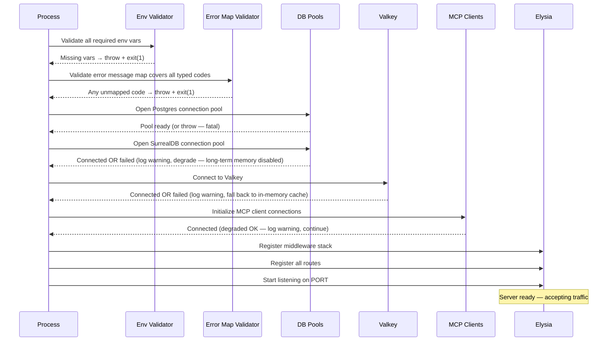
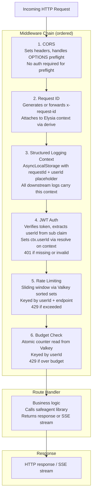
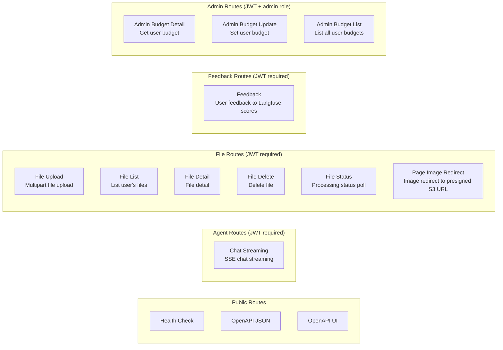
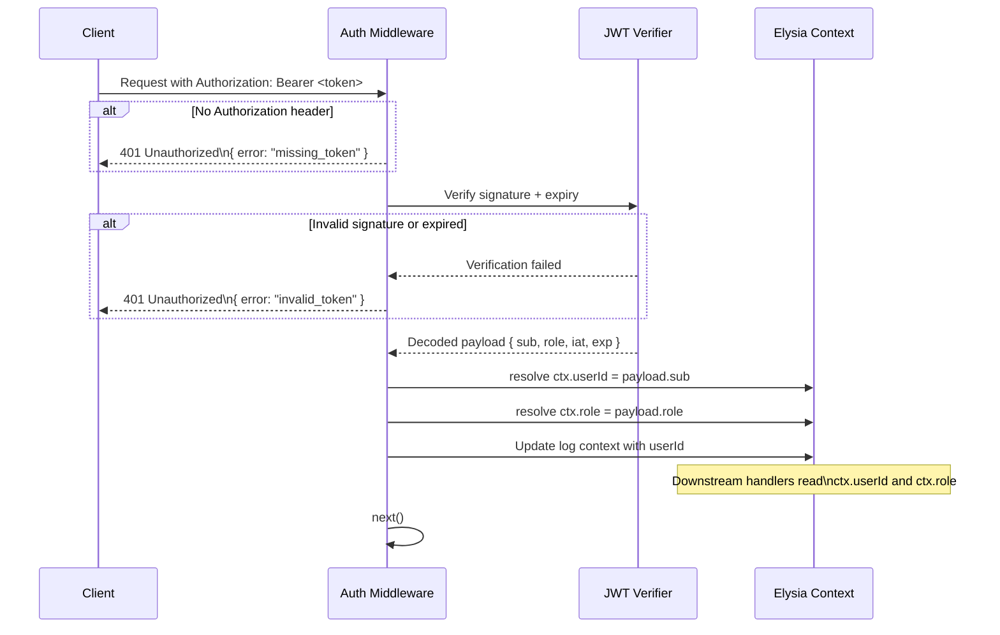
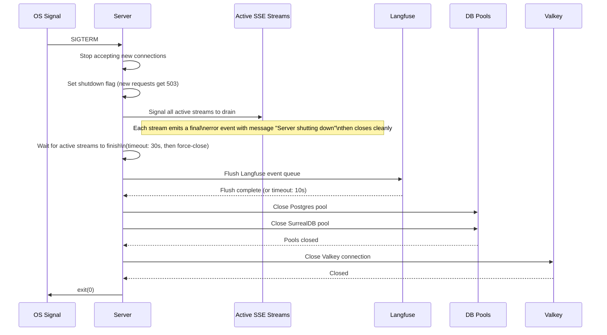

# 14 — Server Implementation

> **Scope**: The server is intentionally thin. It's mostly configuration: prompts, intent definitions, guardrail rules, MCP server configs. All logic lives in the safeagent library. The server imports from safeagent subpaths, wires the pieces together, and exposes them over HTTP with Elysia.
>
> **Tasks**: SCAFFOLD_SERVER (Scaffolding), SERVER_AGENT_CFG (Agent Config), SERVER_ROUTES (Routes), SERVER_MCP (MCP Definitions), SERVER_GUARDRAILS (Guardrail Rules), UPLOAD_ENDPOINT (Upload Endpoint), FEEDBACK_ENDPOINT (Feedback Endpoint), FILE_CRUD (File CRUD), JWT_AUTH (JWT Auth), ADMIN_API (Admin API)

---

## Table of Contents

- [Thin Server Philosophy](#thin-server-philosophy)
- [Server Startup Sequence](#server-startup-sequence)
- [Request Lifecycle](#request-lifecycle)
- [Route Map](#route-map)
- [JWT Auth](#jwt-auth)
- [Middleware Stack](#middleware-stack)
- [Agent Configuration](#agent-configuration)
- [Location Tool Configuration](#location-tool-configuration)
- [Guardrail Rules](#guardrail-rules)
- [MCP Definitions](#mcp-definitions)
- [Endpoints](#endpoints)
- [Error Message Mapping](#error-message-mapping)
- [Graceful Shutdown](#graceful-shutdown)
- [Health Endpoint](#health-endpoint)
- [Cross-References](#cross-references)
- [Task Specifications](#task-specifications)
- [OpenAPI Documentation](#openapi-documentation)

---

## Thin Server Philosophy

The server has one job: take HTTP requests, authenticate them, and hand them to the safeagent library with the right configuration. It doesn't implement agent logic, guardrail detection, streaming mechanics, memory management, or RAG. Those all live in the library.

What the server does own:

- **Prompts** — the actual system prompt text for each agent
- **Intent definitions** — which intents exist, their example phrases, source priorities
- **Guardrail rules** — the `GuardrailFn[]` arrays that define what to detect
- **Language guard configuration** — supported output languages and fallback policy for LANG_GUARD
- **Hate speech guard configuration** — hybrid matcher toggles and vocabulary overrides for HATE_SPEECH_GUARD
- **MCP server configs** — which MCP servers to connect to and how
- **Error message mapping** — human-readable strings for every typed error code the library can emit
- **CTA catalog** — the call-to-action definitions the agent can surface
- **Location tool provider configuration** — provider wiring and limits for location enrichment
- **Route handlers** — thin glue between HTTP and library calls

The server imports from safeagent subpaths. Each subpath is a stable public API surface: `safeagent/agent` (createAgent, createOrchestratorAgent), `safeagent/guardrails` (GuardrailFn type, factory helpers), `safeagent/mcp` (MCPServerConfig type), `safeagent/stream` (createStreamHandler, SSE helpers), `safeagent/upload` (handleUpload), `safeagent/files` (FileRegistry queries), `safeagent/memory` (memory adapters), `safeagent/budget` (checkTokenBudget, recordTokenUsage, getUserBudget, setUserBudget, listUserBudgets), `safeagent/feedback` (submitFeedback), `safeagent/errors` (all typed error codes), and `safeagent/health` (checkHealth).

**Module ownership**: `errors` is built as part of CORE_TYPES. `feedback` (submitFeedback) is built as part of LANGFUSE_MODULE. `health` (checkHealth) is built as part of MCP_HEALTH. `budget` functions are built as part of COST_TRACKING. All are exported through BARREL_EXPORTS.

---

## Server Startup Sequence

Before the server accepts any traffic, it runs a validation and connection phase. If anything fails here, the process exits with a non-zero code rather than starting in a broken state.

**Key rules**:

- `DATABASE_URL` is fatal on startup — the server refuses to start without a working Postgres connection. `JWT_SECRET` is also fatal when `NODE_ENV=production` — authentication is a security boundary that must fail closed (see Production enforcement below). All other env vars degrade gracefully per file 02 (GOOGLE_API_KEY absent → LLM endpoints return 503; JWT_SECRET absent in non-production → auth middleware enters dev-bypass mode with a default dev userId and a startup warning; S3/Valkey/SurrealDB/Trigger.dev/Langfuse absent → respective features disabled).
- An incomplete error message map is fatal. Every typed error code the library can emit must have a mapped user-facing string. This is validated by importing the full error code enum from `safeagent/errors` and checking each key against the server's map.
- Postgres connection failures are fatal. SurrealDB, S3, and Valkey failures are non-fatal and put the instance in degraded mode.
- MCP connection failures are non-fatal at startup. MCP tools degrade gracefully — the agent continues without them and logs a warning. The health endpoint reports MCP status separately.
- Valkey connection failures are non-fatal at startup. The cache falls back to in-memory mode; rate limiting degrades (disabled or in-memory) and budget enforcement fails-open.

---

## Request Lifecycle

Every request passes through the full middleware chain before reaching a route handler. The chain is ordered deliberately — CORS must run before auth so preflight OPTIONS requests are handled without requiring a JWT.

**Notes on ordering**:

- CORS first because OPTIONS preflight must return 200 without hitting auth. If auth runs first, preflight fails with 401 and browsers can't make cross-origin requests.
- Request ID before logging so the log context always has an ID.
- Auth before rate limiting so rate limit keys are scoped to a real userId, not an IP.
- Rate limiting before budget so we don't burn a budget check on a request that's already over the rate limit.
- Budget check last in the middleware chain because it's the most expensive check (Valkey read + compare).

---

## Route Map

All routes except the health check and OpenAPI endpoints require a valid JWT when `JWT_SECRET` is configured. Admin routes additionally require the `admin` role claim in the JWT payload. When `JWT_SECRET` is absent, the auth middleware enters dev-bypass mode: all requests are assigned a default dev userId, a startup warning is logged, and no token verification occurs. This mode is strictly for local development — production deployments must set `JWT_SECRET`.

**Production enforcement**: When `NODE_ENV=production` and `JWT_SECRET` is absent, the server refuses to start (hard failure, same as missing `DATABASE_URL`). Authentication is a security boundary — unlike rate limiting or budget enforcement, auth fail-open means any request can access any user's data. This is the one exception to the graceful degradation model in [17-Infrastructure](./17-infrastructure.md): non-security subsystems (Valkey, SurrealDB, S3, Trigger.dev) degrade gracefully, but authentication fails closed. The startup error message is explicit: `"JWT_SECRET is required in production (NODE_ENV=production). Set JWT_SECRET or remove NODE_ENV=production for dev-bypass mode."`

---

## JWT Auth

The auth middleware is created by calling the `createAuthMiddleware` factory from the server's auth module. It's an Elysia lifecycle hook composition — it returns hook wiring that can be registered on the app or on route groups.

JWT validation uses symmetric verification with `HS256` and a shared secret loaded from environment configuration. The middleware verifies signature and expiry, and may additionally validate issuer/audience when those constraints are configured.

Use the `@elysiajs/jwt` plugin for token verification and signing integration in the Elysia app lifecycle.

**`requireRole` helper**:

Admin endpoints call `requireRole` as a second middleware after the JWT middleware. It reads the `role` property from the Elysia `resolve` context and returns 403 if the role doesn't match. This keeps the role check separate from the auth check so error codes are distinct.

| Scenario | Status | Error code |
|---|---|---|
| No Authorization header | 401 | `missing_token` |
| Malformed Bearer format | 401 | `invalid_token` |
| Invalid signature | 401 | `invalid_token` |
| Expired token | 401 | `token_expired` |
| Valid token, wrong role | 403 | `insufficient_role` |
| Valid token, correct role | — | passes through |

---

## Middleware Stack

### CORS

CORS is configured with explicit allowed origins, methods, and headers. The configuration is environment-driven — `CORS_ALLOWED_ORIGINS` is a comma-separated list of origins. In development, `*` is acceptable. In production, only the known client origins are listed.

Use the `@elysiajs/cors` plugin for route-level and app-level CORS behavior.

Allowed methods: `GET, POST, PUT, DELETE, OPTIONS`
Allowed headers: `Content-Type, Authorization, x-request-id`
Exposed headers: `x-request-id`
Credentials: `true` (required for cookie-based auth fallback)

### Request ID

Every request gets a unique ID. If the client sends `x-request-id`, that value is forwarded. Otherwise a new UUID is generated. The ID is attached to the Elysia context via `derive` and echoed back in the response headers. All log lines emitted during the request carry this ID.

### Structured Logging Context

Uses `AsyncLocalStorage` to carry a log context object through the entire async call chain without threading it through function arguments. The context holds `requestId`, `userId` (populated after auth), `agentId` (populated in agent routes), and `traceId` (a server-generated UUID created before the agent run, passed to Langfuse as the trace identifier). Every log call reads from this store automatically.

### Rate Limiting

Sliding window algorithm using Valkey sorted sets. Each window is keyed by `ratelimit:{userId}:{endpoint_group}`. The endpoint group is coarse — all agent stream requests share one bucket, all file operations share another. Limits are configurable per group via environment variables.

When a request exceeds the limit, the middleware returns 429 with `Retry-After` header set to the seconds until the window resets.

### Budget Check

Reads the user's daily and monthly token spend from Valkey atomic counters keyed by `budget:{userId}:daily:{YYYY-MM-DD}` and `budget:{userId}:monthly:{YYYY-MM}`. Compares both totals against the user's configured token limits (fetched from Postgres, cached in Valkey with a 5-minute TTL). If either limit is exceeded, returns 429 with a structured error body. Daily keys auto-expire at midnight UTC; monthly keys expire at month end.

Before starting an LLM call, the system atomically reserves an estimated token count via Valkey `INCRBY` on the daily spend counter — the returned total is compared against the budget limit. If the total exceeds the limit, the increment is immediately reversed (`DECRBY`) and the request returns 429. After the call completes, the difference between actual and estimated usage is reconciled on the same counter. See 17-Infrastructure for the full budget enforcement model.

---

## Agent Configuration

The server defines all agent configuration. The library provides the factory functions; the server provides the content.

### Agent Definitions

The server creates agents by calling `createAgent` and `createOrchestratorAgent` from `safeagent/agent`. Each agent definition includes:

- **id** — stable identifier used in route params (`:agentId`)
- **instructions** — the full system prompt text, written in the server
- **model** — imported from the shared config constants
- **tools** — imported from `safeagent/agent` tool registry
- **guardrails** — the `GuardrailFn[]` arrays defined in the server's guardrail module
- **memory config** — which memory adapters to enable
- **thinkingLevel** — per the thinking level table in doc 02
- **groundingMode** — whether to enable Gemini grounding
- **guardMode** — `development` or `production`, controls output guardrail behavior

### CTA Catalog

The server defines the CTA (call-to-action) catalog — the set of structured actions the agent can surface to the client. Each CTA has an id, label, action type, and any parameters. The catalog is passed to `createAgent` and the library's CTA tool uses it to emit typed CTA events in the SSE stream.

### Location Tool Configuration

The server configures `LocationToolConfig` for location enrichment. Configuration includes optional `geocodeProvider` and optional `imageSearchProvider`, plus `maxImages` with default value `5` when not overridden.

Default geocoding uses Nominatim with Valkey-backed caching, so geocoding works without an API key in the default setup.

Image search is provided by the server via an `ImageSearchProvider` function. Typical providers include Serper.dev, Google Places Photos, or Pexels. The library exposes typed adapter helpers for convenience, including helpers like `createGooglePlacesImageProvider(apiKey)`.

The location tool is opt-in. The server must include `createLocationTool(config)` in the agent tool list to enable it.

If `imageSearchProvider` is not configured, location enrichment still returns coordinates and emits location events with an empty `images` array.

### Model Config

Model constants are imported from `safeagent/config`. The server never hardcodes model names. If the model changes, it changes in one place.

### Processor Wiring

The server passes the guardrail arrays to the agent factory. The library wires them into a custom pre/post processing pipeline internally. The server doesn't touch processor internals directly.

---

## Guardrail Rules

The server defines all detection logic. The library provides the `GuardrailFn` type and factory helpers; the server provides the actual functions.

### Structure

The server exports two arrays:

- `inputGuardrails: GuardrailFn[]` — run before the LLM sees the message
- `outputGuardrails: GuardrailFn[]` — run on every chunk the LLM emits

Each `GuardrailFn` receives the text to check and returns a `GuardrailVerdict` with a severity level and `conceptId`. The library's pipeline aggregates results using worst-wins logic.

### ConceptRegistry

The server defines a `ConceptRegistry` — a map of concept IDs to `ConceptConfig` objects containing fallback messages and metadata. This is the vocabulary the guardrail functions use for identifying violations and providing user-facing fallback responses. Keeping it in the server means the concept configuration can be updated without touching the library.

The server must define concept IDs for the new opt-in guardrails:

- `unsupported_language` — fallback message returned when LANG_GUARD blocks unsupported output language.
- `hate_speech_detected` — fallback message returned when HATE_SPEECH_GUARD blocks hate speech or profanity.

### Factory Helpers

The library exports factory helpers that make common guardrail patterns easy to write:

- `createKeywordGuardrail` — matches against ConceptRegistry entries
- `createRegexGuardrail` — regex-based detection
- `createLLMGuardrail` — LLM-based classification for nuanced cases

Topic-boundary enforcement is composed in server code from the exported factories above (typically `createCompositeGuardrail` + keyword/regex/LLM guards). There is no separate `createTopicBoundaryGuardrail` factory in the library.

The server composes these factories to build its guardrail arrays. The detection logic is entirely in the server's configuration — the library just runs whatever functions the server provides.

### Language Guard configuration

The server creates a LanguageGuardConfig that defines supported output languages, fallback message behavior, minimum text length, confidence threshold, and optional translation keyword overrides. A typical supported set can include en and vi. The server passes this config to createLanguageGuard, which returns guardrail functions for both input and output enforcement. Those functions are appended to inputGuardrails and outputGuardrails alongside existing rules.

### Hate Speech Guard configuration

The server creates a HateSpeechGuardConfig with enabled set to true when this guardrail is required, plus optional excludeWords, additionalWords, and language list controls. The server passes this config to createHateSpeechGuard, which returns guardrail functions for both input and output enforcement. Those functions are appended to inputGuardrails and outputGuardrails alongside existing rules.

Both guardrails are opt-in. If either config is omitted or disabled, the corresponding guardrail functions are not attached.

### Severity Levels

| Level | Input behavior | Output behavior |
|---|---|---|
| `p2` | Pass through silently (`conceptId: "PASS"`) | Pass through silently (`conceptId: "PASS"`) |
| `p1` | Log + flag to Langfuse, pass through | Log + flag, pass through |
| `p0` | Emit `tripwire` event and do not stream | Suppress chunk, inject fallback message |

---

## MCP Definitions

The server defines which MCP servers to connect to. The library handles the actual MCP client connections and tool registration.

Each MCP server config specifies:

- **id** — stable identifier
- **transport** — `stdio`, `sse`, or `streamable-http` (discriminant field uses lowercase kebab-case values; corresponding TypeScript classes are PascalCase: `MCPServerStdio`, `MCPServerSSE`, `MCPServerStreamableHttp`)
- **command / url** — how to connect
- **env** — environment variables to pass (for stdio transport)
- **tools** — optional allowlist of tool names to expose (if omitted, all tools are exposed)

The server passes the array of `MCPServerConfig` objects to `createAgent`. The library initializes the MCP clients during agent startup and registers the tools in the agent's tool registry.

MCP tool failures at runtime are non-fatal. If an MCP tool call fails, the agent receives an error result and can decide how to proceed. The library doesn't retry MCP calls — that's the MCP server's responsibility.

---

## Endpoints

### Memory Control Endpoints

The server exposes two endpoints for user memory management. Both are thin wrappers that call the library's memory control functions with the userId from the JWT-authenticated request context.

- Memory inspect endpoint: Calls `memoryInspect` with the authenticated userId. Returns a structured response containing the user's stored facts, interactions, media facts, and recent result sets, organized by category.
- Memory delete endpoint: Calls `memoryDelete` with the authenticated userId and the deletion query. Returns matched records for client-side confirmation UI. A subsequent confirmation call executes the actual deletion.

Both endpoints require authentication (JWT). The userId is always extracted from the token — the client cannot specify a different userId.

---

### Chat Streaming Endpoint

SSE chat streaming endpoint. The client sends a message and receives a stream of SSE events.

**Request body**:
- `message` — the user's message text
- `threadId` — optional, for continuing an existing conversation
- `fileIds` — optional array of file IDs to include in context

**Request validation**:
- The server validates incoming chat messages against `MAX_INPUT_MESSAGE_LENGTH` (default: 32000 characters).
- Messages exceeding this limit are rejected with HTTP 400 and a mapped error message that explains the limit.
- This prevents context-window overflow from excessively long user inputs and protects the pipeline from processing messages that would dominate the context budget.

**Flow**:
1. Middleware chain runs (CORS, request ID, logging, auth, rate limit, budget check)
2. Handler looks up the agent by `agentId` from the server's agent registry
3. The route uses the handler produced by `createStreamHandler` (from `safeagent/stream`, configured at startup with the server's `errorMessageMap`). The handler reads `userId` from Elysia context (set by auth middleware) and `message`, `threadId`, `fileIds` from the request body
4. Sets response headers for SSE (`Content-Type: text/event-stream`, `Cache-Control: no-cache`, `Connection: keep-alive`)
5. Pipes the SSE stream to the response
6. On stream end, records token usage to budget counter

**SSE event types** (defined by the library, emitted by the stream):
- `session-meta` — first event on every stream; carries `traceId` + `threadId`
- `text-delta` — incremental text chunk
- `cta` — a call-to-action event
- `citation` — a source citation
- `location` — location enrichment event with place metadata, coordinates, and optional images
- `tripwire` — guardrail block event
- `done` — stream complete
- `error` — a typed error event

**Error handling**:
- Agent not found → 404
- Budget exceeded (caught in middleware) → 429
- Rate limited (caught in middleware) → 429
- Stream error mid-flight → emit `error` SSE event, close stream

---

### File Upload Endpoint

Multipart file upload. Enforces ≤5MB per file, ≤5 files per turn.

**Request**: `multipart/form-data` with a `file` field, optional `metadata` JSON field, and optional `scope` field (`'thread'` | `'global'`, defaults to `'thread'`). The `scope` field controls cross-conversation RAG visibility — see file 09 for the full scope model.

**Flow**:
1. Middleware chain runs
2. Handler calls `handleUpload` from `safeagent/upload` with the multipart stream, userId, and upload config
3. Library validates file type, size, and user's storage quota
4. Library stores the raw file in S3 and creates a file record in Postgres
5. Handler returns the new file record with `status: "uploading"`
6. Library runs the blocking stage in-process (DOCX conversion, PDF split, per-page summarization, page_index insertion — status transitions through `summarizing` to `ready`)
7. After blocking stage completes, library enqueues a Trigger.dev background enrichment job (raw text extraction — status transitions through `enriching` to `enriched`)

**Validation errors** (returned as typed error codes, mapped to user messages by the server):
- File type not allowed
- File too large
- Storage quota exceeded
- Malformed multipart body

**Response**: `201 Created` with the file record JSON.

---

### File List Endpoint

List the authenticated user's files.

**Query params**:
- `status` — optional filter: `uploading`, `summarizing`, `ready`, `enriching`, `enriched`, `failed`
- `cursor` — pagination cursor
- `limit` — page size (default 20, max 100)

**Flow**: Calls `listFiles` from `safeagent/files` with userId and query params. Returns paginated file records.

**Response**: `200 OK` with `{ files: FileRecord[], nextCursor: string | null }`.

---

### File Detail Endpoint

File detail. Returns full metadata for a single file.

**Flow**: Calls `getFile` from `safeagent/files` with fileId and userId. The library enforces userId scoping — a user can only fetch their own files.

**Response**: `200 OK` with the full `FileRecord`. `404` if not found or not owned by the requesting user.

---

### File Delete Endpoint

Delete a file and all associated data.

**Flow**: Calls `deleteFile` from `safeagent/files` with fileId and userId. The library deletes the S3 object, soft-deletes the file_uploads record (sets `status='deleted'` and `deleted_at=NOW()`), removes all page_index entries, and removes any vector embeddings.

**Response**: `204 No Content`. `404` if not found or not owned by the requesting user.

---

### File Status Endpoint

Processing status poll. Lightweight endpoint for clients polling until a file is ready.

**Flow**: Calls `getFileStatus` from `safeagent/files`. Returns just the status field and any error details.

**Response**: `200 OK` with `{ fileId, status, progress?: { current: number, total: number, message?: string }, error?: string }`. The `progress` object is present only when status is `summarizing` or `enriching`. The `error` string is present only when status is `failed`.

---

### Page Image Redirect Endpoint

Image redirect. Returns a presigned S3 URL for a specific image extracted from a document page.

**Path params**:
- `fileId` — the file
- `N` — page number (1-indexed)
- `M` — image index within the page (0-indexed)

**Flow**: Calls `getPageImageUrl` from `safeagent/files`. The library generates a presigned S3 URL with a 7-day TTL. The handler responds with `302 Found` redirecting to that URL.

**Response**: `302 Found` with `Location` header. `404` if the image doesn't exist.

---

### Feedback Endpoint

Submit user feedback on an agent response. Writes a score to Langfuse.

**Request body**:
- `traceId` — the server-generated trace UUID from the SSE stream's `session-meta` event (first event on every stream, same UUID passed to Langfuse)
- `score` — binary integer score (`0 | 1`)
- `comment` — optional free-text comment

**Flow**: Before calling Langfuse, the server verifies that the traceId belongs to the requesting user via a `trace_owners` Postgres table (a row `{ traceId, userId }` is inserted when the SSE stream starts in `createStreamHandler`). Then it calls `submitFeedback` from `safeagent/feedback` with the payload and userId; the library writes a Langfuse score attached to the trace.

**Response**: `200 OK` with `{ ok: true }` (or `{ ok: true, traced: false }` when Langfuse is not configured). `404` if the traceId doesn't exist or doesn't belong to the requesting user.

---

### Admin Budget Detail Endpoint

Get the budget configuration for a specific user. Requires admin role.

**Flow**: Calls `getUserBudget` from `safeagent/budget` with the target userId. Returns the budget limit, current spend, and period.

**Response**: `200 OK` with budget record. `404` if user not found.

---

### Admin Budget Update Endpoint

Set or update the budget limit for a specific user. Requires admin role.

**Request body**:
- `dailyTokenLimit` — the daily token budget limit
- `monthlyTokenLimit` — the monthly token budget limit
- `resetNow` — optional boolean, if true resets the current period's spend counters

**Flow**: Calls `setUserBudget` from `safeagent/budget`. Updates the Postgres budget record and invalidates the Valkey cache entry.

**Response**: `200 OK` with the updated budget record.

---

### Admin Budget List Endpoint

List budget records for all users. Requires admin role.

**Query params**:
- `cursor` — pagination cursor
- `limit` — page size (default 50, max 500)
- `overBudget` — optional boolean filter, returns only users currently over their limit

**Flow**: Calls `listUserBudgets` from `safeagent/budget`.

**Response**: `200 OK` with `{ budgets: BudgetRecord[], nextCursor: string | null }`.

---

## Error Message Mapping

The library emits typed error codes — never raw strings. The server maps every code to a user-facing message. This separation means the library stays language-agnostic and the server controls tone.

**Startup validation**: On boot, the server imports the full error code enum from `safeagent/errors` and iterates every key. If any key is missing from the server's message map, the process throws and exits. This makes it impossible to deploy a server that silently swallows an error with no message.

**Map structure**: The server's error map is a plain object keyed by error code. Values are either a string (static message) or a function that takes the error's metadata and returns a string (dynamic message with context).

**Example codes the map must cover** (not exhaustive — the full list comes from `safeagent/errors`):

| Code | Example message |
|---|---|
| `missing_token` | "Authentication required." |
| `invalid_token` | "Your session is invalid. Please sign in again." |
| `token_expired` | "Your session has expired. Please sign in again." |
| `insufficient_role` | "You don't have permission to do that." |
| `rate_limited` | "Too many requests. Please wait a moment." |
| `budget_exceeded` | "You've reached your monthly usage limit." |
| `file_type_not_allowed` | "That file type isn't supported." |
| `file_too_large` | "That file is too large. Maximum size is {maxMb}MB." |
| `storage_quota_exceeded` | "You've used all your storage space." |
| `file_not_found` | "File not found." |
| `agent_not_found` | "Agent not found." |
| `guardrail_block` | "I can't help with that." |
| `guardrail_critical` | "I can't continue this conversation." |
| `upload_malformed` | "The upload request was malformed." |
| `trace_not_found` | "Feedback trace not found." |

---

## Graceful Shutdown

When the process receives `SIGTERM` (or `SIGINT` in development), it enters a shutdown sequence. The goal is to finish in-flight work cleanly rather than dropping connections.

**Timeout behavior**:
- Active streams get 30 seconds to drain. After that, they're force-closed with an `error` event carrying message `Server shutting down`.
- Langfuse flush gets 10 seconds. If it times out, the process exits anyway — some traces may be lost.
- DB pool close is synchronous and fast. No timeout needed.

**503 during shutdown**: Once the shutdown flag is set, any new incoming request immediately receives `503 Service Unavailable` with a `Retry-After: 30` header. Load balancers should stop routing to this instance once they see the 503.

---

## Health Endpoint

The health check endpoint, OpenAPI JSON endpoint, and OpenAPI UI endpoint are unauthenticated endpoints. The health check endpoint returns a rich status object that load balancers, monitoring systems, and the ops team can use.

**Response shape**: The health endpoint returns a JSON object with `status` (one of `"ok"`, `"degraded"`, or `"down"`), `uptime` (seconds since process start), `build` (from project config), and a `checks` object containing per-service health: `postgres`, `surrealdb`, `s3`, `valkey`, `trigger` (optional, non-critical), and `langfuse` each report their own `status` and `latencyMs`. The `mcp` sub-object maps each `serverId` to its status and latency.

**Status rules**:
- `ok` — Postgres is reachable and all other checks pass
- `degraded` — Postgres is reachable but one or more non-critical checks fail (e.g., SurrealDB, S3, Valkey, Langfuse, MCP)
- `down` — Postgres is unreachable

The health check runs all probes in parallel with a 5-second timeout per probe. It never blocks for more than 5 seconds total.

HTTP status codes:
- `200` for `ok` and `degraded`
- `503` for `down`

This lets load balancers remove the instance on `503` while still allowing monitoring to distinguish `degraded` from `ok`.

---

## Cross-References

| Document | Relationship |
|----------|-------------|
| **System Architecture** ([01](./01-system-architecture.md)) | Defines the thin-server boundary and runtime separation that this document operationalizes through Elysia routes and lifecycle hooks. |
| **Configuration** ([02](./02-configuration.md)) | Supplies environment-driven settings for auth, CORS, model/provider wiring, and operational limits consumed at startup. |
| **Agent & Orchestration** ([05](./05-agent-and-orchestration.md)) | Provides the agent factories and orchestration behavior this server configures and exposes over HTTP. |
| **Guardrails & Safety** ([06](./06-guardrails-and-safety.md)) | Defines guardrail processor semantics and safety modes that server-owned guardrail rules plug into. |
| **Memory System** ([07](./07-memory-system.md)) | Defines memory control tools (`memoryInspect`, `memoryDelete`) that the server wraps in HTTP endpoints. |
| **Document Processing** ([08](./08-document-processing.md)) | Backs upload, file status, and image endpoints that the server routes to library handlers. |
| **Observability & Eval** ([16](./16-observability-and-eval.md)) | Integrates tracing, scoring, and prompt management through server initialization and feedback endpoints. |
| **Infrastructure** ([17](./17-infrastructure.md)) | Provides required backing services and operational components (Postgres, Valkey, S3, Trigger.dev, Langfuse) used by server runtime paths. |

---

## Task Specifications

---

### Task SCAFFOLD_SERVER: Server Scaffolding

**What to do**:

Set up the Elysia server project. Link to the local safeagent library for development (published package in CI). Implement the basic server entry point that registers the lifecycle hook stack and starts listening on port 3000 by default. Add a health check endpoint with a basic liveness check (no dependency probes yet — those come in later tasks). Add a container build file for the server.

**Depends on**: SPIKE_CORE_STACK (Bun + core stack compatibility spike)

**Acceptance Criteria**:

- Server starts and listens on the configured port (default 3000)
- Health check endpoint returns `200 { status: "ok" }` with no auth required
- Chat streaming endpoint returns `401` when called without a JWT
- All other routes return `404` (not yet implemented)
- Server consumes safeagent via local link (dev) or published package (CI)
- Container image builds successfully and the container starts

**QA Scenarios**:

- Start server, hit health check endpoint, verify 200
- Hit any protected route without auth, verify 401
- Hit a non-existent route, verify 404
- Build container image, run container, hit health check endpoint from outside the container
- Kill the server process with SIGTERM, verify clean exit (no hanging process)

---

### Task SERVER_AGENT_CFG: Agent Configuration

**What to do**:

Define all agents the server exposes. For each agent: write the system prompt, configure the model (importing constants from `safeagent/config`), wire the guardrail arrays (from SERVER_GUARDRAILS), wire the MCP configs (from SERVER_MCP), and register the agent in the server's agent registry. Define the CTA catalog. Configure optional location tool providers and include `createLocationTool(config)` in tool lists where location enrichment is enabled. Export the agent registry so route handlers can look up agents by ID.

**Depends on**: SCAFFOLD_SERVER (Server Scaffolding), CTA_STREAMING (CTA Streaming in library), LOCATION_TOOL (Location Enrichment Tool in library)

**Acceptance Criteria**:

- Each agent has a unique stable ID
- Each agent's system prompt is non-empty and covers the agent's purpose
- Model constants are imported, not hardcoded
- Guardrail arrays are wired from the server's guardrail module
- MCP configs are wired from the server's MCP module
- CTA catalog is defined and passed to each agent that uses CTAs
- Server can configure the location tool with custom geocoding and image providers
- Agent registry lookup by ID works and returns the correct agent
- Unknown agent ID returns `undefined` (route handler converts to 404)

**QA Scenarios**:

- Look up each registered agent by ID, verify it returns a valid agent object
- Look up a non-existent agent ID, verify `undefined`
- Verify each agent's guardrail arrays are non-empty
- Verify model config matches the constants in doc 02
- Verify CTA catalog entries have all required fields

---

### Task SERVER_ROUTES: Routes

**What to do**:

Implement all HTTP route handlers listed in section 10. Each handler should be thin: validate the request shape, call the appropriate library function, and return the response. Register all routes on the Elysia app with the correct lifecycle hooks applied to each group. Apply `requireRole` to all admin routes.

Define all routes using `@elysiajs/openapi` with Zod v4 request and response schemas (`mapJsonSchema: { zod: z.toJSONSchema }`). Serve the generated OpenAPI JSON at the OpenAPI JSON endpoint and serve Scalar UI at the OpenAPI UI endpoint.

**Depends on**: SCAFFOLD_SERVER, SERVER_AGENT_CFG, SSE_STREAMING (SSE Streaming Layer in library)

**Acceptance Criteria**:

- All routes listed in section 4 are registered and respond to the correct HTTP method
- Protected routes return 401 without a valid JWT
- Admin routes return 403 with a valid non-admin JWT
- Each route calls the correct library function
- Route handlers don't contain business logic — only request parsing and response formatting
- OpenAPI JSON endpoint returns valid OpenAPI JSON with all routes documented
- Every route has request and response schemas in the OpenAPI spec
- OpenAPI spec includes authentication requirements per route
- SSE route sets correct headers (`Content-Type: text/event-stream`, `Cache-Control: no-cache`)
- All error responses use the server's error message map

**QA Scenarios**:

- Call each route without auth, verify 401
- Call admin routes with a non-admin JWT, verify 403
- Call admin routes with an admin JWT, verify they reach the handler
- Call the stream endpoint with a valid JWT and a known agentId, verify SSE headers in response
- Call the stream endpoint with an unknown agentId, verify 404
- Call the upload endpoint with a valid multipart body, verify 201
- Call the upload endpoint with a missing file field, verify 400 with mapped error message

---

### Task SERVER_MCP: MCP Definitions

**What to do**:

Define the `MCPServerConfig[]` array for all MCP servers the agents should connect to. Each config specifies transport type, connection details, and optional tool allowlist. Export the array so it can be passed to agent factory calls in SERVER_AGENT_CFG.

**Depends on**: SCAFFOLD_SERVER, MCP_CLIENT

**Acceptance Criteria**:

- At least one MCP server config is defined
- Each config has a unique stable ID
- Stdio configs include the command and any required env vars
- SSE configs include the URL
- Tool allowlists, if specified, contain only valid tool names for that server
- The array is importable and passes TypeScript type checking against `MCPServerConfig[]`

**QA Scenarios**:

- Import the MCP config array, verify it's a non-empty array
- Verify each entry has `id`, `transport`, and the appropriate connection field
- Start the server with MCP servers unavailable, verify it starts with a warning (not a crash)
- Check the health check endpoint, verify MCP status is reported per server

---

### Task SERVER_GUARDRAILS: Guardrail Rules

**What to do**:

Define the `inputGuardrails: GuardrailFn[]` and `outputGuardrails: GuardrailFn[]` arrays using the factory helpers from `safeagent/guardrails`. Define the `ConceptRegistry` with the detection vocabulary. Export both arrays so they can be passed to agent factory calls in SERVER_AGENT_CFG.

**Depends on**: SCAFFOLD_SERVER, INPUT_GUARD (Input Guardrails in library), OUTPUT_GUARD (Output Guardrails in library), GUARD_FACTORY (Guardrail Factories in library), LANG_GUARD (Language Guard in library), HATE_SPEECH_GUARD (Hate Speech Guard in library)

**Acceptance Criteria**:

- `inputGuardrails` is a non-empty array of `GuardrailFn`
- `outputGuardrails` is a non-empty array of `GuardrailFn`
- `ConceptRegistry` is defined and used by at least one guardrail
- Server configures LANG_GUARD and HATE_SPEECH_GUARD as opt-in guardrails with ConceptRegistry entries for unsupported_language and hate_speech_detected
- Each guardrail function returns a valid `GuardrailVerdict` shape
- At least one guardrail covers topic boundary enforcement
- At least one guardrail covers harmful content detection
- Arrays pass TypeScript type checking against `GuardrailFn[]`

**QA Scenarios**:

- Call each input guardrail with a benign message, verify `severity: "p2"` with `conceptId: "PASS"` and pass-through behavior
- Call each input guardrail with a message matching a blocked concept, verify `severity: "p0"` (block immediately)
- Call each output guardrail with a benign chunk, verify pass-through
- Call each output guardrail with a chunk matching a blocked concept, verify `severity: "p0"` (block immediately)
- Verify the ConceptRegistry has entries for all concepts referenced in guardrail functions

---

### Task UPLOAD_ENDPOINT: Upload Endpoint

**What to do**:

Implement the file upload route handler. Parse the multipart body, extract the file stream and metadata, call `handleUpload` from `safeagent/upload`, and return the created file record. Handle all validation errors from the library and map them to user-facing messages using the error map.

**Depends on**: SERVER_ROUTES, UPLOAD_PIPELINE (Upload Pipeline in library)

**Acceptance Criteria**:

- Accepts `multipart/form-data` with a `file` field
- Accepts optional `metadata` JSON field
- Accepts optional `scope` field (`'thread'` | `'global'`, defaults to `'thread'`)
- Calls `handleUpload` with the correct arguments
- Returns `201 Created` with the file record on success
- Returns `400` with a mapped error message for validation failures
- Returns `413` for files over the size limit
- Returns `429` for storage quota exceeded
- Does not buffer the entire file in memory — streams to the library

**QA Scenarios**:

- Upload a valid PDF, verify 201 and file record with `status: "uploading"`
- Upload a file type that's not allowed, verify 400 with the mapped error message
- Upload a file over the size limit, verify 413
- Upload with no file field, verify 400
- Upload with a malformed multipart body, verify 400
- Simulate quota exceeded (mock the library), verify 429

---

### Task FEEDBACK_ENDPOINT: Feedback Endpoint

**What to do**:

Implement the feedback route handler. Validate the request body, call `submitFeedback` from `safeagent/feedback`, and return the result. The traceId must belong to the requesting user. Enforce this by checking the `trace_owners` Postgres table (rows are created by `createStreamHandler` at stream start — see SSE_STREAMING task) before submitting the score.

**Depends on**: SERVER_ROUTES, LANGFUSE_MODULE

**Acceptance Criteria**:

- Accepts `traceId`, `score`, optional `comment`
- Validates `score` is binary (`0 | 1`)
- Calls `submitFeedback` with userId from JWT context
- Returns `200 { ok: true }` on success (or `{ ok: true, traced: false }` when Langfuse is not configured)
- Returns `404` with mapped message if traceId not found or not owned by user
- Returns `400` for invalid score value

**QA Scenarios**:

- Submit feedback with a valid traceId and score 1, verify 200
- Submit feedback with a valid traceId and score 0, verify 200
- Submit feedback with score 2, verify 400
- Submit feedback with a traceId that doesn't exist, verify 404
- Submit feedback with a traceId belonging to a different user, verify 404

---

### Task FILE_CRUD: File CRUD

**What to do**:

Implement the file management route handlers: file list, file detail, file delete, file status, and page image redirect. Each handler calls the appropriate function from `safeagent/files` with userId scoping.

**Depends on**: SERVER_ROUTES, FILE_REGISTRY

**Acceptance Criteria**:

- List endpoint returns paginated results scoped to the requesting user
- Detail endpoint returns 404 for files belonging to other users
- Delete endpoint returns 204 on success, 404 if not found or not owned
- Status endpoint returns current processing status and progress
- Image endpoint returns 302 redirect to a presigned S3 URL
- Image endpoint returns 404 if the page or image index doesn't exist
- All endpoints enforce userId scoping — no cross-user data access

**QA Scenarios**:

- List files for a user with no files, verify empty array
- List files for a user with files, verify correct records returned
- Fetch a file owned by the requesting user, verify 200
- Fetch a file owned by a different user, verify 404
- Delete a file owned by the requesting user, verify 204
- Delete a file owned by a different user, verify 404
- Poll status on an uploading file, verify `status: "uploading"`
- Request an image for a valid page and index, verify 302 with Location header
- Request an image for a non-existent page, verify 404

---

### Task JWT_AUTH: JWT Auth

**What to do**:

Implement `createAuthMiddleware` and `requireRole`. The auth middleware verifies the JWT signature using the secret from environment config, extracts the `sub` claim as userId and the `role` claim, and sets both on the Elysia context via lifecycle hooks. `requireRole` is a lifecycle-hook factory that checks the role from context. Register the auth middleware on all protected route groups.

**Depends on**: SCAFFOLD_SERVER

**Acceptance Criteria**:

- `createAuthMiddleware` returns valid Elysia lifecycle hooks
- Middleware sets `ctx.userId` and `ctx.role` on success via `resolve`
- Missing Authorization header → 401 with `missing_token` error code
- Malformed Bearer format → 401 with `invalid_token`
- Invalid signature → 401 with `invalid_token`
- Expired token → 401 with `token_expired`
- `requireRole` with non-admin role → 403 with `insufficient_role`
- `requireRole` with admin role → passes through
- Log context is updated with userId after successful auth

**QA Scenarios**:

- Request with no Authorization header, verify 401 `missing_token`
- Request with `Authorization: Bearer invalid`, verify 401 `invalid_token`
- Request with a valid JWT signed with the wrong secret, verify 401 `invalid_token`
- Request with an expired JWT, verify 401 `token_expired`
- Request with a valid non-admin JWT to an admin route, verify 403 `insufficient_role`
- Request with a valid admin JWT to an admin route, verify it reaches the handler
- Verify `ctx.userId` and `ctx.role` are set correctly in a downstream handler

---

### Task ADMIN_API: Admin API

**What to do**:

Implement the admin budget management route handlers: admin budget detail, admin budget update, and admin budget list. Apply `requireRole` to all three. Each handler calls the appropriate function from `safeagent/budget`.

**Depends on**: SERVER_ROUTES, JWT_AUTH, COST_TRACKING

**Acceptance Criteria**:

- All three routes require admin role (403 for non-admin)
- Admin budget detail endpoint returns the budget record for the specified user
- Admin budget update endpoint updates the limit and optionally resets spend
- Admin budget list endpoint returns paginated budget records with optional `overBudget` filter
- `resetNow: true` in PUT body resets the current period's spend counter
- All routes return 404 for non-existent users

**QA Scenarios**:

- Call all three routes without auth, verify 401
- Call all three routes with a non-admin JWT, verify 403
- Call the admin budget detail endpoint with a valid admin JWT and existing userId, verify 200
- Call the admin budget detail endpoint with a non-existent userId, verify 404
- Call the admin budget update endpoint with `dailyTokenLimit: 1000000, monthlyTokenLimit: 20000000`, verify the limits are updated
- Call the admin budget update endpoint with `resetNow: true`, verify spend resets to 0
- Call the admin budget list endpoint with `overBudget: true`, verify only over-budget users are returned
- Call the admin budget list endpoint with pagination params, verify cursor-based pagination works

---

## OpenAPI Documentation

The server uses `@elysiajs/openapi` to define all routes with Zod v4 request and response schemas. Configure OpenAPI with `mapJsonSchema: { zod: z.toJSONSchema }` so runtime Zod v4 schemas and generated OpenAPI JSON stay aligned with zero duplication.

The OpenAPI JSON spec is served at the OpenAPI JSON endpoint with no authentication required. The interactive Scalar UI is served at the OpenAPI UI endpoint.

Route definitions use Elysia route metadata (`detail: { summary, tags, security }`) plus OpenAPI plugin wiring instead of framework-specific factories from the previous stack. Each route declares request body schema, response schemas (per status code), path parameters, query parameters, and security requirements. The Zod v4 schemas used for request validation are the same schemas that appear in the OpenAPI spec — no separate schema definitions for documentation.

The OpenAPI spec includes:
- All public API routes with request/response schemas
- Authentication requirements (JWT Bearer) per route
- Error response schemas (401, 403, 404, 429, 500)
- Upload constraints (file types, size limits)
- SSE streaming endpoint documentation (as event stream content type)

### Development Workflow

The server development workflow uses watch mode exclusively for file-change restarts. Hot-reload mode has documented bugs with native modules that cause symbol-not-found errors after module reload. The debugger mode also leaks resources under hot reload, making debugging sessions progressively slower.

The standard development workflow:

- **Start dev server**: start in watch mode on the entrypoint (restarts on file change)
- **Debug dev server**: start in watch mode with debugger enabled on the entrypoint (breakpoints and full restart)

The server project config includes a development script that starts the server in watch mode. Production deployments run the entrypoint without watch or hot flags.

*Previous: [13 — Streaming & Transport](./13-streaming-and-transport.md)*
*Next: [15 — TUI App](./15-tui-app.md)*
