# 15 — Infrastructure
> All infrastructure is containerized and declarative. The API server is stateless, and every piece of durable state lives in a purpose-built external service. Background jobs run in Trigger.dev, real-time counters live in Valkey, and every service exposes a health check. When Valkey is unavailable, the system degrades gracefully with in-memory fallbacks. When Trigger.dev is absent, jobs execute in-process. Nothing is mandatory except Postgres.
---
## Table of Contents
- [Infrastructure Stack Overview](#infrastructure-stack-overview)
- [Docker Compose Service Map](#docker-compose-service-map)
- [Deployment Strategy](#deployment-strategy)
- [API Key Pool](#api-key-pool)
- [Valkey Cache](#valkey-cache)
- [Cost Tracking and Budget Enforcement](#cost-tracking-and-budget-enforcement)
- [Trigger.dev Integration](#triggerdev-integration)
- [Rate Limiting](#rate-limiting)
- [Structured Logging](#structured-logging)
- [TTL Cleanup](#ttl-cleanup)
- [Circuit Breaker](#circuit-breaker)
- [Health Checks](#health-checks)
- [Graceful Shutdown](#graceful-shutdown)
- [Database Migrations (Drizzle)](#database-migrations-drizzle)
- [Task Specifications](#task-specifications)
- [Capacity Planning](#capacity-planning)
- [External References](#external-references)
---
## Infrastructure Stack Overview
The complete infrastructure stack spans three container-orchestration profiles. The core profile (five services) is the default startup set. The Langfuse profile (four services) and Trigger.dev profile (five services) are opt-in for observability and production-grade background jobs respectively.
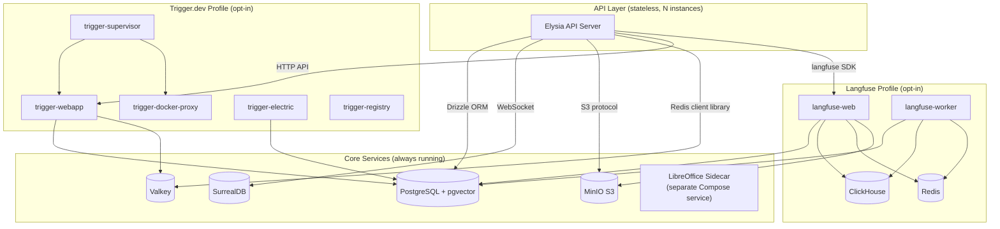
**Design principles**:
- **Stateless API** — every API server instance is replaceable. All durable state lives in Postgres, SurrealDB, MinIO, or Valkey. Horizontal scaling is adding more API instances behind a load balancer.
- **Graceful degradation** — Valkey down means in-memory fallback. Trigger.dev absent means in-process execution. Langfuse missing means silent no-op tracing. Only Postgres is truly required at the infrastructure service level, and the server will not start without a working Postgres connection (see the degradation model below for the full criticality matrix).
- **Profile isolation** — default startup runs only the core development services. Langfuse and Trigger.dev are activated through optional profile selectors.
### Degradation Model (Canonical)
- **Postgres unavailable**: hard failure. Core persistence is unavailable, so the instance is `down` and should return HTTP 503 for health checks.
- **JWT secret absent in production** (`NODE_ENV=production`): hard failure. Authentication is a security boundary, and auth fail-open would allow unauthorized data access. The server refuses to start. This is the only non-Postgres hard failure (see [12 — Server Implementation](./12-server.md)).
- **SurrealDB unavailable**: degrade gracefully. Long-term memory is disabled, but chat and short-term memory continue via Postgres.
- **MinIO or S3 unavailable**: degrade gracefully. File upload and file-backed document retrieval are disabled, but chat and non-file agent flows continue.
- **Valkey unavailable**: degrade gracefully. Rate limiting falls back to per-instance in-memory behavior where each API instance tracks its own counters independently. Global rate enforcement is lost, but per-instance protection remains. Budget checks fail-open so users are never blocked due to infrastructure failure, because budget enforcement is soft limits and not a hard security boundary. This is an intentional availability trade-off: temporary over-admission during a Valkey outage is preferable to blocking all users. Valkey availability should be treated as operationally critical and monitored accordingly, because sustained Valkey downtime means rate limits and budgets are effectively per-instance only.
- **Trigger.dev unavailable**: degrade gracefully. Background jobs execute in-process via the fallback queue adapter.
**Relationship to must-have requirements**: [01 — Requirements & Constraints](./01-requirements.md) lists capabilities like S3 storage, SurrealDB memory, and Valkey rate limiting as must-have deliverables. Must-have means the implementation must be shipped and tested. The degradation model above governs runtime behavior during transient outages, crash recovery, and rolling deployments. These are complementary rather than contradictory: code exists and works when infrastructure is present, while the system remains available when infrastructure is temporarily absent. A production deployment missing a must-have service indefinitely is an operational misconfiguration, not a supported configuration. The health endpoint reports `degraded` status and monitoring should alert on sustained degradation.
---
## Docker Compose Service Map
Every service, its purpose, health check, and persistence volume are shown below. Services are organized by profile group.
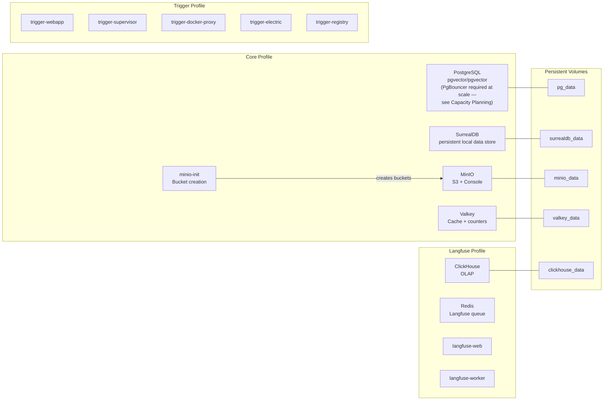
### Service Details
| Service | Image | Port(s) | Purpose | Health Check | Volume |
|---------|-------|---------|---------|-------------|--------|
| **db** | pgvector/pgvector | 5432 | Short-term memory, Drizzle ORM tables, PgVector chunks, file metadata, Langfuse DB, Trigger DB | Native database readiness probe | pg_data |
| **surrealdb** | surrealdb/surrealdb | 8000 | Long-term memory (graph + vector) | Service health endpoint probe | surrealdb_data |
| **minio** | minio/minio | 9000, 9001 | S3-compatible file storage, Langfuse media | Object storage liveness endpoint probe | minio_data |
| **minio-init** | minio/mc | — | Auto-creates application and media buckets | — | — |
| **valkey** | valkey/valkey | 6379 | Cache, budget counters, rate limiting sorted sets | Cache service ping probe | valkey_data |
| **trigger-webapp** | triggerdotdev/trigger.dev | 3040 | Background job dashboard and API | — | — |
| **trigger-supervisor** | triggerdotdev/supervisor | — | Manages containerized worker execution | — | — |
| **trigger-docker-proxy** | triggerdotdev/docker-provider | — | Docker socket proxy for worker containers | — | — |
| **trigger-electric** | electricsql/electric | — | Real-time sync for Trigger.dev | — | — |
| **trigger-registry** | registry | 5000 | Local registry for task images | — | — |
| **clickhouse** | clickhouse/clickhouse-server | 8123, 9100 | Langfuse OLAP traces and observations | Native analytics service ping probe | clickhouse_data |
| **redis** | redis | 6380 | Langfuse queue and cache (separate from Valkey) | Service ping probe | — |
| **langfuse-web** | langfuse/langfuse | 3100 | Langfuse UI and API | — | — |
| **langfuse-worker** | langfuse/langfuse | — | Async trace processor | — | — |
### Database Initialization
Postgres requires a database initialization script mounted in the standard initialization directory that creates the `langfuse` and `trigger` databases on first startup. These databases are isolated from the main application database.
### Port Conflict Resolution
- Valkey runs on default **6379**, and Langfuse Redis is remapped to **6380**.
- MinIO native port 9000 conflicts with ClickHouse native, so ClickHouse native is remapped to **9100**.
- Langfuse web is remapped to **3100** to avoid conflict with the API server on 3000.
- Trigger webapp is remapped to **3040**.
### LibreOffice
LibreOffice is modeled as a Docker Compose sidecar service, not installed into the API server image. The API server calls the sidecar over the internal Docker network on a dedicated service port for DOCX-to-PDF conversion. For local development without Docker, developers can still install LibreOffice on the host machine.
---
## Deployment Strategy
Deployment follows profile-based topology evolution:
- **Development baseline** runs core services only, with optional in-memory fallbacks if Valkey is unavailable and in-process background execution if Trigger.dev is absent.
- **Staging rollout** enables Trigger.dev and Langfuse profiles to validate full background orchestration, tracing, and reconciliation behavior under realistic traffic.
- **Production baseline** uses stateless API replicas behind load balancing, with rolling replacement and health-gated traffic admission.
- **Failure posture** keeps Postgres as the sole hard dependency and treats all other infrastructure as degradable with explicit health reporting.
- **Operational guardrails** require alerting on prolonged degraded mode, especially Valkey unavailability that weakens global rate and budget enforcement.
This strategy aligns with [03 — System Architecture](./03-architecture.md), [04 — Foundation](./04-foundation.md), [12 — Server Implementation](./12-server.md), and [14 — Observability](./14-observability.md).
---
## API Key Pool
The key pool distributes Gemini API calls across N API keys using round-robin. A single key adds zero overhead. N keys provide N× throughput by spreading requests across independent rate limit quotas.
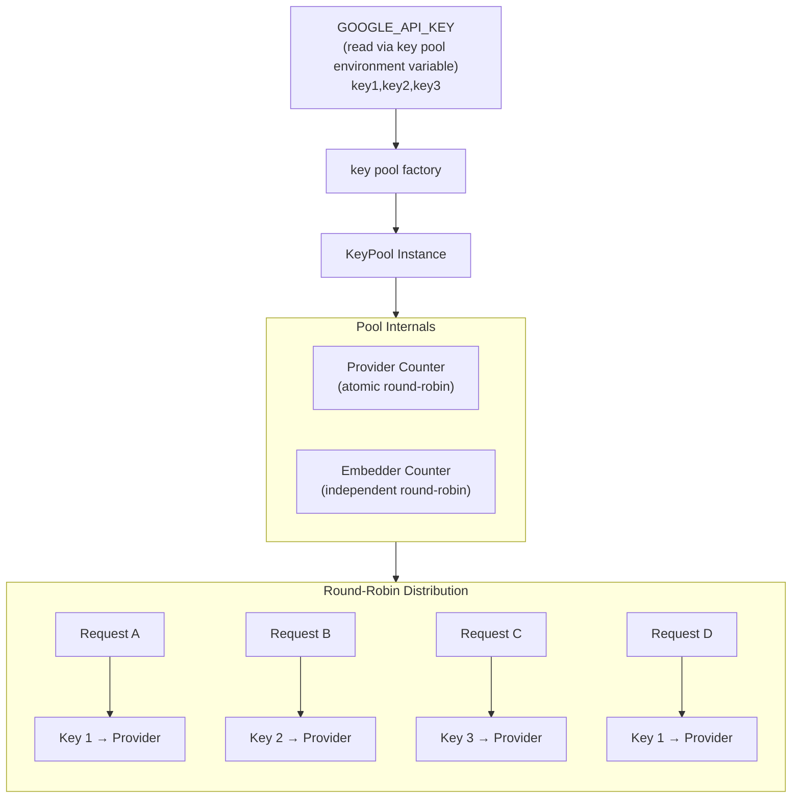
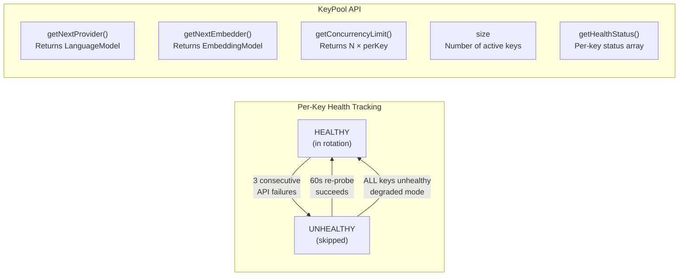
### Key Concepts
- **Comma-separated env var** — the key pool environment variable resolves to the `GOOGLE_API_KEY` environment variable (see [04 — Foundation](./04-foundation.md)). That variable contains API keys separated by commas. Whitespace is trimmed. A single key with no comma means no pool is created, and callers use the provider directly.
- **Independent counters** — provider and embedder calls cycle through keys independently. Summarization may call the provider first and the embedder later, and separate counters distribute load evenly across both paths.
- **Per-key concurrency** — default is 5 concurrent requests per key. With 3 keys, the system supports 15 concurrent API calls. This is configurable through `perKeyConcurrency`.
- **Health checking** — each key tracks consecutive failures. After 3 failures, the key is marked unhealthy and skipped. A background probe re-tests unhealthy keys every 60 seconds. If all keys are unhealthy, the pool falls back to round-robin across all keys in degraded mode.
- **Factory from env** — the key pool env helper reads the env var, returns `undefined` for missing or single-key scenarios, and returns a key pool for two or more keys.
---
## Valkey Cache
Valkey provides sub-millisecond read and write for budget counters, rate limiting sorted sets, and general-purpose caching. The connection uses a Redis connection URL. When Valkey is unavailable, an in-memory fallback satisfies the same interface for development and testing.
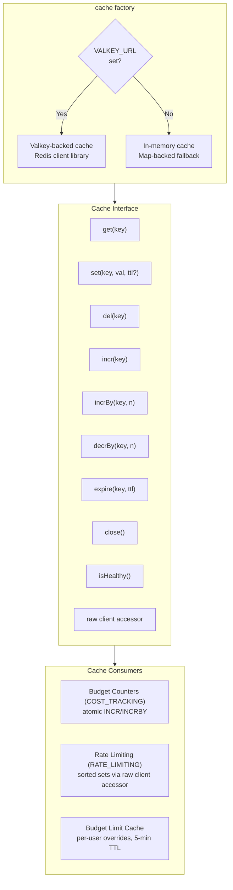
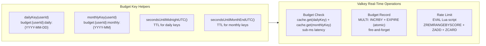
### In-Memory Fallback
The memory cache implements the identical `Cache` interface using a `Map`. TTL is checked on read. A periodic sweep every 60 seconds prevents unbounded growth in long-running development servers. The raw client accessor returns `null` in memory mode, and consumers that need raw Redis client library operations such as sorted sets or transactional units degrade to no-op or sequential fallback.
### Connection URL
The `VALKEY_URL` environment variable must use a Redis connection URL scheme. Using `valkey://` causes a connection error.
---
## Cost Tracking and Budget Enforcement
Budget enforcement follows an event-sourced design with two layers: a hot path through Valkey for real-time decisions and a cold path through Postgres for audit and reconciliation.
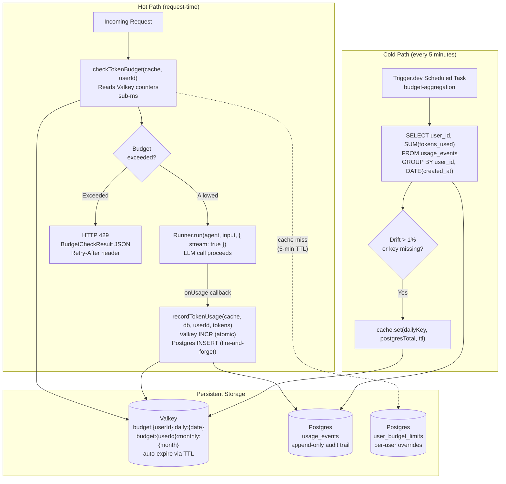
### Budget Check Flow
1. Read daily and monthly counters from Valkey with zero Postgres queries on the hot path.
2. Load per-user budget limits from Valkey cache with a five-minute TTL. On cache miss, query `user_budget_limits`, cache both daily and monthly caps, and fall back to config defaults if no override exists.
3. Compare counters against limits and return `BudgetCheckResult` with `allowed`, `daily`, `monthly`, and `resetsAt`.
4. Daily keys auto-expire at midnight UTC, and monthly keys expire at month end. Fresh counters start at zero for each new period.
### Token Recording
Token recording uses Redis client library transactional atomicity where increment and expiration are committed as one unit. This prevents orphaned keys that never expire if one operation succeeds and the other fails. In memory mode, sequential operations are acceptable for development. The Postgres insert into `usage_events` is fire-and-forget and never blocks the response.
### Budget INCRBY Pessimistic Reservation Model
Budget enforcement uses a pessimistic reservation pattern on accumulating spend counters:
- Before starting an LLM call, the system atomically increments the period spend counter by estimated token count using `INCRBY`.
- The returned value is the post-reservation total. If this exceeds the user limit, the reservation is immediately reversed by `DECRBY` of the same estimate, and the request returns HTTP 429.
- After completion, actual usage is reconciled against estimate. If actual exceeds estimate, an additional `INCRBY` is applied. If actual is lower, `DECRBY` is applied for the difference.
- The same period counters are used by both pre-reservation and usage recording, keeping semantics consistent: counters always represent accumulated spend, starting at zero and increasing toward the cap.
- This increment-check-rollback model avoids check-then-spend race conditions without requiring Lua for budget admission.
### Fail-Open Policy
If Valkey is unavailable during budget checks, the system returns `{ allowed: true }` and emits a warning log. Budget enforcement is a soft operational control, not a hard security boundary.
### Budget Admin API
Beyond `checkTokenBudget` and `recordTokenUsage`, the module exposes admin functions: `getUserBudget` reads per-user limits and current spend from Postgres with Valkey cache and returns `BudgetRecord`; `setUserBudget` updates `user_budget_limits` and invalidates cache; `listUserBudgets` returns paginated budget records with optional `overBudget` filtering.
---
## Trigger.dev Integration
Trigger.dev handles all background job execution. In production, tasks run in isolated containers with retries and dashboard visibility. In development, a transparent in-process fallback executes the same handlers directly.
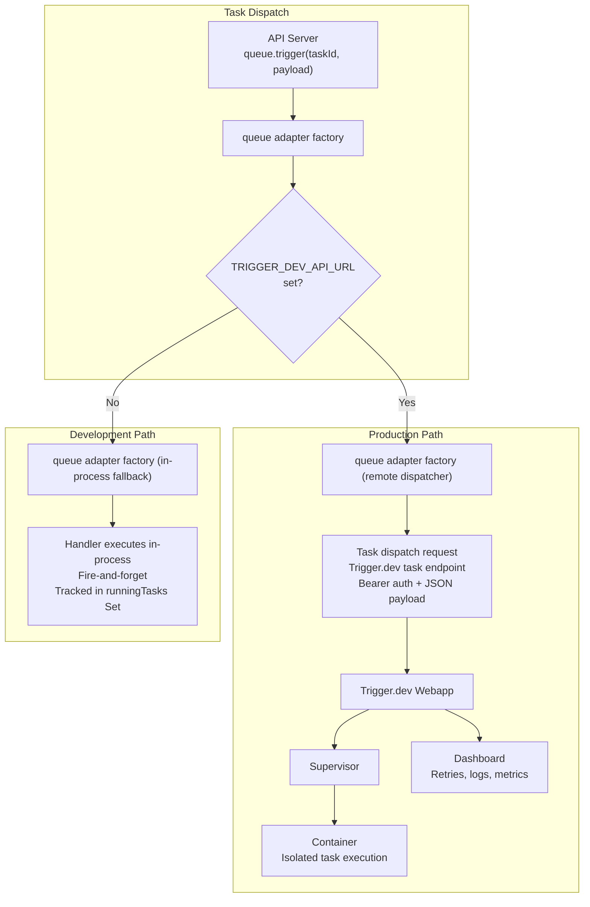
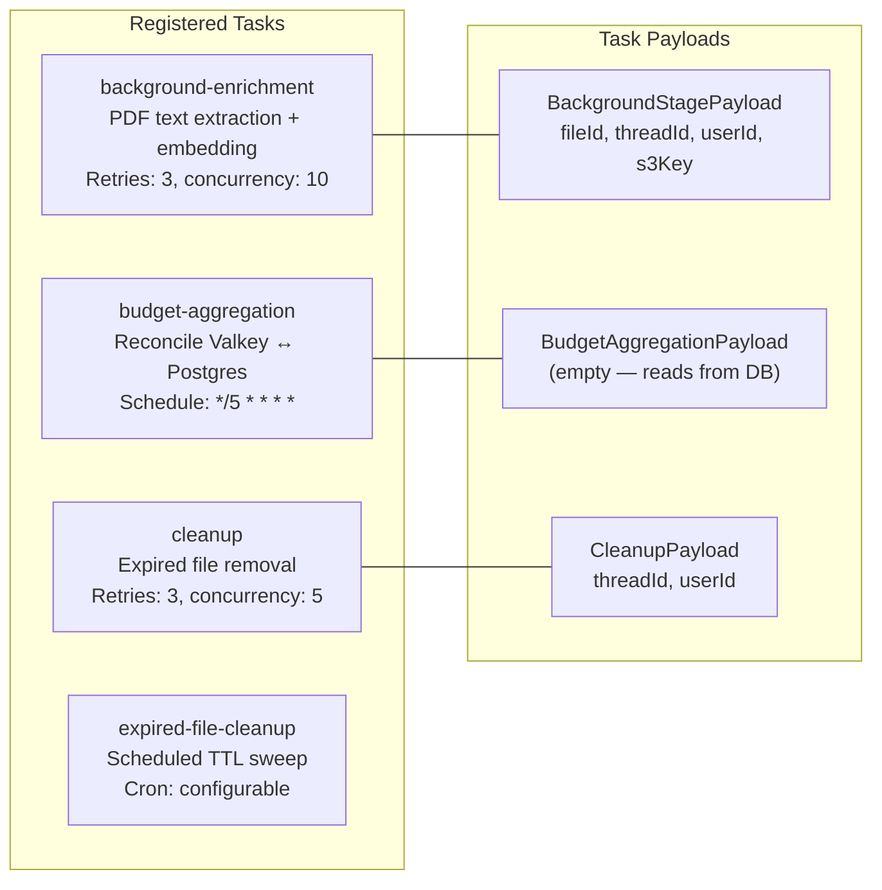
### Task Handlers
Each registered task maps to a shared handler function. The document enrichment handler covers object retrieval, text extraction, embedding, and upsert; the budget aggregation handler covers Postgres-to-Valkey reconciliation with distributed locking; the cleanup handler covers asynchronous file and data cleanup; and the expired file cleanup function performs scheduled TTL sweeps for expired file records.
### QueueAdapter Interface
The queue adapter interface exposes immediate dispatch. The adapter is created once at server startup and injected into route handlers and pipeline functions.
### In-Process Adapter Details
The in-process adapter tracks running tasks in a `Set<Promise<void>>`. Handler failures are caught and logged and never propagate to callers. `getRunningCount` exposes in-flight tasks for health monitoring. During graceful shutdown, the server awaits `Promise.allSettled` to drain running jobs.
### Handler Idempotency
The background enrichment handler uses `UPSERT` keyed on `file_id + page_number`. Since `page_index` has exactly one row per physical page with nullable enrichment columns populated during processing, retries after partial failure update existing rows without creating duplicates.
---
## Rate Limiting
The rate limiter factory produces per-route rate limiting using Valkey sorted sets and a sliding window algorithm. Each request adds a timestamped entry, expired entries are pruned on every check, and all operations execute in a single Lua script for atomicity at scale.
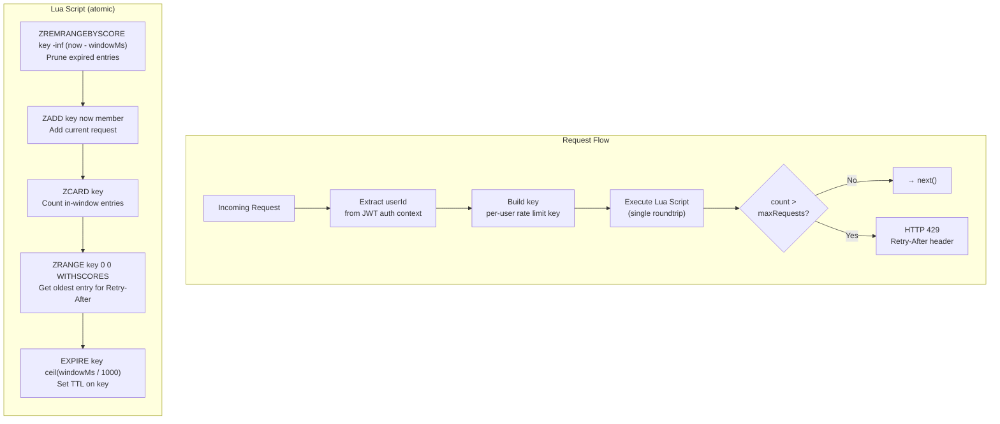
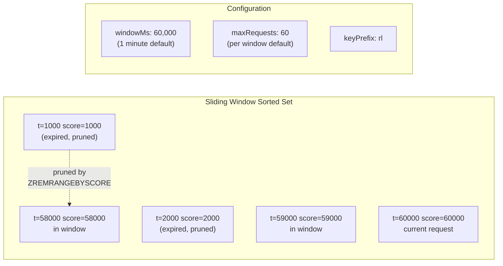
### Key Design Decisions
- **Lua EVAL over transactional batching** — sorted set rate limiting needs conditional read-then-write behavior and consistent retry timing in one roundtrip.
- **Member uniqueness** — each entry uses `crypto.randomUUID` to avoid collisions when multiple requests arrive within the same millisecond.
- **Per-user keying** — default extraction uses `userId` from auth context, and custom key extraction is supported for non-standard routes.
- **No-op in development fallback** — when the cache raw client accessor is `null`, global rate limiting is disabled to avoid blocking local workflows without Valkey.
- **Retry-After calculation** — derived from the oldest in-window entry using `ceil`, clamped to a minimum of one second.
---
## Structured Logging
All logging uses LogTape via `@logtape/logtape`. The library calls `getLogger` with hierarchical categories, while the consuming server calls `configure` at startup. Request context (`requestId`, `userId`, `threadId`, `agentId`, `traceId`) propagates through AsyncLocalStorage and enriches every log line automatically.
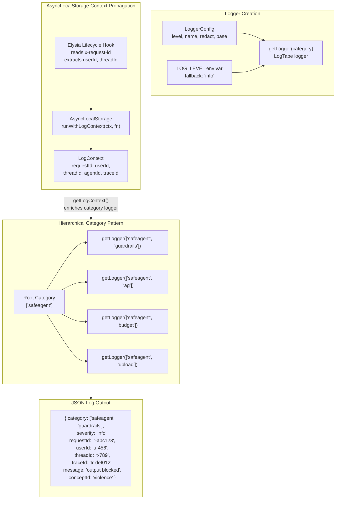
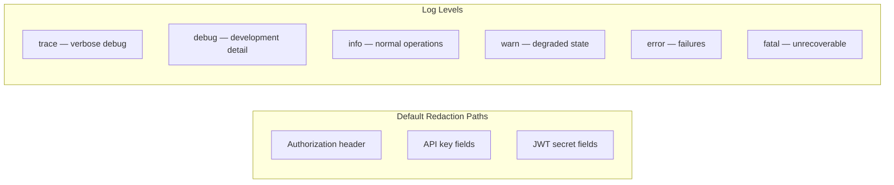
### Context API
- **`runWithLogContext`** wraps an async function with context that persists through awaited operations.
- **`getLogContext`** retrieves active context from anywhere in the async call stack.
- **`getLogger`** returns a category-scoped logger that includes active AsyncLocalStorage fields.
### Elysia Lifecycle Hooks
The logger lifecycle hook reads or generates `requestId` from the `x-request-id` header, extracts `userId` and `threadId` from Elysia context when available, and wraps the request handler in `runWithLogContext`. Every log line emitted during request processing includes these fields automatically.
LogTape configuration is applied only in the server entry point or test setup, never inside the library. Sensitive field scrubbing uses `@logtape/redaction`, and OpenTelemetry or Langfuse correlation uses `@logtape/otel`.
### Development Watch Mode
Hot-reload mode has known issues with native modules and debugger attachment. The development workflow uses full process restart on file change:
- Library development runs the test suite in watch mode.
- Server development runs the entry point in watch mode with full restart.
- Debug sessions run watch mode with debugger attachment and avoid hot reload.
---
## TTL Cleanup
Expired files are cleaned up by a scheduled Trigger.dev task. The process finds files past expiration, removes associated storage and search indexes, releases storage quota, and marks metadata as deleted.
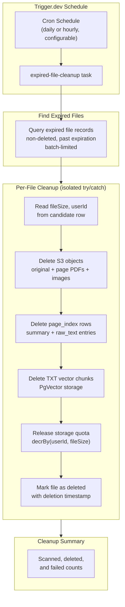
### Idempotency and Failure Isolation
- Each file is cleaned inside its own try/catch block, so one file failing does not stop the batch.
- Deleting already-missing objects is a no-op. Re-running cleanup after partial failure is safe.
- Failed files retain non-deleted status and error message so they are visible for retry on the next schedule.
- Storage quota release is best effort, where undercount is preferable to permanent over-reservation under partial failure.
### Configurable TTL
Each file type can have a different default TTL at upload time. The cleanup task remains policy-agnostic and only queries records where `expires_at < NOW()` and `status != 'deleted'`.
---
## Circuit Breaker
The circuit breaker wraps asynchronous external calls (Gemini API, RAGFlow API, Langfuse, MCP servers) to prevent cascading failures. When a dependency fails repeatedly, the breaker opens and rejects calls immediately to allow recovery.
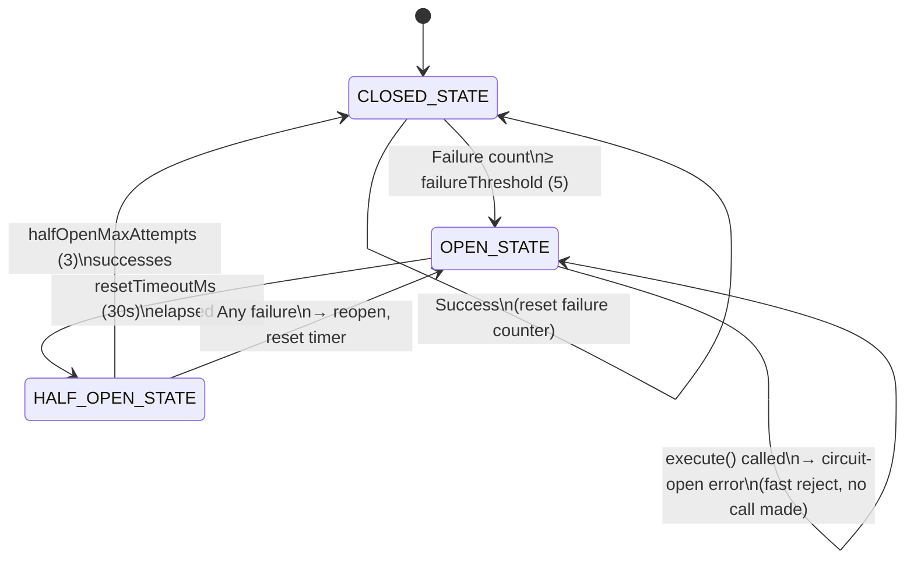
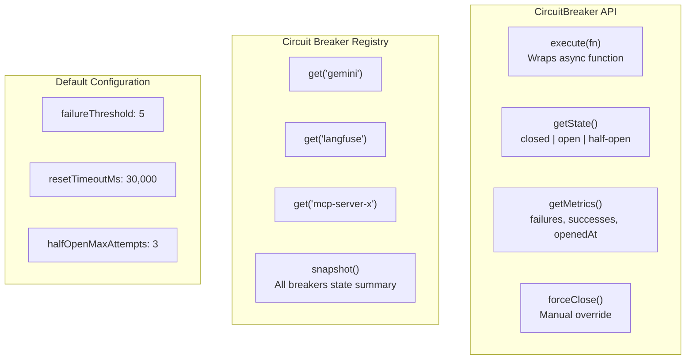
### Design Decisions
- **Per-external-call breaker scope** — each external dependency call path has its own breaker, and circuit state is not shared across unrelated integrations.
- **In-process state** — breaker state remains in process memory with no cross-instance synchronization.
- **Typed error** — circuit-open error carries a `retryAt` timestamp.
- **Registry pattern** — the circuit breaker registry factory provides named breakers with isolated state and health snapshot support.
- **Non-swallowing behavior** — wrapped errors propagate and are not hidden.
- **Injectable clock** — `now` can be injected for deterministic transition testing.
---
## Health Checks
The system exposes an aggregated health endpoint that checks critical and non-critical services independently. Overall status is `ok` when all services are up, `degraded` when only non-critical services are down, and `down` when the critical dependency Postgres is down.
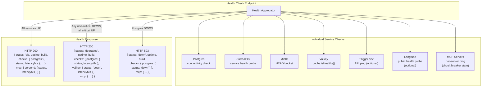
### Service Criticality
| Service | Critical | Failure Impact |
|---------|----------|---------------|
| Postgres | Yes | All persistence unavailable |
| SurrealDB | No | Long-term memory unavailable; short-term memory and chat continue via Postgres |
| MinIO or S3 | No | File upload and file-backed retrieval unavailable; chat continues |
| Valkey | No | Rate limiting falls back to in-memory; budget enforcement soft-fails |
| Trigger.dev | No | Background jobs run in-process via fallback adapter |
| Langfuse | No | Tracing disabled silently |
| MCP Servers | No | Individual tools unavailable |
The health endpoint returns HTTP 200 with `status: "ok"` when all services are reachable, HTTP 200 with `status: "degraded"` when one or more non-critical services are down, and HTTP 503 with `status: "down"` only when Postgres is down.
---
## Graceful Shutdown
On termination signals, the server initiates an ordered shutdown sequence that drains in-flight work before closing connections.
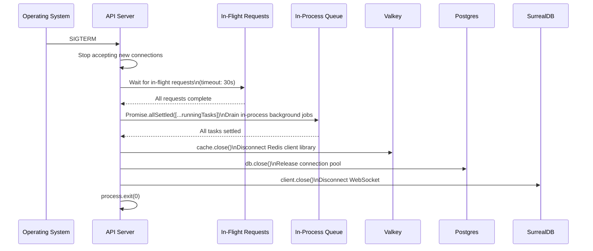
### Shutdown Order
1. **Stop accepting connections** — HTTP server stops listening.
2. **Drain in-flight requests** — wait up to 30 seconds for active requests.
3. **Drain background tasks** — `Promise.allSettled` waits for in-process jobs.
4. **Close external connections** — Valkey, Postgres, and SurrealDB disconnect cleanly.
5. **Exit** — process exits with code 0.
This ordering avoids data loss by allowing counters to flush, usage events to persist, and enrichment jobs to complete or remain safely retryable.
---
## Database Migrations (Drizzle)
Infrastructure-facing schema evolution is managed by Drizzle migrations with explicit operational boundaries:
- **Core budget schema** includes append-only `usage_events` for audit and `user_budget_limits` for per-user overrides.
- **File lifecycle schema** includes expiration and deletion metadata needed by TTL cleanup workflows.
- **Initialization separation** keeps app database migrations distinct from infrastructure bootstrapping of auxiliary databases for Trigger.dev and Langfuse.
- **Scale evolution** allows partition-oriented migration strategy for high-write tables once data volume justifies partitioning.
- **Runtime behavior** remains migration-safe because request-time admission paths rely on Valkey counters and cached limits, while Postgres is the source of reconciliation truth.
---
## Task Specifications
### Task DOCKER_COMPOSE: Docker Compose Infrastructure
**What to do**:
- Define the container orchestration infrastructure with all core services: Postgres (pgvector/pgvector), SurrealDB, MinIO, and Valkey.
- Include storage initialization for automatic bucket provisioning (application bucket, media bucket).
- Add Trigger.dev stack under profile `trigger`: webapp, supervisor, docker-proxy, electric, and local registry.
- Add Langfuse stack under profile `langfuse`: ClickHouse, Redis (port 6380), langfuse-web (port 3100), and langfuse-worker.
- Add a Postgres database initialization script for creating `langfuse` and `trigger` databases.
- Configure database connection pooling with an increased connection pool.
- Add a LibreOffice sidecar container in Docker Compose as a separate service and configure API communication over the Compose network.
- Declare persistent volumes: pg_data, surrealdb_data, minio_data, valkey_data, clickhouse_data.
- Add health checks on every service with appropriate check probes.
- Update environment variable templates with all S3, SurrealDB, Valkey, Trigger.dev, Langfuse, and LibreOffice variables.
**Depends on**: SCAFFOLD_SERVER (Server Scaffolding)
**Acceptance Criteria**:
- Starting the core stack brings all core services to healthy state.
- Postgres has pgvector extension available.
- MinIO responds to health checks and both buckets are auto-created.
- SurrealDB health probe reports success.
- Valkey ping probe returns healthy response.
- Starting trigger profile launches Trigger.dev webapp on port 3040.
- Starting langfuse profile launches Langfuse UI on port 3100 and ClickHouse on port 8123.
- LibreOffice sidecar starts healthy and is reachable from the API server on internal network.
- Postgres `langfuse` and `trigger` databases are auto-created by initialization script.
- Environment variable templates include all required variables.
**QA Scenarios**:
- Container services start healthy and report running state.
- MinIO initialization completes and required buckets exist.
- Langfuse profile starts and analytics probes report success.
- Valkey responds to ping and round-trip cache checks.
- Trigger profile starts and webapp is reachable.
- LibreOffice sidecar is reachable from API context.
---
### Task COST_TRACKING: Cost Tracking and Per-User Token Budgets
**What to do**:
- Create budget module with two-layer architecture: Valkey hot path for real-time decisions and Postgres cold path for audit.
- Add Drizzle schema tables: `usage_events` (append-only) and `user_budget_limits` (per-user overrides).
- Implement budget admission checks that read only from Valkey and return budget decision details with allowance state, period usage, and reset timing.
- Implement token usage recording with atomic counter updates and fire-and-forget Postgres persistence.
- Implement an admin budget read capability that returns per-user limits and current spend from Postgres with Valkey cache.
- Implement an admin budget update capability that persists per-user limits, invalidates cache entries, and optionally resets counters.
- Implement paginated budget administration listing with optional over-budget filtering.
- Daily keys auto-expire at midnight UTC and monthly keys at month end.
- Per-user overrides are cached in Valkey with five-minute TTL and fall back to config defaults (1M daily, 20M monthly).
- Budget exceeded responses return HTTP 429 with full `BudgetCheckResult` including Retry-After.
- Fail open when Valkey is unavailable and log warning.
- Middleware checks budget after `userId` extraction and before agent stream.
- Post-stream recording uses `onUsage` callback in stream handler with fire-and-forget semantics.
- Scheduled aggregation task reconciles Valkey counters with Postgres every five minutes.
**Depends on**: FILE_STORAGE (Drizzle schema), SSE_STREAMING (stream handler), VALKEY_CACHE (Cache module)
**Acceptance Criteria**:
- Hot-path budget checks read from Valkey only.
- Daily and monthly counters auto-expire via TTL.
- Recording updates counters atomically and writes append-only usage events.
- Budget exceeded returns descriptive 429 response.
- Token recording never blocks response.
- `usage_events` receives append-only inserts for every recording.
- Keys follow `budget:{userId}:daily:{YYYY-MM-DD}` and `budget:{userId}:monthly:{YYYY-MM}`.
- Per-user overrides are cached and respected.
- Admin budget read returns limits, current spend, and period metadata.
- Admin budget updates persist limits and invalidate cache.
- Budget administration listing supports pagination and optional over-budget filtering.
**QA Scenarios**:
- Over-limit user is blocked with `allowed: false`, remaining clamped to 0, and usage event persistence.
- Daily counters start fresh with TTL set to midnight.
- Hot path performs zero Postgres queries.
- Admin get returns expected custom limits and spend values.
- Admin set takes effect immediately via cache invalidation.
- Admin list with over-budget filter returns only over-limit users.
---
### Task KEY_POOL: API Key Pool
**What to do**:
- Build the key pool capability with a key pool factory and configuration object.
- Read the key pool environment variable (`GOOGLE_API_KEY`), parse comma-separated keys, and trim whitespace.
- Create one provider factory per key using AI SDK Google adapter.
- Implement round-robin distribution with separate provider and embedder counters.
- `getNextProvider` returns LanguageModel and `getNextEmbedder` returns EmbeddingModel.
- `getConcurrencyLimit` returns key count multiplied by `perKeyConcurrency` (default 5).
- The key pool env helper returns `undefined` for missing or single key values and returns a pool for two or more keys.
- Add per-key health tracking where three consecutive failures mark a key unhealthy and 60-second re-probe allows recovery.
- If all keys are unhealthy, enter degraded mode with full-key round-robin instead of hard stop.
**Depends on**: CORE_TYPES (types), SCAFFOLD_LIB (scaffolding)
**Acceptance Criteria**:
- Pool size reflects parsed key count.
- Provider rotation cycles in round-robin order.
- Embedder rotation remains independent from provider sequence.
- Concurrency limit calculation is correct.
- Empty or blank key lists fail fast.
- Env helper returns `undefined` for missing or single key values.
- Whitespace trimming yields clean key arrays.
**QA Scenarios**:
- Round-robin provider sequence cycles deterministically.
- Provider and embedder counters are independent.
- Env parsing with multiple keys yields expected size and concurrency.
- Single-key env value bypasses pool creation.
---
### Task VALKEY_CACHE: Valkey Cache Module
**What to do**:
- Build the cache capability with a cache factory.
- Valkey implementation uses a Redis client library with a Redis connection URL from `VALKEY_URL`.
- Cache interface includes `get`, `set`, `del`, `incr`, `incrBy`, `decrBy`, `expire`, `close`, `isHealthy`, and a raw client accessor.
- The raw client accessor exposes the underlying Redis client library for sorted sets and transactional operations.
- Add in-memory fallback with map-backed storage, read-time TTL checks, and periodic 60-second sweep.
- In-memory raw client accessor returns `null` so consumers can degrade to no-op or sequential fallback.
- Include budget key helpers: `dailyKey`, `monthlyKey`, `secondsUntilMidnightUTC`, `secondsUntilMonthEndUTC`.
- `get` returns `string | null`, where `null` means no key. Numeric consumers parse values, and general cache consumers store serialized JSON.
**Depends on**: CORE_TYPES (types), SCAFFOLD_LIB (scaffolding)
**Acceptance Criteria**:
- Valkey implementation connects and handles get/set/increment operations.
- In-memory fallback conforms to identical interface.
- Increment operations are atomic and return new value.
- Set supports TTL expiration.
- Budget helper key formats are correct.
- Health status reflects connectivity.
- Missing key returns null.
- Close disconnects without hanging.
**QA Scenarios**:
- Valkey operation sequence round-trips values and counter progression.
- In-memory fallback behavior mirrors Valkey semantics.
- Budget key helpers emit correct date and month key patterns.
---
### Task TRIGGER_TASKS: Trigger.dev Task Definitions and QueueAdapter
**What to do**:
- Create trigger module with QueueAdapter implementations.
- The remote queue adapter dispatches to Trigger.dev through its task endpoint.
- The in-process queue adapter executes handlers in-process with fire-and-forget semantics and running-task tracking.
- The queue adapter factory auto-selects an adapter based on Trigger.dev environment variables.
- Define tasks: background-enrichment (retries 3, concurrency 10), budget-aggregation (every five minutes), cleanup (retries 3, concurrency 5).
- Shared handlers include `processBackgroundStageJob`, `runBudgetAggregation`, and `runCleanup`.
- Ensure handler idempotency through upsert keyed on `file_id + page_number`.
**Depends on**: CORE_TYPES (types), RAG_INFRA (RAG functions), FILE_STORAGE (FileStorage), VALKEY_CACHE (Cache)
**Acceptance Criteria**:
- In-process adapter executes registered handlers.
- Unregistered task IDs fail with explicit error.
- Handler failures do not propagate to caller.
- `getRunningCount` reflects active tasks.
- `runningTasks` empties after completion.
- Trigger adapter sends authenticated dispatch payloads to correct endpoint.
- Queue adapter auto-selection behaves correctly by environment.
- Background enrichment remains idempotent under retries.
**QA Scenarios**:
- Fire-and-forget trigger returns quickly while handler continues.
- Dispatch integration emits correct authenticated request.
- Adapter selection changes with env presence.
- Enrichment handler performs expected retrieval, extraction, upsert, and status updates.
---
### Task RATE_LIMITING: Rate Limiting Middleware
**What to do**:
- Build rate limiting middleware with a rate limiter factory.
- Implement sliding window algorithm using Valkey sorted sets.
- Use single Lua script for prune, add, count, oldest-entry lookup, and expiration.
- Default config: `windowMs` 60,000, `maxRequests` 60, key prefix `rl`.
- Build a per-user rate limit key using JWT auth context.
- Ensure member uniqueness through `crypto.randomUUID`.
- Return HTTP 429 with Retry-After and JSON body when limit exceeded.
- Compute Retry-After from oldest in-window entry using ceiling and minimum one second.
- Support custom `keyExtractor` for non-default route patterns.
- No-op pass-through when the raw client accessor returns null in memory mode.
- Provide deterministic tests with fake clock for boundary conditions.
**Depends on**: CORE_TYPES (types), VALKEY_CACHE (Cache or Valkey)
**Acceptance Criteria**:
- Defaults apply when config omitted.
- Middleware reads auth context and builds expected key.
- Sliding window prunes expired entries and counts in-window requests only.
- Over-limit response includes 429, Retry-After, and JSON body.
- Retry-After is positive integer seconds based on oldest event.
- Concurrent requests stay within configured max due to atomic behavior.
- Custom key extractor overrides default behavior.
- Rate limiter exports are available through barrel.
**QA Scenarios**:
- With maxRequests set to 3, first three requests pass and fourth is rejected with Retry-After.
- After advancing time beyond window, request is allowed and effective counter resets.
---
### Task STRUCT_LOGGING: Structured Logging
**What to do**:
- Create logger module using LogTape where library code uses category loggers and server configures sinks at startup.
- Produce JSON output with configurable level from `LOG_LEVEL` and default `info`.
- Default redaction covers `req.headers.authorization`, `*.apiKey`, and `*.jwtSecret`.
- Implement AsyncLocalStorage request context propagation.
- Context shape includes `requestId`, `userId`, `threadId`, and optional `agentId`.
- API includes `runWithLogContext`, `getLogContext`, and `getLogger`.
- `getLogger` returns category-scoped logger enriched with active async context.
- Hierarchical sub-categories inherit parent sink configuration.
- Elysia lifecycle helper reads or generates request ID from `x-request-id` and wraps request execution in context.
**Depends on**: SCAFFOLD_LIB (scaffolding)
**Acceptance Criteria**:
- `getLogger` yields logger scoped to requested category array.
- `runWithLogContext` and `getLogContext` persist context across async boundaries.
- Emitted logs include active request and user context.
- Sub-category loggers inherit parent configuration and context.
- Redaction covers configured sensitive fields by default.
- Lifecycle helper binds request context and ID generation or echo.
- Module exports are available through barrel.
**QA Scenarios**:
- Async context persists across awaits and appears in emitted logs.
- Sensitive fields are redacted in structured output.
---
### Task TTL_CLEANUP: TTL-Based Automatic Cleanup
**What to do**:
- Build cleanup capability with an expired file cleanup function.
- Query expired rows where `expires_at < NOW()` and `status != 'deleted'`, with optional batch limit.
- Perform per-file cleanup with isolated try/catch: read metadata, delete object storage artifacts, delete `page_index` rows, delete vector chunks, release quota, and mark deleted with timestamp.
- Ensure idempotent retries when objects or rows are already absent.
- Keep batch progress even when one file fails, and persist failure details for retry.
- Register scheduled task in Trigger task registry.
- Return summary object with `scanned`, `deleted`, and `failed` counts.
- No extra migration is needed because expiration and deletion columns are already in schema.
**Depends on**: FILE_STORAGE (file storage), TRIGGER_TASKS (task registry), RAG_INFRA (chunk deletion)
**Acceptance Criteria**:
- Expired query targets only current time threshold and non-deleted status.
- Cleanup removes storage assets, page-index rows, and vector chunks.
- Metadata is updated to deleted status with timestamp after successful cleanup.
- Per-file failures are recorded while batch continues.
- Re-running cleanup is idempotent.
- Scheduled task registration invokes cleanup handler.
- Storage quota is released for each deleted file.
**QA Scenarios**:
- Expired file seed is fully cleaned with deleted status update.
- Partial failure still allows subsequent files to be deleted and summary to reflect mixed outcomes.
---
### Task CIRCUIT_BREAKER: Circuit Breaker for External Calls
**What to do**:
- Build the circuit breaker capability with a circuit breaker factory.
- Implement state machine: closed pass-through, open fast-reject with circuit-open error, and half-open limited probing.
- Default config includes threshold 5, reset timeout 30,000, and half-open max attempts 3.
- `execute` wraps async functions and drives transitions from outcomes.
- Circuit-open error includes `retryAt` timestamp.
- The circuit breaker registry factory provides named per-service breakers with isolated state.
- Registry `snapshot` returns all breaker states for health endpoint.
- Breakers are in-memory per process with no Valkey synchronization.
- Clock function is injectable for deterministic tests.
- Wrapped errors propagate without swallowing.
**Depends on**: CORE_TYPES (types)
**Acceptance Criteria**:
- Defaults match threshold 5, reset timeout 30,000, and half-open attempts 3.
- Breaker transitions to open after threshold failures.
- Open state rejects immediately without invoking wrapped call.
- After reset timeout, half-open admits limited trial calls.
- Successful half-open trials close breaker and reset counters.
- Failed half-open trial reopens breaker and resets timer.
- Registry provides isolated per-service instances.
- `forceClose` resets breaker to closed state.
**QA Scenarios**:
- With threshold 2, two failures open breaker and third call fast-rejects without function invocation.
- After timeout elapses, successful probe closes breaker and normal calls resume.
---
## Capacity Planning
### Postgres at Scale
A direct increased connection-pool posture is insufficient for a ten-million-user system with bursty traffic and background workers. PgBouncer or equivalent connection pooling is required in front of Postgres at scale. Multiplexing large numbers of application connections onto a smaller database pool eliminates per-instance pool sizing pressure.
High-write tables (`page_index`, `file_uploads`, `usage_events`) should be range partitioned by `user_id` hash once row counts exceed tens of millions. Partitioning distributes write I/O, keeps B-tree and vector indexes smaller for better insert and query performance, and enables partition-level maintenance without full-table locking. Since application queries already include `user_id` filters, partition pruning applies without query-layer changes. Drizzle supports this through migration-level DDL while query builder behavior remains unchanged.
### Valkey Memory Budget
Baseline per-user memory is roughly 500 bytes for sliding-window rate-limit sets plus roughly 100 bytes for budget counters, or around 600 bytes per active user. At ten million users with one percent daily activity, hot state is around 60MB. At ten percent concurrent activity under burst, hot state is around 600MB. Full-population concurrency would be roughly 6GB.
Additional cache consumers include embedding router topic cache, file registry cache, and geocoding cache. These are workload-dependent and should be monitored through memory telemetry. Configure `maxmemory` with `allkeys-lru` eviction so degradation remains graceful under pressure: evicted rate-limit entries are regenerated on subsequent requests, and evicted cache entries fall through to Postgres or upstream providers.
### SurrealDB Sizing
Long-term memory remains bounded per user, generally hundreds to low thousands of facts over a lifetime. At approximately 1KB per fact and 500 average facts per user, total storage is approximately 5TB at ten million users. SurrealDB distributed mode handles this range. Similarity search is scoped by `userId`, so per-query scanned set remains bounded even as global volume grows.
Deployment topology details like replica counts, shard counts, and region placement are environment-specific. The application layer remains topology-agnostic by connecting to a single SurrealDB endpoint.
### S3 or MinIO Key Distribution
Object keys use user-prefixed hierarchy for ownership cleanup. Concentrated upload traffic among few users can create hot prefixes, but storage-layer distribution mitigates much of this effect. If hotspotting appears at scale, prepend a short hash prefix derived from user identity to spread traffic across keyspace. This change remains isolated to key-generation utilities and does not require broader application changes.
---
## External References
- Trigger.dev: [https://trigger.dev/docs](https://trigger.dev/docs)
- Valkey: [https://valkey.io/docs](https://valkey.io/docs)
- MinIO: [https://min.io/docs](https://min.io/docs)
- LogTape: [https://logtape.org/](https://logtape.org/)
- ioredis: [https://redis.github.io/ioredis/](https://redis.github.io/ioredis/)
- Circuit Breaker pattern: failure threshold plus cooldown window to stop repeated calls to unhealthy dependencies, followed by controlled probes before returning to closed state
- Sliding window rate limiting: [https://redis.io/docs/latest/develop/data-types/sorted-sets/](https://redis.io/docs/latest/develop/data-types/sorted-sets/)
- AsyncLocalStorage: [https://bun.sh/docs/runtime/web-apis](https://bun.sh/docs/runtime/web-apis)
---
*Previous: [14 — Observability](./14-observability.md) | Next: [16 — Testing](./16-testing.md)*
