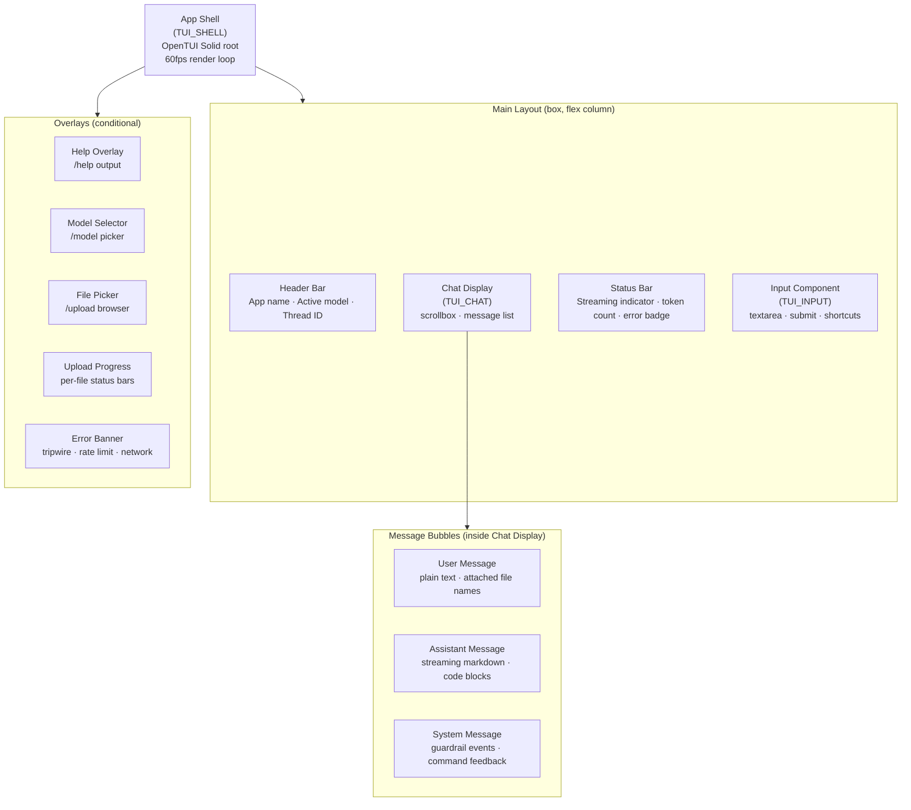
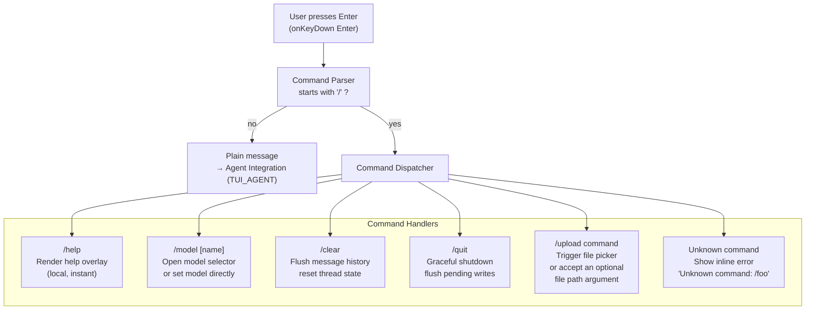
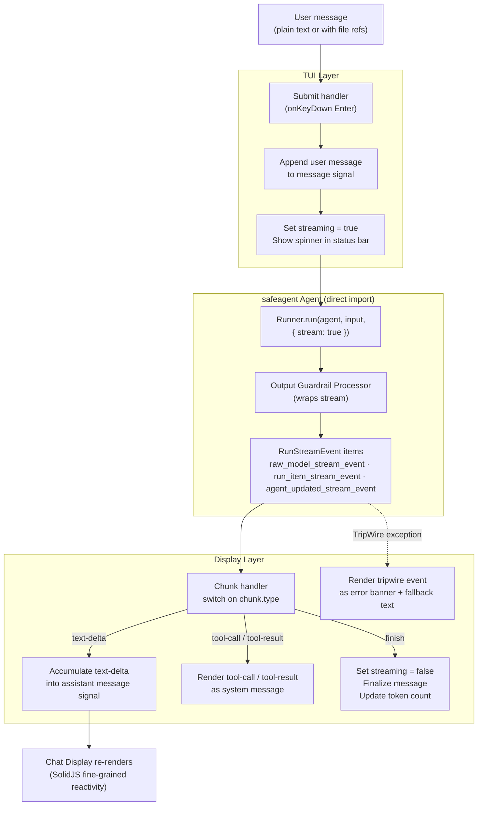
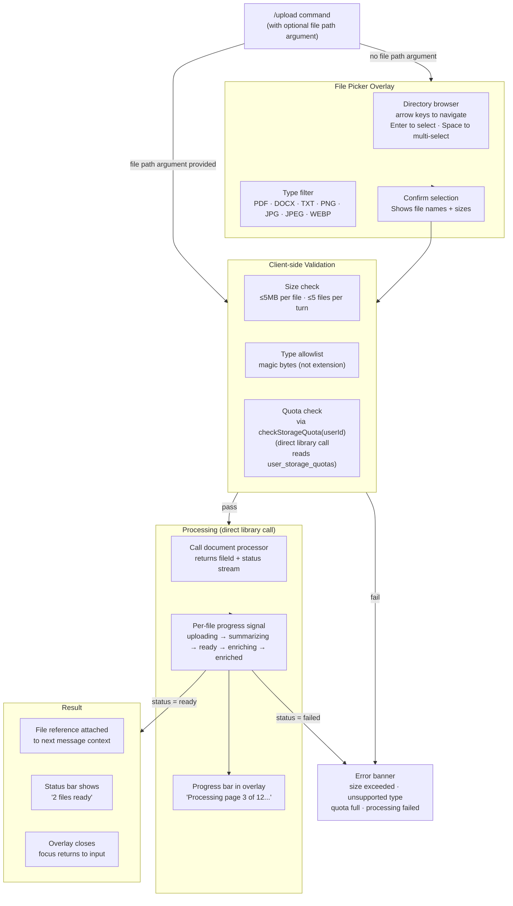

# 15 — TUI App

> **Scope**: The OpenTUI Solid terminal application. A full-featured chat client that talks directly to the safeagent agent layer, renders streaming markdown, handles slash commands, and supports file uploads from the terminal.
>
> **Tasks**: TUI_SHELL (App Shell), TUI_CHAT (Chat Display), TUI_INPUT (Input Component), TUI_COMMANDS (Command System), TUI_AGENT (Agent Integration), TUI_UPLOAD (Upload Command)

---

## Table of Contents

- [Overview](#overview)
- [Component Tree](#component-tree)
- [Command Routing](#command-routing)
- [Agent Integration Flow](#agent-integration-flow)
- [File Upload Flow](#file-upload-flow)
- [App Shell (TUI_SHELL)](#app-shell-tuishell)
- [Chat Display (TUI_CHAT)](#chat-display-tuichat)
- [Input Component (TUI_INPUT)](#input-component-tuiinput)
- [Command System (TUI_COMMANDS)](#command-system-tuicommands)
- [Agent Integration (TUI_AGENT)](#agent-integration-tuiagent)
- [Upload Command (TUI_UPLOAD)](#upload-command-tuiupload)
- [TUI-Specific Considerations](#tui-specific-considerations)
- [Cross-References](#cross-references)
- [Task Specifications](#task-specifications)

---

## Overview

The TUI is a first-class client for safeagent, not a demo or a thin wrapper. It targets the same quality bar as opencode: streaming markdown with syntax highlighting, real-time status indicators, guardrail event display, and file upload with progress feedback. Users who prefer the terminal get the full experience.

The TUI is built with OpenTUI Solid, a SolidJS reconciler for OpenTUI's native Zig terminal core. It runs at 60fps, uses reactive signals for state, and renders JSX to terminal primitives. Because it lives inside the safeagent workspace, it can import the agent layer directly and consume `RunStreamEvent` format from `Runner.run()` without going through the HTTP boundary. No format conversion, no SSE parsing, no client SDK needed.

---

## Component Tree

The application is a single render tree rooted at the App Shell. Every visible element is a child of that shell.

---

## Command Routing

All slash commands are intercepted before the input reaches the agent. The command router parses the first token of the input string, dispatches to the matching handler, and either resolves immediately (local commands) or triggers an async flow (agent-touching commands).

---

## Agent Integration Flow

The TUI imports the safeagent agent directly. It calls `Runner.run(agent, input, { stream: true })`, receives `RunStreamEvent` items, and pipes them into the reactive signal that drives the chat display. No HTTP, no SSE, no format conversion.

---

## File Upload Flow

The `/upload` command opens a file picker overlay. The user selects one or more files. Each file goes through the same document processing pipeline used by the HTTP API, but called directly as a library function. Progress is shown per file in the upload overlay.

---

## App Shell (TUI_SHELL)

The App Shell is the root component. It owns the render loop, the top-level layout, and the global keyboard handler. Everything else mounts inside it.

### OpenTUI Solid Setup

OpenTUI Solid is a SolidJS reconciler that renders JSX to terminal primitives instead of the DOM. The setup has three mandatory pieces that must all be present for the renderer to work:

**TypeScript config** must set `jsxImportSource` to `"@opentui/solid"`, not `"solid-js"`. Using `solid-js` as the import source will compile JSX against the DOM renderer and produce no terminal output. This is the single most common setup mistake.

**Bun config** for the TUI package must include `@opentui/solid/preload` in the preload array. The preload script patches Bun's module resolution so that SolidJS reactive primitives are wired to the OpenTUI renderer. Without it, signals work but nothing renders. This config is scoped to the TUI package directory and must not be placed at the workspace root, where it would affect other packages.

**The entry point** calls `render` from `@opentui/solid` with a root component function. The renderer takes over the terminal, sets up the 60fps render loop, and manages the lifecycle from that point.

### Layout

The shell renders a full-screen `box` with a flex-column layout. From top to bottom: header bar, chat display (flex-grow to fill remaining space), status bar, input component. Overlays are rendered conditionally on top using absolute positioning within the box.

### Global Keyboard Handler

The shell registers a single `onKeyDown` handler at the root level. It intercepts global shortcuts (Ctrl+C for quit, Ctrl+L for clear, Escape to dismiss overlays) before they reach child components. Child components register their own `onKeyDown` handlers for local shortcuts.

`onKeyDown` is the correct event. `onKeyPress` is typed in the OpenTUI Solid type definitions but never fires. Any keyboard handling that uses `onKeyPress` will silently do nothing.

### 60fps Render Target

OpenTUI's native Zig core targets 60fps. The SolidJS reconciler batches signal updates within a single frame and flushes them together. This means rapid streaming chunks (many per second) don't cause visible tearing or flicker. The render loop is managed by the core; application code does not need to manage timing.

---

## Chat Display (TUI_CHAT)

The Chat Display renders the conversation history and the currently-streaming assistant response. It's a `scrollbox` that contains a list of message components.

### Message Rendering

Each message in the history signal maps to a message component. User messages render as plain text with a colored prefix. Assistant messages render as markdown. System messages (guardrail events, command feedback) render with a distinct style.

The markdown renderer handles:
- Paragraphs and line breaks
- Inline code with background highlight
- Fenced code blocks with language-aware syntax highlighting via the `code` intrinsic element
- Bold and italic via `strong` and `em`
- Unordered and ordered lists
- Blockquotes

### Streaming Rendering

While the agent is streaming, the current assistant message is a live signal. Each `text-delta` chunk appends to the signal value. SolidJS's fine-grained reactivity means only the currently-streaming message re-renders on each chunk, not the entire message list. The markdown renderer re-parses the accumulated string on each update. This is fast enough at 60fps because the parser operates on a string that grows incrementally.

### Auto-Scroll

The scrollbox tracks whether the user has manually scrolled up. If they haven't, it auto-scrolls to the bottom on every new chunk. If they have scrolled up (to read earlier messages while a response is streaming), auto-scroll pauses. It resumes when the user scrolls back to the bottom.

### Code Block Rendering

Code blocks use the `code` intrinsic element from OpenTUI Solid. The language identifier from the fenced block's info string is passed to the element, which applies syntax highlighting using the terminal's color palette. Line numbers are optional and toggled by a keyboard shortcut.

---

## Input Component (TUI_INPUT)

The Input Component is a `textarea` that accepts multi-line input, handles submission, and forwards slash commands to the command router.

### Multi-line Support

The `textarea` intrinsic grows vertically as the user types. It has a minimum height of one line and a maximum height of eight lines, after which it scrolls internally. Newlines are inserted with Shift+Enter. Plain Enter submits.

### Keyboard Shortcuts

| Key | Action |
|-----|--------|
| Enter | Submit message or command |
| Shift+Enter | Insert newline |
| Ctrl+C | Clear input (first press) or quit (second press within 1s) |
| Up arrow | Recall previous message from history |
| Down arrow | Recall next message from history (or clear if at end) |
| Tab | Autocomplete slash command name |

All of these are implemented with `onKeyDown`. The `onKeyPress` event is not used anywhere in the input component.

### Input History

The component maintains a local history of submitted messages (not the chat history, just the input strings). Up/down arrows cycle through it. The history is in-memory and does not persist across sessions.

### Submission

On Enter, the component reads the current value, trims whitespace, and checks if it's empty. Empty submissions are ignored. Non-empty values are passed to the command router. If the router identifies a slash command, it handles it. Otherwise, the value is passed to the agent integration layer as a user message. Either way, the textarea clears after submission.

---

## Command System (TUI_COMMANDS)

The command system intercepts slash-prefixed input and routes it to the appropriate handler. It's a pure function: given an input string, it returns a command name and arguments, or null if the input isn't a command.

### Command Reference

**`/help`** renders the help overlay. The overlay lists all available commands with a one-line description each. It's dismissed with Escape or any key.

**`/model [name]`** opens the model selector overlay if called with no argument. If called with a model name, it sets the single active model for the current session immediately and shows a confirmation in the status bar. The model selector is a `select` intrinsic that lists available Gemini models only (matching the single-family constraint from 02-Configuration). Selecting one updates the model signal and closes the overlay. This is user preference switching for development/testing only; it does not enable multi-model branching across pipeline stages.

**`/clear`** flushes the in-memory message history and resets the thread state. It does not delete anything from persistent storage. A system message confirms the clear.

**`/quit`** initiates a graceful shutdown. It flushes any pending writes (memory, file references), then exits the process. If the agent is mid-stream, the stream is cancelled first.

**`/upload` with optional file path argument** triggers the file upload flow described in section 5. If a file path argument is provided inline, the file picker is skipped and validation starts immediately.

### Tab Completion

When the user types `/` followed by partial text, Tab completes to the first matching command name. If there are multiple matches, Tab cycles through them. The completion list is shown inline below the input.

### Unknown Commands

If the input starts with `/` but doesn't match any known command, the command system returns an error that the input component renders as an inline system message: `Unknown command: /foo. Type /help for a list of commands.`

---

## Agent Integration (TUI_AGENT)

The agent integration layer is the bridge between the TUI's reactive state and the safeagent agent. It owns the streaming lifecycle: starting a stream, processing chunks, handling errors, and cleaning up.

### Direct Import

The TUI imports the safeagent agent as a library. There's no HTTP call, no SSE connection, no client SDK. `Runner.run(agent, input, { stream: true })` returns an `AsyncIterable<RunStreamEvent>`. The integration layer iterates that async iterable and dispatches each event to the appropriate signal update.

### Chunk Dispatch

Each `RunStreamEvent` has a `type` field. The integration layer switches on it:

- `raw_model_stream_event`: extract text delta, append to current assistant message signal
- `run_item_stream_event` (tool call): append a system message showing the tool name and input
- `run_item_stream_event` (tool result): update the system message with the tool result
- `run_item_stream_event` (message output): finalize message content
- `agent_updated_stream_event`: log handoff for debugging (optional display)
- Stream completion: mark streaming complete, finalize the message, update token count in status bar

TripWire is NOT a chunk type — it is an exception. The stream consumption is wrapped in try/catch. When a TripWire is caught, the integration layer sets the error signal with the tripwire reason and fallback message, and stops streaming.

### Error Handling

Network errors, agent errors, and guardrail tripwires all surface through the error banner. The banner shows the error type, a human-readable message, and (for tripwires) the fallback message the agent provided. The banner is dismissed with Escape. After dismissal, the input is re-enabled and the user can continue the conversation.

Rate limit errors show a specific message with a countdown timer if the API returns a retry-after header.

### Guardrail Display

When a tripwire fires, the integration layer renders two things: the error banner (showing the guardrail reason) and the fallback message as a regular assistant message in the chat. This matches the behavior of the web client. The user sees a response, not a blank screen.

### Cancellation

If the user presses Ctrl+C while a stream is in progress, the integration layer cancels the async iterable, marks the current message as cancelled (with a visual indicator), and re-enables the input. Partial responses are kept in the chat history.

---

## Upload Command (TUI_UPLOAD)

The upload command gives terminal users the same file context capability as web users. It's the most complex command because it involves UI (the file picker), async processing (the document pipeline), and state management (attaching file refs to the next message).

### File Picker Overlay

The file picker is a full-screen overlay rendered over the main layout. It shows the current directory contents filtered to supported file types. Navigation uses arrow keys. Enter selects a file. Space toggles multi-select. Escape cancels without selecting anything.

The picker shows file names, sizes, and type icons. Unsupported file types are shown but greyed out and non-selectable.

### Processing Status

After selection, the overlay transitions from the picker view to the processing view. Each selected file gets a row with:
- File name
- A progress bar that fills as processing stages complete
- A status label: `uploading`, `summarizing`, `ready`, `enriching`, `enriched`, or `failed`

The progress bar maps to the file status state machine from the document processing pipeline. The TUI polls the file status (or subscribes to a status stream if the processor exposes one) and updates the signal on each transition.

### Supported Types

The upload command accepts PDF, DOCX, TXT, PNG, JPG, JPEG, and WEBP. The type check uses magic bytes, not file extension. A file named `report.pdf` that is actually a ZIP will be rejected with a clear error message.

### Attaching to Messages

Once all selected files reach `ready` status, the overlay closes and the file references are stored in a pending attachments signal. The status bar shows `N files ready`. The next message the user submits will include those file references in the agent context. After submission, the pending attachments signal clears.

If the user runs `/clear` while files are pending, the pending attachments are also cleared and a confirmation message notes this.

### Error Cases

| Error | Display |
|-------|---------|
| File exceeds 5MB | Inline error next to file name in picker |
| More than 5 files selected | Inline error at bottom of picker |
| Quota exceeded | Error banner with current usage and limit |
| Unsupported type | Greyed out in picker, error if forced via direct file path argument |
| Processing failed | Row shows `failed` status with error detail on hover |

---

## TUI-Specific Considerations

### jsxImportSource Must Be @opentui/solid

The `jsxImportSource` compiler option in the TypeScript config must be `"@opentui/solid"`. Setting it to `"solid-js"` compiles JSX against the DOM renderer. The code will compile without errors but produce no terminal output. This is a silent failure that's easy to miss.

### Bun Config Scope

The Bun config that includes `@opentui/solid/preload` must live inside the TUI package directory. Placing it at the workspace root would apply the preload to every package in the workspace, which would break packages that don't use OpenTUI. Bun applies the nearest config to each package, so scoping it to the TUI package is both correct and safe.

### onKeyDown, Not onKeyPress

OpenTUI Solid's type definitions include `onKeyPress` as a valid event handler prop. It never fires. The correct event for all keyboard handling is `onKeyDown`. Any component that uses `onKeyPress` will appear to work (no type errors, no runtime errors) but will silently ignore all keyboard input. Every keyboard handler in the TUI uses `onKeyDown`.

### RunStreamEvent Format Directly

The TUI consumes `RunStreamEvent` format from `Runner.run()` directly, with no bridge or conversion layer. The TUI bypasses the HTTP boundary entirely, so its event handler works directly with framework stream event types.

### Reactive State Model

The TUI uses SolidJS signals for all mutable state: message history, streaming state, current model, pending attachments, error state, overlay visibility. Derived state uses `createMemo`. Side effects (starting streams, polling file status) use `createEffect`. This is standard SolidJS; the OpenTUI renderer is transparent to the reactive system.

### Terminal Resize

OpenTUI handles terminal resize events natively. The layout reflows automatically when the terminal window is resized. The scrollbox in the chat display recalculates its visible area. No application-level resize handling is needed.

---

## Cross-References

| Document | Relationship |
|----------|-------------|
| **Agent & Orchestration** ([05](./05-agent-and-orchestration.md)) | Defines the agent and orchestrator behavior the TUI consumes directly through in-process stream calls. |
| **Streaming & Transport** ([13](./13-streaming-and-transport.md)) | Shares stream semantics and event concepts; TUI bypasses HTTP/SSE conversion but must stay aligned with transport-level `RunStreamEvent` behavior. |
| **Server Implementation** ([14](./14-server-implementation.md)) | Provides parity reference for authenticated routes and upload workflows that the TUI mirrors or calls when running against server APIs. |

---

## Task Specifications

---

### Task TUI_SHELL: App Shell

**What to do**:

Set up the OpenTUI Solid application entry point with the correct TypeScript `jsxImportSource` config, a scoped Bun config with the preload entry, and a root App component. The App component renders the full-screen layout: header bar, chat display, status bar, and input component. It registers the global `onKeyDown` handler for Ctrl+C (quit) and Ctrl+L (clear). It owns the top-level signals for overlay visibility and global error state.

**Depends on**:

SCAFFOLD_LIB

**Acceptance Criteria**:

- Running the TUI entry point with `bun` renders a full-screen terminal UI without errors
- The layout fills the terminal window and reflows correctly on resize
- Ctrl+C triggers a graceful shutdown (process exits cleanly)
- The header bar shows the app name and a placeholder model name
- The status bar is visible at the bottom
- The input component is focused on startup

**QA Scenarios**:

- Start the app in a small terminal (80x24). Verify layout fits without overflow.
- Resize the terminal while the app is running. Verify the layout reflows.
- Press Ctrl+C. Verify the process exits with code 0.
- Verify no `onKeyPress` handlers exist anywhere in the shell component.
- Verify the Bun preload config is scoped to the TUI package and not at the workspace root.

---

### Task TUI_CHAT: Chat Display

**What to do**:

Implement the chat display as a `scrollbox` containing a reactive list of message components. User messages render as plain text with a colored prefix. Assistant messages render as streaming markdown with code block syntax highlighting. System messages render with a distinct muted style. Auto-scroll follows new content unless the user has scrolled up. Scrolling back to the bottom re-enables auto-scroll.

**Depends on**:

TUI_SHELL (App Shell must exist to mount the chat display).

**Acceptance Criteria**:

- A static assistant message with a fenced code block renders with syntax highlighting
- A streaming assistant message updates in real time as chunks arrive, with no visible flicker
- Auto-scroll follows new content when the user is at the bottom
- Auto-scroll pauses when the user scrolls up and resumes when they scroll back down
- Markdown elements (bold, italic, inline code, lists, blockquotes) render as distinct visual elements (bold text is visually emphasized, code has background highlight, lists show bullets/numbers)
- Long messages that exceed the terminal height are scrollable

**QA Scenarios**:

- Send a message that produces a multi-paragraph response with a code block. Verify all markdown elements render correctly.
- While a long response is streaming, scroll up. Verify auto-scroll pauses. Scroll back to the bottom. Verify auto-scroll resumes.
- Resize the terminal mid-stream. Verify the scrollbox reflows and streaming continues.
- Trigger a tripwire. Verify the fallback message renders as an assistant message and the error banner appears.

---

### Task TUI_INPUT: Input Component

**What to do**:

Implement the input component as a `textarea` with multi-line support. Enter submits. Shift+Enter inserts a newline. The textarea grows up to eight lines then scrolls internally. Up/down arrows cycle through in-memory input history. Tab completes slash command names. The component clears after submission and re-focuses automatically.

**Depends on**:

TUI_SHELL (App Shell).

**Acceptance Criteria**:

- Typing and pressing Enter submits the value and clears the textarea
- Shift+Enter inserts a newline without submitting
- The textarea grows from one line to eight lines as content is added
- Up arrow recalls the previous submitted input; down arrow moves forward through history
- Tab completes `/hel` to `/help`
- Empty submissions (whitespace only) are ignored
- The input is disabled while the agent is streaming and re-enabled when streaming completes

**QA Scenarios**:

- Type a multi-line message with Shift+Enter. Verify newlines appear in the textarea and the full multi-line string is submitted.
- Submit five messages. Press Up five times. Verify each previous message is recalled in order.
- Type `/mo` and press Tab. Verify it completes to `/model`.
- Press Enter on an empty textarea. Verify nothing is submitted.
- Start a streaming response. Verify the textarea is disabled. Wait for streaming to complete. Verify the textarea is re-enabled and focused.

---

### Task TUI_COMMANDS: Command System

**What to do**:

Implement the command router as a pure function that parses slash commands from input strings. Implement handlers for `/help`, `/model`, `/clear`, `/quit`, and `/upload`. `/help` renders the help overlay. `/model` opens the model selector or sets the session's single active model directly (no multi-model branching). `/clear` flushes message history. `/quit` shuts down gracefully. Unknown commands show an inline error. Tab completion in the input component uses the command registry from this module.

**Depends on**:

TUI_SHELL (App Shell, for overlay rendering).

**Acceptance Criteria**:

- `/help` opens the help overlay showing all commands with descriptions
- `/model` with no argument opens the model selector overlay
- `/model gemini-2.5-flash` sets the active model and shows a confirmation in the status bar
- `/clear` flushes the message history and shows a system message confirming the clear
- `/quit` exits the process with code 0 and no error output
- `/upload` triggers the file picker (TUI_UPLOAD must be complete for full behavior; before TUI_UPLOAD, it shows a "not yet implemented" message)
- `/foo` shows `Unknown command: /foo. Type /help for a list of commands.`
- Tab completion works for all five command names

**QA Scenarios**:

- Type `/help` and press Enter. Verify the overlay appears. Press Escape. Verify it closes.
- Type `/model` and press Enter. Verify the model selector opens. Select a model. Verify the header bar updates.
- Type `/clear` and press Enter. Verify the message history is empty and a confirmation system message appears.
- Type `/unknown` and press Enter. Verify the inline error message appears.
- Type `/q` and press Tab. Verify it completes to `/quit`.

---

### Task TUI_AGENT: Agent Integration

**What to do**:

Wire the TUI to the safeagent agent using a direct import. Implement the streaming lifecycle: start stream on message submit via `Runner.run(agent, input, { stream: true })`, dispatch `RunStreamEvent` items to the appropriate signal updates, catch `InputGuardrailTripwireTriggered` / `OutputGuardrailTripwireTriggered` exceptions (render error banner + fallback message), handle cancellation with Ctrl+C, and finalize the message on stream completion. Show a spinner in the status bar while streaming. Update the token count in the status bar when streaming completes.

**Depends on**:

TUI_SHELL (App Shell), TUI_CHAT (Chat Display), TUI_INPUT (Input Component)

**Acceptance Criteria**:

- Submitting a message starts a stream and shows the spinner in the status bar
- Text chunks appear in the chat display in real time
- Tool calls and results appear as system messages
- A caught TripWire exception shows the error banner with the guardrail reason and renders the fallback message as an assistant message
- Pressing Ctrl+C during streaming cancels the stream, marks the message as cancelled, and re-enables the input
- The token count in the status bar updates when streaming completes
- A rate limit error shows a specific message with a retry countdown if available

**QA Scenarios**:

- Send a message that triggers a tool call. Verify the tool call and result appear as system messages.
- Send a message that triggers a guardrail tripwire. Verify the error banner appears and the fallback message is in the chat.
- Start a streaming response and press Ctrl+C. Verify the stream stops, the partial message is marked cancelled, and the input is re-enabled.
- Simulate a network error mid-stream. Verify the error banner appears and the input is re-enabled.
- Send a message and wait for completion. Verify the token count in the status bar is non-zero.

---

### Task TUI_UPLOAD: Upload Command

**What to do**:

Implement the `/upload` command end-to-end. The file picker overlay browses the filesystem filtered to supported types. Multi-select with Space. After confirmation, validate each file (size, type via magic bytes, quota). Show per-file progress bars during processing. Attach ready files to the pending attachments signal. Show `N files ready` in the status bar. Include the file references in the next submitted message. Clear pending attachments after submission or after `/clear`.

**Depends on**:

TUI_SHELL (App Shell, for overlay rendering), TUI_COMMANDS (Command System, for /upload dispatch), TUI_AGENT (Agent Integration, for attaching file refs to messages)

**Acceptance Criteria**:

- `/upload` opens the file picker overlay
- The picker shows only supported file types (PDF, DOCX, TXT, PNG, JPG, JPEG, WEBP); unsupported types are greyed out
- Selecting a file and confirming starts processing and shows a progress bar
- A file that exceeds 5MB shows an inline error in the picker
- Selecting more than 5 files shows an inline error
- A file with a mismatched magic bytes type is rejected with a clear error
- When all files reach `ready`, the overlay closes and the status bar shows `N files ready`
- The next submitted message includes the file references
- `/clear` while files are pending clears the pending attachments and shows a confirmation

**QA Scenarios**:

- Run `/upload` and navigate to a directory with a mix of supported and unsupported files. Verify unsupported files are greyed out.
- Select a PDF larger than 5MB. Verify the inline error appears and the file cannot be confirmed.
- Select 3 valid files. Verify all three show progress bars and transition to `ready`. Verify the status bar shows `3 files ready`.
- Submit a message after uploading files. Verify the agent receives the file references. Verify the status bar clears the `N files ready` indicator.
- Run `/upload` and press Escape without selecting anything. Verify the overlay closes and no files are attached.
- Run the upload command with an inline file path argument. Verify the picker is skipped and processing starts immediately.

---

*Previous: [14 — Server Implementation](./14-server-implementation.md)*
*Next: [16 — Observability & Eval](./16-observability-and-eval.md)*
