# 16 — Testing

> **Scope**: Complete testing methodology covering thirteen testing types, suite separation for CI behavior, mock-model patterns, QA policy, coverage linkage to requirement IDs, and task specifications for E2E verification, publish preparation, smoke validation, load benchmarking, and final audits.
>
> **Tasks**: E2E_TESTS, PKG_PUBLISH, SMOKE_TESTS, LOAD_TESTS, AUDIT_PLAN, AUDIT_CODE, AUDIT_QA, AUDIT_SCOPE.

## Table of Contents

- [Testing Philosophy](#testing-philosophy)
- [Testing Pyramid](#testing-pyramid)
- [Test Execution Flow](#test-execution-flow)
- [CI Pipeline](#ci-pipeline)
- [Test Suite Separation](#test-suite-separation)
- [Mock Model Pattern](#mock-model-pattern)
- [Unit Tests](#unit-tests)
- [Integration Tests](#integration-tests)
- [End-to-End Tests (E2E_TESTS)](#end-to-end-tests-e2e_tests)
- [Eval Tests](#eval-tests)
- [Load Tests (LOAD_TESTS)](#load-tests-load_tests)
- [Adversarial Tests](#adversarial-tests)
- [Regression Tests](#regression-tests)
- [Property-Based Tests](#property-based-tests)
- [Chaos and Failure Testing](#chaos-and-failure-testing)
- [Contract Testing](#contract-testing)
- [Mutation Testing](#mutation-testing)
- [Snapshot and Golden-File Testing](#snapshot-and-golden-file-testing)
- [Streaming-Specific Tests](#streaming-specific-tests)
- [Per-Module Test Specifications](#per-module-test-specifications)
- [Development Seed Data](#development-seed-data)
- [QA Policy](#qa-policy)
- [Task Specifications](#task-specifications)
- [Coverage Map](#coverage-map)
- [Extended Coverage Map](#extended-coverage-map)
- [Requirement-Level Coverage (MH_*, MN_*)](#requirement-level-coverage-mh_-mn_)
- [Verification Strategy Summary](#verification-strategy-summary)
- [Cross-Plan References](#cross-plan-references)
- [External References](#external-references)

## Testing Philosophy

> **Core Principle**: We sacrifice speed of development to ensure nothing breaks when we move forward. Every logic path, every feature boundary, and every failure mode has comprehensive automated verification before code is considered complete.

This philosophy governs all testing decisions across both repositories. It rests on seven pillars.

### Pillar 1 — Incremental Confidence

Every implementation task delivers tests and implementation together. TDD discipline (RED → GREEN → REFACTOR) is non-negotiable. When a module ships, its test coverage ships simultaneously. The system grows in lockstep: no feature exists without corresponding verification. Moving forward means every step lands on proven ground.

### Pillar 2 — Layered Defense

No single testing layer catches all failure modes. Unit tests catch logic errors. Integration tests catch wiring errors. End-to-end tests catch behavioral regressions. Eval tests catch quality degradation. Adversarial tests catch safety bypasses. Property-based tests catch invariant violations. Chaos tests catch resilience gaps. Every critical path is covered by at least three independent layers.

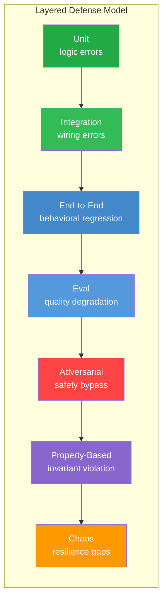

### Pillar 3 — Deterministic Core, Stochastic Edge

The system isolates deterministic orchestration (routing, retries, guardrails, state machines, configuration merging, budget arithmetic, rate limiting) into testable code layers where assertions are exact. LLM outputs are inherently non-deterministic and require eval-based validation rather than assertion-based testing. These two paradigms coexist but never conflate. Deterministic logic uses strict equality assertions. Stochastic output uses threshold-based quality scoring.

### Pillar 4 — Eval as First-Class Citizen

AI agent systems fail differently than traditional software. Output quality degradation, reasoning drift, and emergent misbehavior do not manifest as exceptions. They manifest as subtle changes in response quality that only evaluation can detect. Evaluation datasets are treated as code: version-controlled, reviewed, and maintained. Eval results are compared against defined thresholds, and regressions are failures. Golden datasets grow from production failures, not synthetic scenarios.

### Pillar 5 — Test at the Right Speed

Run cheap tests on every commit. Run expensive tests nightly. Run chaos experiments in staging. Match test execution cost to failure impact. Unit tests gate every push. Integration tests gate release readiness. Eval tests gate quality certification. Load tests gate deployment confidence. This stratification preserves developer velocity while maintaining comprehensive coverage.

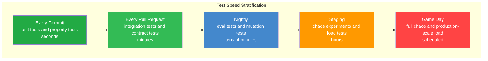

### Pillar 6 — Contract as Boundary

The library and server exist in separate repositories with a clean interface boundary. Consumer-driven contract tests verify that interface changes propagate correctly without requiring full integration test execution. Schema validation catches mismatches at the unit test level. The library defines what it provides. The server defines what it expects. Contract tests verify these promises align.

### Pillar 7 — Embrace Non-Determinism

Rather than fighting LLM variability, testing strategies account for it. Snapshot structure, not content. Evaluate quality, not exact correctness. Use golden datasets with property assertions rather than string matching. Accept that streaming output varies and test format compliance and behavioral invariants instead. For every non-deterministic output, define what properties must hold regardless of the specific text generated.

### The Testing Tax

Every test incurs maintenance cost that compounds over time. The testing philosophy manages this tax deliberately:

- **Unit tests**: near-zero maintenance cost, highest value per line. Write liberally.
- **Integration tests**: moderate maintenance cost, essential for external boundary validation. Write selectively for real integration points.
- **End-to-end tests**: highest maintenance cost, highest confidence per test. Write for critical user flows only.
- **Eval tests**: ongoing curation cost as production reveals new failure modes. Budget for eval maintenance as a continuous activity.
- **Load tests**: minimal maintenance, high infrastructure cost. Run on demand, not continuously.
- **Adversarial tests**: growing corpus, low individual cost. Expand continuously as new attack vectors emerge.

The goal is not maximum test count but maximum confidence per maintenance dollar. Intelligent test selection and layered coverage outperform naive coverage expansion.

## Testing Pyramid

The project uses thirteen testing types organized into three tiers by execution frequency and cost. Every module has unit coverage; critical paths are covered by at least three layers.

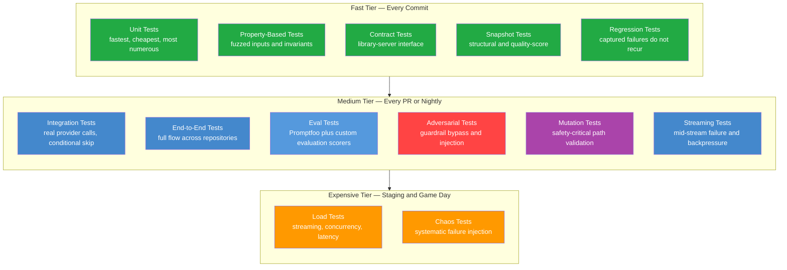

## Test Execution Flow

All suites run through the Bun test runner flow. Selection, discovery, execution, reporting, and evidence capture follow one shared lifecycle.

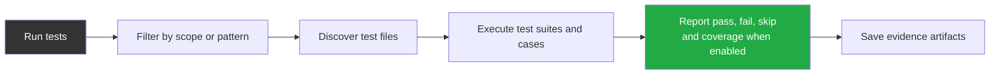

## CI Pipeline

CI follows strict order. Unit tests run first without secrets. Integration tests run only when keys exist. End-to-end and eval stages run after functional gates are green.

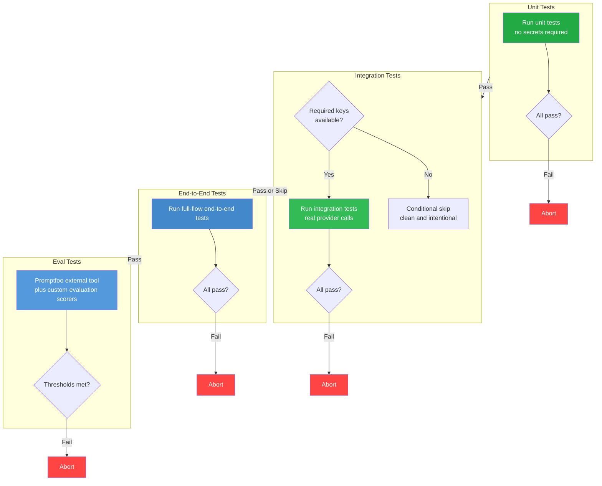

## Test Suite Separation

This is the core testing infrastructure rule: if a unit test fails because of missing secrets, that is a test design bug.

### Boundaries

```mermaid
flowchart TD
    subgraph UNIT_BOUNDARY["Unit Tests - Zero Secrets"]
        UNIT_MODULE_LOGIC["Module logic"]
        UNIT_TYPE_CONVERSION["Type conversions"]
        UNIT_CONFIG_MERGE["Config merging"]
        UNIT_GUARD_DETECTION["Guardrail detection logic"]
        UNIT_STREAM_TRANSFORMS["Stream transformers"]
        UNIT_MOCK_RESPONSES["Mock model responses"]
        UNIT_PURE_FUNCTIONS["Pure functions"]
    end

    subgraph INTEGRATION_BOUNDARY["Integration Tests - Secrets Required"]
        INTEGRATION_REAL_LLM["Real model calls"]
        INTEGRATION_REAL_EMBEDDINGS["Real embedding generation"]
        INTEGRATION_DB_ROUND_TRIPS["Database round-trips"]
        INTEGRATION_STORAGE_ROUND_TRIPS["Object storage upload and download"]
        INTEGRATION_EXTERNAL_GUARDS["External API guardrails"]
        INTEGRATION_TRACING["Observability trace creation"]
    end

    subgraph END_TO_END_BOUNDARY["End-to-End Tests - Full Environment"]
        END_TO_END_AGENT_FLOW["Agent create to stream to consume"]
        END_TO_END_SERVER_FLOW["Server start to stream to auth"]
        END_TO_END_DOCUMENT_FLOW["Upload to process to query to cite"]
        END_TO_END_MEMORY_FLOW["Extract to store to recall"]
        END_TO_END_GUARDRAIL_FLOW["Trigger to tripwire to fallback"]
    end

    UNIT_BOUNDARY -.->|"never crosses"| INTEGRATION_BOUNDARY
    INTEGRATION_BOUNDARY -.->|"never crosses"| END_TO_END_BOUNDARY

    style UNIT_BOUNDARY fill:#e8f5e9,stroke:#2e7d32
    style INTEGRATION_BOUNDARY fill:#fff3e0,stroke:#ef6c00
    style END_TO_END_BOUNDARY fill:#e3f2fd,stroke:#1565c0
```

### Rules

**Unit tests** run with zero secrets and no external dependencies. Model behavior is mocked with the AI SDK test mock model. External systems are replaced with stubs or fakes.

**Integration tests** require real keys. Primary provider key is mandatory, secondary keys optional. Every integration test file uses conditional skip at the outermost test group. A plain outer test group in integration scope is a test infrastructure defect.

**End-to-end tests** require complete environment setup: data services, object storage, cache, and at least one provider key. End-to-end suites run in dedicated scope and are not part of the default invocation.

**Spike validation** is integration by definition and may require keys. After the spike, all ongoing implementation must keep unit tests passing with zero keys.

## Mock Model Pattern

All unit tests use the AI SDK test mock model from AI SDK test utilities. The mock supports text streaming, tool calls, and structured outputs without external traffic.

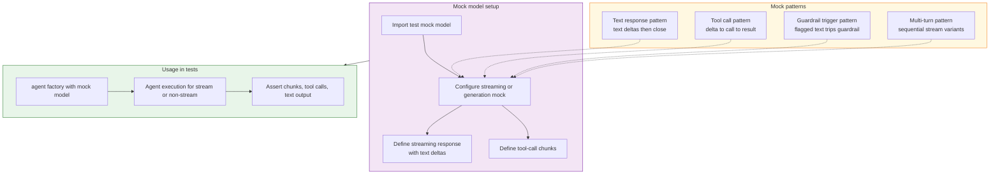

### How Streaming Is Mocked

The mock stream handler returns an object containing a readable stream. Chunks are typed deltas (`text-delta`, `tool-call-delta`, `tool-call`). Stream close marks completion. The raw provider-call payload can be stubbed for metadata assertions.

### How Tool Calls Are Mocked

Tool-call chunks include tool name, call ID, and arguments. The tool executor runs as if a real model requested it. Multi-turn test flows can feed tool results into subsequent mock turns.

### How Guardrail Triggers Are Mocked

Mock output emits known violating text. Streaming guardrails consume sliding windows and either throw tripwire in development or suppress remainder and inject fallback in production. Assertions target resulting stream behavior.

## Unit Tests

**Runner**: Bun test runner.
**Secrets**: None.
**Scope**: Every module, every export boundary, every typed interface edge.

Unit tests are the foundation: fast, deterministic, and infrastructure-independent. Every implementation task delivers tests and implementation together.

### What Gets Unit Tested

- Agent creation defaults and overrides.
- Configuration merge and validation behavior.
- Guardrail detection logic across regex, keyword, and model-assisted paths.
- Severity aggregation with worst-wins behavior.
- Guardrail pipeline orchestration.
- Stream transformation and chunk processing.
- Memory message formatting and turn truncation.
- Document chunking settings.
- Hybrid retrieval query composition.
- Citation schema extraction.
- Rate limiter window arithmetic.
- Circuit breaker state transitions.
- Logger context propagation.
- Token-budget arithmetic.
- CTA catalog validation.
- File validation by type signature and size limits.
- Public export surface stability.

### Mock Strategy

Every external boundary is mocked:

- **Model calls**: controlled AI SDK test mock model behaviors.
- **Database**: in-memory adapters or query-shape assertions.
- **Object storage**: deterministic buffer-return stubs.
- **Cache**: in-memory map-like adapter.
- **MCP servers**: stub transport and tool definitions.
- **Observability export**: no-op sink that captures spans for assertions.

## Integration Tests

**Runner**: Bun test runner with integration scope.
**Secrets**: Primary key required; optional secondary keys supported.
**Scope**: Real provider calls, real database operations, real external integrations.

Integration tests validate real external behavior. They are slower, cost-bearing, and less deterministic than unit suites. They do not gate basic CI green, but they are required before release readiness.

### Conditional Skip Pattern

Every integration file gates its top-level suite with a deterministic conditional skip helper. Missing keys cause clean skips, not failures. Multi-service tests compose key checks with logical conjunctions.

### What Gets Integration Tested

- Streaming with real model responses.
- Guardrail detection on real model outputs.
- Real embedding generation.
- Database round-trips including insert and retrieval.
- Object storage upload, download, and signed-link generation.
- Observability trace creation and score attachment.
- Memory extraction quality under real model behavior.
- Office-document conversion pipeline behavior.
- Rate limiter behavior against a real cache service.

## End-to-End Tests (E2E_TESTS)

**Runner**: Bun test runner with end-to-end scope.
**Secrets**: Full environment.
**Scope**: Complete user-level flows across library and server concerns.

E2E tests validate complete behavior as a user experiences it: create agent, stream response, verify output and side effects. They span agent runtime, transport, memory, guardrails, retrieval, and feedback chain.

### Three-Layer Memory QA Scenarios

- Thread short-term memory: 12 turns in one thread results in the most recent 10 turns plus rolling summary coverage for earlier turns.
- User short-term memory: activity in one thread appears in a new thread for the initial turns.
- User short-term fade-out: after enough turns in the new thread, cross-thread injection stops.
- Rolling summary continuity: long threads with topic switches keep all major topics represented.
- Interaction extraction: search intent becomes interaction memory.
- Media fact extraction: visual message content yields media facts and entity capture.
- Preference correction: corrected preference supersedes prior contradictory preference.
- Structured result memory: ordinal follow-up in new thread resolves to the correct prior result.
- Temporal recall: temporal references trigger time-scoped memory retrieval.
- Recency boost: newer relevant facts outrank older equally similar facts.
- Memory inspect: self-knowledge query returns categorized memory summary.
- Memory delete: requested topic deletion removes matching records and invalidates cache.
- Dependent intents: feedback intent applies before follow-up search intent.
- Cross-thread intent detection: vague new-thread input classifies correctly with cross-thread context.
- Auto-trigger recall: first message in a new thread can trigger automatic recall injection.

### Extraction Safeguard Scenarios

1. Third-party attribution stores interaction signal, not user preference.
2. Sarcasm handling stores correct negative sentiment.
3. Hypothetical statements do not become stored personal facts.
4. Hallucinated prior preference in model output is not extracted as fact.
5. Attribute negation in query constraints excludes conflicting results.
6. Query replay rewrite preserves intent while updating location or facet.
7. Pleasantry short-circuit skips heavy retrieval pipeline.
8. Gibberish short-circuit avoids full pipeline and responds safely.
9. Thread resurrection after long gap triggers recall and staleness context.
10. Rolling summary cap remains within summary-token limit.
11. Context-budget enforcement truncates lower-priority context first.
12. Oversized input is rejected with client-facing validation error.
13. Mid-stream failure skips extraction and avoids partial-fact writes.

**Security scenarios**:

- User isolation: one user never receives another user context.
- Memory deletion purges both long-term records and cache entries.
- Ordinal resolution remains scoped to requesting user.

### Test Matrix

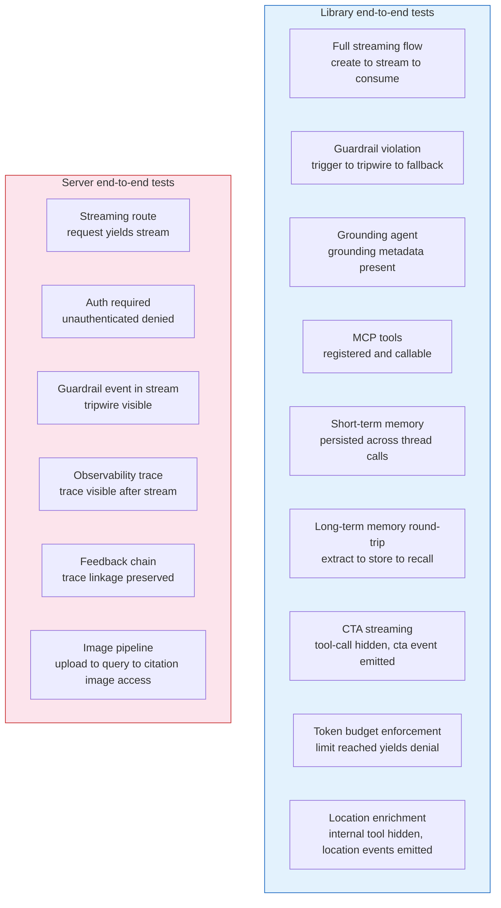

### Long-Term Memory Round-Trip (Critical)

1. Create an agent with fact extraction and recall capabilities.
2. Send preference-bearing user content with user context.
3. Wait for asynchronous extraction completion.
4. Verify stored facts exist for the right user and categories.
5. Open a different thread and ask a recall-triggering query.
6. Assert recall is invoked and prior facts appear in the response context.

This validates extraction to storage to recall across conversation boundaries with correct user scoping.

### Image Pipeline E2E

1. Upload a document that contains raster images.
2. Poll until processing reaches completion.
3. Ask a question requiring visual understanding.
4. Verify citations include image links.
5. Verify inline image references are present in response formatting.
6. Fetch one signed link and verify returned bytes match image signatures.
7. Verify fallback image route behavior redirects correctly.

## Eval Tests

**Runner**: Promptfoo as external development tool plus custom evaluation scorers.
**Secrets**: Keys required for judge-style evaluation.
**Scope**: Output quality, safety quality, retrieval quality.

Eval tests measure response quality rather than only functional correctness. Results are compared to defined thresholds; regressions are failures.

### What Gets Evaluated

- Response relevance.
- Citation accuracy.
- Guardrail precision.
- Guardrail recall.
- Grounding quality.
- Memory recall accuracy.
- CTA relevance.

### Evaluation Thresholds and Baselines

Eval tests compare against defined minimum thresholds. Initial baselines are established during the first evaluation run and tightened as the system matures. Score regression greater than five percentage points from previous baseline triggers test failure regardless of absolute threshold.

| Quality Dimension | Minimum Threshold | Target | Measurement Method |
|---|---|---|---|
| Response relevance | 0.70 | 0.85 | LLM-as-judge scoring against query intent |
| Citation accuracy | 0.80 | 0.95 | Automated verification of cited page content match |
| Safe-input pass-through rate | 0.90 | 0.98 | Rate at which known-safe inputs pass without false blocks |
| Guardrail precision | 0.85 | 0.95 | True positive rate on labeled mixed-safety dataset (correctly identified threats among all flagged inputs) |
| Guardrail recall | 0.85 | 0.95 | Detection rate on known-malicious inputs |
| Grounding quality | 0.75 | 0.90 | Factual accuracy of web-grounded responses |
| Memory recall accuracy | 0.70 | 0.85 | Correct fact retrieval for known-user scenarios |
| CTA relevance | 0.65 | 0.80 | Contextual appropriateness of suggested actions |
| Retrieval precision at ten | 0.75 | 0.90 | Relevant pages in top ten hybrid search results |
| Evidence sufficiency | 0.70 | 0.85 | Gate correctly opens for answerable queries and closes for unanswerable |
| Hallucination rate | Below 0.05 | Below 0.03 | Unsupported claims in generated responses per anti-hallucination architecture |
| Extraction accuracy | 0.75 | 0.90 | Correctly extracted facts from known-fact conversations |
| Rewrite fidelity | 0.85 | 0.95 | All original entities preserved in rewritten queries |

Threshold enforcement:

- Scores below minimum threshold produce test failure that blocks release.
- Scores between minimum and target produce test pass with improvement annotation.
- Scores above target produce clean pass.
- Score regression greater than five points from previous baseline produces failure regardless of absolute threshold.

### Golden Dataset Requirements

- Minimum fifty test cases per quality dimension.
- Cases sourced from real production scenarios where possible.
- Cases reviewed and approved by human evaluator before inclusion.
- Dataset version-controlled alongside test configuration.
- New cases added when production failures reveal gaps not covered by existing cases.
- Dataset refresh cadence: monthly review, quarterly expansion, immediate addition for critical failures.

### Scorer Categories

Scorers are organized into four categories with different sampling strategies:

| Category | Sampling in Production | Purpose |
|---|---|---|
| Safety scorers | Higher sampling rate (up to every request) | Guardrail precision, injection detection, output safety |
| Relevance scorers | Moderate sampling rate | Response relevance, retrieval quality, evidence sufficiency |
| Quality scorers | Lower sampling rate | Citation accuracy, grounding quality, rewrite fidelity |
| Behavioral scorers | Moderate sampling rate | Memory recall, CTA relevance, humanlikeness dimensions |

### Promptfoo Integration

The library provides a Promptfoo provider factory to expose compatible evaluation interfaces. A self-test runner starts an ephemeral service layer, emits evaluation configuration, and evaluation runs externally. Result artifacts are collected for threshold comparison. Custom scorer helpers integrate specialized metrics into the same evaluation pipeline.

## Load Tests (LOAD_TESTS)

**Runner**: k6 as standalone binary.
**Secrets**: Full authenticated environment.
**Scope**: Concurrency behavior, latency baselines, and enforcement behavior under pressure.

Load tests measure system behavior under concurrent demand. They are run on demand and are not CI gates. Initial smoke runs produce baseline measurements that guide future large-scale exercises.

### Architecture

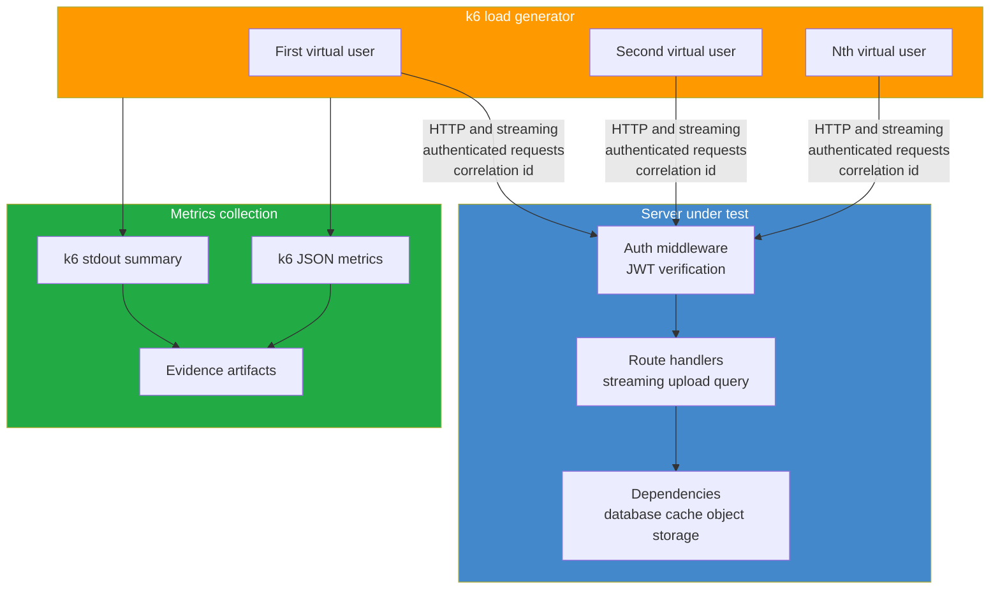

### Script Catalog

Five load scripts cover critical routes:

1. Streaming: concurrent streamed chat, measuring first-token delay and full-stream duration.
2. File upload: concurrent uploads within size and batch constraints, measuring acceptance and processing start.
3. Retrieval query: concurrent retrieval-augmented queries, measuring hybrid retrieval latency.
4. Budget enforcement: rapid same-user requests validating denial after limit and counter consistency.
5. Health baseline: high-rate baseline for p50, p95, and p99 latency.

All scripts share base configuration for endpoint, auth token, and thresholds. Each script includes assertions for status and content behavior.

### Smoke Baselines

Initial smoke runs provide informational baselines:

- Health endpoint p99 target under one hundred milliseconds at low concurrency.
- Streaming route establishes connections and emits measurable first-token timing.
- Upload route accepts requests and initiates processing.
- Budget enforcement denies post-limit requests without concurrency leaks.

### Production-Scale Scenarios

Beyond smoke baselines, load tests scale to production-representative levels for deployment confidence. These scenarios run in staging environments with production-like infrastructure.

| Scenario | Smoke Scale | Production Scale | Metric Focus |
|---|---|---|---|
| Streaming chat | 10 concurrent users | 1000 concurrent users | First-token latency p95, stream completion rate |
| File upload | 5 concurrent uploads | 200 concurrent uploads | Acceptance latency, queue depth, processing throughput |
| Retrieval query | 10 concurrent queries | 500 concurrent queries | Hybrid search latency p95, result quality under load |
| Budget enforcement | 50 rapid requests | 5000 rapid requests per second | Counter accuracy, denial consistency, race condition detection |
| Health baseline | 100 requests per second | 10000 requests per second | p50, p95, p99 latency, error rate |
| Mixed workload | Combined above at ten percent | Combined above at fifty percent | System stability, resource contention, degradation patterns |

### Production-Scale Measurement Targets

Production-scale load tests measure:

- Latency percentiles under sustained load (p50, p95, p99) for each route category.
- Error rate under load with target below 0.1 percent for non-rate-limit errors.
- Resource utilization including CPU, memory, and connection pool usage.
- Degradation curve showing performance change as load increases from ten percent to one hundred percent of target capacity.
- Recovery time measuring how quickly latency returns to baseline after load spike removal.
- Connection pool behavior including exhaustion thresholds, queuing depth, and rejection patterns.
- Cache hit ratio under concurrent access to shared cache keys.
- Budget counter accuracy under concurrent spend with no over-admission beyond one-request tolerance.

### Scalability Breakpoint Detection

- Ramp load linearly from baseline to two times target capacity.
- Identify the inflection point where latency degrades non-linearly.
- Identify the saturation point where error rate exceeds acceptable threshold.
- Document system capacity ceiling for deployment planning.
- Validate horizontal scaling by running the same ramp against two, four, and eight API instances.

### Streaming Load Specifics

Streaming endpoints require specialized load testing because each connection holds server resources for the duration of the response:

- Measure maximum concurrent SSE connections per API instance before resource exhaustion.
- Validate that connection cleanup occurs correctly when clients disconnect mid-stream.
- Test interleaved short and long streams to detect resource contention patterns.
- Verify backpressure behavior when slow consumers accumulate.

## Adversarial Tests

**Runner**: Bun test runner.
**Secrets**: None for pure detection paths; keys only when adversarial integration is required.
**Scope**: Safety bypass attempts, injection, obfuscation, and escalation.

Adversarial tests model attacker behavior. Each guardrail has bypass-attempt tests that prove resistance against common and evolving techniques.

### Attack Categories

- Prompt injection.
- Jailbreak pattern families.
- Unicode obfuscation.
- Token splitting.
- Encoding attacks.
- Multi-turn escalation.
- Context confusion.
- Output manipulation attempts.

### Testing Approach

Unit-level adversarial cases run payloads against individual guardrail functions. Integration-level adversarial cases run payloads through full input-to-output pipelines. Newly discovered bypasses are converted into permanent regression tests.

### Injection-Specific Test Categories

Beyond the general attack categories listed above, prompt injection testing requires dedicated suites.

**Direct injection tests**:
- Role-override attempts.
- System prompt extraction attempts.
- Instruction override prompts that try to supersede prior constraints.
- Delimiter injection that mimics higher-priority message formats.
- Encoding evasion, including base64 payloads, unicode homoglyph substitution, and token-split instructions.
- Multi-language injection attempts in non-primary languages.

**Indirect injection tests via retrieval**:
- Documents with embedded instructions hidden inside otherwise legitimate content.
- Exfiltration payloads in document content, especially URL query strings intended to leak conversation data through image rendering.
- Citation manipulation payloads that attempt to induce false or fabricated citations.
- Gradual context poisoning distributed across multiple retrieved chunks.

**Indirect injection tests via memory**:
- Crafted conversational turns designed to plant instruction-like content as user facts.
- Recall-triggered injection where poisoned memory activates on new-thread auto-recall.
- Memory supersession attacks that attempt to overwrite legitimate memory with injected directives.

**Multi-turn escalation tests**:
- Gradual persona drift over multi-turn windows.
- Privilege escalation sequences that attempt to activate elevated behavior.
- Context window exhaustion followed by late-turn injection payloads.
- Benign setup turns followed by a trigger turn that activates planted context.

**Output-side injection tests**:
- System prompt leakage attempts under multiple extraction prompt styles.
- Attention collapse detection where responses prioritize injected content over the actual user query.
- Exfiltration through generated tool arguments intended to leak sensitive data.

Each test category runs at both unit level for guardrail behavior and integration level for the full input-to-output pipeline. The regression suite expands continuously as new bypass techniques are discovered.

### Security and Concurrency Scenarios

- JWT algorithm confusion attempts are rejected.
- Signed-link leakage prevention prevents unauthorized object access beyond scope and expiry.
- Concurrent quota and budget checks reject over-limit race attempts.
- Per-source outage chaos verifies one failing source does not silently corrupt merged outputs.

## Regression Tests

**Runner**: Bun test runner.
**Secrets**: Depend on original failure context.
**Scope**: Previously observed failures and production-like edge cases.

Every bug fix adds a regression test that fails before the fix and passes after. Regression tests are permanent and remain through refactors.

### Structure

Each regression test documents:

- Original failure behavior.
- Minimal reproduction input.
- Expected post-fix behavior.
- Owning fix task.

Regression tests are co-located with protected modules and marked in test descriptions as regression-focused.

## Property-Based Tests

**Runner**: Bun test runner.
**Secrets**: None.
**Scope**: Invariant validation through randomized input generation.

Property testing validates truths that must hold for all valid inputs, not only hand-picked cases.

### Target Properties

- Configuration merge always retains required fields.
- Severity aggregation always returns highest severity regardless of order.
- Token counting remains non-negative and monotonic with added text.
- Rate-limiter windows align correctly for arbitrary timestamps.
- Citation extraction never yields page values outside document bounds.
- File signature validation avoids false negatives for supported formats.
- Memory truncation always preserves system context and most recent turns.

### Extended Target Properties

Beyond the foundational seven properties, property-based testing covers the modules with deterministic invariants suitable for randomized validation.

**Conversation Pipeline Properties**:

- Intent classification produces valid intent enum values for all generated inputs.
- Rewrite triggers preserve all original entities (names, codes, dates, identifiers) in rewritten output.
- Source priority weighting formula produces weights between zero and one for all source counts.
- RRF fusion scores are non-negative and bounded for all rank combinations.
- Multi-intent decomposition produces at least one sub-query per detected intent count.
- Temporal resolution produces valid date ranges for all temporal phrase patterns with arbitrary timezone offsets.
- Embedding router cosine similarity scores fall between negative one and one for all vector pairs.

**Memory Properties**:

- Fact extraction from user-only content never produces facts attributed to assistant.
- Supersession always preserves audit trail: superseded record exists after every supersession operation.
- Deduplication threshold boundary: similarity exactly at 0.92 produces consistent duplicate detection across repeated evaluations.
- Recency boost multipliers are applied in correct order: 24-hour multiplier greater than 7-day multiplier greater than default.
- Rolling summary token count never exceeds configured maximum after any number of compaction cycles.
- TTL refresh always extends expiry by full TTL duration regardless of current remaining time.
- Emotional context decay counter decrements exactly once per user turn and never goes negative.
- Cross-thread user short-term loading returns at most the configured limit regardless of thread count.

**Document Processing Properties**:

- PDF splitting produces exactly one output per input page for all valid PDFs.
- Chunk overlap is exactly the configured overlap amount for all text lengths above minimum.
- Quota arithmetic never produces negative used_bytes values regardless of operation ordering.
- File status state machine transitions are always unidirectional: no backward transitions for any event sequence.
- Image size filtering correctly accepts at exactly 100 pixels and rejects at 99 pixels for both dimensions.
- Page progress counter increments monotonically and reaches progress_total exactly once.

**Guardrail Properties**:

- Worst-wins aggregation always returns the highest severity in any verdict set regardless of order or count.
- Parallel guardrail execution produces same aggregate result regardless of individual completion order.
- Sliding window buffer size never exceeds configured maximum for any chunk sequence.
- Zero-leak buffer mode never emits bytes to client before buffer reaches configured size or violation is detected.
- Composite guardrail aggregation produces same result regardless of constituent grouping order.
- External guardrail factory with open failure mode never blocks requests on network errors.
- External guardrail factory with closed failure mode always blocks requests on network errors.

**Infrastructure Properties**:

- Rate limiter sliding window calculations produce correct Retry-After for arbitrary timestamp sequences within any window size.
- Circuit breaker state transitions follow valid state machine paths: only closed-to-open, open-to-half-open, half-open-to-closed, and half-open-to-open.
- Budget counter operations maintain atomicity: no intermediate state visible between increment and expiry setting.
- Budget pessimistic reservation followed by reconciliation produces correct final counter value for all estimate-vs-actual combinations.
- Cache TTL expiry is consistent regardless of read access pattern: a key with TTL N expires at the same absolute time whether read zero or one hundred times.

**Transport Properties**:

- SSE event serialization produces valid SSE format for all nine event type variants with arbitrary payload content.
- Verbosity filtering never removes events that should be visible at the configured level and never includes events that should be hidden.
- Stream chunk ordering is preserved through all transformation stages for any interleaving of event types.
- Session-meta event is always emitted exactly once as the first event in any stream regardless of agent behavior.

### Approach

Use a Bun-compatible property testing library or lightweight generators for domain-specific values. Each property executes at least one hundred randomized iterations. Shrinking is preferred but optional.

## Chaos and Failure Testing

**Runner**: Bun test runner with chaos scope, plus infrastructure tools for network-level fault injection.
**Secrets**: Full environment plus fault injection infrastructure.
**Scope**: Systematic failure injection for all external dependencies to verify graceful degradation, fallback paths, and recovery behavior.

Chaos testing intentionally injects faults to uncover weaknesses before they cause production failures. AI agent systems have unique failure modes: LLM provider timeouts cascade differently than database outages, and cache failures affect budget enforcement differently than retrieval quality.

### Chaos Testing Architecture

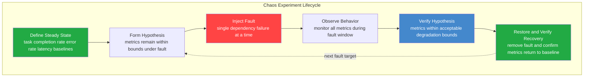

### Fault Injection Matrix

Every external dependency has a defined failure mode, expected system behavior, and recovery verification.

**LLM Provider Faults**:

| Fault | Expected Behavior | Recovery Verification |
|---|---|---|
| Primary key unavailable | Rotate to next key in pool | Response succeeds with different key |
| All keys exhausted | Circuit breaker opens, fast-fail without network calls | Circuit half-opens after timeout, probe succeeds |
| Rate limit response from provider | Exponential backoff with jitter, no circuit trigger | Requests resume after backoff window |
| Timeout with no response | Retry with timeout, circuit opens after threshold consecutive failures | Circuit recovers after reset timeout |
| Malformed response body | Parse error caught, retry once, surface error if persistent | Normal responses resume immediately |
| Context length exceeded response | No retry, surface as client-facing error | Next request with valid length succeeds |

**PostgreSQL Faults**:

| Fault | Expected Behavior | Recovery Verification |
|---|---|---|
| Connection refused | Health endpoint returns down status, all requests return service unavailable | Automatic reconnection on availability, health returns ok |
| Query timeout | Individual request fails with timeout, connection pool remains healthy | Subsequent queries succeed normally |
| Connection pool exhaustion | New requests queue then timeout, no process crash | Pool recovers as long-running queries complete |
| Disk full simulation | Write failures surface as typed errors, reads continue | Writes resume after space recovery |

**SurrealDB Faults**:

| Fault | Expected Behavior | Recovery Verification |
|---|---|---|
| WebSocket connection dropped | Long-term memory disabled, chat continues via short-term only | Auto-reconnect on next operation, memory resumes |
| Query timeout | Memory operation times out, extraction skipped, short-term persists anyway | Subsequent operations succeed |
| Complete unavailability | Graceful degradation to no long-term memory with warning log | Full memory restored on reconnection |

**Valkey Faults**:

| Fault | Expected Behavior | Recovery Verification |
|---|---|---|
| Connection refused | In-memory fallback for cache, per-instance rate limiting, budget fail-open | Valkey reconnection restores global state |
| Response timeout | Individual operation times out, fallback path used | Subsequent operations succeed normally |
| Eviction under memory pressure | Cache misses increase, source-of-truth queries increase | Application remains functional with higher latency |
| Connection restored after outage | No cache stampede, gradual warm-up | Cache hit ratio returns to baseline within minutes |

**Object Storage Faults**:

| Fault | Expected Behavior | Recovery Verification |
|---|---|---|
| Upload failure | Quota reservation rolled back, file marked failed | Retry upload succeeds, quota correct |
| Download timeout during retrieval | Page context assembly degrades gracefully without full request failure | Subsequent downloads succeed |
| Signed URL expired during client access | Client receives clear expiry error, can re-request | New signed URL generated successfully |
| Complete unavailability | File upload and file-backed retrieval disabled, chat continues | Full file capability restored on recovery |

**Background Job Faults**:

| Fault | Expected Behavior | Recovery Verification |
|---|---|---|
| Worker crash mid-task | Job re-enqueued by queue adapter, idempotent re-execution | Document reaches ready or enriched state |
| Duplicate delivery | Idempotent handlers produce same result, no duplicate records | Single set of page_index rows exists |
| Queue unavailable | In-process fallback executes same handlers directly | Background jobs resume when queue returns |

**Observability Faults**:

| Fault | Expected Behavior | Recovery Verification |
|---|---|---|
| Langfuse unavailable at startup | Warning logged, fallback prompts loaded, no-op tracing | Full tracing resumes when Langfuse returns |
| Langfuse unavailable at runtime | No-op scoring, stale-while-revalidate for cached prompts | Score writes resume on recovery |
| Trace flush timeout | Pending telemetry buffered, no request blocking | Buffer flushes on next successful connection |

**LibreOffice Faults**:

| Fault | Expected Behavior | Recovery Verification |
|---|---|---|
| Sidecar unavailable | DOCX conversion fails, file marked failed with clear error | Conversion succeeds when sidecar returns |
| Conversion timeout after thirty seconds | File marked failed, timeout error recorded | Subsequent conversions succeed within timeout |
| Corrupt output | PDF validation catches corrupt output, file marked failed | Re-conversion of same file succeeds |

### Chaos Experiment Execution

Chaos experiments follow a strict protocol to prevent uncontrolled failure propagation:

1. Verify steady state before injection: all health checks pass, baseline metrics within normal range.
2. Inject exactly one fault at a time: never combine failures in a single experiment.
3. Observe for defined duration: minimum thirty seconds, maximum five minutes per fault.
4. Verify hypothesis: check that degradation metrics remain within acceptable bounds.
5. Restore and verify recovery: remove fault and confirm return to baseline within defined recovery window.
6. Document results: capture metrics, behavior observations, and any unexpected side effects.

### Chaos Execution Schedule

- **Unit-level chaos** (every commit): circuit breaker state transitions, retry logic, fallback path selection — all with mocked dependencies.
- **Integration-level chaos** (nightly): TCP-proxy-based fault injection against real services in Docker Compose.
- **Game day chaos** (monthly): multi-fault scenarios, sustained outages, recovery exercises.

## Contract Testing

**Runner**: Bun test runner.
**Secrets**: None (schema validation only).
**Scope**: Consumer-driven contracts between the library and server repositories verifying interface stability.

Contract testing guarantees that interface changes in the library propagate correctly to the server without requiring full integration test execution. The library defines what it provides. The server defines what it expects. Contract tests verify these promises align.

### Contract Testing Architecture

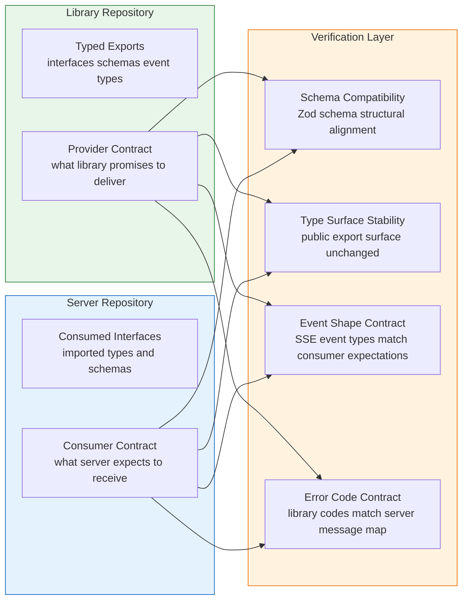

### Contract Areas

Each contract area represents an interface boundary where library and server must agree:

- **SSE event type shapes**: all nine event types (session-meta, text-delta, trace-step, cta, citation, location, tripwire, done, error) with defined Zod schemas validated on both sides.
- **Agent configuration interface**: the configuration object that server passes to library agent factory, validated against library schema.
- **Guardrail pipeline configuration interface**: guardrail function signatures, severity types, verdict shapes.
- **Memory configuration interface**: memory config objects including all numeric thresholds.
- **Storage factory interface**: storage configuration shape and auto-detection contract.
- **Stream event iterator interface**: the async iterable shape returned by agent execution.
- **Error code union**: library emits typed error codes, server maps every code to a message — contract verifies completeness.
- **Typed result patterns**: neverthrow Result type shapes for all boundary operations.
- **Trace-step event discriminated union**: step-specific payload shapes matched between library emission and client SDK consumption.

### Contract Execution

Contract tests run on every commit in both repositories. When the library publishes a new contract artifact, the server CI validates against it. When the server updates its consumer expectations, the library CI validates it can still satisfy them.

Breaking contract changes are detected before they reach integration testing, saving significant feedback time.

## Mutation Testing

**Runner**: Mutation testing framework compatible with Bun.
**Secrets**: None.
**Scope**: Safety-critical paths where undetected mutations could cause security or quality failures.

Mutation testing systematically introduces small changes (mutations) to code and verifies that existing tests catch them. Surviving mutants reveal gaps in test coverage for critical logic.

### Mutation Testing Process

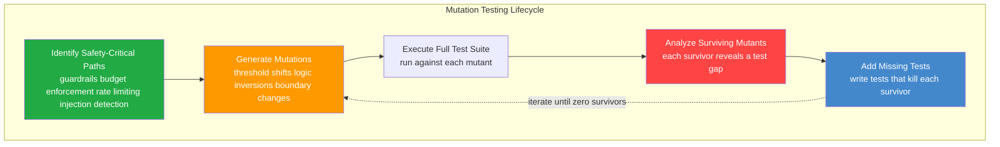

### Mutation Target Paths

Mutation testing focuses exclusively on paths where a missed mutation could cause security, safety, or correctness failures:

- **Input guardrail pipeline**: mutate severity thresholds, detection pattern logic, worst-wins aggregation comparisons.
- **Output guardrail sliding window**: mutate buffer size checks, verdict evaluation logic, chunk suppression conditions.
- **Injection detection ensemble**: mutate tier decision logic (LLM-alone blocks, two-tier flags), parallel execution coordination, blocking threshold comparisons.
- **Memory extraction safeguards**: mutate attribution filter conditions, certainty filter thresholds, injection classifier integration.
- **Content sanitization**: mutate pattern matching expressions, redaction logic, boundary framing insertion.
- **Budget enforcement**: mutate comparison operators in limit checks, reservation increment logic, rollback conditions.
- **Rate limiting**: mutate window boundary calculations, counter increment operations, rejection threshold comparisons.
- **Evidence gate**: mutate sufficiency scoring formula, weight values, threshold comparison operators.
- **File validation**: mutate magic byte comparisons, size limit checks, quota arithmetic.
- **Trust hierarchy enforcement**: mutate trust level assignments, boundary framing conditions, zero-trust content handling.

### Mutation Categories

- **Threshold mutations**: shift numeric boundaries by plus or minus one, by ten percent, to zero, and to maximum value.
- **Logic inversions**: flip boolean conditions, swap AND with OR, invert comparison operators.
- **Boundary shifts**: off-by-one in window sizes, TTL values, limit checks, array indices.
- **Removal mutations**: remove validation steps, skip aggregation stages, omit safety checks.
- **Reorder mutations**: change execution order in pipelines, swap priority levels in aggregation.

### Mutation Testing Schedule

Mutation testing runs nightly against safety-critical paths. Target mutation kill rate is above ninety-five percent for all guarded paths. Surviving mutants are triaged within one business day.

## Snapshot and Golden-File Testing

**Runner**: Bun test runner.
**Secrets**: None for structural snapshots; keys required for golden dataset evaluation.
**Scope**: Non-deterministic LLM outputs validated through structural and quality-score snapshots rather than exact text matching.

Traditional snapshot testing breaks for AI systems because outputs vary between runs. Snapshot testing for this system captures structure, properties, and quality scores rather than raw text content.

### Snapshot Strategy

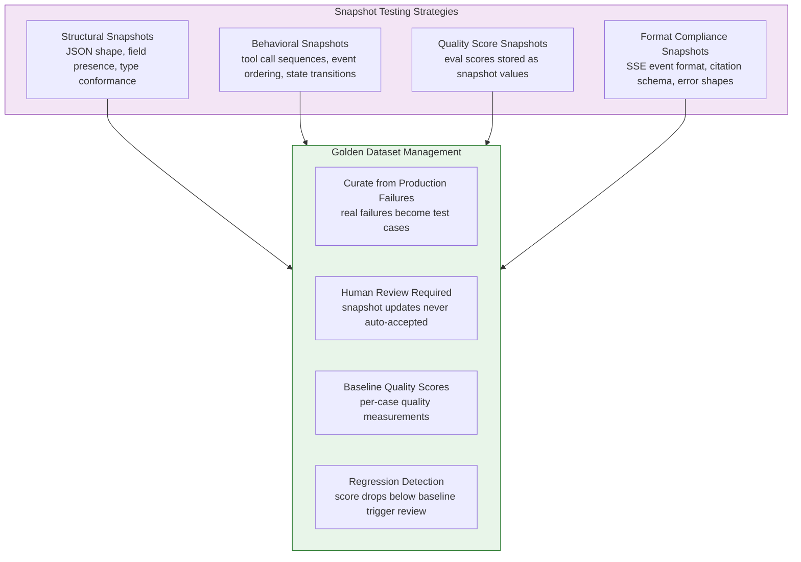

### Structural Snapshots

Structural snapshots validate that output shape is correct without asserting exact content:

- Agent response objects contain all required fields with correct types.
- Citation objects contain source, file identifier, page, and quote fields.
- SSE events conform to their type-specific schemas.
- Tool call sequences match expected tool names and argument shapes.
- Guardrail verdicts contain severity and concept identifier fields.
- Memory extraction results contain fact category, confidence, and temporal state fields.
- Error responses contain error code and message fields matching typed error union.

### Behavioral Snapshots

Behavioral snapshots validate execution patterns rather than output content:

- Multi-intent queries produce expected sub-query decomposition structure.
- Source priority execution produces expected source ordering.
- Dependent intent handling produces expected sequential-then-parallel execution pattern.
- Guardrail pipeline execution produces verdicts in expected aggregation order.
- Memory recall produces expected retrieval-then-ranking pipeline behavior.

### Quality Score Snapshots

For eval-dependent validation, quality scores serve as the snapshot rather than raw text:

- Each golden dataset case has a recorded baseline quality score per dimension.
- Re-evaluation produces scores that are compared against baselines.
- Score drops greater than five percentage points from baseline trigger mandatory human review.
- Score improvements are accepted and baselines are updated after review.
- Quality score history is retained for trend analysis.

### Golden Dataset Lifecycle

- **Initial creation**: minimum fifty cases per quality dimension sourced from realistic scenarios.
- **Expansion**: new cases added when production usage reveals failure modes not covered.
- **Maintenance**: monthly review of cases for continued relevance, quarterly score recalibration.
- **Retirement**: cases removed only when the tested behavior is intentionally changed, with documented justification.

## Streaming-Specific Tests

**Runner**: Bun test runner with streaming scope.
**Secrets**: Mock model for unit-level streaming; keys required for integration streaming tests.
**Scope**: Dedicated testing patterns for SSE streaming behavior covering mid-stream failures, backpressure, reconnection, and protocol compliance.

Streaming responses require specialized testing because they hold server resources for extended durations, involve incremental delivery, and have failure modes that do not exist in request-response patterns.

### Streaming Test Architecture

```mermaid
flowchart TD
    subgraph STREAM_TEST_TYPES["Streaming Test Categories"]
        FORMAT_TESTS["Format Compliance\nevent type validation, line format, done marker"]
        MIDSTREAM_TESTS["Mid-Stream Failure\nprovider error, network drop, timeout"]
        BACKPRESSURE_TESTS["Backpressure Handling\nslow consumer, fast producer, buffer limits"]
        RECONNECT_TESTS["Reconnection Behavior\nclient reconnect, state recovery, deduplication"]
        PARTIAL_TESTS["Partial Response\nincomplete chunks, buffer assembly, cleanup"]
        CONCURRENT_TESTS["Concurrent Streams\nisolation, resource limits, cleanup on disconnect"]
    end

    FORMAT_TESTS --> MIDSTREAM_TESTS --> BACKPRESSURE_TESTS
    BACKPRESSURE_TESTS --> RECONNECT_TESTS --> PARTIAL_TESTS --> CONCURRENT_TESTS

    style FORMAT_TESTS fill:#22aa44,color:#fff
    style MIDSTREAM_TESTS fill:#ff4444,color:#fff
    style BACKPRESSURE_TESTS fill:#ff9900,color:#fff
    style RECONNECT_TESTS fill:#4488cc,color:#fff
    style PARTIAL_TESTS fill:#aa44aa,color:#fff
    style CONCURRENT_TESTS fill:#8866cc,color:#fff
```

### Format Compliance Tests

- Each of nine SSE event types emits correct structure when serialized.
- Session-meta event is always the first event in every stream.
- Done event is always the last event in every successful stream.
- Error event terminates stream and no further events follow.
- Text-delta events contain only text content, no metadata leakage.
- Trace-step events appear only when verbosity is set to full.
- CTA events contain valid schema: id, label, action type, and optional URL and icon, with maximum three per response.
- Location events contain coordinate data without exposing internal tool call details.
- Tripwire events contain concept identifier and fallback text.

### Mid-Stream Failure Tests

- Provider error during generation: error event emitted, stream closed cleanly, no partial corruption in persisted data.
- Network drop between server and client: server-side cleanup runs, resources released, connection state cleared.
- Guardrail tripwire during stream in production mode: remaining chunks suppressed, fallback message injected, tripwire event emitted.
- Guardrail tripwire during stream in development mode: exception thrown with diagnostic information.
- Provider timeout during generation: stream closed after configured timeout, error event emitted.
- Memory extraction after partial stream: extraction skipped, short-term memory persisted with partial flag.
- Budget accounting after partial stream: actual token count reconciled against estimate, counter corrected.

### Backpressure Tests

- Slow consumer does not crash server or corrupt stream state.
- Server-side buffer limits prevent unbounded memory growth per connection.
- Fast producer with slow consumer: chunks buffered up to limit, then backpressure applied.
- Multiple slow consumers simultaneously: each connection independently managed without cross-contamination.
- Consumer disconnect during backpressure: connection cleanup runs, buffered data released.

### Reconnection Tests

- Client SDK reconnects automatically after connection drop.
- Reconnected client sends the last event identifier on reconnect so the server can resume from where it left off when supported; otherwise the client starts a fresh stream.
- Client SDK offline queue persists messages during disconnection and syncs on reconnect.
- Multiple rapid disconnects and reconnects do not create duplicate connections or leak resources.
- Reconnection with expired authentication token: client re-authenticates before resuming.

### Concurrent Stream Tests

- Multiple simultaneous streams for the same user maintain independent state.
- Each stream tracks its own token budget consumption independently.
- Stream cancellation by one client does not affect other active streams.
- Server resource limits: maximum concurrent streams per user enforced without crash.
- Cleanup on disconnect: all per-connection resources released, no memory leaks across stream lifecycle.

### Zero-Leak Buffer Mode Tests

- Buffer fills to configured size before any bytes reach client.
- Violation detected during buffer phase: entire buffer suppressed, zero bytes sent, fallback injected.
- Buffer fills with no violation: buffer flushed to client, streaming mode begins with sliding window.
- Time-to-first-token delayed by exactly buffer fill duration under normal generation speed.
- Multiple violations during buffer phase: first violation triggers suppression, subsequent violations are no-ops.

## Development Seed Data

Both repositories provide idempotent seed workflows for realistic local test datasets.

**Library seed** populates long-term memory data with user facts, graph relations, and vectors to exercise recall and deduplication behavior.

**Server seed** populates relational metadata, budget data, and representative document assets to exercise retrieval, budget enforcement, and file-management flows.

**Idempotency** is mandatory. Re-running seeds must yield stable state without duplicates or failures.

**Test user scope** uses a dedicated seeded user identity and valid development auth context so testing exercises real auth boundaries.

**Execution rule** requires supporting services to be available; failed dependencies produce explicit seed failure.

## QA Policy

Every implementation task from initial stack setup through final leak prevention includes agent-executed QA scenarios. No manual verification is considered sufficient.

### Evidence Collection

Every QA scenario writes a structured evidence artifact with task and scenario identifiers. Artifacts capture raw outputs proving pass behavior.

### Tool Categories

| Tool Category | Use Case | Description |
|---|---|---|
| Test runner execution | Module assertions | Runs scoped suites through Bun test runner |
| Eval execution mode | Quick export validation | Verifies minimal runtime behavior in isolation |
| Interactive terminal automation | TUI behavior validation | Automates keystrokes and output assertions in terminal sessions |
| HTTP request execution | API and streaming validation | Sends authenticated requests and validates status and payload behavior |

### TDD Discipline

1. RED: write failing behavior test.
2. GREEN: implement minimum behavior to pass.
3. REFACTOR: clean implementation while keeping tests green.

Tests and implementation are inseparable deliverables per task.

### E2E Cleanup

End-to-end suites rely on a cleanup helper that removes thread-associated conversation data, file metadata, retrieval chunks, and long-term memory records. This guarantees isolation without full database reset between runs.

## Task Specifications

### Task E2E_TESTS

**What to do**:

- Create dedicated end-to-end suites for library and server concerns.
- Validate full streaming flow from agent creation to final output consumption.
- Validate guardrail violation behavior across development and production modes.
- Validate grounding mode metadata.
- Validate MCP tool registration and invocation.
- Validate short-term memory persistence across thread turns.
- Validate long-term memory round-trip: extraction, persistence, cross-thread recall.
- Validate server streaming route behavior and auth enforcement.
- Validate guardrail signal visibility in stream events.
- Use Bun runner and mock model where practical to control cost.
- Validate CTA streaming behavior: hidden internal call, visible `cta` event payload.
- Validate observability trace visibility after stream completion.
- Validate feedback linkage from trace identifier to stored score.
- Validate token-budget denial structure at limit.
- Validate image pipeline from upload through query and image citation delivery.

**Must NOT do**:

- Do not require keys for unit tests.
- Do not include TUI rendering assertions in end-to-end suites.

**Depends on**: TUI_AGENT, SELF_TEST, SERVER_AGENT_CFG, SERVER_ROUTES, SERVER_MCP, SERVER_GUARDRAILS, UPLOAD_ENDPOINT, TUI_UPLOAD, DOCKER_COMPOSE, FEEDBACK_ENDPOINT, CLIENT_SDK, COST_TRACKING, AGENT_ROUTER, VALKEY_CACHE, TRIGGER_TASKS, RATE_LIMITING, FILE_CRUD, TTL_CLEANUP, JWT_AUTH, CROSS_CONV_RAG, ADMIN_API.

**Acceptance Criteria**:

- End-to-end suites pass for library scope.
- End-to-end suites pass for server scope.
- Full streaming path validates successfully.
- Guardrail handling is correct in both modes.
- MCP tools are functional.
- Long-term memory round-trip is proven.
- CTA stream cleanliness is proven.
- Trace visibility and feedback chain are proven.
- Token-budget denial response is structured and correct.
- Image lifecycle from upload to citation access is proven.

**QA Scenarios**:

- Full streaming suite validates stream initiation, chunk handling, final output, and evidence capture.
- Server streaming suite validates authenticated stream behavior and evidence capture.
- Image pipeline suite validates visual retrieval, image citation links, byte-signature checks, and fallback behavior.
- Long-term memory suite validates extraction, persistence, and cross-thread recall with evidence capture.

### Task PKG_PUBLISH

**What to do**:

- Prepare concise package documentation with quick start, feature highlights, API overview, config examples, and constraints.
- Ensure root licensing artifacts are complete.
- Ensure package metadata is complete and publish-ready.
- Ensure declaration output is generated for editor tooling.
- Prepare matching metadata and docs for the client SDK package.
- Validate publish dry-run behavior and package contents.
- Validate local install behavior and primary export usability.

**Must NOT do**:

- Do not include unresolved dependency specifiers.
- Do not include test assets in publish payload.
- Do not expand documentation into tutorial-length content.

**Depends on**: BARREL_EXPORTS.

**Acceptance Criteria**:

- Documentation and license artifacts are present and correct.
- Dry-run publish checks succeed for both packages.
- Local install verification succeeds.
- Declarations are generated.

**QA Scenarios**:

- Publishability validation confirms required docs, metadata correctness, dry-run success, local-install behavior, and evidence capture.

### Task SMOKE_TESTS

**What to do**:

- Build smoke workflow covering startup, health behavior, stream behavior, auth denial behavior, and graceful shutdown.
- Define container build behavior for both pre-publish and post-publish modes.
- Add server service integration into compose stack with dependency health ordering.
- Extend environment template with required server variables.
- Enforce auth-secret behavior: development allows explicit bypass mode with warning; production fails closed without secret.
- Provide startup and shutdown automation.

**Must NOT do**:

- Do not add orchestration for out-of-scope platforms.
- Do not add CI pipeline orchestration here.

**Depends on**: SERVER_AGENT_CFG, SERVER_ROUTES, SERVER_MCP, SERVER_GUARDRAILS, UPLOAD_ENDPOINT, DOCKER_COMPOSE, FILE_CRUD, ADMIN_API.

**Acceptance Criteria**:

- Smoke workflow passes health, stream, and auth checks.
- Container build succeeds and runtime health passes.
- Development mode without auth secret starts with clear warning.
- Production mode without auth secret fails startup with clear error.

**QA Scenarios**:

- Smoke validation captures startup, health, stream, and auth evidence.
- Container validation captures build and runtime health evidence.
- Development auth-bypass validation captures warning evidence.
- Production fail-closed validation captures startup rejection evidence.

### Task LOAD_TESTS

**What to do**:

- Create load suite with five scenarios: streaming, upload, retrieval, budget enforcement, health baseline.
- Use pre-generated authenticated context and request-correlation identifiers.
- Create shared threshold configuration.
- Run smoke-scale load passes and capture baseline metrics.
- Save structured output artifacts and summarize findings.
- Treat these scripts as foundation for future larger-scale execution.

**Must NOT do**:

- Do not run production-scale load in this task.
- Do not add k6 as a package dependency.
- Do not block correctness delivery on performance target attainment.
- Do not wire load tests into CI gates.

**Depends on**: SERVER_ROUTES, UPLOAD_ENDPOINT, DOCKER_COMPOSE.

**Acceptance Criteria**:

- Load suite exists with five scenarios and shared config.
- Each scenario runs successfully at smoke scale.
- Health baseline remains within sanity latency target at smoke load.
- Streaming scenario yields stable stream behavior and measurable latency.
- Upload scenario yields acceptance and processing initiation.
- Budget scenario yields deterministic post-limit denials.
- Structured output artifacts are captured per scenario.

**QA Scenarios**:

- Streaming smoke validates pass-rate, check-rate, and stream data continuity.
- Budget smoke validates pre-limit success and post-limit denial correctness under rapid requests.

### Task AUDIT_PLAN

**Depends on**: PKG_PUBLISH.

**Agent**: oracle.

**What to do**:

- Review the plan and implementation end to end.
- Verify every Must Have item has implementation and verification coverage.
- Verify every Must NOT item has no violations.
- Verify evidence artifacts exist for completed tasks.
- Verify deliverables align with plan commitments.

**Acceptance Criteria**:

- Must Have coverage is complete.
- Must NOT violations are zero.
- Task evidence is complete.
- Deliverable alignment is complete.

**Output format**: `Must Have [N/ALL] | Must NOT Have [N/ALL] | Tasks [N/N] | VERDICT: APPROVE/REJECT`.

**QA Scenarios**:

- Complete compliance yields APPROVE.
- Any Must NOT violation yields REJECT with file and line evidence.
- Missing evidence yields REJECT.
- Deliverable mismatch yields REJECT.

### Task AUDIT_CODE

**Depends on**: PKG_PUBLISH.

**Agent**: executor.

**What to do**:

- Execute build, lint, and tests.
- Review changed files for unsafe typing escapes, production logging misuse, empty catches, commented dead blocks, and unused imports.
- Review naming and abstraction quality to detect low-value generated patterns.
- Verify core dependencies are present and correctly wired.
- Verify forbidden storage and formatting patterns are absent.

**Acceptance Criteria**:

- Build has zero errors.
- Lint has zero errors.
- Tests pass.
- Unsafe typing escapes are justified or absent.
- Production logging uses approved logging paths.
- Commented-out dead blocks are absent.
- Low-quality generated-pattern issues are absent.

**Output format**: `Build [PASS/FAIL] | Lint [PASS/FAIL] | Tests [PASS/FAIL] | Files [CLEAN/ISSUES] | VERDICT`.

**QA Scenarios**:

- Clean build, lint, tests, and code quality yields APPROVE.
- Unsafe typing escapes without justification yield REJECT with evidence.
- Production logging misuse yields REJECT with evidence.
- Commented dead blocks yield REJECT with evidence.
- Forbidden storage usage yields REJECT with evidence.

### Task AUDIT_QA

**Depends on**: PKG_PUBLISH.

**Agent**: executor, optionally with browser-automation support if needed.

**What to do**:

- Start from clean environment state with dependencies and service stack.
- Execute every QA scenario from every implementation task.
- Execute cross-task integration checks:
  - Server imports library and starts.
  - Streaming works end to end.
  - Guardrails trigger correctly.
  - MCP tools are available.
  - TUI launches and streams.
  - Eval execution runs.
  - Upload to process to retrieval to citation works.
  - TUI upload command works.
  - Thread isolation is preserved.
  - Cleanup removes all related data.
  - Quota enforcement works.
  - Observability traces appear after stream.
  - Feedback submission links to trace scores.
  - Guardrail scores appear in observability backend.
  - CTA streaming keeps internal calls hidden and emits clean CTA events.
- Save complete evidence set.

**Acceptance Criteria**:

- All per-task QA scenarios pass.
- All fifteen integration checks pass.
- Edge cases are validated and documented.
- Evidence exists for every scenario.

**QA Scenarios**:

- Known-good run produces full pass.
- Intentionally broken guardrail path is detected as failure.
- Upload-to-citation integration path is validated end to end.
- Evidence structure contains one artifact per scenario.

**Output format**: `Scenarios [N/N pass] | Integration [N/15] | Edge Cases [N tested] | VERDICT`.

### Task AUDIT_SCOPE

**Depends on**: PKG_PUBLISH.

**Agent**: deep.

**What to do**:

- For each task from initial stack setup through final visual-grounding scope, compare specification intent and implementation outcome.
- Verify one-to-one scope fidelity: nothing missing, nothing extra.
- Verify Must NOT constraints exhaustively.
- Detect cross-task contamination and unexplained changes.
- Verify absence of forbidden patterns:

| Forbidden Pattern | Why |
|---|---|
| Production persistent storage via unsupported local database path | MN_BUN_SQLITE_PROD |
| Mixed MCP namespacing strategy | MN_MCP_NAMESPACE_COLLISION |
| Model-controlled access filter in retrieval tools | MN_LLM_CONTROLLED_ACCESS |
| Unsupported DOCX parser usage | MN_MAMMOTH |
| Unsupported image library usage | MN_SHARP |
| Legacy image-resize API usage | MN_JIMP_LEGACY |
| Unsupported observability adapter usage | MN_LANGFUSE_OTEL |
| Cloud observability configuration | MN_LANGFUSE_CLOUD |
| Direct query strings for metadata tables where ORM is required | MH_DRIZZLE_ORM |
| Hardcoded CTA catalog in core library | MH_CTA_SERVER_CATALOG |
| Internal CTA tool-call leakage to client stream | MH_CTA_HIDDEN |

**Acceptance Criteria**:

- Every task has one-to-one spec alignment.
- Scope creep is zero.
- Cross-task contamination is zero.
- Forbidden patterns are zero.
- Unaccounted changes are all explained.

**QA Scenarios**:

- Correctly scoped implementation yields full compliance.
- Introduced extra surface area is flagged as creep.
- Missing acceptance implementation is flagged.
- Inserted forbidden pattern is detected and reported.

**Output format**: `Tasks [N/N compliant] | Contamination [CLEAN/ISSUES] | Unaccounted [CLEAN/ISSUES] | VERDICT`.

## Per-Module Test Specifications

This section maps every plan document to specific test specifications, ensuring no feature area lacks verification. Each module lists its testable behaviors organized by test layer. Together with the Coverage Map, this guarantees exhaustive coverage across the entire system.

### Module: Requirements and Constraints (01)

All MH_* constraints are verified through their implementing module tests. All MN_* constraints are verified through audit scans and negative tests.

**Verification approach**:

- Every MH_* identifier has at least one test proving the behavior exists and functions correctly.
- Every MN_* identifier has at least one negative test proving the excluded behavior is absent.
- Definition of Done verification gates are exercised through task acceptance criteria in end-to-end suites.
- Requirement traceability: each test description references the MH or MN identifiers it covers.
- Constraint cross-referencing: tests for compound constraints (such as injection detection requiring ensemble, not single layer) verify the combined behavior.

### Module: Requirements Cross-Cutting Constraints (01)

This section verifies cross-cutting behavioral constraints that must hold consistently across memory, transport, auth, admin, feedback, upload, and audit surfaces.

**User-scoping invariants**:

- Every memory extract operation requires explicit user identity scoping.
- Every memory store operation requires explicit user identity scoping.
- Every memory recall operation requires explicit user identity scoping.
- Every memory delete operation requires explicit user identity scoping.
- Every memory inspect operation requires explicit user identity scoping.
- Cross-user memory access attempts are denied deterministically.
- Cross-user memory access attempts never return partial data from other users.

**No-write-without-user constraints**:

- Conversation writes require both thread identity and user identity.
- Conversation updates without both identities are rejected.
- Document writes require both thread identity and user identity.
- Document metadata updates without both identities are rejected.
- File CRUD requires both file identity and user identity.
- File delete operations reject requests missing user identity.
- Long-term memory writes require user identity and reject missing user identity.

**JWT authentication behavior**:

- Production startup hard-fails when auth secret is absent.
- Development startup without auth secret enables explicit bypass mode.
- Development bypass startup logs clear warning about security posture.
- User identity extraction uses JWT subject claim.
- Header-based user-identity override attempts are rejected.
- Invalid token signatures return authentication failure.
- Expired tokens return authentication failure.

**Boundary input validation**:

- Chat payload validation fails closed on malformed request bodies.
- Upload payload validation fails closed on malformed multipart metadata.
- Admin payload validation fails closed on malformed update fields.
- Feedback payload validation fails closed on malformed score values.
- Boundary validation failures return typed error payloads.

**Role authorization and access control**:

- Privileged routes require role checks after authentication success.
- Failed authorization returns forbidden status.
- Authorization denials include request identity in audit logs.
- Authorization denials do not leak privileged resource details.

**CORS enforcement**:

- CORS origin allowlist is loaded from environment-driven configuration.
- Authenticated routes in production reject wildcard origin policy.
- Disallowed origins fail preflight checks for authenticated routes.
- Allowed origins pass preflight checks with expected headers.

**Audit logging requirements**:

- Authentication failures are audit-logged with traceable metadata.
- Authorization denials are audit-logged with traceable metadata.
- Guardrail enforcement actions are audit-logged with traceable metadata.
- Budget denials are audit-logged with traceable metadata.
- Rate-limit denials are audit-logged with traceable metadata.
- Deletion operations are audit-logged with traceable metadata.

**Secret-management constraints**:

- Secrets are never hardcoded in runtime configuration outputs.
- Secret values are never emitted in clear text logs.
- Secret values are redacted in tracing sinks before export.
- Error surfaces redact secret-bearing values before propagation.

**Typed environment access**:

- Typed environment module validates required keys at startup.
- Typed environment module exposes validated values for runtime use.
- Direct global environment reads are blocked by convention checks.
- Missing required typed env fields fail startup deterministically.

**Typed error and result-boundary behavior**:

- Boundary operations return typed result patterns for success and failure.
- Boundary operations avoid thrown exceptions across module interfaces.
- Typed error codes map to deterministic user-facing messages.
- Unmapped typed error codes fail startup completeness checks.

**Data-access policy constraints**:

- Postgres operations use type-safe ORM query construction paths.
- SurrealDB operations use typed surqlize query paths.
- Raw query string usage is rejected by policy validation checks.

**Quality and governance constraints**:

- Pre-commit hooks run formatting on staged files.
- Pre-commit hooks run linting on staged files.
- Pre-commit hooks run type checking on staged files.
- OpenAPI output remains synchronized with route definitions.
- Seed-data workflows are idempotent and avoid duplicate records.
- Seed-data workflows produce deterministic state across reruns.
- API docs generation produces package documentation artifacts.
- API docs publication flow includes generated docs with package output.

### Module: Architecture Invariants (03)

This section verifies non-negotiable architecture invariants for stateless scaling, service boundaries, request sequencing, storage ownership, and degradation behavior.

**Stateless API invariants**:

- Any API instance can handle any incoming request without sticky-session requirement.
- Load balancing behavior remains correct with no session affinity assumptions.
- Mid-stream reconnection can continue through a different API instance.
- Instance restart during active traffic does not corrupt shared persistent state.

**Postgres connection budget invariants**:

- Total Postgres connection budget enforces hard upper limit of two hundred connections.
- Budget allocation across API, workers, and observability services stays within hard limit.
- PgBouncer integration path is validated for production-scale pooling behavior.
- Connection exhaustion handling degrades gracefully without process crash.

**SurrealDB connection invariants**:

- SurrealDB client uses persistent WebSocket per process.
- WebSocket drop triggers automatic reconnect path.
- Reconnect path avoids duplicate concurrent SurrealDB connections.
- Memory operations recover after reconnect without manual intervention.

**Valkey connection invariants**:

- Valkey integration uses one shared client per process.
- Connection URL uses redis-style scheme compatibility.
- Additional ad-hoc client creation is blocked in steady-state runtime.

**MinIO connection invariants**:

- MinIO operations use stateless HTTP request flow.
- MinIO integration avoids persistent connection-pool dependency.
- Repeated object operations remain stable without long-lived pooled sockets.

**Chat request sequence invariants**:

- Request flow enforces rate-check before budget-check.
- Request flow enforces budget-check before memory-load.
- Request flow enforces memory-load before model stream start.
- Persistence stage runs after stream completion.
- Accounting stage runs after persistence stage.
- Out-of-order execution attempts are rejected by sequencing checks.

**File upload timing invariants**:

- Synchronous upload phase completes under one-second target in nominal conditions.
- Background enrichment executes asynchronously after synchronous completion.
- Slow enrichment does not block upload response acknowledgement.
- Upload response returns status promptly before enrichment completion.

**Storage responsibility isolation**:

- Postgres stores conversation, page index, file metadata, and usage records.
- SurrealDB stores long-term memory only.
- MinIO stores binary object payloads only.
- Valkey stores cache and counter data only.
- Cross-system duplication is prohibited except designated cache copies.

**Compose-profile topology invariants**:

- Default profile starts exactly five core services.
- Langfuse profile adds four observability services on top of default profile.
- Trigger profile adds five background services on top of default profile.
- Dependency ordering respects health-gated startup sequence.
- Service health checks gate dependent service readiness.

**Graceful degradation invariants**:

- Postgres-only boot path is viable for core service startup.
- SurrealDB failure degrades long-term memory independently.
- MinIO failure degrades file capabilities independently.
- Valkey failure degrades rate-limit and budget behavior independently.
- Trigger failure degrades background execution mode independently.
- Langfuse failure degrades tracing behavior independently.

**Horizontal scaling invariants**:

- Postgres read replicas support read scaling with primary-write separation.
- Postgres partitioning strategy supports high-write growth paths.
- SurrealDB scaling model supports vertical expansion with bounded per-user corpus assumptions.
- MinIO distributed mode supports storage throughput scaling.
- MinIO object keying strategy remains user-identity scoped.
- Valkey cluster mode supports shard scaling.
- Valkey hash-tag strategy keeps related keys colocated.
- Valkey eviction strategy follows allkeys-lru policy under pressure.

**Network topology invariants**:

- Services communicate over a single Docker bridge network.
- External network access is limited to API port 3000 and MinIO console port 9001.
- Internal-only services are not exposed externally by default.
- Cross-service communication uses internal addresses on bridge network.

**Layer-boundary enforcement**:

- Library modules do not import server-only route and runtime wiring modules.
- Server modules consume library public surfaces rather than internal private paths.
- Cross-boundary import violations are detected by static checks.
- TUI, client SDK, and frontend modules consume library boundaries without server internals.

### Module: System Architecture (03)

Architecture invariants are verified through integration and end-to-end tests rather than dedicated unit tests. These tests validate structural properties of the running system.

**Testable invariants**:

- Layer boundary enforcement: library imports do not pull server-specific modules and vice versa.
- Storage responsibility isolation: each storage system handles only its designated data categories per the storage decision table.
- Docker Compose profiles: default profile starts five services, Langfuse profile adds observability, Trigger profile adds background jobs.
- Graceful degradation topology: each optional service unavailability triggers the correct fallback per the degradation model.
- Horizontal scaling: stateless API design verified by running concurrent requests across multiple API instances sharing the same external services.
- Connection management: pool limits respected under load, PgBouncer integration functional.
- Network topology: all services communicate over single Docker bridge network with correct port assignments.
- Data flow invariants: chat request follows rate-check then budget-check then memory-load then LLM-stream sequence, with persistence and accounting after stream completion.
- File upload flow: synchronous upload phase completes under one second, asynchronous enrichment runs in background.

### Module: Foundation (04)

Foundation tests are primarily unit tests validating configuration, types, schemas, and shared utilities.

**Configuration system**:

- Deep merge behavior: skip undefined values, override null values, replace arrays, override functions, recurse objects.
- Configuration validation: invalid configs return descriptive validation errors through Zod schema reporting.
- Configuration builder: merges per-agent overrides over library defaults correctly.
- Frozen runtime config: config object is immutable after validation.
- No hardcoded deployment prompts: library defaults contain no business-specific prompt content.
- No built-in concept registry: library ships empty concept registry.

**Zod v4 schema validation**:

- All domain schemas accept valid input matching their type contracts.
- All domain schemas reject invalid input with descriptive error paths.
- Discriminated unions (TraceStepType, SSEEvent types) correctly discriminate on their tag field.
- VerbosityLevel schema accepts exactly "standard" and "full".
- GuardMode resolution: pipeline override wins over agent override wins over development default.

**Storage factory**:

- Explicit config always wins over auto-detection.
- Postgres branch returns Drizzle-backed store.
- Memory branch returns in-memory development store.
- Custom branch returns user-supplied implementation.
- Auto-detection uses database URL presence.
- Selection path is logged for debugging.
- SurrealDB storage uses surqlize typed APIs with no raw query strings.
- Retrieval-source disablement: unavailable retrieval dependencies disable that source path without disabling unrelated sources.

**MCP health check**:

- Tool key parsing extracts server names using underscore-prefix ownership with greedy matching.
- Per-server status: matching tools yield connected, zero tools with explicit empty-tool allowance yield empty, and missing tools yield failed.
- Failure callback is invoked with warn or throw behavior.
- Periodic health check scheduling functions correctly.
- No duplicate client creation when wrapper augments existing client.
- Initial status is unknown before the first check attempt.
- Connected status enforces configured minimum tool-count expectations.

**Provider resolution**:

- String identifiers resolve to correct provider path.
- Direct provider model instances pass through unchanged.
- Factory functions pass through unchanged.
- Fallback model wraps primary with ordered fallback chain.
- Fallback callback is invoked when fallback is used.
- Both stream and generate paths use fallback middleware.

**Environment validation**:

- GOOGLE_API_KEY: comma-separated pool parsed into individual keys.
- JWT_SECRET: missing in production refuses startup, missing in development enables bypass.
- DATABASE_URL: hard-required, missing causes startup failure.
- SURREALDB_URL: missing disables long-term memory only.
- VALKEY_URL: missing falls back to in-memory cache.
- S3_ENDPOINT: missing disables upload path.
- TRIGGER_DEV_API_URL: missing runs jobs in-process.
- LANGFUSE variables: missing disables observability.
- Primary provider credentials missing: LLM-dependent features are disabled with explicit degraded behavior.
- Object-storage credentials missing: upload features are disabled while non-upload flows remain available.

**Numeric configuration constants**:

- All thresholds (USER_SHORTTERM_LIMIT, USER_SHORTTERM_FADEOUT, ROLLING_SUMMARY_MAX_TOKENS, CONTEXT_WINDOW_BUDGET, MAX_RECALL_TOKENS, MAX_INPUT_MESSAGE_LENGTH, GIBBERISH_CONFIDENCE_THRESHOLD, RECENCY_BOOST values, TTL values) applied correctly at boundary values.

**Environment variable contracts — presence, absence, and coupled requirements**:

- Missing primary provider key still allows server startup while model-dependent endpoints return explicit unavailable responses.
- Comma-separated primary key pools trim whitespace, ignore empty segments, and preserve deterministic rotation order.
- Single key and multi-key pool forms produce equivalent behavior for non-rotation paths.
- Missing moderation provider key disables moderation-only guardrail paths without disabling unrelated safety checks.
- Missing auth secret blocks startup in production mode and never downgrades to warning-only behavior.
- Missing auth secret in non-production enables documented development bypass path and logs clear security posture.
- Missing database connection string fails startup as hard-required dependency.
- Missing long-term memory database URL disables only long-term memory features while short-term memory continues.
- Missing cache URL activates in-memory cache fallback without blocking startup.
- Cache URL rejects non-redis URI scheme inputs at validation time.
- Missing object-storage endpoint disables upload paths while non-upload chat paths remain available.
- Object-storage access key is required whenever object-storage endpoint is configured.
- Object-storage secret key is required whenever object-storage endpoint is configured.
- Object-storage bucket is required whenever object-storage endpoint is configured.
- Missing background worker URL keeps jobs in-process.
- Worker API key is required whenever worker URL is configured.
- Comma-separated CORS origins parse into a normalized origin allowlist, and empty input falls back to wildcard policy.
- Missing observability credentials disable exporter integration while core request handling remains healthy.
- Missing retrieval base URL disables external retrieval source only.
- Retrieval API key and dataset identifiers are both required when retrieval base URL is present.
- Runtime port defaults to 3000 when unset.
- Runtime log level defaults to info when unset.

**Model constants and policy enforcement**:

- Primary model constant is used as canonical model across classification, rewrite, extraction, and synthesis workloads.
- Embedding constant enforces one canonical embedding model across all embedding generation paths.
- Embedding dimension constant is fixed at 3072 and mismatched vector lengths are rejected.
- Primary provider constant routes through provider bridge configuration for all agent creation paths.
- Key-pool environment constant points to comma-separated primary keys and is not redefined in downstream modules.
- One-model policy blocks production logic from branching by model family.
- Grounding mode is treated as capability toggle and never as model switch.
- Terminal-only model switching is allowed in development/testing and excluded from deployment behavior.
- Thinking level stays optional in agent-creation configuration and can be omitted without validation failure.
- Constants are sourced once and reused, preventing duplicated divergent definitions.
- Key pool rotation is round-robin and deterministic across repeated calls.

**Thinking-level assignments**:

- Default agent path assigns no explicit thinking level.
- Classifier path assigns minimal thinking level.
- Summarization path assigns minimal thinking level.
- Fact extraction path assigns low thinking level.
- Grounding agent path assigns no explicit thinking level.
- Intent validation path assigns minimal thinking level.
- Query rewriting path assigns low thinking level.
- Evidence scoring path assigns low thinking level.

**Core type-system coverage**:

- Agent-domain contracts validate required and optional fields for configuration, mode, response, stream chunks, and parallel grounding results.
- Guardrail-domain contracts validate severity, verdicts, function interfaces, concept registries, pipeline config, flags, aggregate verdicts, and guard mode behavior.
- MCP-domain contracts validate server and client configuration shapes.
- Configuration-domain contracts validate library config and deep-partial override compatibility.
- Storage-domain contracts validate storage config across memory, postgres, and custom branches.
- Memory-domain contracts validate memory config structure and default-injection compatibility.
- Stream-domain contracts validate stream config, SSE config, request body contracts, and session-meta delivery options.
- SSE event-domain contracts validate text-delta, session-meta, trace-step, CTA, citation, location, tripwire, done, and error event shapes.
- Upload-domain contracts validate direct file context, upload config, upload result, file result, blocking-stage config, and processing-mode values.
- Documents-domain contracts validate processed documents, page splits, summaries, image descriptions, raster extraction, and page image outputs.
- Retrieval-domain contracts validate hybrid result structures, query-tool config, chunk config, retrieval result, citation shape, and document answer shape.
- Files-domain contracts validate storage config, object-storage config, cleanup dependencies, and cleanup results.
- Eval-domain contracts validate eval config, scorer config, and evaluation-runner config.
- Model-domain contracts validate model config and fallback model config shapes.
- Key-pool-domain contracts validate key-pool config and runtime pool interfaces.
- Cache-domain contracts validate cache config and cache interface contracts.
- Location-domain contracts validate tool config, geocode provider interfaces, image-search interfaces, image results, and location results.
- Queue-domain contracts validate task payload, background payloads, budget aggregation payloads, cleanup payloads, and queue adapter interfaces.
- Budget-domain contracts validate usage events, budget config, and budget-check result contracts.
- Memory-support contracts validate temporal references, preference updates, control actions, interaction signals, media facts, fact types, and structured result records.
- Trace-step discriminated unions validate all documented step categories with step-specific payload shape plus common latency timing.
- Runtime-enumerable error-code object and compile-time union remain aligned for message-map coverage checks.

**Memory defaults and safeguard typing**:

- User short-term limit default enforces cap of 20 cross-thread user messages.
- User short-term fadeout default stops injection after three turns in active thread.
- Rolling summary model default points to canonical primary model.
- Rolling summary token cap default enforces 2048-token upper bound.
- Thread resurrection gap default enforces 604800-second inactivity threshold.
- Context window budget default enforces 120000-token total assembly budget.
- Long-term recall cap default enforces 4096-token recall ceiling.
- Input message length default enforces 32000-character maximum.
- Gibberish confidence threshold default is 0.3 for low-confidence language handling.
- Extraction safeguards default to enabled.
- Recency boost defaults apply 1.5 multiplier inside 24 hours and 1.2 inside seven days.
- Structured result retention default enforces seven-day lifespan.
- Memory inspection tooling defaults to enabled.
- Interaction signal retention default enforces 30-day lifespan.
- Media fact retention default enforces 30-day lifespan.
- Fact attribution typing permits only self, third-party, or general targets.
- Fact certainty typing permits only stated, hypothetical, or asked certainty.
- Extraction safeguard typing includes sarcasm, attribution, hypothetical, and hallucination-prevention switches.
- Context budget typing includes total context, recall, and summary budget controls.
- Thread resurrection typing includes inactivity threshold and rehydration behavior controls.
- Combined memory context typing requires thread short-term layer, optional user short-term layer, and long-term recall layer.

**Schema rules and runtime validation**:

- Zod v4 namespace import pattern is enforced consistently.
- One-argument record form is rejected in schema definitions.
- Optionality is explicit and never delegated to deep-partial helpers.
- Function and provider-instance fields use broad schema acceptance with additional runtime guarding.
- Safe agent configuration schema matches canonical agent contract shape.
- Guardrail severity and verdict schemas enforce supported value sets.
- Concept registry and guardrail pipeline schemas enforce complete nested structures.
- MCP server schema validates required fields and optional settings.
- Storage schema validates explicit backend selection contracts.
- Memory schema validates all memory configuration keys and default behavior.
- Model schema validates primary and fallback model configuration objects.
- Evaluation schema validates scorer and evaluator configuration.
- Trace-step event schema discriminates by step field and validates step-specific payloads.
- Verbosity schema accepts only standard and full values.
- Validation helper behavior returns typed output on pass and structured error data on failure.
- Schema defaults populate omitted fields only where defaults are explicitly defined.
- Inferred schema output types remain aligned with declared domain contracts.

**Configuration merge and ownership boundaries**:

- Built-in defaults plus user overrides always follow merge-then-validate flow.
- Undefined override values are ignored and do not erase defaults.
- Null override values replace defaults intentionally.
- Array overrides replace, rather than merge, prior arrays.
- Function overrides replace prior handlers directly.
- Nested object overrides recurse by key while preserving untouched siblings.
- Invalid merged config returns descriptive, field-specific validation feedback.
- Library remains owner of defaults and shared contracts.
- Server remains owner of deployment-required runtime checks.

**Storage factory behavior**:

- Explicit backend configuration takes precedence over environment auto-detection in every branch.
- Explicit postgres selection returns typed postgres-backed storage.
- Explicit memory selection returns in-memory storage.
- Explicit custom selection returns caller-provided implementation unchanged.
- No explicit config with database URL present auto-selects postgres.
- No explicit config and no database URL auto-selects in-memory storage.
- Backend selection emits clear log records describing chosen path.
- Postgres access uses typed ORM query construction only.
- SurrealDB-oriented implementations use typed query APIs only.
- Raw query-string paths are treated as validation failures for database access policy.

**MCP health-check and registration behavior**:

- Health check lists observed tools and compares them against configured server set.
- Tool keys map to server ownership through underscore-prefixed namespace parsing.
- Names containing underscores use greedy ownership matching to avoid ambiguous mapping.
- Connected status requires tool presence and configured minimum count threshold satisfaction.
- Empty status requires zero tools with explicit empty-tools allowance.
- Failed status is assigned when expected tools are absent or minimum counts are unmet.
- Unknown status persists until first health-check execution.
- Warn-on-failure mode records warning and returns status map.
- Throw-on-failure mode raises typed connection error and aborts flow.
- Periodic checks run on configured cadence and update status transitions.
- Wrapper augments existing client behavior without creating duplicate clients.

**Provider resolution and fallback contracts**:

- Provider resolution accepts model identifiers as strings and resolves provider path.
- Provider resolution accepts direct model instances as pass-through values.
- Provider resolution accepts model-factory inputs as pass-through values.
- Fallback wrapper applies ordered chain after primary failure.
- Stream generation path uses fallback middleware.
- Non-stream generation path uses fallback middleware.
- Fallback callback emits once when fallback provider is actually used.
- Primary provider success does not trigger fallback provider calls.
- Primary and fallback failure path surfaces original primary error context.

**Subpath barrel export compliance**:

- MCP module-group barrel includes all MCP health and client exports.
- Memory module-group barrel includes short-term memory and long-term memory client exports.
- Guardrails module-group barrel includes input, output, factory, pipeline, language, hate-speech, and zero-leak exports.
- Retrieval module-group barrel includes retrieval infrastructure exports.
- Upload module-group barrel includes upload pipeline exports.
- Files module-group barrel includes storage and registry exports.
- Documents module-group barrel includes document pipeline exports.
- Database module-group barrel includes file-storage and cost-tracking exports.
- LLM module-group barrel includes key-pool exports.
- Observability module-group barrel includes tracing and custom span exports.
- Cache module-group barrel includes cache implementation exports.
- Trigger module-group barrel includes background task exports.
- Location module-group barrel includes location-tool exports.
- Any new public function, type, or class updates its module-group barrel in the same change.
- Top-level barrel aggregates subpath barrels only and does not bypass module-group ownership.

**Environment variable contracts — full foundation matrix**:

- GOOGLE_API_KEY accepts comma-separated key pools for rotation.
- GOOGLE_API_KEY allows startup when absent, while model-dependent endpoints return explicit unavailable behavior.
- OPENAI_API_KEY is treated as moderation-only credential and does not gate unrelated request paths.
- Missing OPENAI_API_KEY disables moderation guardrail path while keeping other guardrails active.
- JWT_SECRET is mandatory in production mode and startup is refused when missing.
- JWT_SECRET missing in non-production mode enables documented development bypass behavior.
- PORT defaults to 3000 when unset.
- DATABASE_URL is hard-required and startup is refused when missing.
- SURREALDB_URL missing disables long-term memory features only.
- VALKEY_URL missing activates in-memory cache fallback without blocking startup.
- VALKEY_URL validation accepts redis URI scheme inputs for remote cache configuration.
- S3_ENDPOINT missing disables upload behavior while non-upload flows remain available.
- S3_ACCESS_KEY is required whenever S3_ENDPOINT is configured.
- S3_SECRET_KEY is required whenever S3_ENDPOINT is configured.
- S3_BUCKET is required whenever S3_ENDPOINT is configured.
- TRIGGER_DEV_API_URL missing keeps background job execution in-process.
- TRIGGER_DEV_API_KEY is required whenever TRIGGER_DEV_API_URL is configured.
- CORS_ALLOWED_ORIGINS defaults to wildcard behavior when unset.
- CORS_ALLOWED_ORIGINS parses comma-separated values into normalized allowed-origins list.
- LANGFUSE_PUBLIC_KEY, LANGFUSE_SECRET_KEY, and LANGFUSE_BASE_URL missing together disable observability export path.
- RAGFLOW_BASE_URL missing disables external retrieval integration while other sources continue.
- RAGFLOW_API_KEY is required whenever RAGFLOW_BASE_URL is configured.
- RAGFLOW_DATASET_IDS is required whenever RAGFLOW_BASE_URL is configured.
- LOG_LEVEL defaults to info when unset.
- Production mode plus missing JWT_SECRET always enforces fail-closed startup refusal as a security boundary.

**Foundation core stack validation spike**:

- Agent core validations confirm factory output preserves required identity, instruction, and runtime configuration contracts.
- Agent core validations confirm primary model selection is canonical across classification, rewriting, and synthesis paths.
- Agent core validations confirm stream output emits expected incremental events and clean terminal completion.
- Agent core validations confirm guardrail tripwire transitions execute blocking behavior on unsafe input.
- Agent core validations confirm connected tool listing reflects configured tool ownership and availability.
- Agent core validations confirm grounding mode emits grounding metadata with response output.
- Agent core validations confirm memory thread isolation prevents cross-thread leakage.
- Agent core validations confirm request context fields propagate to downstream runtime and tool execution.
- Agent core validations confirm concurrent streams remain isolated without event interleaving corruption.
- Agent core validations confirm trace identity is stable per request and unique across unrelated requests.
- Agent core validations confirm usage payload shape includes expected accounting fields and typed values.
- Stream and guard validations confirm emitted event envelopes follow documented shape across all stream phases.
- Stream and guard validations confirm input tripwire activates before unsafe requests enter execution flow.
- Stream and guard validations confirm output tripwire activates when generated content violates safety policy.
- Stream and guard validations confirm handoff event appears with transfer metadata during orchestrated routing.
- Stream and guard validations confirm asynchronous abort edges terminate stream safely without dangling work.
- Stream and guard validations confirm tool-call suppression prevents disallowed tool execution when safety policy requires suppression.
- Framework and SDK validations confirm streaming path remains operational through current integration layer.
- Framework and SDK validations confirm historical import compatibility for prior consumer import patterns.
- Framework and SDK validations confirm Zod v4 contracts remain valid across runtime validation and typing boundaries.
- Framework and SDK validations confirm AI SDK integration behavior remains compatible for generation and streaming.
- Framework and SDK validations confirm terminal rendering path displays progressive output and final state correctly.
- Framework and SDK validations confirm evaluation workflows remain compatible with expected runner and scorer behavior.
- Framework and SDK validations confirm custom scorer wiring accepts user-defined scoring behavior.
- Framework and SDK validations confirm direct SDK usage can coexist with framework wrappers in one deployment.
- Server and route validations confirm historical HTTP behavior notes remain accurate against current route behavior.
- Server and route validations confirm lifecycle hooks run in correct order for startup, readiness, and shutdown.
- Server and route validations confirm CORS preflight handling returns expected allow responses for permitted origins.
- External service validations confirm SurrealDB WebSocket connectivity path establishes and maintains healthy connection state.
- External service validations confirm SurrealDB graph operations handle linked records with expected traversal behavior.
- External service validations confirm SurrealDB vector operations support embedding storage and similarity access patterns.
- External service validations confirm SurrealDB embedded-mode behavior matches documented local deployment expectations.
- External service validations confirm MTREE limitation behavior is documented and guarded by fallback query strategy.
- External service validations confirm SQL-backed memory path persists and retrieves memory records reliably.
- External service validations confirm embedding-dimension contracts reject mismatched vector lengths.
- External service validations confirm Langfuse API integration records traces when credentials are present.
- External service validations confirm worker SDK integration dispatches and tracks background jobs correctly.
- External service validations confirm Valkey operations cover set, get, hash, ttl, and deletion reliability.
- External service validations confirm ORM adapter interactions execute typed query paths without raw string fallbacks.
- External service validations confirm typed SurrealDB access remains within strongly-typed query boundaries.
- External service validations confirm typed environment loading enforces expected presence and default contracts.
- External service validations confirm result-wrapper behavior distinguishes success payloads from structured failures.
- External service validations confirm structured logger emits machine-parseable fields for request and error contexts.
- External service validations confirm SQL adapter initialization fails fast on invalid connection configuration.
- External service validations confirm OpenAPI re-spike coverage matches current route and payload contracts.
- External service validations confirm language detector behavior remains accurate near multilingual confidence boundaries.
- External service validations confirm evasion-resistant moderation detects obfuscated unsafe content patterns.
- External service validations confirm multilingual profanity handling applies policy consistently across supported languages.
- External service validations confirm supplemental dictionary updates affect moderation and detection outcomes as expected.

**Foundation RAG and multimodal dependency spike**:

- PDF processing slices documents into per-page units with deterministic page ordering.
- Multimodal summarization path accepts page imagery inputs and returns coherent page-level summaries.
- Base64 text payload inputs are accepted and decoded for downstream extraction workflows.
- Concurrency limiter caps simultaneous page-processing work to configured upper bounds.
- Per-page object storage upload stores each page artifact with stable mapping to source page index.
- Office-document conversion path transforms supported office formats into processable intermediate artifacts.
- Per-page text extraction returns text content aligned to each page slice.
- Image resize path normalizes oversized page renders before multimodal analysis.
- Text chunking path produces bounded-size chunks suitable for retrieval indexing.
- Hybrid retrieval schema stores both lexical and vector retrieval metadata for each chunk.
- Hybrid retrieval query path combines lexical and vector signals into merged ranking results.
- Text RAG vector path stores and retrieves embeddings for text-only retrieval workflows.
- Batch embedding workflow submits chunk groups and handles partial-failure retry behavior.
- Object storage client behavior covers upload, retrieval, and error surfacing under transient failures.
- Raster extraction path produces image outputs compatible with multimodal page-analysis input requirements.
- Vector chart rendering path produces chart assets used in retrieval and synthesis visualization workflows.

### Module: Conversation Pipeline (05)

Conversation pipeline tests span unit tests for individual phases and end-to-end tests for the complete five-phase flow (Phase 0 through Phase 4).

**Phase 0 — input validation and language gate**:

- Fast language detection for clear allow and block paths.
- Ambiguous or mixed-language content proceeds to intent classification.
- Clear unsupported language triggers p0 tripwire block.
- Post-intent gate checks intended output language support.
- Translation edge cases: input in one language with intent to translate to another.

**Phase 1 — non-actionable detection**:

- Pleasantries, acknowledgments, and single-emoji messages short-circuit.
- Gibberish via entropy and language reliability signals short-circuits.
- Mixed actionable turns do not short-circuit.
- False-positive avoidance for short valid tokens, abbreviations, and non-Latin scripts.
- Short-circuit path skips embedding, LLM intent, rewriting, source routing, and fact extraction.

**Phase 2 — context assembly**:

- Three-layer context loading: thread short-term, user short-term, long-term recall.
- Memory-load barrier: context assembly completes before intent classification begins.
- First-turn recall uses the raw incoming user message before any rewrite stage exists.
- Trust hierarchy enforcement: system instruction highest, user messages medium, retrieved content zero trust.
- Retrieved content wrapped with reinforcement boundaries (sandwich framing, not delimiters alone).
- Zero-trust content containing instruction-like patterns: redacted or preserved with data-only framing.
- Unmarked zero-trust content never inserted into instruction-adjacent positions.

**Phase 3 — intent classification**:

- Embedding router: semantic hint generation with confidence scoring and Valkey cache interaction.
- LLM intent validator: structured output with all fields (intent, topics, rewritten query, clarification, language, temporal, dependent intents, negations, replay structure, behavioral signals).
- Speculative pre-fetching: starts on embedding guess, cancels on LLM disagreement.
- Correction detection: triggers re-interpretation of previous response.
- Frustration detection: signals de-escalation behavior.
- Topic abandonment: flushes stale topic context.
- Multi-intent decomposition: sub-queries with parallel or sequential processing.
- Dependent intents: dependency ordering with constraint passing between intents.
- Low-confidence or no-match intent outcomes trigger clarification behavior.
- Attribute negation: property-level exclusion distinct from entity exclusion.
- Query replay: parameter substitution with thread context recovery.
- Temporal resolution: phrases resolved to concrete ranges using user timezone with UTC fallback.

**Phase 3 — multi-intent dependency patterns**:

- Feedback plus constrained-search chains apply exclusion constraints from feedback before search execution begins.
- Comparison plus selection chains require selection stage to consume ranked comparison output rather than raw candidate list.
- Context-establishment plus follow-up-query chains require query stage to consume established context from prior stage.
- Negation plus alternative-request chains require alternative generation to target the explicitly negated entity or attribute.

**Phase 4 — rewrite and source routing**:

- Seven rewrite triggers: pronoun referent, short query expansion, multi-intent separation, specific identifier preservation, jargon alignment, ordinal resolution, query replay reconstruction.
- Entity preservation guardrail: all original entities appear verbatim in rewrite, guardrail failure discards rewrite.
- Source priority: parallel fan-out across all configured sources with priority weighting at merge.
- Fail-fast source error handling: a failing source stops that source path while other sources continue.
- Result merging: weight formula application, priority as scaling factor not absolute gate.
- Attribute negation application: per-source negation strategies (minus-prefix, contextual clause, negation-aware recall, negative preference framing).
- Dependent-intent exclusion filtering is applied before merged ranking.
- Topic-level rewrite-strategy override takes precedence over library defaults.
- Empty result handling: normal versus suspicious empties with logging.

**RAGFlow integration**:

- Read-only retrieval: query mapping, chunk-to-citation mapping, dataset isolation.
- Topic-level dataset overrides take precedence over global defaults.
- Single request must not mix incompatible dataset embeddings.

**Phase 0 — language gate decision boundaries**:

- High-confidence unsupported-language detection triggers immediate p0 tripwire blocking before intent routing.
- High-confidence supported-language detection proceeds directly to intent classification without extra language checks.
- Ambiguous-language detection never blocks at phase 0 and always defers to later intent-stage validation.
- Mixed-language inputs with actionable intent proceed to intent classification path.
- Ambiguous confidence near decision boundary prefers allow-to-classify over hard block.
- p0 block path returns deterministic unsupported-language behavior without entering rewrite or source fan-out.
- Post-intent language gate validates intended output language against supported-language policy.
- Intended output language unsupported after intent classification triggers block even when input language was supported.
- Intended output language supported after intent classification produces allow decision even for mixed-language input.
- Translation-intent signal and translation-target language from intent output are both honored in post-intent language policy.

**Phase 1 — non-actionable subtype classification**:

- Pleasantry-only turns classify as non-actionable with pleasantry subtype.
- Acknowledgment-only turns classify as non-actionable with acknowledgment subtype.
- Single-emoji-only turns classify as non-actionable with emoji-only subtype.
- Gibberish turns classify as non-actionable with gibberish subtype.
- Non-actionable return payload always includes subtype and short-circuit routing decision.
- Gibberish detection combines entropy signal with language reliability signal instead of single-metric gating.
- Mixed turns that include even one actionable request bypass non-actionable short-circuit.
- Short valid abbreviations avoid gibberish false positives.
- Non-Latin scripts with coherent linguistic signal avoid gibberish false positives.
- Short-circuit path bypasses embedding routing.
- Short-circuit path bypasses LLM intent validation.
- Short-circuit path bypasses query rewriting.
- Short-circuit path bypasses source routing and retrieval fan-out.
- Short-circuit path bypasses fact extraction side effects.

**Phase 2 — three-layer context assembly and trust enforcement**:

- Context assembly includes thread short-term context with latest turns and rolling summary.
- Context assembly includes user short-term cross-thread messages only when cross-thread injection is active.
- Context assembly includes long-term recall layer for relevant memory context.
- Memory loading for all context layers completes before intent classification starts.
- First-turn recall query uses raw user message and does not depend on pre-classified intent labels.
- System instructions are assembled as highest-trust policy layer.
- User messages are assembled as medium-trust content.
- Retrieved chunks, recalled memory text, and cross-thread fragments are assembled as zero-trust data.
- Zero-trust content is wrapped with prefix-and-suffix reinforcement boundaries.
- Delimiter-only wrapping without reinforcement boundaries is treated as invalid assembly.
- Instruction-like patterns in zero-trust content trigger safe transform decision before assembly.
- High-risk instruction-like segments in zero-trust content are redacted with explicit security marker.
- Low-risk instruction-like segments in zero-trust content are preserved only with explicit data-only framing.
- Unmarked zero-trust content is never inserted adjacent to instruction-priority content.

**Phase 3 — embedding router behavior**:

- Startup embedding precomputes topic-example vectors from server-defined intent configuration.
- Cached vectors are persisted in cache storage and reused at runtime for similarity checks.
- Query embedding input concatenates rolling summary, cross-thread context, recent turns, and current message.
- Runtime computes cosine similarity between query vector and cached topic vectors.
- Top similarity match and confidence score are returned for downstream hinting.
- Confidence above configured threshold marks high-confidence router outcome.
- Confidence below configured threshold marks low-confidence or ambiguity outcome.
- Empty or sparse intent-example configuration does not crash runtime classification flow.
- Intent configuration changes invalidate cached vectors and trigger re-embedding.
- Vague new-thread follow-ups remain classifiable when cross-thread context provides disambiguation signal.

**Phase 3 — embedding router cache mechanics**:

- Startup path extracts topic examples from intent configuration before serving live routing requests.
- Startup path batches example embedding generation to reduce repeated embedding calls.
- Startup path stores generated topic vectors in a Valkey hash for runtime lookup.
- Per-query routing embeds the incoming query before similarity scoring.
- Per-query routing fetches cached topic vectors from Valkey hash storage.
- Per-query routing computes cosine similarity between query embedding and each cached topic embedding.
- Per-query routing sorts similarity results in descending score order.
- Per-query routing returns highest-scoring topic match together with confidence score.
- Cache invalidation deletes the existing Valkey hash when intent configuration changes.
- Cache invalidation triggers full re-embedding of topic examples after hash deletion.
- Similarity fetch and cosine scoring overhead remains minor relative to embedding latency.

**Phase 3 — LLM validator authority and structured output fields**:

- LLM validator always runs, including when embedding router confidence is high.
- Embedding router guess is passed as hint rather than final authority.
- Structured output includes validated intent and validated topic selections.
- Structured output includes rewritten query baseline and clarification requirement flag.
- Structured output includes detected-intent count for downstream orchestration branching.
- Structured output includes intended output language.
- Structured output includes translation-intent signal.
- Structured output includes translation target language.
- Structured output includes resolved temporal references.
- Structured output includes dependent-intent indicator and dependency order.
- Structured output includes attribute-level negations.
- Structured output includes query-replay structure with substitution details.
- Structured output includes correction signal.
- Structured output includes frustration signal.
- Structured output includes topic-abandonment signal.
- Structured output includes ambiguity signal for proactive clarification behavior.
- No-match outcomes from validation route to clarification-first fallback behavior.

**Phase 3 — speculative prefetch and agreement handling**:

- Embedding stage starts speculative source prefetch immediately after initial intent guess.
- Agreement between embedding guess and LLM validated intent reuses speculative prefetched results.
- Disagreement cancels speculative fetch work and refetches using validated intent.
- Cancellation path avoids stale-source reuse from superseded intent guesses.
- Agreement path improves early retrieval readiness without changing final intent authority.
- Slow embedding results do not break correctness when LLM path completes first.
- Embedding failure degrades to LLM-validated routing path.
- LLM timeout or failure degrades to embedding-hint routing path where configured.
- Dual classification-path failure propagates explicit upstream error.

**Phase 3 — correction, frustration, abandonment, and clarification**:

- Correction signal triggers immediate reinterpretation against corrected user constraint.
- Correction reinterpretation prioritizes new user correction over stale prior assistant framing.
- Frustration tracking accumulates escalation trend across turns.
- Escalation trend injects de-escalation context signal for response strategy.
- Topic abandonment signal flushes stale active-topic context before synthesis.
- Low-confidence ambiguous cases trigger proactive clarification rather than forced assumptions.
- Clarification route is used for no-match and low-confidence ambiguous outcomes.

**Phase 3 — low-confidence investigation routing**:

- No-match fallback remains fixed to clarification route.
- Low-confidence outcomes route to agent investigation with available tools before clarification fallback.
- High-confidence outcomes route directly to matched pipeline execution.
- Multi-intent outcomes route through orchestrator splitting rather than single-pipeline execution.

**Temporal and language piggyback behaviors**:

- Temporal expression resolution uses request-context user timezone when present.
- Temporal expression resolution uses UTC fallback when timezone is unavailable.
- Yesterday resolves to prior-day start-to-end range.
- Last-week resolves to seven-day window ending yesterday.
- This-morning resolves to day-start through current time.
- Last-month resolves to rolling thirty-day window ending yesterday.
- Today resolves to day-start through current time.
- Resolved temporal range is passed as temporal hint before semantic ranking in memory retrieval.
- Temporal filtering is applied before semantic ranking to constrain candidate set.
- Language piggyback output supports translation-intent edge cases without extra model call.

**Phase 4 — conditional rewrite and trigger matrix**:

- Rewrite decision evaluates all seven triggers and uses pass-through when none fire.
- Pronoun-referent trigger rewrites sparse anaphoric queries with recovered referent context.
- Short-query trigger expands minimal terms into retrieval-ready phrasing.
- Multi-intent trigger produces intent-separated rewrites for downstream split execution.
- Highly-specific trigger preserves exact identifiers such as error codes and unique tokens.
- Jargon-mismatch trigger aligns query phrasing with source vocabulary.
- Ordinal-reference trigger resolves ordinal mention into explicit referenced entity.
- Query-replay trigger reconstructs prior query with parameter substitutions.
- No-trigger path preserves original query for all sources.
- Trigger path applies source-specific rewriting rather than one global rewrite output.
- Trigger evaluation order is deterministic and test-covered.

**Ordinal resolution, query replay, and preservation guardrail**:

- Ordinal references resolve against recent structured result memory entries.
- Ordinal resolution produces explicit entity names in rewritten output.
- Query replay retrieves origin query from thread context before applying substitutions.
- Query replay with valid origin reconstructs full intent structure and updated parameters.
- Query replay without valid origin falls back to standard context-aware rewrite path.
- Entity-preservation guardrail requires every original name, code, date, and identifier to appear verbatim in rewrite.
- Guardrail failure discards rewritten output and falls back to original query.
- Rewrite fidelity checks run before source dispatch to prevent entity-loss retrieval errors.

**Source-specific rewrite strategies and precedence**:

- Vector retrieval sources apply HyDE strategy behavior.
- Lexical retrieval sources apply entity-focused keyword extraction behavior.
- Grounding-search source applies dense-keyword expansion behavior.
- Topic-level rewrite-strategy override has first precedence.
- Library default strategy mapping applies only when topic override is absent.
- Strategy modules remain independently testable and importable.
- Strategy outputs preserve exact identifiers from original query text.
- Empty query input to strategy path returns typed validation error behavior.

**Source routing, execution, and fail-fast policy**:

- Source priority list defines weighting order only; all configured sources still execute in parallel.
- Parallel fan-out includes external retrieval, document retrieval, grounding search, memory recall, and direct answer paths.
- Priority weighting is applied during merge, not at dispatch time.
- Source error propagation is fail-fast to orchestrator rather than silent auto-fallback.
- Circuit-breaker behavior remains infrastructure concern and is not hidden inside routing layer.
- Empty priority list produces explicit empty-output behavior without crash.
- Per-source latency skew does not change deterministic weighted merge logic.

**Attribute negation and dependent-intent exclusion handling**:

- Attribute-level negations are applied during per-source query formulation.
- Grounding-search negations map to minus-prefixed exclusion terms.
- Retrieval-source negations map to contextual negative clauses.
- Document retrieval negations map to adapter-specific negative clauses.
- Memory recall negations shape recall query context to avoid conflicting facts.
- Direct-answer negations shape synthesis framing to respect excluded attributes.
- Dependent-intent entity exclusions are applied in merge filtering stage.
- Attribute-level negation behavior remains distinct from entity-exclusion constraints.

**Result merging and priority weighting math**:

- Priority weight formula applies as one minus source index divided by total source count.
- Weighted score is computed as raw score multiplied by priority weight.
- Ranked outputs sort by weighted score descending.
- Weighting is a scaling factor and not an absolute inclusion gate.
- High raw relevance from lower-priority source can outrank weak high-priority result.
- Weighted merge remains stable for identical weighted scores via deterministic tiebreak order.

**Empty-result semantics and suspicious-empty surfacing**:

- Empty-result mode marked normal is accepted as expected no-result outcome.
- Empty-result mode marked suspicious is surfaced as unexpected no-result condition.
- Suspicious empties emit warning telemetry and orchestrator-visible status.
- Normal empties do not produce warning-level surfacing.

**RAGFlow request and response contracts**:

- Retrieval integration remains read-only and never invokes generation endpoints.
- Request payload includes question, dataset identifiers, top-k, similarity threshold, and vector-weight fields.
- Bearer authentication is required for external retrieval requests.
- HTTP error responses propagate as typed retrieval failures.
- Malformed retrieval responses propagate as typed parsing failures.
- Response mapping captures chunk content, score, document identifier, positions, and keywords.
- Chunk mapping produces canonical citation quote and source fields for streaming.
- Retrieval-only metadata stays internal for evidence scoring and does not leak as citation payload.
- Topic-level dataset overrides replace global dataset defaults at call time.
- Requests mixing incompatible embedding datasets are rejected.
- Missing retrieval base configuration disables external retrieval source gracefully.

**Intent configuration and scale behavior**:

- Server-defined intent catalog drives all business-intent classification; library has no baked-in domain intents.
- Topic examples list is required for embedding-router semantic grounding quality.
- Topic source-priority list determines source set and merge weighting behavior.
- Topic dataset overrides apply per topic and override global dataset list.
- Topic rewrite-strategy overrides apply per source before default mapping.
- Topic evidence-threshold overrides are accepted and carried into downstream evidence gating.
- Topic empty-result behavior overrides are honored per source.
- Optional embedding confidence threshold overrides default threshold behavior.
- Fallback behavior for no-match intents remains clarification path.
- Intent configuration update triggers full embedding-cache rebuild.

**Library-server responsibility split assertions**:

- Strategy modules, source-priority engine, retrieval client wrapper, citation mapping, and weighting formula are library responsibilities.
- Deployment values, per-topic overrides, and source policy assignments are server responsibilities.
- Empty-result defaults come from library and are overridable by server configuration.
- Typed pipeline interfaces are provided by library and implemented with domain behavior by server.

### Module: Agents and Orchestration (06)

**Agent factory**:

- Creation with sensible defaults and full customizability.
- System prompt wiring through Gemini's dedicated system instruction field.
- Provider bridge wiring and model resolution.
- No hardcoded business prompts in library.

**Orchestrator**:

- Multi-intent supervision via handoffs between sub-agents.
- Sub-agent lifecycle management: creation, execution, result collection, cleanup.
- Live synthesis: streaming merge of sub-agent results into unified response.
- Dependent intent handling: sequential processing with constraint passing.
- Independent intent handling: parallel processing with result merging.

**Agent behaviors**:

- Auto-trigger memory recall on first message in new thread.
- Context budgeting: token allocation across layers with priority-based truncation.
- Response energy matching: input characteristics determine output calibration hint.
- Clarification patience model: after threshold turns synthesize best-effort answer.
- Location enrichment tool: pluggable geocoding, cached results, suppressed from stream.
- Tool registration: dynamic scoping per agent, namespace isolation, no duplicate instances.
- Grounding mode: separate agent mode for web-grounded responses with grounding metadata.
- Provider-agnostic configuration: no model-specific branching in core agent logic.

**Agent factory — configuration, wiring, and mode guarantees**:

- Factory output is a configured agent instance with safe defaults and override support.
- Identity fields and instruction content are required and validated before agent creation.
- Provider bridge wiring produces valid model interface object for execution runtime.
- Guardrails are wired through input and output guard arrays for every created agent.
- Memory integration wiring includes conversation-store support with configurable history window.
- Tool wiring supports custom tools and external tool registrations in one agent configuration.
- Thinking-level input is forwarded to provider configuration when set.
- Guard mode controls active guardrail behavior according to configured mode.
- Request context fields such as user identity and thread identity propagate into tool runtime context.
- Default chat mode returns non-empty response output.
- Grounding mode returns non-empty response output and grounding metadata when applicable.
- Tools mode returns non-empty response output with working tool loop.
- Structured-output mode returns schema-conforming typed JSON result.
- Grounding mode and custom tool mode are mutually exclusive within one agent call.
- Factory creates separate agent instances when both grounding and tool use are needed.
- Concurrent execution calls with different thread identifiers do not leak stream or memory state.

**Agent factory — validation and constraints**:

- Missing required config fields fail fast with descriptive validation errors.
- Invalid guardrail config shape fails validation before runtime execution.
- Invalid memory config shape fails validation before runtime execution.
- Invalid tool definitions fail validation before runtime execution.
- Invalid structured output schema definition fails at setup path.
- Grounding plus custom tools in one config is rejected by mutual-exclusion validation.
- Structured-output and normal-chat execution return type contracts remain distinct and reliable.

**Orchestrator pattern — supervisor and handoff behavior**:

- Orchestrator is configured as supervisor agent with handoffs to intent-scoped sub-agents.
- Handoffs are exercised through agent-transfer control path with explicit ownership transfer.
- Single-intent requests follow direct tool path without handoff overhead.
- Multi-intent requests split into sub-queries and route to sub-agents.
- Independent multi-intent requests run sub-agent executions in parallel.
- Dependent multi-intent requests run in dependency order.
- Handoff context filtering limits each sub-agent to intent-relevant history.
- Routing callbacks record handoff decisions for observability.
- Sub-agent execution results stream back to orchestrator for synthesis.
- Sub-agent failures degrade gracefully when at least one sibling path succeeds.
- All-sub-agent failure path propagates explicit user-facing error.
- Handoff spans are emitted for tracing across orchestrated paths.

**Sub-agent lifecycle and scoped execution**:

- Sub-agent instances are created per intent with isolated tool scope.
- Sub-agent prompt context includes intent-specific framing for focused reasoning.
- Tool scope is derived from topic source-priority configuration.
- Source entries map to expected tool capabilities for retrieval and synthesis.
- Rewrite strategy assignment per source is passed into sub-agent tool config.
- Evidence sufficiency tool is attached with topic threshold configuration.
- Handoff-scoped context excludes irrelevant conversation turns.
- Sub-agent result collection includes partial completions when sibling sub-agents are still running.

**Context assembly and budgeting in orchestration layer**:

- Context assembly order is system prompt, current message, tool definitions, thread turns, rolling summary, recalled facts, then user short-term context.
- Token estimation uses character-count divided-by-four approximation.
- Estimated usage is compared against configured context window budget before reasoning begins.
- Budget overflow triggers truncation in reverse priority order.
- User short-term context is dropped first under budget pressure.
- Auto-recalled facts are capped at configured recall-token ceiling under budget pressure.
- Rolling summary is compacted before thread-turn truncation.
- Oldest thread turns are dropped after higher-truncation-priority layers are reduced.
- System prompt is non-truncatable.
- Current user message is non-truncatable.
- Tool definitions are non-truncatable.

**Implicit references, energy calibration, resumption, and clarification policy**:

- Anaphoric phrases trigger implicit-reference candidate injection before reasoning.
- Referent candidate set includes recent turns and recalled candidates.
- Referent candidates outside active window trigger expanded recall from summary and longer-term layers.
- Reference handling remains retrieval-first and does not force pre-resolution.
- Response-energy hint is computed from length, formality markers, and complexity.
- Short casual inputs bias toward concise response style.
- Detailed inputs bias toward fuller response style.
- Safety and correctness needs can override brevity-biased calibration.
- Resurrection gap detection marks long-inactive threads for resumption handling.
- Resurrection handling injects staleness notice with readable inactivity duration.
- Resumption metadata includes time delta and last-topic summary.
- Resurrection path still runs fresh intent analysis for current turn.
- Clarification policy asks one concise clarifying question for genuine ambiguity.
- Clarification loop counter tracks consecutive clarification rounds by thread.
- When clarification limit is reached, orchestrator returns best-effort response with explicit assumptions.

**Auto-trigger memory recall policy**:

- First turn in a new thread triggers memory recall before agent reasoning starts.
- Auto-trigger recall results are injected alongside thread short-term and user short-term context.
- Auto-trigger recall uses raw incoming message as recall query.
- Existing-thread turns use agent-initiated recall decisions rather than unconditional recall.
- First-turn auto-trigger improves vague-context handling for new-thread openings.
- Later-turn agent-initiated mode avoids unnecessary recall token spend.

**Live synthesis streaming behavior**:

- Multi-agent live synthesis starts streaming on first completed sub-agent result.
- First completion content is expressed naturally instead of as detached fragment.
- Later sub-agent completions are woven into ongoing stream.
- Final output is coherent unified narrative rather than concatenated outputs.
- Time to first token is bounded by fastest sub-agent completion.
- Progress visibility is preserved while slower sub-agents continue.
- Stream completion emits clean terminal event after synthesis finalization.

**Dependent intent coordination and constraint passing**:

- Dependent-intent structures are detected from validator output and trigger sequential orchestration path.
- Feedback-first stage produces structured constraints before dependent search stage starts.
- Constraint object includes constraint type, entities, and metadata.
- Dependent stage receives constraints through handoff-scoped context.
- Dependent search planning respects exclusion constraints from prior stage.
- Independent intents continue parallel execution and are not forced into sequential mode.
- Mixed sets with one dependent chain and one independent intent schedule appropriately.
- Constraint-aware filtering removes disliked entities from downstream result set.
- Partial failures in dependent chains still return available successful outputs with partial-failure signaling.

**Tool registry and assignment flow**:

- Orchestrator tool set includes handoff controls, rewrite capability, and source-execution tools for direct single-intent path.
- Sub-agent tool set includes source-specific retrieval tools, recall tools, rewrite capability, and evidence-scoring tool.
- CTA suggestion capability is restricted to orchestrator end-of-response scope.
- Topic source-priority entries map deterministically to tool assignments.
- External retrieval source maps to external retrieval tool with topic dataset configuration.
- Document retrieval source maps to document-search tool.
- Grounding-search source maps to grounding path with configured rewrite strategy.
- Memory-recall source maps to memory-recall tool.
- Direct-answer source maps to no-tool synthesis path.
- Sub-agent receives only selected scoped tools and no extra global leakage.

**Location enrichment tool behavior**:

- Location tool factory returns valid tool definition with location-search naming.
- Tool input contract accepts place list with optional contextual text for disambiguation.
- Tool-call and tool-result chunks for location enrichment are suppressed from outbound stream.
- Stream processor emits clean location events derived from location tool results.
- Cache is checked before geocoding call for each requested place.
- Cache hit path skips geocoding provider call.
- Cache miss path calls configured geocoding provider with place and optional context.
- Optional image-search provider is called when configured.
- Missing image-search provider yields empty images array without failure.
- Enrichment payloads are cached with configured TTL.
- One location event is emitted per successfully resolved place.
- Geocoding null result skips place silently with warning log.
- Geocoding failure degrades silently for that place while continuing other places.
- Geocoding and image-search provider interfaces remain pluggable for deployment substitution.
- Place-image provider helper returns compatible image-search implementation.

**Agent router behavior and caching**:

- Router classifies query to dispatch target for multi-agent deployments.
- Classification runs with minimal-thinking profile for low-latency routing.
- Enum output mode is used for compact routing output.
- Per-thread cache keeps agent continuity across turns.
- Cache miss triggers fresh classification and subsequent cache write.
- Cache hit bypasses classifier call and dispatches cached target.
- Explicit user reclassification request invalidates cached routing decision.
- New threads with no cache route correctly via fresh classification path.
- Concurrent requests on same thread avoid duplicate classifier work.
- Latency measurements cover classifier call and cache hit paths.
- Deployment profile differences in available agents are respected by router dispatch.

**Provider fallback behavior**:

- Primary provider success returns primary result with no fallback call.
- Primary provider failure triggers fallback attempt when fallback is configured.
- Fallback success returns fallback result.
- Primary and fallback failure rethrows original primary error for caller context.
- Primary timeout path can engage fallback within total timeout budget.
- Sequential fallback order is deterministic and test-covered.

**Queue-scaling orchestration modes**:

- Development mode runs orchestrated execution in-process without queue overhead.
- Production simple mode allows single-intent in-process and multi-intent queued execution.
- Production full mode routes all requests through queue for uniform scaling.
- Queue mode preserves orchestration semantics and result synthesis behavior.

**MCP client resilience and configuration**:

- Tool blocklist filtering removes blocked tools from the exposed set even when the server advertises them.
- Tool allowlist and blocklist applied together produces only the intersection minus exclusions.
- Tool list caching for stable servers avoids re-listing on every request and serves cached tool definitions.
- Tool list caching avoids re-listing on every request for stable servers.
- Health monitor detects availability changes in connected MCP servers and updates connection state.
- Reconnection retries with backoff after MCP server disconnects and restores tool availability on success.
- Runtime MCP server disconnect triggers health status change and automatic reconnection begins.

### Module: Memory and Intelligence (07)

Memory tests span unit tests for individual operations and end-to-end tests for the complete three-layer lifecycle.

**Thread short-term memory**:

- Load last ten turns from conversation store scoped by user and thread identity.
- Persist new turn after stream completes.
- Drop turns outside sliding window from context but keep in storage.
- Roll dropped turns into mandatory rolling summary.
- Edge cases: first turn returns zero turns, exactly ten turns fit in window, eleventh turn triggers summary.

**User short-term memory**:

- Cross-thread loading: load messages from other threads scoped by user identity.
- User-turn-only constraint: assistant messages are excluded from cross-thread loading.
- Fade-out: injection stops after configured turn threshold.
- Framing: injected context strictly for ambiguity resolution, not proactive mention.
- Edge cases: no prior threads returns empty, user with many threads returns only configured limit.

**Rolling summaries**:

- Trigger on window overflow with incremental merge.
- Token budget enforcement and compaction when exceeded.
- Compaction priority: remove resolved items, collapse old detail, merge topics.
- Summary preserves topic trajectory, decisions, entities, and open loops.
- Summary excludes verbatim transcript and obsolete preferences.
- Thread-summary retrieval operation returns current rolling summary for direct recap requests.

**Thread resurrection**:

- Gap detection exceeding configured threshold.
- Entity extraction from rolling summary.
- Memory recall triggered with extracted entities.
- Staleness note injected.
- Edge cases: just under gap threshold yields no resurrection, just over triggers it.

**Fact extraction pipeline**:

- User-only content: never extracts facts from assistant-originated content.
- Attribution filter: self yields user fact, third_party yields interaction signal, general discarded.
- Certainty filter: stated yields store, hypothetical or asked yields discard.
- Sarcasm detection: inverts polarity from conversational context.
- Temporal classification: PAST, PRESENT, FUTURE states.
- Contradiction detection: attribute match plus semantic check triggers supersession.
- Deduplication: cosine similarity at 0.92 threshold with exact boundary behavior.
- Low-confidence fact rejection: extracted candidates below threshold are discarded.
- Emotional context: extraction with decay counter, turn-by-turn decrement.
- Interaction signals: search queries, discussed entities, user actions, temporal markers.
- Media facts: vision description plus entity extraction from shared images.
- Injection defense: classify candidate facts, reject instruction-like patterns.
- Fire-and-forget: extraction failure logs error, skips extraction, persists short-term anyway.

**Fact supersession and deduplication**:

- Similarity search returns top five existing facts.
- Below 0.7: add new fact independently. Between 0.7 and 0.92: check predicate match. At or above 0.92: skip as duplicate.
- Predicate match with contradiction: supersede old fact with pointer and edge.
- Predicate match without contradiction: coexist.
- Superseded records kept for audit.
- Recall excludes superseded facts by default.

**Memory recall tool**:

- Auto-trigger on first message in new thread.
- Agent-controlled recall on subsequent turns.
- Semantic search on facts, interactions, and media facts.
- Graph traversal limited to two hops.
- Temporal filter when hint provided.
- Recency weighting: 24-hour 1.5x, 7-day 1.2x, beyond 7 days 1.0x.
- TTL refresh on recalled records.

**Memory control tools**:

- Inspect: loads active facts grouped by type, excludes superseded, and covers interactions, media, and result sets.
- Delete: search, show candidates, require confirmation, remove records and edges, purge cache, and delete related result sets.
- Edge cases: zero matches returns explicit message, user decline cancels deletion.

**Structured result memory**:

- Result-set detection runs after responses that contain structured ordered outputs.
- Structured result storage includes user scope, originating query, ordered results, source thread, and expiry metadata.
- Seven-day TTL is applied to stored result sets with scheduled expiry cleanup.
- Ordinal resolution maps phrases such as second and last to concrete items from recent result sets.
- Out-of-range ordinal references return typed out-of-range errors.
- Missing recent result set returns typed clarification guidance.
- Cross-thread resolution is user-scoped and uses the most recent valid set.

**Context window budget**:

- Track usage across all layers.
- Priority-based truncation order: system prompt (non-truncatable), current user message (non-truncatable), tool definitions (non-truncatable), last ten thread turns, rolling summary, recalled long-term memory, then user short-term cross-thread context.
- Budget enforcement prevents context overflow.

**Memory poisoning defense**:

- Injection classifier at extraction time rejects instruction-like facts.
- Recalled facts framed as zero-trust data-only content.
- Periodic cleanup scans for injection patterns in stored facts.

**Rolling summary compaction boundaries**:

- Compaction applies strict priority order: remove resolved historical items first, then collapse older detail, then merge related historical topics.
- Stable user preferences and explicit user decisions remain preserved through compaction even when token pressure is high.
- Summary token cap is hard-enforced and compaction repeats until the summary is under the configured maximum.
- Summary overflow never displaces non-summary core context segments.

**Emotional context decay lifecycle**:

- New emotional-state entries initialize with default five-turn decay when no custom setting is provided.
- Decay decrements exactly once per user turn, not per assistant chunk or system event.
- Emotional state remains active while decay is greater than zero and is injected only in that active period.
- At decay equals zero, emotional state transitions to inactive state that is excluded from tone shaping.
- Inactive emotional states remain queryable in audit and inspection outputs.

**Interaction and media extraction precision**:

- Interaction extraction persists temporal markers as first-class interaction context data.
- Every interaction record stores created-at time and supports temporal recall filtering against that field.
- Media extraction always produces a vision-derived semantic description before entity extraction.
- Media entity extraction is derived from the semantic description and not from raw binary content.
- Raw media bytes are never stored in long-term memory records.

**Duplicate and correction boundaries**:

- Exact cosine similarity at 0.92 is treated as duplicate and skipped.
- Similarity just below 0.92 remains eligible for correction or coexistence logic.
- Similarity at 0.70 enters related-fact branch and executes predicate-dimension checks.
- Similarity below 0.70 always creates an independent fact without contradiction checks.

**Stream failure and extraction guarantees**:

- Partial or errored streams set the internal stream-error marker and skip long-term extraction.
- Marker-driven extraction skip prevents storing malformed partial outputs as durable memory.
- Short-term turn persistence still executes after stream error to preserve immediate continuity.
- Extraction failure logging is internal only and does not alter user-facing stream result.

**Structured result ordinal robustness**:

- Ordinal resolution returns typed out-of-range failures when index is outside available result bounds.
- Missing recent result-set context returns typed clarification response rather than generic failure.
- Most-recent valid result set is chosen deterministically when multiple active sets exist.
- Expired result sets are excluded from ordinal resolution candidate selection.

**Recall TTL refresh semantics**:

- Successful recall updates last-accessed timestamp on every returned record.
- Successful recall refreshes each returned record expiry timestamp using record-type TTL.
- Non-returned records do not receive TTL refresh side effects.
- Refresh writes remain scoped to returned rows to avoid unintended lifetime extension.

**Deletion atomicity and cache hygiene**:

- Deletion is atomic at per-record granularity so each removed node also removes its attached edges in one unit.
- Orphaned relationship edges are prevented across fact, interaction, and media deletion paths.
- Cache purge executes as part of confirmed deletion flow before subsequent recall opportunities.
- Related structured result-set cleanup runs in the same confirmed deletion transaction scope.

**Memory-intent execution ordering**:

- Memory loading phase for thread, cross-thread, and long-term layers completes before intent validation phase begins.
- Intent detection never recursively re-enters memory loading in the same request cycle.
- Two-phase memory-then-intent contract remains stable for both first-turn auto-recall and later tool-triggered recall.

**Context budget protection**:

- Core non-truncatable segments remain protected under all overflow conditions.
- Truncation order is enforced exactly and lower-priority cross-thread context is reduced before long-term recall is truncated.
- Long-term recall respects configured recall-token cap before any non-truncatable segments are considered.
- Budget enforcement rejects only when non-truncatable core alone exceeds total budget.

**Communication style memory influence on response tone**:

- Communication style memory persists learned user communication preferences across conversations.
- Emotional cue activates short-lived tone context that influences response tone calibration.
- Active emotional state is injected into response context during its active decay window.
- Inactive emotional states stop influencing tone and are excluded from response context injection.
- Tone calibration respects the response energy matching constraint from the conversation pipeline.

### Module: Document Processing (08)

**Upload validation**:

- Magic bytes check (not extension-based) against known signatures.
- Size limit: 5MB per file exactly at boundary.
- Turn limit: 5 files per turn exactly at boundary.
- Quota check: reject if result exceeds user maximum.
- Atomic quota reservation occurs before processing begins.
- Supported types: PDF, DOCX, TXT, PNG, JPG, JPEG, WEBP.
- .doc legacy binary rejected with clear error message.
- Quota reservation rollback on processing failure.

**Document routing**:

- Images: direct mode. TXT up to 8K tokens: direct mode. TXT above 8K: RAG mode.
- PDF up to 6 pages: direct mode. PDF above 6: indexed mode.
- DOCX routing matches PDF after conversion.
- Exact boundary values: 6 pages is direct, 7 pages is indexed.

**DOCX conversion**:

- LibreOffice sidecar invocation over Docker network.
- Local non-container fallback uses host LibreOffice process when containerized converter is unavailable in local development.
- Thirty-second timeout handling.
- Converted PDF stored in S3 with updated metadata.
- Temp file cleanup after conversion.
- Failed conversion marks file as failed.

**Per-page summarization**:

- PDF splitting into single-page outputs.
- Image extraction with 100px minimum dimension filter.
- Gemini structured output: summary 150-400 words, image descriptions, vector-chart flag.
- Embedding generation per page.
- Progress total is set from page count before page loop execution.
- User-facing progress messages reflect stage and completed-page count.
- Vector-chart fallback: PNG render when flag is true and no raster images.
- Concurrency control with configurable limit and round-robin key distribution.
- Retry failed pages up to three times with exponential backoff.
- Single failed page does not abort entire document.

**Background enrichment**:

- Raw text extraction and truncation to 1800 tokens.
- Embedding and tsvector generation.
- Failure reverts to ready state, file remains queryable from summaries.
- Dev mode fallback: in-process when Trigger.dev environment absent.

**File status state machine**:

- All transitions validated: uploading to summarizing, summarizing to ready, ready to enriching, enriching to enriched, enriching to ready on failure.
- Failure transitions: uploading to failed, summarizing to failed.
- Deletion transitions: ready or enriched to deleted.
- No backward transitions for any event sequence.

**Stranded file recovery**:

- TTL cleanup detects files in summarizing state beyond ten minutes.
- Reset and re-enqueue with idempotent re-execution.
- After three retries, transition to failed.

**Cleanup**:

- Per-file: requires both file identifier and user identity, removes S3 objects, page-index rows, vector chunks, marks deleted, releases quota.
- Per-thread: iterates all files for thread plus user, excluding global-scope files.
- TTL: scheduled daily, finds expired non-deleted files.
- Idempotent: safe to run twice with same input.

**Quota reservation correctness**:

- Quota reservation increments used-bytes atomically before accepting upload bytes.
- Concurrent uploads cannot oversubscribe quota because post-increment checks occur in the same atomic operation.
- Rejections for over-quota requests happen before any object write.
- Reservation rollback is required when later processing fails after successful reservation.
- Rollback correctness keeps quota accounting consistent across retry attempts.

**DOCX conversion resilience**:

- Sidecar-converter unavailability in local development triggers host-process fallback path.
- Fallback activation is limited to non-container local execution context.
- Conversion timeout at 30 seconds returns deterministic failure status.
- Temporary conversion workspace is removed on both success and failure paths.
- Converted artifact metadata replaces source MIME classification for downstream routing.

**Progress accounting invariants**:

- Total page count is persisted before per-page processing begins.
- Current progress increments exactly once per successfully completed page operation.
- Progress message always reflects persisted current and total counters.
- Parallel page completion does not allow duplicate progress increments for one page.

**Vector chart fallback conditions**:

- Fallback render executes only when vector-chart signal is true and raster extraction count is zero.
- If either condition is false, fallback render is skipped.
- Fallback render produces full-page PNG artifact for multimodal summarization support.
- Pages with extracted raster images never render fallback PNG solely due to vector-chart flag.

**Concurrency control semantics**:

- Per-key summarization concurrency limit is configurable independently from default key-pool settings.
- Effective parallelism respects key-tier capacity while enforcing per-key cap.
- Work distribution across keys follows round-robin fairness under sustained load.
- Raising per-key limits for higher-tier keys increases throughput without changing correctness behavior.

**Retry and failure isolation**:

- Page retry uses exponential backoff growth across attempts for transient errors.
- Exactly three retry attempts are executed before page-level permanent failure classification.
- One page failure never cancels remaining page tasks in the same file.
- Final page index can contain expected page-number gaps corresponding to terminally failed pages.
- Retry counters are page-scoped and do not leak across neighboring pages.

**Background enrichment fallback behavior**:

- Background-stage start transitions status from ready to enriching.
- Background-stage success transitions status from enriching to enriched.
- Background-stage failure transitions status from enriching back to ready while preserving summary queryability.
- Development mode without queue credentials runs enrichment in-process with equivalent enrichment outputs.

**File-status transition matrix**:

- Transition validation rejects invalid jumps outside the documented state graph.
- Uploading can move only to summarizing or failed.
- Summarizing can move only to ready or failed.
- Ready can move only to enriching or deleted.
- Enriching can move only to enriched or ready.
- Enriched can move only to deleted.
- Failed and deleted remain terminal for processing flow.

**Stranded-file recovery guarantees**:

- Stranded-file detection uses default staleness threshold of ten minutes based on last update time.
- Recovery resets stranded summarizing files to uploading before re-enqueue.
- Re-execution remains idempotent through update-or-insert page index behavior.
- Recovery retry count is capped at exactly three attempts per file.
- Exceeding retry cap transitions file to failed with diagnostic error reason.
- Recovery path emits structured error-level diagnostic logs on terminal failure.

**Cleanup race protection and ownership checks**:

- Per-file cleanup requires both file identity and user identity to pass before destructive actions begin.
- Ownership mismatch on either field blocks cleanup actions for defense-in-depth.
- Optional distributed lock prevents concurrent cleanup double-release races on quota counters.
- Lock contention does not bypass non-negative quota floor safeguards.
- Thread cleanup excludes global-scope files by default.

**Image extraction boundary conditions**:

- Image at exactly 100x100 pixels meets the minimum dimension threshold and is extracted.
- Image at 99x100 pixels falls below the minimum width threshold and is not extracted.
- Image at 100x99 pixels falls below the minimum height threshold and is not extracted.
- Page containing only decorative icons where all images are below 100x100 pixels produces no extracted images at all.
- Page with a mix of small decorative icons and one qualifying image extracts only the qualifying image.
- Boundary dimension check uses greater-than-or-equal comparison, not strict greater-than.

### Module: Retrieval and Evidence (09)

**Hybrid search with RRF**:

- Three-arm fusion: summary vector, raw vector, keyword tsvector.
- Over-fetch 40 candidates per arm, RRF with k=50 smoothing.
- Group by file_id and page_number before score aggregation.
- Return top 10 pages.
- Cross-arm agreement dominates single-arm dominance.
- All arms execute through Drizzle-composed queries.

**Graceful degradation**:

- Summary-only mode: arms two and three return zero rows, arm one provides results.
- Enriched mode: all three arms contribute.
- Same user flow regardless of enrichment status.

**Content sanitization**:

- Injection pattern classifier evaluates each retrieved chunk.
- Strip external image embeds, dynamic URL patterns, hidden markup.
- Wrap chunks with explicit data-only boundaries.
- Latency cost approximately 50-100ms per retrieval.

**Structured citations**:

- Attribute-first generation: plan citations before prose.
- Citation fields: source, file identifier, page, quote, scope, images.
- Presigned URLs with seven-day TTL.
- Quotes verbatim from raw text when available, summary-derived when summary-only.

**Evidence bundle gate**:

- Sufficiency scoring: coverage 0.4, confidence 0.4, completeness 0.2 weights.
- Gate open: plan citations and generate prose.
- Gate closed: hard refusal, soft caveat, or clarification per config.
- Thresholds configurable per topic.

**FileRegistry**:

- Temporal reference resolution: yesterday, last week, recently.
- Ordinal reference resolution: third document, first PDF.
- Named reference: fuzzy match against filenames.
- Timezone handling: user timezone from request header, UTC fallback.
- Ambiguity: ask user to clarify, no arbitrary guess.
- Cache invalidation on deletion or status changes.

**Cross-conversation RAG**:

- Thread scope versus global scope.
- Scope boost: thread results at full score, global at 0.85x multiplier.
- Global scope never crosses user boundaries.

**Anti-hallucination architecture**:

- Four-layer verification: FileRegistry resolution, evidence gate, attribute-first citations, transparent refusal.
- Phantom file reference caught at layer one.
- Weak evidence caught at layer two.
- Unsupported claims caught at layer three.
- Partial evidence explicitly noted at layer four.

**File edge cases**: all 28 documented scenarios across six categories (content Q&A, cross-reference, visual, ambiguity, conversational, format-specific) each have corresponding test coverage.

**RRF scoring and deduplication detail**:

- Candidate union from all retrieval arms is grouped by file and page before score aggregation.
- Grouped-page score is the sum of reciprocal-rank contributions from each arm where that page appears.
- Pages missing in an arm contribute zero from that arm without penalizing other contributions.
- Tie-breaking across equal aggregate scores is deterministic and stable across repeated runs.

**Sanitization latency and variance**:

- Retrieval-time sanitization latency is measured with lower bound near 50 milliseconds and upper bound near 100 milliseconds.
- Variance across repeated runs stays within defined operational tolerance and does not exceed service-level budgets.
- Latency instrumentation isolates classifier, stripping, and boundary-framing sub-steps.
- Sanitization cost remains additive and bounded regardless of summary-only versus enriched mode.

**Citation URL lifetime and expiry handling**:

- Citation image URLs are generated with seven-day time-to-live.
- Image redirect fallback endpoint returns fresh signed URL when cached URL expires.
- Expired or invalid image URL requests return typed not-found or expiry-safe response behavior.
- Citation payload always includes refresh-capable path metadata for URL renewal.

**File reference timezone behavior**:

- Temporal resolution reads timezone from request header when provided.
- UTC fallback is used when timezone header is absent or invalid.
- Day-boundary calculations for references like yesterday honor resolved timezone.
- Daylight-saving transitions resolve temporal windows without off-by-one-day drift.

**Ambiguity and clarification contracts**:

- Ambiguous file matches return explicit candidate list payload with enough metadata for user disambiguation.
- Candidate-list ordering is deterministic and auditable.
- Resolver never picks an arbitrary candidate when multiple plausible matches exist.
- Clarification response format remains consistent across temporal, ordinal, and named ambiguity sources.

**Cross-conversation ranking behavior**:

- Global-scope evidence is included alongside thread-scope evidence for same-user queries.
- Default global ranking multiplier is 0.85x and is configurable.
- Setting multiplier to 1.0 yields equal treatment for thread and global evidence.
- Mixed-scope result sets preserve scope metadata in ranking outputs and citations.

**Large text chunking boundaries**:

- Large text chunking uses 4000-character chunks with 800-character overlap.
- Boundary-adjacent concepts remain retrievable across chunk edges due to overlap continuity.
- First and last chunk boundaries handle short tail segments without data loss.
- Chunk position metadata supports citation anchoring for text retrieval responses.

**Evidence scoring determinism**:

- Sufficiency formula applies coverage 0.4, confidence 0.4, and completeness 0.2 weights exactly.
- Equivalent evidence inputs always produce identical sufficiency outputs.
- Topic-level configuration can override weights and thresholds without code-path changes.
- Completeness component remains binary and tied to minimum distinct-passage requirement.

**Evidence-gate passage thresholds**:

- Minimum distinct passages threshold is configurable per topic policy.
- Gate closes when distinct-passage count is below configured threshold even with high similarity.
- Gate opens only when threshold and weighted sufficiency requirements are both satisfied.
- Threshold updates apply predictably at configuration reload boundaries.

**Twenty-eight file edge-case suites**:

- Content Q&A suite covers page-specific questions, location queries, contains checks, ordinal references, temporal references, and full-document summarization.
- Cross-reference suite covers internet comparisons, document-to-document comparisons, merged findings, topic-source identification, and revision diffs.
- Visual suite covers show-images requests, chart-and-table question answering, and extracted-table question answering.
- Ambiguity and negative suite covers source disambiguation, critique requests, OCR fallback, deleted-file handling, never-uploaded handling, corrupted-file handling, too-large handling, and poor-OCR handling.
- Conversational suite covers session-context references, page navigation follow-ups, deepening follow-ups, mid-conversation file switching, and multilingual file queries.
- Format-specific suite covers code-aware file handling behavior with syntax-sensitive retrieval expectations.

**Visual grounding reliability**:

- Visual interpretation occurs at query time against page images rather than precomputed static answers.
- OCR-failure paths route to multimodal visual interpretation when images are available.
- Missing visual assets and missing fallback text produce explicit no-visual-content outcomes.
- Low-confidence visual interpretations return caveated responses instead of confident assertions.

**Anti-hallucination layer interactions**:

- Layer-one file resolution failure blocks downstream retrieval and generation.
- Layer-two evidence gate blocks prose when evidence is insufficient regardless of prompt intent.
- Layer-three citation planning prevents uncited claims from entering final prose.
- Layer-four transparency guarantees explicit refusal or caveat instead of silent degradation.
- Combined-layer architecture targets lower hallucination rates than gate-only and prompt-only baselines.

### Module: Guardrails and Safety (10)

**Input guardrail pipeline**:

- All guardrails run in parallel, all verdicts collected before aggregation.
- Worst-wins aggregation: p0 > p1 > p2.
- p0 triggers abort and tripwire, p1 triggers flag callback with message pass-through, p2 passes silently.
- Empty guardrail array means message always passes.
- No short-circuit on first p0 (all verdicts collected).
- Error in individual guardrail propagates, stream terminates.

**Injection detection ensemble**:

- Tier one heuristic: regex-driven detection of role-override, delimiter injection, encoding obfuscation, imperative patterns.
- Tier two ML classification: trained injection classifier.
- Tier three LLM-as-judge: lightweight judge model with structured output.
- All tiers run in parallel.
- Tool-risk-dependent judge execution: read-only side effects allow parallel judge execution, write or destructive risk enforces blocking judge execution.
- Decision logic: LLM-alone blocks, two-tier triggers flag, single non-LLM passes.
- Edge cases: only tier one triggers yields pass, tier one plus tier two yields flag, tier three alone yields block.

**Output guardrail sliding window**:

- Configurable buffer size, default fifty tokens.
- Per-chunk evaluation against all output guardrails.
- Production mode: p0 suppresses all remaining chunks, injects fallback.
- Development mode: p0 throws tripwire exception.
- Multi-token patterns spanning chunk boundaries caught by sliding window.

**Output-side injection detection**:

- System prompt leakage: fingerprint-based matching catches verbatim and paraphrased leakage.
- Attention collapse: flag responses over-indexing on single chunk.

**Zero-leak buffered mode**:

- Buffer phase holds configured token count server-side.
- Violation during buffer: suppress entire buffer, zero bytes sent, inject fallback.
- Buffer full with no violation: flush and switch to streaming with sliding window.
- Zero buffer size behaves equivalently to unbuffered streaming mode.

**Guardrail factories**:

- Regex: patterns plus concept plus severity yields guardrail function.
- Keyword: keywords plus concept plus severity yields guardrail function, case-insensitive matching.
- LLM: classifier callback plus concept yields guardrail function.
- External moderation: endpoint plus concept plus failure mode yields guardrail function.
- External open failure mode: network errors return p2 with warning.
- External closed failure mode: network errors return p0.
- Composite: constituents run in parallel, worst-wins aggregation.
- All factories return identical function signature.

**Language guard**:

- Opt-in behavior: disabled by default and only active when explicitly configured.
- Fast detect: eld detection with confidence threshold.
- Post-intent gate: read intended output language from intent result.
- Output scanner: catch unsupported-language drift mid-stream with dominance thresholding.
- Edge cases: translation intent, mixed language with place names, short text below minimum length.

**Hate speech guard**:

- Opt-in behavior: disabled by default and only active when explicitly configured.
- English engine: obscenity library with leet-speak, Unicode confusables, repetition handling.
- Multilingual engine: profanity library with Unicode word boundaries across supported languages.
- LDNOOBW supplement for thinner language coverage.
- Both engines run in parallel, any match returns p0.

**Escalation detection**:

- Sliding window anomaly scoring across turns.
- Behavioral signals: privilege escalation phrases, topic drift from session intent, tool call velocity anomalies, argument drift.

**Memory-deletion cache purge**:

- After memory deletion, Valkey embedding-cache entries referencing deleted facts are purged before subsequent recall.

**Escalation monitor turn-window behavior**:

- Escalation monitor updates sliding-window risk score on every user turn.
- Risk score window evicts oldest turn signals when window length is exceeded.
- Privilege-escalation phrases, topic drift, tool-call velocity spikes, and argument drift each contribute to score updates.
- Repeated medium-risk turns can accumulate into higher-severity outcomes through window aggregation.

**Injection fast-reject timing**:

- Heuristic tier executes as fast-reject path before waiting on slower classifier tiers.
- Fast-reject signaling is observable in timing metrics and short-circuits dangerous payload progression.
- Fast-reject behavior remains active even when ML or judge tiers are degraded.
- Fast-reject does not bypass final worst-wins aggregation semantics.

**Tier performance and recall targets**:

- Heuristic tier recall target is approximately 60 percent for known pattern families.
- ML tier recall target is approximately 80 percent for broader injection families.
- Judge tier recall target is approximately 85 percent or better for adaptive attacks.
- Test datasets include adversarial and benign sets to verify target behavior ranges.

**Blocking versus parallel judge modes**:

- Read-only tool plans allow judge tier to run in parallel mode.
- Write-capable or destructive tool plans force blocking judge mode before execution.
- Mode selection is configurable and testable per tool-risk category.
- Configuration mistakes cannot silently downgrade destructive paths to parallel mode.

**Three-tier decision matrix coverage**:

- Judge-only trigger returns block even when other tiers pass.
- Any two-tier trigger combination returns flag when judge tier is not blocking.
- Single non-judge trigger returns pass with optional telemetry.
- Zero-tier trigger returns clean pass.
- Matrix tests cover all eight boolean trigger combinations.

**Output sliding window guarantees**:

- Output window default is fifty tokens and can be overridden per pipeline configuration.
- Window trimming keeps latest text slice only and preserves detection continuity across chunk boundaries.
- Window-size overrides do not alter severity semantics or fallback behavior.
- Non-text chunks bypass scanning without mutating text window state.

**Buffered-mode latency behavior**:

- Buffer fill delay follows buffer-size divided by token-throughput estimate.
- Measured first-token delay aligns with configured buffer size and observed stream rate.
- Latency overhead is bounded and reported in buffered-mode performance tests.
- Buffer-size tuning tests validate security versus latency trade-off table claims.

**Production suppression permanence**:

- Once production output p0 fires, all subsequent model chunks for that stream remain permanently suppressed.
- Fallback injection occurs once per violating stream and no additional unsafe chunks leak afterward.
- Suppression permanence holds even if later chunks would have passed guardrails.

**Zero-leak buffer invariants**:

- Default zero-leak buffer size is fifty tokens unless explicitly overridden.
- Any p0 during preflush buffer phase guarantees zero model bytes are emitted to clients.
- Buffer-size zero mode is behaviorally equivalent to standard unbuffered streaming.
- Concurrent zero-leak streams maintain isolated buffers with no cross-stream contamination.

**Factory behavior contracts**:

- Regex-based factory executes synchronously with near-zero added latency.
- Keyword-based factory executes synchronously with case-insensitive matching.
- Judge-based factory defaults to primary model when no alternate classifier model is configured.
- External moderation factory enforces explicit fail-open or fail-closed behavior on transport errors.
- Composite factory default aggregation mode is worst-wins when no custom strategy is provided.

**Language-guard enforcement specifics**:

- Language detection uses eld for both fast input check and streaming output drift check.
- Input fast stage may constrain detection language subset to supported outputs.
- Post-intent language gate is enforced as a separate gate after intent resolution and before orchestration.
- Output drift stage uses unrestricted detection and compares dominant language against supported list.
- Dominance threshold requires unsupported language to exceed fifty percent of window characters before p0.
- Short unsupported fragments inside supported-language output do not trigger blocking.
- Translation-intent, mixed-language ambiguity, named-entity foreign fragments, and short-text cases each have dedicated matrix tests.

**Hate-speech engine specifics**:

- English engine includes 70 pattern families with confusable, leet, and repetition normalization.
- Multilingual engine includes 3739-word profanity corpus coverage.
- Vietnamese seed additions are loaded and enforced with the same blocking semantics.
- English and multilingual engines run in parallel for both input and output scans.
- Any single-engine match returns p0 block.

**Pipeline orchestrator guarantees**:

- Orchestrator supports framework parallel-run mode for input guardrails by default.
- Guard-mode precedence is pipeline-level override, then agent-level setting, then default development.
- Default behavior without explicit mode remains development.
- Returned input and output arrays remain framework-compatible for direct wiring.
- Security ordering is invariant: input checks before orchestration, output checks before client emission.

**Memory deletion guardrail lifecycle**:

- Guardrail triggers after successful memory-deletion execution.
- Deleted fact identifiers are used to query cache keys requiring purge.
- Matching cache entries are purged before next recall cycle can run.
- Purge action writes auditable log record with deletion context.
- Guardrail runs as post-execution output-stage enforcement.

**Multi-guardrail p0 tie-breaking**:

- Worst-severity aggregation selects p0 over p1 and p2 in all mixed-result sets.
- If multiple p0 verdicts exist, concept identifier comes from first p0 by configured guardrail array order.
- Server-controlled guardrail ordering therefore controls deterministic p0 concept selection.
- Tie-breaking is identical for input and output aggregation paths.

### Module: Streaming and Transport (11)

**SSE event types**:

- All nine event types (session-meta, text-delta, trace-step, cta, citation, location, tripwire, done, error) conform to defined schemas.
- Each event type serializes to valid SSE format.

**Verbosity filtering**:

- Standard mode excludes trace-step events.
- Full mode includes all event types.
- Verbosity does not affect Langfuse tracing (always full).

**CTA streaming**:

- Tool-call events suppressed from stream.
- Clean CTA event emitted with schema validation: id, label, action type, optional URL and icon.
- Maximum three CTAs per response enforced.

**Location streaming**:

- Location-search tool-call and tool-result events suppressed from output.
- Clean location event emitted with coordinate data.

**Client SDK transport**:

- SSE parsing with correct line buffering for incomplete chunks.
- Event type discrimination and typed event object construction.
- Reconnection with backoff and jitter; client sends the last event identifier on reconnect for server-side resume support.
- Offline queue: bounded in-memory queue with overflow callback and oldest-item drop policy.
- Feedback flow attaches the stored trace identifier from session metadata.
- File-upload flow sends multipart payload with progress callbacks and returns file reference.
- Authentication refresh callback runs before requests when configured for short-lived tokens.
- Payload-security validation is enforced at server emit boundary and client parse boundary.

**Context-provider dependency injection**:

- Context-provider hook receives authenticated request identity and thread context and can return optional system-message array.
- Null or empty return from context-provider results in no additional injected system messages.
- Direct-file context injection path is verified through context-provider outputs before agent execution.
- Context-provider output preserves message ordering relative to baseline system prompt blocks.

**Identity extraction and request context**:

- User identity is resolved exclusively from token subject claim and forwarded into request context.
- Thread identity from request payload and user identity from token are both present in every agent stream call.
- Missing or invalid token prevents stream handler invocation.
- Context identity cannot be overridden by model-generated data.

**Keepalive stream behavior**:

- Keepalive comment frames are emitted at fixed configured cadence during long-lived streams.
- Keepalive timer starts with stream and is cleared on normal completion.
- Keepalive timer is also cleared on tripwire and unknown-error termination paths.
- Keepalive comments never mutate event sequencing for typed SSE events.

**Tripwire payload contract**:

- Tripwire events include concept identifier, human-readable reason, and fallback message fields.
- Input-side p0 violations emit tripwire and terminate stream without further deltas.
- Development-mode output p0 violations emit tripwire with the same payload shape.
- Production output p0 path suppresses chunks and injects fallback delta instead of tripwire emission.

**Output language drift safety net**:

- Output sliding-window language scan uses accumulated stream text for drift detection.
- Unsupported dominant language in configured policy produces output p0 behavior.
- Drift handling follows the same mode-dependent path as other output p0 violations.
- Supported-language output remains unaffected by scanner when no drift condition is met.

**Internal versus external stream boundary**:

- Internal framework events remain library-internal and are not exposed directly to network clients.
- HTTP boundary maps internal events to custom named SSE protocol.
- TUI consumes internal stream directly while preserving processor-chain semantics.
- Protocol boundary invariants hold when new internal event kinds are added.

**Session metadata and ownership persistence**:

- Session metadata event is always the first emitted event before any text delta.
- Trace ownership row is inserted before first outbound SSE event.
- Trace ownership persistence enforces one trace identifier to one owning user mapping.
- Feedback ownership verification succeeds only when trace ownership row matches requester.

**Trace-step emission and filtering**:

- Trace-step collector remains always active in processor chain regardless of requested verbosity.
- Full verbosity emits trace-step events interleaved at natural pipeline positions.
- Standard verbosity suppresses trace-step emission while keeping identical pipeline execution.
- HTTP boundary applies verbosity filtering without mutating internal event production.
- TUI receives trace-step data directly without HTTP filtering.

**Trace-step envelope and type coverage**:

- Trace-step envelope includes type discriminator, step discriminator, step data payload, latency, and timestamp fields.
- Step-type coverage includes intent-detected, memory-recall, guardrail-input, guardrail-output, retrieval, tool-call-start, tool-call-end, context-budget, source-fetch, and rewrite.
- Source-fetch step supports started, completed, and failed state payload variants.
- Trace-step payloads preserve discriminated-union typing across all supported step kinds.

**Verbosity security and performance invariants**:

- Verbosity parameter propagates from route input to stream handling unchanged.
- Standard mode emits eight user-facing event families with no trace-step writes.
- Full mode adds trace-step events as ninth family without changing core pipeline behavior.
- Standard mode has no additional stream-write overhead from suppressed trace-step events.
- Full mode is restricted by developer-level authorization policy at server boundary.

**CTA streaming integrity**:

- CTA tool factory derives allowed suggestion schema directly from server CTA catalog.
- Catalog ownership remains server-side while tool mechanics remain library-side.
- Raw CTA tool-call and tool-result chunks are suppressed from outbound SSE stream.
- Processor emits clean CTA event payload only for valid CTA suggestions.
- Guardrail-aborted streams emit no CTA events due to processor ordering.
- CTA payload enforces maximum three suggestions and required field structure.

**Client SDK behavior guarantees**:

- Runtime dependency graph remains zero production dependencies.
- Browser and React Native compatible transport behavior is validated.
- Optional typed-client integration path remains optional and does not affect base SDK contract.
- Incremental SSE parser handles chunked transport and multi-line data assembly correctly.
- Reconnect delay follows bounded exponential backoff with jitter.
- Last-event identifier is stored and sent on reconnect attempts.
- Offline queue capacity is configurable and overflow drops oldest entry while firing overflow callback.
- Upload requests include authorization and progress reporting hooks.
- Feedback submission automatically attaches latest trace identifier.
- Token refresh callback executes before each request when configured.

**SSE schema and payload security**:

- Location payload type enum is restricted to supported place categories.
- Location image metadata shape enforces required and optional fields exactly.
- Citation payload URL fields validate trusted pattern constraints before emission.
- Location coordinate values validate numeric range before emission.
- Location image providers are enforced against configured provider policy.
- Trace-step payloads are sanitized to prevent internal leakage in production streams.
- Client-side schema validation rejects unknown fields and malformed payloads.
- Client-side URL validation blocks rendering of nonconforming URLs.

### Module: Server Implementation (12)

**Middleware chain**:

- Ordering enforced: CORS before RequestID before LogContext before JWT before RateLimit before Budget before Handler.
- CORS runs first for preflight success without authentication.
- Request ID generated or forwarded from client header.
- JWT verification: signature, expiry, optional issuer and audience.
- Rate limiting per user and endpoint group with sliding window.
- Budget check reads counters from cache before agent execution.

**JWT authentication edge cases**:

- Missing authorization header returns 401 missing_token.
- Malformed bearer format returns 401 invalid_token.
- Invalid signature returns 401 invalid_token.
- Expired token returns 401 token_expired.
- Valid token with wrong role returns 403 insufficient_role.
- Missing JWT_SECRET in production refuses startup.
- Missing JWT_SECRET in development enables dev-bypass with warning.

**Startup validation**:

- Postgres connectivity validated before accepting traffic.
- Error map completeness validated against all typed error codes.
- Missing required environment values cause startup failure.
- Optional service unavailability logs warning with degraded mode.

**Route handlers**:

- Chat streaming: SSE response, agent resolution, verbosity control, usage accounting after stream.
- File upload: multipart handling, validation, per-thread or global scope handling, blocking preparation, background enrichment enqueue.
- File management: list, detail, delete, status, page image redirect with signed URLs.
- Feedback: trace ownership validation, binary score, rate limiting.
- Admin budget: detail, update with optional reset, list with over-budget filter.
- Health: unauthenticated, parallel probes, five-second timeout, ok/degraded/down status, uptime, build metadata, and per-service connectivity details.

**Error handling**:

- Every typed error code mapped to user-facing message.
- Missing error code mapping causes startup failure.
- Mid-stream errors emit typed error event and close stream.

**Verbosity authorization**:

- Full-detail verbosity is restricted to developer-authorized users.

**Graceful shutdown**:

- Stop accepting new connections on termination signal.
- Active streams receive shutdown signal before dependency closure.
- Active streams signaled to drain with thirty-second timeout.
- Tracing backend flushed with ten-second timeout.
- Database and cache connections closed.
- New requests during shutdown receive 503 with Retry-After header.

**Thin-server boundary enforcement**:

- Server tests verify configuration ownership while core execution behavior stays delegated to shared library.
- Server route handlers remain stateless request adapters with no embedded orchestration logic.
- Library boundary checks prevent server-local duplication of memory, retrieval, or guardrail internals.
- Statelessness is validated under multi-instance routing without sticky-session assumptions.

**Startup-failure and degradation matrix**:

- Postgres dependency failure is startup-fatal and blocks listener startup.
- Missing token-secret in production is startup-fatal and blocks listener startup.
- Missing token-secret in non-production enables explicit development bypass with warning.
- Missing language-model credentials degrades language-model-dependent endpoints to unavailable responses.
- Surreal datastore, object storage, cache, background jobs, and tracing failures degrade gracefully with warnings.
- Typed error-message map coverage is validated at startup and missing entries are fatal.
- MCP connection failures are non-fatal with tool unavailability surfaced in health state.
- Cache-layer failures are non-fatal with documented fallback behavior for cache, rate limit, and budget paths.

**Request lifecycle and middleware detail**:

- Middleware order is fully enforced and audited for every protected route.
- Request identifier is forwarded when present or generated when absent, then propagated into logs.
- Structured logging context carries request, user, agent, and trace identifiers through async call graph.
- Rate limit uses sliding-window counters keyed by user and endpoint group.
- Sliding-window storage uses sorted-set semantics with deterministic retry-after calculation.
- Budget middleware performs reservation before model execution and reconciliation after completion.
- Over-budget reservation path performs immediate rollback before rejection.
- Daily counter expiry aligns with UTC day boundary.
- Monthly counter expiry aligns with month boundary.

**Agent configuration contracts**:

- Agent registry entries include stable identifier, instructions, model constants, tools, guardrails, memory, and behavior toggles.
- Model selection values are loaded from shared configuration constants rather than hardcoded literals.
- Guardrail arrays are wired from server policy module into each agent definition.
- Factory responsibilities and server-supplied configuration responsibilities remain strictly separated.
- Unknown agent identifiers resolve to typed not-found behavior.

**Location tool server configuration**:

- Location configuration includes optional geocoder, optional image provider, and image-count limit.
- Default geocoder behavior works with Nominatim-compatible path when no paid provider is configured.
- Image provider wiring is server-supplied and opt-in.
- Location events emit empty image arrays when image provider is not configured.
- Location tooling remains inactive unless explicitly wired into agent toolset.

**Guardrail policy wiring**:

- Server owns input and output guardrail arrays and concept registry content.
- Concept registry includes required unsupported-language and hate-speech concept mappings.
- Guardrail verdict severity mapping follows pass, flag, and block behaviors exactly.
- Policy composition tests cover topic-boundary and harmful-content rule sets.

**MCP definition and runtime behavior**:

- MCP definitions declare availability, stable identifiers, transport mode, and connection details.
- MCP lifecycle initialization runs at startup with non-fatal failure handling.
- Optional allowlists restrict exposed tools per MCP definition.
- MCP call failures surface to runtime as tool-level errors without crashing server process.
- Retry responsibility remains on MCP provider side, not server route layer.

**Chat streaming endpoint coverage**:

- Request schema validates message, optional thread identity, optional file references, and verbosity parameter.
- Full verbosity access is rejected for non-developer callers.
- Handler resolves agent, delegates stream to transport layer, and passes verbosity through.
- Stream completion updates usage accounting and budget reconciliation.
- Typed error mapping applies to stream-time error emissions.

**Upload endpoint coverage**:

- Multipart schema validation handles malformed payload rejection with typed errors.
- Upload constraints enforce type allowlist, size limits, and quota limits before persistence.
- Upload scope defaults to thread and supports explicit global scope.
- Success response returns uploading state while blocking and background stages proceed.
- Upload processing ownership stays in library pipeline with thin server delegation.

**File-management endpoint coverage**:

- List endpoint enforces pagination, optional status filter, and user scoping.
- Detail endpoint returns metadata for owned records and typed not-found for missing or non-owned records.
- Delete endpoint executes full deletion semantics and returns no-content on success.
- Status endpoint returns status plus progress and failure details when relevant.
- Page-image redirect endpoint enforces one-based page and zero-based image indexing with seven-day signed URL behavior.

**Feedback and admin endpoint coverage**:

- Feedback endpoint enforces ownership check of trace identifier before submission.
- Feedback score validation allows only binary values.
- Tracing-disabled deployments return success with traced-false indicator.
- Admin budget endpoints enforce admin role for detail, update, and list.
- Admin update supports optional immediate counter reset flag.
- Admin list supports pagination and optional over-budget filter behavior.

**Boundary input-validation guarantees**:

- Chat message length cap enforces default thirty-two-thousand-character maximum.
- Payload schema sanitization removes malformed or unsafe nested structures.
- Multipart requests enforce structure validity and file presence requirements.
- Upload validation enforces allowed types, file-size limits, and quota constraints.
- Feedback validation enforces binary score and owned-trace requirements.
- Admin validation enforces role and request-shape constraints.

**Typed error-map enforcement**:

- Library emits typed codes only and server maps each code to user-facing message.
- Startup completeness check fails when any typed code lacks mapping.
- Mapping supports both static strings and metadata-aware dynamic message builders.
- Stream and non-stream routes both use the same mapped message source.

**Graceful shutdown sequencing**:

- Shutdown flips stop-accepting state before dependency teardown.
- New requests after shutdown flag receive service-unavailable response.
- Active streams are given up to thirty seconds to drain before forced close.
- Tracing flush is attempted with ten-second timeout budget.
- Database pools close quickly after stream-drain stage.
- Retry-after guidance supports load balancer traffic drain coordination.

**Health endpoint behavior**:

- Health endpoint is unauthenticated and available without token.
- Response includes overall status, uptime, build metadata, service checks, and MCP health map.
- Core service probes run in parallel with per-probe five-second timeout.
- Overall response latency remains bounded by five seconds.
- Overall status is ok when critical datastore is healthy and optional checks pass.
- Overall status is degraded when critical datastore is healthy and at least one non-critical check fails.
- Overall status is down when critical datastore is unreachable.
- HTTP status returns two-hundred for ok or degraded and five-hundred-three for down.

### Module: TUI App (13)

**Setup and rendering**:

- Correct JSX import-source configuration for OpenTUI Solid compilation.
- Preload configuration for reactive state updates.
- Full-screen layout with four persistent panels.
- Terminal resize reflow.

**Keyboard handling**:

- Enter submits, Shift+Enter inserts newline.
- Ctrl+C cancels stream or quits with guarded behavior.
- Ctrl+L clears state and pending attachments.
- Up and Down arrow for input history recall.
- Tab for slash command autocomplete.
- Escape dismisses overlays.

**Command routing**:

- Slash commands intercepted before agent.
- Known commands dispatched to handlers.
- Unknown commands show inline error message.
- Tab completion works for all supported command names.

**Chat display**:

- Streaming markdown rendering with syntax-highlighted code blocks.
- Auto-scroll follows new content unless user scrolled up.
- Auto-scroll resumes when user returns to bottom.
- Only currently streaming message re-renders per chunk.

**Input component**:

- Multiline growth up to eight lines, then internal scrolling.
- Empty and whitespace-only submissions rejected.
- Input disabled during streaming, re-enabled when streaming ends.
- Local in-memory input history separate from chat history.

**Agent integration**:

- Direct mode: import library runtime and call execution directly.
- Client SDK mode: remote execution with equivalent stream semantics.
- Event normalization: same downstream handling regardless of mode.
- TripWire handling: exception caught, error banner displayed, fallback text shown.
- Stream cancellation: Ctrl+C cancels stream, partial response preserved.

**File upload flow**:

- File picker with type filtering, arrow navigation, multi-select.
- Magic bytes validation for type checking.
- Progress tracking through file status state machine.
- Pending attachment management through status bar.
- Cleanup on /clear command.
- Edge cases: oversize file, excess files, quota exceeded, unsupported type.

**Runtime-preload and keyboard invariants**:

- Runtime preload wiring is limited to TUI runtime context and never leaks into non-TUI execution contexts.
- Preload registration remains active through startup, stream lifecycle, and overlay transitions.
- Keyboard handling scans confirm no shell-level key-press handler property usage in any render path.
- Root keyboard router ignores unsupported key combinations without blocking child handlers.
- Global shortcuts continue functioning while overlays are open unless overlay explicitly captures focus.

**Markdown rendering depth**:

- Emphasis rendering distinguishes bold, italic, and combined emphasis markers visually.
- Inline code rendering preserves monospace styling and contrast distinct from body text.
- Ordered list rendering preserves numbering continuity across streamed chunks.
- Unordered list rendering preserves bullet hierarchy and indentation depth.
- Blockquote rendering preserves quote indicator styling and text wrapping behavior.
- Mixed markdown blocks in one assistant turn maintain stable ordering as chunks append.
- Partially streamed markdown tokens recover into correct final formatting when closing delimiters arrive later.

**Scroll and long-output behavior**:

- Long assistant responses remain scrollable beyond terminal viewport height without truncation.
- Scroll position stays anchored correctly while new chunks append to very long messages.
- User-initiated upward scrolling suppresses auto-follow even during heavy chunk bursts.
- Returning to bottom re-enables auto-follow and catches up with accumulated output.
- Terminal-height changes during long messages preserve readable viewport state.

**Input submission and history correctness**:

- Empty input submission is rejected with no command dispatch and no agent call side effect.
- Whitespace-only input submission is rejected without adding history entries.
- History order is most-recent-first on upward traversal after multiple submissions.
- Downward traversal returns entries in reverse traversal order and clears at history boundary.
- Duplicate consecutive submissions are stored as separate history entries in original submit order.

**Command behavior fidelity**:

- `/model` with argument sets active model immediately and surfaces confirmation in status bar.
- `/model` argument parsing trims surrounding whitespace before model match.
- `/model` unknown argument produces non-destructive error feedback without mutating active model.
- `/clear` emits explicit confirmation as system message after message-state reset.
- `/clear` during pending attachments clears attachments and confirms cleared attachment count.
- `/upload` with inline path argument bypasses picker and starts validation path immediately.
- Tab completion cycles deterministically through multiple matching commands on repeated Tab presses.
- Tab completion wraps from last candidate back to first candidate.

**Agent stream event display guarantees**:

- Tool-call events always render as system messages with tool identity and call context.
- Tool-result events always render as follow-up system messages mapped to originating tool call.
- Tool-call and tool-result rendering order remains consistent under interleaved text deltas.
- Stream-finish handling finalizes assistant message and status indicators exactly once.
- Session state remains recoverable after transport interruption mid-stream.

**Error-state resilience**:

- Tripwire handling always shows fallback assistant text and error banner together in one failure path.
- Rate-limit error surfaces retry guidance and countdown when retry metadata exists.
- Countdown state updates at one-second cadence until retry eligibility.
- Transport error mid-stream transitions UI into recoverable idle state with input re-enabled.
- Recoverable transport error preserves already streamed partial assistant content.
- Escape dismissal clears visible error banner without deleting preserved chat history.

**Picker and attachment constraint enforcement**:

- Supported picker types are listed visibly while unsupported entries remain visible but greyed out.
- Oversize file above five-megabyte limit shows inline picker error on selection attempt.
- Selecting more than five files shows inline footer error and blocks confirmation.
- Mismatched magic bytes against declared type yields clear rejection message.
- Invalid inline-path upload with unsupported type yields explicit validation failure state.
- Status bar shows `N files ready` once all selected files reach ready state.
- Ready-state indicator clears after next successful message submission includes attachments.
- Canceling picker leaves pending attachment state unchanged unless explicit clear action occurs.

### Module: Observability (14)

**Langfuse integration**:

- Tracing exporter translates framework trace and span events into Langfuse API calls.
- Automatic span creation for agent runs, LLM generations, tool calls, guardrails, handoffs.
- Custom domain spans added for input guardrail, output guardrail, RAG pipeline, file processing, memory operations.
- No-op behavior when Langfuse not configured: all consumers work without null checks.

**Trace lifecycle**:

- Every agent interaction produces trace.
- Trace identifier is shared between SSE events and Langfuse traces.
- Verbosity controls SSE emission only, Langfuse always receives full trace.

**PII redaction**:

- Two-layer pipeline: deterministic entity detection plus structured-output LLM review.
- Default-on in production.
- Confidence failures route to quarantine.
- Redaction counters and reason tags visible for audit.

**User feedback**:

- Trace ownership validation prevents cross-user score submission.
- Binary score (zero or one) attached to trace.
- Rate limiting: ten requests per user per minute.
- Graceful handling when Langfuse absent: 200 response with traced false.

**Prompt management**:

- Startup preload from Langfuse with cache hydration.
- Variable interpolation with strict missing-variable checks.
- Stale-while-revalidate semantics on cache expiry.
- Circuit breaker prevents repeated latency spikes.
- Langfuse outage at startup loads fallback prompts.
- Langfuse outage at runtime falls back to local prompt.

**Self-test infrastructure**:

- Promptfoo subprocess spawning with ephemeral server.
- Config generation and result parsing.
- Clean dependency boundary: no Promptfoo library import.

**Framework tracing and exporter registration**:

- Framework auto-traces agent runs and exports them into Langfuse under the active trace.
- Framework auto-traces model generations with token and latency metadata.
- Framework auto-traces tool calls and tool outcomes with proper parent linkage.
- Framework auto-traces guardrail checks and severity outcomes.
- Framework auto-traces handoff transitions with source and destination identities.
- Exporter is registered through framework batch trace processor path rather than ad-hoc per-event flush wiring.
- Batch processor registration honors lifecycle flush on process shutdown.

**Realtime mode and sampling policy**:

- Realtime flushing defaults enabled in development mode.
- Realtime flushing defaults disabled in production mode.
- Explicit realtime override in config takes precedence over environment default.
- Ratio sampling accepts valid probability ranges and rejects invalid ranges.
- Ratio sampling honors configured probability under repeated request sampling runs.
- Custom sampling mode invokes caller sampler function per trace-decision point.
- Always sampling mode traces every eligible request without skipping.

**Custom span and score specifics**:

- Input guardrail span records boolean pass score true for safe outcomes.
- Input guardrail span records boolean pass score false for blocked outcomes.
- Input guardrail blocked path emits blocked score signal with concept metadata.
- Input guardrail flagged path emits flagged score signal with concept metadata.
- Streaming guardrail span records boolean pass score on safe stream completion.
- Streaming guardrail tripwire path emits tripwire score when abort path is triggered.
- RAG parent span emits child span set matching indexed query mode.
- RAG parent span emits child span set matching rag query mode.
- File processing parent span emits child spans matching indexed processing path.
- File processing parent span emits child spans matching rag-mode processing path.
- DOCX conversion emits dedicated conversion span with conversion duration metadata.
- Memory-operation parent span emits store-fact child span when extraction persists facts.
- Memory-operation parent span emits search child span for recall lookups.
- Memory-operation parent span emits graph-traverse child span when relation traversal occurs.
- Memory-operation parent span emits expire-stale child span when cleanup path runs.
- Guardrail flag callback factory output is compatible with guardrail pipeline flag callback contract.
- Span helpers perform no-op behavior when score helper is undefined.

**Feedback endpoint robustness**:

- Trace-owner check prevents score submission across user boundaries.
- Feedback rate limit enforces ten requests per user per minute.
- Rate-limit response returns deterministic denial without partial score write.
- Langfuse-disabled mode returns success with `traced` false indicator and no error.
- Langfuse-enabled mode returns success with score attached to trace.

**Prompt management reliability**:

- Startup preload fetches all configured prompt keys before first request handling.
- Missing configured prompt key at preload records warning and keeps fallback availability.
- Prompt interpolation succeeds when all required variables are provided.
- Missing interpolation variable triggers strict failure rather than silent placeholder leakage.
- Cache entry remains fresh until TTL boundary and serves cached compiled prompt.
- Expired cache entry triggers refresh attempt and updates cache on success.
- Network fetch failure falls back to local prompt without blocking request path.
- Repeated upstream failures trigger circuit-breaker open behavior.
- Circuit-open state avoids repeated high-latency remote attempts.
- Secret-bearing values are redacted from logs and surfaced errors.

**Eval configuration and provider factory**:

- Scorer-config builder outputs valid scorer config for ratio sampling mode.
- Scorer-config builder outputs valid scorer config for always mode.
- Scorer-config builder outputs valid scorer config for custom predicate mode.
- Eval-provider factory wraps agent in Promptfoo-compatible provider contract.
- Provider call executes agent run and returns output with usage metadata.
- Evaluation runner starts HTTP service on random assigned port.
- Generated Promptfoo config references correct ephemeral HTTP provider URL.
- Runner shuts down HTTP service cleanly on completion or timeout.

**Self-test runner integration**:

- Self-test runner generates valid Promptfoo config from provided test-case matrix.
- Generated self-test config preserves per-case assertions and expected output fields.
- Self-test flow parses Promptfoo output into structured pass and fail result shape.
- Self-test flow cleans temporary artifacts and ephemeral server resources after completion.

### Module: Infrastructure (15)

**Docker Compose**:

- Core profile five services start correctly with health checks.
- Langfuse profile adds four services on non-conflicting ports.
- Trigger profile adds five services.
- Port conflict resolution: Valkey on 6379, Langfuse Redis on 6380, ClickHouse native on 9100, Langfuse web on 3100.

**API key pool**:

- Round-robin distribution uses independent provider and embedder counters.
- Exhaustion handling marks unhealthy keys, probes recovery, and degrades to full-key rotation when all keys are unhealthy.

**Cache module**:

- Valkey-backed cache behavior is validated alongside in-memory fallback semantics when unavailable.

**TTL cleanup scheduler**:

- Scheduled cleanup behavior validates expiry targeting, idempotency, and continuation on per-file failures.

**Health-check module**:

- Dependency probes are aggregated into overall health state with service-level detail.

**Degradation model**:

- Postgres unavailable: hard failure, HTTP 503.
- JWT secret absent in production: hard failure, startup refused.
- Each optional service (SurrealDB, MinIO, Valkey, Trigger.dev, Langfuse) degrades gracefully per documented behavior.
- Valkey unavailable: budget fail-open, per-instance rate limiting, in-memory cache.

**Budget enforcement**:

- Pessimistic reservation: increment by estimate, check limit, rollback on over-limit.
- Reconciliation: adjust counter based on actual versus estimated usage.
- Daily and monthly counter auto-expiry.
- Atomic increment and expiration committed as one unit.
- Valkey unavailable returns allowed true with warning.
- Admin capabilities: detail, update with cache invalidation, paginated list.

**Rate limiting**:

- Sliding window sorted sets with Lua script atomicity.
- Member uniqueness using random UUID for same-millisecond handling.
- Retry-After derived from oldest in-window entry, clamped to minimum one second.
- Per-user keying with custom key extraction support.
- Development no-op fallback when Valkey unavailable.

**Circuit breaker**:

- Three-state machine: closed, open, half-open.
- Closed to open: after configured consecutive failures.
- Open to half-open: after reset timeout elapsed.
- Half-open to closed: limited successful probes complete before closing.
- Half-open to open: probe fails.

**Breaker registry and snapshots**:

- Registry returns isolated named breakers.
- Health snapshot includes all breaker states for endpoint reporting.

**Trigger.dev integration**:

- Production dispatch to Trigger.dev task endpoint.
- Development in-process fallback executes same handlers.
- Registered tasks: background-enrichment, budget-aggregation, cleanup, expired-file-cleanup.

**Graceful shutdown sequencing**:

- Shutdown order validates admission stop, stream drain, telemetry flush, then dependency disconnect.

**Structured logging**:

- Hierarchical categories with async context propagation.
- Request correlation through request identifier.

**Docker Compose service-level guarantees**:

- Postgres container boots with pgvector extension available for application queries.
- MinIO health endpoint reports healthy state before dependent upload checks run.
- MinIO bucket initialization creates required application bucket automatically.
- MinIO bucket initialization creates required media bucket automatically.
- SurrealDB health probe responds healthy before memory-enabled paths are marked ready.
- Valkey ping health check returns healthy status and expected pong semantics.
- Trigger profile exposes web interface on port 3040 without collision.
- Langfuse profile exposes web interface on port 3100 without collision.
- Langfuse analytics endpoint remains reachable on port 8123 in profile mode.
- LibreOffice sidecar health probe reports ready before DOCX conversion routes enable.
- Startup initialization script creates langfuse database automatically on first boot.
- Startup initialization script creates trigger database automatically on first boot.
- Environment template includes complete variable set for S3, SurrealDB, Valkey, Trigger, Langfuse, and LibreOffice.

**Key pool deterministic behavior**:

- Pool size equals parsed non-empty key count from configured comma-separated source.
- Parsed keys trim leading and trailing whitespace before pool construction.
- Empty key list fails fast with explicit validation error.
- Blank-only key entries fail fast and never create placeholder providers.
- Provider selector rotates keys in strict round-robin sequence.
- Embedder selector rotates keys independently from provider sequence.
- Concurrency limit equals active key count multiplied by per-key concurrency setting.
- Missing key configuration returns undefined pool from environment helper.
- Single-key configuration returns undefined pool from environment helper.

**Valkey cache interface completeness**:

- Cache factory selects Redis-backed implementation when redis-style URL is configured.
- Cache factory selects in-memory fallback implementation when cache URL is absent.
- Redis-backed cache supports read operation across string and serialized payload values.
- Redis-backed cache supports write operation with optional TTL.
- Redis-backed cache supports delete operation for explicit key invalidation.
- Redis-backed cache supports increment operation for counters.
- Redis-backed cache supports decrement operation for counters.
- Redis-backed cache supports explicit expiration update operation.
- Redis-backed cache close operation releases client resources cleanly.
- Redis-backed cache health operation reports connectivity status.
- Raw client accessor exposes Redis client for sorted sets and transactional units.
- In-memory fallback stores entries in map-backed storage.
- In-memory fallback enforces TTL expiration at read time.
- In-memory fallback periodic sweep removes expired entries every sixty seconds.

**Cost tracking hot-path and persistence semantics**:

- Budget checks read only Valkey counters on request hot path.
- Budget checks avoid Postgres queries on hot path when limit cache is warm.
- Daily counter keys auto-expire at UTC midnight boundary.
- Monthly counter keys auto-expire at UTC month-end boundary.
- Counter updates and expiration assignments execute atomically in same transaction unit.
- Usage-event persistence path is append-only and never mutates prior events.
- Token-recording persistence is non-blocking relative to response streaming path.
- Budget exceeded response returns HTTP 429 with descriptive denial payload.
- Daily counter keys are scoped per user and auto-expire at the UTC day boundary.
- Monthly counter keys are scoped per user and auto-expire at the UTC month-end boundary.
- Per-user limit overrides are cached and reused before TTL expiry.
- Override-cache invalidation occurs immediately after admin limit update.
- Admin detail path returns user limits, current spend, and period metadata.
- Admin update path persists overrides and reports updated values.
- Admin listing path enforces pagination boundaries.
- Admin listing path supports over-budget filter behavior.

**Rate limiting algorithm guarantees**:

- Sliding window uses sorted sets for in-window request accounting.
- Lua execution keeps prune, insert, count, oldest-read, and expiry operations atomic.
- Member identity includes UUID segment to guarantee uniqueness for same-millisecond requests.
- Retry-After derives from oldest in-window entry age.
- Retry-After values are clamped to minimum one-second guidance.
- Per-user keying defaults to authenticated user identity.
- Custom key extraction path supports alternate route-level identity derivation.
- Development fallback path degrades to no-op when raw Redis client is unavailable.

**Degradation and fallback reliability**:

- Valkey outage triggers in-memory cache fallback without server crash.
- Valkey outage switches rate limiting to per-instance behavior.
- Valkey outage keeps budget checks fail-open while emitting warning logs.
- Trigger absence routes background jobs through in-process adapter.
- Langfuse absence disables tracing while preserving core request flow.

**Trigger and scheduled-task behavior**:

- Registered background enrichment task dispatches expected payload contract.
- Registered budget aggregation task runs on configured five-minute cadence.
- Registered cleanup task handles isolated per-file failures and continues batch.
- Registered expired-file-cleanup task executes schedule-based TTL sweeps.

**Connection and shutdown safeguards**:

- Cache close operation is invoked during graceful shutdown.
- Postgres pool close operation is invoked after stream drain window.
- SurrealDB connection close operation runs during shutdown teardown.
- In-process running-task drain waits for settle before process exit.

### Module: Execution Plan (17)

- Task dependency graph: all dependencies correctly specified with no circular dependencies.
- Task ordering: batches contain only tasks whose dependencies are satisfied by prior batches.
- Acceptance criteria: each task has verifiable criteria that can be mechanically checked.

**Graph integrity checks**:

- Dependency graph traversal confirms every declared task node is reachable from batch ordering roots.
- Circular dependency detection flags any cycle in direct or transitive dependency paths.
- Self-dependency edges are rejected as invalid graph definitions.
- Unknown dependency identifiers fail validation against task registry.
- Duplicate dependency edges are normalized without altering dependency semantics.

**Batch scheduling correctness**:

- Every task appears in exactly one batch assignment.
- Batch index ordering is monotonic with dependency depth.
- A task is scheduled only when all dependencies are in strictly earlier batches.
- No task is placed in a batch with unmet dependency from same or later batch.
- Parallel tasks in one batch remain dependency-independent within that batch.
- Critical-path tasks preserve required sequential ordering across batches.

**Acceptance-criteria mechanical verifiability**:

- Each task includes explicit acceptance criteria entries.
- Acceptance criteria statements are testable as pass/fail outcomes, not vague intent.
- Acceptance criteria can map to one or more concrete QA scenarios.
- Tasks lacking measurable acceptance criteria are rejected by plan validation.
- Criteria phrasing avoids ambiguous qualifiers that prevent mechanical verification.

**Registry and mapping consistency**:

- Complete task registry count matches declared total task count.
- Dependency matrix contains entries for each task in the registry.
- Agent dispatch map references only valid task identifiers.
- Batch timeline labels correspond to existing batch definitions.
- New-task registry links align with main registry identifiers.

**Execution safety constraints**:

- Blocking spike tasks are validated as strict prerequisites for downstream batches.
- Final audit batch is validated as dependent on completion of all implementation batches.
- Publish and release-prep tasks are validated as post-feature gates, not mid-plan tasks.
- Demo tasks are validated as downstream of required frontend and server dependencies.

**Plan-evolution regression checks**:

- Adding a new task requires dependency and batch placement validation before acceptance.
- Changing a dependency edge triggers re-validation of all affected downstream batches.
- Removing a task triggers orphan-dependency detection for remaining tasks.
- Renaming a task requires synchronized updates across timeline, registry, graph, and dispatch sections.

### Module: Frontend SDK (18)

**Module boundaries and scaffolding**:

- Frontend subpath exports resolve correctly for client SDK, React hooks, web components, and native components.
- Module boundaries prevent server-only runtime imports into frontend packages.

**Transport adapter**:

- SSE parsing with correct line buffering.
- Event type discrimination producing typed event objects.
- Reconnection follows transport semantics without mid-stream resume assumptions.

**React hooks**:

- Hook set coverage includes chat transport compatibility, feedback behavior, file-upload behavior, trace-step projection, connection selection, and detail-mode control.
- Hooks integrate with AI SDK ChatTransport interface.

**Web components**:

- 48 ai-elements based components render correctly with proper ARIA attributes.
- Eight custom components (trace timeline, verbosity toggle, server switch, and others) function correctly.
- Component installation CLI provides individual component installation.

**Native components**:

- Native component module coverage is validated separately from web components with shared hook parity.

**Trace UI**:

- Dedicated trace visualization behavior tests cover timeline rendering, step typing, and detail-mode transitions.

**Type safety**:

- SSE event types flow through client SDK to React hooks to UI components without type loss.
- Runtime event parsing validates against Zod schemas.

**Accessibility**:

- WCAG 2.1 AA compliance for all components.
- Keyboard navigation for all interactive elements.
- Screen reader compatibility with appropriate ARIA attributes.

**Offline queue**:

- Messages queued when server unreachable.
- Auto-sync on reconnect with no duplicate delivery.

**Storybook**:

- Usage examples for all web components.
- Storybook scope remains web-component documentation only.

**Component installer**:

- Dependency validation blocks unsupported installs with clear diagnostics.
- Conflict detection prevents unintended overwrite of existing local component artifacts.

**Scaffold and workspace boundaries**:

- Frontend subpath modules are discoverable by workspace graph and task tooling.
- Module-stub type checking passes cleanly for hooks, web components, and native components modules.
- Shared frontend dependency graph validates with no circular references.
- Storybook startup succeeds with placeholder stories in baseline scaffold state.
- Hook, web, and native boundaries remain separated with no cross-layer leakage.
- Frontend modules do not import server-only engine internals.
- Workspace tasks can target hooks, web components, and native components independently.

**React hook transport behavior**:

- Chat-hook transport works with safeagent stream flow without consumer-side adapter glue.
- Stream text events map to AI SDK message updates in expected order.
- Stream status transitions map to loading, streaming, and completion states correctly.
- Completion events finalize run state exactly once per request.
- Trace-step collection remains empty in standard mode.
- Trace-step collection appends ordered entries only in full mode.
- Feedback hook supports optimistic state before server confirmation.
- Feedback hook rolls back optimistic state on submission failure.
- Upload hook emits deterministic progress transitions across upload lifecycle states.
- Upload hook returns final typed file references on success.
- Server-connection hook supports endpoint switching without stale closure usage.
- Verbosity hook updates outgoing transport metadata for subsequent requests.
- Hook exports remain fully typed and reusable across both web and native consumers.

**Web component consistency and accessibility**:

- ai-elements wrappers render correctly in isolated story state.
- ai-elements wrappers render correctly in integrated chat-surface state.
- Custom components consume hook state and emit expected callback semantics.
- API shape remains consistent across related primitive wrappers.
- Custom CSS class extension points apply without breaking default internals.
- Slot-override behavior works for key composition surfaces.
- Accessibility semantics are present for custom controls and dynamic surfaces.
- Offline-state UI provides actionable reconnect guidance.
- Error-state UI provides actionable retry affordances.

**Trace UI fidelity**:

- Every incoming trace-step event appears exactly once in timeline rendering.
- Step-type icon mapping matches supported step taxonomy.
- Latency-bar color thresholds follow green/yellow/red policy boundaries.
- Latency-bar widths remain proportional to relative step latency.
- Detail-panel expansion is keyboard accessible.
- Detail-panel expansion is pointer accessible.
- Full mode auto-opens trace panel on incoming assistant run.
- Standard mode keeps trace panel hidden and lightweight.
- Total pipeline latency summary remains numerically accurate.

**Native component parity**:

- Native chat flow preserves semantic parity with web chat behavior.
- Shared hook API behavior is identical across web and native contexts.
- Native attachment flow supports document and image inputs.
- Offline queue visibility shows pending-count and sync transitions.
- Reconnect replay transitions drain queued messages in FIFO order.
- Thread switching remains stable during network transitions.
- Server switching remains stable during network transitions.
- Native styling remains consistent and maintainable through utility patterns.
- Required polyfills are active for stream and clone support.

**Frontend CLI install guarantees**:

- Single-component install resolves full dependency closure.
- Multi-component install resolves merged dependency closure deterministically.
- Web registry and native registry are independently addressable.
- Unsupported install targets are blocked by validation checks.
- Repeated installs produce deterministic output layouts.
- Existing local conflicts are detected and blocked from silent overwrite.
- Customization workflow copies editable component source into consumer space.

**Storybook coverage quality**:

- Every web component has at least one representative story.
- Custom components include state-rich stories covering key branches.
- Mock generators produce stable fixtures across repeated runs.
- Story rendering remains stable across supported browsers.
- Visual baseline artifacts are produced for high-impact surfaces.
- Accessibility checks run against documented story states.

### Module: Demos (19)

**Next.js demo**:

- All web components render and function correctly.
- Server switching between multiple safeagent instances.
- Verbosity toggle switches between standard and full modes.
- File upload through the complete pipeline.

**Expo demo**:

- Offline-first behavior: queue messages, persist locally, sync on reconnect.
- All React Native components render correctly.
- Server switching functions correctly.

**Eden Treaty integration**:

- Type-safe API calls through Elysia Eden Treaty client.

**Web demo end-to-end behavior**:

- Chat streaming completes end-to-end with smooth incremental chunk rendering.
- Full-mode trace timeline renders incoming trace-step events during active runs.
- Server switching resets active conversation and connection state immediately.
- Verbosity toggle shows trace panel in full mode and hides in standard mode.
- File upload shows accurate progress through completion state.
- Feedback submission includes trace identifier from session-meta payload.
- Theme toggle between light and dark maintains readability and contrast.
- Responsive layout collapses sidebar on mobile-sized viewport widths.

**Web demo interaction resilience**:

- Switching server during active stream aborts prior stream and shows clean reset state.
- Failed server switch keeps prior configured server entry for retry.
- Trace panel remains decoupled from markdown render stability under high event rate.
- Retry affordance after recoverable error preserves thread context.
- Pending attachment state resets correctly when server context changes.

**Mobile demo end-to-end behavior**:

- Streaming chat works on iOS simulator with expected chunk progression.
- Streaming chat works on Android simulator with expected chunk progression.
- Offline queue persists unsent messages while disconnected.
- Reconnect drains queued messages in FIFO order automatically.
- Server switching from settings resets active conversation state.
- Verbosity toggle reveals trace surface in mobile UI flow.
- File picker upload path shows progress and completion states.
- Polyfill initialization succeeds without startup crash.
- Cached conversations remain readable while offline.

**Mobile offline and recovery semantics**:

- Offline indicator persists while disconnected and clears after reconnect completion.
- Queue metadata remains visible during reconnect and drain stages.
- App restart while offline preserves cached threads and messages.
- Reconnect after app restart resumes queued-message replay deterministically.
- Switching server while offline keeps queue scoped to selected server context.

**Cross-demo parity checks**:

- Server-switch semantics match across web and mobile demos.
- Verbosity-mode semantics match across web and mobile demos.
- Feedback trace-link semantics match across web and mobile demos.
- Upload completion semantics match across web and mobile demos.
- Conversation reset semantics prevent cross-server context bleed in both demos.

### Module: Testing Strategy (16)

**Testing infrastructure self-validation**:

- Test mock model emits expected streaming response shapes for deterministic assertions.
- Conditional skip behavior correctly detects missing required keys in keyed suites.
- Evidence capture writes expected artifact outputs for executed scenarios.

**Eval tooling validation**:

- Promptfoo provider helper produces valid evaluation requests.
- Custom scorer interface accepts evaluation inputs and returns numeric scores.

**Seed reproducibility**:

- Repeated seed-data runs are idempotent and produce identical resulting state.

## Coverage Map

Every Must Have feature area maps to one or more testing layers.

| Feature Area | Unit | Integration | End-to-End | Eval | Load | Adversarial | Regression |
|---|---|---|---|---|---|---|---|
| Agent creation and defaults | ✓ |  | ✓ |  |  |  |  |
| Input guardrails | ✓ | ✓ | ✓ | ✓ |  | ✓ | ✓ |
| Streaming output guardrails | ✓ | ✓ | ✓ | ✓ |  | ✓ | ✓ |
| Zero-leak buffered mode | ✓ |  | ✓ |  |  | ✓ | ✓ |
| Guardrail factories | ✓ |  |  |  |  |  |  |
| MCP client wrapper | ✓ | ✓ | ✓ |  |  |  |  |
| Streaming transport | ✓ |  | ✓ |  | ✓ |  | ✓ |
| Grounding search mode | ✓ | ✓ | ✓ | ✓ |  |  |  |
| Short-term memory | ✓ | ✓ | ✓ |  |  |  |  |
| Long-term memory | ✓ | ✓ | ✓ | ✓ |  |  | ✓ |
| Memory recall tool | ✓ |  | ✓ |  |  |  |  |
| Auth middleware | ✓ |  | ✓ |  | ✓ |  | ✓ |
| Trace and thread delivery | ✓ |  | ✓ |  |  |  |  |
| Provider-agnostic configuration | ✓ |  |  |  |  |  |  |
| TUI streaming display | ✓ |  | ✓ |  |  |  |  |
| Promptfoo provider helper | ✓ |  |  | ✓ |  |  |  |
| Custom evaluation scorers | ✓ |  |  | ✓ |  |  |  |
| File upload pipeline | ✓ | ✓ | ✓ |  | ✓ |  |  |
| Multimodal document processing | ✓ | ✓ | ✓ | ✓ |  |  |  |
| Hybrid retrieval | ✓ | ✓ | ✓ | ✓ | ✓ |  |  |
| Structured citations | ✓ | ✓ | ✓ | ✓ |  |  |  |
| Object storage | ✓ | ✓ | ✓ |  | ✓ |  |  |
| File signature validation | ✓ |  |  |  |  |  | ✓ |
| CTA streaming | ✓ |  | ✓ | ✓ |  |  |  |
| Location enrichment | ✓ |  | ✓ |  |  |  |  |
| Rate limiting | ✓ | ✓ |  |  | ✓ |  | ✓ |
| Token budget | ✓ |  | ✓ |  | ✓ |  | ✓ |
| Circuit breaker | ✓ |  |  |  |  |  | ✓ |
| Structured logging | ✓ |  |  |  |  |  |  |
| Observability tracing | ✓ | ✓ | ✓ |  |  |  |  |
| Boundary input validation | ✓ | ✓ | ✓ |  |  | ✓ | ✓ |
| CORS allowlist enforcement | ✓ | ✓ | ✓ |  |  |  | ✓ |
| Role-based authorization | ✓ | ✓ | ✓ |  |  | ✓ | ✓ |
| Audit logging | ✓ | ✓ | ✓ |  | ✓ | ✓ |  |
| User feedback linkage | ✓ |  | ✓ |  |  |  |  |
| ORM and migrations | ✓ | ✓ |  |  |  |  |  |
| Injection detection ensemble | ✓ | ✓ | ✓ | ✓ |  | ✓ | ✓ |
| Content sanitization | ✓ | ✓ | ✓ | ✓ |  | ✓ | ✓ |
| Memory poisoning defense | ✓ | ✓ | ✓ |  |  | ✓ | ✓ |
| Structured result memory | ✓ | ✓ | ✓ |  |  |  |  |
| Cross-conversation retrieval | ✓ | ✓ | ✓ |  |  |  |  |
| Admin API | ✓ |  |  |  |  |  |  |
| Prompt management | ✓ | ✓ |  |  |  |  |  |
| Client offline queue | ✓ |  |  |  |  |  |  |
| Frontend type safety | ✓ | ✓ | ✓ |  |  |  |  |
| OpenAPI documentation | ✓ | ✓ | ✓ |  |  |  |  |
| Correction handling | ✓ |  | ✓ | ✓ |  |  |  |
| Emotional context carry-forward | ✓ |  | ✓ | ✓ |  |  |  |
| Frustration escalation detection | ✓ |  | ✓ | ✓ |  | ✓ | ✓ |
| Repeated question differentiation | ✓ |  | ✓ | ✓ |  |  |  |
| Communication style memory | ✓ | ✓ | ✓ |  |  |  |  |
| Temporal fact markers | ✓ | ✓ |  |  |  |  |  |
| Fact supersession | ✓ | ✓ | ✓ |  |  |  | ✓ |
| Implicit reference resolution | ✓ |  | ✓ | ✓ |  |  |  |
| Response energy matching | ✓ |  | ✓ | ✓ |  |  |  |
| Conversation resumption | ✓ |  | ✓ |  |  |  |  |
| Clarification patience model | ✓ |  | ✓ | ✓ |  |  |  |
| Topic abandonment | ✓ |  | ✓ | ✓ |  |  |  |
| Proactive clarification | ✓ |  | ✓ | ✓ |  |  |  |

## Extended Coverage Map

The six new testing categories provide additional coverage layers beyond the original seven-column map.

| Feature Area | Chaos | Contract | Mutation | Snapshot | Streaming | Property-Based |
|---|---|---|---|---|---|---|
| Agent creation and defaults |  | ✓ |  | ✓ |  | ✓ |
| Input guardrails | ✓ |  | ✓ | ✓ |  | ✓ |
| Streaming output guardrails | ✓ |  | ✓ |  | ✓ | ✓ |
| Zero-leak buffered mode |  |  | ✓ |  | ✓ | ✓ |
| Guardrail factories |  |  | ✓ |  |  | ✓ |
| MCP client wrapper | ✓ | ✓ |  |  |  |  |
| Streaming transport | ✓ | ✓ |  | ✓ | ✓ | ✓ |
| Grounding search mode |  |  |  | ✓ |  |  |
| Short-term memory | ✓ |  |  |  |  | ✓ |
| Long-term memory | ✓ |  | ✓ | ✓ |  | ✓ |
| Memory recall tool |  |  |  | ✓ |  | ✓ |
| Auth middleware |  | ✓ | ✓ |  |  |  |
| Trace and thread delivery |  | ✓ |  | ✓ | ✓ |  |
| Provider-agnostic configuration |  | ✓ |  |  |  | ✓ |
| TUI streaming display |  |  |  |  | ✓ |  |
| Promptfoo provider helper |  |  |  |  |  |  |
| Custom evaluation scorers |  |  |  | ✓ |  |  |
| File upload pipeline | ✓ | ✓ | ✓ |  |  | ✓ |
| Multimodal document processing | ✓ |  |  | ✓ |  | ✓ |
| Hybrid retrieval | ✓ |  | ✓ | ✓ |  | ✓ |
| Structured citations |  |  |  | ✓ |  |  |
| Object storage | ✓ |  |  |  |  |  |
| File signature validation |  |  | ✓ |  |  | ✓ |
| CTA streaming |  | ✓ |  | ✓ | ✓ |  |
| Location enrichment |  |  |  |  | ✓ |  |
| Rate limiting | ✓ |  | ✓ |  |  | ✓ |
| Token budget | ✓ |  | ✓ |  |  | ✓ |
| Circuit breaker | ✓ |  | ✓ |  |  | ✓ |
| Structured logging |  |  |  |  |  |  |
| Observability tracing | ✓ |  |  | ✓ |  |  |
| Boundary input validation | ✓ | ✓ | ✓ |  |  | ✓ |
| CORS allowlist enforcement |  | ✓ |  |  |  |  |
| Role-based authorization |  | ✓ | ✓ |  |  |  |
| Audit logging | ✓ | ✓ | ✓ |  |  |  |
| User feedback linkage |  | ✓ |  |  |  |  |
| ORM and migrations | ✓ |  |  |  |  |  |
| Structured result memory |  | ✓ |  | ✓ |  |  |
| Cross-conversation retrieval |  |  |  |  |  | ✓ |
| Admin API |  | ✓ |  |  |  |  |
| Prompt management | ✓ |  |  |  |  |  |
| Client offline queue |  |  |  |  | ✓ |  |
| Correction handling |  |  |  | ✓ |  |  |
| Emotional context carry-forward |  |  |  |  |  | ✓ |
| Frustration escalation detection |  |  | ✓ |  |  |  |
| Repeated question differentiation |  |  |  | ✓ |  |  |
| Communication style memory |  |  |  |  |  | ✓ |
| Temporal fact markers |  |  |  |  |  | ✓ |
| Fact supersession |  |  | ✓ |  |  | ✓ |
| Implicit reference resolution |  |  |  | ✓ |  |  |
| Response energy matching |  |  |  | ✓ |  |  |
| Conversation resumption | ✓ |  |  |  |  |  |
| Clarification patience model |  |  |  | ✓ |  |  |
| Topic abandonment |  |  |  |  |  |  |
| Proactive clarification |  |  |  | ✓ |  |  |
| Injection detection ensemble | ✓ |  | ✓ |  |  | ✓ |
| Content sanitization |  |  | ✓ |  |  |  |
| Memory poisoning defense |  |  | ✓ |  |  |  |
| Evidence bundle gate |  |  | ✓ |  |  | ✓ |
| SSE event types |  | ✓ |  | ✓ | ✓ | ✓ |
| Verbosity filtering |  | ✓ |  |  | ✓ | ✓ |
| Health endpoint | ✓ |  |  |  |  |  |
| Graceful shutdown | ✓ |  |  |  | ✓ |  |
| Error message mapping |  | ✓ |  |  |  |  |
| Frontend SDK transport |  | ✓ |  | ✓ | ✓ |  |
| React hooks |  | ✓ |  |  |  |  |
| Web components |  |  |  | ✓ |  |  |
| Frontend type safety |  | ✓ |  | ✓ |  |  |
| OpenAPI documentation |  | ✓ |  | ✓ |  |  |
| Accessibility |  |  |  |  |  |  |

## Requirement-Level Coverage (MH_*, MN_*)

Coverage is additionally mapped directly to requirement IDs in `01 — Requirements & Constraints`.

### Must Have (MH_*) Coverage Groups

| Requirement Group | Representative IDs | Primary Test Layers |
|---|---|---|
| Agent core | MH_AGENT_DEFAULTS, MH_INPUT_GUARDRAILS, MH_STREAMING_GUARDRAILS, MH_GUARDRAIL_FACTORIES, MH_MCP_CLIENT, MH_SSE_STREAMING, MH_GEMINI_GROUNDING, MH_PROVIDER_AGNOSTIC, MH_CONFIG_OVERRIDABLE, MH_NO_HARDCODED_PROMPTS | Unit, Integration, End-to-End, Eval, Adversarial |
| Language and content safety | MH_LANG_GUARD, MH_HATE_SPEECH_GUARD, MH_LANG_OUTPUT_SCAN, MH_LDNOOBW_ATTRIBUTION, MH_VI_OFFENSIVE_ATTRIBUTION | Unit, Integration, End-to-End, Eval, Adversarial |
| Memory | MH_SHORT_TERM_MEMORY, MH_LONG_TERM_MEMORY, MH_MEMORY_RECALL_TOOL, MH_USERID_SCOPING, MH_NO_WRITES_WITHOUT_USER | Unit, Integration, End-to-End, Eval |
| Auth and transport | MH_JWT_AUTH_REQUIRED, MH_TRACE_THREAD_DELIVERY, MH_ESM_ONLY | Unit, End-to-End, Load |
| TUI | MH_TUI_APP | Unit, End-to-End |
| Evaluation | MH_PROMPTFOO_SELFTEST, MH_EVAL_SCORERS | Unit, Eval |
| Document processing and upload | MH_FILE_UPLOAD, MH_MULTIMODAL_FIRST, MH_PAGE_SUMMARIZATION, MH_PROGRESSIVE_RETRIEVAL, MH_HYBRID_SEARCH_RRF, MH_BACKGROUND_ENRICHMENT, MH_IMAGE_PROCESSING, MH_PAGE_INDEX_TABLE, MH_CUSTOM_QUERY_TOOL, MH_STRUCTURED_CITATIONS | Unit, Integration, End-to-End, Eval, Load |
| Storage and files | MH_S3_STORAGE, MH_FILE_METADATA, MH_MAGIC_BYTES, MH_ASYNC_FILE_PROCESSING, MH_PARTIAL_BATCH_FAILURE, MH_CLEANUP_THREAD, MH_DOCKER_PGVECTOR | Unit, Integration, End-to-End, Load |
| Observability | MH_LANGFUSE_OBSERVABILITY, MH_CUSTOM_SPANS, MH_PII_FILTER, MH_USER_FEEDBACK, MH_LANGFUSE_SELFHOSTED | Unit, Integration, End-to-End |
| Data layer | MH_DRIZZLE_ORM | Unit, Integration |
| CTA streaming | MH_CTA_STREAMING, MH_CTA_SCHEMA, MH_CTA_HIDDEN, MH_CTA_SERVER_CATALOG | Unit, End-to-End, Eval |
| Location enrichment | MH_LOCATION_TOOL, MH_GEOCODE_PLUGGABLE, MH_GEOCODE_CACHED, MH_LOCATION_SUPPRESSED | Unit, End-to-End |
| Infrastructure | MH_RATE_LIMITING, MH_STRUCTURED_LOGGING, MH_FILE_CRUD, MH_TTL_CLEANUP, MH_CIRCUIT_BREAKER, MH_AUTH_MIDDLEWARE | Unit, Integration, End-to-End, Load |
| Humanlikeness | MH_CORRECTION_HANDLING, MH_EMOTIONAL_CONTEXT, MH_FRUSTRATION_DETECTION, MH_REPEATED_QUESTION_DIFF, MH_STYLE_MEMORY, MH_TEMPORAL_FACTS, MH_FACT_SUPERSESSION, MH_IMPLICIT_REFS, MH_RESPONSE_ENERGY, MH_CONVERSATION_RESUMPTION, MH_CLARIFICATION_PATIENCE, MH_TOPIC_ABANDONMENT, MH_PROACTIVE_CLARIFICATION | Unit, Integration, End-to-End, Eval, Adversarial |
| Security and trust | MH_INJECTION_DETECTION, MH_INDIRECT_INJECTION_DEFENSE, MH_SYSTEM_PROMPT_HARDENING, MH_TOOL_ARGUMENT_VALIDATION, MH_ESCALATION_DETECTION, MH_BOUNDARY_INPUT_VALIDATION, MH_ROLE_AUTHZ_REQUIRED, MH_CORS_POLICY, MH_AUDIT_LOGGING | Unit, Integration, End-to-End, Adversarial, Mutation |
| Frontend SDK | MH_REACT_HOOKS, MH_WEB_COMPONENTS, MH_RN_COMPONENTS, MH_TRACE_STEP_EVENTS, MH_VERBOSITY_FILTER, MH_TRACE_UI, MH_VERBOSITY_TOGGLE, MH_FRONTEND_TYPE_SAFETY, MH_AI_ELEMENTS, MH_FRONTEND_A11Y | Unit, Integration, End-to-End, Snapshot |
| Frontend tooling | MH_COMPONENT_CLI, MH_STORYBOOK | Unit, End-to-End |
| Demos | MH_SERVER_SWITCH, MH_DEMO_WEB, MH_DEMO_MOBILE, MH_OFFLINE_MOBILE | End-to-End, Snapshot |
| Type safety and ORM | MH_SURQLIZE, MH_TYPED_ENV, MH_TYPED_ERRORS, MH_NO_RAW_SQL, MH_SECRET_MANAGEMENT | Unit, Integration, audit scans |
| Additional platform | MH_CROSS_CONV_RAG, MH_ADMIN_API, MH_PROMPT_MGMT, MH_ZERO_LEAK, MH_OFFLINE_QUEUE | Unit, Integration, End-to-End |
| Build and development | MH_PRECOMMIT_HOOKS, MH_WATCH_ONLY, MH_OPENAPI_DOCS, MH_SEED_DATA, MH_TYPEDOC, MH_BUN_LINK | Unit, audit scans, End-to-End |

### Must Not (MN_*) Guardrail Coverage Groups

| Exclusion Group | Representative IDs | Detection Layers |
|---|---|---|
| Runtime and compatibility exclusions | MN_BUN_SQLITE_PROD, MN_PROMPTFOO_DIRECT_IMPORT, MN_SHARP, MN_JIMP_LEGACY, MN_AWS_SDK_REDUNDANT, MN_LANGFUSE_OTEL, MN_VERCEL_OTEL, MN_GROUNDING_TOOL_CONFLICT, MN_MCP_NAMESPACE_COLLISION, MN_MCP_DUPLICATE_INSTANCES, MN_OPENTUI_ONKEYPRESS | Unit static checks, audit scans, regression |
| Architecture exclusions | MN_LLM_CONTROLLED_ACCESS, MN_MAMMOTH, MN_SUMMARIES_ONLY, MN_CHUNKS_WITHOUT_SUMMARIES, MN_LOCAL_FILESYSTEM, MN_CROSS_USER_SHARING, MN_MULTI_PROVIDER_ROUTING, MN_HEAVY_ORM, MN_LANGFUSE_CLOUD, MN_LANGFUSE_DATASETS, MN_LANG_GUARD_DEFAULT_ON, MN_SSE_COMPRESSION, MN_CTA_SERVER_RENDER, MN_LOCATION_DEFAULT_IMAGES, MN_SINGLE_LAYER_INJECTION, MN_DELIMITER_ONLY_DEFENSE, MN_UNSCOPED_TOOL_ACCESS, MN_RAW_SQL | Unit, Integration, End-to-End, audit scans |
| Scope exclusions | MN_WORKFLOW_ENGINE, MN_REDIS_STORAGE, MN_UNSUPPORTED_MEDIA, MN_VOICE_AGENT, MN_WEB_DASHBOARD, MN_COMPLEX_MULTI_AGENT, MN_WEBSOCKET, MN_EDGE_RUNTIME, MN_CUSTOM_EMBEDDINGS, MN_WEBHOOKS, MN_AUTO_PROMPT_OPT, MN_CTA_AB_TESTING, MN_COMPLEX_CTA, MN_TUI_IDE_FEATURES, MN_BUN_HOT, MN_RAW_SURREALQL, MN_DIRECT_ENV_ACCESS, MN_ASSISTANT_UI, MN_CUSTOM_THEME, MN_EDEN_PRIMARY, MN_SHARED_JSX | Plan audit, scope audit, code audit |

## Verification Strategy Summary

All verification is automated and agent-executed. The thirteen testing types form a comprehensive strategy governed by the testing philosophy: we sacrifice speed of development to ensure nothing breaks when we move forward.

- Infrastructure baseline: Bun test runner.
- Delivery discipline: RED to GREEN to REFACTOR per task.
- Unit gate: always green with zero secrets.
- Integration gate: conditional skip for missing-key environments.
- Evidence gate: every QA scenario emits evidence artifact.
- Mocking standard: the AI SDK test mock model from AI SDK test utilities.
- Separation: distinct unit, integration, and end-to-end scopes.
- Regression policy: every bug fix adds permanent regression coverage.
- Adversarial policy: every guardrail has bypass-attempt coverage.
- Load policy: k6 scripts exist for critical routes with smoke baselines and production-scale scenarios.
- Eval policy: Promptfoo plus custom scorers validate quality dimensions against defined thresholds.
- Chaos policy: systematic fault injection for all external dependencies verifying graceful degradation and recovery.
- Contract policy: consumer-driven contracts between library and server repositories verifying interface stability on every commit.
- Mutation policy: safety-critical paths (guardrails, budget enforcement, rate limiting, injection detection) validated through mutation testing with ninety-five percent kill rate target.
- Snapshot policy: structural and quality-score snapshots for non-deterministic outputs with human-reviewed updates.
- Streaming policy: dedicated mid-stream failure, backpressure, reconnection, and format compliance tests.
- Property policy: invariant validation through randomized input generation covering modules with deterministic invariants with at least one hundred iterations per property.
- Per-module coverage: every plan document (01 through 19) has explicit test specifications mapping testable behaviors to test layers.

## Cross-Plan References

Testing strategy aligns with and validates every plan document in the structure:

- Requirements source of truth: [01 — Requirements & Constraints](./01-requirements.md)
- System architecture: [03 — System Architecture](./03-architecture.md)
- Foundation and shared conventions: [04 — Foundation](./04-foundation.md)
- Conversation behavior: [05 — Conversation Pipeline](./05-conversation.md)
- Agents: [06 — Agents & Orchestration](./06-agents.md)
- Memory design and responsibilities: [07 — Memory & Intelligence](./07-memory.md)
- Document processing: [08 — Document Processing](./08-documents.md)
- Retrieval and RAG behavior: [09 — Retrieval & Evidence](./09-retrieval.md)
- Guardrails and policy enforcement: [10 — Guardrails & Safety](./10-guardrails.md)
- Transport and event semantics: [11 — Streaming & Transport](./11-transport.md)
- Server behavior and auth enforcement details: [12 — Server Implementation](./12-server.md)
- Terminal interface expectations: [13 — TUI App](./13-tui.md)
- Observability behavior: [14 — Observability](./14-observability.md)
- Infrastructure operations and capacity planning: [15 — Infrastructure](./15-infrastructure.md)
- Execution plan and task ordering: [17 — Execution Plan](./17-execution.md)
- Frontend SDK components and transport: [18 — Frontend SDK](./18-frontend-sdk.md)
- Demo applications: [19 — Demos](./19-demos.md)

## External References

- Bun test runner: https://bun.sh/docs/cli/test
- k6 load testing: https://grafana.com/docs/k6/latest/
- k6 streaming and realtime APIs: https://grafana.com/docs/k6/latest/javascript-api/k6-experimental/websockets/
- Promptfoo: https://promptfoo.dev/docs
- AI SDK testing utilities: https://sdk.vercel.ai/docs/ai-sdk-core/testing
- Pact contract testing: https://docs.pact.io/
- fast-check property testing: https://fast-check.dev/
- Toxiproxy fault injection: https://github.com/Shopify/toxiproxy#readme

*Previous: [15 — Infrastructure](./15-infrastructure.md) | Next: [17 — Execution Plan](./17-execution.md)*
