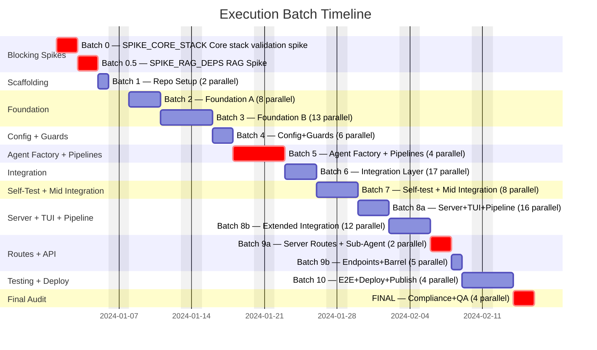
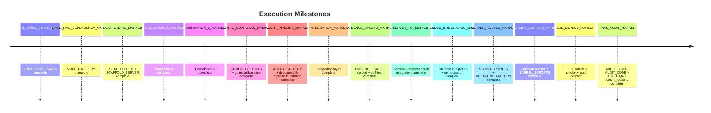
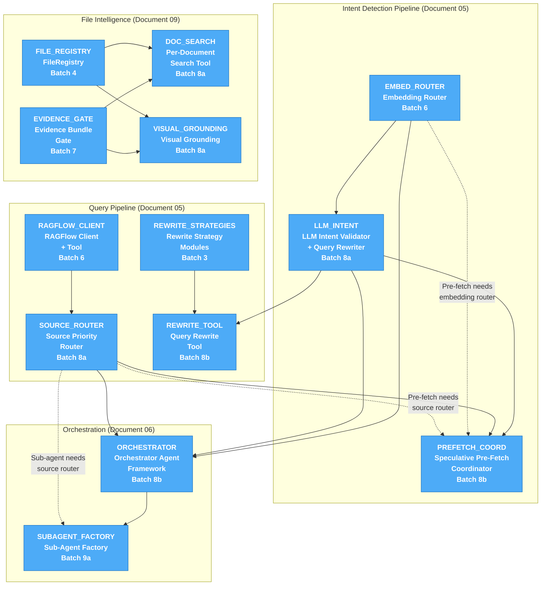
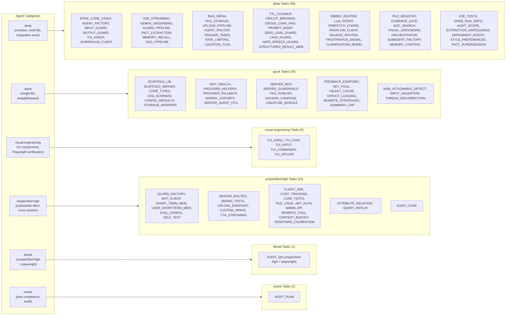
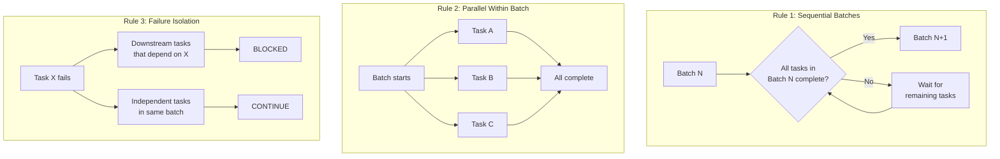

# 17 — Execution Plan

> **Scope**: Parallel execution batches, dependency matrix, agent dispatch, critical path analysis, subpath barrel convention, batch completion rules.
>
> **Goal**: Maximize throughput by grouping independent tasks into parallel batches. Each batch completes before the next begins. Within a batch, independent tasks run concurrently; intra-batch dependencies execute in dependency order within the batch window.
>
> **Scale**: 99 implementation tasks + 4 final audit tasks = 103 total. 15 batches. Maximum concurrency: 17 tasks (Batch 6). Estimated ~70% faster than sequential execution.

---

## Table of Contents

- [Batch Timeline](#batch-timeline)
- [Critical Path Analysis](#critical-path-analysis)
- [Parallel Execution Batches](#parallel-execution-batches)
- [Dependency Graph](#dependency-graph)
- [Batch Parallelism Visualization](#batch-parallelism-visualization)
- [Agent Dispatch Map](#agent-dispatch-map)
- [Complete Task Registry (103 Tasks) and Full Dependency Matrix](#complete-task-registry-103-tasks-and-full-dependency-matrix)
- [Subpath Barrel Export Convention](#subpath-barrel-export-convention)
- [Batch Completion Rules](#batch-completion-rules)
- [New Task Registry (Documents 05, 06, 07, 09, 10)](#new-task-registry-documents-05-06-07-09-10)

---

## Batch Timeline

### Batch Summary

| Batch | Name | Tasks | Parallelism | Theme |
|------|------|-------|-------------|-------|
| 0 | BLOCKING | 1 | — | Validates all tech assumptions |
| 0.5 | RAG Validation | 1 | — | Validates RAG dependency chain |
| 1 | Scaffolding | 2 | 2 parallel | Repo structure for library + server |
| 2 | Foundation A | 8 | 8 parallel | Types, storage, MCP, TUI shell, Docker, logging |
| 3 | Foundation B | 13 | 13 parallel | Schemas, memory, TUI components, observability, cache, rewrite strategies |
| 4 | Config + Guards | 6 | 6 parallel | Configuration system, guardrails, FileRegistry, summary cap |
| 5 | Agent Factory + Pipelines | 4 | 4 parallel | Agent factory plus document/file pipeline gates |
| 6 | Integration Layer | 17 | 17 parallel | Streaming, grounding, core tools, intent routing, RAG infra |
| 7 | Self-test + Mid Integration | 8 | 8 parallel | Evidence gate, upload pipeline, spans, Trigger tasks, eval infra, non-actionable detection, input validation, thread resurrection |
| 8a | Server + TUI + Pipeline | 16 | 16 parallel | TUI integration, server config, search/visual tools, intent validator, extraction safeguards, context budget, style/fact calibration |
| 8b | Extended Integration | 12 | 12 parallel | Upload TUI, cost tracking, TTL, cross-conv RAG, pre-fetch, rewrite, orchestrator, dependent intent, attribute negation, query replay, frustration/clarification |
| 9a | Server Routes + Sub-Agent Factory | 2 | 2 parallel | HTTP routes + lifecycle + sub-agent assembly |
| 9b | Endpoints + Barrel | 5 | 5 parallel | Upload/feedback/file/admin endpoints + barrel exports |
| 10 | E2E + Deploy | 4 | 4 parallel | Integration tests, publish prep, smoke tests, load tests |
| FINAL | Audit | 4 | 4 parallel | Plan compliance, code quality, full QA, scope fidelity |

### Milestone Markers

---

## Critical Path Analysis

### Critical Path Chain

The longest sequential dependency chain determines the minimum wall-clock time. Every task on this path is a gate — delay in any one delays the entire project.

```mermaid
graph LR
    SPIKE_CORE_STACK["SPIKE_CORE_STACK<br/>Bun+Core stack<br/>Spike"]:::crit
    SCAFFOLD_LIB["SCAFFOLD_LIB<br/>Repo<br/>Setup"]:::crit
    CORE_TYPES["CORE_TYPES<br/>Core<br/>Types"]:::crit
    ZOD_SCHEMAS["ZOD_SCHEMAS<br/>Zod<br/>Schemas"]:::crit
    CONFIG_DEFAULTS["CONFIG_DEFAULTS<br/>Config<br/>System"]:::crit
    AGENT_FACTORY["AGENT_FACTORY<br/>Agent<br/>Factory"]:::crit
    CTA_STREAMING["CTA_STREAMING<br/>CTA<br/>Tool"]:::crit
    SERVER_AGENT_CFG["SERVER_AGENT_CFG<br/>Server<br/>Config"]:::crit
    SERVER_ROUTES["SERVER_ROUTES<br/>Server<br/>Routes"]:::crit
    UPLOAD_ENDPOINT["UPLOAD_ENDPOINT<br/>Upload<br/>Endpoint"]:::crit
    E2E_TESTS["E2E_TESTS<br/>E2E<br/>Tests"]:::crit
    FINAL["AUDIT_PLAN, AUDIT_CODE, AUDIT_QA, AUDIT_SCOPE<br/>Final<br/>Audit"]:::crit

    SPIKE_CORE_STACK --> SCAFFOLD_LIB --> CORE_TYPES --> ZOD_SCHEMAS --> CONFIG_DEFAULTS --> AGENT_FACTORY --> CTA_STREAMING --> SERVER_AGENT_CFG --> SERVER_ROUTES --> UPLOAD_ENDPOINT --> E2E_TESTS --> FINAL

    classDef crit fill:#ff6b6b,stroke:#c92a2a,color:white,font-weight:bold
```

### Risk Register

| Bottleneck | Batch | Why It's Dangerous | Mitigation |
|------------|------|--------------------|------------|
| SPIKE_CORE_STACK — Core stack validation spike | 0 | Blocks everything. If any core dependency fails under Bun, the stack is revised before implementation continues. | Execute first. No other work begins until SPIKE_CORE_STACK passes. |
| SPIKE_RAG_DEPS — RAG Dependencies Spike | 0.5 | Blocks document processing, RAG infra, and file storage. Three critical Batch 2 tasks depend on SPIKE_RAG_DEPS. | Execute immediately after SPIKE_CORE_STACK. Validates unpdf, JIMP, pgvector, etc. |
| AGENT_FACTORY — Agent Factory | 5 | Critical gate for most integration paths. 8 Batch 6 tasks and multiple downstream server/orchestration paths wait on AGENT_FACTORY outputs. | Priority assignment. Deep category agent with focused scope. |
| SERVER_ROUTES — Server Routes | 9a | Single-task batch. All server endpoints (UPLOAD_ENDPOINT, FEEDBACK_ENDPOINT, FILE_CRUD, ADMIN_API) and barrel exports (BARREL_EXPORTS) depend on SERVER_ROUTES. | Complex task — depends on 8 prior tasks. Cannot be parallelized further. |

### Timing Estimates

| Metric | Value |
|--------|-------|
| Critical path length | 12 tasks across 12 batches |
| Sequential execution (all 99 tasks) | ~350–450 hours estimated |
| Parallel execution (batch model) | ~100–130 hours estimated |
| Parallel speedup | ~70% faster than sequential |
| Maximum concurrency | 17 tasks (Batch 6) |
| Single-task bottleneck batches | 2 (Batch 0, 0.5) |
| Total batches | 15 (including FINAL) |

---

## Parallel Execution Batches

### Batch 0 — BLOCKING (1 task)

> Validates ALL technology assumptions. Nothing else runs until this passes.

| Task | Description | Category |
|------|-------------|----------|
| SPIKE_CORE_STACK | Core stack validation spike (Bun + AI SDK + Drizzle + deps) | `deep` |

**Gate**: SPIKE_CORE_STACK must confirm that Bun can run the full core stack with all required features (agent creation, tool calling, streaming, processor hooks). If SPIKE_CORE_STACK fails, dependencies are revised and the entire plan is re-evaluated.

---

### Batch 0.5 — RAG Validation (1 task)

> Validates the RAG dependency chain. Runs after SPIKE_CORE_STACK confirms the runtime.

| Task | Description | Category |
|------|-------------|----------|
| SPIKE_RAG_DEPS | RAG dependencies spike (unpdf, pdf-lib, JIMP, pgvector, Bun.S3Client, LibreOffice, Trigger.dev, ioredis, p-limit) | `deep` |

**Gate**: SPIKE_RAG_DEPS must confirm that all document processing and RAG dependencies work under Bun. Blocks DOC_PIPELINE (documents), RAG_INFRA (RAG), and FILE_STORAGE (file storage).

---

### Batch 1 — Scaffolding (2 parallel)

> Sets up both repositories with build tooling, workspace config, and project structure.

| Task | Description | Category |
|------|-------------|----------|
| SCAFFOLD_LIB | safeagent repo setup (Bun workspace with core library, TUI app, and client SDK stubs) | `quick` |
| SCAFFOLD_SERVER | Server repo setup (Elysia, project config, TypeScript config) | `quick` |

---

### Batch 2 — Foundation A (8 parallel)

> Core types, storage, MCP, TUI shell, Docker infra bootstrap, and logging.

| Task | Description | Category | Depends On |
|------|-------------|----------|------------|
| CORE_TYPES | Core type definitions (all interfaces incl. file upload + RAG types) | `quick` | SCAFFOLD_LIB |
| STORAGE_WRAPPER | Storage wrapper + Postgres default | `quick` | SCAFFOLD_LIB |
| MCP_HEALTH | MCP health-check wrapper | `quick` | SCAFFOLD_LIB |
| PROVIDER_HELPERS | Provider model resolution helpers | `quick` | SCAFFOLD_LIB |
| TUI_SHELL | TUI app shell (OpenTUI Solid setup) | `visual-engineering` | SCAFFOLD_LIB |
| SURREALDB_CLIENT | SurrealDB client via surqlize ORM + memory graph schema | `deep` | SCAFFOLD_LIB |
| DOCKER_COMPOSE | Docker Compose (pgvector + MinIO + SurrealDB + Valkey + Trigger.dev + LibreOffice) | `quick` | SCAFFOLD_SERVER |
| STRUCT_LOGGING | Structured logging (LogTape + AsyncLocalStorage context) | `quick` | SCAFFOLD_LIB |

---

### Batch 3 — Foundation B (13 parallel)

> Schemas, MCP client, memory, provider fallback, TUI components, observability, key pool, cache, circuit breaker, and rewrite strategies.

| Task | Description | Category | Depends On |
|------|-------------|----------|------------|
| ZOD_SCHEMAS | Zod validation schemas | `quick` | CORE_TYPES |
| MCP_CLIENT | MCP client via framework `MCPServerStdio`/`MCPServerSSE`/`MCPServerStreamableHttp` | `unspecified-high` | CORE_TYPES, MCP_HEALTH |
| SHORT_TERM_MEM | Memory management wrapper | `unspecified-high` | CORE_TYPES, STORAGE_WRAPPER |
| PROVIDER_FALLBACK | Provider fallback helper (createFallbackModel) | `quick` | PROVIDER_HELPERS |
| TUI_CHAT | Chat message display (streaming markdown) | `visual-engineering` | TUI_SHELL |
| TUI_INPUT | Input component (textarea + submit) | `visual-engineering` | TUI_SHELL |
| TUI_COMMANDS | Command system (/help, /model, /clear, /quit) | `visual-engineering` | TUI_SHELL |
| LANGFUSE_MODULE | Langfuse observability via framework `TracingExporter` + `langfuse` SDK | `quick` | CORE_TYPES |
| KEY_POOL | API Key Pool — multi-key provider distribution | `quick` | CORE_TYPES, SCAFFOLD_LIB |
| VALKEY_CACHE | Valkey cache module (Cache interface + budget key helpers) | `quick` | CORE_TYPES, SCAFFOLD_LIB |
| CIRCUIT_BREAKER | Circuit breaker for external calls | `deep` | CORE_TYPES |
| **REWRITE_STRATEGIES** | **Rewrite Strategy Modules (HyDE, EntityExtraction, DenseKeywords)** | `quick` | CORE_TYPES |
| USER_SHORTTERM_MEM | User short-term memory (cross-thread) | `unspecified-high` | SHORT_TERM_MEM |

> **NEW**: REWRITE_STRATEGIES (from Document 05) delivers three independently importable rewrite strategy modules. Depends only on types — fits naturally alongside other CORE_TYPES-dependent tasks.

---

### Batch 4 — Configuration + Guardrails (6 parallel)

> Configuration system, input/output/external guardrails, and FileRegistry.

| Task | Description | Category | Depends On |
|------|-------------|----------|------------|
| CONFIG_DEFAULTS | Configuration system with defaults | `quick` | CORE_TYPES, ZOD_SCHEMAS |
| INPUT_GUARD | Input guardrail composition | `deep` | CORE_TYPES, ZOD_SCHEMAS |
| OUTPUT_GUARD | Streaming output guardrail (framework `OutputGuardrail` with `tripwireTriggered` pattern) | `deep` | CORE_TYPES, ZOD_SCHEMAS |
| GUARD_FACTORY | External guardrail adapter | `unspecified-high` | CORE_TYPES |
| **FILE_REGISTRY** | **FileRegistry — Temporal + ordinal + named resolution engine** | `deep` | STORAGE_WRAPPER, VALKEY_CACHE |
| SUMMARY_CAP | Rolling summary size cap with compaction | `quick` | SHORT_TERM_MEM |

> **NEW**: FILE_REGISTRY (from Document 09) implements per-user file reference resolution (Postgres + Valkey cache). EVIDENCE_GATE (from Document 09) implements the structural anti-hallucination gate with Attribute-First citation planning and is scheduled in Batch 7.

---

### Batch 5 — Agent Factory + Pipeline Foundation (4 parallel)

> AGENT_FACTORY remains critical. DOC_PIPELINE and FILE_STORAGE now run here after KEY_POOL and CONFIG_DEFAULTS are available.

| Task | Description | Category | Depends On |
|------|-------------|----------|------------|
| DOC_PIPELINE | Document processing pipeline (multimodal-first) | `deep` | SPIKE_RAG_DEPS, KEY_POOL, CONFIG_DEFAULTS |
| FILE_STORAGE | File storage (S3 + metadata tables + quota) | `deep` | DOCKER_COMPOSE, CONFIG_DEFAULTS |
| AGENT_FACTORY | Agent creation factory wrapping `@openai/agents` framework (`createAgent` + `aisdk()` bridge) | `deep` | CORE_TYPES, ZOD_SCHEMAS, CONFIG_DEFAULTS, STORAGE_WRAPPER, PROVIDER_HELPERS |
| STRUCTURED_RESULT_MEM | Structured result set storage and ordinal resolution | `deep` | STORAGE_WRAPPER, CORE_TYPES, AGENT_FACTORY |

**Critical path note**: AGENT_FACTORY still combines type definitions, validation schemas, configuration, storage, and provider resolution into a single factory. Most integration work remains blocked on AGENT_FACTORY completion.

---

### Batch 6 — Integration Layer (17 parallel)

> Streaming, grounding, guardrail orchestration, memory tools, CTA, rate limiting, prompts, buffered guardrail, embedding router, RAGFlow client, and RAG infrastructure.

| Task | Description | Category | Depends On |
|------|-------------|----------|------------|
| SSE_STREAMING | SSE streaming layer + `Runner.run()` → SSE event translation | `deep` | AGENT_FACTORY, INPUT_GUARD, OUTPUT_GUARD, SCAFFOLD_LIB |
| GEMINI_GROUNDING | Gemini grounding agent mode | `deep` | AGENT_FACTORY |
| GUARD_PIPELINE | Guardrail pipeline orchestrator | `deep` | INPUT_GUARD, OUTPUT_GUARD, GUARD_FACTORY |
| EVAL_CONFIG | Eval/scoring configuration helpers | `unspecified-high` | AGENT_FACTORY |
| FACT_EXTRACTION | Fact extraction pipeline (stream completion callback + Gemini Flash) (+ humanlikeness enhancements) | `deep` | AGENT_FACTORY, SURREALDB_CLIENT |
| MEMORY_RECALL | Memory recall tool (createMemoryRecallTool) (+ humanlikeness enhancements) | `deep` | AGENT_FACTORY, SURREALDB_CLIENT |
| RAG_INFRA | RAG infrastructure (Drizzle page_index + hybrid search RRF + exhaustive query tool) | `deep` | STORAGE_WRAPPER, DOC_PIPELINE |
| CTA_STREAMING | CTA streaming tool + stream injection | `unspecified-high` | CORE_TYPES, AGENT_FACTORY |
| LOCATION_TOOL | Location enrichment tool (geocoding + image enrichment + stream event suppression) | `deep` | CORE_TYPES, AGENT_FACTORY, VALKEY_CACHE |
| RATE_LIMITING | Rate limiting middleware (Valkey sliding window) | `deep` | CORE_TYPES, VALKEY_CACHE |
| PROMPT_MGMT | Langfuse prompt management integration | `deep` | LANGFUSE_MODULE |
| ZERO_LEAK_GUARD | Zero-leak output guardrail (buffered gating) | `deep` | OUTPUT_GUARD |
| **EMBED_ROUTER** | **Embedding Router (vector similarity classifier + Valkey cache)** | `deep` | CORE_TYPES, VALKEY_CACHE, AGENT_FACTORY |
| **RAGFLOW_CLIENT** | **RAGFlow Client + Tool (raw fetch wrapper + Citation mapping)** | `deep` | CORE_TYPES, CONFIG_DEFAULTS |
| LANG_GUARD | Language Guard (two-stage language enforcement + output drift scanner) | `deep` | CORE_TYPES, GUARD_FACTORY |
| HATE_SPEECH_GUARD | Hate Speech Guard (hybrid obscenity + multilingual matching) | `deep` | CORE_TYPES, GUARD_FACTORY |
| MEMORY_CONTROL | User memory control tools (inspect/delete) | `deep` | SURREALDB_CLIENT, STRUCTURED_RESULT_MEM, AGENT_FACTORY |

> **NEW**: EMBED_ROUTER (Document 05) implements the fast semantic classifier using Valkey-cached embeddings. RAGFLOW_CLIENT (Document 05) wraps RAGFlow's retrieval API. LOCATION_TOOL (Document 06) adds geocoding and image enrichment with streamed location events. DOC_SEARCH and VISUAL_GROUNDING are scheduled in Batch 8a because both require EVIDENCE_GATE (Batch 7).

---

### Batch 7 — Self-test + Mid Integration (8 parallel)

| Task | Description | Category | Depends On |
|------|-------------|----------|------------|
| EVIDENCE_GATE | Evidence Bundle Gate — sufficiency scoring + configurable thresholds | `deep` | EMBED_ROUTER, RAG_INFRA, CORE_TYPES |
| UPLOAD_PIPELINE | Upload processing pipeline (direct/indexed/rag routing) | `deep` | FILE_STORAGE, STORAGE_WRAPPER, VALKEY_CACHE, DOCKER_COMPOSE |
| CUSTOM_SPANS | Custom observability spans (guardrails + RAG tracing) | `unspecified-high` | INPUT_GUARD, OUTPUT_GUARD, RAG_INFRA, LANGFUSE_MODULE |
| TRIGGER_TASKS | Trigger.dev task definitions + QueueAdapter | `deep` | CORE_TYPES, RAG_INFRA, FILE_STORAGE, VALKEY_CACHE |
| SELF_TEST | Self-test infrastructure (Promptfoo external eval) | `unspecified-high` | EVAL_CONFIG |
| NON_ACTIONABLE_DETECT | Non-actionable message detection (pleasantries, gibberish short-circuit) | `quick` | EMBED_ROUTER |
| INPUT_VALIDATION | Input message length validation | `quick` | SSE_STREAMING |
| THREAD_RESURRECTION | Thread resurrection detection and re-hydration (+ humanlikeness enhancements) | `quick` | SHORT_TERM_MEM, FACT_EXTRACTION, MEMORY_RECALL |

---

### Batch 8a — Server + TUI + Intent Pipeline (16 parallel)

> TUI agent integration, server configuration, client SDK, query router, JWT auth, LLM intent validator, source priority router, and evidence-gated search/visual tools.

| Task | Description | Category | Depends On |
|------|-------------|----------|------------|
| TUI_AGENT | TUI ↔ safeagent agent integration | `deep` | TUI_SHELL, TUI_CHAT, TUI_INPUT |
| SERVER_AGENT_CFG | Server agent config (prompts, model, processors) | `quick` | SCAFFOLD_SERVER, CTA_STREAMING, LOCATION_TOOL |
| SERVER_MCP | Server MCP definitions | `quick` | SCAFFOLD_SERVER, MCP_CLIENT |
| SERVER_GUARDRAILS | Server guardrail rules | `quick` | SCAFFOLD_SERVER, INPUT_GUARD, OUTPUT_GUARD, GUARD_FACTORY, LANG_GUARD, HATE_SPEECH_GUARD |
| CLIENT_SDK | Client SDK (@safeagent/client) | `unspecified-high` | SSE_STREAMING, CTA_STREAMING, CORE_TYPES |
| AGENT_ROUTER | Agent router — query classification + dispatch | `deep` | AGENT_FACTORY, SSE_STREAMING |
| JWT_AUTH | JWT auth middleware | `unspecified-high` | SCAFFOLD_SERVER |
| **LLM_INTENT** | **LLM Intent Validator + Query Rewriter (generateObject-based validation) (+ humanlikeness enhancements)** | `deep` | CORE_TYPES, AGENT_FACTORY, EMBED_ROUTER |
| **SOURCE_ROUTER** | **Source Priority Router (parallel fan-out + weighted merge)** | `deep` | RAGFLOW_CLIENT, CORE_TYPES, CONFIG_DEFAULTS |
| **DOC_SEARCH** | **Per-Document Search Tool (searchDocument — evidence bundle)** | `deep` | FILE_REGISTRY, EVIDENCE_GATE, RAG_INFRA |
| **VISUAL_GROUNDING** | **Visual Grounding — Multimodal LLM integration for charts/tables/images** | `deep` | FILE_STORAGE, CONFIG_DEFAULTS, FILE_REGISTRY, EVIDENCE_GATE |
| EXTRACTION_SAFEGUARDS | Fact extraction safeguards (attribution, sarcasm, hypothetical, hallucination filters) | `deep` | FACT_EXTRACTION |
| STYLE_PREFERENCES | Communication style meta-preference extraction and storage | `deep` | FACT_EXTRACTION, SURREALDB_CLIENT |
| FACT_SUPERSESSION | Fact contradiction detection and resolution in SurrealDB | `deep` | FACT_EXTRACTION, SURREALDB_CLIENT |
| RESPONSE_CALIBRATION | Response length/energy matching signal computation | `unspecified-high` | CORE_TYPES, AGENT_FACTORY |
| CONTEXT_BUDGET | Context window budget management with truncation (+ humanlikeness enhancements) | `unspecified-high` | SHORT_TERM_MEM, USER_SHORTTERM_MEM, FACT_EXTRACTION, MEMORY_RECALL |

> **NEW**: LLM_INTENT (Document 05) implements the LLM authority that always validates the embedding router's guess and performs conditional query rewriting. SOURCE_ROUTER (Document 05) implements parallel source execution with priority-weighted result merging.

---

### Batch 8b — Extended Integration (12 parallel)

> TUI upload, cost tracking, TTL cleanup, cross-conversation RAG, speculative pre-fetch coordination, query rewrite tool, and orchestrator agent.

| Task | Description | Category | Depends On |
|------|-------------|----------|------------|
| TUI_UPLOAD | TUI /upload command | `visual-engineering` | TUI_SHELL, TUI_COMMANDS, TUI_AGENT |
| COST_TRACKING | Cost tracking + per-user token budgets (event-sourced + Valkey) | `unspecified-high` | FILE_STORAGE, SSE_STREAMING, VALKEY_CACHE |
| TTL_CLEANUP | TTL-based automatic cleanup (Trigger.dev scheduled) | `deep` | FILE_STORAGE, TRIGGER_TASKS, RAG_INFRA |
| CROSS_CONV_RAG | Cross-conversation RAG (global knowledge base) | `deep` | RAG_INFRA |
| **PREFETCH_COORD** | **Speculative Pre-Fetch Coordinator (embedding→LLM parallel + cancellation)** | `deep` | EMBED_ROUTER, LLM_INTENT, SOURCE_ROUTER |
| **REWRITE_TOOL** | **Query Rewrite Tool (7-trigger conditional rewriting + entity guardrail)** | `unspecified-high` | REWRITE_STRATEGIES, CORE_TYPES, LLM_INTENT |
| **ORCHESTRATOR** | **Orchestrator Agent Framework (supervisor + parallel sub-agent synthesis)** | `deep` | AGENT_FACTORY, EMBED_ROUTER, LLM_INTENT, SOURCE_ROUTER |
| DEPENDENT_INTENT | Dependent intent coordination in orchestrator | `deep` | ORCHESTRATOR, LLM_INTENT |
| FRUSTRATION_SIGNAL | Frustration escalation detection across turns | `deep` | EMBED_ROUTER, LLM_INTENT |
| CLARIFICATION_MODEL | Proactive clarification + multi-turn patience model | `deep` | LLM_INTENT, EMBED_ROUTER, AGENT_FACTORY |
| ATTRIBUTE_NEGATION | Attribute negation detection and search filtering | `unspecified-high` | LLM_INTENT, REWRITE_TOOL |
| QUERY_REPLAY | Query replay detection and rewriting (+ humanlikeness enhancements) | `unspecified-high` | LLM_INTENT, REWRITE_TOOL, STRUCTURED_RESULT_MEM |

> **NEW**: PREFETCH_COORD (Document 05) coordinates the speculative pre-fetch pattern — runs embedding router and LLM validator concurrently, starts sources speculatively, cancels on disagreement. REWRITE_TOOL (Document 05) checks all 7 rewrite triggers (pronoun referent, short query, multi-intent, highly specific, jargon mismatch, ordinal reference, query replay) and applies per-source strategies with the entity-preservation guardrail.

---

### Batch 9a — Server Routes + Lifecycle (2 parallel)

| Task | Description | Category | Depends On |
|------|-------------|----------|------------|
| SUBAGENT_FACTORY | Sub-Agent Factory (intent-scoped Agent + Handoff creation with tool assignment) | `deep` | AGENT_FACTORY, ORCHESTRATOR, SOURCE_ROUTER |
| SERVER_ROUTES | Server HTTP routes + SSE endpoints + auth + health + graceful shutdown | `unspecified-high` | SCAFFOLD_SERVER, SERVER_AGENT_CFG, SSE_STREAMING |

---

### Batch 9b — Barrel Exports + Server Endpoints (5 parallel)

| Task | Description | Category | Depends On |
|------|-------------|----------|------------|
| BARREL_EXPORTS | Library public API exports + barrel files | `quick` | ALL library, SERVER_ROUTES |
| UPLOAD_ENDPOINT | Server upload endpoint (multipart) | `unspecified-high` | UPLOAD_PIPELINE, SERVER_ROUTES |
| FEEDBACK_ENDPOINT | User feedback endpoint (feedback submission → Langfuse scores) | `quick` | SERVER_ROUTES, LANGFUSE_MODULE |
| FILE_CRUD | File management CRUD endpoints | `unspecified-high` | SERVER_ROUTES, FILE_REGISTRY |
| ADMIN_API | Admin API for budget management | `unspecified-high` | SERVER_ROUTES, COST_TRACKING, JWT_AUTH |

> **Note**: BARREL_EXPORTS depends on ALL library module tasks (AGENT_FACTORY through EVAL_CONFIG, SERVER_ROUTES, SURREALDB_CLIENT, FACT_EXTRACTION, MEMORY_RECALL, SPIKE_RAG_DEPS, DOC_PIPELINE, RAG_INFRA, FILE_STORAGE, UPLOAD_PIPELINE, LANGFUSE_MODULE through TRIGGER_TASKS, RATE_LIMITING, STRUCT_LOGGING, CIRCUIT_BREAKER through VISUAL_GROUNDING, plus STYLE_PREFERENCES, FACT_SUPERSESSION, RESPONSE_CALIBRATION, FRUSTRATION_SIGNAL, and CLARIFICATION_MODEL). It handles only the TOP-LEVEL barrel — subpath barrels are each task's responsibility (see Subpath Barrel Export Convention below).

---

### Batch 10 — E2E + Deploy + Publish + Load Testing (4 parallel)

| Task | Description | Category | Depends On |
|------|-------------|----------|------------|
| E2E_TESTS | End-to-end integration tests (incl. upload, RAG, intent pipeline, evidence gate, visual grounding) | `deep` | TUI_AGENT, SELF_TEST, SERVER_AGENT_CFG, SERVER_ROUTES, SERVER_MCP, SERVER_GUARDRAILS, UPLOAD_ENDPOINT, TUI_UPLOAD, DOCKER_COMPOSE, FEEDBACK_ENDPOINT, CLIENT_SDK, COST_TRACKING, AGENT_ROUTER, VALKEY_CACHE, TRIGGER_TASKS, RATE_LIMITING, FILE_CRUD, TTL_CLEANUP, JWT_AUTH, CROSS_CONV_RAG, ADMIN_API |
| PKG_PUBLISH | package publish preparation | `quick` | BARREL_EXPORTS |
| SMOKE_TESTS | Server smoke tests + deployment config | `unspecified-high` | SERVER_AGENT_CFG, SERVER_ROUTES, SERVER_MCP, SERVER_GUARDRAILS, UPLOAD_ENDPOINT, DOCKER_COMPOSE, FILE_CRUD, ADMIN_API |
| LOAD_TESTS | k6 load test scripts + smoke run | `unspecified-high` | SERVER_ROUTES, UPLOAD_ENDPOINT, DOCKER_COMPOSE |

---

### Batch FINAL — Audit (4 parallel)

> After ALL tasks complete. Independent review across four dimensions.

| Task | Description | Category |
|------|-------------|----------|
| AUDIT_PLAN | Plan compliance audit | `oracle` |
| AUDIT_CODE | Code quality review | `unspecified-high` |
| AUDIT_QA | Full QA run — agent-executed | `unspecified-high` + `playwright` |
| AUDIT_SCOPE | Scope fidelity check | `deep` |

---

## Dependency Graph

### High-Level Batch Dependencies

```mermaid
graph TB
    BATCH_SPIKE["Batch 0<br/>SPIKE_CORE_STACK Spike"]
    BATCH_RAG_SPIKE["Batch 0.5<br/>SPIKE_RAG_DEPS RAG Spike"]
    BATCH_SCAFFOLD["Batch 1<br/>SCAFFOLD_LIB, SCAFFOLD_SERVER Scaffold"]
    BATCH_TYPES_STORAGE["Batch 2<br/>8 tasks — Types, Storage,<br/>MCP, TUI, Docker, Logging"]
    BATCH_SCHEMAS_MEMORY["Batch 3<br/>13 tasks — Schemas, Memory,<br/>Cache, Observability, Rewrite"]
    BATCH_CONFIG_GUARDS["Batch 4<br/>6 tasks — Config, Guards,<br/>FileRegistry, Summary"]
    BATCH_AGENT_DOCS["Batch 5<br/>4 tasks — Agent Factory,<br/>Doc Pipeline, File Storage,<br/>Structured Results"]
    BATCH_STREAMING_TOOLS["Batch 6<br/>17 tasks — Streaming, Tools,<br/>RAG Infra, Intent Base"]
    BATCH_EVIDENCE_UPLOAD["Batch 7<br/>8 tasks — Self-test,<br/>Evidence, Upload/Trigger"]
    BATCH_SERVER_TUI["Batch 8a<br/>16 tasks — Server, TUI,<br/>Intent, Search, Visual,<br/>Humanlikeness Signals"]
    BATCH_UPLOAD_COST["Batch 8b<br/>12 tasks — Upload TUI, Cost,<br/>TTL, RAG, Pre-fetch, Rewrite,<br/>Orchestrator, Clarification"]
    BATCH_ROUTES_SUBAGENT["Batch 9a<br/>2 tasks — SERVER_ROUTES,<br/>SUBAGENT_FACTORY"]
    BATCH_ENDPOINTS["Batch 9b<br/>5 tasks — Endpoints,<br/>Barrel Exports"]
    BATCH_E2E_DEPLOY["Batch 10<br/>4 tasks — E2E, Deploy,<br/>Publish, Load"]
    BATCH_FINAL_AUDIT["FINAL<br/>4 tasks — Audit"]

    BATCH_SPIKE --> BATCH_RAG_SPIKE --> BATCH_SCAFFOLD --> BATCH_TYPES_STORAGE --> BATCH_SCHEMAS_MEMORY --> BATCH_CONFIG_GUARDS --> BATCH_AGENT_DOCS --> BATCH_STREAMING_TOOLS --> BATCH_EVIDENCE_UPLOAD --> BATCH_SERVER_TUI --> BATCH_UPLOAD_COST --> BATCH_ROUTES_SUBAGENT --> BATCH_ENDPOINTS --> BATCH_E2E_DEPLOY --> BATCH_FINAL_AUDIT

    style BATCH_SPIKE fill:#ff6b6b,color:white
    style BATCH_RAG_SPIKE fill:#ff6b6b,color:white
    style BATCH_AGENT_DOCS fill:#ff6b6b,color:white
    style BATCH_ROUTES_SUBAGENT fill:#ff8787,color:white
    style BATCH_FINAL_AUDIT fill:#ff6b6b,color:white
```

### Per-Task Dependency Graph

```mermaid
graph TB
    SPIKE_CORE_STACK["SPIKE_CORE_STACK Spike"]:::crit --> SPIKE_RAG_DEPS["SPIKE_RAG_DEPS RAG Spike"]:::crit
    SPIKE_CORE_STACK --> SCAFFOLD_LIB["SCAFFOLD_LIB Repo"]:::crit
    SPIKE_CORE_STACK --> SCAFFOLD_SERVER["SCAFFOLD_SERVER Server Repo"]

    SPIKE_RAG_DEPS --> DOC_PIPELINE["DOC_PIPELINE Doc Pipeline"]

    SCAFFOLD_LIB --> CORE_TYPES["CORE_TYPES Types"]:::crit
    SCAFFOLD_LIB --> STORAGE_WRAPPER["STORAGE_WRAPPER Storage"]
    SCAFFOLD_LIB --> MCP_HEALTH["MCP_HEALTH MCP Health"]
    SCAFFOLD_LIB --> PROVIDER_HELPERS["PROVIDER_HELPERS Provider"]
    SCAFFOLD_LIB --> TUI_SHELL["TUI_SHELL TUI Shell"]
    SCAFFOLD_LIB --> SURREALDB_CLIENT["SURREALDB_CLIENT SurrealDB"]
    SCAFFOLD_LIB --> STRUCT_LOGGING["STRUCT_LOGGING Logging"]

    CORE_TYPES --> ZOD_SCHEMAS["ZOD_SCHEMAS Schemas"]:::crit
    CORE_TYPES --> MCP_CLIENT["MCP_CLIENT MCP Client"]
    CORE_TYPES --> SHORT_TERM_MEM["SHORT_TERM_MEM Memory"]
    CORE_TYPES --> LANGFUSE_MODULE["LANGFUSE_MODULE Langfuse"]
    CORE_TYPES --> KEY_POOL["KEY_POOL Key Pool"]
    CORE_TYPES --> VALKEY_CACHE["VALKEY_CACHE Valkey"]
    CORE_TYPES --> CIRCUIT_BREAKER["CIRCUIT_BREAKER Circuit Breaker"]
    CORE_TYPES --> REWRITE_STRATEGIES["REWRITE_STRATEGIES Rewrite Strategies"]:::new

    MCP_HEALTH --> MCP_CLIENT
    STORAGE_WRAPPER --> SHORT_TERM_MEM
    PROVIDER_HELPERS --> PROVIDER_FALLBACK["PROVIDER_FALLBACK Fallback"]
    TUI_SHELL --> TUI_CHAT["TUI_CHAT Chat Display"]
    TUI_SHELL --> TUI_INPUT["TUI_INPUT Input"]
    TUI_SHELL --> TUI_COMMANDS["TUI_COMMANDS Commands"]

    DOCKER_COMPOSE["DOCKER_COMPOSE Docker Compose"] --> FILE_STORAGE["FILE_STORAGE File Storage"]
    STORAGE_WRAPPER --> RAG_INFRA["RAG_INFRA RAG Infra"]
    DOC_PIPELINE --> RAG_INFRA
    STORAGE_WRAPPER --> FILE_REGISTRY["FILE_REGISTRY FileRegistry"]:::new
    VALKEY_CACHE --> FILE_REGISTRY
    CORE_TYPES --> EVIDENCE_GATE["EVIDENCE_GATE Evidence Gate"]:::new
    RAG_INFRA --> EVIDENCE_GATE

    ZOD_SCHEMAS --> CONFIG_DEFAULTS["CONFIG_DEFAULTS Config"]:::crit
    ZOD_SCHEMAS --> INPUT_GUARD["INPUT_GUARD Input Guard"]
    ZOD_SCHEMAS --> OUTPUT_GUARD["OUTPUT_GUARD Output Guard"]
    ZOD_SCHEMAS --> GUARD_FACTORY["GUARD_FACTORY External Guard"]

    CORE_TYPES --> AGENT_FACTORY["AGENT_FACTORY Agent Factory"]:::crit
    ZOD_SCHEMAS --> AGENT_FACTORY
    CONFIG_DEFAULTS --> AGENT_FACTORY
    STORAGE_WRAPPER --> AGENT_FACTORY
    PROVIDER_HELPERS --> AGENT_FACTORY

    classDef crit fill:#ff6b6b,stroke:#c92a2a,color:white,font-weight:bold
    classDef new fill:#4dabf7,stroke:#1971c2,color:white,font-weight:bold
```

### Per-Task Dependency Graph — Integration (Batches 6–10)

```mermaid
graph TB
    AGENT_FACTORY["AGENT_FACTORY Agent Factory"]:::crit --> SSE_STREAMING["SSE_STREAMING SSE Stream"]
    AGENT_FACTORY --> GEMINI_GROUNDING["GEMINI_GROUNDING Grounding"]
    AGENT_FACTORY --> GUARD_PIPELINE["GUARD_PIPELINE Guard Orchestrator"]
    AGENT_FACTORY --> EVAL_CONFIG["EVAL_CONFIG Eval Helpers"]
    AGENT_FACTORY --> FACT_EXTRACTION["FACT_EXTRACTION Fact Extract"]
    AGENT_FACTORY --> MEMORY_RECALL["MEMORY_RECALL Memory Recall"]
    AGENT_FACTORY --> CTA_STREAMING["CTA_STREAMING CTA Tool"]:::crit
    AGENT_FACTORY --> LOCATION_TOOL["LOCATION_TOOL Location Tool"]:::new
    AGENT_FACTORY --> EMBED_ROUTER["EMBED_ROUTER Embedding Router"]:::new

    INPUT_GUARD["INPUT_GUARD"] --> GUARD_PIPELINE
    OUTPUT_GUARD["OUTPUT_GUARD"] --> GUARD_PIPELINE
    GUARD_FACTORY["GUARD_FACTORY"] --> GUARD_PIPELINE
    CORE_TYPES --> LANG_GUARD["LANG_GUARD Language Guard"]:::new
    GUARD_FACTORY --> LANG_GUARD
    CORE_TYPES --> HATE_SPEECH_GUARD["HATE_SPEECH_GUARD Hate Speech Guard"]:::new
    GUARD_FACTORY --> HATE_SPEECH_GUARD
    DOC_PIPELINE["DOC_PIPELINE"] --> UPLOAD_PIPELINE["UPLOAD_PIPELINE Upload Pipeline"]
    RAG_INFRA["RAG_INFRA"] --> UPLOAD_PIPELINE
    FILE_STORAGE["FILE_STORAGE"] --> UPLOAD_PIPELINE
    LANGFUSE_MODULE["LANGFUSE_MODULE"] --> PROMPT_MGMT["PROMPT_MGMT Prompt Mgmt"]
    OUTPUT_GUARD --> ZERO_LEAK_GUARD["ZERO_LEAK_GUARD Zero-leak Guard"]
    CORE_TYPES --> LOCATION_TOOL
    VALKEY_CACHE --> LOCATION_TOOL

    FILE_REGISTRY["FILE_REGISTRY FileRegistry"]:::new --> DOC_SEARCH["DOC_SEARCH Doc Search"]:::new
    EVIDENCE_GATE["EVIDENCE_GATE Evidence Gate"]:::new --> DOC_SEARCH
    FILE_REGISTRY --> VISUAL_GROUNDING["VISUAL_GROUNDING Visual Ground"]:::new
    EVIDENCE_GATE --> VISUAL_GROUNDING

    RAGFLOW_CLIENT["RAGFLOW_CLIENT RAGFlow Client"]:::new --> SOURCE_ROUTER["SOURCE_ROUTER Source Router"]:::new
    EMBED_ROUTER --> LLM_INTENT["LLM_INTENT LLM Validator"]:::new
    AGENT_FACTORY --> LLM_INTENT
    SOURCE_ROUTER --> PREFETCH_COORD["PREFETCH_COORD Pre-fetch Coord"]:::new
    LLM_INTENT --> PREFETCH_COORD
    EMBED_ROUTER --> PREFETCH_COORD
    FACT_EXTRACTION --> STYLE_PREFERENCES["STYLE_PREFERENCES Style Pref"]:::new
    SURREALDB_CLIENT --> STYLE_PREFERENCES
    FACT_EXTRACTION --> FACT_SUPERSESSION["FACT_SUPERSESSION Fact Supersession"]:::new
    SURREALDB_CLIENT --> FACT_SUPERSESSION
    CORE_TYPES --> RESPONSE_CALIBRATION["RESPONSE_CALIBRATION Response Calibration"]:::new
    AGENT_FACTORY --> RESPONSE_CALIBRATION
    REWRITE_STRATEGIES["REWRITE_STRATEGIES Rewrite Strat"]:::new --> REWRITE_TOOL["REWRITE_TOOL Rewrite Tool"]:::new
    LLM_INTENT --> REWRITE_TOOL
    EMBED_ROUTER --> FRUSTRATION_SIGNAL["FRUSTRATION_SIGNAL Frustration Signal"]:::new
    LLM_INTENT --> FRUSTRATION_SIGNAL
    LLM_INTENT --> CLARIFICATION_MODEL["CLARIFICATION_MODEL Clarification Model"]:::new
    EMBED_ROUTER --> CLARIFICATION_MODEL
    AGENT_FACTORY --> CLARIFICATION_MODEL

    AGENT_FACTORY --> ORCHESTRATOR["ORCHESTRATOR Orchestrator"]:::new
    EMBED_ROUTER --> ORCHESTRATOR
    LLM_INTENT --> ORCHESTRATOR
    SOURCE_ROUTER --> ORCHESTRATOR
    ORCHESTRATOR --> SUBAGENT_FACTORY["SUBAGENT_FACTORY Sub-Agent Factory"]:::new
    AGENT_FACTORY --> SUBAGENT_FACTORY
    SOURCE_ROUTER --> SUBAGENT_FACTORY

    EVAL_CONFIG --> SELF_TEST["SELF_TEST Self-test"]

    CTA_STREAMING:::crit --> SERVER_AGENT_CFG["SERVER_AGENT_CFG Server Config"]:::crit
    LOCATION_TOOL --> SERVER_AGENT_CFG
    SSE_STREAMING --> TUI_AGENT["TUI_AGENT TUI Integration"]
    SSE_STREAMING --> AGENT_ROUTER["AGENT_ROUTER Agent Router"]
    SSE_STREAMING --> SERVER_ROUTES["SERVER_ROUTES Server Routes"]:::crit
    LANG_GUARD --> SERVER_GUARDRAILS["SERVER_GUARDRAILS Server Guardrails"]
    HATE_SPEECH_GUARD --> SERVER_GUARDRAILS

    SERVER_AGENT_CFG --> SERVER_ROUTES
    AGENT_ROUTER --> SERVER_ROUTES
    COST_TRACKING["COST_TRACKING Cost Track"] --> SERVER_ROUTES
    TRIGGER_TASKS["TRIGGER_TASKS Trigger.dev"] --> SERVER_ROUTES
    RATE_LIMITING["RATE_LIMITING Rate Limit"] --> SERVER_ROUTES
    JWT_AUTH["JWT_AUTH JWT"] --> SERVER_ROUTES

    SERVER_ROUTES:::crit --> BARREL_EXPORTS["BARREL_EXPORTS Barrel"]
    SERVER_ROUTES --> UPLOAD_ENDPOINT["UPLOAD_ENDPOINT Upload EP"]:::crit
    SERVER_ROUTES --> FEEDBACK_ENDPOINT["FEEDBACK_ENDPOINT Feedback EP"]
    SERVER_ROUTES --> FILE_CRUD["FILE_CRUD File CRUD"]
    SERVER_ROUTES --> ADMIN_API["ADMIN_API Admin API"]

    UPLOAD_ENDPOINT --> E2E_TESTS["E2E_TESTS E2E Tests"]:::crit
    BARREL_EXPORTS --> PKG_PUBLISH["PKG_PUBLISH Publish"]

    E2E_TESTS --> F["AUDIT_PLAN, AUDIT_CODE, AUDIT_QA, AUDIT_SCOPE FINAL"]:::crit

    classDef crit fill:#ff6b6b,stroke:#c92a2a,color:white,font-weight:bold
    classDef new fill:#4dabf7,stroke:#1971c2,color:white,font-weight:bold
```

### New Task Dependency Chain (Documents 05, 06, 09)

---

## Batch Parallelism Visualization

```mermaid
graph TB
    subgraph BATCH_SPIKE["Batch 0 — 1 task"]
        SPIKE_CORE_STACK_p["SPIKE_CORE_STACK"]
    end

    subgraph BATCH_RAG_SPIKE["Batch 0.5 — 1 task"]
        SPIKE_RAG_DEPS_p["SPIKE_RAG_DEPS"]
    end

    subgraph BATCH_SCAFFOLD["Batch 1 — 2 parallel"]
        SCAFFOLD_LIB_p["SCAFFOLD_LIB"]
        SCAFFOLD_SERVER_p["SCAFFOLD_SERVER"]
    end

    subgraph BATCH_TYPES_STORAGE["Batch 2 — 8 parallel"]
        CORE_TYPES_p["CORE_TYPES"]
        STORAGE_WRAPPER_p["STORAGE_WRAPPER"]
        MCP_HEALTH_p["MCP_HEALTH"]
        PROVIDER_HELPERS_p["PROVIDER_HELPERS"]
        TUI_SHELL_p["TUI_SHELL"]
        SURREALDB_CLIENT_p["SURREALDB_CLIENT"]
        DOCKER_COMPOSE_p["DOCKER_COMPOSE"]
        STRUCT_LOGGING_p["STRUCT_LOGGING"]
    end

    subgraph BATCH_SCHEMAS_MEMORY["Batch 3 — 13 parallel"]
        ZOD_SCHEMAS_p["ZOD_SCHEMAS"]
        MCP_CLIENT_p["MCP_CLIENT"]
        SHORT_TERM_MEM_p["SHORT_TERM_MEM"]
        PROVIDER_FALLBACK_p["PROVIDER_FALLBACK"]
        TUI_CHAT_p["TUI_CHAT"]
        TUI_INPUT_p["TUI_INPUT"]
        TUI_COMMANDS_p["TUI_COMMANDS"]
        LANGFUSE_MODULE_p["LANGFUSE_MODULE"]
        KEY_POOL_p["KEY_POOL"]
        VALKEY_CACHE_p["VALKEY_CACHE"]
        CIRCUIT_BREAKER_p["CIRCUIT_BREAKER"]
        REWRITE_STRATEGIES_p["REWRITE_STRATEGIES (new)"]
        USER_SHORTTERM_MEM_p["USER_SHORTTERM_MEM (new)"]
    end

    subgraph BATCH_CONFIG_GUARDS["Batch 4 — 6 parallel"]
        CONFIG_DEFAULTS_p["CONFIG_DEFAULTS"]
        INPUT_GUARD_p["INPUT_GUARD"]
        OUTPUT_GUARD_p["OUTPUT_GUARD"]
        GUARD_FACTORY_p["GUARD_FACTORY"]
        FILE_REGISTRY_p["FILE_REGISTRY (new)"]
        SUMMARY_CAP_p["SUMMARY_CAP (new)"]
    end

    subgraph BATCH_AGENT_DOCS["Batch 5 — 4 parallel"]
        DOC_PIPELINE_p["DOC_PIPELINE"]
        FILE_STORAGE_p["FILE_STORAGE"]
        AGENT_FACTORY_p["AGENT_FACTORY"]:::crit
        STRUCTURED_RESULT_MEM_p["STRUCTURED_RESULT_MEM (new)"]
    end

    subgraph BATCH_STREAMING_TOOLS["Batch 6 — 17 parallel (MAX CONCURRENCY)"]
        SSE_STREAMING_p["SSE_STREAMING"]
        GEMINI_GROUNDING_p["GEMINI_GROUNDING"]
        GUARD_PIPELINE_p["GUARD_PIPELINE"]
        EVAL_CONFIG_p["EVAL_CONFIG"]
        FACT_EXTRACTION_p["FACT_EXTRACTION"]
        MEMORY_RECALL_p["MEMORY_RECALL"]
        RAG_INFRA_p["RAG_INFRA"]
        CTA_STREAMING_p["CTA_STREAMING"]
        LOCATION_TOOL_p["LOCATION_TOOL"]
        RATE_LIMITING_p["RATE_LIMITING"]
        PROMPT_MGMT_p["PROMPT_MGMT"]
        ZERO_LEAK_GUARD_p["ZERO_LEAK_GUARD"]
        EMBED_ROUTER_p["EMBED_ROUTER (new)"]
        RAGFLOW_CLIENT_p["RAGFLOW_CLIENT (new)"]
        LANG_GUARD_p["LANG_GUARD"]
        HATE_SPEECH_GUARD_p["HATE_SPEECH_GUARD"]
        MEMORY_CONTROL_p["MEMORY_CONTROL (new)"]
    end

    subgraph BATCH_EVIDENCE_UPLOAD["Batch 7 — 8 parallel"]
        EVIDENCE_GATE_p["EVIDENCE_GATE (new)"]
        UPLOAD_PIPELINE_p["UPLOAD_PIPELINE"]
        CUSTOM_SPANS_p["CUSTOM_SPANS"]
        TRIGGER_TASKS_p["TRIGGER_TASKS"]
        SELF_TEST_p["SELF_TEST"]
        NON_ACTIONABLE_DETECT_p["NON_ACTIONABLE_DETECT (new)"]
        INPUT_VALIDATION_p["INPUT_VALIDATION (new)"]
        THREAD_RESURRECTION_p["THREAD_RESURRECTION (new)"]
    end

    subgraph BATCH_SERVER_TUI["Batch 8a — 16 parallel"]
        TUI_AGENT_p["TUI_AGENT"]
        SERVER_AGENT_CFG_p["SERVER_AGENT_CFG"]
        SERVER_MCP_p["SERVER_MCP"]
        SERVER_GUARDRAILS_p["SERVER_GUARDRAILS"]
        CLIENT_SDK_p["CLIENT_SDK"]
        AGENT_ROUTER_p["AGENT_ROUTER"]
        JWT_AUTH_p["JWT_AUTH"]
        LLM_INTENT_p["LLM_INTENT (new)"]
        SOURCE_ROUTER_p["SOURCE_ROUTER (new)"]
        DOC_SEARCH_p["DOC_SEARCH (new)"]
        VISUAL_GROUNDING_p["VISUAL_GROUNDING (new)"]
        EXTRACTION_SAFEGUARDS_p["EXTRACTION_SAFEGUARDS (new)"]
        STYLE_PREFERENCES_p["STYLE_PREFERENCES (new)"]
        FACT_SUPERSESSION_p["FACT_SUPERSESSION (new)"]
        RESPONSE_CALIBRATION_p["RESPONSE_CALIBRATION (new)"]
        CONTEXT_BUDGET_p["CONTEXT_BUDGET (new)"]
    end

    subgraph BATCH_UPLOAD_COST["Batch 8b — 12 parallel"]
        TUI_UPLOAD_p["TUI_UPLOAD"]
        COST_TRACKING_p["COST_TRACKING"]
        TTL_CLEANUP_p["TTL_CLEANUP"]
        CROSS_CONV_RAG_p["CROSS_CONV_RAG"]
        PREFETCH_COORD_p["PREFETCH_COORD (new)"]
        REWRITE_TOOL_p["REWRITE_TOOL (new)"]
        ORCHESTRATOR_p["ORCHESTRATOR (new)"]
        DEPENDENT_INTENT_p["DEPENDENT_INTENT (new)"]
        FRUSTRATION_SIGNAL_p["FRUSTRATION_SIGNAL (new)"]
        CLARIFICATION_MODEL_p["CLARIFICATION_MODEL (new)"]
        ATTRIBUTE_NEGATION_p["ATTRIBUTE_NEGATION (new)"]
        QUERY_REPLAY_p["QUERY_REPLAY (new)"]
    end

    subgraph BATCH_ROUTES_SUBAGENT["Batch 9a — 2 parallel"]
        SUBAGENT_FACTORY_p["SUBAGENT_FACTORY (new)"]
        SERVER_ROUTES_p["SERVER_ROUTES"]
    end

    subgraph BATCH_ENDPOINTS["Batch 9b — 5 parallel"]
        BARREL_EXPORTS_p["BARREL_EXPORTS"]
        UPLOAD_ENDPOINT_p["UPLOAD_ENDPOINT"]
        FEEDBACK_ENDPOINT_p["FEEDBACK_ENDPOINT"]
        FILE_CRUD_p["FILE_CRUD"]
        ADMIN_API_p["ADMIN_API"]
    end

    subgraph BATCH_E2E_DEPLOY["Batch 10 — 4 parallel"]
        E2E_TESTS_p["E2E_TESTS"]
        PKG_PUBLISH_p["PKG_PUBLISH"]
        SMOKE_TESTS_p["SMOKE_TESTS"]
        LOAD_TESTS_p["LOAD_TESTS"]
    end

    subgraph BATCH_FINAL_AUDIT["FINAL — 4 parallel"]
        AUDIT_PLAN_p["AUDIT_PLAN"]
        AUDIT_CODE_p["AUDIT_CODE"]
        AUDIT_QA_p["AUDIT_QA"]
        AUDIT_SCOPE_p["AUDIT_SCOPE"]
    end

    BATCH_SPIKE --> BATCH_RAG_SPIKE --> BATCH_SCAFFOLD --> BATCH_TYPES_STORAGE --> BATCH_SCHEMAS_MEMORY --> BATCH_CONFIG_GUARDS --> BATCH_AGENT_DOCS --> BATCH_STREAMING_TOOLS --> BATCH_EVIDENCE_UPLOAD --> BATCH_SERVER_TUI --> BATCH_UPLOAD_COST --> BATCH_ROUTES_SUBAGENT --> BATCH_ENDPOINTS --> BATCH_E2E_DEPLOY --> BATCH_FINAL_AUDIT

    classDef crit fill:#ff6b6b,stroke:#c92a2a,color:white,font-weight:bold
```

> (new) = New task from expanded requirements (Documents 05, 06, 07, 09, 10, 12)

---

## Agent Dispatch Map

### Agent Dispatch Summary Table

| Batch | Tasks | Categories |
|------|-------|-----------|
| 0 | 1 | SPIKE_CORE_STACK → `deep` |
| 0.5 | 1 | SPIKE_RAG_DEPS → `deep` |
| 1 | 2 | SCAFFOLD_LIB, SCAFFOLD_SERVER → `quick` |
| 2 | 8 | CORE_TYPES, STORAGE_WRAPPER, MCP_HEALTH, PROVIDER_HELPERS, DOCKER_COMPOSE, STRUCT_LOGGING → `quick`; TUI_SHELL → `visual-engineering`; SURREALDB_CLIENT → `deep` |
| 3 | 13 | ZOD_SCHEMAS, PROVIDER_FALLBACK, LANGFUSE_MODULE, KEY_POOL, VALKEY_CACHE, REWRITE_STRATEGIES → `quick`; MCP_CLIENT, SHORT_TERM_MEM, USER_SHORTTERM_MEM → `unspecified-high`; TUI_CHAT, TUI_INPUT, TUI_COMMANDS → `visual-engineering`; CIRCUIT_BREAKER → `deep` |
| 4 | 6 | CONFIG_DEFAULTS, SUMMARY_CAP → `quick`; INPUT_GUARD, OUTPUT_GUARD, FILE_REGISTRY → `deep`; GUARD_FACTORY → `unspecified-high` |
| 5 | 4 | DOC_PIPELINE, FILE_STORAGE, AGENT_FACTORY, STRUCTURED_RESULT_MEM → `deep` |
| 6 | 17 | SSE_STREAMING, GEMINI_GROUNDING, GUARD_PIPELINE, FACT_EXTRACTION, MEMORY_RECALL, RAG_INFRA, LOCATION_TOOL, RATE_LIMITING, PROMPT_MGMT, ZERO_LEAK_GUARD, EMBED_ROUTER, RAGFLOW_CLIENT, LANG_GUARD, HATE_SPEECH_GUARD, MEMORY_CONTROL → `deep`; EVAL_CONFIG, CTA_STREAMING → `unspecified-high` |
| 7 | 8 | EVIDENCE_GATE, UPLOAD_PIPELINE, TRIGGER_TASKS → `deep`; CUSTOM_SPANS, SELF_TEST → `unspecified-high`; NON_ACTIONABLE_DETECT, INPUT_VALIDATION, THREAD_RESURRECTION → `quick` |
| 8a | 16 | TUI_AGENT, AGENT_ROUTER, LLM_INTENT, SOURCE_ROUTER, DOC_SEARCH, VISUAL_GROUNDING, EXTRACTION_SAFEGUARDS, STYLE_PREFERENCES, FACT_SUPERSESSION → `deep`; SERVER_AGENT_CFG, SERVER_MCP, SERVER_GUARDRAILS → `quick`; CLIENT_SDK, JWT_AUTH, CONTEXT_BUDGET, RESPONSE_CALIBRATION → `unspecified-high` |
| 8b | 12 | TUI_UPLOAD → `visual-engineering`; COST_TRACKING, REWRITE_TOOL, ATTRIBUTE_NEGATION, QUERY_REPLAY → `unspecified-high`; TTL_CLEANUP, CROSS_CONV_RAG, PREFETCH_COORD, ORCHESTRATOR, DEPENDENT_INTENT, FRUSTRATION_SIGNAL, CLARIFICATION_MODEL → `deep` |
| 9a | 2 | SUBAGENT_FACTORY, SERVER_ROUTES → `deep`, `unspecified-high` |
| 9b | 5 | BARREL_EXPORTS, FEEDBACK_ENDPOINT → `quick`; UPLOAD_ENDPOINT, FILE_CRUD, ADMIN_API → `unspecified-high` |
| 10 | 4 | E2E_TESTS → `deep`; PKG_PUBLISH → `quick`; SMOKE_TESTS, LOAD_TESTS → `unspecified-high` |
| FINAL | 4 | AUDIT_PLAN → `oracle`; AUDIT_CODE, AUDIT_QA → `unspecified-high` + `playwright` (AUDIT_QA); AUDIT_SCOPE → `deep` |

### Category Totals

| Category | Count | Percentage |
|----------|-------|------------|
| `deep` | 48 | 47% |
| `quick` | 25 | 24% |
| `unspecified-high` | 23 | 22% |
| `visual-engineering` | 5 | 5% |
| `oracle` | 1 | 1% |
| Mixed (`unspecified-high` + `playwright`) | 1 | 1% |
| **Total** | **103** | |

---

## Complete Task Registry (103 Tasks) and Full Dependency Matrix

> **Convention**: `Depends On` = direct dependencies (must complete before this task starts). `Blocks` = tasks that directly depend on this task's output. BARREL_EXPORTS barrel exports depend on ALL library modules — listed as "ALL library" for brevity.

> **Batch ordering policy**: Tasks within the same batch may have internal dependencies. The batch number indicates when a task becomes eligible to start, not that all tasks in the batch run simultaneously. Within a batch, tasks execute in dependency order. A task in batch N means all its dependencies in batch N-1 or earlier must complete first, and any same-batch dependencies complete within the batch window.

| Task | Depends On | Blocks | Batch |
|------|-----------|--------|------|
| SPIKE_CORE_STACK | None (Batch 0) | SCAFFOLD_LIB, SCAFFOLD_SERVER, SPIKE_RAG_DEPS | 0 |
| SPIKE_RAG_DEPS | SPIKE_CORE_STACK | DOC_PIPELINE | 0.5 |
| SCAFFOLD_LIB | SPIKE_CORE_STACK | CORE_TYPES, STORAGE_WRAPPER, MCP_HEALTH, PROVIDER_HELPERS, TUI_SHELL, SURREALDB_CLIENT, STRUCT_LOGGING | 1 |
| SCAFFOLD_SERVER | SPIKE_CORE_STACK | SERVER_AGENT_CFG, SERVER_ROUTES, SERVER_MCP, SERVER_GUARDRAILS | 1 |
| CORE_TYPES | SCAFFOLD_LIB | ZOD_SCHEMAS, CONFIG_DEFAULTS, AGENT_FACTORY, INPUT_GUARD, OUTPUT_GUARD, GUARD_FACTORY, MCP_CLIENT, SHORT_TERM_MEM, LANGFUSE_MODULE, CTA_STREAMING, LOCATION_TOOL, CLIENT_SDK, KEY_POOL, VALKEY_CACHE, RATE_LIMITING, CIRCUIT_BREAKER, JWT_AUTH, EMBED_ROUTER, RAGFLOW_CLIENT, REWRITE_STRATEGIES, EVIDENCE_GATE, LANG_GUARD, HATE_SPEECH_GUARD, RESPONSE_CALIBRATION | 2 |
| STORAGE_WRAPPER | SCAFFOLD_LIB | AGENT_FACTORY, SHORT_TERM_MEM | 2 |
| MCP_HEALTH | SCAFFOLD_LIB | MCP_CLIENT | 2 |
| PROVIDER_HELPERS | SCAFFOLD_LIB | AGENT_FACTORY, PROVIDER_FALLBACK | 2 |
| TUI_SHELL | SCAFFOLD_LIB | TUI_CHAT, TUI_INPUT, TUI_COMMANDS | 2 |
| SURREALDB_CLIENT | SCAFFOLD_LIB | FACT_EXTRACTION, MEMORY_RECALL, STYLE_PREFERENCES, FACT_SUPERSESSION | 2 |
| DOC_PIPELINE | SPIKE_RAG_DEPS, KEY_POOL, CONFIG_DEFAULTS | RAG_INFRA | 5 |
| FILE_STORAGE | DOCKER_COMPOSE, CONFIG_DEFAULTS | UPLOAD_PIPELINE, COST_TRACKING, TRIGGER_TASKS, TTL_CLEANUP, VISUAL_GROUNDING | 5 |
| STRUCT_LOGGING | SCAFFOLD_LIB | BARREL_EXPORTS | 2 |
| ZOD_SCHEMAS | CORE_TYPES | CONFIG_DEFAULTS, AGENT_FACTORY, INPUT_GUARD, OUTPUT_GUARD | 3 |
| MCP_CLIENT | CORE_TYPES, MCP_HEALTH | SERVER_MCP | 3 |
| SHORT_TERM_MEM | CORE_TYPES, STORAGE_WRAPPER | USER_SHORTTERM_MEM, SUMMARY_CAP, CONTEXT_BUDGET, THREAD_RESURRECTION | 3 |
| USER_SHORTTERM_MEM | SHORT_TERM_MEM | CONTEXT_BUDGET | 3 |
| PROVIDER_FALLBACK | PROVIDER_HELPERS | BARREL_EXPORTS | 3 |
| TUI_CHAT | TUI_SHELL | TUI_AGENT | 3 |
| TUI_INPUT | TUI_SHELL | TUI_AGENT | 3 |
| TUI_COMMANDS | TUI_SHELL | TUI_UPLOAD | 3 |
| RAG_INFRA | STORAGE_WRAPPER, DOC_PIPELINE | CUSTOM_SPANS, TRIGGER_TASKS, TTL_CLEANUP, CROSS_CONV_RAG, EVIDENCE_GATE, DOC_SEARCH | 6 |
| LANGFUSE_MODULE | CORE_TYPES | CUSTOM_SPANS, FEEDBACK_ENDPOINT, PROMPT_MGMT | 3 |
| KEY_POOL | CORE_TYPES, SCAFFOLD_LIB | BARREL_EXPORTS | 3 |
| VALKEY_CACHE | CORE_TYPES, SCAFFOLD_LIB | COST_TRACKING, TRIGGER_TASKS, RATE_LIMITING, LOCATION_TOOL, EMBED_ROUTER, FILE_REGISTRY | 3 |
| CIRCUIT_BREAKER | CORE_TYPES | BARREL_EXPORTS | 3 |
| REWRITE_STRATEGIES | CORE_TYPES | REWRITE_TOOL | 3 |
| CONFIG_DEFAULTS | CORE_TYPES, ZOD_SCHEMAS | AGENT_FACTORY, RAGFLOW_CLIENT, SOURCE_ROUTER | 4 |
| INPUT_GUARD | CORE_TYPES, ZOD_SCHEMAS | GUARD_PIPELINE, CUSTOM_SPANS | 4 |
| OUTPUT_GUARD | CORE_TYPES, ZOD_SCHEMAS | GUARD_PIPELINE, CUSTOM_SPANS, ZERO_LEAK_GUARD | 4 |
| GUARD_FACTORY | CORE_TYPES | GUARD_PIPELINE, LANG_GUARD, HATE_SPEECH_GUARD | 4 |
| LANG_GUARD | CORE_TYPES, GUARD_FACTORY | SERVER_GUARDRAILS | 6 |
| HATE_SPEECH_GUARD | CORE_TYPES, GUARD_FACTORY | SERVER_GUARDRAILS | 6 |
| FILE_REGISTRY | STORAGE_WRAPPER, VALKEY_CACHE | DOC_SEARCH, VISUAL_GROUNDING | 4 |
| SUMMARY_CAP | SHORT_TERM_MEM | — | 4 |
| EVIDENCE_GATE | EMBED_ROUTER, RAG_INFRA, CORE_TYPES | DOC_SEARCH, VISUAL_GROUNDING | 7 |
| AGENT_FACTORY | CORE_TYPES, ZOD_SCHEMAS, CONFIG_DEFAULTS, STORAGE_WRAPPER, PROVIDER_HELPERS | SSE_STREAMING, GEMINI_GROUNDING, EVAL_CONFIG, FACT_EXTRACTION, MEMORY_RECALL, CTA_STREAMING, LOCATION_TOOL, AGENT_ROUTER, EMBED_ROUTER, LLM_INTENT, STRUCTURED_RESULT_MEM, MEMORY_CONTROL, RESPONSE_CALIBRATION, CLARIFICATION_MODEL | 5 |
| STRUCTURED_RESULT_MEM | STORAGE_WRAPPER, CORE_TYPES, AGENT_FACTORY | MEMORY_CONTROL, QUERY_REPLAY | 5 |
| SSE_STREAMING | AGENT_FACTORY, INPUT_GUARD, OUTPUT_GUARD, SCAFFOLD_LIB | SERVER_ROUTES, COST_TRACKING, AGENT_ROUTER | 6 |
| GEMINI_GROUNDING | AGENT_FACTORY | — | 6 |
| GUARD_PIPELINE | INPUT_GUARD, OUTPUT_GUARD, GUARD_FACTORY | SERVER_GUARDRAILS | 6 |
| EVAL_CONFIG | AGENT_FACTORY | SELF_TEST | 6 |
| FACT_EXTRACTION | SURREALDB_CLIENT, AGENT_FACTORY | BARREL_EXPORTS, THREAD_RESURRECTION, EXTRACTION_SAFEGUARDS, CONTEXT_BUDGET, STYLE_PREFERENCES, FACT_SUPERSESSION | 6 |
| MEMORY_RECALL | SURREALDB_CLIENT, AGENT_FACTORY | BARREL_EXPORTS | 6 |
| MEMORY_CONTROL | SURREALDB_CLIENT, STRUCTURED_RESULT_MEM, AGENT_FACTORY | — | 6 |
| UPLOAD_PIPELINE | FILE_STORAGE, STORAGE_WRAPPER, VALKEY_CACHE, DOCKER_COMPOSE | UPLOAD_ENDPOINT | 7 |
| NON_ACTIONABLE_DETECT | EMBED_ROUTER | — | 7 |
| INPUT_VALIDATION | SSE_STREAMING | — | 7 |
| THREAD_RESURRECTION | SHORT_TERM_MEM, FACT_EXTRACTION, MEMORY_RECALL | — | 7 |
| CUSTOM_SPANS | LANGFUSE_MODULE, INPUT_GUARD, OUTPUT_GUARD, RAG_INFRA | BARREL_EXPORTS | 7 |
| CTA_STREAMING | AGENT_FACTORY, CORE_TYPES | SERVER_AGENT_CFG | 6 |
| LOCATION_TOOL | CORE_TYPES, AGENT_FACTORY, VALKEY_CACHE | SERVER_AGENT_CFG | 6 |
| TRIGGER_TASKS | CORE_TYPES, RAG_INFRA, FILE_STORAGE, VALKEY_CACHE | TTL_CLEANUP | 7 |
| RATE_LIMITING | CORE_TYPES, VALKEY_CACHE | — | 6 |
| PROMPT_MGMT | LANGFUSE_MODULE | BARREL_EXPORTS | 6 |
| ZERO_LEAK_GUARD | OUTPUT_GUARD | BARREL_EXPORTS | 6 |
| EMBED_ROUTER | CORE_TYPES, VALKEY_CACHE, AGENT_FACTORY | LLM_INTENT, PREFETCH_COORD, ORCHESTRATOR, FRUSTRATION_SIGNAL, CLARIFICATION_MODEL | 6 |
| RAGFLOW_CLIENT | CORE_TYPES, CONFIG_DEFAULTS | SOURCE_ROUTER | 6 |
| DOC_SEARCH | FILE_REGISTRY, RAG_INFRA, EVIDENCE_GATE | BARREL_EXPORTS, E2E_TESTS | 8a |
| VISUAL_GROUNDING | FILE_STORAGE, CONFIG_DEFAULTS, FILE_REGISTRY, EVIDENCE_GATE | BARREL_EXPORTS, E2E_TESTS | 8a |
| SELF_TEST | EVAL_CONFIG | E2E_TESTS | 7 |
| TUI_AGENT | TUI_SHELL, TUI_CHAT, TUI_INPUT | E2E_TESTS, TUI_UPLOAD | 8a |
| SERVER_AGENT_CFG | SCAFFOLD_SERVER, CTA_STREAMING, LOCATION_TOOL | SERVER_ROUTES, E2E_TESTS, SMOKE_TESTS | 8a |
| SERVER_MCP | SCAFFOLD_SERVER, MCP_CLIENT | E2E_TESTS, SMOKE_TESTS | 8a |
| SERVER_GUARDRAILS | SCAFFOLD_SERVER, INPUT_GUARD, OUTPUT_GUARD, GUARD_FACTORY, LANG_GUARD, HATE_SPEECH_GUARD | E2E_TESTS, SMOKE_TESTS | 8a |
| DOCKER_COMPOSE | SCAFFOLD_SERVER | FILE_STORAGE, UPLOAD_PIPELINE, E2E_TESTS, SMOKE_TESTS, LOAD_TESTS | 2 |
| CLIENT_SDK | SSE_STREAMING, CTA_STREAMING, CORE_TYPES | E2E_TESTS | 8a |
| EXTRACTION_SAFEGUARDS | FACT_EXTRACTION | — | 8a |
| CONTEXT_BUDGET | SHORT_TERM_MEM, USER_SHORTTERM_MEM, FACT_EXTRACTION, MEMORY_RECALL | — | 8a |
| STYLE_PREFERENCES | FACT_EXTRACTION, SURREALDB_CLIENT | — | 8a |
| FACT_SUPERSESSION | FACT_EXTRACTION, SURREALDB_CLIENT | — | 8a |
| RESPONSE_CALIBRATION | CORE_TYPES, AGENT_FACTORY | — | 8a |
| AGENT_ROUTER | AGENT_FACTORY, SSE_STREAMING | E2E_TESTS | 8a |
| JWT_AUTH | SCAFFOLD_SERVER | ADMIN_API | 8a |
| LLM_INTENT | CORE_TYPES, AGENT_FACTORY, EMBED_ROUTER | PREFETCH_COORD, REWRITE_TOOL, ORCHESTRATOR, DEPENDENT_INTENT, ATTRIBUTE_NEGATION, QUERY_REPLAY, FRUSTRATION_SIGNAL, CLARIFICATION_MODEL | 8a |
| SOURCE_ROUTER | RAGFLOW_CLIENT, CORE_TYPES, CONFIG_DEFAULTS | PREFETCH_COORD | 8a |
| TUI_UPLOAD | TUI_SHELL, TUI_COMMANDS, TUI_AGENT | E2E_TESTS | 8b |
| COST_TRACKING | FILE_STORAGE, SSE_STREAMING, VALKEY_CACHE | E2E_TESTS, ADMIN_API | 8b |
| TTL_CLEANUP | FILE_STORAGE, TRIGGER_TASKS, RAG_INFRA | E2E_TESTS | 8b |
| CROSS_CONV_RAG | RAG_INFRA | E2E_TESTS | 8b |
| PREFETCH_COORD | EMBED_ROUTER, LLM_INTENT, SOURCE_ROUTER | BARREL_EXPORTS, E2E_TESTS | 8b |
| REWRITE_TOOL | REWRITE_STRATEGIES, CORE_TYPES, LLM_INTENT | BARREL_EXPORTS, E2E_TESTS | 8b |
| ORCHESTRATOR | AGENT_FACTORY, EMBED_ROUTER, LLM_INTENT, SOURCE_ROUTER | SUBAGENT_FACTORY, DEPENDENT_INTENT, BARREL_EXPORTS, E2E_TESTS | 8b |
| DEPENDENT_INTENT | ORCHESTRATOR, LLM_INTENT | — | 8b |
| FRUSTRATION_SIGNAL | EMBED_ROUTER, LLM_INTENT | — | 8b |
| CLARIFICATION_MODEL | LLM_INTENT, EMBED_ROUTER, AGENT_FACTORY | — | 8b |
| ATTRIBUTE_NEGATION | LLM_INTENT, REWRITE_TOOL | — | 8b |
| QUERY_REPLAY | LLM_INTENT, REWRITE_TOOL, STRUCTURED_RESULT_MEM | — | 8b |
| SUBAGENT_FACTORY | AGENT_FACTORY, ORCHESTRATOR, SOURCE_ROUTER | BARREL_EXPORTS, E2E_TESTS | 9a |
| SERVER_ROUTES | SCAFFOLD_SERVER, SERVER_AGENT_CFG, SSE_STREAMING | BARREL_EXPORTS, E2E_TESTS, SMOKE_TESTS, UPLOAD_ENDPOINT, FEEDBACK_ENDPOINT, LOAD_TESTS, FILE_CRUD, ADMIN_API | 9a |
| BARREL_EXPORTS | CORE_TYPES, ZOD_SCHEMAS, CONFIG_DEFAULTS, STORAGE_WRAPPER, MCP_HEALTH, PROVIDER_HELPERS, PROVIDER_FALLBACK, AGENT_FACTORY, INPUT_GUARD, OUTPUT_GUARD, GUARD_FACTORY, GUARD_PIPELINE, LANG_GUARD, HATE_SPEECH_GUARD, MCP_CLIENT, SHORT_TERM_MEM, FACT_EXTRACTION, MEMORY_RECALL, SURREALDB_CLIENT, DOC_PIPELINE, RAG_INFRA, FILE_STORAGE, UPLOAD_PIPELINE, FILE_REGISTRY, EVIDENCE_GATE, DOC_SEARCH, VISUAL_GROUNDING, SSE_STREAMING, CTA_STREAMING, LOCATION_TOOL, CLIENT_SDK, GEMINI_GROUNDING, PROMPT_MGMT, ZERO_LEAK_GUARD, EMBED_ROUTER, LLM_INTENT, PREFETCH_COORD, RAGFLOW_CLIENT, SOURCE_ROUTER, REWRITE_STRATEGIES, REWRITE_TOOL, STYLE_PREFERENCES, FACT_SUPERSESSION, RESPONSE_CALIBRATION, FRUSTRATION_SIGNAL, CLARIFICATION_MODEL, LANGFUSE_MODULE, EVAL_CONFIG, CUSTOM_SPANS, KEY_POOL, VALKEY_CACHE, RATE_LIMITING, COST_TRACKING, STRUCT_LOGGING, CIRCUIT_BREAKER, TTL_CLEANUP, CROSS_CONV_RAG, TRIGGER_TASKS, ORCHESTRATOR, SUBAGENT_FACTORY, AGENT_ROUTER, TUI_AGENT, SERVER_ROUTES | PKG_PUBLISH | 9b |
| UPLOAD_ENDPOINT | SERVER_ROUTES, UPLOAD_PIPELINE | E2E_TESTS, SMOKE_TESTS, LOAD_TESTS | 9b |
| FEEDBACK_ENDPOINT | SERVER_ROUTES, LANGFUSE_MODULE | E2E_TESTS | 9b |
| FILE_CRUD | SERVER_ROUTES, FILE_REGISTRY | E2E_TESTS, SMOKE_TESTS | 9b |
| ADMIN_API | SERVER_ROUTES, JWT_AUTH, COST_TRACKING | E2E_TESTS, SMOKE_TESTS | 9b |
| E2E_TESTS | TUI_AGENT, SELF_TEST, SERVER_AGENT_CFG, SERVER_ROUTES, SERVER_MCP, SERVER_GUARDRAILS, UPLOAD_ENDPOINT, TUI_UPLOAD, DOCKER_COMPOSE, FEEDBACK_ENDPOINT, CLIENT_SDK, COST_TRACKING, AGENT_ROUTER, VALKEY_CACHE, TRIGGER_TASKS, RATE_LIMITING, FILE_CRUD, TTL_CLEANUP, JWT_AUTH, CROSS_CONV_RAG, ADMIN_API | — | 10 |
| PKG_PUBLISH | BARREL_EXPORTS | — | 10 |
| SMOKE_TESTS | SERVER_AGENT_CFG, SERVER_ROUTES, SERVER_MCP, SERVER_GUARDRAILS, UPLOAD_ENDPOINT, DOCKER_COMPOSE, FILE_CRUD, ADMIN_API | — | 10 |
| LOAD_TESTS | SERVER_ROUTES, UPLOAD_ENDPOINT, DOCKER_COMPOSE | — | 10 |
| AUDIT_PLAN | PKG_PUBLISH | — | FINAL |
| AUDIT_CODE | PKG_PUBLISH | — | FINAL |
| AUDIT_QA | PKG_PUBLISH | — | FINAL |
| AUDIT_SCOPE | PKG_PUBLISH | — | FINAL |

### BARREL_EXPORTS Full Dependency List (Barrel Exports)

BARREL_EXPORTS depends on every library module that exports public API surface:

> AGENT_FACTORY through EVAL_CONFIG, SERVER_ROUTES, SURREALDB_CLIENT, FACT_EXTRACTION, MEMORY_RECALL, SPIKE_RAG_DEPS, DOC_PIPELINE, RAG_INFRA, FILE_STORAGE, UPLOAD_PIPELINE, LANGFUSE_MODULE through TRIGGER_TASKS, RATE_LIMITING, STRUCT_LOGGING, CIRCUIT_BREAKER, JWT_AUTH, CROSS_CONV_RAG, PROMPT_MGMT through SUBAGENT_FACTORY, STYLE_PREFERENCES, FACT_SUPERSESSION, RESPONSE_CALIBRATION, FRUSTRATION_SIGNAL, CLARIFICATION_MODEL

This is the complete list of all tasks that produce exports in the core library. BARREL_EXPORTS only handles the **top-level barrel** — see Subpath Barrel Export Convention below.

---

## Subpath Barrel Export Convention

### Rule

> **Every task that creates or modifies files within a multi-task module MUST update that module's subpath barrel as part of its deliverable.**
>
> BARREL_EXPORTS only handles the **TOP-LEVEL** barrel. Subpath barrels are each task's responsibility. Do NOT leave barrel updates for BARREL_EXPORTS.

### Multi-Task Module Registry

| Module | Tasks That Write To It | Subpath Barrel Owner |
|--------|----------------------|---------------------|
| MCP module | MCP_HEALTH, MCP_CLIENT | First task creates, second task appends |
| Memory module | SHORT_TERM_MEM, SURREALDB_CLIENT | First task creates, second task appends |
| Guardrails module | INPUT_GUARD, OUTPUT_GUARD, GUARD_FACTORY, GUARD_PIPELINE, ZERO_LEAK_GUARD, LANG_GUARD, HATE_SPEECH_GUARD | Each task appends its exports |
| RAG module | RAG_INFRA | RAG_INFRA creates and owns |
| Upload module | UPLOAD_PIPELINE | UPLOAD_PIPELINE creates and owns |
| Files module | FILE_STORAGE, FILE_REGISTRY | FILE_STORAGE creates, FILE_REGISTRY appends FileRegistry exports |
| Documents module | DOC_PIPELINE | DOC_PIPELINE creates and owns |
| Database module | FILE_STORAGE, COST_TRACKING | FILE_STORAGE creates, COST_TRACKING appends cost tracking |
| LLM module | KEY_POOL | KEY_POOL creates and owns |
| Observability module | LANGFUSE_MODULE, CUSTOM_SPANS | LANGFUSE_MODULE creates, CUSTOM_SPANS appends spans |
| Cache module | VALKEY_CACHE | VALKEY_CACHE creates and owns |
| Trigger module | TRIGGER_TASKS | TRIGGER_TASKS creates and owns |
| Intent module | EMBED_ROUTER, LLM_INTENT, PREFETCH_COORD, FRUSTRATION_SIGNAL, CLARIFICATION_MODEL | EMBED_ROUTER creates, LLM_INTENT and PREFETCH_COORD append, FRUSTRATION_SIGNAL and CLARIFICATION_MODEL append |
| Query module | RAGFLOW_CLIENT, SOURCE_ROUTER, REWRITE_TOOL, REWRITE_STRATEGIES | REWRITE_STRATEGIES creates strategies, RAGFLOW_CLIENT adds RAGFlow, SOURCE_ROUTER adds router, REWRITE_TOOL adds rewrite tool |
| Evidence module | EVIDENCE_GATE, DOC_SEARCH | EVIDENCE_GATE creates gate, DOC_SEARCH adds search tool |
| Location module | LOCATION_TOOL | LOCATION_TOOL creates and owns |
| Visual module | VISUAL_GROUNDING | VISUAL_GROUNDING creates and owns |
| Orchestration module | ORCHESTRATOR, SUBAGENT_FACTORY | ORCHESTRATOR creates, SUBAGENT_FACTORY appends sub-agent factory |

### Enforcement

When a task adds a new public function, type, or class to a module directory, the task MUST also add the corresponding export to that module's subpath barrel. Failure to do so blocks BARREL_EXPORTS (which cannot auto-discover unexported symbols) and breaks downstream consumers.

---

## Batch Completion Rules

### Core Rules

### Detailed Rules

| Rule | Description |
|------|-------------|
| **Batch gate** | No task in Batch N+1 starts until every task in Batch N has finished. Tasks become eligible to start when their batch opens AND all their direct dependencies have completed. |
| **Intra-batch ordering** | Within a batch, tasks with same-batch dependencies execute in dependency order. Tasks without intra-batch dependencies run concurrently. This matches the batch ordering policy above. |
| **Failure scoping** | A failed task blocks only its downstream dependents (tasks that list it in `Depends On`). Independent tasks in the same batch continue. Independent tasks in future batches continue if none of their transitive dependencies failed. |
| **Retry policy** | Failed tasks may be retried within the same batch window. A task is not "failed" until retries are exhausted. |
| **Batch skip** | If all tasks in a batch were already completed (e.g., by a prior partial run), the batch is skipped and the next batch begins immediately. |
| **DOCKER_COMPOSE dependency gate** | DOCKER_COMPOSE (Docker Compose) depends on SCAFFOLD_SERVER (server repo scaffold) and is scheduled in Batch 2 so FILE_STORAGE and UPLOAD_PIPELINE can depend on initialized infrastructure. |

### Failure Impact Analysis

| Failed Task | Direct Impact | Batch Impact |
|-------------|--------------|-------------|
| SPIKE_CORE_STACK (Spike) | Everything blocked | Project halted — tech stack re-evaluation |
| AGENT_FACTORY (Agent Factory) | 17 Batch 6 tasks blocked | Largest blast radius — prioritize fix |
| SERVER_ROUTES (Server Routes) | BARREL_EXPORTS, UPLOAD_ENDPOINT, FEEDBACK_ENDPOINT, FILE_CRUD, ADMIN_API blocked | All server endpoints and barrel exports delayed |
| CORE_TYPES (Types) | 20+ downstream tasks blocked | Foundation failure — second largest blast radius |
| Any Batch 6 task | Specific downstream chain | Limited — other Batch 6 tasks continue |

---

## New Task Registry (Documents 05, 06, 07, 09, 10)

The following 25 tasks were added from the expanded requirements (three-layer memory system, orchestration and location enrichment, language and hate speech guardrails, intent detection, query rewriting, source priority, RAGFlow integration, file intelligence, and humanlikeness signals). Each is integrated into the batch structure above.

| Task | Name | Source | Batch | Category | Depends On |
|------|------|--------|------|----------|------------|
| USER_SHORTTERM_MEM | User short-term memory (cross-thread) | Document 07 | 3 | `unspecified-high` | SHORT_TERM_MEM |
| STRUCTURED_RESULT_MEM | Structured result set storage and ordinal resolution | Document 07 | 5 | `deep` | STORAGE_WRAPPER, CORE_TYPES, AGENT_FACTORY |
| MEMORY_CONTROL | User memory control tools (inspect/delete) | Document 07 | 6 | `deep` | SURREALDB_CLIENT, STRUCTURED_RESULT_MEM, AGENT_FACTORY |
| STYLE_PREFERENCES | Communication style meta-preference extraction and storage | Document 07 | 8a | `deep` | FACT_EXTRACTION, SURREALDB_CLIENT |
| FACT_SUPERSESSION | Fact contradiction detection and resolution in SurrealDB | Document 07 | 8a | `deep` | FACT_EXTRACTION, SURREALDB_CLIENT |
| DEPENDENT_INTENT | Dependent intent coordination in orchestrator | Documents 06, 10 | 8b | `deep` | ORCHESTRATOR, LLM_INTENT |
| RESPONSE_CALIBRATION | Response length/energy matching signal computation | Document 06 | 8a | `unspecified-high` | CORE_TYPES, AGENT_FACTORY |
| CLARIFICATION_MODEL | Proactive clarification + multi-turn patience model | Document 06 | 8b | `deep` | LLM_INTENT, EMBED_ROUTER, AGENT_FACTORY |
| LANG_GUARD | Language Guard — two-stage language enforcement + output drift scanner | Document 10 | 6 | `deep` | CORE_TYPES, GUARD_FACTORY |
| HATE_SPEECH_GUARD | Hate Speech Guard — hybrid obscenity + multilingual matching | Document 10 | 6 | `deep` | CORE_TYPES, GUARD_FACTORY |
| LOCATION_TOOL | Location Enrichment Tool — geocoding, optional image enrichment, and streamed location events | Document 06 | 6 | `deep` | CORE_TYPES, AGENT_FACTORY, VALKEY_CACHE |
| EMBED_ROUTER | Embedding Router — vector similarity classifier | Document 05 | 6 | `deep` | CORE_TYPES, VALKEY_CACHE, AGENT_FACTORY |
| LLM_INTENT | LLM Intent Validator + Query Rewriter | Document 05 | 8a | `deep` | CORE_TYPES, AGENT_FACTORY, EMBED_ROUTER |
| FRUSTRATION_SIGNAL | Frustration escalation detection across turns | Document 05 | 8b | `deep` | EMBED_ROUTER, LLM_INTENT |
| PREFETCH_COORD | Speculative Pre-Fetch Coordinator | Document 05 | 8b | `deep` | EMBED_ROUTER, LLM_INTENT, SOURCE_ROUTER |
| RAGFLOW_CLIENT | RAGFlow Client + Tool — raw fetch wrapper | Document 05 | 6 | `deep` | CORE_TYPES, CONFIG_DEFAULTS |
| SOURCE_ROUTER | Source Priority Router — parallel fan-out + weighted merge | Document 05 | 8a | `deep` | RAGFLOW_CLIENT, CORE_TYPES, CONFIG_DEFAULTS |
| REWRITE_TOOL | Query Rewrite Tool — 7-trigger conditional rewriting | Document 05 | 8b | `unspecified-high` | REWRITE_STRATEGIES, CORE_TYPES, LLM_INTENT |
| REWRITE_STRATEGIES | Rewrite Strategy Modules — HyDE, EntityExtraction, DenseKeywords | Document 05 | 3 | `quick` | CORE_TYPES |
| FILE_REGISTRY | FileRegistry — temporal, ordinal, named resolution | Document 09 | 4 | `deep` | STORAGE_WRAPPER, VALKEY_CACHE |
| EVIDENCE_GATE | Evidence Bundle Gate — sufficiency scoring + thresholds | Document 09 | 7 | `deep` | EMBED_ROUTER, RAG_INFRA, CORE_TYPES |
| DOC_SEARCH | Per-Document Search Tool — searchDocument (evidence bundle) | Document 09 | 8a | `deep` | FILE_REGISTRY, EVIDENCE_GATE, RAG_INFRA |
| VISUAL_GROUNDING | Visual Grounding — multimodal LLM for charts/tables/images | Document 09 | 8a | `deep` | FILE_STORAGE, CONFIG_DEFAULTS, FILE_REGISTRY, EVIDENCE_GATE |
| ORCHESTRATOR | Orchestrator Agent Framework — supervisor + parallel sub-agent synthesis | Document 06 | 8b | `deep` | AGENT_FACTORY, EMBED_ROUTER, LLM_INTENT, SOURCE_ROUTER |
| SUBAGENT_FACTORY | Sub-Agent Factory — intent-scoped Agent + Handoff creation with tool assignment | Document 06 | 9a | `deep` | AGENT_FACTORY, ORCHESTRATOR, SOURCE_ROUTER |

### Engine Gap Tasks

The following 8 tasks address engine-level edge cases for response quality (extraction safeguards, non-actionable message detection, attribute negation, query replay, thread resurrection, context budget management, rolling summary cap, and input validation). Each is integrated into the batch structure and full dependency matrix above.

| Task | Name | Source | Batch | Category | Depends On |
|------|------|--------|------|----------|------------|
| EXTRACTION_SAFEGUARDS | Fact extraction safeguards (attribution, sarcasm, hypothetical, hallucination filters) | Document 07 | 8a | `deep` | FACT_EXTRACTION |
| NON_ACTIONABLE_DETECT | Non-actionable message detection (pleasantries, gibberish short-circuit) | Document 05 | 7 | `quick` | EMBED_ROUTER |
| ATTRIBUTE_NEGATION | Attribute negation detection and search filtering | Document 05 | 8b | `unspecified-high` | LLM_INTENT, REWRITE_TOOL |
| QUERY_REPLAY | Query replay detection and rewriting | Document 05 | 8b | `unspecified-high` | LLM_INTENT, REWRITE_TOOL, STRUCTURED_RESULT_MEM |
| THREAD_RESURRECTION | Thread resurrection detection and re-hydration | Document 07 | 7 | `quick` | SHORT_TERM_MEM, FACT_EXTRACTION, MEMORY_RECALL |
| CONTEXT_BUDGET | Context window budget management with truncation | Documents 06, 07 | 8a | `unspecified-high` | SHORT_TERM_MEM, USER_SHORTTERM_MEM, FACT_EXTRACTION, MEMORY_RECALL |
| SUMMARY_CAP | Rolling summary size cap with compaction | Document 07 | 4 | `quick` | SHORT_TERM_MEM |
| INPUT_VALIDATION | Input message length validation | Document 12 | 7 | `quick` | SSE_STREAMING |

---

*Covers all 99 implementation tasks + 4 final audit tasks = 103 total across 15 execution batches. Includes 33 tasks from expanded requirements (Documents 05, 06, 07, 09, 10) and 8 engine-gap tasks, all fully integrated into the batch structure and dependency matrix.*

---

*Previous: [16 — Testing](./16-testing.md)*
