# 17 — Infrastructure

> All infrastructure is containerized and declarative. The API server is stateless — every piece of durable state lives in a purpose-built external service. Background jobs run in Trigger.dev, real-time counters live in Valkey, and every service exposes a health check. When Valkey is unavailable, the system degrades gracefully with in-memory fallbacks. When Trigger.dev is absent, jobs execute in-process. Nothing is mandatory except Postgres.

---

## Table of Contents

- [Infrastructure Stack Overview](#infrastructure-stack-overview)
- [Docker Compose Service Map](#docker-compose-service-map)
- [API Key Pool](#api-key-pool)
- [Valkey Cache](#valkey-cache)
- [Cost Tracking and Budget Enforcement](#cost-tracking-and-budget-enforcement)
- [Trigger.dev Integration](#triggerdev-integration)
- [Rate Limiting](#rate-limiting)
- [Structured Logging](#structured-logging)
- [TTL Cleanup](#ttl-cleanup)
- [Circuit Breaker](#circuit-breaker)
- [Health Checks](#health-checks)
- [Graceful Shutdown](#graceful-shutdown)
- [Task Specifications](#task-specifications)
- [Capacity Planning](#capacity-planning)
- [External References](#external-references)

---

## Infrastructure Stack Overview

The complete infrastructure stack spans three container-orchestration profiles. The core profile (five services) is the default startup set. The Langfuse profile (four services) and Trigger.dev profile (five services) are opt-in for observability and production-grade background jobs respectively.

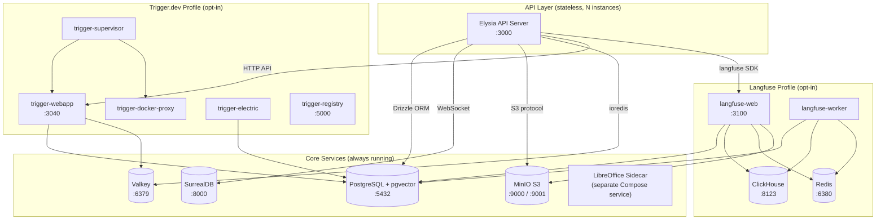

**Design principles**:

- **Stateless API** — every API server instance is replaceable. All durable state lives in Postgres, SurrealDB, MinIO, or Valkey. Horizontal scaling is adding more API instances behind a load balancer.
- **Graceful degradation** — Valkey down means in-memory fallback. Trigger.dev absent means in-process execution. Langfuse missing means silent no-op tracing. Only Postgres is truly required at the infrastructure service level — the server will not start without a working Postgres connection (see the degradation model below for the full criticality matrix).
- **Profile isolation** — default startup runs only the core development services. Langfuse and Trigger.dev are activated through their optional profile selectors.

### Degradation Model (Canonical)

- **Postgres unavailable**: hard failure. Core persistence is unavailable, so the instance is `down` and should return HTTP 503 for health checks.
- **JWT_SECRET absent in production** (`NODE_ENV=production`): hard failure. Authentication is a security boundary — unlike non-security subsystems, auth fail-open would allow unauthorized data access. The server refuses to start. This is the only non-Postgres hard failure (see [14-Server Implementation](./14-server-implementation.md)).
- **SurrealDB unavailable**: degrade gracefully. Long-term memory is disabled, but chat and short-term memory continue via Postgres.
- **MinIO / S3 unavailable**: degrade gracefully. File upload and file-backed document retrieval are disabled, but chat and non-file agent flows continue.
- **Valkey unavailable**: degrade gracefully. Rate limiting falls back to per-instance in-memory behavior (each API instance tracks its own counters independently — global rate enforcement is lost, but per-instance protection remains). Budget checks fail-open (users are never blocked due to infrastructure failure — budget enforcement is soft limits, not hard security). This is an intentional availability trade-off: temporary over-admission during a Valkey outage is preferable to blocking all users. Valkey availability should be treated as operationally critical and monitored accordingly — sustained Valkey downtime means rate limits and budgets are effectively per-instance only.
- **Trigger.dev unavailable**: degrade gracefully. Background jobs execute in-process via the fallback queue adapter.

**Relationship to Must-Have requirements**: File [20](./20-constraints-and-success.md) lists features like S3 storage, SurrealDB memory, and Valkey rate limiting as must-have deliverables. "Must-have" means the **code must be implemented and shipped** — every must-have feature requires working implementation with tests. The degradation model above governs **runtime behavior** when infrastructure is temporarily unavailable (crash recovery, rolling deployments, partial outages). These are complementary, not contradictory: the code exists and works when infrastructure is present; the system survives gracefully when infrastructure is transiently absent. A production deployment missing a must-have service indefinitely is an operational misconfiguration, not a supported configuration — the health endpoint reports `degraded` status, and monitoring should alert on sustained degradation.

---

## Docker Compose Service Map

Every service, its purpose, health check, and persistence volume are shown below. Services are organized by profile group.

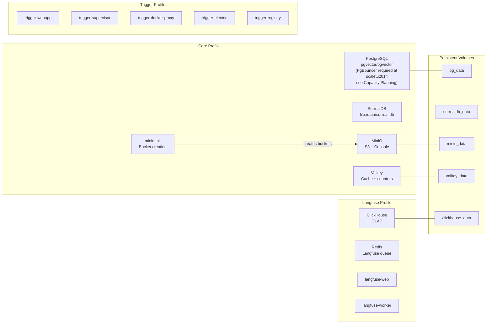

### Service Details

| Service | Image | Port(s) | Purpose | Health Check | Volume |
|---------|-------|---------|---------|-------------|--------|
| **db** | pgvector/pgvector | 5432 | Short-term memory, Drizzle ORM tables, PgVector chunks, file metadata, Langfuse DB, Trigger DB | Native database readiness probe | pg_data |
| **surrealdb** | surrealdb/surrealdb | 8000 | Long-term memory (graph + vector) | Service health endpoint probe | surrealdb_data |
| **minio** | minio/minio | 9000, 9001 | S3-compatible file storage, Langfuse media | Object storage liveness endpoint probe | minio_data |
| **minio-init** | minio/mc | — | Auto-creates `safeagent` and `langfuse-media` buckets | — | — |
| **valkey** | valkey/valkey | 6379 | Cache, budget counters, rate limiting sorted sets | Cache service ping probe | valkey_data |
| **trigger-webapp** | triggerdotdev/trigger.dev | 3040 | Background job dashboard and API | — | — |
| **trigger-supervisor** | triggerdotdev/supervisor | — | Manages containerized worker execution | — | — |
| **trigger-docker-proxy** | triggerdotdev/docker-provider | — | Docker socket proxy for worker containers | — | — |
| **trigger-electric** | electricsql/electric | — | Real-time sync for Trigger.dev | — | — |
| **trigger-registry** | registry | 5000 | Local Docker registry for task images | — | — |
| **clickhouse** | clickhouse/clickhouse-server | 8123, 9100 | Langfuse OLAP traces and observations | Native analytics service ping probe | clickhouse_data |
| **redis** | redis | 6380 | Langfuse queue and cache (separate from Valkey) | `redis-cli -a redis ping` | — |
| **langfuse-web** | langfuse/langfuse | 3100 | Langfuse UI and API | — | — |
| **langfuse-worker** | langfuse/langfuse | — | Async trace processor | — | — |

### Database Initialization

Postgres requires a database initialization script mounted in the standard database initialization scripts directory that creates the `langfuse` and `trigger` databases on first startup. These databases are isolated from the main application database.

### Port Conflict Resolution

- Valkey runs on default **6379**; Langfuse Redis is remapped to **6380**
- MinIO native port 9000 conflicts with ClickHouse native; ClickHouse native is remapped to **9100**
- Langfuse web is remapped to **3100** to avoid conflict with the API server on 3000
- Trigger webapp is remapped to **3040**

### LibreOffice

LibreOffice is modeled as a Docker Compose sidecar service, not installed into the API server image. The API server calls the sidecar over the internal Docker network on a dedicated service port for DOCX-to-PDF conversion. For local development without Docker, developers can still install LibreOffice on the host machine.

---

## API Key Pool

The key pool distributes Gemini API calls across N API keys using round-robin. A single key adds zero overhead. N keys provide N× throughput by spreading requests across independent rate limit quotas.

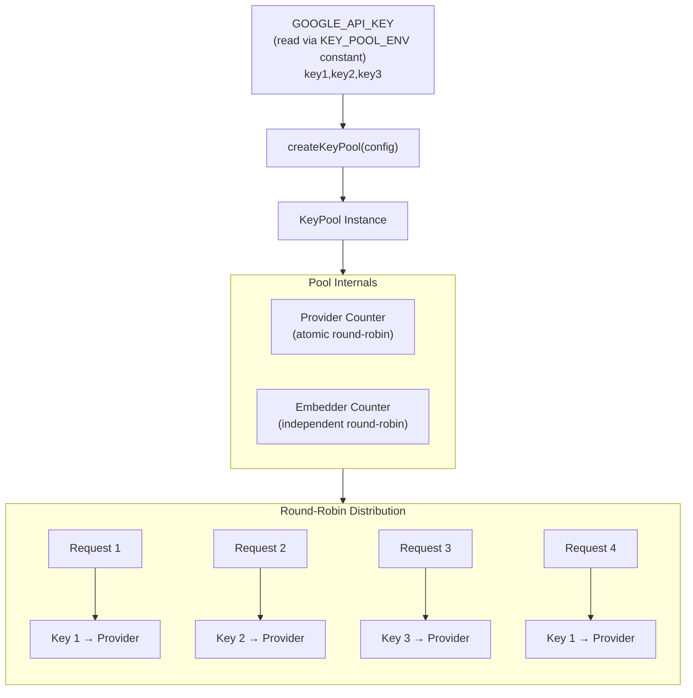

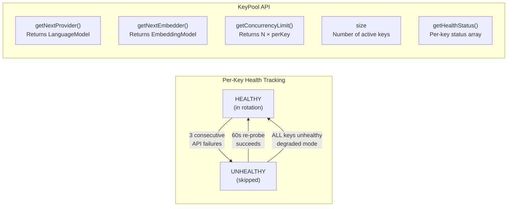

### Key Concepts

- **Comma-separated env var** — The `KEY_POOL_ENV` constant resolves to the `GOOGLE_API_KEY` environment variable (see [02 — Configuration](./02-configuration.md)). That env var contains API keys separated by commas. Whitespace is trimmed. A single key (no comma) means no pool is created — the caller uses the provider directly.
- **Independent counters** — provider and embedder calls cycle through keys independently. Summarization may call the provider first and the embedder later; separate counters distribute load evenly across both paths.
- **Per-key concurrency** — default 5 concurrent requests per key. With 3 keys, the system supports 15 concurrent API calls. Configurable via `perKeyConcurrency`.
- **Health checking** — each key tracks consecutive failures. After 3 failures, the key is marked unhealthy and skipped. A background probe re-tests unhealthy keys every 60 seconds. If all keys are unhealthy, the pool falls back to round-robin across all keys (degraded mode, not dead).
- **Factory from env** — `createKeyPoolFromEnv` reads the env var, returns `undefined` for missing or single-key scenarios, returns a `KeyPool` for 2+ keys.

---

## Valkey Cache

Valkey provides sub-millisecond read/write for budget counters, rate limiting sorted sets, and general-purpose caching. The connection uses `redis://` protocol (ioredis requires this, not `valkey://`). When Valkey is unavailable, an in-memory fallback satisfies the same interface for development and testing.

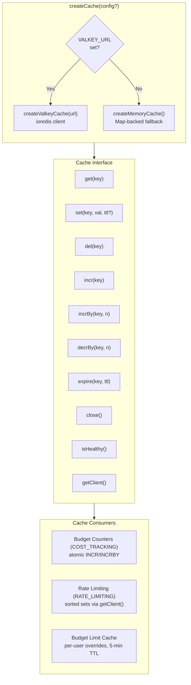

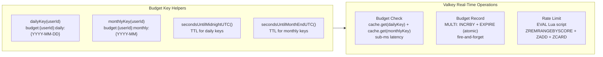

### In-Memory Fallback

The memory cache implements the identical `Cache` interface using a `Map`. TTL is checked on read. A periodic sweep every 60 seconds prevents unbounded growth in long-running development servers. `getClient` returns `null` in memory mode — consumers that need raw ioredis operations (sorted sets, MULTI/EXEC) degrade to no-op or sequential fallback.

### Connection URL

The `VALKEY_URL` environment variable **must** use the `redis://` scheme. Despite Valkey being the server, ioredis only recognizes `redis://` as a valid protocol prefix. Using `valkey://` will cause a connection error.

---

## Cost Tracking and Budget Enforcement

Budget enforcement follows an event-sourced design with two layers: a hot path through Valkey for real-time decisions and a cold path through Postgres for audit and reconciliation.

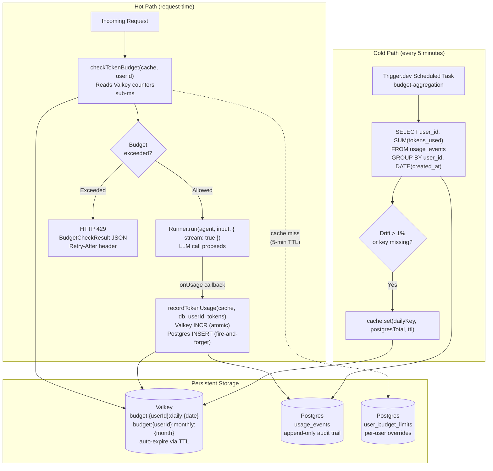

### Budget Check Flow

1. Read daily and monthly counters from Valkey — zero Postgres queries on the hot path
2. Load per-user budget limits from Valkey cache (5-minute TTL). On cache miss, query `user_budget_limits` table, cache both daily and monthly caps, fall back to config defaults if no per-user override exists
3. Compare counters against limits. Return `BudgetCheckResult` with `allowed`, `daily`, `monthly`, and `resetsAt` fields
4. Daily keys auto-expire at midnight UTC. Monthly keys expire at month end. Fresh counters start at zero on the next period

### Token Recording

Uses ioredis `MULTI/EXEC` for transactional atomicity — `INCRBY` and `EXPIRE` execute as an atomic unit, preventing orphaned keys that never expire if one command fails after the other. In memory mode, sequential calls are acceptable for development. The Postgres `INSERT` into `usage_events` is fire-and-forget — it never blocks the response.

### Race-Condition Mitigation

Budget enforcement uses a pessimistic reservation pattern on accumulating spend counters. Before starting an LLM call, the system atomically increments the daily spend counter by the estimated token count via Valkey `INCRBY`. The `INCRBY` return value is the new total — if it exceeds the user's budget limit, the increment is immediately reversed (`DECRBY` of the same estimated amount) and the request returns HTTP 429. After the call completes, the difference between actual and estimated usage is applied: `INCRBY` if under-estimated, `DECRBY` if over-estimated. This increment-check-rollback pattern uses a single counter per period (the same counter that `recordTokenUsage` writes to), avoids check-then-spend races without Lua scripts, and keeps the counter semantics consistent: counters always represent accumulated spend, starting at zero and growing toward the limit.

### Fail-Open Policy

If Valkey is unavailable during a budget check, the system returns `{ allowed: true }` with a warning log. Budget enforcement is soft limits, not hard security. Users are never blocked due to infrastructure failure.

### Budget Admin API

Beyond the hot-path functions (`checkTokenBudget`, `recordTokenUsage`), the module exposes admin functions: `getUserBudget` reads per-user budget limits and current spend from Postgres (with Valkey cache), returning a `BudgetRecord`. `setUserBudget` updates `user_budget_limits` in Postgres and invalidates the Valkey cache entry. `listUserBudgets` returns a paginated list of all budget records with an optional `overBudget` filter.

---

## Trigger.dev Integration

Trigger.dev handles all background job execution. In production, tasks run in isolated Docker containers with retries and a dashboard. In development, a transparent in-process fallback executes the same handlers directly — no Trigger.dev services required.

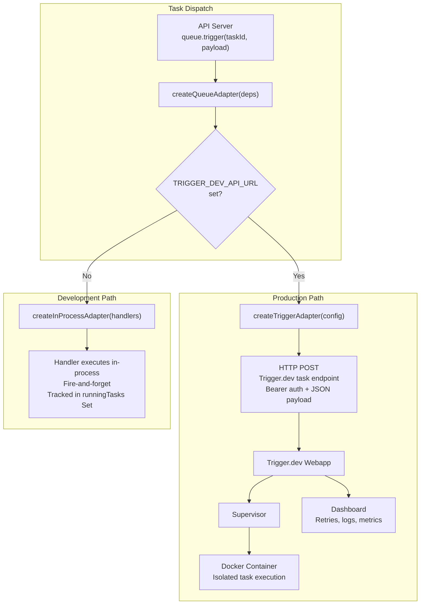

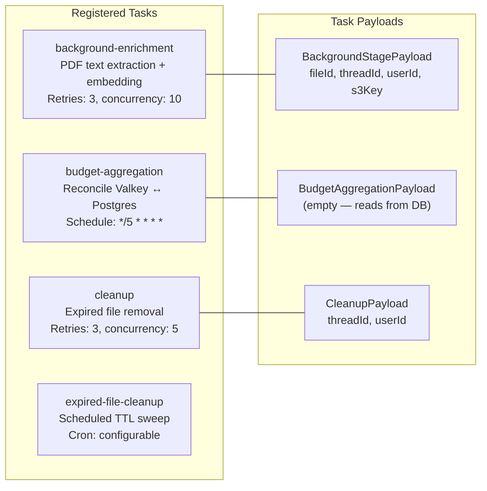

### Task Handlers

Each registered task maps to a shared handler function: `processBackgroundStageJob` handles document enrichment (S3 download, text extraction, embedding, UPSERT), `runBudgetAggregation` handles Postgres→Valkey reconciliation with distributed locking, and `runCleanup` handles async file and data cleanup. The `cleanupExpiredFiles` function handles scheduled TTL sweeps for expired file records.

### QueueAdapter Interface

The `QueueAdapter` exposes two methods: `trigger` for immediate dispatch. The adapter is created once at server startup and injected into route handlers and pipeline functions.

### In-Process Adapter Details

The in-process adapter tracks running tasks in a `Set<Promise<void>>`. Handler failures are caught and logged — they never propagate to the caller. The `getRunningCount` method exposes the number of in-flight tasks for health monitoring. On graceful shutdown, the server awaits `Promise.allSettled` to drain running jobs.

### Handler Idempotency

The background enrichment handler uses `UPSERT` (ON CONFLICT DO UPDATE) keyed on `file_id + page_number`. Since the `page_index` table has exactly one row per physical page (with nullable `raw_text`, `raw_embedding`, `raw_tsvector` columns filled during enrichment), retries after partial failure simply re-update the same row without creating duplicates.

---

## Rate Limiting

The `createRateLimiter` Elysia middleware factory produces a per-route rate limiter using Valkey sorted sets with a sliding window algorithm. Each request adds a timestamped entry; expired entries are pruned on every check. All operations execute in a single Lua script for atomicity at scale, so prune/add/count/retry calculations are committed as one server-side unit instead of separate client roundtrips.

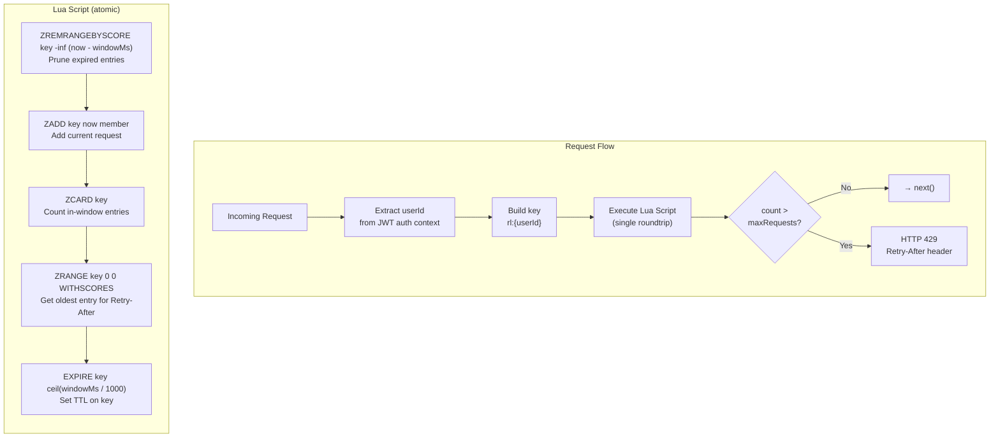

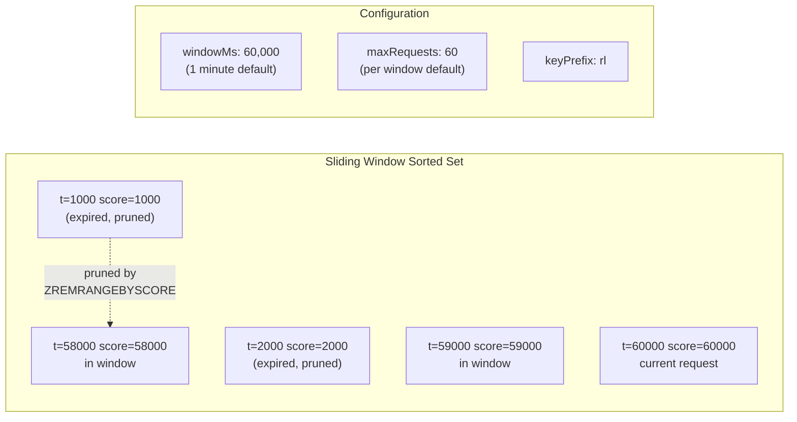

### Key Design Decisions

- **Lua EVAL, not MULTI/EXEC** — sorted set operations are read-then-write patterns that need single-roundtrip atomicity. MULTI/EXEC does not provide the conditional logic needed.
- **Member uniqueness** — each entry uses `crypto.randomUUID` to prevent collisions when multiple requests arrive in the same millisecond.
- **Per-user keying** — the default key extractor reads `userId` from Elysia auth context. A custom `keyExtractor` function can override this for non-standard routes.
- **No-op in dev** — when `cache.getClient` returns `null` (in-memory mode), rate limiting is disabled. Development should not be blocked by missing Valkey.
- **Retry-After calculation** — computed from the oldest entry still in the sorted set: `ceil`, clamped to a minimum of 1 second.

---

## Structured Logging

All logging uses LogTape for structured output via `@logtape/logtape`. LogTape is a library-first logger: the safeagent library calls `getLogger` with hierarchical categories, and the consuming application (server) calls `configure` once at startup. This ensures the library never forces logging configuration on consumers. Request context (requestId, userId, threadId, agentId, traceId) propagates automatically through AsyncLocalStorage, enriching every log line without manual threading.

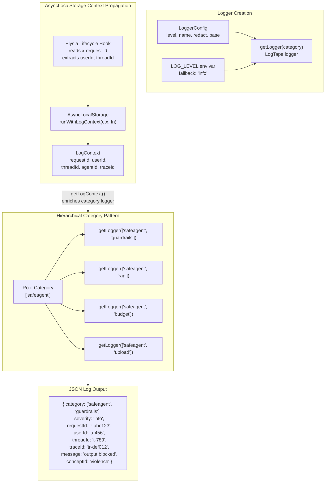

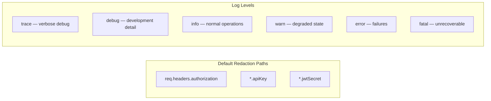

### Context API

- **`runWithLogContext`** — wraps an async function with context that persists through all awaited operations
- **`getLogContext`** — retrieves the current context from any point in the async call stack
- **`getLogger`** — retrieves a category-scoped logger that automatically includes active context fields from AsyncLocalStorage

### Elysia Lifecycle Hooks

The logger lifecycle hook reads or generates a `requestId` from the `x-request-id` header, extracts `userId` and `threadId` from the Elysia context if available, and wraps the entire request handler in `runWithLogContext`. Every log line emitted during request processing automatically includes these fields.

LogTape configuration is applied only in the server entry point or test setup, never inside the safeagent library. Sensitive field scrubbing uses `@logtape/redaction`, and OpenTelemetry or Langfuse correlation uses `@logtape/otel`.

### Development: Watch Mode

Bun's hot-reload mode has documented bugs with native modules. After a hot reload, native modules throw symbol-not-found errors. Debugger attachment also leaks resources under hot reload.

The development workflow uses file-change watcher full process restart exclusively:

- Library development: run the test suite in watch mode — tests re-execute on file change
- Server development: run the entry point in watch mode — full process restart on file change
- Debug sessions: run the entry point in watch mode with debugger attachment — never combine hot reload with debugger attachment

The server includes a dev script configured for watch mode. Hot-reload mode is never used.

---

## TTL Cleanup

Expired files are cleaned up by a scheduled Trigger.dev task. The cleanup process finds files past their expiration, removes all associated storage and search indexes, releases storage quota, and marks metadata as deleted.

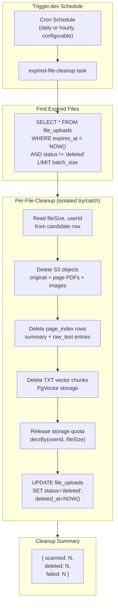

### Idempotency and Failure Isolation

- Each file is cleaned up inside its own try/catch block. One file failing does not stop the batch.
- S3 delete-on-missing is a no-op. Re-running cleanup after a partial failure is safe — already-deleted objects and rows are silently skipped.
- Failed files retain their non-deleted status and error message, making them visible for retry on the next scheduled run.
- Storage quota is released best-effort — undercount is preferable to permanent over-reservation on partial failure.

### Configurable TTL

Each file type can have a different default TTL set at upload time. The cleanup task does not need to know about TTL policy — it simply queries for rows where `expires_at < NOW()` and `status != 'deleted'`.

---

## Circuit Breaker

The circuit breaker wraps async functions that call external services (Gemini API, RAGFlow API, Langfuse, MCP servers) to prevent cascading failures. When an external dependency fails repeatedly, the breaker opens and rejects calls immediately, giving the downstream service time to recover.

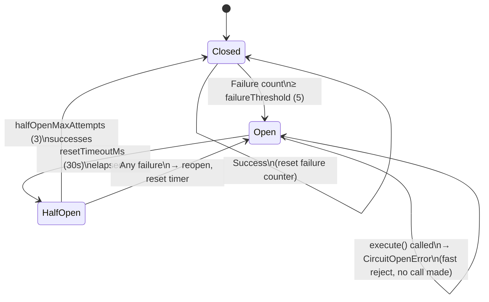

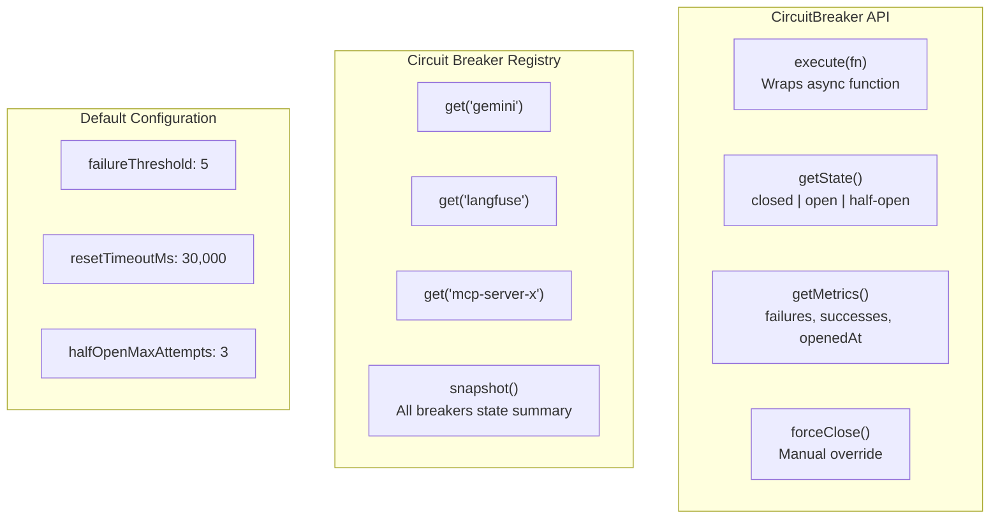

### Design Decisions

- **In-process state only** — circuit state lives in process memory. No Valkey synchronization. Each API server instance has its own breaker state, which is correct since each instance has its own connection to external services.
- **Typed error** — `CircuitOpenError` includes a `retryAt` timestamp so callers know when to try again.
- **Registry pattern** — `createCircuitBreakerRegistry` provides named breakers with isolated state. The health endpoint can call `snapshot` to report all breaker states.
- **Non-swallowing** — wrapped function errors propagate to the caller. The breaker only counts them and may transition state. It never silently drops errors.
- **Injectable clock** — the `now` config option accepts a custom time function for deterministic testing of transition timing.

---

## Health Checks

The system exposes an aggregated health endpoint that checks all critical and non-critical services. Each service reports independently. Overall status is `ok` when all services are up, `degraded` when only non-critical services are down, and `down` when the only critical dependency (Postgres) is down.

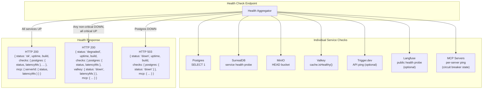

### Service Criticality

| Service | Critical | Failure Impact |
|---------|----------|---------------|
| Postgres | Yes | All persistence unavailable |
| SurrealDB | No | Long-term memory unavailable; short-term memory and chat continue via Postgres |
| MinIO / S3 | No | File upload and file-backed retrieval unavailable; chat continues |
| Valkey | No | Rate limiting falls back to in-memory; budget enforcement soft-fails |
| Trigger.dev | No | Background jobs run in-process via fallback adapter |
| Langfuse | No | Tracing disabled silently |
| MCP Servers | No | Individual tools unavailable |

The health endpoint returns HTTP 200 with `status: "ok"` when all services are reachable, HTTP 200 with `status: "degraded"` when one or more non-critical services are down, and HTTP 503 with `status: "down"` only when Postgres is down. Non-critical services still report their individual status in all cases.

---

## Graceful Shutdown

On SIGTERM or SIGINT, the server initiates an ordered shutdown sequence that drains in-flight work before closing connections.

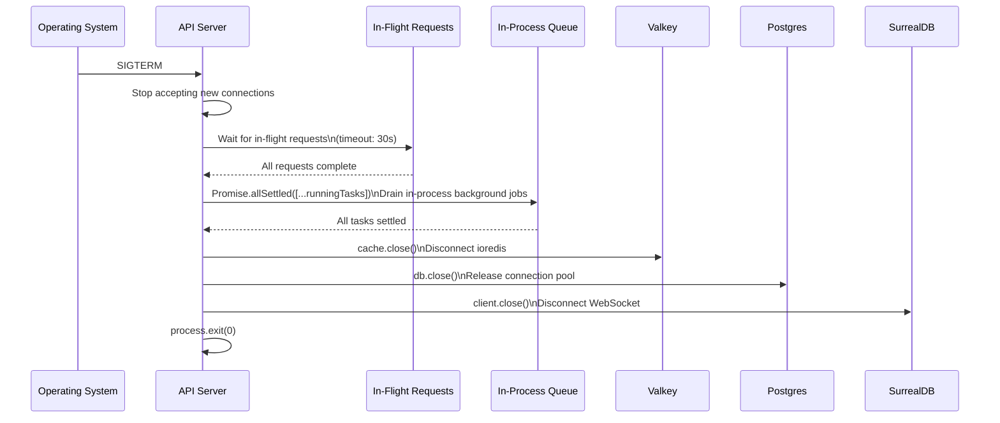

### Shutdown Order

1. **Stop accepting connections** — the HTTP server stops listening on its port
2. **Drain in-flight requests** — wait up to 30 seconds for currently-processing requests to complete
3. **Drain background tasks** — `Promise.allSettled` ensures in-process queue jobs finish
4. **Close external connections** — Valkey, Postgres, SurrealDB clients disconnect cleanly
5. **Exit** — process exits with code 0

This ordering ensures no data loss: budget counters are flushed, append-only usage events are committed, and background enrichment tasks complete or are safely retryable.

---

## Task Specifications

### Task DOCKER_COMPOSE: Docker Compose Infrastructure

**What to do**:
- Create the container orchestration manifest with all core services: Postgres (pgvector/pgvector), SurrealDB, MinIO, and Valkey
- Add minio-init service for automatic bucket creation (`safeagent`, `langfuse-media`)
- Add Trigger.dev stack under `profiles: [trigger]`: webapp, supervisor, docker-proxy, electric, and local registry
- Add Langfuse stack under `profiles: [langfuse]`: ClickHouse, Redis (port 6380), langfuse-web (port 3100), and langfuse-worker
- Add a Postgres database initialization script for creating `langfuse` and `trigger` databases
- Add Postgres `max_connections=200` via command override
- Add a LibreOffice sidecar container in Docker Compose (separate service + network port), and configure the API server to call it over the Compose network
- Declare persistent volumes: pg_data, surrealdb_data, minio_data, valkey_data, clickhouse_data
- Add health checks on every service with appropriate check commands
- Update the environment variable template with all S3, SurrealDB, Valkey, Trigger.dev, Langfuse, and LibreOffice environment variables

**Depends on**: SCAFFOLD_SERVER (Server Scaffolding)

**Acceptance Criteria**:
- Starting the core container stack brings all core services to healthy state
- Postgres has pgvector extension available
- MinIO responds to health check and both buckets auto-created
- SurrealDB health probe reports successful status
- Valkey ping probe returns a healthy response
- Starting the Trigger profile launches the Trigger.dev webapp on port 3040
- Starting the Langfuse profile launches the Langfuse UI on port 3100 and ClickHouse on port 8123
- LibreOffice sidecar service starts healthy and is reachable from the API server over the Docker network
- Postgres `langfuse` and `trigger` databases are auto-created by the database initialization script
- Environment variable template contains all required variables

**QA Scenarios**:
- Container services start healthy (start the core stack, then inspect service status) → all services show healthy/running
- MinIO bucket auto-created (wait for initialization service completion, then list buckets) → `safeagent` and `langfuse-media` exist
- Langfuse stack with profile (start the Langfuse profile, then verify UI and analytics probes) → Langfuse UI is accessible and ClickHouse ping reports success
- Valkey cache service (run service ping and a set/get round-trip test) → healthy response and values round-trip
- Trigger.dev with profile (start the Trigger profile, then verify webapp reachability) → Trigger.dev webapp is accessible
- LibreOffice sidecar reachable (start the container stack and probe sidecar health/reachability from API context) → sidecar responds and conversion service is reachable

---

### Task COST_TRACKING: Cost Tracking and Per-User Token Budgets

**What to do**:
- Create budget module with two-layer architecture: Valkey hot path for real-time decisions, Postgres cold path for audit
- Add Drizzle schema tables: `usage_events` (append-only) and `user_budget_limits` (per-user overrides)
- Implement `checkTokenBudget` — reads only from Valkey, returns `BudgetCheckResult` with allowed, daily, monthly, and resetsAt
- Implement `recordTokenUsage` — atomic INCR via MULTI/EXEC, fire-and-forget Postgres INSERT
- Implement `getUserBudget` — reads per-user budget limits and current spend from Postgres (with Valkey cache), returns `BudgetRecord`
- Implement `setUserBudget` — updates `user_budget_limits` in Postgres, invalidates Valkey cache entry, optionally resets spend counters
- Implement `listUserBudgets` — paginated query of all `user_budget_limits` with optional `overBudget` filter (compares Valkey counters against limits)
- Daily keys auto-expire at midnight UTC, monthly keys at month end
- Per-user limit overrides cached in Valkey with 5-minute TTL; fall back to config defaults (1M daily, 20M monthly)
- Budget exceeded returns 429 with full BudgetCheckResult spread including Retry-After
- Fail-open when Valkey unavailable — return `{ allowed: true }` with warning log
- Server middleware checks budget AFTER userId extraction, BEFORE agent stream
- Post-stream recording via `onUsage` callback in stream handler (DI pattern, fire-and-forget)
- Aggregation scheduled task (defined in TRIGGER_TASKS) reconciles Valkey counters with Postgres every 5 minutes

**Depends on**: FILE_STORAGE (Drizzle schema), SSE_STREAMING (stream handler), VALKEY_CACHE (Cache module)

**Acceptance Criteria**:
- `checkTokenBudget` reads only from Valkey — zero Postgres queries on hot path
- Daily and monthly counters auto-expire via Valkey TTL
- `recordTokenUsage` does atomic Valkey INCR + fire-and-forget Postgres INSERT
- Budget exceeded returns 429 with descriptive JSON
- Token recording never blocks the response
- `usage_events` table receives append-only INSERT for every recording
- Valkey keys follow pattern `budget:{userId}:daily:{YYYY-MM-DD}` and `budget:{userId}:monthly:{YYYY-MM}`
- Per-user budget limit overrides are cached and respected
- `getUserBudget` returns limit, current spend, and period info for a given userId
- `setUserBudget` updates limits in Postgres and invalidates the Valkey cache entry
- `listUserBudgets` returns paginated budget records with optional `overBudget` filter

**QA Scenarios**:
- Budget blocks over-limit user (set Valkey counter near limit, record more tokens, then check budget) → `allowed: false`, remaining is clamped to 0, and a `usage_events` row is created
- Daily budget auto-expires (ensure no key for today, check budget, then record tokens) → fresh counter is used and TTL is set to seconds until midnight
- Zero Postgres on hot path (mock DB with a spy, check budget with pre-populated Valkey) → mock DB query count is 0
- Admin get budget (call `getUserBudget` for a user with a custom limit) → returns correct limit, current spend, and period
- Admin set budget (call `setUserBudget` with new limits, then `checkTokenBudget`) → new limits take effect immediately (Valkey cache invalidated)
- Admin list budgets with overBudget filter (set one user over limit, one under) → only over-budget user returned

---

### Task KEY_POOL: API Key Pool

**What to do**:
- Create key pool module with a `createKeyPool` factory (accepting a config object)
- Read the env var named by the `KEY_POOL_ENV` constant (i.e., `GOOGLE_API_KEY`), parse comma-separated keys, trim whitespace
- Create one provider factory per key using the AI SDK Google adapter
- Round-robin distribution with separate counters for providers and embedders
- `getNextProvider` returns a LanguageModel, `getNextEmbedder` returns an EmbeddingModel
- `getConcurrencyLimit` returns `N × perKeyConcurrency` (default 5)
- `createKeyPoolFromEnv` convenience: returns `undefined` for missing/single key, `KeyPool` for 2+ keys
- Per-key health tracking: 3 consecutive failures marks key unhealthy, 60-second re-probe for recovery
- All keys unhealthy triggers degraded mode (round-robin across all, not dead)

**Depends on**: CORE_TYPES (types), SCAFFOLD_LIB (scaffolding)

**Acceptance Criteria**:
- `createKeyPool` returns pool with `size: 3`
- `getNextProvider` cycles: k1, k2, k3, k1, k2, ... (verified)
- `getNextEmbedder` cycles independently from provider counter
- `getConcurrencyLimit` returns correct product of keys × perKeyConcurrency
- `createKeyPool` throws if parsed key list is empty or any key is blank/whitespace
- `createKeyPoolFromEnv` returns `undefined` for missing or single key
- Whitespace in comma-separated keys is trimmed (` key-a , key-b ` parses to `['key-a', 'key-b']`)

**QA Scenarios**:
- Round-robin distribution (create pool with 3 keys and call `getNextProvider` 6 times) → keys cycle in order `k1,k2,k3,k1,k2,k3`
- Independent counters (call `getNextProvider` then `getNextEmbedder`) → both start at key 1 with independent counters
- Env var parsing (set `GOOGLE_API_KEY` to `key-a,key-b,key-c` and call `createKeyPoolFromEnv`) → returns a pool with size 3 and concurrency 15
- Single key no pool (set env to `single-key` with no comma) → returns `undefined`

---

### Task VALKEY_CACHE: Valkey Cache Module

**What to do**:
- Create cache module with `createCache` factory
- Valkey implementation uses ioredis with `redis://` URL from `VALKEY_URL` env var
- Cache interface: `get`, `set`, `del`, `incr`, `incrBy`, `decrBy`, `expire`, `close`, `isHealthy`, `getClient`
- `getClient` exposes raw ioredis Redis instance for sorted sets (rate limiting) and MULTI/EXEC (budget)
- In-memory fallback (`createMemoryCache`) with Map-backed storage, TTL checked on read, periodic 60-second sweep
- Memory cache `getClient` returns `null` — consumers degrade to no-op or sequential fallback
- Budget key helpers: `dailyKey`, `monthlyKey`, `secondsUntilMidnightUTC`, `secondsUntilMonthEndUTC`
- `get` returns `string | null` — `null` for non-existent keys, not 0 or undefined. Numeric consumers (budget counters) parse with `parseInt`. General consumers (embedding cache, budget limit cache) store serialized JSON strings

**Depends on**: CORE_TYPES (types), SCAFFOLD_LIB (scaffolding)

**Acceptance Criteria**:
- `createValkeyCache` connects and responds to get/set/incr operations
- `createMemoryCache` implements identical Cache interface
- `incr` atomically increments and returns new value
- `set` sets value with expiration
- Budget key helpers produce correct format patterns
- `isHealthy` returns true/false based on connectivity
- `get` for non-existent key returns null
- `close` disconnects cleanly without hanging connections

**QA Scenarios**:
- Valkey operations (run set, get, incr x3, del, get) → values round-trip, `incr` returns 1/2/3, and `del` removes the key
- Memory cache fallback (run the same operations with `createMemoryCache`) → behavior is identical with TTL expiration on read
- Budget key format (call `dailyKey('user-123')` and `monthlyKey('user-123')`) → keys match the correct date/month patterns

---

### Task TRIGGER_TASKS: Trigger.dev Task Definitions and QueueAdapter

**What to do**:
- Create trigger module with QueueAdapter implementations
- `createTriggerAdapter` — production adapter dispatching via HTTP POST to Trigger.dev API
- `createInProcessAdapter` — dev adapter executing handlers in-process, fire-and-forget, tracked in `runningTasks` Set
- `createQueueAdapter` — auto-selects based on `TRIGGER_DEV_API_URL` and `TRIGGER_DEV_API_KEY` env vars
- Task definitions: background-enrichment (retries: 3, concurrency: 10), budget-aggregation (schedule: every 5 min), cleanup (retries: 3, concurrency: 5)
- Shared task handlers: `processBackgroundStageJob` (S3 download, text extraction, embedding, UPSERT), `runBudgetAggregation` (Postgres query, Valkey reconciliation, distributed lock), `runCleanup` (async file/data cleanup)
- Handler idempotency via UPSERT keyed on file_id + page_number (one row per page, nullable raw columns updated in place)

**Depends on**: CORE_TYPES (types), RAG_INFRA (RAG functions), FILE_STORAGE (FileStorage), VALKEY_CACHE (Cache)

**Acceptance Criteria**:
- `createInProcessAdapter` executes registered handler on trigger
- Unregistered taskId throws error
- Handler failure does not propagate to caller (fire-and-forget)
- `getRunningCount` returns count of in-flight tasks
- `runningTasks` Set is empty after all handlers complete
- `createTriggerAdapter` makes HTTP POST to correct Trigger.dev URL with Bearer auth
- `createQueueAdapter` auto-selects adapter based on env vars
- Background enrichment handler is idempotent on retry

**QA Scenarios**:
- In-process fire-and-forget (trigger a handler that takes 100ms and verify trigger resolves in under 10ms) → caller is not blocked by the handler
- HTTP dispatch (mock Trigger.dev API and trigger a task) → correct POST is sent with auth header and payload
- Auto-select adapter (set/unset env vars, then call `createQueueAdapter`) → correct adapter type is returned
- Background enrichment handler (mock S3 + DB and call `processBackgroundStageJob`) → PDF is downloaded, text extracted, pages upserted, and status updated

---

### Task RATE_LIMITING: Rate Limiting Middleware

**What to do**:
- Create rate limit module with `createRateLimiter` Elysia middleware factory
- Sliding window algorithm using Valkey sorted sets
- Single Lua `EVAL` script for atomic ZREMRANGEBYSCORE + ZADD + ZCARD + ZRANGE + EXPIRE
- Default config: windowMs 60,000, maxRequests 60, keyPrefix 'rl'
- Key built as `rl:{userId}` where userId comes from JWT auth context
- Member uniqueness via `crypto.randomUUID`
- 429 response with `Retry-After` header and JSON body on limit exceeded
- Retry-After computed from oldest in-window entry: `ceil`, minimum 1 second
- Custom `keyExtractor` function supported for non-default routing
- No-op pass-through when `cache.getClient` returns null (in-memory mode)
- Deterministic tests with fake clock for window boundary conditions

**Depends on**: CORE_TYPES (types), VALKEY_CACHE (Cache/Valkey)

**Acceptance Criteria**:
- `createRateLimiter` uses correct defaults when config omitted
- Middleware reads userId from auth context and builds correct key
- Sliding window removes expired entries, counts only in-window requests
- Over-limit request returns 429 with Retry-After header and JSON body
- Retry-After value is positive integer seconds based on oldest event
- Concurrent requests stay within maxRequests (atomic operations)
- Custom keyExtractor overrides default key generation
- Rate limiting exports available via barrel

**QA Scenarios**:
- Sliding window blocks N+1 (configure `maxRequests: 3` and send 4 requests) → first 3 proceed and the 4th gets 429 with `Retry-After`
- Window expiration (fill budget, advance time past window, then send a request) → request is allowed and counter resets

---

### Task STRUCT_LOGGING: Structured Logging

**What to do**:
- Create logger module using LogTape — library code uses getLogger with hierarchical categories, server configures sinks at startup
- JSON output with configurable level (env `LOG_LEVEL`, fallback: 'info')
- Default redaction: `req.headers.authorization`, `*.apiKey`, `*.jwtSecret`
- AsyncLocalStorage-based request context propagation
- Context shape: requestId, userId, threadId, agentId (optional)
- API: `runWithLogContext`, `getLogContext`, `getLogger`
- `getLogger` returns category-scoped logger that includes active async context
- Hierarchical categories: getLogger with sub-categories inherits parent configuration
- Elysia lifecycle hook helper: reads/generates requestId from `x-request-id`, wraps request in context

**Depends on**: SCAFFOLD_LIB (scaffolding)

**Acceptance Criteria**:
- `getLogger` returns LogTape logger scoped to the given category array
- `runWithLogContext` and `getLogContext` preserve context across async boundaries
- `getLogger` includes active requestId/userId/threadId in emitted logs
- Sub-category loggers inherit parent sink configuration and context
- Redaction covers authorization header and sensitive key fields by default
- Elysia lifecycle hook binds per-request context and requestId generation/echo
- Module exports available through barrel

**QA Scenarios**:
- Async context survives awaits (wrap async handler in `runWithLogContext`, await promises, then emit log) → log contains `requestId` and `userId` from context
- Sensitive fields redacted (emit log with authorization and apiKey fields) → sensitive values are redacted in JSON output

---

### Task TTL_CLEANUP: TTL-Based Automatic Cleanup

**What to do**:
- Create cleanup module with `cleanupExpiredFiles` function
- Query `file_uploads WHERE expires_at < NOW() AND status != 'deleted'` with optional batch limit
- Per-file cleanup with isolated try/catch: read fileSize/userId, delete S3 objects, delete page_index rows, delete TXT vector chunks, release storage quota, update status to 'deleted' with deleted_at timestamp
- Idempotent — retries safe on already-missing S3 objects or rows
- One file failure does not stop the batch; failed files retain non-deleted status with error_message
- Register as Trigger.dev scheduled task in TRIGGER_TASKS task registry
- Return summary: `{ scanned, deleted, failed }`
- Note: `expires_at` and `deleted_at` columns already defined in FILE_STORAGE's schema — no migration needed in TTL_CLEANUP

**Depends on**: FILE_STORAGE (file storage), TRIGGER_TASKS (task registry), RAG_INFRA (chunk deletion)

**Acceptance Criteria**:
- Expired-file query only targets `NOW` and `status != 'deleted'`
- Cleanup deletes S3 assets, page-index rows, and TXT chunk vectors per expired file
- Metadata updated to `status='deleted'` with timestamp after successful cleanup
- Per-file failure recorded and batch continues for remaining files
- Re-running cleanup is idempotent on already-cleaned files
- Scheduled Trigger task registered and calls cleanup handler
- Storage quota released for each deleted file

**QA Scenarios**:
- Scheduled cleanup removes expired (seed an expired file and invoke cleanup with deterministic `now`) → S3 objects, page index rows, and chunks are removed, with `status='deleted'`
- Partial failure continues batch (seed two expired files where first S3 delete throws) → file A is marked failed, file B is still deleted, and summary reports both

---

### Task CIRCUIT_BREAKER: Circuit Breaker for External Calls

**What to do**:
- Create circuit breaker module with `createCircuitBreaker` factory
- State machine: closed (pass-through) → open (fast reject with CircuitOpenError) → half-open (limited probe)
- Default config: failureThreshold 5, resetTimeoutMs 30,000, halfOpenMaxAttempts 3
- `execute` wraps any async function; state transitions based on success/failure
- `CircuitOpenError` includes `retryAt` timestamp
- `createCircuitBreakerRegistry` provides named per-service breakers with isolated state
- Registry `snapshot` returns all breaker states for health endpoint
- In-process memory only — no Valkey synchronization (each API instance has own state)
- Injectable `now` function for deterministic testing
- Non-swallowing: wrapped function errors propagate to caller; breaker only counts them

**Depends on**: CORE_TYPES (types)

**Acceptance Criteria**:
- Defaults are failureThreshold 5, resetTimeoutMs 30,000, halfOpenMaxAttempts 3
- Breaker transitions from closed to open after threshold failures
- While open, `execute` rejects immediately with CircuitOpenError (no function call made)
- After reset timeout, breaker enters half-open and allows limited trial calls
- Successful half-open trials close breaker and reset counters
- Failed half-open trial reopens breaker and resets open timer
- Registry returns per-service instances with isolated state
- `forceClose` manually resets breaker to closed state

**QA Scenarios**:
- Open-state fail fast (execute failing function twice with `threshold=2`, then execute a healthy function) → third call is rejected with `CircuitOpenError` without invoking the wrapped function
- Half-open recovery (open breaker, advance time past `resetTimeout`, then execute a successful function) → state transitions back to closed and normal calls pass through

---

## Capacity Planning

### Postgres at Scale

A direct `max_connections=200` posture is not sufficient for a 10M-user system with bursty traffic and background workers. PgBouncer (or equivalent connection pooler) is required in front of Postgres at scale. PgBouncer multiplexes hundreds of application connections onto a smaller pool of actual Postgres connections, eliminating the per-instance pool sizing problem entirely.

High-write tables (`page_index`, `file_uploads`, `usage_events`) should be range-partitioned by `user_id` hash when row counts exceed tens of millions. Partitioning distributes write I/O, keeps individual B-tree and HNSW indexes smaller (faster inserts, faster queries), and enables partition-level VACUUM without locking the entire table. All application queries already include `user_id` in WHERE clauses, so Postgres prunes partitions automatically with no query changes. Drizzle ORM supports partitioned tables via raw DDL in migration files — the Drizzle query builder layer is unaffected.

### Valkey Memory Budget

Baseline per-user memory: ~500 bytes for the rate-limit sliding-window sorted set + ~100 bytes for budget counters = ~600 bytes per active user. At 10M total users with 1% daily active rate, hot state is ~60MB. At 10% concurrently active (burst), hot state is ~600MB. Full-population concurrent activity (unlikely) would be ~6GB.

Additional cache consumers: embedding router topic cache (~300KB for 75 topics with 3072-dimension vectors), FileRegistry cache (variable — depends on active files per user), geocoding cache (bounded by unique place names, 30-day TTL). These are workload-dependent and should be monitored via Valkey's `INFO memory` command. Configure `maxmemory` with `allkeys-lru` eviction policy to ensure graceful degradation under memory pressure — evicted rate-limit entries are regenerated on next request, and evicted cache entries fall through to Postgres or the upstream provider.

### SurrealDB Sizing

Long-term memory is bounded per user: hundreds to low thousands of facts over a user's lifetime. At ~1KB per fact (embedding + metadata + graph edges) and ~500 average facts per user, total storage is approximately 5TB at 10M users. SurrealDB's TiKV-backed distributed mode handles this range. Vector similarity search uses sequential scan scoped to a single userId — at 500 facts per user, this completes in sub-millisecond time regardless of total cluster size.

Deployment topology (replica count, shard count, region placement) is environment-specific. The application layer is topology-agnostic — it connects to a single SurrealDB endpoint and the cluster handles distribution internally.

### S3 / MinIO Key Distribution

Object keys use a userId-prefixed hierarchy for ownership-based cleanup. This can create hot prefixes if upload volume is concentrated among few users. MinIO's erasure coding distributes data across drives regardless of key prefix, so this is a monitoring concern (per-drive I/O balance) rather than an architectural one. If prefix hotspotting is observed at scale, prepend a short hash prefix (first 2-4 hex characters of a userId hash) to distribute requests across the internal keyspace more evenly. This change is isolated to the key-generation utility and has no impact on the rest of the application.

---

## External References

- Trigger.dev: [https://trigger.dev/docs](https://trigger.dev/docs)
- Valkey: [https://valkey.io/docs](https://valkey.io/docs)
- MinIO: [https://min.io/docs](https://min.io/docs)
- LogTape: [https://logtape.org/](https://logtape.org/)
- ioredis: [https://redis.github.io/ioredis/](https://redis.github.io/ioredis/)
- Circuit Breaker pattern: Use a failure-threshold + cooldown window to stop repeated calls to unhealthy dependencies, then allow controlled recovery probes before returning to closed state.
- Sliding window rate limiting: [https://redis.io/docs/latest/develop/data-types/sorted-sets/](https://redis.io/docs/latest/develop/data-types/sorted-sets/)
- AsyncLocalStorage: [https://bun.sh/docs/runtime/web-apis](https://bun.sh/docs/runtime/web-apis)

---

*Previous: [16 — Observability & Eval](./16-observability-and-eval.md)*
*Next: [18 — Testing Strategy](./18-testing-strategy.md)*
