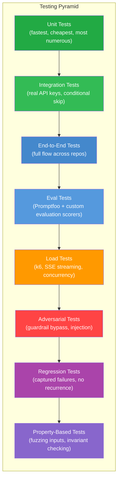
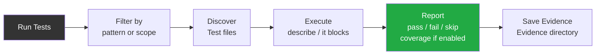
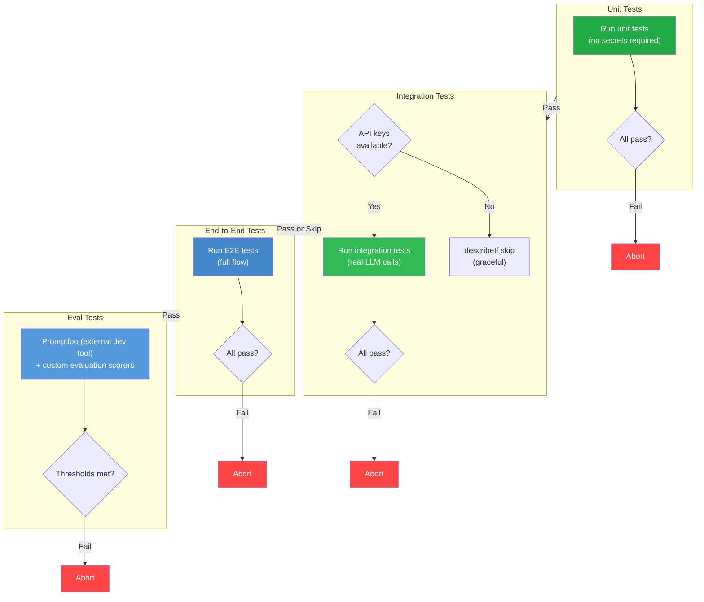
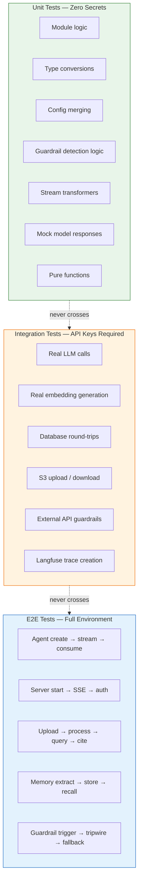
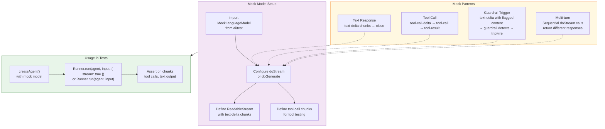
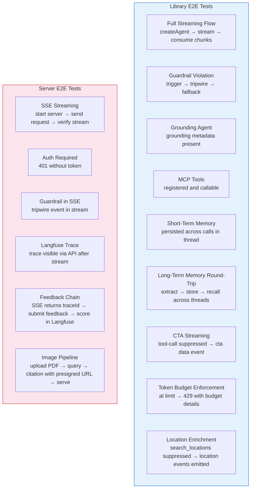
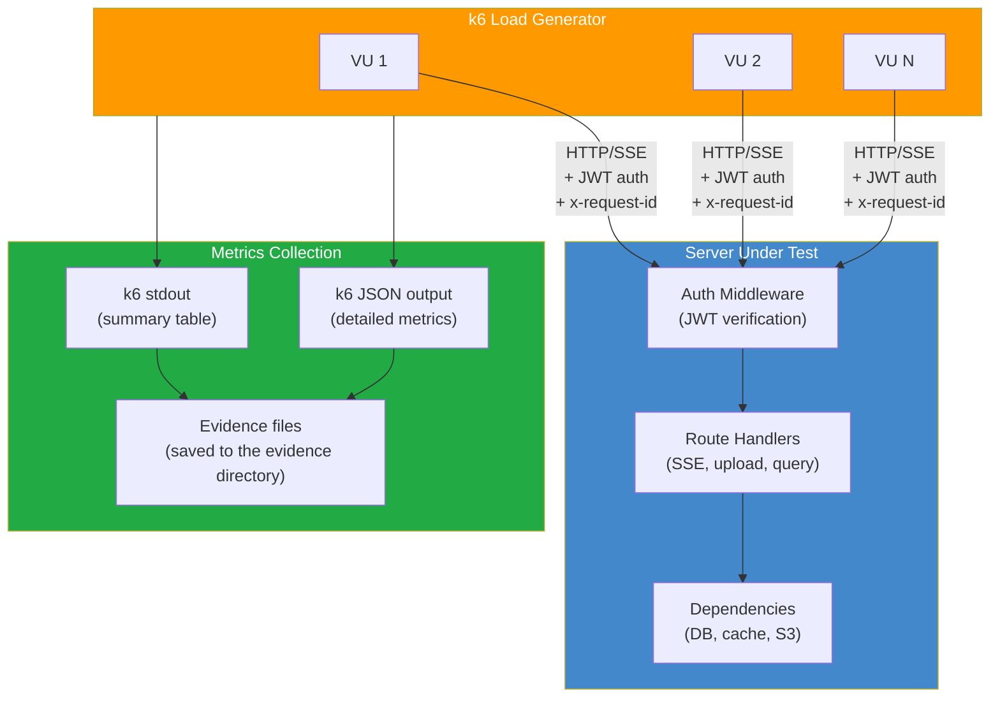

# 18 — Testing Strategy

> **Scope**: Complete testing methodology covering eight testing types, test suite separation for CI, mock model patterns, QA policy, and task specifications for E2E tests, publish preparation, smoke tests, and load testing.
>
> **Tasks**: E2E_TESTS (E2E Integration Tests), PKG_PUBLISH (Package Publish Preparation), SMOKE_TESTS (Server Smoke Tests), LOAD_TESTS (k6 Load Test Scripts), AUDIT_PLAN (Plan Compliance Audit), AUDIT_CODE (Code Quality Review), AUDIT_QA (Full QA Run), AUDIT_SCOPE (Scope Fidelity Check)

---

## Table of Contents

- [Testing Pyramid](#testing-pyramid)
- [Test Execution Flow](#test-execution-flow)
- [CI Pipeline](#ci-pipeline)
- [Test Suite Separation](#test-suite-separation)
- [Mock Model Pattern](#mock-model-pattern)
- [Unit Tests](#unit-tests)
- [Integration Tests](#integration-tests)
- [End-to-End Tests (E2E_TESTS)](#end-to-end-tests-e2etests)
- [Eval Tests](#eval-tests)
- [Load Tests (LOAD_TESTS)](#load-tests-loadtests)
- [Adversarial Tests](#adversarial-tests)
- [Regression Tests](#regression-tests)
- [Property-Based Tests](#property-based-tests)
- [QA Policy](#qa-policy)
- [Task Specifications](#task-specifications)
- [Coverage Map](#coverage-map)
- [Verification Strategy Summary](#verification-strategy-summary)
- [External References](#external-references)

---

## Testing Pyramid

The project uses eight distinct testing types arranged in a pyramid of increasing scope, cost, and feedback latency. Every module is covered by at least unit tests; critical paths are covered by three or more layers.

---

## Test Execution Flow

All tests run through the Bun test runner. Filtering, execution, and reporting follow a single pipeline regardless of test type.

---

## CI Pipeline

The CI pipeline enforces a strict ordering. Unit tests run first with zero secrets. Integration tests run conditionally with API keys. E2E and eval tests run last, requiring fully configured environments.

---

## Test Suite Separation

This is the single most critical aspect of the testing infrastructure. A unit test that fails because of a missing API key is a test infrastructure bug, not a test failure.

### Boundaries

### Rules

**Unit tests** must pass with zero secrets and zero API keys. Every LLM call uses MockLanguageModel. Every external service is stubbed. This is what running the test suite means in every task's definition of done.

**Integration tests** require real API keys. The primary provider key is always required; secondary provider keys are optional. Every integration test file must use conditional skip as the outermost describe block. This is non-negotiable — a bare `describe` on an integration test is a test infrastructure bug.

The conditional skip pattern uses a deterministic helper where `describeIf` evaluates the boolean condition and returns either the standard `describe` or `describe.skip`.

Then every integration file wraps its root describe with `describeIf`. If the Bun test runner's built-in `describe.skipIf` is validated as reliable, that is acceptable as a simpler alternative.

**E2E tests** require a fully configured environment: database, object storage, cache, and at least one API key. They live in a separate directory and are never run as part of the default test-suite invocation.

**The spike task is inherently integration** — it requires API keys by definition. This is acceptable for the initial spike (manual validation), but every subsequent batch of tasks must have unit tests that pass without keys.

---

## Mock Model Pattern

All unit tests use MockLanguageModel from the AI SDK test utilities (`ai/test`). The mock model supports text streaming, tool calls, and structured output without hitting any external API.

### How to Mock Streaming Responses

The `doStream` callback returns an object containing a `ReadableStream`. Each enqueued chunk is a typed delta — `text-delta` for text content, `tool-call-delta` for partial tool call arguments, `tool-call` for complete tool calls. The controller closes the stream to signal completion. The `rawCall` property provides metadata stubs.

### How to Mock Tool Calls

To test tool invocation, enqueue a `tool-call` chunk with the tool name, call ID, and arguments object. The agent's tool executor processes this as if the LLM requested the tool. The tool's `execute` function runs, and the result feeds back into the mock's next `doStream` invocation if multi-turn is configured.

### How to Mock Guardrail Triggers

Create a mock that emits text content known to trip a specific guardrail. The streaming output guardrail's sliding window buffer processes these chunks and, upon detecting a violation, throws a TripWire exception (development mode) or suppresses remaining chunks and injects a fallback (production mode). The test asserts on the resulting stream behavior, not the guardrail detection logic itself — that belongs to the guardrail's own unit tests.

---

## Unit Tests

**Runner**: Bun test runner  
**Secrets**: None — zero API keys, zero external services  
**Scope**: Every module, every exported function, every type boundary  

Unit tests are the foundation. They run in milliseconds, require no infrastructure, and catch the majority of bugs. Every task from SPIKE_CORE_STACK through ZERO_LEAK_GUARD produces unit tests alongside its implementation — implementation and test are one task, never separated.

### What Gets Unit Tested

- Agent creation with defaults and overrides
- Configuration merging and validation
- Guardrail detection logic (regex, keyword, LLM-based with mocked model)
- Guardrail severity aggregation (worst-wins)
- Guardrail pipeline orchestration
- Stream transformers and chunk processing
- Memory message formatting and turn truncation
- Document chunking configuration
- Hybrid search query construction
- Citation schema extraction
- Rate limiter window calculations
- Circuit breaker state transitions
- Logger context propagation
- Token budget arithmetic
- CTA tool catalog validation
- File validation (magic bytes, size limits)
- Barrel exports and public API surface

### Mock Strategy

Every external dependency is mocked at the boundary:

- **LLM calls**: MockLanguageModel with controlled doStream/doGenerate
- **Database**: In-memory stubs or direct assertion on query construction
- **Object storage**: Stub returning pre-defined buffers
- **Cache**: In-memory Map acting as cache interface
- **MCP servers**: Stub transport returning tool definitions
- **Langfuse**: No-op exporter that captures spans for assertion

---

## Integration Tests

**Runner**: Bun test runner (integration filter)  
**Secrets**: Primary provider API key required; secondary keys optional  
**Scope**: Real LLM calls, real database operations, real external APIs  

Integration tests validate that the system works with real external services. They are slower, cost money (API calls), and may be flaky due to network conditions. They are never required for CI green but are essential for confidence before releases.

### Conditional Skip Pattern

Every integration test file must wrap its outermost describe block with the conditional skip helper. This ensures that missing API keys cause graceful skips, never failures.

The helper is straightforward: evaluate whether the required environment variable exists, and select either `describe` or `describe.skip` accordingly. Multiple keys can be composed with logical AND for tests requiring several services simultaneously.

### What Gets Integration Tested

- Agent streaming with real model responses
- Guardrail detection on real LLM output (including edge cases the mock cannot reproduce)
- Embedding generation with real embedding models
- Database round-trips: insert, query, hybrid search
- S3 upload, download, presigned URL generation
- Langfuse trace creation and score attachment
- Memory extraction with real LLM (fact quality validation)
- DOCX-to-PDF conversion via headless office suite
- Rate limiter against real cache instance

---

## End-to-End Tests (E2E_TESTS)

**Runner**: Bun test runner (E2E scope)  
**Secrets**: Full environment required  
**Scope**: Complete flows across library and server repositories  

E2E tests exercise the system as a user would: create an agent, stream a response, verify the output. They span both the library (agent creation, guardrails, memory) and the server (SSE endpoints, auth, upload processing). Where possible, they use MockLanguageModel to avoid API costs while still exercising the full pipeline.

### Three-Layer Memory QA Scenarios

- Thread short-term: 12 turns in a thread → last 10 injected + rolling summary of turns 1-2
- User short-term: messages in Thread A, new Thread B → Thread A messages appear in Thread B context for first 3 turns
- User short-term fade-out: Thread B has 4+ messages → cross-thread context no longer injected
- Rolling summary: thread with 50 turns, topic switches at turns 5, 20, 40 → summary captures all three topics
- Interaction extraction: user searches for "football fields in Cau Giay" → interaction record stored with action: searched_for
- Media fact extraction: user shares photo of restaurant menu → media_fact with description and entities stored
- Preference correction: user says "I prefer indoor not outdoor" → old outdoor preference superseded
- Structured result memory: agent produces 5 results, user says "the second one" in new thread → resolves to correct item
- Temporal recall: user says "the place I went yesterday" → memoryRecall filtered to yesterday's records
- Recency boost: fact from today and fact from 30 days ago with same similarity → today's fact ranked higher
- Memory inspect: user asks "what do you know about me?" → categorized summary returned
- Memory delete: user says "forget about football" → matching records shown, deleted after confirmation, Valkey cache purged
- Dependent intents: "X is terrible, find another" → feedback processed first, search excludes X
- Cross-thread intent detection: vague message in new thread with cross-thread context → correct intent classification
- Auto-trigger: first message in new thread → memoryRecall auto-triggered, results in context

### Extraction Safeguard Scenarios

1. Third-party attribution: "My wife wants a yoga studio" -> fact stored as interaction signal (`third_party`), NOT as user preference
2. Sarcasm detection: "Great, another place with no parking 🙄" -> extracted sentiment is negative (dislikes places without parking), not positive
3. Hypothetical filtering: "If I were vegan, I'd look for plant-based restaurants" -> NO fact extracted about user being vegan
4. Hallucination prevention: agent response contains "Based on your preference for outdoor activities" but user never stated this -> fact `user prefers outdoor activities` NOT extracted
5. Attribute negation: "restaurants without outdoor seating" -> search results exclude outdoor seating venues
6. Query replay: "Same search but for District 7" after searching for football fields in Cau Giay -> rewritten query is "football fields in District 7"
7. Pleasantries short-circuit: "Thanks!" -> no embedding, no LLM validator, no search pipeline triggered
8. Gibberish short-circuit: "asdfjkl" -> no full pipeline, responds with "I didn't catch that"
9. Thread resurrection: user returns to 3-month-old thread -> auto-recall runs with summary entities, staleness note injected
10. Rolling summary cap: thread with 200+ messages -> summary stays under ROLLING_SUMMARY_MAX_TOKENS
11. Context window budget: new thread with rich user history -> total context fits within CONTEXT_WINDOW_BUDGET, user short-term truncated first if needed
12. Input length validation: 50000-character message -> HTTP 400 rejection
13. Errored stream extraction: stream errors mid-response -> fact extraction skipped, no partial facts stored

**Security scenarios:**
- User A's cross-thread messages never appear in User B's context
- Memory delete purges both SurrealDB and Valkey cache
- Ordinal resolution scoped to userId — no cross-user result set access

### Test Matrix

### Long-Term Memory Round-Trip (Critical)

This test validates the complete memory lifecycle across conversation boundaries:

1. Create an agent with fact extraction processor, recall tool, and embedded graph database
2. Send a message containing personal preferences with a user context identifier
3. Wait for fire-and-forget extraction to complete
4. Query the database directly — assert facts stored for the correct user with appropriate categories
5. In a new conversation thread (different thread identifier), send a recall-triggering question
6. Assert the agent calls the recall tool and the response references previously extracted facts

This validates the full loop: extraction → storage → recall, proving that facts persist across conversation boundaries and are correctly scoped to the user.

### Image Pipeline E2E

This test validates the complete image lifecycle:

1. Upload a PDF containing raster images
2. Poll status until processing completes
3. Query about the document's visual content
4. Assert response contains citations with image URLs (presigned object storage URLs)
5. Assert response contains inline markdown images
6. Fetch a presigned URL directly (no auth headers) and verify valid image bytes (magic byte check)
7. Test the fallback API endpoint — assert redirect to presigned URL

---

## Eval Tests

**Runner**: Promptfoo (external dev tool) + custom evaluation scorers  
**Secrets**: API keys for LLM-as-judge scoring  
**Scope**: Response quality, guardrail effectiveness, retrieval accuracy  

Eval tests measure the quality of agent responses rather than functional correctness. They use Promptfoo as an external eval tool and custom evaluation scorers for specialized metrics. Results are compared against baseline thresholds — regressions in quality are treated as test failures.

### What Gets Evaluated

- **Response relevance**: Does the agent answer the question asked?
- **Citation accuracy**: Do citations reference the correct source documents and pages?
- **Guardrail precision**: Does the guardrail flag true positives without blocking legitimate content?
- **Guardrail recall**: Does the guardrail catch all true positives in the test set?
- **Grounding quality**: Are grounded responses factually anchored to search results?
- **Memory recall accuracy**: Does the agent correctly retrieve and use previously stored facts?
- **CTA relevance**: Are suggested actions contextually appropriate?

### Promptfoo Integration

The library provides a `createPromptfooProvider` helper that wraps the agent as a Promptfoo-compatible HTTP provider. The `runSelfTest` function starts an ephemeral HTTP server, generates Promptfoo configuration, and the operator runs the eval tool externally. Results are collected as JSON for threshold comparison. The custom evaluation scorers configuration helper integrates custom scoring functions into the eval pipeline.

---

## Load Tests (LOAD_TESTS)

**Runner**: k6 (standalone binary, not a JavaScript package dependency)
**Secrets**: JWT token for auth, full server environment  
**Scope**: Concurrency limits, latency baselines, rate limiting behavior  

Load tests measure system behavior under concurrent access. They are never part of CI — they run on-demand via automation (k6 scripts) against a fully deployed environment. The scripts establish baselines at smoke scale (10 virtual users, 30 seconds) and are designed to scale to production loads on dedicated infrastructure.

### Architecture

### Script Catalog

Five k6 scripts cover the critical server endpoints:

1. **SSE Streaming** — Concurrent chat streams measuring time-to-first-token and total stream duration. Scales from 10 to 50 to 100 concurrent virtual users.

2. **File Upload** — Concurrent file uploads with representative payload sizes (≤5MB per file, ≤5 files per turn), measuring acceptance time (201 response) and background processing completion.

3. **RAG Query** — Concurrent retrieval-augmented queries on pre-indexed documents, measuring hybrid search latency at scale.

4. **Budget Enforcement** — Rapid requests from the same user, verifying that the rate limiter returns 429 after the configured limit and that the cache counter remains accurate under concurrency.

5. **Health Endpoint** — Baseline latency measurement at high request rates, establishing p50/p95/p99 benchmarks for the simplest possible endpoint.

All scripts share a configuration module with the base URL, auth token (from environment), and threshold definitions. Every script includes k6 `check` assertions for response status and content validation.

### Smoke Baselines

The initial run captures baseline metrics at minimal scale. These baselines are informational, not pass/fail gates. The scripts are the foundation for future production-scale testing on dedicated infrastructure.

- Health endpoint: p99 target under 100ms at 10 VUs
- SSE streaming: connections establish, stream data received, time-to-first-token measurable
- Upload: 201 responses received, processing initiated
- Budget: 429 returned after limit exceeded, no race condition allows over-budget requests

---

## Adversarial Tests

**Runner**: Bun test runner  
**Secrets**: None for detection logic; API keys for integration-level adversarial tests  
**Scope**: Guardrail bypass attempts, prompt injection, input manipulation  

Adversarial tests attempt to defeat the safety system. They are written from the attacker's perspective, using known bypass techniques and novel attack patterns. Every guardrail must have corresponding adversarial tests that prove it cannot be trivially circumvented.

### Attack Categories

- **Prompt injection**: Attempts to override system instructions via user input
- **Jailbreak patterns**: Known patterns that attempt to bypass content filters (DAN, role-play escapes, encoding tricks)
- **Unicode obfuscation**: Homoglyph substitution, zero-width characters, bidirectional text
- **Token splitting**: Inserting whitespace, hyphens, or special characters to split blocked keywords
- **Encoding attacks**: Base64-encoded instructions, URL encoding, HTML entities
- **Multi-turn escalation**: Gradually escalating content across conversation turns to slip past per-message detection
- **Context confusion**: Mixing legitimate content with harmful content to lower detection confidence
- **Output manipulation**: Crafting inputs designed to make the LLM produce content that trips output guardrails in ways that leak information

### Testing Approach

Unit-level adversarial tests pass known attack payloads through individual guardrail functions and assert correct detection. Integration-level adversarial tests send attack payloads to real LLM-backed agents and verify that the complete pipeline (input guardrail → LLM → output guardrail) handles them correctly.

The adversarial test suite grows over time as new bypass techniques are discovered — each new technique becomes a regression test once patched.

### Security & Concurrency Test Scenarios

- Verify JWT algorithm confusion attacks are rejected and cannot bypass signature validation.
- Verify presigned URL leakage prevention so shared links cannot expose unauthorized objects beyond configured scope and expiry.
- Verify concurrent quota and budget enforcement under race conditions so no over-limit requests are accepted.
- Verify per-source service outage chaos behavior so one failing source does not cause silent corruption in merged results.

---

## Regression Tests

**Runner**: Bun test runner  
**Secrets**: Varies by original failure context  
**Scope**: Previously observed failures, edge cases from production  

Every bug fix adds a regression test that reproduces the original failure before the fix and passes after. This prevents the same class of bug from recurring. Regression tests are permanent — they are never removed even if the underlying code is refactored.

### Structure

Each regression test documents:

- The original failure: what broke, when, and how it was discovered
- The minimal reproduction: the smallest input that triggers the bug
- The expected correct behavior after the fix
- The task or commit that introduced the fix

Regression tests are co-located with the module they protect, not in a separate directory. They use a naming convention that identifies them as regression tests (e.g., `regression:` prefix in the test description).

---

## Property-Based Tests

**Runner**: Bun test runner  
**Secrets**: None  
**Scope**: Invariant checking with randomized inputs, fuzz testing  

Property-based tests generate randomized inputs and verify that invariants hold across all of them. Instead of testing specific cases, they test properties that must always be true regardless of input.

### Target Properties

- **Configuration merging**: Merged config always contains all required fields, regardless of which optional fields the user provides
- **Guardrail severity aggregation**: Worst-wins aggregation always returns the highest severity present, regardless of ordering
- **Token counting**: Token count is always non-negative and monotonically increasing as text grows
- **Rate limiter windows**: Window boundaries are always correctly aligned regardless of request timestamp
- **Citation extraction**: Every citation references a page number within the document's actual page count
- **File validation**: Magic byte checking never produces false negatives for supported file types
- **Memory turn truncation**: Truncated conversation always retains the system message and the most recent N messages

### Approach

Use a property-testing library compatible with the Bun test runner, or implement lightweight random generators for domain-specific input types. Each property test runs at least 100 iterations with randomized inputs. Shrinking on failure (finding the minimal failing input) is desirable but not required.

---

### Development Seed Data

Both repositories include idempotent seed scripts for populating the local development environment with realistic test data.

**Library seed** (safeagent): Populates SurrealDB with sample user facts, graph relations (knows, related_to), and vector embeddings. Creates a test user with a realistic memory graph — enough data to exercise memory recall, fact extraction deduplication, and graph traversal queries.

**Server seed**: Populates PostgreSQL with sample file metadata (file_uploads, user_storage_quotas, page_index entries), budget limits (user_budget_limits, usage_events), and uploads sample PDF and DOCX files to MinIO. The seed data covers enough files and pages to exercise hybrid search, cross-conversation RAG, budget enforcement, and file management CRUD.

**Idempotency**: Seed scripts check for existing data before inserting. Running the seed script multiple times on the same database produces the same result — no duplicates, no errors. This is achieved via upsert patterns (INSERT ON CONFLICT for PostgreSQL, UPDATE ... CONTENT for SurrealDB).

**Test user**: All seed data is scoped to a dedicated test user (userId: `test-user-seed`). This user has a known JWT for development — the environment variable template includes a pre-generated JWT secret and a sample token for this user. Real authentication is not bypassed; the seed token is a valid JWT signed with the development secret.

**Execution**: Seed scripts run in each repository through the seed workflow. They require the container stack to be running. The seed script exits with a clear error if any required service is unreachable.

## QA Policy

Every implementation task (SPIKE_CORE_STACK through ZERO_LEAK_GUARD) must include agent-executed QA scenarios. Zero human intervention — all verification is automated and agent-driven.

### Evidence Collection

All QA evidence is saved to a structured directory. Each scenario produces a file named by task number and scenario slug. Evidence files contain raw output (stdout, stderr, HTTP responses) that proves the scenario passed.

### Tool Categories

QA scenarios use one of four tool categories depending on what they test:

| Tool | Use Case | Description |
|------|----------|-------------|
| Bash (test runner) | Library modules — import, call, assert | Run test files via Bun's built-in test runner |
| Bash (eval mode) | Quick REPL validation — one-liner import and call | Run a single-expression eval to verify an export works |
| Interactive Bash (tmux) | TUI testing — run app, send keystrokes, validate output | Launch TUI in a tmux session, send keystrokes, verify screen output |
| Bash (HTTP request) | API and SSE testing — send requests, assert responses | Send HTTP requests with auth headers, assert status codes and body |

### TDD Discipline

Every task follows RED → GREEN → REFACTOR:

1. **RED**: Write a failing test that defines the desired behavior
2. **GREEN**: Write the minimal implementation that makes the test pass
3. **REFACTOR**: Clean up without changing behavior, tests still pass

Tests and implementation are one task. A task that ships code without tests is incomplete. A task that ships tests without implementation is incomplete.

### E2E Cleanup

End-to-end tests use a `cleanupThread` helper that removes all data associated with a test thread — conversation history, file metadata, RAG chunks, and long-term memory facts. This ensures test isolation without requiring database resets between runs.

---

## Task Specifications

### Task E2E_TESTS: End-to-End Integration Tests

**What to do**:

- Create E2E test directory in the library repository
- Test the full streaming flow: create agent with mock model → stream response → consume all chunks → verify text response
- Test guardrail violation: trigger guardrail → tripwire emitted → stream terminated → fallback message injected
- Test grounding agent: grounding metadata present in response
- Test MCP tools: tools registered via MCP client and callable by agent
- Test short-term memory: messages persisted across calls within the same thread
- Test long-term memory round-trip (critical integration validation):
  - Create agent with fact extraction processor, recall tool, and embedded graph database
  - Send personal preference message with user context
  - Wait for fire-and-forget extraction
  - Query database directly to verify facts stored with correct user scoping
  - New conversation thread: send recall question
  - Assert agent calls recall tool and response references extracted facts
- Create E2E test directory in the server repository
- Test server SSE: start server → send request to SSE endpoint → verify streaming response
- Test auth enforcement: 401 without token
- Test guardrail trigger in SSE stream: tripwire SSE event present
- All tests use the Bun test runner with MockLanguageModel where possible to avoid API costs
- Test CTA streaming: message triggers CTA suggestion → tool-call not in SSE output → `cta` data event present with valid CTA objects
- Test Langfuse trace: after SSE stream completes, trace visible via Langfuse API query
- Test feedback chain: SSE returns traceId → submit feedback with traceId → score visible in Langfuse
- Test token budget enforcement: user at daily limit → stream request → 429 with budget check result body including used/limit/remaining/resetsAt fields
- Test image pipeline: upload PDF with images → query about visual content → citation with presigned image URLs → fetch presigned URL → valid image bytes

**Must NOT do**:

- Do not require API keys for unit tests — use mocks
- Do not test TUI rendering in E2E — too flaky for automated testing

**Depends on**: TUI_AGENT, SELF_TEST, SERVER_AGENT_CFG, SERVER_ROUTES, SERVER_MCP, SERVER_GUARDRAILS, UPLOAD_ENDPOINT, TUI_UPLOAD, DOCKER_COMPOSE, FEEDBACK_ENDPOINT, CLIENT_SDK, COST_TRACKING, AGENT_ROUTER, VALKEY_CACHE, TRIGGER_TASKS, RATE_LIMITING, FILE_CRUD, TTL_CLEANUP, JWT_AUTH, CROSS_CONV_RAG, ADMIN_API

**Acceptance Criteria**:

- E2E tests pass in library repository
- E2E tests pass in server repository
- Full streaming flow works end-to-end
- Guardrail violation handled correctly (tripwire in dev, fallback in prod)
- MCP tools functional
- Long-term memory round-trip: preference extracted → stored in graph database → recalled in new conversation
- CTA streaming: tool-call suppressed, clean cta data event emitted
- Langfuse trace visible via API after stream
- Feedback-to-trace chain functional
- Token budget enforcement returns 429 with structured body
- Image pipeline: upload → extract → summarize → store → query → cite → serve via presigned URL

**QA Scenarios**:

- Full agent streaming E2E uses the test runner to run the E2E streaming suite, verifies agent creation, stream initiation, chunk receipt, and complete text output, and stores evidence in the evidence directory.
- Server SSE E2E uses an HTTP request workflow with the server running, sends an authenticated request to the SSE endpoint, verifies text SSE events are received, and stores evidence in the evidence directory.
- Image pipeline E2E uses an HTTP request workflow with server/object storage/database/API key/test PDF preconditions, uploads a PDF, waits for processing, queries visual content, validates presigned citation URLs and inline markdown image URLs, fetches presigned URLs directly for image magic-byte validation, verifies fallback redirect behavior, and stores evidence in the evidence directory.
- Long-term memory round-trip uses the test runner with extraction processor + recall tool + embedded graph database, verifies extraction, persistence, and cross-thread recall behavior end-to-end, and stores evidence in the evidence directory.

---

### Task PKG_PUBLISH: Package Publish Preparation

**What to do**:

- Create README at repository root (critical for package adoption):
  - Title and one-line description
- Badges: package name, license, runtime requirement
  - Quick start: package installation and minimal agent creation example (five lines)
  - Feature highlights: guardrails, MCP, grounding, streaming, eval
  - API overview: table of main exports with one-liner descriptions
  - Configuration example with custom options
  - Guardrail example with input and streaming pipeline
  - MCP example with multi-server configuration
  - Server usage example importing the library
  - Link to TUI: how to run the terminal interface
  - "Not yet supported" section documenting future roadmap items
  - Keep under 300 lines — concise with links to examples
- Create LICENSE at repository root (MIT)
- Create package README (symlink or shorter variant focused on library API)
- Update core package metadata:
  - Description, keywords, license, repository, homepage, bugs fields
  - Files array including source, package manifest, readme, license
  - Runtime engine constraint
  - Verify exports field for all subpaths
- Build type declarations for editor tooling — main exports point to TypeScript source (runtime reads TS directly), types field points to generated declarations
- Prepare client SDK package with same metadata pattern:
  - Description, keywords, license
  - Files array — zero dependencies, works across all JavaScript runtimes
  - Verify dry-run succeeds
  - Create minimal client package README
- Create registry configuration for token-based publishing, add to ignore file
- Test publish dry run — verify no errors, package name correct, README included
- Verify package installs from local path in temporary directory
- Verify main export is importable and resolves to expected type

**Must NOT do**:

- Do not publish with hardcoded dependency specifiers
- Do not include test files in published package
- Do not write tutorial-length README — keep concise

**Depends on**: BARREL_EXPORTS (barrel exports complete)

**Acceptance Criteria**:

- README exists at repository root with quick start, examples, and feature list
- LICENSE exists at repository root (MIT)
- Package README exists
- Publish dry run succeeds for core package and includes README
- Publish dry run succeeds for client SDK package
- Package installs from local path in temporary directory
- Type declarations generated

**QA Scenarios**:

- Package publishability is validated with Bash by checking root and package README files plus LICENSE presence and content, running a core package publish dry run, confirming dry-run metadata includes README and correct package name, installing from a local path in a temporary directory, validating the main export resolves correctly, and storing evidence in the evidence directory.

---

### Task SMOKE_TESTS: Server Smoke Tests + Deployment Config

**What to do**:

- Create smoke test shell script covering:
  1. Server startup
  2. Health check endpoint
  3. SSE streaming test
  4. Auth enforcement test (401 without token)
  5. Graceful shutdown
- Docker build configuration:
  - Post-publish mode: container installs published package from registry
  - Pre-publish mode (default for development): multi-stage build copies library source into build context
  - Build script that handles both modes
- Add server service to existing Docker Compose configuration (created by infrastructure task):
  - Port mapping
  - Dependency ordering with health check conditions (database, graph database, object storage)
  - Environment file reference
- Append server-specific environment variables to existing env example file (JWT secret, CORS origin, etc.)
- Validate JWT_SECRET on boot: when `JWT_SECRET` is absent and `NODE_ENV` is NOT `production`, the server boots in dev-auth-bypass mode (assigns default dev userId to all requests) and logs a clear warning. When `NODE_ENV=production` and `JWT_SECRET` is absent, the server refuses to start (auth is a security boundary that fails closed — see file 14).
- Write startup and shutdown scripts

**Must NOT do**:

- Do not build Kubernetes configs (out of scope)
- Do not build CI/CD pipelines

**Depends on**: SERVER_AGENT_CFG, SERVER_ROUTES, SERVER_MCP, SERVER_GUARDRAILS, UPLOAD_ENDPOINT, DOCKER_COMPOSE, FILE_CRUD, ADMIN_API

**Acceptance Criteria**:

- Smoke test script passes (health, SSE, auth checks)
- Docker build succeeds
- Container starts and health check passes
- Without JWT_SECRET (non-production), server boots in dev-auth-bypass mode and logs a warning
- Without JWT_SECRET in `NODE_ENV=production`, server refuses to start with a clear error message

**QA Scenarios**:

- Server smoke validation uses Bash to run the smoke script, verifies health/SSE/auth checks pass with exit code 0, and stores evidence in the evidence directory.
- Docker validation uses Bash to build the image, run the container with required environment variables, verify health endpoint success (`200` with status `ok`), stop the container, and store evidence in the evidence directory.
- `JWT_SECRET` dev-bypass validation uses Bash to start the server without `JWT_SECRET` (non-production), verifies the server boots successfully with a dev-auth-bypass warning in stdout, and stores evidence in the evidence directory.
- `JWT_SECRET` production enforcement validation uses Bash to start the server with `NODE_ENV=production` and without `JWT_SECRET`, verifies the server refuses to start with a clear error message, and stores evidence in the evidence directory.

---

### Task LOAD_TESTS: k6 Load Test Scripts + Smoke Run

**What to do**:

- Create load test directory in server repository with k6 scripts for five key scenarios:
  1. **Streaming** — Concurrent SSE chat streams (10 → 50 → 100 concurrent users), measuring time-to-first-token and total stream duration
  2. **Upload** — Concurrent file uploads (5 → 20 concurrent), representative payload sizes, measuring upload acceptance time and processing initiation
  3. **RAG Query** — Concurrent retrieval queries on pre-indexed documents (10 → 50 concurrent), measuring hybrid search latency
  4. **Budget Enforcement** — 100 rapid requests from same user, verify 429 after limit, measure cache counter accuracy under concurrency
  5. **Health Endpoint** — High-throughput baseline (target 1000 req/s), measure p50/p95/p99 latency
- All scripts use pre-generated JWT token from environment, include request correlation identifiers
- Create shared configuration module with base URL, auth token, and threshold definitions
- Run each script at smoke scale (10 concurrent users, 30 seconds) to verify scripts work and capture baseline metrics
- Save k6 summary output (JSON and stdout) to evidence directory
- Document findings: baseline latencies, throughput, error rates, bottlenecks discovered
- Full-scale load testing runs on dedicated infrastructure — these scripts are the foundation

**Must NOT do**:

- Do not run at production scale (script creation + smoke verification only)
- Do not install k6 as a JavaScript package dependency — k6 is a standalone Go binary (installed via package manager or Docker)
- Do not block on performance targets — correctness first, baselines are informational
- Do not add load testing to CI — manual trigger only

**Depends on**: SERVER_ROUTES (server routes), UPLOAD_ENDPOINT (upload endpoint), DOCKER_COMPOSE (Docker Compose)

**Acceptance Criteria**:

- Load test directory exists with five k6 scripts plus shared config
- Each script runs without errors at smoke scale (10 VUs, 30 seconds)
- Health endpoint smoke: p99 under 100ms at 10 VUs (baseline sanity)
- SSE streaming smoke: connections establish, stream data received, time-to-first-token measurable
- Upload smoke: 201 responses received, file processing initiated
- Budget smoke: 429 returned after exceeding daily limit with rapid requests
- k6 JSON summary saved to evidence directory per scenario

**QA Scenarios**:

- k6 smoke run for SSE streaming uses Bash with server, containerized dependencies, at least one API key, and k6 installed; it starts the server, runs the streaming script at 10 VUs for 30 seconds with JSON output, checks p95/request count/check pass rate, expects successful SSE data for all VUs with zero failed checks, tracks failure indicators (connection/auth/check/data issues), and stores evidence in the evidence directory.
- k6 smoke run for budget enforcement uses Bash with server/cache and a low test budget, runs the budget script at 1 VU for 20 iterations, verifies successful responses before limit and `429` responses after limit with budget details, checks race-condition failure indicators, and stores evidence in the evidence directory.

---

### Task AUDIT_PLAN: Plan Compliance Audit

**Depends on**: PKG_PUBLISH (all implementation tasks and packaging complete)

**Agent**: oracle

**What to do**:
- Read the plan end-to-end
- For all 91 Must Have items: verify implementation exists (read implementation artifacts, exercise endpoints, run verification workflows)
- For all 42 Must NOT Have items: search codebase for forbidden patterns — reject with file and line reference if found
- Check evidence files exist in evidence directory
- Compare deliverables against plan

**Acceptance Criteria**:
- Every Must Have maps to at least one implemented module, endpoint, or test
- Zero Must NOT Have violations found in the codebase
- All task evidence files present
- Deliverables match plan specification

**Output format**: `Must Have [N/91] | Must NOT Have [N/42] | Tasks [N/N] | VERDICT: APPROVE/REJECT`

**QA Scenarios**:
- All Must Have items present → APPROVE
- One Must NOT Have violation found → REJECT with file:line reference
- Evidence file missing for a completed task → REJECT
- Deliverable count mismatch → REJECT

---

### Task AUDIT_CODE: Code Quality Review

**Depends on**: PKG_PUBLISH (all implementation tasks and packaging complete)

**Agent**: executor (unspecified-high)

**What to do**:
- Run type checking, linting, and the test suite
- Review all changed files for: `as any`/`@ts-ignore`, empty catches, `console.log` in production paths, commented-out code, unused imports
- Check AI slop: excessive comments, over-abstraction, generic names (data/result/item/temp)
- Verify core stack dependencies (`ai`, `@ai-sdk/google`, `drizzle-orm`, `langfuse`, `@modelcontextprotocol/sdk`) are installed and wired
- Verify no production storage path uses `bun:sqlite`
- Verify no `format: 'aisdk'` usage internally

**Acceptance Criteria**:
- Build compiles with zero errors
- Linter produces zero errors
- All tests pass
- No `as any` / `@ts-ignore` without explicit justification
- No `console.log` in production code (logger only)
- No commented-out code blocks
- No AI slop patterns detected

**Output format**: `Build [PASS/FAIL] | Lint [PASS/FAIL] | Tests [N pass/N fail] | Files [N clean/N issues] | VERDICT`

**QA Scenarios**:
- Build compiles, lint passes, all tests pass, no slop → APPROVE
- `as any` found without justification → REJECT with file:line
- `console.log` in production path → REJECT with file:line
- Commented-out code block found → REJECT with file:line
- `bun:sqlite` usage for storage → REJECT with file:line

---

### Task AUDIT_QA: Full QA Run (Agent-Executed)

**Depends on**: PKG_PUBLISH (all implementation tasks and packaging complete)

**Agent**: executor (unspecified-high), with playwright skill if needed

**What to do**:
- Start from clean state (install dependencies in both repos, start the container stack with the Langfuse profile)
- Execute EVERY QA scenario from EVERY task
- Test cross-task integration:
  1. Server imports safeagent and starts
  2. SSE streaming works end-to-end
  3. Guardrail triggers correctly
  4. MCP tools available
  5. TUI launches and streams responses
  6. Promptfoo eval runs
  7. File upload → processing → RAG query → citation in response
  8. TUI upload command works
  9. Thread isolation (cross-thread RAG queries return zero)
  10. `cleanupThread` removes all data
  11. Quota enforcement
  12. Langfuse traces appear in dashboard after SSE stream
  13. Feedback submission creates score linked to trace
  14. Guardrail scores visible in Langfuse
  15. CTA streaming: send message that should trigger CTA → verify `suggest_cta` tool-call is NOT in SSE output but `cta` data event IS present with valid CTA objects

- Save all evidence to final QA evidence directory

**Acceptance Criteria**:
- All per-task QA scenarios pass
- All 15 cross-task integration checks pass
- Edge cases tested and documented
- Evidence files saved for every scenario

**QA Scenarios**:

- Run against a known-good implementation; all per-task scenarios must pass
- Run against a deliberately broken build (missing guardrail); verify the audit detects the failure
- Verify cross-task integration check #7 (file upload → processing → RAG query → citation) works end-to-end
- Verify evidence directory is created and contains one file per scenario

**Output format**: `Scenarios [N/N pass] | Integration [N/15] | Edge Cases [N tested] | VERDICT`

---

### Task AUDIT_SCOPE: Scope Fidelity Check

**Depends on**: PKG_PUBLISH (all implementation tasks and packaging complete)

**Agent**: deep

**What to do**:
- For each task (SPIKE_CORE_STACK through VISUAL_GROUNDING): read "What to do", read actual diff (git log/diff)
- Verify 1:1 correspondence — everything in spec was built (no missing), nothing beyond spec was built (no creep)
- Check Must NOT Have compliance exhaustively
- Detect cross-task contamination
- Flag unaccounted changes
- Verify absence of ALL forbidden patterns:

| Forbidden Pattern | Why |
|---|---|
| `bun:sqlite` for production persistent storage | MN_BUN_SQLITE_PROD |
| Mixed MCP namespacing | MN_MCP_NAMESPACE_COLLISION |
| LLM-controlled filter for query-tool access control | MN_LLM_CONTROLLED_ACCESS |
| `mammoth` usage | MN_MAMMOTH |
| `sharp` usage | MN_SHARP |
| JIMP legacy API | MN_JIMP_LEGACY |
| `@langfuse/otel` | MN_LANGFUSE_OTEL |
| Langfuse Cloud config | MN_LANGFUSE_CLOUD |
| Raw SQL for file metadata (must use Drizzle) | MH_DRIZZLE_ORM |
| Hardcoded CTAs in library (catalog from server) | MH_CTA_SERVER_CATALOG |
| `suggest_cta` tool-call events leaking to client stream | MH_CTA_HIDDEN |

**Acceptance Criteria**:
- Every task has 1:1 spec-to-implementation correspondence
- Zero scope creep detected
- Zero cross-task contamination
- Zero forbidden patterns found
- All unaccounted files explained

**QA Scenarios**:

- Run against a correctly scoped implementation; verify all 99 implementation tasks report compliant
- Introduce one intentional scope creep (extra endpoint); verify the audit flags it
- Remove one acceptance criterion implementation; verify the audit detects the missing piece
- Add a forbidden pattern (a `bun:sqlite` import); verify it appears in the forbidden-patterns report

**Output format**: `Tasks [N/99 compliant] | Contamination [CLEAN/N issues] | Unaccounted [CLEAN/N files] | VERDICT`

---

## Coverage Map

Every Must Have feature from the requirements maps to at least one testing type. The matrix below shows which testing types cover each major feature area.

| Feature Area | Unit | Integration | E2E | Eval | Load | Adversarial |
|---|---|---|---|---|---|---|
| Agent creation + defaults | ✓ | | ✓ | | | |
| Input guardrails | ✓ | ✓ | ✓ | ✓ | | ✓ |
| Streaming output guardrails | ✓ | ✓ | ✓ | ✓ | | ✓ |
| Zero-leak buffered mode | ✓ | | ✓ | | | ✓ |
| Guardrail factories | ✓ | | | | | |
| MCP client wrapper | ✓ | ✓ | ✓ | | | |
| SSE streaming via server | ✓ | | ✓ | | ✓ | |
| Gemini grounding search | ✓ | ✓ | ✓ | ✓ | | |
| Short-term memory | ✓ | ✓ | ✓ | | | |
| Long-term memory | ✓ | ✓ | ✓ | ✓ | | |
| Memory recall tool | ✓ | | ✓ | | | |
| JWT auth middleware | ✓ | | ✓ | | ✓ | |
| traceId + threadId delivery | ✓ | | ✓ | | | |
| Provider-agnostic config | ✓ | | | | | |
| TUI streaming display | ✓ | | ✓ | | | |
| Promptfoo provider helper | ✓ | | | ✓ | | |
| custom evaluation scorers helper | ✓ | | | ✓ | | |
| File upload pipeline | ✓ | ✓ | ✓ | | ✓ | |
| Multimodal document processing | ✓ | ✓ | ✓ | ✓ | | |
| Hybrid search (RRF) | ✓ | ✓ | ✓ | ✓ | ✓ | |
| Structured citations | ✓ | ✓ | ✓ | ✓ | | |
| S3 file storage | ✓ | ✓ | ✓ | | ✓ | |
| Magic bytes validation | ✓ | | | | | |
| CTA streaming | ✓ | | ✓ | ✓ | | |
| Location enrichment | ✓ | | ✓ | | | |
| Rate limiting | ✓ | ✓ | | | ✓ | |
| Token budget | ✓ | | ✓ | | ✓ | |
| Circuit breaker | ✓ | | | | | |
| Structured logging | ✓ | | | | | |
| Langfuse observability | ✓ | ✓ | ✓ | | | |
| User feedback | ✓ | | ✓ | | | |
| Drizzle ORM + migrations | ✓ | ✓ | | | | |
| Cross-conversation RAG | ✓ | ✓ | ✓ | | | |
| Admin API | ✓ | | | | | |
| Prompt management | ✓ | ✓ | | | | |
| Client SDK offline queue | ✓ | | | | | |
| Correction handling | ✓ | | ✓ | ✓ | | |
| Emotional context carry-forward | ✓ | | ✓ | ✓ | | |
| Frustration escalation detection | ✓ | | ✓ | ✓ | | ✓ |
| Repeated question differentiation | ✓ | | ✓ | ✓ | | |
| Communication style memory | ✓ | ✓ | ✓ | | | |
| Temporal fact markers | ✓ | ✓ | | | | |
| Fact supersession | ✓ | ✓ | ✓ | | | |
| Implicit reference resolution | ✓ | | ✓ | ✓ | | |
| Response energy matching | ✓ | | ✓ | ✓ | | |
| Conversation resumption | ✓ | | ✓ | | | |
| Clarification patience model | ✓ | | ✓ | ✓ | | |
| Topic abandonment | ✓ | | ✓ | ✓ | | |
| Proactive clarification | ✓ | | ✓ | ✓ | | |

---

## Verification Strategy Summary

All verification is agent-executed. No human intervention. No exceptions.

- **Infrastructure**: Bun test runner — Jest-compatible, zero config
- **Discipline**: TDD — RED → GREEN → REFACTOR on every task
- **Unit gate**: Must pass with zero secrets (this is the CI gate)
- **Integration gate**: Conditional skip — never blocks CI, always available locally
- **Evidence**: Every QA scenario produces a file in the evidence directory
- **Mock model**: MockLanguageModel from AI SDK test utilities (`ai/test`)
- **Separation**: Unit / integration / E2E are distinct directories with distinct runners
- **Regression**: Every bug fix adds a permanent regression test
- **Adversarial**: Every guardrail has corresponding bypass-attempt tests
- **Load**: k6 scripts exist for all critical endpoints, run manually, baselines captured
- **Eval**: Promptfoo + custom evaluation scorers measure quality, not just correctness

---

## External References

- Bun test runner: https://bun.sh/docs/cli/test
- k6 load testing: https://grafana.com/docs/k6/latest/
- k6 WebSocket and streaming: https://grafana.com/docs/k6/latest/javascript-api/k6-experimental/websockets/
- Promptfoo: https://promptfoo.dev/docs
- AI SDK testing: https://sdk.vercel.ai/docs/ai-sdk-core/testing

---

*Previous: [17 — Infrastructure](./17-infrastructure.md)*
*Next: [19 — Execution Plan](./19-execution-plan.md)*
