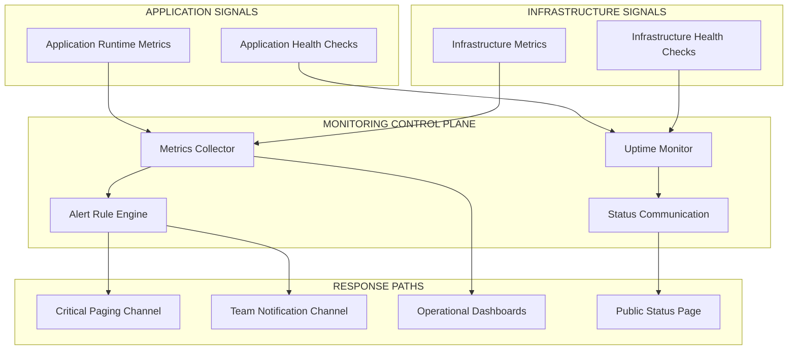
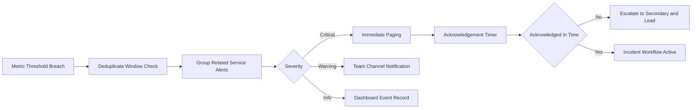
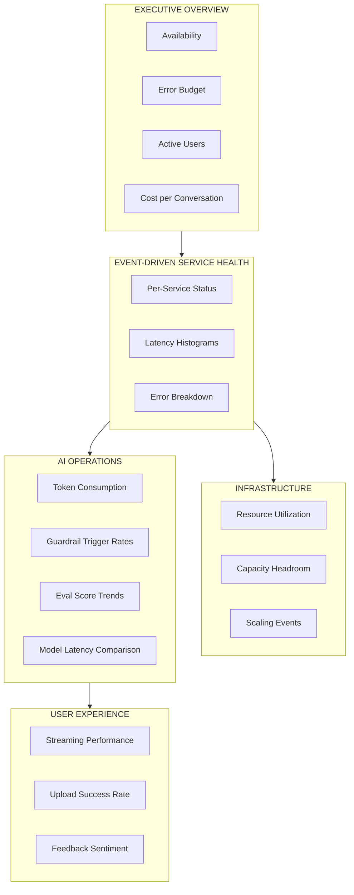
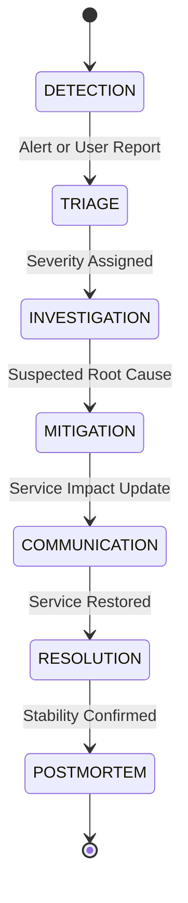

# 22 — Monitoring, Alerting, and Incident Response

> **Scope**: Real-time operational monitoring, health signal collection, alerting, escalation, SLA governance, incident response, status communication, and capacity forecasting for the safeagent library plus thin server deployment at 10M-user scale.
>
> **Tasks**: MONITORING_INFRA (Monitoring Infrastructure and Dashboards), INCIDENT_PROCEDURES (Incident Response Procedures and Runbooks)

---

## Table of Contents
- [Architecture Overview](#architecture-overview)
- [Monitoring Boundary vs Observability](#monitoring-boundary-vs-observability)
- [Health Check Strategy](#health-check-strategy)
- [Metrics Collection](#metrics-collection)
- [Alert Rules and Escalation](#alert-rules-and-escalation)
- [SLA Definitions](#sla-definitions)
- [Dashboards](#dashboards)
- [Status Page](#status-page)
- [Incident Response Procedures](#incident-response-procedures)
- [Runbook Templates](#runbook-templates)
- [On-Call Rotation](#on-call-rotation)
- [Capacity Monitoring and Forecasting](#capacity-monitoring-and-forecasting)
- [Cross-References](#cross-references)
- [Task Specifications](#task-specifications)

## Architecture Overview

Monitoring is a dedicated runtime reliability layer focused on immediate detection, response, and service protection.
Observability remains the deep diagnostic layer used for root-cause analysis and quality learning.
The two systems are complementary and intentionally separate: monitoring asks whether something is wrong now, observability explains why it happened.

Monitoring architecture principles:
- Keep metric ingestion pull-based for stable time-series collection across horizontally scaled instances.
- Keep alert delivery push-based so critical incidents immediately reach responders.
- Keep uptime health checks independent from request-path metrics to detect hard outage states.
- Keep status communication externally visible and internally traceable for transparent incident handling.
- Keep reliability controls consistent across both safeagent and server repositories.

## Monitoring Boundary vs Observability

Monitoring and observability have distinct responsibilities and must not be merged into a single operational stream.

- Monitoring focus:
  - Real-time service health and availability signals.
  - Fast detection of outages, saturation, and abnormal latency.
  - Alert routing, escalation, and on-call activation.
  - SLA and error budget governance.
  - Operational dashboards and status communication.
- Observability focus:
  - Trace-level execution analysis through Langfuse.
  - Structured logging and correlation for deep diagnostics.
  - Evaluation quality scoring and regression analysis.
  - Post-incident root cause reconstruction.
- Integration boundary:
  - Monitoring detects and pages.
  - Incident responders use observability traces to investigate and verify mitigation.
  - Monitoring records incident timing metrics, while observability records execution detail.

## Health Check Strategy

Health checks provide immediate service-state confidence at process, dependency, and fleet levels.
Health status values are consistent with existing server health semantics: ok, degraded, and down.

### Health Check Layers

- Shallow health checks:
  - Process alive and accepting requests.
  - Memory usage below safety thresholds.
  - Event loop responsiveness inside acceptable latency bands.
- Deep health checks:
  - Database connectivity and round-trip latency.
  - Cache reachability and operation responsiveness.
  - Object storage availability for upload and retrieval paths.
  - Queue worker availability and backlog movement.
  - Tracing backend availability as non-blocking dependency.

### Health Aggregation Strategy

- Per-instance health evaluation runs continuously for each server instance.
- Fleet-level health aggregation combines per-instance signals into service status.
- Partial instance failure marks service degraded when redundancy remains.
- Full dependency failure marks service down when critical dependencies fail.
- Dependency health includes Postgres, SurrealDB, Valkey, MinIO, Trigger.dev, and Langfuse.

### Health Probe Policy

- Probe intervals are short enough for rapid detection and long enough to avoid self-induced load.
- Probe timeout ceilings prevent stuck dependency checks from blocking health reporting.
- Parallel probe execution limits total health response latency.
- Health transitions require controlled hysteresis to reduce flapping.

## Metrics Collection

Metrics collection is organized by application, infrastructure, and business layers so responders can identify user impact and technical cause quickly.

### Application Metrics

- Request rate:
  - Requests per second by endpoint category.
  - Streaming versus non-streaming traffic split.
- Response latency:
  - p50, p95, and p99 latency by endpoint category.
  - Time to first token distribution for streaming responses.
- Error rate:
  - 4xx and 5xx rates by endpoint category.
  - Error burst detection and sustained-error windows.
- Streaming health:
  - Active SSE connection count.
  - Streaming response duration distribution.
  - Stream interruption and abort rate.
- Guardrail behavior:
  - Input blocked trigger rate.
  - Output blocked trigger rate.
  - Guardrail trigger trend during traffic spikes.
- Model usage:
  - Token consumption rate per model.
  - Token consumption by route category and user tier.
- Memory system:
  - Recall latency distribution.
  - Extraction latency distribution.
  - Storage growth rate by active user segment.
- Retrieval system:
  - Search latency distribution.
  - RRF fusion latency distribution.
  - Evidence gate pass and fail rate.
- Document pipeline:
  - Upload throughput.
  - Processing queue depth.
  - Processing failure rate.

### Infrastructure Metrics

- Postgres:
  - Connection pool utilization.
  - Query latency.
  - Replication lag.
- SurrealDB:
  - WebSocket connection health.
  - Query latency.
  - Storage size growth.
- Valkey:
  - Memory usage.
  - Cache hit rate.
  - Eviction rate.
  - Connection count.
- MinIO:
  - Storage utilization.
  - Request latency.
  - Upload and download throughput.
- Trigger.dev:
  - Job queue depth.
  - Job execution latency.
  - Job failure rate.
- Bun runtime:
  - Process memory usage.
  - Event loop latency.
  - CPU utilization.

### Business Metrics

- Daily active users.
- Conversations per user per day.
- Cost per conversation from AI spend.
- User feedback ratio, positive versus negative.
- Budget utilization by user tier.

## Alert Rules and Escalation

Alert design prioritizes fast action for user-impacting issues while minimizing alert fatigue.

### Severity Levels

- Critical:
  - Service down.
  - Error rate above ten percent.
  - Database unreachable.
  - All health checks failing.
  - Action: page immediately.
- Warning:
  - Error rate above two percent.
  - p99 latency above five seconds.
  - Disk usage above eighty percent.
  - Certificate expiration risk within fourteen days.
  - Action: notify team channel.
- Info:
  - Deployment completed.
  - Scaling event detected.
  - Configuration change applied.
  - Action: dashboard record only.

### Alert Routing

- Critical alerts route to immediate paging platforms such as PagerDuty or OpsGenie equivalents.
- Warning alerts route to team notification channels for prompt but non-paging response.
- Info alerts remain visible in operational dashboards for audit and trend context.

### Alert Fatigue Prevention

- Deduplicate repeated alerts within a configurable suppression window.
- Group related alerts by service and dependency topology.
- Silence non-actionable alerts during planned maintenance windows.
- Escalate automatically after acknowledgement timeout.
- Use cooldown intervals after resolution to prevent rapid re-page loops.

## SLA Definitions

SLA targets align with 10M-user reliability expectations and map directly to monitoring signals.

- Availability SLA:
  - 99.9 percent uptime.
  - Downtime budget under 8.7 hours per year.
- Latency SLA:
  - p50 under 200ms to first token.
  - p99 under 2 seconds to first token.
- Error SLA:
  - Under 0.1 percent 5xx errors under normal load.
- Recovery SLA:
  - Mean time to detect under 5 minutes.
  - Mean time to recover under 30 minutes.

### SLA Monitoring Model

- Rolling-window SLA calculations for availability, latency, and error compliance.
- Automatic SLA breach alerts tied to severity and error budget policy.
- Monthly SLA reporting across both library-facing and server-facing reliability dimensions.
- Error budget tracking with remaining downtime and burn-rate indicators.

## Dashboards

Dashboards are role-focused to support executive visibility, responder diagnosis, and service-owner optimization.

### Dashboard Categories

- Executive Overview:
  - Availability.
  - Error budget remaining.
  - Active users.
  - Cost per conversation.
- Service Health:
  - Per-service status.
  - Latency histograms.
  - Error-class and endpoint breakdowns.
- Infrastructure:
  - Resource utilization.
  - Capacity headroom.
  - Scaling event timeline.
- AI Operations:
  - Token consumption.
  - Guardrail trigger rates.
  - Eval score trends.
  - Model latency comparison.
- User Experience:
  - Streaming performance.
  - Upload success rate.
  - Feedback sentiment trend.

### Dashboard Design Principles

- Keep each dashboard aligned to one decision horizon: executive, tactical, or operational.
- Keep freshness high on real-time responder panels.
- Keep long-window views for capacity and cost forecasting.
- Keep breakdowns available by service, region, and user tier where relevant.

## Status Page

Status communication is public-facing and incident-aware, with component-level transparency and timeline continuity.

- Public status page shows current platform health.
- Component-level status covers API, Streaming, Upload, Search, and Memory.
- Historical uptime charts provide trust and accountability.
- Incident timelines capture detection, investigation, mitigation, and recovery updates.
- Planned maintenance announcements are scheduled and visible ahead of impact.
- Subscription options support email and webhook notifications for status changes.

Status update policy:
- Start incident communication early, even before full root cause certainty.
- Update at defined cadence during active incidents.
- Publish final resolution summary when service is stable.
- Link internal incident records to public timeline entries for audit integrity.

## Incident Response Procedures

Incident response standardizes decisions under pressure and minimizes recovery time.

### Incident Lifecycle

1. Detection:
   - Automated alert fires or user report is received.
2. Triage:
   - Classify severity as critical or warning and assign incident commander.
3. Investigation:
   - Use monitoring dashboards for blast radius and observability traces for cause isolation.
4. Mitigation:
   - Apply fix, rollback, traffic shift, or controlled workaround.
5. Communication:
   - Update status page and notify affected users when impact is material.
6. Resolution:
   - Confirm service restoration and clear active alerts.
7. Post-mortem:
   - Run blameless review, document root cause, and track preventive actions.

### Incident Governance

- Incident commander owns tactical coordination and decision tempo.
- Communications lead owns external and internal status updates.
- Service owner owns technical mitigation path.
- Scribe captures timeline, decisions, and action items for post-mortem completeness.

## Runbook Templates

Runbooks provide pre-approved response playbooks for high-frequency or high-impact failures.

- Database connection exhaustion:
  - Identify pool saturation and runaway query patterns.
  - Apply connection pressure relief and query isolation controls.
- AI provider rate limiting or outage:
  - Detect provider-side saturation, shift traffic policy, and apply degraded-response mode.
- Memory or disk pressure on application servers:
  - Trigger autoscaling or controlled traffic shedding before hard failure.
- SSE connection storms:
  - Detect abnormal connection spikes, cap concurrent streams, and protect core request paths.
- Guardrail false-positive spike:
  - Detect abrupt block-rate increase and apply temporary policy safeguards with audit review.
- Valkey failure and fallback behavior:
  - Validate fallback activation and monitor risk window for rate-limit and budget enforcement drift.
- Queue worker backlog buildup:
  - Detect queue growth, rebalance workers, and prioritize user-visible workloads.
- Certificate expiration risk:
  - Trigger renewal escalation before service trust impact.

Runbook template fields:
- Trigger conditions.
- Detection signals.
- Initial containment actions.
- Mitigation steps.
- Verification and recovery checks.
- Communication requirements.
- Follow-up prevention actions.

## On-Call Rotation

On-call operations require explicit ownership, escalation clarity, and handoff discipline.

- Rotation structure includes primary and secondary responders.
- Escalation path is primary to secondary to engineering lead.
- Shift handoffs include active incidents, known risks, and pending follow-up actions.
- Access requirements include alerting platform, dashboards, status communication tools, and incident records.
- Coverage policy ensures no single point of responder failure.

On-call quality controls:
- Measure alert load per shift and adjust noisy rules.
- Track acknowledgement and response time by severity.
- Run regular incident drills for critical scenarios.

## Capacity Monitoring and Forecasting

Capacity monitoring prevents reliability regressions as adoption grows from daily baseline to burst traffic windows.

- Track utilization trends daily, weekly, and monthly across compute, storage, and queue systems.
- Alert before resource exhaustion using pre-saturation thresholds.
- Forecast growth from user acquisition and workload intensity trends.
- Forecast cost from token usage, storage growth, and background job expansion.
- Recommend scaling triggers from sustained utilization and latency pressure.

Forecasting dimensions:
- Baseline 1 percent daily active usage profile.
- Burst headroom up to 10 percent daily active usage.
- Dependency-specific bottleneck projections for Postgres, Valkey, object storage, and background execution.
- Reliability impact modeling for slow-burn saturation and sudden event-driven spikes.

## Cross-References

| Plan File | Relevant Scope | How It Connects To This Document |
|---|---|---|
| 14 — Observability | Langfuse tracing, structured logging, Promptfoo eval, post-hoc diagnostics | Monitoring detects live incidents and SLA risk; observability explains root cause and validates mitigation outcomes |
| 15 — Infrastructure | Service topology, degradation model, health checks, rate limiting, circuit breaker | Monitoring consumes infrastructure health and saturation signals, then routes actionable alerts and escalation workflows |
| 12 — Server Implementation | Health endpoint semantics, dependency checks, middleware reliability behavior | Monitoring uses server health outputs as core availability signals and incident trigger inputs |
| 21 — Release Pipeline | Deployment stages, canary and rollback, operational pipeline monitoring | Monitoring governs deployment safety, canary promotion confidence, and rollback decision thresholds |

Integration notes:
- Monitoring coverage spans both safeagent and server operational surfaces.
- Alert thresholds must align with release gates and rollback controls.
- Incident workflows must consume health signals and observability diagnostics together.
- Status communication must reflect both user impact and mitigation progress.

## Task Specifications

### MONITORING_INFRA

**Task Name**
- MONITORING_INFRA

**Objective**
- Establish production-grade monitoring infrastructure, dashboards, health aggregation, alert routing, and status communication for real-time reliability management.

**What To Do**
- Set up pull-based metric collection across application and infrastructure layers.
- Define and publish health checks for shallow and deep dependency states.
- Configure severity-based alert rules with deduplication, grouping, silencing, and escalation.
- Build dashboard suites for executive, service, infrastructure, AI operations, and user experience views.
- Launch public status communication with component-level health and incident timelines.
- Wire SLA tracking, error budget calculations, and monthly reliability reporting.

**Depends On**
- INFRASTRUCTURE
- SERVER_ROUTES
- OBSERVABILITY_TRACING

**Batch**
- 9

**Acceptance Criteria**
- Metrics collection is running continuously for application, infrastructure, and business signals.
- Dashboards are populated and segmented by responder and stakeholder needs.
- Health checks report accurate per-service and fleet-level status.
- Alert rules are configured for critical, warning, and info severities with escalation behavior.
- Public status page is live with component health visibility and incident timeline support.
- SLA and error budget calculations are available in rolling windows.

**QA Scenarios**
- Simulate service outage and verify critical paging within target detection window.
- Simulate latency degradation and verify warning notification behavior.
- Simulate repeated threshold breaches and verify deduplication and grouping.
- Simulate planned maintenance and verify alert silencing behavior.
- Trigger component-level degradation and verify status page updates.
- Validate dashboard data freshness during sustained traffic.

**Implementation Notes**
- Keep alert rules risk-based and user-impact oriented.
- Keep dashboard ownership explicit to prevent stale operational surfaces.
- Keep threshold policy adjustable as traffic patterns evolve.

### INCIDENT_PROCEDURES

**Task Name**
- INCIDENT_PROCEDURES

**Objective**
- Define incident response lifecycle, escalation policy, on-call rotation, and scenario runbooks to minimize recovery time and user impact.

**What To Do**
- Define incident lifecycle from detection through post-mortem with ownership roles.
- Document severity model, escalation chain, and acknowledgement timeouts.
- Create and maintain runbooks for critical operational failure patterns.
- Establish primary and secondary on-call rotation with shift handoff process.
- Define status communication procedure for user-facing incident updates.
- Validate incident drills for high-risk scenarios and response readiness.

**Depends On**
- MONITORING_INFRA

**Batch**
- 10

**Acceptance Criteria**
- Runbooks are documented for all required common scenarios.
- Escalation paths are defined and tested for acknowledgement timeout handling.
- On-call rotation is established with primary and secondary coverage.
- Status communication workflows are validated during incident simulation.
- Post-mortem template is standardized and used for severe incidents.

**QA Scenarios**
- Trigger simulated critical outage and verify full incident lifecycle execution.
- Trigger simulated warning event and verify non-paging response flow.
- Execute handoff between on-call shifts during active incident and verify continuity.
- Run certificate-risk scenario and verify pre-expiry escalation behavior.
- Run queue backlog scenario and verify mitigation and communication sequence.

**Implementation Notes**
- Keep response ownership unambiguous at every incident stage.
- Keep runbooks concise, action-first, and drill-validated.
- Keep post-mortem follow-ups tracked to completion.

### Delivery Checklist

- Monitoring stack established with pull-based metrics and push-based alerting.
- Health checks cover process, dependency, and fleet aggregation states.
- Alerting severity model, routing, deduplication, and escalation are active.
- SLA and error budget tracking are integrated into operational reporting.
- Dashboard suite covers executive, service, infrastructure, AI operations, and user experience needs.
- Status page is live with component health, incident timeline, and maintenance notices.
- Incident lifecycle and runbook templates are documented and tested.
- On-call rotation and escalation chain are operational.

*Previous: 21 — Release Pipeline*
