# 22 — Monitoring, Alerting, and Incident Response

> **Scope**: Real-time operational monitoring, health signal collection, alerting, escalation, SLA governance, incident response, status communication, and capacity forecasting for the safeagent library plus thin server deployment at 10M-user scale.
>
> **Tasks**: MONITORING_INFRA (Monitoring Infrastructure and Dashboards), INCIDENT_PROCEDURES (Incident Response Procedures and Runbooks)

---

## Table of Contents
- [Architecture Overview](#architecture-overview)
- [Monitoring Boundary vs Observability](#monitoring-boundary-vs-observability)
- [Health Check Strategy](#health-check-strategy)
- [Metrics Collection](#metrics-collection)
- [LLM Quality Monitoring](#llm-quality-monitoring)
- [Agentic Workflow Monitoring](#agentic-workflow-monitoring)
- [RAG Pipeline Monitoring](#rag-pipeline-monitoring)
- [Security Monitoring](#security-monitoring)
- [Synthetic Monitoring](#synthetic-monitoring)
- [Token Cost Anomaly Detection](#token-cost-anomaly-detection)
- [Prompt Deployment Correlation](#prompt-deployment-correlation)
- [Business Metric Correlation](#business-metric-correlation)
- [Alert Rules and Escalation](#alert-rules-and-escalation)
- [SLA Definitions](#sla-definitions)
- [Dashboards](#dashboards)
- [Status Page](#status-page)
- [Incident Response Procedures](#incident-response-procedures)
- [Runbook Templates](#runbook-templates)
- [On-Call Rotation](#on-call-rotation)
- [Capacity Monitoring and Forecasting](#capacity-monitoring-and-forecasting)
- [Cross-References](#cross-references)
- [Task Specifications](#task-specifications)

## Architecture Overview

Monitoring is a dedicated runtime reliability layer focused on immediate detection, response, and service protection.
Observability remains the deep diagnostic layer used for root-cause analysis and quality learning.
The two systems are complementary and intentionally separate: monitoring asks whether something is wrong now, observability explains why it happened.

```mermaid
flowchart TB
  subgraph APPLICATION_SIGNALS[APPLICATION SIGNALS]
    APP_METRICS[Application Runtime Metrics]
    APP_HEALTH[Application Health Checks]
  end

  subgraph INFRA_SIGNALS[INFRASTRUCTURE SIGNALS]
    INFRA_METRICS[Infrastructure Metrics]
    INFRA_HEALTH[Infrastructure Health Checks]
  end

  subgraph AI_SIGNALS[AI MONITORING SIGNALS]
    QUALITY_METRICS[LLM Quality Metrics]
    AGENT_METRICS[Agentic Workflow Metrics]
    RAG_METRICS[RAG Effectiveness Metrics]
    SECURITY_METRICS[Prompt Security Metrics]
    SYNTHETIC_METRICS[Synthetic Probe Results]
    COST_METRICS[Token and Spend Metrics]
    CORRELATION_METRICS[Business Correlation Metrics]
  end

  subgraph DATA_ACCESS_LAYER[DATA ACCESS LAYER]
    DRIZZLE_ACCESS[Drizzle ORM for PostgreSQL]
    SURQLIZE_ACCESS[surqlize for SurrealDB]
  end

  subgraph MONITORING_CONTROL[MONITORING CONTROL PLANE]
    METRICS_COLLECTOR[Metrics Collector]
    ALERT_ENGINE[Alert Rule Engine]
    BURN_ENGINE[Burn Rate Evaluator]
    ANOMALY_ENGINE[Anomaly Detection Engine]
    UPTIME_MONITOR[Uptime Monitor]
    SYNTHETIC_CONTROLLER[Synthetic Probe Scheduler]
    INCIDENT_AUTOMATION[Incident Automation]
    STATUS_COMMS[Status Communication]
  end

  subgraph RESPONSE_PATHS[RESPONSE PATHS]
    CRITICAL_NOTIFY[Critical Paging Channel]
    WARNING_NOTIFY[Team Notification Channel]
    DASHBOARDS[Operational Dashboards]
    COST_GUARD[Cost Circuit Breaker]
    STATUS_PAGE[Public Status Page]
  end

  APP_METRICS --> METRICS_COLLECTOR
  APP_HEALTH --> UPTIME_MONITOR
  INFRA_METRICS --> METRICS_COLLECTOR
  INFRA_HEALTH --> UPTIME_MONITOR
  QUALITY_METRICS --> METRICS_COLLECTOR
  AGENT_METRICS --> METRICS_COLLECTOR
  RAG_METRICS --> METRICS_COLLECTOR
  SECURITY_METRICS --> METRICS_COLLECTOR
  SYNTHETIC_METRICS --> METRICS_COLLECTOR
  COST_METRICS --> METRICS_COLLECTOR
  CORRELATION_METRICS --> METRICS_COLLECTOR
  DRIZZLE_ACCESS --> METRICS_COLLECTOR
  SURQLIZE_ACCESS --> METRICS_COLLECTOR

  METRICS_COLLECTOR --> ALERT_ENGINE
  METRICS_COLLECTOR --> BURN_ENGINE
  METRICS_COLLECTOR --> ANOMALY_ENGINE
  SYNTHETIC_CONTROLLER --> METRICS_COLLECTOR
  ALERT_ENGINE --> CRITICAL_NOTIFY
  ALERT_ENGINE --> WARNING_NOTIFY
  BURN_ENGINE --> CRITICAL_NOTIFY
  ANOMALY_ENGINE --> WARNING_NOTIFY
  ANOMALY_ENGINE --> COST_GUARD
  BURN_ENGINE --> INCIDENT_AUTOMATION
  INCIDENT_AUTOMATION --> STATUS_COMMS
  METRICS_COLLECTOR --> DASHBOARDS
  UPTIME_MONITOR --> STATUS_COMMS
  STATUS_COMMS --> STATUS_PAGE
```

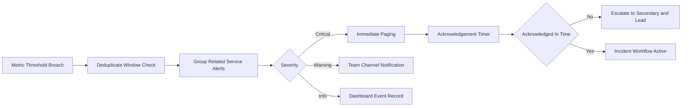

Monitoring architecture principles:
- Keep metric ingestion pull-based for stable time-series collection across horizontally scaled instances.
- Keep alert delivery push-based so critical incidents immediately reach responders.
- Keep uptime health checks independent from request-path metrics to detect hard outage states.
- Keep status communication externally visible and internally traceable for transparent incident handling.
- Keep reliability controls consistent across both safeagent and server repositories.

## Monitoring Boundary vs Observability

Monitoring and observability have distinct responsibilities and must not be merged into a single operational stream.

- Monitoring focus:
  - Real-time service health and availability signals.
  - Fast detection of outages, saturation, and abnormal latency.
  - Alert routing, escalation, and on-call activation.
  - SLA and error budget governance.
  - Operational dashboards and status communication.
- Observability focus:
  - Trace-level execution analysis through Langfuse.
  - Structured logging and correlation for deep diagnostics.
  - Evaluation quality scoring and regression analysis.
  - Post-incident root cause reconstruction.
- Integration boundary:
  - Monitoring detects and pages.
  - Incident responders use observability traces to investigate and verify mitigation.
  - Monitoring records incident timing metrics, while observability records execution detail.

## Health Check Strategy

Health checks provide immediate service-state confidence at process, dependency, and fleet levels.
Health status values are consistent with existing server health semantics: ok, degraded, and down.

### Health Check Layers

- Shallow health checks:
  - Process alive and accepting requests.
  - Memory usage below safety thresholds.
  - Event loop responsiveness inside acceptable latency bands.
- Deep health checks:
  - Database connectivity and round-trip latency.
  - Cache reachability and operation responsiveness.
  - Object storage availability for upload and retrieval paths.
  - Queue worker availability and backlog movement.
  - Tracing backend availability as non-blocking dependency.

### Health Aggregation Strategy

- Per-instance health evaluation runs continuously for each server instance.
- Fleet-level health aggregation combines per-instance signals into service status.
- Partial instance failure marks service degraded when redundancy remains.
- Full dependency failure marks service down when critical dependencies fail.
- Dependency health includes Postgres, SurrealDB, Valkey, MinIO, Trigger.dev, and Langfuse.

### Health Probe Policy

- Probe intervals are short enough for rapid detection and long enough to avoid self-induced load.
- Probe timeout ceilings prevent stuck dependency checks from blocking health reporting.
- Parallel probe execution limits total health response latency.
- Health transitions require controlled hysteresis to reduce flapping.

## Metrics Collection

Metrics collection is organized by application, infrastructure, and business layers so responders can identify user impact and technical cause quickly.

### Application Metrics

- Request rate:
  - Requests per second by endpoint category.
  - Streaming versus non-streaming traffic split.
- Response latency:
  - p50, p95, and p99 latency by endpoint category.
  - Time to first token distribution for streaming responses.
- Error rate:
  - 4xx and 5xx rates by endpoint category.
  - Error burst detection and sustained-error windows.
- Streaming health:
  - Active SSE connection count.
  - Streaming response duration distribution.
  - Stream interruption and abort rate.
- Guardrail behavior:
  - Input blocked trigger rate.
  - Output blocked trigger rate.
  - Guardrail trigger trend during traffic spikes.
- Model usage:
  - Token consumption rate per model.
  - Token consumption by route category and user tier.
- Memory system:
  - Recall latency distribution.
  - Extraction latency distribution.
  - Storage growth rate by active user segment.
- Retrieval system:
  - Search latency distribution.
  - RRF fusion latency distribution.
  - Evidence gate pass and fail rate.
- Document pipeline:
  - Upload throughput.
  - Processing queue depth.
  - Processing failure rate.

### Infrastructure Metrics

- Postgres:
  - Connection pool utilization.
  - Query latency.
  - Replication lag.
- SurrealDB:
  - WebSocket connection health.
  - Query latency.
  - Storage size growth.
- Valkey:
  - Memory usage.
  - Cache hit rate.
  - Eviction rate.
  - Connection count.
- MinIO:
  - Storage utilization.
  - Request latency.
  - Upload and download throughput.
- Trigger.dev:
  - Job queue depth.
  - Job execution latency.
  - Job failure rate.
- Bun runtime:
  - Process memory usage.
  - Event loop latency.
  - CPU utilization.

### Business Metrics

- Daily active users.
- Conversations per user per day.
- Cost per conversation from AI spend.
- User feedback ratio, positive versus negative.
- Budget utilization by user tier.

## LLM Quality Monitoring

LLM quality monitoring turns subjective response quality into live operational metrics that can trigger alerts, drive incident response, and protect user trust at scale.
Quality here is treated as a reliability domain with explicit service objectives, budgets, and escalation policy.
The focus is production-time signal collection and response, while deep diagnostic traces remain in observability.

### Live Sampling Strategy

- Sampling coverage:
  - Evaluate three to five percent of live responses with automated LLM-as-judge scoring.
  - Keep sampling stratified by user tier, workload type, and response mode to avoid bias.
  - Increase sampling rate automatically during incident windows and prompt-change windows.
- Sampling fairness controls:
  - Preserve proportional representation across short and long conversations.
  - Preserve representation across streaming and non-streaming response paths.
  - Preserve representation across high-cost and low-cost model pathways.
- Latency safeguards:
  - Keep scoring asynchronous so user response latency remains stable.
  - Enforce scoring queue limits to prevent scoring backlog from impacting primary workloads.
  - Route overflow sampling into delayed evaluation buckets while preserving trend visibility.

### Quality Dimensions and Scoring Model

- Groundedness:
  - Measure whether response claims are supported by available evidence.
  - Flag ungrounded claims as potential hallucination events.
  - Track groundedness by user journey and feature family.
- Relevance:
  - Measure alignment between user intent and generated response focus.
  - Track relevance drift after prompt deployments and model mix shifts.
  - Separate first-turn relevance from multi-turn relevance.
- Coherence:
  - Measure response structure, consistency, and logical continuity.
  - Track coherence failures under high concurrency and long context windows.
  - Monitor coherence recovery after regeneration events.
- Safety:
  - Measure output policy compliance and harmful content risk.
  - Track safety scores independently from security attack detection metrics.
  - Escalate sudden safety score drops even when traffic volume is unchanged.

### Hallucination Rate SLO

- Hallucination target:
  - Treat hallucination rate as a first-class reliability objective.
  - Target under two percent of sampled responses flagged as ungrounded.
  - Compute rolling compliance windows for hourly, daily, and monthly risk views.
- Hallucination impact model:
  - Weight hallucination events by severity and user impact class.
  - Distinguish factual uncertainty from high-confidence false claims.
  - Track recurrence by prompt family, model family, and retrieval dependency state.
- Hallucination alert triggers:
  - Trigger warning at early degradation thresholds.
  - Trigger critical when burn pace indicates rapid budget exhaustion.
  - Route incidents to both responder and product owner channels for aligned mitigation.

### Consistency and Drift Controls

- Golden prompt replay:
  - Re-run canonical prompt sets on a fixed schedule.
  - Compare semantic similarity against validated historical baselines.
  - Segment drift detection by domain, locale, and complexity tier.
- Semantic drift detection:
  - Track score drift slope, not only point-in-time threshold breaches.
  - Detect gradual behavior change that can hide beneath static thresholds.
  - Trigger investigation when repeated minor drift compounds across windows.
- Regression guardrails:
  - Mark quality regression events as reliability incidents when user impact is material.
  - Link regression events to prompt deployment markers and model routing changes.
  - Preserve incident timelines for audit and prevention planning.

### User Feedback as Quality SLIs

- Positive feedback rate:
  - Track positive versus negative feedback ratio per journey and segment.
  - Correlate sudden drops with quality score regressions.
  - Detect mismatch between evaluator scores and user sentiment.
- Regeneration rate:
  - Track percentage of responses that users regenerate.
  - Treat regeneration spikes as relevance or coherence risk signals.
  - Segment by feature to pinpoint localized quality regressions.
- Session abandonment after AI response:
  - Track immediate abandonment within defined post-response windows.
  - Correlate abandonment spikes with low quality scores and high latency.
  - Treat abandonment divergence as user trust risk requiring triage.

### Time-Series Quality Monitoring

- Primary quality trend panels:
  - Groundedness, relevance, coherence, and safety score trajectories.
  - Hallucination rate trajectory with objective target overlay.
  - Evaluated sample volume and sampling representativeness.
- Regression detection overlays:
  - Prompt deployment markers and model mix markers.
  - Incident markers for known quality degradation windows.
  - Recovery markers for mitigation rollout checkpoints.
- Scalability controls:
  - Apply cardinality constraints on quality metric dimensions.
  - Use aggregate buckets for high-volume segmentation dimensions.
  - Preserve responder-ready dashboards during peak load windows.

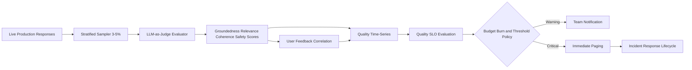

### Operational Ownership and Security Considerations

- Ownership model:
  - Reliability owns real-time quality alerting and incident activation.
  - Product quality owners own threshold calibration and action prioritization.
  - Security owners join incidents when quality degradation intersects policy risk.
- Security posture:
  - Treat evaluator pipelines as sensitive systems with strict access controls.
  - Prevent sampled content exposure outside approved reliability channels.
  - Apply retention limits aligned with data minimization principles.
- Scalability posture:
  - Scale evaluators independently from user-facing inference paths.
  - Use queue backpressure controls to preserve platform stability.
  - Preserve monitoring continuity during evaluator service partial degradation.

## Agentic Workflow Monitoring

Agentic systems require monitoring beyond request latency and error rate because user outcomes depend on planning quality, tool reliability, memory integrity, and bounded execution.

### Execution Graph Monitoring Model

- Trace shape monitoring:
  - Build full execution graph metrics from nested spans across planning, tool use, memory access, and handoffs.
  - Track span depth distribution and branch fan-out by workload class.
  - Detect abnormal graph growth that signals runaway behavior.
- Step progression monitoring:
  - Track transitions between planning, tool execution, synthesis, and completion stages.
  - Monitor repeated step patterns that indicate stuck loops.
  - Alert when completion stage is not reached within expected step count bands.
- Handoff monitoring:
  - Measure sub-agent handoff attempts, success rate, and failure causes.
  - Track latency added by handoff overhead.
  - Detect orphaned handoff states where no downstream completion occurs.

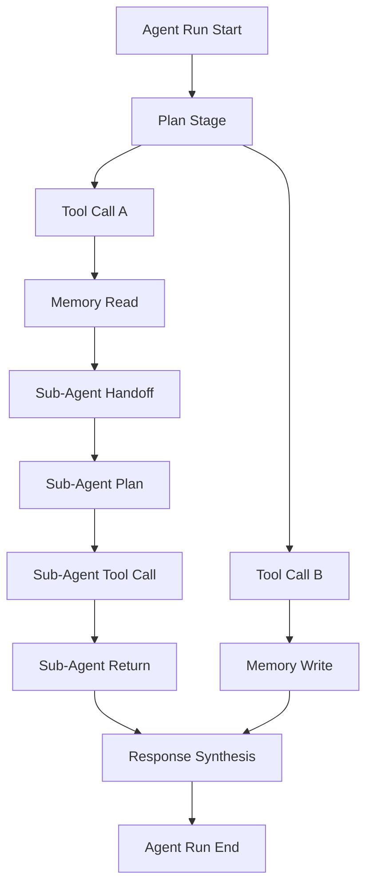

### Loop Depth and Infinite Loop Protection

- Loop depth objective:
  - Monitor iteration depth for each agent run against policy limits.
  - Trigger warning when depth approaches cap without progress.
  - Trigger critical when depth cap breach risk is imminent.
- Loop health signals:
  - Step repetition ratio in rolling windows.
  - Unique action ratio per run to distinguish exploration from loops.
  - Time-in-loop before meaningful state transition.
- Protection actions:
  - Halt runs that exceed cost and loop safety boundaries.
  - Preserve partial run metadata for post-incident analysis.
  - Notify on-call with loop diagnostics and impacted user scope.

### Tool Call Reliability Monitoring

- Per-tool success rate:
  - Monitor first-attempt success and eventual success distributions.
  - Separate deterministic failures from dependency timeouts.
  - Track tool reliability by tenant class when relevant.
- Tool latency and contention:
  - Track p50, p95, and p99 duration per tool category.
  - Track concurrent tool execution pressure and queue delay.
  - Alert on sustained latency inflation tied to dependency saturation.
- Tool fallback behavior:
  - Track fallback invocation rate when primary tools fail.
  - Track recovery quality after fallback routing.
  - Escalate when fallback path itself degrades.

### Plan Drift and Stuck State Detection

- Plan drift definition:
  - Treat drift as measurable deviation from declared task goal and expected milestone sequence.
  - Track divergence score per run and aggregate by feature family.
  - Alert on sudden drift spikes after prompt or policy changes.
- Stuck state detection:
  - Detect repeated step labels beyond controlled thresholds.
  - Detect repeated tool calls with unchanged input context.
  - Detect repeated memory lookups with no state advancement.
- Responder cues:
  - Include latest successful milestone in alert context.
  - Include repeated-step signature for rapid triage.
  - Include cost-to-progress ratio for severity assignment.

### Memory Read and Write Observability Metrics

- Freshness metadata:
  - Track age distribution of memory entries used in active runs.
  - Monitor stale-memory reliance rate by journey type.
  - Alert when stale reliance spikes beyond policy tolerance.
- Relevance scores:
  - Score memory retrieval relevance against current user intent.
  - Track low-relevance retrieval rate as memory quality degradation.
  - Correlate low relevance with completion failures.
- Read and write performance:
  - Track memory read latency and write latency separately.
  - Track write failure rate and retry behavior.
  - Track memory growth by active user segment.

### Memory Leakage and Cross-User Contamination Monitoring

- Leakage risk signals:
  - Detect memory retrievals that fail user-scope isolation checks.
  - Track contamination suspicion rate as a zero-tolerance security metric.
  - Trigger immediate critical alert for confirmed cross-user context leakage.
- Compliance alignment:
  - Preserve incident-ready audit trail for leakage events.
  - Route confirmed leakage to security and privacy stakeholders.
  - Track mitigation completion and residual risk validation.
- Prevention feedback loop:
  - Feed contamination findings into isolation policy tightening.
  - Add focused synthetic probes after leakage incidents.
  - Require post-incident validation windows before incident closure.

### Agent Cost Circuit Breaker Monitoring

- Session spend tracking:
  - Track cumulative token and currency cost per agent session.
  - Compare session spend against absolute safety ceiling.
  - Trigger automatic halt when ceiling is exceeded.
- Runaway pattern detection:
  - Detect high loop depth plus rising spend without milestone completion.
  - Detect unusually high tool invocations with low completion probability.
  - Detect context expansion patterns that inflate spend rapidly.
- Circuit breaker governance:
  - Require explicit incident annotation for circuit breaker triggers.
  - Monitor false trigger rate and adjust policies conservatively.
  - Ensure halt actions are auditable and reversible under safe controls.

### Agentic Monitoring Scalability and Security

- Scalability practices:
  - Bound high-cardinality labels in tool and memory dimensions.
  - Use tiered aggregation for fleet-level and feature-level views.
  - Preserve alert timeliness during burst traffic conditions.
- Security practices:
  - Restrict access to agent execution diagnostics by operational role.
  - Mask sensitive payload attributes in monitoring labels.
  - Apply strict retention policies for high-risk run metadata.

## RAG Pipeline Monitoring

RAG monitoring focuses on retrieval effectiveness, context quality, and latency isolation so teams can protect answer quality before users experience degradation.

### Retrieval Relevance Monitoring

- Top-k relevance score tracking:
  - Track average similarity score of retrieved chunks for each query class.
  - Monitor score distribution spread to detect unstable retrieval quality.
  - Alert when relevance scores drop below expected operating bands.
- Query cohort analysis:
  - Segment relevance by domain, complexity, and user tier.
  - Detect domain-specific regressions hidden in global averages.
  - Prioritize remediation for high-business-value cohorts.
- Drift context:
  - Annotate relevance trends with ingestion events and corpus refresh waves.
  - Detect relevance degradation during rapid document growth periods.
  - Detect retrieval quality decay caused by stale embeddings.

### Retrieval Hit Rate Monitoring

- Hit rate objective:
  - Track percentage of queries retrieving at least one relevant document.
  - Treat hit rate drops as potential knowledge base staleness signals.
  - Escalate sustained drops tied to high-impact journeys.
- Hit quality tiers:
  - Track high-confidence hits separately from weak-confidence hits.
  - Track no-hit rate and low-confidence-only rate.
  - Use tiered hit views to prioritize corpus curation actions.
- Incident coupling:
  - Link hit rate incidents to answer quality incidents when correlated.
  - Record dependency health state during hit rate failures.
  - Separate retrieval failures from generation failures during triage.

### Context Precision and Chunk Utilization

- Context precision metric:
  - Measure percentage of retrieved chunks actually used in final response.
  - Track over-retrieval patterns that increase cost without quality gains.
  - Alert on sustained precision degradation.
- Chunk utilization efficiency:
  - Track utilization ratio by query type and context length tier.
  - Detect under-utilized large contexts that create latency and cost drag.
  - Track utilization improvements after retrieval tuning.
- Response support density:
  - Track amount of response content directly supported by retrieved context.
  - Monitor unsupported response share as hallucination risk precursor.
  - Correlate support density with groundedness score trends.

### Embedding Drift Detection

- Distribution shift monitoring:
  - Compare production query embedding distribution against index-time embedding distribution.
  - Detect centroid drift and variance expansion in rolling windows.
  - Trigger warnings for persistent statistical divergence.
- Drift impact tracking:
  - Correlate embedding drift with relevance and hit rate degradation.
  - Correlate drift with increased latency from wider retrieval scans.
  - Use drift severity tiers to drive remediation urgency.
- Corpus lifecycle context:
  - Annotate drift charts with large ingestion and pruning windows.
  - Distinguish healthy corpus evolution from harmful drift patterns.
  - Maintain stable baseline windows for meaningful comparisons.

### Vector Search Latency SLI

- Latency separation:
  - Track vector search latency separately from LLM generation latency.
  - Preserve independent SLI and objective targets for retrieval latency.
  - Alert when vector latency degrades even if end-to-end latency appears stable.
- Latency breakdown:
  - Query preparation latency.
  - Vector search execution latency.
  - Re-ranking and context assembly latency.
- Scalability safeguards:
  - Monitor retrieval latency under concurrency spikes.
  - Track latency inflation by index size growth tier.
  - Trigger proactive capacity actions before user-visible degradation.

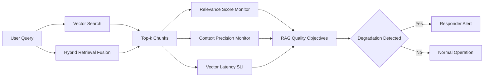

### Data Access Layer Signals

- PostgreSQL data path:
  - Monitor retrieval metadata access health through Drizzle ORM for PostgreSQL.
  - Track query latency and error trends on metadata joins used in retrieval.
  - Detect metadata contention that can degrade retrieval quality indirectly.
- SurrealDB memory path:
  - Monitor memory-augmented retrieval access health through surqlize for SurrealDB.
  - Track latency and reliability for context retrieval supporting RAG answers.
  - Detect stale memory patterns that reduce retrieval effectiveness.
- Unified reliability view:
  - Correlate relational and graph-oriented data access degradation with RAG outcome signals.
  - Preserve service ownership boundaries while exposing unified responder dashboards.
  - Escalate multi-store degradation with higher severity due to compounded quality risk.

### RAG Security and Compliance Signals

- Sensitive content handling:
  - Track policy-filtered retrieval events for restricted content classes.
  - Detect abnormal access patterns against protected data segments.
  - Alert on unusual retrieval concentration from sensitive domains.
- Access boundary health:
  - Monitor authorization check pass and fail trends in retrieval workflows.
  - Treat sudden authorization failure shifts as security investigation triggers.
  - Track policy drift signals after access rule updates.

## Security Monitoring

Security monitoring for AI interactions focuses on attack detection quality, guardrail reliability, and zero-tolerance protection of sensitive data in generated output.

### Prompt Injection Monitoring

- Detection rate monitoring:
  - Track prompt injection detection rate by source class and journey type.
  - Separate direct attack attempts from benign false detections.
  - Alert on sudden detection spikes indicating active attack campaigns.
- False positive monitoring:
  - Track false positive rate as a first-class quality and usability metric.
  - Detect over-aggressive filtering that harms legitimate usage.
  - Route false-positive surges to security and product jointly.
- Suppression risk monitoring:
  - Detect abrupt detection-rate drops that may indicate bypass.
  - Correlate detection-rate drops with jailbreak success indicators.
  - Trigger investigation when detection and attack indicators diverge.

### Indirect Prompt Injection Monitoring

- External content risk tracking:
  - Monitor agent interactions with external content sources for embedded instruction patterns.
  - Track indirect injection detection rates by source trust tier.
  - Alert on source clusters associated with repeated policy conflicts.
- Instruction boundary enforcement:
  - Track policy override attempts from untrusted context.
  - Track blocked and allowed decision ratios for embedded instructions.
  - Escalate unusual allow-rate increases for immediate review.
- Supply chain perspective:
  - Map repeated attack indicators to content-provider clusters.
  - Support temporary source risk controls during active campaigns.
  - Track mitigation effectiveness after source controls are applied.

### PII in Output Monitoring

- Zero-tolerance controls:
  - Scan generated output for sensitive data patterns continuously.
  - Trigger critical alerts for confirmed sensitive output leaks.
  - Treat confirmed leaks as security incidents requiring immediate escalation.
- Detection quality:
  - Track scanner confidence distribution and review outcomes.
  - Track false positive burden for operational tuning.
  - Track repeat leak patterns by journey and context class.
- Incident handling expectations:
  - Require immediate containment actions for leak incidents.
  - Require communication and compliance notification pathways.
  - Require explicit verification before incident closure.

### Guardrail Effectiveness Trending

- Activation rate trends:
  - Track guardrail activation rates over time by attack category.
  - Detect sudden activation drops as potential bypass indicators.
  - Detect activation spikes as potential attack surges or policy regressions.
- Guardrail outcome monitoring:
  - Track block, flag, and pass outcome balance.
  - Track post-guardrail incident correlation rate.
  - Track time to mitigation after guardrail-related alerts.
- Security reliability posture:
  - Treat guardrail health as a reliability dependency for safe operation.
  - Include guardrail degradation in critical incident criteria.
  - Include guardrail integrity checks in synthetic monitoring.

### Jailbreak Attempt and Adversarial Pattern Monitoring

- Jailbreak attempt rate:
  - Track attempt volume by prompt pattern family.
  - Track success suspicion rate using downstream policy violation signals.
  - Alert on coordinated jailbreak campaigns.
- Adversarial clustering:
  - Cluster attack inputs by lexical and semantic characteristics.
  - Track emergence of new cluster families across time windows.
  - Prioritize emerging high-success clusters for defensive updates.
- Defense effectiveness trend:
  - Track time from cluster emergence to mitigation rollout.
  - Track mitigation impact on attack success indicators.
  - Track residual risk after mitigation stabilization.

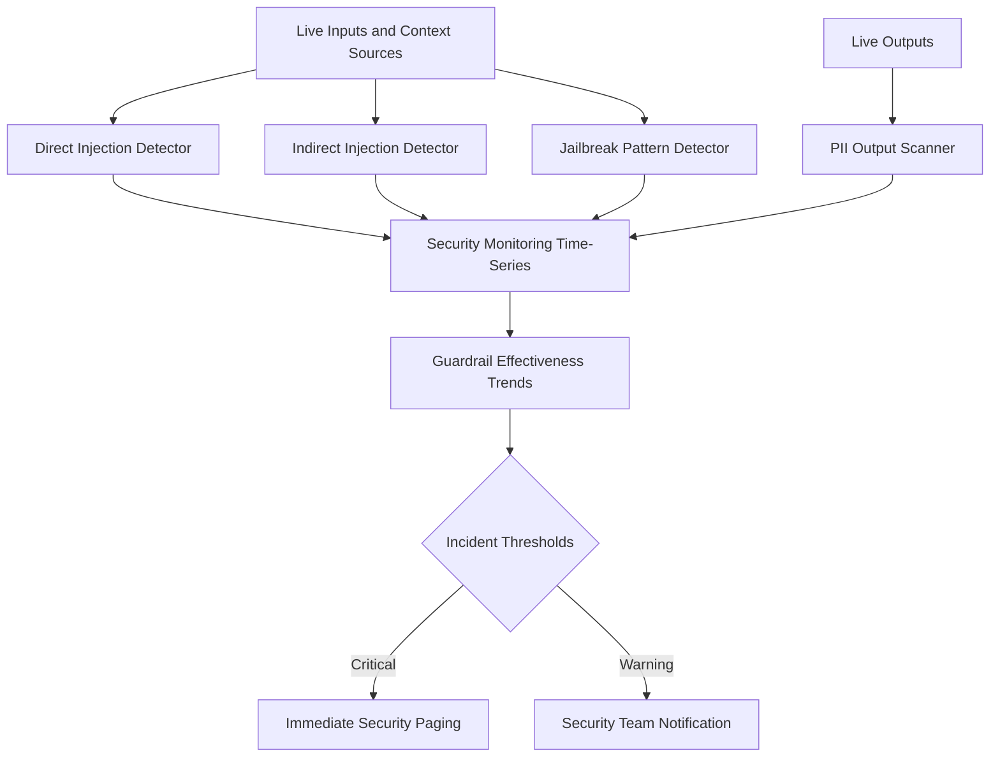

### Security Monitoring Governance

- Access control:
  - Restrict detailed security monitoring views to authorized responders.
  - Separate high-sensitivity alert payloads from broad operational channels.
  - Preserve immutable incident logs for forensic continuity.
- Scalability under attack:
  - Preserve detector throughput during attack bursts.
  - Use adaptive sampling for attack analytics without losing critical signal.
  - Protect core service reliability while sustaining security telemetry.
- Cross-team coordination:
  - Coordinate security, reliability, and product teams under shared incident definitions.
  - Define escalation ownership for mixed quality and security incidents.
  - Track response performance metrics for continuous readiness improvement.

## Synthetic Monitoring

Synthetic monitoring provides controlled probes that continuously validate critical AI behaviors, detect silent regressions, and verify failover readiness before users are impacted.

### Golden Prompt Canaries

- Probe cadence:
  - Execute fixed known-answer prompt canaries every five minutes.
  - Maintain canary coverage across major product journeys and risk classes.
  - Run canaries from multiple regions for latency and consistency visibility.
- Canary assertions:
  - Validate response quality score against established baseline bands.
  - Validate semantic similarity against historical reference outputs.
  - Validate guardrail behavior expectations under controlled prompt sets.
- Alert policy:
  - Trigger warnings for single-window degradation.
  - Trigger critical for sustained multi-window degradation.
  - Correlate canary failures with live traffic quality shifts.

### End-to-End Agent Workflow Synthetics

- Workflow simulation cadence:
  - Execute complete agent workflows every fifteen minutes.
  - Cover representative workflows for planning, tool usage, memory usage, and completion.
  - Include both short-path and long-path task patterns.
- Validation points:
  - Task completion success.
  - Expected tool usage sequence integrity.
  - Step count staying within healthy range.
  - Output quality score remaining above baseline.
- Regression response:
  - Alert on completion failures or excessive step growth.
  - Alert on unexpected tool-path divergence.
  - Escalate if regression persists across consecutive runs.

### RAG Pipeline Synthetics

- Known-query probes:
  - Query retrieval with stable known queries.
  - Verify expected documents appear in top-k results.
  - Verify relevance scores and retrieval latency stay within policy bands.
- Context quality checks:
  - Verify context precision meets expected operating thresholds.
  - Verify chunk utilization does not degrade unexpectedly.
  - Verify no-hit rate remains in healthy range.
- Reliability checks:
  - Verify degradation detection when retrieval dependencies are stressed.
  - Verify alert routing for retrieval-specific incidents.
  - Verify recovery signaling after dependency restoration.

### Model Provider Failover Synthetics

- Failover readiness probes:
  - Simulate primary provider degradation conditions.
  - Verify fallback provider activation and response continuity.
  - Verify quality delta between primary and fallback remains within tolerance.
- Continuity metrics:
  - Failover activation latency.
  - Fallback success rate.
  - Post-failover error and quality drift.
- Incident integration:
  - Trigger responder alerts when failover does not activate as expected.
  - Trigger warning if failover quality remains degraded beyond tolerance.
  - Record probe outcomes in incident drill history.

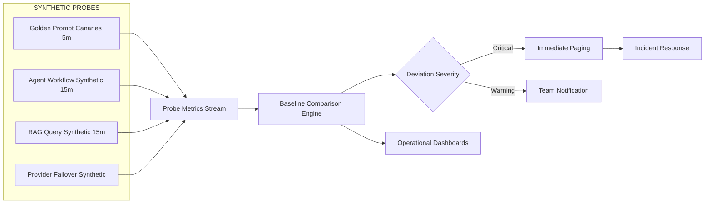

### Synthetic Monitoring Security and Scalability

- Security controls:
  - Use non-sensitive probe data and controlled synthetic identities.
  - Prevent synthetic workloads from exposing protected content.
  - Audit probe changes with ownership and approval controls.
- Scalability controls:
  - Keep synthetic workload overhead bounded relative to live traffic.
  - Isolate synthetic execution pools from customer-serving capacity.
  - Prioritize critical probes during high-load periods.
- Reliability controls:
  - Monitor synthetic scheduler health and probe execution backlog.
  - Alert when probe freshness falls below operating standards.
  - Include synthetic subsystem health in incident readiness reviews.

## Token Cost Anomaly Detection

Token cost monitoring protects budget reliability by detecting abnormal spend behavior quickly and triggering controls before user-facing reliability or business outcomes degrade.

### Per-User Cost Spike Detection

- User anomaly model:
  - Compare short-window user spend against rolling historical baseline.
  - Detect spikes exceeding configured multipliers of normal behavior.
  - Separate legitimate growth from suspicious or runaway consumption.
- Alerting policy:
  - Warning for moderate spike with normal quality behavior.
  - Critical for severe spike coupled with loop or failure indicators.
  - Escalate to abuse review when pattern suggests misuse.
- Protection actions:
  - Apply controlled throttling for confirmed runaway sessions.
  - Trigger session halt when policy ceilings are exceeded.
  - Preserve user-impact-safe degraded response options.

### Per-Feature Cost Regression Detection

- Feature baseline model:
  - Track normalized cost per completed task for each feature family.
  - Compare post-deployment cost against rolling baseline windows.
  - Detect regressions masked by global average stability.
- Regression severity:
  - Minor regression for small but persistent uplift.
  - Major regression for abrupt and sustained uplift.
  - Critical regression when spend surge impacts budget objectives.
- Response playbook:
  - Attach deployment markers to cost charts.
  - Correlate regressions with quality and latency shifts.
  - Trigger rollback consideration when cost and quality both degrade.

### Token Budget Burn Rate

- Budget pace tracking:
  - Monitor daily budget consumption pace against monthly targets.
  - Forecast projected end-of-period spend under current trajectory.
  - Trigger early warnings when projection exceeds safe budget bands.
- Burn rate dimensions:
  - Overall spend burn.
  - Spend burn by model mix.
  - Spend burn by journey and user tier.
- Reliability coupling:
  - Include budget burn in incident severity when service continuity risk exists.
  - Coordinate spend protection with availability and quality objectives.
  - Preserve graceful degradation options before hard budget exhaustion.

### Model Cost Mix Shift Detection

- Mix shift tracking:
  - Track percentage of requests routed to higher-cost model classes.
  - Detect unexpected routing shifts after policy or prompt changes.
  - Alert when expensive-route share exceeds safe operating envelope.
- Mix-risk indicators:
  - Rising cost without quality uplift.
  - Rising latency and cost together.
  - Rising fallback usage to expensive paths.
- Operational response:
  - Investigate routing controls and prompt behavior interactions.
  - Trigger controlled rerouting where reliability allows.
  - Validate post-mitigation quality and safety outcomes.

### Runaway Agent Session Cost Alerts

- Session ceiling policy:
  - Track cumulative session cost in real time.
  - Trigger immediate alert on absolute ceiling breach risk.
  - Halt session automatically at hard ceiling to protect budget.
- Joint signal correlation:
  - Combine session spend with loop depth and plan drift metrics.
  - Prioritize incidents where spend grows without completion progress.
  - Capture frequent runaway signatures for preventive tuning.
- Incident criteria:
  - Critical when multiple runaway sessions occur concurrently.
  - Warning when isolated events remain contained.
  - Require follow-up review for recurring runaway patterns.

### Context Window Utilization Monitoring

- Utilization percentage:
  - Track context window utilization per request and cohort.
  - Alert on sustained high utilization due to cost and latency risk.
  - Alert on sustained very low utilization indicating retrieval waste.
- Efficiency interpretation:
  - High utilization plus low quality indicates context overload risk.
  - Low utilization plus high retrieval volume indicates precision inefficiency.
  - Balanced utilization supports cost-effective quality stability.
- Optimization guidance:
  - Use utilization trends to tune retrieval and summarization policies.
  - Validate tuning effects on both cost and quality trajectories.
  - Prevent oscillation through controlled change windows.

### Input-to-Output Token Ratio Anomaly Detection

- Ratio monitoring:
  - Track output expansion ratio relative to input size.
  - Detect abnormal verbosity growth patterns.
  - Detect abrupt compression patterns that may indicate quality loss.
- Risk interpretation:
  - Very high ratios can indicate runaway generation behavior.
  - Very low ratios can indicate under-response and task incompleteness.
  - Ratio shifts paired with quality drops require immediate triage.
- Action policy:
  - Alert on sustained ratio anomalies across key journeys.
  - Correlate anomalies with prompt changes and model routing changes.
  - Trigger mitigation when ratio anomalies drive budget burn.

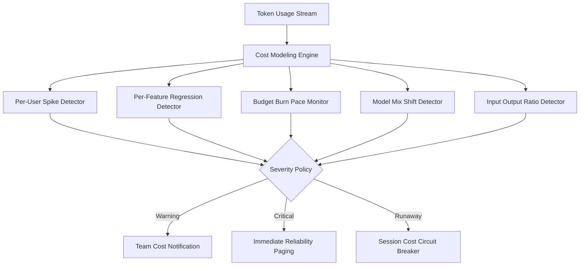

### Cost Monitoring Governance

- Ownership:
  - Reliability owns incident activation for budget risk events.
  - Product and finance partners own budget policy calibration.
  - Security owns misuse investigation for abuse-driven anomalies.
- Scalability:
  - Use streaming aggregation pipelines for high-volume token telemetry.
  - Keep detector latency bounded under peak traffic.
  - Preserve anomaly visibility during partial dependency degradation.

## Prompt Deployment Correlation

Prompt changes are treated as production deployments with strict monitoring, regression detection, and rollback safeguards.

### Prompt Change as Deployment Event

- Deployment markers:
  - Emit deployment markers whenever prompt templates change.
  - Show markers on quality, latency, cost, and safety dashboards.
  - Preserve marker metadata for incident and audit timelines.
- Deployment governance:
  - Require owner attribution and change rationale.
  - Require risk tier classification for each prompt deployment.
  - Require post-deployment observation windows before declaring stable.
- Reliability parity:
  - Apply same rigor used for service deployments.
  - Include prompt changes in release and incident review routines.
  - Preserve rollback readiness for high-risk prompt updates.

### Automatic Regression Detection

- Comparison windows:
  - Compare post-change quality scores against rolling baseline windows.
  - Use configurable observation windows for fast and slow regressions.
  - Segment comparison by user journey and workload class.
- Regression criteria:
  - Quality score drop beyond tolerance threshold.
  - Hallucination rate increase beyond tolerance threshold.
  - Cost increase without measurable quality gain.
- Response behavior:
  - Trigger warning for early regression signals.
  - Trigger critical for sustained or severe regressions.
  - Escalate to incident workflow for material user impact.

### Automatic Rollback Triggers

- Rollback policy inputs:
  - Quality degradation severity.
  - Hallucination budget burn pace.
  - Latency and cost regression severity.
- Rollback decision tiers:
  - Advisory rollback recommendation for warning-level regressions.
  - Automatic rollback trigger for critical regressions.
  - Controlled hold state when signals are mixed and investigation is active.
- Verification after rollback:
  - Confirm metric recovery toward baseline trajectories.
  - Confirm no emergent safety regressions.
  - Close incident only after stable observation window.

### Correlation Engine

- Correlation scope:
  - Link prompt deployments to metric movements across quality, latency, cost, and security.
  - Track effect strength and confidence levels.
  - Distinguish coincidental changes from likely causal changes.
- Multi-signal analysis:
  - Combine evaluator scores, user feedback, and business outcomes.
  - Combine synthetic canary signals with live traffic signals.
  - Combine burn rate behavior with deployment chronology.
- Operational use:
  - Provide responder-facing quick impact summaries during incidents.
  - Provide owner-facing change impact reports for continuous improvement.
  - Feed release readiness gates for future prompt deployments.

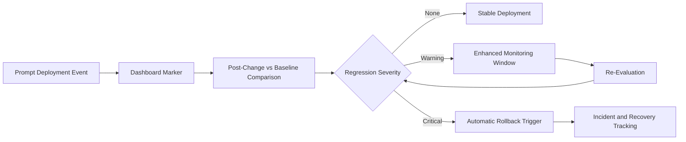

### Prompt Correlation Security and Scalability

- Security posture:
  - Restrict prompt change metadata access to authorized operators.
  - Preserve tamper-evident change history for audits.
  - Require explicit incident review when prompt changes affect safety metrics.
- Scalability posture:
  - Support high-frequency prompt iteration without degrading monitoring freshness.
  - Maintain low-latency correlation updates for responder workflows.
  - Keep dashboards responsive during heavy deployment periods.

## Business Metric Correlation

Business metric correlation ensures AI monitoring reflects user and revenue outcomes, not only technical health.

### Correlation Objectives

- Outcome-first monitoring:
  - Link technical AI quality signals to measurable business outcomes.
  - Detect scenarios where technical metrics appear healthy but business metrics degrade.
  - Prioritize incidents by expected user and revenue impact.
- Bidirectional analysis:
  - Track AI quality impact on business outcomes.
  - Track business signal anomalies that imply hidden AI quality degradation.
  - Use dual-direction views to avoid one-way blind spots.
- Decision enablement:
  - Support operational triage with business impact context.
  - Support product prioritization with reliability risk evidence.
  - Support executive communication during active incidents.

### Core Correlation Pairs

- Task completion and agent success:
  - Correlate user task completion rate with agent run completion success.
  - Alert when task completion drops without matching agent-success changes.
  - Investigate hidden UX or quality friction when divergence appears.
- Retention and response quality:
  - Correlate retention trends with quality score trajectories.
  - Detect lagged retention impact after prolonged quality degradation.
  - Prioritize quality incidents with retention risk indicators.
- Support tickets and hallucination rate:
  - Correlate support ticket volume with hallucination and off-topic response signals.
  - Detect spikes in ticket volume after quality regressions.
  - Use correlation strength to adjust incident severity.
- Revenue per user and task value delivered:
  - Correlate revenue per user with successful high-value agent outcomes.
  - Detect value-delivery degradation before revenue decline is sustained.
  - Track post-mitigation recovery in value signals.
- Churn and quality incidents:
  - Correlate churn events with recent quality degradation incidents.
  - Track churn risk acceleration during unresolved quality incidents.
  - Escalate persistent quality incidents with churn impact.

### Divergence Alerting

- Divergence definition:
  - Trigger alerts when business outcomes diverge from expected trends based on AI quality signals.
  - Trigger alerts when AI quality degrades without immediate business movement to enable early response.
  - Use leading and lagging indicators for balanced decisioning.
- Alert classes:
  - Early divergence warning for mild but sustained mismatch.
  - Critical divergence for high-confidence mismatch with material impact.
  - Executive visibility alerts for incidents with broad business risk.
- Response expectations:
  - Include reliability and product stakeholders in divergence incidents.
  - Define hypothesis-driven investigation steps.
  - Track corrective action impact on both technical and business metrics.

### Correlation Dashboard Patterns

- Bidirectional panel design:
  - AI quality to business outcome panels.
  - Business anomalies to AI root signal panels.
  - Joint timeline with incident and deployment markers.
- Analysis windows:
  - Short windows for active incident diagnosis.
  - Medium windows for release impact analysis.
  - Long windows for strategic reliability planning.
- Segmentation strategy:
  - Segment by user tier, workload class, and geography where relevant.
  - Preserve comparable baselines across segments.
  - Guard against over-segmentation that harms clarity.

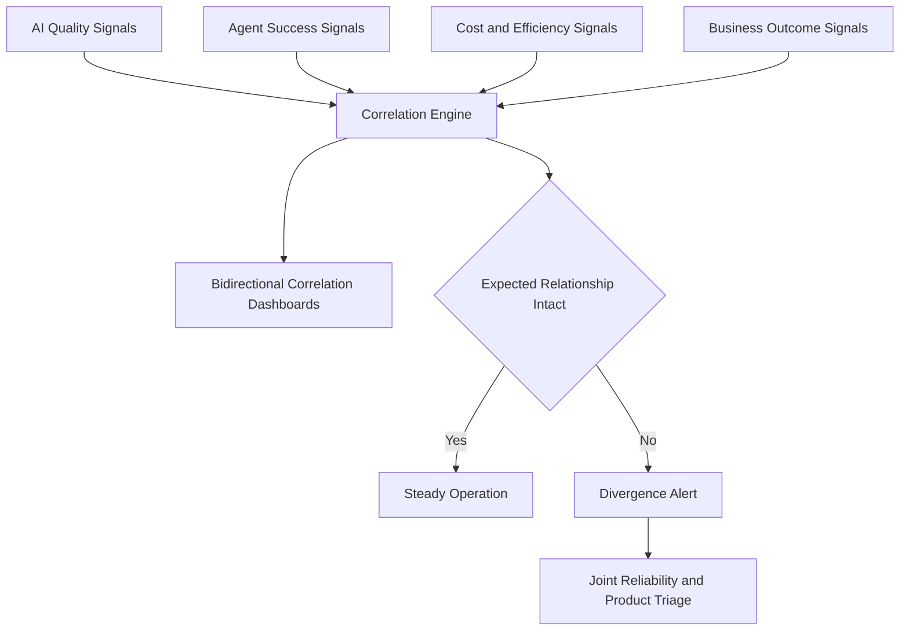

### Business Correlation Scalability and Security

- Scalability:
  - Keep correlation computations incremental for high-volume telemetry.
  - Preserve near-real-time dashboard freshness for responder usage.
  - Prevent correlation workloads from impacting core monitoring paths.
- Security and governance:
  - Apply role-based access to business-sensitive metric views.
  - Mask sensitive cohort dimensions where required.
  - Maintain audit trails for correlation-driven incident decisions.

## Alert Rules and Escalation

Alert design prioritizes fast action for user-impacting issues while minimizing alert fatigue.

### Severity Levels

- Critical:
  - Service down.
  - Error rate above ten percent.
  - Database unreachable.
  - All health checks failing.
  - Action: page immediately.
- Warning:
  - Error rate above two percent.
  - p99 latency above five seconds.
  - Disk usage above eighty percent.
  - Certificate expiration risk within fourteen days.
  - Action: notify team channel.
- Info:
  - Deployment completed.
  - Scaling event detected.
  - Configuration change applied.
  - Action: dashboard record only.

### Alert Routing

- Critical alerts route to immediate paging platforms such as PagerDuty or OpsGenie equivalents.
- Warning alerts route to team notification channels for prompt but non-paging response.
- Info alerts remain visible in operational dashboards for audit and trend context.

### Alert Fatigue Prevention

- Deduplicate repeated alerts within a configurable suppression window.
- Group related alerts by service and dependency topology.
- Silence non-actionable alerts during planned maintenance windows.
- Escalate automatically after acknowledgement timeout.
- Use cooldown intervals after resolution to prevent rapid re-page loops.

### Multi-Window Burn Rate Alerts

- Alert strategy shift:
  - Replace threshold-only alerting with multi-window burn rate policy aligned to error budget governance.
  - Use fast-burn windows to detect acute incidents that can consume monthly budget rapidly.
  - Use slow-burn windows to detect subtle degradation that static thresholds often miss.
- Fast-burn behavior:
  - Evaluate short windows for abrupt reliability impact.
  - Trigger high-urgency paging when burn pace indicates immediate budget threat.
  - Prioritize blast-radius containment actions and rapid mitigation.
- Slow-burn behavior:
  - Evaluate longer windows for sustained low-grade degradation.
  - Trigger warning and escalating policy when degradation persists.
  - Prioritize root-cause elimination before degradation compounds.

### Burn Rate Coverage

- Availability objective burn monitoring:
  - Compute burn rate against availability budget.
  - Trigger critical for severe multi-window violations.
  - Trigger warning for sustained early-stage erosion.
- Latency objective burn monitoring:
  - Compute burn rate on time-to-first-token and tail latency objectives.
  - Catch long-tail regressions that can silently degrade experience.
  - Escalate when latency burn correlates with completion drop.
- Quality objective burn monitoring:
  - Compute burn rate against hallucination budget and sampled quality objectives.
  - Alert when quality degradation pace indicates near-term budget exhaustion.
  - Correlate quality burn with user feedback and abandonment shifts.
- Cost objective burn monitoring:
  - Compute burn rate against budget consumption objectives.
  - Alert on runaway spend pace before hard limits are reached.
  - Trigger cost-protection workflows when critical thresholds are crossed.

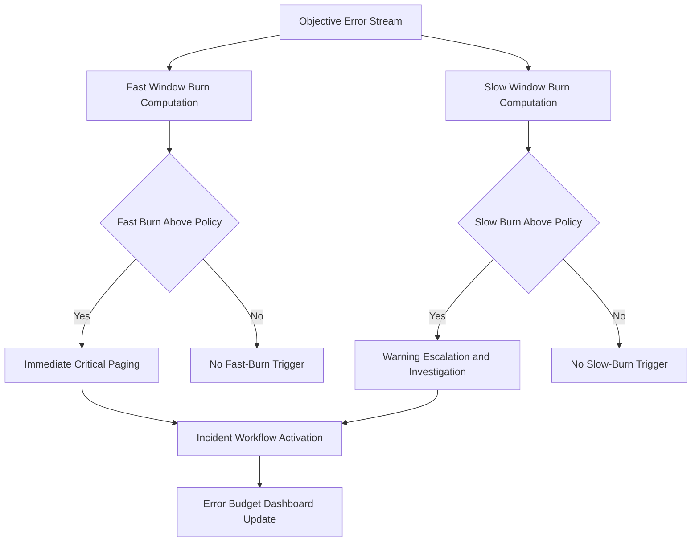

### Error Budget Visibility

- Remaining budget panels:
  - Display remaining budget percentage for availability, latency, quality, and cost objectives.
  - Display projected depletion time under current burn pace.
  - Display trend overlays for burn acceleration and deceleration.
- Decision support:
  - Provide immediate responder view for active incidents.
  - Provide owner view for policy tuning and prevention planning.
  - Provide executive view for risk communication.

## SLA Definitions

SLA targets align with 10M-user reliability expectations and map directly to monitoring signals.

- Availability SLA:
  - 99.9 percent uptime.
  - Downtime budget under 8.7 hours per year.
- Latency SLA:
  - p50 under 200ms to first token.
  - p99 under 2 seconds to first token.
- Error SLA:
  - Under 0.1 percent 5xx errors under normal load.
- Recovery SLA:
  - Mean time to detect under 5 minutes.
  - Mean time to recover under 30 minutes.

### AI SLI Refinement by User Journey

- Agent task completion SLI:
  - Measure percentage of agent runs that complete successfully.
  - Evaluate completion quality, not only transport success.
  - Define objective targets by journey criticality tier.
- Response quality SLI:
  - Measure percentage of sampled responses above quality threshold.
  - Include groundedness, relevance, coherence, and safety dimensions.
  - Tie objective compliance directly to quality budget policy.
- Streaming responsiveness SLI:
  - Measure percentage of requests meeting time-to-first-token objective.
  - Segment by journey and region to detect localized degradation.
  - Track streaming responsiveness independently from total response time.
- Tool call reliability SLI:
  - Measure percentage of tool calls succeeding on first attempt.
  - Segment by tool family and dependency type.
  - Tie sustained drops to incident escalation policy.
- Memory retrieval accuracy SLI:
  - Measure percentage of memory reads returning relevant context.
  - Track freshness and relevance jointly for accuracy confidence.
  - Escalate low-accuracy trends for user-impact prevention.

### Objective Model for Refined SLIs

- Multi-objective governance:
  - Assign each refined SLI an explicit objective target and error budget.
  - Prevent global averages from masking journey-specific failures.
  - Review target calibration on fixed operating cadence.
- Burn policy alignment:
  - Attach multi-window burn alerts to each refined SLI objective.
  - Use fast-burn and slow-burn windows for each objective.
  - Route alerts to journey owners and reliability responders together.
- Security and scalability alignment:
  - Include security-sensitive journeys in stricter objective policies.
  - Preserve objective computation performance at peak telemetry volume.
  - Keep label cardinality controlled for reliable long-window analysis.

### SLA Monitoring Model

- Rolling-window SLA calculations for availability, latency, and error compliance.
- Automatic SLA breach alerts tied to severity and error budget policy.
- Monthly SLA reporting across both library-facing and server-facing reliability dimensions.
- Error budget tracking with remaining downtime and burn-rate indicators.
- Refined SLI reporting includes agent completion, response quality, streaming responsiveness, tool reliability, and memory retrieval accuracy.
- SLA reviews include security and scalability risk posture for each user journey objective.

## Dashboards

Dashboards are role-focused to support executive visibility, responder diagnosis, and service-owner optimization.

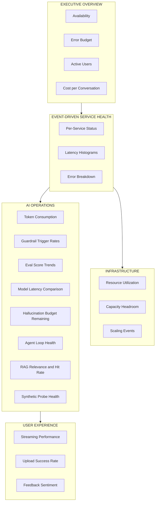

### Dashboard Categories

- Executive Overview:
  - Availability.
  - Error budget remaining.
  - Active users.
  - Cost per conversation.
- Service Health:
  - Per-service status.
  - Latency histograms.
  - Error-class and endpoint breakdowns.
- Infrastructure:
  - Resource utilization.
  - Capacity headroom.
  - Scaling event timeline.
- AI Operations:
  - Token consumption.
  - Guardrail trigger rates.
  - Eval score trends.
  - Model latency comparison.
  - Hallucination budget remaining.
  - Agent loop depth and stuck-state trend.
  - RAG relevance, hit rate, and context precision trend.
  - Synthetic probe pass rate and failover readiness trend.
- Reliability Economics:
  - Daily budget burn pace.
  - Model mix shift trend.
  - Input-to-output token ratio anomaly trend.
  - Cost objective burn trajectory.
- Prompt Operations:
  - Prompt deployment markers overlaid on quality, cost, and latency trends.
  - Post-deployment regression comparison windows.
  - Rollback trigger events and recovery trajectories.
- AI Security Operations:
  - Prompt injection detection and false positive trend.
  - Jailbreak attempt clustering trend.
  - PII-in-output zero-tolerance incidents.
  - Guardrail effectiveness activation trend.
- Business Correlation:
  - Agent success versus task completion correlation.
  - Quality trend versus retention trend.
  - Hallucination trend versus support ticket volume.
  - Quality incident trend versus churn events.
- User Experience:
  - Streaming performance.
  - Upload success rate.
  - Feedback sentiment trend.

### Dashboard Design Principles

- Keep each dashboard aligned to one decision horizon: executive, tactical, or operational.
- Keep freshness high on real-time responder panels.
- Keep long-window views for capacity and cost forecasting.
- Keep breakdowns available by service, region, and user tier where relevant.
- Keep deployment markers visible across quality, latency, and cost views for rapid regression attribution.
- Keep burn-rate panels adjacent to objective panels so budget risk is visible during triage.
- Keep role-based access controls strict on security and business-sensitive dashboard slices.

## Status Page

Status communication is public-facing and incident-aware, with component-level transparency and timeline continuity.

- Public status page shows current platform health.
- Component-level status covers API, Streaming, Upload, Search, and Memory.
- Historical uptime charts provide trust and accountability.
- Incident timelines capture detection, investigation, mitigation, and recovery updates.
- Planned maintenance announcements are scheduled and visible ahead of impact.
- Subscription options support email and webhook notifications for status changes.

Status update policy:
- Start incident communication early, even before full root cause certainty.
- Update at defined cadence during active incidents.
- Publish final resolution summary when service is stable.
- Link internal incident records to public timeline entries for audit integrity.

## Incident Response Procedures

Incident response standardizes decisions under pressure and minimizes recovery time.

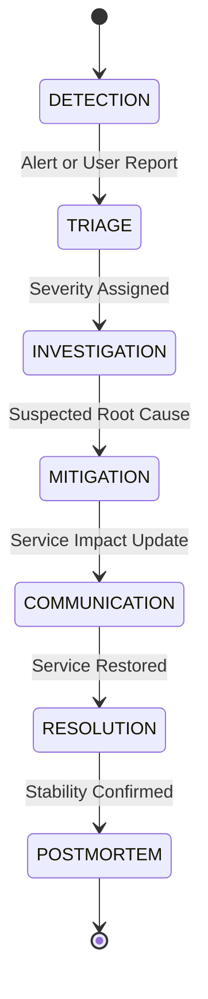

### Incident Lifecycle

1. Detection:
   - Automated alert fires or user report is received.
2. Triage:
   - Classify severity as critical or warning and assign incident commander.
3. Investigation:
   - Use monitoring dashboards for blast radius and observability traces for cause isolation.
4. Mitigation:
   - Apply fix, rollback, traffic shift, or controlled workaround.
5. Communication:
   - Update status page and notify affected users when impact is material.
6. Resolution:
   - Confirm service restoration and clear active alerts.
7. Post-mortem:
   - Run blameless review, document root cause, and track preventive actions.

### Incident Governance

- Incident commander owns tactical coordination and decision tempo.
- Communications lead owns external and internal status updates.
- Service owner owns technical mitigation path.
- Scribe captures timeline, decisions, and action items for post-mortem completeness.

## Runbook Templates

Runbooks provide pre-approved response playbooks for high-frequency or high-impact failures.

- Database connection exhaustion:
  - Identify pool saturation and runaway query patterns.
  - Apply connection pressure relief and query isolation controls.
- AI provider rate limiting or outage:
  - Detect provider-side saturation, shift traffic policy, and apply degraded-response mode.
- Memory or disk pressure on application servers:
  - Trigger autoscaling or controlled traffic shedding before hard failure.
- SSE connection storms:
  - Detect abnormal connection spikes, cap concurrent streams, and protect core request paths.
- Guardrail false-positive spike:
  - Detect abrupt block-rate increase and apply temporary policy safeguards with audit review.
- Valkey failure and fallback behavior:
  - Validate fallback activation and monitor risk window for rate-limit and budget enforcement drift.
- Queue worker backlog buildup:
  - Detect queue growth, rebalance workers, and prioritize user-visible workloads.
- Certificate expiration risk:
  - Trigger renewal escalation before service trust impact.

Runbook template fields:
- Trigger conditions.
- Detection signals.
- Initial containment actions.
- Mitigation steps.
- Verification and recovery checks.
- Communication requirements.
- Follow-up prevention actions.

## On-Call Rotation

On-call operations require explicit ownership, escalation clarity, and handoff discipline.

- Rotation structure includes primary and secondary responders.
- Escalation path is primary to secondary to engineering lead.
- Shift handoffs include active incidents, known risks, and pending follow-up actions.
- Access requirements include alerting platform, dashboards, status communication tools, and incident records.
- Coverage policy ensures no single point of responder failure.

On-call quality controls:
- Measure alert load per shift and adjust noisy rules.
- Track acknowledgement and response time by severity.
- Run regular incident drills for critical scenarios.

## Capacity Monitoring and Forecasting

Capacity monitoring prevents reliability regressions as adoption grows from daily baseline to burst traffic windows.

- Track utilization trends daily, weekly, and monthly across compute, storage, and queue systems.
- Alert before resource exhaustion using pre-saturation thresholds.
- Forecast growth from user acquisition and workload intensity trends.
- Forecast cost from token usage, storage growth, and background job expansion.
- Recommend scaling triggers from sustained utilization and latency pressure.

Forecasting dimensions:
- Baseline 1 percent daily active usage profile.
- Burst headroom up to 10 percent daily active usage.
- Dependency-specific bottleneck projections for Postgres, Valkey, object storage, and background execution.
- Reliability impact modeling for slow-burn saturation and sudden event-driven spikes.

## Cross-References

| Plan File | Relevant Scope | How It Connects To This Document |
|---|---|---|
| 14 — Observability | Langfuse tracing, structured logging, Promptfoo eval, post-hoc diagnostics | Monitoring detects live incidents and SLA risk; observability explains root cause and validates mitigation outcomes |
| 06 — Agents & Orchestration | Agent execution model, tool routing, handoff semantics, memory workflows | Monitoring tracks live agent loop depth, plan drift, handoff reliability, and tool success as production reliability signals |
| 15 — Infrastructure | Service topology, degradation model, health checks, rate limiting, circuit breaker | Monitoring consumes infrastructure health and saturation signals, then routes actionable alerts and escalation workflows |
| 12 — Server Implementation | Health endpoint semantics, dependency checks, middleware reliability behavior | Monitoring uses server health outputs as core availability signals and incident trigger inputs |
| 21 — Release Pipeline | Deployment stages, canary and rollback, operational pipeline monitoring | Monitoring governs deployment safety, canary promotion confidence, and rollback decision thresholds |

Integration notes:
- Monitoring coverage spans both safeagent and server operational surfaces.
- Alert thresholds must align with release gates and rollback controls.
- Incident workflows must consume health signals and observability diagnostics together.
- Status communication must reflect both user impact and mitigation progress.
- Monitoring owns live production quality and security objective enforcement, while observability owns deep trace diagnostics and post-hoc analysis.
- Data access layer reliability signals from Drizzle ORM for PostgreSQL and surqlize for SurrealDB are first-class inputs for AI monitoring objectives.

## Task Specifications

### MONITORING_INFRA

**Task Name**
- MONITORING_INFRA

**Objective**
- Establish production-grade monitoring infrastructure, dashboards, health aggregation, alert routing, and status communication for real-time reliability management.

**What To Do**
- Set up pull-based metric collection across application and infrastructure layers.
- Define and publish health checks for shallow and deep dependency states.
- Configure severity-based alert rules with deduplication, grouping, silencing, and escalation.
- Build dashboard suites for executive, service, infrastructure, AI operations, and user experience views.
- Launch public status communication with component-level health and incident timelines.
- Wire SLA tracking, error budget calculations, and monthly reliability reporting.
- Add live LLM quality monitoring with sampled evaluator scoring, hallucination objective tracking, and regression detection.
- Add agentic workflow monitoring for loop depth, plan drift, stuck-state detection, tool reliability, and handoff failures.
- Add RAG monitoring for relevance, hit rate, context precision, embedding drift, and vector search latency objectives.
- Add AI security monitoring for prompt injection, indirect injection, jailbreak attempts, guardrail effectiveness, and zero-tolerance sensitive output detection.
- Add synthetic probes for golden prompts, end-to-end agent workflows, RAG known-query validation, and provider failover readiness.
- Add token cost anomaly detection for per-user spikes, feature regressions, budget burn pace, model mix shifts, and runaway sessions.
- Add prompt deployment correlation markers with regression detection and rollback trigger policy.
- Add business correlation dashboards linking AI quality signals to retention, support, revenue, and churn outcomes.
- Ensure multi-window burn-rate alerts cover availability, latency, quality, and cost objectives.

**Depends On**
- INFRASTRUCTURE
- SERVER_ROUTES
- OBSERVABILITY_TRACING

**Batch**
- 9

**Acceptance Criteria**
- Metrics collection is running continuously for application, infrastructure, and business signals.
- Dashboards are populated and segmented by responder and stakeholder needs.
- Health checks report accurate per-service and fleet-level status.
- Alert rules are configured for critical, warning, and info severities with escalation behavior.
- Public status page is live with component health visibility and incident timeline support.
- SLA and error budget calculations are available in rolling windows.
- LLM quality monitoring samples live responses and tracks groundedness, relevance, coherence, and safety with time-series regression detection.
- Hallucination objective remains under target with burn-rate alerting active for budget risk.
- Agent workflow dashboards expose loop depth, stuck-state rate, plan drift, tool success rate, handoff failures, and memory access relevance.
- RAG dashboards expose relevance, hit rate, context precision, chunk utilization, embedding drift indicators, and vector latency objective compliance.
- Security dashboards expose injection detection rate, false positive trend, jailbreak attempts, guardrail effectiveness, and sensitive-output incidents.
- Synthetic probes run on required cadence with alerting for degraded canary quality and failed failover checks.
- Cost anomaly detection catches per-user spikes, feature regressions, model mix shifts, and runaway session spend.
- Prompt deployment markers and automated post-change regression analysis are visible across operational dashboards.
- Business correlation dashboards expose bidirectional AI quality and business outcome signals with divergence alerts.

**QA Scenarios**
- Simulate service outage and verify critical paging within target detection window.
- Simulate latency degradation and verify warning notification behavior.
- Simulate repeated threshold breaches and verify deduplication and grouping.
- Simulate planned maintenance and verify alert silencing behavior.
- Trigger component-level degradation and verify status page updates.
- Validate dashboard data freshness during sustained traffic.
- Simulate hallucination spike in sampled traffic and verify quality burn-rate alerts and incident activation.
- Simulate agent loop runaway and verify loop-depth alert plus session cost circuit-breaker activation.
- Simulate tool dependency degradation and verify per-tool reliability drop appears in responder dashboard.
- Simulate memory contamination signal and verify immediate critical escalation to security responders.
- Simulate retrieval relevance collapse and verify RAG objective alerts fire independently from model latency alerts.
- Simulate golden prompt canary regression and verify warning then critical escalation across windows.
- Simulate provider failover probe failure and verify incident workflow enters mitigation state.
- Simulate post-prompt-change quality drop and verify automated regression detection and rollback trigger event.
- Simulate business divergence where retention drops despite stable latency and verify correlation alerting.

**Implementation Notes**
- Keep alert rules risk-based and user-impact oriented.
- Keep dashboard ownership explicit to prevent stale operational surfaces.
- Keep threshold policy adjustable as traffic patterns evolve.

### INCIDENT_PROCEDURES

**Task Name**
- INCIDENT_PROCEDURES

**Objective**
- Define incident response lifecycle, escalation policy, on-call rotation, and scenario runbooks to minimize recovery time and user impact.

**What To Do**
- Define incident lifecycle from detection through post-mortem with ownership roles.
- Document severity model, escalation chain, and acknowledgement timeouts.
- Create and maintain runbooks for critical operational failure patterns.
- Establish primary and secondary on-call rotation with shift handoff process.
- Define status communication procedure for user-facing incident updates.
- Validate incident drills for high-risk scenarios and response readiness.
- Extend incident playbooks for AI-specific reliability events including quality regressions, hallucination burn, and prompt deployment regressions.
- Extend security incident handling for prompt injection campaigns, jailbreak clusters, and sensitive-output leaks.
- Extend cost-protection incident handling for runaway agent sessions and budget burn acceleration.
- Add synthetic monitoring incident drills for canary degradation, RAG probe failures, and provider failover failures.
- Define cross-functional triage protocol for business divergence incidents tied to AI quality signals.

**Depends On**
- MONITORING_INFRA

**Batch**
- 10

**Acceptance Criteria**
- Runbooks are documented for all required common scenarios.
- Escalation paths are defined and tested for acknowledgement timeout handling.
- On-call rotation is established with primary and secondary coverage.
- Status communication workflows are validated during incident simulation.
- Post-mortem template is standardized and used for severe incidents.
- AI quality incident runbooks cover hallucination spikes, relevance collapse, and consistency drift.
- Agentic incident runbooks cover runaway loops, stuck-state storms, handoff failures, and memory contamination alerts.
- Security incident runbooks cover direct and indirect injection surges, jailbreak campaigns, and sensitive-output leak response.
- Prompt deployment incident runbooks cover regression detection, rollback decisioning, and post-rollback verification windows.
- Cost incident runbooks cover budget burn acceleration, model mix shifts, and per-session runaway spend containment.
- Incident drill program includes synthetic probe failure scenarios and business divergence scenarios.

**QA Scenarios**
- Trigger simulated critical outage and verify full incident lifecycle execution.
- Trigger simulated warning event and verify non-paging response flow.
- Execute handoff between on-call shifts during active incident and verify continuity.
- Run certificate-risk scenario and verify pre-expiry escalation behavior.
- Run queue backlog scenario and verify mitigation and communication sequence.
- Trigger simulated hallucination burn event and verify fast-burn paging plus quality containment workflow.
- Trigger simulated slow-burn quality drift and verify warning escalation with prevention-focused mitigation.
- Trigger simulated agent stuck-state storm and verify runbook-driven containment and recovery validation.
- Trigger simulated memory contamination alert and verify immediate security escalation and strict closure checks.
- Trigger simulated injection campaign and verify security triage, communications cadence, and guardrail effectiveness review.
- Trigger simulated prompt deployment regression and verify rollback path and recovery confirmation.
- Trigger simulated provider failover probe failure and verify failover readiness mitigation runbook.
- Trigger simulated business divergence incident and verify joint reliability and product triage workflow.

**Implementation Notes**
- Keep response ownership unambiguous at every incident stage.
- Keep runbooks concise, action-first, and drill-validated.
- Keep post-mortem follow-ups tracked to completion.

### Delivery Checklist

- Monitoring stack established with pull-based metrics and push-based alerting.
- Health checks cover process, dependency, and fleet aggregation states.
- Alerting severity model, routing, deduplication, and escalation are active.
- SLA and error budget tracking are integrated into operational reporting.
- Dashboard suite covers executive, service, infrastructure, AI operations, and user experience needs.
- Status page is live with component health, incident timeline, and maintenance notices.
- Incident lifecycle and runbook templates are documented and tested.
- On-call rotation and escalation chain are operational.
- LLM quality monitoring is active with sampled scoring, hallucination objective tracking, and regression detection.
- Agentic workflow monitoring is active for loop depth, plan drift, stuck-state detection, tool reliability, and handoff reliability.
- RAG monitoring is active for relevance, hit rate, context precision, embedding drift, and vector latency objectives.
- AI security monitoring is active for injection detection quality, jailbreak patterns, guardrail effectiveness, and sensitive-output zero-tolerance alerts.
- Multi-window burn-rate alerting is active for availability, latency, quality, and cost objectives with visible remaining budget percentages.
- Synthetic probes run on scheduled cadence for golden prompts, end-to-end workflows, RAG known queries, and provider failover readiness.
- Token cost anomaly detection is active for user spikes, feature regressions, model mix shifts, context utilization anomalies, and runaway sessions.
- Prompt deployment correlation is active with dashboard markers, regression windows, and rollback trigger policies.
- Business correlation dashboards are active with divergence alerts linking AI quality shifts to user and revenue outcomes.

*Previous: 21 — Release Pipeline*
