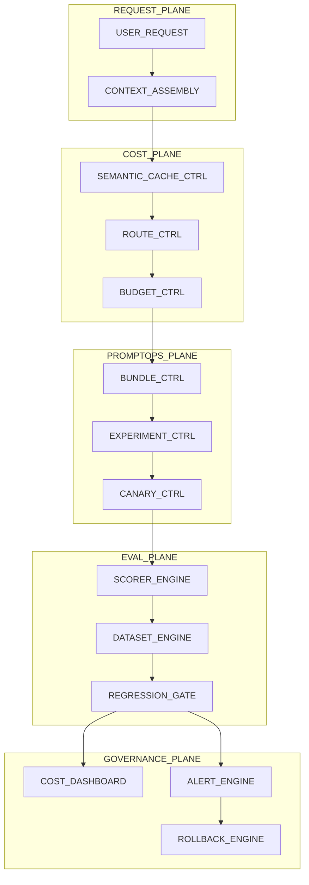
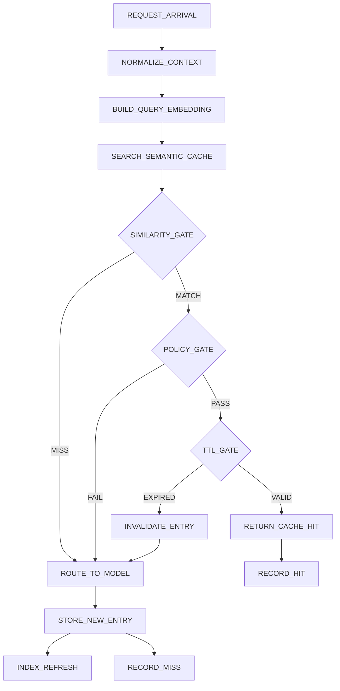
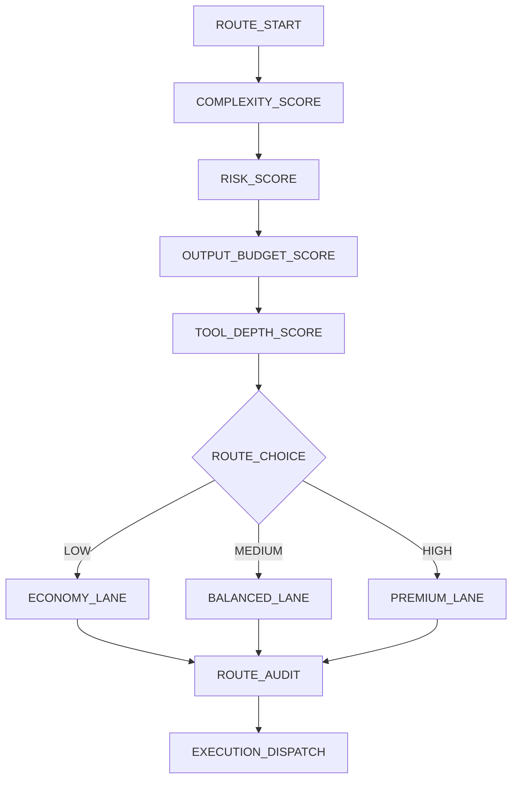
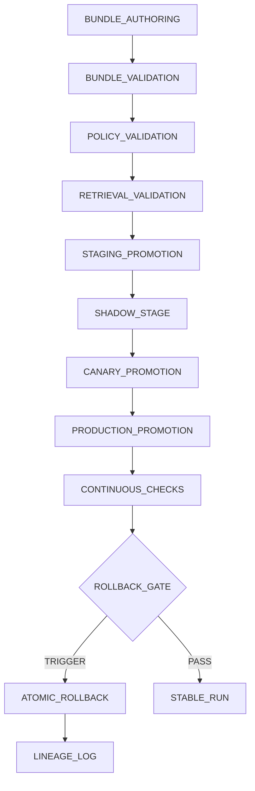
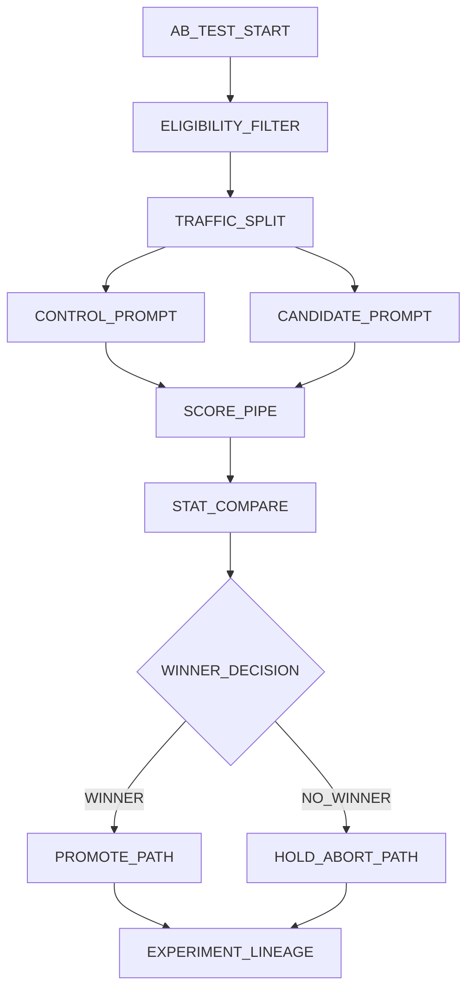
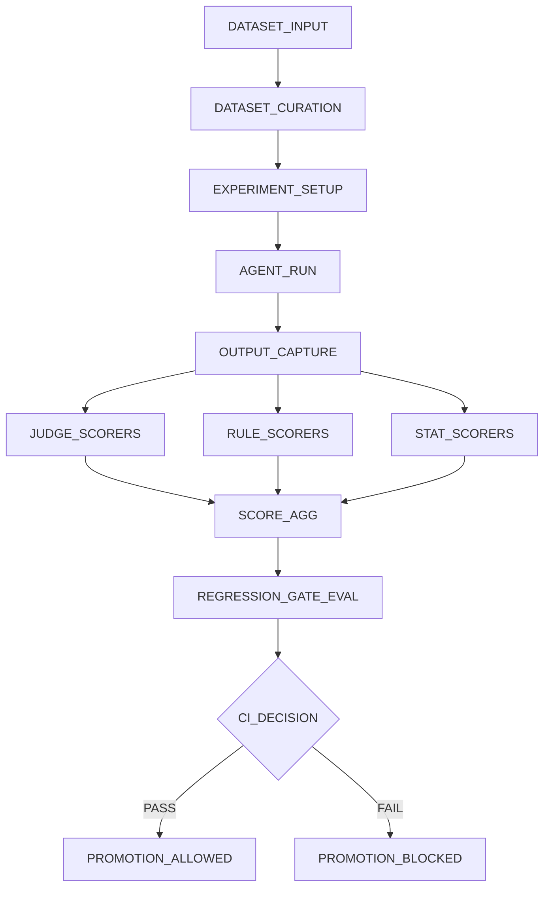

# 26 — AI Operations Plan
> **Scope**: AI operations for safeagent at 10M-user scale covering cost intelligence, prompt lifecycle governance, and agent evaluation with strict safety and rollback controls.
>
> **Tasks**: COST_INTELLIGENCE_LAYER, PROMPT_LIFECYCLE_LAYER, AGENT_EVAL_LAYER, AIOPS_RUNTIME_GOVERNANCE
---
## Table of Contents
- [Architecture Overview](#architecture-overview)
- [Operating Principles](#operating-principles)
- [Cost Intelligence Layer](#cost-intelligence-layer)
- [Semantic Caching](#semantic-caching)
  - [Scale Design at 10M Users](#scale-design-at-10m-users)
- [Dynamic Model Routing](#dynamic-model-routing)
- [Prompt Caching Architecture](#prompt-caching-architecture)
- [Per-Agent Cost Attribution and Budget Contracts](#per-agent-cost-attribution-and-budget-contracts)
- [LLM Gateway Patterns](#llm-gateway-patterns)
- [Token Economics Awareness](#token-economics-awareness)
- [Prompt Lifecycle Management (PromptOps)](#prompt-lifecycle-management-promptops)
- [Atomic Bundle Rollout](#atomic-bundle-rollout)
- [Prompt A/B Testing](#prompt-ab-testing)
- [Shadow Mode](#shadow-mode)
- [Canary for AI Behavior](#canary-for-ai-behavior)
- [Prompt Environment Promotion](#prompt-environment-promotion)
- [Prompt Lineage](#prompt-lineage)
- [Prompt Playground](#prompt-playground)
- [Agent Evaluation Framework](#agent-evaluation-framework)
- [LLM-as-Judge Scorers](#llm-as-judge-scorers)
- [Rule-Based Scorers](#rule-based-scorers)
- [Statistical Scorers](#statistical-scorers)
- [Eval Datasets](#eval-datasets)
- [Experiments and Regression Detection](#experiments-and-regression-detection)
- [CLASSic Framework](#classic-framework)
- [CI Integration and Eval Gates](#ci-integration-and-eval-gates)
- [Operational Concerns](#operational-concerns)
- [Cache Warming Strategy](#cache-warming-strategy)
- [Cost Dashboard Design](#cost-dashboard-design)
- [Alert Thresholds for Cost Anomalies](#alert-thresholds-for-cost-anomalies)
- [Eval Dataset Freshness and Maintenance](#eval-dataset-freshness-and-maintenance)
- [Prompt Rollout Decision Framework](#prompt-rollout-decision-framework)
- [Scalability and Security Guardrails](#scalability-and-security-guardrails)
  - [Runtime Baseline Constraints](#runtime-baseline-constraints)
- [Cross-References](#cross-references)
- [Task Specifications](#task-specifications)
- [Delivery Checklist](#delivery-checklist)
- [Navigation](#navigation)

## Architecture Overview
AI operations at 10M users requires an active control loop, not passive telemetry.
This plan extends existing prompt retrieval, budget tracking, and deployment markers with the missing proactive layers.
- Cost controls act before tokens are spent.
- Behavior controls govern prompt changes as release artifacts.
- Eval controls block regressions before rollout and detect drift after rollout.
- Safety constraints remain non-bypassable on every route.
- Rollback remains fast and complete for behavior artifacts.

## Operating Principles
- Proactive optimization outranks reactive correction.
- Risk controls are explicit and audited.
- Rollout decisions are data-backed and reversible.
- Cost visibility exists at agent, user, and workflow levels.
- Eval signals must be reproducible and attributable.
- Prompt change governance matches release rigor.
- Scalers and guardrails are both first-class.
- PostgreSQL interactions remain Drizzle ORM only.

## Cost Intelligence Layer
At 10M users, unconstrained task cost can reach 0.30 USD.
Cost intelligence combines semantic reuse, routing, and prompt cache strategy to reduce spend while preserving quality.
Combined target: 47 percent sustained reduction from semantic cache plus routing, with additional 45 to 80 percent reduction where provider prompt cache hits are optimized.
- Route to cheapest valid path first.
- Reuse prior outputs when semantic equivalence is safe.
- Enforce budget contracts during execution.
- Attribute every cost-bearing event.
- Shape outputs to reduce expensive token expansion.

### Cost Control Surfaces
- Semantic response reuse.
- Complexity-aware lane routing.
- Prompt-prefix cache optimization.
- Runtime budget contracts.
- Provider selection intelligence.
- Output token discipline.

## Semantic Caching
Semantic caching reuses meaning-equivalent responses, including paraphrases.
Reuse is accepted only after similarity, policy, TTL, and scope checks.
- Similarity threshold is configurable by risk tier.
- TTL policy follows content volatility.
- Invalidation reacts to behavior and data change.
- Reuse requires current policy compatibility.
- Reuse requires authorization compatibility.

### Threshold and TTL Policy
- Strict threshold for high-risk workflows.
- Moderate threshold for low-risk informational flows.
- Short TTL for volatile business-state content.
- Medium TTL for stable guidance.
- Long TTL for durable reference content.

### Invalidation Triggers
- Retrieval source updates.
- Policy rule updates.
- Prompt bundle promotion.
- Authorization scope change.
- Eval drift alarms.

### Scale Design at 10M Users
- Semantic cache partitions SHALL be tenant-aware and workload-segmented to contain blast radius.
- Sharding strategy SHALL preserve locality for assignment keys while supporting horizontal expansion.
- Admission policy SHALL prioritize high-reuse intents and reject low-confidence long-tail inserts under pressure.
- Eviction policy SHALL combine recency, reuse value, and risk tier to protect high-safety entries.
- Hot and cold tiers SHALL be maintained with explicit promotion and demotion criteria.
- Lookup latency budget SHALL be enforced before generation dispatch, with miss fallback when budget is exceeded.
- Invalidation propagation SHALL execute after bundle, policy, or retrieval-data changes with bounded propagation delay.

### Safety Protections
- Re-run guardrail checks on cache hits.
- Reject hit when workflow state differs materially.
- Reject hit when dependent tool-state changes.
- Preserve provenance metadata for audit.
- Keep semantic cache isolated by tenant and user scope.

### Expected Outcomes
- Hit-rate target segmented by intent families.
- 47 percent savings target supported when paired with routing.
- False-positive reuse monitored as quality risk.
- Savings split by semantic and prompt cache channels.
- Tail-latency improvement tracked with spend reduction.

## Dynamic Model Routing
Dynamic routing is proactive cost-based lane selection.
It is not fallback-on-failure logic.
- Score complexity before generation.
- Score risk before generation.
- Estimate output budget and tool depth.
- Select lowest-cost lane meeting quality and safety requirements.
- Emit route rationale for analysis.

### Routing Inputs
- Intent class and precision requirement.
- Safety sensitivity class.
- Context size and grounding burden.
- Expected tool-chain complexity.
- Provider health and quota headroom.

### Routing Guardrails
- Never bypass policy floor.
- Never exceed active budget contract.
- Never choose lane missing required capability.
- Never ignore provider degradation state.
- Always store route reason tags.
- Pre-generation routing decision latency SHALL remain within a defined budget under steady-state and burst traffic.
- Burst behavior SHALL prioritize policy-safe degradation over queue explosion.
- Stale routing signals SHALL be quarantined from routing decisions until refreshed.
- Stale provider-health state SHALL force conservative lane selection until fresh health evidence is available.

### Routing Metrics
- Lane efficiency score.
- Lane regret rate.
- Misclassification heat map.
- Lane stability under burst.
- Cost per successful task.

## Prompt Caching Architecture
Prompt caching strategy is designed to maximize provider-level cache hits.
This extends existing prompt retrieval caching by optimizing prompt composition.
- Prompt fetch and baseline retrieval caching are owned in file 14; this plan adds provider-cache-aware assembly policy and governance boundaries.
- Stable policy and instruction prefix.
- Dynamic user context in bounded tail.
- Deterministic evidence ordering.
- Minimize non-deterministic prefix elements.
- Track miss causes by assembly stage.

### Prefix Optimization
- Keep invariant policy blocks first.
- Keep ordering deterministic.
- Keep wording stable across rollout windows.
- Exclude dynamic metadata from prefix.
- Reuse normalized retrieval headers.

### Cache-Aware Assembly
- Separate cacheable and dynamic segments.
- Canonicalize evidence bundle shape.
- Cap dynamic tail growth for repeated workflows.
- Reuse normalized summaries when evidence unchanged.
- Emit per-segment hit probability telemetry.

### Expected Impact
- 45 to 80 percent reduction on repeated prompt-heavy workflows.
- Savings reported independently from semantic reuse.
- Cold windows after rollout are expected and measured.
- Warmup plan targets rapid cache recovery.
- Prefix-hit trend is an optimization KPI.

## Per-Agent Cost Attribution and Budget Contracts
Attribution and enforcement are implemented together.
- Cost tracked per agent run.
- Cost tracked per user and segment.
- Cost tracked per workflow lifecycle.
- Tool and retry overhead included.
- Contract breach events are alertable.

### Budget Contract Fields
- Max run cost.
- Max workflow cost.
- Max reasoning steps.
- Max tool calls.
- Max output token allowance.
- Max retry allowance.

### Enforcement Behavior
- Soft ceiling triggers compression and warning.
- Hard ceiling triggers controlled stop or handoff.
- Step cap prevents runaway loops.
- Tool cap limits action storms.
- Breach reason always recorded.

## LLM Gateway Patterns
Gateway policy optimizes blended provider cost while preserving reliability and safety.
- Provider selection by cost, health, and quota context.
- Fair queueing during throttling.
- Dynamic lane balancing under burst.
- Bounded retry policy.
- Safe failover to alternate lanes.

### Selection Strategy
- Filter by capability and policy compatibility.
- Rank by expected cost and latency.
- Penalize unstable lanes dynamically.
- Factor queue depth and quota headroom.
- Prefer sticky routing where cache locality helps.

### Rate-Limit Handling
- Per-provider and global rate buckets.
- Priority lanes for critical workflows.
- Jittered bounded retries.
- Overflow routing to eligible alternates.
- Tenant fairness policy enforcement.

### Gateway Telemetry
- Selection reason traces.
- Queue wait distributions.
- Quota exhaustion forecast.
- Retry amplification trend.
- Failover quality parity checks.

## Token Economics Awareness
Output tokens often carry a 4:1 premium.
Output control policies reduce spend without degrading utility.
- Favor concise structured responses.
- Avoid repetitive narrative.
- Compress intermediate tool summaries.
- Apply verbosity profiles by intent class.
- Track usefulness-to-cost ratio.

### Output Control Policies
- Adaptive compression near budget edge.
- Summary-first synthesis for verbose chains.
- Progressive disclosure for optional detail.
- Output-token cap by workflow class.
- Drift alert on verbosity expansion.

## Prompt Lifecycle Management (PromptOps)
PromptOps governs behavior changes with release-grade controls.
This extends existing prompt management with atomic bundles, experiments, shadow validation, canary controls, and immutable lineage.
- Bundle dependent behavior artifacts together.
- Gate promotions with eval and safety checks.
- Validate in shadow before user impact.
- Roll out with canary and automatic rollback triggers.
- Maintain immutable change lineage.

## Atomic Bundle Rollout
Atomic bundle includes prompt, tool schema, policy rules, retrieval config, and eval/judge config revision.
All move together and roll back together.
- Immutable after publish.
- Contract validation required.
- Lane-based promotion.
- One-step rollback.
- Marker emission for monitoring.
- Behavior-atomic linkage SHALL bind prompt, tools, policy, retrieval configuration, scorer configuration, and judge prompt revision as one release artifact.
- Rollback SHALL restore the complete linked artifact set with no partial behavior state.

### Bundle Validation Rules
- Prompt assumptions match tool schemas.
- Policy posture cannot weaken baseline.
- Retrieval settings preserve grounding floor.
- Risk metadata required.
- Rollback ownership required.
- Bundle capture SHALL include immutable dataset snapshot identifiers and experiment manifest references required for reproducibility.

### Rollback Guarantees
- Full artifact rollback with no partial state.
- Immediate post-rollback verification.
- Rollback marker correlated in monitoring.
- Rollback reason captured in lineage.
- Regular rollback rehearsal.

## Prompt A/B Testing
A/B testing compares prompt bundles with controlled traffic and statistical confidence.
- Deterministic traffic split.
- User stickiness per experiment.
- Shared scorer stack across lanes.
- Guard-metric early-stop policy.
- Confidence-based winner decision.
- Assignment key strategy SHALL be declared before launch and remain stable through the observation window.
- Sample-ratio checks SHALL run continuously and SHALL pause inference when allocation drift exceeds guardrails.
- Experiment spend caps SHALL enforce hard ceilings at scale and trigger controlled hold when breached.
- Overlapping experiment rules SHALL prevent assignment collisions and metric contamination.

### Experiment Policy
- Declare primary metric before launch.
- Declare guard metrics and stop criteria.
- Declare sample size and observation window.
- Declare experiment spend cap.
- Prevent overlapping contamination.

### Winner Criteria
- Primary metric improvement.
- No critical safety regression.
- Cost delta within guard-band.
- Latency within tolerance.
- Confidence threshold met.

## Shadow Mode
Shadow mode runs candidate behavior in parallel with production behavior.
User-visible output remains production output during shadow.
- Compare quality, safety, latency, and cost deltas.
- Compare tool-call validity.
- Record divergence categories.
- Feed canary readiness decisions.
- Run asynchronously to avoid user latency impact.
- Sampling strategy SHALL be risk-tiered and quota-bounded for high-volume traffic.
- Async queue policy SHALL define backlog ceilings, priority classes, and expiration for stale comparisons.
- Judge traffic cost caps SHALL be enforced independently from production serving budgets.
- Throughput controls SHALL throttle non-critical shadow traffic before impacting production-critical workloads.
- Degraded mode SHALL reduce comparison depth when judge capacity lags while preserving critical safety checks.

### Shadow Exit Criteria
- Required sample volume reached.
- Safety parity maintained.
- Quality delta acceptable.
- Cost delta acceptable.
- Stability under burst confirmed.

## Canary for AI Behavior
Canary shifts traffic gradually with automatic rollback when thresholds breach.
- Begin with small exposure.
- Increase in staged increments.
- Hold windows between increments.
- Rollback on policy, quality, or cost breach.
- Capture markers for each increment.

### Automatic Rollback Triggers
- Policy violation rate surge.
- Composite quality drop.
- Cost-per-success spike.
- Tool validity failure spike.
- Sustained latency regression.

## Prompt Environment Promotion
Promotion flow is development -> staging -> production with rollback on each boundary.
- Development for rapid, isolated iteration.
- Staging for integrated validation.
- Production for canary-controlled exposure.
- Promotions require gate pass.
- Rollback is always available.

### Promotion Gates
- Contract compatibility.
- Policy and safety.
- Eval quality.
- Cost guard-band.
- Operational readiness.

## Prompt Lineage
Lineage provides immutable records for behavior changes.
- Who authored the change.
- Who approved the change.
- What changed and why.
- Which gates passed or failed.
- When promotions and rollbacks occurred.

### Compliance Value
- Audit replay for investigations.
- Regulatory evidence for change control.
- Root-cause support for regressions.
- Accountability for repeated incidents.
- Continuous improvement for rollout decisions.

## Prompt Playground
Playground supports side-by-side iteration outside production lanes.
- Isolated traffic and budgets.
- Deterministic representative input sets.
- Comparative quality and cost views.
- Safety preview before promotion proposal.
- Governed export to rollout lanes.

## Agent Evaluation Framework
Evaluation combines semantic judgment, deterministic checks, and statistical analysis.
It runs in pre-rollout suites and sampled live traffic windows.
- Composable scorer runtime.
- Dataset governance with item tracking.
- Experiment runner with baseline deltas.
- Regression gates linked to CI.
- CLASSic reports per reasoning and action layers.

## LLM-as-Judge Scorers
Judge scorers capture semantic quality dimensions not covered by deterministic checks.
- Accuracy scorer.
- Relevance scorer.
- Safety scorer.
- Helpfulness scorer.
- Coherence scorer.
- Judge prompt revision identifiers SHALL be recorded for every scored run.
- Scorer revision identifiers SHALL be recorded for every score artifact.
- Sampling policy SHALL prioritize high-risk cohorts during capacity constraints.
- Async backlog policy SHALL enforce queue caps and bounded staleness.
- Judge traffic SHALL respect explicit cost ceilings and throughput budgets.
- Degraded mode SHALL preserve safety scoring first when judge capacity is constrained.

### Judge Governance
- Explicit rubric per scorer.
- Structured rationale per score.
- Confidence value per score.
- Regular calibration against labeled sets.
- Drift checks across rollout windows.

## Rule-Based Scorers
Rule scorers enforce hard constraints.
- Format compliance.
- Constraint satisfaction.
- Tool-call validity.
- Required evidence checks.
- Forbidden output checks.

### Rule Policy
- Critical failures hard block.
- Non-critical failures weighted.
- Failure trend tracked by lane.
- Rule overlap reviewed regularly.
- Rule ownership explicit.

## Statistical Scorers
Statistical scorers detect subtle drift and outliers.
- Distribution shift detection.
- Outlier cluster detection.
- Variance inflation detection.
- Segment disparity detection.
- Tail-risk trend detection.

### Statistical Policy
- Stable baseline windows.
- Control-lane comparison.
- Confidence intervals for decisions.
- Sequential checks for early stop.
- Severity classes map to warn, hold, rollback.

## Eval Datasets
Datasets are governed assets with provenance and freshness controls.
- Structured import with validation.
- Item identity and ownership.
- Ground truth or rubric expectation.
- Item-level score history.
- Freshness and quarantine lifecycle.
- Immutable dataset snapshot identifiers SHALL be created for every evaluation release.
- Snapshot metadata SHALL include scope, ownership, and retention policy.

### Ground Truth Management
- Deterministic expected outputs.
- Rubric-based expected outcomes.
- Evidence linkage where needed.
- Policy-sensitive expected outcomes.
- Change approvals tracked in lineage.

### Item Tracking
- Failure category history.
- Trend history across experiments.
- Freshness state.
- Quarantine and restore actions.
- Linkage to rollout markers.
- Bundle linkage SHALL capture the exact behavior artifact set evaluated against each item cohort.

## Experiments and Regression Detection
Experiments compare baseline and candidate lanes with per-item and aggregate deltas.
- Promptfoo baseline experiment mechanics are owned in file 16; this plan adds governance for scale controls, lineage linkage, and release decision policy.
- Regression detection and incident alert baseline are owned in file 22; this plan adds decision-state coupling for rollout holds and rollbacks.
- Evaluate quality, safety, latency, and cost jointly.
- Require confidence threshold for promotion.
- Block on critical regressions.
- Record decisions in lineage.
- Correlate with rollout markers.
- Experiment manifest SHALL be immutable after launch and SHALL capture assignment policy, metrics, stop rules, and spend constraints.
- Rerun policy SHALL require the same dataset snapshot and manifest unless an approved revision is recorded.
- Reproducibility checks SHALL validate scorer and judge prompt revision alignment before promotion decisions.

### Regression Policy
- Critical safety regression: block.
- Significant accuracy regression: block.
- Cost regression above guard-band: hold or block.
- Latency regression above tolerance: hold.
- Mixed signals: limited canary with tighter thresholds.

## CLASSic Framework
CLASSic dimensions: Cost, Latency, Accuracy, Stability, Security.
Each scored on reasoning and action layers.

### Reasoning Layer
- Cost efficiency of generation path.
- Latency to useful completion.
- Accuracy and relevance.
- Stability under equivalent inputs.
- Security against abuse prompts.

### Action Layer
- Cost efficiency of tool-action path.
- Latency overhead from orchestration.
- Accuracy of actions and outcomes.
- Stability under dependency turbulence.
- Security of authorization boundaries.

## CI Integration and Eval Gates
Eval gates are mandatory release controls.
- Deployment marker baseline is owned in file 22; this plan adds AI-behavior gate coupling and rollback linkage requirements.
- Pre-merge focused eval packs.
- Main broad regression suites.
- Release critical scenario suites.
- Deployment threshold gates.
- Post-deploy sampled drift checks.

### Minimum Gate Thresholds
- Composite quality floor.
- Safety floor with zero critical failures.
- Cost delta guard-band.
- Latency tolerance band.
- Stability variance cap.

### Gate Outcomes
- Hard fail blocks promotion.
- Soft fail needs risk acceptance record.
- Repeated soft fail escalates to hard fail.
- Critical-path dataset failure always hard fail.
- Gate outcome linked to lineage.

## Operational Concerns
Operational readiness ensures controls remain effective over time.
- Warm semantic cache for top intents.
- Keep dashboards causal and actionable.
- Detect spend anomalies early.
- Keep eval datasets fresh.
- Keep rollout decisions policy-driven.

## Cache Warming Strategy
Warmup protects against cold-start cost spikes.
- Warm high-frequency intent clusters.
- Warm stable workflow templates.
- Warm by region or segment where needed.
- Cap warmup spend and concurrency.
- Skip volatile high-risk content.

### Warmup Safety
- Policy compatibility check pre-insert.
- Provenance metadata required.
- TTL required.
- Quarantine path for suspicious entries.
- Warmup telemetry visible in dashboard.

## Cost Dashboard Design
Dashboard should answer where cost is rising and why.
- Per-agent spend trend.
- Per-user spend distribution.
- Per-workflow spend breakdown.
- Semantic cache savings panel.
- Prompt cache savings panel.
- Routing lane mix and regret panel.
- Budget breach timeline.

### Decision Support Panels
- Quality vs cost frontier.
- Lane misclassification panel.
- Cache miss-cause panel.
- Experiment spend efficiency panel.
- Canary impact timeline panel.

## Alert Thresholds for Cost Anomalies
Alerts combine static and adaptive thresholds.
- Anomaly monitoring baseline is owned in file 22; this plan adds AI-cost lane diagnostics and prompt-behavior decision linkage.
- Absolute spend spike alert.
- Relative baseline deviation alert.
- Segment-specific anomaly alert.
- Lane-mix drift alert.
- Retry-amplification alert.

### First Response Playbook
- Freeze risky canary expansion.
- Tighten budget contracts temporarily.
- Shift traffic to efficient healthy lanes.
- Increase eval sampling for impacted flows.
- Trigger targeted incident review.

## Eval Dataset Freshness and Maintenance
Freshness policy protects evaluation quality.
- Risk-tier freshness windows.
- Refresh after major rollouts.
- Refresh after incidents.
- Quarantine stale items.
- Prioritize by business impact.

### Freshness KPIs
- Fresh item ratio.
- Stale backlog age.
- Scenario coverage breadth.
- Incident-to-update latency.
- Failure reproduction capture rate.

## Prompt Rollout Decision Framework
Rollout decisions are gate-driven and auditable.
- Promote when required signals pass.
- Hold when confidence is weak.
- Roll back on breach conditions.
- Re-test when instrumentation is suspect.
- Escalate when user harm risk is credible.

### Decision Inputs
- CLASSic deltas.
- Canary trends.
- Cost anomalies.
- Policy violation trends.
- Provider health and quota state.

### Decision States
- Proceed.
- Proceed with constraints.
- Hold.
- Roll back.
- Escalate to incident workflow.

## Scalability and Security Guardrails
Scalability and security are mandatory, not optional optimizations.
- Horizontally scalable control planes.
- Partitioned cache and queue design.
- Traffic segmentation for blast-radius control.
- Strict tenant and user isolation.
- Deterministic rollback under load.

### Security Controls
- Non-bypassable policy floor.
- Immutable lineage records.
- Budget abuse resistance.
- Tool-action validity checks.
- Sensitive data protection in telemetry.

### Data Access Controls
- PostgreSQL access via Drizzle ORM only.
- SurrealDB access via surqlize only.
- Raw query paths disallowed.
- Least-privilege scope enforcement.
- Audit records for state mutation intent and outcome.
- Retention controls aligned with compliance.

### Runtime Baseline Constraints
- Runtime package management SHALL remain Bun-only with a single npm package: safeagent.

## Cross-References
| Plan File | Relevant Scope | Connection |
|---|---|---|
| [05 — Conversation Pipeline](./05-conversation.md) | Intent and context pipeline | Provides normalized context and intent signals used by semantic cache and dynamic routing. |
| [06 — Agents & Orchestration](./06-agents.md) | Agent execution and tool orchestration | Provides runtime hooks for budget contracts, per-agent attribution, and routing reason tags. |
| [12 — Server Implementation](./12-server.md) | Request lifecycle and auth boundaries | Provides identity scope required for safe cache reuse and per-user cost attribution. |
| [14 — Observability](./14-observability.md) | Tracing and prompt baseline | Extended here with PromptOps lineage governance and scorer-layer decision controls. |
| [15 — Infrastructure](./15-infrastructure.md) | Budget and infra baseline | Extended here with semantic cache policy and gateway cost-optimization patterns. |
| [16 — Testing](./16-testing.md) | Eval and regression baseline | Extended here with composable scorer families, dataset freshness governance, and CI threshold policy. |
| [21 — Release Pipeline](./21-release-pipeline.md) | Promotion and rollback flow | Extended here with atomic behavior bundles, shadow mode, and prompt experiment lanes. |
| [22 — Monitoring](./22-monitoring.md) | Alerts and marker correlation | Extended here with cost-intelligence anomaly thresholds and rollout decision-state operations. |

## Task Specifications
### COST_INTELLIGENCE_LAYER
- The system SHALL enforce proactive spend controls through semantic reuse, dynamic routing, prompt cache optimization, gateway policy, and budget contracts.
- The system SHALL apply configurable threshold, TTL, and invalidation governance for semantic reuse.
- The system SHALL issue pre-generation complexity and risk routing decisions with auditable rationale tags.
- The system SHALL maintain measurable provider-cache hit optimization outcomes.
- The system SHALL enforce per-agent, per-user, and per-workflow attribution with deterministic budget breach handling.
- The system SHALL align this layer with CONVERSATION_PIPELINE, AGENT_ORCHESTRATION, SERVER_LIFECYCLE, INFRA_BUDGET_BASELINE, and OBSERVABILITY_BASELINE.

### PROMPT_LIFECYCLE_LAYER
- The system SHALL govern prompt lifecycle through behavior-atomic bundles, controlled experiments, shadow analysis, canary progression, promotion lanes, rollback readiness, and immutable lineage.
- The system SHALL require bundle validation prior to promotion and SHALL prevent partial behavior release states.
- The system SHALL enforce significance-aware experiment decisions and policy-safe canary rollback triggers.
- The system SHALL preserve non-user-visible shadow execution while recording divergence evidence.
- The system SHALL maintain immutable lineage records capturing actor, intent, and decision outcomes.
- The system SHALL align this layer with PROMPT_BASELINE, RELEASE_PIPELINE, MONITORING_MARKERS, EVAL_BASELINE, and AGENT_RUNTIME.

### AGENT_EVAL_LAYER
- The system SHALL provide composable evaluation using judge, rule, and statistical scorers with governed datasets and CI regression gates.
- The system SHALL require item-level tracking, freshness governance, and lineage linkage for evaluation evidence.
- The system SHALL block promotion on critical regression signals and SHALL report CLASSic dimensions across reasoning and action layers.
- The system SHALL enforce release gates with explicit quality and safety floors.
- The system SHALL maintain reproducible experiment outcomes through dataset snapshots, scorer revisions, and judge prompt revisions.
- The system SHALL align this layer with TESTING_BASELINE, OBSERVABILITY_BASELINE, RELEASE_GATES, MONITORING_ALERTS, and PROMPT_LIFECYCLE_LAYER.

### AIOPS_RUNTIME_GOVERNANCE
- The system SHALL operationalize warmup policy, attribution dashboards, anomaly response, dataset freshness governance, and rollout decision governance.
- The system SHALL maintain warmup controls that improve hit-rate while constraining spend and concurrency.
- The system SHALL provide dashboards and alerts that support causal diagnosis with low-noise escalation.
- The system SHALL maintain bounded freshness backlog and auditable decision states.
- The system SHALL align runtime governance with COST_INTELLIGENCE_LAYER, PROMPT_LIFECYCLE_LAYER, AGENT_EVAL_LAYER, MONITORING_BASELINE, and INCIDENT_BASELINE.

### Delivery Checklist
- Bullet-based table of contents is present.
- Semantic cache section includes paraphrase reuse, threshold policy, TTL, and invalidation.
- Dynamic routing section defines proactive complexity-based lane choice.
- Prompt cache architecture covers prefix optimization and cache-aware assembly.
- Per-agent attribution and budget contracts are fully defined.
- Gateway patterns cover balancing, throttling, and cost-optimal provider selection.
- Token economics section covers output premium awareness and structured output discipline.
- Atomic bundle rollout includes one-step rollback.
- Prompt A/B testing includes statistical winner policy.
- Shadow mode and canary rollback triggers are defined.
- Environment promotion and rollback policy are defined.
- Prompt lineage and playground controls are defined.
- Agent evaluation pipeline includes judge, rule, and statistical scorers.
- Eval datasets, experiments, CLASSic, and CI gates are defined.
- Operational concerns include warmup, dashboards, alerts, freshness, and rollout decisions.
- Cross-reference table links to 05, 06, 12, 14, 15, 16, 21, and 22.
- Six Mermaid diagrams use UPPER_SNAKE semantic IDs.
- Security and scalability controls are explicit.
- PostgreSQL policy remains Drizzle ORM only.

## Navigation
*Previous: [25 — Durable Execution & HITL](./25-durable-execution.md) | Next: [27 — Security & Compliance](./27-security-compliance.md)*
