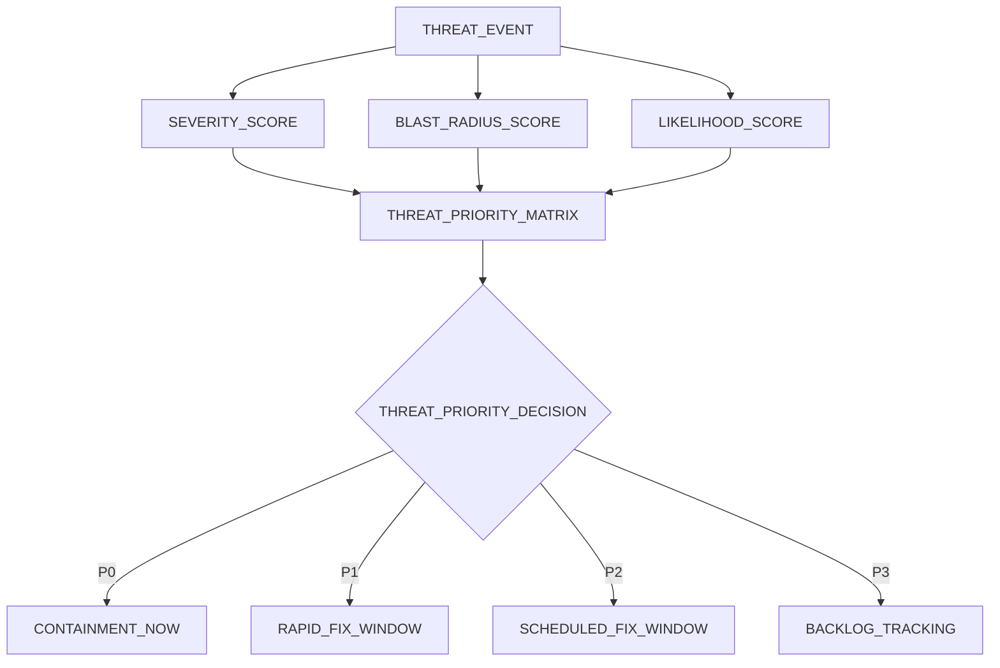
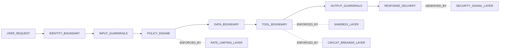
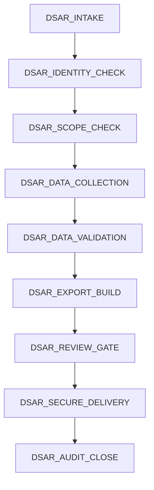
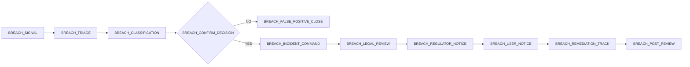

# 27 — Unified Security Strategy and Regulatory Compliance

> **Scope**: Governance architecture for security, auditability, and regulatory compliance for `safeagent` at 10M-user scale.
>
> **Tasks**: THREAT_GOVERNANCE (Unified Threat Governance), COMPLIANCE_ENABLEMENT (Regulatory Operations), INCIDENT_COMMAND (Security Incident Operations)

---

## Table of Contents
- [Strategic Context](#strategic-context)
- [Unified Threat Model](#unified-threat-model)
- [Attack Surface Inventory](#attack-surface-inventory)
- [OWASP Top 10 for LLM Applications Mapping](#owasp-top-10-for-llm-applications-mapping)
- [Threat Classification Framework](#threat-classification-framework)
- [Defense-in-Depth Composition](#defense-in-depth-composition)
- [Security Audit and Assessment](#security-audit-and-assessment)
- [Regulatory Compliance](#regulatory-compliance)
- [Decision Audit Trail and Explainability](#decision-audit-trail-and-explainability)
- [DSAR Workflow](#dsar-workflow)
- [Breach Notification Procedure](#breach-notification-procedure)
- [Consent Management](#consent-management)
- [Data Classification Scheme](#data-classification-scheme)
- [Bias and Fairness Governance](#bias-and-fairness-governance)
- [Incident Response Program](#incident-response-program)
- [Cross-References](#cross-references)
- [Delivery Checklist](#delivery-checklist)
- [Navigation](#navigation)

## Strategic Context
- `safeagent` already includes strong technical controls across guardrails, authentication, observability, infrastructure, monitoring, and extension boundaries.
- Enterprise adoption requires one governance layer that maps those controls to measurable risk ownership, audit evidence, and legal duties.
- This plan focuses on the missing governance layer rather than redefining mechanics already documented elsewhere.
- EU AI Act enforcement in August 2026 and active GDPR obligations make this governance model mandatory for market access.
- Security and compliance are treated as continuous operations, not checklist milestones.

## Unified Threat Model
- The threat model standardizes risk language across engineering, security, legal, and product teams.
- Every threat record includes attack path, impacted asset, likely impact, detection method, owner, and mitigation dependency.
- Threat classification combines severity, blast radius, and likelihood, then drives remediation order.
- Threat model updates are required after major architecture changes, incidents, and high-risk launches.
- Model outputs feed audit scope, penetration testing scope, and incident readiness drills.

## Attack Surface Inventory

### LLM Layer
- Prompt injection can alter instruction hierarchy and force unsafe behavior.
- Jailbreaking can bypass policy constraints under adversarial phrasing.
- Indirect injection can arrive through retrieved context, uploaded content, and external tool outputs.
- Baseline technical controls are defined in file 10 and monitored in file 22.
- Governance added here: ownership, risk scoring, escalation thresholds, and reporting obligations.

### Data Layer
- Memory poisoning can create durable false context that distorts future agent behavior.
- PII leakage risk spans outputs, telemetry, audit exports, and support workflows.
- Cross-user or cross-tenant leakage is a top-severity event.
- Retention beyond lawful purpose creates legal and trust risk.
- Relational handling remains constrained to PostgreSQL through Drizzle ORM.

### Infrastructure Layer
- Availability attacks can target model routes, queue depth, storage systems, and streaming delivery.
- Credential theft can enable privilege abuse and lateral movement.
- Cost amplification attacks can trigger budget exhaustion and service instability.
- Baseline protective controls are in files 12 and 15.
- Governance added here: resilience evidence requirements and risk acceptance criteria.

### Extension Layer
- Malicious extensions can attempt capability escalation, data exfiltration, or policy bypass.
- Isolation boundary failure can expose internal state across extension boundaries.
- Third-party supply risks can introduce unsafe execution dependencies.
- Baseline extension safeguards are in file 24.
- Governance added here: review gates, trust approval, quarantine, and post-incident controls.

## OWASP Top 10 for LLM Applications Mapping

| OWASP Category | Risk in safeagent | Existing Control Anchor | Governance Layer Added Here |
|---|---|---|---|
| LLM01 Prompt Injection | Instruction override and unsafe action steering | File 10, File 22 | Threat ownership and campaign-level escalation policy |
| LLM02 Insecure Output Handling | Harmful output consumed by downstream experiences | File 10, File 14 | Release risk gate and rollback accountability |
| LLM03 Training Data Poisoning | Corrupted grounding and memory artifacts | File 09, File 14 | Data provenance review cadence and contamination response |
| LLM04 Model Denial of Service | Traffic abuse and resource exhaustion | File 15, File 22 | Saturation classification and resilience evidence requirements |
| LLM05 Supply Chain Vulnerabilities | Dependency or extension compromise | File 24, File 15 | Supplier risk tiering and remediation SLA governance |
| LLM06 Sensitive Information Disclosure | Personal data exposure in output or logs | File 14, File 10 | Breach workflow and regulator reporting controls |
| LLM07 Insecure Plugin Design | Unsafe extension capability boundaries | File 24 | Mandatory security review and trust-level approvals |
| LLM08 Excessive Agency | Unbounded tool actions | File 06, File 25 | Human oversight gate policy and high-impact approvals |
| LLM09 Overreliance | Users misled by uncertain or low-confidence outputs | File 14, File 22 | Transparency and explainability quality obligations |
| LLM10 Model Theft | Unauthorized extraction and abuse | File 12, File 15 | Access abuse thresholds and executive legal escalation |

## Threat Classification Framework
- Severity levels use `P0` through `P3` and apply to both vulnerabilities and active incidents.
- Blast radius uses four bands: session, tenant cohort, regional, and global.
- Likelihood is based on exploit complexity, observed attempts, and attack trend velocity.
- Classification drives SLA, escalation speed, and required mitigation depth.
- Scores are recalculated when architecture or threat intelligence changes materially.

### Severity Matrix
| Level | Definition | Typical Blast Radius | Initial Response Target | Governance Escalation |
|---|---|---|---|---|
| P0 | Confirmed compromise or high-sensitivity leakage | Regional or global | Immediate | Executive and legal required |
| P1 | Active high-risk exploit path with abuse evidence | Multi-tenant or major cohort | 30 minutes | Security leadership required |
| P2 | Contained weakness with moderate exploitability | Limited tenant scope | 4 hours | Team leadership required |
| P3 | Low-impact or hard-to-exploit weakness | Localized | Planned cycle | Security backlog governance |

## Defense-in-Depth Composition
- Defensive layers are intentionally redundant so single-control failure does not become systemic failure.
- Guardrails enforce policy at input and output boundaries.
- Identity and access controls protect all retrieval, memory, and tool pathways.
- Rate limiting and budget controls constrain abuse and cost spikes.
- Circuit breakers and sandboxing isolate unstable or compromised dependencies.
- Monitoring joins all layers into one incident timeline for rapid containment.

## Security Audit and Assessment

### Security Audit Schedule
| Cadence | Scope | Responsible Parties | Required Outputs |
|---|---|---|---|
| Monthly | Control health sample, open-risk aging, high-risk change review | Security engineering, platform lead | Risk aging report and closure actions |
| Quarterly | Full threat model refresh and compliance evidence review | Security governance, legal, product security | Updated risk register and evidence pack |
| Semiannual | Adversarial simulation across all attack layers | Internal red team, incident command | Attack-path findings and response gaps |
| Annual | Independent security assessment and enterprise readiness review | External assessors, executive risk committee | Independent assessment and remediation roadmap |

### Penetration Testing Framework
- Frequency is quarterly plus event-triggered for major trust-boundary changes.
- Testing includes authenticated and unauthenticated paths.
- Scenarios include prompt abuse, data exfiltration, privilege escalation, and availability pressure.
- Scope boundaries are explicit to avoid uncontrolled production risk.
- Findings are mapped to severity, compliance relevance, and remediation owner.
- Retests verify closure quality before findings are marked complete.

### Dependency Vulnerability Management
- Vulnerability scanning covers direct and transitive dependencies continuously.
- Prioritization accounts for real exploitability in this architecture, not score alone.
- Ownership assignment is mandatory at finding creation.
- Emergency patch process exists for active exploitation.
- Exceptions require documented risk acceptance and expiry date.
- Closure requires evidence of mitigation effectiveness.

### Vulnerability Remediation SLAs
| Severity | SLA Target | Escalation Trigger | Required Outcome |
|---|---|---|---|
| Critical | 24 hours | Missed target | Emergency mitigation or patch |
| High | 72 hours | Missed target | Priority release with leadership escalation |
| Medium | 14 days | Repeat deferral | Planned remediation with risk tracking |
| Low | 45 days | Aging backlog trend | Scheduled maintenance cycle |

### Security Review and Approval Gates
- Security review is mandatory for new extension classes, auth changes, and new data access patterns.
- Reviews require threat delta, compliance impact, and rollback plan.
- Approval cannot be self-granted by change authors.
- High-risk changes require security and product co-approval.
- Emergency changes receive expedited review plus retrospective audit.
- Post-release verification confirms expected control behavior under live traffic.

## Regulatory Compliance
- Compliance mapping converts legal duties into operational controls and evidence artifacts.
- Ownership is explicit per legal article and enforced through recurring review cadence.
- Evidence is retained in regulator-ready format with tamper-evident provenance.
- Transparency and oversight requirements are treated as core product behavior.
- Compliance status is reviewed alongside security risk and incident metrics.

## EU AI Act Mapping

### Article 12 — Record-Keeping
- Maintain immutable decision and policy event logs.
- Preserve trace continuity from request through action and oversight intervention.
- Ensure exportable records for authority requests.
- Validate log integrity through scheduled checks.

### Article 13 — Transparency
- Provide clear disclosure of AI-mediated behavior.
- Provide human-readable summaries for consequential decisions.
- Communicate key limitations and uncertainty posture.
- Track transparency completeness in compliance reviews.

### Article 14 — Human Oversight
- Define human intervention points for high-impact actions.
- Support interrupt, halt, and override pathways.
- Log every oversight intervention with rationale.
- Validate oversight usability during incident drills.

### Article 15 — Accuracy and Robustness
- Define measurable robustness and quality objectives.
- Run adversarial and stress validations on recurring cadence.
- Apply safe fallback behavior during degraded confidence states.
- Tie unresolved robustness gaps to explicit risk acceptance.

### EU AI Act Evidence Matrix
| Article | Evidence Artifacts | Primary Owner | Audit Cadence |
|---|---|---|---|
| 12 | Decision logs, integrity checks, export attestations | Security governance | Quarterly |
| 13 | Transparency summaries and user communication templates | Product and legal | Quarterly |
| 14 | Oversight logs and intervention drill outcomes | Incident command | Monthly |
| 15 | Robustness tests and remediation closure evidence | Security engineering | Monthly |

## GDPR Mapping

### Article 5 — Principles
- Purpose limitation and minimization are enforced through policy-scoped data handling.
- Integrity and confidentiality are protected by layered controls.
- Accountability is maintained through ownership and auditable workflows.

### Article 6 — Lawfulness
- Processing basis is declared per integration context.
- Basis and purpose mapping is captured as evidence.
- Unsupported basis usage is blocked by governance policy.

### Article 7 — Consent
- Consent capture includes scope, purpose, and timestamp.
- Consent withdrawal is immediate for future processing.
- Consent history remains immutable and exportable.

### Articles 12–22 — Data Subject Rights
- DSAR includes access, portability support, and deletion pathway coordination.
- Identity verification is required before data release.
- Completion timelines are tracked with escalation for delay risk.

### Articles 32–34 — Security and Breach Notification
- Security measures align with layered defense and tested incident operations.
- Breach classification drives regulator and user communication duties.
- 72-hour reporting window governance is mandatory.

### GDPR Capability Matrix
| GDPR Area | Library-Level Enablement | Integrator Responsibility |
|---|---|---|
| Principles and accountability | Audit trail model, policy hooks, retention controls | Define business-specific processing purpose |
| Consent lifecycle | Immutable consent events and withdrawal propagation model | User-facing consent experience and jurisdiction language |
| Data subject rights | DSAR workflow model and export format | Identity verification and legal exception review |
| Security and breach operations | Detection hooks and breach timeline governance model | Final regulatory filing and authority engagement |

## Decision Audit Trail and Explainability
- Audit trails include what happened and why a decision path was selected.
- Records link input context, retrieval context, model rationale summary, tool actions, and output.
- Oversight interventions are captured in the same immutable chain.
- Export supports regulator review and enterprise due diligence workflows.
- Integrity checks are run on a recurring schedule and after major incidents.

### Per-Decision Explainability Structure
- Input summary: intent and relevant constraints.
- Retrieval summary: evidence context and selection rationale.
- Reasoning summary: rationale path and uncertainty markers.
- Tool summary: action intent and outcome.
- Output summary: final response justification in plain language.

### Explainability Operating Rules
- Explanations must be clear, concise, and non-deceptive.
- Sensitive implementation details are redacted while preserving accountability.
- Contradictions between decision records and user-visible outcomes trigger review.
- High-impact decisions require richer rationale than routine responses.

## DSAR Workflow
- DSAR intake supports authenticated and scoped rights requests.
- Identity verification is mandatory before data retrieval.
- Data collection includes conversation artifacts, consent history, and audit records.
- Export format is structured JSON plus readable summary.
- Target response timeline is 30 days with escalation for complex cases.
- Fulfillment completion is logged as immutable evidence.

## Breach Notification Procedure
- Breach handling starts with detection, triage, and impact classification.
- Confirmed incidents activate incident command and legal review immediately.
- Regulator notification preparation runs in parallel with containment.
- 72-hour reporting governance is measured from confirmation time.
- Affected-user communication is prepared with clear impact guidance.
- Completion requires remediation tracking and post-incident review.

## Consent Management
- Consent records are immutable with scope, purpose, and timestamp.
- Withdrawal events apply immediately to future processing.
- Consent state is queryable for runtime governance checks.
- Consent history is included in DSAR exports.
- Consent governance includes periodic clarity review.

## Data Classification Scheme
| Data Category | Sensitivity | Core Risk | Control Posture |
|---|---|---|---|
| Public metadata | Low | Context misuse | Basic integrity and access controls |
| Telemetry without identifiers | Medium | Re-identification by correlation | Aggregation, minimization, retention bounds |
| Personal profile attributes | High | Privacy harm | Strict access controls and auditing |
| Conversation data with personal context | High | Sensitive exposure | Redaction, policy scope checks, deletion support |
| Special-category personal data | Critical | Severe legal and individual harm | Enhanced restrictions and elevated oversight |
| Security forensic records | High | Tampering risk | Immutability and restricted investigator access |

## Bias and Fairness Governance
- Fairness monitoring evaluates output behavior across demographic cohorts.
- Disparate impact detection combines statistical parity checks and trend analysis.
- Fairness metrics are tracked alongside safety and reliability metrics.
- Bias findings are handled through a defined remediation workflow with ownership.
- Governance emphasizes measurable parity improvements over one-off interventions.

### Output Distribution Monitoring
- Track response quality score distributions by cohort.
- Track refusal rate and policy-block rate differences by cohort.
- Track harmful-output concentration by cohort with high-sensitivity alerting.
- Track explainability completeness parity across cohorts.

### Fairness Metrics and Thresholds
| Metric | Target Band | Alert Trigger | Escalation |
|---|---|---|---|
| Outcome parity ratio | 0.8 to 1.25 | Outside band for two windows | Fairness governance board |
| False refusal disparity | Within 15 percent spread | Exceeds spread threshold | Product and safety leads |
| Harmful output disparity | Near-zero concentration | Any significant concentration | Security incident command |
| Explainability parity | Within 10 percent spread | Persistent cohort gap | Compliance governance |

### Bias Remediation Workflow
- Open fairness incident with affected cohorts and impact summary.
- Perform root-cause analysis across prompt, policy, retrieval, and data factors.
- Define mitigation owner, timeline, and validation method.
- Validate improvements before broad rollout.
- Monitor sustained parity during a stabilization window.

## Incident Response Program

### Security Incident Classification
| Level | Trigger Pattern | Command Structure | Required Communications |
|---|---|---|---|
| P0 | Confirmed major compromise or sensitive data breach | Full incident command with executive lead | Internal immediate, regulator prep, user-impact planning |
| P1 | Active high-risk exploit campaign | Security lead with legal and platform partners | Rapid internal stakeholder alignment |
| P2 | Contained exploit attempt with limited impact | Security operations lead | Team-level notifications |
| P3 | Low-risk anomaly without user harm | Standard triage owner | Logged status updates |

### Playbook: Prompt Injection at Scale
- Detect attack clusters and bypass trends.
- Tighten policy thresholds and isolate affected pathways.
- Validate downstream impact on data and tool actions.
- Communicate status and containment progress on fixed cadence.

### Playbook: Data Breach
- Confirm scope, sensitivity class, and affected cohorts.
- Contain exposure path and preserve forensic evidence.
- Activate 72-hour reporting workflow.
- Deliver user guidance aligned to validated impact.

### Playbook: Extension Compromise
- Quarantine extension identity and revoke elevated capabilities.
- Assess lateral impact across related pathways.
- Restore service through trusted fallback controls.
- Require full security review before any reinstatement.

## Post-Incident Review and Communication

### Post-Incident Review Process
- Run review within five business days for `P0` and `P1` incidents.
- Reconstruct timeline from immutable audit and monitoring records.
- Identify control gaps, process failures, and escalation friction.
- Assign corrective actions with owner and due date.
- Track remediation to verified closure.

### Communication Plan
- Internal updates follow severity-based cadence and ownership.
- Affected-user communications are clear, practical, and legally aligned.
- Regulator communications are factual and timely.
- Enterprise customer communication includes mitigation status and next milestones.

## Cross-References
| Plan File | Connection |
|---|---|
| [10 — Guardrails & Safety](./10-guardrails.md) | Prompt injection and policy enforcement controls governed here through risk ownership and compliance mapping. |
| [12 — Server Implementation](./12-server.md) | Authentication and principal boundaries used as mandatory governance anchors. |
| [14 — Observability](./14-observability.md) | PII redaction and trace controls extended here into regulator-facing record-keeping and explainability. |
| [15 — Infrastructure](./15-infrastructure.md) | Rate limiting and resilience controls mapped here to audit and legal accountability. |
| [22 — Monitoring, Alerting, and Incident Response](./22-monitoring.md) | Security signal detection integrated here with breach workflow and escalation governance. |
| [24 — Extensibility and Plugin Architecture Plan](./24-extensibility.md) | Extension control baseline connected here to approval gates and compromise response. |
| [25 — Durable Execution and HITL Oversight](./25-durable-execution.md) | Human oversight controls linked here to Article 14 obligations and high-impact action governance. |

## Delivery Checklist
- Unified threat model defined across LLM, data, infrastructure, and extension layers.
- OWASP Top 10 for LLM Applications mapped with governance actions.
- Threat classification and response targets documented.
- Defense-in-depth composition documented with layered interaction model.
- Security audit cadence and penetration testing framework established.
- Dependency vulnerability management and remediation SLAs defined.
- Security review gates defined for extension, auth, and data access changes.
- EU AI Act Articles 12, 13, 14, and 15 mapped to evidence artifacts and owners.
- GDPR Articles 5, 6, 7, 12-22, and 32-34 mapped to operational workflows.
- Decision audit trail includes rationale chain and regulator export posture.
- Per-decision explainability includes input, retrieval context, reasoning, tools, and output.
- DSAR workflow includes API-driven export model and 30-day response target.
- Breach workflow includes detection, classification, and 72-hour reporting governance.
- Consent lifecycle includes record, withdrawal, and immutable audit trail.
- Data classification scheme defines sensitivity levels and control posture.
- Bias and fairness governance includes monitoring, thresholds, and remediation flow.
- Incident response includes `P0` to `P3` classification and required scenario playbooks.
- Cross-reference mapping includes files 10, 12, 14, 15, 22, 24, and 25.

## Navigation

*Previous: [26 — AI Operations](./26-ai-operations.md)*
