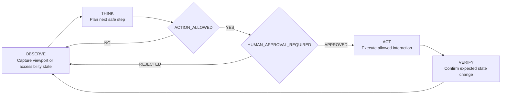
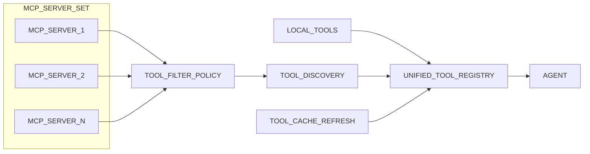
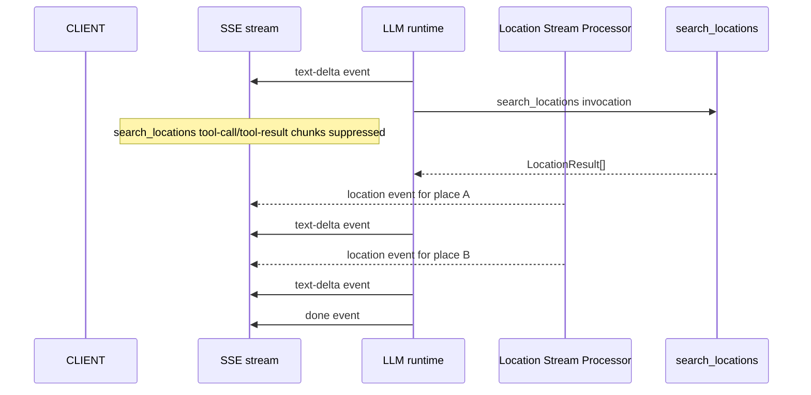
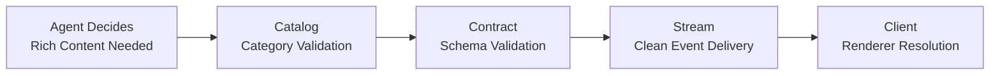

# Agent Capabilities & Integrations

> Scope: Specialized agent capabilities including computer use and browser automation, MCP client protocol integration, location enrichment tooling, and generative UI component governance for the safeagent library.

---

## Table of Contents

- [Computer Use and Browser Agent Patterns](#computer-use-and-browser-agent-patterns)
- [MCP Client Protocol Integration](#mcp-client-protocol-integration)
- [Location Enrichment Tool (LOCATION_TOOL)](#location-enrichment-tool-location_tool)
- [Generative UI Component Governance](#generative-ui-component-governance)
- [Cross-References](#cross-references)
- [Task Specifications](#task-specifications)
- [External References](#external-references)
- [Test Specifications](#test-specifications)

---

## Computer Use and Browser Agent Patterns

Computer use is an emerging agent type with distinct perception, safety, and governance requirements. Browser-first operation is now established in production-grade systems and should be treated as a first-class orchestration pattern rather than an ad hoc tool behavior.

Core requirements:

- **Provider abstraction**: the framework SHALL define a provider-agnostic computer use interface that supports screenshot capture, action execution (click, type, scroll, drag), accessibility-tree reads, and viewport dimension management.
- **Dual perception modes**: two perception modes MUST be available and selectable per run.
  - Screenshot-based perception uses rendered frames and works across any user interface.
  - Accessibility-tree perception uses structured page semantics and is preferred for web workflows due to substantially lower token cost (commonly around four times lower than screenshot-heavy flows).
- **Reference providers**: Playwright MCP, Anthropic Computer Use, and OpenAI CUA should be provided as interchangeable plugin implementations behind the same abstraction.
- **Plugin boundary**: computer use providers are optional provider integrations enabled outside the core runtime; the core `safeagent` package does not include any computer use provider by default.
- **Mandatory sandboxing**: all computer use execution MUST run in isolated environments (virtual machine, container, or remote browser). Direct host-machine control is prohibited and must align with the sandbox isolation model in the Guardrails & Safety document.
- **Action-surface governance**: the orchestrator MUST enforce a configurable allowlist of permitted actions, including read-only profiles that allow observation (screenshots and accessibility-tree reads) while blocking mutation actions.
- **Viewport streaming**: browser viewport output may be streamed as a live visual feed for real-time observation, aligned with transport streaming behavior in the Streaming & Transport document.
- **Session state continuity**: browser sessions MUST preserve page state, cookies, and navigation history across multi-step agent execution.
- **Cost accounting**: visual token usage MUST be tracked separately from text token usage because screenshot-based perception has materially higher cost; this must integrate with budget policy in the Server Implementation and Infrastructure documents.
- **Human oversight gates**: high-risk actions (such as submissions, purchases, and account changes) MUST require explicit human approval checkpoints, aligned with human-in-the-loop policy in the Durable Execution document.
- **Audit trail**: screenshots, actions, and page-state transitions MUST be logged for compliance, replay, and debugging, aligned with provenance requirements in the Observability document.



Reference material:

- Anthropic Computer Use documentation: https://docs.anthropic.com/en/docs/agents-and-tools/computer-use

---

## MCP Client Protocol Integration

MCP is the interoperability standard for AI tool ecosystems and is now established across major agent runtimes and editors. This plan treats MCP as a native client capability of the agent system, not an add-on around tools. The runtime context remains Bun-only delivery with a single package, safeagent.

Core integration requirements:

- **First-class agent parameter**: every agent type SHALL accept MCP server connections as a peer parameter alongside local tools.
- **Three transport modes**: stdio, SSE, and streamable HTTP MUST all be supported.
- **Transport auto-detection**: the client SHALL infer transport mode directly from connection configuration.
- **Tool discovery**: tool definitions from MCP servers are merged into the same agent tool registry so MCP and local tools are treated identically.
- **Tool filtering**: consumers can apply allowlist and denylist controls per MCP server to expose only approved tools to an agent.
- **Cache invalidation**: tool-definition caches refresh when MCP servers signal capability changes.
- **Lazy connection**: MCP connections are established on demand at first use, aligned with deferred tool loading in the [Extensibility](./extensibility.md) document.
- **Connection lifecycle**: pooled connection management includes health checks, reconnect behavior, and graceful shutdown.
- **Security model**: MCP connections inherit the agent trust boundary; untrusted servers MUST run inside sandbox constraints.
- **Multi-server composition**: agents can attach to multiple MCP servers simultaneously, and tool-name conflicts are resolved by server priority.



Reference:

- MCP specification: https://modelcontextprotocol.io/specification

---

## Location Enrichment Tool (LOCATION_TOOL)

**Purpose**: When the model discusses places, it may call the location enrichment tool so each place is enriched with coordinates and optional images. Client applications can render interactive maps and inline place visuals from these events.

**Factory**: The location tool factory accepts a location tool configuration and returns an AI SDK tool definition.

**Tool name**: the location search tool.

**Suppression pattern**: Tool-call and tool-result stream chunks for the location search tool are suppressed using the same mechanism as the CTA suggestion tool. A location stream processor factory intercepts location-tool chunks, suppresses them from outbound stream, and emits clean `location` events derived from tool result.

**Input contract**: Model passes a place list and optional context text. Context clarifies ambiguous names and improves provider relevance.

**Internal flow**:

1. For each place, check Valkey cache first.
2. On cache miss, call configured geocoding provider with place name and optional context.
3. If image search provider is configured, call it with place-context query and max image count; otherwise set images to empty array.
4. Cache enrichment payloads in Valkey with configured TTL rules.
5. Emit a `location` SSE event per resolved place. If geocoding returns null, skip that place (degrade silently: log and continue).

**LLM autonomy**: Model decides when to call the location search tool. Typical triggers include recommendations, directions, and venue-anchored responses. Generic responses do not require this tool.

```mermaid
flowchart LR
    RESPONSE_PLANNER[LLM response planner] --> LOCATION_TOOL_CALL[AI SDK tool call: search_locations]
    LOCATION_TOOL_CALL --> LOCATION_TOOL_EXEC[search_locations execute()]

    LOCATION_TOOL_EXEC --> PLACE_PARALLEL{Per place in parallel}
    PLACE_PARALLEL --> GEOCODE_PATH[Geocode provider path]
    PLACE_PARALLEL --> IMAGE_PATH[Image search provider path (optional)]

    GEOCODE_PATH --> LOCATION_MERGE[Merge LocationResult]
    IMAGE_PATH --> LOCATION_MERGE

    LOCATION_MERGE --> LOCATION_RESULTS[LocationResult[]]
    LOCATION_RESULTS --> LOCATION_STREAM_PROCESSOR[location stream processor factory]
    LOCATION_STREAM_PROCESSOR --> LOCATION_SSE[Emit location SSE events]
```



### Task LOCATION_TOOL: Location Enrichment Tool

**What to do**: Build the location tool factory that accepts location tool configuration and returns an AI SDK tool definition for location search. The tool receives place names and optional context, resolves each place through a configured geocoding provider (Nominatim default), optionally fetches images via a configured image search provider, and returns a list of location results. Build Valkey caching for resolved locations with configurable TTL. Build the location stream processor factory that intercepts location-tool call and result chunks, suppresses them from outbound stream, and emits `location` SSE events derived from tool result. Silent degradation: if geocoding returns null for a place, log warning and skip that place (no event emitted, no client-facing error). Build a places image provider factory helper that wraps Google Places Photos as an image search provider, including place imagery and coordinate support.

**Depends on**: CORE_TYPES, AGENT_FACTORY, VALKEY_CACHE

**Acceptance Criteria**:

- Location tool factory returns a valid AI SDK tool definition with the location-search name
- Tool resolves place names through configured geocode provider
- Valkey cache is checked before geocode provider call; cache hits skip provider call
- Cache entries use configurable TTL
- Location stream processor factory suppresses location-tool call and result chunks from outbound stream
- Each resolved place emits `location` SSE event with name, type, latitude, longitude, images, and optional context
- Unresolved places (geocode returns null) are silently skipped with warning log
- When no image search provider is configured, images defaults to empty array
- Geocoding and image-search provider interfaces are pluggable so server can substitute custom implementations
- Places image provider factory helper returns a valid image-search provider implementation

**QA Scenarios**:

- Call tool with known city name -> returned location result includes valid latitude and longitude coordinates
- Call tool with same city twice -> second call hits Valkey cache, no geocode invocation
- Call tool with nonexistent place -> geocode returns null, no location event, no client error
- Call tool with image-search provider configured -> images array populated
- Call tool without image-search provider -> images array empty
- Stream response that triggers location search -> tool-call/tool-result chunks hidden from SSE output, location events present
- Configure custom geocoding provider -> tool uses custom provider instead of default

---

## Generative UI Component Governance

The current event model supports text, CTA, citation, and location outputs, but does not yet support dynamic component emission. To close that gap, the framework SHALL support agent-generated rich UI payloads while preserving clean stream semantics and strict safety guarantees.

Design constraints:

- **Dynamic component emission**: agents SHALL be able to emit structured rich-content payloads alongside text, following the same stream-cleansing pattern used for CTA and location enrichment.
- **Server-controlled catalog**: the server SHALL define the set of allowed component categories (charts, data tables, forms, cards, metrics, image galleries, maps, formatted content blocks). Agents can only emit categories present in the catalog; unlisted categories are rejected.
- **Contract validation**: each component category SHALL have its data contract defined in Zod v4. Emissions that fail validation are dropped with a warning log and never reach clients.
- **Presentation modes**: each emission declares whether it appears inline within text flow or as a standalone block between text segments.
- **Multiple emissions per response**: a single agent response MAY produce multiple rich-content payloads, each delivered as a separate event.
- **Progressive delivery**: rich-content events are emitted as soon as ready, interleaved with text content, enabling clients to build pages progressively.
- **Universal fallback**: every rich-content payload MUST include a plain-text fallback. Clients that support the category render rich output; others render the fallback.
- **Data-only security**: payloads MUST contain only data — no executable content, no event handlers, no raw markup. Client-side rendering implementations interpret data through registered renderers.
- **Scalability**: emission rate limits per response prevent unbounded component generation; payload size caps prevent oversized deliveries from degrading transport performance.



---

## Cross-References

| Plan File | Relevant Scope | Connection |
|---|---|---|
| [Agents & Orchestration](./agents.md) | Core agent factory, orchestrator, tool registry | These capabilities plug into the agent runtime as tools and integrations |
| [Streaming & Transport](./transport.md) | SSE event protocol, stream processing | Location and GenUI events flow through the transport layer |
| [Guardrails & Safety](./guardrails.md) | Sandbox isolation, action governance | Computer use requires sandbox constraints and action allowlists |
| [Durable Execution](./durable-execution.md) | Human-in-the-loop approval gates | Computer use high-risk actions require HITL approval |
| [Observability](./observability.md) | Tracing, audit trails | Computer use audit trails and visual token tracking |

---

## Task Specifications

### Task MCP_CLIENT: MCP Client Configuration + Multi-Server

**What to do**: Configure MCP client using the framework's MCP transport classes. Build a configuration layer that accepts multiple MCP server definitions and returns framework-compatible instances. Use the framework's tool filtering option (static allowlist and blocklist) to control exposed MCP tools per agent. Enable tool list caching for stable servers. Add health monitoring and graceful reconnection on top of framework MCP transport classes. Library provides default MCP client config that server may override.

**Depends on**: CORE_TYPES (Foundation Types), MCP_HEALTH (MCP Health-Check Wrapper)

**Acceptance Criteria**:

- MCP config creates framework-compatible MCP server instances using MCP transport classes
- Healthy MCP servers connect at startup and expose tools to agents automatically
- Tool filtering option per agent controls visible MCP tools
- Tool list caching is enabled for stable servers to avoid re-listing every request
- Health monitor detects availability changes and updates connection state
- Reconnection retries with backoff after disconnects and restores tool availability
- Library defaults apply when server overrides are not provided
- Unit tests cover healthy startup, disconnect, reconnect, and mixed server health

**QA Scenarios**:

- Start with three healthy MCP servers -> all connect and all tools appear in agent tool list
- Start with one unhealthy plus two healthy servers -> healthy servers available, unhealthy excluded without blocking startup
- Agent with allowlist tool filtering option -> only listed MCP tools visible to that agent
- Disconnect active MCP server during runtime -> health status changes and reconnection begins automatically
- Override default MCP config from server project -> override values apply without breaking base defaults

---

## External References

- MCP specification: https://modelcontextprotocol.io/specification
- Anthropic Computer Use documentation: https://docs.anthropic.com/en/docs/agents-and-tools/computer-use

---

## Test Specifications

**Location enrichment tool behavior**:


- Location tool factory returns valid tool definition with location-search naming.
- Tool input contract accepts place list with optional contextual text for disambiguation.
- Tool-call and tool-result chunks for location enrichment are suppressed from outbound stream.
- Stream processor emits clean location events derived from location tool results.
- Cache is checked before geocoding call for each requested place.
- Cache hit path skips geocoding provider call.
- Cache miss path calls configured geocoding provider with place and optional context.
- Optional image-search provider is called when configured.
- Missing image-search provider yields empty images array without failure.
- Enrichment payloads are cached with configured TTL.
- One location event is emitted per successfully resolved place.
- Geocoding null result skips place silently with warning log.
- Geocoding failure degrades silently for that place while continuing other places.
- Geocoding and image-search provider interfaces remain pluggable for deployment substitution.
- Place-image provider helper returns compatible image-search implementation.

**MCP client resilience and configuration**:


- Static allowlist controls which tools are exposed per agent.
- Static blocklist controls which tools are excluded per agent.
- Tool list caching for stable servers avoids re-listing on every request.
- Health monitor detects availability changes in connected MCP servers and updates connection state.
- Reconnection retries with backoff after MCP server disconnects and restores tool availability on success.
- Runtime MCP server disconnect triggers health status change and automatic reconnection begins.

### Extension: MCP Client Protocol Integration

- Every agent type accepts MCP server connections as a peer parameter alongside local tools.
- All three transport modes (stdio, SSE, streamable HTTP) connect and exchange messages successfully.
- Transport mode is auto-detected from connection configuration without consumer hints.
- Tool definitions from MCP servers merge into the agent tool registry identically to local tools.
- Allowlist controls per MCP server expose only approved tools to the agent.
- Denylist controls per MCP server block specific tools from appearing in the agent registry.
- Tool-definition caches refresh when MCP servers signal capability changes.
- MCP connections are established on demand at first use and not at agent creation time.
- Pooled connection management includes health checks, reconnect on failure, and graceful shutdown.
- MCP connections inherit the agent trust boundary so untrusted servers run inside sandbox constraints.
- Agents attach to multiple MCP servers simultaneously with tools from all servers available.
- Tool-name conflicts across servers are resolved by server priority order.
- Duplicate client creation is prevented when the same MCP server is referenced by multiple agents.
- Connection failure to one MCP server does not block tools from other servers.

### Extension: Computer Use and Browser Agent Patterns

- Provider-agnostic computer use interface supports screenshot capture, action execution, accessibility-tree reads, and viewport dimension management.
- Screenshot-based perception mode captures rendered frames and works across any interface.
- Accessibility-tree perception mode uses structured page semantics and is preferred for web workflows.
- Accessibility-tree perception consumes substantially fewer tokens than screenshot-heavy flows.
- Perception mode is selectable per run.
- Playwright MCP, Anthropic Computer Use, and OpenAI CUA are interchangeable plugin implementations.
- Core safeagent package does not include any computer use provider by default.
- All computer use execution runs in isolated environments and not on the host machine.
- Orchestrator enforces configurable allowlist of permitted actions.
- Read-only profiles allow observation while blocking mutation actions.
- Browser sessions preserve page state, cookies, and navigation history across multi-step execution.
- Visual token usage is tracked separately from text token usage in budget accounting.
- High-risk actions require explicit human approval checkpoints when configured.
- Screenshots, actions, and page-state transitions are logged for compliance and replay.

### Extension: Generative UI Tool

- UI component tool emits validated component payloads following CTA/location suppression pattern.
- Only component types registered in the server catalog are accepted.
- Invalid component payloads are dropped with warning log and not surfaced to client.
- Inline and block display modes are correctly specified per emission.
- Multiple UI components per response emit as separate events.
- Text fallback is mandatory in every component payload.
- Component payloads contain no executable content (no scripts, no event handlers, no raw markup).
- Progressive rendering interleaves ui-component events with text-delta events.
