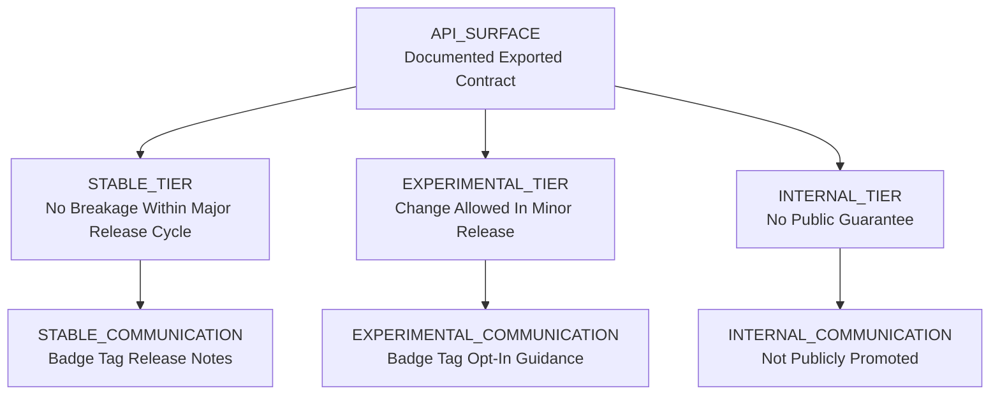

# API Governance & Consumer Migration

## Table of Contents
- [Public API Surface Definition](#public-api-surface-definition)
- [Stability Tiers](#stability-tiers)
- [Semantic Release Policy](#semantic-release-policy)
- [Deprecation Policy](#deprecation-policy)
- [Breaking Change Protocol](#breaking-change-protocol)
- [Migration Guide Framework](#migration-guide-framework)
- [Consumer Upgrade Testing](#consumer-upgrade-testing)
- [Extension Contract Stability](#extension-contract-stability)
- [Type Contract Governance](#type-contract-governance)
- [Governance Operating Cadence](#governance-operating-cadence)
- [Exception and Escalation Handling](#exception-and-escalation-handling)
- [Cross-Reference Table](#cross-reference-table)
- [Delivery Checklist](#delivery-checklist)
- [Mermaid Diagrams](#mermaid-diagrams)
- [Official References](#official-references)

## Public API Surface Definition
- The public API is the complete set of documented exports from the single `safeagent` package.
- The package contract is explicit, intentional, and review-gated.
- Any symbol not intentionally exported is internal.
- Internal symbols can evolve without consumer notice.
- Internal symbols are not covered by compatibility guarantees.
- Public symbols are listed in release documentation and governance records.
- Export additions require governance review for naming, contract clarity, and stability assignment.
- Export removals require deprecation and migration artifacts before release admission.
- Re-exporting internal symbols is prohibited.
- Public API shape must remain understandable for first-time adopters.
- Public API shape must remain predictable for long-term adopters.
- Public API shape is organized by categories, not by implementation internals.
- Category examples include testing utilities, provider integrations, and extension contracts.
- Category naming must remain domain-centered and stable across release cycles.
- Category names must avoid exposing implementation detail.
- Category naming must support discoverability in package documentation.
- Top-level exports are curated for mainstream usage.
- Category-level exports are curated for advanced usage.
- Top-level exports prioritize high-signal and low-ambiguity symbols.
- Top-level exports avoid broad passthrough behavior.
- Export aggregation governance requires explicit allow-list policy for top-level re-export.
- Export aggregation governance requires ownership assignment for each exported symbol group.
- Export aggregation governance requires duplicate-surface detection before release acceptance.
- Export aggregation governance requires periodic pruning of obsolete aliases.
- Aliases are temporary compatibility tools, not permanent API growth strategy.
- Public API inventory must be regenerated during release validation.
- Public API inventory drift blocks release promotion.
- Documentation drift between exports and narrative blocks release promotion.
- The package scope remains singular: one npm package named `safeagent`.
- Scoped package families are out of policy for this governance model.
- Bun is the only runtime baseline for API governance and consumer guidance.
- Runtime guidance must not include Node.js alternatives.
- Storage contract policy remains explicit in governance context.
- SurrealDB integrations rely on surqlize contract boundaries.
- PostgreSQL integrations rely on Drizzle contract boundaries.
- Typed data access posture is part of public API trust.
- Public API policy excludes raw-query ergonomics from promoted guidance.

## Stability Tiers
- Stability tiers classify every public-facing contract.
- Each exported symbol receives one tier assignment.
- Tier assignment is visible in package documentation.
- Tier assignment is visible in API reference metadata.
- Tier assignment is visible in release notes when changed.
- Stable tier indicates no breaking change within a major release cycle.
- Stable tier targets long-lived production adoption.
- Stable tier changes require full migration treatment when breaking.
- Experimental tier indicates change may occur in minor release updates.
- Experimental tier is opt-in by consumer choice.
- Experimental tier must be visibly marked at every discovery point.
- Experimental tier may evolve rapidly based on validated feedback.
- Internal tier is excluded from public API guarantees.
- Internal tier is not documented as supported consumer surface.
- Internal tier may be refactored without deprecation process.
- Tier communication uses documentation badges.
- Tier communication uses structured API metadata tags.
- Tier communication uses inline documentation annotations aligned to governance vocabulary.
- Tier communication must remain consistent across docs and generated references.
- Tier transition from experimental to stable requires readiness review.
- Readiness review includes adoption data, defect rate, and migration burden signals.
- Tier transition from stable to deprecated requires explicit rationale.
- Tier transition history is retained for auditability.
- Tier assignment ownership is mapped to designated maintainers.
- Tier changes require cross-functional sign-off from release and documentation owners.
- Tier mislabeling discovered in release prep blocks release admission.
- Stable tier symbols require stricter compatibility tests.
- Experimental tier symbols require stronger usage disclaimers.
- Internal tier symbols must not leak through top-level export surfaces.
- Extension contracts carry independent tier labels in addition to base API tier labels.

## Semantic Release Policy
- Release classification follows semantic intent and documented impact.
- Major release changes include stable API breakage.
- Minor release changes include additive features and experimental API evolution.
- Patch release changes include bug fixes, doc updates, and non-breaking maintenance.
- Release classification is validated by change review automation.
- Release classification conflicts require human adjudication before publication.
- Pre-release channels are available for early adopters.
- Pre-release channels support rapid field feedback before broad rollout.
- Pre-release channels require clear support expectations and rollback posture.
- Pre-release channels must clearly identify instability risk.
- Conventional commit policy drives automated release classification.
- Commit semantics enforcement aligns with the release pipeline policy in the Release Pipeline document.
- Commit metadata drift blocks release automation.
- Breaking intent declarations in commit metadata are mandatory when applicable.
- Release notes must map classified changes to migration impact levels.
- Release notes must include explicit consumer action expectations.
- Release documentation must separate stable-impact and experimental-impact narratives.
- Release process must retain machine-readable change categorization.
- Release process must retain human-readable migration context.
- Release policy exceptions require governance approval and audit logging.
- Release artifacts must include compatibility matrix references.
- Release artifacts must include deprecation and removal timelines when applicable.
- Release safety gates require clean type contract checks.
- Release safety gates require clean API inventory diff checks.
- Release safety gates require compatibility test pass status.

## Deprecation Policy
- Deprecation is a structured lifecycle phase, not an ad hoc warning.
- Deprecation requires advance notice before removal.
- Minimum grace period is one full major release cycle.
- Longer grace windows are encouraged for high-adoption surfaces.
- Deprecation records must include rationale, scope, and target removal release.
- Deprecation records must include recommended replacement path.
- Runtime notice is required when deprecated surface is used.
- Documentation notice is required in API reference and migration docs.
- Changelog notice is required in every affected release.
- Notice language must be actionable and non-ambiguous.
- Notice language must avoid fear-based messaging.
- Notice language must include timeline commitments.
- Every deprecation requires a migration guide.
- Migration guidance must be available before the first deprecation release ships.
- Deprecation cannot be approved without migration ownership assignment.
- Deprecation detection must be automated in CI.
- CI checks must validate deprecation metadata completeness.
- CI checks must validate warning text presence and consistency.
- CI checks must validate documentation link integrity for migration guidance.
- CI checks must fail on undocumented deprecations.
- CI checks must fail on expired grace periods without removal decision.
- Deprecation backlog is reviewed at each release planning iteration.
- Deprecation backlog includes status labels for active, extended, and completed.
- Extended deprecation windows require explicit rationale updates.
- Removal readiness review must confirm migration support quality.
- Removal readiness review must confirm communication obligations were met.

## Breaking Change Protocol
- Breaking changes follow a formal proposal process.
- Proposal intake requires problem statement, alternatives, and impact narrative.
- Proposal intake requires stability-tier scope classification.
- Proposal intake requires consumer cohort impact assumptions.
- Impact assessment is mandatory before approval.
- Impact assessment includes adoption breadth and migration complexity.
- Impact assessment includes operational risk and support burden.
- Impact assessment includes ecosystem risk for extension authors.
- Breaking proposals require governance council review.
- Governance council review outcomes are recorded as approve, revise, or reject.
- Approved proposals require migration plan commitment before implementation.
- Approved proposals require communication plan commitment before implementation.
- Breaking changes require changelog, migration guide, and release notes alignment.
- Consumer communications must use consistent terminology across channels.
- Consumer communications must include timeline checkpoints.
- Consumer communications must include clear replacement guidance.
- Automated migration tooling is required when feasible.
- Codemod strategy is preferred when mechanical transition exists.
- Non-automatable transitions require explicit manual checklist guidance.
- Consumer notification timeline includes announcement, reminder, and final notice checkpoints.
- Announcement begins no later than deprecation start.
- Reminder cadence aligns with release planning milestones.
- Final notice occurs before removal release is published.
- Emergency breakage exceptions require incident-level governance approval.
- Emergency exceptions still require post-event migration documentation.
- Emergency exceptions still require follow-up compatibility stabilization plan.

## Migration Guide Framework
- Every migration guide follows a standardized structure.
- Guide structure begins with impact summary and target audience.
- Guide structure includes prerequisites and risk profile.
- Guide structure includes conceptual before and after behavior comparison.
- Guide structure includes decision matrix for common adoption scenarios.
- Guide structure includes phased rollout recommendations.
- Guide structure includes validation checklist for production readiness.
- Guide structure includes rollback planning guidance.
- Guide structure includes troubleshooting map by symptom category.
- Guide structure includes frequently asked upgrade questions.
- Conceptual before and after format must avoid source-level snippets.
- Conceptual before and after format must focus on behavior and outcomes.
- Conceptual comparison must call out invariants that remain unchanged.
- Conceptual comparison must call out assumptions that changed.
- Automated migration tooling philosophy emphasizes safety and repeatability.
- Tooling should reduce manual edits where transitions are mechanical.
- Tooling must include dry-run insight for impact visibility.
- Tooling must include deterministic output expectations.
- Tooling limitations must be documented transparently.
- Incremental migration is preferred over big-bang cutovers.
- Old and new API shapes should coexist during transition windows where feasible.
- Coexistence windows require explicit conflict-resolution guidance.
- Coexistence windows require clear sunset milestones.
- Migration guides must map to release notes and deprecation records.
- Migration guides must remain maintained throughout grace periods.
- Migration guides must be updated when field feedback reveals ambiguity.

## Consumer Upgrade Testing
- Upgrade confidence is validated with compatibility testing.
- Compatibility matrix defines which release lines are tested together.
- Matrix coverage includes current major line and supported prior line pairings.
- Matrix coverage includes stable-only consumer paths.
- Matrix coverage includes stable-plus-experimental consumer paths.
- Matrix coverage includes extension-heavy consumer patterns.
- Matrix coverage includes type-contract-sensitive consumer patterns.
- Matrix results are part of release admission criteria.
- Matrix regressions block publication until addressed or waived by governance.
- Consumer canary program is available for opt-in early validation.
- Canary participants receive pre-release artifacts and migration briefings.
- Canary feedback is triaged with defined severity labels.
- Canary incidents feed release-go/no-go decisions.
- Regression fixtures should reflect real consumer integration patterns.
- Fixture curation is sourced from anonymized support learnings and partner feedback.
- Fixture curation includes critical-path workflows and edge-path workflows.
- Fixture maintenance is part of ongoing quality governance.
- Automated compatibility checks run in CI for every release candidate.
- CI checks include API inventory diffs and type-contract diffs.
- CI checks include migration-document linkage validation.
- CI checks include deprecation-lifecycle consistency validation.
- CI checks include extension contract compatibility gates.
- CI checks publish machine-readable compatibility reports.
- Compatibility reports are retained for audit and trend analysis.

## Extension Contract Stability
- Extension contracts follow dedicated lifecycle governance.
- Extension contracts are governed independently from core feature rollout speed.
- Extension contracts receive explicit stability tier assignments.
- Extension contracts in stable tier require stronger advance notice for changes.
- Extension authors are treated as first-class ecosystem stakeholders.
- Contract change notice must include impact narrative for extension maintainers.
- Contract change notice must include migration timeline checkpoints.
- Contract change notice must include compatibility testing expectations.
- Contract changes require migration path documentation before release approval.
- Contract changes require clear fallback behavior guidance when feasible.
- Contract lifecycle policy aligns with the extensibility framework in the Extensibility document.
- Contract lifecycle policy includes proposal, deprecation, migration, and removal stages.
- Extension-facing release notes must isolate contract-impacting changes.
- Extension-facing guidance must separate required actions from optional optimizations.
- Extension contract breakage without notice is policy violation.
- Extension contract breakage exceptions require emergency governance handling.
- Extension contract test suites are part of routine release qualification.
- Extension contract regression signals receive high-priority triage.
- Extension author communication channels require predictable cadence.
- Extension author communication channels require archived announcements for traceability.

## Type Contract Governance
- TypeScript type exports are part of the public API contract.
- Type contract changes follow the same governance rigor as runtime contract changes.
- Narrowing a union is a breaking change.
- Adding required fields is a breaking change.
- Tightening generic constraints is a breaking change.
- Changing generic parameter expectations is a breaking change.
- Removing optionality can be a breaking change depending on consumer impact.
- Re-shaping discriminants is a breaking change.
- Type-level breakage requires major release classification.
- Type-level additive improvements can ship in minor release classification.
- Type-level corrective fixes can ship in patch release classification when non-breaking.
- Zod v4 schema governance mirrors type governance.
- Schema tightening that invalidates prior accepted shapes is treated as breaking.
- Schema loosening that preserves prior accepted shapes is typically non-breaking.
- Type and schema policy must remain synchronized.
- Drift between type contracts and schema contracts blocks release publication.
- Type contract review requires consumer ergonomics assessment.
- Type contract review requires inference behavior assessment.
- Type contract review requires migration complexity assessment.
- Type contract diff reports are required in release preparation.
- Type contract diff reports must be human-readable and machine-readable.
- Type contract governance applies equally to top-level and category-level exports.

## Governance Operating Cadence
- Governance operates as a recurring discipline, not a one-time document artifact.
- Weekly triage reviews evaluate active deprecations, pending breaks, and migration gaps.
- Weekly reviews include support trends, canary feedback, and compatibility failures.
- Weekly reviews produce action items with named owners and due checkpoints.
- Monthly governance reviews evaluate tier accuracy and labeling consistency.
- Monthly reviews include documentation quality and discoverability scoring.
- Monthly reviews include adoption telemetry to identify high-risk surfaces.
- Quarterly strategy reviews evaluate API surface growth and simplification opportunities.
- Quarterly reviews include long-horizon ecosystem risk analysis.
- Governance cadence is documented in release operations records.
- Governance outcomes are shared with engineering, documentation, and support stakeholders.
- Governance review attendance includes release owners and contract owners.
- Governance review attendance includes extension ecosystem representation.
- Governance decision records are retained for longitudinal trend analysis.
- Governance decisions include rationale and expected consumer impact.
- Governance decisions include explicit success signals for follow-up checks.
- Governance backlog items are prioritized by consumer risk and migration cost.
- Governance backlog prioritization favors safety-critical compatibility work.
- Governance backlog prioritization favors high-adoption migration blockers.
- Governance backlog completion is tracked as a release quality objective.
- Governance KPIs include migration completion rate and regression frequency.
- Governance KPIs include notice lead time and deprecation completion rate.
- Governance KPIs include pre-release feedback closure rate.
- Governance KPIs include extension contract incident rate.
- Governance KPIs include type contract breakage incident rate.
- Governance metrics are reviewed before final release approval.
- Governance metrics inform pre-release channel scope and duration.
- Governance metrics inform communication depth by consumer segment.
- Governance metrics inform whether deprecation windows require extension.
- Governance communication artifacts are stored in durable internal records.
- Governance communication artifacts include summary, decisions, and action map.
- Governance tooling should automate report generation where feasible.
- Governance tooling must not weaken decision accountability.
- Governance policy updates follow the same proposal-review-approval model.
- Governance policy updates require cross-reference validation against linked files.

## Exception and Escalation Handling
- Exceptions exist for rare high-urgency or security-critical circumstances.
- Exceptions are treated as constrained policy bypasses with strict oversight.
- Exception requests require documented impact and rollback posture.
- Exception requests require explicit expiration and recovery plan.
- Exception requests require named owner accountability.
- Exception requests require communication plan commitments.
- Exception approvals require governance authority sign-off.
- Exception approvals require release authority sign-off.
- Exception approvals are time-bounded and non-renewing by default.
- Exception implementation requires immediate follow-up migration planning.
- Exception implementation requires post-event retrospective.
- Exception implementation requires measurable remediation actions.
- Escalation triggers include severe ecosystem breakage risk.
- Escalation triggers include critical security posture changes.
- Escalation triggers include incompatibility that blocks major consumer cohorts.
- Escalation triggers include undocumented breakage detected in release candidates.
- Escalation channels must be predefined and continuously reachable.
- Escalation channels must include release, support, and governance stakeholders.
- Escalation updates follow fixed cadence until risk is reduced.
- Escalation updates include current impact, mitigation status, and next checkpoint.
- Emergency communication must be concise, factual, and action-oriented.
- Emergency communication must include explicit consumer guidance.
- Emergency communication must include expected stabilization timeline.
- Post-escalation review captures root cause and control improvements.
- Post-escalation review updates governance policy when systemic gaps are found.
- Post-escalation review updates compatibility test fixtures when needed.
- Post-escalation review updates migration templates when needed.
- Exception misuse is a governance violation and requires corrective action.
- Repeated exception requests in one area trigger deeper policy review.
- Repeated escalation incidents trigger stronger pre-release gating.
- Exception records are auditable and retained through major release cycles.
- Exception records include associated deprecation and migration artifacts.
- Exception records include compatibility outcomes after remediation.
- Exception closure requires confirmation of policy compliance restoration.

## Cross-Reference Table

| Plan File | Governance Connection |
|---|---|
| [Foundation](./foundation.md) | Core contract baseline, Bun-only posture, Drizzle and surqlize data-access constraints, and Zod v4 schema discipline |
| [Release Pipeline](./release-pipeline.md) | Conventional commit enforcement, release gates, pre-release handling, and publication safeguards |
| [Coding Standards](./coding-standards.md) | Documentation quality discipline, CI quality checks, and governance consistency enforcement |
| [Extensibility](./extensibility.md) | Extension contract lifecycle expectations, communication obligations, and migration commitments |

## Delivery Checklist
- Public API surface definition is documented with explicit internal boundary policy.
- Export governance includes top-level curation and category-level surface rules.
- Stability tiers are defined and communication obligations are explicit.
- Semantic release classification rules are complete and enforceable.
- Pre-release channel policy is documented for early adopters.
- Deprecation policy includes grace-period minimum and required notices.
- Migration guide requirement is explicit for each deprecation.
- CI automation expectations for deprecation detection are defined.
- Breaking change protocol includes proposal and impact assessment process.
- Communication timeline requirements are defined for breaking transitions.
- Migration framework includes conceptual before/after guidance without source snippets.
- Incremental coexistence philosophy is documented for transition windows.
- Compatibility matrix and consumer canary expectations are documented.
- Automated compatibility checks are included in release governance.
- Extension contract lifecycle policy is documented with author notice commitments.
- Type contract governance explicitly covers type-level and schema-level breakage.
- Bun-only and single-package policy are explicit.
- Drizzle and surqlize requirements are explicit in governance context.
- Cross-references to files 04, 21, 23, and 24 are present.
- Navigation footer is present and correctly positioned.

## Mermaid Diagrams

### Release Lifecycle

```mermaid
flowchart LR
    CHANGE_PROPOSAL[CHANGE_PROPOSAL\nProposal Submitted] --> IMPACT_REVIEW[IMPACT_REVIEW\nImpact Assessed]
    IMPACT_REVIEW --> TIER_ASSIGNMENT[TIER_ASSIGNMENT\nStability Tier Confirmed]
    TIER_ASSIGNMENT --> DEPRECATION_NOTICE[DEPRECATION_NOTICE\nNotice Published]
    DEPRECATION_NOTICE --> MIGRATION_GUIDANCE[MIGRATION_GUIDANCE\nGuide Available]
    MIGRATION_GUIDANCE --> COEXISTENCE_WINDOW[COEXISTENCE_WINDOW\nTransition Window]
    COEXISTENCE_WINDOW --> REMOVAL_DECISION[REMOVAL_DECISION\nRemoval Approved]
    REMOVAL_DECISION --> RELEASE_PUBLICATION[RELEASE_PUBLICATION\nMajor Release Published]
    RELEASE_PUBLICATION --> POST_RELEASE_MONITORING[POST_RELEASE_MONITORING\nUpgrade Health Observed]
```

### Stability Classification

## Official References
- Semantic Release concepts: https://semver.org/
- Conventional Commits: https://www.conventionalcommits.org/
- Bun runtime: https://bun.sh/docs
- TypeScript handbook: https://www.typescriptlang.org/docs/
- Zod v4 documentation: https://zod.dev/
- Mermaid syntax reference: https://mermaid.js.org/
- Drizzle documentation: https://orm.drizzle.team/docs/overview
- SurrealDB documentation: https://surrealdb.com/docs
- surqlize package information: https://www.npmjs.com/package/surqlize

---

## Test Specifications

**Public API surface governance behavior**:

- Public API surface matches the documented export list exactly.
- Export additions require governance review for naming, contract clarity, and stability assignment.
- Export removals require deprecation and migration artifacts before release admission.
- Re-exporting internal symbols is prohibited and detected by automated checks.
- Public API inventory is regenerated during release validation and drift blocks release promotion.
- Export aggregation governance detects duplicate surfaces before release acceptance.
- Top-level exports are curated for mainstream usage and avoid broad passthrough behavior.
- Category-level exports are organized by domain and avoid exposing implementation detail.
- Consumer guidance is Bun-only with no alternate runtime assumptions.
- Package scope remains the single npm package `safeagent` with no scoped package families.
- Data access guidance promotes surqlize for SurrealDB and Drizzle for PostgreSQL with raw-query ergonomics excluded from the public API posture.

**Stability tier governance behavior**:

- Stability tier annotations exist on all public exports.
- Tier assignment is visible in package documentation, API reference metadata, and release notes.
- Experimental tier is visibly marked at every discovery point and is opt-in by consumer choice.
- Internal tier symbols do not leak through top-level export surfaces.
- Tier transition from experimental to stable requires readiness review including adoption data and defect rate.
- Tier mislabeling discovered in release prep blocks release admission.
- Extension contracts carry independent tier labels in addition to base API tier labels.

**Semantic release policy behavior**:

- Semantic release rules derive the correct release type from commit history.
- Release classification is validated by change review automation.
- Release classification conflicts require human adjudication before publication.
- Pre-release channel publishes successfully and installs correctly with clear instability risk marking.
- Release safety gates require clean type contract checks, API inventory diff checks, and compatibility test pass status.
- Release artifacts include compatibility matrix references and deprecation timelines when applicable.

**Deprecation policy behavior**:

- Deprecated APIs emit runtime warnings with migration-guide references.
- Minimum grace period of one full major release cycle is enforced.
- Deprecation records include rationale, scope, target removal release, and recommended replacement path.
- Migration guidance is available before the first deprecation release ships.
- CI checks validate deprecation metadata completeness, warning text presence, documentation link integrity, and block undocumented deprecations.
- CI checks fail on expired grace periods without removal decision.
- Removal readiness review confirms migration support quality and communication obligations were met.

**Breaking change protocol behavior**:

- Breaking changes are detected by automated compatibility checks.
- Proposal intake requires problem statement, alternatives, impact narrative, and stability-tier scope classification.
- Impact assessment covers adoption breadth, migration complexity, operational risk, and ecosystem risk for extension authors.
- Approved proposals require migration plan and communication plan commitment before implementation.
- Consumer communications use consistent terminology with timeline checkpoints and clear replacement guidance.
- Automated migration tooling is required when mechanical transition exists.
- Emergency breakage exceptions require incident-level governance approval and post-event migration documentation.

**Migration guide framework behavior**:

- Automated migration tooling updates prior consumer usage patterns correctly and preserves documented behavior.
- Every migration guide follows standardized structure including impact summary, prerequisites, risk profile, and validation checklist.
- Conceptual before-and-after comparisons focus on behavior and outcomes without source-level snippets.
- Migration tooling includes dry-run insight for impact visibility and deterministic output expectations.
- Incremental migration is preferred over big-bang cutovers with old and new API shapes coexisting during transition windows.
- Coexistence windows include explicit conflict-resolution guidance and clear sunset milestones.
- Migration guides remain maintained throughout grace periods and updated when field feedback reveals ambiguity.

**Consumer upgrade testing behavior**:

- Consumer canary fixtures pass against the current release.
- Compatibility matrix defines which release lines are tested together including current and prior major line pairings.
- Matrix coverage includes stable-only, stable-plus-experimental, extension-heavy, and type-contract-sensitive consumer patterns.
- Matrix regressions block publication until addressed or waived by governance.
- Canary participants receive pre-release artifacts and migration briefings with triaged feedback severity labels.
- Regression fixtures reflect real consumer integration patterns sourced from anonymized support learnings.
- CI checks include API inventory diffs, type-contract diffs, migration-document linkage, deprecation-lifecycle consistency, and extension contract compatibility gates.
- Compatibility reports are retained for audit and trend analysis.

**Extension contract stability behavior**:

- Extension contracts maintain backward compatibility within each stability tier.
- Extension contracts are governed independently from core feature rollout speed with explicit stability tier assignments.
- Contract change notice includes impact narrative, migration timeline checkpoints, and compatibility testing expectations.
- Contract changes require migration path documentation and fallback behavior guidance before release approval.
- Extension contract test suites are part of routine release qualification.
- Extension contract regression signals receive high-priority triage.
- Extension author communication channels require predictable cadence and archived announcements for traceability.

**Type contract governance behavior**:

- Type contract changes are classified correctly as breaking or non-breaking.
- Narrowing a union, adding required fields, tightening generic constraints, and re-shaping discriminants are classified as breaking changes.
- Type-level breakage requires major release classification.
- Zod v4 schema governance mirrors type governance and drift between type and schema contracts blocks release.
- Type contract review requires consumer ergonomics, inference behavior, and migration complexity assessments.
- Type contract diff reports are generated in release preparation in both human-readable and machine-readable formats.

**Governance operating cadence behavior**:

- Weekly triage reviews evaluate active deprecations, pending breaks, migration gaps, support trends, and canary feedback.
- Monthly governance reviews evaluate tier accuracy, labeling consistency, documentation quality, and adoption telemetry.
- Quarterly strategy reviews evaluate API surface growth, simplification opportunities, and long-horizon ecosystem risk.
- Governance decision records are retained with rationale, expected consumer impact, and explicit success signals.
- Governance KPIs track migration completion rate, regression frequency, notice lead time, deprecation completion rate, and extension contract incident rate.

**Exception and escalation handling behavior**:

- Emergency API changes follow fast-track governance with incident-level approval and audit logging.
- Exception requests require business and technical rationale with explicit risk acceptance.
- Security-critical triggers escalate immediately with required sign-offs from designated governance owners.
- Time-bounded approvals expire if not acted upon within configured windows and re-enter the queue.
- Post-exception stabilization plans are required with follow-up compatibility verification and closure evidence.
- Escalation update cadence ensures stakeholders receive progress at defined intervals until resolution.
- Audit retention preserves the complete exception lifecycle for compliance and trend analysis.
- Closure requires compliance-restoration checks confirming governance posture is fully restored.
- Governance exceptions are reviewed in retrospective cadence to prevent pattern normalization.
