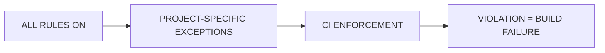
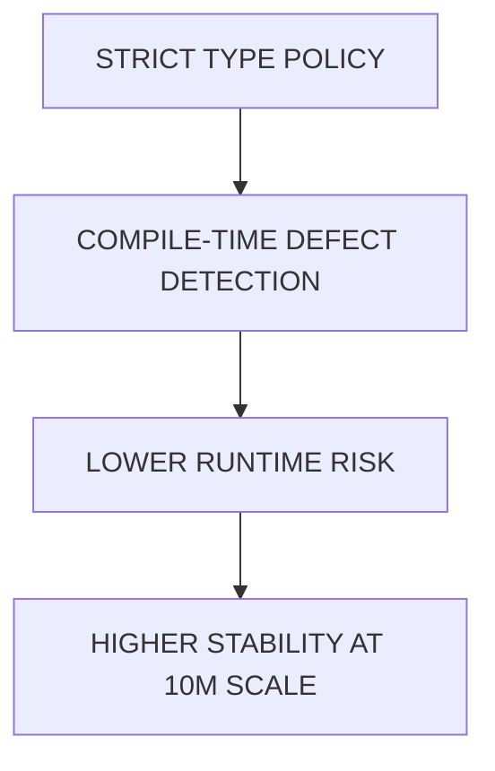
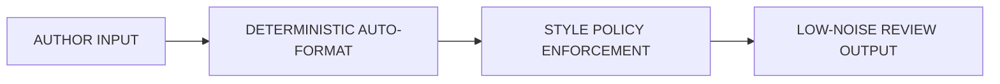
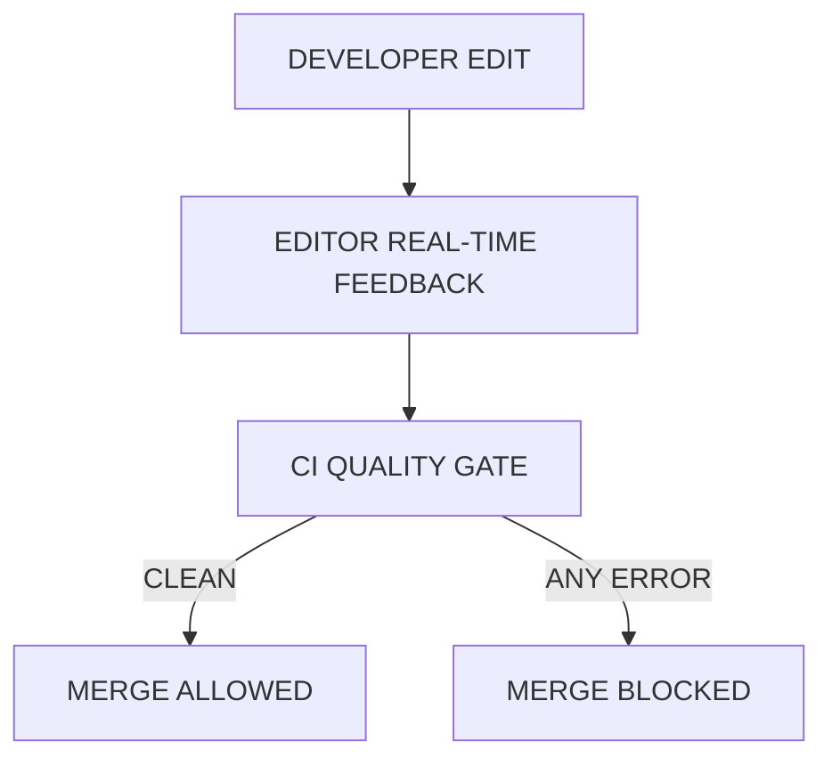
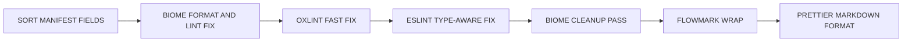
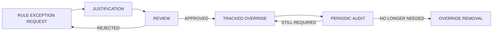
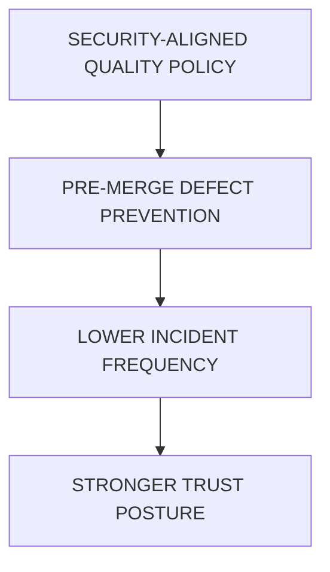
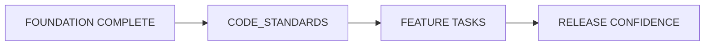

# Coding Standards, Linting, Formatting, and Type-Checking

> Scope: Coding standards, linting, formatting, and type-checking enforcement for both safeagent library and server projects using lintmax at maximum strictness.
> Tasks: CODE_STANDARDS (Coding Standards and Enforcement Infrastructure)

---

## Table of Contents
- [Standards Charter](#standards-charter)
- [Philosophy and Enforcement Model](#philosophy-and-enforcement-model)
- [Tool Stack Overview](#tool-stack-overview)
- [Biome Coverage and Policy](#biome-coverage-and-policy)
- [oxlint Coverage and Policy](#oxlint-coverage-and-policy)
- [ESLint Coverage and Policy](#eslint-coverage-and-policy)
- [Prettier Coverage and Policy](#prettier-coverage-and-policy)
- [sort-package-json Coverage and Policy](#sort-package-json-coverage-and-policy)
- [Flowmark Coverage and Policy](#flowmark-coverage-and-policy)
- [Unified Six-Tool Pipeline](#unified-six-tool-pipeline)
- [TypeScript Strictness](#typescript-strictness)
- [Formatting Conventions](#formatting-conventions)
- [Naming Conventions](#naming-conventions)
- [CI/CD Integration](#cicd-integration)
- [Development Workflow](#development-workflow)
- [Rule Exception Governance](#rule-exception-governance)
- [Security Integration](#security-integration)
- [Cross-References](#cross-references)
- [Task Specifications](#task-specifications)
- [Delivery Checklist](#delivery-checklist)
- [Navigation](#navigation)

## Standards Charter

This plan establishes one quality contract for both safeagent and server.
The safeagent library remains the primary logic surface.
The server remains intentionally thin and policy-aligned.
The standards posture is aggressive because target adoption is 10M users.
The objective is predictable quality at scale, not best-effort style alignment.

Core references:
- lintmax: https://github.com/1qh/lintmax
- Biome docs: https://biomejs.dev/
- oxlint docs: https://oxc.rs/docs/guide/usage/linter
- ESLint docs: https://eslint.org/
- Prettier docs: https://prettier.io/
- sort-package-json docs: https://github.com/keithamus/sort-package-json
- Flowmark docs: https://github.com/codethread/flowmark

Operating assumptions:
- Bun is the only runtime and toolchain baseline.
- Lintmax defaults are kept at maximum strictness.
- Rule severity does not use warning states.
- Exceptions are explicit, reviewable, and temporary by intent.
- Enforcement applies equally to library and server contexts.

## Philosophy and Enforcement Model

The standards model is inverted from typical linting setups.
Traditional setups start permissive and gradually add rules.
This plan starts with all rules active at error severity.
Teams opt out only when incompatibility is real and documented.

Policy principles:
- All rules at error by default.
- Zero warnings policy across all quality gates.
- No merge path when any quality signal fails.
- Exception requests require business and technical rationale.
- Exception debt is audited and reduced continuously.

Quality posture rationale:
- Early strictness reduces long-term maintenance risk.
- Uniform enforcement improves developer mobility across projects.
- Deterministic formatting minimizes review noise.
- Type safety constraints reduce runtime incident probability.
- Shared policy lowers drift between library and thin server.



## Tool Stack Overview

Lintmax provides a unified six-tool quality surface.
Each tool covers a distinct risk area.
Together they create fast feedback, deep semantic checks, and stable output formatting.
No single tool replaces the full stack.

## Biome Coverage and Policy

Biome is responsible for formatting and linting across:
- JavaScript surfaces.
- TypeScript surfaces.
- JSX surfaces.
- TSX surfaces.
- CSS surfaces.
- JSON surfaces.

Biome policy profile:
- All rule categories mapped to error severity.
- Framework domains enabled across modern frontend and testing ecosystems.
- Configuration generated from installed schema model.
- New rule additions enter strict mode automatically.
- Manual rule curation effort is intentionally minimized.

Biome formatting conventions enforced by policy:
- Space indentation.
- Single quotes.
- No semicolons.
- No trailing commas.
- Arrow parentheses only when needed.
- Opening bracket on the same line.

Reference:
- https://biomejs.dev/

## oxlint Coverage and Policy

oxlint provides high-speed linting focused on rapid correctness feedback.
It complements type-aware and formatter-centered layers.
It is especially valuable for large codebases where quick turnaround matters.

oxlint categories at error severity:
- correctness
- performance
- style
- pedantic
- restriction
- suspicious
- nursery

oxlint plugin domains enabled:
- eslint
- import
- jest
- jsdoc
- jsx-a11y
- nextjs
- Bun-native runtime rules and constraints
- oxc
- promise
- react
- react-perf
- typescript
- unicorn
- vitest
- extended plugin surface from lintmax strict defaults

Reference:
- https://oxc.rs/docs/guide/usage/linter

## ESLint Coverage and Policy

ESLint provides deep, type-aware linting for semantic enforcement.
It runs with aggressive preset posture under lintmax strict defaults.
Warning-level output is promoted to error severity.

ESLint policy profile:
- TypeScript-ESLint full type-checked and stylistic coverage.
- React strict type-checked profile plus complete rule surface.
- Perfectionist natural sorting for imports, types, and interfaces.
- Arrow function preference with concise return style.
- Consistent type import discipline enforced.

Reference:
- https://eslint.org/

## Prettier Coverage and Policy

Prettier is used for markdown formatting only.
Biome handles formatting in other supported source domains.
This split prevents overlapping format control and keeps output deterministic.

Markdown quality goals:
- Stable document layout across contributors.
- Reduced formatting debate during review.
- Cleaner automation output for docs-heavy workflows.

Reference:
- https://prettier.io/

## sort-package-json Coverage and Policy

sort-package-json enforces deterministic field ordering in package manifests.
Its value is repeatability and reduced diff noise in metadata changes.
Predictable ordering also helps automated tooling and release audits.

Policy outcomes:
- Cleaner metadata diffs.
- Fewer merge conflicts in manifest edits.
- Better consistency in release-related updates.

Reference:
- https://github.com/keithamus/sort-package-json

## Flowmark Coverage and Policy

Flowmark, when available, enforces markdown prose wrapping for readable and diff-friendly documentation.
It complements markdown formatting with strong line-wrap consistency.
This is valuable for long planning documents and governance artifacts.

Policy outcomes:
- Consistent prose density.
- Reviewable and maintainable long-form docs.
- Reduced churn from manual line wrapping differences.

Reference:
- https://github.com/codethread/flowmark

## Unified Six-Tool Pipeline

The six-tool stack is intentionally layered.
Each stage owns a specific quality dimension.
The sequence keeps fast checks early and deep checks where needed.

```mermaid
flowchart TB
  INPUT[PROJECT CONTENT]

  subgraph STACK[UNIFIED SIX-TOOL STACK]
    SORT[sort-package-json\nManifest Determinism]
    BIOME[Biome\nFormatting and Linting\nJS TS JSX TSX CSS JSON]
    OXLINT[oxlint\nFast Correctness and Performance Linting]
    ESLINT[ESLint\nType-Aware Semantic Linting]
    FLOWMARK[Flowmark (Optional)\nMarkdown Prose Wrapping]
    PRETTIER[Prettier\nMarkdown Formatting]
  end

  OUTPUT[ENFORCED QUALITY OUTPUT]

  INPUT --> SORT
  SORT --> BIOME
  BIOME --> OXLINT
  OXLINT --> ESLINT
  ESLINT --> FLOWMARK
  FLOWMARK --> PRETTIER
  PRETTIER --> OUTPUT
```

Pipeline governance:
- One policy stack for both safeagent and server.
- One failure model with zero warning tolerance.
- One deterministic formatting strategy for stable diffs.
- One type-safety baseline across project boundaries.

## TypeScript Strictness

TypeScript strictness is fully enabled and treated as mandatory.
Compiler-level constraints complement lint-layer policy.
The combined model catches issues earlier and shrinks runtime uncertainty.

Required strictness settings:
- Broad type contract enforcement enabled.
- Indexed access requires null checking.
- Explicit inheritance override clarity enforced.
- Control-flow safety in switch statements enforced.
- Runtime-aligned module syntax enforced.
- Independent compilation correctness enforced.
- Cross-platform naming safety enforced.
- Modern Bun-first alignment targeting the latest language standard with module and resolution modes optimized for the Bun runtime.

Strictness intent map:
- Broad type contract enforcement: comprehensive type safety across all code surfaces.
- Indexed access requires null checking: blocks unsafe indexed reads.
- Explicit inheritance override clarity: prevents accidental method override issues.
- Control-flow safety in switch statements: prevents fallthrough bugs.
- Runtime-aligned module syntax: ensures import and export behavior matches runtime expectations.
- Independent compilation correctness: enables isolated module compilation.
- Cross-platform naming safety: prevents case-sensitivity issues across platforms.
- Modern Bun-first alignment: latest language standard with module and resolution modes optimized for Bun compatibility.



Type-system security outcomes:
- Reduces null and undefined access faults.
- Improves reliability of refactors across large surfaces.
- Limits category of injection-prone dynamic behavior through stricter boundaries.

## Formatting Conventions

Formatting is deterministic and centralized.
Contributors should not make style decisions ad hoc.
Style drift is treated as quality debt.

Formatting rules enforced:
- Space indentation.
- Single quotes for strings.
- No semicolons.
- No trailing commas.
- Arrow parentheses only when needed.
- Opening brackets on the same line.
- CSS with single quotes and Tailwind directive support.
- Line width limit of 123 characters.
- Kebab-case file naming enforced.
- JSX limited to TSX surfaces.
- Capitalized comments required.
- Sorted JSX props.
- Sorted imports with natural ordering.
- Consistent type imports using separate type import syntax.



## Naming Conventions

Naming policy balances readability, familiarity, and enforcement consistency.
The objective is instant semantic recognition with minimal ambiguity.

Naming rules:
- Variables use camelCase, UPPER_CASE, or PascalCase.
- Files use kebab-case.
- JSX components use PascalCase and remain in TSX surfaces only.
- Type imports use separate import type syntax.

Naming governance:
- Consistency is favored over local shorthand.
- Rule exceptions require documented reasoning.
- Naming alignment is validated through the same strict pipeline.

## CI/CD Integration

The CI quality model is blocking, not advisory.
Any standards failure is treated as release risk.
No exception path bypasses quality gates without explicit governance approval.

Required integration behaviors:
- The validation command runs in CI as a required quality gate.
- Build fails on any linting, formatting, or type error.
- Merge is blocked until check results are fully clean.
- Editor integration aligns local output with CI output.
- Biome runs as formatter in editor save workflows.
- ESLint provides type-aware feedback in editor workflows.

Integration alignment:
- Pipeline expectations are shared across safeagent and server.
- Local feedback and CI feedback must match in severity and outcomes.
- Quality signals are treated as production risk indicators.

Cross-reference:
- the Release Pipeline document for broader pipeline orchestration and admission gates.



## Development Workflow

Development uses two primary Bun quality flows.
One flow applies deterministic fixes.
One flow validates without modifying content.

Workflow definitions:
- The auto-fix operation applies deterministic corrections across the full codebase.
- The validation command validates the same policy surface without modifications.

Auto-fix operation execution order:
1. Package manifest field sorting.
2. Biome formatting and lint fixes.
3. oxlint fast lint fixes.
4. ESLint type-aware lint fixes.
5. Second Biome pass to normalize post-ESLint output.
6. Markdown prose wrapping (when Flowmark is available).
7. Markdown formatting.

Workflow guarantees:
- Whole-codebase coverage in one pass.
- Deterministic ordering for repeatable results.
- Idempotent behavior on already-clean code.
- Consistent outcomes across library and server repositories.



## Rule Exception Governance

Exception governance prevents strictness erosion.
All exceptions are deliberate and accountable.
No silent bypass path is accepted.

Governance rules:
- All rules begin at error severity.
- No warning severity state is available for policy compromise.
- Project-specific exceptions require documented justification.
- Exception setup uses lintmax override mechanisms.
- Inline disable comments are tracked as governance signals.
- Unused disable directives are treated as errors.
- Exception review approval is mandatory before adoption.
- Active exceptions are audited periodically.
- Stale exceptions are removed promptly.



## Security Integration

Security is embedded throughout linting and type policy.
Quality tooling doubles as preventative control for common mistake classes.

Security controls in this plan:
- Linting captures risky anti-patterns before merge.
- Type strictness blocks classes of unsafe runtime behavior.
- Import and semantic consistency checks reduce hidden coupling risk.
- No-secrets posture is evaluated continuously.
- Dependency and plugin domain breadth improves threat-surface scrutiny.

Security governance note:
- Biome noSecrets is among defaults often disabled and should be reassessed for server threat posture.
- Reassessment should include false-positive cost and incident-prevention value.
- Any decision should be documented through the exception governance flow.



## Cross-References

| Plan File | Connection |
|---|---|
| [Foundation](./foundation.md) | TypeScript strictness baseline and runtime constraints alignment |
| [Testing Strategy](./testing.md) | Test-focused rule relaxation scenarios and exception boundaries |
| [Release Pipeline](./release-pipeline.md) | validation command quality gate and merge admission enforcement |

## Task Specifications

### CODE_STANDARDS

**Task Name**: CODE_STANDARDS

**Objective**: Establish maximum-strictness coding standards enforcement across both safeagent library and server projects using lintmax.

**What To Do**:
- Install lintmax and initialize policy in both projects.
- Verify all default rules are active at error severity.
- Configure project-specific exceptions with documented justification.
- Integrate the validation command into CI as a blocking quality gate.
- Set up editor behavior for format-on-save and real-time lint feedback.
- Validate TypeScript strictness policy is fully active.
- Document every project-specific override with rationale and review trace.

**Depends On**: FOUNDATION

**Batch**: SCAFFOLDING_BATCH

**Acceptance Criteria**:
- lintmax is active in both projects with maximum strictness defaults.
- The validation command passes with zero errors across the full codebase.
- The auto-fix operation is idempotent on a clean baseline.
- CI rejects any change containing lint, format, or type failures.
- Every active exception has documented justification.
- Editor integration is configured and behavior is verified.
- TypeScript strict mode and additional strictness options are enabled.

**QA Scenarios**:
- Introduce a formatting violation and verify CI rejection.
- Introduce a type defect and verify CI rejection.
- Introduce an ESLint violation and verify CI rejection.
- Run the auto-fix operation on clean content and verify no changes occur.
- Verify editor save output matches auto-fix operation output.
- Add an inline disable for a non-existent rule and verify error detection.
- Validate strictness by introducing patterns that only pass under weaker type policy.

**Implementation Notes**:
- CODE_STANDARDS is SCAFFOLDING_BATCH and should precede feature work.
- Test-related exceptions are expected and must be scoped carefully.
- Generated content can be excluded from strict linting when justified.
- Thin server policy should remain aligned with library policy to prevent drift.



## Delivery Checklist

- lintmax installed and initialized with default maximum strictness settings.
- Six-tool pipeline verified across Biome, oxlint, ESLint, Prettier, sort-package-json, and Flowmark (when available).
- TypeScript strictness fully active with the full additional check set.
- CI quality gate blocks on any linting, formatting, or type violation.
- Editor integration scaffolded with format-on-save and type-aware feedback.
- Project-specific exceptions documented, justified, and review-approved.
- Zero warnings and zero errors on clean codebase checks.

## Test Specifications

> **Relationship to Task Specifications**: The QA Scenarios in each task spec above verify task completion through action-oriented acceptance checks. The test specifications below define comprehensive behavioral assertions for property-based and integration testing. Both are complementary — QA Scenarios confirm "the task is done," test specifications confirm "the system behaves correctly under all conditions."

**Enforcement pipeline behavior**:

- All six tools execute in deterministic order during fix operations.
- Check mode validates without modifying any files.
- Fix mode is idempotent on a codebase with no violations.
- CI quality gate rejects any change containing lint, format, or type failures.
- Pipeline covers all supported file types: TypeScript, JavaScript, JSX, TSX, CSS, JSON, Markdown.

**Biome enforcement behavior**:

- All Biome rule categories are active at error severity.
- Dynamically generated configuration includes newly added rules automatically.
- Formatting violations are caught and fixable: indentation, quotes, semicolons, trailing commas, bracket placement.
- Framework domain rules are active for React, Next.js, and Tailwind contexts.

**oxlint enforcement behavior**:

- All seven oxlint categories are active at error severity: correctness, performance, style, pedantic, restriction, suspicious, nursery.
- All plugin domains are enabled and producing diagnostics.
- Kebab-case file naming is enforced.
- Capitalized comments are enforced.

**ESLint type-aware enforcement behavior**:

- Type-checked rules require TypeScript project references and produce type-aware diagnostics.
- All warning-level rules from plugins are promoted to error severity.
- Arrow function preference with implicit returns is enforced.
- Consistent type import syntax is enforced with separate type imports.
- Import, type, and interface sorting follows natural ordering.
- Sorted JSX props are enforced in TSX files.
- Unused inline disable comments are flagged as errors.

**TypeScript strictness behavior**:

- Strict mode is active with all family checks enabled.
- Unchecked indexed access requires null checking.
- Override keyword is required for overridden members.
- Switch cases must break or return without fallthrough.
- Module syntax matches runtime behavior under verbatim module syntax.
- Each file is independently compilable under isolated modules.

**Rule exception governance behavior**:

- Project-specific exceptions are configured through the override system with documented justification.
- Inline disable comments for non-existent rules are flagged as errors.
- Exception audit detects stale overrides no longer needed.
- New exceptions require review approval before activation.

**Markdown and manifest formatting behavior**:

- Markdown files are formatted through Prettier.
- Markdown prose wrapping produces diff-friendly output through Flowmark.
- Package manifest field ordering is deterministic and consistent.
