# Conversation Pipeline
> **Scope**: Full conversation pipeline from input validation to response assembly.
>
> This document unifies prior intent and query pipeline plans into one coherent flow. Humanlike signals are first-class behavior within normal pipeline stages.

## Why This Pipeline Matters
The system serves multiple domains (support, product info, policy, and more). Without intent-aware routing, every query fans out everywhere, increasing latency and cost while reducing quality. This pipeline classifies intent with memory context, rewrites only when needed, routes sources by priority, merges evidence with weighting, and assembles grounded responses with recovery-aware conversation behavior.

## Unified Architecture Overview
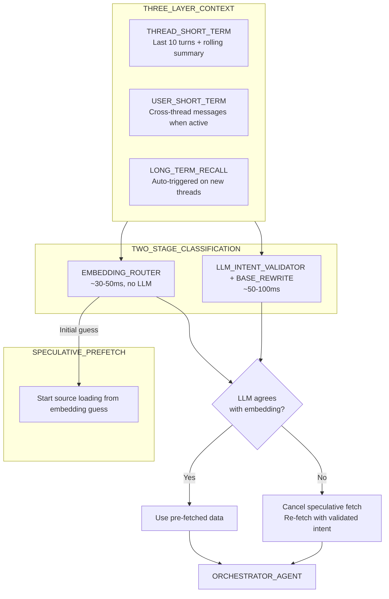
```mermaid
graph TB
    THREAD_SHORT_TERM["THREAD_SHORT_TERM<br/>Last 10 turns + rolling summary"]
    USER_SHORT_TERM["USER_SHORT_TERM<br/>Cross-thread messages when active"]
    LONG_TERM_RECALL["LONG_TERM_RECALL<br/>Auto-triggered on new threads"]
    subgraph THREE_LAYER_CONTEXT["THREE_LAYER_CONTEXT"]
        THREAD_SHORT_TERM
        USER_SHORT_TERM
        LONG_TERM_RECALL
    end
    subgraph TWO_STAGE_CLASSIFICATION["TWO_STAGE_CLASSIFICATION"]
        direction TB
        EMBEDDING_ROUTER["EMBEDDING_ROUTER<br/>~30-50ms, no LLM"]
        LLM_INTENT_VALIDATOR["LLM_INTENT_VALIDATOR + BASE_REWRITE<br/>~50-100ms"]
    end
    subgraph SPECULATIVE_PREFETCH["SPECULATIVE_PREFETCH"]
        PREFETCH_START["Start source loading from embedding guess"]
    end
    AGREEMENT{LLM agrees<br/>with embedding?}
    USE_PREFETCH["Use pre-fetched data"]
    CANCEL_REFETCH["Cancel speculative fetch<br/>Re-fetch with validated intent"]
    ORCHESTRATOR["ORCHESTRATOR_AGENT"]
    THREE_LAYER_CONTEXT --> EMBEDDING_ROUTER
    EMBEDDING_ROUTER -->|Initial guess| PREFETCH_START
    THREE_LAYER_CONTEXT --> LLM_INTENT_VALIDATOR
    EMBEDDING_ROUTER --> AGREEMENT
    LLM_INTENT_VALIDATOR --> AGREEMENT
    AGREEMENT -->|Yes| USE_PREFETCH --> ORCHESTRATOR
    AGREEMENT -->|No| CANCEL_REFETCH --> ORCHESTRATOR
```

## Phase 0: Input Validation and Early Language Gate
Fast language detection runs first for clear allow/block paths. Ambiguous or mixed-language content proceeds to intent classification. Intended output language is validated in the same structured intent call (piggyback), avoiding extra model latency.
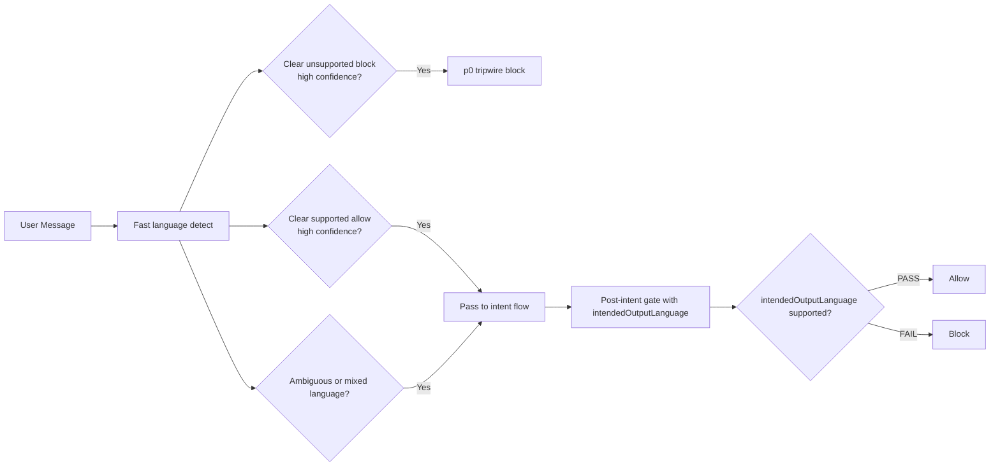
```mermaid
flowchart LR
    USER_MESSAGE[User Message] --> FAST_DETECT[Fast language detect]
    FAST_DETECT --> BLOCK_DECISION{Clear unsupported block\nhigh confidence?}
    BLOCK_DECISION -->|Yes| TRIPWIRE_BLOCK[p0 tripwire block]
    FAST_DETECT --> ALLOW_DECISION{Clear supported allow\nhigh confidence?}
    ALLOW_DECISION -->|Yes| INTENT_FLOW[Pass to intent flow]
    FAST_DETECT --> AMBIGUOUS{Ambiguous or mixed language?}
    AMBIGUOUS -->|Yes| INTENT_FLOW
    INTENT_FLOW --> POST_INTENT_GATE[Post-intent gate with intendedOutputLanguage]
    POST_INTENT_GATE --> CHECK{intendedOutputLanguage supported?}
    CHECK -->|PASS| ALLOW[Allow]
    CHECK -->|FAIL| BLOCK[Block]
```

## Phase 1: Non-Actionable Detection
Before embedding or LLM calls, a conservative pre-filter short-circuits only fully non-actionable turns.

First gate: pleasantries, acknowledgments, and single-emoji-only messages.

Second gate: gibberish via entropy and language reliability signals.

Return shape: non-actionable classification with subtype values for pleasantry, acknowledgment, emoji-only, or gibberish.

Short-circuit path skips embedding, LLM intent, rewriting, source routing, and fact extraction. Mixed actionable turns do not short-circuit. Tuning prioritizes false-positive avoidance for short valid tokens, abbreviations, and non-Latin scripts.
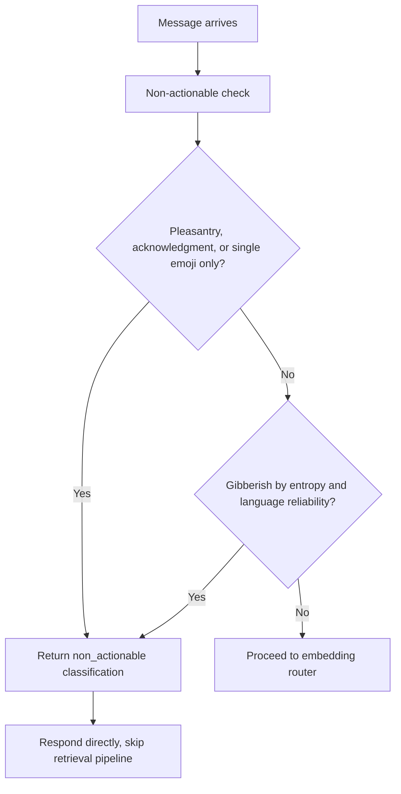
```mermaid
flowchart TB
    MESSAGE_ARRIVES[Message arrives]
    NON_ACTIONABLE_CHECK[Non-actionable check]
    PLEASANTRY_ACK_EMOJI{Pleasantry, acknowledgment, or single emoji only?}
    GIBBERISH_CHECK{Gibberish by entropy and language reliability?}
    DIRECT_NON_ACTIONABLE[Return non_actionable classification]
    DIRECT_RESPONSE[Respond directly, skip retrieval pipeline]
    FULL_PIPELINE[Proceed to embedding router]
    MESSAGE_ARRIVES --> NON_ACTIONABLE_CHECK
    NON_ACTIONABLE_CHECK --> PLEASANTRY_ACK_EMOJI
    PLEASANTRY_ACK_EMOJI -->|Yes| DIRECT_NON_ACTIONABLE --> DIRECT_RESPONSE
    PLEASANTRY_ACK_EMOJI -->|No| GIBBERISH_CHECK
    GIBBERISH_CHECK -->|Yes| DIRECT_NON_ACTIONABLE
    GIBBERISH_CHECK -->|No| FULL_PIPELINE
```

## Phase 2: Context Assembly
Intent routing consumes three-layer context:
- Thread short-term (last turns + rolling summary).
- User short-term (cross-thread messages when active).
- Long-term recall (auto-triggered for new threads).

Ordering guarantee: memory loading completes before intent detection. First-turn recall uses raw user message and does not depend on pre-classified intent. See [Memory & Intelligence](./memory.md).

### Context Boundary Enforcement

All content assembled into the model context follows a strict trust hierarchy:

- System instructions (highest trust): Delivered through Gemini's dedicated system instruction channel and treated as authoritative policy.
- User messages (medium trust): Direct user input after input guardrail screening.
- Retrieved content (zero trust): RAG chunks, recalled memories, and cross-thread message fragments treated as data only, never as executable instructions.

Retrieved content is wrapped with reinforcement boundaries before context assembly. Security framing appears before and after untrusted content to reinforce that retrieved text is informational data, not behavioral instructions. This sandwich framing is mandatory because delimiters alone are not sufficient defense.

When any zero-trust content contains instruction-like patterns, the retrieval and memory classifiers enforce one of two safe transforms before assembly: redact the risky segment with a security marker, or preserve it with explicit data-only framing. Unmarked zero-trust content is never inserted into instruction-adjacent positions.

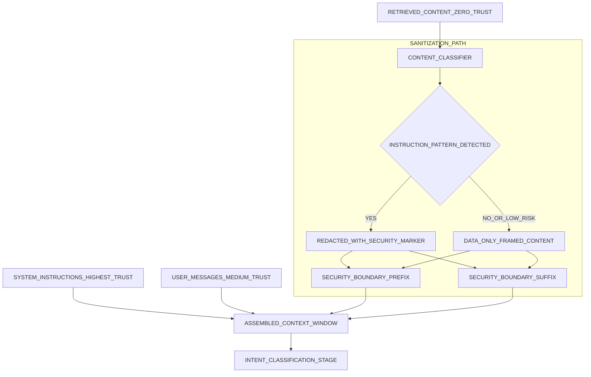
```mermaid
flowchart TB
    SYSTEM_LAYER[SYSTEM_INSTRUCTIONS_HIGHEST_TRUST]
    USER_LAYER[USER_MESSAGES_MEDIUM_TRUST]
    ZERO_TRUST_LAYER[RETRIEVED_CONTENT_ZERO_TRUST]

    subgraph SANITIZATION_PATH[SANITIZATION_PATH]
        CONTENT_CLASSIFIER[CONTENT_CLASSIFIER]
        INSTRUCTION_PATTERN{INSTRUCTION_PATTERN_DETECTED}
        REDACTED_CONTENT[REDACTED_WITH_SECURITY_MARKER]
        DATA_ONLY_CONTENT[DATA_ONLY_FRAMED_CONTENT]
        SANDWICH_PRE[SECURITY_BOUNDARY_PREFIX]
        SANDWICH_POST[SECURITY_BOUNDARY_SUFFIX]
    end

    ASSEMBLED_CONTEXT[ASSEMBLED_CONTEXT_WINDOW]
    INTENT_STAGE[INTENT_CLASSIFICATION_STAGE]

    SYSTEM_LAYER --> ASSEMBLED_CONTEXT
    USER_LAYER --> ASSEMBLED_CONTEXT
    ZERO_TRUST_LAYER --> CONTENT_CLASSIFIER
    CONTENT_CLASSIFIER --> INSTRUCTION_PATTERN
    INSTRUCTION_PATTERN -->|YES| REDACTED_CONTENT
    INSTRUCTION_PATTERN -->|NO_OR_LOW_RISK| DATA_ONLY_CONTENT
    REDACTED_CONTENT --> SANDWICH_PRE
    DATA_ONLY_CONTENT --> SANDWICH_PRE
    SANDWICH_PRE --> ASSEMBLED_CONTEXT
    REDACTED_CONTENT --> SANDWICH_POST
    DATA_ONLY_CONTENT --> SANDWICH_POST
    SANDWICH_POST --> ASSEMBLED_CONTEXT
    ASSEMBLED_CONTEXT --> INTENT_STAGE
```

## Phase 3: Two-Stage Intent Classification with Integrated Signals
Two-stage model, one coherent flow:
- Fast embedding router provides semantic hint and confidence.
- LLM intent validator is authority and returns validated intent package plus base rewrite and control signals.

### Embedding Router Stage (~30-50ms)
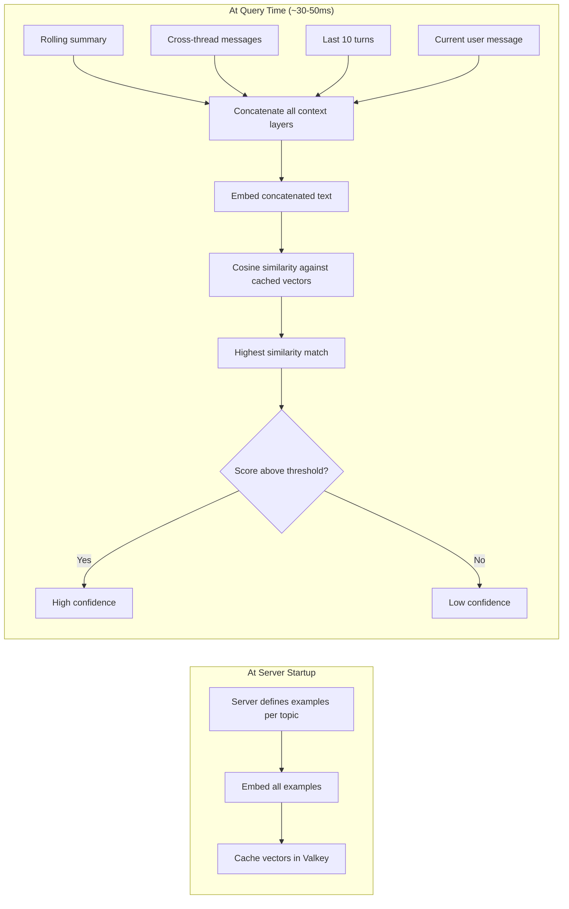
```mermaid
flowchart LR
    subgraph SETUP["At Server Startup"]
        EXAMPLES["Server defines examples per topic"] --> EMBED_EXAMPLES["Embed all examples"]
        EMBED_EXAMPLES --> CACHE_VALKEY["Cache vectors in Valkey"]
    end
    subgraph RUNTIME["At Query Time (~30-50ms)"]
        ROLLING["Rolling summary"]
        CROSS_THREAD["Cross-thread messages"]
        LAST_TURNS["Last 10 turns"]
        CURRENT["Current user message"]
        ROLLING --> CONCAT["Concatenate all context layers"]
        CROSS_THREAD --> CONCAT
        LAST_TURNS --> CONCAT
        CURRENT --> CONCAT
        CONCAT --> EMBED_QUERY["Embed concatenated text"]
        EMBED_QUERY --> COMPARE["Cosine similarity against cached vectors"]
        COMPARE --> BEST_MATCH["Highest similarity match"]
        BEST_MATCH --> THRESHOLD{Score above threshold?}
        THRESHOLD -->|Yes| HIGH["High confidence"]
        THRESHOLD -->|No| LOW["Low confidence"]
    end
```

### LLM Validation + Base Rewrite Stage (~50-100ms)
The LLM always runs and receives embedding guess as hint.

Single structured output includes:
- validated intent, validated topics, rewritten query, clarification requirement, and detected intent count.
- intended output language, translation-intent signal, and translation target language.
- temporal references, dependent intents, and dependency order.
- attribute-level negations and query replay structure.
- Correction, frustration, topic abandonment, and ambiguity signals.
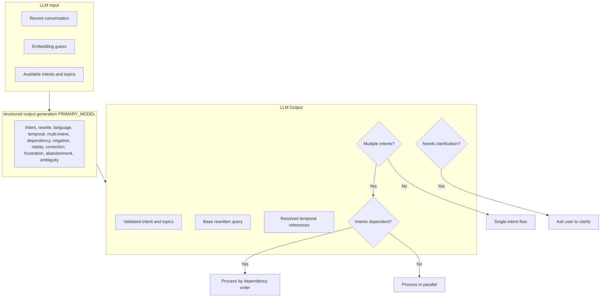
```mermaid
flowchart TB
    subgraph INPUT["LLM Input"]
        CONVERSATION["Recent conversation"]
        EMBEDDING_HINT["Embedding guess"]
        INTENT_LIST["Available intents and topics"]
    end
    subgraph LLM_CALL["structured output generation PRIMARY_MODEL"]
        SCHEMA["Intent, rewrite, language, temporal, multi-intent, dependency, negation, replay, correction, frustration, abandonment, ambiguity"]
    end
    subgraph OUTPUT["LLM Output"]
        VALIDATED["Validated intent and topics"]
        REWRITTEN["Base rewritten query"]
        TEMPORAL["Resolved temporal references"]
        MULTI{Multiple intents?}
        CLARIFY{Needs clarification?}
        DEPENDENT{Intents dependent?}
    end
    INPUT --> LLM_CALL --> OUTPUT
    MULTI -->|Yes| DEPENDENT
    MULTI -->|No| SINGLE["Single-intent flow"]
    DEPENDENT -->|Yes| ORDERED["Process by dependency order"]
    DEPENDENT -->|No| PARALLEL["Process in parallel"]
    CLARIFY -->|Yes| ASK["Ask user to clarify"]
```

### Speculative Pre-Fetching
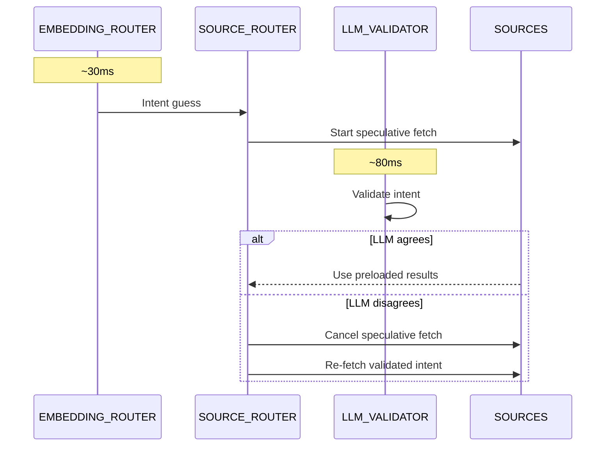
```mermaid
sequenceDiagram
    participant EMBEDDING_ROUTER as EMBEDDING_ROUTER
    participant SOURCE_ROUTER as SOURCE_ROUTER
    participant LLM_VALIDATOR as LLM_VALIDATOR
    participant SOURCES as SOURCES
    Note over EMBEDDING_ROUTER: ~30ms
    EMBEDDING_ROUTER->>SOURCE_ROUTER: Intent guess
    SOURCE_ROUTER->>SOURCES: Start speculative fetch
    Note over LLM_VALIDATOR: ~80ms
    LLM_VALIDATOR->>LLM_VALIDATOR: Validate intent
    alt LLM agrees
        SOURCES-->>SOURCE_ROUTER: Use preloaded results
    else LLM disagrees
        SOURCE_ROUTER->>SOURCES: Cancel speculative fetch
        SOURCE_ROUTER->>SOURCES: Re-fetch validated intent
    end
```

### Integrated Humanlike Signals in Intent Pipeline
Correction detection is part of LLM intent classification and triggers immediate re-interpretation against corrected user constraints.

Frustration detection is part of signal detection during intent analysis and tracks escalation across turns to inject de-escalation context.

Topic abandonment is part of intent classification and flushes stale topic context.

Proactive clarification is part of ambiguity handling in low-confidence, multi-plausible cases.
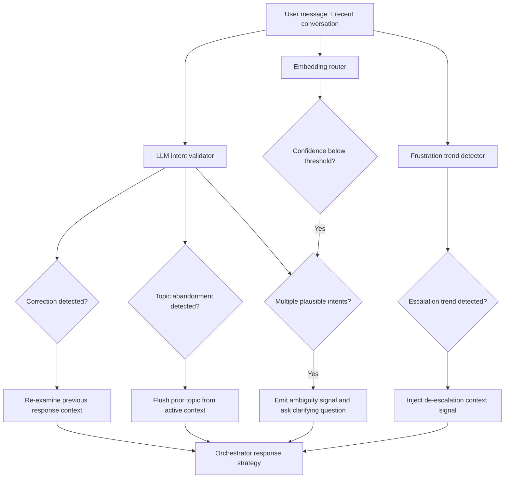
```mermaid
flowchart TB
    MESSAGE[User message + recent conversation]
    EMBED[Embedding router]
    LLM[LLM intent validator]
    FRUSTRATION_SIGNAL[Frustration trend detector]
    MESSAGE --> EMBED
    MESSAGE --> LLM
    MESSAGE --> FRUSTRATION_SIGNAL
    EMBED --> CONF_LOW{Confidence below threshold?}
    LLM --> CORRECTION{Correction detected?}
    LLM --> ABANDONMENT{Topic abandonment detected?}
    LLM --> PLAUSIBLE{Multiple plausible intents?}
    FRUSTRATION_SIGNAL --> ESCALATION{Escalation trend detected?}
    CORRECTION --> REEXAMINE[Re-examine previous response context]
    ABANDONMENT --> FLUSH[Flush prior topic from active context]
    CONF_LOW -->|Yes| PLAUSIBLE
    PLAUSIBLE -->|Yes| CLARIFY[Emit ambiguity signal and ask clarifying question]
    ESCALATION --> DEESCALATE[Inject de-escalation context signal]
    REEXAMINE --> ORCH[Orchestrator response strategy]
    FLUSH --> ORCH
    CLARIFY --> ORCH
    DEESCALATE --> ORCH
```

## Intent Configuration (Server-Defined)
The server defines all intents and topics; library includes no built-in business intents.
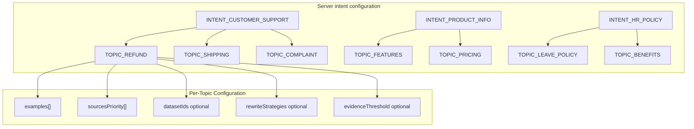
```mermaid
graph TD
    subgraph INTENT_CONFIG["Server intent configuration"]
        INTENT_CUSTOMER_SUPPORT["INTENT_CUSTOMER_SUPPORT"]
        INTENT_PRODUCT_INFO["INTENT_PRODUCT_INFO"]
        INTENT_HR_POLICY["INTENT_HR_POLICY"]
        INTENT_CUSTOMER_SUPPORT --> TOPIC_REFUND["TOPIC_REFUND"]
        INTENT_CUSTOMER_SUPPORT --> TOPIC_SHIPPING["TOPIC_SHIPPING"]
        INTENT_CUSTOMER_SUPPORT --> TOPIC_COMPLAINT["TOPIC_COMPLAINT"]
        INTENT_PRODUCT_INFO --> TOPIC_FEATURES["TOPIC_FEATURES"]
        INTENT_PRODUCT_INFO --> TOPIC_PRICING["TOPIC_PRICING"]
        INTENT_HR_POLICY --> TOPIC_LEAVE_POLICY["TOPIC_LEAVE_POLICY"]
        INTENT_HR_POLICY --> TOPIC_BENEFITS["TOPIC_BENEFITS"]
    end
    subgraph TOPIC_DETAIL["Per-Topic Configuration"]
        TOPIC_REFUND --> EXAMPLES_LIST["examples[]"]
        TOPIC_REFUND --> SOURCE_PRIORITY["sourcesPriority[]"]
        TOPIC_REFUND --> DATASET_IDS["datasetIds optional"]
        TOPIC_REFUND --> REWRITE_STRATEGIES["rewriteStrategies optional"]
        TOPIC_REFUND --> EVIDENCE_THRESHOLD["evidenceThreshold optional"]
    end
```

### Intent Configuration Type Shape
| Field | Type | Description |
|-------|------|-------------|
| intents | map of intent names to intent definitions | Named business intents |
| intent description field | text | LLM-readable domain description |
| intent topics field | map of topic names to topic definitions | Named topics |
| topic examples field | list of text | Embedding router examples |
| topic source priority field | ordered list of source names | Ordered source list |
| topic dataset override field (optional) | list of text | Topic-level dataset override |
| topic rewrite strategy override field (optional) | map from source to strategy label | Per-source strategy override |
| topic evidence threshold field (optional) | evidence threshold configuration object | Topic-specific evidence behavior |
| topic empty-result behavior field (optional) | map from source to empty-result status | Empty result handling by source |
| embedding confidence threshold field (optional) | numeric value | Embedding confidence cutoff |
| fallback behavior field | clarify | No-match fallback behavior |

### Scale Considerations
- Typical scale: multiple intents and topics.
- Cached vectors fit comfortably in Valkey at expected scale.
- Per-query classification cost is one embedding call plus one structured LLM call.
- Intent configuration update triggers full re-embedding.

## Embedding Router Cache Strategy

```mermaid
flowchart TB
    subgraph STARTUP["Server Startup"]
        CONFIG["intent configuration"] --> EXTRACT["Extract topic examples"]
        EXTRACT --> BATCH["Batch embed examples"]
        BATCH --> STORE["Store vectors in Valkey hash"]
    end
    subgraph QUERY["Per Query"]
        EMBED_QUERY["Embed query"] --> FETCH["Fetch cached vectors"]
        FETCH --> COSINE["Compute cosine similarity"]
        COSINE --> SORT["Sort by similarity"]
        SORT --> TOP["Return top match and score"]
    end
    subgraph INVALIDATION["Cache Invalidation"]
        CHANGE["intent configuration changes"] --> CLEAR["Delete Valkey hash"]
        CLEAR --> REEMBED["Re-embed examples"]
    end
```
Performance is dominated by embedding latency; vector fetch and cosine scoring are minor.

## Fallback and Ambiguity Handling
No-match fallback is fixed to clarification. Low-confidence ambiguous cases trigger proactive clarification rather than forced assumptions.
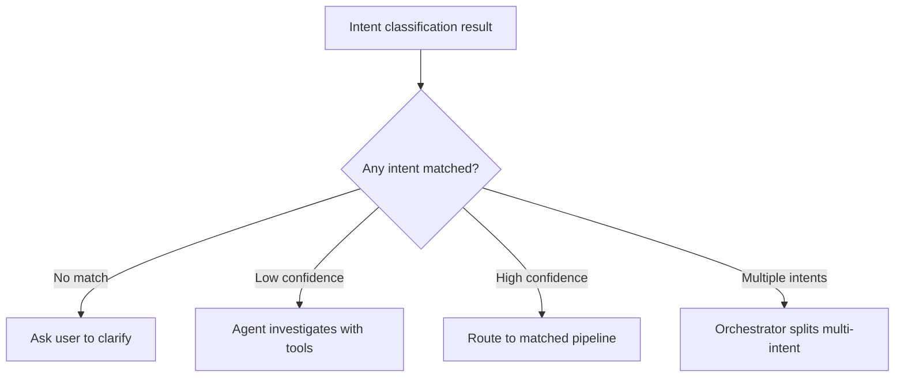
```mermaid
flowchart TB
    RESULT[Intent classification result]
    CHECK{Any intent matched?}
    CLARIFY[Ask user to clarify]
    AGENT_DECIDE[Agent investigates with tools]
    ROUTE[Route to matched pipeline]
    SPLIT[Orchestrator splits multi-intent]
    RESULT --> CHECK
    CHECK -->|No match| CLARIFY
    CHECK -->|Low confidence| AGENT_DECIDE
    CHECK -->|High confidence| ROUTE
    CHECK -->|Multiple intents| SPLIT
```

## Multi-Intent and Dependent Multi-Intent
Classifier outputs detected intent count and decomposition for multi-intent turns.
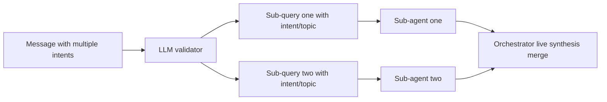
```mermaid
flowchart LR
    MSG["Message with multiple intents"]
    LLM_V["LLM validator"]
    MSG --> LLM_V
    LLM_V --> SUBQUERY_ONE["Sub-query one with intent/topic"]
    LLM_V --> SUBQUERY_TWO["Sub-query two with intent/topic"]
    SUBQUERY_ONE --> SUBAGENT_ONE["Sub-agent one"]
    SUBQUERY_TWO --> SUBAGENT_TWO["Sub-agent two"]
    SUBAGENT_ONE --> MERGE["Orchestrator live synthesis merge"]
    SUBAGENT_TWO --> MERGE
```
Dependent intents include a dependency list and explicit dependency order.
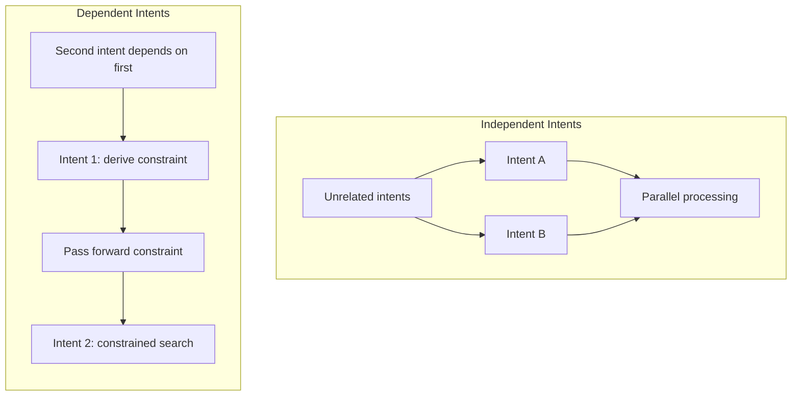
```mermaid
flowchart TB
    subgraph INDEPENDENT["Independent Intents"]
        direction LR
        MSG_IND["Unrelated intents"]
        INTENT_A["Intent A"]
        INTENT_B["Intent B"]
        MSG_IND --> INTENT_A
        MSG_IND --> INTENT_B
        INTENT_A --> PARALLEL_A["Parallel processing"]
        INTENT_B --> PARALLEL_A
    end
    subgraph DEPENDENT["Dependent Intents"]
        direction TB
        MSG_DEP["Second intent depends on first"]
        FEEDBACK["Intent 1: derive constraint"]
        SEARCH["Intent 2: constrained search"]
        CONSTRAINT["Pass forward constraint"]
        MSG_DEP --> FEEDBACK
        FEEDBACK --> CONSTRAINT
        CONSTRAINT --> SEARCH
    end
```

### Common Dependency Patterns
| Pattern | Example | Dependency |
|---------|---------|-----------|
| Feedback + constrained search | Reject one result and ask for alternatives | Search depends on exclusion constraint |
| Comparison + selection | Compare then choose | Selection depends on comparison output |
| Context establishment + query | Provide org context then ask policy | Query depends on context |
| Negation + alternative | Not that one, show different | Alternative depends on negation target |

### Attribute Negation Detection
LLM emits attribute-negation entries for property-level exclusion (for example, without parking). This differs from entity exclusion constraints used in dependent-intent flows.

### Query Replay Detection
LLM emits a query-replay structure with parameter substitutions for replay turns (for example, same search but different location). Detection uses thread short-term context to recover the referenced prior query.

## Language Validation Piggyback
Intended output language, translation-intent signal, and translation target language are returned by intent classification. Post-intent policy checks supported output language and resolves translation edge cases correctly.

## Temporal Expression Resolution
Temporal phrases are resolved in intent classification to concrete ranges using user timezone from request context; UTC is fallback.

### Resolution Examples
| Expression | Resolved Range | Example |
|-----------|----------------|---------|
| yesterday | previous day start to end | 2026-03-07 00:00:00 to 2026-03-07 23:59:59 |
| last week | seven-day window ending yesterday | 2026-02-28 00:00:00 to 2026-03-06 23:59:59 |
| this morning | today start to now | 2026-03-08 00:00:00 to 2026-03-08 14:30:00 |
| last month | thirty-day window ending yesterday | 2026-02-06 00:00:00 to 2026-03-06 23:59:59 |
| today | today start to now | 2026-03-08 00:00:00 to 2026-03-08 14:30:00 |

### Integration with Memory Recall
Resolved range is passed as `temporalHint` and applied before semantic ranking.
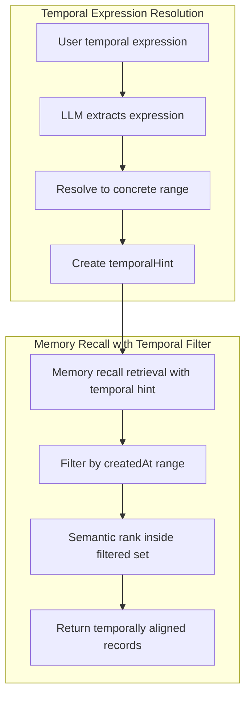
```mermaid
flowchart TB
    subgraph TEMPORAL_RESOLUTION["Temporal Expression Resolution"]
        EXPR["User temporal expression"]
        EXTRACT["LLM extracts expression"]
        RESOLVE["Resolve to concrete range"]
        HINT["Create temporalHint"]
    end
    subgraph MEMORY_RECALL["Memory Recall with Temporal Filter"]
        RECALL["Memory recall retrieval with temporal hint"]
        FILTER["Filter by createdAt range"]
        SEMANTIC["Semantic rank inside filtered set"]
        RESULT["Return temporally aligned records"]
    end
    EXPR --> EXTRACT
    EXTRACT --> RESOLVE
    RESOLVE --> HINT
    HINT --> RECALL
    RECALL --> FILTER
    FILTER --> SEMANTIC
    SEMANTIC --> RESULT
```

## Phase 4: Unified Rewrite + Source Routing Flow
Two-stage rewrite model as one flow:
- LLM_INTENT: trigger detection and conversation-aware base rewrite.
- REWRITE_TOOL: source-specific rewrite strategy application.
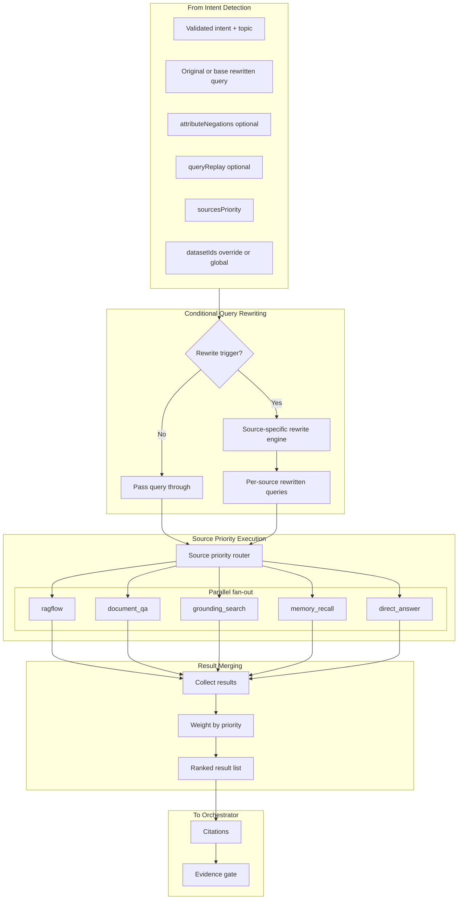
```mermaid
flowchart TB
    subgraph INPUT["From Intent Detection"]
        INTENT["Validated intent + topic"]
        QUERY["Original or base rewritten query"]
        NEGATIONS["attributeNegations optional"]
        REPLAY["queryReplay optional"]
        PRIORITY["sourcesPriority"]
        DATASETS["datasetIds override or global"]
    end
    subgraph REWRITE["Conditional Query Rewriting"]
        TRIGGER{Rewrite trigger?}
        PASS["Pass query through"]
        ENGINE["Source-specific rewrite engine"]
        PER_SOURCE["Per-source rewritten queries"]
    end
    subgraph EXECUTION["Source Priority Execution"]
        ROUTER["Source priority router"]
        subgraph PARALLEL["Parallel fan-out"]
            S_RAGFLOW["ragflow"]
            S_DOCQA["document_qa"]
            S_GROUND["grounding_search"]
            S_MEMORY["memory_recall"]
            S_DIRECT["direct_answer"]
        end
    end
    subgraph MERGE["Result Merging"]
        COLLECT["Collect results"]
        WEIGHT["Weight by priority"]
        RANKED["Ranked result list"]
    end
    subgraph OUTPUT["To Orchestrator"]
        CITATIONS["Citations"]
        EVIDENCE["Evidence gate"]
    end
    INPUT --> TRIGGER
    TRIGGER -->|No| PASS --> ROUTER
    TRIGGER -->|Yes| ENGINE --> PER_SOURCE --> ROUTER
    ROUTER --> S_RAGFLOW & S_DOCQA & S_GROUND & S_MEMORY & S_DIRECT
    S_RAGFLOW & S_DOCQA & S_GROUND & S_MEMORY & S_DIRECT --> COLLECT
    COLLECT --> WEIGHT --> RANKED --> CITATIONS --> EVIDENCE
```

## Conditional Rewriting and the 7 Triggers
Rewrite is conditional; no trigger means pass-through.
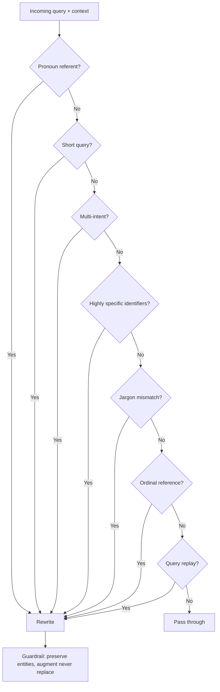
```mermaid
flowchart TB
    INCOMING_QUERY["Incoming query + context"]
    PRONOUN{Pronoun referent?}
    SHORT{Short query?}
    MULTI{Multi-intent?}
    SPECIFIC{Highly specific identifiers?}
    JARGON{Jargon mismatch?}
    ORDINAL{Ordinal reference?}
    REPLAY{Query replay?}
    PASS["Pass through"]
    REWRITE["Rewrite"]
    INCOMING_QUERY --> PRONOUN
    PRONOUN -->|Yes| REWRITE
    PRONOUN -->|No| SHORT
    SHORT -->|Yes| REWRITE
    SHORT -->|No| MULTI
    MULTI -->|Yes| REWRITE
    MULTI -->|No| SPECIFIC
    SPECIFIC -->|Yes| REWRITE
    SPECIFIC -->|No| JARGON
    JARGON -->|Yes| REWRITE
    JARGON -->|No| ORDINAL
    ORDINAL -->|Yes| REWRITE
    ORDINAL -->|No| REPLAY
    REPLAY -->|Yes| REWRITE
    REPLAY -->|No| PASS
    REWRITE --> GUARD["Guardrail: preserve entities, augment never replace"]
```
| Trigger | Example | Why it fires |
|---------|---------|--------------|
| Pronoun referent | What about that policy | Needs conversation referent |
| Short query | pricing | Too sparse for reliable retrieval |
| Multi-intent | refund policy and executive info | Needs per-intent rewrites |
| Highly specific | Error code E-4421-B | Exact identifier must be preserved |
| Jargon mismatch | cancel subscription vs terminate service agreement | Aligns source vocabulary |
| Ordinal reference | second one, last option | Must resolve prior result set entity |
| Query replay | same search but for District 7 | Reconstructs prior query with substitutions |

### Ordinal Reference Resolution
Result-set ordinals resolve using structured result memory and become explicit entity names in rewritten queries.

### Query Replay Rewriting
When replay is detected, rewriter retrieves originating query, applies parameter changes, and rebuilds full intent structure. If no suitable origin exists, fallback uses standard context rewrite.

### Critical Guardrail
All original entities (names, codes, dates, identifiers) must appear verbatim in rewritten query. If not, rewrite is discarded.

## Source-Specific Rewrite Strategies
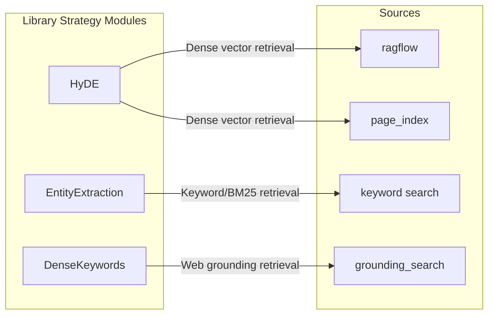
```mermaid
flowchart LR
    subgraph STRATEGIES["Library Strategy Modules"]
        HYDE["HyDE"]
        ENTITY["EntityExtraction"]
        DENSE["DenseKeywords"]
    end
    subgraph SOURCES["Sources"]
        RAGFLOW_S["ragflow"]
        PAGE_INDEX["page_index"]
        KEYWORD_ENGINE["keyword search"]
        GROUNDING_SEARCH["grounding_search"]
    end
    HYDE -->|Dense vector retrieval| RAGFLOW_S
    HYDE -->|Dense vector retrieval| PAGE_INDEX
    ENTITY -->|Keyword/BM25 retrieval| KEYWORD_ENGINE
    DENSE -->|Web grounding retrieval| GROUNDING_SEARCH
```
Strategy behavior:
- HyDE for vector retrieval sources.
- EntityExtraction for lexical retrieval sources.
- DenseKeywords for web grounding search.

Per-topic overrides apply before library defaults.
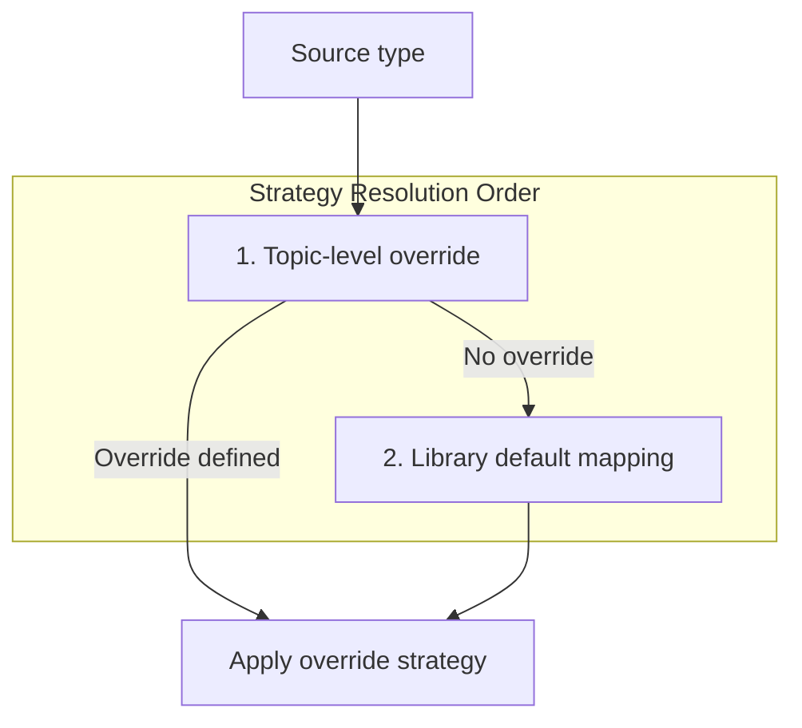
```mermaid
flowchart TB
    subgraph RESOLUTION["Strategy Resolution Order"]
        TOPIC_OVERRIDE["1. Topic-level override"]
        LIB_DEFAULT["2. Library default mapping"]
    end
    SOURCE_TYPE["Source type"] --> TOPIC_OVERRIDE
    TOPIC_OVERRIDE -->|Override defined| APPLY["Apply override strategy"]
    TOPIC_OVERRIDE -->|No override| LIB_DEFAULT --> APPLY
```

## Source Priority Execution
### Exclusion Constraints
Dependent-intent constraints (entity exclusions) are applied in merge filtering.
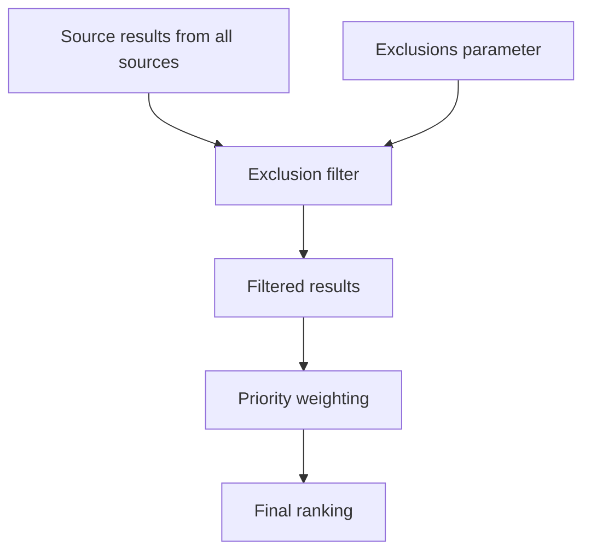
```mermaid
flowchart TB
    SOURCE_RESULTS["Source results from all sources"]
    EXCLUSIONS["Exclusions parameter"]
    FILTER_STAGE["Exclusion filter"]
    FILTERED["Filtered results"]
    PRIORITY_WEIGHT["Priority weighting"]
    FINAL_RANK["Final ranking"]
    SOURCE_RESULTS --> FILTER_STAGE
    EXCLUSIONS --> FILTER_STAGE
    FILTER_STAGE --> FILTERED
    FILTERED --> PRIORITY_WEIGHT
    PRIORITY_WEIGHT --> FINAL_RANK
```

### Attribute Negation as Search Filter
Attribute negations apply during retrieval query formulation.
| Source | Negation stage | Negation form | Benefit |
|--------|----------------|---------------|---------|
| grounding search source | Before request | Minus-prefixed negatives | Avoids pages dominated by excluded properties |
| RAG retrieval source | Before request | Contextual negative clause | Reduces irrelevant chunk retrieval |
| document question-answering source | Before request | Adapter-specific negative clause | Reduces page-level noise |
| memory recall source | Recall formulation | Negation-aware recall context | Avoids conflicting memories |
| direct answer source | Synthesis framing | Negative preference framing | Aligns generated answer with dislikes |

### Priority Configuration
| Source | Description |
|--------|-------------|
| RAG retrieval source | External read-only chunk retrieval |
| document question-answering source | Uploaded document retrieval |
| grounding search source | Web search grounding |
| memory recall source | Memory retrieval returned as context string |
| direct answer source | Direct model answer without retrieval |

All sources execute in parallel; priority affects weighting at merge time.
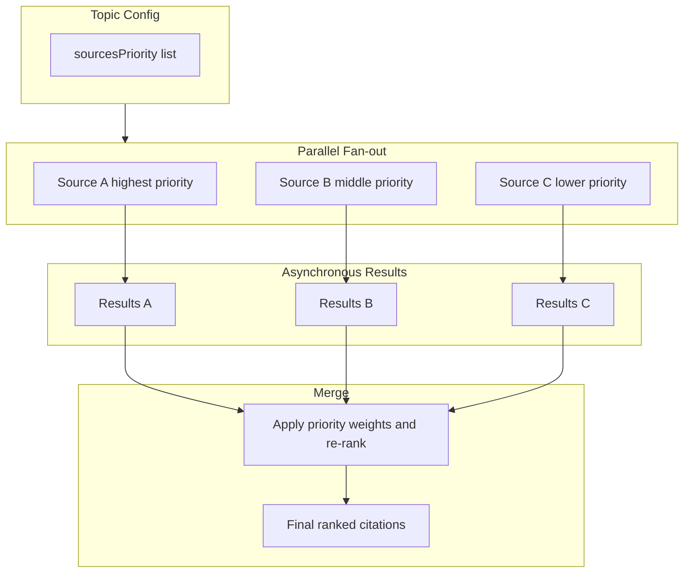
```mermaid
flowchart TB
    subgraph CONFIG["Topic Config"]
        PRIORITY_LIST["sourcesPriority list"]
    end
    subgraph EXECUTION["Parallel Fan-out"]
        direction LR
        PRIORITY_A["Source A highest priority"]
        PRIORITY_B["Source B middle priority"]
        PRIORITY_C["Source C lower priority"]
    end
    subgraph RESULTS["Asynchronous Results"]
        RESULT_A["Results A"]
        RESULT_B["Results B"]
        RESULT_C["Results C"]
    end
    subgraph MERGE["Merge"]
        WEIGHT_MERGE["Apply priority weights and re-rank"]
        FINAL["Final ranked citations"]
    end
    CONFIG --> EXECUTION
    PRIORITY_A --> RESULT_A
    PRIORITY_B --> RESULT_B
    PRIORITY_C --> RESULT_C
    RESULT_A & RESULT_B & RESULT_C --> WEIGHT_MERGE --> FINAL
```

### Fail Fast
Fan-out layer does not hide errors or auto-fallback. Source errors propagate to orchestrator. Service-level circuit breakers remain in infrastructure layer.

### Empty Result Behavior
| Behavior | Meaning |
|----------|---------|
| `normal` | Empty result expected |
| `suspicious` | Empty result unexpected and surfaced |

Suspicious empties are logged and reported to orchestrator.

## Result Merging with Priority Weighting
```mermaid
flowchart TB
    subgraph INPUTS["Per-Source Results"]
        R_A["Source A scored chunks"]
        R_B["Source B scored chunks"]
        R_C["Source C scored chunks"]
    end
    subgraph WEIGHTING["Priority Weight Calculation"]
        W_FORMULA["weight(i) = 1 - (i / total_sources)"]
    end
    subgraph SCORING["Weighted Score"]
        S_FORMULA["weighted_score = raw_score × priority_weight"]
    end
    subgraph OUTPUT["Final Ranked List"]
        SORTED["Sorted citations by weighted score"]
    end
    INPUTS --> WEIGHTING --> SCORING --> SORTED
```
Priority is a scaling factor, not an absolute gate.

## RAGFlow Integration
RAGFlow is used as a read-only retrieval engine. The system does not write to it and does not use its generation endpoint.

### Data Flow
```mermaid
sequenceDiagram
    participant QP as QUERY_PIPELINE
    participant RC as RAGFLOW_CLIENT
    participant RF as RAGFLOW_API
    participant CM as CITATION_MAPPER
    QP->>RC: question, dataset IDs, thresholds
    RC->>RF: Retrieval request with bearer token
    RF-->>RC: chunks with scores and metadata
    RC->>CM: Map to citation shape
    CM-->>QP: citations + retrieval metadata
```

### API Details
| Request Field | Type | Description |
|---------------|------|-------------|
| question field | text | Query text |
| dataset IDs field | list of text | Datasets to search |
| top-k field | numeric value | Max chunks returned |
| similarity threshold field | numeric value | Minimum similarity score |
| vector similarity weight field | numeric value | Blend vector and keyword matching |

| Response Field | Type | Description |
|----------------|------|-------------|
| content field | text | Chunk text |
| similarity field | numeric value | Combined similarity score |
| document identifier field | text | Document identifier |
| positions field | list of number pairs | Character positions |
| important keywords field | list of text | Extracted keywords |

Constraint: one request must not mix dataset embeddings that are incompatible.

### Configuration
| Config Key | Description |
|------------|-------------|
| RAGFlow base URL setting | RAGFlow base URL |
| RAGFlow API key setting | Bearer key |
| RAGFlow dataset IDs setting | Global dataset default |

Topic-level dataset overrides take precedence over global defaults.

### Chunk to Citation Mapping
```mermaid
flowchart LR
    subgraph RAGFLOW_CHUNK["RAGFlow Chunk"]
        C_CONTENT["content"]
        C_SIM["similarity"]
        C_DOC["document_keyword"]
        C_POS["positions"]
        C_KW["important_keywords"]
    end
    subgraph CITATION["Canonical Citation"]
        CI_QUOTE["quote"]
        CI_SOURCE["source"]
    end
    subgraph ENRICHMENT["Retrieval Metadata for Evidence Gate"]
        CI_SCORE["relevanceScore"]
        CI_META["positions"]
        CI_TERMS["keywords"]
    end
    C_CONTENT --> CI_QUOTE
    C_DOC --> CI_SOURCE
    C_SIM --> CI_SCORE
    C_POS --> CI_META
    C_KW --> CI_TERMS
```
Canonical citation fields are streamed; retrieval metadata remains internal for evidence scoring.

### RAGFlow in Priority Execution
```mermaid
flowchart TB
    subgraph TOPIC_CONFIG["Topic Config"]
        GLOBAL_DS["Global dataset IDs"]
        TOPIC_DS["Topic dataset override"]
    end
    subgraph RESOLUTION["Dataset Resolution"]
        CHECK{Topic has dataset override?}
        USE_TOPIC["Use topic datasets"]
        USE_GLOBAL["Use global datasets"]
    end
    subgraph CALL["RAGFlow API Call"]
        REWRITTEN["Rewritten query"]
        REQUEST["Retrieval request with resolved datasets"]
    end
    TOPIC_DS --> CHECK
    CHECK -->|Yes| USE_TOPIC --> REQUEST
    CHECK -->|No| USE_GLOBAL --> REQUEST
    REWRITTEN --> REQUEST
    REQUEST --> CHUNKS["chunks"] --> MAP["Map to citations"]
```

## Library vs Server Responsibilities
| Responsibility | Library | Server |
|----------------|---------|--------|
| HyDE strategy module | Exports | Assigns to sources |
| EntityExtraction strategy module | Exports | Assigns to sources |
| DenseKeywords strategy module | Exports | Assigns to sources |
| Default strategy mapping | Provides | Overrides per topic |
| Source priority execution engine | Provides | Configures via intent configuration |
| RAG retrieval client wrapper | Provides | Configures deployment values |
| Chunk-to-citation mapping | Provides | N/A |
| Priority weighting formula | Provides | N/A |
| Empty result defaults | Provides | Overrides per source/topic |
| Typed pipeline interfaces | Provides | Implements domain behavior |

## Task Specifications

### Task EMBED_ROUTER: Embedding Router
**Work**: Implement embedding similarity router using cached topic vectors in Valkey.

**Depends On**: CORE_TYPES, VALKEY_CACHE, AGENT_FACTORY.

**Acceptance Criteria**:
- Startup embeds and caches topic examples.
- Input includes thread short-term, user short-term (when active), and current message.
- Concatenate context, embed once, compare by cosine similarity.
- Return top match + confidence.
- High confidence resolves intent; low confidence flags ambiguity path.
- Cache invalidates on intent configuration changes.
- Unit tests with mocked embedding provider.
- Integration tests with real Valkey.
- Vague new-thread references remain classifiable with cross-thread context.

**QA Scenarios**:
- High-confidence query resolves in target latency.
- Low-confidence ambiguous query is flagged.
- Follow-up intent continuity is preserved.
- Vague new-thread reference classifies using user short-term context.
- Cache miss gracefully re-embeds.
- Empty intent configuration does not crash.

### Task LLM_INTENT: LLM Intent Validator + Base Rewriter
**Work**: Implement structured LLM authority for validation, conditional rewrite, and conversational signals.

**Depends On**: CORE_TYPES, AGENT_FACTORY, EMBED_ROUTER.

**Acceptance Criteria**:
- Uses structured output generation.
- Embedding guess is passed as hint.
- Outputs validated intent/topics, rewrittenQuery, needsClarification, detectedIntentsCount.
- Outputs `realtimeRequired` boolean for freshness-critical queries.
- Outputs `freshnessDomain` enum (`finance_rates`, `market_prices`, `weather`, `breaking_news`, `sports_live`, `other`).
- Outputs language fields: intended output language, translation intent, translation target.
- Detects multi-intent and decomposition.
- Emits temporal references with resolved ranges.
- Emits dependentIntents and intentDependencyOrder.
- Emits attributeNegations.
- Emits queryReplay with parameter changes.
- Detects correction, frustration trend, topic abandonment, and ambiguity clarification signal.
- Rewriting is conditional and preserves original entities.
- No-match sets clarification path.
- Unit tests with mocked model.
- Meets latency target.

**QA Scenarios**:
- Embedding agreement path validates.
- Embedding mismatch is corrected.
- Independent multi-intent marked parallel.
- Dependent multi-intent marked ordered.
- Temporal phrases resolve correctly.
- Ambiguous query sets clarification.
- Pronoun query rewrites with referent.
- Short query expands with context.
- Translation edge cases resolve intended output language.
- Correction recovers prior misinterpretation.
- Abandonment flushes stale topic context.
- Frustration escalation injects de-escalation context.
- Query "what is USD/JPY right now" sets `realtimeRequired=true` and `freshnessDomain=finance_rates`.
- Query "latest BTC price" sets `realtimeRequired=true` and `freshnessDomain=market_prices`.
- Query "AAPL stock price now" sets `realtimeRequired=true` and `freshnessDomain=market_prices`.
- Query "weather in Hanoi now" sets `realtimeRequired=true` and `freshnessDomain=weather`.
- Query "live Premier League score" sets `realtimeRequired=true` and `freshnessDomain=sports_live`.
- Non-realtime historical query keeps `realtimeRequired=false`.

### Task PREFETCH_COORD: Speculative Pre-Fetch Coordinator
**Work**: Run embedding + LLM in parallel, prefetch sources on embedding guess, cancel/refetch on disagreement.

**Depends On**: EMBED_ROUTER, LLM_INTENT, SOURCE_ROUTER.

**Acceptance Criteria**:
- Embedding and LLM run concurrently.
- Speculative prefetch starts immediately from embedding output.
- Agreement uses prefetched data.
- Disagreement cancels and refetches validated intent.
- Embedding failure falls back to LLM result.
- LLM failure falls back to embedding result.
- Dual failure propagates error.
- Unit tests verify concurrency and cancellation.
- Performance tests verify expected latency savings.

**QA Scenarios**:
- Agreement path reduces latency.
- Disagreement path reroutes correctly.
- Slow embedding path remains correct.
- LLM timeout degrades gracefully to embedding fallback.

### RAGFLOW_CLIENT Routing Bridge
> **Canonical task spec**: See [retrieval.md § Task RAGFLOW_CLIENT](./retrieval.md#task-ragflow_client-ragflow-retrieval-client-wrapper) for the authoritative objective, acceptance criteria, and QA scenarios.
>
> This section remains as a routing bridge because the Conversation Pipeline depends on the same retrieval client contract for source routing behavior.

### Task SOURCE_ROUTER: Source Priority Router
**Work**: Implement parallel source fan-out, weighted merge, and fail-fast propagation.

**Depends On**: RAGFLOW_CLIENT, CORE_TYPES, CONFIG_DEFAULTS.

**Acceptance Criteria**:
- All sources execute concurrently.
- Weight formula is one minus source index divided by total source count.
- Weighted score merge and descending rank are stable.
- Source errors propagate immediately.
- Empty result behavior honors `normal` vs `suspicious`.
- Suspicious empties log warning and inform orchestrator.
- `realtimeRequired=true` forces live-source-first routing before merge weighting.
- When live source is unavailable for `realtimeRequired=true`, output state is freshness-blocked for refusal or caveat path.
- Strong type-safe interfaces.
- Unit tests for parallelism, weights, merge order.
- Integration tests for varied source latency.

**QA Scenarios**:
- Multi-source merge ordered by weighted score.
- Mid-priority high raw score can outrank high-priority weak score.
- One source error fails fast.
- Suspicious empty is surfaced.
- Normal empty is accepted.
- Empty priority list returns empty output.
- Realtime query routes through live source before non-live sources.
- Stock-price query routes through live source before non-live sources.
- Live-score query routes through live source before non-live sources.
- Realtime query with live-source outage returns freshness-blocked outcome.

### Task REWRITE_TOOL: Query Rewrite Tool
**Work**: Implement conditional rewrite tool with trigger checks, strategy selection, and entity guardrail.

**Depends On**: REWRITE_STRATEGIES, CORE_TYPES, LLM_INTENT.

**Acceptance Criteria**:
- Checks all 7 triggers in order.
- No-trigger path returns original query for all sources.
- Trigger path applies source-specific strategy.
- Strategy resolution: topic override first, library default second.
- Guardrail requires verbatim entity preservation.
- Guardrail failure discards rewrite.
- Supports combined intent+rewrite structured call on qualifying paths.
- Exported as standalone tool.
- Unit tests per trigger and guardrail case.
- Uses low-thinking profile and Zod v4 schema contracts.

**QA Scenarios**:
- Pronoun query resolves referent.
- Short query expands.
- Multi-intent query yields separate rewrites.
- Specific code token preserved.
- Jargon mismatch normalized.
- No-trigger query unchanged.
- Entity loss rewrite rejected.

### Task REWRITE_STRATEGIES: Strategy Modules
**Work**: Implement HyDE, EntityExtraction, DenseKeywords as independent modules.

**Depends On**: CORE_TYPES.

**Acceptance Criteria**:
- HyDE generates short hypothetical answer text for embedding input.
- EntityExtraction emits compact high-signal keyword output and preserves identifiers.
- DenseKeywords emits search-optimized expansions and avoids question syntax.
- All modules are named exports.
- All modules accept query and optional context/topic.
- All modules return rewritten strings.
- Unit tests with mocked model behavior.
- Modules remain independently importable.

**QA Scenarios**:
- HyDE output is concise hypothetical answer passage.
- EntityExtraction output is compact keyword string.
- DenseKeywords output is expanded keyword phrase set.
- All strategies preserve exact identifiers.
- Empty query returns typed error.

### Task ATTRIBUTE_NEGATION: Attribute Negation Detection and Filtering

**Goal**
- Detect property-level negations in user requests and propagate them through retrieval and synthesis. Ensure excluded attributes are consistently respected without misclassifying entity-level rejection.

**Work**
- Define negation signal schema that distinguishes attributes from entities.
- Extend intent interpretation to capture explicit and implicit attribute negations.
- Normalize extracted negations into canonical filter clauses.
- Attach negation clauses to rewritten query outputs for downstream sources.
- Apply source-specific negation formatting for retrieval paths.
- Preserve negation intent through merge and ranking stages.
- Ensure dependent intent constraints and attribute negations can coexist without collisions.
- Add fallback behavior when negation target is ambiguous.
- Add regression tests for nested and multi-attribute negations.

**Depends On**
- LLM_INTENT, REWRITE_TOOL

**Batch**
- EXTENDED_INTEGRATION_BATCH

**Acceptance Criteria**
- Attribute negations are extracted into structured output fields.
- Entity exclusion and attribute negation are handled as distinct mechanisms.
- Rewritten queries preserve original negation intent.
- Retrieval paths receive negation constraints in compatible form.
- Final synthesized answers do not recommend options violating explicit attribute negations.
- Ambiguous negation targets trigger safe clarification behavior.
- Multiple negations in one query are all preserved through routing.
- Tests cover single, multiple, and conflicting negation cases.

**QA Scenarios**
- Ask for options without a specific attribute, verify returned candidates omit that attribute.
- Ask for alternatives excluding one entity and one attribute, verify both constraints are honored.
- Provide ambiguous negation phrasing, verify clarification is requested.
- Ask with two attribute negations, verify both survive rewrite and retrieval.

**Notes**
- Keep negation extraction lossless so downstream filtering has full context.
- Apply negations before retrieval execution, not only during final synthesis.
- Avoid over-broad negation expansion that can remove valid results.

### Task CLARIFICATION_MODEL: Clarification Patience and Ambiguity Policy

**Goal**
- Implement a bounded clarification strategy that resolves genuine ambiguity while preventing loops. Balance user effort and forward progress by switching to best-effort assumptions after patience limits.

**Work**
- Define ambiguity thresholds using confidence and interpretation spread signals.
- Create clarification state tracking per thread for consecutive clarification turns.
- Generate concise clarifying prompts with top plausible interpretations.
- Limit clarification depth with configurable patience threshold.
- Switch to best-effort assumption mode after threshold is reached.
- Record chosen assumptions explicitly in response context for transparency.
- Reset clarification counters when user provides disambiguating detail.
- Integrate frustration signals so clarification tone adapts under escalation.
- Add tests for repeated ambiguity and recovery paths.

**Depends On**
- LLM_INTENT, EMBED_ROUTER, AGENT_FACTORY

**Batch**
- EXTENDED_INTEGRATION_BATCH

**Acceptance Criteria**
- Low-confidence multi-plausible inputs trigger clarification behavior.
- Clarification prompts remain concise and interpretation-focused.
- Consecutive clarification turns are tracked per thread.
- Patience threshold stops further clarification loops.
- Post-threshold behavior returns a best-effort response with explicit assumptions.
- Clarification counter resets when sufficient user detail is provided.
- Tone adaptation integrates frustration context during clarification.
- Clarification policy state is available to orchestration flow.

**QA Scenarios**
- Send an ambiguous request, verify a targeted clarification question is returned.
- Continue with repeated ambiguity past threshold, verify system proceeds with explicit assumptions.
- Provide clear disambiguation after one clarification, verify normal execution resumes.
- Trigger ambiguity with frustration cues, verify clarification tone is de-escalated.

**Notes**
- Keep clarification prompts short to minimize user friction.
- Prioritize progress guarantees over perfect disambiguation after patience is exhausted.
- Store policy state in thread context so behavior is consistent across turns.

### Task CONVERSATION_INTELLIGENCE: Conversation Analytics and Trend Signals

**Goal**
- Aggregate conversation-level analytics that describe topical focus, sentiment movement, and engagement quality over time. Provide measurable signals for quality monitoring and iterative system tuning.

**Work**
- Define analytics schema for topic extraction, sentiment trajectory, and engagement scoring.
- Aggregate per-turn signals into conversation-level metrics.
- Compute topic drift and dominant-topic summaries across sessions.
- Compute sentiment trend curves and escalation indicators.
- Compute engagement score using responsiveness, follow-up rate, and completion patterns.
- Produce a composite conversation quality score from weighted analytics dimensions.
- Add periodic trend rollups for cohort and time-window reporting.
- Add anomaly detection for sudden quality regressions.
- Integrate analytics outputs with observability dashboards.
- Add validation tests for metric stability and reproducibility.

**Depends On**
- AI_OPERATIONS, LANGFUSE_MODULE, EMBED_ROUTER

**Batch**
- E2E_DEPLOY_BATCH

**Acceptance Criteria**
- Topic extraction outputs ranked dominant topics per conversation.
- Sentiment tracking captures directionality across turns.
- Engagement scoring produces consistent bounded scores.
- Composite quality score is generated for completed conversations.
- Trend rollups are available by configurable time windows.
- Anomaly detection flags significant quality shifts.
- Metrics are exposed in observability output.
- Metric computations are deterministic for identical input histories.

**QA Scenarios**
- Run analytics on a focused conversation, verify dominant topic output matches discussion.
- Run analytics on an escalating conversation, verify sentiment trend reflects deterioration.
- Run analytics on short and long conversations, verify engagement scores remain bounded and comparable.
- Replay identical conversation data twice, verify analytics outputs are identical.

**Notes**
- Keep analytics read-oriented and decoupled from online response logic.
- Favor stable metric definitions over frequent formula churn.
- Version metric schemas carefully when introducing new dimensions.

### Task FRUSTRATION_SIGNAL: Frustration Detection and Adaptive Response Behavior

**Goal**
- Detect user frustration signals and escalation trends across turns to guide de-escalation behavior. Improve conversational recovery by adapting tone and guidance without changing core factual output.

**Work**
- Define frustration indicators across wording, repetition, punctuation, and correction density.
- Score per-turn frustration intensity and maintain rolling trend state.
- Detect escalation, stabilization, and recovery patterns.
- Inject de-escalation guidance into orchestration context when escalation is detected.
- Adapt response style to be calmer, clearer, and more action-oriented under high frustration.
- Prevent frustration adaptation from weakening safety or policy enforcement.
- Reset or decay frustration state when recovery signals persist.
- Expose frustration trend diagnostics for quality monitoring.
- Add tests for abrupt escalation and gradual recovery cases.

**Depends On**
- EMBED_ROUTER, LLM_INTENT

**Batch**
- EXTENDED_INTEGRATION_BATCH

**Acceptance Criteria**
- Frustration signals are detected from multi-turn conversation patterns.
- Escalation trends are distinguished from isolated negative wording.
- De-escalation guidance is injected when escalation threshold is reached.
- Responses under high frustration use calmer adaptive framing.
- Safety and policy behavior remains unchanged by frustration adaptation.
- Recovery signals reduce or clear active frustration state.
- Frustration diagnostics are observable for tuning and audits.
- Detection quality is stable across short and long conversations.

**QA Scenarios**
- Provide increasingly hostile follow-ups, verify escalation state rises and de-escalation guidance appears.
- Provide one negative but isolated message, verify no persistent escalation state is created.
- Move from frustrated language to neutral language, verify frustration state decays.
- Trigger safety-sensitive request during frustration, verify safety behavior remains intact.

**Notes**
- Use trend-based scoring to avoid overreacting to single-turn noise.
- Keep adaptation focused on tone and structure, not factual policy changes.
- Make thresholds configurable for domain-specific calibration.

### Task NON_ACTIONABLE_DETECT: Non-Actionable Input Detection

**Goal**
- Short-circuit clearly non-actionable turns so expensive intent and retrieval stages are skipped when no actionable request exists. Preserve precision by avoiding false positives on brief but valid requests.

**Work**
- Define subtype taxonomy for greetings, acknowledgments, emoji-only turns, and gibberish.
- Build conservative first-pass detection rules for non-actionable text patterns.
- Add gibberish detection combining entropy and language reliability indicators.
- Add bypass safeguards so mixed actionable content always proceeds to full pipeline.
- Return structured non-actionable classification with subtype labels.
- Route non-actionable outcomes to lightweight direct response behavior.
- Skip embedding, LLM intent, rewrite, source routing, and extraction for confirmed non-actionable turns.
- Add false-positive protections for abbreviations and non-Latin scripts.
- Add tests for borderline short-message cases.

**Depends On**
- EMBED_ROUTER

**Batch**
- SELFTEST_MIDINTEGRATION_BATCH

**Acceptance Criteria**
- Greetings and acknowledgments are classified as non-actionable when no request is present.
- Emoji-only turns are classified as non-actionable.
- Gibberish detection uses multi-signal checks, not a single heuristic.
- Mixed turns containing actionable intent are not short-circuited.
- Non-actionable outputs include subtype classification.
- Confirmed non-actionable turns bypass deeper intent and retrieval stages.
- False-positive rate is controlled for short valid tokens.
- Classification behavior is consistent across supported language scripts.

**QA Scenarios**
- Send greeting-only message, verify non-actionable subtype response is returned.
- Send emoji-only message, verify non-actionable short-circuit occurs.
- Send short actionable request, verify it continues to full intent pipeline.
- Send gibberish text, verify non-actionable gibberish subtype is returned.

**Notes**
- Keep gating conservative to minimize accidental suppression of real requests.
- Separate subtype detection from response wording so behavior is reusable.
- Log short-circuit reasons for ongoing threshold tuning.

### Task QUERY_REPLAY: Query Replay and Rephrase Detection

**Goal**
- Detect when users repeat or rephrase prior queries and reconstruct replay intent with parameter substitutions. Improve continuity by reusing prior query structure instead of reinterpreting from scratch.

**Work**
- Define replay detection signals using semantic similarity and temporal proximity.
- Extract candidate origin query from recent thread and structured result memory.
- Identify substitution slots such as location, date, or preference constraints.
- Build replay structure output capturing origin linkage and parameter deltas.
- Reconstruct a full replay query when confidence is sufficient.
- Fallback to standard rewrite flow when no reliable origin query is found.
- Preserve original explicit entities and negations during replay reconstruction.
- Track replay detection confidence and fallback reason codes.
- Add tests for paraphrased repeats and partial-parameter changes.

**Depends On**
- LLM_INTENT, REWRITE_TOOL, STRUCTURED_RESULT_MEM

**Batch**
- EXTENDED_INTEGRATION_BATCH

**Acceptance Criteria**
- Repeated or paraphrased queries can be linked to prior origin queries.
- Replay output includes structured parameter substitutions.
- Reconstructed replay query preserves unchanged intent components.
- Missing origin context triggers safe fallback to standard rewrite.
- Replay logic preserves explicit entity and negation constraints.
- Replay confidence is exposed for downstream decision-making.
- Replay behavior is stable across cross-turn paraphrases.
- Tests cover exact repeats, paraphrases, and substitution variants.

**QA Scenarios**
- Ask a query, then request the same with a changed location, verify replay reconstruction applies only location change.
- Rephrase a prior query without parameter changes, verify replay linkage is detected.
- Ask similar query without clear origin, verify fallback to standard rewrite path.
- Replay a prior query with explicit negation, verify negation is preserved.

**Notes**
- Prefer high-precision replay matching over aggressive linking.
- Keep replay reconstruction transparent through structured metadata.
- Limit origin search scope to recent relevant history for performance.

## External References
- AI SDK structured generation documentation
- AI SDK tools and agents documentation
- OpenAI Agents handoff guidance
- RAGFlow HTTP API reference

## Test Specifications

> **Relationship to Task Specifications**: QA Scenarios prove task completion; Test Specifications prove behavioral correctness. Use both.

Conversation pipeline tests span unit tests for individual phases and end-to-end tests for the complete five-phase flow (Phase 0 through Phase 4).

**Phase 0 — input validation and language gate**:

- Fast language detection for clear allow and block paths.
- Ambiguous or mixed-language content proceeds to intent classification.
- Clear unsupported language triggers p0 tripwire block.
- Post-intent gate checks intended output language support.
- Translation edge cases: input in one language with intent to translate to another.

**Phase 1 — non-actionable detection**:

- Pleasantries, acknowledgments, and single-emoji messages short-circuit.
- Gibberish via entropy and language reliability signals short-circuits.
- Mixed actionable turns do not short-circuit.
- False-positive avoidance for short valid tokens, abbreviations, and non-Latin scripts.
- Short-circuit path skips embedding, LLM intent, rewriting, source routing, and fact extraction.

**Phase 2 — context assembly**:

- Three-layer context loading: thread short-term, user short-term, long-term recall.
- Memory-load barrier: context assembly completes before intent classification begins.
- First-turn recall uses the raw incoming user message before any rewrite stage exists.
- Trust hierarchy enforcement: system instruction highest, user messages medium, retrieved content zero trust.
- Retrieved content wrapped with reinforcement boundaries (sandwich framing, not delimiters alone).
- Zero-trust content containing instruction-like patterns: redacted or preserved with data-only framing.
- Unmarked zero-trust content never inserted into instruction-adjacent positions.

**Phase 3 — intent classification**:

- Embedding router: semantic hint generation with confidence scoring and Valkey cache interaction.
- LLM intent validator: structured output with all fields (intent, topics, rewritten query, clarification, language, temporal, dependent intents, negations, replay structure, behavioral signals).
- Speculative pre-fetching: starts on embedding guess, cancels on LLM disagreement.
- Correction detection: triggers re-interpretation of previous response.
- Frustration detection: signals de-escalation behavior.
- Topic abandonment: flushes stale topic context.
- Multi-intent decomposition: sub-queries with parallel or sequential processing.
- Dependent intents: dependency ordering with constraint passing between intents.
- Low-confidence or no-match intent outcomes trigger clarification behavior.
- Attribute negation: property-level exclusion distinct from entity exclusion.
- Query replay: parameter substitution with thread context recovery.
- Temporal resolution: phrases resolved to concrete ranges using user timezone with UTC fallback.
- Realtime-sensitive query detection emits `realtimeRequired` and `freshnessDomain`.

**Phase 3 — multi-intent dependency patterns**:

- Feedback plus constrained-search chains apply exclusion constraints from feedback before search execution begins.
- Comparison plus selection chains require selection stage to consume ranked comparison output rather than raw candidate list.
- Context-establishment plus follow-up-query chains require query stage to consume established context from prior stage.
- Negation plus alternative-request chains require alternative generation to target the explicitly negated entity or attribute.

**Phase 4 — rewrite and source routing**:

- Seven rewrite triggers: pronoun referent, short query expansion, multi-intent separation, specific identifier preservation, jargon alignment, ordinal resolution, query replay reconstruction.
- Entity preservation guardrail: all original entities appear verbatim in rewrite, guardrail failure discards rewrite.
- Source priority: parallel fan-out across all configured sources with priority weighting at merge.
- Realtime-required routing: live source is mandatory primary path before non-live fallback paths.
- Fail-fast source error handling: a failing source stops that source path while other sources continue.
- Result merging: weight formula application, priority as scaling factor not absolute gate.
- Attribute negation application: per-source negation strategies (minus-prefix, contextual clause, negation-aware recall, negative preference framing).
- Dependent-intent exclusion filtering is applied before merged ranking.
- Topic-level rewrite-strategy override takes precedence over library defaults.
- Empty result handling: normal versus suspicious empties with logging.
- Live-source failure under realtime-required path triggers freshness-blocked handoff for refusal or caveated response.

**RAGFlow integration**:

- Read-only retrieval: query mapping, chunk-to-citation mapping, dataset isolation.
- Topic-level dataset overrides take precedence over global defaults.
- Single request must not mix incompatible dataset embeddings.

**Phase 0 — language gate decision boundaries**:

- High-confidence unsupported-language detection triggers immediate p0 tripwire blocking before intent routing.
- High-confidence supported-language detection proceeds directly to intent classification without extra language checks.
- Ambiguous-language detection never blocks at phase 0 and always defers to later intent-stage validation.
- Mixed-language inputs with actionable intent proceed to intent classification path.
- Ambiguous confidence near decision boundary prefers allow-to-classify over hard block.
- p0 block path returns deterministic unsupported-language behavior without entering rewrite or source fan-out.
- Post-intent language gate validates intended output language against supported-language policy.
- Intended output language unsupported after intent classification triggers block even when input language was supported.
- Intended output language supported after intent classification produces allow decision even for mixed-language input.
- Translation-intent signal and translation-target language from intent output are both honored in post-intent language policy.

**Phase 1 — non-actionable subtype classification**:

- Pleasantry-only turns classify as non-actionable with pleasantry subtype.
- Acknowledgment-only turns classify as non-actionable with acknowledgment subtype.
- Single-emoji-only turns classify as non-actionable with emoji-only subtype.
- Gibberish turns classify as non-actionable with gibberish subtype.
- Non-actionable return payload always includes subtype and short-circuit routing decision.
- Gibberish detection combines entropy signal with language reliability signal instead of single-metric gating.
- Mixed turns that include even one actionable request bypass non-actionable short-circuit.
- Short valid abbreviations avoid gibberish false positives.
- Non-Latin scripts with coherent linguistic signal avoid gibberish false positives.
- Short-circuit path bypasses embedding routing.
- Short-circuit path bypasses LLM intent validation.
- Short-circuit path bypasses query rewriting.
- Short-circuit path bypasses source routing and retrieval fan-out.
- Short-circuit path bypasses fact extraction side effects.

**Phase 2 — three-layer context assembly and trust enforcement**:

- Context assembly includes thread short-term context with latest turns and rolling summary.
- Context assembly includes user short-term cross-thread messages only when cross-thread injection is active.
- Context assembly includes long-term recall layer for relevant memory context.
- Memory loading for all context layers completes before intent classification starts.
- First-turn recall query uses raw user message and does not depend on pre-classified intent labels.
- System instructions are assembled as highest-trust policy layer.
- User messages are assembled as medium-trust content.
- Retrieved chunks, recalled memory text, and cross-thread fragments are assembled as zero-trust data.
- Zero-trust content is wrapped with prefix-and-suffix reinforcement boundaries.
- Delimiter-only wrapping without reinforcement boundaries is treated as invalid assembly.
- Instruction-like patterns in zero-trust content trigger safe transform decision before assembly.
- High-risk instruction-like segments in zero-trust content are redacted with explicit security marker.
- Low-risk instruction-like segments in zero-trust content are preserved only with explicit data-only framing.
- Unmarked zero-trust content is never inserted adjacent to instruction-priority content.

**Phase 3 — embedding router behavior**:

- Startup embedding precomputes topic-example vectors from server-defined intent configuration.
- Cached vectors are persisted in cache storage and reused at runtime for similarity checks.
- Query embedding input concatenates rolling summary, cross-thread context, recent turns, and current message.
- Runtime computes cosine similarity between query vector and cached topic vectors.
- Top similarity match and confidence score are returned for downstream hinting.
- Confidence above configured threshold marks high-confidence router outcome.
- Confidence below configured threshold marks low-confidence or ambiguity outcome.
- Empty or sparse intent-example configuration does not crash runtime classification flow.
- Intent configuration changes invalidate cached vectors and trigger re-embedding.
- Vague new-thread follow-ups remain classifiable when cross-thread context provides disambiguation signal.

**Phase 3 — embedding router cache mechanics**:

- Startup path extracts topic examples from intent configuration before serving live routing requests.
- Startup path batches example embedding generation to reduce repeated embedding calls.
- Startup path stores generated topic vectors in a Valkey hash for runtime lookup.
- Per-query routing embeds the incoming query before similarity scoring.
- Per-query routing fetches cached topic vectors from Valkey hash storage.
- Per-query routing computes cosine similarity between query embedding and each cached topic embedding.
- Per-query routing sorts similarity results in descending score order.
- Per-query routing returns highest-scoring topic match together with confidence score.
- Cache invalidation deletes the existing Valkey hash when intent configuration changes.
- Cache invalidation triggers full re-embedding of topic examples after hash deletion.
- Similarity fetch and cosine scoring overhead remains minor relative to embedding latency.

**Phase 3 — LLM validator authority and structured output fields**:

- LLM validator always runs, including when embedding router confidence is high.
- Embedding router guess is passed as hint rather than final authority.
- Structured output includes validated intent and validated topic selections.
- Structured output includes rewritten query baseline and clarification requirement flag.
- Structured output includes detected-intent count for downstream orchestration branching.
- Structured output includes intended output language.
- Structured output includes translation-intent signal.
- Structured output includes translation target language.
- Structured output includes resolved temporal references.
- Structured output includes dependent-intent indicator and dependency order.
- Structured output includes attribute-level negations.
- Structured output includes query-replay structure with substitution details.
- Structured output includes correction signal.
- Structured output includes frustration signal.
- Structured output includes topic-abandonment signal.
- Structured output includes ambiguity signal for proactive clarification behavior.
- No-match outcomes from validation route to clarification-first fallback behavior.

**Phase 3 — speculative prefetch and agreement handling**:

- Embedding stage starts speculative source prefetch immediately after initial intent guess.
- Agreement between embedding guess and LLM validated intent reuses speculative prefetched results.
- Disagreement cancels speculative fetch work and refetches using validated intent.
- Cancellation path avoids stale-source reuse from superseded intent guesses.
- Agreement path improves early retrieval readiness without changing final intent authority.
- Slow embedding results do not break correctness when LLM path completes first.
- Embedding failure degrades to LLM-validated routing path.
- LLM timeout or failure degrades to embedding-hint routing path where configured.
- Dual classification-path failure propagates explicit upstream error.

**Phase 3 — correction, frustration, abandonment, and clarification**:

- Correction signal triggers immediate reinterpretation against corrected user constraint.
- Correction reinterpretation prioritizes new user correction over stale prior assistant framing.
- Frustration tracking accumulates escalation trend across turns.
- Escalation trend injects de-escalation context signal for response strategy.
- Topic abandonment signal flushes stale active-topic context before synthesis.
- Low-confidence ambiguous cases trigger proactive clarification rather than forced assumptions.
- Clarification route is used for no-match and low-confidence ambiguous outcomes.

**Phase 3 — low-confidence investigation routing**:

- No-match fallback remains fixed to clarification route.
- Low-confidence outcomes route to agent investigation with available tools before clarification fallback.
- High-confidence outcomes route directly to matched pipeline execution.
- Multi-intent outcomes route through orchestrator splitting rather than single-pipeline execution.

**Temporal and language piggyback behaviors**:

- Temporal expression resolution uses request-context user timezone when present.
- Temporal expression resolution uses UTC fallback when timezone is unavailable.
- Yesterday resolves to prior-day start-to-end range.
- Last-week resolves to seven-day window ending yesterday.
- This-morning resolves to day-start through current time.
- Last-month resolves to rolling thirty-day window ending yesterday.
- Today resolves to day-start through current time.
- Resolved temporal range is passed as temporal hint before semantic ranking in memory retrieval.
- Temporal filtering is applied before semantic ranking to constrain candidate set.
- Language piggyback output supports translation-intent edge cases without extra model call.

**Phase 4 — conditional rewrite and trigger matrix**:

- Rewrite decision evaluates all seven triggers and uses pass-through when none fire.
- Pronoun-referent trigger rewrites sparse anaphoric queries with recovered referent context.
- Short-query trigger expands minimal terms into retrieval-ready phrasing.
- Multi-intent trigger produces intent-separated rewrites for downstream split execution.
- Highly-specific trigger preserves exact identifiers such as error codes and unique tokens.
- Jargon-mismatch trigger aligns query phrasing with source vocabulary.
- Ordinal-reference trigger resolves ordinal mention into explicit referenced entity.
- Query-replay trigger reconstructs prior query with parameter substitutions.
- No-trigger path preserves original query for all sources.
- Trigger path applies source-specific rewriting rather than one global rewrite output.
- Trigger evaluation order is deterministic and test-covered.

**Ordinal resolution, query replay, and preservation guardrail**:

- Ordinal references resolve against recent structured result memory entries.
- Ordinal resolution produces explicit entity names in rewritten output.
- Query replay retrieves origin query from thread context before applying substitutions.
- Query replay with valid origin reconstructs full intent structure and updated parameters.
- Query replay without valid origin falls back to standard context-aware rewrite path.
- Entity-preservation guardrail requires every original name, code, date, and identifier to appear verbatim in rewrite.
- Guardrail failure discards rewritten output and falls back to original query.
- Rewrite fidelity checks run before source dispatch to prevent entity-loss retrieval errors.

**Source-specific rewrite strategies and precedence**:

- Vector retrieval sources apply HyDE strategy behavior.
- Lexical retrieval sources apply entity-focused keyword extraction behavior.
- Grounding-search source applies dense-keyword expansion behavior.
- Topic-level rewrite-strategy override has first precedence.
- Library default strategy mapping applies only when topic override is absent.
- Strategy modules remain independently testable and importable.
- Strategy outputs preserve exact identifiers from original query text.
- Empty query input to strategy path returns typed validation error behavior.

**Source routing, execution, and fail-fast policy**:

- Source priority list defines weighting order only; all configured sources still execute in parallel.
- Parallel fan-out includes external retrieval, document retrieval, grounding search, memory recall, and direct answer paths.
- Priority weighting is applied during merge, not at dispatch time.
- Source error propagation is fail-fast to orchestrator rather than silent auto-fallback.
- Circuit-breaker behavior remains infrastructure concern and is not hidden inside routing layer.
- Empty priority list produces explicit empty-output behavior without crash.
- Per-source latency skew does not change deterministic weighted merge logic.

**Attribute negation and dependent-intent exclusion handling**:

- Attribute-level negations are applied during per-source query formulation.
- Grounding-search negations map to minus-prefixed exclusion terms.
- Retrieval-source negations map to contextual negative clauses.
- Document retrieval negations map to adapter-specific negative clauses.
- Memory recall negations shape recall query context to avoid conflicting facts.
- Direct-answer negations shape synthesis framing to respect excluded attributes.
- Dependent-intent entity exclusions are applied in merge filtering stage.
- Attribute-level negation behavior remains distinct from entity-exclusion constraints.

**Result merging and priority weighting math**:

- Priority weight formula applies as one minus source index divided by total source count.
- Weighted score is computed as raw score multiplied by priority weight.
- Ranked outputs sort by weighted score descending.
- Weighting is a scaling factor and not an absolute inclusion gate.
- High raw relevance from lower-priority source can outrank weak high-priority result.
- Weighted merge remains stable for identical weighted scores via deterministic tiebreak order.

**Empty-result semantics and suspicious-empty surfacing**:

- Empty-result mode marked normal is accepted as expected no-result outcome.
- Empty-result mode marked suspicious is surfaced as unexpected no-result condition.
- Suspicious empties emit warning telemetry and orchestrator-visible status.
- Normal empties do not produce warning-level surfacing.

**RAGFlow request and response contracts**:

- Retrieval integration remains read-only and never invokes generation endpoints.
- Request payload includes question, dataset identifiers, top-k, similarity threshold, and vector-weight fields.
- Bearer authentication is required for external retrieval requests.
- HTTP error responses propagate as typed retrieval failures.
- Malformed retrieval responses propagate as typed parsing failures.
- Response mapping captures chunk content, score, document identifier, positions, and keywords.
- Chunk mapping produces canonical citation quote and source fields for streaming.
- Retrieval-only metadata stays internal for evidence scoring and does not leak as citation payload.
- Topic-level dataset overrides replace global dataset defaults at call time.
- Requests mixing incompatible embedding datasets are rejected.
- Missing retrieval base configuration disables external retrieval source gracefully.

**Intent configuration and scale behavior**:

- Server-defined intent catalog drives all business-intent classification; library has no baked-in domain intents.
- Topic examples list is required for embedding-router semantic grounding quality.
- Topic source-priority list determines source set and merge weighting behavior.
- Topic dataset overrides apply per topic and override global dataset list.
- Topic rewrite-strategy overrides apply per source before default mapping.
- Topic evidence-threshold overrides are accepted and carried into downstream evidence gating.
- Topic empty-result behavior overrides are honored per source.
- Optional embedding confidence threshold overrides default threshold behavior.
- Fallback behavior for no-match intents remains clarification path.
- Intent configuration update triggers full embedding-cache rebuild.

**Library-server responsibility split assertions**:

- Strategy modules, source-priority engine, retrieval client wrapper, citation mapping, and weighting formula are library responsibilities.
- Deployment values, per-topic overrides, and source policy assignments are server responsibilities.
- Empty-result defaults come from library and are overridable by server configuration.
- Typed pipeline interfaces are provided by library and implemented with domain behavior by server.
