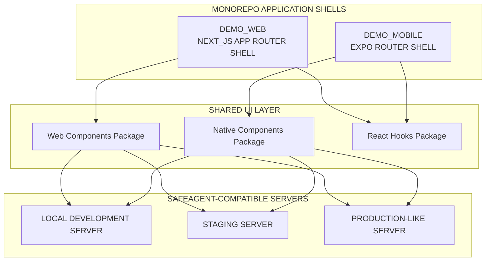
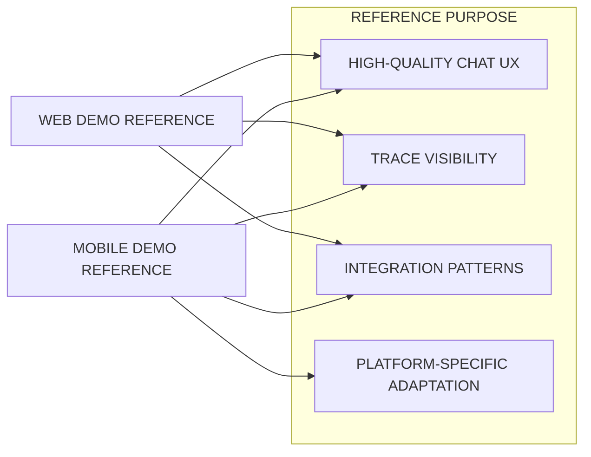
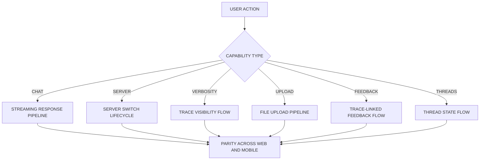
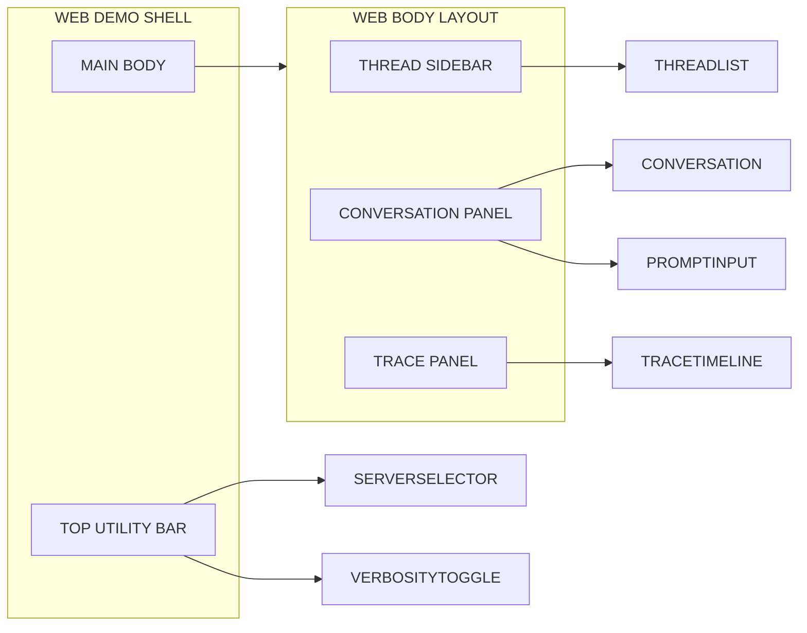
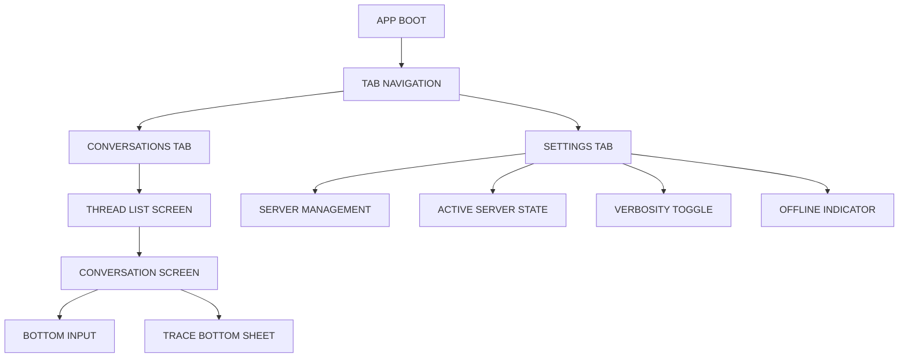
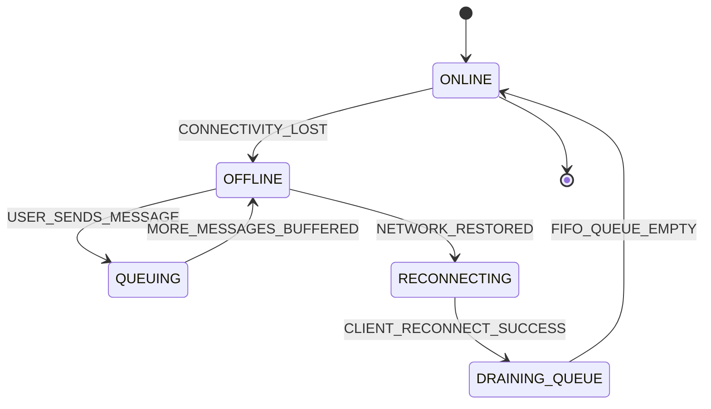
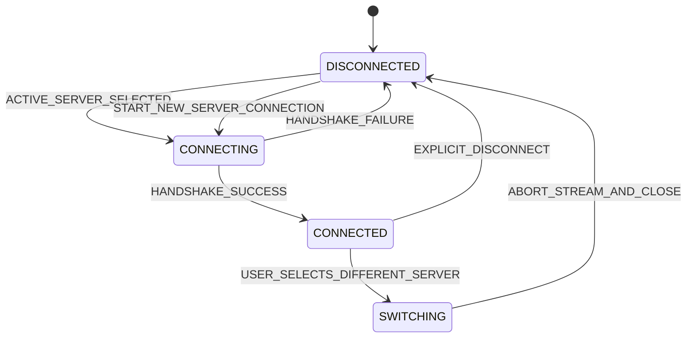
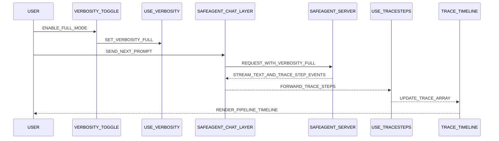
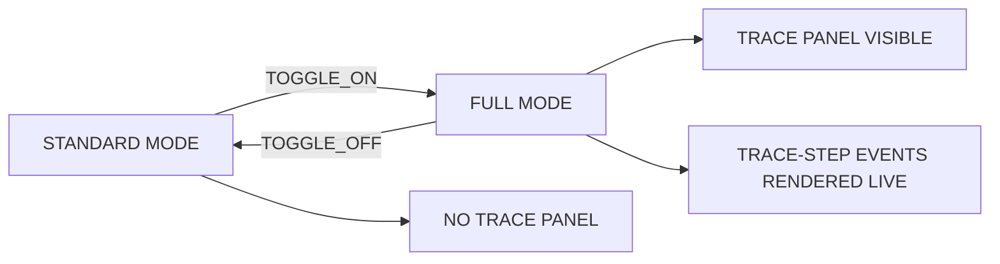

# Demo Applications

> **Scope**: Next.js web demo and Expo mobile demo — full-featured chat applications that exercise all safeagent frontend capabilities including server switching, verbosity toggle, trace visualization, file upload, and offline-first mobile behavior.
>
> **Tasks**: DEMO_WEB (Next.js Demo), DEMO_MOBILE (Expo Demo)

---

## Table of Contents
- [Architecture Overview](#architecture-overview)
- [Shared Demo Capabilities](#shared-demo-capabilities)
- [Next.js Web Demo (DEMO_WEB)](#nextjs-web-demo-demo_web)
- [Expo Mobile Demo (DEMO_MOBILE)](#expo-mobile-demo-demo_mobile)
- [Server Switching](#server-switching)
- [Verbosity Toggle](#verbosity-toggle)
- [Cross-References](#cross-references)
- [Task Specifications](#task-specifications)

## Architecture Overview

The demo applications are intentionally thin shells around the safeagent frontend SDK.
They are not throwaway samples.
They are production-style references that model integration patterns teams can reuse.

Both demos are application packages inside the safeagent monorepo.
Both demos connect to any safeagent-compatible server endpoint.
Both demos show how product-facing UX and developer-facing trace workflows can coexist.

Design principles for both demos:
- Keep transport and state logic in shared hooks so behavior remains aligned.
- Keep platform-specific UI concerns close to each shell.
- Expose server switching and verbosity controls as first-class UX elements.
- Preserve predictable state transitions for threads, streaming, upload, and feedback.
- Demonstrate observability alignment through trace-linked feedback.

## Shared Demo Capabilities

Both demos expose the same user-facing and developer-facing capabilities.
The interaction patterns are platform-tuned, but behavior is semantically equivalent.

### Capability Matrix

| Capability | Web Demo Behavior | Mobile Demo Behavior | Shared Outcome |
|---|---|---|---|
| Multi-server switching | Top-level selector in main shell | Managed in settings with active badge | Fast context switch across server deployments |
| Verbosity toggle | Toggle in header, trace panel on right | Toggle in settings, trace panel in bottom sheet | Standard mode and full mode parity |
| Conversation experience | Rich markdown and structured artifacts | Native rendering with equivalent artifacts | Full safeagent event surface visible |
| File upload | Drag-and-drop and picker fallback | Native picker flow | Document upload with progress feedback |
| Feedback | Inline thumbs with optimistic state | Inline thumbs with tactile confirmation | traceId-linked quality scoring |
| Thread management | Sidebar thread list and fast switching | Conversation list to thread detail flow | Persistent multi-thread workflow |

### Shared Behavior Contract

- Multi-server switching:
  - Users can configure multiple servers.
  - Each server entry includes name, URL, and auth token.
  - Optional agentId can override default server routing.
  - Switching servers always resets active conversation and connection state.
- Verbosity toggle:
  - Standard mode prioritizes clean user chat output.
  - Full mode enables trace timeline visualization.
  - Trace stream appears only for requests made after toggle activation.
- Full conversation experience:
  - Streaming assistant text.
  - Markdown rendering.
  - Tool call display.
  - Reasoning and chain-of-thought surfaces where available.
  - CTA rendering.
  - Citation display and inline citation linking.
  - Location rendering and context cards.
  - Suggestion chip actions.
- File upload:
  - Upload initiation from prompt context.
  - Progress indicator through upload lifecycle.
  - Attachment state reflected in pending prompt before send.
- Feedback:
  - Thumbs up or thumbs down on assistant messages.
  - Feedback payload carries traceId from session-meta.
  - Langfuse correlation remains deterministic across both demos.
- Thread management:
  - Create new thread.
  - Switch between existing threads.
  - Load and display thread history.
  - Preserve per-thread message ordering.

## Next.js Web Demo (DEMO_WEB)

The web demo is a Next.js App Router application optimized for desktop-first productivity while preserving mobile usability.
It demonstrates the full safeagent web component surface inside a coherent shell.

### Core Architecture

- Routing model:
  - Uses Next.js App Router.
  - Initial page request is server-rendered for fast first paint.
  - Interactive chat runtime is client-side because the chat hook is client-only.
- Layout model:
  - Full-width shell.
  - Left sidebar for thread list and thread controls.
  - Main center panel for conversation timeline and input.
  - Optional right trace panel in full mode.
- Responsive model:
  - Desktop shows persistent sidebar and optional trace panel.
  - Mobile collapses sidebar and exposes thread controls via compact navigation affordance.
- Theme model:
  - Dark mode support through Tailwind `dark:` variant.
  - All demo controls and trace surfaces remain legible in both color schemes.

### Component Surface

Components consumed from the web components module:
- Conversation
- MessageResponse
- PromptInput
- Tool
- Reasoning
- ChainOfThought
- Attachments
- Sources
- InlineCitation
- CodeBlock
- ModelSelector
- Suggestions
- Context

Custom composition components using web components module primitives:
- ServerSelector
- VerbosityToggle
- ThreadList
- trace timeline component
- MessageTimestamp
- TypingIndicator
- ErrorRetry

Hooks consumed from the React hooks module:
- useSafeAgent
- useTraceSteps
- useFeedback
- useUpload
- useServerConnection
- useVerbosity

### Web Interaction Expectations

- Server selector sits in a global top utility area.
- Verbosity toggle is always visible to reduce hidden state confusion.
- New thread action is low-friction and available from sidebar.
- Conversation panel supports deep content including code blocks, tools, and citations.
- Trace timeline aligns each step with timestamp and semantic phase.
- Upload progress is visible in prompt region and message attachment rendering.
- Feedback controls appear on eligible assistant messages after completion.
- Recoverable failures expose inline retry actions without losing thread context.

### Web Demo Non-Functional Targets

- Keep time-to-interactive low despite rich component surface.
- Maintain smooth scrolling and stable stream rendering.
- Avoid panel reflow jitter while trace events stream in full mode.
- Keep mobile layout touch-friendly with clear tap targets.
- Ensure graceful empty states for no threads and disconnected servers.

## Expo Mobile Demo (DEMO_MOBILE)

The mobile demo is an Expo Router application tailored for handheld chat workflows, intermittent connectivity, and persistent local history.
It mirrors web capabilities while prioritizing mobile ergonomics.

### Core Architecture

- Routing model:
  - Uses Expo Router with file-based navigation semantics.
  - Uses tab-based primary navigation.
- Navigation model:
  - Conversations tab for thread list and chat detail flow.
  - Settings tab for server management and verbosity control.
- Shared runtime:
- Uses the same React hooks module as web.
  - Keeps behavior parity for switching, trace, upload, and feedback.
- Native rendering:
- Uses native components module conversation and input surfaces.
  - Keeps interaction language native to touch interfaces.

### Component and Hook Surface

Components consumed from the native components module:
- Native conversation surface
- Native message rendering
- Native prompt input
- Native attachments rendering
- Native server selector
- Native verbosity toggle
- Native offline indicator

Hooks consumed from the React hooks module:
- useSafeAgent
- useTraceSteps
- useFeedback
- useUpload
- useServerConnection
- useVerbosity

### Offline-First Behavior

- Conversation history persisted locally using SQLite via `expo-sqlite`.
- Messages queued while offline through the client SDK module offline queue.
- Offline indicator shows connectivity state and pending message count.
- Reconnect automatically drains queued messages in FIFO order.
- Stale conversations remain visible from local cache during disconnect periods.

### Platform-Specific Requirements

- Include polyfills for structuredClone and TextEncoderStream via `expo/fetch`.
- Use KeyboardAvoidingView to keep input visible during typing.
- Respect safe area insets on devices with sensor housing and gesture bars.
- Trigger haptic feedback on high-value interactions such as send, switch, and feedback.

### Mobile Demo Non-Functional Targets

- Minimize dropped frames on long conversation lists.
- Keep memory pressure stable when rendering large message histories.
- Preserve deterministic queue behavior across app restarts.
- Ensure settings operations are reversible and easy to validate.

## Server Switching

Server switching is a first-class behavior across both demos.
It lets developers move between distinct safeagent server deployments with explicit state transitions.
This is conceptually similar to switching models in consumer AI chat tools, except the switch happens at full server instance level.

### Server Configuration Contract

Each configured server entry includes:
- `name`: Display label shown in selectors.
- `url`: Base endpoint URL used for transport setup.
- `authToken`: JWT used for authenticated requests.
- `agentId` (optional): Explicit agent target when server supports multiple agents.

Persistence model:
- Web stores server list in localStorage.
- Mobile stores server list in AsyncStorage.
- Active server identity is restored on app launch if present and valid.

### Connection Lifecycle

### Switch Procedure

When switching servers, the demos perform the following sequence:

1. Current stream is aborted if a response is in progress.
2. Existing client SDK connection is closed.
3. New connection is established with the selected server URL and auth token.
4. Thread state is reset and a fresh thread is started on the new server.
5. UI resets to an empty conversation view to avoid mixed-server context.

### UX Guardrails

- Active server identity is always visible near the switch control.
- Switching while streaming shows a clear interruption message.
- Failed server connection leaves prior server entry intact for retry.
- Thread history from one server is never merged into another server context.
- Server entries can be edited or removed only through explicit user actions.

## Verbosity Toggle

Verbosity is a runtime control shared across both demos.
It determines whether trace-step information is requested and rendered.

### Mode Semantics

- Standard mode:
  - Default mode.
  - Clean user-facing chat experience.
  - No trace timeline rendered.
  - Toggle label communicates user mode.
- Full mode:
  - Developer-focused mode.
  - Trace timeline becomes visible.
  - Web renders trace panel as right sidebar.
  - Mobile renders trace timeline in a bottom sheet.
  - Toggle label communicates developer mode.

### Toggle Interaction Flow

1. User activates the toggle.
2. The verbosity hook updates local verbosity state.
3. Next chat request includes full verbosity mode metadata.
4. Server responds with interleaved trace-step events.
5. The trace-steps hook accumulates trace-step payloads.
6. The trace timeline component renders the evolving pipeline.

Behavior boundary:
- Mid-conversation toggle changes affect only subsequent requests.
- Completed responses do not retroactively gain trace data.

### Trace Timeline Rendering Contract

- Render each trace-step event in arrival order.
- Show semantic phase label and relative timestamp.
- Preserve event order when network chunking varies.
- Keep timeline scroll behavior stable during rapid updates.
- Allow collapsed or expanded views when event count is large.

## Cross-References

| Plan File | Relevant Scope | How It Connects To This Document |
|---|---|---|
| [Requirements](./requirements.md) | MH_DEMO_WEB, MH_DEMO_MOBILE, MH_SERVER_SWITCH, MH_VERBOSITY_TOGGLE | Defines high-level product outcomes that both demos must satisfy |
| [Transport](./transport.md) | SSE protocol consumed by demos, trace-step events, verbosity levels | Provides wire contract consumed by useSafeAgent and useTraceSteps |
| [Server](./server.md) | Chat streaming endpoint with verbosity parameter | Defines server behavior needed for standard and full modes |
| [Frontend SDK](./frontend-sdk.md) | Component packages consumed by demos | Defines UI primitives and hooks used by both app shells |
| [Observability](./observability.md) | Feedback to Langfuse score correlation via traceId | Defines analytics linkage required for thumbs up and thumbs down actions |

Integration notes:
- Demo behavior must not drift from transport contracts.
- Trace rendering must match event semantics from transport stream.
- Feedback events must include traceId continuity from session-meta.
- Server switching rules must preserve data boundaries across deployments.

## Task Specifications

### DEMO_WEB

**Task Name**
- DEMO_WEB

**Objective**
- Build the Next.js demo application as a complete web reference for safeagent chat integration.

**What To Do**
- Create a Next.js demo application consuming the web components package and the React hooks package.
- Implement sidebar thread list, main conversation panel, and optional trace timeline panel.
- Implement multi-server switching with persistent server configuration.
- Implement verbosity toggle with standard and full modes.
- Implement file upload with visible progress during transfer.
- Implement message feedback with traceId linkage for observability.
- Implement dark mode behavior across all major surfaces.
- Implement responsive layout that collapses sidebar in narrow viewports.

**Depends On**
- WEB_COMPONENTS
- TRACE_UI
- SERVER_ROUTES

**Batch**
- 11

**Acceptance Criteria**
- Chat streaming works end-to-end and message chunks render smoothly.
- Trace-step events render in timeline when full mode is active.
- Server switching fully resets active conversation and connection state.
- Verbosity toggle shows and hides trace panel according to mode.
- File upload flow shows accurate progress and completion state.
- Feedback actions include traceId from session-meta.
- Dark mode toggles without breaking readability or contrast.
- Responsive behavior collapses sidebar on mobile viewport widths.

**QA Scenarios**
- Start in standard mode, send a prompt, verify clean output with no trace panel.
- Enable full mode, send a prompt, verify timeline receives live trace-step events.
- While streaming, switch server, verify stream abort and fresh empty conversation.
- Upload supported file, verify progress indicator and attachment rendering.
- Submit thumbs up and thumbs down on different assistant messages, verify traceId inclusion.
- Toggle theme between light and dark, verify all core components remain legible.
- Resize viewport to mobile width, verify sidebar collapse and thread navigation access.
- Trigger recoverable server error, verify retry affordance preserves thread context.

**Implementation Notes**
- Keep thread identity scoped to active server.
- Keep trace rendering decoupled from message markdown rendering.
- Keep upload state local to input lifecycle and pending prompt context.
- Keep feedback optimistic with rollback on failure.

### DEMO_MOBILE

**Task Name**
- DEMO_MOBILE

**Objective**
- Build the Expo demo application as a complete mobile reference for safeagent chat integration.

**What To Do**
- Create an Expo demo application consuming the native components package and the React hooks package.
- Implement tab navigation with conversations and settings areas.
- Implement conversation view with thread switching and bottom input.
- Implement settings for server add, edit, remove, and active server selection.
- Implement offline-first behavior with local SQLite persistence.
- Implement offline queue behavior through the client SDK package.
- Implement polyfills for structuredClone and TextEncoderStream through `expo/fetch`.
- Implement verbosity toggle and trace display behavior.
- Implement file picker upload flow with progress and attachment state.

**Depends On**
- RN_COMPONENTS
- SERVER_ROUTES

**Batch**
- 11

**Acceptance Criteria**
- Streaming chat works on both iOS and Android simulators.
- Offline queue persists unsent messages while disconnected.
- Reconnect drains queued messages in FIFO order automatically.
- Server switching works from settings and resets active conversation.
- Verbosity toggle reveals trace data in mobile trace surface.
- File picker integration uploads documents with visible progress.
- Polyfills initialize correctly and app launch does not crash.
- Cached conversations remain readable while offline.

**QA Scenarios**
- Open app on simulator, send prompt, verify streaming response behavior.
- Disable network, send multiple prompts, verify queued pending count increments.
- Re-enable network, verify queued messages drain in send order.
- Switch active server in settings, verify conversation context resets cleanly.
- Toggle to full mode, send prompt, verify trace events appear in timeline sheet.
- Pick document from device, verify upload progress and attachment confirmation.
- Restart app while offline, verify cached thread list and messages remain available.
- Launch app from cold start, verify polyfills prevent runtime failures.

**Implementation Notes**
- Keep settings state transitions explicit to reduce accidental server changes.
- Keep queue metadata visible so users understand pending delivery.
- Keep offline banner persistent but non-blocking.
- Keep trace sheet lightweight to avoid interfering with typing flow.

### Delivery Checklist

- DEMO_WEB implemented with all required capabilities and QA coverage.
- DEMO_MOBILE implemented with all required capabilities and QA coverage.
- Shared behavior parity validated for server switching and verbosity.
- Feedback traceId correlation validated against observability flow.
- Offline queue reliability validated under reconnect stress.

## Test Specifications

> **Relationship to Task Specifications**: The QA Scenarios in each task spec above verify task completion through action-oriented acceptance checks. The test specifications below define comprehensive behavioral assertions for property-based and integration testing. Both are complementary — QA Scenarios confirm "the task is done," test specifications confirm "the system behaves correctly under all conditions."

**Next.js demo**:

- All web components render and function correctly.
- Server switching between multiple safeagent instances.
- Verbosity toggle switches between standard and full modes.
- File upload through the complete pipeline.

**Expo demo**:

- Offline-first behavior: queue messages, persist locally, sync on reconnect.
- All React Native components render correctly.
- Server switching functions correctly.

**Eden Treaty integration**:

- Type-safe API calls through Elysia Eden Treaty client.

**Web demo end-to-end behavior**:

- Chat streaming completes end-to-end with smooth incremental chunk rendering.
- Full-mode trace timeline renders incoming trace-step events during active runs.
- Server switching resets active conversation and connection state immediately.
- Verbosity toggle shows trace panel in full mode and hides in standard mode.
- File upload shows accurate progress through completion state.
- Feedback submission includes trace identifier from session-meta payload.
- Theme toggle between light and dark maintains readability and contrast.
- Responsive layout collapses sidebar on mobile-sized viewport widths.

**Web demo interaction resilience**:

- Switching server during active stream aborts prior stream and shows clean reset state.
- Failed server switch keeps prior configured server entry for retry.
- Trace panel remains decoupled from markdown render stability under high event rate.
- Retry affordance after recoverable error preserves thread context.
- Pending attachment state resets correctly when server context changes.

**Mobile demo end-to-end behavior**:

- Streaming chat works on iOS simulator with expected chunk progression.
- Streaming chat works on Android simulator with expected chunk progression.
- Offline queue persists unsent messages while disconnected.
- Reconnect drains queued messages in FIFO order automatically.
- Server switching from settings resets active conversation state.
- Verbosity toggle reveals trace surface in mobile UI flow.
- File picker upload path shows progress and completion states.
- Polyfill initialization succeeds without startup crash.
- Cached conversations remain readable while offline.

**Mobile offline and recovery semantics**:

- Offline indicator persists while disconnected and clears after reconnect completion.
- Queue metadata remains visible during reconnect and drain stages.
- App restart while offline preserves cached threads and messages.
- Reconnect after app restart resumes queued-message replay deterministically.
- Switching server while offline keeps queue scoped to selected server context.

**Cross-demo parity checks**:

- Server-switch semantics match across web and mobile demos.
- Verbosity-mode semantics match across web and mobile demos.
- Feedback trace-link semantics match across web and mobile demos.
- Upload completion semantics match across web and mobile demos.
- Conversation reset semantics prevent cross-server context bleed in both demos.

**Thread management end-to-end behavior**:

- Creating a new thread starts a fresh empty conversation state.
- Switching between existing threads loads the correct message history for the selected thread.
- Thread history displays messages in persisted chronological order.
- Per-thread message ordering remains preserved across app restarts.
- Thread list reflects all threads for the active server context only.

**Server configuration persistence behavior**:

- Web demo persists the server list in localStorage across page reloads.
- Mobile demo persists the server list in AsyncStorage across app restarts.
- Active server identity is restored on app launch when the stored entry remains valid.
- Invalid stored server entry on app launch falls back to a disconnected state.
- Server entry includes name, URL, and auth token as required fields.
- Optional agentId field overrides default server routing when present.
- When agentId is absent, routing uses the server default agent.

**Connection lifecycle state behavior**:

- Initial app state is disconnected before any server is selected.
- Selecting a server transitions state from disconnected to connecting.
- Successful handshake transitions state from connecting to connected.
- Failed handshake transitions state from connecting back to disconnected.
- Selecting a different server while connected transitions through switching to disconnected before reconnecting.
- Explicit disconnect from connected returns state to disconnected.
- Active stream abort occurs during switching before connection teardown.

**Verbosity toggle edge-case behavior**:

- Mid-conversation verbosity toggle affects only requests made after toggle activation.
- Completed responses do not retroactively gain trace data when full mode is enabled.
- Trace timeline renders events in arrival order regardless of network chunking variation.
- Trace timeline scroll remains stable during rapid trace-step event arrival.
- Trace timeline supports collapsed and expanded views when event count is large.
- Trace step entries display a semantic phase label and relative timestamp.

**UX guardrail behavior**:

- Active server identity is always visible near the switch control in both demos.
- Switching server while streaming shows a clear interruption indicator before reset.
- Thread history from one server is never merged into another server context.
- Server entries can be edited or removed only through explicit user actions, never as a side effect.
- Feedback controls appear on eligible assistant messages only after completion, not during streaming.

**Platform-specific mobile behavior**:

- Polyfill initialization for structuredClone and TextEncoderStream succeeds without startup crash.
- Keyboard avoiding behavior keeps input visible during active text entry on devices with software keyboards.
- Safe area insets are respected on devices with sensor housing and gesture bars.
- Haptic feedback fires on high-value interactions including send, server switch, and feedback submission.

**Non-functional baseline behavior**:

- Web demo maintains smooth scrolling behavior during active stream rendering.
- Web demo avoids panel reflow jitter while trace events stream in full mode.
- Web demo renders graceful empty states for no threads and disconnected servers.
- Mobile demo maintains stable frame rate on long conversation lists.
- Mobile demo keeps memory pressure stable when rendering large message histories.
- Mobile demo touch targets meet accessibility size requirements.
- Settings operations in mobile demo are reversible without unintended side effects.

**Shared conversation capability behavior**:

- Streaming assistant text renders incrementally during active response.
- Tool call display surfaces tool invocation details within message flow.
- Reasoning and chain-of-thought surfaces render where available from model output.
- CTA rendering displays call-to-action elements from CTA events.
- Citation display and inline citation linking render structured citations.
- Location rendering displays context cards with coordinate data.
- Suggestion chip actions are interactive and trigger follow-up prompts.
- Markdown rendering in chat messages produces formatted output for emphasis, links, lists, and code blocks.
- Message timestamp rendering displays time metadata for each message in the conversation.
- Typing indicator renders during active assistant response and clears on completion.
- Upload initiation is accessible from the prompt input area before message submission.
- Thumbs up and thumbs down buttons are visible on eligible assistant messages and trigger feedback submission.
- Feedback flow carries Langfuse-correlated trace identifiers deterministically across both demos.
- Mobile tab-based navigation structure surfaces conversations and settings as primary navigation targets.
- Offline indicator displays both connectivity state and pending message count.
- Verbosity toggle label communicates the current mode distinction between standard and full.
- Web demo time-to-interactive remains low despite rich component surface.
