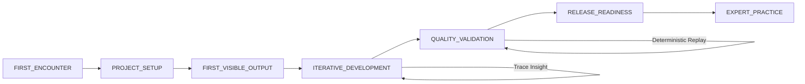
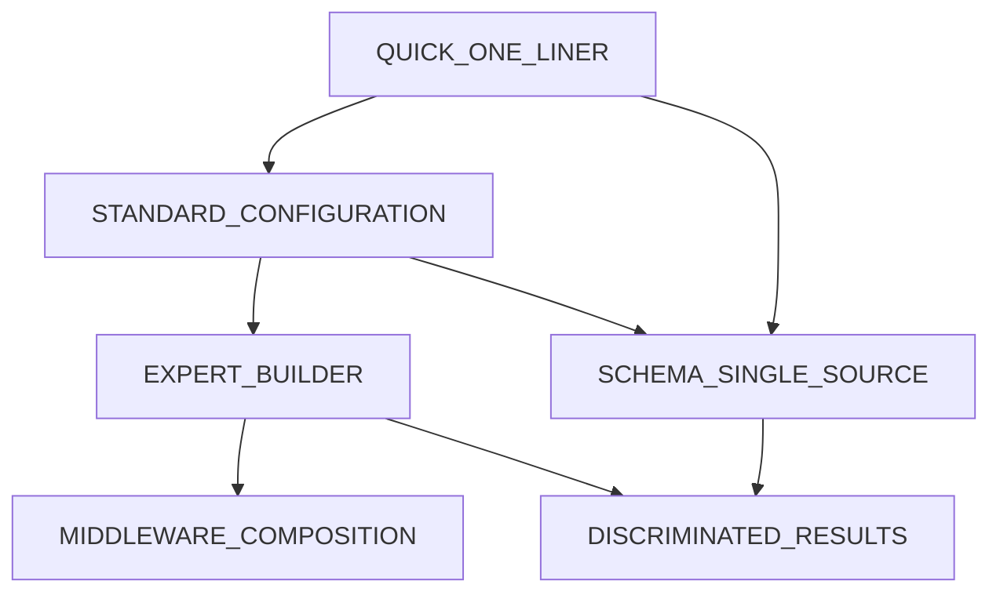
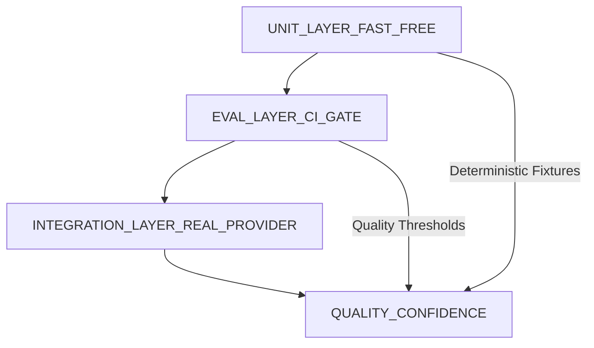

# Developer Experience & Onboarding

> **Scope**: Developer Experience and onboarding governance for `safeagent` from first encounter to expert usage.
>
> **Tasks**: DEVELOPER_ENTRY_EXPERIENCE, PROGRESSIVE_API_EXPERIENCE, ERROR_EXPERIENCE_GOVERNANCE, LOCAL_EXPERIENCE_ENABLEMENT, STUDIO_EXPERIENCE, TESTING_EXPERIENCE, TEMPLATE_EXPERIENCE, AI_ASSISTANT_EXPERIENCE, TYPESCRIPT_PERFORMANCE_GOVERNANCE, OBSERVABILITY_EXPERIENCE, TOOL_CREATION_EXPERIENCE

---

## Table of Contents
- [Strategic Context](#strategic-context)
- [Project Onboarding](#project-onboarding)
- [Progressive API Design](#progressive-api-design)
- [Error Taxonomy and Diagnostics](#error-taxonomy-and-diagnostics)
- [Local Development Environment](#local-development-environment)
- [Interactive Development Studio](#interactive-development-studio)
- [Testing Utilities](#testing-utilities)
- [Template and Starter Ecosystem](#template-and-starter-ecosystem)
- [AI Coding Agent Integration](#ai-coding-agent-integration)
- [TypeScript Performance Budget](#typescript-performance-budget)
- [OpenTelemetry and Observability Integration](#opentelemetry-and-observability-integration)
- [Tool Development Workflow](#tool-development-workflow)
- [Delivery Checklist](#delivery-checklist)
- [Mermaid Diagrams](#mermaid-diagrams)
- [Reference URLs](#reference-urls)
- [Navigation](#navigation)

## Strategic Context
- Developer Experience is a first-order adoption risk, not a documentation afterthought.
- Onboarding quality directly determines community trust, paid adoption velocity, and long-term ecosystem depth.
- `safeagent` governance in this file defines how beginner productivity and expert control coexist without conflict.
- The framework commitment is Bun-only runtime and toolchain behavior with one npm package: `safeagent`.
- Package fragmentation is explicitly out of scope; scoped package families are disallowed for this initiative.
- SurrealDB integration is constrained to surqlize for consistent behavior and durable query governance.
- PostgreSQL integration is constrained to Drizzle for schema consistency and migration discipline.
- The onboarding model must remain local-first, network-optional, and practical for individual developers before team rollout.
- This plan extends and harmonizes testing, observability, TUI, demos, and extensibility directives from adjacent files.
- Every experience decision in this file must improve one of: time-to-first-output, confidence-to-ship, or mean-time-to-diagnose.

### Experience Principles
- Zero-friction entry is mandatory for first-time developers.
- Progressive disclosure is mandatory for intermediate and expert growth.
- Runtime safety and type safety must reinforce each other.
- Diagnostics must be actionable without support escalation.
- Local development must work without cloud dependency.
- Instrumentation must be default-visible and low overhead.
- Template quality must be production-credible, not tutorial-only.
- Testing must support deterministic local confidence and high-signal CI gates.
- Observability export must stay framework-agnostic and standards-based.
- Tool creation must prioritize isolation, replayability, and publication portability.

### Outcome Commitments
- New developers can reach visible output quickly and repeat that success without hidden setup complexity.
- Teams can adopt advanced controls in stages instead of facing one monolithic interface.
- Error handling can be triaged by category and domain without fragile pattern matching.
- Local environments can run full development loops with no internet reliance for core capabilities.
- AI coding assistants can load lightweight context by default and expand guidance on demand.
- Type-checking and editor responsiveness remain measurable quality gates under high tool counts.
- Tracing and telemetry can be exported to all compatible platforms through OpenTelemetry.

## Project Onboarding

### Intent
- The onboarding experience must reduce first-contact uncertainty and produce confidence immediately.
- The onboarding flow is interactive and user-guided rather than requiring manual setup.
- Initial setup must prioritize local execution and visible outcome instead of credential setup.

### Mandatory Requirements
- The initial project creation flow is interactive and designed around guided choices.
- Template selection includes provider choice, use case orientation, and framework integration posture.
- First run must produce visible output with no hidden prerequisite beyond documented local setup.
- An environment template is required and must default to local-first provider behavior.
- Local model provider defaults must be preferred over cloud-first assumptions.
- The onboarding experience must preserve Bun-only workflows and `safeagent` single-package constraints.
- Initial project outputs must avoid hidden dependency on network-only infrastructure.

### Governance Rules
- The onboarding experience prompts must use clear language that explains implications of each choice.
- Template metadata must identify intended audience: beginner, intermediate, expert.
- New projects must include onboarding notes focused on outcome validation, not internal mechanics.
- New projects must include explicit indicators for optional cloud augmentation, not baseline dependency.
- Onboarding flow evolution must be reviewed every release iteration with adoption telemetry.

### Acceptance Signals
- Median time from onboarding start to first visible output remains below an agreed threshold.
- Setup failure reports trend downward across each release iteration.
- First-time users can recover from setup issues using provided diagnostics guidance without external help.
- New developer satisfaction improves in surveys tied to initial workflow completion.

### Non-Goals
- The onboarding experience does not attempt to replace architecture governance from foundational files.
- The onboarding experience does not expose expert-only controls during beginner flow unless explicitly requested.
- The onboarding experience does not force cloud account setup during initial flow.

## Progressive API Design

### Intent
- The API surface must scale with developer maturity while preserving a stable happy path.
- Beginners must achieve useful outcomes without facing complexity intended for advanced use.

### Three-Tier API Surface
- Tier one provides a quick one-liner experience for immediate productivity.
- Tier two provides standard configuration for common production adjustments.
- Tier three provides expert builder composition with middleware extensibility.
- Tier transitions must be incremental and understandable, not disruptive rewrites.
- Each tier must have clear decision criteria that describe when to advance.

### Mandatory Requirements
- Beginners are never forced into expert controls to complete core tasks.
- Happy-path usage is zero-config for common scenarios.
- Schema-as-single-source-of-truth is mandatory using Zod v4.
- Zod v4 schema definitions must drive runtime validation and TypeScript typing consistently.
- Tool results must use discriminated unions for safe narrowing.
- Public API contracts must avoid untyped escape hatches as outward-facing return shapes.
- Progressive surface area must remain Bun-compatible without alternate runtime assumptions.

### Design Governance
- Tier one language emphasizes outcomes and defaults.
- Tier two language emphasizes explicit control and predictable override behavior.
- Tier three language emphasizes composition, policy layering, and lifecycle controls.
- Cross-tier semantics must remain aligned to avoid conceptual drift.
- Migration across tiers must preserve behavior clarity and user confidence.

### Safety and Type Integrity
- Discriminated union outcomes must include stable identifiers and structured payload variants.
- Runtime validation failures must map to documented error taxonomy categories.
- Type narrowing patterns must remain robust across package boundary usage.
- Public contracts must preserve backward-compatible shape expectations through release changes.

### Adoption Metrics
- Percentage of users shipping successfully on tier one without escalation.
- Percentage of users moving from tier one to tier two for sustained production needs.
- Percentage of expert adopters using middleware composition successfully.
- Reduction in support requests tied to unclear API surface choices.

## Error Taxonomy and Diagnostics

### Intent
- Error behavior must enable fast, confident resolution instead of generic failure states.
- Developers must understand what failed, why it failed, and what to do next.

### Named Error Hierarchy
The system SHALL provide a minimum of fifteen distinct named error types covering: configuration validation, schema validation, agent execution, authentication and authorization, rate limiting, context window exhaustion, maximum step limits, tool resolution failure, invalid tool results, memory operations, guardrail violations, provider communication, transport failures, budget enforcement, and timeout conditions.

### Error Domain Classification
The error taxonomy SHALL classify every error into one of at least eight semantic domains: tool operations, agent lifecycle, memory operations, retrieval operations, provider communication, transport layer, guardrail enforcement, and configuration.

### Error Category Classification
The error taxonomy SHALL classify every error into one of three fault-origin categories:
- Developer-originated faults from mistakes and invalid setup assumptions.
- Framework-originated faults from internal defects and contract failures.
- External faults from provider, network, or dependency failures.

### Message Quality Contract
- Every error message must answer: what happened.
- Every error message must answer: why it happened.
- Every error message must answer: what should happen next.
- Every error message must include context fields aligned to domain and category.
- Diagnostic payloads must remain concise enough for terminal readability.
- Human-readable guidance must remain present even when machine-readable metadata exists.

### Isolation and Resilience
- Step-level error isolation is required so one tool failure does not terminate entire agent execution.
- Partial success outcomes must remain visible with structured failure records.
- Recovery policies must support retry, skip, and fallback decisions by error category.
- Error boundaries must prevent cascading failures across independent steps.

### Type-Safe Identification Pattern
- Error identification must use stable discriminants and structured metadata.
- Cross-boundary recognition must not rely on fragile inheritance-based identification.
- Identification patterns must be deterministic across transpilation or bundling differences.
- Consumer logic must be able to branch on domain and category safely.

### Diagnostic Maturity Targets
- Time-to-understand primary failure cause declines with each release iteration.
- Support escalations caused by ambiguous error messaging decline across onboarding cohorts.
- Reproducibility quality improves through enriched context and trace linkage.

## Local Development Environment

### Intent
- Local development is the default operating mode, not a reduced or secondary path.
- Internet access and paid credentials must not block baseline framework learning and iteration.

### Mandatory Requirements
- Ollama support is first-class and documented as primary local provider path.
- Mock provider mode must require zero API keys for local work.
- Core architecture must be offline-capable for memory, tools, and tracing workflows.
- Environment validation concept must check setup readiness and return actionable guidance.
- Provider abstraction must support switching through a single configuration decision point.
- Local defaults must avoid accidental cloud coupling.

### Local-First Governance
- Local provider posture must remain parity-tested against cloud-backed providers for core flows.
- Offline behavior must degrade gracefully and report precise missing capabilities.
- Development feedback loops must remain fast under local-only execution.
- Local traces must remain accessible for root-cause analysis with no external service dependency.

### SurrealDB and PostgreSQL Constraints
- SurrealDB usage is REQUIRED through surqlize for consistency and developer trust.
- PostgreSQL usage is REQUIRED through Drizzle for relational schema governance.
- Storage guidance must preserve one conceptual model across local and team environments.

### Adoption Criteria
- New developer can complete local setup and first run without cloud keys.
- Mock mode enables deterministic learning and testing without billing exposure.
- Offline work remains productive for core design, testing, and diagnostics loops.

### External Reference
- Official Ollama documentation: https://ollama.com/

## Interactive Development Studio

### Intent
- Developers need a visual development workspace that exposes runtime behavior and iteration quality.
- The studio concept complements terminal workflows with trace-aware feedback.

### Mandatory Requirements
- Local browser-based development UI concept is required.
- Agent chat interface is required for real-time behavioral testing.
- Step trace viewer with timing is required.
- Tool isolation testing is required before agent attachment.
- Token usage visibility is required.
- Cost visibility is required where applicable.
- Middleware-based tracing activation is required with zero-config behavior.
- Traces are stored locally and automatically excluded from source control workflows.

### UX Governance
- Studio information hierarchy must prioritize current run status, step timeline, and outcome clarity.
- Visual states must communicate success, warning, retry, and failure distinctly.
- Timing data must be readable at both step granularity and end-to-end granularity.
- Token and cost views must differentiate estimate and observed values clearly.

### Operational Governance
- Studio must remain optional for teams that prefer terminal-only workflows.
- Studio telemetry must align with privacy and compliance controls from security and observability plans.
- Studio data retention defaults must favor short-lived local inspection.

### External References
- Official Vercel AI SDK documentation: https://ai-sdk.dev/docs
- Official Mastra Studio documentation: https://mastra.ai/docs/getting-started/studio

## Testing Utilities

### Intent
- Testing must give developers confidence at three horizons: immediate local correctness, CI quality gates, and production realism.

### Mandatory Utility Set
- Mock provider must support fixture-based responses.
- Mock provider must support streaming simulation.
- Mock provider must support controlled error injection.
- Agent run simulation helper must return complete step trace for assertions.
- Fixture recording mode must capture real responses for deterministic replay.
- Custom test matchers must support expressive agent assertions.
- Deterministic mode must include fixed temperature behavior.
- Deterministic mode must include seeded identifiers.
- Deterministic mode must include retry suppression.

### Testing Pyramid Requirements
- Unit layer uses mock providers and prioritizes speed and zero external cost.
- Eval layer uses model-judged quality checks and acts as CI gating signal.
- Integration layer uses real provider behavior on scheduled cadence.
- Layer boundaries must remain clear so signal quality is interpretable.
- Promotion of checks between layers must be deliberate and justified.

### Fixture Governance
- Fixtures must preserve semantic coverage across happy path and failure path scenarios.
- Recording cadence must prevent drift from live provider behavior.
- Replay determinism must be validated on every release iteration.
- Sensitive data capture in fixtures must be prohibited by default.

### CI Governance
- Unit checks run on every change.
- Eval checks run as merge gating criteria according to reliability policy.
- Integration checks run on scheduled cadence with trend tracking.
- Failure triage must classify whether issue is test artifact, framework behavior, or provider drift.

### Quality Signals
- Mean unit runtime remains fast enough for frequent local execution.
- Eval gate stability improves across release iterations.
- Integration findings produce actionable follow-up rather than intermittent noise.

### External Reference
- Official Vitest documentation: https://vitest.dev/

## Template and Starter Ecosystem

### Intent
- Templates accelerate adoption by giving trustworthy starting points for real workloads.

### Mandatory Template Set
- Basic agent template.
- Tool-enabled agent template.
- Multi-agent collaboration template.
- Retrieval-augmented (RAG) template.
- Human-in-the-loop template.
- Local-model-first template.

### Quality Bar
- Every template is standalone and runnable immediately.
- Every template demonstrates visible output on first run.
- Every template includes clear adaptation notes for real deployment contexts.
- Every template must align with Bun-only and single-package package policy.
- Every template must align with local-first defaults and offline-friendly posture.

### Framework Integration Guidance
- Integration guides must cover Elysia and Hono.
- Integration guidance must preserve framework-native patterns while maintaining safeagent conventions.
- Guidance must explain how to adopt progressively from minimal use to advanced composition.

### Example Ecosystem
- The project SHALL provide a curated set of standalone runnable examples for focused concepts.
- Each example SHALL be independently executable with its own declared dependencies.
- Example entries must state intended audience and required baseline knowledge.
- Example curation must prioritize realistic patterns over toy-only demonstrations.
- Example refresh cadence must track major release iterations and deprecate stale patterns.
- Example governance must define ownership, minimum quality standards, and review requirements.

### Ecosystem Governance
- Template review board must approve additions based on quality and maintenance ownership.
- Community contributions must meet reliability and onboarding criteria before inclusion.
- Template lifecycle states must be explicit: active, maintenance, or archived.

## AI Coding Agent Integration

### Intent
- AI-assisted development should accelerate adoption while preserving framework correctness.

### Mandatory Requirements
- Provide an agent skill artifact for major coding assistants.
- Support assistant ecosystems including Claude Code, Cursor, and Gemini CLI.
- Progressive disclosure model is required.
- Lightweight metadata loads by default around a small token budget.
- Full instruction set loads on demand when deeper guidance is needed.

### Governance Requirements
- Metadata layer must include core principles, safety constraints, and key terminology.
- Expanded instruction layer must include deeper design guidance and troubleshooting heuristics.
- Assistant guidance must remain aligned with current release behavior and migration notes.
- Drift detection must identify outdated assistant guidance before release publication.

### Adoption Outcomes
- Developers receive context-aware suggestions that match framework intent.
- Assistant-guided outputs reduce onboarding mistakes and policy violations.
- Expert teams can use assistant support without sacrificing architectural control.

## TypeScript Performance Budget

### Intent
- Type system quality must remain a productivity multiplier, not a latency tax.

### Mandatory Requirements
- CI must enforce a budget ensuring fast type-check behavior with 30 or more registered tools.
- Complex Zod schema workloads must be included in performance checks.
- IDE responsiveness must be treated as measurable quality.
- Regression thresholds must trigger intervention before release promotion.

### Measurement Model
- Track end-to-end type-check duration under representative project scale.
- Track incremental edit feedback latency in common development flows.
- Track memory pressure under high-schema and high-tool workloads.
- Track diagnostic latency for complex discriminated union outcomes.

### Governance Policy
- Performance budgets must be visible and reviewed each release iteration.
- Budget exceptions require explicit risk acceptance and remediation plan.
- Improvements should focus on contract design and type simplification where safe.
- New API additions must include expected type-performance impact analysis.

### Quality Signals
- Type-check duration remains stable as tool count grows.
- Editor responsiveness remains predictable for advanced schema usage.
- Developer-reported sluggishness decreases after optimization initiatives.

## OpenTelemetry and Observability Integration

### Intent
- Observability must connect onboarding, reliability, and governance through one standards-based trace model.

### Mandatory Requirements
- Framework-agnostic trace export through OpenTelemetry is required.
- Compatibility with Langfuse is required.
- Compatibility with Braintrust is required.
- Compatibility with Jaeger is required.
- This plan must extend observability direction defined in the Observability document.

### Observability Governance
- Trace schema must capture step lifecycle, tool invocations, guardrail decisions, and error category metadata.
- Trace correlation must support end-to-end diagnosis from onboarding failures to production incidents.
- Sampling policy must balance cost control and diagnostic completeness.
- Local trace persistence must support short-loop debugging with easy cleanup.

### Integration Expectations
- Export behavior must avoid coupling to a single vendor data model.
- Instrumentation defaults must be safe, informative, and low overhead.
- Teams must be able to route telemetry to existing operations stacks without custom rewrites.

### External Reference
- Official OpenTelemetry documentation: https://opentelemetry.io/docs/

## Tool Development Workflow

### Intent
- Tool creation must be safe, testable, and publishable without hidden integration risk.

### Mandatory Requirements
- Tool sandbox is required for isolated validation before agent attachment.
- Trace replay is required to reproduce specific executions.
- MCP-first publishing model is required so each tool can be published as an MCP server.
- A structured tool metadata format is required for discovery and governance.

### Workflow Governance
- Tool contracts must define input and output schema expectations clearly.
- Tool sandbox runs must include success path and failure path validation.
- Replay workflows must preserve timing and context metadata sufficient for diagnosis.
- Publishing readiness must include security, reliability, and documentation checks.

### Discovery Governance
- Registry metadata must include ownership, maturity, trust level, and support policy.
- Discovery experience must prioritize safe defaults and clear capability descriptions.
- Deprecated tools must remain discoverable with migration guidance until retirement window closes.

### Operational Outcomes
- Tool integration defects are detected earlier through sandbox isolation.
- Reproducibility improves through trace replay practices.
- Ecosystem growth accelerates through standardized publishing and discovery.

## Task Specifications

### Task DEVELOPER_EXPERIENCE: Developer Platform and Onboarding Operations

**Task Name**
- DEVELOPER_EXPERIENCE

**Objective**
- Build a cohesive developer-experience platform that shortens time-to-first-success while preserving production-grade guardrails.
- Provide a progressive path from beginner onboarding through expert workflows without fragmenting the platform contract.

**What To Do**
- Implement interactive onboarding flow with local-first defaults and visible first-run outcomes.
- Define progressive API tiers for quick start, standard controls, and expert composition.
- Define error taxonomy and diagnostics contracts with domain, category, and remediation guidance.
- Establish local development readiness model with offline-capable workflows and provider abstraction clarity.
- Define development-studio experience requirements for trace visibility, token awareness, and tool isolation.
- Define deterministic testing utilities and fixture governance for fast local confidence and CI quality gates.
- Define template ecosystem with production-credible starter paths and lifecycle ownership.
- Define AI coding-assistant integration model with lightweight default context and deep on-demand guidance.
- Define type-performance budget governance for CI and editor responsiveness.
- Define observability integration expectations for standards-based trace export and vendor-neutral routing.

**Depends On**
- FOUNDATION
- OBSERVABILITY
- TESTING_FRAMEWORK
- DOCUMENTATION
- EXTENSIBILITY

**Batch**
- FRONTEND_DEMOS_BATCH

**Acceptance Criteria**
- Onboarding flow supports local-first setup and reaches first visible output without cloud dependency.
- Progressive API contract is clear across tier boundaries and preserves migration clarity.
- Error taxonomy covers required domains and categories with actionable diagnostics.
- Local development model supports offline-capable core loops with predictable provider switching.
- Studio and trace workflows are defined with privacy and retention governance.
- Testing utility model enables deterministic replay and high-signal CI gate alignment.
- Template and example ecosystem has ownership, quality bar, and lifecycle policy.
- AI assistant guidance model supports bounded default context and governed deep guidance.
- Type-performance and observability governance include measurable thresholds and review cadence.

**QA Scenarios**
- Run onboarding simulation from clean environment, verify first-run success and recovery guidance quality.
- Evaluate tier progression from quick to expert usage, verify behavior continuity and documentation clarity.
- Trigger representative failure classes, verify diagnostics include cause, context, and next-action guidance.
- Execute offline local workflow with mock provider, verify development loop remains productive.
- Validate template starter outcomes, verify each path produces runnable output with adaptation notes.

**Implementation Notes**
- Keep onboarding and diagnostics language consistent with documentation and standards governance.
- Prioritize deterministic developer feedback loops before introducing optional advanced complexity.
- Align all DX artifacts to one runtime and package posture to reduce ecosystem fragmentation risk.

## Delivery Checklist

### This File Delivers
- Governance model for end-to-end Developer Experience from first contact through expert operations.
- Project onboardinging strategy with local-first defaults and visible first-run outcome requirements.
- Progressive API model with three-tier disclosure and type-safe schema governance via Zod v4.
- Comprehensive error taxonomy, domain and category classification, and actionable diagnostics contract.
- Local development architecture requirements including Ollama-first and offline-capable workflows.
- Interactive development studio requirements for chat testing, trace viewing, and cost transparency.
- Testing utility strategy with deterministic replay, fixture recording, and layered quality gates.
- Template ecosystem strategy with six production-grade starter categories and framework guidance.
- AI coding assistant integration strategy using progressive disclosure and bounded metadata loading.
- TypeScript performance governance with measurable CI and IDE responsiveness budgets.
- OpenTelemetry integration requirements aligned with broader observability strategy.
- Tool development lifecycle governance including sandboxing, replay, and MCP-first publishing.

### Cross-Reference Table
| Related File | Relationship to This File | Dependency Direction | Coordination Requirement |
|---|---|---|---|
| [Foundation](./foundation.md) | Establishes baseline architecture and runtime policy | Foundation constrains DX design choices | Keep Bun-only and single-package constraints aligned |
| [TUI](./tui.md) | Defines terminal interaction patterns that complement studio workflows | TUI informs local developer interaction ergonomics | Align diagnostics language and trace affordances |
| [Observability](./observability.md) | Defines trace and telemetry semantics extended here | Observability underpins diagnostics and studio visibility | Keep OpenTelemetry payload semantics consistent |
| [Testing](./testing.md) | Defines core testing strategy expanded here for DX | Testing enables onboarding confidence and CI policy | Harmonize deterministic test posture and quality gates |
| [Demos](./demos.md) | Provides adoption-facing demonstrations and runnable narratives | Demos accelerate onboarding and template validation | Keep examples synchronized with template ecosystem |
| [Documentation](./documentation.md) | Defines docs architecture and publishing standards | Documentation carries onboarding and migration guidance | Ensure progressive disclosure language remains consistent |
| [Coding Standards](./coding-standards.md) | Sets implementation discipline and quality norms | Standards affect template quality and assistant guidance | Ensure diagnostics and type safety constraints stay aligned |
| [Extensibility](./extensibility.md) | Governs extension boundaries and trust controls | Extensibility enables MCP-first tool publishing | Align registry policy, sandboxing, and trust metadata |

### Delivery Acceptance Gates
- All required sections in this file are present and populated with governance language.
- Mermaid diagrams are present with UPPER_SNAKE task identifiers.
- Diagram labels remain conceptual and avoid implementation-specific naming.
- Bun-only, single-package, surqlize, and Drizzle constraints are explicit.
- Error taxonomy includes at least fifteen named error types and required domain and category classifications.
- Progressive API tiering includes zero-config happy path and expert disclosure boundaries.
- Testing pyramid and deterministic tooling model are explicitly defined.
- OpenTelemetry compatibility requirements and Observability document extension note are explicit.

## Operational Rollout Governance

### Rollout Phases
- Phase one focuses on onboarding reliability and first-run visibility outcomes.
- Phase two focuses on progressive API confidence and diagnostics maturity.
- Phase three focuses on studio adoption, telemetry export quality, and template ecosystem depth.
- Phase four focuses on expert workflows, MCP-first tool publishing maturity, and partner enablement.

### Entry Criteria Per Phase
- Phase one entry requires stable onboarding outcomes and local-first defaults.
- Phase two entry requires tiered API clarity and discriminated union consistency.
- Phase three entry requires trace visibility, token insight, and local retention policy readiness.
- Phase four entry requires reproducible tool workflows and registry governance maturity.

### Exit Criteria Per Phase
- Phase one exit requires low setup failure trend and positive first-use sentiment.
- Phase two exit requires declining API confusion incidents and improved type-safety confidence.
- Phase three exit requires sustained trace usefulness and reduced diagnosis latency.
- Phase four exit requires ecosystem contribution quality and predictable publication outcomes.

### Risk Register Focus Areas
- Onboarding fragility risk from hidden assumptions in onboarding defaults.
- API confusion risk from unclear tier boundaries and naming consistency.
- Diagnostic ambiguity risk from insufficient context in failure payloads.
- Local parity risk where offline behavior diverges from connected behavior.
- Template staleness risk from missing maintenance ownership.
- Assistant guidance drift risk from outdated skills metadata.
- Performance regression risk from complex schema growth and tool scale.

### Mitigation Posture
- Maintain mandatory readiness checks before rollout phase transitions.
- Run periodic onboarding simulations with mixed experience-level cohorts.
- Tie diagnostics quality to measurable support outcomes.
- Enforce deterministic testing gates before broad rollout expansion.
- Require observability checks for feature areas affecting runtime trust.

### Governance Cadence
- Weekly triage for onboarding blockers and diagnostics quality findings.
- Biweekly review for template quality, example health, and framework guide accuracy.
- Monthly review for type-performance budgets and editor responsiveness trend.
- Monthly review for local development parity against connected provider behavior.
- Quarterly review for assistant guidance drift and ecosystem impact metrics.

### Ownership Model
- Product ownership defines adoption goals and release prioritization.
- Engineering ownership defines technical quality bars and gating checks.
- Developer relations ownership defines ecosystem feedback loops and adoption narratives.
- Reliability ownership defines observability fitness and diagnostics standards.
- Security ownership verifies policy alignment for local traces and publishing workflows.

## Adoption Metrics and Quality Signals

### Onboarding Metrics
- Time from first encounter to first visible output.
- Percentage of first-time users reaching successful first run.
- Recovery success rate after initial setup errors.
- Repeat usage rate within the first adoption window.

### API Experience Metrics
- Distribution of usage across quick, standard, and expert tiers.
- Upgrade rate from quick tier to standard tier over time.
- Upgrade rate from standard tier to expert tier for advanced projects.
- Error density linked to misapplied tier assumptions.

### Diagnostics Metrics
- Mean-time-to-diagnose for common failure categories.
- Percentage of errors resolved without external support.
- Percentage of errors with complete context fields.
- Rate of repeated failures caused by unclear remediation guidance.

### Local Development Metrics
- Local-first setup completion rate without cloud credentials.
- Offline workflow success rate for core development loops.
- Mock-provider usage rate during onboarding and testing.
- Provider-switch success rate through single configuration decision point.

### Studio Metrics
- Studio adoption rate across active developer cohort.
- Trace-view engagement rate during debugging sessions.
- Tool isolation usage before agent attachment.
- Token and cost panel usage during optimization work.

### Testing Metrics
- Unit suite median runtime and stability trend.
- Eval gate pass rate and false-positive rate.
- Integration trend quality across scheduled execution windows.
- Deterministic replay success rate across recorded fixtures.

### Ecosystem Metrics
- Template activation rate by category.
- Example completion rate for standalone scenarios.
- Community contribution acceptance rate for templates.
- Ecosystem maintenance backlog age distribution.

### Performance Metrics
- Type-check latency under high tool counts.
- Editor diagnostic response latency under complex schemas.
- Trend of performance exceptions accepted versus remediated.
- Impact of schema complexity on developer workflow throughput.

### Observability Metrics
- Trace completeness ratio across execution paths.
- Correlation success rate between diagnostics and traces.
- Export success rate to compatible observability backends.
- Sampling strategy effectiveness for balancing cost and insight.

### Reporting Expectations
- Metrics must be reviewable by engineering, product, and developer relations stakeholders.
- Trends must be tracked by release iteration with root-cause annotations.
- Metric regressions must trigger documented response plans.
- Metrics that no longer inform decisions must be retired deliberately.

## Mermaid Diagrams

### Developer Journey Flow

### Progressive API Disclosure

### Testing Pyramid

## Reference URLs
- Vercel AI SDK: https://ai-sdk.dev/docs
- Mastra Studio: https://mastra.ai/docs/getting-started/studio
- OpenTelemetry: https://opentelemetry.io/docs/
- Vitest: https://vitest.dev/
- Ollama: https://ollama.com/

## Test Specifications

> **Relationship to Task Specifications**: The QA Scenarios in each task spec above verify task completion through action-oriented acceptance checks. The test specifications below define comprehensive behavioral assertions for property-based and integration testing. Both are complementary — QA Scenarios confirm "the task is done," test specifications confirm "the system behaves correctly under all conditions."

**Project onboarding behavior**:

- Project creation flow is interactive and guides users through provider choice, use case, and framework integration selection.
- Template selection prompts include clear language explaining the implications of each choice.
- Generated project produces visible output on first run with mock provider and no cloud credentials.
- Environment template defaults to local-first provider behavior and avoids accidental cloud coupling.
- Template metadata identifies intended audience level for each template choice.
- Onboarding recovery guidance enables first-time users to resolve setup issues without external support.

**Progressive API tier behavior**:

- Tier one provides zero-config happy-path behavior that produces useful outcomes without expert controls.
- Tier two provides explicit configuration overrides for common production adjustments.
- Tier three provides builder composition with middleware extensibility and lifecycle controls.
- Tier transitions are incremental and preserve behavior clarity without requiring disruptive rewrites.
- Beginners are never forced into expert controls to complete core tasks.
- Discriminated union outcomes include stable identifiers and structured payload variants for safe narrowing.
- Runtime validation failures map to documented error taxonomy categories.

**Error taxonomy and diagnostics behavior**:

- Error taxonomy provides at least fifteen distinct named error types covering all documented categories.
- Every error is classified into one of at least eight semantic domains.
- Every error is classified into one of three fault-origin categories: developer, framework, or external.
- Every error message answers what happened, why it happened, and what should happen next.
- Error identification uses stable discriminants that work across transpilation and bundling differences.
- Step-level error isolation prevents one tool failure from terminating entire agent execution.
- Partial success outcomes remain visible with structured failure records.
- Recovery policies support retry, skip, and fallback decisions by error category.

**Local development environment behavior**:

- Ollama is supported as first-class local provider with documented primary provider path.
- Mock provider mode requires zero API keys for local development and testing.
- Core architecture is offline-capable for memory, tools, and tracing workflows.
- Environment validation checks setup readiness and returns actionable guidance on missing prerequisites.
- Provider switching requires only a single configuration decision point change.
- Offline behavior degrades gracefully and reports precise missing capabilities.
- Local provider behavior is parity-tested against cloud-backed providers for core flows.
- Local data workflows use surqlize for SurrealDB interactions and Drizzle for PostgreSQL interactions with no raw query access.

**Interactive development studio behavior**:

- Local browser-based studio starts correctly and renders agent chat, trace viewer, and tool sandbox surfaces.
- Agent chat interface supports real-time behavioral testing with streaming responses.
- Step trace viewer displays timing data at both step granularity and end-to-end granularity.
- Tool sandbox validates tools in isolation before agent attachment with schema validation.
- Token usage and cost visibility differentiate estimated and observed values clearly.
- Tracing activation requires zero configuration through middleware-based defaults.
- Traces are stored locally and automatically excluded from source control workflows.

**Testing utilities behavior**:

- Mock provider returns fixture-based responses and supports streaming simulation behavior.
- Mock provider supports controlled error injection for failure path testing.
- Agent run simulation helper returns complete step trace for assertions.
- Fixture recording mode captures real responses and replays deterministically.
- Deterministic mode produces identical results across repeated runs with fixed temperature, seeded identifiers, and retry suppression.
- Custom test matchers support expressive agent-specific assertions.
- Fixture governance prohibits sensitive data capture in fixtures by default.
- Recording cadence validation ensures fixtures do not drift from live provider behavior.

**Template and starter ecosystem behavior**:

- Template gallery provides all six required template creation flows (basic, tool-enabled, multi-agent, RAG, HITL, local-model-first) successfully.
- Every template produces visible output on first run and includes adaptation notes for real deployment.
- Every template aligns with Bun-only and single-package constraints.
- Template lifecycle states (active, maintenance, archived) are enforced by governance.
- Framework integration guidance covers Elysia and Hono while preserving framework-native patterns.
- Standalone runnable examples are independently executable with declared dependencies.

**AI coding agent integration behavior**:

- AI coding agent skill definition loads with correct metadata and instruction payloads.
- Lightweight metadata loads by default within a small token budget.
- Full instruction set loads on demand when deeper guidance is needed.
- Metadata layer includes core principles, safety constraints, and key terminology.
- Drift detection identifies outdated assistant guidance before release publication.
- Multi-assistant ecosystem support covers Claude Code, Cursor, and Gemini CLI.

**TypeScript performance budget behavior**:

- Type-checking performance stays within the defined budget with thirty or more tools configured.
- Incremental edit feedback latency remains within acceptable bounds in common development flows.
- Memory pressure under high-schema and high-tool workloads stays within governance limits.
- Diagnostic latency for complex discriminated union outcomes remains responsive.
- Regression thresholds trigger intervention before release promotion.

**OpenTelemetry and observability integration behavior**:

- OpenTelemetry export emits valid trace data to configured endpoints.
- Export compatibility is verified against Langfuse, Braintrust, and Jaeger.
- Trace schema captures step lifecycle, tool invocations, guardrail decisions, and error category metadata.
- Local trace persistence supports short-loop debugging with easy cleanup.
- Export behavior avoids coupling to a single vendor data model.
- Instrumentation defaults are safe, informative, and low overhead.

**Tool development workflow behavior**:

- Tool sandbox executes tools in isolation with correct schema validation behavior.
- Tool contracts define input and output schema expectations validated before agent attachment.
- Trace replay reproduces specific executions with preserved timing and context metadata.
- MCP-first publishing model produces publishable MCP server output per tool.
- Tool metadata format includes ownership, maturity, trust level, and support policy.
- Publishing readiness checks include security, reliability, and documentation validation.
- Deprecated tools remain discoverable with migration guidance until retirement window closes.
