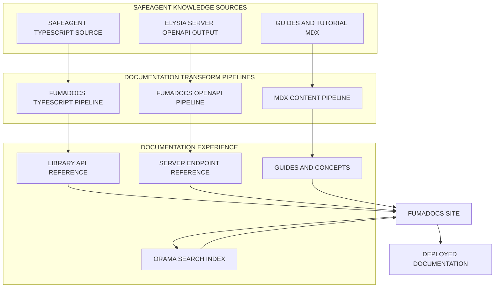
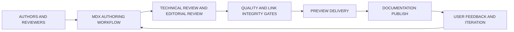
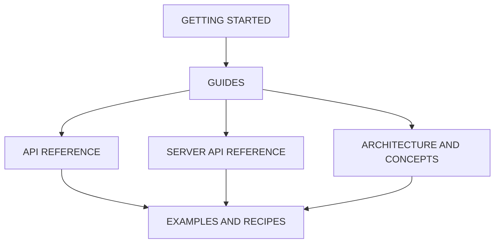
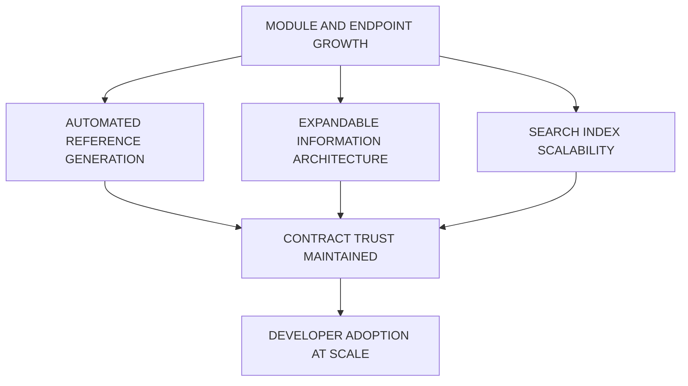

# Documentation Site

> **Scope**: Fumadocs-based documentation platform for safeagent, combining authored guides with auto-generated library and server reference material, optimized for long-term maintainability, security posture clarity, and 10M-user scale readiness.
>
> **Tasks**: DOCS_SITE (Fumadocs Site Infrastructure), DOCS_CONTENT (Documentation Content Authoring)

---

## Table of Contents
- [Architecture Overview](#architecture-overview)
- [Documentation Information Architecture](#documentation-information-architecture)
- [TypeScript API Reference Pipeline](#typescript-api-reference-pipeline)
- [OpenAPI Server Reference Pipeline](#openapi-server-reference-pipeline)
- [Search and Discoverability](#search-and-discoverability)
- [Content Authoring Experience](#content-authoring-experience)
- [Theming and Design Language](#theming-and-design-language)
- [Deployment and Delivery Model](#deployment-and-delivery-model)
- [Security, Governance, and Scalability](#security-governance-and-scalability)
- [Cross-References](#cross-references)
- [Task Specifications](#task-specifications)
- [Delivery Checklist](#delivery-checklist)

## Architecture Overview

The documentation platform is a first-class product surface, not a side artifact.
It must communicate trustworthy behavior, expose complete reference depth, and stay synchronized with real system behavior under continuous delivery.

Fumadocs is the selected framework because it aligns directly with the safeagent ecosystem:
- Native compatibility with Next.js App Router.
- Native TypeScript API documentation generation via fumadocs-typescript.
- Native OpenAPI ingestion via fumadocs-openapi.
- Built-in Orama search with no external key dependency.
- Strong maintenance posture and broad community adoption.
- Tailwind CSS theming with dark mode support.

Primary references:
- Fumadocs: https://fumadocs.vercel.app/docs
- Orama: https://docs.orama.com
- Elysia Swagger: https://elysiajs.com/plugins/swagger

Design principles:
- Documentation output must stay aligned with implementation reality through automated reference generation.
- Guides and concepts must explain intent, trade-offs, and safe operation boundaries.
- Search must make both conceptual and endpoint-level discovery fast.
- Visual design must support long reading sessions on desktop and mobile.
- Security and scalability expectations must be explicit in all critical sections.

## Documentation Information Architecture

The information architecture follows learning progression from onboarding to deep reference:

- Getting Started:
  - Installation and runtime prerequisites.
  - First agent walkthrough.
  - End-to-end quick start flow.
- Guides:
  - Conversation pipeline.
  - Agents and orchestration.
  - Memory and intelligence.
  - Documents and processing lifecycle.
  - Retrieval and evidence flow.
  - Guardrails and safety behavior.
  - Streaming behavior.
  - Server setup and operation.
  - Frontend SDK usage.
  - Observability and quality monitoring.
- API Reference:
  - Auto-generated library API reference from TypeScript source.
- Server API Reference:
  - Auto-generated endpoint reference from OpenAPI output.
- Architecture and Concepts:
  - System-level diagrams.
  - Data and control flow narratives.
  - Scalability and reliability patterns.
- Examples and Recipes:
  - Common integration patterns.
  - Operational troubleshooting playbooks.
  - Goal-oriented implementation recipes.

Behavioral contract:
- Every major module has both conceptual explanation and actionable usage guidance.
- Every public API surface appears in reference material.
- Cross-linking between guides, concepts, and references is mandatory to prevent content silos.
- Getting Started must be runnable by a new user without hidden assumptions.

## TypeScript API Reference Pipeline

Purpose:
- Generate trustworthy library API documentation directly from safeagent TypeScript source.
- Reduce documentation drift by minimizing manual duplication.

Pipeline behavior:
- fumadocs-typescript reads source declarations and emits structured API reference content.
- AutoTypeTable renders type and shape tables directly within documentation pages.
- Documentation annotations control visibility and narrative quality:
  - `@internal` hides non-public details from published reference.
  - `@remarks` adds contextual explanations for consumers.
- Generated API pages update whenever public surfaces evolve, keeping reference material synchronized.

Quality expectations:
- Public APIs are documented with readable descriptions and usage intent.
- Internal-only constructs are excluded from public output.
- Type relationships are presented clearly for fast comprehension.

## OpenAPI Server Reference Pipeline

Purpose:
- Publish endpoint documentation that mirrors real server behavior.
- Keep endpoint reference aligned with server route contracts.

Pipeline behavior:
- Elysia with the Swagger plugin emits OpenAPI output from runtime schemas.
- fumadocs-openapi converts that output into structured MDX endpoint pages.
- Endpoint pages are grouped by tag for discoverability and domain grouping.
- Interactive API playground is available for request and response exploration.
- Regeneration happens as endpoint contracts evolve, preventing stale endpoint docs.

Quality expectations:
- Every documented endpoint includes clear request, response, and error semantics.
- Authentication and authorization requirements are explicit.
- High-risk operations include safety notes and misuse boundaries.

## Search and Discoverability

Search is built on Orama and is part of the default user journey.

Core behavior:
- Full-text search across guides, concepts, API reference, and endpoint reference.
- Keyboard shortcut access for rapid navigation.
- Markdown-aware rendering so results preserve meaningful context.

Discoverability contract:
- Common user intents resolve within minimal query refinement.
- Search ranking favors exact API and endpoint matches while retaining conceptual results.
- Results are readable on both mobile and desktop form factors.

## Content Authoring Experience

Authoring uses MDX with interactive content primitives to balance readability and technical precision.

Authoring capabilities:
- MDX with React components for composable educational content.
- Mermaid diagrams for architecture, lifecycle, and flow communication.
- Callout components for warnings, tips, and important operational notes.
- Tab groups for presenting alternative integration approaches.
- Enhanced code block presentation with line emphasis, titles, and copy interaction.
- TypeScript Twoslash support for deep type-level explanations.

Editorial contract:
- Guides prioritize behavior, intent, and operational safety over implementation trivia.
- Terminology is consistent across all sections.
- Security-sensitive flows use explicit warning callouts.
- Large topics are segmented into progressive sections for cognitive load control.

## Theming and Design Language

The documentation visual system must align with safeagent branding while preserving readability under heavy technical content density.

Design behavior:
- Tailwind CSS-based theming primitives define color, typography, spacing, and semantic surfaces.
- Built-in dark mode maintains parity for contrast and readability.
- Responsive layout supports mobile reading, tablet browsing, and wide-screen reference work.
- Syntax highlighting remains legible across both color schemes.

Accessibility and usability expectations:
- Navigation remains keyboard-friendly.
- Content contrast is maintained for long-form reading comfort.
- Dense reference tables remain readable without horizontal overflow traps on smaller screens.

## Deployment and Delivery Model

Deployment supports both static delivery and edge delivery, enabling flexible hosting strategies.

Delivery behavior:
- Documentation builds run automatically when documentation-related changes land.
- Preview environments are generated for documentation pull requests.
- Publishing pipeline enforces consistency gates before production release.
- Rollback path is simple and fast when content regressions are detected.

Operational contract:
- Build reliability is treated as a release gate.
- Preview links are mandatory for reviewer confidence and content sign-off.
- Published output remains deterministic across repeated builds.

## Security, Governance, and Scalability

Documentation is part of the product trust model and must scale with product complexity.

Security posture:
- Authentication expectations and role boundaries are explicit in endpoint docs.
- Guardrail behavior and safety boundaries are documented in conceptual and operational sections.
- Sensitive operational guidance is reviewed for misuse risk and ambiguity.

Governance model:
- Documentation ownership spans library and server domains with shared review responsibility.
- Generated references are treated as canonical for public contract surfaces.
- Content review includes correctness, clarity, and security posture checks.

Scalability model:
- Information architecture supports growth in module count and endpoint count without navigation collapse.
- Search index remains performant as content volume expands.
- Reference generation remains automated to avoid manual bottlenecks at scale.

## Cross-References

| Plan File | Relevant Scope | How It Connects To This Document |
|---|---|---|
| [Requirements & Constraints](./requirements.md) | MH_OPENAPI_DOCS, MH_TYPEDOC | Defines mandatory outcomes for generated OpenAPI and TypeScript API documentation |
| [Research & Decisions](./research.md) | TypeDoc and OpenAPI generation findings | Establishes rationale for automated API reference generation and sync guarantees |
| [Server Implementation](./server.md) | OpenAPI documentation strategy in server scope | Defines the server-side OpenAPI production that powers endpoint reference generation |
| [Execution Plan](./execution.md) | Task orchestration and dependency scheduling | Determines delivery order for infrastructure and content authoring tasks |
| [Frontend SDK](./frontend-sdk.md) | Consumer-facing APIs and UI behavior contracts | Supplies major reference and guide content for frontend integration |
| [Demo Applications](./demos.md) | Practical usage scenarios and UX behavior | Supplies recipe and tutorial material tied to real integration examples |

Integration notes:
- Documentation deliverables must trace directly to requirement IDs and task ownership.
- Server endpoint docs must remain contract-accurate as route behavior evolves.
- Guide material must stay aligned with architecture and safety decisions.

## Task Specifications

### DOCS_SITE

**Task Name**
- DOCS_SITE

**Objective**
- Build the Fumadocs documentation infrastructure that unifies authored guides, TypeScript API reference generation, and OpenAPI endpoint reference generation.

**What To Do**
- Establish a Fumadocs site foundation on Next.js App Router for long-term maintainable documentation delivery.
- Integrate fumadocs-typescript for automatic library API reference generation.
- Integrate fumadocs-openapi for automatic server endpoint reference generation.
- Organize top-level navigation for Getting Started, Guides, API Reference, Server API Reference, Architecture and Concepts, and Examples and Recipes.
- Enable Orama search with keyboard-first discovery behavior.
- Implement Tailwind CSS theming with dark mode parity and responsive reading ergonomics.
- Enable authoring primitives for Mermaid diagrams, callouts, tab groups, and rich code presentation.
- Establish preview and production delivery flow with deterministic documentation builds.

**Depends On**
- SCAFFOLD_LIB

**Batch**
- E2E_DEPLOY_BATCH

**Acceptance Criteria**
- Documentation site builds successfully and renders all core navigation sections.
- Library API reference is generated automatically from TypeScript source and published in reference pages.
- Server endpoint reference is generated automatically from OpenAPI output and published in endpoint pages.
- Search returns relevant results across guides and reference material.
- Dark mode and light mode both preserve readability and layout stability.
- Responsive behavior supports mobile and desktop documentation usage.

**QA Scenarios**
- Open Getting Started and complete first-time setup flow using documentation only.
- Navigate from a guide topic to related API reference and return to conceptual content.
- Search for a core concept and confirm results include both guide and reference entries.
- Open endpoint reference and validate tag-based grouping and interactive exploration behavior.
- Toggle visual mode and verify code blocks, callouts, tables, and diagrams remain legible.
- Validate mobile navigation usability across long-form technical pages.

**Implementation Notes**
- Treat generated reference output as canonical contract source for public APIs and endpoints.
- Keep documentation navigation stable as module and endpoint count grows.
- Keep build reliability as a hard quality gate for documentation delivery.

### DOCS_CONTENT

**Task Name**
- DOCS_CONTENT

**Objective**
- Author complete documentation content across all safeagent modules so onboarding, conceptual understanding, and deep reference usage are all production-ready.

**What To Do**
- Write Getting Started documentation that moves from installation to first successful agent interaction.
- Write module-specific guides for conversation pipeline, agents, memory, documents, retrieval, guardrails, streaming, server setup, frontend SDK, and observability.
- Write Architecture and Concepts sections with high-signal diagrams and flow explanations.
- Write Examples and Recipes for common integration patterns and operational troubleshooting.
- Ensure every public API appears in generated reference with human-readable descriptions and contextual remarks.
- Ensure every server endpoint is represented in endpoint reference with behavior and safety context.
- Add cross-linking between guides, concepts, and references to reduce navigation dead ends.

**Depends On**
- DOCS_SITE
- All core module tasks

**Batch**
- FRONTEND_DEMOS_BATCH

**Acceptance Criteria**
- Every public API has reference documentation coverage.
- Every core module has at least one high-quality guide with clear operational outcomes.
- Getting Started tutorial works end-to-end for a first-time user.
- Architecture and concept material reflects actual system behavior and boundaries.
- Recipes cover common usage patterns and troubleshooting scenarios.
- Security and scalability concerns are explicitly documented where relevant.

**QA Scenarios**
- New contributor follows Getting Started and reaches a successful first interaction without external guidance.
- Reader starts from a guide and reaches the relevant API and endpoint reference pages through cross-links.
- Reader troubleshooting a failure scenario can find a recipe with diagnostic and resolution flow.
- Reader reviewing guardrails and auth behavior can identify trust boundaries and expected enforcement points.
- Reader on mobile can consume long conceptual content and reference tables without readability breakdown.

**Implementation Notes**
- Keep narrative tone consistent across all domains and content authors.
- Keep conceptual docs aligned with requirement and architecture identifiers for auditability.
- Keep high-change areas prioritized for frequent editorial review.

## Delivery Checklist

- DOCS_SITE implemented with successful site build and complete infrastructure capabilities.
- Automated library API reference generation validated from TypeScript source.
- Automated server endpoint reference generation validated from OpenAPI output.
- DOCS_CONTENT authored for onboarding, guides, concepts, and recipes across all core modules.
- Search quality validated across conceptual and reference queries.
- Dark mode and responsive behavior validated for production readability.
- Security and scalability narratives validated as first-class documentation concerns.

---

## Test Specifications

> **Relationship to Task Specifications**: QA Scenarios prove task completion; Test Specifications prove behavioral correctness. Use both.

**TypeScript API reference pipeline**:

- API reference pages generate from safeagent TypeScript source without manual authoring.
- Type tables reflect current exported types and update automatically on source changes.
- Internal-only types are excluded from generated reference output.
- Remark annotations in source produce descriptive labels in rendered type tables.

**OpenAPI server reference pipeline**:

- Server endpoint reference generates from the Elysia OpenAPI specification.
- Generated endpoint pages include request and response schema documentation.
- Interactive API playground allows endpoint testing from the documentation site.
- Endpoint grouping by tag produces logical navigation sections.
- OpenAPI regeneration reflects current server routes without manual synchronization.

**Search and discoverability**:

- Full-text search returns relevant results across guides, API reference, and server reference.
- Search operates without external API keys or third-party service dependencies.
- Keyboard shortcut activates the search dialog.
- Search results render markdown-aware content previews.

**Content authoring and rendering**:

- MDX content renders with callouts, tab groups, and code blocks with syntax highlighting.
- Mermaid diagrams render inline within documentation pages.
- Code blocks support line highlighting, titles, and copy-to-clipboard.
- Dark mode renders all content surfaces with correct contrast and readability.
- Responsive layout adapts documentation pages for mobile reading.

**Documentation site build and deployment**:

- Documentation site builds successfully from source content and generated reference material.
- Build detects broken internal links and reports them as errors.
- Preview deployments generate for documentation pull requests.
- Deployed site serves pages with acceptable load performance.

**Content coverage validation**:

- Every public API export from the safeagent package has a corresponding reference page.
- Every server endpoint has a corresponding reference page generated from the OpenAPI spec.
- Every core module (conversation, agents, memory, documents, retrieval, guardrails, streaming) has a corresponding guide.
- Getting started tutorial works end-to-end from installation through first agent interaction.
