# Document Processing

> **Scope**: Upload pipeline, multimodal-first processing, per-page summarization, progressive retrieval, S3 storage layout, file metadata tables, and cleanup.
>
> **Why this document exists**: Document processing is the most operationally complex part of safeagent. A large PDF (up to the configured upload limit) touches six distinct systems before a user can query it. This document defines every step, every routing decision, every table column, and every failure mode so the implementation has no ambiguity.

---

## Table of Contents

- [Upload Pipeline Overview](#upload-pipeline-overview)
- [Document Routing by Type and Size](#document-routing-by-type-and-size)
- [DOCX to PDF Conversion](#docx-to-pdf-conversion)
- [Blocking Stage: Per-Page Summarization](#blocking-stage-per-page-summarization)
- [Background Stage: Raw Text Enrichment](#background-stage-raw-text-enrichment)
- [File Status State Machine](#file-status-state-machine)
- [Per-Page Streaming Architecture](#per-page-streaming-architecture)
- [Image Extraction Pipeline](#image-extraction-pipeline)
- [S3 Storage Layout](#s3-storage-layout)
- [page_index Table Design](#page_index-table-design)
- [File Metadata Tables](#file-metadata-tables)
- [Progress Tracking](#progress-tracking)
- [Cleanup](#cleanup)
- [Cross-References](#cross-references)
- [Task Specifications](#task-specifications)
- [External References](#external-references)

---

## Upload Pipeline Overview

The upload pipeline runs in two phases. The synchronous phase (client through S3 storage) completes in under a second and returns a `fileId` to the client. The processing phase runs on the server and may take seconds to minutes depending on file size and page count. All PostgreSQL operations in this flow use Drizzle's type-safe query builder; raw SQL query strings are not part of the design.

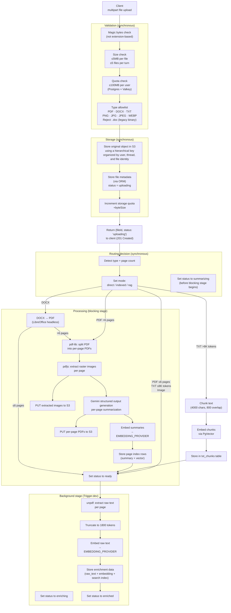

### Validation Details

**Magic bytes check**: The server reads the first 8–16 bytes of each uploaded file and compares against known file signatures. A file named `malicious.pdf` that is actually a ZIP archive fails this check. Extension alone is never trusted.

**Size limits**: Each individual file must be ≤5MB. A single turn may include up to 5 files. These limits are enforced before any S3 write happens.

**Quota enforcement**: The storage quota check reads the user's current storage usage from Postgres (`user_storage_quotas`) with a Valkey cache for speed and compares it against their limit (default 100MB). If the upload would exceed the quota, the request is rejected with a clear error before any storage write.

**Quota reservation atomicity**: Storage quota enforcement uses atomic reservation. Before accepting file bytes, the system atomically increments the user's `used_bytes` counter. If the result exceeds quota, the upload is rejected immediately. On processing failure, the reservation is rolled back. This prevents concurrent uploads from exceeding quotas.

**Supported types**:

| Type | MIME | Notes |
|------|------|-------|
| PDF | `application/pdf` | Native processing |
| DOCX | `application/vnd.openxmlformats-officedocument.wordprocessingml.document` | Converted to PDF first |
| TXT | `text/plain` | Chunked directly |
| PNG | `image/png` | Direct mode only |
| JPG / JPEG | `image/jpeg` | Direct mode only |
| WEBP | `image/webp` | Direct mode only |

**Not supported**: `.doc` (legacy binary Word format). The magic bytes for `.doc` are distinct from `.docx`. If detected, the server returns a clear error asking the user to save as `.docx` first.

---

## Document Routing by Type and Size

Every uploaded file gets assigned a `mode` immediately after validation. The mode determines how the file is processed and how it's used at query time.

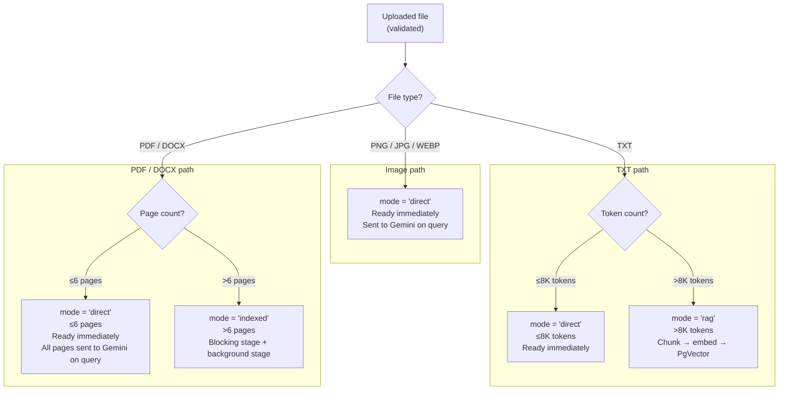

### Mode Behavior at Query Time

| Mode | Processing | Query behavior |
|------|-----------|----------------|
| `direct` (image) | None | Image bytes sent directly to Gemini with the query |
| `direct` (PDF/DOCX ≤6 pages) | None | All page PDFs sent to Gemini with the query |
| `direct` (TXT ≤8K tokens) | None | Full text included in context |
| `rag` (TXT >8K tokens) | Chunk → embed → PgVector | Vector search at query time |
| `indexed` (PDF/DOCX >6 pages) | Blocking + background stages | Hybrid search: HNSW + tsvector RRF |

The `direct` mode is intentionally simple. For small files, sending everything to the LLM is cheaper and more accurate than retrieval. The threshold of 6 pages for PDFs and 8K tokens for text is calibrated to stay within Gemini's context window while leaving room for the conversation history and system prompt.

---

## DOCX to PDF Conversion

DOCX files must be converted to PDF before the PDF processing pipeline can run. The conversion uses LibreOffice headless, which runs as a separate Docker service.

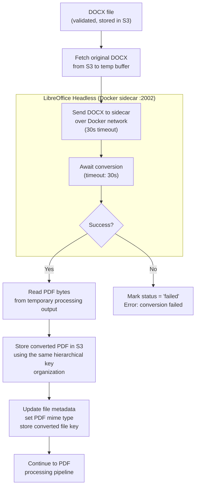

### Why LibreOffice

LibreOffice headless is the most faithful DOCX renderer available outside of Microsoft Word itself. It preserves tables, embedded images, headers, footers, and complex formatting that simpler converters lose. The Docker service runs persistently so there's no cold-start cost per conversion.

The API server sends the DOCX file to the LibreOffice sidecar over the internal Docker network on its dedicated service port. The sidecar runs LibreOffice headless, converts the file to PDF, and returns the result. The 30-second timeout handles pathological documents without hanging the pipeline. For local development without Docker, developers can install LibreOffice on the host machine and the conversion module falls back to a direct subprocess call.

**Temp file cleanup**: The temporary processing directory is cleaned after each conversion. LibreOffice writes intermediate output to the system temporary directory, which is ephemeral.

---

## Blocking Stage: Per-Page Summarization

The blocking stage runs synchronously before the file is marked `ready`. The user cannot query the file until this stage completes. It produces the primary retrieval artifacts: per-page summaries with dense vector embeddings.

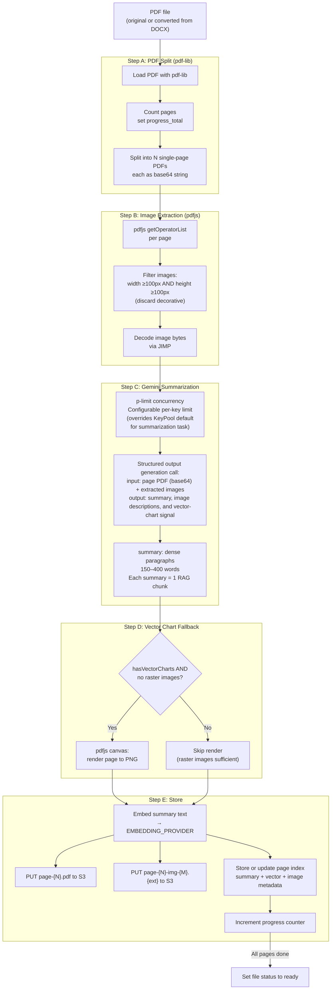

### Step A: PDF Split

pdf-lib loads the full PDF and extracts each page as a standalone single-page PDF. Each page is base64-encoded for transmission to Gemini. The page count is written to `progress_total` immediately so the client can show accurate progress.

### Step B: Image Extraction

pdfjs operator-list extraction returns the raw drawing operations for each page. Image operations are filtered to extract raster images. Images smaller than 100×100 pixels are discarded as decorative (bullets, icons, dividers). The remaining images are decoded with JIMP to get raw bytes and dimensions.

This step is pure PDF parsing. No LLM is involved. The goal is to collect the visual evidence that Gemini will need to produce an accurate summary.

### Step C: Gemini Summarization

Each page is summarized with a structured output generation call. The call sends:
- The single-page PDF as base64
- Any extracted raster images from that page
- A schema requiring summary text, an image-description array, and a vector-chart presence flag

The `summary` field must be a dense paragraph of 150–400 words. This density is intentional: sparse summaries lose retrieval precision. Each summary becomes exactly one RAG chunk in `page_index`.

The image-description array contains structured descriptions for each image on the page. These are stored in the `metadata` JSONB column and used by the visual grounding pipeline.

The vector-chart presence flag signals that the page contains charts drawn as PDF vector graphics (not raster images). These can't be extracted by pdfjs image operations.

**Concurrency**: p-limit controls how many Gemini calls run in parallel. The limit is configurable via the summarization per-key concurrency setting in the upload config (default: 50). This value overrides the key pool's default per-key concurrency for the summarization task only. Operators with higher Google AI API rate limits can increase this value (e.g., 150 for paid-tier keys). With a pool of 10 keys and a higher per-key limit, very large PDFs can be processed quickly in benchmark scenarios (e.g., ~200 pages when the upload size limit is increased for internal load testing).

### Step D: Vector Chart Fallback

If the vector-chart presence flag is true and no raster images were extracted in Step B, the page is rendered to a PNG using pdfjs canvas. This PNG is then included in the Gemini call as a supplementary image. The fallback only fires when needed — most pages with charts have raster images already.

### Step E: Store

For each page:
1. The summary is embedded via the configured embedding provider
2. The per-page PDF is uploaded to S3
3. Extracted images are uploaded to S3
4. A `page_index` row is inserted or updated with the `summary`, `summary_embedding`, and a `metadata` JSONB object containing image descriptions and S3 keys
5. `progress_current` is incremented

After all pages complete, `file_uploads.status` is set to `'ready'`.

---

## Background Stage: Raw Text Enrichment

The background stage runs after the file is already `ready`. It enriches the existing per-page `page_index` row by populating nullable `raw_text`, `raw_embedding`, and `raw_tsvector` columns for full-text and hybrid retrieval.

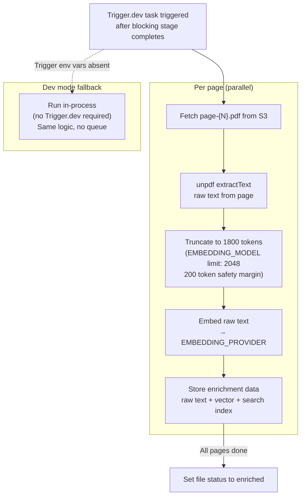

### Why Two Representations Per Page

The `summary` representation (from the blocking stage) is optimized for semantic retrieval. It's a dense, LLM-generated paragraph that captures the meaning of the page. It retrieves well for conceptual queries.

The `raw_text` representation (from the background stage) is optimized for keyword retrieval. The tsvector enables BM25-style full-text search that finds exact terms the summary might have paraphrased. Together, these two representations feed a Reciprocal Rank Fusion query that outperforms either alone.

### Token Truncation

unpdf may extract more text than the embedding model can handle. The raw text is truncated to 1800 tokens before embedding. The embedding model's hard limit is 2048 tokens; the 200-token margin prevents edge cases from failing silently.

### Dev Mode

When `TRIGGER_DEV_API_URL` and `TRIGGER_DEV_API_KEY` are absent, the background stage runs in-process immediately after the blocking stage, without requiring a Trigger.dev deployment. This makes local development possible without the full Docker Compose stack. The adapter selection is handled by a queue adapter factory (see 15-Infrastructure).

---

## File Status State Machine

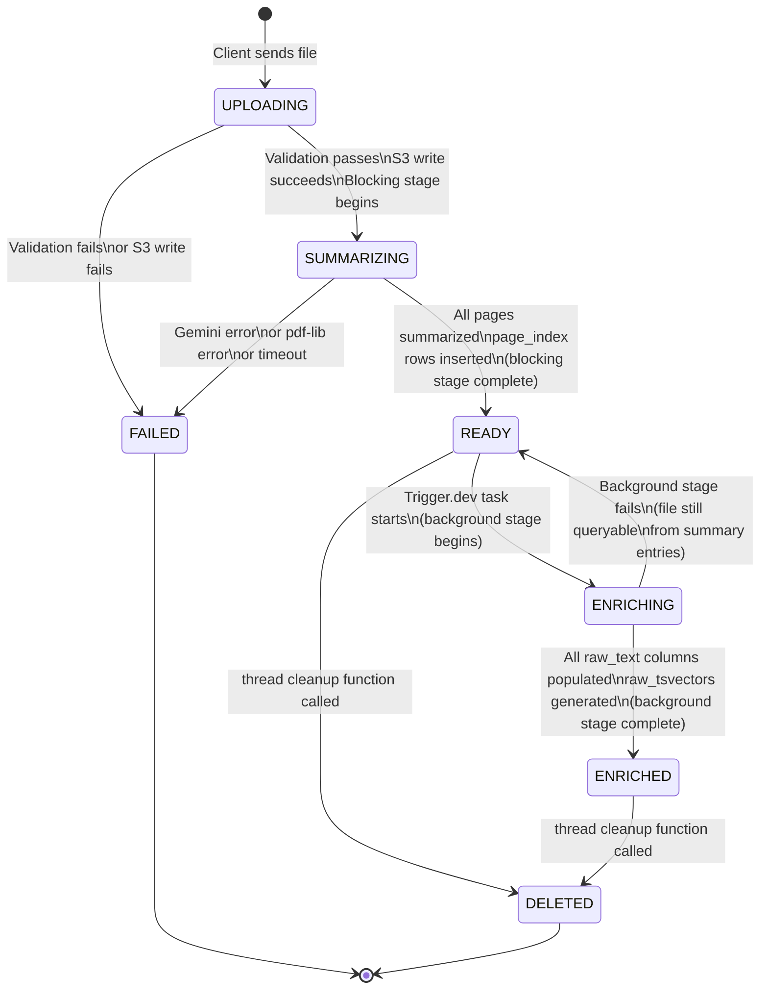

### State Descriptions

| Status | Meaning | Queryable? |
|--------|---------|-----------|
| `uploading` | File received, validation in progress | No |
| `summarizing` | Blocking stage running, pages being processed | No |
| `ready` | Blocking stage complete, summary entries available | Yes (semantic search) |
| `enriching` | Background stage running, raw text being indexed | Yes (semantic search) |
| `enriched` | Both stages complete, full hybrid search available | Yes (semantic + keyword) |
| `failed` | Processing failed at some stage | No |
| `deleted` | Cleanup complete | No |

The transition from `enriching` back to `ready` on background stage failure is intentional. The file remains queryable from its summary entries. The user doesn't lose access to their document because the background enrichment failed.

### Stranded File Recovery

If the API process crashes or restarts while a file is in `summarizing` state, the file is stranded — no active process is working on it, and the client sees it stuck forever. The TTL cleanup job (see [Infrastructure](./infrastructure.md)) handles recovery:

- On each scheduled run, the cleanup job queries for files in `summarizing` state whose `updated_at` exceeds a configurable staleness threshold (default: 10 minutes).
- For each stranded file, the job resets the file status to `uploading` and re-enqueues the blocking stage via the queue adapter. The re-enqueued job picks up from scratch (idempotent — `page_index` rows are upserted, not inserted).
- If a file has been re-enqueued more than a configurable retry limit (default: 3), the job transitions it to `failed` with a diagnostic reason and emits a structured log at `error` severity.

This guarantees that no file remains permanently stranded in `summarizing` at 10M-user scale, even under rolling deployments or unexpected process termination. The recovery path uses the same queue adapter abstraction as the initial processing — Trigger.dev in production, in-process in development.

---

## Per-Page Streaming Architecture

Each page flows through the blocking stage independently. Pages don't wait for each other. This is what makes very large PDFs process quickly in parallel rather than sequentially.

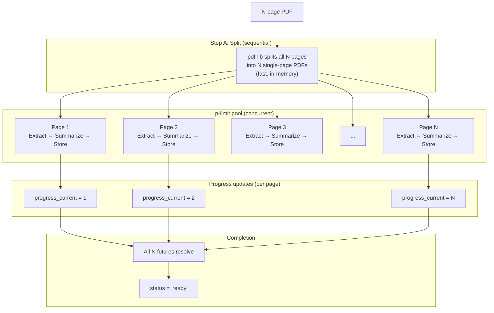

### Concurrency Model

The p-limit pool is sized based on the API key pool. Each key has a rate limit from the provider. The pool distributes pages across keys round-robin, staying within each key's concurrency limit.

Pages that fail (Gemini error, network timeout) are retried up to 3 times with exponential backoff before the page is marked as failed. A single failed page doesn't abort the entire document — the other pages continue. The final `page_index` will have gaps for failed pages, which the retrieval layer handles gracefully.

### Why Not Stream to the Client

The blocking stage doesn't stream partial results to the client. The client polls the file status endpoint and sees `progress_current` increment. Streaming partial results would complicate the client significantly for minimal UX benefit — the user sees "Summarizing 15/50 pages" either way.

---

## Image Extraction Pipeline

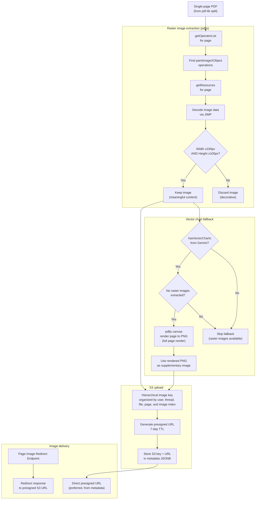

### Image Description Schema

Each extracted image gets a structured description from Gemini's structured output generation call. The image-description structure includes:

| Field | Type | Description |
|-------|------|-------------|
| index | number | Position of this image on the page (0-indexed) |
| object key | string | S3 object key for the image |
| description | string | Gemini's natural language description |
| kind | string | Inferred type: chart, table, photo, diagram, other |
| width | number | Pixel width |
| height | number | Pixel height |

These descriptions are stored in the `metadata` JSONB column of `page_index` and are used by the visual grounding pipeline when a user asks about charts or images.

### Web Grounding Images

Images that come from web search (Gemini's web grounding feature) are handled differently. They appear naturally in the agent's markdown response as standard image URLs. They don't go through the S3 pipeline. The distinction matters: document images need S3 storage and presigned URLs; web grounding images are already publicly accessible URLs.

### Presigned URL Delivery

Presigned URLs have a 7-day TTL. The page image redirect endpoint exists as a fallback for clients that don't have the presigned URL cached. It generates a fresh presigned URL and returns a redirect response. Clients that store the presigned URL from the `metadata` JSONB can skip the API call entirely.

---

## S3 Storage Layout

All objects live in the `safeagent` bucket. The key structure encodes ownership (userId, threadId, fileId) so cleanup can target a specific thread without scanning the entire bucket.

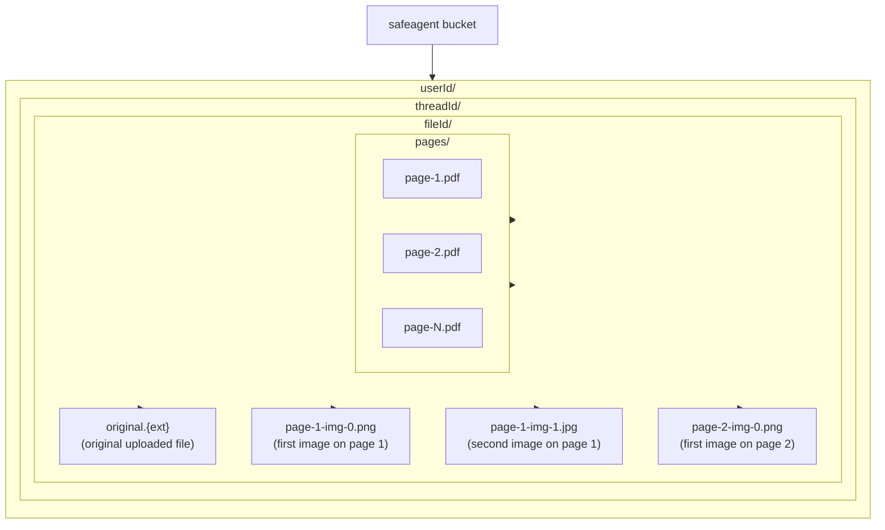

### Key Patterns

| Object | Key pattern |
|--------|------------|
| Original file | Hierarchical key organized by user, thread, and file identity, with an original-object suffix |
| Per-page PDF | Hierarchical key organized by user, thread, file identity, and page number in a page-artifacts segment |
| Extracted image | Hierarchical key organized by user, thread, file identity, page number, and image index |

Page numbers are 1-indexed. Image indices are 0-indexed (matching the image-description index field).

### S3-Compatible Storage Client

The system uses an S3-compatible storage client for all S3 operations. This is a zero-dependency client built into the Bun runtime. The alternative (`@aws-sdk/client-s3`) adds approximately 15MB to the bundle. Since the server runs on Bun, the built-in client is always preferred.

The S3-compatible storage client supports presigned URL generation, multipart upload, and all standard S3 operations. It works with any S3-compatible endpoint, including MinIO.

---

## page_index Table Design

The `page_index` table stores all retrieval artifacts for document pages. It's managed by Drizzle ORM.

### Schema

| Column | Type | Description |
|--------|------|-------------|
| `id` | uuid (PK) | Row identifier |
| `file_id` | uuid (FK → file_uploads) | Parent file |
| `thread_id` | text | Thread that owns this file (TEXT to support `'__global__'` sentinel for cross-conversation documents) |
| `user_id` | text | User that owns this file |
| `page_number` | integer | 1-indexed page number |
| `summary` | text | LLM-generated page summary (blocking stage) |
| `summary_embedding` | vector(EMBEDDING_DIMS) | Dense embedding of `summary` (dimension from configuration constants) |
| `raw_text` | text (nullable) | Background extracted text; null before enrichment |
| `raw_embedding` | vector(EMBEDDING_DIMS) (nullable) | Dense embedding of `raw_text`; null before enrichment (dimension from configuration constants) |
| `raw_tsvector` | tsvector (nullable, GENERATED) | Generated from `raw_text` for full-text search |
| `metadata` | jsonb | `{ images: image descriptions, page object key }` |
| `created_at` | timestamptz | Row creation time |

> **Note**: The CROSS_CONV_RAG task (the Retrieval & Evidence document) adds a non-nullable `scope` column (`TEXT`, values `'thread'` or `'global'`) to this table. The column is not listed above because it does not exist until CROSS_CONV_RAG is implemented. See the Retrieval & Evidence document for the full cross-conversation retrieval design.

### Indexes

| Index | Type | Purpose |
|-------|------|---------|
| `page_index_embedding_idx` | HNSW (pgvector) | Approximate nearest-neighbor vector search |
| `page_index_search_vector_idx` | GIN | Full-text search via tsvector |
| `page_index_file_id_idx` | B-tree | Scoped retrieval by file |
| `page_index_user_id_idx` | B-tree | User-scoped queries |

### Why No page_data Column

The original page PDF bytes are stored in S3, not in this table. Storing page bytes in Postgres would cause TOAST bloat. A 200-page document with 50KB per page PDF is 10MB per document. At 10,000 documents, that's 100GB of TOAST data in a single table. S3 is the right place for binary objects.

### Partitioning at Scale

At 10M users, `page_index` is the highest-growth table (each document produces one row per page). Range partitioning by `user_id` hash keeps individual partition indexes (HNSW, GIN, B-tree) manageable and distributes write I/O. All queries include `user_id` in their WHERE clause, enabling automatic partition pruning. See the Requirements & Constraints document and the Infrastructure document for the broader partitioning strategy.

### Hybrid Retrieval

At query time, the retrieval layer runs two searches in parallel:
1. HNSW vector search on `summary_embedding` (semantic similarity)
2. GIN full-text search on `raw_tsvector` (keyword matching)

The results are merged with Reciprocal Rank Fusion. Semantic retrieval uses `summary_embedding`, while keyword retrieval uses `raw_tsvector` when available.

---

## File Metadata Tables

### file_uploads

Tracks every uploaded file from receipt through cleanup.

| Column | Type | Description |
|--------|------|-------------|
| `file_id` | uuid (PK) | Stable identifier returned to client |
| `file_name` | text | Original filename from the upload |
| `mime_type` | text | Detected MIME type (from magic bytes) |
| `byte_size` | integer | File size in bytes |
| `user_id` | text | Owning user |
| `thread_id` | text | Thread this file was uploaded in (text to align with page_index sentinel support) |
| `status` | enum | `uploading`, `summarizing`, `ready`, `enriching`, `enriched`, `failed`, `deleted` |
| `mode` | enum | `direct`, `indexed`, `rag` |
| `page_count` | integer | Total pages (null for non-PDF/DOCX) |
| `s3_key` | text | S3 key for the original file |
| `progress_current` | integer | Pages processed so far |
| `progress_total` | integer | Total pages to process |
| `expires_at` | timestamptz | When this file will be auto-deleted |
| `deleted_at` | timestamptz? | When soft-delete occurred (null while active) |
| `error_message` | text? | Error details when status is `failed` (null on success) |
| `created_at` | timestamptz | Upload timestamp |

### user_storage_quotas

Tracks per-user storage consumption.

| Column | Type | Description |
|--------|------|-------------|
| `user_id` | text (PK) | User identifier |
| `used_bytes` | bigint | Current storage consumption |
| `max_bytes` | bigint | Quota limit (default: 100MB = 104,857,600 bytes) |
| `updated_at` | timestamptz | Last update time |

### Quota Safety

When a file is deleted, quota release uses a non-negative floor guard in the Drizzle-managed update expression. This prevents the `used_bytes` column from going negative due to race conditions or double-deletes while keeping mutation logic in typed query paths.

---

## Progress Tracking

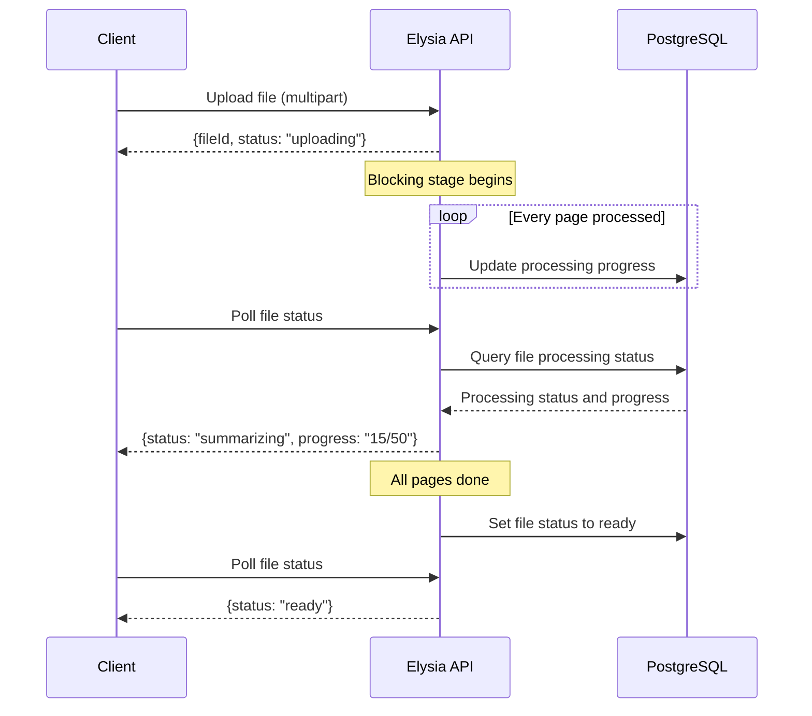

The client polls the file status endpoint. The response includes:
- `status`: current state machine value
- `progress_current`: pages processed
- `progress_total`: total pages
- A human-readable `message` field: `"Summarizing 15/50 pages"`

Polling interval is left to the client. A 2-second interval is reasonable for most use cases. The endpoint is cheap: a single indexed Postgres read through Drizzle.

---

## Cleanup

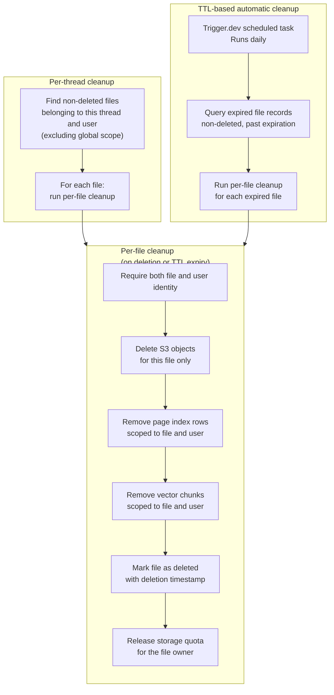

### Why Both threadId and userId

Requiring both parameters is a defense-in-depth measure. A bug that passes the wrong `threadId` can't accidentally delete another user's files because the `userId` check will fail. A bug that passes the wrong `userId` can't delete the thread because the `threadId` check will fail. Both must be correct for any deletion to proceed.

### Valkey Lock

The optional distributed lock prevents two concurrent cleanup calls for the same thread from racing. Without the lock, two simultaneous calls could both read the same `used_bytes` value and both subtract the file size, resulting in a double-release. The lock is optional because the `GREATEST` guard already prevents negative values — the lock is belt-and-suspenders for correctness.

### TTL-Based Cleanup

Files have an `expires_at` timestamp set at upload time. The Trigger.dev scheduled task runs daily, finds all expired files, and calls the file cleanup function for each. This handles the case where a user never explicitly deletes their files.

---

## Cross-References

| Document | Relationship |
|----------|-------------|
| **System Architecture** ([System Architecture](./architecture.md)) | Defines the end-to-end upload and retrieval architecture that this document's processing pipeline implements in detail. |
| **Foundation** ([Foundation](./foundation.md)) | Supplies processing thresholds, provider settings, and environment values used by routing, summarization, and storage flows. |
| **RAG & Retrieval** ([Retrieval & Evidence](./retrieval.md)) | Consumes `page_index` summaries and enrichment outputs produced here as primary retrieval inputs. |
| **Server Implementation** ([Server Implementation](./server.md)) | Hosts upload/status/image endpoints and invokes this processing pipeline from route handlers. |
| **Infrastructure** ([Infrastructure](./infrastructure.md)) | Provides Compose services (Postgres, MinIO, Valkey, Trigger.dev, LibreOffice) required to run blocking and background stages. |

---

## Task Specifications

> **SPIKE_RAG_DEPS** — canonical task specification is in [Foundation](./foundation.md). This document's pipeline tasks depend on its output.

---

### Task SPIKE_RAG_DEPS: RAG Dependency Validation Spike

**Task Name**
- SPIKE_RAG_DEPS

**Objective**
- Validate the full RAG dependency chain before document and retrieval implementation begins.
- Prove that multimodal processing, embeddings, storage, and retrieval dependencies operate correctly in the target runtime.

**What To Do**
- Define the spike matrix for document parsing, multimodal processing, embedding generation, and retrieval primitives.
- Validate PDF page splitting and per-page artifact handling.
- Validate multimodal summarization dependency behavior for page-level outputs.
- Validate image extraction and image processing dependency compatibility.
- Validate vector storage and retrieval dependency behavior for semantic search paths.
- Validate object storage dependency behavior for upload, read, and cleanup paths.
- Validate document conversion dependency behavior for office-format ingestion.
- Validate background execution dependency behavior for asynchronous enrichment stages.
- Record dependency-specific pass and fail outcomes with mitigation notes.

**Depends On**
- SPIKE_CORE_STACK

**Batch**
- RAG_VALIDATION_BATCH

**Acceptance Criteria**
- Spike covers all critical RAG and document-processing dependencies.
- PDF splitting and per-page processing assumptions are validated.
- Multimodal summary flow dependencies validate expected behavior.
- Embedding and vector retrieval dependencies validate expected dimensional and search behavior.
- Object storage dependencies validate core artifact lifecycle operations.
- Conversion and enrichment dependency paths are validated for expected success and failure modes.
- Blocking dependency failures are explicitly identified with clear follow-up actions.

**QA Scenarios**
- Run dependency spike suite for document parsing and summarization, verify full result matrix output.
- Execute vector indexing and retrieval checks, verify expected semantic lookup behavior.
- Exercise object storage upload and retrieval path, verify artifact round-trip integrity.
- Simulate one dependency failure, verify spike output flags blocking impact and mitigation path.

**Implementation Notes**
- Treat this spike as a hard precondition for document and retrieval implementation tasks.
- Keep dependency findings traceable to downstream task risk.
- Capture both runtime compatibility and operational behavior, not only import success.

---

### Task DOC_PIPELINE: Document Processing Pipeline

**What to do**: Build the full blocking stage pipeline. pdf-lib splits PDFs into per-page PDFs. pdfjs extracts raster images per page with the 100×100px size filter. Gemini structured output generation summarizes each page with a schema that includes summary text, image descriptions, and vector-chart detection. p-limit controls concurrency based on the key pool tier. Vector chart fallback renders pages to PNG when vector charts are detected and no raster images were found. Summaries are embedded and stored in `page_index`. Progress is tracked via `progress_current`.

**Depends on**: SPIKE_RAG_DEPS, KEY_POOL, CONFIG_DEFAULTS

**Acceptance Criteria**:
- Large-PDF benchmark (e.g., ~200 pages when the upload size limit is increased for internal load testing) processes in under 15 seconds with a 10-key pool at elevated summarization per-key concurrency
- Each page produces exactly one `page_index` row with populated `summary` and `summary_embedding`
- All `page_index` inserts and updates use Drizzle type-safe queries
- Images smaller than 100×100px are not extracted
- Pages marked with vector-chart presence and no raster images trigger the PNG render fallback
- `progress_current` increments after each page completes
- `status` transitions to `'ready'` only after all pages complete
- A single failed page doesn't abort the entire document

**QA Scenarios**:
- Large-PDF benchmark with mixed text and charts processes completely
- Page with only vector graphics (no raster images) triggers fallback render
- Page with decorative icons (all <100×100px) produces no extracted images
- Gemini API error on page 50 retries 3 times, marks page as failed, continues with page 51
- Progress endpoint shows accurate count during processing

---

### Task FILE_STORAGE: File Storage

**What to do**: Build the S3 storage layer using an S3-compatible storage client. Build the key naming scheme for original files, per-page PDFs, and extracted images. Build presigned URL generation with 7-day TTL. Build the page image redirect endpoint that generates a fresh presigned URL and returns a redirect response. Build the thread cleanup capability that lists and batch-deletes all S3 objects under a thread prefix.

**Depends on**: DOCKER_COMPOSE, CONFIG_DEFAULTS

**Acceptance Criteria**:
- All S3 keys follow a hierarchical structure organized by user, thread, and file identity
- Presigned URLs expire after 7 days
- The image delivery endpoint returns a redirect response to a valid presigned URL
- Thread-level cleanup deletes all objects under the thread prefix in a single batch operation
- S3 operations use the Bun built-in S3-compatible client (no `@aws-sdk` dependency)

**QA Scenarios**:
- Upload a file, verify original stored at correct S3 key
- Request image via API endpoint, verify redirect response to presigned URL
- Presigned URL is accessible without authentication
- Run thread cleanup, verify all objects under the thread prefix are deleted
- Run thread cleanup twice for the same thread, verify no error on second run (idempotent)

---

### Task UPLOAD_PIPELINE: Upload Pipeline

**What to do**: Implement the complete upload pipeline from validation through routing. Magic bytes validation for all supported types. Size enforcement (≤5MB per file, ≤5 files per turn). Quota check against `user_storage_quotas`. DOCX detection and routing to LibreOffice conversion. Page count detection for PDFs. Mode assignment (`direct`, `indexed`, `rag`). `file_uploads` record creation. Quota increment. FileRegistry cache invalidation in Valkey.

**Depends on**: FILE_STORAGE, STORAGE_WRAPPER, VALKEY_CACHE, DOCKER_COMPOSE

**Acceptance Criteria**:
- Magic bytes check rejects files with mismatched content and extension
- `.doc` files are rejected with a clear error message
- Files over 5MB are rejected before any S3 write
- Quota exceeded returns a clear error before any S3 write
- DOCX files are routed to LibreOffice conversion before page count detection
- Mode is set correctly for all type/size combinations
- `file_uploads` record is created with correct initial status
- All file metadata and quota reads or writes in Postgres use Drizzle type-safe queries

**QA Scenarios**:
- Upload a `.pdf` file that is actually a ZIP archive → rejected at magic bytes check
- Upload a `.doc` file → rejected with message to save as `.docx`
- Upload a 6MB file → rejected before S3 write
- Upload files that would exceed 100MB quota → rejected with quota error
- Upload a 3-page DOCX → converted to PDF, mode set to `direct`
- Upload a 50-page DOCX → converted to PDF, mode set to `indexed`
- Upload a TXT file with 5K tokens → mode set to `direct`
- Upload a TXT file with 20K tokens → mode set to `rag`

---

> **UPLOAD_ENDPOINT** — canonical task specification is in [Server Implementation](./server.md#task-upload_endpoint-upload-endpoint). The server route wires UPLOAD_PIPELINE to the HTTP layer.

---

> **DOCKER_COMPOSE** — canonical task specification is in [Infrastructure](./infrastructure.md#task-docker_compose-docker-compose-infrastructure). That spec includes LibreOffice headless, MinIO bucket init, and all compose profiles.

---

## External References

- [pdf-lib documentation](https://pdf-lib.js.org)
- [unpdf documentation](https://github.com/unjs/unpdf)
- [JIMP documentation](https://jimp-dev.github.io/jimp)
- [Drizzle ORM documentation](https://orm.drizzle.team/docs)
- [Bun S3 documentation](https://bun.sh/docs/api/s3)

---

## Test Specifications

> **Relationship to Task Specifications**: QA Scenarios prove task completion; Test Specifications prove behavioral correctness. Use both.

**Upload validation**:

- Magic bytes check (not extension-based) against known signatures.
- Size limit: 5MB per file exactly at boundary.
- Turn limit: 5 files per turn exactly at boundary.
- Quota check: reject if result exceeds user maximum.
- Atomic quota reservation occurs before processing begins.
- Supported types: PDF, DOCX, TXT, PNG, JPG, JPEG, WEBP.
- .doc legacy binary rejected with clear error message.
- Quota reservation rollback on processing failure.

**Document routing**:

- Images: direct mode. TXT up to 8K tokens: direct mode. TXT above 8K: RAG mode.
- PDF up to 6 pages: direct mode. PDF above 6: indexed mode.
- DOCX routing matches PDF after conversion.
- Exact boundary values: 6 pages is direct, 7 pages is indexed.

**DOCX conversion**:

- LibreOffice sidecar invocation over Docker network.
- Local non-container fallback uses host LibreOffice process when containerized converter is unavailable in local development.
- Thirty-second timeout handling.
- Converted PDF stored in S3 with updated metadata.
- Temp file cleanup after conversion.
- Failed conversion marks file as failed.

**Per-page summarization**:

- PDF splitting into single-page outputs.
- Image extraction with 100px minimum dimension filter.
- Gemini structured output: summary 150-400 words, image descriptions, vector-chart flag.
- Embedding generation per page.
- Progress total is set from page count before page loop execution.
- User-facing progress messages reflect stage and completed-page count.
- Vector-chart fallback: PNG render when flag is true and no raster images.
- Concurrency control with configurable limit and round-robin key distribution.
- Retry failed pages up to three times with exponential backoff.
- Single failed page does not abort entire document.

**Background enrichment**:

- Raw text extraction and truncation to 1800 tokens.
- Embedding and tsvector generation.
- Failure reverts to ready state, file remains queryable from summaries.
- Dev mode fallback: in-process when Trigger.dev environment absent.

**File status state machine**:

- All transitions validated: uploading to summarizing, summarizing to ready, ready to enriching, enriching to enriched, enriching to ready on failure.
- Failure transitions: uploading to failed, summarizing to failed.
- Deletion transitions: ready or enriched to deleted.
- No backward transitions for any event sequence.

**Stranded file recovery**:

- TTL cleanup detects files in summarizing state beyond ten minutes.
- Reset and re-enqueue with idempotent re-execution.
- After three retries, transition to failed.

**Cleanup**:

- Per-file: requires both file identifier and user identity, removes S3 objects, page-index rows, vector chunks, marks deleted, releases quota.
- Per-thread: iterates all files for thread plus user, excluding global-scope files.
- TTL: scheduled daily, finds expired non-deleted files.
- Idempotent: safe to run twice with same input.

**Quota reservation correctness**:

- Quota reservation increments used-bytes atomically before accepting upload bytes.
- Concurrent uploads cannot oversubscribe quota because post-increment checks occur in the same atomic operation.
- Rejections for over-quota requests happen before any object write.
- Reservation rollback is required when later processing fails after successful reservation.
- Rollback correctness keeps quota accounting consistent across retry attempts.

**DOCX conversion resilience**:

- Sidecar-converter unavailability in local development triggers host-process fallback path.
- Fallback activation is limited to non-container local execution context.
- Conversion timeout at 30 seconds returns deterministic failure status.
- Temporary conversion workspace is removed on both success and failure paths.
- Converted artifact metadata replaces source MIME classification for downstream routing.

**Progress accounting invariants**:

- Total page count is persisted before per-page processing begins.
- Current progress increments exactly once per successfully completed page operation.
- Progress message always reflects persisted current and total counters.
- Parallel page completion does not allow duplicate progress increments for one page.

**Vector chart fallback conditions**:

- Fallback render executes only when vector-chart signal is true and raster extraction count is zero.
- If either condition is false, fallback render is skipped.
- Fallback render produces full-page PNG artifact for multimodal summarization support.
- Pages with extracted raster images never render fallback PNG solely due to vector-chart flag.

**Concurrency control semantics**:

- Per-key summarization concurrency limit is configurable independently from default key-pool settings.
- Effective parallelism respects key-tier capacity while enforcing per-key cap.
- Work distribution across keys follows round-robin fairness under sustained load.
- Raising per-key limits for higher-tier keys increases throughput without changing correctness behavior.

**Retry and failure isolation**:

- Page retry uses exponential backoff growth across attempts for transient errors.
- Exactly three retry attempts are executed before page-level permanent failure classification.
- One page failure never cancels remaining page tasks in the same file.
- Final page index can contain expected page-number gaps corresponding to terminally failed pages.
- Retry counters are page-scoped and do not leak across neighboring pages.

**Background enrichment fallback behavior**:

- Background-stage start transitions status from ready to enriching.
- Background-stage success transitions status from enriching to enriched.
- Background-stage failure transitions status from enriching back to ready while preserving summary queryability.
- Development mode without queue credentials runs enrichment in-process with equivalent enrichment outputs.

**File-status transition matrix**:

- Transition validation rejects invalid jumps outside the documented state graph.
- Uploading can move only to summarizing or failed.
- Summarizing can move only to ready or failed.
- Ready can move only to enriching or deleted.
- Enriching can move only to enriched or ready.
- Enriched can move only to deleted.
- Failed and deleted remain terminal for processing flow.

**Stranded-file recovery guarantees**:

- Stranded-file detection uses default staleness threshold of ten minutes based on last update time.
- Recovery resets stranded summarizing files to uploading before re-enqueue.
- Re-execution remains idempotent through update-or-insert page index behavior.
- Recovery retry count is capped at exactly three attempts per file.
- Exceeding retry cap transitions file to failed with diagnostic error reason.
- Recovery path emits structured error-level diagnostic logs on terminal failure.

**Cleanup race protection and ownership checks**:

- Per-file cleanup requires both file identity and user identity to pass before destructive actions begin.
- Ownership mismatch on either field blocks cleanup actions for defense-in-depth.
- Optional distributed lock prevents concurrent cleanup double-release races on quota counters.
- Lock contention does not bypass non-negative quota floor safeguards.
- Thread cleanup excludes global-scope files by default.

**Image extraction boundary conditions**:

- Image at exactly 100x100 pixels meets the minimum dimension threshold and is extracted.
- Image at 99x100 pixels falls below the minimum width threshold and is not extracted.
- Image at 100x99 pixels falls below the minimum height threshold and is not extracted.
- Page containing only decorative icons where all images are below 100x100 pixels produces no extracted images at all.
- Page with a mix of small decorative icons and one qualifying image extracts only the qualifying image.
- Boundary dimension check uses greater-than-or-equal comparison, not strict greater-than.
