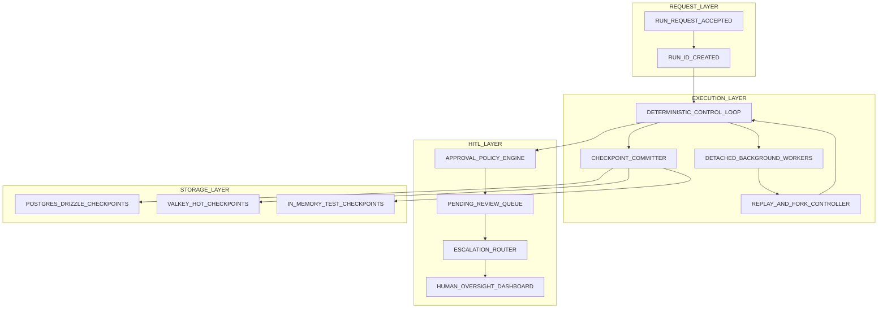
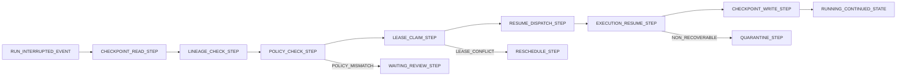
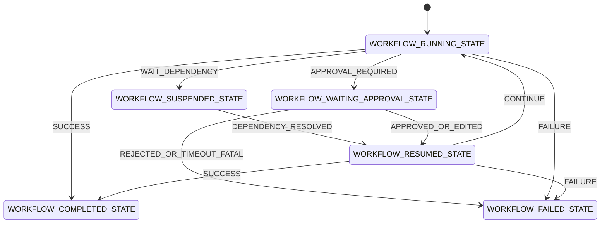
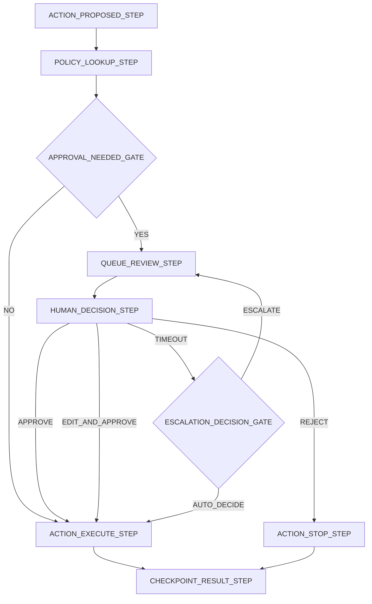
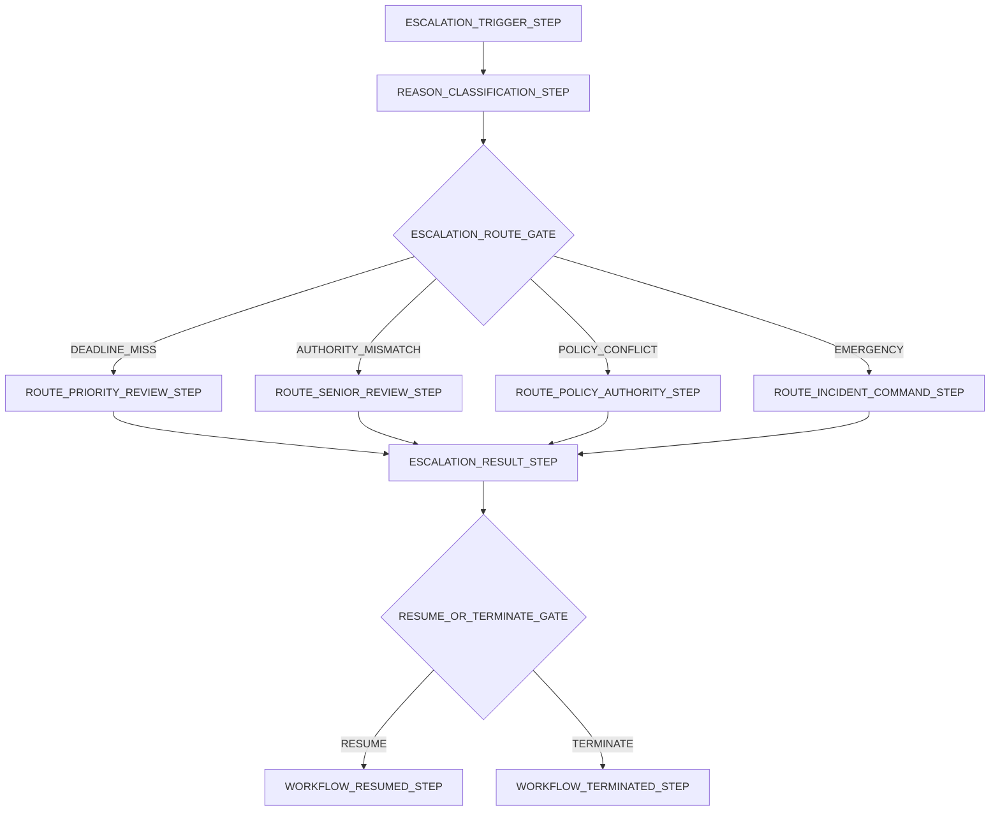

# Durable Execution and Human-in-the-Loop Plan

> **Scope**: Durable workflow persistence, replay and recovery controls, and human oversight operating patterns for safeagent at 10M-user scale.
>
> **Tasks**: DURABLE_EXECUTION_CORE (Checkpoint and Recovery Runtime), HITL_CONTROL_PLANE (Approval and Escalation), DURABLE_OPERATIONS (Lifecycle and Capacity Governance)

---

## Table of Contents
- [Architecture Overview](#architecture-overview)
- [Design Principles](#design-principles)
- [Durable Execution Boundary](#durable-execution-boundary)
- [Checkpoint Backend Architecture](#checkpoint-backend-architecture)
- [Workflow State Persistence](#workflow-state-persistence)
- [Checkpoint and Recovery Flow](#checkpoint-and-recovery-flow)
- [Crash Recovery and Pod Restart Survival](#crash-recovery-and-pod-restart-survival)
- [Multi-Day Gap Resumption](#multi-day-gap-resumption)
- [Time-Travel Replay and History Forking](#time-travel-replay-and-history-forking)
- [Background Run Execution](#background-run-execution)
- [Deterministic Backbone Pattern](#deterministic-backbone-pattern)
- [Workflow Lifecycle State Machine](#workflow-lifecycle-state-machine)
- [Human-in-the-Loop Operating Model](#human-in-the-loop-operating-model)
- [HITL as Async State Machine](#hitl-as-async-state-machine)
- [Approval Gates](#approval-gates)
- [Human-on-the-Loop Monitoring Mode](#human-on-the-loop-monitoring-mode)
- [Human-in-the-Loop Pause Mode](#human-in-the-loop-pause-mode)
- [Configurable Automation Ratio](#configurable-automation-ratio)
- [Escalation Mechanisms](#escalation-mechanisms)
- [Review Queue](#review-queue)
- [Operational Concerns](#operational-concerns)
- [Checkpoint Storage Lifecycle](#checkpoint-storage-lifecycle)
- [Checkpoint Size Management](#checkpoint-size-management)
- [Concurrent Workflow Limits](#concurrent-workflow-limits)
- [Failure Isolation](#failure-isolation)
- [Failure-Mode Ownership and Divergence Recovery](#failure-mode-ownership-and-divergence-recovery)
- [Observability](#observability)
- [Security and Governance](#security-and-governance)
- [Scale Profile for 10M Users](#scale-profile-for-10m-users)
- [Cross-References](#cross-references)
- [Delivery Checklist](#delivery-checklist)

## Architecture Overview

Durable execution ensures workflows can continue across worker crashes, pod restarts, and long human wait periods.
Human oversight ensures risky actions are reviewed without reducing system throughput to synchronous request handling.
The target architecture combines deterministic workflow control with asynchronous review and storage-backed recovery.

## Design Principles

- Durable state is first-class and always enabled.
- Control flow transitions are deterministic and checkpointed.
- Recovery is idempotent under duplicate resume attempts.
- Human review is asynchronous and never holds open transport connections.
- Risk policy determines where human approval is mandatory.
- One workflow failure never corrupts other workflows.
- Replay and fork capabilities are mandatory for debugging and audit.
- Capacity, fairness, and safety are co-equal runtime objectives.

## Durable Execution Boundary

- Durable boundary includes workflow status and step cursor.
- Durable boundary includes retry budget and backoff timing.
- Durable boundary includes pending approval and escalation state.
- Durable boundary includes branch lineage for replay and forks.
- Durable boundary excludes transient stream rendering artifacts.
- Durable boundary excludes non-essential debugging payloads.
- Durable boundary keeps tenant and user isolation context.
- Durable boundary supports deterministic resume after long delay.

## Checkpoint Backend Architecture

- Checkpoint persistence uses a pluggable backend interface.
- PostgreSQL via Drizzle is the canonical durable store.
- Valkey is the hot-state acceleration tier.
- In-memory backend is for test and local simulation.
- Backend adapters expose identical behavior contracts.
- Backend adapters expose explicit health and failure classes.
- Backend adapters support idempotent writes and monotonic sequence.
- Backend adapters support latest and point-in-time checkpoint reads.

- PostgreSQL tier stores full lineage and audit pointers.
- Valkey tier stores low-latency resumable working sets.
- In-memory tier resets on process restart by design.
- Canonical history remains recoverable when hot tier is stale.
- Hot tier can be rebuilt from canonical history.
- Backend changes never alter checkpoint semantics.

- PostgreSQL data access uses Drizzle only.
- SurrealDB access in neighboring systems uses surqlize only.
- Direct bypass query paths are disallowed.
- Access policies enforce tenant and user boundaries.
- Checkpoint access MUST require checkpoint-level authorization for read, write, restore, and export scopes.
- Checkpoint data MUST be encrypted in transit and at rest with tenant-scoped cryptographic separation.
- Cryptographic keys MUST rotate on a defined release cadence and on compromise events.
- Restore and export actions MUST require explicit privileged approval with separation of duties for sensitive tenants.
- All checkpoint access paths MUST emit immutable audit records linking actor, purpose, scope, and outcome.
- Storage events are traceable for compliance reporting.
- Retention and deletion obligations are policy-driven.

## Workflow State Persistence

- Checkpoint before risky side effects.
- Checkpoint after deterministic phase completion.
- Checkpoint before entering WAITING_APPROVAL.
- Checkpoint after approval decision ingestion.
- Checkpoint before terminal transition commit.
- Checkpoint when replay fork branch is initialized.
- Checkpoint payload includes resume-critical state only.
- Checkpoint payload includes policy context hash and sequence markers.

- Include run status, cursor, and transition reason.
- Include pending action envelope for approval evaluation.
- Include reviewer decision metadata when available.
- Include escalation lane, due time, and ownership pointer.
- Include idempotency keys for safe re-dispatch.
- Include lineage parent pointer for branch continuity.

- Exclude secrets and credentials.
- Exclude duplicated telemetry payloads.
- Exclude transport-only fragments with no replay value.
- Exclude large binary payloads; store governed references instead.
- Exclude unrelated user context.
- Exclude transient temporary rendering state.

## Checkpoint and Recovery Flow

- Recovery starts from latest canonical checkpoint.
- Recovery validates lineage integrity before resume.
- Recovery validates policy compatibility before next action.
- Recovery acquires lease ownership for one active resumer.
- Recovery dispatches to detached workers after lease success.
- Recovery emits resume and failure events for operations.
- Recovery retries are bounded and observable.
- Recovery can quarantine irrecoverable runs safely.

## Crash Recovery and Pod Restart Survival

- Worker crashes do not lose resumable run state.
- Pod restart triggers resumable-run scan on startup.
- Resume always uses durable state, never stale memory residue.
- Lease expiry allows safe ownership transfer after worker loss.
- Duplicate resume attempts collapse under idempotency rules.
- Recovery scanners use throttling to protect dependencies.
- Recovery backlog age and depth are tracked.
- Recovery incidents are visible in operational dashboards.

## Multi-Day Gap Resumption

- Workflows can stay paused for extended durations.
- Resume validates authorization and risk policy freshness.
- Resume validates pending approval status and deadline rules.
- Dormant runs can move to archive while remaining replay-addressable.
- Long-gap resumes can require renewed approval in stricter policies.
- Stale workflows can auto-close where policy demands.
- Resume operations record dormant interval for analytics.
- Resume behavior stays deterministic regardless pause duration.

## Time-Travel Replay and History Forking

- Replay can start from any prior checkpoint.
- Replay supports read-only simulation with side effects disabled.
- Replay supports forked branch execution for debugging.
- Fork preserves immutable original branch history.
- Fork records parent checkpoint pointer and reason.
- Corrected-state injection is allowed only in fork branch.
- Corrected-state injection is audited with actor identity.
- Replay outcomes can be compared across branches.

## Background Run Execution

- Long-running workflows execute outside synchronous intake boundaries.
- Detached execution remains resilient across client disconnect and retry conditions.
- Request intake returns durable run identity immediately.
- Background workers own active runs via lease model.
- Waiting runs release worker capacity while suspended.
- Resume scheduler reactivates runs on signal or deadline.
- Retries are bounded and idempotent.
- Cancellation writes durable terminal state.
- Dispatcher enforces tenant and user fairness.

## Deterministic Backbone Pattern

- Intelligent reasoning proposes candidate actions.
- Deterministic backbone evaluates policy and state transitions.
- Deterministic backbone decides side-effect eligibility.
- Deterministic backbone defines checkpoint boundaries.
- Deterministic backbone records immutable execution facts.
- Replay reproducibility depends on deterministic transition rules.
- This pattern scales safer than unconstrained autonomous loops.
- This pattern aligns with incident root-cause requirements.

## Workflow Lifecycle State Machine

- RUNNING represents active deterministic execution.
- SUSPENDED represents wait for non-human dependency.
- WAITING_APPROVAL represents wait for human decision.
- RESUMED represents post-wait re-entry into active flow.
- COMPLETED represents successful terminal state.
- FAILED represents non-recoverable terminal state.
- Lifecycle can traverse multiple wait and resume cycles.
- Each transition is checkpointed and auditable.

## Human-in-the-Loop Operating Model

- HITL is integrated as native workflow behavior.
- HITL transitions are checkpointed like all run transitions.
- HITL supports observe-only and blocking review modes.
- HITL decisions include actor, rationale, and decision time.
- HITL outcomes are replayable and audit-ready.
- HITL scales through asynchronous queueing and escalation.
- HITL protects high-risk actions without halting all automation.
- HITL metrics drive policy and staffing adjustments.

## HITL as Async State Machine

- Workflow pauses before enqueuing review item.
- Review item stores action summary and due time.
- Reviewer can approve, reject, or edit before approval.
- Decision ingestion validates identity and authority.
- Decision actions MUST be signed and nonce-bound to the exact pending item and checkpoint sequence.
- Decision ingestion MUST reject replayed, expired, or previously consumed approval artifacts.
- Reviewer sessions MUST be bound to authenticated identity and active tenant context for decision validity.
- Approved actions resume deterministic execution.
- Rejected actions transition to safe terminal failure.
- Edited approvals apply bounded merge rules.
- Timeout routes to escalation or policy fallback.

## Approval Gates

- Gate requirements are configurable per tool action.
- High-risk baseline actions are send, delete, pay, and escalate.
- Gate rules can include context and role constraints.
- Gate rules can require dual-review for strict domains.
- Gate outcomes are deterministic and checkpointed.
- Gate bypass attempts are blocked and logged.
- Edit-and-approve flows MUST enforce separation of duties where governance policy requires independent review.
- Decision records MUST remain immutable and append-only across approve, reject, edit, and escalation outcomes.
- Gate latency objectives are defined per priority.
- Gate metrics feed automation-ratio tuning.

## Human-on-the-Loop Monitoring Mode

- Humans observe action stream without blocking execution.
- Observers can annotate risky patterns for policy updates.
- Monitoring can be sampled by workflow type and tenant.
- Monitoring preserves low latency for routine actions.
- Monitoring still captures oversight metrics and trends.
- Monitoring can trigger escalation on anomaly thresholds.
- Monitoring is useful during early trust calibration.
- Monitoring never replaces required high-risk gates.

## Human-in-the-Loop Pause Mode

- Pause mode blocks selected actions until human outcome.
- Pause mode records full review context and reason fields.
- Pause mode supports approve, reject, and edit decisions.
- Pause mode resumes deterministically after valid decision.
- Pause mode escalates on deadline miss or authority mismatch.
- Pause mode enforces reviewer scope boundaries.
- Pause mode provides stronger control for sensitive domains.
- Pause mode remains fully auditable.

## Configurable Automation Ratio

- Automation ratio sets proportion of actions requiring review.
- Default mature posture targets 90/10.
- New domains can launch with stricter ratio.
- Ratio can vary by tenant and risk class.
- Ratio can tighten during incidents.
- Ratio can relax after sustained safe performance.
- Ratio updates are governance-reviewed and traceable.
- Ratio outcomes are measured across safety and throughput.

## Escalation Mechanisms

- Escalate on missed review deadlines.
- Escalate on reviewer authority mismatch.
- Escalate on unresolved policy conflicts.
- Escalate on emergency risk indicators.
- Escalation routes by urgency and role lanes.
- Escalation triggers MUST enforce rate limits per tenant, reviewer lane, and workflow family.
- Escalation channels MUST include spam and flood suppression with anomaly-based abuse detection.
- Escalation governance MUST define who can trigger, defer, or suppress escalations with full auditability.
- Escalation routing MUST prevent priority inversion so critical risk paths cannot be starved by bulk low-risk traffic.
- Escalation handoffs preserve full context history.
- Escalation loops are bounded by policy.
- Escalation outcomes feed staffing and policy tuning.

## Review Queue

- Queue stores pending approvals as durable records.
- Queue item stores action, risk class, and due time.
- Queue item stores run and checkpoint linkage.
- Queue item stores assignee and escalation level.
- Queue supports filtering by tenant, risk, and urgency.
- Queue supports pending, overdue, and escalated views.
- Queue supports reassignment under shift change.
- Queue events are tracked for auditing and analytics.

- Timeout policy defines response windows by risk tier.
- Timeout can auto-escalate to higher authority lanes.
- Timeout can auto-resolve only in allowed low-risk lanes.
- Critical lanes never auto-approve by timeout.
- Queue congestion triggers capacity alerts.
- Queue policy changes remain traceable.

## Operational Concerns

- Lifecycle controls prevent unbounded checkpoint growth.
- Size controls protect write latency and storage cost.
- Concurrency controls preserve fairness and stability.
- Isolation controls contain failures and blast radius.
- Observability controls detect reliability or safety drift.
- Governance controls maintain accountability at scale.
- Incident controls support rapid containment and recovery.
- Operational readiness requires continuous validation.

## Checkpoint Storage Lifecycle

- Checkpoints follow policy-driven retention windows.
- Hot retention supports fast resume workloads.
- Warm retention supports short-horizon investigation.
- Cold retention supports audit and compliance requirements.
- Expired data moves through cleanup with lineage safeguards.
- Archive transitions preserve replay-critical metadata.
- Legal-hold rules override standard expiration.
- Deletion outcomes are verifiable and auditable.
- Checkpoint cardinality MUST stay within governed ceilings per run, tenant, and risk tier.
- Snapshot and compaction cadence MUST follow policy-defined frequency targets aligned to recovery objectives.
- Branch and fork retention MUST expire non-essential investigative branches while preserving regulated audit branches.
- Replay-cost budgets MUST be enforced so historical reconstruction load remains bounded at 10M-user scale.

- Cleanup runs in bounded batches.
- Cleanup emits lag, volume, and failure metrics.
- Cleanup retries are capped and observable.
- Retention breaches raise operational alerts.
- Archive access is role-governed.
- Lifecycle changes are governance-reviewed.

## Checkpoint Size Management

- Snapshot size budget is enforced at write time.
- Oversize payloads are compacted or rejected.
- Large immutable assets use indirect references.
- Repeated structures are deduplicated in payload.
- Compression is used where resume targets stay healthy.
- Growth trends are tracked by workflow family.
- Budget violations emit actionable diagnostics.
- Size policy remains consistent across backends.
- Growth controls MUST reserve capacity for peak checkpoint cardinality under sustained multi-tenant expansion.
- Compaction policy revisions MUST be governance-reviewed against replay fidelity and recovery latency objectives.

- Include deterministic control and policy context.
- Include idempotency and ordering identifiers.
- Include approval and escalation continuity markers.
- Exclude secrets and credentials.
- Exclude transport-only fragments.
- Exclude unrelated or redundant payloads.

## Concurrent Workflow Limits

- Limits apply at user, tenant, and global scopes.
- Per-user limits stop runaway recursion patterns.
- Per-tenant limits preserve shared fairness.
- Global limits protect dependencies during spikes.
- Overflow enters waiting lanes with defined policies.
- Priority lanes protect critical workflow continuity.
- Limit decisions are deterministic and observable.
- Limit tuning is policy and data driven.
- Checkpoint partitions SHALL shard by tenant and workload class with deterministic ownership.
- Index policy SHALL prioritize resume-pointer lookup, queue urgency retrieval, tenant fairness scans, and lineage validation.
- Hot-tenant isolation SHALL reserve capacity lanes so localized surges do not degrade shared baseline service.

- Control dimensions include active runs.
- Control dimensions include pending approvals.
- Control dimensions include escalation depth.
- Control dimensions include resume rate.
- Control dimensions include replay fork count.
- Control dimensions include checkpoint throughput.

## Failure Isolation

- Failed workflow does not crash unrelated workflows.
- Worker failure triggers lease-based safe handoff.
- Repeated deterministic failures enter quarantine lane.
- Quarantine keeps run replayable and inspectable.
- Circuit breakers reduce dependency failure spread.
- Queue partitioning isolates critical and routine traffic.
- Tenant boundaries block cross-tenant blast radius.
- Replay failures stay isolated from live execution.

- Fast retry handles transient errors.
- Backoff retry handles persistent but recoverable errors.
- Terminal stop handles non-recoverable errors.
- Manual intervention handles policy conflict cases.
- Controlled ramp-up handles post-incident recovery.
- Backlog drain policies preserve fairness.
- Backlog drain rules MUST prioritize oldest-safe-first within urgency lanes while preserving critical-path guarantees.
- Queue sharding MUST isolate escalation traffic from routine approvals to prevent cross-lane saturation.

## Failure-Mode Ownership and Divergence Recovery

- Partial checkpoint commit outcomes MUST resolve under canonical-authority rules before a run can resume.
- Divergence between Valkey hot state and PostgreSQL canonical state MUST auto-reconcile in favor of canonical history.
- Divergence reconciliation MUST emit immutable records for detection time, owning authority, and recovery decision.
- Reviewer-service outage behavior MUST place affected actions into safe hold lanes with explicit timeout and escalation ownership.
- Policy drift discovered during resume MUST require compatibility adjudication before side effects continue.
- Incident ownership for detection, containment, and recovery sign-off MUST align with resilience governance defined in the Infrastructure document.

## Observability

- Track checkpoint write and read latency.
- Track checkpoint failure rate by class.
- Track recovery success and time-to-resume.
- Track recovery backlog depth and oldest age.
- Track HITL queue depth and overdue count.
- Track HITL decision latency percentiles.
- Track approval, rejection, and edit rates.
- Track escalation rate and escalation depth.

- Track automation ratio trend over time.
- Track timeout and auto-escalation outcomes.
- Track policy override usage and anomalies.
- Track tenant fairness and limit pressure.
- Track cleanup lag and retention compliance.
- Track replay and fork activity volumes.

## Security and Governance

- Durable snapshots never contain secrets.
- Human decisions require authenticated identity.
- Reviewer roles are tenant-scoped and enforced.
- Replay edits require elevated authorization and audit.
- Approval bypass attempts are blocked and logged.
- Escalation bypass attempts are blocked and logged.
- Checkpoint restore and export permissions MUST be explicitly scoped and periodically recertified.
- Cryptographic control effectiveness MUST be reviewed on a defined key-rotation and access-recency cadence.
- Sensitive fields are redacted in broad views.
- Governance trails are immutable and traceable.

## Scale Profile for 10M Users

- Request intake and long-run execution are decoupled.
- Storage tiers scale independently for cost and speed.
- Review queue lanes scale independently by urgency.
- Recovery scanners scale with shard-aware partitioning.
- Recovery scan fanout MUST assign shard ownership leases with one accountable scanner cohort per shard interval.
- Queue sharding and checkpoint partitioning MUST expand horizontally without cross-tenant fairness regression.
- Operational policy MUST isolate hot tenants into protected throughput pools during sustained burst periods.
- Replay workloads run in isolated investigation pools.
- Concurrency limits maintain fairness under heavy load.
- Lifecycle cleanup remains bounded during sustained growth.
- Observability remains actionable via structured aggregation.

## Cross-References

| Plan Area | Connection |
|---|---|
| [Agents and Orchestration](./agents.md) | Durable checkpointing wraps orchestration loops and tool action flow. |
| [Transport](./transport.md) | Detached run lifecycle aligns with streaming and connection boundaries. |
| [Server](./server.md) | Request acceptance, auth boundary, and run identity handoff anchor detached execution. |
| [Observability](./observability.md) | Checkpoint, approval, latency, and escalation metrics align with tracing and governance. |
| [Infrastructure](./infrastructure.md) | Circuit breakers, resource controls, and resilience posture support durable runtime safety. |
| [Testing](./testing.md) | Fault injection, replay determinism, and async approval tests validate reliability claims. |
| [Extensibility and Plugin Architecture Plan](./extensibility.md) | Pluggable checkpoint backend contracts align with extension governance model. |

## Task Specifications

### Task DURABLE_EXECUTION: Durable Workflow Runtime and HITL Gates

**Task Name**
- DURABLE_EXECUTION

**Objective**
- Build durable execution infrastructure that preserves workflow continuity across crashes, restarts, and long human-approval waits.
- Ensure high-risk actions can be paused behind auditable human gates without sacrificing deterministic recovery behavior.

**What To Do**
- Define checkpoint boundaries for all state transitions, including wait, resume, and terminal states.
- Implement durable checkpoint persistence with canonical history and hot-state acceleration behavior.
- Implement lease-based resume ownership to prevent duplicate concurrent recovery execution.
- Implement crash-recovery scanning for interrupted and resumable workflows after worker restart.
- Implement replay and fork capabilities for investigation, simulation, and controlled branch correction.
- Implement asynchronous human-approval states with signed decision ingestion and timeout escalation.
- Define high-risk action gate policies and escalation paths for approve, reject, edit, and timeout outcomes.
- Enforce tenant-scoped authorization and immutable audit trails for checkpoint read, write, restore, and export paths.
- Define retention, compaction, and cleanup governance for checkpoint lifecycle at scale.
- Define observability signals for checkpoint latency, recovery success, queue depth, and escalation health.

**Depends On**
- AGENT_FACTORY
- STORAGE_WRAPPER
- SSE_STREAMING

**Batch**
- INTEGRATION_BATCH

**Acceptance Criteria**
- Workflows resume deterministically from durable checkpoints after process interruption.
- Duplicate resume attempts are prevented through single-owner lease behavior and idempotency controls.
- HITL decisions are durable, authenticated, and bound to exact pending approval state.
- Timeout and escalation handling is deterministic and auditable for all approval paths.
- Replay and fork flows preserve immutable source lineage and explicit branch provenance.
- Checkpoint authorization and tenant isolation are enforced for all sensitive operations.
- Checkpoint retention and cleanup policies operate with bounded growth and verifiable deletion outcomes.
- Operational metrics expose recovery latency, backlog pressure, and approval-queue health.

**QA Scenarios**
- Interrupt active workflow mid-run, verify resume continues from latest valid checkpoint without divergence.
- Trigger two concurrent resume attempts for one run, verify only one acquires execution ownership.
- Route high-risk action into approval wait, submit signed approval, verify deterministic resume.
- Let approval timeout expire, verify escalation policy activates and outcome is fully audited.
- Fork from historical checkpoint and replay, verify original branch remains immutable and traceable.

**Implementation Notes**
- Keep deterministic transition logic separate from model reasoning so replay remains reproducible.
- Favor canonical-history authority during divergence recovery to avoid split-brain checkpoint state.
- Treat approval artifacts as security-sensitive control records with strict integrity validation.

## Delivery Checklist

- Bullet-point ToC is present.
- Durable execution section covers pluggable checkpoint backend architecture.
- PostgreSQL via Drizzle, Valkey, and in-memory backend roles are specified.
- Workflow persistence covers crash recovery, pod restart survival, and multi-day resume.
- Time-travel replay covers prior-checkpoint replay, fork history, and corrected-state injection.
- Background run execution is detached from request lifecycle.
- Deterministic backbone pattern is defined.
- HITL async state machine is defined without held connections.
- Approval gate policy includes high-risk send/delete/pay/escalate controls.
- Human-on-the-loop and human-in-the-loop modes are both covered.
- Configurable automation ratio includes 90/10 baseline.
- Escalation and review queue timeout policies are covered.
- Operational concerns include lifecycle, size, concurrency, isolation, and observability.
- Four Mermaid diagrams are included with semantic UPPER_SNAKE IDs.
- Cross-reference table links Agents, Transport, Server, Observability, Infrastructure, Testing, and Extensibility.

## Test Specifications

> **Relationship to Task Specifications**: QA Scenarios prove task completion; Test Specifications prove behavioral correctness. Use both.

**Checkpoint persistence and recovery behavior**:

- Checkpoint persistence preserves resumable workflow state across worker crashes without losing replay-critical context.
- Pod restarts trigger deterministic recovery scans that restore resumable runs from canonical durable state.
- Recovery after multi-day pause validates policy freshness and authorization before any resume transition.
- Resume ownership is single-holder and idempotent so duplicate resume attempts do not create divergent run paths.
- Recovery failures route to bounded retry or quarantine outcomes with operational visibility.

**Time-travel replay and history fork behavior**:

- Replay can resume from any prior checkpoint while preserving immutable historical lineage.
- Forked replay creates a new branch with explicit parent linkage and reason attribution.
- Corrected-state injection is accepted only within forked branches and remains fully auditable.
- Replay comparison across branches preserves outcome traceability for investigation and root-cause analysis.

**Background lifecycle and deterministic backbone behavior**:

- Long-running workflows detach from request connections while preserving durable run identity continuity.
- Background execution emits completion and failure outcomes through asynchronous lifecycle signaling.
- Deterministic control flow governs state transitions around agent reasoning so side effects occur only at valid boundaries.
- Deterministic checkpoint boundaries ensure replay reproducibility under equivalent inputs and policy state.

**HITL and oversight mode behavior**:

- Approval gates suspend high-risk actions until a valid human decision is recorded.
- HITL waits and decisions persist durably and can resume correctly without an active client connection.
- Human-on-the-loop mode observes and annotates actions without blocking routine execution.
- Human-in-the-loop mode blocks selected actions until approve, reject, or edit outcomes are resolved.
- Mode selection follows risk policy and remains auditable across workflow transitions.

**Automation ratio and escalation behavior**:

- Automation ratio policy enforces configured human-review share by risk class, tenant, and governance posture.
- Ratio tightening and relaxation follow governed change controls with measurable safety and throughput impact.
- Escalation routes trigger on deadline miss, authority mismatch, policy conflict, or emergency indicators.
- Review queue behavior preserves assignment, overdue visibility, reassignment, and escalation depth continuity.

**Checkpoint lifecycle and capacity behavior**:

- Checkpoint TTL windows, cleanup, and archive transitions execute with lineage safety and auditability.
- Lifecycle policies honor legal holds and preserve replay-addressable metadata through archive states.
- Concurrent workflow limits enforce user, tenant, and global fairness under sustained load.
- Failure isolation ensures one workflow fault or replay failure cannot corrupt unrelated workflows.
