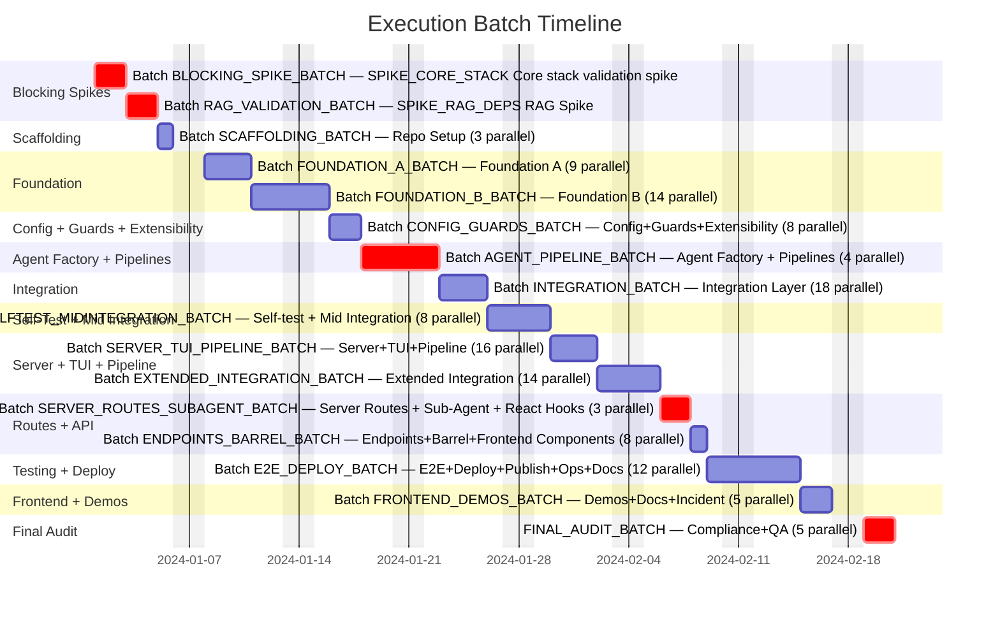
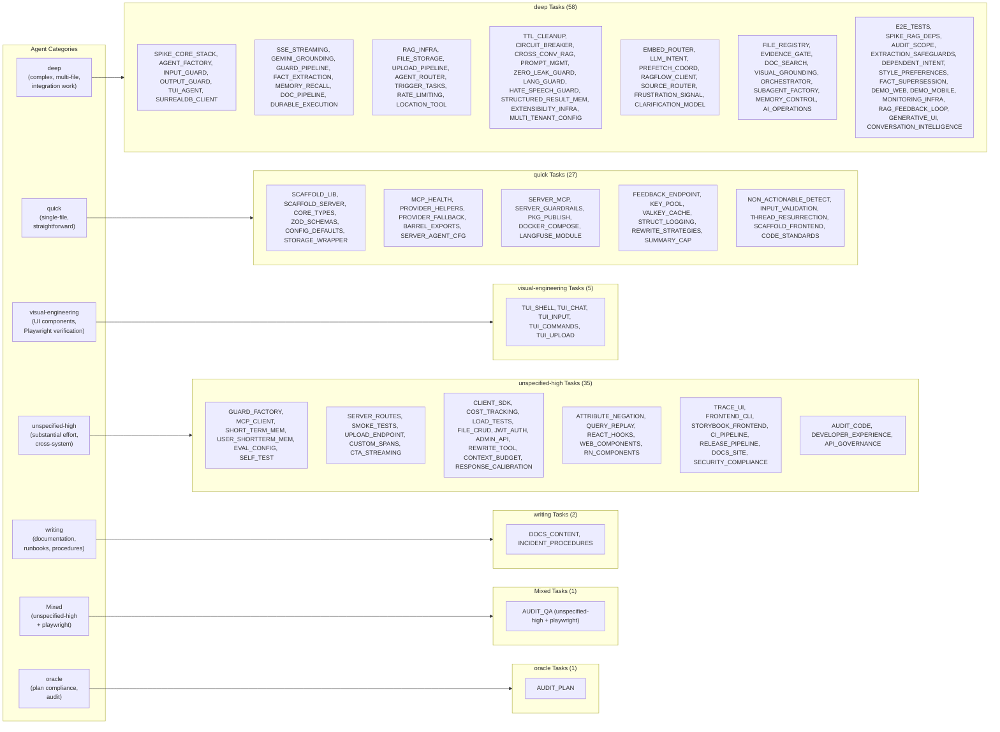
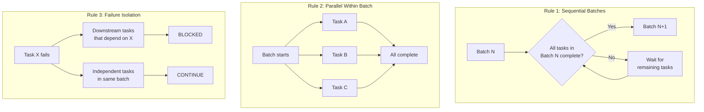

# Execution Plan

> **Scope**: Parallel execution batches, dependency matrix, agent dispatch, critical path analysis, subpath barrel convention, batch completion rules.
>
> **Goal**: Maximize throughput by grouping independent tasks into parallel batches. Each batch completes before the next begins. Within a batch, independent tasks run concurrently; intra-batch dependencies execute in dependency order within the batch window.
>
> **Scale**: 124 implementation tasks + 5 final audit tasks = 129 total. 16 batches. Maximum concurrency: 18 tasks (Batch INTEGRATION_BATCH). Estimated ~69% faster than sequential execution.

---

---

## How to Use This File

1. Locate your assigned task in the [Per-Task Routing Index](#per-task-routing-index).
2. Read the mapped task specification document listed in `Spec File`.
3. Read all documents listed in `Context Sections` before implementation.
4. Use the dependency matrix to confirm prerequisite completion.
5. Use the mapped `Test Spec File` plus [Quality Gates](./quality-gates.md) to verify completion.

For role-based reading paths, use [Start Here](./start-here.md). For domain-by-domain execution paths, use [Domain Playbooks](./domain-playbooks.md).

---

## Execution Source of Truth Rules

- Batch ordering and dependency sequencing are authoritative in this document.
- Task routing ownership (`Spec File`, `Context Sections`) is authoritative in this document; `Test Spec File` is a routing pointer, while verification ownership authority is in [Task Verification Index](./task-verification-index.md).
- If another document conflicts with scheduling or dependency order, follow this document and reconcile the mismatch.
- Task implementation details remain in domain documents; scheduling and dependency truth remains here.

---

## Batch ID Legend

| Batch ID | Meaning |
|---|---|
| `BLOCKING_SPIKE_BATCH` | Mandatory technology baseline validation gate |
| `RAG_VALIDATION_BATCH` | Retrieval dependency validation gate |
| `SCAFFOLDING_BATCH` | Repository and baseline scaffolding |
| `FOUNDATION_A_BATCH` | Core foundation layer A |
| `FOUNDATION_B_BATCH` | Core foundation layer B |
| `CONFIG_GUARDS_BATCH` | Configuration, guardrails, extensibility, tenant controls |
| `AGENT_PIPELINE_BATCH` | Agent and pipeline foundation |
| `INTEGRATION_BATCH` | Core integration layer |
| `SELFTEST_MIDINTEGRATION_BATCH` | Self-test and mid-integration hardening |
| `SERVER_TUI_PIPELINE_BATCH` | Server, TUI, and intent/search integration |
| `EXTENDED_INTEGRATION_BATCH` | Extended orchestration and integration capabilities |
| `SERVER_ROUTES_SUBAGENT_BATCH` | Server route and sub-agent assembly layer |
| `ENDPOINTS_BARREL_BATCH` | Endpoint surface and barrel export layer |
| `E2E_DEPLOY_BATCH` | End-to-end, deploy, publish, and operations infra |
| `FRONTEND_DEMOS_BATCH` | Frontend demos and delivery readiness |
| `FINAL_AUDIT_BATCH` | Final compliance and governance audits |

---

## Batch Timeline

### Batch Summary

| Batch | Name | Tasks | Parallelism | Theme |
|------|------|-------|-------------|-------|
| BLOCKING_SPIKE_BATCH | BLOCKING | 1 | — | Validates all tech assumptions |
| RAG_VALIDATION_BATCH | RAG Validation | 1 | — | Validates RAG dependency chain |
| SCAFFOLDING_BATCH | Scaffolding | 3 | 3 parallel | Repo structure for library + server + standards baseline |
| FOUNDATION_A_BATCH | Foundation A | 9 | 9 parallel | Types, storage, MCP, TUI shell, Docker, logging, frontend scaffold |
| FOUNDATION_B_BATCH | Foundation B | 14 | 14 parallel | Schemas, memory, TUI components, observability, cache, rewrite strategies, CI foundation |
| CONFIG_GUARDS_BATCH | Config + Guards + Extensibility | 8 | 8 parallel | Configuration system, guardrails, FileRegistry, summary cap, extensibility infra, multi-tenant config |
| AGENT_PIPELINE_BATCH | Agent Factory + Pipelines | 4 | 4 parallel | Agent factory plus document/file pipeline gates |
| INTEGRATION_BATCH | Integration Layer | 18 | 18 parallel | Streaming, grounding, core tools, intent routing, RAG infra, durable execution |
| SELFTEST_MIDINTEGRATION_BATCH | Self-test + Mid Integration | 8 | 8 parallel | Evidence gate, upload pipeline, spans, Trigger tasks, eval infra, non-actionable detection, input validation, thread resurrection |
| SERVER_TUI_PIPELINE_BATCH | Server + TUI + Pipeline | 16 | 16 parallel | TUI integration, server config, search/visual tools, intent validator, extraction safeguards, context budget, style/fact calibration |
| EXTENDED_INTEGRATION_BATCH | Extended Integration | 14 | 14 parallel | Upload TUI, cost tracking, TTL, cross-conv RAG, pre-fetch, rewrite, orchestrator, dependent intent, attribute negation, query replay, frustration/clarification, AI operations, retrieval feedback loop |
| SERVER_ROUTES_SUBAGENT_BATCH | Server Routes + Sub-Agent Factory | 3 | 3 parallel | HTTP routes + lifecycle + sub-agent assembly + React hooks |
| ENDPOINTS_BARREL_BATCH | Endpoints + Barrel | 8 | 8 parallel | Upload/feedback/file/admin endpoints + barrel exports + web+RN components + generative UI pipeline |
| E2E_DEPLOY_BATCH | E2E + Deploy + Ops + Docs Infra | 12 | 12 parallel | Integration tests, publish prep, smoke/load tests, trace UI, CLI, Storybook, monitoring, docs site, release automation, security/compliance, conversation intelligence |
| FRONTEND_DEMOS_BATCH | Frontend Demos + Docs + Incident Ops | 5 | 5 parallel | Next.js web demo, Expo mobile demo, docs authoring, incident response procedures, developer experience platform |
| FINAL_AUDIT_BATCH | Audit + Governance | 5 | 5 parallel | Plan compliance, code quality, full QA, scope fidelity, API governance policy |
| TOTAL | Execution Plan | 129 | — | 124 implementation tasks + 5 final audit tasks |

### Milestone Markers

```mermaid
timeline
    title Execution Milestones
    SPIKE_CORE_STACK_MARKER : SPIKE_CORE_STACK complete
    SPIKE_RAG_DEPENDENCY_MARKER : SPIKE_RAG_DEPS complete
    SCAFFOLDING_MARKER : SCAFFOLD_LIB + SCAFFOLD_SERVER complete
    CODE_STANDARDS_MARKER : CODE_STANDARDS baseline complete
    FOUNDATION_A_MARKER : Foundation A complete
    FOUNDATION_B_MARKER : Foundation B complete
    CI_PIPELINE_MARKER : CI_PIPELINE quality gates complete
    CONFIG_GUARDRAIL_MARKER : CONFIG_DEFAULTS + guardrail baseline complete
    TENANT_CONFIG_MARKER : MULTI_TENANT_CONFIG hierarchy complete
    AGENT_PIPELINE_MARKER : AGENT_FACTORY + document/file pipeline foundation complete
    INTEGRATION_MARKER : Integration layer complete
    EVIDENCE_UPLOAD_MARKER : EVIDENCE_GATE + upload + self-test complete
    SERVER_TUI_MARKER : Server/TUI/intent/search integration complete
    EXTENDED_INTEGRATION_MARKER : Extended integration + orchestration complete
    SERVER_ROUTES_MARKER : SERVER_ROUTES + SUBAGENT_FACTORY complete
    ENDPOINT_SURFACE_MARKER : Endpoint surface + BARREL_EXPORTS complete
    GENERATIVE_UI_MARKER : GENERATIVE_UI pipeline complete
    E2E_DEPLOY_MARKER : E2E + publish + smoke + load complete
    OPERATIONS_INFRA_MARKER : MONITORING_INFRA + DOCS_SITE complete
    CONVERSATION_INTEL_MARKER : CONVERSATION_INTELLIGENCE analytics complete
    RELEASE_MARKER : RELEASE_PIPELINE complete
    FRONTEND_DEMOS_MARKER : DEMO_WEB + DEMO_MOBILE complete
    DOCS_OPS_MARKER : DOCS_CONTENT + INCIDENT_PROCEDURES + DEVELOPER_EXPERIENCE complete
    RETRIEVAL_FEEDBACK_MARKER : RAG_FEEDBACK_LOOP optimization complete
    FINAL_AUDIT_MARKER : AUDIT_PLAN + AUDIT_CODE + AUDIT_QA + AUDIT_SCOPE + API_GOVERNANCE complete
```

---

## Critical Path Analysis

### Critical Path Chain

The longest sequential dependency chain determines the minimum wall-clock time. Every task on this path is a gate — delay in any one delays the entire project.

```mermaid
graph LR
    SPIKE_CORE_STACK["SPIKE_CORE_STACK<br/>Bun+Core stack<br/>Spike"]:::crit
    SCAFFOLD_LIB["SCAFFOLD_LIB<br/>Repo<br/>Setup"]:::crit
    CORE_TYPES["CORE_TYPES<br/>Core<br/>Types"]:::crit
    ZOD_SCHEMAS["ZOD_SCHEMAS<br/>Zod<br/>Schemas"]:::crit
    CONFIG_DEFAULTS["CONFIG_DEFAULTS<br/>Config<br/>System"]:::crit
    AGENT_FACTORY["AGENT_FACTORY<br/>Agent<br/>Factory"]:::crit
    CTA_STREAMING["CTA_STREAMING<br/>CTA<br/>Tool"]:::crit
    SERVER_AGENT_CFG["SERVER_AGENT_CFG<br/>Server<br/>Config"]:::crit
    SERVER_ROUTES["SERVER_ROUTES<br/>Server<br/>Routes"]:::crit
    UPLOAD_ENDPOINT["UPLOAD_ENDPOINT<br/>Upload<br/>Endpoint"]:::crit
    E2E_TESTS["E2E_TESTS<br/>E2E<br/>Tests"]:::crit
    FINAL["AUDIT_PLAN, AUDIT_CODE, AUDIT_QA, AUDIT_SCOPE<br/>Final<br/>Audit"]:::crit

    SPIKE_CORE_STACK --> SCAFFOLD_LIB --> CORE_TYPES --> ZOD_SCHEMAS --> CONFIG_DEFAULTS --> AGENT_FACTORY --> CTA_STREAMING --> SERVER_AGENT_CFG --> SERVER_ROUTES --> UPLOAD_ENDPOINT --> E2E_TESTS --> FINAL

    classDef crit fill:#ff6b6b,stroke:#c92a2a,color:white,font-weight:bold
```

### Risk Register

| Bottleneck | Batch | Why It's Dangerous | Mitigation |
|------------|------|--------------------|------------|
| SPIKE_CORE_STACK — Core stack validation spike | BLOCKING_SPIKE_BATCH | Blocks everything. If any core dependency fails under Bun, the stack is revised before implementation continues. | Execute first. No other work begins until SPIKE_CORE_STACK passes. |
| SPIKE_RAG_DEPS — RAG Dependencies Spike | RAG_VALIDATION_BATCH | Blocks document processing, RAG infra, and file storage. Critical downstream tasks include DOC_PIPELINE, FILE_STORAGE, and RAG_INFRA. | Execute immediately after SPIKE_CORE_STACK. Validates unpdf, JIMP, pgvector, etc. |
| CI_PIPELINE — CI/CD quality gates | FOUNDATION_B_BATCH | Blocks RELEASE_PIPELINE. If CI gates are unstable, release automation cannot be trusted and late-stage delivery stalls. | Build CI_PIPELINE in Batch FOUNDATION_B_BATCH with strict gating and keep it green continuously. |
| AGENT_FACTORY — Agent Factory | AGENT_PIPELINE_BATCH | Critical gate for most integration paths. 9 Batch INTEGRATION_BATCH tasks and multiple downstream server/orchestration paths wait on AGENT_FACTORY outputs. | Priority assignment. Deep category agent with focused scope. |
| SERVER_ROUTES — Server Routes | SERVER_ROUTES_SUBAGENT_BATCH | Key gate in Batch SERVER_ROUTES_SUBAGENT_BATCH. All server endpoints (UPLOAD_ENDPOINT, FEEDBACK_ENDPOINT, FILE_CRUD, ADMIN_API), demos (DEMO_WEB, DEMO_MOBILE), and barrel exports (BARREL_EXPORTS) depend on SERVER_ROUTES. | Complex task — depends on 8 prior tasks. Cannot be parallelized further. |

### Timing Estimates

| Metric | Value |
|--------|-------|
| Critical path length | 12 tasks across 12 batches |
| Sequential execution (all 124 implementation tasks) | ~405–515 hours estimated |
| Parallel execution (batch model) | ~125–160 hours estimated |
| Parallel speedup | ~69% faster than sequential |
| Maximum concurrency | 18 tasks (Batch INTEGRATION_BATCH) |
| Single-task bottleneck batches | 2 (Batch BLOCKING_SPIKE_BATCH, Batch RAG_VALIDATION_BATCH) |
| Total batches | 16 (including FINAL) |

---

## Parallel Execution Batches

### Batch BLOCKING_SPIKE_BATCH — BLOCKING (1 task)

> Validates ALL technology assumptions. Nothing else runs until this passes.

| Task | Description | Category |
|------|-------------|----------|
| SPIKE_CORE_STACK | Core stack validation spike (Bun + AI SDK + Drizzle + deps) | `deep` |

**Gate**: SPIKE_CORE_STACK must confirm that Bun can run the full core stack with all required features (agent creation, tool calling, streaming, processor hooks). If SPIKE_CORE_STACK fails, dependencies are revised and the entire plan is re-evaluated.

---

### Batch RAG_VALIDATION_BATCH — RAG Validation (1 task)

> Validates the RAG dependency chain. Runs after SPIKE_CORE_STACK confirms the runtime.

| Task | Description | Category |
|------|-------------|----------|
| SPIKE_RAG_DEPS | RAG dependencies spike (unpdf, pdf-lib, JIMP, pgvector, S3-compatible storage client, LibreOffice, Trigger.dev, Redis client library, p-limit) | `deep` |

**Gate**: SPIKE_RAG_DEPS must confirm that all document processing and RAG dependencies work under Bun. Blocks DOC_PIPELINE (documents), RAG_INFRA (RAG), and FILE_STORAGE (file storage).

---

### Batch SCAFFOLDING_BATCH — Scaffolding (3 parallel)

> Sets up both repositories with build tooling, workspace config, and project structure.

| Task | Description | Category | Depends On |
|------|-------------|----------|------------|
| SCAFFOLD_LIB | safeagent repo setup (Bun workspace with core library, TUI app, and client SDK stubs) | `quick` | SPIKE_CORE_STACK |
| SCAFFOLD_SERVER | Server repo setup (Elysia, project config, TypeScript config) | `quick` | SPIKE_CORE_STACK |
| CODE_STANDARDS | Coding standards enforcement with lintmax max strictness | `quick` | SCAFFOLD_LIB, SCAFFOLD_SERVER |

---

### Batch FOUNDATION_A_BATCH — Foundation A (9 parallel)

> Core types, storage, MCP, TUI shell, Docker infra bootstrap, and logging.

| Task | Description | Category | Depends On |
|------|-------------|----------|------------|
| CORE_TYPES | Core type definitions (all interfaces incl. file upload + RAG types) | `quick` | SCAFFOLD_LIB |
| STORAGE_WRAPPER | Storage wrapper + Postgres default | `quick` | SCAFFOLD_LIB |
| MCP_HEALTH | MCP health-check wrapper | `quick` | SCAFFOLD_LIB |
| PROVIDER_HELPERS | Provider model resolution helpers | `quick` | SCAFFOLD_LIB |
| TUI_SHELL | TUI app shell (OpenTUI Solid setup) | `visual-engineering` | SCAFFOLD_LIB |
| SURREALDB_CLIENT | SurrealDB client via surqlize ORM + memory graph schema | `deep` | SCAFFOLD_LIB |
| DOCKER_COMPOSE | Docker Compose (pgvector + MinIO + SurrealDB + Valkey + Trigger.dev + LibreOffice) | `quick` | SCAFFOLD_SERVER |
| STRUCT_LOGGING | Structured logging (LogTape + AsyncLocalStorage context) | `quick` | SCAFFOLD_LIB |
| SCAFFOLD_FRONTEND | Frontend workspace setup (React hooks package, web components package, native components package stubs, Storybook env) | `quick` | SCAFFOLD_LIB |

---

### Batch FOUNDATION_B_BATCH — Foundation B (14 parallel)

> Schemas, MCP client, memory, provider fallback, TUI components, observability, key pool, cache, circuit breaker, and rewrite strategies.

| Task | Description | Category | Depends On |
|------|-------------|----------|------------|
| ZOD_SCHEMAS | Zod validation schemas | `quick` | CORE_TYPES |
| MCP_CLIENT | MCP client via framework transport classes (stdio, SSE, streamable HTTP) | `unspecified-high` | CORE_TYPES, MCP_HEALTH |
| SHORT_TERM_MEM | Memory management wrapper | `unspecified-high` | CORE_TYPES, STORAGE_WRAPPER |
| PROVIDER_FALLBACK | Provider fallback helper (fallback model factory) | `quick` | PROVIDER_HELPERS |
| TUI_CHAT | Chat message display (streaming markdown) | `visual-engineering` | TUI_SHELL |
| TUI_INPUT | Input component (textarea + submit) | `visual-engineering` | TUI_SHELL |
| TUI_COMMANDS | Command system (/help, /model, /clear, /quit) | `visual-engineering` | TUI_SHELL |
| LANGFUSE_MODULE | Langfuse observability via framework `TracingExporter` + `langfuse` SDK | `quick` | CORE_TYPES |
| KEY_POOL | API Key Pool — multi-key provider distribution | `quick` | CORE_TYPES, SCAFFOLD_LIB |
| VALKEY_CACHE | Valkey cache module (Cache interface + budget key helpers) | `quick` | CORE_TYPES, SCAFFOLD_LIB |
| CIRCUIT_BREAKER | Circuit breaker for external calls | `deep` | CORE_TYPES |
| **REWRITE_STRATEGIES** | **Rewrite Strategy Modules (HyDE, EntityExtraction, DenseKeywords)** | `quick` | CORE_TYPES |
| USER_SHORTTERM_MEM | User short-term memory (cross-thread) | `unspecified-high` | SHORT_TERM_MEM |
| CI_PIPELINE | CI/CD pipeline with 4-stage quality gates | `unspecified-high` | SCAFFOLD_LIB, CODE_STANDARDS |

> **NEW**: REWRITE_STRATEGIES (from the Conversation Pipeline document) delivers three independently importable rewrite strategy modules. Depends only on types — fits naturally alongside other CORE_TYPES-dependent tasks.

---

### Batch CONFIG_GUARDS_BATCH — Configuration + Guardrails + Extensibility (8 parallel)

> Configuration system, input/output/external guardrails, FileRegistry, and extension point infrastructure.

| Task | Description | Category | Depends On |
|------|-------------|----------|------------|
| CONFIG_DEFAULTS | Configuration system with defaults | `quick` | CORE_TYPES, ZOD_SCHEMAS |
| INPUT_GUARD | Input guardrail composition | `deep` | CORE_TYPES, ZOD_SCHEMAS |
| OUTPUT_GUARD | Streaming output guardrail (framework output guardrail with tripwire-trigger pattern) | `deep` | CORE_TYPES, ZOD_SCHEMAS |
| GUARD_FACTORY | External guardrail adapter | `unspecified-high` | CORE_TYPES |
| **FILE_REGISTRY** | **FileRegistry — Temporal + ordinal + named resolution engine** | `deep` | STORAGE_WRAPPER, VALKEY_CACHE |
| MULTI_TENANT_CONFIG | Five-level config hierarchy (global → organization → tenant → agent → request) with tenant isolation and token-aware resolution | `deep` | CONFIG_DEFAULTS, ZOD_SCHEMAS |
| SUMMARY_CAP | Rolling summary size cap with compaction | `quick` | SHORT_TERM_MEM |
| **EXTENSIBILITY_INFRA** | **Extension point infrastructure — 12 typed contracts, lifecycle hooks, registration validation, composition patterns, security model, contract test suites** | `deep` | CORE_TYPES, CONFIG_DEFAULTS |

> **NEW**: FILE_REGISTRY (from the Retrieval document) implements per-user file reference resolution (Postgres + Valkey cache). EVIDENCE_GATE (from the Retrieval document) implements the structural anti-hallucination gate with Attribute-First citation planning and is scheduled in Batch SELFTEST_MIDINTEGRATION_BATCH.

---

### Batch AGENT_PIPELINE_BATCH — Agent Factory + Pipeline Foundation (4 parallel)

> AGENT_FACTORY remains critical. DOC_PIPELINE and FILE_STORAGE now run here after KEY_POOL and CONFIG_DEFAULTS are available.

| Task | Description | Category | Depends On |
|------|-------------|----------|------------|
| DOC_PIPELINE | Document processing pipeline (multimodal-first) | `deep` | SPIKE_RAG_DEPS, KEY_POOL, CONFIG_DEFAULTS |
| FILE_STORAGE | File storage (S3 + metadata tables + quota) | `deep` | DOCKER_COMPOSE, CONFIG_DEFAULTS |
| AGENT_FACTORY | Agent creation capability wrapping `@openai/agents` framework (agent factory + AI SDK bridge) | `deep` | CORE_TYPES, ZOD_SCHEMAS, CONFIG_DEFAULTS, STORAGE_WRAPPER, PROVIDER_HELPERS |
| STRUCTURED_RESULT_MEM | Structured result set storage and ordinal resolution | `deep` | STORAGE_WRAPPER, CORE_TYPES, AGENT_FACTORY |

**Critical path note**: AGENT_FACTORY still combines type definitions, validation schemas, configuration, storage, and provider resolution into a single factory. Most integration work remains blocked on AGENT_FACTORY completion.

---

### Batch INTEGRATION_BATCH — Integration Layer (18 parallel)

> Streaming, grounding, guardrail orchestration, memory tools, CTA, rate limiting, prompts, buffered guardrail, embedding router, RAGFlow client, durable execution, and RAG infrastructure.

| Task | Description | Category | Depends On |
|------|-------------|----------|------------|
| SSE_STREAMING | SSE streaming layer + framework execution → SSE event translation | `deep` | AGENT_FACTORY, INPUT_GUARD, OUTPUT_GUARD, SCAFFOLD_LIB |
| GEMINI_GROUNDING | Gemini grounding agent mode | `deep` | AGENT_FACTORY |
| GUARD_PIPELINE | Guardrail pipeline orchestrator | `deep` | INPUT_GUARD, OUTPUT_GUARD, GUARD_FACTORY |
| EVAL_CONFIG | Eval/scoring configuration helpers | `unspecified-high` | AGENT_FACTORY |
| FACT_EXTRACTION | Fact extraction pipeline (stream completion callback + Gemini Flash) (+ humanlikeness enhancements) | `deep` | AGENT_FACTORY, SURREALDB_CLIENT |
| MEMORY_RECALL | Memory recall tool (memory recall tool factory) (+ humanlikeness enhancements) | `deep` | AGENT_FACTORY, SURREALDB_CLIENT |
| RAG_INFRA | RAG infrastructure (Drizzle page_index + hybrid search RRF + exhaustive query tool) | `deep` | STORAGE_WRAPPER, DOC_PIPELINE |
| CTA_STREAMING | CTA streaming tool + stream injection | `unspecified-high` | CORE_TYPES, AGENT_FACTORY |
| LOCATION_TOOL | Location enrichment tool (geocoding + image enrichment + stream event suppression) | `deep` | CORE_TYPES, AGENT_FACTORY, VALKEY_CACHE |
| RATE_LIMITING | Rate limiting middleware (Valkey sliding window) | `deep` | CORE_TYPES, VALKEY_CACHE |
| PROMPT_MGMT | Langfuse prompt management integration | `deep` | LANGFUSE_MODULE |
| ZERO_LEAK_GUARD | Zero-leak output guardrail (buffered gating) | `deep` | OUTPUT_GUARD |
| **EMBED_ROUTER** | **Embedding Router (vector similarity classifier + Valkey cache)** | `deep` | CORE_TYPES, VALKEY_CACHE, AGENT_FACTORY |
| **RAGFLOW_CLIENT** | **RAGFlow Client + Tool (raw fetch wrapper + Citation mapping)** | `deep` | CORE_TYPES, CONFIG_DEFAULTS |
| LANG_GUARD | Language Guard (two-stage language enforcement + output drift scanner) | `deep` | CORE_TYPES, GUARD_FACTORY |
| HATE_SPEECH_GUARD | Hate Speech Guard (hybrid obscenity + multilingual matching) | `deep` | CORE_TYPES, GUARD_FACTORY |
| MEMORY_CONTROL | User memory control tools (inspect/delete) | `deep` | SURREALDB_CLIENT, STRUCTURED_RESULT_MEM, AGENT_FACTORY |
| DURABLE_EXECUTION | Durable workflow execution and HITL infrastructure | `deep` | AGENT_FACTORY, STORAGE_WRAPPER, SSE_STREAMING |

> **NEW**: EMBED_ROUTER (Conversation Pipeline) implements the fast semantic classifier using Valkey-cached embeddings. RAGFLOW_CLIENT (Conversation Pipeline) wraps RAGFlow's retrieval API. LOCATION_TOOL (Agents) adds geocoding and image enrichment with streamed location events. DOC_SEARCH and VISUAL_GROUNDING are scheduled in Batch SERVER_TUI_PIPELINE_BATCH because both require EVIDENCE_GATE (Batch SELFTEST_MIDINTEGRATION_BATCH).

---

### Batch SELFTEST_MIDINTEGRATION_BATCH — Self-test + Mid Integration (8 parallel)

| Task | Description | Category | Depends On |
|------|-------------|----------|------------|
| EVIDENCE_GATE | Evidence Bundle Gate — sufficiency scoring + configurable thresholds | `deep` | EMBED_ROUTER, RAG_INFRA, CORE_TYPES |
| UPLOAD_PIPELINE | Upload processing pipeline (direct/indexed/rag routing) | `deep` | FILE_STORAGE, STORAGE_WRAPPER, VALKEY_CACHE, DOCKER_COMPOSE |
| CUSTOM_SPANS | Custom observability spans (guardrails + RAG tracing) | `unspecified-high` | INPUT_GUARD, OUTPUT_GUARD, RAG_INFRA, LANGFUSE_MODULE |
| TRIGGER_TASKS | Trigger.dev task definitions + QueueAdapter | `deep` | CORE_TYPES, RAG_INFRA, FILE_STORAGE, VALKEY_CACHE |
| SELF_TEST | Self-test infrastructure (Promptfoo external eval) | `unspecified-high` | EVAL_CONFIG |
| NON_ACTIONABLE_DETECT | Non-actionable message detection (pleasantries, gibberish short-circuit) | `quick` | EMBED_ROUTER |
| INPUT_VALIDATION | Input message length validation | `quick` | SSE_STREAMING |
| THREAD_RESURRECTION | Thread resurrection detection and re-hydration (+ humanlikeness enhancements) | `quick` | SHORT_TERM_MEM, FACT_EXTRACTION, MEMORY_RECALL |

---

### Batch SERVER_TUI_PIPELINE_BATCH — Server + TUI + Intent Pipeline (16 parallel)

> TUI agent integration, server configuration, client SDK, query router, JWT auth, LLM intent validator, source priority router, and evidence-gated search/visual tools.

| Task | Description | Category | Depends On |
|------|-------------|----------|------------|
| TUI_AGENT | TUI ↔ safeagent agent integration | `deep` | TUI_SHELL, TUI_CHAT, TUI_INPUT |
| SERVER_AGENT_CFG | Server agent config (prompts, model, processors) | `quick` | SCAFFOLD_SERVER, CTA_STREAMING, LOCATION_TOOL |
| SERVER_MCP | Server MCP definitions | `quick` | SCAFFOLD_SERVER, MCP_CLIENT |
| SERVER_GUARDRAILS | Server guardrail rules | `quick` | SCAFFOLD_SERVER, INPUT_GUARD, OUTPUT_GUARD, GUARD_FACTORY, LANG_GUARD, HATE_SPEECH_GUARD |
| CLIENT_SDK | Client SDK (Client SDK package) | `unspecified-high` | SSE_STREAMING, CTA_STREAMING, CORE_TYPES |
| AGENT_ROUTER | Agent router — query classification + dispatch | `deep` | AGENT_FACTORY, SSE_STREAMING |
| JWT_AUTH | JWT auth middleware | `unspecified-high` | SCAFFOLD_SERVER |
| **LLM_INTENT** | **LLM Intent Validator + Query Rewriter (structured validation) (+ humanlikeness enhancements)** | `deep` | CORE_TYPES, AGENT_FACTORY, EMBED_ROUTER |
| **SOURCE_ROUTER** | **Source Priority Router (parallel fan-out + weighted merge)** | `deep` | RAGFLOW_CLIENT, CORE_TYPES, CONFIG_DEFAULTS |
| **DOC_SEARCH** | **Per-Document Search Tool (document-search capability — evidence bundle)** | `deep` | FILE_REGISTRY, EVIDENCE_GATE, RAG_INFRA |
| **VISUAL_GROUNDING** | **Visual Grounding — Multimodal LLM integration for charts/tables/images** | `deep` | FILE_STORAGE, CONFIG_DEFAULTS, FILE_REGISTRY, EVIDENCE_GATE |
| EXTRACTION_SAFEGUARDS | Fact extraction safeguards (attribution, sarcasm, hypothetical, hallucination filters) | `deep` | FACT_EXTRACTION |
| STYLE_PREFERENCES | Communication style meta-preference extraction and storage | `deep` | FACT_EXTRACTION, SURREALDB_CLIENT |
| FACT_SUPERSESSION | Fact contradiction detection and resolution in SurrealDB | `deep` | FACT_EXTRACTION, SURREALDB_CLIENT |
| RESPONSE_CALIBRATION | Response length/energy matching signal computation | `unspecified-high` | CORE_TYPES, AGENT_FACTORY |
| CONTEXT_BUDGET | Context window budget management with truncation (+ humanlikeness enhancements) | `unspecified-high` | SHORT_TERM_MEM, USER_SHORTTERM_MEM, FACT_EXTRACTION, MEMORY_RECALL |

> **NEW**: LLM_INTENT (Conversation Pipeline) implements the LLM authority that always validates the embedding router's guess and performs conditional query rewriting. SOURCE_ROUTER (Conversation Pipeline) implements parallel source execution with priority-weighted result merging.

---

### Batch EXTENDED_INTEGRATION_BATCH — Extended Integration (14 parallel)

> TUI upload, cost tracking, TTL cleanup, cross-conversation RAG, speculative pre-fetch coordination, query rewrite tool, and orchestrator agent.

| Task | Description | Category | Depends On |
|------|-------------|----------|------------|
| TUI_UPLOAD | TUI /upload command | `visual-engineering` | TUI_SHELL, TUI_COMMANDS, TUI_AGENT |
| COST_TRACKING | Cost tracking + per-user token budgets (event-sourced + Valkey) | `unspecified-high` | FILE_STORAGE, SSE_STREAMING, VALKEY_CACHE |
| TTL_CLEANUP | TTL-based automatic cleanup (Trigger.dev scheduled) | `deep` | FILE_STORAGE, TRIGGER_TASKS, RAG_INFRA |
| CROSS_CONV_RAG | Cross-conversation RAG (global knowledge base) | `deep` | RAG_INFRA |
| **PREFETCH_COORD** | **Speculative Pre-Fetch Coordinator (embedding→LLM parallel + cancellation)** | `deep` | EMBED_ROUTER, LLM_INTENT, SOURCE_ROUTER |
| **REWRITE_TOOL** | **Query Rewrite Tool (7-trigger conditional rewriting + entity guardrail)** | `unspecified-high` | REWRITE_STRATEGIES, CORE_TYPES, LLM_INTENT |
| **ORCHESTRATOR** | **Orchestrator Agent Framework (supervisor + parallel sub-agent synthesis)** | `deep` | AGENT_FACTORY, EMBED_ROUTER, LLM_INTENT, SOURCE_ROUTER |
| DEPENDENT_INTENT | Dependent intent coordination in orchestrator | `deep` | ORCHESTRATOR, LLM_INTENT |
| FRUSTRATION_SIGNAL | Frustration escalation detection across turns | `deep` | EMBED_ROUTER, LLM_INTENT |
| CLARIFICATION_MODEL | Proactive clarification + multi-turn patience model | `deep` | LLM_INTENT, EMBED_ROUTER, AGENT_FACTORY |
| ATTRIBUTE_NEGATION | Attribute negation detection and search filtering | `unspecified-high` | LLM_INTENT, REWRITE_TOOL |
| QUERY_REPLAY | Query replay detection and rewriting (+ humanlikeness enhancements) | `unspecified-high` | LLM_INTENT, REWRITE_TOOL, STRUCTURED_RESULT_MEM |
| AI_OPERATIONS | Semantic caching, model routing, prompt A/B testing, eval framework | `deep` | AGENT_FACTORY, LANGFUSE_MODULE, EMBED_ROUTER |
| RAG_FEEDBACK_LOOP | Feedback-driven retrieval optimization (quality scoring, re-ranking adaptation, cache invalidation, rollback) | `deep` | EVIDENCE_GATE, LANGFUSE_MODULE, VALKEY_CACHE |

> **NEW**: PREFETCH_COORD (Conversation Pipeline) coordinates the speculative pre-fetch pattern — runs embedding router and LLM validator concurrently, starts sources speculatively, cancels on disagreement. REWRITE_TOOL (Conversation Pipeline) checks all 7 rewrite triggers (pronoun referent, short query, multi-intent, highly specific, jargon mismatch, ordinal reference, query replay) and applies per-source strategies with the entity-preservation guardrail.

---

### Batch SERVER_ROUTES_SUBAGENT_BATCH — Server Routes + Lifecycle + React Hooks (3 parallel)

| Task | Description | Category | Depends On |
|------|-------------|----------|------------|
| SUBAGENT_FACTORY | Sub-Agent Factory (intent-scoped agent + handoff assembly with tool assignment) | `deep` | AGENT_FACTORY, ORCHESTRATOR, SOURCE_ROUTER |
| SERVER_ROUTES | Server HTTP routes + SSE endpoints + auth + health + graceful shutdown | `unspecified-high` | SCAFFOLD_SERVER, SERVER_AGENT_CFG, SSE_STREAMING |
| REACT_HOOKS | React hooks package (React Hooks Package — transport adapter, safe-agent hook, trace-steps hook, feedback hook, upload hook, server-connection hook, verbosity hook) | `unspecified-high` | CLIENT_SDK, SCAFFOLD_FRONTEND |

---

### Batch ENDPOINTS_BARREL_BATCH — Barrel Exports + Server Endpoints + Frontend Components (8 parallel)

| Task | Description | Category | Depends On |
|------|-------------|----------|------------|
| BARREL_EXPORTS | Library public API exports + barrel files | `quick` | ALL library, SERVER_ROUTES |
| UPLOAD_ENDPOINT | Server upload endpoint (multipart) | `unspecified-high` | UPLOAD_PIPELINE, SERVER_ROUTES |
| FEEDBACK_ENDPOINT | User feedback endpoint (feedback submission → Langfuse scores) | `quick` | SERVER_ROUTES, LANGFUSE_MODULE |
| FILE_CRUD | File management CRUD endpoints | `unspecified-high` | SERVER_ROUTES, FILE_REGISTRY |
| ADMIN_API | Admin API for budget management | `unspecified-high` | SERVER_ROUTES, COST_TRACKING, JWT_AUTH |
| GENERATIVE_UI | Generative UI pipeline (component tool, SSE event type, stream processor, frontend renderers, component registry) | `deep` | CTA_STREAMING, SSE_STREAMING, CLIENT_SDK, REACT_HOOKS |
| WEB_COMPONENTS | Web UI components (Web Components Package — ai-elements adoption + custom components) | `unspecified-high` | REACT_HOOKS |
| RN_COMPONENTS | React Native components (Native Components Package — NativeWind, offline-first) | `unspecified-high` | REACT_HOOKS |

> **Note**: BARREL_EXPORTS depends on ALL library module tasks that are complete by ENDPOINTS_BARREL_BATCH (AGENT_FACTORY through EVAL_CONFIG, SERVER_ROUTES, SURREALDB_CLIENT, FACT_EXTRACTION, MEMORY_RECALL, SPIKE_RAG_DEPS, DOC_PIPELINE, RAG_INFRA, FILE_STORAGE, UPLOAD_PIPELINE, LANGFUSE_MODULE through TRIGGER_TASKS, RATE_LIMITING, STRUCT_LOGGING, CIRCUIT_BREAKER through VISUAL_GROUNDING, plus STYLE_PREFERENCES, FACT_SUPERSESSION, RESPONSE_CALIBRATION, FRUSTRATION_SIGNAL, CLARIFICATION_MODEL, REACT_HOOKS, WEB_COMPONENTS, and RN_COMPONENTS). It handles only the TOP-LEVEL barrel — subpath barrels are each task's responsibility (see Subpath Barrel Export Convention below).

---

### Batch E2E_DEPLOY_BATCH — E2E + Deploy + Publish + Ops + Docs Infra (12 parallel)

| Task | Description | Category | Depends On |
|------|-------------|----------|------------|
| E2E_TESTS | End-to-end integration tests (incl. upload, RAG, intent pipeline, evidence gate, visual grounding) | `deep` | TUI_AGENT, SELF_TEST, SERVER_AGENT_CFG, SERVER_ROUTES, SERVER_MCP, SERVER_GUARDRAILS, UPLOAD_ENDPOINT, TUI_UPLOAD, DOCKER_COMPOSE, FEEDBACK_ENDPOINT, CLIENT_SDK, COST_TRACKING, AGENT_ROUTER, VALKEY_CACHE, TRIGGER_TASKS, RATE_LIMITING, FILE_CRUD, TTL_CLEANUP, JWT_AUTH, CROSS_CONV_RAG, ADMIN_API |
| PKG_PUBLISH | package publish preparation | `quick` | BARREL_EXPORTS |
| SMOKE_TESTS | Server smoke tests + deployment config | `unspecified-high` | SERVER_AGENT_CFG, SERVER_ROUTES, SERVER_MCP, SERVER_GUARDRAILS, UPLOAD_ENDPOINT, DOCKER_COMPOSE, FILE_CRUD, ADMIN_API |
| LOAD_TESTS | k6 load test scripts + smoke run | `unspecified-high` | SERVER_ROUTES, UPLOAD_ENDPOINT, DOCKER_COMPOSE |
| TRACE_UI | Trace visualization components (trace timeline component, trace step component, trace latency bar component, trace detail component) | `unspecified-high` | WEB_COMPONENTS |
| FRONTEND_CLI | Component installation CLI (registry, resolver, copier, validator) | `unspecified-high` | WEB_COMPONENTS, RN_COMPONENTS |
| STORYBOOK_FRONTEND | Storybook documentation (stories, mock generators, visual regression baseline) | `unspecified-high` | WEB_COMPONENTS |
| RELEASE_PIPELINE | Release automation with canary deployment and rollback flow | `unspecified-high` | CI_PIPELINE, PKG_PUBLISH, SERVER_ROUTES |
| DOCS_SITE | Documentation site infrastructure (Fumadocs) | `unspecified-high` | SCAFFOLD_LIB |
| MONITORING_INFRA | Monitoring infrastructure, dashboards, AI monitoring, and alerts | `deep` | DOCKER_COMPOSE, SERVER_ROUTES, LANGFUSE_MODULE |
| SECURITY_COMPLIANCE | Unified threat model, compliance mapping, audit trail, DSAR, bias monitoring | `unspecified-high` | MONITORING_INFRA, JWT_AUTH, GUARD_PIPELINE |
| CONVERSATION_INTELLIGENCE | Conversation-level quality aggregation, topic extraction, engagement scoring, satisfaction composite, trend detection | `deep` | AI_OPERATIONS, LANGFUSE_MODULE, EMBED_ROUTER |

---

### Batch FRONTEND_DEMOS_BATCH — Frontend Demos + Docs + Incident Ops (5 parallel)

> Full-featured demo applications exercising the complete frontend SDK stack.

| Task | Description | Category | Depends On |
|------|-------------|----------|------------|
| DEMO_WEB | Next.js web demo (server switching, verbosity toggle, trace timeline, file upload, feedback, dark mode) | `deep` | WEB_COMPONENTS, TRACE_UI, SERVER_ROUTES |
| DEMO_MOBILE | Expo mobile demo (offline-first, server management, tab navigation, local SQLite persistence) | `deep` | RN_COMPONENTS, SERVER_ROUTES |
| DOCS_CONTENT | Documentation content authoring | `writing` | DOCS_SITE, ALL core module tasks |
| INCIDENT_PROCEDURES | Incident response procedures (runbooks, on-call, drills) | `writing` | MONITORING_INFRA |
| DEVELOPER_EXPERIENCE | Project scaffolding, progressive API design, error taxonomy, local development studio, testing utilities, template ecosystem, AI coding agent integration | `unspecified-high` | CORE_TYPES, LANGFUSE_MODULE, E2E_TESTS, DOCS_SITE, EXTENSIBILITY_INFRA |

---

### Batch FINAL_AUDIT_BATCH — Audit (5 parallel)

> After ALL tasks complete. Independent review across plan, code, QA, scope, and API governance.
> FINAL is scheduled after Batch FRONTEND_DEMOS_BATCH, so audit coverage includes both frontend demo tasks.

| Task | Description | Category | Depends On |
|------|-------------|----------|------------|
| AUDIT_PLAN | Plan compliance audit | `oracle` | PKG_PUBLISH |
| AUDIT_CODE | Code quality review | `unspecified-high` | PKG_PUBLISH |
| AUDIT_QA | Full QA run — agent-executed | `unspecified-high` + `playwright` | PKG_PUBLISH |
| AUDIT_SCOPE | Scope fidelity check | `deep` | PKG_PUBLISH |
| API_GOVERNANCE | Public API surface definition, stability tiers, semantic release policy, deprecation management, breaking change protocol, consumer migration tooling | `unspecified-high` | CORE_TYPES, RELEASE_PIPELINE, CODE_STANDARDS, EXTENSIBILITY_INFRA, DEVELOPER_EXPERIENCE |

---

## Dependency Graph

### High-Level Batch Dependencies

```mermaid
graph TB
    BATCH_SPIKE["Batch BLOCKING_SPIKE_BATCH<br/>SPIKE_CORE_STACK Spike"]
    BATCH_RAG_SPIKE["Batch RAG_VALIDATION_BATCH<br/>SPIKE_RAG_DEPS RAG Spike"]
    BATCH_SCAFFOLD["Batch SCAFFOLDING_BATCH<br/>3 tasks — Scaffold +<br/>Code Standards"]
    BATCH_TYPES_STORAGE["Batch FOUNDATION_A_BATCH<br/>9 tasks — Types, Storage,<br/>MCP, TUI, Docker, Logging,<br/>Frontend Scaffold"]
    BATCH_SCHEMAS_MEMORY["Batch FOUNDATION_B_BATCH<br/>14 tasks — Schemas, Memory,<br/>Cache, Observability, Rewrite,<br/>CI Pipeline"]
    BATCH_CONFIG_GUARDS["Batch CONFIG_GUARDS_BATCH<br/>8 tasks — Config, Guards,<br/>FileRegistry, Summary,<br/>Extensibility, Multi-tenant"]
    BATCH_AGENT_DOCS["Batch AGENT_PIPELINE_BATCH<br/>4 tasks — Agent Factory,<br/>Doc Pipeline, File Storage,<br/>Structured Results"]
    BATCH_STREAMING_TOOLS["Batch INTEGRATION_BATCH<br/>18 tasks — Streaming, Tools,<br/>RAG Infra, Intent Base,<br/>Durable Execution"]
    BATCH_EVIDENCE_UPLOAD["Batch SELFTEST_MIDINTEGRATION_BATCH<br/>8 tasks — Self-test,<br/>Evidence, Upload/Trigger"]
    BATCH_SERVER_TUI["Batch SERVER_TUI_PIPELINE_BATCH<br/>16 tasks — Server, TUI,<br/>Intent, Search, Visual,<br/>Humanlikeness Signals"]
    BATCH_UPLOAD_COST["Batch EXTENDED_INTEGRATION_BATCH<br/>14 tasks — Upload TUI, Cost,<br/>TTL, RAG, Pre-fetch, Rewrite,<br/>Orchestrator, Clarification,<br/>AI Ops, Retrieval Feedback"]
    BATCH_ROUTES_SUBAGENT["Batch SERVER_ROUTES_SUBAGENT_BATCH<br/>3 tasks — SERVER_ROUTES,<br/>SUBAGENT_FACTORY, REACT_HOOKS"]
    BATCH_ENDPOINTS["Batch ENDPOINTS_BARREL_BATCH<br/>8 tasks — Endpoints,<br/>Barrel Exports, Frontend Components,<br/>Generative UI"]
    BATCH_END_TO_END_DEPLOY["Batch E2E_DEPLOY_BATCH<br/>12 tasks — E2E, Deploy,<br/>Publish, Frontend Tools,<br/>Release, Docs Site, Monitoring,<br/>Security, Conversation Intel"]
    BATCH_FRONTEND_DEMOS["Batch FRONTEND_DEMOS_BATCH<br/>5 tasks — Demos,<br/>Docs Content, Incident Ops,<br/>Dev Experience"]
    BATCH_FINAL_AUDIT["FINAL<br/>5 tasks — Audit + Governance"]

    BATCH_SPIKE --> BATCH_RAG_SPIKE --> BATCH_SCAFFOLD --> BATCH_TYPES_STORAGE --> BATCH_SCHEMAS_MEMORY --> BATCH_CONFIG_GUARDS --> BATCH_AGENT_DOCS --> BATCH_STREAMING_TOOLS --> BATCH_EVIDENCE_UPLOAD --> BATCH_SERVER_TUI --> BATCH_UPLOAD_COST --> BATCH_ROUTES_SUBAGENT --> BATCH_ENDPOINTS --> BATCH_END_TO_END_DEPLOY --> BATCH_FRONTEND_DEMOS --> BATCH_FINAL_AUDIT

    style BATCH_SPIKE fill:#ff6b6b,color:white
    style BATCH_RAG_SPIKE fill:#ff6b6b,color:white
    style BATCH_AGENT_DOCS fill:#ff6b6b,color:white
    style BATCH_ROUTES_SUBAGENT fill:#ff8787,color:white
    style BATCH_FINAL_AUDIT fill:#ff6b6b,color:white
```

### Per-Task Dependency Graph

```mermaid
graph TB
    SPIKE_CORE_STACK["SPIKE_CORE_STACK Spike"]:::crit --> SPIKE_RAG_DEPS["SPIKE_RAG_DEPS RAG Spike"]:::crit
    SPIKE_CORE_STACK --> SCAFFOLD_LIB["SCAFFOLD_LIB Repo"]:::crit
    SPIKE_CORE_STACK --> SCAFFOLD_SERVER["SCAFFOLD_SERVER Server Repo"]
    SCAFFOLD_LIB --> CODE_STANDARDS["CODE_STANDARDS Standards"]:::new
    SCAFFOLD_SERVER --> CODE_STANDARDS
    SCAFFOLD_LIB --> CI_PIPELINE["CI_PIPELINE CI Gates"]:::new
    SCAFFOLD_LIB --> DOCS_SITE["DOCS_SITE Docs Infra"]:::new
    DOCS_SITE --> DOCS_CONTENT["DOCS_CONTENT Docs Content"]:::new

    SPIKE_RAG_DEPS --> DOC_PIPELINE["DOC_PIPELINE Doc Pipeline"]

    SCAFFOLD_LIB --> CORE_TYPES["CORE_TYPES Types"]:::crit
    SCAFFOLD_LIB --> STORAGE_WRAPPER["STORAGE_WRAPPER Storage"]
    SCAFFOLD_LIB --> MCP_HEALTH["MCP_HEALTH MCP Health"]
    SCAFFOLD_LIB --> PROVIDER_HELPERS["PROVIDER_HELPERS Provider"]
    SCAFFOLD_LIB --> TUI_SHELL["TUI_SHELL TUI Shell"]
    SCAFFOLD_LIB --> SURREALDB_CLIENT["SURREALDB_CLIENT SurrealDB"]
    SCAFFOLD_LIB --> STRUCT_LOGGING["STRUCT_LOGGING Logging"]
    SCAFFOLD_LIB --> SCAFFOLD_FRONTEND["SCAFFOLD_FRONTEND Frontend Scaffold"]:::new

    CORE_TYPES --> ZOD_SCHEMAS["ZOD_SCHEMAS Schemas"]:::crit
    CORE_TYPES --> MCP_CLIENT["MCP_CLIENT MCP Client"]
    CORE_TYPES --> SHORT_TERM_MEM["SHORT_TERM_MEM Memory"]
    CORE_TYPES --> LANGFUSE_MODULE["LANGFUSE_MODULE Langfuse"]
    CORE_TYPES --> KEY_POOL["KEY_POOL Key Pool"]
    CORE_TYPES --> VALKEY_CACHE["VALKEY_CACHE Valkey"]
    CORE_TYPES --> CIRCUIT_BREAKER["CIRCUIT_BREAKER Circuit Breaker"]
    CORE_TYPES --> REWRITE_STRATEGIES["REWRITE_STRATEGIES Rewrite Strategies"]:::new

    MCP_HEALTH --> MCP_CLIENT
    STORAGE_WRAPPER --> SHORT_TERM_MEM
    PROVIDER_HELPERS --> PROVIDER_FALLBACK["PROVIDER_FALLBACK Fallback"]
    TUI_SHELL --> TUI_CHAT["TUI_CHAT Chat Display"]
    TUI_SHELL --> TUI_INPUT["TUI_INPUT Input"]
    TUI_SHELL --> TUI_COMMANDS["TUI_COMMANDS Commands"]

    DOCKER_COMPOSE["DOCKER_COMPOSE Docker Compose"] --> FILE_STORAGE["FILE_STORAGE File Storage"]
    STORAGE_WRAPPER --> RAG_INFRA["RAG_INFRA RAG Infra"]
    DOC_PIPELINE --> RAG_INFRA
    STORAGE_WRAPPER --> FILE_REGISTRY["FILE_REGISTRY FileRegistry"]:::new
    VALKEY_CACHE --> FILE_REGISTRY
    CORE_TYPES --> EXTENSIBILITY_INFRA["EXTENSIBILITY_INFRA Extensibility"]:::new
    CORE_TYPES --> EVIDENCE_GATE["EVIDENCE_GATE Evidence Gate"]:::new
    RAG_INFRA --> EVIDENCE_GATE

    ZOD_SCHEMAS --> CONFIG_DEFAULTS["CONFIG_DEFAULTS Config"]:::crit
    ZOD_SCHEMAS --> MULTI_TENANT_CONFIG["MULTI_TENANT_CONFIG Tenant Config"]:::new
    CONFIG_DEFAULTS --> MULTI_TENANT_CONFIG
    ZOD_SCHEMAS --> INPUT_GUARD["INPUT_GUARD Input Guard"]
    ZOD_SCHEMAS --> OUTPUT_GUARD["OUTPUT_GUARD Output Guard"]
    ZOD_SCHEMAS --> GUARD_FACTORY["GUARD_FACTORY External Guard"]

    CORE_TYPES --> AGENT_FACTORY["AGENT_FACTORY Agent Factory"]:::crit
    ZOD_SCHEMAS --> AGENT_FACTORY
    CONFIG_DEFAULTS --> AGENT_FACTORY
    STORAGE_WRAPPER --> AGENT_FACTORY
    PROVIDER_HELPERS --> AGENT_FACTORY

    classDef crit fill:#ff6b6b,stroke:#c92a2a,color:white,font-weight:bold
    classDef new fill:#4dabf7,stroke:#1971c2,color:white,font-weight:bold
```

### Per-Task Dependency Graph — Integration (Batches 6–10)

```mermaid
graph TB
    AGENT_FACTORY["AGENT_FACTORY Agent Factory"]:::crit --> SSE_STREAMING["SSE_STREAMING SSE Stream"]
    AGENT_FACTORY --> GEMINI_GROUNDING["GEMINI_GROUNDING Grounding"]
    AGENT_FACTORY --> GUARD_PIPELINE["GUARD_PIPELINE Guard Orchestrator"]
    AGENT_FACTORY --> EVAL_CONFIG["EVAL_CONFIG Eval Helpers"]
    AGENT_FACTORY --> FACT_EXTRACTION["FACT_EXTRACTION Fact Extract"]
    AGENT_FACTORY --> MEMORY_RECALL["MEMORY_RECALL Memory Recall"]
    AGENT_FACTORY --> CTA_STREAMING["CTA_STREAMING CTA Tool"]:::crit
    AGENT_FACTORY --> LOCATION_TOOL["LOCATION_TOOL Location Tool"]:::new
    AGENT_FACTORY --> EMBED_ROUTER["EMBED_ROUTER Embedding Router"]:::new
    AGENT_FACTORY --> DURABLE_EXECUTION["DURABLE_EXECUTION Durable Execution"]:::new

    INPUT_GUARD["INPUT_GUARD"] --> GUARD_PIPELINE
    OUTPUT_GUARD["OUTPUT_GUARD"] --> GUARD_PIPELINE
    GUARD_FACTORY["GUARD_FACTORY"] --> GUARD_PIPELINE
    CORE_TYPES --> LANG_GUARD["LANG_GUARD Language Guard"]:::new
    GUARD_FACTORY --> LANG_GUARD
    CORE_TYPES --> HATE_SPEECH_GUARD["HATE_SPEECH_GUARD Hate Speech Guard"]:::new
    GUARD_FACTORY --> HATE_SPEECH_GUARD
    DOC_PIPELINE["DOC_PIPELINE"] --> UPLOAD_PIPELINE["UPLOAD_PIPELINE Upload Pipeline"]
    RAG_INFRA["RAG_INFRA"] --> UPLOAD_PIPELINE
    FILE_STORAGE["FILE_STORAGE"] --> UPLOAD_PIPELINE
    LANGFUSE_MODULE["LANGFUSE_MODULE"] --> PROMPT_MGMT["PROMPT_MGMT Prompt Mgmt"]
    OUTPUT_GUARD --> ZERO_LEAK_GUARD["ZERO_LEAK_GUARD Zero-leak Guard"]
    CORE_TYPES --> LOCATION_TOOL
    VALKEY_CACHE --> LOCATION_TOOL
    STORAGE_WRAPPER --> DURABLE_EXECUTION
    SSE_STREAMING --> DURABLE_EXECUTION

    FILE_REGISTRY["FILE_REGISTRY FileRegistry"]:::new --> DOC_SEARCH["DOC_SEARCH Doc Search"]:::new
    EVIDENCE_GATE["EVIDENCE_GATE Evidence Gate"]:::new --> DOC_SEARCH
    FILE_REGISTRY --> VISUAL_GROUNDING["VISUAL_GROUNDING Visual Ground"]:::new
    EVIDENCE_GATE --> VISUAL_GROUNDING

    RAGFLOW_CLIENT["RAGFLOW_CLIENT RAGFlow Client"]:::new --> SOURCE_ROUTER["SOURCE_ROUTER Source Router"]:::new
    EMBED_ROUTER --> LLM_INTENT["LLM_INTENT LLM Validator"]:::new
    AGENT_FACTORY --> LLM_INTENT
    SOURCE_ROUTER --> PREFETCH_COORD["PREFETCH_COORD Pre-fetch Coord"]:::new
    LLM_INTENT --> PREFETCH_COORD
    EMBED_ROUTER --> PREFETCH_COORD
    FACT_EXTRACTION --> STYLE_PREFERENCES["STYLE_PREFERENCES Style Pref"]:::new
    SURREALDB_CLIENT --> STYLE_PREFERENCES
    FACT_EXTRACTION --> FACT_SUPERSESSION["FACT_SUPERSESSION Fact Supersession"]:::new
    SURREALDB_CLIENT --> FACT_SUPERSESSION
    CORE_TYPES --> RESPONSE_CALIBRATION["RESPONSE_CALIBRATION Response Calibration"]:::new
    AGENT_FACTORY --> RESPONSE_CALIBRATION
    REWRITE_STRATEGIES["REWRITE_STRATEGIES Rewrite Strat"]:::new --> REWRITE_TOOL["REWRITE_TOOL Rewrite Tool"]:::new
    LLM_INTENT --> REWRITE_TOOL
    EMBED_ROUTER --> FRUSTRATION_SIGNAL["FRUSTRATION_SIGNAL Frustration Signal"]:::new
    LLM_INTENT --> FRUSTRATION_SIGNAL
    AGENT_FACTORY --> AI_OPERATIONS["AI_OPERATIONS AI Operations"]:::new
    LANGFUSE_MODULE --> AI_OPERATIONS
    EMBED_ROUTER --> AI_OPERATIONS
    LLM_INTENT --> CLARIFICATION_MODEL["CLARIFICATION_MODEL Clarification Model"]:::new
    EMBED_ROUTER --> CLARIFICATION_MODEL
    AGENT_FACTORY --> CLARIFICATION_MODEL

    AGENT_FACTORY --> ORCHESTRATOR["ORCHESTRATOR Orchestrator"]:::new
    EMBED_ROUTER --> ORCHESTRATOR
    LLM_INTENT --> ORCHESTRATOR
    SOURCE_ROUTER --> ORCHESTRATOR
    ORCHESTRATOR --> SUBAGENT_FACTORY["SUBAGENT_FACTORY Sub-Agent Factory"]:::new
    AGENT_FACTORY --> SUBAGENT_FACTORY
    SOURCE_ROUTER --> SUBAGENT_FACTORY

    EVAL_CONFIG --> SELF_TEST["SELF_TEST Self-test"]

    CTA_STREAMING:::crit --> SERVER_AGENT_CFG["SERVER_AGENT_CFG Server Config"]:::crit
    LOCATION_TOOL --> SERVER_AGENT_CFG
    SSE_STREAMING --> TUI_AGENT["TUI_AGENT TUI Integration"]
    SSE_STREAMING --> AGENT_ROUTER["AGENT_ROUTER Agent Router"]
    SSE_STREAMING --> SERVER_ROUTES["SERVER_ROUTES Server Routes"]:::crit
    LANG_GUARD --> SERVER_GUARDRAILS["SERVER_GUARDRAILS Server Guardrails"]
    HATE_SPEECH_GUARD --> SERVER_GUARDRAILS

    SERVER_AGENT_CFG --> SERVER_ROUTES
    AGENT_ROUTER --> SERVER_ROUTES
    COST_TRACKING["COST_TRACKING Cost Track"] --> SERVER_ROUTES
    TRIGGER_TASKS["TRIGGER_TASKS Trigger.dev"] --> SERVER_ROUTES
    RATE_LIMITING["RATE_LIMITING Rate Limit"] --> SERVER_ROUTES
    JWT_AUTH["JWT_AUTH JWT"] --> SERVER_ROUTES


    SERVER_ROUTES:::crit --> BARREL_EXPORTS["BARREL_EXPORTS Barrel"]
    SERVER_ROUTES --> UPLOAD_ENDPOINT["UPLOAD_ENDPOINT Upload EP"]:::crit
    SERVER_ROUTES --> FEEDBACK_ENDPOINT["FEEDBACK_ENDPOINT Feedback EP"]
    SERVER_ROUTES --> FILE_CRUD["FILE_CRUD File CRUD"]
    SERVER_ROUTES --> ADMIN_API["ADMIN_API Admin API"]
    CTA_STREAMING --> GENERATIVE_UI["GENERATIVE_UI Generative UI"]:::new
    SSE_STREAMING --> GENERATIVE_UI
    CLIENT_SDK --> GENERATIVE_UI
    REACT_HOOKS --> GENERATIVE_UI

    CLIENT_SDK --> REACT_HOOKS["REACT_HOOKS React Hooks"]:::new
    SCAFFOLD_FRONTEND --> REACT_HOOKS
    REACT_HOOKS --> WEB_COMPONENTS["WEB_COMPONENTS Web Components"]:::new
    REACT_HOOKS --> RN_COMPONENTS["RN_COMPONENTS RN Components"]:::new
    WEB_COMPONENTS --> TRACE_UI["TRACE_UI Trace UI"]:::new
    WEB_COMPONENTS --> FRONTEND_CLI["FRONTEND_CLI Component CLI"]:::new
    RN_COMPONENTS --> FRONTEND_CLI
    WEB_COMPONENTS --> STORYBOOK_FRONTEND["STORYBOOK_FRONTEND Storybook"]:::new
    WEB_COMPONENTS --> DEMO_WEB["DEMO_WEB Web Demo"]:::new
    TRACE_UI --> DEMO_WEB
    SERVER_ROUTES --> DEMO_WEB
    RN_COMPONENTS --> DEMO_MOBILE["DEMO_MOBILE Mobile Demo"]:::new
    SERVER_ROUTES --> DEMO_MOBILE

    UPLOAD_ENDPOINT --> E2E_TESTS["E2E_TESTS E2E Tests"]:::crit
    BARREL_EXPORTS --> PKG_PUBLISH["PKG_PUBLISH Publish"]
    CI_PIPELINE["CI_PIPELINE CI Gates"]:::new --> RELEASE_PIPELINE["RELEASE_PIPELINE Release Automation"]:::new
    PKG_PUBLISH --> RELEASE_PIPELINE
    SERVER_ROUTES --> RELEASE_PIPELINE
    SCAFFOLD_LIB --> DOCS_SITE["DOCS_SITE Docs Infra"]:::new
    DOCS_SITE --> DOCS_CONTENT["DOCS_CONTENT Docs Content"]:::new
    DOCKER_COMPOSE --> MONITORING_INFRA["MONITORING_INFRA Monitoring"]:::new
    SERVER_ROUTES --> MONITORING_INFRA
    LANGFUSE_MODULE --> MONITORING_INFRA
    MONITORING_INFRA --> SECURITY_COMPLIANCE["SECURITY_COMPLIANCE Security Compliance"]:::new
    JWT_AUTH --> SECURITY_COMPLIANCE
    GUARD_PIPELINE --> SECURITY_COMPLIANCE
    MONITORING_INFRA --> INCIDENT_PROCEDURES["INCIDENT_PROCEDURES Incident Procedures"]:::new
    EVIDENCE_GATE --> RAG_FEEDBACK_LOOP["RAG_FEEDBACK_LOOP Retrieval Feedback"]:::new
    LANGFUSE_MODULE --> RAG_FEEDBACK_LOOP
    VALKEY_CACHE --> RAG_FEEDBACK_LOOP
    AI_OPERATIONS --> CONVERSATION_INTELLIGENCE["CONVERSATION_INTELLIGENCE Conversation Intel"]:::new
    LANGFUSE_MODULE --> CONVERSATION_INTELLIGENCE
    EMBED_ROUTER --> CONVERSATION_INTELLIGENCE

    E2E_TESTS --> FINAL_AUDIT_BLOCK["AUDIT_PLAN, AUDIT_CODE, AUDIT_QA, AUDIT_SCOPE, API_GOVERNANCE FINAL"]:::crit
    DEMO_WEB --> FINAL_AUDIT_BLOCK
    DEMO_MOBILE --> FINAL_AUDIT_BLOCK
    DOCS_CONTENT --> FINAL_AUDIT_BLOCK
    INCIDENT_PROCEDURES --> FINAL_AUDIT_BLOCK
    DEVELOPER_EXPERIENCE["DEVELOPER_EXPERIENCE Dev Experience"]:::new --> FINAL_AUDIT_BLOCK

    classDef crit fill:#ff6b6b,stroke:#c92a2a,color:white,font-weight:bold
    classDef new fill:#4dabf7,stroke:#1971c2,color:white,font-weight:bold
```

### New Task Dependency Chain (Conversation, Agents, Retrieval)

```mermaid
graph TB
    subgraph INTENT_PIPELINE["Intent Detection Pipeline (Conversation)"]
        EMBED_ROUTER["EMBED_ROUTER<br/>Embedding Router<br/>Batch INTEGRATION_BATCH"]:::new
        LLM_INTENT["LLM_INTENT<br/>LLM Intent Validator<br/>+ Query Rewriter<br/>Batch SERVER_TUI_PIPELINE_BATCH"]:::new
        PREFETCH_COORD["PREFETCH_COORD<br/>Speculative Pre-Fetch<br/>Coordinator<br/>Batch EXTENDED_INTEGRATION_BATCH"]:::new
    end

    subgraph QUERY_PIPELINE["Query Pipeline (Conversation)"]
        REWRITE_STRATEGIES["REWRITE_STRATEGIES<br/>Rewrite Strategy<br/>Modules<br/>Batch FOUNDATION_B_BATCH"]:::new
        RAGFLOW_CLIENT["RAGFLOW_CLIENT<br/>RAGFlow Client<br/>+ Tool<br/>Batch INTEGRATION_BATCH"]:::new
        SOURCE_ROUTER["SOURCE_ROUTER<br/>Source Priority<br/>Router<br/>Batch SERVER_TUI_PIPELINE_BATCH"]:::new
        REWRITE_TOOL["REWRITE_TOOL<br/>Query Rewrite<br/>Tool<br/>Batch EXTENDED_INTEGRATION_BATCH"]:::new
    end

    subgraph FILE_INTELLIGENCE["File Intelligence (Retrieval)"]
        FILE_REGISTRY["FILE_REGISTRY<br/>FileRegistry<br/>Batch CONFIG_GUARDS_BATCH"]:::new
        EVIDENCE_GATE["EVIDENCE_GATE<br/>Evidence Bundle<br/>Gate<br/>Batch SELFTEST_MIDINTEGRATION_BATCH"]:::new
        DOC_SEARCH["DOC_SEARCH<br/>Per-Document<br/>Search Tool<br/>Batch SERVER_TUI_PIPELINE_BATCH"]:::new
        VISUAL_GROUNDING["VISUAL_GROUNDING<br/>Visual Grounding<br/>Batch SERVER_TUI_PIPELINE_BATCH"]:::new
    end

    subgraph ORCHESTRATION["Orchestration (Agents)"]
        ORCHESTRATOR["ORCHESTRATOR<br/>Orchestrator Agent<br/>Framework<br/>Batch EXTENDED_INTEGRATION_BATCH"]:::new
        SUBAGENT_FACTORY["SUBAGENT_FACTORY<br/>Sub-Agent Factory<br/>Batch SERVER_ROUTES_SUBAGENT_BATCH"]:::new
    end

    subgraph PLATFORM_EXTENSIONS["Platform and Gap Extensions"]
        MULTI_TENANT_CONFIG["MULTI_TENANT_CONFIG<br/>Tenant Config Hierarchy<br/>Batch CONFIG_GUARDS_BATCH"]:::new
        RAG_FEEDBACK_LOOP["RAG_FEEDBACK_LOOP<br/>Retrieval Feedback Loop<br/>Batch EXTENDED_INTEGRATION_BATCH"]:::new
        GENERATIVE_UI["GENERATIVE_UI<br/>Generative UI Pipeline<br/>Batch ENDPOINTS_BARREL_BATCH"]:::new
        CONVERSATION_INTELLIGENCE["CONVERSATION_INTELLIGENCE<br/>Conversation Intelligence<br/>Batch E2E_DEPLOY_BATCH"]:::new
    end

    EMBED_ROUTER --> LLM_INTENT --> PREFETCH_COORD
    LLM_INTENT --> REWRITE_TOOL
    RAGFLOW_CLIENT --> SOURCE_ROUTER --> PREFETCH_COORD
    REWRITE_STRATEGIES --> REWRITE_TOOL
    FILE_REGISTRY --> DOC_SEARCH
    FILE_REGISTRY --> VISUAL_GROUNDING
    EVIDENCE_GATE --> DOC_SEARCH
    EVIDENCE_GATE --> VISUAL_GROUNDING
    EMBED_ROUTER --> ORCHESTRATOR
    LLM_INTENT --> ORCHESTRATOR
    SOURCE_ROUTER --> ORCHESTRATOR
    ORCHESTRATOR --> SUBAGENT_FACTORY
    EVIDENCE_GATE --> RAG_FEEDBACK_LOOP
    LLM_INTENT --> GENERATIVE_UI
    AI_OPERATIONS -.-> CONVERSATION_INTELLIGENCE
    CONFIG_DEFAULTS --> MULTI_TENANT_CONFIG

    %% Cross-pipeline dependencies
    EMBED_ROUTER -.->|"Pre-fetch needs<br/>embedding router"| PREFETCH_COORD
    SOURCE_ROUTER -.->|"Pre-fetch needs<br/>source router"| PREFETCH_COORD
    SOURCE_ROUTER -.->|"Sub-agent needs<br/>source router"| SUBAGENT_FACTORY

    classDef new fill:#4dabf7,stroke:#1971c2,color:white,font-weight:bold
```

---

## Batch Parallelism Visualization

```mermaid
graph TB
    subgraph BATCH_SPIKE["Batch BLOCKING_SPIKE_BATCH — 1 task"]
        SPIKE_CORE_STACK_P["SPIKE_CORE_STACK"]
    end

    subgraph BATCH_RAG_SPIKE["Batch RAG_VALIDATION_BATCH — 1 task"]
        SPIKE_RAG_DEPS_P["SPIKE_RAG_DEPS"]
    end

    subgraph BATCH_SCAFFOLD["Batch SCAFFOLDING_BATCH — 3 parallel"]
        SCAFFOLD_LIB_P["SCAFFOLD_LIB"]
        SCAFFOLD_SERVER_P["SCAFFOLD_SERVER"]
        CODE_STANDARDS_P["CODE_STANDARDS (new)"]
    end

    subgraph BATCH_TYPES_STORAGE["Batch FOUNDATION_A_BATCH — 9 parallel"]
        CORE_TYPES_P["CORE_TYPES"]
        STORAGE_WRAPPER_P["STORAGE_WRAPPER"]
        MCP_HEALTH_P["MCP_HEALTH"]
        PROVIDER_HELPERS_P["PROVIDER_HELPERS"]
        TUI_SHELL_P["TUI_SHELL"]
        SURREALDB_CLIENT_P["SURREALDB_CLIENT"]
        DOCKER_COMPOSE_P["DOCKER_COMPOSE"]
        STRUCT_LOGGING_P["STRUCT_LOGGING"]
        SCAFFOLD_FRONTEND_P["SCAFFOLD_FRONTEND (frontend)"]
    end

    subgraph BATCH_SCHEMAS_MEMORY["Batch FOUNDATION_B_BATCH — 14 parallel"]
        ZOD_SCHEMAS_P["ZOD_SCHEMAS"]
        MCP_CLIENT_P["MCP_CLIENT"]
        SHORT_TERM_MEM_P["SHORT_TERM_MEM"]
        PROVIDER_FALLBACK_P["PROVIDER_FALLBACK"]
        TUI_CHAT_P["TUI_CHAT"]
        TUI_INPUT_P["TUI_INPUT"]
        TUI_COMMANDS_P["TUI_COMMANDS"]
        LANGFUSE_MODULE_P["LANGFUSE_MODULE"]
        KEY_POOL_P["KEY_POOL"]
        VALKEY_CACHE_P["VALKEY_CACHE"]
        CIRCUIT_BREAKER_P["CIRCUIT_BREAKER"]
        REWRITE_STRATEGIES_P["REWRITE_STRATEGIES (new)"]
        USER_SHORTTERM_MEM_P["USER_SHORTTERM_MEM (new)"]
        CI_PIPELINE_P["CI_PIPELINE (new)"]
    end

    subgraph BATCH_CONFIG_GUARDS["Batch CONFIG_GUARDS_BATCH — 8 parallel"]
        CONFIG_DEFAULTS_P["CONFIG_DEFAULTS"]
        INPUT_GUARD_P["INPUT_GUARD"]
        OUTPUT_GUARD_P["OUTPUT_GUARD"]
        GUARD_FACTORY_P["GUARD_FACTORY"]
        FILE_REGISTRY_P["FILE_REGISTRY (new)"]
        MULTI_TENANT_CONFIG_P["MULTI_TENANT_CONFIG (new)"]
        SUMMARY_CAP_P["SUMMARY_CAP (new)"]
        EXTENSIBILITY_INFRA_P["EXTENSIBILITY_INFRA (new)"]
    end

    subgraph BATCH_AGENT_DOCS["Batch AGENT_PIPELINE_BATCH — 4 parallel"]
        DOC_PIPELINE_P["DOC_PIPELINE"]
        FILE_STORAGE_P["FILE_STORAGE"]
        AGENT_FACTORY_P["AGENT_FACTORY"]:::crit
        STRUCTURED_RESULT_MEM_P["STRUCTURED_RESULT_MEM (new)"]
    end

    subgraph BATCH_STREAMING_TOOLS["Batch INTEGRATION_BATCH — 18 parallel (MAX CONCURRENCY)"]
        SSE_STREAMING_P["SSE_STREAMING"]
        GEMINI_GROUNDING_P["GEMINI_GROUNDING"]
        GUARD_PIPELINE_P["GUARD_PIPELINE"]
        EVAL_CONFIG_P["EVAL_CONFIG"]
        FACT_EXTRACTION_P["FACT_EXTRACTION"]
        MEMORY_RECALL_P["MEMORY_RECALL"]
        RAG_INFRA_P["RAG_INFRA"]
        CTA_STREAMING_P["CTA_STREAMING"]
        LOCATION_TOOL_P["LOCATION_TOOL"]
        RATE_LIMITING_P["RATE_LIMITING"]
        PROMPT_MGMT_P["PROMPT_MGMT"]
        ZERO_LEAK_GUARD_P["ZERO_LEAK_GUARD"]
        EMBED_ROUTER_P["EMBED_ROUTER (new)"]
        RAGFLOW_CLIENT_P["RAGFLOW_CLIENT (new)"]
        LANG_GUARD_P["LANG_GUARD"]
        HATE_SPEECH_GUARD_P["HATE_SPEECH_GUARD"]
        MEMORY_CONTROL_P["MEMORY_CONTROL (new)"]
        DURABLE_EXECUTION_P["DURABLE_EXECUTION (new)"]
    end

    subgraph BATCH_EVIDENCE_UPLOAD["Batch SELFTEST_MIDINTEGRATION_BATCH — 8 parallel"]
        EVIDENCE_GATE_P["EVIDENCE_GATE (new)"]
        UPLOAD_PIPELINE_P["UPLOAD_PIPELINE"]
        CUSTOM_SPANS_P["CUSTOM_SPANS"]
        TRIGGER_TASKS_P["TRIGGER_TASKS"]
        SELF_TEST_P["SELF_TEST"]
        NON_ACTIONABLE_DETECT_P["NON_ACTIONABLE_DETECT (new)"]
        INPUT_VALIDATION_P["INPUT_VALIDATION (new)"]
        THREAD_RESURRECTION_P["THREAD_RESURRECTION (new)"]
    end

    subgraph BATCH_SERVER_TUI["Batch SERVER_TUI_PIPELINE_BATCH — 16 parallel"]
        TUI_AGENT_P["TUI_AGENT"]
        SERVER_AGENT_CFG_P["SERVER_AGENT_CFG"]
        SERVER_MCP_P["SERVER_MCP"]
        SERVER_GUARDRAILS_P["SERVER_GUARDRAILS"]
        CLIENT_SDK_P["CLIENT_SDK"]
        AGENT_ROUTER_P["AGENT_ROUTER"]
        JWT_AUTH_P["JWT_AUTH"]
        LLM_INTENT_P["LLM_INTENT (new)"]
        SOURCE_ROUTER_P["SOURCE_ROUTER (new)"]
        DOC_SEARCH_P["DOC_SEARCH (new)"]
        VISUAL_GROUNDING_P["VISUAL_GROUNDING (new)"]
        EXTRACTION_SAFEGUARDS_P["EXTRACTION_SAFEGUARDS (new)"]
        STYLE_PREFERENCES_P["STYLE_PREFERENCES (new)"]
        FACT_SUPERSESSION_P["FACT_SUPERSESSION (new)"]
        RESPONSE_CALIBRATION_P["RESPONSE_CALIBRATION (new)"]
        CONTEXT_BUDGET_P["CONTEXT_BUDGET (new)"]
    end

    subgraph BATCH_UPLOAD_COST["Batch EXTENDED_INTEGRATION_BATCH — 14 parallel"]
        TUI_UPLOAD_P["TUI_UPLOAD"]
        COST_TRACKING_P["COST_TRACKING"]
        TTL_CLEANUP_P["TTL_CLEANUP"]
        CROSS_CONV_RAG_P["CROSS_CONV_RAG"]
        PREFETCH_COORD_P["PREFETCH_COORD (new)"]
        REWRITE_TOOL_P["REWRITE_TOOL (new)"]
        ORCHESTRATOR_P["ORCHESTRATOR (new)"]
        DEPENDENT_INTENT_P["DEPENDENT_INTENT (new)"]
        FRUSTRATION_SIGNAL_P["FRUSTRATION_SIGNAL (new)"]
        CLARIFICATION_MODEL_P["CLARIFICATION_MODEL (new)"]
        ATTRIBUTE_NEGATION_P["ATTRIBUTE_NEGATION (new)"]
        QUERY_REPLAY_P["QUERY_REPLAY (new)"]
        AI_OPERATIONS_P["AI_OPERATIONS (new)"]
        RAG_FEEDBACK_LOOP_P["RAG_FEEDBACK_LOOP (new)"]
    end

    subgraph BATCH_ROUTES_SUBAGENT["Batch SERVER_ROUTES_SUBAGENT_BATCH — 3 parallel"]
        SUBAGENT_FACTORY_P["SUBAGENT_FACTORY (new)"]
        SERVER_ROUTES_P["SERVER_ROUTES"]
        REACT_HOOKS_P["REACT_HOOKS (frontend)"]
    end

    subgraph BATCH_ENDPOINTS["Batch ENDPOINTS_BARREL_BATCH — 8 parallel"]
        BARREL_EXPORTS_P["BARREL_EXPORTS"]
        UPLOAD_ENDPOINT_P["UPLOAD_ENDPOINT"]
        FEEDBACK_ENDPOINT_P["FEEDBACK_ENDPOINT"]
        FILE_CRUD_P["FILE_CRUD"]
        ADMIN_API_P["ADMIN_API"]
        GENERATIVE_UI_P["GENERATIVE_UI (new)"]
        WEB_COMPONENTS_P["WEB_COMPONENTS (frontend)"]
        RN_COMPONENTS_P["RN_COMPONENTS (frontend)"]
    end

    subgraph BATCH_END_TO_END_DEPLOY["Batch E2E_DEPLOY_BATCH — 12 parallel"]
        E2E_TESTS_P["E2E_TESTS"]
        PKG_PUBLISH_P["PKG_PUBLISH"]
        SMOKE_TESTS_P["SMOKE_TESTS"]
        LOAD_TESTS_P["LOAD_TESTS"]
        TRACE_UI_P["TRACE_UI (frontend)"]
        FRONTEND_CLI_P["FRONTEND_CLI (frontend)"]
        STORYBOOK_FRONTEND_P["STORYBOOK_FRONTEND (frontend)"]
        RELEASE_PIPELINE_P["RELEASE_PIPELINE (new)"]
        DOCS_SITE_P["DOCS_SITE (new)"]
        MONITORING_INFRA_P["MONITORING_INFRA (new)"]
        SECURITY_COMPLIANCE_P["SECURITY_COMPLIANCE (new)"]
        CONVERSATION_INTELLIGENCE_P["CONVERSATION_INTELLIGENCE (new)"]
    end

    subgraph BATCH_FRONTEND_DEMOS["Batch FRONTEND_DEMOS_BATCH — 5 parallel"]
        DEMO_WEB_P["DEMO_WEB (frontend)"]
        DEMO_MOBILE_P["DEMO_MOBILE (frontend)"]
        DOCS_CONTENT_P["DOCS_CONTENT (new)"]
        INCIDENT_PROCEDURES_P["INCIDENT_PROCEDURES (new)"]
        DEVELOPER_EXPERIENCE_P["DEVELOPER_EXPERIENCE (new)"]
    end

    subgraph BATCH_FINAL_AUDIT["FINAL — 5 parallel"]
        AUDIT_PLAN_P["AUDIT_PLAN"]
        AUDIT_CODE_P["AUDIT_CODE"]
        AUDIT_QA_P["AUDIT_QA"]
        AUDIT_SCOPE_P["AUDIT_SCOPE"]
        API_GOVERNANCE_P["API_GOVERNANCE (new)"]
    end

    BATCH_SPIKE --> BATCH_RAG_SPIKE --> BATCH_SCAFFOLD --> BATCH_TYPES_STORAGE --> BATCH_SCHEMAS_MEMORY --> BATCH_CONFIG_GUARDS --> BATCH_AGENT_DOCS --> BATCH_STREAMING_TOOLS --> BATCH_EVIDENCE_UPLOAD --> BATCH_SERVER_TUI --> BATCH_UPLOAD_COST --> BATCH_ROUTES_SUBAGENT --> BATCH_ENDPOINTS --> BATCH_END_TO_END_DEPLOY --> BATCH_FRONTEND_DEMOS --> BATCH_FINAL_AUDIT

    classDef crit fill:#ff6b6b,stroke:#c92a2a,color:white,font-weight:bold
```

> (new) = New task from expanded plan documents
> (frontend) = New task from Frontend SDK and Demos documents

---

## Agent Dispatch Map

### Agent Dispatch Summary Table

| Batch | Tasks | Categories |
|------|-------|-----------|
| BLOCKING_SPIKE_BATCH | 1 | SPIKE_CORE_STACK → `deep` |
| RAG_VALIDATION_BATCH | 1 | SPIKE_RAG_DEPS → `deep` |
| SCAFFOLDING_BATCH | 3 | SCAFFOLD_LIB, SCAFFOLD_SERVER, CODE_STANDARDS → `quick` |
| FOUNDATION_A_BATCH | 9 | CORE_TYPES, STORAGE_WRAPPER, MCP_HEALTH, PROVIDER_HELPERS, DOCKER_COMPOSE, STRUCT_LOGGING, SCAFFOLD_FRONTEND → `quick`; TUI_SHELL → `visual-engineering`; SURREALDB_CLIENT → `deep` |
| FOUNDATION_B_BATCH | 14 | ZOD_SCHEMAS, PROVIDER_FALLBACK, LANGFUSE_MODULE, KEY_POOL, VALKEY_CACHE, REWRITE_STRATEGIES → `quick`; MCP_CLIENT, SHORT_TERM_MEM, USER_SHORTTERM_MEM, CI_PIPELINE → `unspecified-high`; TUI_CHAT, TUI_INPUT, TUI_COMMANDS → `visual-engineering`; CIRCUIT_BREAKER → `deep` |
| CONFIG_GUARDS_BATCH | 8 | CONFIG_DEFAULTS, SUMMARY_CAP → `quick`; INPUT_GUARD, OUTPUT_GUARD, FILE_REGISTRY, EXTENSIBILITY_INFRA, MULTI_TENANT_CONFIG → `deep`; GUARD_FACTORY → `unspecified-high` |
| AGENT_PIPELINE_BATCH | 4 | DOC_PIPELINE, FILE_STORAGE, AGENT_FACTORY, STRUCTURED_RESULT_MEM → `deep` |
| INTEGRATION_BATCH | 18 | SSE_STREAMING, GEMINI_GROUNDING, GUARD_PIPELINE, FACT_EXTRACTION, MEMORY_RECALL, RAG_INFRA, LOCATION_TOOL, RATE_LIMITING, PROMPT_MGMT, ZERO_LEAK_GUARD, EMBED_ROUTER, RAGFLOW_CLIENT, LANG_GUARD, HATE_SPEECH_GUARD, MEMORY_CONTROL, DURABLE_EXECUTION → `deep`; EVAL_CONFIG, CTA_STREAMING → `unspecified-high` |
| SELFTEST_MIDINTEGRATION_BATCH | 8 | EVIDENCE_GATE, UPLOAD_PIPELINE, TRIGGER_TASKS → `deep`; CUSTOM_SPANS, SELF_TEST → `unspecified-high`; NON_ACTIONABLE_DETECT, INPUT_VALIDATION, THREAD_RESURRECTION → `quick` |
| SERVER_TUI_PIPELINE_BATCH | 16 | TUI_AGENT, AGENT_ROUTER, LLM_INTENT, SOURCE_ROUTER, DOC_SEARCH, VISUAL_GROUNDING, EXTRACTION_SAFEGUARDS, STYLE_PREFERENCES, FACT_SUPERSESSION → `deep`; SERVER_AGENT_CFG, SERVER_MCP, SERVER_GUARDRAILS → `quick`; CLIENT_SDK, JWT_AUTH, CONTEXT_BUDGET, RESPONSE_CALIBRATION → `unspecified-high` |
| EXTENDED_INTEGRATION_BATCH | 14 | TUI_UPLOAD → `visual-engineering`; COST_TRACKING, REWRITE_TOOL, ATTRIBUTE_NEGATION, QUERY_REPLAY → `unspecified-high`; TTL_CLEANUP, CROSS_CONV_RAG, PREFETCH_COORD, ORCHESTRATOR, DEPENDENT_INTENT, FRUSTRATION_SIGNAL, CLARIFICATION_MODEL, AI_OPERATIONS, RAG_FEEDBACK_LOOP → `deep` |
| SERVER_ROUTES_SUBAGENT_BATCH | 3 | SUBAGENT_FACTORY → `deep`; SERVER_ROUTES, REACT_HOOKS → `unspecified-high` |
| ENDPOINTS_BARREL_BATCH | 8 | BARREL_EXPORTS, FEEDBACK_ENDPOINT → `quick`; UPLOAD_ENDPOINT, FILE_CRUD, ADMIN_API, WEB_COMPONENTS, RN_COMPONENTS → `unspecified-high`; GENERATIVE_UI → `deep` |
| E2E_DEPLOY_BATCH | 12 | E2E_TESTS, MONITORING_INFRA, CONVERSATION_INTELLIGENCE → `deep`; PKG_PUBLISH → `quick`; SMOKE_TESTS, LOAD_TESTS, TRACE_UI, FRONTEND_CLI, STORYBOOK_FRONTEND, RELEASE_PIPELINE, DOCS_SITE, SECURITY_COMPLIANCE → `unspecified-high` |
| FRONTEND_DEMOS_BATCH | 5 | DEMO_WEB, DEMO_MOBILE → `deep`; DOCS_CONTENT, INCIDENT_PROCEDURES → `writing`; DEVELOPER_EXPERIENCE → `unspecified-high` |
| FINAL_AUDIT_BATCH | 5 | AUDIT_PLAN → `oracle`; AUDIT_CODE, API_GOVERNANCE → `unspecified-high`; AUDIT_QA → `unspecified-high` + `playwright`; AUDIT_SCOPE → `deep` |

### Category Totals

| Category | Count | Percentage |
|----------|-------|------------|
| `deep` | 58 | 45% |
| `quick` | 27 | 21% |
| `unspecified-high` | 35 | 27% |
| `writing` | 2 | 2% |
| `visual-engineering` | 5 | 4% |
| `oracle` | 1 | 1% |
| Mixed (`unspecified-high` + `playwright`) | 1 | 1% |
| **Total** | **129** | |

---

## Complete Task Registry (129 Tasks) and Full Dependency Matrix

> **Convention**: `Depends On` = direct dependencies (must complete before this task starts). `Blocks` = tasks that directly depend on this task's output. BARREL_EXPORTS barrel exports depend on ALL library modules — listed as "ALL library" for brevity.

> **Batch ordering policy**: Tasks within the same batch may have internal dependencies. The batch label indicates when a task becomes eligible to start, not that all tasks in the batch run simultaneously. Within a batch, tasks execute in dependency order. A task in batch N means all its dependencies in earlier batches must complete first, and any same-batch dependencies complete within the batch window.

| Task | Depends On | Blocks | Batch |
|------|-----------|--------|------|
| SPIKE_CORE_STACK | None (Batch BLOCKING_SPIKE_BATCH) | SCAFFOLD_LIB, SCAFFOLD_SERVER, SPIKE_RAG_DEPS | BLOCKING_SPIKE_BATCH |
| SPIKE_RAG_DEPS | SPIKE_CORE_STACK | DOC_PIPELINE | RAG_VALIDATION_BATCH |
| SCAFFOLD_LIB | SPIKE_CORE_STACK | CORE_TYPES, STORAGE_WRAPPER, MCP_HEALTH, PROVIDER_HELPERS, TUI_SHELL, SURREALDB_CLIENT, STRUCT_LOGGING, SCAFFOLD_FRONTEND, CODE_STANDARDS, CI_PIPELINE, DOCS_SITE | SCAFFOLDING_BATCH |
| SCAFFOLD_SERVER | SPIKE_CORE_STACK | SERVER_AGENT_CFG, SERVER_ROUTES, SERVER_MCP, SERVER_GUARDRAILS, CODE_STANDARDS | SCAFFOLDING_BATCH |
| CODE_STANDARDS | SCAFFOLD_LIB, SCAFFOLD_SERVER | — | SCAFFOLDING_BATCH |
| SCAFFOLD_FRONTEND | SCAFFOLD_LIB | REACT_HOOKS | FOUNDATION_A_BATCH |
| CORE_TYPES | SCAFFOLD_LIB | ZOD_SCHEMAS, CONFIG_DEFAULTS, AGENT_FACTORY, INPUT_GUARD, OUTPUT_GUARD, GUARD_FACTORY, MCP_CLIENT, SHORT_TERM_MEM, LANGFUSE_MODULE, CTA_STREAMING, LOCATION_TOOL, CLIENT_SDK, KEY_POOL, VALKEY_CACHE, RATE_LIMITING, CIRCUIT_BREAKER, JWT_AUTH, EMBED_ROUTER, RAGFLOW_CLIENT, REWRITE_STRATEGIES, EVIDENCE_GATE, LANG_GUARD, HATE_SPEECH_GUARD, RESPONSE_CALIBRATION | FOUNDATION_A_BATCH |
| STORAGE_WRAPPER | SCAFFOLD_LIB | AGENT_FACTORY, SHORT_TERM_MEM, DURABLE_EXECUTION | FOUNDATION_A_BATCH |
| MCP_HEALTH | SCAFFOLD_LIB | MCP_CLIENT | FOUNDATION_A_BATCH |
| PROVIDER_HELPERS | SCAFFOLD_LIB | AGENT_FACTORY, PROVIDER_FALLBACK | FOUNDATION_A_BATCH |
| TUI_SHELL | SCAFFOLD_LIB | TUI_CHAT, TUI_INPUT, TUI_COMMANDS | FOUNDATION_A_BATCH |
| SURREALDB_CLIENT | SCAFFOLD_LIB | FACT_EXTRACTION, MEMORY_RECALL, STYLE_PREFERENCES, FACT_SUPERSESSION | FOUNDATION_A_BATCH |
| DOC_PIPELINE | SPIKE_RAG_DEPS, KEY_POOL, CONFIG_DEFAULTS | RAG_INFRA | AGENT_PIPELINE_BATCH |
| FILE_STORAGE | DOCKER_COMPOSE, CONFIG_DEFAULTS | UPLOAD_PIPELINE, COST_TRACKING, TRIGGER_TASKS, TTL_CLEANUP, VISUAL_GROUNDING | AGENT_PIPELINE_BATCH |
| STRUCT_LOGGING | SCAFFOLD_LIB | BARREL_EXPORTS | FOUNDATION_A_BATCH |
| ZOD_SCHEMAS | CORE_TYPES | CONFIG_DEFAULTS, AGENT_FACTORY, INPUT_GUARD, OUTPUT_GUARD, MULTI_TENANT_CONFIG | FOUNDATION_B_BATCH |
| MCP_CLIENT | CORE_TYPES, MCP_HEALTH | SERVER_MCP | FOUNDATION_B_BATCH |
| SHORT_TERM_MEM | CORE_TYPES, STORAGE_WRAPPER | USER_SHORTTERM_MEM, SUMMARY_CAP, CONTEXT_BUDGET, THREAD_RESURRECTION | FOUNDATION_B_BATCH |
| USER_SHORTTERM_MEM | SHORT_TERM_MEM | CONTEXT_BUDGET | FOUNDATION_B_BATCH |
| PROVIDER_FALLBACK | PROVIDER_HELPERS | BARREL_EXPORTS | FOUNDATION_B_BATCH |
| TUI_CHAT | TUI_SHELL | TUI_AGENT | FOUNDATION_B_BATCH |
| TUI_INPUT | TUI_SHELL | TUI_AGENT | FOUNDATION_B_BATCH |
| TUI_COMMANDS | TUI_SHELL | TUI_UPLOAD | FOUNDATION_B_BATCH |
| RAG_INFRA | STORAGE_WRAPPER, DOC_PIPELINE | CUSTOM_SPANS, TRIGGER_TASKS, TTL_CLEANUP, CROSS_CONV_RAG, EVIDENCE_GATE, DOC_SEARCH | INTEGRATION_BATCH |
| LANGFUSE_MODULE | CORE_TYPES | CUSTOM_SPANS, FEEDBACK_ENDPOINT, PROMPT_MGMT, MONITORING_INFRA, AI_OPERATIONS | FOUNDATION_B_BATCH |
| KEY_POOL | CORE_TYPES, SCAFFOLD_LIB | BARREL_EXPORTS | FOUNDATION_B_BATCH |
| VALKEY_CACHE | CORE_TYPES, SCAFFOLD_LIB | COST_TRACKING, TRIGGER_TASKS, RATE_LIMITING, LOCATION_TOOL, EMBED_ROUTER, FILE_REGISTRY | FOUNDATION_B_BATCH |
| CIRCUIT_BREAKER | CORE_TYPES | BARREL_EXPORTS | FOUNDATION_B_BATCH |
| REWRITE_STRATEGIES | CORE_TYPES | REWRITE_TOOL | FOUNDATION_B_BATCH |
| CI_PIPELINE | SCAFFOLD_LIB, CODE_STANDARDS | RELEASE_PIPELINE | FOUNDATION_B_BATCH |
| CONFIG_DEFAULTS | CORE_TYPES, ZOD_SCHEMAS | AGENT_FACTORY, RAGFLOW_CLIENT, SOURCE_ROUTER, MULTI_TENANT_CONFIG | CONFIG_GUARDS_BATCH |
| INPUT_GUARD | CORE_TYPES, ZOD_SCHEMAS | GUARD_PIPELINE, CUSTOM_SPANS | CONFIG_GUARDS_BATCH |
| OUTPUT_GUARD | CORE_TYPES, ZOD_SCHEMAS | GUARD_PIPELINE, CUSTOM_SPANS, ZERO_LEAK_GUARD | CONFIG_GUARDS_BATCH |
| GUARD_FACTORY | CORE_TYPES | GUARD_PIPELINE, LANG_GUARD, HATE_SPEECH_GUARD | CONFIG_GUARDS_BATCH |
| LANG_GUARD | CORE_TYPES, GUARD_FACTORY | SERVER_GUARDRAILS | INTEGRATION_BATCH |
| HATE_SPEECH_GUARD | CORE_TYPES, GUARD_FACTORY | SERVER_GUARDRAILS | INTEGRATION_BATCH |
| FILE_REGISTRY | STORAGE_WRAPPER, VALKEY_CACHE | DOC_SEARCH, VISUAL_GROUNDING | CONFIG_GUARDS_BATCH |
| MULTI_TENANT_CONFIG | CONFIG_DEFAULTS, ZOD_SCHEMAS | — | CONFIG_GUARDS_BATCH |
| SUMMARY_CAP | SHORT_TERM_MEM | — | CONFIG_GUARDS_BATCH |
| EXTENSIBILITY_INFRA | CORE_TYPES, CONFIG_DEFAULTS | — | CONFIG_GUARDS_BATCH |
| EVIDENCE_GATE | EMBED_ROUTER, RAG_INFRA, CORE_TYPES | DOC_SEARCH, VISUAL_GROUNDING, RAG_FEEDBACK_LOOP | SELFTEST_MIDINTEGRATION_BATCH |
| AGENT_FACTORY | CORE_TYPES, ZOD_SCHEMAS, CONFIG_DEFAULTS, STORAGE_WRAPPER, PROVIDER_HELPERS | SSE_STREAMING, GEMINI_GROUNDING, EVAL_CONFIG, FACT_EXTRACTION, MEMORY_RECALL, CTA_STREAMING, LOCATION_TOOL, AGENT_ROUTER, EMBED_ROUTER, LLM_INTENT, STRUCTURED_RESULT_MEM, MEMORY_CONTROL, RESPONSE_CALIBRATION, CLARIFICATION_MODEL, DURABLE_EXECUTION, AI_OPERATIONS | AGENT_PIPELINE_BATCH |
| STRUCTURED_RESULT_MEM | STORAGE_WRAPPER, CORE_TYPES, AGENT_FACTORY | MEMORY_CONTROL, QUERY_REPLAY | AGENT_PIPELINE_BATCH |
| SSE_STREAMING | AGENT_FACTORY, INPUT_GUARD, OUTPUT_GUARD, SCAFFOLD_LIB | SERVER_ROUTES, COST_TRACKING, AGENT_ROUTER, DURABLE_EXECUTION | INTEGRATION_BATCH |
| GEMINI_GROUNDING | AGENT_FACTORY | — | INTEGRATION_BATCH |
| GUARD_PIPELINE | INPUT_GUARD, OUTPUT_GUARD, GUARD_FACTORY | SERVER_GUARDRAILS, SECURITY_COMPLIANCE | INTEGRATION_BATCH |
| EVAL_CONFIG | AGENT_FACTORY | SELF_TEST | INTEGRATION_BATCH |
| FACT_EXTRACTION | SURREALDB_CLIENT, AGENT_FACTORY | BARREL_EXPORTS, THREAD_RESURRECTION, EXTRACTION_SAFEGUARDS, CONTEXT_BUDGET, STYLE_PREFERENCES, FACT_SUPERSESSION | INTEGRATION_BATCH |
| MEMORY_RECALL | SURREALDB_CLIENT, AGENT_FACTORY | BARREL_EXPORTS | INTEGRATION_BATCH |
| MEMORY_CONTROL | SURREALDB_CLIENT, STRUCTURED_RESULT_MEM, AGENT_FACTORY | — | INTEGRATION_BATCH |
| UPLOAD_PIPELINE | FILE_STORAGE, STORAGE_WRAPPER, VALKEY_CACHE, DOCKER_COMPOSE | UPLOAD_ENDPOINT | SELFTEST_MIDINTEGRATION_BATCH |
| NON_ACTIONABLE_DETECT | EMBED_ROUTER | — | SELFTEST_MIDINTEGRATION_BATCH |
| INPUT_VALIDATION | SSE_STREAMING | — | SELFTEST_MIDINTEGRATION_BATCH |
| THREAD_RESURRECTION | SHORT_TERM_MEM, FACT_EXTRACTION, MEMORY_RECALL | — | SELFTEST_MIDINTEGRATION_BATCH |
| CUSTOM_SPANS | LANGFUSE_MODULE, INPUT_GUARD, OUTPUT_GUARD, RAG_INFRA | BARREL_EXPORTS | SELFTEST_MIDINTEGRATION_BATCH |
| CTA_STREAMING | AGENT_FACTORY, CORE_TYPES | SERVER_AGENT_CFG, GENERATIVE_UI | INTEGRATION_BATCH |
| LOCATION_TOOL | CORE_TYPES, AGENT_FACTORY, VALKEY_CACHE | SERVER_AGENT_CFG | INTEGRATION_BATCH |
| TRIGGER_TASKS | CORE_TYPES, RAG_INFRA, FILE_STORAGE, VALKEY_CACHE | TTL_CLEANUP | SELFTEST_MIDINTEGRATION_BATCH |
| RATE_LIMITING | CORE_TYPES, VALKEY_CACHE | — | INTEGRATION_BATCH |
| PROMPT_MGMT | LANGFUSE_MODULE | BARREL_EXPORTS | INTEGRATION_BATCH |
| ZERO_LEAK_GUARD | OUTPUT_GUARD | BARREL_EXPORTS | INTEGRATION_BATCH |
| EMBED_ROUTER | CORE_TYPES, VALKEY_CACHE, AGENT_FACTORY | LLM_INTENT, PREFETCH_COORD, ORCHESTRATOR, FRUSTRATION_SIGNAL, CLARIFICATION_MODEL, AI_OPERATIONS | INTEGRATION_BATCH |
| DURABLE_EXECUTION | AGENT_FACTORY, STORAGE_WRAPPER, SSE_STREAMING | — | INTEGRATION_BATCH |
| RAGFLOW_CLIENT | CORE_TYPES, CONFIG_DEFAULTS | SOURCE_ROUTER | INTEGRATION_BATCH |
| DOC_SEARCH | FILE_REGISTRY, RAG_INFRA, EVIDENCE_GATE | BARREL_EXPORTS, E2E_TESTS | SERVER_TUI_PIPELINE_BATCH |
| VISUAL_GROUNDING | FILE_STORAGE, CONFIG_DEFAULTS, FILE_REGISTRY, EVIDENCE_GATE | BARREL_EXPORTS, E2E_TESTS | SERVER_TUI_PIPELINE_BATCH |
| SELF_TEST | EVAL_CONFIG | E2E_TESTS | SELFTEST_MIDINTEGRATION_BATCH |
| TUI_AGENT | TUI_SHELL, TUI_CHAT, TUI_INPUT | E2E_TESTS, TUI_UPLOAD | SERVER_TUI_PIPELINE_BATCH |
| SERVER_AGENT_CFG | SCAFFOLD_SERVER, CTA_STREAMING, LOCATION_TOOL | SERVER_ROUTES, E2E_TESTS, SMOKE_TESTS | SERVER_TUI_PIPELINE_BATCH |
| SERVER_MCP | SCAFFOLD_SERVER, MCP_CLIENT | E2E_TESTS, SMOKE_TESTS | SERVER_TUI_PIPELINE_BATCH |
| SERVER_GUARDRAILS | SCAFFOLD_SERVER, INPUT_GUARD, OUTPUT_GUARD, GUARD_FACTORY, LANG_GUARD, HATE_SPEECH_GUARD | E2E_TESTS, SMOKE_TESTS | SERVER_TUI_PIPELINE_BATCH |
| DOCKER_COMPOSE | SCAFFOLD_SERVER | FILE_STORAGE, UPLOAD_PIPELINE, E2E_TESTS, SMOKE_TESTS, LOAD_TESTS, MONITORING_INFRA | FOUNDATION_A_BATCH |
| CLIENT_SDK | SSE_STREAMING, CTA_STREAMING, CORE_TYPES | E2E_TESTS, REACT_HOOKS | SERVER_TUI_PIPELINE_BATCH |
| EXTRACTION_SAFEGUARDS | FACT_EXTRACTION | — | SERVER_TUI_PIPELINE_BATCH |
| CONTEXT_BUDGET | SHORT_TERM_MEM, USER_SHORTTERM_MEM, FACT_EXTRACTION, MEMORY_RECALL | — | SERVER_TUI_PIPELINE_BATCH |
| STYLE_PREFERENCES | FACT_EXTRACTION, SURREALDB_CLIENT | — | SERVER_TUI_PIPELINE_BATCH |
| FACT_SUPERSESSION | FACT_EXTRACTION, SURREALDB_CLIENT | — | SERVER_TUI_PIPELINE_BATCH |
| RESPONSE_CALIBRATION | CORE_TYPES, AGENT_FACTORY | — | SERVER_TUI_PIPELINE_BATCH |
| AGENT_ROUTER | AGENT_FACTORY, SSE_STREAMING | E2E_TESTS | SERVER_TUI_PIPELINE_BATCH |
| JWT_AUTH | SCAFFOLD_SERVER | ADMIN_API, SECURITY_COMPLIANCE | SERVER_TUI_PIPELINE_BATCH |
| LLM_INTENT | CORE_TYPES, AGENT_FACTORY, EMBED_ROUTER | PREFETCH_COORD, REWRITE_TOOL, ORCHESTRATOR, DEPENDENT_INTENT, ATTRIBUTE_NEGATION, QUERY_REPLAY, FRUSTRATION_SIGNAL, CLARIFICATION_MODEL | SERVER_TUI_PIPELINE_BATCH |
| SOURCE_ROUTER | RAGFLOW_CLIENT, CORE_TYPES, CONFIG_DEFAULTS | PREFETCH_COORD | SERVER_TUI_PIPELINE_BATCH |
| TUI_UPLOAD | TUI_SHELL, TUI_COMMANDS, TUI_AGENT | E2E_TESTS | EXTENDED_INTEGRATION_BATCH |
| COST_TRACKING | FILE_STORAGE, SSE_STREAMING, VALKEY_CACHE | E2E_TESTS, ADMIN_API | EXTENDED_INTEGRATION_BATCH |
| TTL_CLEANUP | FILE_STORAGE, TRIGGER_TASKS, RAG_INFRA | E2E_TESTS | EXTENDED_INTEGRATION_BATCH |
| CROSS_CONV_RAG | RAG_INFRA | E2E_TESTS | EXTENDED_INTEGRATION_BATCH |
| PREFETCH_COORD | EMBED_ROUTER, LLM_INTENT, SOURCE_ROUTER | BARREL_EXPORTS, E2E_TESTS | EXTENDED_INTEGRATION_BATCH |
| REWRITE_TOOL | REWRITE_STRATEGIES, CORE_TYPES, LLM_INTENT | BARREL_EXPORTS, E2E_TESTS | EXTENDED_INTEGRATION_BATCH |
| ORCHESTRATOR | AGENT_FACTORY, EMBED_ROUTER, LLM_INTENT, SOURCE_ROUTER | SUBAGENT_FACTORY, DEPENDENT_INTENT, BARREL_EXPORTS, E2E_TESTS | EXTENDED_INTEGRATION_BATCH |
| DEPENDENT_INTENT | ORCHESTRATOR, LLM_INTENT | — | EXTENDED_INTEGRATION_BATCH |
| FRUSTRATION_SIGNAL | EMBED_ROUTER, LLM_INTENT | — | EXTENDED_INTEGRATION_BATCH |
| CLARIFICATION_MODEL | LLM_INTENT, EMBED_ROUTER, AGENT_FACTORY | — | EXTENDED_INTEGRATION_BATCH |
| ATTRIBUTE_NEGATION | LLM_INTENT, REWRITE_TOOL | — | EXTENDED_INTEGRATION_BATCH |
| QUERY_REPLAY | LLM_INTENT, REWRITE_TOOL, STRUCTURED_RESULT_MEM | — | EXTENDED_INTEGRATION_BATCH |
| AI_OPERATIONS | AGENT_FACTORY, LANGFUSE_MODULE, EMBED_ROUTER | — | EXTENDED_INTEGRATION_BATCH |
| RAG_FEEDBACK_LOOP | EVIDENCE_GATE, LANGFUSE_MODULE, VALKEY_CACHE | — | EXTENDED_INTEGRATION_BATCH |
| SUBAGENT_FACTORY | AGENT_FACTORY, ORCHESTRATOR, SOURCE_ROUTER | BARREL_EXPORTS, E2E_TESTS | SERVER_ROUTES_SUBAGENT_BATCH |
| REACT_HOOKS | CLIENT_SDK, SCAFFOLD_FRONTEND | WEB_COMPONENTS, RN_COMPONENTS | SERVER_ROUTES_SUBAGENT_BATCH |
| GENERATIVE_UI | CTA_STREAMING, SSE_STREAMING, CLIENT_SDK, REACT_HOOKS | — | ENDPOINTS_BARREL_BATCH |
| SERVER_ROUTES | SCAFFOLD_SERVER, SERVER_AGENT_CFG, SSE_STREAMING | BARREL_EXPORTS, E2E_TESTS, SMOKE_TESTS, UPLOAD_ENDPOINT, FEEDBACK_ENDPOINT, LOAD_TESTS, FILE_CRUD, ADMIN_API, RELEASE_PIPELINE, MONITORING_INFRA | SERVER_ROUTES_SUBAGENT_BATCH |
| WEB_COMPONENTS | REACT_HOOKS | TRACE_UI, FRONTEND_CLI, STORYBOOK_FRONTEND, DEMO_WEB | ENDPOINTS_BARREL_BATCH |
| RN_COMPONENTS | REACT_HOOKS | FRONTEND_CLI, DEMO_MOBILE | ENDPOINTS_BARREL_BATCH |
| BARREL_EXPORTS | CORE_TYPES, ZOD_SCHEMAS, CONFIG_DEFAULTS, STORAGE_WRAPPER, MCP_HEALTH, PROVIDER_HELPERS, PROVIDER_FALLBACK, AGENT_FACTORY, INPUT_GUARD, OUTPUT_GUARD, GUARD_FACTORY, GUARD_PIPELINE, LANG_GUARD, HATE_SPEECH_GUARD, MCP_CLIENT, SHORT_TERM_MEM, FACT_EXTRACTION, MEMORY_RECALL, SURREALDB_CLIENT, DOC_PIPELINE, RAG_INFRA, FILE_STORAGE, UPLOAD_PIPELINE, FILE_REGISTRY, EVIDENCE_GATE, DOC_SEARCH, VISUAL_GROUNDING, SSE_STREAMING, CTA_STREAMING, LOCATION_TOOL, CLIENT_SDK, GEMINI_GROUNDING, PROMPT_MGMT, ZERO_LEAK_GUARD, EMBED_ROUTER, LLM_INTENT, PREFETCH_COORD, RAGFLOW_CLIENT, SOURCE_ROUTER, REWRITE_STRATEGIES, REWRITE_TOOL, STYLE_PREFERENCES, FACT_SUPERSESSION, RESPONSE_CALIBRATION, FRUSTRATION_SIGNAL, CLARIFICATION_MODEL, REACT_HOOKS, WEB_COMPONENTS, RN_COMPONENTS, LANGFUSE_MODULE, EVAL_CONFIG, CUSTOM_SPANS, KEY_POOL, VALKEY_CACHE, RATE_LIMITING, COST_TRACKING, STRUCT_LOGGING, CIRCUIT_BREAKER, TTL_CLEANUP, CROSS_CONV_RAG, TRIGGER_TASKS, ORCHESTRATOR, SUBAGENT_FACTORY, AGENT_ROUTER, TUI_AGENT, SERVER_ROUTES, MULTI_TENANT_CONFIG, RAG_FEEDBACK_LOOP, GENERATIVE_UI | PKG_PUBLISH | ENDPOINTS_BARREL_BATCH |
| UPLOAD_ENDPOINT | SERVER_ROUTES, UPLOAD_PIPELINE | E2E_TESTS, SMOKE_TESTS, LOAD_TESTS | ENDPOINTS_BARREL_BATCH |
| FEEDBACK_ENDPOINT | SERVER_ROUTES, LANGFUSE_MODULE | E2E_TESTS | ENDPOINTS_BARREL_BATCH |
| FILE_CRUD | SERVER_ROUTES, FILE_REGISTRY | E2E_TESTS, SMOKE_TESTS | ENDPOINTS_BARREL_BATCH |
| ADMIN_API | SERVER_ROUTES, JWT_AUTH, COST_TRACKING | E2E_TESTS, SMOKE_TESTS | ENDPOINTS_BARREL_BATCH |
| E2E_TESTS | TUI_AGENT, SELF_TEST, SERVER_AGENT_CFG, SERVER_ROUTES, SERVER_MCP, SERVER_GUARDRAILS, UPLOAD_ENDPOINT, TUI_UPLOAD, DOCKER_COMPOSE, FEEDBACK_ENDPOINT, CLIENT_SDK, COST_TRACKING, AGENT_ROUTER, VALKEY_CACHE, TRIGGER_TASKS, RATE_LIMITING, FILE_CRUD, TTL_CLEANUP, JWT_AUTH, CROSS_CONV_RAG, ADMIN_API | — | E2E_DEPLOY_BATCH |
| PKG_PUBLISH | BARREL_EXPORTS | RELEASE_PIPELINE | E2E_DEPLOY_BATCH |
| SMOKE_TESTS | SERVER_AGENT_CFG, SERVER_ROUTES, SERVER_MCP, SERVER_GUARDRAILS, UPLOAD_ENDPOINT, DOCKER_COMPOSE, FILE_CRUD, ADMIN_API | — | E2E_DEPLOY_BATCH |
| LOAD_TESTS | SERVER_ROUTES, UPLOAD_ENDPOINT, DOCKER_COMPOSE | — | E2E_DEPLOY_BATCH |
| TRACE_UI | WEB_COMPONENTS | DEMO_WEB | E2E_DEPLOY_BATCH |
| FRONTEND_CLI | WEB_COMPONENTS, RN_COMPONENTS | — | E2E_DEPLOY_BATCH |
| STORYBOOK_FRONTEND | WEB_COMPONENTS | — | E2E_DEPLOY_BATCH |
| RELEASE_PIPELINE | CI_PIPELINE, PKG_PUBLISH, SERVER_ROUTES | — | E2E_DEPLOY_BATCH |
| DOCS_SITE | SCAFFOLD_LIB | DOCS_CONTENT | E2E_DEPLOY_BATCH |
| MONITORING_INFRA | DOCKER_COMPOSE, SERVER_ROUTES, LANGFUSE_MODULE | INCIDENT_PROCEDURES, SECURITY_COMPLIANCE | E2E_DEPLOY_BATCH |
| SECURITY_COMPLIANCE | MONITORING_INFRA, JWT_AUTH, GUARD_PIPELINE | — | E2E_DEPLOY_BATCH |
| CONVERSATION_INTELLIGENCE | AI_OPERATIONS, LANGFUSE_MODULE, EMBED_ROUTER | — | E2E_DEPLOY_BATCH |
| DEMO_WEB | WEB_COMPONENTS, TRACE_UI, SERVER_ROUTES | — | FRONTEND_DEMOS_BATCH |
| DEMO_MOBILE | RN_COMPONENTS, SERVER_ROUTES | — | FRONTEND_DEMOS_BATCH |
| DOCS_CONTENT | DOCS_SITE, ALL core module tasks | — | FRONTEND_DEMOS_BATCH |
| INCIDENT_PROCEDURES | MONITORING_INFRA | — | FRONTEND_DEMOS_BATCH |
| DEVELOPER_EXPERIENCE | CORE_TYPES, LANGFUSE_MODULE, E2E_TESTS, DOCS_SITE, EXTENSIBILITY_INFRA | API_GOVERNANCE | FRONTEND_DEMOS_BATCH |
| AUDIT_PLAN | PKG_PUBLISH | — | FINAL_AUDIT_BATCH |
| AUDIT_CODE | PKG_PUBLISH | — | FINAL_AUDIT_BATCH |
| AUDIT_QA | PKG_PUBLISH | — | FINAL_AUDIT_BATCH |
| AUDIT_SCOPE | PKG_PUBLISH | — | FINAL_AUDIT_BATCH |
| API_GOVERNANCE | CORE_TYPES, RELEASE_PIPELINE, CODE_STANDARDS, EXTENSIBILITY_INFRA, DEVELOPER_EXPERIENCE | — | FINAL_AUDIT_BATCH |

### BARREL_EXPORTS Full Dependency List (Barrel Exports)

BARREL_EXPORTS depends on every library module that exports public API surface:

> AGENT_FACTORY through EVAL_CONFIG, SERVER_ROUTES, SURREALDB_CLIENT, FACT_EXTRACTION, MEMORY_RECALL, SPIKE_RAG_DEPS, DOC_PIPELINE, RAG_INFRA, FILE_STORAGE, UPLOAD_PIPELINE, LANGFUSE_MODULE through TRIGGER_TASKS, RATE_LIMITING, STRUCT_LOGGING, CIRCUIT_BREAKER, JWT_AUTH, CROSS_CONV_RAG, PROMPT_MGMT through SUBAGENT_FACTORY, STYLE_PREFERENCES, FACT_SUPERSESSION, RESPONSE_CALIBRATION, FRUSTRATION_SIGNAL, CLARIFICATION_MODEL, REACT_HOOKS, WEB_COMPONENTS, RN_COMPONENTS, MULTI_TENANT_CONFIG, RAG_FEEDBACK_LOOP, GENERATIVE_UI

This is the complete list of all tasks that produce exports in the core library. BARREL_EXPORTS only handles the **top-level barrel** — see Subpath Barrel Export Convention below.

---

## Subpath Barrel Export Convention

### Rule

> **Every task that creates or modifies files within a multi-task module MUST update that module's subpath barrel as part of its deliverable.**
>
> BARREL_EXPORTS only handles the **TOP-LEVEL** barrel. Subpath barrels are each task's responsibility. Do NOT leave barrel updates for BARREL_EXPORTS.

### Multi-Task Module Registry

| Module | Tasks That Write To It | Subpath Barrel Owner |
|--------|----------------------|---------------------|
| MCP module | MCP_HEALTH, MCP_CLIENT | First task creates, second task appends |
| Memory module | SHORT_TERM_MEM, SURREALDB_CLIENT | First task creates, second task appends |
| Guardrails module | INPUT_GUARD, OUTPUT_GUARD, GUARD_FACTORY, GUARD_PIPELINE, ZERO_LEAK_GUARD, LANG_GUARD, HATE_SPEECH_GUARD | Each task appends its exports |
| RAG module | RAG_INFRA | RAG_INFRA creates and owns |
| Upload module | UPLOAD_PIPELINE | UPLOAD_PIPELINE creates and owns |
| Files module | FILE_STORAGE, FILE_REGISTRY | FILE_STORAGE creates, FILE_REGISTRY appends FileRegistry exports |
| Documents module | DOC_PIPELINE | DOC_PIPELINE creates and owns |
| Database module | FILE_STORAGE, COST_TRACKING | FILE_STORAGE creates, COST_TRACKING appends cost tracking |
| LLM module | KEY_POOL | KEY_POOL creates and owns |
| Observability module | LANGFUSE_MODULE, CUSTOM_SPANS | LANGFUSE_MODULE creates, CUSTOM_SPANS appends spans |
| Cache module | VALKEY_CACHE | VALKEY_CACHE creates and owns |
| Trigger module | TRIGGER_TASKS | TRIGGER_TASKS creates and owns |
| Intent module | EMBED_ROUTER, LLM_INTENT, PREFETCH_COORD, FRUSTRATION_SIGNAL, CLARIFICATION_MODEL | EMBED_ROUTER creates, LLM_INTENT and PREFETCH_COORD append, FRUSTRATION_SIGNAL and CLARIFICATION_MODEL append |
| Query module | RAGFLOW_CLIENT, SOURCE_ROUTER, REWRITE_TOOL, REWRITE_STRATEGIES | REWRITE_STRATEGIES creates strategies, RAGFLOW_CLIENT adds RAGFlow, SOURCE_ROUTER adds router, REWRITE_TOOL adds rewrite tool |
| Evidence module | EVIDENCE_GATE, DOC_SEARCH | EVIDENCE_GATE creates gate, DOC_SEARCH adds search tool |
| Location module | LOCATION_TOOL | LOCATION_TOOL creates and owns |
| Visual module | VISUAL_GROUNDING | VISUAL_GROUNDING creates and owns |
| Orchestration module | ORCHESTRATOR, SUBAGENT_FACTORY | ORCHESTRATOR creates, SUBAGENT_FACTORY appends sub-agent factory |
| Frontend hooks module | REACT_HOOKS | REACT_HOOKS creates and owns |
| Frontend web module | WEB_COMPONENTS, TRACE_UI, STORYBOOK_FRONTEND | WEB_COMPONENTS creates, TRACE_UI appends trace components, STORYBOOK_FRONTEND appends stories |
| Frontend native module | RN_COMPONENTS | RN_COMPONENTS creates and owns |
| Frontend CLI module | FRONTEND_CLI | FRONTEND_CLI creates and owns |

### Enforcement

When a task adds a new public function, type, or class to a module directory, the task MUST also add the corresponding export to that module's subpath barrel. Failure to do so blocks BARREL_EXPORTS (which cannot auto-discover unexported symbols) and breaks downstream consumers.

---

## Batch Completion Rules

### Core Rules

### Detailed Rules

| Rule | Description |
|------|-------------|
| **Batch gate** | No task in Batch N+1 starts until every task in Batch N has finished. Tasks become eligible to start when their batch opens AND all their direct dependencies have completed. |
| **Intra-batch ordering** | Within a batch, tasks with same-batch dependencies execute in dependency order. Tasks without intra-batch dependencies run concurrently. This matches the batch ordering policy above. |
| **Failure scoping** | A failed task blocks only its downstream dependents (tasks that list it in `Depends On`). Independent tasks in the same batch continue. Independent tasks in future batches continue if none of their transitive dependencies failed. |
| **Retry policy** | Failed tasks may be retried within the same batch window. A task is not "failed" until retries are exhausted. |
| **Batch skip** | If all tasks in a batch were already completed (e.g., by a prior partial run), the batch is skipped and the next batch begins immediately. |
| **DOCKER_COMPOSE dependency gate** | DOCKER_COMPOSE (Docker Compose) depends on SCAFFOLD_SERVER (server repo scaffold) and is scheduled in Batch FOUNDATION_A_BATCH so FILE_STORAGE and UPLOAD_PIPELINE can depend on initialized infrastructure. |

### Failure Impact Analysis

| Failed Task | Direct Impact | Batch Impact |
|-------------|--------------|-------------|
| SPIKE_CORE_STACK (Spike) | Everything blocked | Project halted — tech stack re-evaluation |
| CI_PIPELINE (CI/CD) | RELEASE_PIPELINE blocked | Release automation delayed until quality gates are stable |
| AGENT_FACTORY (Agent Factory) | 18 Batch INTEGRATION_BATCH tasks blocked | Largest blast radius — prioritize fix |
| SERVER_ROUTES (Server Routes) | BARREL_EXPORTS, UPLOAD_ENDPOINT, FEEDBACK_ENDPOINT, FILE_CRUD, ADMIN_API blocked | All server endpoints and barrel exports delayed |
| CORE_TYPES (Types) | 20+ downstream tasks blocked | Foundation failure — second largest blast radius |
| Any Batch INTEGRATION_BATCH task | Specific downstream chain | Limited — other Batch INTEGRATION_BATCH tasks continue |

---

## New Task Registry (Expanded Plan Documents)

> **Document Coverage Update**: Includes the Developer Experience and API Governance documents and gap-round platform tasks listed below.

The following 25 tasks were added from the expanded requirements (three-layer memory system, orchestration and location enrichment, language and hate speech guardrails, intent detection, query rewriting, source priority, RAGFlow integration, file intelligence, and humanlikeness signals). Each is integrated into the batch structure above.

| Task | Name | Source | Batch | Category | Depends On |
|------|------|--------|------|----------|------------|
| USER_SHORTTERM_MEM | User short-term memory (cross-thread) | Memory | FOUNDATION_B_BATCH | `unspecified-high` | SHORT_TERM_MEM |
| STRUCTURED_RESULT_MEM | Structured result set storage and ordinal resolution | Memory | AGENT_PIPELINE_BATCH | `deep` | STORAGE_WRAPPER, CORE_TYPES, AGENT_FACTORY |
| MEMORY_CONTROL | User memory control tools (inspect/delete) | Memory | INTEGRATION_BATCH | `deep` | SURREALDB_CLIENT, STRUCTURED_RESULT_MEM, AGENT_FACTORY |
| STYLE_PREFERENCES | Communication style meta-preference extraction and storage | Memory | SERVER_TUI_PIPELINE_BATCH | `deep` | FACT_EXTRACTION, SURREALDB_CLIENT |
| FACT_SUPERSESSION | Fact contradiction detection and resolution in SurrealDB | Memory | SERVER_TUI_PIPELINE_BATCH | `deep` | FACT_EXTRACTION, SURREALDB_CLIENT |
| DEPENDENT_INTENT | Dependent intent coordination in orchestrator | Agents + Guardrails | EXTENDED_INTEGRATION_BATCH | `deep` | ORCHESTRATOR, LLM_INTENT |
| RESPONSE_CALIBRATION | Response length/energy matching signal computation | Agents | SERVER_TUI_PIPELINE_BATCH | `unspecified-high` | CORE_TYPES, AGENT_FACTORY |
| CLARIFICATION_MODEL | Proactive clarification + multi-turn patience model | Agents | EXTENDED_INTEGRATION_BATCH | `deep` | LLM_INTENT, EMBED_ROUTER, AGENT_FACTORY |
| LANG_GUARD | Language Guard — two-stage language enforcement + output drift scanner | Guardrails | INTEGRATION_BATCH | `deep` | CORE_TYPES, GUARD_FACTORY |
| HATE_SPEECH_GUARD | Hate Speech Guard — hybrid obscenity + multilingual matching | Guardrails | INTEGRATION_BATCH | `deep` | CORE_TYPES, GUARD_FACTORY |
| LOCATION_TOOL | Location Enrichment Tool — geocoding, optional image enrichment, and streamed location events | Agents | INTEGRATION_BATCH | `deep` | CORE_TYPES, AGENT_FACTORY, VALKEY_CACHE |
| EMBED_ROUTER | Embedding Router — vector similarity classifier | Conversation Pipeline | INTEGRATION_BATCH | `deep` | CORE_TYPES, VALKEY_CACHE, AGENT_FACTORY |
| LLM_INTENT | LLM Intent Validator + Query Rewriter | Conversation Pipeline | SERVER_TUI_PIPELINE_BATCH | `deep` | CORE_TYPES, AGENT_FACTORY, EMBED_ROUTER |
| FRUSTRATION_SIGNAL | Frustration escalation detection across turns | Conversation Pipeline | EXTENDED_INTEGRATION_BATCH | `deep` | EMBED_ROUTER, LLM_INTENT |
| PREFETCH_COORD | Speculative Pre-Fetch Coordinator | Conversation Pipeline | EXTENDED_INTEGRATION_BATCH | `deep` | EMBED_ROUTER, LLM_INTENT, SOURCE_ROUTER |
| RAGFLOW_CLIENT | RAGFlow Client + Tool — raw fetch wrapper | Conversation Pipeline | INTEGRATION_BATCH | `deep` | CORE_TYPES, CONFIG_DEFAULTS |
| SOURCE_ROUTER | Source Priority Router — parallel fan-out + weighted merge | Conversation Pipeline | SERVER_TUI_PIPELINE_BATCH | `deep` | RAGFLOW_CLIENT, CORE_TYPES, CONFIG_DEFAULTS |
| REWRITE_TOOL | Query Rewrite Tool — 7-trigger conditional rewriting | Conversation Pipeline | EXTENDED_INTEGRATION_BATCH | `unspecified-high` | REWRITE_STRATEGIES, CORE_TYPES, LLM_INTENT |
| REWRITE_STRATEGIES | Rewrite Strategy Modules — HyDE, EntityExtraction, DenseKeywords | Conversation Pipeline | FOUNDATION_B_BATCH | `quick` | CORE_TYPES |
| FILE_REGISTRY | FileRegistry — temporal, ordinal, named resolution | Retrieval | CONFIG_GUARDS_BATCH | `deep` | STORAGE_WRAPPER, VALKEY_CACHE |
| EVIDENCE_GATE | Evidence Bundle Gate — sufficiency scoring + thresholds | Retrieval | SELFTEST_MIDINTEGRATION_BATCH | `deep` | EMBED_ROUTER, RAG_INFRA, CORE_TYPES |
| DOC_SEARCH | Per-Document Search Tool — document search capability (evidence bundle) | Retrieval | SERVER_TUI_PIPELINE_BATCH | `deep` | FILE_REGISTRY, EVIDENCE_GATE, RAG_INFRA |
| VISUAL_GROUNDING | Visual Grounding — multimodal LLM for charts/tables/images | Retrieval | SERVER_TUI_PIPELINE_BATCH | `deep` | FILE_STORAGE, CONFIG_DEFAULTS, FILE_REGISTRY, EVIDENCE_GATE |
| ORCHESTRATOR | Orchestrator Agent Framework — supervisor + parallel sub-agent synthesis | Agents | EXTENDED_INTEGRATION_BATCH | `deep` | AGENT_FACTORY, EMBED_ROUTER, LLM_INTENT, SOURCE_ROUTER |
| SUBAGENT_FACTORY | Sub-Agent Factory — intent-scoped agent + handoff assembly with tool assignment | Agents | SERVER_ROUTES_SUBAGENT_BATCH | `deep` | AGENT_FACTORY, ORCHESTRATOR, SOURCE_ROUTER |

### Engine Gap Tasks

The following 8 tasks address engine-level edge cases for response quality (extraction safeguards, non-actionable message detection, attribute negation, query replay, thread resurrection, context budget management, rolling summary cap, and input validation). Each is integrated into the batch structure and full dependency matrix above.

| Task | Name | Source | Batch | Category | Depends On |
|------|------|--------|------|----------|------------|
| EXTRACTION_SAFEGUARDS | Fact extraction safeguards (attribution, sarcasm, hypothetical, hallucination filters) | Memory | SERVER_TUI_PIPELINE_BATCH | `deep` | FACT_EXTRACTION |
| NON_ACTIONABLE_DETECT | Non-actionable message detection (pleasantries, gibberish short-circuit) | Conversation Pipeline | SELFTEST_MIDINTEGRATION_BATCH | `quick` | EMBED_ROUTER |
| ATTRIBUTE_NEGATION | Attribute negation detection and search filtering | Conversation Pipeline | EXTENDED_INTEGRATION_BATCH | `unspecified-high` | LLM_INTENT, REWRITE_TOOL |
| QUERY_REPLAY | Query replay detection and rewriting | Conversation Pipeline | EXTENDED_INTEGRATION_BATCH | `unspecified-high` | LLM_INTENT, REWRITE_TOOL, STRUCTURED_RESULT_MEM |
| THREAD_RESURRECTION | Thread resurrection detection and re-hydration | Memory | SELFTEST_MIDINTEGRATION_BATCH | `quick` | SHORT_TERM_MEM, FACT_EXTRACTION, MEMORY_RECALL |
| CONTEXT_BUDGET | Context window budget management with truncation | Agents + Memory | SERVER_TUI_PIPELINE_BATCH | `unspecified-high` | SHORT_TERM_MEM, USER_SHORTTERM_MEM, FACT_EXTRACTION, MEMORY_RECALL |
| SUMMARY_CAP | Rolling summary size cap with compaction | Memory | CONFIG_GUARDS_BATCH | `quick` | SHORT_TERM_MEM |
| INPUT_VALIDATION | Input message length validation | Server | SELFTEST_MIDINTEGRATION_BATCH | `quick` | SSE_STREAMING |

### Frontend SDK Tasks

The following 9 tasks were added for the frontend SDK feature (React hooks, web components, React Native components, trace UI, component CLI, Storybook, and demo applications). Each is integrated into the batch structure above.

| Task | Name | Source | Batch | Category | Depends On |
|------|------|--------|------|----------|------------|
| SCAFFOLD_FRONTEND | Frontend workspace setup | Frontend SDK | FOUNDATION_A_BATCH | `quick` | SCAFFOLD_LIB |
| REACT_HOOKS | React hooks package (React Hooks Package) | Frontend SDK | SERVER_ROUTES_SUBAGENT_BATCH | `unspecified-high` | CLIENT_SDK, SCAFFOLD_FRONTEND |
| WEB_COMPONENTS | Web UI components (Web Components Package) | Frontend SDK | ENDPOINTS_BARREL_BATCH | `unspecified-high` | REACT_HOOKS |
| RN_COMPONENTS | React Native components (Native Components Package) | Frontend SDK | ENDPOINTS_BARREL_BATCH | `unspecified-high` | REACT_HOOKS |
| TRACE_UI | Trace visualization components | Frontend SDK | E2E_DEPLOY_BATCH | `unspecified-high` | WEB_COMPONENTS |
| FRONTEND_CLI | Component installation CLI | Frontend SDK | E2E_DEPLOY_BATCH | `unspecified-high` | WEB_COMPONENTS, RN_COMPONENTS |
| STORYBOOK_FRONTEND | Storybook documentation | Frontend SDK | E2E_DEPLOY_BATCH | `unspecified-high` | WEB_COMPONENTS |
| DEMO_WEB | Next.js demo app | Demos | FRONTEND_DEMOS_BATCH | `deep` | WEB_COMPONENTS, TRACE_UI, SERVER_ROUTES |
| DEMO_MOBILE | Expo demo app | Demos | FRONTEND_DEMOS_BATCH | `deep` | RN_COMPONENTS, SERVER_ROUTES |

### Operations and Quality Tasks

The following 11 tasks were added for coding standards, CI quality gates, release automation, documentation platform and content, observability operations, extensibility infrastructure, durable execution, AI operations, and security/compliance. Each is integrated into the batch structure above.

| Task | Name | Source | Batch | Category | Depends On |
|------|------|--------|------|----------|------------|
| CODE_STANDARDS | Coding standards enforcement (lintmax max strictness) | Coding Standards | SCAFFOLDING_BATCH | `quick` | SCAFFOLD_LIB, SCAFFOLD_SERVER |
| CI_PIPELINE | CI/CD pipeline with 4-stage quality gates | Release Pipeline | FOUNDATION_B_BATCH | `unspecified-high` | SCAFFOLD_LIB, CODE_STANDARDS |
| RELEASE_PIPELINE | Release automation (canary deployment + rollback) | Release Pipeline | E2E_DEPLOY_BATCH | `unspecified-high` | CI_PIPELINE, PKG_PUBLISH, SERVER_ROUTES |
| DOCS_SITE | Documentation site infrastructure (Fumadocs) | Documentation | E2E_DEPLOY_BATCH | `unspecified-high` | SCAFFOLD_LIB |
| DOCS_CONTENT | Documentation content authoring | Documentation | FRONTEND_DEMOS_BATCH | `writing` | DOCS_SITE, ALL core module tasks |
| MONITORING_INFRA | Monitoring infrastructure (dashboards, AI monitoring, alerts) | Monitoring | E2E_DEPLOY_BATCH | `deep` | DOCKER_COMPOSE, SERVER_ROUTES, LANGFUSE_MODULE |
| INCIDENT_PROCEDURES | Incident response procedures (runbooks, on-call, drills) | Monitoring | FRONTEND_DEMOS_BATCH | `writing` | MONITORING_INFRA |
| EXTENSIBILITY_INFRA | Extension point infrastructure (12 typed contracts, lifecycle hooks, registration, composition, security, contract tests) | Extensibility | CONFIG_GUARDS_BATCH | `deep` | CORE_TYPES, CONFIG_DEFAULTS |
| DURABLE_EXECUTION | Durable workflow execution and HITL infrastructure | Durable Execution | INTEGRATION_BATCH | `deep` | AGENT_FACTORY, STORAGE_WRAPPER, SSE_STREAMING |
| AI_OPERATIONS | Semantic caching, model routing, prompt A/B testing, eval framework | AI Operations | EXTENDED_INTEGRATION_BATCH | `deep` | AGENT_FACTORY, LANGFUSE_MODULE, EMBED_ROUTER |
| SECURITY_COMPLIANCE | Unified threat model, compliance mapping, audit trail, DSAR, bias monitoring | Security | E2E_DEPLOY_BATCH | `unspecified-high` | MONITORING_INFRA, JWT_AUTH, GUARD_PIPELINE |

### Platform Governance and Gap Round Tasks

The following 6 tasks were added for developer workflow maturity, public API governance, retrieval quality feedback, generative UI, conversation intelligence, and multi-tenant configuration. Each is integrated into the batch structure and dependency matrix above.

| Task | Name | Source | Batch | Category | Depends On |
|------|------|--------|------|----------|------------|
| DEVELOPER_EXPERIENCE | Project scaffolding, progressive API design, error taxonomy, local development studio, testing utilities, template ecosystem, AI coding agent integration | Developer Experience | FRONTEND_DEMOS_BATCH | `unspecified-high` | CORE_TYPES, LANGFUSE_MODULE, E2E_TESTS, DOCS_SITE, EXTENSIBILITY_INFRA |
| API_GOVERNANCE | Public API surface definition, stability tiers, semantic release policy, deprecation management, breaking change protocol, consumer migration tooling | API Governance | FINAL_AUDIT_BATCH | `unspecified-high` | CORE_TYPES, RELEASE_PIPELINE, CODE_STANDARDS, EXTENSIBILITY_INFRA, DEVELOPER_EXPERIENCE |
| RAG_FEEDBACK_LOOP | Feedback-driven retrieval optimization: quality scoring, re-ranking adaptation, cache invalidation, safe rollback | Retrieval extension | EXTENDED_INTEGRATION_BATCH | `deep` | EVIDENCE_GATE, LANGFUSE_MODULE, VALKEY_CACHE |
| GENERATIVE_UI | Generative UI pipeline: component tool, SSE event type, stream processor, frontend renderers, component registry | Agents + Transport + Frontend SDK extensions | ENDPOINTS_BARREL_BATCH | `deep` | CTA_STREAMING, SSE_STREAMING, CLIENT_SDK, REACT_HOOKS |
| CONVERSATION_INTELLIGENCE | Conversation-level quality aggregation, topic extraction, engagement scoring, satisfaction composite, trend detection | AI Operations extension | E2E_DEPLOY_BATCH | `deep` | AI_OPERATIONS, LANGFUSE_MODULE, EMBED_ROUTER |
| MULTI_TENANT_CONFIG | Five-level config hierarchy: global → organization → tenant → agent → request, tenant isolation, token-aware resolution | Foundation extension | CONFIG_GUARDS_BATCH | `deep` | CONFIG_DEFAULTS, ZOD_SCHEMAS |

*Covers all 124 implementation tasks + 5 final audit tasks = 129 total across 16 execution batches. Includes expanded requirements, engine-gap tasks, frontend SDK tasks, operations and quality tasks, and platform governance additions integrated into the primary plan structure and dependency matrix.*

## Per-Task Routing Index

> **Purpose**: Fast task-to-doc routing for builders. Each row points to the primary spec, the minimum context files to read, and where behavioral test assertions live.

Column guide: `Task` = UPPER_SNAKE task ID; `Batch` = execution batch; `Spec File` = primary task specification file; `Context Sections` = concise context filenames to read first; `Test Spec File` = file containing behavioral test specs for the task.

| Task | Batch | Spec File | Context Sections | Test Spec File |
|------|-------|-----------|------------------|----------------|
| SPIKE_CORE_STACK | BLOCKING_SPIKE_BATCH | foundation.md | foundation.md | foundation.md |
| SPIKE_RAG_DEPS | RAG_VALIDATION_BATCH | documents.md | documents.md | documents.md |
| CODE_STANDARDS | SCAFFOLDING_BATCH | coding-standards.md | coding-standards.md, foundation.md, server.md | coding-standards.md |
| SCAFFOLD_LIB | SCAFFOLDING_BATCH | foundation.md | foundation.md | foundation.md |
| SCAFFOLD_SERVER | SCAFFOLDING_BATCH | server.md | server.md, foundation.md, transport.md | server.md |
| CORE_TYPES | FOUNDATION_A_BATCH | foundation.md | foundation.md | foundation.md |
| DOCKER_COMPOSE | FOUNDATION_A_BATCH | infrastructure.md | infrastructure.md, server.md | infrastructure.md |
| MCP_HEALTH | FOUNDATION_A_BATCH | foundation.md | foundation.md | foundation.md |
| PROVIDER_HELPERS | FOUNDATION_A_BATCH | foundation.md | foundation.md | foundation.md |
| SCAFFOLD_FRONTEND | FOUNDATION_A_BATCH | foundation.md | foundation.md, frontend-sdk.md | frontend-sdk.md |
| STORAGE_WRAPPER | FOUNDATION_A_BATCH | foundation.md | foundation.md | foundation.md |
| STRUCT_LOGGING | FOUNDATION_A_BATCH | infrastructure.md | infrastructure.md, foundation.md | infrastructure.md |
| SURREALDB_CLIENT | FOUNDATION_A_BATCH | memory.md | memory.md, foundation.md | memory.md |
| TUI_SHELL | FOUNDATION_A_BATCH | tui.md | tui.md, foundation.md | tui.md |
| CIRCUIT_BREAKER | FOUNDATION_B_BATCH | infrastructure.md | infrastructure.md, foundation.md | infrastructure.md |
| CI_PIPELINE | FOUNDATION_B_BATCH | release-pipeline.md | release-pipeline.md, foundation.md, testing.md | release-pipeline.md |
| KEY_POOL | FOUNDATION_B_BATCH | infrastructure.md | infrastructure.md, foundation.md | infrastructure.md |
| LANGFUSE_MODULE | FOUNDATION_B_BATCH | observability.md | observability.md, foundation.md | observability.md |
| MCP_CLIENT | FOUNDATION_B_BATCH | agents.md | agents.md, foundation.md | agents.md |
| PROVIDER_FALLBACK | FOUNDATION_B_BATCH | agents.md | agents.md, foundation.md | agents.md |
| REWRITE_STRATEGIES | FOUNDATION_B_BATCH | conversation.md | conversation.md, foundation.md | conversation.md |
| SHORT_TERM_MEM | FOUNDATION_B_BATCH | memory.md | memory.md, foundation.md | memory.md |
| TUI_CHAT | FOUNDATION_B_BATCH | tui.md | tui.md | tui.md |
| TUI_COMMANDS | FOUNDATION_B_BATCH | tui.md | tui.md | tui.md |
| TUI_INPUT | FOUNDATION_B_BATCH | tui.md | tui.md | tui.md |
| USER_SHORTTERM_MEM | FOUNDATION_B_BATCH | memory.md | memory.md | memory.md |
| VALKEY_CACHE | FOUNDATION_B_BATCH | infrastructure.md | infrastructure.md, foundation.md | infrastructure.md |
| ZOD_SCHEMAS | FOUNDATION_B_BATCH | foundation.md | foundation.md | foundation.md |
| CONFIG_DEFAULTS | CONFIG_GUARDS_BATCH | foundation.md | foundation.md | foundation.md |
| EXTENSIBILITY_INFRA | CONFIG_GUARDS_BATCH | extensibility.md | extensibility.md, foundation.md, architecture.md | extensibility.md |
| FILE_REGISTRY | CONFIG_GUARDS_BATCH | retrieval.md | retrieval.md, foundation.md, infrastructure.md | retrieval.md |
| GUARD_FACTORY | CONFIG_GUARDS_BATCH | guardrails.md | guardrails.md, foundation.md | guardrails.md |
| INPUT_GUARD | CONFIG_GUARDS_BATCH | guardrails.md | guardrails.md, foundation.md | guardrails.md |
| MULTI_TENANT_CONFIG | CONFIG_GUARDS_BATCH | security-compliance.md | security-compliance.md, foundation.md, server.md | security-compliance.md |
| OUTPUT_GUARD | CONFIG_GUARDS_BATCH | guardrails.md | guardrails.md, foundation.md | guardrails.md |
| SUMMARY_CAP | CONFIG_GUARDS_BATCH | memory.md | memory.md | memory.md |
| AGENT_FACTORY | AGENT_PIPELINE_BATCH | agents.md | agents.md, foundation.md, architecture.md | agents.md |
| DOC_PIPELINE | AGENT_PIPELINE_BATCH | documents.md | documents.md, infrastructure.md, foundation.md | documents.md |
| FILE_STORAGE | AGENT_PIPELINE_BATCH | documents.md | documents.md, infrastructure.md, foundation.md | documents.md |
| STRUCTURED_RESULT_MEM | AGENT_PIPELINE_BATCH | memory.md | memory.md, foundation.md, agents.md | memory.md |
| CTA_STREAMING | INTEGRATION_BATCH | transport.md | transport.md, foundation.md, agents.md | transport.md |
| DURABLE_EXECUTION | INTEGRATION_BATCH | durable-execution.md | durable-execution.md, agents.md, foundation.md, transport.md, architecture.md | durable-execution.md |
| EMBED_ROUTER | INTEGRATION_BATCH | conversation.md | conversation.md, foundation.md, infrastructure.md, agents.md | conversation.md |
| EVAL_CONFIG | INTEGRATION_BATCH | observability.md | observability.md, agents.md | observability.md |
| FACT_EXTRACTION | INTEGRATION_BATCH | memory.md | memory.md, agents.md | memory.md |
| GEMINI_GROUNDING | INTEGRATION_BATCH | agents.md | agents.md | agents.md |
| GUARD_PIPELINE | INTEGRATION_BATCH | guardrails.md | guardrails.md | guardrails.md |
| HATE_SPEECH_GUARD | INTEGRATION_BATCH | guardrails.md | guardrails.md, foundation.md | guardrails.md |
| LANG_GUARD | INTEGRATION_BATCH | guardrails.md | guardrails.md, foundation.md | guardrails.md |
| LOCATION_TOOL | INTEGRATION_BATCH | agents.md | agents.md, foundation.md, infrastructure.md | agents.md |
| MEMORY_CONTROL | INTEGRATION_BATCH | memory.md | memory.md, agents.md | memory.md |
| MEMORY_RECALL | INTEGRATION_BATCH | memory.md | memory.md, agents.md | memory.md |
| PROMPT_MGMT | INTEGRATION_BATCH | observability.md | observability.md | observability.md |
| RAGFLOW_CLIENT | INTEGRATION_BATCH | retrieval.md | retrieval.md, conversation.md, foundation.md | retrieval.md |
| RAG_INFRA | INTEGRATION_BATCH | retrieval.md | retrieval.md, foundation.md, documents.md | retrieval.md |
| RATE_LIMITING | INTEGRATION_BATCH | infrastructure.md | infrastructure.md, foundation.md | infrastructure.md |
| SSE_STREAMING | INTEGRATION_BATCH | transport.md | transport.md, agents.md, guardrails.md, foundation.md | transport.md |
| ZERO_LEAK_GUARD | INTEGRATION_BATCH | guardrails.md | guardrails.md | guardrails.md |
| CUSTOM_SPANS | SELFTEST_MIDINTEGRATION_BATCH | observability.md | observability.md, guardrails.md, retrieval.md | observability.md |
| EVIDENCE_GATE | SELFTEST_MIDINTEGRATION_BATCH | retrieval.md | retrieval.md, conversation.md, foundation.md | retrieval.md |
| INPUT_VALIDATION | SELFTEST_MIDINTEGRATION_BATCH | guardrails.md | guardrails.md, transport.md | guardrails.md |
| NON_ACTIONABLE_DETECT | SELFTEST_MIDINTEGRATION_BATCH | conversation.md | conversation.md | conversation.md |
| SELF_TEST | SELFTEST_MIDINTEGRATION_BATCH | observability.md | observability.md | observability.md |
| THREAD_RESURRECTION | SELFTEST_MIDINTEGRATION_BATCH | memory.md | memory.md | memory.md |
| TRIGGER_TASKS | SELFTEST_MIDINTEGRATION_BATCH | infrastructure.md | infrastructure.md, foundation.md, retrieval.md, documents.md | infrastructure.md |
| UPLOAD_PIPELINE | SELFTEST_MIDINTEGRATION_BATCH | documents.md | documents.md, foundation.md, infrastructure.md | documents.md |
| AGENT_ROUTER | SERVER_TUI_PIPELINE_BATCH | agents.md | agents.md, transport.md | agents.md |
| CLIENT_SDK | SERVER_TUI_PIPELINE_BATCH | transport.md | transport.md, foundation.md, frontend-sdk.md | transport.md |
| CONTEXT_BUDGET | SERVER_TUI_PIPELINE_BATCH | memory.md | memory.md | memory.md |
| DOC_SEARCH | SERVER_TUI_PIPELINE_BATCH | retrieval.md | retrieval.md | retrieval.md |
| EXTRACTION_SAFEGUARDS | SERVER_TUI_PIPELINE_BATCH | memory.md | memory.md | memory.md |
| FACT_SUPERSESSION | SERVER_TUI_PIPELINE_BATCH | memory.md | memory.md | memory.md |
| JWT_AUTH | SERVER_TUI_PIPELINE_BATCH | server.md | server.md, transport.md | server.md |
| LLM_INTENT | SERVER_TUI_PIPELINE_BATCH | conversation.md | conversation.md, foundation.md, agents.md | conversation.md |
| RESPONSE_CALIBRATION | SERVER_TUI_PIPELINE_BATCH | agents.md | agents.md, foundation.md | agents.md |
| SERVER_AGENT_CFG | SERVER_TUI_PIPELINE_BATCH | server.md | server.md, transport.md, agents.md | server.md |
| SERVER_GUARDRAILS | SERVER_TUI_PIPELINE_BATCH | server.md | server.md, guardrails.md, transport.md | server.md |
| SERVER_MCP | SERVER_TUI_PIPELINE_BATCH | server.md | server.md, agents.md, transport.md | server.md |
| SOURCE_ROUTER | SERVER_TUI_PIPELINE_BATCH | conversation.md | conversation.md, foundation.md | conversation.md |
| STYLE_PREFERENCES | SERVER_TUI_PIPELINE_BATCH | memory.md | memory.md | memory.md |
| TUI_AGENT | SERVER_TUI_PIPELINE_BATCH | tui.md | tui.md | tui.md |
| VISUAL_GROUNDING | SERVER_TUI_PIPELINE_BATCH | retrieval.md | retrieval.md, documents.md, foundation.md | retrieval.md |
| AI_OPERATIONS | EXTENDED_INTEGRATION_BATCH | ai-operations.md | ai-operations.md, agents.md, observability.md, conversation.md | ai-operations.md |
| ATTRIBUTE_NEGATION | EXTENDED_INTEGRATION_BATCH | conversation.md | conversation.md | conversation.md |
| CLARIFICATION_MODEL | EXTENDED_INTEGRATION_BATCH | conversation.md | conversation.md, agents.md | conversation.md |
| COST_TRACKING | EXTENDED_INTEGRATION_BATCH | infrastructure.md | infrastructure.md, documents.md, transport.md | infrastructure.md |
| CROSS_CONV_RAG | EXTENDED_INTEGRATION_BATCH | retrieval.md | retrieval.md | retrieval.md |
| DEPENDENT_INTENT | EXTENDED_INTEGRATION_BATCH | agents.md | agents.md, conversation.md | agents.md |
| FRUSTRATION_SIGNAL | EXTENDED_INTEGRATION_BATCH | conversation.md | conversation.md | conversation.md |
| ORCHESTRATOR | EXTENDED_INTEGRATION_BATCH | agents.md | agents.md, conversation.md, architecture.md | agents.md |
| PREFETCH_COORD | EXTENDED_INTEGRATION_BATCH | conversation.md | conversation.md | conversation.md |
| QUERY_REPLAY | EXTENDED_INTEGRATION_BATCH | conversation.md | conversation.md, memory.md | conversation.md |
| RAG_FEEDBACK_LOOP | EXTENDED_INTEGRATION_BATCH | retrieval.md | retrieval.md, observability.md, infrastructure.md | retrieval.md |
| REWRITE_TOOL | EXTENDED_INTEGRATION_BATCH | conversation.md | conversation.md, foundation.md | conversation.md |
| TTL_CLEANUP | EXTENDED_INTEGRATION_BATCH | infrastructure.md | infrastructure.md, documents.md, retrieval.md | infrastructure.md |
| TUI_UPLOAD | EXTENDED_INTEGRATION_BATCH | tui.md | tui.md | tui.md |
| REACT_HOOKS | SERVER_ROUTES_SUBAGENT_BATCH | frontend-sdk.md | frontend-sdk.md, transport.md, foundation.md | frontend-sdk.md |
| SERVER_ROUTES | SERVER_ROUTES_SUBAGENT_BATCH | server.md | server.md, transport.md | server.md |
| SUBAGENT_FACTORY | SERVER_ROUTES_SUBAGENT_BATCH | agents.md | agents.md, conversation.md, architecture.md | agents.md |
| ADMIN_API | ENDPOINTS_BARREL_BATCH | server.md | server.md, infrastructure.md, transport.md | server.md |
| BARREL_EXPORTS | ENDPOINTS_BARREL_BATCH | foundation.md | foundation.md, server.md | foundation.md |
| FEEDBACK_ENDPOINT | ENDPOINTS_BARREL_BATCH | server.md | server.md, observability.md, transport.md | server.md |
| FILE_CRUD | ENDPOINTS_BARREL_BATCH | server.md | server.md, retrieval.md, transport.md | server.md |
| GENERATIVE_UI | ENDPOINTS_BARREL_BATCH | agents.md | agents.md, transport.md, frontend-sdk.md | agents.md |
| RN_COMPONENTS | ENDPOINTS_BARREL_BATCH | frontend-sdk.md | frontend-sdk.md, transport.md | frontend-sdk.md |
| UPLOAD_ENDPOINT | ENDPOINTS_BARREL_BATCH | server.md | server.md, documents.md, transport.md | server.md |
| WEB_COMPONENTS | ENDPOINTS_BARREL_BATCH | frontend-sdk.md | frontend-sdk.md, transport.md | frontend-sdk.md |
| CONVERSATION_INTELLIGENCE | E2E_DEPLOY_BATCH | conversation.md | conversation.md, ai-operations.md, observability.md | conversation.md |
| DOCS_SITE | E2E_DEPLOY_BATCH | documentation.md | documentation.md, foundation.md | documentation.md |
| E2E_TESTS | E2E_DEPLOY_BATCH | testing.md | testing.md, tui.md, observability.md, server.md, infrastructure.md | testing.md |
| FRONTEND_CLI | E2E_DEPLOY_BATCH | frontend-sdk.md | frontend-sdk.md, transport.md | frontend-sdk.md |
| LOAD_TESTS | E2E_DEPLOY_BATCH | testing.md | testing.md, server.md, infrastructure.md | testing.md |
| MONITORING_INFRA | E2E_DEPLOY_BATCH | monitoring.md | monitoring.md, infrastructure.md, server.md, observability.md | monitoring.md |
| PKG_PUBLISH | E2E_DEPLOY_BATCH | testing.md | testing.md, foundation.md | testing.md |
| RELEASE_PIPELINE | E2E_DEPLOY_BATCH | release-pipeline.md | release-pipeline.md, testing.md, server.md | release-pipeline.md |
| SECURITY_COMPLIANCE | E2E_DEPLOY_BATCH | security-compliance.md | security-compliance.md, monitoring.md, server.md, guardrails.md | security-compliance.md |
| SMOKE_TESTS | E2E_DEPLOY_BATCH | testing.md | testing.md, server.md, infrastructure.md | testing.md |
| STORYBOOK_FRONTEND | E2E_DEPLOY_BATCH | frontend-sdk.md | frontend-sdk.md, transport.md | frontend-sdk.md |
| TRACE_UI | E2E_DEPLOY_BATCH | frontend-sdk.md | frontend-sdk.md, transport.md | frontend-sdk.md |
| DEMO_MOBILE | FRONTEND_DEMOS_BATCH | demos.md | demos.md, frontend-sdk.md, server.md, transport.md | demos.md |
| DEMO_WEB | FRONTEND_DEMOS_BATCH | demos.md | demos.md, frontend-sdk.md, server.md, transport.md | demos.md |
| DEVELOPER_EXPERIENCE | FRONTEND_DEMOS_BATCH | developer-experience.md | developer-experience.md, foundation.md, observability.md, testing.md, documentation.md | developer-experience.md |
| DOCS_CONTENT | FRONTEND_DEMOS_BATCH | documentation.md | documentation.md | documentation.md |
| INCIDENT_PROCEDURES | FRONTEND_DEMOS_BATCH | monitoring.md | monitoring.md | monitoring.md |
| API_GOVERNANCE | FINAL_AUDIT_BATCH | api-governance.md | api-governance.md, foundation.md, release-pipeline.md, coding-standards.md, extensibility.md | api-governance.md |
| AUDIT_CODE | FINAL_AUDIT_BATCH | testing.md | testing.md | testing.md |
| AUDIT_PLAN | FINAL_AUDIT_BATCH | testing.md | testing.md | testing.md |
| AUDIT_QA | FINAL_AUDIT_BATCH | testing.md | testing.md | testing.md |
| AUDIT_SCOPE | FINAL_AUDIT_BATCH | testing.md | testing.md | testing.md |

---

## Test Specifications

- Task dependency graph: all dependencies correctly specified with no circular dependencies.
- Task ordering: batches contain only tasks whose dependencies are satisfied by prior batches.
- Acceptance criteria: each task has verifiable criteria that can be mechanically checked.

**Graph integrity checks**:

- Dependency graph traversal confirms every declared task node is reachable from batch ordering roots.
- Circular dependency detection flags any cycle in direct or transitive dependency paths.
- Self-dependency edges are rejected as invalid graph definitions.
- Unknown dependency identifiers fail validation against task registry.
- Duplicate dependency edges are normalized without altering dependency semantics.

**Batch scheduling correctness**:

- Every task appears in exactly one batch assignment.
- Batch index ordering is monotonic with dependency depth.
- A task is scheduled only when all dependencies are in strictly earlier batches.
- No task is placed in a batch with unmet dependency from same or later batch.
- Parallel tasks in one batch remain dependency-independent within that batch.
- Critical-path tasks preserve required sequential ordering across batches.

**Acceptance-criteria mechanical verifiability**:

- Each task includes explicit acceptance criteria entries.
- Acceptance criteria statements are testable as pass/fail outcomes, not vague intent.
- Acceptance criteria can map to one or more concrete QA scenarios.
- Tasks lacking measurable acceptance criteria are rejected by plan validation.
- Criteria phrasing avoids ambiguous qualifiers that prevent mechanical verification.

**Registry and mapping consistency**:

- Complete task registry count matches declared total task count.
- Dependency matrix contains entries for each task in the registry.
- Agent dispatch map references only valid task identifiers.
- Batch timeline labels correspond to existing batch definitions.
- New-task registry links align with main registry identifiers.

**Execution safety constraints**:

- Blocking spike tasks are validated as strict prerequisites for downstream batches.
- Final audit batch is validated as dependent on completion of all implementation batches.
- Publish and release-prep tasks are validated as post-feature gates, not mid-plan tasks.
- Demo tasks are validated as downstream of required frontend and server dependencies.

**Plan-evolution regression checks**:

- Adding a new task requires dependency and batch placement validation before acceptance.
- Changing a dependency edge triggers re-validation of all affected downstream batches.
- Removing a task triggers orphan-dependency detection for remaining tasks.
- Renaming a task requires synchronized updates across timeline, registry, graph, and dispatch sections.
