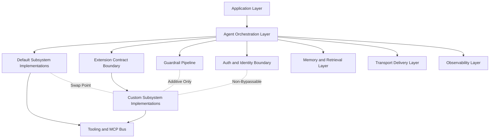
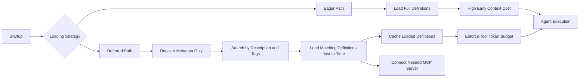
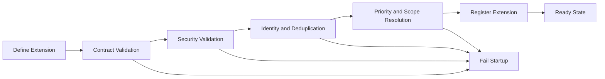
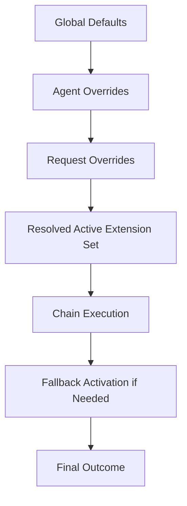
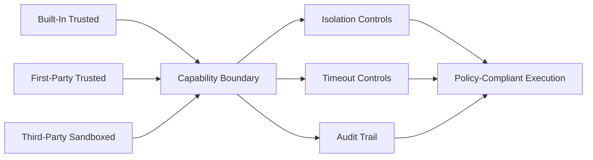
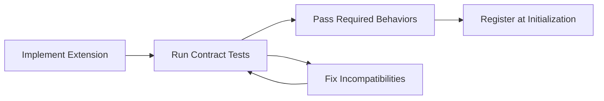

# Extensibility and Plugin Architecture Plan

> Scope: Extensibility architecture, plugin model, provider contracts, lifecycle hooks, and extension point governance for the safeagent library.
> Tasks: EXTENSIBILITY_INFRA (Extension Point Infrastructure and Provider Contracts)

## Table of Contents
- Extensibility Philosophy
- Tool Extensions
- Deferred Tool Loading and On-Demand Discovery
- Guardrail Extensions
- Memory Provider Extensions
- Storage Provider Extensions
- Retrieval Strategy Extensions
- Document Processor Extensions
- LLM Provider Extensions
- Transport Extensions
- Observability Provider Extensions
- Authentication Extensions
- Frontend Component Extensions
- Lifecycle Hook System
- Extension Registration and Validation Model
- Composition Patterns
- Security Model for Extensions
- Performance Considerations
- Testing Contract for Extension Authors
- Cross-References
- Task Specifications
- Delivery Checklist
- Navigation

## Extensibility Philosophy
- The core product posture is batteries included but replaceable.
- Every major subsystem ships with a production-ready default.
- Every major subsystem also exposes a typed contract for replacement.
- Default-first design keeps onboarding fast for small teams.
- Contract-first design keeps advanced customization viable for large teams.
- Zero lock-in is a first-class product guarantee.
- Consumers can swap one subsystem without touching unrelated subsystems.
- Consumers can progressively replace defaults as maturity grows.
- Replacement does not require forking the core library.
- The baseline is strict type integrity across extension boundaries.
- Contracts are formally defined and validated at registration.
- Contract shape checks happen before the system enters ready state.
- Initialization fails loudly when an extension is incompatible.
- Compatibility errors are explicit, contextual, and actionable.
- Error messages point to the failing extension identity and contract area.
- Progressive disclosure is mandatory for developer experience.
- Simple use cases use defaults with minimal setup.
- Advanced use cases layer in custom implementations incrementally.
- Extension APIs avoid inheritance-driven complexity.
- Factory pattern dominance is maintained across all extension points.
- Composition is preferred over deep object hierarchies.
- Internal orchestration remains deterministic under mixed defaults and custom components.
- MCP is the universal tool bus for external tool connectivity.
- MCP channels are supported through stdio and HTTP transport modes.
- Tool discovery is bounded by explicit registration and health state.
- Tool availability is filtered at agent scope, not globally assumed.
- Extensibility never weakens safety guarantees.
- Built-in safety controls remain non-optional foundations.
- Custom safety logic can tighten policy but cannot loosen baseline policy.
- Auth context integrity is preserved across all extension boundaries.
- Memory isolation is non-negotiable under all provider combinations.
- Per-user boundaries are enforced before any retrieval or recall action.
- Scalability is treated as a design input, not a later optimization.
- Extension overhead is measurable by default through observability.
- High-latency extension points support async offloading where appropriate.
- Circuit breakers protect the system from repeated extension failure.
- Caching can be attached to expensive extension layers when correctness allows.
- Lazy initialization reduces startup cost for optional extensions.
- Eager initialization is allowed for critical-path extensions that must fail fast.
- Deterministic ordering rules avoid nondeterministic behavior in shared pipelines.
- Explicit priority drives conflict resolution between multiple extensions.
- Override hierarchy keeps scope intent clear and predictable.
- Request-scoped choices outrank agent-scoped choices.
- Agent-scoped choices outrank global defaults.
- Governance is explicit and auditable.
- Extension invocation events are traced as part of standard telemetry.
- Trust levels gate sensitive extension categories.
- Capability declarations are required for permissioned operations.
- Isolation boundaries prevent direct state access across extension instances.
- Bun is the runtime baseline for all extension authoring and validation workflows.

## Extension Point Catalog
- The catalog defines all officially supported extension surfaces.
- Each extension point includes a built-in default and a replacement contract.
- Each extension point documents replacement triggers and risk considerations.
- Security criteria apply equally to defaults and custom implementations.
- Validation is mandatory before an extension point becomes active.
- Contracts emphasize behavior, determinism, and boundary compliance.
- All extension points align with the same override hierarchy semantics.
- All extension points align with the same observability requirements.
- All extension points align with trust and capability declarations.

### 1. Tool Extensions
- **Role in system:** Tool extensions enable capability execution beyond model-only reasoning.
- **Default behavior:** Built-in tools provide location intelligence, document search, memory recall, CTA streaming, and visual grounding.
- **Default behavior:** Built-in tools are production-ready with bounded latency and clear failure behavior.
- **Default behavior:** Built-in tools integrate with tracing and policy enforcement by default.
- **Contract shape:** Tool definitions include identity, schema, description, and handler semantics.
- **Contract shape:** Inputs and outputs follow typed structures that can be validated at registration.
- **Contract shape:** Tool behavior must include deterministic error signaling and timeout compliance.
- **Contract shape:** Tool metadata includes trust level and capability declaration.
- **Replacement trigger:** Replace tool logic when domain-specific actions are required.
- **Replacement trigger:** Replace tool logic when integrating enterprise services or internal APIs.
- **Replacement trigger:** Replace tool logic when built-in tools do not satisfy compliance rules.
- **Replacement trigger:** Replace tool logic when richer grounding sources are needed.
- **MCP integration:** External tool providers can attach through MCP server channels.
- **MCP integration:** MCP transport can run through stdio or HTTP with explicit health checks.
- **MCP integration:** Per-agent filtering governs which external tools are available.
- **MCP integration:** Health monitoring can disable unstable MCP tool sources automatically.
- **Security considerations:** Tool execution is sandboxed under declared capability bounds.
- **Security considerations:** Access control is enforced per tool identity and scope.
- **Security considerations:** Timeout enforcement prevents tool stalls from blocking response flow.
- **Security considerations:** Tool outputs are still subject to guardrail and policy checks.
- **Security considerations:** Tool registration rejects handlers that violate contract invariants.
- **Security considerations:** Tool isolation blocks direct state access to unrelated extensions.
- **Operational notes:** Tool invocation latency and failure rates are tracked in observability.
- **Operational notes:** Tool backpressure behavior is measured under concurrent load.
- **Operational notes:** Tool replacement supports phased rollout through scoped overrides.
- **Reference:** See the Agents & Orchestration document for agent-level tool orchestration and MCP integration behavior.

#### Deferred Tool Loading and On-Demand Discovery
- **Scalability problem:** As MCP adoption expands, agents often connect to 10 or more MCP servers, and loading every tool definition at startup can consume roughly 50K to 130K tokens before useful work begins.
- **Scalability problem:** Front-loading all definitions creates a context window scalability blocker and reduces room for user intent, retrieved evidence, and policy context.
- **Deferred loading pattern:** Startup registration keeps only compact metadata in memory, including tool identity, description, and tags.
- **Deferred loading pattern:** Full tool definitions are loaded only when a task actually requires the tool, keeping initial context lean.
- **Tool search mechanism:** A dedicated meta-tool searches the registry by description and tags, then brings matching tool definitions into context just-in-time.
- **Token budget for tools:** A configurable ceiling limits how many tokens tool definitions may occupy in active context.
- **Loading priority:** High-frequency tools can be loaded eagerly for responsiveness, while low-frequency tools remain deferred until needed.
- **Loaded-definition cache:** Once a definition is loaded, it is cached for the active session to avoid repeated fetch and repeated context cost.
- **MCP server lazy connection:** MCP servers are not connected at startup by default; connection occurs only when a selected tool from that server is needed.
- **Compatibility:** Deferred behavior remains transparent at agent level so planning and execution flows stay consistent regardless of eager or deferred source.
- **Fallback behavior:** When search does not find a required tool, the system returns a graceful error that includes viable alternatives from the current registry.
- **Runtime alignment:** This strategy fits the Bun runtime baseline and the single published package model for safeagent.
- **Reference:** Anthropic tool search pattern: https://docs.anthropic.com/en/docs/build-with-claude/tool-use/tool-search

### 2. Guardrail Extensions
- **Role in system:** Guardrail extensions enforce policy safety over requests and responses.
- **Default behavior:** Built-in guardrails include language constraints, hate speech detection, PII handling, moderation, and composite policy.
- **Default behavior:** Built-in guardrails run with production-safe defaults under strict policy integrity.
- **Default behavior:** Built-in guardrails are always active and cannot be detached by custom logic.
- **Contract shape:** Custom guardrails implement one typed signature usable for both input and output checks.
- **Contract shape:** Guardrail outcomes include allow, block, and policy metadata semantics.
- **Contract shape:** Guardrails provide deterministic behavior under equivalent inputs.
- **Contract shape:** Guardrails support structured rationale fields for audit traces.
- **Composition model:** Multiple guardrails compose via pipeline factory semantics.
- **Composition model:** Aggregation follows worst-wins policy where stricter outcome prevails.
- **Composition model:** Priority can adjust evaluation order when explicitly configured.
- **Composition model:** Final policy result remains additive relative to built-in safety.
- **Parallel execution:** Guardrails run in parallel with agent generation by default.
- **Parallel execution:** Triggered guardrails cancel in-flight response generation safely.
- **Parallel execution:** Cancellation flows preserve trace continuity and user-safe messaging.
- **Parallel execution:** Parallelism limits are configurable to control compute overhead.
- **Security considerations:** Custom guardrails cannot weaken built-in safety controls.
- **Security considerations:** Custom guardrails can only add stricter restrictions.
- **Security considerations:** Policy bypass attempts are rejected during registration.
- **Security considerations:** Guardrail execution context excludes sensitive credential data.
- **Security considerations:** Guardrail output tampering is blocked after aggregation stage.
- **Security considerations:** Guardrail audit entries are immutable in trace export flow.
- **Operational notes:** Guardrail false positive and false negative trends are tracked.
- **Operational notes:** Guardrail timeout behavior degrades to safe fallback outcomes.
- **Operational notes:** Guardrail contracts include high-concurrency execution checks.
- **Reference:** See the Guardrails & Safety document for deeper policy composition and safety governance.

### 3. Memory Provider Extensions
- **Role in system:** Memory provider extensions manage persistent and short-horizon memory operations.
- **Default behavior:** Graph and fact memory uses SurrealDB with surqlize.
- **Default behavior:** Short-term cache uses Valkey for fast recall and session continuity.
- **Default behavior:** Built-in memory behavior includes supersession-aware fact handling.
- **Default behavior:** Built-in memory behavior includes temporal filtering controls.
- **Contract shape:** Providers implement read, write, search, and delete semantics.
- **Contract shape:** Providers expose deterministic identity scoping behavior.
- **Contract shape:** Providers support temporal constraints and recency windows.
- **Contract shape:** Providers support supersession semantics for evolving facts.
- **Replacement trigger:** Replace memory backend for regional data residency requirements.
- **Replacement trigger:** Replace memory backend for enterprise storage mandates.
- **Replacement trigger:** Replace memory backend for workload-specific latency targets.
- **Replacement trigger:** Replace memory backend for domain-specific indexing behavior.
- **Constraint expectations:** Per-user isolation is mandatory in all operations.
- **Constraint expectations:** Temporal filtering support is mandatory for compliance and relevance.
- **Constraint expectations:** Fact supersession handling is mandatory for correctness.
- **Constraint expectations:** Search scoring shape must remain compatible with retrieval consumers.
- **Security considerations:** Cross-user memory leakage is a hard failure condition.
- **Security considerations:** Isolation compliance is validated during extension registration.
- **Security considerations:** Provider calls run with timeout boundaries and cancellation support.
- **Security considerations:** Access policy is evaluated before memory query dispatch.
- **Security considerations:** Memory mutation auditing is required for sensitive contexts.
- **Security considerations:** Provider-specific errors are normalized to safe public outcomes.
- **Operational notes:** Cache coherence metrics are captured for troubleshooting.
- **Operational notes:** Memory read and write latency percentiles are reported by scope.
- **Operational notes:** Reconciliation paths handle delayed write visibility under load.
- **Reference:** See the Memory & Intelligence document for memory data model and isolation rules.

### 4. Storage Provider Extensions
- **Role in system:** Storage provider extensions manage relational and object persistence.
- **Default behavior:** Relational storage uses PostgreSQL with Drizzle ORM.
- **Default behavior:** File storage uses S3-compatible object storage with MinIO defaults.
- **Default behavior:** Built-in storage adapters provide health checks and safe retries.
- **Default behavior:** Built-in adapters enforce consistency constraints expected by higher layers.
- **Contract shape:** Providers expose typed operations for relational and object storage patterns.
- **Contract shape:** Providers expose transactional semantics for multi-step mutations.
- **Contract shape:** Providers expose health status semantics for readiness checks.
- **Contract shape:** Providers expose bounded failure categories for policy handling.
- **Replacement trigger:** Replace backend to align with enterprise data platform standards.
- **Replacement trigger:** Replace backend to satisfy region or tenancy architecture needs.
- **Replacement trigger:** Replace backend for scale profile differences in object throughput.
- **Replacement trigger:** Replace backend for managed service preference or governance.
- **Constraint expectations:** Transaction support is required for state integrity.
- **Constraint expectations:** Health checks are required for startup validation and runtime health.
- **Constraint expectations:** Concurrency semantics must be deterministic under contention.
- **Constraint expectations:** Durability expectations must match baseline reliability targets.
- **Security considerations:** All data access must flow through ORM abstraction layers.
- **Security considerations:** Raw query pathways are disallowed, including custom adapters.
- **Security considerations:** Credential handling remains outside extension method interfaces.
- **Security considerations:** Access scopes must enforce tenant and user boundaries.
- **Security considerations:** Object metadata handling must respect policy classification labels.
- **Security considerations:** Audit traces must capture mutation intent and result class.
- **Operational notes:** Storage saturation signals are integrated into observability.
- **Operational notes:** Error class mapping supports graceful degradation logic.
- **Operational notes:** Data layer extension changes require contract test completion.
- **Reference:** See the Foundation and Document Processing documents for foundational storage and document persistence coupling.

### 5. Retrieval Strategy Extensions
- **Role in system:** Retrieval strategy extensions control search, ranking, and filtering behavior.
- **Default behavior:** Hybrid search uses reciprocal rank fusion for blended relevance.
- **Default behavior:** Evidence bundle gating ensures response grounding quality.
- **Default behavior:** Built-in strategy enforces access boundaries before scoring output.
- **Default behavior:** Built-in strategy maintains deterministic result normalization.
- **Contract shape:** Strategies implement search, rank, and filter semantics.
- **Contract shape:** Strategy output includes scored results compatible with evidence gates.
- **Contract shape:** Strategy output includes provenance metadata for traceability.
- **Contract shape:** Strategy operations support cancellation and timeout handling.
- **Replacement trigger:** Replace retrieval for domain-tuned ranking requirements.
- **Replacement trigger:** Replace retrieval for multilingual or modality-specific relevance needs.
- **Replacement trigger:** Replace retrieval for policy-governed filtering priorities.
- **Replacement trigger:** Replace retrieval for specialized corpus architectures.
- **Constraint expectations:** Returned scores must map to evidence gate expectations.
- **Constraint expectations:** File-level access control must always be enforced.
- **Constraint expectations:** Retrieval behavior must preserve per-user boundaries.
- **Constraint expectations:** Filtering behavior must remain deterministic under equal inputs.
- **Security considerations:** Access control checks execute before returning candidate results.
- **Security considerations:** Metadata leakage across users is prohibited.
- **Security considerations:** Retrieval logs avoid exposing restricted document fragments.
- **Security considerations:** Ranking features must avoid unsafe bias amplification patterns.
- **Security considerations:** Timeout fallback must remain safe and transparent.
- **Security considerations:** Result shaping cannot bypass evidence bundle constraints.
- **Operational notes:** Recall and precision quality metrics are tracked continuously.
- **Operational notes:** Strategy latency and cost metrics are available by scope.
- **Operational notes:** Large corpus behavior is validated under concurrent query pressure.
- **Reference:** See the Retrieval & Evidence document for retrieval baseline and evidence gate design.

### 6. Document Processor Extensions
- **Role in system:** Document processor extensions convert diverse inputs into chunkable text and metadata.
- **Default behavior:** Built-in processors handle PDF, image, office documents, and plain text.
- **Default behavior:** Built-in processors normalize content for embedding compatibility.
- **Default behavior:** Built-in processors capture extraction confidence metadata.
- **Default behavior:** Built-in processors degrade gracefully on partial parse failures.
- **Contract shape:** Processors implement extract-and-chunk semantics.
- **Contract shape:** Output includes chunk payloads and structured metadata.
- **Contract shape:** Output includes failure and warning categories for downstream handling.
- **Contract shape:** Chunk model compatibility with embedding pipeline is mandatory.
- **Replacement trigger:** Replace processing logic for proprietary or niche content formats.
- **Replacement trigger:** Replace processing logic for domain-specific chunking heuristics.
- **Replacement trigger:** Replace processing logic for stricter compliance redaction workflows.
- **Replacement trigger:** Replace processing logic for high-throughput ingestion requirements.
- **Constraint expectations:** Output must remain embedding-pipeline compatible.
- **Constraint expectations:** Failure handling must preserve queue stability.
- **Constraint expectations:** Processor behavior must be deterministic for reproducibility.
- **Constraint expectations:** Chunk metadata must preserve access boundary inheritance.
- **Queue integration:** Processing runs in job queue mode in production environments.
- **Queue integration:** In-process fallback is available for development mode.
- **Queue integration:** Queue retries use bounded backoff and failure classification.
- **Queue integration:** Queue observability includes throughput and dead-letter diagnostics.
- **Security considerations:** Processors must sanitize extracted content before indexing.
- **Security considerations:** Processors must avoid leaking unsupported binary payloads.
- **Security considerations:** Processor sandboxing limits file system and network exposure.
- **Security considerations:** Sensitive content tagging is preserved across chunk boundaries.
- **Security considerations:** Processor timeout and memory limits prevent denial-of-service patterns.
- **Security considerations:** Access labels propagate from source document to all chunks.
- **Operational notes:** Parsing quality benchmarks are part of contract validation.
- **Operational notes:** Processor replacement can be rolled out by document type scope.
- **Reference:** See the Document Processing document for ingestion orchestration and chunk governance.

### 7. LLM Provider Extensions
- **Role in system:** LLM provider extensions supply model completion and streaming capabilities.
- **Default behavior:** OpenAI integration through the adopted agent framework is the baseline.
- **Default behavior:** Built-in provider supports fallback chains for resilience.
- **Default behavior:** Built-in provider supports tool calling and streamed outputs.
- **Default behavior:** Built-in provider normalizes events to shared internal format.
- **Contract shape:** Providers implement complete and stream response semantics.
- **Contract shape:** Providers must support tool call round-trip semantics.
- **Contract shape:** Providers must emit normalized message and usage structures.
- **Contract shape:** Providers must expose bounded error categories and retry hints.
- **Replacement trigger:** Replace provider for sovereignty, compliance, or cost goals.
- **Replacement trigger:** Replace provider for capability differences by workload.
- **Replacement trigger:** Replace provider for specialized model access patterns.
- **Replacement trigger:** Replace provider for latency optimization in specific regions.
- **Scope behavior:** Default provider can be configured globally for all agents.
- **Scope behavior:** Agent-level override can select a different provider path.
- **Scope behavior:** Request-level override can redirect specific interactions.
- **Scope behavior:** Override precedence follows the global hierarchy policy.
- **Constraint expectations:** Tool calling support is mandatory for compatibility.
- **Constraint expectations:** Streaming support is mandatory for transport continuity.
- **Constraint expectations:** Normalized format support is mandatory for downstream layers.
- **Constraint expectations:** Cancellation support is mandatory for guardrail interruption.
- **Security considerations:** Credentials remain in environment-managed boundaries.
- **Security considerations:** Credential material is never passed in extension method payloads.
- **Security considerations:** Provider output still passes through guardrail and policy layers.
- **Security considerations:** Provider timeouts and retries respect global risk controls.
- **Security considerations:** Prompt and response trace handling follows privacy policy.
- **Security considerations:** Provider fallback cannot skip mandatory safety checks.
- **Operational notes:** Token usage, latency, and error metrics are tracked by provider.
- **Operational notes:** Fallback activation rate is monitored for provider health trends.
- **Reference:** See the Agents & Orchestration document for provider orchestration and agent runtime behavior.

### 8. Transport Extensions
- **Role in system:** Transport extensions deliver events and responses to clients.
- **Default behavior:** SSE delivery through Elysia provides baseline transport semantics.
- **Default behavior:** Built-in transport supports standard and full verbosity modes.
- **Default behavior:** Built-in transport preserves ordering and completion guarantees.
- **Default behavior:** Built-in transport supports cancellation and disconnect handling.
- **Contract shape:** Transport adapters implement event emission and stream lifecycle semantics.
- **Contract shape:** Adapters support nine standard event categories across all transports.
- **Contract shape:** Adapters support event filtering by verbosity level.
- **Contract shape:** Adapters support structured error and terminal events.
- **Replacement trigger:** Replace transport for client environments requiring alternate protocols.
- **Replacement trigger:** Replace transport for infrastructure constraints around streaming.
- **Replacement trigger:** Replace transport for mobile or edge connectivity patterns.
- **Replacement trigger:** Replace transport for enterprise gateway integration requirements.
- **Constraint expectations:** All standard event categories must be preserved.
- **Constraint expectations:** Event ordering guarantees must remain intact.
- **Constraint expectations:** Verbosity filtering must be deterministic and testable.
- **Constraint expectations:** Disconnect behavior must not corrupt request state.
- **Security considerations:** Transport adapters must not expose hidden trace details in standard mode.
- **Security considerations:** Access context must be validated before stream initiation.
- **Security considerations:** Event payload redaction rules must be applied consistently.
- **Security considerations:** Replay risks must be mitigated by transport policy controls.
- **Security considerations:** Transport extensions must not bypass guardrail enforcement output.
- **Security considerations:** Backpressure handling must avoid memory exhaustion conditions.
- **Operational notes:** Stream health and disconnect metrics are observed by client type.
- **Operational notes:** Event delivery lag is measured and reported.
- **Reference:** See the Streaming & Transport document for event model and adapter baseline definitions.

### 9. Observability Provider Extensions
- **Role in system:** Observability extensions capture traces, scoring, and export workflows.
- **Default behavior:** Langfuse tracing and Promptfoo evaluation form the baseline.
- **Default behavior:** Built-in observability tracks extension invocation and outcome metadata.
- **Default behavior:** Built-in observability supports latency, error, and quality dimensions.
- **Default behavior:** Built-in observability provides policy-safe redaction behavior.
- **Contract shape:** Providers implement span lifecycle, scoring hooks, and export semantics.
- **Contract shape:** Providers expose deterministic trace identity and correlation behavior.
- **Contract shape:** Providers support structured metrics for extension overhead analysis.
- **Contract shape:** Providers support optional evaluation workflows for quality gating.
- **Replacement trigger:** Replace observability stack for enterprise telemetry standards.
- **Replacement trigger:** Replace observability stack for custom governance and retention policies.
- **Replacement trigger:** Replace observability stack for integrated internal analytics tooling.
- **Replacement trigger:** Replace observability stack for regional policy requirements.
- **Constraint expectations:** OpenTelemetry gen_ai semantic conventions must be supported.
- **Constraint expectations:** Trace continuity must survive retries, fallbacks, and cancellations.
- **Constraint expectations:** Sensitive fields require configurable redaction policies.
- **Constraint expectations:** Export failures must not block primary response pathways.
- **Security considerations:** Trace payloads must avoid secret material and credential leakage.
- **Security considerations:** Access to observability data must follow role-scoped policies.
- **Security considerations:** Provider extensions cannot modify business outcomes through telemetry paths.
- **Security considerations:** Audit integrity requires immutable event ordering semantics.
- **Security considerations:** Evaluation datasets must be isolated by tenant and policy boundary.
- **Security considerations:** Scoring outputs must remain attributable and reproducible.
- **Operational notes:** Sampling strategies can be scoped by request criticality.
- **Operational notes:** Cost controls are available for high-volume trace streams.
- **Reference:** See the Observability document for observability requirements and evaluation governance.

### 10. Authentication Extensions
- **Role in system:** Authentication extensions verify identity and resolve access context.
- **Default behavior:** JWT-based middleware is the built-in baseline.
- **Default behavior:** Built-in auth resolves role and scope context for downstream policy checks.
- **Default behavior:** Built-in auth integrates with per-request override rules safely.
- **Default behavior:** Built-in auth failures short-circuit before sensitive processing.
- **Contract shape:** Providers implement verification, role extraction, and context resolution semantics.
- **Contract shape:** Providers expose deterministic failure categories for policy handling.
- **Contract shape:** Providers provide normalized principal identity fields.
- **Contract shape:** Providers preserve immutable auth context once resolved.
- **Replacement trigger:** Replace auth logic for enterprise identity provider integration.
- **Replacement trigger:** Replace auth logic for federated identity requirements.
- **Replacement trigger:** Replace auth logic for advanced policy claim mapping.
- **Replacement trigger:** Replace auth logic for specialized trust frameworks.
- **Constraint expectations:** Auth extension enablement requires explicit activation.
- **Constraint expectations:** Auth context must be available before tool and memory actions.
- **Constraint expectations:** Role mapping must be deterministic across equivalent tokens.
- **Constraint expectations:** Failure behavior must be safe and non-ambiguous.
- **Security considerations:** Auth is highest-trust extension class with strict governance.
- **Security considerations:** Auth extensions require explicit trust declaration and review.
- **Security considerations:** Auth context cannot be modified by lifecycle hooks.
- **Security considerations:** Auth outcomes are immutable for downstream execution phases.
- **Security considerations:** Principal isolation must be preserved across concurrent requests.
- **Security considerations:** Token metadata handling must avoid sensitive claim leakage.
- **Operational notes:** Auth failure rates and source trends are continuously monitored.
- **Operational notes:** Context resolution latency is tracked due to critical-path impact.
- **Reference:** See the Server Implementation document for server-side auth boundary and middleware posture.

### 11. Frontend Component Extensions
- **Role in system:** Frontend extensions enable UI customization without fragmenting core UX contracts.
- **Default behavior:** Built-in components include React hooks, web components, and React Native components.
- **Default behavior:** Built-in components provide accessible defaults and predictable behavior.
- **Default behavior:** Built-in components expose style and behavior override surfaces.
- **Default behavior:** Built-in components align with transport event contracts.
- **Contract shape:** Components accept style overrides, slot injection, and behavior configuration.
- **Contract shape:** Component extension contracts preserve event compatibility.
- **Contract shape:** Component extension contracts preserve accessibility baseline requirements.
- **Contract shape:** Component extension contracts preserve state synchronization semantics.
- **Replacement trigger:** Replace components for brand system alignment.
- **Replacement trigger:** Replace components for specialized workflow surfaces.
- **Replacement trigger:** Replace components for platform-specific interaction needs.
- **Replacement trigger:** Replace components for internationalization and localization nuance.
- **Registry model:** Component installation uses a registry pattern with consumer ownership.
- **Registry model:** Registry supports deterministic override order for conflicting entries.
- **Registry model:** Registry supports scope-based installation for app regions.
- **Registry model:** Registry metadata supports compatibility and audit visibility.
- **Security considerations:** Component overrides cannot access restricted auth payload data.
- **Security considerations:** Event handlers must respect policy guardrails and role constraints.
- **Security considerations:** Visual overrides must not obscure policy or consent indicators.
- **Security considerations:** Slot content sanitization is required for untrusted sources.
- **Security considerations:** Component state boundaries prevent cross-widget data leaks.
- **Security considerations:** Accessibility compliance remains mandatory under customization.
- **Operational notes:** Render performance and interaction latency are tracked by component type.
- **Operational notes:** Registry health includes override conflict diagnostics.
- **Reference:** See the Frontend SDK document for frontend SDK extension mechanics and consumer ownership model.

### 12. Lifecycle Hook System
- **Role in system:** Lifecycle hooks expose controlled interception and observation points.
- **Default behavior:** No hooks are enabled by default for a clean baseline pipeline.
- **Default behavior:** Baseline execution remains deterministic when no hook is registered.
- **Default behavior:** Built-in pipeline phases remain visible to observability regardless of hooks.
- **Default behavior:** Hook insertion is opt-in by scope and stage.
- **Named phases:** Pre-request occurs before routing and principal-aware dispatch.
- **Named phases:** Post-intent occurs after intent detection and before domain strategy selection.
- **Named phases:** Pre-retrieval occurs before search execution begins.
- **Named phases:** Post-retrieval occurs after search and before response synthesis.
- **Named phases:** Pre-response occurs before first user-visible stream emission.
- **Named phases:** Post-response occurs after full response completion.
- **Named phases:** Pre-guardrail occurs before guardrail evaluation runs.
- **Named phases:** Post-guardrail occurs after guardrail outcomes aggregate.
- **Named phases:** Tool start and tool end wrap each tool invocation.
- **Named phases:** Memory read and memory write wrap memory provider interactions.
- **Named phases:** Error phase captures recoverable and terminal faults.
- **Scoping model:** Hooks can be global in scope.
- **Scoping model:** Hooks can be bound to a specific agent scope.
- **Scoping model:** Hooks can be bound to a specific request scope.
- **Scoping model:** Scope precedence follows request over agent over global.
- **Ordering model:** Hooks execute in registration order within each scope.
- **Ordering model:** Each hook receives the result of the previous hook.
- **Ordering model:** Deterministic ordering is guaranteed for repeatability.
- **Ordering model:** Explicit priority can override default ordering when needed.
- **Security considerations:** Hooks cannot bypass guardrail enforcement.
- **Security considerations:** Hooks cannot modify resolved auth context.
- **Security considerations:** Hooks cannot mutate trust level declarations.
- **Security considerations:** Hook capability declarations gate sensitive operations.
- **Security considerations:** Hook failures are isolated and policy-safe.
- **Security considerations:** Hook timeout boundaries prevent critical-path stalls.
- **Operational notes:** Hook overhead is measured at phase and extension level.
- **Operational notes:** Hook execution traces include scope and ordering metadata.
- **Reference:** This lifecycle model integrates with agent, retrieval, memory, and transport contracts.

```mermaid
flowchart LR
    PRE_REQUEST[Pre-Request] --> POST_INTENT[Post-Intent]
    POST_INTENT --> PRE_GUARDRAIL[Pre-Guardrail]
    PRE_GUARDRAIL --> GUARDRAIL_EVAL[Guardrail Evaluation]
    GUARDRAIL_EVAL --> POST_GUARDRAIL[Post-Guardrail]
    POST_GUARDRAIL --> PRE_RETRIEVAL[Pre-Retrieval]
    PRE_RETRIEVAL --> RETRIEVAL_EXEC[Retrieval Execution]
    RETRIEVAL_EXEC --> POST_RETRIEVAL[Post-Retrieval]
    POST_RETRIEVAL --> TOOL_BOUNDARY[Tool Start and Tool End]
    TOOL_BOUNDARY --> MEMORY_BOUNDARY[Memory Read and Memory Write]
    MEMORY_BOUNDARY --> PRE_RESPONSE[Pre-Response]
    PRE_RESPONSE --> RESPONSE_STREAMING[Response Streaming]
    RESPONSE_STREAMING --> POST_RESPONSE[Post-Response]
    GUARDRAIL_EVAL --> ERROR_PHASE[Error]
    RETRIEVAL_EXEC --> ERROR_PHASE
    RESPONSE_STREAMING --> ERROR_PHASE
```

## Extension Registration and Validation Model
- Extension registration occurs during initialization.
- Dynamic runtime attachment is not part of the baseline model.
- Registration requires contract declaration and identity metadata.
- Contract checks execute before the system enters ready state.
- Incompatible extensions fail startup with explicit diagnostics.
- Validation covers structural, behavioral, and capability criteria.
- Structural checks confirm contract shape completeness.
- Behavioral checks confirm required semantics are declared.
- Capability checks confirm trust-level compatibility.
- Security checks confirm isolation and timeout declarations.
- Identity model uses name plus optional deduplication key.
- Deduplication prevents accidental double registration.
- Duplicate detection produces deterministic conflict outcomes.
- Ordering model supports explicit priority within shared stages.
- Priority ties fall back to stable registration order.
- Registration scope can target global, agent, or request policies.
- Request-scoped declarations are evaluated against global guardrails.
- Guardrail safety baseline is enforced regardless of scope declarations.
- Auth integrity checks run before registration finalization.
- Memory isolation declarations are validated for provider extensions.
- Transport extensions must declare support for all standard event categories.
- Provider extensions must declare timeout and failure semantics.
- Validation messages include extension identity and failing contract area.
- Validation messages avoid ambiguous generic error descriptions.
- Extension readiness is explicit and traceable.
- Registration outcomes are emitted to observability for audit trails.
- Rejected extensions are excluded from activation graph.
- Accepted extensions enter ready set with scope metadata.
- Ready set snapshot is immutable for the active initialization cycle.
- Initialization outcome is all-or-fail for required extensions.
- Optional extensions can fail without blocking startup when policy allows.
- Optional failure handling still emits warning-level governance events.
- Startup policies define which extension categories are mandatory.
- Highest-trust extension categories default to mandatory validation strictness.

## Composition Patterns
- Composition is deterministic, typed, and scope-aware.
- Multiple extensions of the same type can chain in sequence.
- Chaining is common for guardrails, hooks, and transformation stages.
- Priority ordering defines deterministic execution when chain members conflict.
- Priority metadata is explicit and visible to observability.
- Stable ordering prevents non-repeatable outcomes under concurrency.
- Fallback chains apply to provider-style extension points.
- Primary provider handles requests under normal health conditions.
- Secondary provider activates after failure threshold or hard fault.
- Fallback activation preserves policy and trace continuity.
- Fallback does not bypass guardrails, auth, or access controls.
- Override hierarchy governs which extension selection wins.
- Request-level override has highest precedence.
- Agent-level override has middle precedence.
- Global default has base precedence.
- Override scopes are resolved once per request lifecycle.
- Scope resolution is traceable for debugging and audit.
- Conflict resolution is deterministic with clear diagnostics.
- Composition supports mixed defaults and custom entries.
- Composition preserves baseline contract obligations at every stage.
- Composition failures degrade gracefully where policy permits.
- Composition failures fail fast where security risk is high.
- Composition metadata is exported through observability providers.
- Composition testing covers order, fallback, and override behaviors.

## Security Model for Extensions
- Security posture assumes mixed trust extension ecosystems.
- Trust levels are explicitly declared for each extension.
- Built-in trust level is highest and always trusted.
- First-party trust level is trusted with governance review.
- Third-party trust level is sandboxed by default with restricted execution boundaries.
- Third-party sandbox enforces: no direct filesystem access beyond declared paths, no outbound network calls beyond declared endpoints, no access to environment secrets or credential stores, memory allocation limits per invocation, CPU time limits per invocation, and no access to other extension instance state.
- Third-party extensions require explicit capability declarations for each restricted operation.
- Capability grants are reviewed and approved through the governance workflow before activation.
- Kill-switch behavior allows immediate quarantine of any extension by identity without restart.
- Trust level influences capability grants and execution boundaries.
- Capability declarations are mandatory for privileged actions.
- Capability examples include network, storage, and memory access classes.
- Undeclared capability usage is blocked and audited.
- Capability denial results are explicit and observable.
- Isolation rules prevent cross-extension state access.
- Extension instances cannot read private state from other instances.
- Shared context is limited to approved typed payloads.
- Timeout enforcement is mandatory across all extension calls.
- Timeouts are configurable per extension category and risk profile.
- Timeout expiry triggers graceful degradation where possible.
- Timeout expiry triggers hard fail for high-risk extension classes.
- Circuit breakers protect against repeated extension failures.
- Circuit breaker state transitions are observable and auditable.
- Extension invocation is fully traced through observability.
- Audit trail includes identity, scope, capability set, and outcome class.
- Memory providers must enforce per-user isolation without exception.
- Memory isolation checks are part of registration validation.
- Guardrail model is additive-only by policy.
- Custom guardrails can raise restrictions but cannot lower them.
- Auth context remains immutable after authentication resolution.
- Hooks and tools cannot mutate auth context fields.
- Provider credentials remain outside extension contract payloads.
- Sensitive values are redacted in logs and trace exports.
- Security validation scales with concurrent extension activity.
- Policy decisions remain deterministic under high throughput.
- Security failures produce safe user-facing outcomes.
- Security failures never expose internal policy internals unnecessarily.

## Performance Considerations
- Extensibility performance is a platform-level concern.
- Extension overhead is measured and reported by default.
- Per-extension latency is tracked across percentiles.
- Per-extension failure rate is tracked by scope and trust level.
- High-cost extensions can move to job queue execution.
- Async offload is recommended for non-interactive heavy workloads.
- Queue offload preserves policy, trace, and retry semantics.
- Expensive deterministic extension outputs may be cached.
- Cache policy must include invalidation and scope boundaries.
- Cache usage must never cross user isolation boundaries.
- Circuit breakers prevent cascade failures from unstable extensions.
- Circuit breaker thresholds are tunable per extension type.
- Recovery probes control re-entry after circuit-open state.
- Lazy loading reduces startup load for optional extensions.
- Eager loading remains available for critical mandatory extensions.
- Warmup strategy can pre-initialize high-traffic extension sets.
- Concurrent execution limits prevent resource starvation.
- Backpressure policies prevent queue and stream overload.
- Fallback chains preserve availability under partial outage.
- Fallback chains include observability hooks for incident response.
- Performance budgets can be defined per extension category.
- Budget breaches trigger governance alerts and optimization backlog.
- Scalability planning targets 10M user operational expectations.
- Throughput tests include mixed default and custom extension mixes.
- Resource footprints are benchmarked under representative traffic.
- Performance regressions block promotion of extension updates.
- Profile data is retained for trend analysis and capacity planning.

## Testing Contract for Extension Authors
- Every extension point publishes a contract test suite.
- Contract tests verify compatibility independent of implementation details.
- Extension authors run tests against their custom implementation.
- Passing tests is required before registration in production environments.
- Contract tests cover happy path behaviors.
- Contract tests cover error handling behaviors.
- Contract tests cover timeout behaviors.
- Contract tests cover concurrent access behaviors.
- Contract tests cover isolation and boundary behaviors.
- Contract tests cover deterministic ordering behaviors where applicable.
- Contract tests cover fallback behavior for provider categories.
- Contract tests cover override precedence behavior by scope.
- Contract tests cover security restrictions and capability declarations.
- Contract tests cover additive guardrail policy compliance.
- Contract tests cover auth immutability constraints for hooks and tools.
- Contract tests cover observability signal emission requirements.
- Contract tests are exportable for external extension author workflows.
- Test harness documentation explains expected fixtures and assertions.
- Built-in defaults must pass their own contract suites.
- Contract suite outcomes are tracked as release quality gates.
- Failure diagnostics include scenario names and expected behavior deltas.
- Contract updates remain stable through governance process.
- Testing posture emphasizes behavior reliability at scale.

## Cross-References
| Plan File | Connection |
|---|---|
| [Foundation](./foundation.md) | Storage contracts and type system |
| [Agents & Orchestration](./agents.md) | Tool registration, MCP integration, provider fallback |
| [Memory & Intelligence](./memory.md) | Memory provider contracts |
| [Document Processing](./documents.md) | Document processor contracts |
| [Retrieval & Evidence](./retrieval.md) | Retrieval strategy contracts |
| [Guardrails & Safety](./guardrails.md) | Guardrail contracts and composition |
| [Streaming & Transport](./transport.md) | Transport adapter contracts |
| [Server Implementation](./server.md) | Auth middleware boundary and HTTP integration surface |
| [Observability](./observability.md) | Observability provider contracts |
| [Infrastructure](./infrastructure.md) | Rate limiting, budget enforcement, circuit breaker, and capacity planning (non-extensible by design) |
| [Testing Strategy](./testing.md) | Contract test methodology |
| [Frontend SDK](./frontend-sdk.md) | Component extension patterns |

## Task Specifications

### EXTENSIBILITY_INFRA
- **Task Name:** EXTENSIBILITY_INFRA
- **Objective:** Implement extension point infrastructure, provider contracts, lifecycle hooks, and registration validation across all safeagent subsystems.
- **Depends On:** FOUNDATION, CORE_TYPES
- **Batch:** 4

#### What To Do
- Define typed contracts for all 12 extension points.
- Implement registration and validation with startup-time checks.
- Implement lifecycle hook system with named phases and scoping.
- Implement composition patterns including chaining, fallback, and override hierarchy.
- Implement security model including trust levels, capability restrictions, and timeout enforcement.
- Implement contract test suites for external extension authors.
- Verify built-in implementations pass published contract tests.
- Document extension points through typed contract definitions for auto-generated reference.

#### Acceptance Criteria
- All 12 extension points have typed contracts that compile and validate.
- Built-in defaults pass all contract tests.
- Custom extensions validate at registration with clear error reporting.
- Lifecycle hooks fire at all named phases with correct scoping.
- Override hierarchy works as request over agent over global.
- Security constraints enforce isolation, timeouts, and additive safety.
- Contract test suites are runnable by extension authors.

#### QA Scenarios
- Register a custom tool and verify it appears in available agent tools.
- Register a custom guardrail and verify composition with built-in guardrails.
- Register a custom memory provider and verify per-user isolation enforcement.
- Register an extension with invalid contract and verify startup fails clearly.
- Register duplicate extensions and verify deduplication behavior.
- Verify lifecycle hooks fire in correct order across all named stages.
- Verify request override precedence over agent and global defaults.
- Register a slow extension and verify timeout enforcement and circuit breaker behavior.
- Run contract tests against built-in implementations and verify passing outcomes.
- Verify custom guardrails cannot disable or weaken built-in safety controls.

#### Implementation Notes
- EXTENSIBILITY_INFRA is planned for Batch 4 after foundational types and config stabilize.
- Extension contracts enforce strong compile-time integrity through typed definitions.
- Contract tests are exportable for third-party extension author workflows.
- MCP tool integration reuses the shared MCP health check behavior defined in the agent orchestration layer.
- Validation includes Zod v4 schema checks where contract registration needs structural assurance.

## Non-Extensible Boundaries

The following subsystems are intentionally non-extensible by design. They are core platform invariants that must remain deterministic, auditable, and tamper-proof across all deployments. Exposing them as extension points would compromise safety guarantees or create unpredictable operational behavior at scale.

- **Rate limiting** is a platform invariant. Rate limiting behavior is configured through the infrastructure layer but not replaceable by extension authors. Custom rate policies can be expressed through configuration but the enforcement mechanism itself is non-negotiable. Allowing extension-level rate limiting would risk bypass paths that compromise system-wide fairness.
- **Budget enforcement** is a platform invariant. Token budget tracking and enforcement are managed centrally with durable accounting. Custom budget thresholds are configurable but the tracking and enforcement mechanism is non-extensible. Budget bypass would create unbounded cost exposure.
- **Structured logging** is a platform invariant. The logging pipeline is managed centrally with consistent format and redaction behavior. Log output format and redaction rules are configurable but the logging infrastructure itself is non-replaceable. Custom observability providers can consume log-derived signals without replacing the logging layer.
- **Error handling** is a platform invariant. Error classification, normalization, and safe user-facing messaging follow the core error taxonomy. Error mapping is configurable at the server layer but the classification hierarchy is non-extensible. Custom extensions produce errors through the standard error envelope and do not define their own error delivery semantics.
- **Circuit breaker** is a platform invariant. Circuit breaker behavior wraps all external calls including extension invocations. Circuit breaker thresholds are tunable per extension type but the breaker mechanism itself is non-replaceable.

These boundaries are enforced through the registration validation system. Extensions that attempt to intercept, override, or bypass these platform invariants are rejected at startup.

## Governance and Rollout Guidelines
- Extensibility governance is owned jointly by platform and security stakeholders.
- High-trust extension categories require explicit review workflows.
- Third-party extension onboarding requires sandbox policy confirmation.
- Contract changes require updated contract test coverage before adoption.
- Significant contract changes require transition guidance and adoption windows.
- Registry metadata tracks owner, trust level, and capability intent.
- Rollout can be scoped by environment, agent, or request class.
- Canary rollout is encouraged for new extension categories.
- Observability thresholds define rollback triggers for unstable behavior.
- Security incidents involving extensions trigger immediate capability quarantine.
- Documentation must include default behavior and replacement implications.
- Extension lifecycle includes registration, activation, monitoring, and retirement.
- Retired extensions remain trace-visible for audit continuity.
- Governance policy is applied consistently across all 12 extension points.

## Failure Handling Strategy
- Failure handling prioritizes user safety and response continuity.
- Non-critical extension failures degrade gracefully with clear trace annotations.
- Critical extension failures block unsafe continuation paths.
- Guardrail failures default to restrictive safe outcomes.
- Auth failures terminate request progression early and safely.
- Retrieval failures can trigger fallback strategies with preserved access controls.
- Provider failures can activate fallback chains under policy constraints.
- Hook failures are isolated to avoid global pipeline collapse.
- Timeout failures include bounded retry where risk is acceptable.
- Repeated failures trigger circuit-open state and reduced blast radius.
- Failure classes are normalized for consistent downstream treatment.
- User-facing messaging avoids sensitive internal details.
- Operational telemetry preserves sufficient diagnostics for remediation.

## Scalability Model
- Scalability planning assumes large concurrent tenant and user traffic.
- Extension registries are optimized for low-overhead scope resolution.
- Contract validation is startup-focused to reduce hot-path cost.
- Hot-path extension dispatch uses precomputed readiness metadata.
- Fallback decisions use lightweight health state snapshots.
- Queue offload absorbs bursty workloads from heavy processors.
- Transport adapters enforce backpressure-aware streaming behavior.
- Memory providers enforce isolation without high per-request overhead.
- Retrieval strategies support high-cardinality corpus conditions.
- Observability providers support tunable sampling at peak load.
- Caching is used selectively where correctness is not compromised.
- Circuit breakers minimize cascading instability under partial outages.
- Resource limits are tuned by extension category risk and cost profile.
- Performance testing includes mixed extension ecosystems at scale.

## Delivery Checklist
- 12 extension point contracts defined and validated.
- Registration system with startup-time validation is active.
- Lifecycle hook system supports named phases and scoping.
- Composition patterns support chaining, fallback, and override hierarchy.
- Security model enforces trust levels, timeouts, isolation, and additive safety.
- Contract test suites are exportable for extension authors.
- Built-in defaults pass all published contract tests.
- Override hierarchy is enforced across global, agent, and request scopes.

## Test Specifications

**Extension point contract validation behavior**:

- All 12 extension point contracts compile and pass structural validation at initialization.
- Each extension point contract includes typed identity, schema, and handler semantics.
- Contract shape validation rejects incomplete or malformed extension registrations.
- Contract shape validation produces explicit error messages naming the failing extension and contract area.
- Built-in default implementations pass all published contract test suites.
- Custom implementations that satisfy contract tests register successfully.
- Custom implementations that violate contract invariants fail registration with actionable diagnostics.

**Registration and startup validation behavior**:

- Extension registration occurs during initialization and completes before the system enters ready state.
- Incompatible extensions cause startup failure with explicit diagnostics naming the extension and failure reason.
- Duplicate extension registration triggers deterministic deduplication behavior.
- Identity model validates name and optional deduplication key for uniqueness.
- Required extensions that fail validation block startup entirely.
- Optional extensions that fail validation emit warning-level governance events without blocking startup.
- Registration outcomes are emitted to observability for audit trails.
- Rejected extensions are excluded from the activation graph.
- Ready set snapshot is immutable for the active initialization cycle.

**Lifecycle hook system behavior**:

- All named phases fire in correct order: pre-request, post-intent, pre-guardrail, post-guardrail, pre-retrieval, post-retrieval, tool start, tool end, memory read, memory write, pre-response, post-response, error.
- Hooks execute in registration order within each scope.
- Each hook receives the result of the previous hook in the chain.
- Global scope hooks fire for all requests.
- Agent-scoped hooks fire only for matching agent context.
- Request-scoped hooks fire only for matching request context.
- Scope precedence follows request over agent over global.
- Explicit priority overrides default registration order when configured.
- Hook failures are isolated and do not collapse the global pipeline.
- Hook timeout boundaries prevent critical-path stalls.
- Hook execution traces include scope, ordering, and phase metadata.

**Override hierarchy behavior**:

- Request-level override has highest precedence over agent and global.
- Agent-level override has middle precedence over global default.
- Global default has base precedence.
- Override scopes are resolved once per request lifecycle.
- Scope resolution is traceable for debugging and audit.
- Mixed defaults and custom entries compose correctly at every stage.
- Conflict resolution produces deterministic outcomes with clear diagnostics.

**Composition pattern behavior**:

- Multiple extensions of the same type chain in sequence with deterministic ordering.
- Priority ordering drives execution when chain members conflict.
- Fallback chains activate secondary providers after failure threshold or hard fault.
- Fallback activation preserves policy, trace continuity, guardrails, auth, and access controls.
- Composition failures degrade gracefully where policy permits.
- Composition failures fail fast where security risk is high.
- Composition metadata is exported through observability providers.

**Security model behavior**:

- Trust levels are explicitly declared: built-in (highest), first-party (reviewed), third-party (sandboxed).
- Trust level influences capability grants and execution boundaries.
- Capability declarations are mandatory for privileged actions including network, storage, and memory access.
- Undeclared capability usage is blocked and audited.
- Isolation rules prevent cross-extension state access between instances.
- Timeout enforcement is mandatory across all extension calls.
- Timeout expiry triggers graceful degradation for non-critical extensions.
- Timeout expiry triggers hard fail for high-risk extension classes.
- Circuit breakers protect against repeated extension failures.
- Circuit breaker state transitions are observable and auditable.
- Extension invocation is fully traced through observability with identity, scope, capability set, and outcome class.

**Tool extension behavior**:

- Custom tools register with typed identity, schema, description, and handler semantics.
- Tool execution is sandboxed under declared capability bounds.
- Tool timeout enforcement prevents stalls from blocking response flow.
- Tool outputs are still subject to guardrail and policy checks.
- MCP tool providers attach through stdio or HTTP transport with explicit health checks.
- Per-agent filtering governs which external tools are available.
- Tool invocation latency and failure rates are tracked in observability.

**Guardrail extension behavior**:

- Custom guardrails cannot weaken built-in safety controls (additive-only policy).
- Custom guardrails compose via pipeline factory with worst-wins aggregation.
- Multiple guardrails run in parallel with agent generation by default.
- Triggered guardrails cancel in-flight response generation safely.
- Policy bypass attempts are rejected during registration.
- Guardrail audit entries are immutable in trace export flow.

**Memory provider extension behavior**:

- Per-user isolation is mandatory and validated during extension registration.
- Cross-user memory leakage is a hard failure condition in all operations.
- Custom providers implement read, write, search, and delete with deterministic identity scoping.
- Temporal filtering support is mandatory for compliance and relevance.
- Fact supersession handling is mandatory for correctness.
- Provider-specific errors are normalized to safe public outcomes.

**Storage provider extension behavior**:

- All data access flows through ORM abstraction layers with no raw query pathways.
- Transaction support is required for state integrity.
- Health checks are required for startup validation and runtime health.
- Concurrency semantics are deterministic under contention.
- Credential handling remains outside extension method interfaces.

**Retrieval strategy extension behavior**:

- Returned scores map to evidence gate expectations.
- File-level access control is always enforced before returning candidate results.
- Metadata leakage across users is prohibited.
- Filtering behavior is deterministic under equal inputs.
- Result shaping cannot bypass evidence bundle constraints.

**Document processor extension behavior**:

- Processors implement extract-and-chunk semantics with typed chunk payloads and metadata.
- Chunk model compatibility with the embedding pipeline is mandatory.
- Failure handling preserves queue stability.
- Processor behavior is deterministic for reproducibility.
- Processor sandboxing limits file system and network exposure.
- Access labels propagate from source document to all chunks.

**LLM provider extension behavior**:

- Tool calling support is mandatory for compatibility.
- Streaming support is mandatory for transport continuity.
- Normalized format support is mandatory for downstream layers.
- Cancellation support is mandatory for guardrail interruption.
- Credentials remain in environment-managed boundaries and never in extension method payloads.
- Provider output still passes through guardrail and policy layers.
- Provider fallback cannot skip mandatory safety checks.

**Transport extension behavior**:

- All nine standard event categories are preserved across transport implementations.
- Event ordering guarantees remain intact.
- Verbosity filtering is deterministic and testable.
- Disconnect behavior does not corrupt request state.
- Transport extensions do not bypass guardrail enforcement output.
- Backpressure handling avoids memory exhaustion conditions.

**Observability provider extension behavior**:

- OpenTelemetry gen_ai semantic conventions are supported.
- Trace continuity survives retries, fallbacks, and cancellations.
- Sensitive fields support configurable redaction policies.
- Export failures do not block primary response pathways.
- Evaluation datasets are isolated by tenant and policy boundary.

**Authentication extension behavior**:

- Auth is highest-trust extension class with strict governance and explicit trust declaration.
- Auth context is available before tool and memory actions.
- Auth context cannot be modified by lifecycle hooks.
- Auth outcomes are immutable for downstream execution phases.
- Principal isolation is preserved across concurrent requests.
- Auth failure rates and source trends are continuously monitored.

**Frontend component extension behavior**:

- Component overrides cannot access restricted auth payload data.
- Event handlers respect policy guardrails and role constraints.
- Visual overrides do not obscure policy or consent indicators.
- Slot content sanitization is required for untrusted sources.
- Accessibility compliance remains mandatory under customization.
- Registry supports deterministic override order for conflicting entries.

**Contract test suite exportability behavior**:

- Contract tests cover happy path, error handling, timeout, concurrent access, isolation, ordering, fallback, override precedence, security restrictions, additive guardrail compliance, auth immutability, and observability signal emission.
- Contract test suites are runnable by extension authors against their custom implementations.
- Passing contract tests is required before registration in production environments.
- Built-in defaults pass their own contract suites as a release quality gate.
- Failure diagnostics include scenario names and expected behavior deltas.

**Performance and scalability behavior**:

- Extension overhead is measurable by default through observability.
- Per-extension latency is tracked across percentiles.
- Per-extension failure rate is tracked by scope and trust level.
- Circuit breaker thresholds are tunable per extension type.
- Lazy loading reduces startup cost for optional extensions.
- Concurrent execution limits prevent resource starvation.
- Performance budgets can be defined per extension category with budget breach governance alerts.
- Throughput tests include mixed default and custom extension mixes at 10M user scale.

### Extension: Deferred Tool Loading

- Deferred tools register with metadata only and no full schema at startup.
- Tool search returns relevant tools by description and tags.
- On-demand loading populates full schema into runtime context.
- Tool token budget is enforced so excess tools are not loaded.
- Frequently used tools are loaded eagerly based on priority.
- Session cache prevents repeated loading of the same tool.
- MCP server connections remain deferred until a tool from that server is needed.
- Graceful fallback behavior applies when tool search finds no matches.
