# Foundation

This document unifies foundation concerns previously split between configuration and types, defining baseline contracts and runtime guarantees that every higher layer depends on.
It is the single source of truth for type contracts, schema validation, environment flow, model constants, storage selection, MCP health, provider resolution, and memory safeguard typing.

---

## Table of Contents

- [Foundation Scope](#foundation-scope)
- [Architecture Overview](#architecture-overview)
- [Dependency Chain](#dependency-chain)
- [Model Configuration Constants](#model-configuration-constants)
- [Thinking Levels](#thinking-levels)
- [Library and Server Responsibility Split](#library-and-server-responsibility-split)
- [Configuration Flow](#configuration-flow)
- [Environment Variable Flow](#environment-variable-flow)
- [Environment Variables Reference](#environment-variables-reference)
- [Core Type System](#core-type-system)
- [Domain Type Contracts](#domain-type-contracts)
- [Memory and Extraction Safeguard Types](#memory-and-extraction-safeguard-types)
- [Zod Schemas](#zod-schemas)
- [Configuration System](#configuration-system)
- [Multi-Tenant Configuration Hierarchy](#multi-tenant-configuration-hierarchy)
- [Storage Factory](#storage-factory)
- [MCP Health Check](#mcp-health-check)
- [Provider Resolution](#provider-resolution)
- [Structured Output Guarantees](#structured-output-guarantees)
- [Guardrail Safety Dependencies](#guardrail-safety-dependencies)
- [Foundation Dependency Graph](#foundation-dependency-graph)
- [Dependency Policy](#dependency-policy)
- [Core Stack Validation Spike](#core-stack-validation-spike)
- [RAG and Multimodal Dependency Spike](#rag-and-multimodal-dependency-spike)
- [Repository Foundation](#repository-foundation)
- [Subpath Barrel Export Convention](#subpath-barrel-export-convention)
- [Task Specifications](#task-specifications)
- [Cross-References](#cross-references)

---

## Foundation Scope
The foundation layer is a strict dependency stack.
Every module above it imports from these foundational pieces.
No foundation module imports feature-layer code.

Foundation responsibilities:

- Define canonical type shapes for agents, guardrails, memory, files, RAG, streaming, eval, storage, queueing, budget, and supporting contracts.
- Enforce runtime shape guarantees with Zod v4 schemas.
- Merge defaults with user overrides via deep-merge rules.
- Validate server and library runtime configuration boundaries.
- Define model constants and thinking-level policy.
- Define startup environment behavior, including mandatory production auth fail-closed behavior.
- Select storage backend through explicit and auto-detected factory behavior.
- Enforce typed database access boundaries: Drizzle for PostgreSQL and surqlize for SurrealDB, with no raw query-string paths.
- Detect silent MCP server failures.
- Resolve provider model configuration and fallback behavior.

---

## Architecture Overview
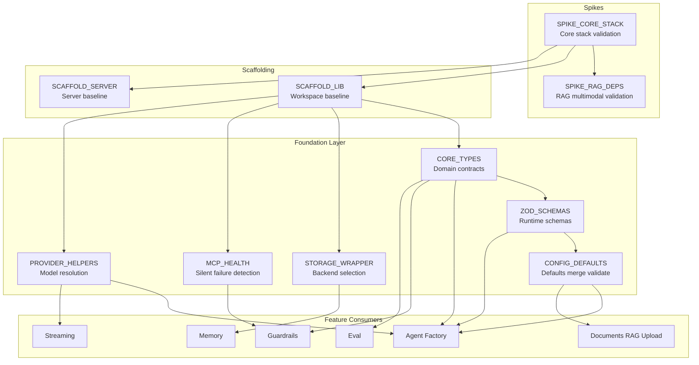

---

## Dependency Chain

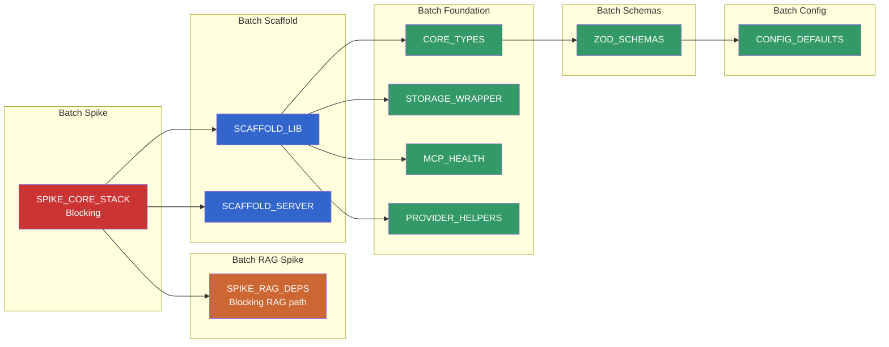

Execution constraints:

- Core stack spike is the highest-priority blocker.
- RAG dependency spike must pass before document/RAG path implementation.
- Library and server scaffolds run in parallel once spike gates pass.
- Core types gate schemas.
- Schemas gate config defaults.

---

## Model Configuration Constants

All LLM and embedding work uses one model family policy.
No model-specific branching in production logic.

| Constant | Value | Usage |
|---|---|---|
| PRIMARY_MODEL | Canonical flash-lite preview model | All LLM tasks |
| PRIMARY_PROVIDER | Model name string routed through AI SDK provider bridge | Agent model configuration |
| EMBEDDING_MODEL | Canonical embedding model | All embeddings |
| EMBEDDING_PROVIDER | Google text embedding provider initialized with embedding model name | Embedding calls |
| EMBEDDING_DIMS | 3072 | Vector dimensions |
| KEY_POOL_ENV | GOOGLE_API_KEY comma-separated | Key rotation pool |

Policy notes:

- One model policy applies across tasks.
- Grounding mode is a capability toggle, not a model branch.
- Terminal session model switching is development/testing only.
- thinkingLevel remains optional in agent creation factory configuration.
- Constants are not duplicated outside config source.
- Multi-key values rotate through round-robin pool logic.

---

## Thinking Levels

| Task | Level | Rationale |
|---|---|---|
| Default agent path | none | Model default behavior |
| Classifier | minimal | Fast routing |
| Summarization | minimal | Speed over depth |
| Fact extraction | low | Some reasoning needed |
| Grounding agent | none | Retrieval-focused |
| Intent validation | minimal | Fast classification |
| Query rewriting | low | Context reasoning |
| Evidence scoring | low | Sufficiency reasoning |

---

## Library and Server Responsibility Split

The library ships defaults and stable interfaces.
The server injects deployment-specific behavior.

### Library provides

- Agent factory and orchestration framework.
- Embedding router and cache logic.
- Guardrail pipeline and factories.
- Rewrite strategy modules.
- Source-priority execution engine.
- Evidence scoring gate.
- File registry with temporal and ordinal resolution.
- Streaming layer.
- Memory system.
- RAG infrastructure.
- Upload pipeline.
- Observability integration.
- Cache, rate limit, and circuit breaker primitives.
- Client SDK contracts.
- Terminal testing app.
- Typed error code system.
- Typed pipeline interfaces.

### Server provides

- Custom prompts.
- Intent configuration and topic/source policy.
- Guardrail detection rules.
- MCP server definitions.
- Error-message mapping for every typed error code.
- Evidence thresholds.
- File-not-found policy.
- Per-source empty-result policy.
- Rewrite strategy assignments.
- RAG credentials and dataset configuration.
- Auth secret and auth config.
- Deployment infrastructure configuration.

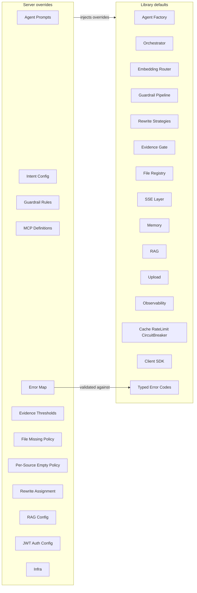

---

## Configuration Flow

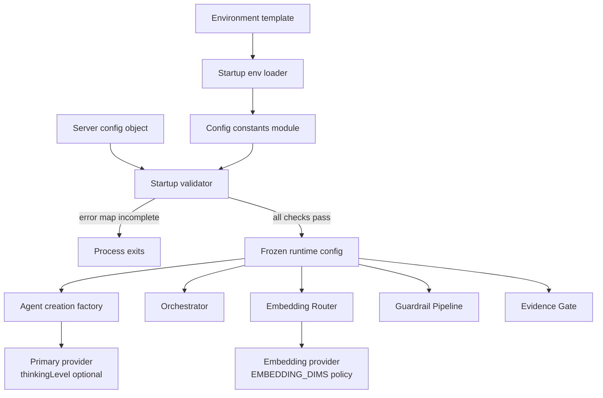

---

## Environment Variable Flow

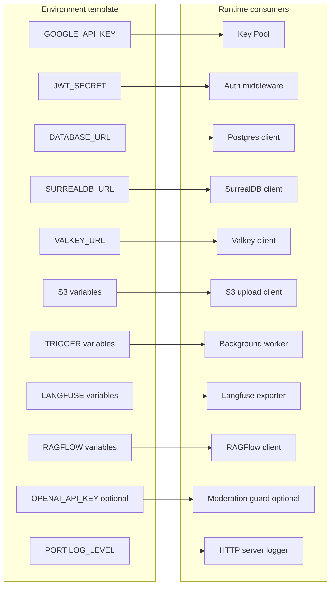

---

## Environment Variables Reference

| Variable | Required | Default | Notes |
|---|---|---|---|
| GOOGLE_API_KEY | No | none | Comma-separated pool. Server boots without it, but AI endpoints return unavailable responses. |
| OPENAI_API_KEY | No | none | Moderation guardrail only. |
| JWT_SECRET | Production yes | none | Missing in production refuses startup. Missing in non-production enables dev bypass path. |
| PORT | No | 3000 | Server port. |
| DATABASE_URL | Yes | none | Hard-required startup dependency. |
| SURREALDB_URL | No | none | Missing disables long-term memory only. |
| VALKEY_URL | No | none | Missing falls back to in-memory cache path. Uses redis URI scheme. |
| S3_ENDPOINT | No | none | Missing disables upload path. |
| S3_ACCESS_KEY | No | none | Required when endpoint is set. |
| S3_SECRET_KEY | No | none | Required when endpoint is set. |
| S3_BUCKET | No | none | Required when endpoint is set. |
| TRIGGER_DEV_API_URL | No | none | Missing runs jobs in-process. |
| TRIGGER_DEV_API_KEY | No | none | Required when worker API URL is set. |
| CORS_ALLOWED_ORIGINS | No | wildcard | Comma-separated origins. |
| LANGFUSE_PUBLIC_KEY | No | none | Observability key. |
| LANGFUSE_SECRET_KEY | No | none | Observability key. |
| LANGFUSE_BASE_URL | No | none | Observability endpoint. |
| RAGFLOW_BASE_URL | No | none | Missing disables RAGFlow source path. |
| RAGFLOW_API_KEY | No | none | Required with RAGFlow base URL. |
| RAGFLOW_DATASET_IDS | No | none | Required with RAGFlow base URL. |
| LOG_LEVEL | No | info | Runtime logging level. |

Auth hard-fail rule:

- Production environment mode with missing JWT_SECRET must refuse startup.
- This is a fail-closed security boundary, not a warning path.

---

## Core Type System

The core type system defines canonical contracts used across the system.
Type domains are pure contract definitions.
Runtime schema validation lives in Zod schemas.

```mermaid
flowchart TB
    subgraph AGENT_DOMAIN["Agent Domain"]
        SAFE_AGENT_CONFIG["SafeAgentConfig"]; AGENT_MODE["AgentMode"]; GROUNDING_MODE["GroundingMode"]; AGENT_RESPONSE["AgentResponse"]; STREAM_CHUNK["StreamChunk"]; PARALLEL_GROUNDING_RESULT["ParallelGroundingResult"]
    end
    subgraph GUARDRAIL_DOMAIN["Guardrail Domain"]
        GUARDRAIL_SEVERITY["GuardrailSeverity"]; GUARDRAIL_VERDICT["GuardrailVerdict"]; GUARDRAIL_FN["GuardrailFn"]; CONCEPT_CONFIG["ConceptConfig"]; CONCEPT_REGISTRY["ConceptRegistry"]; GUARDRAIL_PIPELINE_CONFIG["GuardrailPipelineConfig"]; GUARDRAIL_FLAG["GuardrailFlag"]; AGGREGATED_VERDICT["AggregatedVerdict"]; GUARD_MODE["GuardMode"]; LANGUAGE_GUARD_CONFIG["LanguageGuardConfig"]; HATE_SPEECH_GUARD_CONFIG["HateSpeechGuardConfig"]; INTENT_LANGUAGE_FIELDS["IntentLanguageFields"]
    end
    subgraph MCP_DOMAIN["MCP Domain"]
        MCP_SERVER_CONFIG["MCPServerConfig"]; MCP_CLIENT_CONFIG["MCPClientConfig"]
    end
    subgraph CONFIG_DOMAIN["Config Domain"]
        SAFE_AGENT_LIB_CONFIG["SafeAgentLibConfig"]; DEEP_PARTIAL["DeepPartial"]
    end
    subgraph STORAGE_DOMAIN["Storage Domain"]
        STORAGE_CONFIG["StorageConfig"]
    end
    subgraph MEMORY_DOMAIN["Memory Domain"]
        MEMORY_CONFIG["MemoryConfig"]
    end
    subgraph STREAM_DOMAIN["Stream Domain"]
        STREAM_CONFIG["StreamConfig"]; SSE_CONFIG["SSEConfig"]; STREAM_REQUEST_BODY["StreamRequestBody"]; SESSION_META_DELIVERY["SessionMetaDelivery"]
    end
    subgraph SSE_EVENTS_DOMAIN["SSE Events Domain"]
        SSE_TEXT_DELTA_EVENT["SSETextDeltaEvent"]; SSE_SESSION_META_EVENT["SSESessionMetaEvent"]; SSE_TRACE_STEP_EVENT["SSETraceStepEvent"]; SSE_CTA_EVENT["SSECTAEvent"]; SSE_CITATION_EVENT["SSECitationEvent"]; SSE_LOCATION_EVENT["SSELocationEvent"]; SSE_TRIPWIRE_EVENT["SSETripwireEvent"]; SSE_DONE_EVENT["SSEDoneEvent"]; SSE_ERROR_EVENT["SSEErrorEvent"]; TRACE_STEP_TYPE["TraceStepType"]; TRACE_STEP_DATA["TraceStepData"]
    end
    subgraph UPLOAD_DOMAIN["Upload Domain"]
        DIRECT_FILE_CONTEXT["DirectFileContext"]; UPLOAD_CONFIG["UploadConfig"]; UPLOAD_RESULT["UploadResult"]; FILE_RESULT["FileResult"]; BLOCKING_STAGE_CONFIG["BlockingStageConfig"]; DOCUMENT_PROCESSING_MODE["DocumentProcessingMode"]
    end
    subgraph DOCUMENTS_DOMAIN["Documents Domain"]
        PROCESSED_DOCUMENT["ProcessedDocument"]; PAGE_SPLIT["PageSplit"]; PAGE_SUMMARY_RESULT["PageSummaryResult"]; PAGE_SUMMARY["PageSummary"]; SUMMARIZATION_CONFIG["SummarizationConfig"]; IMAGE_DESCRIPTION["ImageDescription"]; EXTRACTED_RASTER_IMAGE["ExtractedRasterImage"]; PAGE_IMAGE["PageImage"]; IMAGE_EXTRACTION_RESULT["ImageExtractionResult"]
    end
    subgraph RAG_DOMAIN["RAG Domain"]
        HYBRID_RESULT["HybridResult"]; QUERY_TOOL_CONFIG["QueryToolConfig"]; CHUNK_CONFIG["ChunkConfig"]; RAG_RESULT["RAGResult"]; CITATION["Citation"]; DOCUMENT_ANSWER["DocumentAnswer"]
    end
    subgraph FILES_DOMAIN["Files Domain"]
        FILE_STORAGE["FileStorage"]; S3_CONFIG["S3Config"]; CLEANUP_DEPS["CleanupDeps"]; CLEANUP_RESULT["CleanupResult"]
    end
    subgraph EVAL_DOMAIN["Eval Domain"]
        EVAL_CONFIG["EvalConfig"]; SCORER_CONFIG["ScorerConfig"]; PROMPTFOO_CONFIG["PromptfooConfig"]
    end
    subgraph MODEL_DOMAIN["Model Domain"]
        MODEL_CONFIG["ModelConfig"]; FALLBACK_MODEL_CONFIG["FallbackModelConfig"]
    end
    subgraph LLM_DOMAIN["LLM Domain"]
        KEY_POOL_CONFIG["KeyPoolConfig"]; KEY_POOL["KeyPool"]
    end
    subgraph CACHE_DOMAIN["Cache Domain"]
        CACHE_CONFIG["CacheConfig"]; CACHE["Cache"]
    end
    subgraph LOCATION_DOMAIN["Location Domain"]
        LOCATION_TOOL_CONFIG["LocationToolConfig"]; GEOCODE_PROVIDER["GeocodeProvider"]; IMAGE_SEARCH_PROVIDER["ImageSearchProvider"]; IMAGE_RESULT["ImageResult"]; LOCATION_RESULT["LocationResult"]
    end
    subgraph QUEUE_DOMAIN["Queue Domain"]
        TASK_PAYLOAD["TaskPayload"]; BACKGROUND_STAGE_PAYLOAD["BackgroundStagePayload"]; BUDGET_AGGREGATION_PAYLOAD["BudgetAggregationPayload"]; CLEANUP_PAYLOAD["CleanupPayload"]; QUEUE_ADAPTER["QueueAdapter"]
    end
    subgraph BUDGET_DOMAIN["Budget Domain"]
        USAGE_EVENT["UsageEvent"]; BUDGET_CONFIG["BudgetConfig"]; BUDGET_CHECK_RESULT["BudgetCheckResult"]
    end
    SAFE_AGENT_CONFIG -.-> GUARD_MODE; SAFE_AGENT_CONFIG -.-> GUARDRAIL_PIPELINE_CONFIG; SAFE_AGENT_CONFIG -.-> MCP_CLIENT_CONFIG; SAFE_AGENT_CONFIG -.-> INTENT_LANGUAGE_FIELDS; SAFE_AGENT_CONFIG -.-> LOCATION_TOOL_CONFIG
    GUARDRAIL_PIPELINE_CONFIG -.-> GUARDRAIL_FN; GUARDRAIL_PIPELINE_CONFIG -.-> CONCEPT_REGISTRY; GUARDRAIL_PIPELINE_CONFIG -.-> GUARD_MODE; GUARDRAIL_PIPELINE_CONFIG -.-> LANGUAGE_GUARD_CONFIG; GUARDRAIL_PIPELINE_CONFIG -.-> HATE_SPEECH_GUARD_CONFIG
    MEMORY_CONFIG -.-> STORAGE_CONFIG; UPLOAD_CONFIG -.-> KEY_POOL
    LOCATION_TOOL_CONFIG -.-> GEOCODE_PROVIDER; LOCATION_TOOL_CONFIG -.-> IMAGE_SEARCH_PROVIDER; IMAGE_SEARCH_PROVIDER -.-> IMAGE_RESULT; LOCATION_RESULT -.-> IMAGE_RESULT
```

---

## Domain Type Contracts

Foundation contracts cover agent, guardrail, MCP, config, storage, memory, stream, SSE events (including trace-step events for pipeline visibility), upload, documents, RAG, files, eval, model, key-pool, cache, location, queue, budget, and memory-support types (temporal references, preference updates, memory control actions, interaction signals, and media facts).
SSE event types — including SSETraceStepEvent, TraceStepType, and TraceStepData — are defined in the core library and consumed by the client SDK module, React hooks module, and frontend component modules. TraceStepType is a discriminated union covering intent-detected, memory-recall, guardrail-input, guardrail-output, retrieval, tool-call-start, tool-call-end, context-budget, source-fetch, and rewrite steps. TraceStepData is a corresponding discriminated union where each step type carries step-specific payload fields plus a common `latencyMs` timing field. See [Streaming & Transport](./transport.md) for the full SSE event protocol.
GuardMode is canonical in guardrail contracts and resolves by precedence: pipeline override, then agent override, then development default.
RAG contracts include StructuredResultSet and ResultItem for persisted ranked outputs.
File contracts include FileRecord lifecycle metadata.
Eval contracts include SelfTestConfig and SelfTestResult.
Fact records include factType with values preference, attribute, derived, behavioral, and sentiment.
The error code system exports both a runtime-enumerable object and a compile-time union for startup message-map coverage validation.

---

## Memory and Extraction Safeguard Types

Memory behavior combines context assembly, extraction safeguards, and budget controls.

Memory configuration keys:

| Key | Default | Description |
|---|---|---|
| USER_SHORTTERM_LIMIT | 20 | Maximum cross-thread user messages loaded |
| USER_SHORTTERM_FADEOUT | 3 | Turn threshold after which user short-term injection stops |
| ROLLING_SUMMARY_MODEL | primary model | Model for incremental dropped-turn summarization |
| ROLLING_SUMMARY_MAX_TOKENS | 2048 | Max rolling summary token budget |
| THREAD_RESURRECTION_GAP | 604800 | Dormancy threshold before resurrection handling |
| CONTEXT_WINDOW_BUDGET | 120000 | Total assembled context budget |
| MAX_RECALL_TOKENS | 4096 | Long-term recall token cap |
| MAX_INPUT_MESSAGE_LENGTH | 32000 | Input message character cap |
| GIBBERISH_CONFIDENCE_THRESHOLD | 0.3 | Language detector confidence threshold |
| EXTRACTION_SAFEGUARDS_ENABLED | true | Enable extraction safeguards |
| RECENCY_BOOST_24H | 1.5 | Recall score multiplier within last day |
| RECENCY_BOOST_7D | 1.2 | Recall score multiplier within last week |
| RESULT_SET_TTL | 7 days | Structured result retention |
| MEMORY_INSPECTION_ENABLED | true | Enable memory inspect and delete tooling |
| INTERACTION_TTL | 30 days | Interaction signal retention |
| MEDIA_FACT_TTL | 30 days | Media fact retention |

Extraction safeguard types:

- FactAttribution captures self, third-party, or general targeting.
- FactCertainty captures stated, hypothetical, or asked certainty.
- ExtractionSafeguardConfig enables sarcasm, attribution, hypothetical, and hallucination prevention controls.
- ContextBudgetConfig defines context, recall, and summary budgets.
- ThreadResurrectionConfig defines inactivity threshold and rehydration behavior.

Memory context layers:

- ThreadShortTermContext includes thread identity, last turns, rolling summary text.
- UserShortTermContext includes user identity, cross-thread messages, and active flag.
- CombinedMemoryContext merges thread short-term, optional user short-term, and long-term recall.

Memory deep-dive is in [Memory & Intelligence](./memory.md).

---

## Zod Schemas

Schema layer mirrors type layer and enforces runtime validity.

Zod schema rules:

- Zod v4 namespace import pattern is required.
- One-argument record form is not used.
- deepPartial helper is not used; optionality is explicit.
- Function fields and provider instances use broad schema acceptance plus runtime guards.

Key schemas:

- SafeAgentConfigSchema.
- GuardrailSeveritySchema.
- GuardrailVerdictSchema.
- ConceptRegistrySchema.
- GuardrailPipelineConfigSchema.
- MCPServerConfigSchema.
- StorageConfigSchema.
- MemoryConfigSchema.
- ModelConfigSchema.
- EvalConfigSchema.
- SSETraceStepEventSchema (discriminated by step field, used by the client SDK module for runtime event parsing).
- VerbosityLevelSchema (standard or full, used by server route to configure stream handler).

Validation helpers:

- parseConfig validates and returns typed config.
- validateConfig safe-validates and returns structured result.
- Schema defaults populate omitted fields where configured.
- Schema inference aligns schema output with type contracts.

---

## Configuration System

Configuration system flow is defaults, merge, validate.

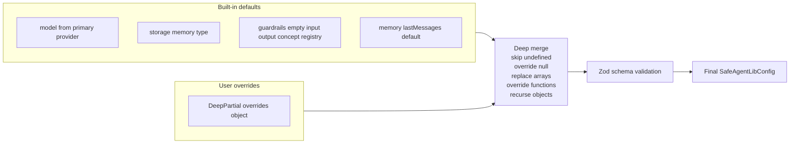

Configuration responsibilities:

- Configuration builder merges and validates.
- Agent definition helper merges per-agent overrides over library defaults.
- Invalid config returns descriptive validation errors.
- No hardcoded deployment prompt policy inside library defaults.
- Library ships no built-in concept registry contents.

Environment contract handling:

- Typed environment object uses @t3-oss/env-core with Zod v4 schemas.
- Library owns defaults and shared contracts.
- Server owns deployment-required runtime checks.

---

## Multi-Tenant Configuration Hierarchy

The configuration hierarchy expands from three levels to five levels for high-scale multi-tenant operation while preserving the existing deep-merge model defined earlier in this document.

Resolution chain and precedence:

- Global library defaults.
- Organization defaults.
- Tenant overrides.
- Agent overrides.
- Request-scoped overrides as highest precedence.

Each level applies the same merge semantics already defined in this foundation layer.

Organization layer:

- Organizations group tenants under a shared policy surface.
- Organization defaults define shared model preferences, guardrail policy baselines, and budget ceilings.
- Organization configuration inherits from global defaults and can be refined by tenant configuration.

Tenant layer:

- Tenants represent isolated consumer environments within an organization.
- Tenant configuration may override model selection, guardrail strictness, memory retention policy, tool availability, budget limits, and rate-limit quotas.

Tenant isolation invariant:

- Tenant boundary isolation is mandatory and enforced during resolution.
- No tenant configuration may leak into another tenant.
- No cross-tenant inheritance is allowed outside the shared organization layer.
- This invariant is a security boundary.

Request-scoped overrides:

- The existing request-scoped override mechanism remains the final precedence layer.
- Per-request behavior tuning is supported without mutating organization or tenant policy.

Backward compatibility:

- Single-tenant deployments that omit organization and tenant layers behave exactly like the current three-level flow.
- Organization and tenant layers are opt-in and default to empty pass-through behavior.

Config validation and runtime resolution:

- Each level validates independently against Zod v4 schemas.
- Invalid input at any level is rejected with descriptive errors that identify level and field.
- Organization and tenant identifiers are read from authenticated request context claims.
- The resolver selects the correct organization and tenant layers before merge.

Merge order:

- Merge applies left to right through the full five-level chain using the same deep-merge semantics already defined in the Configuration System section of this document.

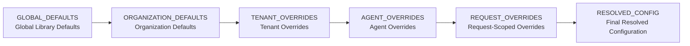

---

## Storage Factory

Storage factory chooses backend by explicit config or environment auto-detection.

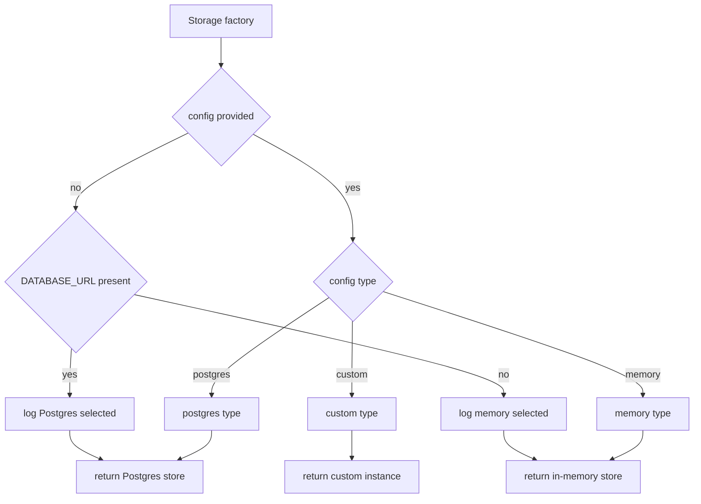

Factory guarantees:

- Explicit config always wins over auto-detection.
- Postgres branch returns a Drizzle-backed store using type-safe query construction only.
- Memory branch returns in-memory development store.
- Custom branch returns user-supplied storage implementation.
- Auto-detection uses database URL presence.
- Selection path is logged.
- Storage implementations that target SurrealDB use surqlize typed APIs; raw query strings are excluded by design.

---

## MCP Health Check

MCP tooling can fail silently when server connections fail.
Health wrapper detects configured-versus-observed mismatch.

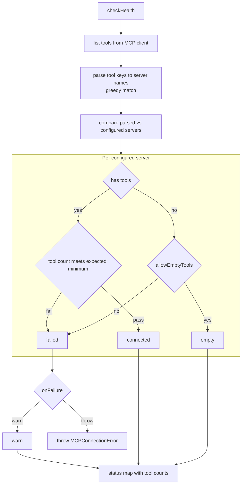

Health statuses:

- connected: tool presence and threshold pass.
- empty: zero tools but explicitly allowed.
- failed: expected tools missing.
- unknown: no check attempt yet.

Additional behavior:

- Tool key mapping uses underscore-prefix ownership.
- Names with underscores use greedy matching to avoid ambiguity.
- Periodic health checks are supported.
- Wrapper augments MCP client and avoids duplicate client creation.

---

## Provider Resolution

Provider helper contracts:

- resolveModel accepts string identifiers and resolves provider path.
- resolveModel accepts direct provider model instances as passthrough.
- resolveModel accepts factory functions as passthrough.

Fallback helper contracts:

- Fallback model helper wraps the primary model with an ordered fallback chain.
- Stream and generate paths both use fallback middleware.
- onFallback callback can be invoked when fallback is used.

Provider export policy:

- Primary provider factory is re-exported.
- Other provider factories are not re-exported by default.
- Load-balancing and circuit-breaker concerns are separate modules.

---

## Structured Output Guarantees

Beyond Zod v4 validation, foundation contracts require provider-level structured output guarantees so typed output remains reliable across heterogeneous inference backends.

Three-tier guarantee model:

- Tier 1 - Provider-enforced: providers with constrained decoding and grammar-based token masking produce fully schema-compliant output, and the framework must pass the Zod v4 schema into the provider structured output mode.
- Tier 2 - Validated retry: providers without native constrained decoding receive schema-constrained instructions, then output is validated with Zod v4 and automatically retried on validation failure with the validation error included in the retry context.
- Tier 3 - Plugin-extended: self-hosted inference engines can register a constrained decoding plugin for token-level grammar enforcement, including engines that expose capabilities such as XGrammar or Outlines.

Automatic tier selection:

- The framework shall detect available provider capability at runtime and select the strongest guarantee tier without consumer configuration.

Schema passthrough:

- Zod v4 schemas are automatically translated into provider-native structured output definitions.
- OpenAI receives JSON Schema form.
- Anthropic receives tool-definition form.

Retry budget and failure contract:

- Validated retry mode uses a configurable maximum retry count with exponential backoff.
- If retries are exhausted without valid structured output, the framework returns raw provider output plus a structured error payload rather than failing silently.

Streaming compatibility and schema depth:

- Structured output must remain compatible with streaming responses.
- Partial JSON fragments are buffered until a complete valid object is available.
- Deeply nested Zod v4 schemas, unions, discriminated unions, and recursive types must all be supported.

Constrained decoding plugin interface:

- Self-hosted providers can register a plugin that intercepts token generation and enforces grammar constraints during decoding.

Reference:

- OpenAI Structured Outputs: https://platform.openai.com/docs/guides/structured-outputs

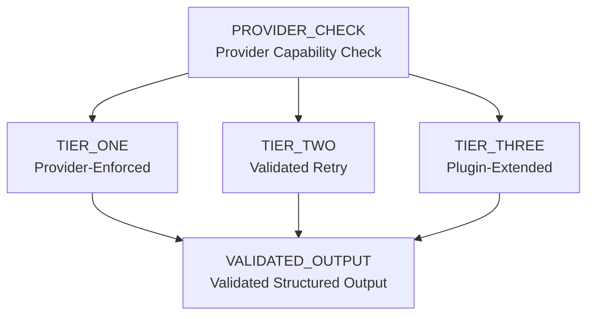

---

## Guardrail Safety Dependencies

| Dependency | Purpose | License | Runtime fit |
|---|---|---|---|
| eld | Language detection | MIT | Synchronous runtime-safe behavior |
| obscenity | Evasion-resistant profanity and hate checks | MIT | Real-time moderation |
| atoad profanity package | Multilingual dictionaries | MIT | Multilingual moderation support |
| naughty words dictionaries | Supplemental multilingual coverage | Attribution-required | Supplemental language dictionaries |

These dependencies are validated in spikes and consumed through guardrail factory configuration.

---

## Foundation Dependency Graph

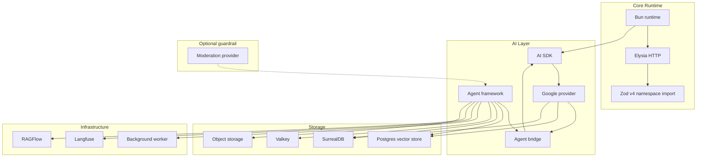

---

## Dependency Policy

- Dependencies are installed at latest selection.
- Zod uses namespace import style under Zod v4.
- Runtime is Bun-only for library and server code.
- Prompt evaluation tooling runs externally.
- AI SDK docs are canonical for model/provider/object/embed behavior.
- Agent framework docs are canonical for orchestration, streaming, handoff, and guardrail patterns.
- Runtime docs are canonical for runtime behavior.

---

## Core Stack Validation Spike

The core stack spike is a temporary harness preserved as a regression reference.
It validates assumptions before production modules are built.

### Agent core validations

| Validation | What is checked | Critical |
|---|---|---|
| Agent factory creation | Agent identity fields, system prompt, provider bridge wiring | Yes |
| Primary model path | Primary provider path works for factory | Yes |
| Stream event iteration | Async stream emits expected event families | Yes |
| Guardrail tripwire exceptions | Input and output tripwire behavior | Yes |
| MCP tool listing | Underscore namespacing convention | Yes |
| Grounding metadata | Grounding path returns metadata | No |
| Memory thread isolation | Concurrent runs isolate history by thread | Yes |
| requestContext propagation | User identity is available in completion and tool execution contexts | Yes |
| Concurrent stream state isolation | Independent stream state per run | Yes |
| Trace identity behavior | Stream result trace identity path unavailable; server-generated trace identity delivered in first session metadata event | Yes |
| Usage shape | prompt, completion, total token fields | Yes |

### Stream and guard validations

| Validation | What is checked | Critical |
|---|---|---|
| Event shape capture | Raw model, run item, and agent updated events captured | Yes |
| Input tripwire | Triggered input guardrail throws expected exception | Yes |
| Output tripwire | Triggered output guardrail throws expected exception | Yes |
| Handoff event | Agent updated event on transfer path | Yes |
| Async abort edge | Abort after final delta behavior documented | Yes |
| Tool-call suppression | Filtering selected tool call events | No |

### Framework and SDK validations

| Validation | What is checked | Critical |
|---|---|---|
| Stream path integration | Stream events route directly through SSE generator path | Yes |
| Historical import compatibility note | Historical root and subpath forms documented | Yes |
| Zod v4 compatibility | Namespace import and two-argument record behavior | Yes |
| AI SDK compatibility | Baseline compatibility and test model importability | No |
| Terminal render baseline | Minimal render without crash | No |
| Prompt evaluation compatibility | Evaluation runner behavior | No |
| Custom scorer importability | Scorer module execution | No |
| Direct SDK coexistence | Direct provider SDK can coexist with abstraction layer | No |

### Server and route validations

| Validation | What is checked | Critical |
|---|---|---|
| Historical HTTP integration note | Historical finding retained after runtime migration | No |
| Lifecycle hook composition | Request hooks for auth/context propagation | Yes |
| CORS preflight bypass | Preflight returns expected no-content with CORS headers | Yes |

### External service validations

| Validation | What is checked | Critical |
|---|---|---|
| SurrealDB WebSocket path | Connect auth CRUD | Yes |
| Surreal graph relations | RELATE and multi-hop traversal | Yes |
| Surreal vector search | Cosine similarity sequential scan behavior | Yes |
| Surreal embedded path | Embedded protocol local test path | Yes |
| Embedded MTREE limitation finding | Sequential scan sufficiency at per-user memory scale | Yes |
| SQL-backed memory store | Conversation store integration | Yes |
| Embedding model dimensions | Embedding output dimension correctness | Yes |
| Langfuse API method check | Feedback scoring method availability | No |
| Worker SDK compatibility | Imports and task definition under runtime | No |
| Valkey operations | Atomic counter and transaction operations | No |
| ORM adapter behavior | SQL adapter compatibility | Yes |
| Typed Surreal integration | Typed schema and relation query behavior | Yes |
| Typed environment core | Env object creation and startup validation | No |
| Result wrapper utility | Error-handling utility behavior | No |
| Structured logger utility | Logger categories and JSON sink setup | No |
| SQL adapter initialization validation | Schema initialization path validation | Yes |
| Open API re-spike requirement | Zod v4 schema mapping and OpenAPI endpoint behavior | Yes |
| Language detector package | Runtime compatibility | Yes |
| Evasion-resistant moderation package | Runtime compatibility | Yes |
| Multilingual profanity package | Runtime compatibility | Yes |
| Supplemental dictionaries | Import compatibility and attribution requirement | Yes |

Spike constraints and outcomes:

- No framework generator dependence.
- No production reliance on embedded local SQL runtime.
- No mixed grounding-search and custom function tools in same call path.
- Use supported terminal key handling path.
- Critical failures block subsequent batches.
- Non-critical failures revise affected task plans without blocking unrelated tasks.

---

## RAG and Multimodal Dependency Spike

This spike validates document-processing and retrieval assumptions before core implementation.

| Validation | What is checked |
|---|---|
| PDF page slicing | Multi-page split to valid single-page outputs and byte-stable base64 round-trip |
| Multimodal summarization | Structured page summary with image descriptions and vector chart indicator |
| Base64 text acceptance | File data accepts base64 text flow |
| Concurrency limiter | Limited parallelism behaves as expected |
| Per-page object storage upload | Upload/download byte identity and signed URL generation |
| Office conversion | Headless office conversion to valid PDF |
| Per-page text extraction | Page text array extraction output |
| Image resize path | Read resize and buffer path under runtime |
| Text chunking | Max-size and overlap chunk behavior |
| Hybrid retrieval schema and query | Vector plus text-search schema with reciprocal-rank-fusion query and thread isolation |
| Vector path for text RAG | Vector extension, table/index creation and thread filtering behavior |
| Batch embeddings | Correct-dimension vectors in batch mode |
| Object storage client behavior | Upload download delete list prefix operations and fallback note |
| Raster extraction | PDF raster extraction path |
| Vector chart render path | Rendering path with documented fallback |

RAG spike constraints:

- Do not rely on retrieval filter behavior for production access control.
- Do not use unsupported document conversion approach.
- Do not use unsupported image API form.
- Do not use unsupported image library substitution.
- Do not use conflicting test database port.
- Do not use unrelated wrapper abstraction for document search schema.

---

## Repository Foundation
Library scaffold defines three package roles (core library, terminal testing client, external client SDK placeholder) with strict typing, quality gates, typed environment schema baseline, seed capabilities, and stable placeholder exports for parallel development.
Server scaffold defines a linked runtime shell with health-check baseline and early environment contract boundaries for auth, jobs, cache, and provider integration.

---

## Subpath Barrel Export Convention
Every multi-task module must maintain its own subpath barrel exports as part of each task deliverable.
Barrel updates are not deferred.

| Module group | Contributing tasks |
|---|---|
| MCP | MCP_HEALTH, MCP_CLIENT |
| Memory | SHORT_TERM_MEM, SURREALDB_CLIENT |
| Guardrails | INPUT_GUARD, OUTPUT_GUARD, GUARD_FACTORY, GUARD_PIPELINE, LANG_GUARD, HATE_SPEECH_GUARD, ZERO_LEAK_GUARD |
| RAG | RAG_INFRA |
| Upload | UPLOAD_PIPELINE |
| Files | FILE_STORAGE, FILE_REGISTRY |
| Documents | DOC_PIPELINE |
| DB | FILE_STORAGE, COST_TRACKING |
| LLM | KEY_POOL |
| Observability | LANGFUSE_MODULE, CUSTOM_SPANS |
| Cache | VALKEY_CACHE |
| Trigger | TRIGGER_TASKS |
| Location | LOCATION_TOOL |

Any new public function, type, or class in a module group updates that module group barrel immediately. Top-level barrel assembly only aggregates subpath barrels.

---

## Task Specifications
The foundation layer task specifications remain authoritative.

| Task | Scope | Depends on | Core acceptance |
|---|---|---|---|
| SPIKE_CORE_STACK | Validate runtime stack, stream behavior, guardrails, route lifecycle, dependencies, service compatibility | None | Full spike suite pass, critical validations green, findings documented |
| SPIKE_RAG_DEPS | Validate document split, multimodal summary, extraction, hybrid retrieval, object storage, rendering | SPIKE_CORE_STACK | Full RAG spike suite pass, findings documented |
| SCAFFOLD_LIB | Create workspace baseline, core package, terminal package, SDK placeholder, strict tooling, env schema, module skeleton | SPIKE_CORE_STACK | Install success, type-check success, baseline tests clean, seed idempotent |
| SCAFFOLD_SERVER | Server scaffold baseline and health shell | SPIKE_CORE_STACK | Canonical server task behavior aligns with server plan |
| CORE_TYPES | Define all domain contracts and runtime-enumerable typed error code set | SCAFFOLD_LIB | Type-check pass, barrel import pass, DeepPartial behavior validated |
| ZOD_SCHEMAS | Build schema layer mirroring core types with Zod v4 | CORE_TYPES | Schema tests pass, defaults apply, invalid config errors are descriptive |
| CONFIG_DEFAULTS | Build configuration merge and validation capabilities for library defaults and per-agent overrides | CORE_TYPES and ZOD_SCHEMAS | Default configuration is valid with no overrides, and nested override behavior is correct and predictable |
| STORAGE_WRAPPER | Build postgres/memory/custom factory with auto-detection | SCAFFOLD_LIB | Explicit and auto-detected selection paths validated |
| MCP_HEALTH | Build MCP silent-failure detection wrapper | SCAFFOLD_LIB | Missing tools detected, throw and warn modes validated |
| PROVIDER_HELPERS | Build model resolver and fallback middleware helpers | SCAFFOLD_LIB | String resolution, passthrough, fallback activation validated |
| BARREL_EXPORTS | Aggregate top-level exports from subpath barrels | Foundation and downstream public modules | Public surface complete, no private leaks, no circular warnings |

Task QA coverage includes streaming lifecycle, guardrail tripwires, MCP namespaced tool detection, grounding and session metadata delivery, storage fallback and explicit selection, model fallback behavior, schema defaults and error messaging, hybrid retrieval ranking with thread isolation, object storage round-trip, and workspace baseline integrity.

All database-oriented task acceptance in this foundation layer assumes type-safe data access only: Drizzle for PostgreSQL paths and surqlize for SurrealDB paths, with raw query strings treated as plan violations.

---

## Cross-References
- Requirements and guardrails context: [Requirements & Constraints](./requirements.md)
- System layout context: [System Architecture](./architecture.md)
- Conversation pipeline consumers: [Conversation Pipeline](./conversation.md)
- Memory architecture consumers: [Memory & Intelligence](./memory.md)
- SSE event protocol and trace-step events: [Streaming & Transport](./transport.md)
- Frontend SDK consuming foundation types: [Frontend SDK](./frontend-sdk.md)
---

## Test Specifications

Foundation tests are primarily unit tests validating configuration, types, schemas, and shared utilities.

**Configuration system**:

- Deep merge behavior: skip undefined values, override null values, replace arrays, override functions, recurse objects.
- Configuration validation: invalid configs return descriptive validation errors through Zod schema reporting.
- Configuration builder: merges per-agent overrides over library defaults correctly.
- Frozen runtime config: config object is immutable after validation.
- No hardcoded deployment prompts: library defaults contain no business-specific prompt content.
- No built-in concept registry: library ships empty concept registry.

**Zod v4 schema validation**:

- All domain schemas accept valid input matching their type contracts.
- All domain schemas reject invalid input with descriptive error paths.
- Discriminated unions (TraceStepType, SSEEvent types) correctly discriminate on their tag field.
- VerbosityLevel schema accepts exactly "standard" and "full".
- GuardMode resolution: pipeline override wins over agent override wins over development default.

**Storage factory**:

- Explicit config always wins over auto-detection.
- Postgres branch returns Drizzle-backed store.
- Memory branch returns in-memory development store.
- Custom branch returns user-supplied implementation.
- Auto-detection uses database URL presence.
- Selection path is logged for debugging.
- SurrealDB storage uses surqlize typed APIs with no raw query strings.
- Retrieval-source disablement: unavailable retrieval dependencies disable that source path without disabling unrelated sources.

**MCP health check**:

- Tool key parsing extracts server names using underscore-prefix ownership with greedy matching.
- Per-server status: matching tools yield connected, zero tools with explicit empty-tool allowance yield empty, and missing tools yield failed.
- Failure callback is invoked with warn or throw behavior.
- Periodic health check scheduling functions correctly.
- No duplicate client creation when wrapper augments existing client.
- Initial status is unknown before the first check attempt.
- Connected status enforces configured minimum tool-count expectations.

**Provider resolution**:

- String identifiers resolve to correct provider path.
- Direct provider model instances pass through unchanged.
- Factory functions pass through unchanged.
- Fallback model wraps primary with ordered fallback chain.
- Fallback callback is invoked when fallback is used.
- Both stream and generate paths use fallback middleware.

**Environment validation**:

- GOOGLE_API_KEY: comma-separated pool parsed into individual keys.
- JWT_SECRET: missing in production refuses startup, missing in development enables bypass.
- DATABASE_URL: hard-required, missing causes startup failure.
- SURREALDB_URL: missing disables long-term memory only.
- VALKEY_URL: missing falls back to in-memory cache.
- S3_ENDPOINT: missing disables upload path.
- TRIGGER_DEV_API_URL: missing runs jobs in-process.
- LANGFUSE variables: missing disables observability.
- Primary provider credentials missing: LLM-dependent features are disabled with explicit degraded behavior.
- Object-storage credentials missing: upload features are disabled while non-upload flows remain available.

**Numeric configuration constants**:

- All thresholds (USER_SHORTTERM_LIMIT, USER_SHORTTERM_FADEOUT, ROLLING_SUMMARY_MAX_TOKENS, CONTEXT_WINDOW_BUDGET, MAX_RECALL_TOKENS, MAX_INPUT_MESSAGE_LENGTH, GIBBERISH_CONFIDENCE_THRESHOLD, RECENCY_BOOST values, TTL values) applied correctly at boundary values.

**Environment variable contracts — presence, absence, and coupled requirements**:

- Missing primary provider key still allows server startup while model-dependent endpoints return explicit unavailable responses.
- Comma-separated primary key pools trim whitespace, ignore empty segments, and preserve deterministic rotation order.
- Single key and multi-key pool forms produce equivalent behavior for non-rotation paths.
- Missing moderation provider key disables moderation-only guardrail paths without disabling unrelated safety checks.
- Missing auth secret blocks startup in production mode and never downgrades to warning-only behavior.
- Missing auth secret in non-production enables documented development bypass path and logs clear security posture.
- Missing database connection string fails startup as hard-required dependency.
- Missing long-term memory database URL disables only long-term memory features while short-term memory continues.
- Missing cache URL activates in-memory cache fallback without blocking startup.
- Cache URL rejects non-redis URI scheme inputs at validation time.
- Missing object-storage endpoint disables upload paths while non-upload chat paths remain available.
- Object-storage access key is required whenever object-storage endpoint is configured.
- Object-storage secret key is required whenever object-storage endpoint is configured.
- Object-storage bucket is required whenever object-storage endpoint is configured.
- Missing background worker URL keeps jobs in-process.
- Worker API key is required whenever worker URL is configured.
- Comma-separated CORS origins parse into a normalized origin allowlist, and empty input falls back to wildcard policy.
- Missing observability credentials disable exporter integration while core request handling remains healthy.
- Missing retrieval base URL disables external retrieval source only.
- Retrieval API key and dataset identifiers are both required when retrieval base URL is present.
- Runtime port defaults to 3000 when unset.
- Runtime log level defaults to info when unset.

**Model constants and policy enforcement**:

- Primary model constant is used as canonical model across classification, rewrite, extraction, and synthesis workloads.
- Embedding constant enforces one canonical embedding model across all embedding generation paths.
- Embedding dimension constant is fixed at 3072 and mismatched vector lengths are rejected.
- Primary provider constant routes through provider bridge configuration for all agent creation paths.
- Key-pool environment constant points to comma-separated primary keys and is not redefined in downstream modules.
- One-model policy blocks production logic from branching by model family.
- Grounding mode is treated as capability toggle and never as model switch.
- Terminal-only model switching is allowed in development/testing and excluded from deployment behavior.
- Thinking level stays optional in agent-creation configuration and can be omitted without validation failure.
- Constants are sourced once and reused, preventing duplicated divergent definitions.
- Key pool rotation is round-robin and deterministic across repeated calls.

**Thinking-level assignments**:

- Default agent path assigns no explicit thinking level.
- Classifier path assigns minimal thinking level.
- Summarization path assigns minimal thinking level.
- Fact extraction path assigns low thinking level.
- Grounding agent path assigns no explicit thinking level.
- Intent validation path assigns minimal thinking level.
- Query rewriting path assigns low thinking level.
- Evidence scoring path assigns low thinking level.

**Core type-system coverage**:

- Agent-domain contracts validate required and optional fields for configuration, mode, response, stream chunks, and parallel grounding results.
- Guardrail-domain contracts validate severity, verdicts, function interfaces, concept registries, pipeline config, flags, aggregate verdicts, and guard mode behavior.
- MCP-domain contracts validate server and client configuration shapes.
- Configuration-domain contracts validate library config and deep-partial override compatibility.
- Storage-domain contracts validate storage config across memory, postgres, and custom branches.
- Memory-domain contracts validate memory config structure and default-injection compatibility.
- Stream-domain contracts validate stream config, SSE config, request body contracts, and session-meta delivery options.
- SSE event-domain contracts validate text-delta, session-meta, trace-step, CTA, citation, location, tripwire, done, and error event shapes.
- Upload-domain contracts validate direct file context, upload config, upload result, file result, blocking-stage config, and processing-mode values.
- Documents-domain contracts validate processed documents, page splits, summaries, image descriptions, raster extraction, and page image outputs.
- Retrieval-domain contracts validate hybrid result structures, query-tool config, chunk config, retrieval result, citation shape, and document answer shape.
- Files-domain contracts validate storage config, object-storage config, cleanup dependencies, and cleanup results.
- Eval-domain contracts validate eval config, scorer config, and evaluation-runner config.
- Model-domain contracts validate model config and fallback model config shapes.
- Key-pool-domain contracts validate key-pool config and runtime pool interfaces.
- Cache-domain contracts validate cache config and cache interface contracts.
- Location-domain contracts validate tool config, geocode provider interfaces, image-search interfaces, image results, and location results.
- Queue-domain contracts validate task payload, background payloads, budget aggregation payloads, cleanup payloads, and queue adapter interfaces.
- Budget-domain contracts validate usage events, budget config, and budget-check result contracts.
- Memory-support contracts validate temporal references, preference updates, control actions, interaction signals, media facts, fact types, and structured result records.
- Trace-step discriminated unions validate all documented step categories with step-specific payload shape plus common latency timing.
- Runtime-enumerable error-code object and compile-time union remain aligned for message-map coverage checks.

**Memory defaults and safeguard typing**:

- User short-term limit default enforces cap of 20 cross-thread user messages.
- User short-term fadeout default stops injection after three turns in active thread.
- Rolling summary model default points to canonical primary model.
- Rolling summary token cap default enforces 2048-token upper bound.
- Thread resurrection gap default enforces 604800-second inactivity threshold.
- Context window budget default enforces 120000-token total assembly budget.
- Long-term recall cap default enforces 4096-token recall ceiling.
- Input message length default enforces 32000-character maximum.
- Gibberish confidence threshold default is 0.3 for low-confidence language handling.
- Extraction safeguards default to enabled.
- Recency boost defaults apply 1.5 multiplier inside 24 hours and 1.2 inside seven days.
- Structured result retention default enforces seven-day lifespan.
- Memory inspection tooling defaults to enabled.
- Interaction signal retention default enforces 30-day lifespan.
- Media fact retention default enforces 30-day lifespan.
- Fact attribution typing permits only self, third-party, or general targets.
- Fact certainty typing permits only stated, hypothetical, or asked certainty.
- Extraction safeguard typing includes sarcasm, attribution, hypothetical, and hallucination-prevention switches.
- Context budget typing includes total context, recall, and summary budget controls.
- Thread resurrection typing includes inactivity threshold and rehydration behavior controls.
- Combined memory context typing requires thread short-term layer, optional user short-term layer, and long-term recall layer.

**Schema rules and runtime validation**:

- Zod v4 namespace import pattern is enforced consistently.
- One-argument record form is rejected in schema definitions.
- Optionality is explicit and never delegated to deep-partial helpers.
- Function and provider-instance fields use broad schema acceptance with additional runtime guarding.
- Safe agent configuration schema matches canonical agent contract shape.
- Guardrail severity and verdict schemas enforce supported value sets.
- Concept registry and guardrail pipeline schemas enforce complete nested structures.
- MCP server schema validates required fields and optional settings.
- Storage schema validates explicit backend selection contracts.
- Memory schema validates all memory configuration keys and default behavior.
- Model schema validates primary and fallback model configuration objects.
- Evaluation schema validates scorer and evaluator configuration.
- Trace-step event schema discriminates by step field and validates step-specific payloads.
- Verbosity schema accepts only standard and full values.
- Validation helper behavior returns typed output on pass and structured error data on failure.
- Schema defaults populate omitted fields only where defaults are explicitly defined.
- Inferred schema output types remain aligned with declared domain contracts.

**Configuration merge and ownership boundaries**:

- Built-in defaults plus user overrides always follow merge-then-validate flow.
- Undefined override values are ignored and do not erase defaults.
- Null override values replace defaults intentionally.
- Array overrides replace, rather than merge, prior arrays.
- Function overrides replace prior handlers directly.
- Nested object overrides recurse by key while preserving untouched siblings.
- Invalid merged config returns descriptive, field-specific validation feedback.
- Library remains owner of defaults and shared contracts.
- Server remains owner of deployment-required runtime checks.

**Storage factory behavior**:

- Explicit backend configuration takes precedence over environment auto-detection in every branch.
- Explicit postgres selection returns typed postgres-backed storage.
- Explicit memory selection returns in-memory storage.
- Explicit custom selection returns caller-provided implementation unchanged.
- No explicit config with database URL present auto-selects postgres.
- No explicit config and no database URL auto-selects in-memory storage.
- Backend selection emits clear log records describing chosen path.
- Postgres access uses typed ORM query construction only.
- SurrealDB-oriented implementations use typed query APIs only.
- Raw query-string paths are treated as validation failures for database access policy.

**MCP health-check and registration behavior**:

- Health check lists observed tools and compares them against configured server set.
- Tool keys map to server ownership through underscore-prefixed namespace parsing.
- Names containing underscores use greedy ownership matching to avoid ambiguous mapping.
- Connected status requires tool presence and configured minimum count threshold satisfaction.
- Empty status requires zero tools with explicit empty-tools allowance.
- Failed status is assigned when expected tools are absent or minimum counts are unmet.
- Unknown status persists until first health-check execution.
- Warn-on-failure mode records warning and returns status map.
- Throw-on-failure mode raises typed connection error and aborts flow.
- Periodic checks run on configured cadence and update status transitions.
- Wrapper augments existing client behavior without creating duplicate clients.

**Provider resolution and fallback contracts**:

- Provider resolution accepts model identifiers as strings and resolves provider path.
- Provider resolution accepts direct model instances as pass-through values.
- Provider resolution accepts model-factory inputs as pass-through values.
- Fallback wrapper applies ordered chain after primary failure.
- Stream generation path uses fallback middleware.
- Non-stream generation path uses fallback middleware.
- Fallback callback emits once when fallback provider is actually used.
- Primary provider success does not trigger fallback provider calls.
- Primary and fallback failure path surfaces original primary error context.

**Subpath barrel export compliance**:

- MCP module-group barrel includes all MCP health and client exports.
- Memory module-group barrel includes short-term memory and long-term memory client exports.
- Guardrails module-group barrel includes input, output, factory, pipeline, language, hate-speech, and zero-leak exports.
- Retrieval module-group barrel includes retrieval infrastructure exports.
- Upload module-group barrel includes upload pipeline exports.
- Files module-group barrel includes storage and registry exports.
- Documents module-group barrel includes document pipeline exports.
- Database module-group barrel includes file-storage and cost-tracking exports.
- LLM module-group barrel includes key-pool exports.
- Observability module-group barrel includes tracing and custom span exports.
- Cache module-group barrel includes cache implementation exports.
- Trigger module-group barrel includes background task exports.
- Location module-group barrel includes location-tool exports.
- Any new public function, type, or class updates its module-group barrel in the same change.
- Top-level barrel aggregates subpath barrels only and does not bypass module-group ownership.

**Environment variable contracts — full foundation matrix**:

- GOOGLE_API_KEY accepts comma-separated key pools for rotation.
- GOOGLE_API_KEY allows startup when absent, while model-dependent endpoints return explicit unavailable behavior.
- OPENAI_API_KEY is treated as moderation-only credential and does not gate unrelated request paths.
- Missing OPENAI_API_KEY disables moderation guardrail path while keeping other guardrails active.
- JWT_SECRET is mandatory in production mode and startup is refused when missing.
- JWT_SECRET missing in non-production mode enables documented development bypass behavior.
- PORT defaults to 3000 when unset.
- DATABASE_URL is hard-required and startup is refused when missing.
- SURREALDB_URL missing disables long-term memory features only.
- VALKEY_URL missing activates in-memory cache fallback without blocking startup.
- VALKEY_URL validation accepts redis URI scheme inputs for remote cache configuration.
- S3_ENDPOINT missing disables upload behavior while non-upload flows remain available.
- S3_ACCESS_KEY is required whenever S3_ENDPOINT is configured.
- S3_SECRET_KEY is required whenever S3_ENDPOINT is configured.
- S3_BUCKET is required whenever S3_ENDPOINT is configured.
- TRIGGER_DEV_API_URL missing keeps background job execution in-process.
- TRIGGER_DEV_API_KEY is required whenever TRIGGER_DEV_API_URL is configured.
- CORS_ALLOWED_ORIGINS defaults to wildcard behavior when unset.
- CORS_ALLOWED_ORIGINS parses comma-separated values into normalized allowed-origins list.
- LANGFUSE_PUBLIC_KEY, LANGFUSE_SECRET_KEY, and LANGFUSE_BASE_URL missing together disable observability export path.
- RAGFLOW_BASE_URL missing disables external retrieval integration while other sources continue.
- RAGFLOW_API_KEY is required whenever RAGFLOW_BASE_URL is configured.
- RAGFLOW_DATASET_IDS is required whenever RAGFLOW_BASE_URL is configured.
- LOG_LEVEL defaults to info when unset.
- Production mode plus missing JWT_SECRET always enforces fail-closed startup refusal as a security boundary.

**Foundation core stack validation spike**:

- Agent core validations confirm factory output preserves required identity, instruction, and runtime configuration contracts.
- Agent core validations confirm primary model selection is canonical across classification, rewriting, and synthesis paths.
- Agent core validations confirm stream output emits expected incremental events and clean terminal completion.
- Agent core validations confirm guardrail tripwire transitions execute blocking behavior on unsafe input.
- Agent core validations confirm connected tool listing reflects configured tool ownership and availability.
- Agent core validations confirm grounding mode emits grounding metadata with response output.
- Agent core validations confirm memory thread isolation prevents cross-thread leakage.
- Agent core validations confirm request context fields propagate to downstream runtime and tool execution.
- Agent core validations confirm concurrent streams remain isolated without event interleaving corruption.
- Agent core validations confirm trace identity is stable per request and unique across unrelated requests.
- Agent core validations confirm usage payload shape includes expected accounting fields and typed values.
- Stream and guard validations confirm emitted event envelopes follow documented shape across all stream phases.
- Stream and guard validations confirm input tripwire activates before unsafe requests enter execution flow.
- Stream and guard validations confirm output tripwire activates when generated content violates safety policy.
- Stream and guard validations confirm handoff event appears with transfer metadata during orchestrated routing.
- Stream and guard validations confirm asynchronous abort edges terminate stream safely without dangling work.
- Stream and guard validations confirm tool-call suppression prevents disallowed tool execution when safety policy requires suppression.
- Framework and SDK validations confirm streaming path remains operational through current integration layer.
- Framework and SDK validations confirm historical import compatibility for prior consumer import patterns.
- Framework and SDK validations confirm Zod v4 contracts remain valid across runtime validation and typing boundaries.
- Framework and SDK validations confirm AI SDK integration behavior remains compatible for generation and streaming.
- Framework and SDK validations confirm terminal rendering path displays progressive output and final state correctly.
- Framework and SDK validations confirm evaluation workflows remain compatible with expected runner and scorer behavior.
- Framework and SDK validations confirm custom scorer wiring accepts user-defined scoring behavior.
- Framework and SDK validations confirm direct SDK usage can coexist with framework wrappers in one deployment.
- Server and route validations confirm historical HTTP behavior notes remain accurate against current route behavior.
- Server and route validations confirm lifecycle hooks run in correct order for startup, readiness, and shutdown.
- Server and route validations confirm CORS preflight handling returns expected allow responses for permitted origins.
- External service validations confirm SurrealDB WebSocket connectivity path establishes and maintains healthy connection state.
- External service validations confirm SurrealDB graph operations handle linked records with expected traversal behavior.
- External service validations confirm SurrealDB vector operations support embedding storage and similarity access patterns.
- External service validations confirm SurrealDB embedded-mode behavior matches documented local deployment expectations.
- External service validations confirm MTREE limitation behavior is documented and guarded by fallback query strategy.
- External service validations confirm SQL-backed memory path persists and retrieves memory records reliably.
- External service validations confirm embedding-dimension contracts reject mismatched vector lengths.
- External service validations confirm Langfuse API integration records traces when credentials are present.
- External service validations confirm worker SDK integration dispatches and tracks background jobs correctly.
- External service validations confirm Valkey operations cover set, get, hash, ttl, and deletion reliability.
- External service validations confirm ORM adapter interactions execute typed query paths without raw string fallbacks.
- External service validations confirm typed SurrealDB access remains within strongly-typed query boundaries.
- External service validations confirm typed environment loading enforces expected presence and default contracts.
- External service validations confirm result-wrapper behavior distinguishes success payloads from structured failures.
- External service validations confirm structured logger emits machine-parseable fields for request and error contexts.
- External service validations confirm SQL adapter initialization fails fast on invalid connection configuration.
- External service validations confirm OpenAPI re-spike coverage matches current route and payload contracts.
- External service validations confirm language detector behavior remains accurate near multilingual confidence boundaries.
- External service validations confirm evasion-resistant moderation detects obfuscated unsafe content patterns.
- External service validations confirm multilingual profanity handling applies policy consistently across supported languages.
- External service validations confirm supplemental dictionary updates affect moderation and detection outcomes as expected.

**Foundation RAG and multimodal dependency spike**:

- PDF processing slices documents into per-page units with deterministic page ordering.
- Multimodal summarization path accepts page imagery inputs and returns coherent page-level summaries.
- Base64 text payload inputs are accepted and decoded for downstream extraction workflows.
- Concurrency limiter caps simultaneous page-processing work to configured upper bounds.
- Per-page object storage upload stores each page artifact with stable mapping to source page index.
- Office-document conversion path transforms supported office formats into processable intermediate artifacts.
- Per-page text extraction returns text content aligned to each page slice.
- Image resize path normalizes oversized page renders before multimodal analysis.
- Text chunking path produces bounded-size chunks suitable for retrieval indexing.
- Hybrid retrieval schema stores both lexical and vector retrieval metadata for each chunk.
- Hybrid retrieval query path combines lexical and vector signals into merged ranking results.
- Text RAG vector path stores and retrieves embeddings for text-only retrieval workflows.
- Batch embedding workflow submits chunk groups and handles partial-failure retry behavior.
- Object storage client behavior covers upload, retrieval, and error surfacing under transient failures.
- Raster extraction path produces image outputs compatible with multimodal page-analysis input requirements.
- Vector chart rendering path produces chart assets used in retrieval and synthesis visualization workflows.

### Extension: Structured Output Guarantees

- Provider-enforced tier (Tier 1) produces fully schema-compliant output when constrained decoding is available.
- Zod v4 schema is passed into provider structured output mode for Tier 1 providers.
- Validated retry tier (Tier 2) validates output with Zod v4 and automatically retries on validation failure.
- Validation error context is included in retry prompts for Tier 2 providers.
- Plugin-extended tier (Tier 3) allows self-hosted engines to register constrained decoding plugins.
- Framework detects available provider capability at runtime without consumer configuration.
- Framework automatically selects the strongest guarantee tier based on detected capabilities.
- Zod v4 schemas are automatically translated to provider-native structured output definitions.
- Validated retry mode uses configurable maximum retry count with exponential backoff.
- Framework returns raw provider output plus structured error payload when retries are exhausted with no silent failure.
- Schema translation produces correct output for OpenAI JSON Schema form and Anthropic tool-definition form.
- Invalid schema definitions are rejected at agent creation time with descriptive errors.

### Extension: Multi-Tenant Config Hierarchy

- Five-level resolution chain merges global → organization → tenant → agent → request-scoped overrides.
- Tenant isolation prevents config leakage between tenants.
- Organization defaults propagate to all tenants within the organization.
- Tenant overrides correctly supersede organization defaults.
- Request-scoped overrides take highest precedence.
- Single-tenant deployments without organization or tenant layers behave identically to the current 3-level system.
- Each config level independently validates against Zod v4 schemas with descriptive errors identifying the failing level.
- Tenant and organization identifiers are extracted from JWT claims in request context.
- DeepPartial merge semantics apply consistently across all five levels.
