# Frontend SDK

> **Scope**: React hooks (React hooks subpath), web components (web components subpath), React Native components (native components subpath), trace visualization components, component installation CLI, Storybook documentation, and end-to-end type safety across the frontend stack.
>
> **Tasks**: SCAFFOLD_FRONTEND (Frontend Scaffolding), REACT_HOOKS (React Hooks), WEB_COMPONENTS (Web Components), TRACE_UI (Trace Visualization), RN_COMPONENTS (React Native Components), FRONTEND_CLI (Component CLI), STORYBOOK_FRONTEND (Storybook)

---

## Architecture Overview

The frontend SDK stack separates transport-aware business logic from rendering targets.
Core engine contracts originate in safeagent and are projected through the client SDK module into the React hooks module.
The safeagent library exposes multiple frontend SDK subpath modules: client SDK, React hooks, web components, and native components.
Web and native UIs consume shared hook outputs but remain implementation-specific for rendering, animation, and platform integration.
The terminal interface remains a separate consumer path that reads direct stream output from the library layer without browser SSE transport.

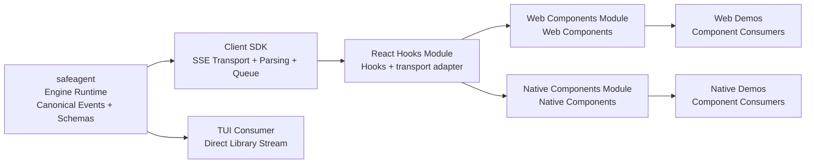

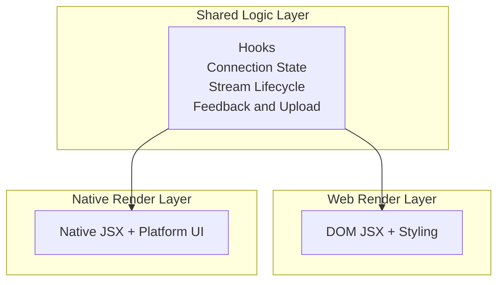

Architecture goals for this plan section:
- Preserve a single source of transport truth.
- Avoid duplicated event interpretation between frontend subpath modules.
- Keep rendering abstraction at component boundaries only.
- Keep stream semantics consistent across web and native.
- Make trace and observability artifacts first-class in UI behavior.

## Subpath Module Dependency Chain

Dependency direction is strictly top-down from server contracts toward consumer-facing component modules.
The engine layer is server-only and never imported by browser or native UI modules.
Each layer only depends on the public contracts of the previous layer.

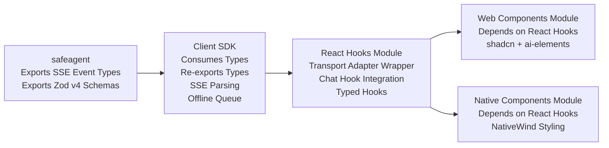

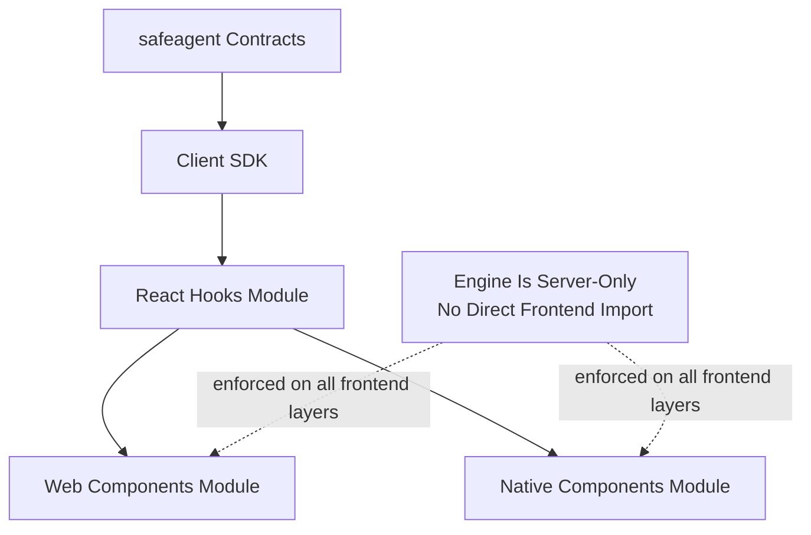

Export and dependency guarantees:
- `safeagent` defines canonical SSE event typing and schema validation contracts.
- The client SDK module consumes compile-time contracts and provides runtime parsing plus queue behavior.
- The client SDK module re-exports relevant contract types for downstream consumers.
- The React hooks module exposes framework-aligned hooks and transport adapter types.
- The web components module composes React hooks module outputs with web UI primitives.
- The native components module composes React hooks module outputs with native UI primitives.
- No frontend subpath module reaches into engine internals.

Primary exported hook surface from the React hooks module:
- Chat-hook passthrough compatibility with AI SDK transport expectations.
- the main chat hook for safe defaults on endpoint and auth alignment.
- the feedback hook for reaction and quality signals.
- the upload hook for attachment and upload flow.
- the trace steps hook for typed pipeline event projection.
- the server connection hook for endpoint switching and auth state.
- the verbosity hook for standard and full stream detail modes.

## Type Safety Flow

Type safety is end-to-end and contract-first.
No duplicate interface declarations are allowed across frontend layers.
All event and payload structures originate in canonical contracts.

Single-source policy:
- SSE event contracts are defined once in `CORE_TYPES` in `safeagent`.
- Runtime validation schemas are defined once in `ZOD_SCHEMAS` in `safeagent`.
- The client SDK module consumes those contracts at compile time and validates at runtime.
- The React hooks module maps parsed payloads into typed hook state.
- Component modules consume typed hook outputs without re-declaring event shapes.

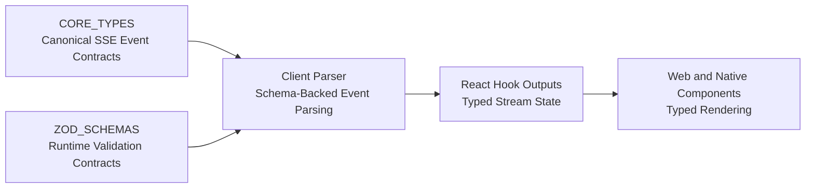

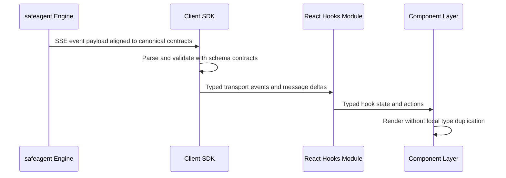

Type drift prevention controls:
- Contract changes originate only from engine contract owners.
- Client parser tests enforce schema compatibility against canonical event fixtures.
- Hook-level type tests enforce event projections for each stream status.
- Component prop contracts bind to hook return types rather than local aliases.
- Storybook mock builders derive shapes from exported contract types.
- Trace timeline rendering consumes typed discriminated unions for step kinds.

Failure handling model:
- Schema mismatch emits typed parse error state from client layer.
- React hooks expose error states and recovery actions.
- Web and native components render recoverable UI with retry affordances.
- Offline queue replay keeps original typed payloads intact.

## React Hooks (React hooks module)

The React hooks module is the central integration layer between AI SDK UI hooks and safeagent stream transport.
It implements transport adapter semantics so the chat hook from `@ai-sdk/react` can connect directly to safeagent-compatible servers.
The transport delegates low-level SSE parsing to the client SDK module while owning React-centric state transitions.

Official references:
- AI SDK React docs: https://ai-sdk.dev/docs/ai-sdk-ui/chatbot

### Transport adapter alignment

Transport responsibilities:
- Open and manage streaming lifecycle for each chat request.
- Serialize outgoing message context in AI SDK-compatible form.
- Inject server URL, auth token, and verbosity controls into request metadata.
- Delegate SSE parse and event normalization to the client SDK module.
- Surface message and status transitions in the shape expected by the chat hook.
- Handle stream cancellation, retry, and completion cleanup.

Transport edge behavior:
- Reconnect strategy when transient connection failure is detected.
- Retry behavior constrained by user action for deterministic UX.
- Respect offline queue behavior exposed by client layer.
- Preserve trace-step ordering in full verbosity mode.
- Guarantee final completion status after terminal event.

### Hook exports and intent

Main chat hook:
- Wraps the chat hook with safeagent defaults.
- Auto-wires the transport adapter implementation.
- Accepts server target from the server connection hook state.
- Injects auth token policy consistently.
- Enforces default user-facing verbosity behavior.

Trace steps hook:
- Collects `trace-step` stream events from current conversation run.
- Returns a typed array with stable order.
- Emits empty state in standard verbosity mode.
- Emits live appends in full verbosity mode.
- Supports reset and replacement on thread switch.

Feedback hook:
- Wraps feedback submission client call.
- Exposes loading, success, and error states.
- Supports optimistic UI for simple positive or negative signals.
- Supports metadata association with message identifiers.

Upload hook:
- Wraps upload flow from the client SDK module.
- Exposes progress transitions suitable for UI progress indicators.
- Maintains typed file references for prompt attachments.
- Surfaces upload failure and retry affordances.

Server connection hook:
- Manages active server endpoint selection.
- Tracks auth token and connectivity state.
- Supports switching among multiple configured servers.
- Exposes explicit connected, connecting, and disconnected states.

Verbosity hook:
- Owns standard and full modes for stream detail.
- Synchronizes mode changes with transport query metadata.
- Exposes simple toggle semantics for UI components.
- Persists user preference at app session boundary.

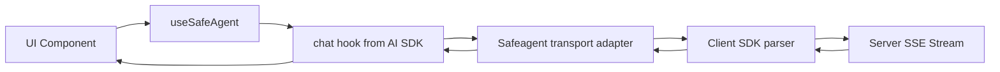

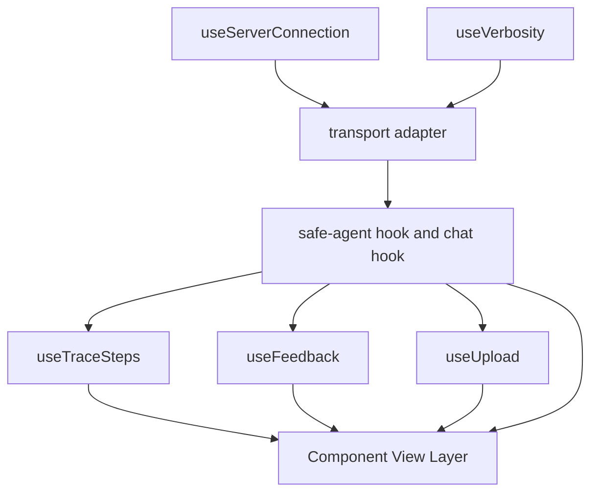

Operational constraints:
- Hook outputs are serializable and story-friendly.
- Hooks avoid hidden singleton state except explicit connection registries.
- Error objects are normalized for cross-platform rendering.
- Hook APIs stay stable to support generated component installers.

## Web Components (Web components module)

The web components module composes shared hooks with web-focused rendering primitives.
The module favors composition over monolithic chat widgets.
Adopted ai-elements components provide mature interaction and accessibility primitives.
Custom components fill safeagent-specific needs such as trace UI, server switching, and offline indicators.

Official references:
- ai-elements docs: https://elements.ai-sdk.dev
- shadcn docs: https://ui.shadcn.com

Design principles:
- All components accept `className` for external style extension.
- All components support children-based slot override when meaningful.
- Controllable state pattern follows explicit controlled/uncontrolled open-state props where applicable.
- Keyboard and screen-reader behavior is required parity for adopted and custom components.
- Transport state is consumed via hooks, not direct event subscriptions in view components.

## ai-elements Adoption

Adoption scope includes forty-eight components across conversation, input, tooling, and context surfaces.
The intent is to accelerate delivery and preserve behavioral consistency with AI SDK ecosystem patterns.

Conversation layer:
- the conversation root component provides the semantic surface for stream transcript.
- the conversation content component renders ordered message flow.
- the conversation empty-state component covers cold-start UI.
- the conversation scroll button component assists with long transcript recovery.
- the conversation download component supports export interaction.

Message layer:
- the message container component wraps a single utterance with role-specific semantics.
- the message content component provides a rich content container.
- the message response component streams markdown via Streamdown with math, mermaid, CJK, and code support.
- the message actions group component bundles interaction affordances.
- the single message action component enables discrete action extension.
- the message toolbar component provides clustered controls.
- the message branch component supports alternate response branch views.

Input layer:
- the prompt input root component anchors composer state.
- the prompt textarea component handles multiline input.
- the prompt submit component adapts icon and behavior from chat status.
- the prompt tools component hosts composer utility actions.
- the prompt input button component supports tool action entry points.
- the prompt action menu component handles file and screenshot attachments.

Tool-call layer:
- the tool invocation container component displays a single tool envelope.
- the tool header component summarizes tool identity and state.
- the tool content component renders step detail.
- the tool input component captures invocation payload.
- the tool output component renders result payload.
- Tool rendering supports all seven AI SDK tool states.

Reasoning and chain-of-thought layer:
- the reasoning container component wraps an expandable reasoning surface.
- the reasoning trigger component controls reveal state.
- the reasoning content component presents streamed reasoning text.
- the chain-of-thought component renders timeline-like reasoning progress.
- Reasoning auto-opens while active and auto-closes after completion when configured.

Attachments and sources:
- the attachments container component supports grid, inline, and list rendering modes.
- the attachment item component renders individual file-card behavior.
- the attachment preview component supports rich preview affordances.
- the sources container component groups source references.
- the sources trigger component reveals the source panel.
- the source item component renders per-reference details.
- the inline citation component provides in-message citation anchors with hover-card carousel behavior.

Code and terminal utilities:
- the code block component supports syntax highlighting with Shiki and dual-theme behavior.
- the code block copy button component supports clipboard flow.
- the terminal output component renders ANSI-compatible terminal output.

Context and model surfaces:
- the context summary component displays token usage summary.
- the context trigger component toggles the context detail panel.
- the context content component shows per-category usage splits.
- the model selector component supports command-palette model pickers with model logos.

Assistive interaction surfaces:
- the suggestions container component renders a horizontal suggestion list.
- the suggestion item component is an individual suggestion action.
- the confirmation component supports human approval workflow for tool calls.
- Pipeline primitives support plan, task, and queue visualization patterns.

Adoption policies:
- Upstream behavior is preserved unless safeagent requirements demand extension.
- Extensions are wrapped compositionally to reduce maintenance burden.
- Styling customizations layer on top of provided class hooks.
- Accessibility semantics from Radix-backed primitives are retained.

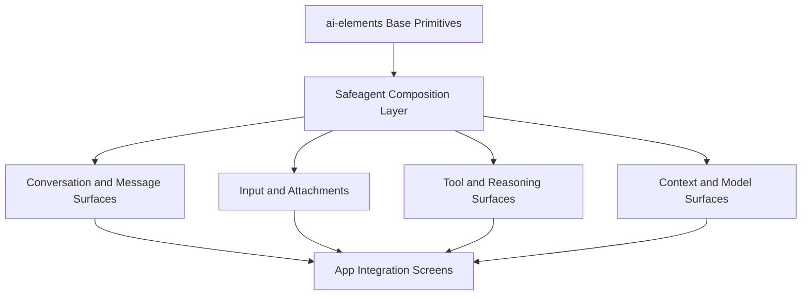

## Custom Components

These components are not provided by ai-elements and are built specifically for safeagent product requirements.

trace timeline component:
- Collapsible timeline of typed `trace-step` events.
- Shows step icons, status badges, and latency bars.
- Supports inline and sidebar layouts.
- Supports detail expansion for each step.

Verbosity toggle component:
- Switches between standard and full modes.
- Indicates developer mode when full is active.
- Exposes assistive labels for mode semantics.

Server selector component:
- Supports multi-server endpoint switching.
- Shows per-server connection state.
- Supports keyboard command-style search.

Thread list component:
- Displays thread previews and message recency.
- Includes unread indicator affordance.
- Supports selection and focus restoration.

Message timestamp component:
- Renders relative and absolute time forms.
- Supports localized formatting.
- Provides machine-readable time text for assistive tools.

Typing indicator component:
- Displays animated generation feedback.
- Composes with ai-elements shimmer visual primitives.
- Avoids announcing noisy status updates to screen readers.

Error retry component:
- Renders recoverable stream failure panel.
- Exposes retry action and contextual error detail.
- Supports transport and parser error categories.

Offline indicator component:
- Shows offline state and pending queue count.
- Integrates with client queue replay status.
- Persists visibility until reconnection clears pending items.

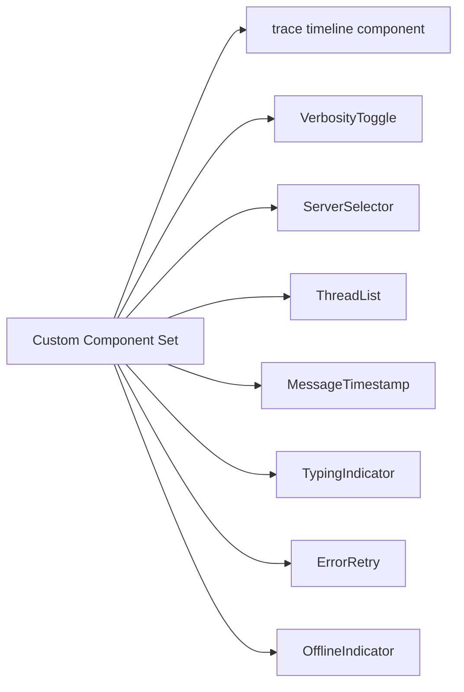

Implementation constraints:
- All custom components expose consistent controlled and uncontrolled APIs.
- All custom components allow style extension through `className`.
- All custom components support semantic role mapping.
- All custom components consume hook state only through typed interfaces.

## Generative UI Component Rendering

Generative UI component rendering defines how dynamic component events become visible output across web and native surfaces.
The transport section defines ui-component event semantics and the agent section defines component-producing tool behavior.
This section defines the frontend rendering contract that connects those events to deterministic, accessible presentation.

Component registry:
- The frontend SDK SHALL provide a component registry where application teams register renderer implementations by component type.
- The registry maps server catalog discriminators to rendering implementations.
- Registry registration order is deterministic so override behavior is predictable.

Built-in renderers:
- The frontend SDK ships built-in renderers for data table, chart bar, chart line, chart pie, metric card, image gallery, code block, and markdown block.
- Applications can override any built-in renderer without forking the shared rendering model.
- Built-in renderer output follows shared visual and accessibility policies.

Custom renderers:
- Applications can register custom renderers for domain-specific component types.
- A custom renderer receives validated payload data and display mode, then returns rendered output.
- Custom renderer registration uses the same registry contract as built-in renderer registration.

Fallback chain:
- When a ui-component event arrives with an unregistered type, renderer resolution follows a fixed chain.
- First evaluate application custom renderer registrations.
- Next evaluate built-in renderer registrations.
- Last render text fallback from the event payload.
- This chain guarantees that each event produces visible output.

React hook integration:
- A dedicated hook consumes ui-component events from chat transport.
- The hook resolves renderer selection through the registry and emits progressive output as events arrive.
- Progressive rendering preserves stream order and avoids waiting for full completion before initial display.

Web component support:
- A web component wrapper exposes the same registry-driven rendering behavior for non-React environments.
- The wrapper accepts component events and delegates rendering to registered renderer implementations.
- Registry semantics remain consistent with React-based integrations.

React Native support:
- Native renderers use platform-appropriate presentation primitives for charts and tables while preserving shared registry semantics.
- The native surface keeps the same registry pattern and hook interface for cross-platform behavior parity.
- Platform adaptation stays within renderer implementations rather than transport or registry contracts.

Display mode handling:
- Inline mode renders component output within message text flow.
- Block mode renders component output as standalone sections between text segments.
- Renderer selection and layout behavior SHALL respect mode values carried by each event.

Accessibility:
- All built-in renderers MUST satisfy WCAG 2.1 AA requirements.
- Chart renderers include equivalent data table alternatives for assistive access.
- Interactive renderers support full keyboard navigation and clear focus visibility.

Visual testing coverage:
- Every built-in renderer has visual test scenarios for full data variation coverage.
- Scenario coverage includes empty states, error states, inline mode, and block mode.
- Review gates verify rendering consistency, accessibility semantics, and regression stability.

Scalability:
- Renderers MUST handle high-frequency component event bursts without blocking the main rendering thread.
- Large data payloads (e.g., tables with thousands of rows) MUST use virtualized rendering to maintain frame rate.
- Component registry lookups MUST be constant-time regardless of registry size.
- Degraded rendering mode MUST activate when client resources are constrained, falling back to text-only presentation.

Security:
- Renderers MUST treat all payload data as untrusted input.
- Direct raw HTML injection primitives are prohibited.
- Dynamic script execution is prohibited.
- External resource loading from payload URLs requires domain allowlist validation before retrieval.

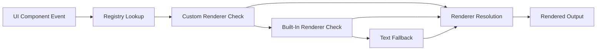

## Trace Visualization (TRACE_UI)

Trace visualization turns stream-level `trace-step` events into a human-readable pipeline timeline.
This section defines component behavior, interaction model, and rendering policy for full-verbosity sessions.

Trace timeline display model:
- Each `trace-step` event maps to one timeline entry.
- Entry header includes step icon, step name, and compact summary.
- Entry body includes latency bar and status pill.
- Expanded panel reveals full structured step data.
- Ordering is stable by arrival sequence and step index when present.

Step icon mapping:
- `intent` maps to lightbulb icon.
- `guardrail` maps to shield icon.
- `memory` maps to brain icon.
- `retrieval` maps to search icon.
- `tool` maps to wrench icon.
- `context` maps to layers icon.
- `source` maps to database icon.
- `rewrite` maps to pencil icon.

Latency bar policy:
- Width is proportional to step latency relative to current pipeline max.
- Color is green for latency below one hundred milliseconds.
- Color is yellow for latency below five hundred milliseconds and above green threshold.
- Color is red for latency at or above five hundred milliseconds.
- Bars include text values for assistive technologies.

Panel behavior:
- Trace panel can render as collapsible sidebar.
- Trace panel can render inline beneath message content.
- Standard mode hides trace panel by default.
- Full mode auto-opens trace panel on incoming assistant messages.
- Manual close state remains user-controlled for current thread.
- Total pipeline latency is rendered at panel footer.

Verbosity interaction rules:
- Standard mode labels toggle as user mode.
- Full mode labels toggle as developer mode.
- Standard mode stores no step entries in view state.
- Full mode streams step entries incrementally.
- Mode switching clears incompatible cached detail panes.

Trace details panel:
- Shows structured key-value detail with readable labels.
- Supports long-content truncation with expand-on-demand affordance.
- Handles missing optional fields gracefully.
- Preserves monospace formatting for identifiers and timing values.

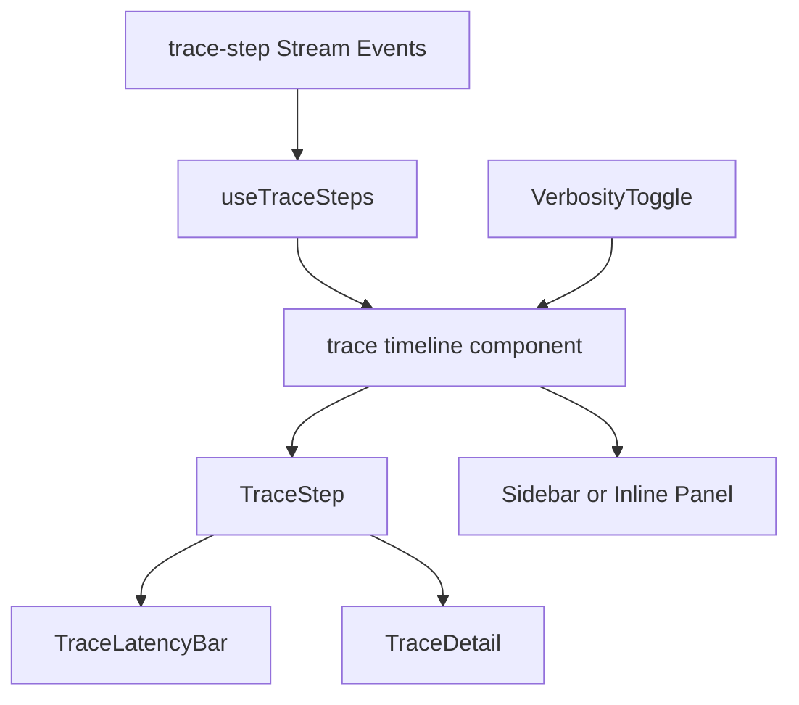

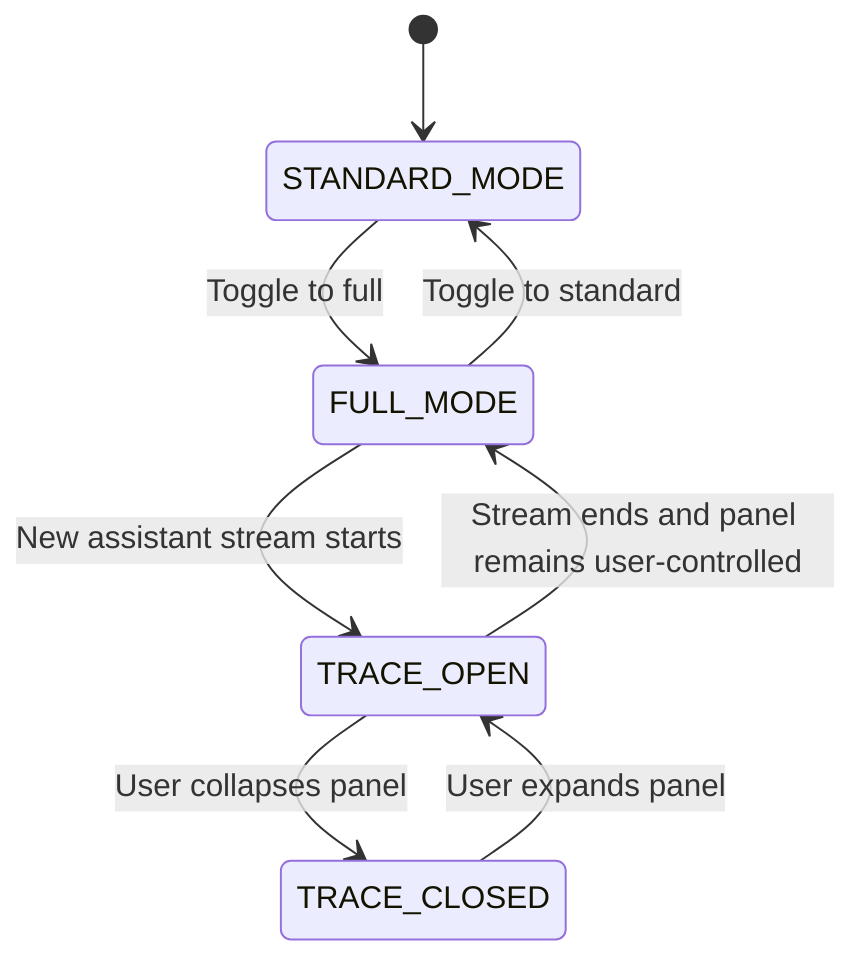

Trace rendering quality gates:
- No dropped entries during high-frequency event bursts.
- No duplicate step rendering when reconnect occurs.
- Smooth transitions for expanding and collapsing details.
- Low visual noise in standard mode.
- Consistent iconography across story states.

## React Native Components (Native components module)

The native components module provides native equivalents of web component capabilities while preserving hook-level parity.
The module shares logic through hooks and diverges only where platform rendering constraints require native implementations.

Official references:
- NativeWind docs: https://www.nativewind.dev

Shared logic commitments:
- Consume chat-hook integration through safeagent transport wrappers.
- Consume the trace steps hook for trace surfaces where enabled.
- Consume the feedback hook, upload hook, server connection hook, and verbosity hook.
- Preserve naming parity for component props where feasible.

Native-specific constraints:
- No DOM primitives such as div or span.
- No Radix UI primitive usage.
- No direct ai-elements usage because ai-elements is web-focused.
- No framer-motion composition for animation behaviors.

Native-specific implementations:
- Native conversation list built from native list and view primitives.
- Native message rendering with markdown-capable renderer suited for mobile.
- Native prompt input with keyboard-aware container behavior.
- Native attachment workflows integrated with document and image pickers.
- Native server selector and thread list built with touch-first interaction patterns.
- Native offline indicator tied to queue and local persistence state.

Offline-first requirements:
- Queue is resilient when connectivity drops mid-stream.
- Pending sends replay in original order after reconnect.
- Conversation history persists in local SQLite-backed storage.
- Visual state communicates queued and syncing transitions clearly.

Polyfill expectations:
- Runtime deep-clone support is available.
- Streaming text-encoder support is provided through Expo fetch capabilities.

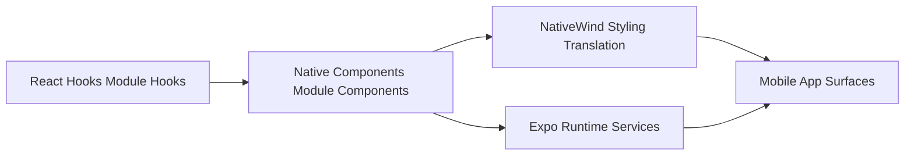

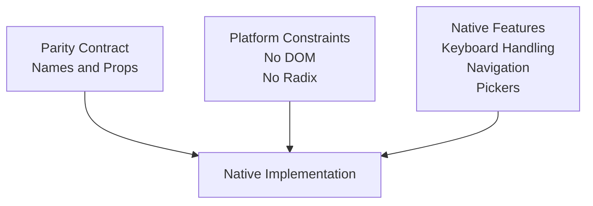

Parity scope and exceptions:
- Message and conversation semantics are equivalent across platforms.
- Input behavior is semantically equivalent with platform-specific focus handling.
- Trace surfaces follow same data semantics with native visual adaptation.
- Styling tokens align conceptually but use native style translation.
- Keyboard and gesture interactions are native-first.

## Component Installation CLI

The component installer follows the shadcn-style copy model rather than runtime imports from internal library modules.
Consumers install component source into their own project and keep full ownership for customization.

Design goals:
- Keep consumer customization friction low.
- Preserve deterministic dependency resolution from registry metadata.
- Support separate registries for web and native components.
- Validate required styling and runtime prerequisites before copying.

Registry model:
- Registry entries describe component identity, category, and dependencies.
- Registry entries include transitive component dependencies.
- Registry entries include required utility primitives.
- Registry entries include optional peer requirements.

Install workflow model:
- Resolve requested component from registry.
- Build full dependency graph for that component.
- Validate target project supports required styling baseline.
- Validate target project supports required runtime assumptions.
- Copy selected components and dependency components into consumer space.
- Provide install report describing copied artifacts and unresolved optional peers.

Validation responsibilities:
- Verify Tailwind-oriented setup for web installs.
- Verify NativeWind-oriented setup for native installs.
- Verify required utility support for class merge helpers and style tokens.
- Warn when an existing local component diverges from registry signature.

Registry split:
- Web registry lists components from the web components module and adopted wrappers.
- Native registry lists components from the native components module.
- Shared conceptual names map to platform-specific component sources.

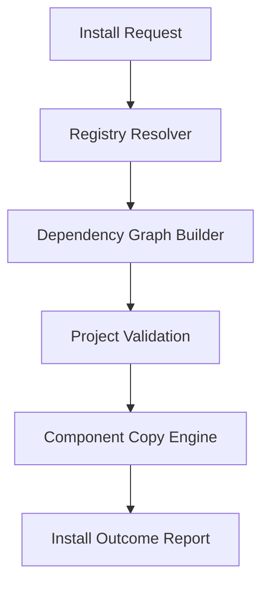

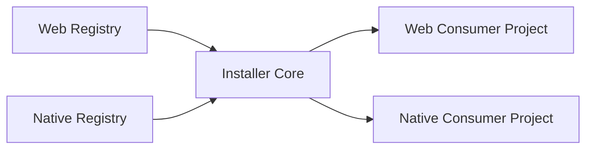

Operational safeguards:
- Install process is idempotent for unchanged selections.
- Conflict detection prevents silent overwrite.
- Dependency cycles are blocked at registry validation stage.
- Install output remains human-readable for review.

## Storybook Documentation

Storybook is the primary development and review surface for web components.
It documents behavior, state patterns, and customization affordances while enabling rapid regression checks.

Official references:
- Storybook docs: https://storybook.js.org

Story coverage goals:
- Cover all adopted component wrappers used by the web components module.
- Cover all custom safeagent components.
- Include default rendering state.
- Include className customization examples.
- Include children slot override examples.
- Include controlled and uncontrolled state patterns.
- Include dark mode rendering states.
- Include responsive layout states.

Mock data strategy:
- Message mocks reflect realistic assistant and user turn structure.
- Trace-step mocks represent each supported step type.
- Attachment mocks include text, image, and mixed sets.
- Citation mocks include inline and panel source references.
- Call-to-action mocks include feedback and retry interactions.

Workflow role:
- Storybook supports component iteration before integration into demos.
- Storybook stories become acceptance artifacts for design and accessibility review.
- Storybook snapshots seed visual regression baseline.

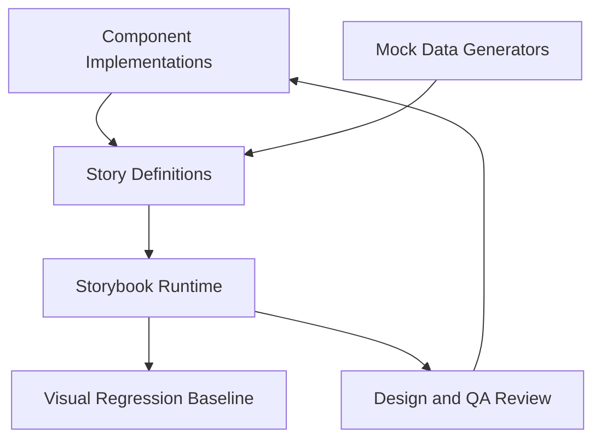

Story quality gates:
- Each component has at least one accessibility-focused story.
- Each complex component has loading, error, and empty stories.
- Trace timeline stories include standard and full verbosity behavior.
- Server selector stories include multi-endpoint status rendering.
- Offline indicator stories include pending queue transitions.

## Styling Strategy

Styling is utility-first with design token control through CSS variables.
The web stack uses Tailwind with CSS-first setup via `@import "tailwindcss"`.
The theming layer is built on shadcn color variables and dark-mode custom properties.
No separate custom token framework is introduced for this phase.

Web styling policies:
- Use shadcn variable conventions for primary, secondary, background, and foreground semantics.
- Prefer utility composition over bespoke selector nesting.
- Keep component style overrides surface-level through `className` hooks.
- Keep motion meaningful and restrained for stream-heavy interfaces.
- Maintain consistent spacing rhythm across conversation and sidebar surfaces.

Dark and light appearance behavior:
- Use Tailwind `dark:` variants for stateful appearance toggles.
- Keep semantic variable mapping stable across appearance modes.
- Ensure trace latency colors remain legible in both appearance contexts.

Native styling policies:
- The native components module uses NativeWind translation to native style objects at build time.
- Native classes mirror conceptual utility naming from web where practical.
- Platform-specific spacing and typography may diverge for usability.

Consistency guarantees:
- Visual semantics of status colors are consistent between web and native.
- Interaction states are represented with equivalent affordances.
- Focus and active states are visible and perceivable across both platforms.

## Accessibility

Accessibility is mandatory for adopted and custom components.
All component work must satisfy WCAG 2.1 AA requirements across keyboard, screen reader, and color contrast dimensions.

Adopted component baseline:
- ai-elements provides ARIA behavior through Radix-backed primitives.
- Safeagent wrappers preserve those semantics without stripping required attributes.

Custom component obligations:
- Apply semantic roles where native semantics are absent.
- Provide `aria-label` where visible labels are not sufficient.
- Provide keyboard interaction parity for expandable and selectable surfaces.
- Preserve focus management during dynamic stream updates.
- Avoid focus loss when thread or server context switches.

Specific interaction patterns:
- Conversation container uses `role="log"` and `aria-live="polite"`.
- Prompt input surfaces maintain textbox semantics with multiline signaling.
- Trace timeline uses list semantics with item-level accessibility.
- Verbosity toggle uses switch semantics and checked state exposure.
- Server selector uses combobox semantics with expanded state exposure.

Screen reader and keyboard quality checks:
- Announce new assistant content once per message chunk boundary strategy.
- Ensure collapsible trace entries expose expanded state.
- Ensure retry actions are reachable and clearly named.
- Ensure unread indicators are announced with contextual thread labels.

Contrast and color requirements:
- Base palette must satisfy AA contrast thresholds.
- Trace latency colors require contrast validation in both appearance modes.
- Non-color cues supplement latency status color differences.

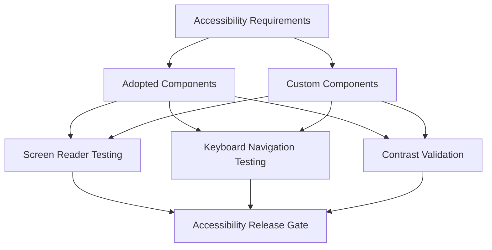

## Cross-References

| Area | Linked Plan Section | Why It Matters for Frontend SDK |
|---|---|---|
| Requirements | [Requirements](./requirements.md) (`MH_REACT_HOOKS`, `MH_WEB_COMPONENTS`, `MH_RN_COMPONENTS`, `MH_TRACE_STEP_EVENTS`, `MH_TRACE_UI`, `MH_OFFLINE_QUEUE`, `MH_STORYBOOK`) | Defines expected frontend capabilities and acceptance outcomes. |
| Foundation Contracts | [Foundation](./foundation.md) | Source of canonical SSE event contracts and schema definitions used by frontend layers. |
| Transport | [Transport](./transport.md) | Defines SSE protocol behavior, `trace-step` payload shape, and verbosity semantics consumed by hooks and components. |
| Server Runtime | [Server](./server.md) | Defines chat streaming endpoint behavior and verbosity query interpretation used by transport integration. |
| Observability | [Observability](./observability.md) | Defines trace correlation behavior through shared `traceId` across frontend timeline and telemetry systems. |
| Demos | [Demos](./demos.md) | Defines integration targets that consume web and native component modules for end-to-end validation. |

Cross-section dependency notes:
- Frontend stream rendering behavior directly depends on transport event ordering guarantees.
- Trace visualization depends on observability identifiers for cross-tool correlation.
- Multi-server UI state depends on server endpoint policy and auth handling conventions.
- Storybook mock fidelity depends on foundation-level event contract updates.

## Task Specifications

### SCAFFOLD_FRONTEND Supplementary Frontend Context

> **Canonical task spec**: See [foundation.md § Task SCAFFOLD_FRONTEND](./foundation.md#task-scaffold_frontend-frontend-sdk-workspace-scaffolding). This section provides supplementary frontend-specific context and QA scenarios.

**Batch**: FOUNDATION_A_BATCH

**What to do**
- Establish frontend workspace boundaries for the React hooks, web components, and native components subpath modules within the safeagent library.
- Define module-level TypeScript baselines aligned with monorepo standards.
- Add dependency baselines for AI SDK React integration, web styling primitives, component composition, native styling, and Expo runtime integration.
- Establish Storybook development environment as the default web component sandbox.
- Define shared lint and quality expectations for all frontend subpath modules.
- Define module-level test strategy placeholders for hook, component, and integration testing.
- Ensure build graph includes frontend subpath modules in workspace orchestration.
- Document baseline module intent and public API ownership.

**Depends on**
- `SCAFFOLD_LIB`

**Acceptance criteria**
- Frontend subpath modules are discoverable by workspace tooling.
- Type checking executes cleanly for all three module stubs.
- Shared dependency graph resolves without circular references.
- Storybook environment launches with baseline placeholder stories.
- Module boundaries clearly separate hook logic, web rendering, and native rendering.
- No frontend subpath module imports server-only engine internals.
- Workspace tasks can target each frontend subpath module independently.

**QA scenarios**
- Validate workspace tooling detects all frontend subpath modules.
- Validate isolated type checking for each module passes.
- Validate cross-module type references resolve correctly from hooks to UI modules.
- Validate Storybook startup and baseline story rendering.
- Validate native module bootstrap compiles under Expo toolchain assumptions.
- Validate dependency installation in a clean environment reproduces identical graph behavior.
- Validate unresolved peer warnings are actionable and documented.

### Task REACT_HOOKS: React Hooks

**Batch**: SERVER_ROUTES_SUBAGENT_BATCH

**Task Name**
- REACT_HOOKS

**Objective**
- Build a React-hooks integration layer that gives product teams a stable, transport-safe way to drive agent interactions from UI state.
- Ensure streaming, feedback, upload, and trace behaviors remain consistent across web and native consumers.

**What to do**
- Implement a transport adapter compatible with AI SDK chat-hook expectations.
- Integrate SSE lifecycle handling through the client SDK module parser and queue behavior.
- Implement a safe-agent wrapper hook with safeagent defaults for transport, auth, and endpoint wiring.
- Implement the trace steps hook for full-verbosity trace event projection.
- Implement the feedback hook with loading, success, and error transitions.
- Implement the upload hook with progress and typed file-reference handling.
- Implement the server connection hook for multi-endpoint selection and auth token state.
- Implement the verbosity hook for standard and full mode state management.
- Re-export hook and type surface for downstream component modules.
- Add unit and integration tests for stream lifecycle, error handling, and type shape stability.

**Depends on**
- `CLIENT_SDK`
- `SCAFFOLD_FRONTEND`

**Acceptance criteria**
- Chat-hook integration works through safeagent transport without adapter glue in consumer apps.
- Stream messages, status changes, and completion events map to AI SDK expectations.
- Trace steps appear only in full mode and remain empty in standard mode.
- Feedback hook supports optimistic and failure transitions.
- Upload hook exposes deterministic progress transitions and final file references.
- Server connection hook supports switching and state transitions without stale closures.
- Verbosity hook updates outgoing transport metadata reliably.
- Hook exports are fully typed and reusable by both web and native modules.

**QA scenarios**
- Stream with standard mode and confirm trace-step output remains absent.
- Stream with full mode and confirm ordered trace-step output appears.
- Simulate transient disconnect and confirm reconnection behavior is stable.
- Simulate parser failure and confirm normalized error surface is returned.
- Submit feedback success and failure paths with UI state transitions.
- Upload multiple files and verify progress, completion, and cancellation behaviors.
- Switch among multiple servers during idle and active sessions and validate state outcomes.
- Toggle verbosity between requests and verify transport metadata changes.
- Validate type tests for hook output contracts against canonical event unions.

**Implementation Notes**
- Keep transport state transitions deterministic so reconnect and retry behavior is predictable.
- Treat trace payload handling as mode-gated to prevent accidental detail leakage in standard mode.
- Keep hook return contracts stable and composable to reduce downstream migration churn.

### Task WEB_COMPONENTS: Web Components

**Batch**: ENDPOINTS_BARREL_BATCH

**Task Name**
- WEB_COMPONENTS

**Objective**
- Deliver a framework-ready web component layer that composes shared agent hooks into accessible, customizable UI surfaces.
- Balance rapid adoption through component reuse with safeagent-specific UX requirements for traceability and reliability.

**What to do**
- Install and configure ai-elements component set used by safeagent web surfaces.
- Compose adopted components into safeagent-ready wrappers with consistent prop patterns.
- Build custom components for server switching, thread navigation, timestamps, typing status, error recovery, offline state, and verbosity control.
- Ensure all components accept `className` and support children slot override patterns.
- Ensure controlled and uncontrolled state patterns are implemented consistently.
- Integrate hooks from the React hooks module across conversation and input workflows.
- Add accessibility semantics and keyboard behavior for custom components.
- Add story coverage for major states and interaction paths.

**Depends on**
- `REACT_HOOKS`

**Acceptance criteria**
- Adopted ai-elements wrappers render correctly in isolated and integrated states.
- Custom components integrate with hook state and emit expected callbacks.
- Component APIs are consistent across related primitives.
- `className` extension works without breaking component internals.
- Slot override behavior works for key visual surfaces.
- Accessibility semantics are present and validated for custom components.
- Offline and error states are represented with actionable UI.

**QA scenarios**
- Render conversation flow with streaming response and verify message surfaces.
- Render prompt input with attachment menu and verify file and screenshot action paths.
- Render tool call states and verify each tool-state presentation.
- Render server selector with multiple endpoint statuses and keyboard navigation.
- Render thread list with unread indicators and verify focus movement.
- Trigger stream failure and verify retry behavior.
- Simulate offline queue and verify pending count indicator behavior.
- Validate controlled and uncontrolled usage for expandable surfaces.
- Validate screen reader output for verbosity toggle and server selector.

**Implementation Notes**
- Prefer composition wrappers over deep forks to preserve upstream accessibility behavior.
- Keep component state ownership explicit so controlled and uncontrolled modes stay reliable.
- Treat offline and error UI as first-class states, not edge-case overlays.

### Task TRACE_UI: Trace Visualization

**Batch**: E2E_DEPLOY_BATCH

**Task Name**
- TRACE_UI

**Objective**
- Build a high-signal trace visualization surface that turns low-level step events into debuggable execution timelines.
- Make developer observability available without degrading default end-user chat experience.

**What to do**
- Implement a trace timeline component and child primitives for step rows, latency bars, and detail panels.
- Consume typed output from the trace steps hook and render timeline entries in stable order.
- Implement step icon mapping for all supported step categories.
- Implement latency bar scaling and threshold-based color semantics.
- Implement collapsible panel behavior for sidebar and inline display modes.
- Auto-open trace panel in full mode for new assistant messages.
- Hide trace panel in standard mode and align toggle labels with user and developer semantics.
- Display total pipeline latency summary.
- Add accessibility roles and keyboard support for step expansion.

**Depends on**
- `WEB_COMPONENTS`

**Acceptance criteria**
- Every trace-step event appears exactly once in the timeline.
- Step icon mapping is correct for each step type.
- Latency bars match threshold color rules and proportional width behavior.
- Detail panel expansion is keyboard and pointer accessible.
- Full mode auto-open behavior works on incoming messages.
- Standard mode keeps trace surface hidden and lightweight.
- Total latency summary is present and accurate for completed pipelines.

**QA scenarios**
- Feed synthetic trace streams covering all supported step types and validate icon mapping.
- Feed mixed latency values and validate color and width behavior.
- Toggle verbosity during session boundaries and validate panel behavior.
- Expand and collapse detail rows rapidly and validate state stability.
- Validate timeline rendering under high-frequency event bursts.
- Validate keyboard traversal through timeline list items.
- Validate screen reader narration of step labels and latency values.
- Validate total latency at completion against summed or provided aggregate metrics.

**Implementation Notes**
- Use stable ordering and idempotent append logic to prevent duplicate or shuffled step entries.
- Keep latency visualization interpretable under burst conditions by anchoring to clear thresholds.
- Ensure trace-panel behaviors remain explicitly tied to verbosity mode transitions.

### Task RN_COMPONENTS: React Native Components

**Batch**: ENDPOINTS_BARREL_BATCH

**Task Name**
- RN_COMPONENTS

**Objective**
- Provide mobile-native agent UI components that preserve cross-platform behavioral parity with web surfaces.
- Prioritize offline resilience, touch ergonomics, and predictable streaming interactions in constrained mobile runtime conditions.

**What to do**
- Build native equivalents for conversation, messages, prompt input, attachments, server selector, thread list, verbosity toggle, and offline indicator.
- Ensure component prop contracts align with web counterparts where platform constraints allow.
- Integrate shared hooks from the React hooks module for stream, trace, upload, feedback, and connection state.
- Implement markdown-capable message rendering suitable for mobile.
- Implement keyboard-aware input behavior for chat composition.
- Integrate native document and image pickers for attachments.
- Integrate navigation-compatible patterns for thread and conversation transitions.
- Integrate offline queue behavior with local SQLite-backed persistence.
- Ensure required runtime polyfills are applied for stream and clone support.

**Depends on**
- `REACT_HOOKS`

**Acceptance criteria**
- Native components render core chat flows with parity to web behavior semantics.
- Shared hook APIs operate identically across web and native consumers.
- Attachment flow works for documents and images in native contexts.
- Offline queue behavior is visible and replay transitions are clear.
- Thread and server switching interactions are stable under network changes.
- Native styling is consistent and maintainable through utility classes.
- Required polyfills are active and prevent runtime stream failures.

**QA scenarios**
- Run chat session on mobile and validate streaming response behavior.
- Validate markdown rendering for headings, lists, and code-like blocks in message content.
- Validate keyboard avoidance and input focus transitions.
- Validate attachment selection for document and image workflows.
- Toggle verbosity and validate trace visibility behavior in native surface.
- Simulate offline send, queue accumulation, and replay after reconnect.
- Validate SQLite-backed history persistence across app relaunch.
- Validate server switching behavior with stale token and refreshed token states.

**Implementation Notes**
- Keep parity centered on behavior contracts, not pixel-level equivalence with web.
- Isolate platform-specific adaptations inside component boundaries to protect shared hook logic.
- Treat offline queue visibility and replay clarity as mandatory user trust features.

### Task FRONTEND_CLI: Component CLI

**Batch**: E2E_DEPLOY_BATCH

**Task Name**
- FRONTEND_CLI

**Objective**
- Build a deterministic installer workflow that lets teams adopt and customize frontend SDK components safely.
- Ensure dependency resolution and project validation prevent broken installs and silent integration drift.

**What to do**
- Build installer core for component copy workflow.
- Define registry schema for component metadata and dependency references.
- Implement component resolver and transitive dependency planner.
- Implement copy engine for web and native registries.
- Implement validator checks for style and runtime prerequisites.
- Implement conflict detection for existing local component artifacts.
- Implement install summary reporting for copied components and warnings.
- Add tests for registry parsing, dependency resolution, and install outcomes.

**Depends on**
- `WEB_COMPONENTS`
- `RN_COMPONENTS`

**Acceptance criteria**
- Installer resolves single and multi-component installs with correct dependency closure.
- Web and native registries are independently addressable.
- Validation checks prevent unsupported installs with clear diagnostics.
- Install output is deterministic for repeated requests.
- Conflict detection prevents unintended overwrite scenarios.
- Installer supports customization workflow by copying editable source.

**QA scenarios**
- Install a simple component with no dependencies and validate copied output.
- Install a composite component and validate transitive dependency inclusion.
- Install into project missing required styling baseline and validate warning behavior.
- Install into native target missing required runtime assumptions and validate warnings.
- Repeat same install and validate idempotent behavior.
- Install when local component already exists and validate conflict strategy.
- Validate separate registry selection for web and native component families.

**Implementation Notes**
- Keep registry metadata authoritative so dependency closure remains consistent over time.
- Fail fast on unsupported target conditions with actionable validation feedback.
- Preserve consumer ownership by copying editable sources rather than opaque runtime bindings.

### Task STORYBOOK_FRONTEND: Storybook

**Batch**: E2E_DEPLOY_BATCH

**Task Name**
- STORYBOOK_FRONTEND

**Objective**
- Establish Storybook as the canonical component documentation and review surface for frontend SDK web primitives.
- Use story-driven state coverage to reduce regressions before demo and production integration.

**What to do**
- Configure Storybook as the web component documentation surface.
- Create stories for adopted wrappers and custom components.
- Build reusable mock data generators for messages, traces, attachments, citations, and interaction states.
- Add stories for default, customized, controlled, and uncontrolled usage patterns.
- Add stories for dark appearance, responsive behavior, loading states, empty states, and error states.
- Add accessibility-focused stories for keyboard and assistive semantics.
- Establish visual regression baseline snapshots for key component states.
- Integrate story validation into frontend QA workflow.

**Depends on**
- `WEB_COMPONENTS`

**Acceptance criteria**
- Every web component has at least one representative story.
- Custom components include state-rich stories covering major branches.
- Mock generators produce realistic and stable fixtures for review.
- Storybook rendering is stable across supported browsers.
- Visual baseline artifacts exist for high-impact surfaces.
- Accessibility checks can be run against story states.

**QA scenarios**
- Render full conversation with streaming and attachments in Storybook.
- Render trace timeline in standard and full mode scenarios.
- Render server selector states for connected, connecting, and disconnected endpoints.
- Render offline indicator with pending queue count transitions.
- Render error-retry component under transport and parser error states.
- Validate className customization stories for style extension behavior.
- Validate slot override stories for custom composition behavior.
- Validate visual baseline diffs remain stable across routine updates.

**Implementation Notes**
- Keep story fixtures contract-driven so scenario drift is caught early.
- Cover state-rich branches explicitly to improve accessibility and regression review quality.
- Treat visual-baseline updates as governed changes tied to intentional UI behavior shifts.

## Additional Implementation Notes

Documentation links for implementation teams:
- AI SDK React integration patterns: https://ai-sdk.dev/docs/ai-sdk-ui/chatbot
- ai-elements component catalog and usage notes: https://elements.ai-sdk.dev
- NativeWind utility translation and runtime behavior: https://www.nativewind.dev
- shadcn design tokens and utility composition guidance: https://ui.shadcn.com
- Storybook authoring and testing workflows: https://storybook.js.org

Risk watchlist:
- Hook transport behavior drift from AI SDK expectations can break downstream components.
- Trace event payload growth can create rendering pressure in long sessions.
- Native and web parity gaps can increase support burden if prop contracts diverge.
- Installer registry drift can produce inconsistent consumer installs.
- Accessibility regressions can occur when custom wrappers override adopted semantics.

Mitigation strategy highlights:
- Maintain transport compatibility checks at hook layer.
- Enforce typed event fixture tests for trace payloads.
- Keep prop contract conformance tests shared across web and native.
- Add registry validation checks before installer release.
- Add accessibility checks into story-driven review gates.

Readiness signals before moving to demos:
- Hook APIs are stable and documented for consumers.
- Web components cover complete conversation and tool-call lifecycle.
- Native components cover complete mobile conversation lifecycle.
- Trace visualization is reliable and readable in full mode.
- Installer workflows are deterministic and conflict-aware.
- Storybook provides exhaustive state documentation for web surfaces.

## Test Specifications

> **Relationship to Task Specifications**: QA Scenarios prove task completion; Test Specifications prove behavioral correctness. Use both.

**Module boundaries and scaffolding**:

- Frontend subpath exports resolve correctly for client SDK, React hooks, web components, and native components.
- Module boundaries prevent server-only runtime imports into frontend packages.

**Transport adapter**:

- SSE parsing with correct line buffering.
- Event type discrimination producing typed event objects.
- Reconnection follows transport semantics without mid-stream resume assumptions.

**React hooks**:

- Hook set coverage includes chat transport compatibility, feedback behavior, file-upload behavior, trace-step projection, connection selection, and detail-mode control.
- Hooks integrate with AI SDK ChatTransport interface.

**Web components**:

- 48 ai-elements based components render correctly with proper ARIA attributes.
- Eight custom components (trace timeline, verbosity toggle, server switch, and others) function correctly.
- Component installation CLI provides individual component installation.

**Native components**:

- Native component module coverage is validated separately from web components with shared hook parity.

**Trace UI**:

- Dedicated trace visualization behavior tests cover timeline rendering, step typing, and detail-mode transitions.

**Type safety**:

- SSE event types flow through client SDK to React hooks to UI components without type loss.
- Runtime event parsing validates against Zod schemas.

**Accessibility**:

- WCAG 2.1 AA compliance for all components.
- Keyboard navigation for all interactive elements.
- Screen reader compatibility with appropriate ARIA attributes.

**Offline queue**:

- Messages queued when server unreachable.
- Auto-sync on reconnect with no duplicate delivery.

**Storybook**:

- Usage examples for all web components.
- Storybook scope remains web-component documentation only.

**Component installer**:

- Dependency validation blocks unsupported installs with clear diagnostics.
- Conflict detection prevents unintended overwrite of existing local component artifacts.

**Scaffold and workspace boundaries**:

- Frontend subpath modules are discoverable by workspace graph and task tooling.
- Module-stub type checking passes cleanly for hooks, web components, and native components modules.
- Shared frontend dependency graph validates with no circular references.
- Storybook startup succeeds with placeholder stories in baseline scaffold state.
- Hook, web, and native boundaries remain separated with no cross-layer leakage.
- Frontend modules do not import server-only engine internals.
- Workspace tasks can target hooks, web components, and native components independently.

**React hook transport behavior**:

- Chat-hook transport works with safeagent stream flow without consumer-side adapter glue.
- Stream text events map to AI SDK message updates in expected order.
- Stream status transitions map to loading, streaming, and completion states correctly.
- Completion events finalize run state exactly once per request.
- Trace-step collection remains empty in standard mode.
- Trace-step collection appends ordered entries only in full mode.
- Feedback hook supports optimistic state before server confirmation.
- Feedback hook rolls back optimistic state on submission failure.
- Upload hook emits deterministic progress transitions across upload lifecycle states.
- Upload hook returns final typed file references on success.
- Server-connection hook supports endpoint switching without stale closure usage.
- Verbosity hook updates outgoing transport metadata for subsequent requests.
- Hook exports remain fully typed and reusable across both web and native consumers.

**Web component consistency and accessibility**:

- ai-elements wrappers render correctly in isolated story state.
- ai-elements wrappers render correctly in integrated chat-surface state.
- Custom components consume hook state and emit expected callback semantics.
- API shape remains consistent across related primitive wrappers.
- Custom CSS class extension points apply without breaking default internals.
- Slot-override behavior works for key composition surfaces.
- Accessibility semantics are present for custom controls and dynamic surfaces.
- Offline-state UI provides actionable reconnect guidance.
- Error-state UI provides actionable retry affordances.

**Trace UI fidelity**:

- Every incoming trace-step event appears exactly once in timeline rendering.
- Step-type icon mapping matches supported step taxonomy.
- Latency-bar color thresholds follow green/yellow/red policy boundaries.
- Latency-bar widths remain proportional to relative step latency.
- Detail-panel expansion is keyboard accessible.
- Detail-panel expansion is pointer accessible.
- Full mode auto-opens trace panel on incoming assistant run.
- Standard mode keeps trace panel hidden and lightweight.
- Total pipeline latency summary remains numerically accurate.

**Native component parity**:

- Native chat flow preserves semantic parity with web chat behavior.
- Shared hook API behavior is identical across web and native contexts.
- Native attachment flow supports document and image inputs.
- Offline queue visibility shows pending-count and sync transitions.
- Reconnect replay transitions drain queued messages in FIFO order.
- Thread switching remains stable during network transitions.
- Server switching remains stable during network transitions.
- Native styling remains consistent and maintainable through utility patterns.
- Required polyfills are active for stream and clone support.

**Frontend CLI install guarantees**:

- Single-component install resolves full dependency closure.
- Multi-component install resolves merged dependency closure deterministically.
- Web registry and native registry are independently addressable.
- Unsupported install targets are blocked by validation checks.
- Repeated installs produce deterministic output layouts.
- Existing local conflicts are detected and blocked from silent overwrite.
- Customization workflow copies editable component source into consumer space.

**Storybook coverage quality**:

- Every web component has at least one representative story.
- Custom components include state-rich stories covering key branches.
- Mock generators produce stable fixtures across repeated runs.
- Story rendering remains stable across supported browsers.
- Visual baseline artifacts are produced for high-impact surfaces.
- Accessibility checks run against documented story states.

### Extension: Generative UI Renderer

- Component registry maps component type discriminators to renderer implementations.
- Built-in renderers produce correct output for data-table, chart, metric card, image gallery, code block, and markdown block.
- Custom renderers override built-in renderers when registered.
- Fallback chain resolves: custom → built-in → text fallback.
- React hook consumes ui-component events and resolves appropriate renderer.
- Web component wrapper delegates to registry-based rendering.
- React Native renderers use platform-appropriate implementations.
- Inline components render within text flow and block components render as standalone sections.
- All built-in renderers meet WCAG 2.1 AA accessibility requirements.
- Renderers treat all data payloads as untrusted input with no dynamic script execution.
