# Guardrails & Safety

> **Scope**: Input and output guardrail system, severity levels, GuardMode behavior, zero-leak buffered mode, guardrail authoring factories, pipeline orchestration, and integration with the `@openai/agents` framework guardrail system.
>
> **Tasks**: INPUT_GUARD (Input Guardrails), OUTPUT_GUARD (Output Guardrails), GUARD_FACTORY (Guardrail Factories), LANG_GUARD (Language Guard), HATE_SPEECH_GUARD (Hate Speech Guard), GUARD_PIPELINE (Pipeline Orchestrator), ZERO_LEAK_GUARD (Zero-Leak Buffered Mode)

## Architecture Overview

The guardrail system wraps every agent interaction with two enforcement layers: one that runs before the LLM sees the user's message, and one that runs on every chunk the LLM emits. Both layers share the same type system and the same guardrail function type, so detection logic is written once and deployed in either position.

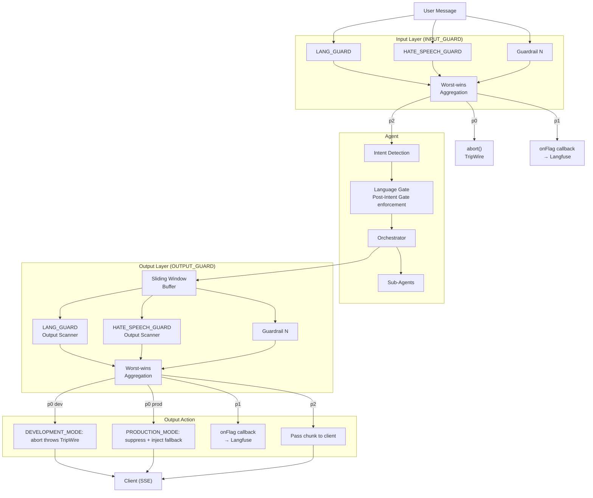
```mermaid
flowchart TB
    USER["User Message"]

    subgraph INPUT_LAYER["Input Layer (INPUT_GUARD)"]
        LANG_GUARD_INPUT["LANG_GUARD"]
        HATE_GUARD_INPUT["HATE_SPEECH_GUARD"]
        GUARDRAIL_N_INPUT["Guardrail N"]
        AGG_IN["Worst-wins\nAggregation"]
    end

    ABORT["abort()\nTripWire"]
    FLAG_IN["onFlag callback\n→ Langfuse"]

    subgraph AGENT_LAYER["Agent"]
        INTENT["Intent Detection"]
        LANG_GATE["Language Gate\nPost-Intent Gate enforcement"]
        ORCHESTRATOR["Orchestrator"]
        SUBAGENTS["Sub-Agents"]
    end

    subgraph OUTPUT_LAYER["Output Layer (OUTPUT_GUARD)"]
        WINDOW["Sliding Window\nBuffer"]
        LANG_GUARD_OUTPUT["LANG_GUARD\nOutput Scanner"]
        HATE_GUARD_OUTPUT["HATE_SPEECH_GUARD\nOutput Scanner"]
        GUARDRAIL_N_OUTPUT["Guardrail N"]
        AGG_OUT["Worst-wins\nAggregation"]
    end

    subgraph OUTPUT_ACTION["Output Action"]
        DEV_TRIP["DEVELOPMENT_MODE: abort throws TripWire"]
        PROD_SUPP["PRODUCTION_MODE: suppress + inject fallback"]
        FLAG_OUT["onFlag callback\n→ Langfuse"]
        PASS["Pass chunk to client"]
    end

    CLIENT["Client (SSE)"]

    USER --> LANG_GUARD_INPUT & HATE_GUARD_INPUT & GUARDRAIL_N_INPUT
    LANG_GUARD_INPUT & HATE_GUARD_INPUT & GUARDRAIL_N_INPUT --> AGG_IN
    AGG_IN -->|p0| ABORT
    AGG_IN -->|p1| FLAG_IN
    AGG_IN -->|p2| INTENT
    INTENT --> LANG_GATE
    LANG_GATE --> ORCHESTRATOR
    ORCHESTRATOR --> SUBAGENTS

    ORCHESTRATOR --> WINDOW
    WINDOW --> LANG_GUARD_OUTPUT & HATE_GUARD_OUTPUT & GUARDRAIL_N_OUTPUT
    LANG_GUARD_OUTPUT & HATE_GUARD_OUTPUT & GUARDRAIL_N_OUTPUT --> AGG_OUT
    AGG_OUT -->|p0 dev| DEV_TRIP
    AGG_OUT -->|p0 prod| PROD_SUPP
    AGG_OUT -->|p1| FLAG_OUT
    AGG_OUT -->|p2| PASS

    DEV_TRIP --> CLIENT
    PROD_SUPP --> CLIENT
    PASS --> CLIENT
```

## Type System

### Core Types

**Guardrail severity enum** is a three-level enum (`p0`, `p1`, `p2`) that drives all branching decisions in the pipeline.

**Guardrail verdict structure** is what every guardrail function returns — a structure containing a `severity` (guardrail severity enum) and a `conceptId` (string). The `conceptId` is a server-defined string key that maps to a fallback message in the concept registry. For clean passes, `conceptId` is always `'PASS'`.

**Guardrail function type** is the unified interface for both input and output guardrails — an async function that takes a text string and returns a guardrail verdict. The same function signature works in both positions. A regex guardrail written for input can be reused on output without modification.

**Concept registry** is a server-defined mapping (record) from concept ID strings to concept-configuration objects.

The concept configuration holds at minimum the fallback message to inject when a p0 triggers in production mode. The server owns this registry entirely. The library never ships default concept definitions.

**Guard mode** controls how the pipeline behaves when a violation is detected:

Either `'development'` or `'production'`.

### Severity Levels

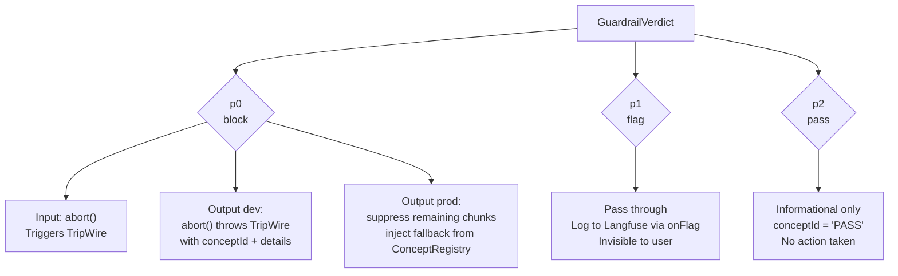
```mermaid
flowchart TD
    VERDICT["GuardrailVerdict"]

    VERDICT --> PRIORITY_BLOCK{"p0\nblock"}
    VERDICT --> PRIORITY_FLAG{"p1\nflag"}
    VERDICT --> PRIORITY_PASS{"p2\npass"}

    PRIORITY_BLOCK --> PRIORITY_BLOCK_IN["Input: abort()\nTriggers TripWire"]
    PRIORITY_BLOCK --> PRIORITY_BLOCK_OUT_DEV["Output dev:\nabort() throws TripWire\nwith conceptId + details"]
    PRIORITY_BLOCK --> PRIORITY_BLOCK_OUT_PROD["Output prod:\nsuppress remaining chunks\ninject fallback from ConceptRegistry"]

    PRIORITY_FLAG --> PRIORITY_FLAG_ACTION["Pass through\nLog to Langfuse via onFlag\nInvisible to user"]

    PRIORITY_PASS --> PRIORITY_PASS_ACTION["Informational only\nconceptId = 'PASS'\nNo action taken"]

```

### GuardMode Comparison

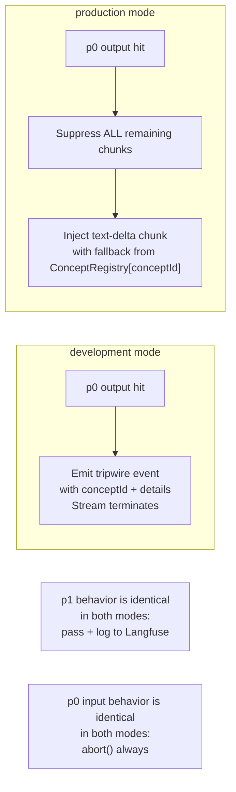
```mermaid
flowchart LR
    subgraph DEVELOPMENT_MODE["development mode"]
        DEV_P_ZERO["p0 output hit"]
        DEV_EMIT_TRIPWIRE["Emit tripwire event\nwith conceptId + details\nStream terminates"]
        DEV_P_ZERO --> DEV_EMIT_TRIPWIRE
    end

    subgraph PRODUCTION_MODE["production mode"]
        PROD_P_ZERO["p0 output hit"]
        PROD_SUPPRESS_REMAINING["Suppress ALL remaining chunks"]
        PROD_INJECT_FALLBACK["Inject text-delta chunk\nwith fallback from ConceptRegistry[conceptId]"]
        PROD_P_ZERO --> PROD_SUPPRESS_REMAINING --> PROD_INJECT_FALLBACK
    end

    NOTE["p1 behavior is identical\nin both modes:\npass + log to Langfuse"]
    NOTE_P_ZERO_INPUT["p0 input behavior is identical\nin both modes:\nabort() always"]
```

Development mode surfaces violations visibly so engineers can tune detection thresholds. Production mode hides all violation details from users and replaces blocked content with a server-defined fallback message.

## Input Guardrails (INPUT_GUARD)

Input guardrails run before intent detection. They protect against prompt injection, jailbreak attempts, and policy violations before the LLM ever processes the message. This pre-model boundary is also where malformed or unsafe user payloads are blocked early, reducing downstream security risk and preserving stable latency under load.

### Input Guardrail Flow

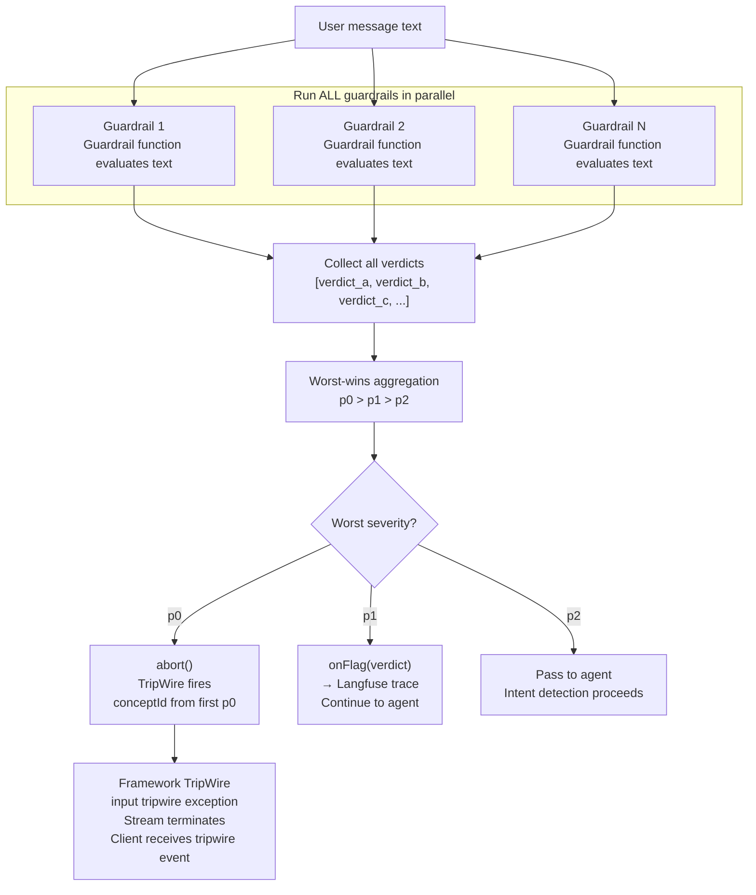
```mermaid
flowchart TB
    INPUT["User message text"]

    subgraph PARALLEL_GUARDRAIL_RUN["Run ALL guardrails in parallel"]
        GUARD_FIRST["Guardrail 1\nGuardrail function evaluates text"]
        GUARD_SECOND["Guardrail 2\nGuardrail function evaluates text"]
        GUARD_NTH["Guardrail N\nGuardrail function evaluates text"]
    end

    INPUT --> GUARD_FIRST & GUARD_SECOND & GUARD_NTH

    COLLECT["Collect all verdicts\n[verdict_a, verdict_b, verdict_c, ...]"]
    GUARD_FIRST & GUARD_SECOND & GUARD_NTH --> COLLECT

    AGGREGATE["Worst-wins aggregation\np0 > p1 > p2"]
    COLLECT --> AGGREGATE

    CHECK{Worst severity?}
    AGGREGATE --> CHECK

    CHECK -->|p0| ABORT["abort()\nTripWire fires\nconceptId from first p0"]
    CHECK -->|p1| FLAG["onFlag(verdict)\n→ Langfuse trace\nContinue to agent"]
    CHECK -->|p2| PASS["Pass to agent\nIntent detection proceeds"]

    ABORT --> TRIPWIRE["Framework TripWire\ninput tripwire exception\nStream terminates\nClient receives tripwire event"]
```

**Key behaviors**:

- All guardrails run in parallel regardless of intermediate results. There's no short-circuit on the first p0 — all verdicts are collected before aggregating.
- Worst-wins: if any guardrail returns p0, the aggregate is p0. If no p0 but any p1, aggregate is p1.
- When multiple guardrails return p0, the `conceptId` from the first p0 in the array order is used for the fallback message.
- The abort action maps to a true tripwire flag in the framework guardrail return value, which causes the framework to throw the input tripwire exception.

### Injection Detection Architecture

Input defense uses a three-tier ensemble because no single detector catches the full attack surface. Each tier contributes a different strength profile, and all tiers run in parallel for full coverage under normal operation.

- Tier 1 — Heuristic Pattern Layer (~0ms latency): Regex-driven detection of known injection signatures including role-override phrases, delimiter injection attempts, encoding obfuscation patterns such as base64 blobs and unicode homoglyphs, and imperative instruction-like patterns. This layer is the fast-reject filter with moderate recall (about 60 percent) and low false positive rate.
- Tier 2 — ML Classification Layer (~30ms latency): A trained injection classifier evaluates the input with stronger recall (about 80 percent) than heuristics, but still misses adaptive and novel obfuscation strategies. This layer runs in parallel with Tier 3.
- Tier 3 — LLM-as-Judge Layer (~300ms latency): A lightweight judge model returns structured classification output to determine whether the input attempts to override system instructions, impersonate system roles, or redirect agent behavior. This layer has the highest recall (about 85 percent and above) and captures novel attack phrasing. It runs in parallel with the main agent when tool side effects are read-only, and runs in blocking mode when tools can write or perform destructive actions.

Decision logic:

- Block if the LLM-as-judge layer triggers, even when it is the only triggered layer.
- Flag for review if any two of the three layers trigger.
- Pass if none trigger, or if only one non-LLM layer triggers.

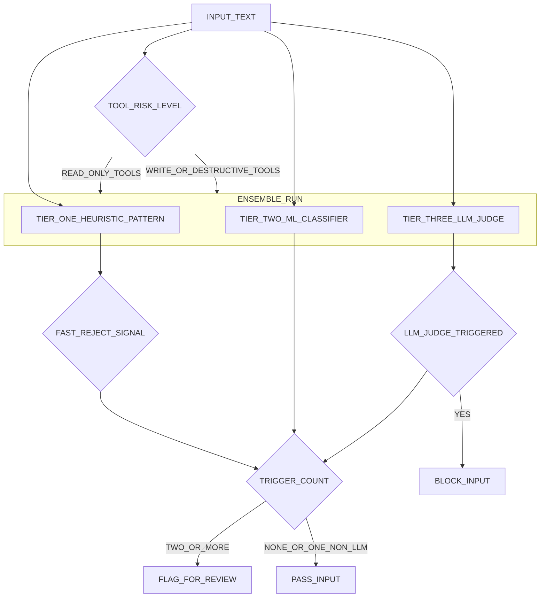
```mermaid
flowchart TB
    INPUT_TEXT[INPUT_TEXT]
    TOOL_RISK{TOOL_RISK_LEVEL}

    subgraph ENSEMBLE_RUN[ENSEMBLE_RUN]
        TIER_ONE[TIER_ONE_HEURISTIC_PATTERN]
        TIER_TWO[TIER_TWO_ML_CLASSIFIER]
        TIER_THREE[TIER_THREE_LLM_JUDGE]
    end

    FAST_REJECT{FAST_REJECT_SIGNAL}
    TIER_COUNT{TRIGGER_COUNT}
    LLM_TRIGGER{LLM_JUDGE_TRIGGERED}

    BLOCK[BLOCK_INPUT]
    FLAG[FLAG_FOR_REVIEW]
    PASS[PASS_INPUT]

    INPUT_TEXT --> TOOL_RISK
    TOOL_RISK -->|READ_ONLY_TOOLS| ENSEMBLE_RUN
    TOOL_RISK -->|WRITE_OR_DESTRUCTIVE_TOOLS| ENSEMBLE_RUN

    INPUT_TEXT --> TIER_ONE
    INPUT_TEXT --> TIER_TWO
    INPUT_TEXT --> TIER_THREE

    TIER_ONE --> FAST_REJECT
    FAST_REJECT --> TIER_COUNT
    TIER_TWO --> TIER_COUNT
    TIER_THREE --> LLM_TRIGGER
    LLM_TRIGGER --> TIER_COUNT

    LLM_TRIGGER -->|YES| BLOCK
    TIER_COUNT -->|TWO_OR_MORE| FLAG
    TIER_COUNT -->|NONE_OR_ONE_NON_LLM| PASS
```

## Output Guardrails (OUTPUT_GUARD)

Output guardrails run on the orchestrator's synthesis stream via the framework's output guardrail interface. They see every streaming chunk as it arrives from the LLM. In production they operate as a last-mile response security layer, preventing unsafe content leaks, feeding auditable `onFlag` events, and aligning with sensitive-data redaction in observability sinks.

### Sliding Window Buffer

Pattern detection across streaming text requires context. A single chunk might be `"I can help you make"` — harmless alone. The next chunk `" a bomb"` completes the violation. The sliding window accumulates recent text so guardrails see enough context to detect multi-token patterns.

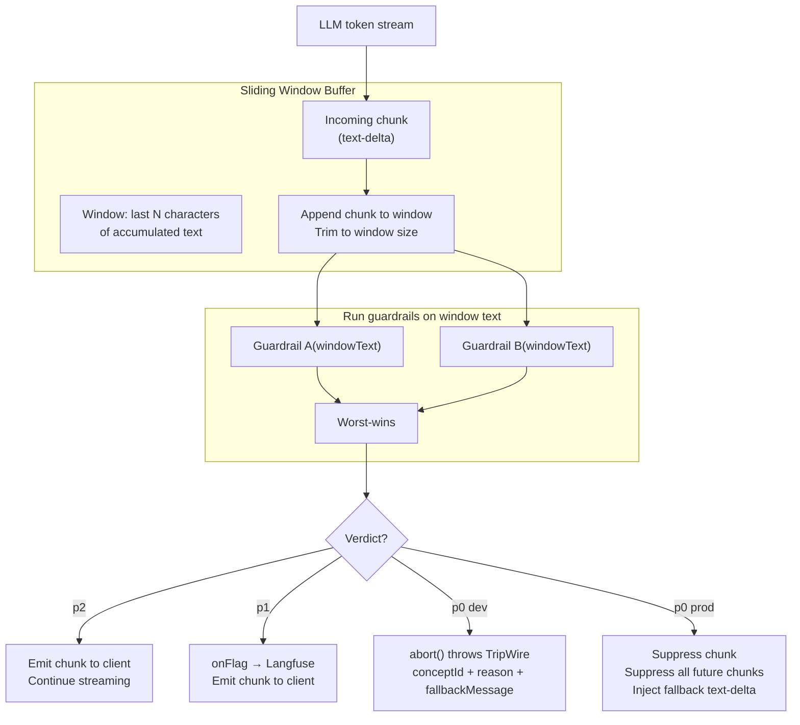
```mermaid
flowchart TB
    STREAM["LLM token stream"]

    subgraph BUFFER["Sliding Window Buffer"]
        CHUNK["Incoming chunk\n(text-delta)"]
        WINDOW["Window: last N characters\nof accumulated text"]
        APPEND["Append chunk to window\nTrim to window size"]
    end

    STREAM --> CHUNK --> APPEND

    subgraph WINDOW_GUARDRAIL_RUN["Run guardrails on window text"]
        GUARD_A_WINDOW["Guardrail A(windowText)"]
        GUARD_B_WINDOW["Guardrail B(windowText)"]
        AGG["Worst-wins"]
    end

    APPEND --> GUARD_A_WINDOW & GUARD_B_WINDOW --> AGG

    DECISION{Verdict?}
    AGG --> DECISION

    DECISION -->|p2| EMIT["Emit chunk to client\nContinue streaming"]
    DECISION -->|p1| FLAG_EMIT["onFlag → Langfuse\nEmit chunk to client"]
    DECISION -->|p0 dev| TRIPWIRE_CHUNK["abort() throws TripWire\nconceptId + reason + fallbackMessage"]
    DECISION -->|p0 prod| SUPPRESS["Suppress chunk\nSuppress all future chunks\nInject fallback text-delta"]
```

The window size is configurable. Larger windows catch longer patterns but add more text to each guardrail evaluation. The default is tuned for typical sentence-length violations.

### Output Guardrail Modes

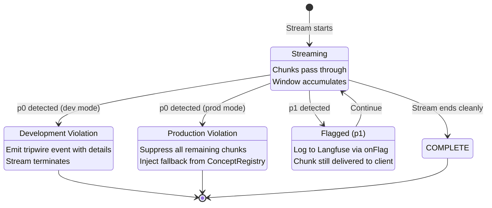
```mermaid
stateDiagram-v2
    [*] --> STREAMING: Stream starts

    STREAMING: Streaming
    STREAMING: Chunks pass through
    STREAMING: Window accumulates

    STREAMING --> VIOLATION_DEV: p0 detected (dev mode)
    STREAMING --> VIOLATION_PROD: p0 detected (prod mode)
    STREAMING --> FLAGGED: p1 detected
    STREAMING --> COMPLETE: Stream ends cleanly

    VIOLATION_DEV: Development Violation
    VIOLATION_DEV: Emit tripwire event with details
    VIOLATION_DEV: Stream terminates

    VIOLATION_PROD: Production Violation
    VIOLATION_PROD: Suppress all remaining chunks
    VIOLATION_PROD: Inject fallback from ConceptRegistry

    FLAGGED: Flagged (p1)
    FLAGGED: Log to Langfuse via onFlag
    FLAGGED: Chunk still delivered to client

    FLAGGED --> STREAMING: Continue

    VIOLATION_DEV --> [*]
    VIOLATION_PROD --> [*]
    COMPLETE --> [*]
```

### Output-Side Injection Detection

- System prompt leakage detection: Output guardrails check for leaked system-prompt content using fingerprint-based matching so paraphrased leakage is caught in addition to exact fragments.
- Attention collapse detection: Output guardrails flag responses that over-index on a single retrieved chunk while ignoring the user query, since this pattern can indicate indirect injection success through retrieved content.

## Zero-Leak Buffered Mode (ZERO_LEAK_GUARD)

Standard streaming output guardrails have a fundamental problem: by the time a violation is detected, some chunks may already have been sent to the client. In production, even a partial toxic response is unacceptable.

Zero-leak buffered mode solves this by holding all output in a server-side buffer before any bytes reach the client.

### Buffered Mode Flow

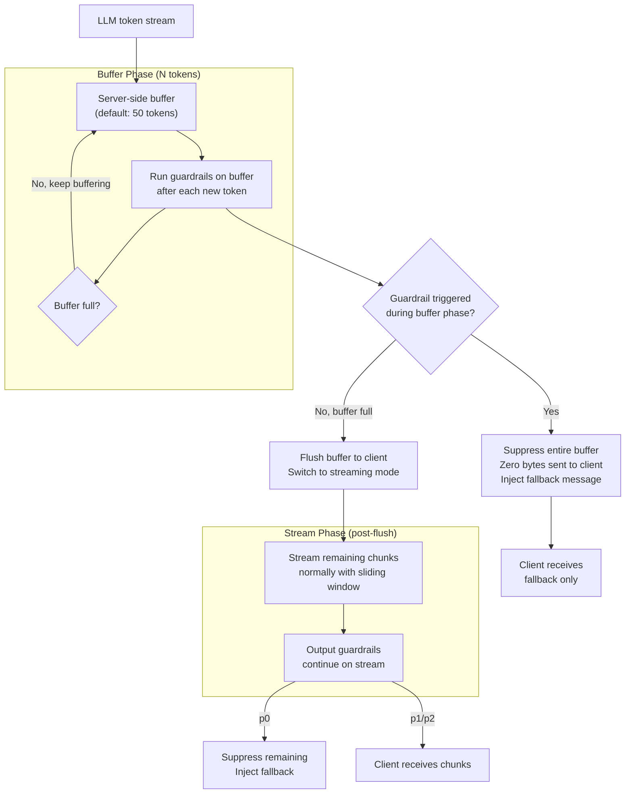
```mermaid
flowchart TB
    LLM["LLM token stream"]

    subgraph BUFFER_PHASE["Buffer Phase (N tokens)"]
        BUFFER["Server-side buffer\n(default: 50 tokens)"]
        GUARD_CHECK["Run guardrails on buffer\nafter each new token"]
        FILL{Buffer full?}
    end

    LLM --> BUFFER
    BUFFER --> GUARD_CHECK
    GUARD_CHECK --> FILL

    FILL -->|No, keep buffering| BUFFER

    VIOLATION{Guardrail triggered\nduring buffer phase?}
    GUARD_CHECK --> VIOLATION

    VIOLATION -->|Yes| SUPPRESS_ALL["Suppress entire buffer\nZero bytes sent to client\nInject fallback message"]
    VIOLATION -->|No, buffer full| FLUSH["Flush buffer to client\nSwitch to streaming mode"]

    subgraph STREAM_PHASE["Stream Phase (post-flush)"]
        STREAM_CHUNKS["Stream remaining chunks\nnormally with sliding window"]
        STREAM_GUARD["Output guardrails\ncontinue on stream"]
    end

    FLUSH --> STREAM_CHUNKS
    STREAM_CHUNKS --> STREAM_GUARD

    STREAM_GUARD -->|p0| SUPPRESS_STREAM["Suppress remaining\nInject fallback"]
    STREAM_GUARD -->|p1/p2| CLIENT["Client receives chunks"]

    SUPPRESS_ALL --> CLIENT_FALLBACK["Client receives\nfallback only"]
```

**Trade-offs**:

| Property | Standard Streaming | Buffered Mode |
|----------|-------------------|---------------|
| Time to first token | Immediate | Delayed by buffer fill time |
| Partial leak risk | Possible | Zero |
| Memory overhead | Minimal | Buffer size per active stream |
| Best for | Development, low-risk content | Production, high-stakes content |

The buffer size (default 50 tokens) is configurable per pipeline. Larger buffers give guardrails more context before the first byte reaches the client, at the cost of higher initial latency. The buffer fill time is roughly `(buffer_tokens / tokens_per_second)` — at 50 tokens/s, a 50-token buffer adds ~1 second of initial latency.

## Guardrail Authoring Factories (GUARD_FACTORY)

The library ships five factory functions. Servers use these to compose their detection logic. The five generic factories ship no built-in detection rules. Detection logic is either server-defined (via factories) or consumed from library-provided specialised guardrails (LANG_GUARD, HATE_SPEECH_GUARD) that wrap external detection libraries.

### Factory Overview

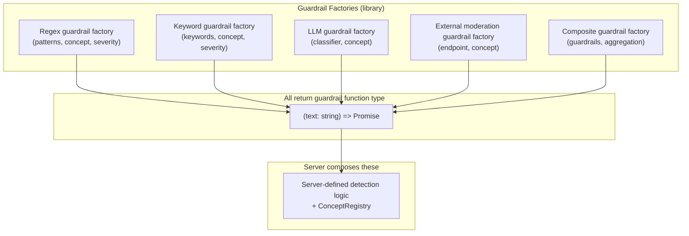
```mermaid
flowchart TB
    subgraph GUARDRAIL_FACTORIES["Guardrail Factories (library)"]
        REGEX["Regex guardrail factory\n(patterns, concept, severity)"]
        KEYWORD["Keyword guardrail factory\n(keywords, concept, severity)"]
        LLM_G["LLM guardrail factory\n(classifier, concept)"]
        EXTERNAL["External moderation guardrail factory\n(endpoint, concept)"]
        COMPOSITE["Composite guardrail factory\n(guardrails, aggregation)"]
    end

    subgraph OUTPUT["All return guardrail function type"]
        FN["(text: string) => Promise<GuardrailVerdict>"]
    end

    REGEX & KEYWORD & LLM_G & EXTERNAL & COMPOSITE --> FN

    subgraph USAGE["Server composes these"]
        SERVER_LOGIC["Server-defined detection logic\n+ ConceptRegistry"]
    end

    FN --> SERVER_LOGIC
```

**Regex guardrail factory** — accepts patterns, a concept ID, and a severity level.
Runs one or more regular expressions against the text. If any pattern matches, returns the given severity and conceptId. Fast, deterministic, zero latency. Best for known-bad patterns, PII formats, and structural violations.

**Keyword guardrail factory** — accepts keywords, a concept ID, and a severity level.
Case-insensitive keyword matching. Simpler than regex but sufficient for blocklist enforcement. Runs synchronously.

**LLM guardrail factory**
Calls a small classifier model (uses the primary model by default) to evaluate the text. Returns a verdict based on the model's output. Slower than regex but catches semantic violations that patterns miss. The classifier callback is a function the server provides — it receives the text and returns a severity.

**External moderation guardrail factory**
Sends the text to an external moderation endpoint and maps the response to a verdict. Enables integration with third-party moderation APIs (OpenAI Moderation, AWS Comprehend, custom services). The endpoint contract is defined by the server. Accepts a `failMode` config field: `'open'` (default — network errors return `p2 PASS`, logging a warning) or `'closed'` (network errors return `p0` with the configured conceptId, treating unreachable moderation as a block). The `failMode` field is required in the factory config object.

**Composite guardrail factory**
Combines multiple guardrail function type instances into one. The aggregation strategy determines how verdicts are combined. Default aggregation is worst-wins.

### Composite Guardrail Composition

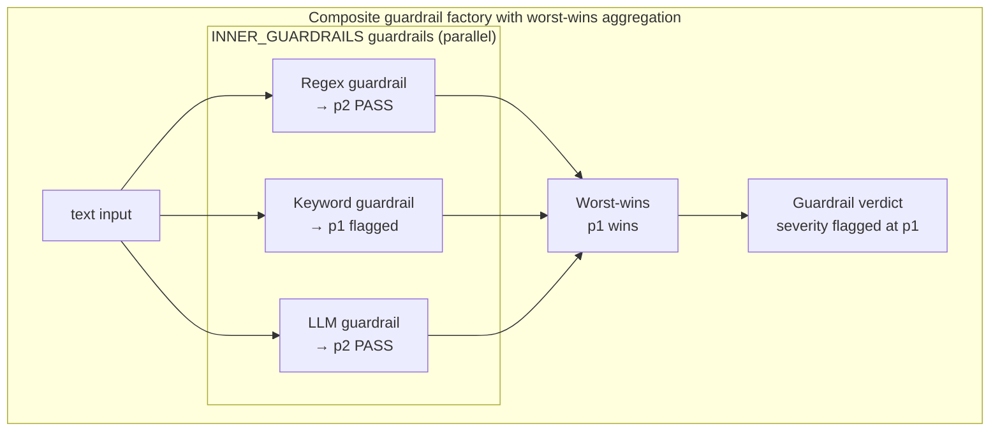
```mermaid
flowchart TB
    subgraph COMPOSITE_GUARDRAIL["Composite guardrail factory with worst-wins aggregation"]
        INPUT_C["text input"]

        subgraph INNER_GUARDRAILS["INNER_GUARDRAILS guardrails (parallel)"]
            INNER_REGEX_GUARDRAIL["Regex guardrail\n→ p2 PASS"]
            INNER_KEYWORD_GUARDRAIL["Keyword guardrail\n→ p1 flagged"]
            INNER_LLM_GUARDRAIL["LLM guardrail\n→ p2 PASS"]
        end

        AGG_C["Worst-wins\np1 wins"]
        RESULT_C["Guardrail verdict\nseverity flagged at p1"]
    end

    INPUT_C --> INNER_REGEX_GUARDRAIL & INNER_KEYWORD_GUARDRAIL & INNER_LLM_GUARDRAIL
    INNER_REGEX_GUARDRAIL & INNER_KEYWORD_GUARDRAIL & INNER_LLM_GUARDRAIL --> AGG_C --> RESULT_C
```

The composite factory is the primary composition tool. It always runs its constituent guardrails in parallel and aggregates their verdicts. Sequential layering (e.g., run regex first, then keyword matching, then an LLM classifier only if cheaper checks pass) is achieved inside a single custom guardrail function type implementation, not via the composite factory. A server might define a single content-policy guardrail function type implementation that internally runs staged checks. This layered approach keeps average latency low while maintaining thorough coverage.

## Language Guard (LANG_GUARD)

Language Guard is an opt-in guardrail that ensures the agent never responds in an unsupported language. It is not active by default. The server must explicitly enable it with a LanguageGuardConfig.

### Purpose

- Prevent unsupported-language output before synthesis reaches users.
- Keep low-latency behavior for clear cases.
- Resolve ambiguous language and translation intent using the intent stage that already runs.

### Architecture

Language Guard uses a two-stage design:

- Fast Detect — Fast Library Check (< 1ms): runs eld on input text. If language is clearly unsupported and no translation keywords are present, return p0 immediately. If language is clearly supported and no translation keywords are present, pass immediately. If confidence is low, input is mixed language, or translation keywords are present, defer to Post-Intent Gate.
- Intent detection step (existing pipeline stage): the intent system runs and returns language fields piggybacked in the same structured output generation result.
- Post-Intent Gate — Post-intent language gate (zero additional model latency): this is not an input guardrail in the guardrail function type sense. It runs after intent detection returns and checks intendedOutputLanguage from the intent result. If intendedOutputLanguage is outside supportedLanguages, return p0.
- Output scanner: eld also runs on the output sliding window to detect language drift during streaming. The output scanner must run with unrestricted eld detection (no setLanguageSubset), then block only when the detected dominant language is outside supportedLanguages.

### Enforcement boundary clarification

Post-Intent Gate is an enforcement gate between intent detection and orchestrator execution, not a guardrail function type-style input guard. The ordering is fixed:

1. Fast Detect input guardrail runs in parallel with other input guards and handles clear allow/block cases quickly.
2. Intent detection runs (embedding router plus LLM validator) and returns intendedOutputLanguage, hasTranslationIntent, and translationTargetLanguage.
3. Post-Intent Gate post-intent gate evaluates intendedOutputLanguage and blocks unsupported output targets before orchestration.

### Configuration

LanguageGuardConfig fields:

- supportedLanguages: allowed output language set.
- fallbackMessage: safe response used when p0 blocks.
- minTextLength: skip very short text checks below threshold.
- confidenceThreshold: minimum eld confidence for direct stage decision.
- translationKeywords: a language-keyed map of keyword lists, covering both translation commands and language-instruction patterns (for example, translate, respond in X, answer in X, write in X, noi bang X) so ambiguous requests route to the Post-Intent Gate.

### End-to-end flow

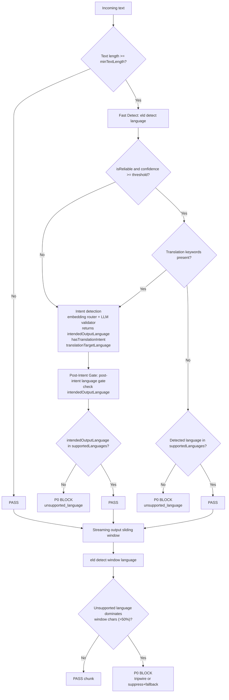
```mermaid
flowchart TB
    INPUT["Incoming text"]
    LEN{"Text length >= minTextLength?"}
    PASS_SHORT["PASS"]

    FAST_DETECT["Fast Detect: eld detect language"]
    RELIABLE{"isReliable and confidence >= threshold?"}
    KEYWORDS{"Translation keywords present?"}
    SUPPORTED{"Detected language in supportedLanguages?"}
    BLOCK_FAST["P0 BLOCK\nunsupported_language"]
    PASS_FAST["PASS"]

    INTENT_RUN["Intent detection\nembedding router + LLM validator\nreturns intendedOutputLanguage\nhasTranslationIntent\ntranslationTargetLanguage"]
    POST_INTENT_GATE_NODE["Post-Intent Gate: post-intent language gate\ncheck intendedOutputLanguage"]
    OUT_SUPPORTED{"intendedOutputLanguage in supportedLanguages?"}
    BLOCK_INTENT["P0 BLOCK\nunsupported_language"]
    PASS_INTENT["PASS"]

    OUTPUT_WINDOW["Streaming output sliding window"]
    OUTPUT_DETECT["eld detect window language"]
    OUTPUT_DOMINANT{"Unsupported language dominates\nwindow chars (>50%)?"}
    OUTPUT_PASS["PASS chunk"]
    OUTPUT_BLOCK["P0 BLOCK\ntripwire or suppress+fallback"]

    INPUT --> LEN
    LEN -->|No| PASS_SHORT
    LEN -->|Yes| FAST_DETECT
    FAST_DETECT --> RELIABLE
    RELIABLE -->|No| INTENT_RUN
    RELIABLE -->|Yes| KEYWORDS
    KEYWORDS -->|Yes| INTENT_RUN
    KEYWORDS -->|No| SUPPORTED
    SUPPORTED -->|No| BLOCK_FAST
    SUPPORTED -->|Yes| PASS_FAST
    INTENT_RUN --> POST_INTENT_GATE_NODE
    POST_INTENT_GATE_NODE --> OUT_SUPPORTED
    OUT_SUPPORTED -->|No| BLOCK_INTENT
    OUT_SUPPORTED -->|Yes| PASS_INTENT

    PASS_FAST --> OUTPUT_WINDOW
    PASS_INTENT --> OUTPUT_WINDOW
    PASS_SHORT --> OUTPUT_WINDOW
    OUTPUT_WINDOW --> OUTPUT_DETECT --> OUTPUT_DOMINANT
    OUTPUT_DOMINANT -->|No| OUTPUT_PASS
    OUTPUT_DOMINANT -->|Yes| OUTPUT_BLOCK
```

Output scanner note: use unrestricted eld detection for output windows and compare the detected language against supportedLanguages. Do not call setLanguageSubset in the output scanner path, or unsupported-language drift cannot be detected reliably.

Dominance rule: trigger p0 only when unsupported language is dominant in the sliding window (for example, more than 50 percent of window characters). Short foreign fragments embedded in supported-language text should not trigger a block.

### Edge case matrix

| Scenario | Stage behavior | Result |
|---|---|---|
| Input=English, intent=translate to Chinese | Fast Detect sees translation keywords and defers to Post-Intent Gate. Post-Intent Gate resolves intended output as Chinese, outside supportedLanguages. | BLOCK (p0) |
| Input=Chinese, intent=translate to Vietnamese | Fast Detect defers due to translation intent. Post-Intent Gate resolves intended output as Vietnamese, inside supportedLanguages. | ALLOW |
| Input=English with Chinese place name | Fast Detect detects supported dominant language and no translation intent. No Post-Intent Gate needed. | ALLOW |
| Mixed language, ambiguous | Fast Detect confidence is low or mixed, so Post-Intent Gate intent resolution decides output language. | Post-Intent Gate decision |

### Opt-in behavior

Language Guard runs only when the server explicitly enables LanguageGuardConfig. Without config, the pipeline behaves exactly as before.

## Hate Speech Guard (HATE_SPEECH_GUARD)

Hate Speech Guard is an opt-in guardrail that blocks hate speech and profanity in both input and output. It is not active by default. The server must explicitly enable it.

### Purpose

- Block abusive content early on input.
- Prevent unsafe output from reaching users.
- Combine strong English evasion resistance with broad multilingual coverage.

### Architecture

Hate Speech Guard uses a hybrid matching engine:

- English engine: obscenity library, including leet-speak handling, Unicode confusables, character repetition handling, 70 patterns with transformer pipeline, and built-in whitelist entries.
- Multilingual engine: @2toad/profanity across en, ar, de, es, fr, hi, it, ja, ko, pt, ru, zh with Unicode word boundaries for CJK, Arabic, and Hindi, plus 3,739 words.
- Data supplement: LDNOOBW via naughty-words npm package (CC-BY-4.0), used to supplement thinner language lists including Thai, Korean, and Arabic.
- Vietnamese seed lists: curated terms from blue-eyes-vn/vietnamese-offensive-words and KienCuong2004/VNOffensiveWords.
- PARALLEL_GUARDRAIL_RUN execution rule: both engines run in parallel on every input and every output sliding window evaluation. Any match returns p0.

### Configuration

HateSpeechGuardConfig fields:

- enabled: boolean opt-in toggle.
- excludeWords: allowlist words to skip.
- additionalWords: custom terms appended to blocklists.
- languages: language list selection for multilingual matching.
- fallbackMessage: safe response when p0 blocks.

### Hybrid engine flow

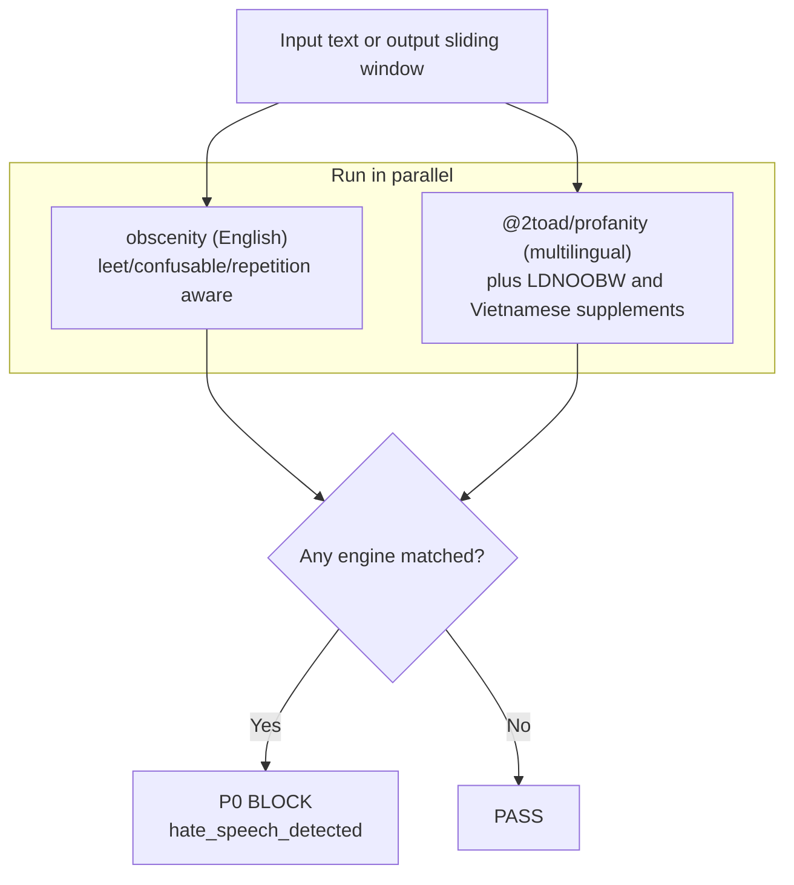
```mermaid
flowchart TB
    INPUT["Input text or output sliding window"]

    subgraph PARALLEL_ENGINES["Run in parallel"]
        EN_ENGINE["obscenity (English)\nleet/confusable/repetition aware"]
        MULTI_ENGINE["@2toad/profanity (multilingual)\nplus LDNOOBW and Vietnamese supplements"]
    end

    INPUT --> EN_ENGINE
    INPUT --> MULTI_ENGINE

    EITHER{"Any engine matched?"}
    EN_ENGINE --> EITHER
    MULTI_ENGINE --> EITHER

    BLOCK["P0 BLOCK\nhate_speech_detected"]
    PASS["PASS"]

    EITHER -->|Yes| BLOCK
    EITHER -->|No| PASS
```

### Opt-in behavior

Hate Speech Guard runs only when enabled is true in HateSpeechGuardConfig. Disabled mode always passes.

## Memory Deletion Guardrail

When facts are deleted from SurrealDB via the memory deletion tool, the guardrail system ensures cached embeddings in Valkey that reference those facts are also purged. Without this, deleted facts could resurface through stale cache entries during the next recall query.

The deletion guardrail:
- Triggers after any memory deletion tool execution
- Queries Valkey for cached embedding entries referencing the deleted fact IDs
- Purges matching cache entries
- Logs the purge for audit trail
- Operates as a post-execution output guardrail (runs after the tool completes, before the next agent turn)

### Deletion Guardrail Flow

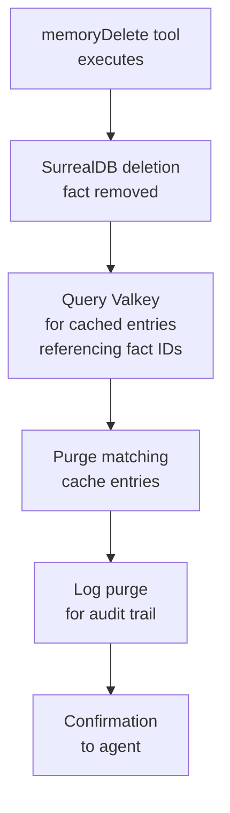
```mermaid
flowchart TB
    MEMORY_DELETE["memoryDelete tool\nexecutes"]
    SURREALDB_DELETE["SurrealDB deletion\nfact removed"]
    VALKEY_QUERY["Query Valkey\nfor cached entries\nreferencing fact IDs"]
    CACHE_PURGE["Purge matching\ncache entries"]
    AUDIT_LOG["Log purge\nfor audit trail"]
    CONFIRMATION["Confirmation\nto agent"]

    MEMORY_DELETE --> SURREALDB_DELETE
    SURREALDB_DELETE --> VALKEY_QUERY
    VALKEY_QUERY --> CACHE_PURGE
    CACHE_PURGE --> AUDIT_LOG
    AUDIT_LOG --> CONFIRMATION
```

## Code Execution Sandboxing

When any agent executes model-generated code for coding, analysis, or tool orchestration, execution must occur outside application servers in a hardened isolation boundary. This requirement is mandatory for all tenants and all environments.

### Mandatory Isolation Boundary

- All model-generated code execution MUST run in an isolated sandbox environment with strong separation guarantees, such as microVM, container, or equivalent hardware-level isolation.
- Direct execution on application servers MUST be disallowed by default.
- Isolation controls MUST cover process, filesystem, memory, and network boundaries.

### Sandbox Provider Abstraction

The framework SHALL provide a provider-agnostic sandbox capability layer that supports:

- Execute code workloads
- Controlled file upload and download
- Sandbox lifecycle management (create, monitor, terminate, dispose)
- Deterministic cleanup and disposal

Reference provider plugins:

- E2B (Firecracker microVMs, approximately 150ms cold start)
- Modal (gVisor isolation)
- Daytona (Docker containers, approximately 90ms cold start)

### Security Boundary Requirements

- Sandboxes MUST prevent secret leakage from host or control-plane environments.
- Sandboxes MUST enforce controls against resource exhaustion, including runaway compute and disk growth.
- Sandboxes MUST maintain escape-resistant boundaries to reduce container or VM breakout risk.
- Sandboxes MUST restrict outbound and inbound network access to an explicit allowlist.

### Runtime Controls

- Resource limits MUST be configurable per sandbox instance, including CPU, memory, disk, and network quotas.
- Maximum execution duration MUST be enforced with hard termination at timeout.
- File transfer flows MUST enforce size limits, content validation, and policy checks before acceptance.
- Ephemeral lifecycle MUST be the default mode: create per execution and destroy after completion.
- Persistent lifecycle MAY be enabled only for approved multi-step workflows that require state continuity.

### Secure Fallback Behavior

- If code execution is requested without a configured sandbox provider, the framework SHALL emit a prominent runtime warning.
- Any insecure execution path MUST require explicit opt-out acknowledgment before execution can continue.
- This warning and acknowledgment event MUST be captured in audit telemetry.

### MCP and Compliance Integration

- Sandboxes MAY expose MCP servers so sandbox capabilities are available as agent tools, aligned with MCP client orchestration in the Agents & Orchestration document.
- Every code execution MUST produce an audit trail containing execution request metadata, inputs, outputs, policy decisions, and resource usage, aligned with provenance requirements in the Observability document.
- Sandbox compute costs MUST be attributed to the requesting agent, user, and tenant for budget governance alignment with the Server Implementation and Infrastructure documents.

### Sandbox Execution Flow

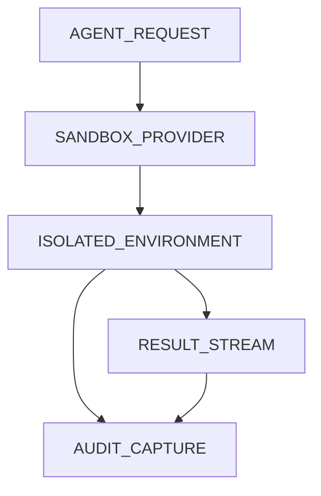
```mermaid
flowchart TB
    AGENT_REQUEST[AGENT_REQUEST]
    SANDBOX_PROVIDER[SANDBOX_PROVIDER]
    ISOLATED_ENVIRONMENT[ISOLATED_ENVIRONMENT]
    RESULT_STREAM[RESULT_STREAM]
    AUDIT_CAPTURE[AUDIT_CAPTURE]

    AGENT_REQUEST --> SANDBOX_PROVIDER
    SANDBOX_PROVIDER --> ISOLATED_ENVIRONMENT
    ISOLATED_ENVIRONMENT --> RESULT_STREAM
    ISOLATED_ENVIRONMENT --> AUDIT_CAPTURE
    RESULT_STREAM --> AUDIT_CAPTURE
```

## Multi-Guardrail Aggregation (Worst-Wins)

When multiple guardrails run in parallel, their verdicts must be combined into a single decision. The worst-wins rule is simple and safe: the most severe verdict always wins.

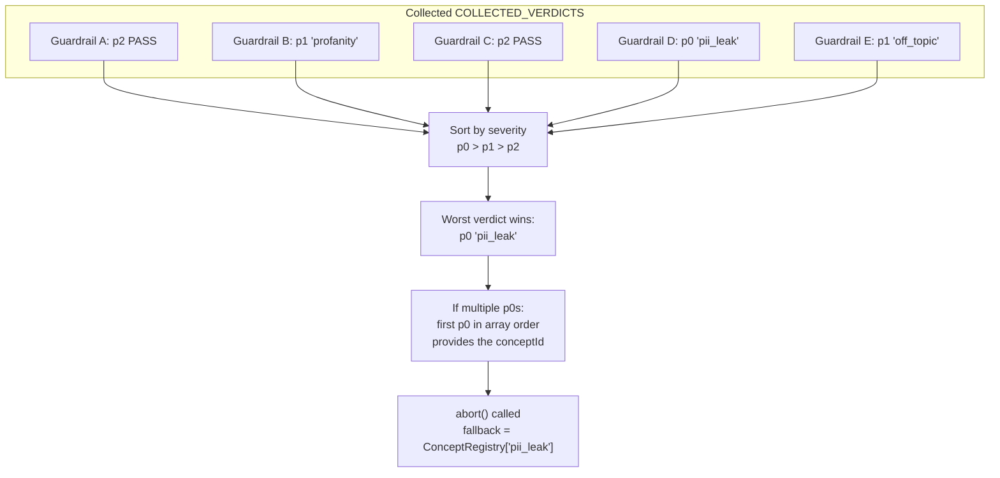
```mermaid
flowchart TB
    subgraph COLLECTED_VERDICTS["Collected COLLECTED_VERDICTS"]
        GA["Guardrail A: p2 PASS"]
        GB["Guardrail B: p1 'profanity'"]
        GC["Guardrail C: p2 PASS"]
        GD["Guardrail D: p0 'pii_leak'"]
        GE["Guardrail E: p1 'off_topic'"]
    end

    SORT["Sort by severity\np0 > p1 > p2"]
    GA & GB & GC & GD & GE --> SORT

    WORST["Worst verdict wins:\np0 'pii_leak'"]
    SORT --> WORST

    NOTE["If multiple p0s:\nfirst p0 in array order\nprovides the conceptId"]
    WORST --> NOTE

    ACTION["abort() called\nfallback = ConceptRegistry['pii_leak']"]
    NOTE --> ACTION
```

The ordering of guardrails in the pipeline array matters only for tie-breaking when multiple p0s fire simultaneously. The server controls this ordering when constructing the pipeline config.

## Pipeline Orchestrator (GUARD_PIPELINE)

The pipeline orchestrator wires all guardrails into the `@openai/agents` framework's guardrail system. It's the glue between the library's guardrail functions and the agent's framework guardrail arrays.

### Pipeline Configuration

The guardrail pipeline configuration is the top-level configuration object with these fields: input guardrails (an array of guardrail function type instances, run before the agent in parallel), output guardrails (an array of guardrail function type instances, run on each output chunk), concepts (a concept registry mapping conceptId to fallback message), guard mode (either `'development'` or `'production'`), and `onFlag` (a callback invoked on p1 verdicts for Langfuse logging).

### GuardMode Precedence

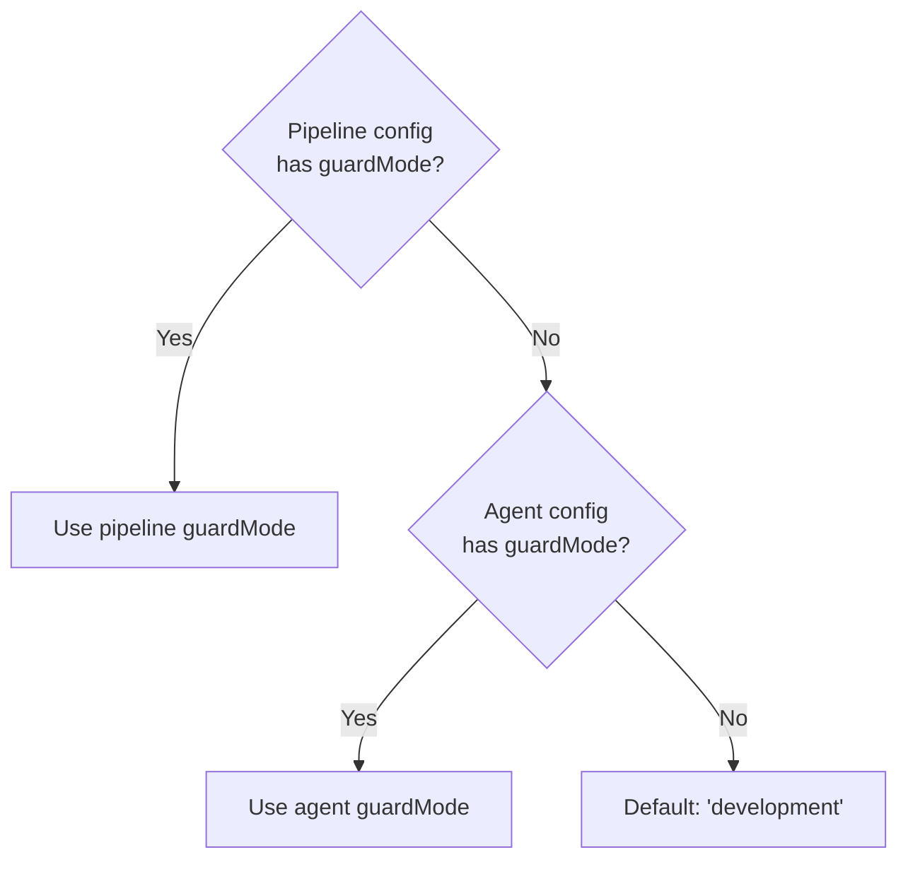
```mermaid
flowchart TB
    CHECK_PIPELINE{Pipeline config\nhas guardMode?}
    CHECK_PIPELINE -->|Yes| USE_PIPELINE["Use pipeline guardMode"]
    CHECK_PIPELINE -->|No| CHECK_AGENT{Agent config\nhas guardMode?}
    CHECK_AGENT -->|Yes| USE_AGENT["Use agent guardMode"]
    CHECK_AGENT -->|No| DEFAULT["Default: 'development'"]
```

The pipeline-level setting overrides the agent-level setting. If neither is set, the system defaults to `'development'` — a safe default that surfaces violations visibly rather than silently suppressing them.

### Processor Wiring

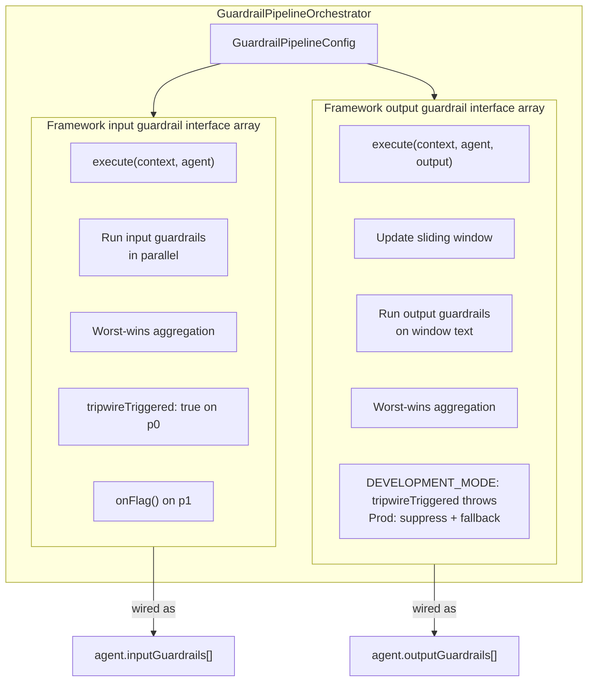
```mermaid
flowchart TB
    subgraph PIPELINE_ORCHESTRATOR["GuardrailPipelineOrchestrator"]
        CONFIG["GuardrailPipelineConfig"]

        subgraph FRAMEWORK_INPUT_GUARDRAILS["Framework input guardrail interface array"]
            INPUT_EXECUTE_HOOK["execute(context, agent)"]
            INPUT_PARALLEL_RUN["Run input guardrails\nin parallel"]
            INPUT_WORST_WINS["Worst-wins aggregation"]
            INPUT_TRIPWIRE_RESULT["tripwireTriggered: true on p0"]
            INPUT_FLAG_RESULT["onFlag() on p1"]
        end

        subgraph FRAMEWORK_OUTPUT_GUARDRAILS["Framework output guardrail interface array"]
            OUTPUT_EXECUTE_HOOK["execute(context, agent, output)"]
            OUTPUT_WINDOW_UPDATE["Update sliding window"]
            OUTPUT_GUARDRAIL_RUN["Run output guardrails\non window text"]
            OUTPUT_WORST_WINS["Worst-wins aggregation"]
            OUTPUT_ACTION_RESULT["DEVELOPMENT_MODE: tripwireTriggered throws\nProd: suppress + fallback"]
        end
    end

    CONFIG --> FRAMEWORK_INPUT_GUARDRAILS
    CONFIG --> FRAMEWORK_OUTPUT_GUARDRAILS

    FRAMEWORK_INPUT_GUARDRAILS -->|wired as| AGENT_INPUT_GUARDRAILS["agent.inputGuardrails[]"]
    FRAMEWORK_OUTPUT_GUARDRAILS -->|wired as| AGENT_OUTPUT_GUARDRAILS["agent.outputGuardrails[]"]
```

The guardrail pipeline factory takes the guardrail pipeline configuration and returns framework-compatible input and output guardrail arrays ready to be passed to the agent constructor. The agent factory (AGENT_FACTORY) accepts these guardrails and wires them into the framework agent constructor.

### Full Pipeline Flow

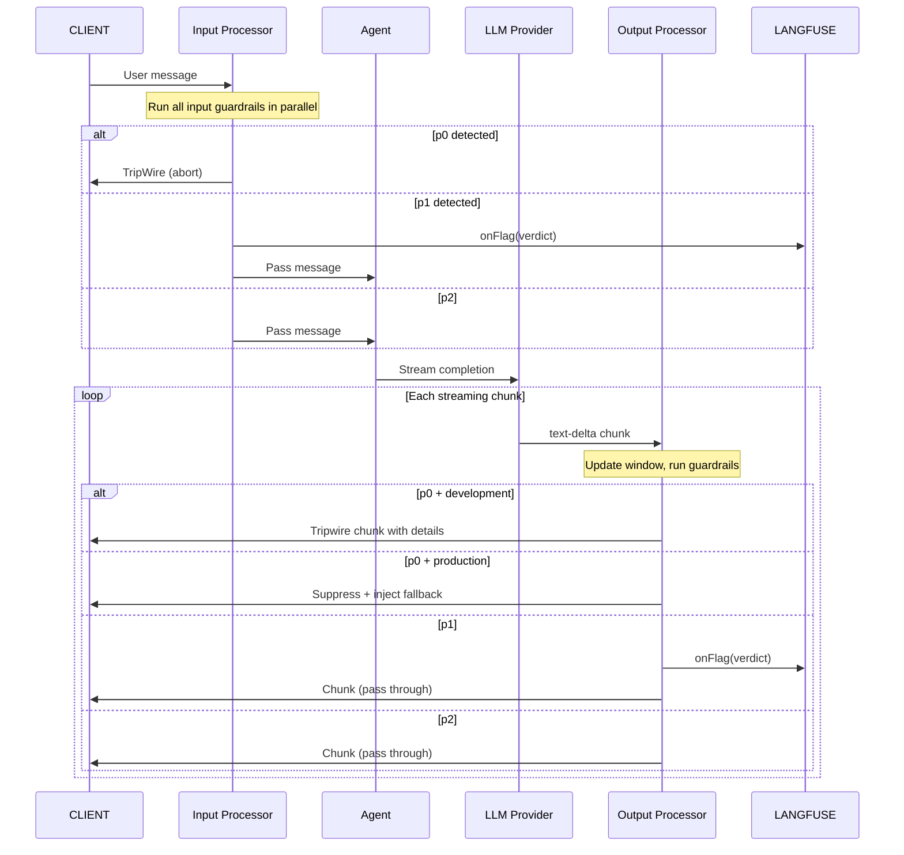
```mermaid
sequenceDiagram
    participant CLIENT
    participant INPUT_PROCESSOR as Input Processor
    participant AGENT as Agent
    participant LLM_PROVIDER as LLM Provider
    participant OUTPUT_PROCESSOR as Output Processor
    participant LANGFUSE

    CLIENT->>INPUT_PROCESSOR: User message

    Note over INPUT_PROCESSOR: Run all input guardrails in parallel

    alt p0 detected
        INPUT_PROCESSOR->>CLIENT: TripWire (abort)
    else p1 detected
        INPUT_PROCESSOR->>LANGFUSE: onFlag(verdict)
        INPUT_PROCESSOR->>AGENT: Pass message
    else p2
        INPUT_PROCESSOR->>AGENT: Pass message
    end

    AGENT->>LLM_PROVIDER: Stream completion

    loop Each streaming chunk
        LLM_PROVIDER->>OUTPUT_PROCESSOR: text-delta chunk
        Note over OUTPUT_PROCESSOR: Update window, run guardrails

        alt p0 + development
            OUTPUT_PROCESSOR->>CLIENT: Tripwire chunk with details
        else p0 + production
            OUTPUT_PROCESSOR->>CLIENT: Suppress + inject fallback
        else p1
            OUTPUT_PROCESSOR->>LANGFUSE: onFlag(verdict)
            OUTPUT_PROCESSOR->>CLIENT: Chunk (pass through)
        else p2
            OUTPUT_PROCESSOR->>CLIENT: Chunk (pass through)
        end
    end
```

## Integration with the Agent Architecture

### Where Guardrails Fit

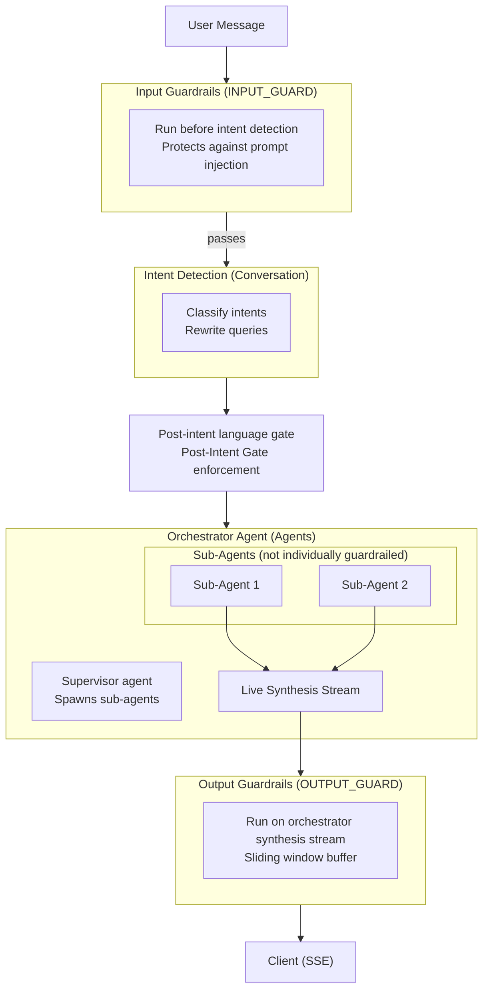
```mermaid
flowchart TB
    USER_MSG["User Message"]

    subgraph INPUT_GUARDRAIL_LAYER["Input Guardrails (INPUT_GUARD)"]
        IG["Run before intent detection\nProtects against prompt injection"]
    end

    subgraph INTENT_DETECTION["Intent Detection (Conversation)"]
        ID["Classify intents\nRewrite queries"]
    end

    POST_INTENT_GATE["Post-intent language gate\nPost-Intent Gate enforcement"]

    subgraph ORCHESTRATOR_AGENT["Orchestrator Agent (Agents)"]
        ORCH_AGENT["Supervisor agent\nSpawns sub-agents"]

        subgraph SUB_AGENTS["Sub-Agents (not individually guardrailed)"]
            SUB_AGENT_ONE["Sub-Agent 1"]
            SUB_AGENT_TWO["Sub-Agent 2"]
        end

        SYNTH["Live Synthesis Stream"]
    end

    subgraph OUTPUT_GUARDRAIL_LAYER["Output Guardrails (OUTPUT_GUARD)"]
        OG["Run on orchestrator synthesis stream\nSliding window buffer"]
    end

    CLIENT["Client (SSE)"]

    USER_MSG --> INPUT_GUARDRAIL_LAYER
    INPUT_GUARDRAIL_LAYER -->|passes| INTENT_DETECTION
    INTENT_DETECTION --> POST_INTENT_GATE
    POST_INTENT_GATE --> ORCHESTRATOR_AGENT
    SUB_AGENT_ONE & SUB_AGENT_TWO --> SYNTH
    SYNTH --> OUTPUT_GUARDRAIL_LAYER
    OUTPUT_GUARDRAIL_LAYER --> CLIENT
```

**Sub-agents are not individually guardrailed.** The orchestrator's synthesis stream is the single enforcement point for output. This is intentional: sub-agent outputs are intermediate results that the orchestrator synthesizes before they reach the client. Guardrailing each sub-agent would add latency without additional safety benefit, since the orchestrator's output guardrails catch any violations in the final response.

**The evidence gate (Retrieval & Evidence document) is a separate concern.** It evaluates whether retrieved evidence is sufficient to answer a question. It's not a safety guardrail and doesn't use the guardrail function type interface.

### Relationship to Server & Observability (Server Implementation document)

The `onFlag` callback is the bridge between the guardrail system and Langfuse. When a p1 verdict fires, `onFlag` receives the full verdict (severity, conceptId, the text that triggered it) and logs it as a Langfuse event on the current trace. This gives operators visibility into near-misses without exposing them to users.

p0 violations in production mode are also logged via `onFlag` before the fallback is injected, so the full violation context is preserved in traces even though the user only sees the fallback message.

### Relationship to Streaming (Streaming & Transport document)

Output guardrails hook into the same SSE stream that delivers tokens to the client. In production mode, the guardrail's fallback injection is itself a `text-delta` chunk — it looks identical to a normal LLM response from the client's perspective. The client never knows a violation occurred.

In development mode, the TripWire exception carries `conceptId`, `reason`, and fallback message fields (matching the tripwire event payload shape from the Streaming & Transport document). The TUI and development clients catch and render with a visual indicator (error banner + fallback message).

## Task Specifications

### Task INPUT_VALIDATION: Input Validation Pipeline

**Goal**
- Build a focused input validation stage that rejects malformed, oversized, or suspicious user content before deeper guardrail and orchestration processing.
- Reduce security and reliability risk by enforcing deterministic pre-validation rules.

**Work**
- Define validation rules for input length bounds and structural sanity checks.
- Validate message format expectations across plain text and normalized payload forms.
- Add injection-signal checks for high-risk instruction patterns and delimiter abuse.
- Add encoded obfuscation detection coverage for common bypass patterns.
- Apply normalization before validation so equivalent payloads are judged consistently.
- Produce deterministic validation outcomes with clear block and pass states.
- Integrate validation results with guardrail severity handling and observability hooks.
- Ensure validation logic is reusable by both direct and streaming request entry points.

**Depends On**
- SSE_STREAMING

**Batch**
- SELFTEST_MIDINTEGRATION_BATCH

**Acceptance Criteria**
- Inputs exceeding configured size limits are rejected before model execution.
- Invalid or unsupported input formats are rejected with consistent validation outcomes.
- Injection-like patterns trigger blocking or flagged outcomes per configured policy.
- Obfuscated payload variants are evaluated after normalization and do not bypass checks.
- Clean inputs pass without added user-visible friction.
- Validation outcomes are auditable through structured telemetry events.
- Validation stage runs before downstream orchestration and tool execution.

**QA Scenarios**
- Submit an oversized message, verify immediate validation rejection before agent execution.
- Submit malformed payload content, verify deterministic format-validation failure.
- Submit a known injection-like prompt pattern, verify blocked or flagged outcome as configured.
- Submit benign content near boundary limits, verify successful pass and normal processing.

**Notes**
- Keep validation deterministic and low-latency to avoid runtime jitter.
- Separate normalization from policy thresholds to simplify tuning.
- Align outputs with existing guardrail observability conventions.

### Task HATE_SPEECH_GUARD: Hate Speech and Toxicity Guardrail Processor

**Goal**
- Implement a robust hate speech and toxicity guardrail processor that blocks abusive content across supported languages.
- Ensure consistent detection and enforcement on both user input and generated output streams.

**Work**
- Build hybrid detection flow using obscenity for English and @2toad/profanity for multilingual matching, supplemented by LDNOOBW data.
- Configure normalization to catch evasive variants such as character substitutions and confusables (obscenity recommended transformers).
- Add multilingual dictionary coverage with LDNOOBW supplement to reinforce thinner language coverage.
- Load Vietnamese offensive word seed list from curated sources.
- Support configurable consumer excludeWords (allowlist) and additionalWords (blocklist) APIs.
- Apply the same hybrid checks on input text and output sliding-window evaluations.
- Wire detection results into p0 blocking behavior and fallback response flow.
- Ensure disabled mode bypasses detection cleanly when the guardrail is not enabled (opt-in via config).
- Emit structured telemetry for blocked and flagged events.

**Depends On**
- CORE_TYPES
- GUARD_FACTORY

**Batch**
- INTEGRATION_BATCH

**Acceptance Criteria**
- obscenity RegExpMatcher configured with English dataset and recommended transformers
- @2toad/profanity configured with unicodeWordBoundaries enabled
- LDNOOBW supplement loaded to reinforce thinner language coverage
- Vietnamese offensive word seed list loaded from curated sources
- Consumer excludeWords and additionalWords APIs supported
- Guardrail can be enabled or disabled via config (opt-in)
- Same hybrid checks run on output sliding window text
- Evasive text variants are detected by normalization-aware matching
- Enforcement behavior is consistent across direct and streaming contexts
- Security events are captured for operational analysis

**QA Scenarios**
- English profanity is blocked
- Leet-speak evasion is caught by obscenity matching
- Multilingual profanity is blocked
- Whitelisted term is not blocked
- Consumer-excluded word is not blocked
- Consumer-added blocked word is blocked
- Disabled guardrail passes all content
- Output hate speech is caught during streaming
- Submit multilingual abusive phrase from configured language set, verify blocking behavior

**Notes**
- Keep language coverage extensible without changing enforcement semantics.
- Favor conservative detection defaults with configurable operator controls.
- Use consistent severity mapping so downstream handling remains predictable.

### Task INPUT_GUARD: Input Guardrails

**Work**: Build the input guardrail processor that runs all configured guardrail function type instances in parallel on the user's message, aggregates verdicts with worst-wins, and calls abort on p0 or `onFlag` on p1.

**Depends On**: CORE_TYPES (Types), ZOD_SCHEMAS (Validation Schemas)

**Acceptance Criteria**:
- All input guardrails run in parallel via promise-based fan-out
- Injection detection ensemble runs all three tiers in parallel
- Heuristic tier provides fast-reject before ML and LLM tiers complete
- LLM-as-judge uses structured output with boolean injection flag and reasoning
- Blocking versus parallel mode is configurable based on tool destructiveness
- Multi-turn escalation monitor updates sliding-window score on each input
- Worst-wins aggregation: p0 beats p1 beats p2
- p0 → abort called, TripWire fires on stream
- Multiple p0s → first p0's conceptId used
- p1 → `onFlag` called, message passes to agent
- p2 → message passes to agent silently
- Empty guardrail array → message always passes
- Guardrail integrates with the framework's input guardrail interface
- Input-stage enforcement is evaluated before orchestrator execution so unsafe payloads are rejected before model or tool calls
- Unit tests with mocked guardrail function type instances

**QA Scenarios**:
- All guardrails return p2 → message reaches agent
- One guardrail returns p1, rest p2 → onFlag called, message reaches agent
- One guardrail returns p0 → abort fires, agent never called
- Two guardrails return p0 → first p0's conceptId used in abort
- Guardrail throws error → error propagated, stream terminates
- 10 guardrails in parallel → all complete before aggregation

### Task OUTPUT_GUARD: Output Guardrails

**Work**: Build the output guardrail processor that maintains a sliding window buffer, runs all configured guardrail function type instances on each chunk's window text, and takes action based on severity and GuardMode.

**Depends On**: CORE_TYPES (Types), ZOD_SCHEMAS (Validation Schemas)

**Acceptance Criteria**:
- Output guardrail execution hook called on every `text-delta` chunk
- Sliding window accumulates recent text, trimmed to configured size
- All output guardrails run on window text after each chunk
- p2 → chunk emitted to client unchanged
- p1 → `onFlag` called, chunk emitted unchanged
- p0 + development → tripwire flag returned (framework throws the output tripwire exception), handler catches and emits a tripwire SSE event with concept, reason, and fallback details
- p0 + production → all remaining chunks suppressed, fallback text-delta injected from the concept-registry entry for conceptId
- Once p0 fires in production, no further chunks emitted (suppression is permanent for that stream)
- Non-text-delta chunk types (tool calls, etc.) pass through without guardrail evaluation
- p1 and p0 events provide auditable security telemetry through `onFlag` without exposing sensitive detection details to end users
- Unit tests with mocked guardrails and streaming fixtures

**QA Scenarios**:
- Clean stream → all chunks reach client
- p1 on chunk 5 → chunks 1-5 reach client, onFlag called, chunks 6+ continue
- p0 on chunk 5 in dev mode → chunks 1-5 reach client, output tripwire exception thrown, handler catches and emits tripwire SSE event
- p0 on chunk 5 in prod mode → chunks 1-4 reach client, chunk 5 suppressed, fallback injected
- Multi-token pattern spanning two chunks → sliding window catches it
- ConceptRegistry missing conceptId → fallback to generic message, log warning

### Task GUARD_FACTORY: Guardrail Authoring Factories

**Work**: Build five guardrail factory functions that produce guardrail instances compatible with the framework guardrail interfaces. Each factory returns a guardrail whose execution hook evaluates input or output and returns a tripwire flag plus supplemental output details. The tripwire flag maps to our severity system: `p0` blocks, while `p1` and `p2` allow continuation with flag-or-pass behavior. The framework throws tripwire exceptions automatically when the tripwire flag is true; these are caught at the SSE boundary and emitted as `tripwire` events, matching our existing TripWire pattern.

**Depends On**: CORE_TYPES (Types)

**Acceptance Criteria**:
- Regex guardrail factory → matches any pattern → returns verdict with tripwire flag based on severity
- Keyword guardrail factory → case-insensitive match → returns verdict
- LLM guardrail factory → calls classifier function → maps result to verdict
- External moderation guardrail factory → sends text to external moderation endpoint → maps response to verdict
- Composite guardrail factory → runs all guardrails in parallel → aggregates (worst-wins)
- All factories return objects conforming to the framework guardrail interfaces
- Supplemental output details carry the full guardrail verdict structure (severity, conceptId, reason)
- No match or clean result returns a pass-state verdict with no tripwire trigger
- External moderation guardrail factory handles network errors based on `failMode` config: `'open'` returns pass with warning log, `'closed'` returns a tripwire flag with the configured conceptId
- Unit tests for each factory with representative inputs

**QA Scenarios**:
- Regex factory: pattern matches → p0 returns a true tripwire flag; no match → false
- Keyword factory: keyword present (mixed case) → verdict; absent → pass
- LLM factory: classifier returns severity → correct verdict; classifier throws → error propagated
- External factory with `failMode: 'open'`: endpoint 500 → returns pass with warning log
- External factory with `failMode: 'closed'`: endpoint 500 → returns a true tripwire flag
- Composite factory: inner guardrails return mixed verdicts → worst wins

### Task LANG_GUARD: Language Guard

**Work**: Implement the two-stage language detection guardrail using eld for fast detection and piggybacking on intent detection for edge cases. Includes output language scanner.

**Depends On**: CORE_TYPES, GUARD_FACTORY

**Acceptance Criteria**:
- eld integration for fast language detection on input and output sliding window text
- Fast Detect uses isReliable check with confidence threshold gating
- Fast Detect input detection can use setLanguageSubset from supportedLanguages
- Translation keyword scanning routes ambiguous and translation-intent messages to Post-Intent Gate
- Post-Intent Gate reads intendedOutputLanguage from intent detection result and blocks unsupported output targets
- Output sliding window scanner runs eld without setLanguageSubset and catches unsupported-language drift mid-stream
- Output scanner uses dominance thresholding so short foreign fragments do not trigger p0
- Guardrail is opt-in via LanguageGuardConfig and disabled by default

**QA Scenarios**:
- Unsupported input language with no translation intent is blocked
- Supported input language with no translation intent is allowed
- Translation request targeting unsupported output language is blocked
- Translation request targeting supported output language is allowed
- Mixed-language message with foreign place name in otherwise supported text is allowed
- Very short text below minTextLength always passes
- Output drift into unsupported language is caught and blocked

### Task GUARD_PIPELINE: Guardrail Pipeline Orchestrator

**Work**: Build the pipeline orchestrator that takes the guardrail pipeline configuration and produces framework-compatible input and output guardrail arrays, handling guard-mode precedence and wiring `onFlag` to both sets. The returned guardrails are attached to agent instances via the framework agent constructor. The framework runs input guardrails in parallel with the agent by default (parallel-run mode enabled). Our pipeline composes multiple guardrails (worst-wins aggregation) and produces framework-compatible guardrail objects.

**Depends On**: INPUT_GUARD (Input Guardrails), OUTPUT_GUARD (Output Guardrails), GUARD_FACTORY (Guardrail Factories)

**Acceptance Criteria**:
- The guardrail pipeline factory returns framework-compatible input and output guardrail arrays
- Both arrays contain framework-compatible guardrail objects
- GuardMode precedence: pipeline config > agent config > default `'development'`
- `onFlag` callback wired to both input and output guardrails
- Concept registry accessible to output guardrails for fallback injection
- Empty input-guardrail list → empty framework input-guardrails array
- Empty output-guardrail list → empty framework output-guardrails array
- Guardrails returned by the pipeline are passed directly to the agent constructor with input and output guardrail arrays
- Pipeline wiring preserves deterministic security ordering: input guardrails before intent/orchestration, output guardrails on streamed synthesis before client delivery
- Integration test: full pipeline with mock agent, mock guardrails, mock LLM stream

**QA Scenarios**:
- Pipeline with no guardrails → messages and chunks pass through unchanged
- Pipeline guardMode `'production'` overrides agent guardMode `'development'`
- onFlag called for p1 on input → Langfuse event logged
- onFlag called for p1 on output → Langfuse event logged
- p0 on input → abort fires, output processor never invoked
- ConceptRegistry lookup on p0 output → correct fallback message injected

### Task ZERO_LEAK_GUARD: Zero-Leak Buffered Mode

**Work**: Extend the output guardrail processor with a buffered-mode option that holds all output in a server-side buffer before emitting anything to the client, guaranteeing zero partial content delivery on violation.

**Depends On**: OUTPUT_GUARD (Output Guardrails)

**Acceptance Criteria**:
- Buffered mode on output guardrail config activates buffered mode
- Default buffer size: 50 tokens (configurable)
- During buffer phase: no chunks emitted to client
- Guardrails run on buffer contents after each new token
- p0 during buffer phase → entire buffer suppressed, fallback injected, zero bytes of LLM output reach client
- Buffer full without violation → flush buffer to client as a batch, switch to streaming mode
- After flush: streaming mode with sliding window (standard OUTPUT_GUARD behavior)
- p0 during stream phase (post-flush) → suppress remaining, inject fallback
- Buffer size 0 → equivalent to standard streaming mode (no buffering)
- Unit tests: violation at token 1, token 25, token 50, token 51 (post-flush)
- Latency test: buffer fill time measurable and within expected bounds

**QA Scenarios**:
- Clean response, buffer fills → flush at token 50, stream continues, all content delivered
- p0 at token 10 → zero bytes reach client, fallback delivered
- p0 at token 49 (last buffer token) → zero bytes reach client, fallback delivered
- p0 at token 51 (first post-flush token) → tokens 1-50 already delivered, remaining suppressed, fallback injected
- p1 during buffer phase → onFlag called, buffering continues, chunk eventually delivered on flush
- Concurrent streams with buffered mode → buffers are per-stream, no cross-contamination

## Design Decisions

**Why unified guardrail function type for input and output?** A single interface means detection logic is portable. A PII detector written for input works on output without modification. It also simplifies testing — mock one guardrail function type implementation and use it in both positions.

**Why worst-wins aggregation?** Safety systems should fail toward caution. If any guardrail detects a violation, the violation wins. The alternative (best-wins or voting) would allow a single permissive guardrail to override multiple detecting ones.

**Why do the generic factories ship no built-in detection logic?** Detection logic is inherently domain-specific. A children's education platform and a security research tool have opposite definitions of "safe content." The generic factories provide plumbing, server-defined rules provide policy logic, and specialised library guardrails (LANG_GUARD, HATE_SPEECH_GUARD) provide reusable wrappers around external detection libraries.

**Why are sub-agents not individually guardrailed?** Sub-agent outputs are intermediate results that never reach the client directly. The orchestrator synthesizes them before streaming. Adding guardrails to each sub-agent would multiply latency (N sub-agents × guardrail latency) without catching anything the output guardrails wouldn't catch anyway.

**Why does buffered mode add latency?** It's a deliberate trade-off. The buffer fill time is the price of the zero-leak guarantee. For high-stakes content (medical advice, legal information, financial guidance), that trade-off is worth it. For low-risk conversational content, standard streaming mode is the right choice.

## External References

- @openai/agents Guardrails documentation: https://openai.github.io/openai-agents-js/guides/guardrails
- @openai/agents SDK documentation: https://openai.github.io/openai-agents-js/
- Langfuse event logging: https://langfuse.com/docs/sdk/typescript/guide

## Test Specifications

> **Relationship to Task Specifications**: QA Scenarios prove task completion; Test Specifications prove behavioral correctness. Use both.

**Input guardrail pipeline**:

- All guardrails run in parallel, all verdicts collected before aggregation.
- Worst-wins aggregation: p0 > p1 > p2.
- p0 triggers abort and tripwire, p1 triggers flag callback with message pass-through, p2 passes silently.
- Empty guardrail array means message always passes.
- No short-circuit on first p0 (all verdicts collected).
- Error in individual guardrail propagates, stream terminates.

**Injection detection ensemble**:

- Tier one heuristic: regex-driven detection of role-override, delimiter injection, encoding obfuscation, imperative patterns.
- Tier two ML classification: trained injection classifier.
- Tier three LLM-as-judge: lightweight judge model with structured output.
- All tiers run in parallel.
- Tool-risk-dependent judge execution: read-only side effects allow parallel judge execution, write or destructive risk enforces blocking judge execution.
- Decision logic: LLM-alone blocks, two-tier triggers flag, single non-LLM passes.
- Edge cases: only tier one triggers yields pass, tier one plus tier two yields flag, tier three alone yields block.

**Output guardrail sliding window**:

- Configurable buffer size, default fifty tokens.
- Per-chunk evaluation against all output guardrails.
- Production mode: p0 suppresses all remaining chunks, injects fallback.
- Development mode: p0 throws tripwire exception.
- Multi-token patterns spanning chunk boundaries caught by sliding window.

**Output-side injection detection**:

- System prompt leakage: fingerprint-based matching catches verbatim and paraphrased leakage.
- Attention collapse: flag responses over-indexing on single chunk.

**Zero-leak buffered mode**:

- Buffer phase holds configured token count server-side.
- Violation during buffer: suppress entire buffer, zero bytes sent, inject fallback.
- Buffer full with no violation: flush and switch to streaming with sliding window.
- Zero buffer size behaves equivalently to unbuffered streaming mode.

**Guardrail factories**:

- Regex: patterns plus concept plus severity yields guardrail function.
- Keyword: keywords plus concept plus severity yields guardrail function, case-insensitive matching.
- LLM: classifier callback plus concept yields guardrail function.
- External moderation: endpoint plus concept plus failure mode yields guardrail function.
- External open failure mode: network errors return p2 with warning.
- External closed failure mode: network errors return p0.
- Composite: constituents run in parallel, worst-wins aggregation.
- All factories return identical function signature.

**Language guard**:

- Opt-in behavior: disabled by default and only active when explicitly configured.
- Fast detect: eld detection with confidence threshold.
- Post-intent gate: read intended output language from intent result.
- Output scanner: catch unsupported-language drift mid-stream with dominance thresholding.
- Edge cases: translation intent, mixed language with place names, short text below minimum length.

**Hate speech guard**:

- Opt-in behavior: disabled by default and only active when explicitly configured.
- English engine: obscenity library with leet-speak, Unicode confusables, repetition handling.
- Multilingual engine: profanity library with Unicode word boundaries across supported languages.
- LDNOOBW supplement for thinner language coverage.
- Both engines run in parallel, any match returns p0.

**Escalation detection**:

- Sliding window anomaly scoring across turns.
- Behavioral signals: privilege escalation phrases, topic drift from session intent, tool call velocity anomalies, argument drift.

**Memory-deletion cache purge**:

- After memory deletion, Valkey embedding-cache entries referencing deleted facts are purged before subsequent recall.

**Escalation monitor turn-window behavior**:

- Escalation monitor updates sliding-window risk score on every user turn.
- Risk score window evicts oldest turn signals when window length is exceeded.
- Privilege-escalation phrases, topic drift, tool-call velocity spikes, and argument drift each contribute to score updates.
- Repeated medium-risk turns can accumulate into higher-severity outcomes through window aggregation.

**Injection fast-reject timing**:

- Heuristic tier executes as fast-reject path before waiting on slower classifier tiers.
- Fast-reject signaling is observable in timing metrics and short-circuits dangerous payload progression.
- Fast-reject behavior remains active even when ML or judge tiers are degraded.
- Fast-reject does not bypass final worst-wins aggregation semantics.

**Tier performance and recall targets**:

- Heuristic tier recall target is approximately 60 percent for known pattern families.
- ML tier recall target is approximately 80 percent for broader injection families.
- Judge tier recall target is approximately 85 percent or better for adaptive attacks.
- Test datasets include adversarial and benign sets to verify target behavior ranges.

**Blocking versus parallel judge modes**:

- Read-only tool plans allow judge tier to run in parallel mode.
- Write-capable or destructive tool plans force blocking judge mode before execution.
- Mode selection is configurable and testable per tool-risk category.
- Configuration mistakes cannot silently downgrade destructive paths to parallel mode.

**Three-tier decision matrix coverage**:

- Judge-only trigger returns block even when other tiers pass.
- Any two-tier trigger combination returns flag when judge tier is not blocking.
- Single non-judge trigger returns pass with optional telemetry.
- Zero-tier trigger returns clean pass.
- Matrix tests cover all eight boolean trigger combinations.

**Output sliding window guarantees**:

- Output window default is fifty tokens and can be overridden per pipeline configuration.
- Window trimming keeps latest text slice only and preserves detection continuity across chunk boundaries.
- Window-size overrides do not alter severity semantics or fallback behavior.
- Non-text chunks bypass scanning without mutating text window state.

**Buffered-mode latency behavior**:

- Buffer fill delay follows buffer-size divided by token-throughput estimate.
- Measured first-token delay aligns with configured buffer size and observed stream rate.
- Latency overhead is bounded and reported in buffered-mode performance tests.
- Buffer-size tuning tests validate security versus latency trade-off table claims.

**Production suppression permanence**:

- Once production output p0 fires, all subsequent model chunks for that stream remain permanently suppressed.
- Fallback injection occurs once per violating stream and no additional unsafe chunks leak afterward.
- Suppression permanence holds even if later chunks would have passed guardrails.

**Zero-leak buffer invariants**:

- Default zero-leak buffer size is fifty tokens unless explicitly overridden.
- Any p0 during preflush buffer phase guarantees zero model bytes are emitted to clients.
- Buffer-size zero mode is behaviorally equivalent to standard unbuffered streaming.
- Concurrent zero-leak streams maintain isolated buffers with no cross-stream contamination.

**Factory behavior contracts**:

- Regex-based factory executes synchronously with near-zero added latency.
- Keyword-based factory executes synchronously with case-insensitive matching.
- Judge-based factory defaults to primary model when no alternate classifier model is configured.
- External moderation factory enforces explicit fail-open or fail-closed behavior on transport errors.
- Composite factory default aggregation mode is worst-wins when no custom strategy is provided.

**Language-guard enforcement specifics**:

- Language detection uses eld for both fast input check and streaming output drift check.
- Input fast stage may constrain detection language subset to supported outputs.
- Post-intent language gate is enforced as a separate gate after intent resolution and before orchestration.
- Output drift stage uses unrestricted detection and compares dominant language against supported list.
- Dominance threshold requires unsupported language to exceed fifty percent of window characters before p0.
- Short unsupported fragments inside supported-language output do not trigger blocking.
- Translation-intent, mixed-language ambiguity, named-entity foreign fragments, and short-text cases each have dedicated matrix tests.

**Hate-speech engine specifics**:

- English engine includes 70 pattern families with confusable, leet, and repetition normalization.
- Multilingual engine includes 3739-word profanity corpus coverage.
- Vietnamese seed additions are loaded and enforced with the same blocking semantics.
- English and multilingual engines run in parallel for both input and output scans.
- Any single-engine match returns p0 block.

**Pipeline orchestrator guarantees**:

- Orchestrator supports framework parallel-run mode for input guardrails by default.
- Guard-mode precedence is pipeline-level override, then agent-level setting, then default development.
- Default behavior without explicit mode remains development.
- Returned input and output arrays remain framework-compatible for direct wiring.
- Security ordering is invariant: input checks before orchestration, output checks before client emission.

**Memory deletion guardrail lifecycle**:

- Guardrail triggers after successful memory-deletion execution.
- Deleted fact identifiers are used to query cache keys requiring purge.
- Matching cache entries are purged before next recall cycle can run.
- Purge action writes auditable log record with deletion context.
- Guardrail runs as post-execution output-stage enforcement.

**Multi-guardrail p0 tie-breaking**:

- Worst-severity aggregation selects p0 over p1 and p2 in all mixed-result sets.
- If multiple p0 verdicts exist, concept identifier comes from first p0 by configured guardrail array order.
- Server-controlled guardrail ordering therefore controls deterministic p0 concept selection.
- Tie-breaking is identical for input and output aggregation paths.

### Extension: Code Execution Sandboxing

- All model-generated code execution runs in an isolated sandbox environment.
- Direct execution on application servers is disallowed by default.
- Isolation controls cover process, filesystem, memory, and network boundaries.
- Provider-agnostic sandbox capability layer supports code execution, file upload and download, lifecycle management, and deterministic cleanup.
- Sandbox prevents secret leakage from host or control-plane environments.
- Resource exhaustion controls prevent runaway compute and disk growth.
- Escape-resistant boundaries reduce container and VM breakout risk.
- Outbound and inbound network access is restricted to an explicit allowlist.
- Resource limits are configurable per sandbox instance for CPU, memory, disk, and network quotas.
- Maximum execution duration is enforced with hard termination at timeout.
- File transfer flows enforce size limits, content validation, and policy checks before acceptance.
- Ephemeral lifecycle creates per execution and destroys after completion by default.
- Persistent lifecycle is available only for approved multi-step workflows requiring state continuity.
- Framework emits prominent runtime warning if code execution is requested without a configured sandbox provider.
- Insecure execution path requires explicit opt-out acknowledgment before execution continues.
- Warning and acknowledgment events are captured in audit telemetry.
- Every code execution produces an audit trail containing request metadata, inputs, outputs, policy decisions, and resource usage.
- Sandbox compute costs are attributed to the requesting agent, user, and tenant for budget governance.
- Sandboxes may expose MCP servers so sandbox capabilities are available as agent tools.
