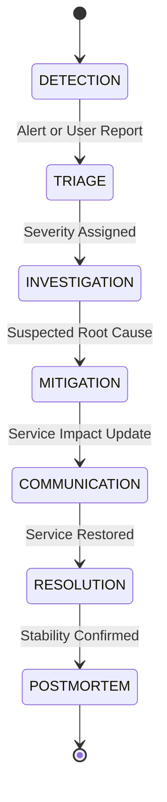
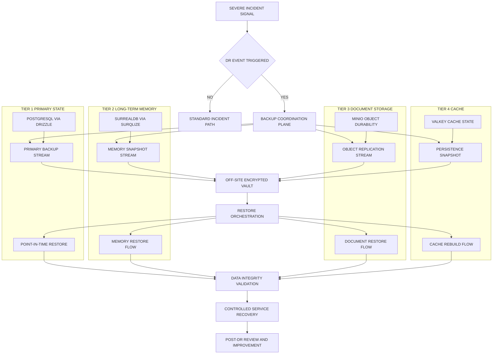

# Incident Response & Disaster Recovery

> Scope: Status page operations, incident lifecycle, escalation procedures, runbook templates, on-call rotation, disaster recovery strategy, backup validation, and failover procedures for the safeagent platform.

---

## Table of Contents
- [Status Page](#status-page)
- [Incident Response Procedures](#incident-response-procedures)
- [Runbook Templates](#runbook-templates)
- [On-Call Rotation](#on-call-rotation)
- [Disaster Recovery and Backup Strategy](#disaster-recovery-and-backup-strategy)
- [Cross-References](#cross-references)
- [Task Specifications](#task-specifications)
- [Test Specifications](#test-specifications)

---

## Status Page

Status communication is public-facing and incident-aware, with component-level transparency and timeline continuity.

- Public status page shows current platform health.
- Component-level status covers API, Streaming, Upload, Search, and Memory.
- Historical uptime charts provide trust and accountability.
- Incident timelines capture detection, investigation, mitigation, and recovery updates.
- Planned maintenance announcements are scheduled and visible ahead of impact.
- Subscription options support email and webhook notifications for status changes.

Status update policy:
- Start incident communication early, even before full root cause certainty.
- Update at defined cadence during active incidents.
- Publish final resolution summary when service is stable.
- Link internal incident records to public timeline entries for audit integrity.

## Incident Response Procedures

Incident response standardizes decisions under pressure and minimizes recovery time.

### Incident Lifecycle

1. Detection:
   - Automated alert fires or user report is received.
2. Triage:
   - Classify severity as critical or warning and assign incident commander.
3. Investigation:
   - Use monitoring dashboards for blast radius and observability traces for cause isolation.
4. Mitigation:
   - Apply fix, rollback, traffic shift, or controlled workaround.
5. Communication:
   - Update status page and notify affected users when impact is material.
6. Resolution:
   - Confirm service restoration and clear active alerts.
7. Post-mortem:
   - Run blameless review, document root cause, and track preventive actions.

### Incident Governance

- Incident commander owns tactical coordination and decision tempo.
- Communications lead owns external and internal status updates.
- Service owner owns technical mitigation path.
- Scribe captures timeline, decisions, and action items for post-mortem completeness.

## Runbook Templates

Runbooks provide pre-approved response playbooks for high-frequency or high-impact failures.

- Database connection exhaustion:
  - Identify pool saturation and runaway query patterns.
  - Apply connection pressure relief and query isolation controls.
- AI provider rate limiting or outage:
  - Detect provider-side saturation, shift traffic policy, and apply degraded-response mode.
- Memory or disk pressure on application servers:
  - Trigger autoscaling or controlled traffic shedding before hard failure.
- SSE connection storms:
  - Detect abnormal connection spikes, cap concurrent streams, and protect core request paths.
- Guardrail false-positive spike:
  - Detect abrupt block-rate increase and apply temporary policy safeguards with audit review.
- Valkey failure and fallback behavior:
  - Validate fallback activation and monitor risk window for rate-limit and budget enforcement drift.
- Queue worker backlog buildup:
  - Detect queue growth, rebalance workers, and prioritize user-visible workloads.
- Certificate expiration risk:
  - Trigger renewal escalation before service trust impact.

Runbook template fields:
- Trigger conditions.
- Detection signals.
- Initial containment actions.
- Mitigation steps.
- Verification and recovery checks.
- Communication requirements.
- Follow-up prevention actions.

## On-Call Rotation

On-call operations require explicit ownership, escalation clarity, and handoff discipline.

- Rotation structure includes primary and secondary responders.
- Escalation path is primary to secondary to engineering lead.
- Shift handoffs include active incidents, known risks, and pending follow-up actions.
- Access requirements include alerting platform, dashboards, status communication tools, and incident records.
- Coverage policy ensures no single point of responder failure.

On-call quality controls:
- Measure alert load per shift and adjust noisy rules.
- Track acknowledgement and response time by severity.
- Run regular incident drills for critical scenarios.

## Disaster Recovery and Backup Strategy

Disaster recovery planning protects state durability and service continuity when regional, infrastructure, or dependency failures exceed normal incident containment.
This strategy applies to the Bun runtime deployment footprint for the single safeagent package and ties directly into monitoring, escalation, and status communication practices.

### Backup Strategy by Service

- PostgreSQL via Drizzle:
  - Run frequent full and incremental backup cycles with point-in-time recovery support for primary state.
  - Keep retention windows long enough for delayed-detection incidents and compliance review needs.
  - Encrypt backup artifacts at rest and in transit with tightly scoped access control.
  - Replicate backup artifacts to off-site storage to reduce single-region durability risk.
- SurrealDB via surqlize:
  - Run scheduled snapshot and change-capture backup flows aligned to memory durability needs.
  - Keep retention aligned to long-term memory recovery and investigation windows.
  - Evaluate cross-region replication for memory continuity where user-impact risk justifies added complexity.
- MinIO object storage:
  - Use erasure coding for local durability against disk and node failures.
  - Use bucket replication to secondary location targets for disaster isolation.
  - Define object revision retention policy by data class to balance recovery depth and storage cost.
- Valkey cache and rate-limiting state:
  - Enable persistence policy with RDB and append-only durability where restart continuity is required.
  - Treat cache payloads as rebuildable from system-of-record state and replayed events.
  - Keep explicit rebuild-from-source procedure to restore cache effectiveness quickly after loss.
- Backup validation:
  - Run automated restore validation on a fixed cadence with clear pass and fail gates.
  - Track validation failures as reliability risks with explicit remediation ownership.

### RTO and RPO Targets by Service Criticality

- Tier 1, PostgreSQL primary state:
  - Set the most aggressive recovery-time objective and recovery-point objective in the platform.
  - Prioritize fastest restore path, lowest acceptable data loss window, and strict escalation urgency.
- Tier 2, SurrealDB long-term memory:
  - Set moderate recovery-time objective and recovery-point objective tuned for memory continuity.
  - Prioritize controlled recovery sequencing with integrity checks before broad reactivation.
- Tier 3, MinIO document storage:
  - Set relaxed recovery-time objective with strict recovery-point objective for uploaded artifacts.
  - Prioritize document durability guarantees even when full read availability is temporarily reduced.
- Tier 4, Valkey cache:
  - Set fast recovery-time objective with no recovery-point objective requirement due to rebuildable state.
  - Prioritize rapid warmup and predictable performance restoration.

### Failover Procedures

- Use automated failover for eligible database read-replica topologies to reduce detection-to-failover delay.
- Maintain a manual primary database failover runbook for split-brain prevention and controlled leadership transfer.
- Apply service degradation behavior during failover according to the Infrastructure degradation model.
- Define DNS and load balancer failover policy for regional traffic steering and dependency isolation.
- Run scheduled failover drills to verify readiness, decision speed, and communication accuracy.

### Restore Testing

- Run automated restore validation on a regular cadence across all critical data tiers.
- Run full restore drills at least quarterly, including complete environment bring-up and dependency checks.
- Measure restore duration and compare results directly against each tier recovery-time objective.
- Verify data integrity after restore with record consistency checks and application-level correctness validation.

### Cross-Region Considerations

- Choose active-passive or active-active regional posture based on service criticality, cost envelope, and operational readiness.
- Enforce data residency constraints during replication as defined in the Security and Compliance document.
- Monitor replication lag continuously and alert when lag threatens recovery-point objectives.
- Define region failover decision criteria using blast radius, lag state, dependency health, and regulatory constraints.

### Incident Integration

- Tie disaster recovery procedures into the existing incident lifecycle and P0-P3 severity handling in this plan.
- Define disaster-recovery escalation triggers that promote an incident into a disaster-recovery event.
- Use a dedicated communication plan during disaster-recovery events with internal and external cadence commitments.
- Require post-disaster-recovery review covering root factors, timeline quality, and control improvements.

---

## Cross-References

| Plan File | Relevant Scope | Connection |
|---|---|---|
| [Monitoring & Alerting](./monitoring.md) | Metrics, alerting, SLAs, dashboards | Monitoring detects incidents; this document defines response procedures |
| [Infrastructure](./infrastructure.md) | Service topology, degradation model | Infrastructure constraints inform DR strategy and failover design |
| [Security & Compliance](./security-compliance.md) | Breach notification, regulatory obligations | Security incidents follow these response procedures with compliance overlay |

---

## Task Specifications

### INCIDENT_PROCEDURES

**Task Name**
- INCIDENT_PROCEDURES

**Objective**
- Define incident response lifecycle, escalation policy, on-call rotation, and scenario runbooks to minimize recovery time and user impact.

**What To Do**
- Define incident lifecycle from detection through post-mortem with ownership roles.
- Document severity model, escalation chain, and acknowledgement timeouts.
- Create and maintain runbooks for critical operational failure patterns.
- Establish primary and secondary on-call rotation with shift handoff process.
- Define status communication procedure for user-facing incident updates.
- Validate incident drills for high-risk scenarios and response readiness.
- Extend incident playbooks for AI-specific reliability events including quality regressions, hallucination burn, and prompt deployment regressions.
- Extend security incident handling for prompt injection campaigns, jailbreak clusters, and sensitive-output leaks.
- Extend cost-protection incident handling for runaway agent sessions and budget burn acceleration.
- Add synthetic monitoring incident drills for canary degradation, RAG probe failures, and provider failover failures.
- Define cross-functional triage protocol for business divergence incidents tied to AI quality signals.
- Define chaos-result triage process where missing expected alerts create monitoring coverage incidents.
- Define provider outage and provider behavior-shift incident playbooks with failover and quality-protection decision paths.
- Define meta-monitoring incident playbooks for stale metrics, broken alert delivery, and evaluator-pipeline degradation.
- Define prompt experiment incident playbooks for split drift, inconclusive significance risk, and variant regression containment.
- Define graceful degradation incident playbooks for prolonged fallback operation, flapping states, and trust-impact communication.

**Depends On**
- MONITORING_INFRA

**Batch**
- 10

**Acceptance Criteria**
- Runbooks are documented for all required common scenarios.
- Escalation paths are defined and tested for acknowledgement timeout handling.
- On-call rotation is established with primary and secondary coverage.
- Status communication workflows are validated during incident simulation.
- Post-mortem template is standardized and used for severe incidents.
- AI quality incident runbooks cover hallucination spikes, relevance collapse, and consistency drift.
- Agentic incident runbooks cover runaway loops, stuck-state storms, handoff failures, and memory contamination alerts.
- Security incident runbooks cover direct and indirect injection surges, jailbreak campaigns, and sensitive-output leak response.
- Prompt deployment incident runbooks cover regression detection, rollback decisioning, and post-rollback verification windows.
- Cost incident runbooks cover budget burn acceleration, model mix shifts, and per-session runaway spend containment.
- Incident drill program includes synthetic probe failure scenarios and business divergence scenarios.
- Incident runbooks include chaos validation failures where expected alerts do not trigger.
- Incident runbooks include provider degradation and behavior-shift scenarios with failover readiness checks.
- Incident runbooks include monitoring-control failures such as stale dashboards and alert-delivery outages.
- Incident runbooks include prompt experiment regression and interference-contamination scenarios.
- Incident runbooks include prolonged degraded-mode operation and repeated flapping recovery scenarios.

**QA Scenarios**
- Trigger simulated critical outage and verify full incident lifecycle execution.
- Trigger simulated warning event and verify non-paging response flow.
- Execute handoff between on-call shifts during active incident and verify continuity.
- Run certificate-risk scenario and verify pre-expiry escalation behavior.
- Run queue backlog scenario and verify mitigation and communication sequence.
- Trigger simulated hallucination burn event and verify fast-burn paging plus quality containment workflow.
- Trigger simulated slow-burn quality drift and verify warning escalation with prevention-focused mitigation.
- Trigger simulated agent stuck-state storm and verify runbook-driven containment and recovery validation.
- Trigger simulated memory contamination alert and verify immediate security escalation and strict closure checks.
- Trigger simulated injection campaign and verify security triage, communications cadence, and guardrail effectiveness review.
- Trigger simulated prompt deployment regression and verify rollback path and recovery confirmation.
- Trigger simulated provider failover probe failure and verify failover readiness mitigation runbook.
- Trigger simulated business divergence incident and verify joint reliability and product triage workflow.
- Trigger simulated chaos validation failure where expected alert is absent and verify coverage-gap incident workflow.
- Trigger simulated provider behavior shift and verify canary-driven escalation and routing decision workflow.
- Trigger simulated alert-delivery outage and verify backup-notification and escalation continuity workflow.
- Trigger simulated evaluator pipeline backlog and verify quality-visibility risk escalation path.
- Trigger simulated prompt experiment interference and verify contamination containment workflow.
- Trigger simulated degraded-state flapping and verify stabilization and communication runbook execution.

**Implementation Notes**
- Keep response ownership unambiguous at every incident stage.
- Keep runbooks concise, action-first, and drill-validated.
- Keep post-mortem follow-ups tracked to completion.

### Delivery Checklist

- Status page is live with component health, incident timeline, and maintenance notices.
- Incident lifecycle and runbook templates are documented and tested.
- On-call rotation and escalation chain are operational.

---

## Test Specifications

**Incident response behavior**:

- Trigger simulated critical outage and verify full incident lifecycle execution.
- Trigger simulated warning event and verify non-paging response flow.
- Execute handoff between on-call shifts during active incident and verify continuity.
- Run certificate-risk scenario and verify pre-expiry escalation behavior.
- Run queue backlog scenario and verify mitigation and communication sequence.
- Trigger simulated hallucination burn event and verify fast-burn paging plus quality containment workflow.
- Trigger simulated slow-burn quality drift and verify warning escalation with prevention-focused mitigation.
- Trigger simulated agent stuck-state storm and verify runbook-driven containment and recovery validation.
- Trigger simulated memory contamination alert and verify immediate security escalation and strict closure checks.
- Trigger simulated injection campaign and verify security triage, communications cadence, and guardrail effectiveness review.
- Trigger simulated prompt deployment regression and verify rollback path and recovery confirmation.
- Trigger simulated provider failover probe failure and verify failover readiness mitigation runbook.
- Trigger simulated business divergence incident and verify joint reliability and product triage workflow.
- Trigger simulated chaos validation failure where expected alert is absent and verify coverage-gap incident workflow.
- Trigger simulated provider behavior shift and verify canary-driven escalation and routing decision workflow.
- Trigger simulated alert-delivery outage and verify backup-notification and escalation continuity workflow.
- Trigger simulated evaluator pipeline backlog and verify quality-visibility risk escalation path.
- Trigger simulated prompt experiment interference and verify contamination containment workflow.
- Trigger simulated degraded-state flapping and verify stabilization and communication runbook execution.

### Extension: Disaster Recovery

- PostgreSQL backup completes within configured frequency targets.
- SurrealDB backup produces restorable snapshots.
- MinIO bucket replication maintains data integrity.
- Valkey rebuild-from-source restores rate-limiting state correctly.
- Automated restore validation runs on schedule and passes.
- RTO measurements stay within defined targets per service tier.
- RPO measurements confirm no data loss beyond defined thresholds.
- Failover procedures execute without service interruption beyond RTO limits.
- Cross-region replication maintains consistency within configured lag thresholds.
- Disaster-recovery escalation triggers correctly transition incident handling into DR-event handling.
