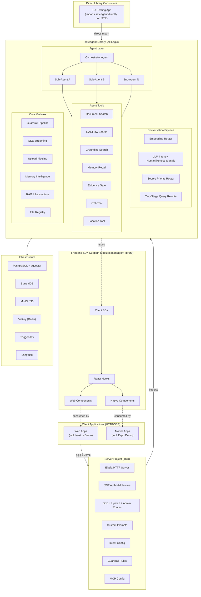
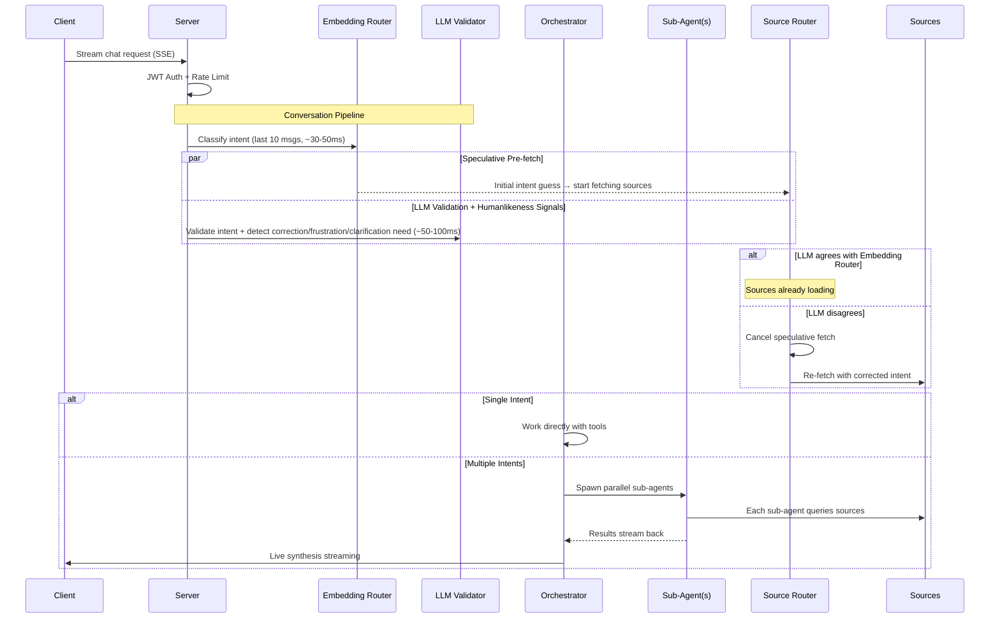
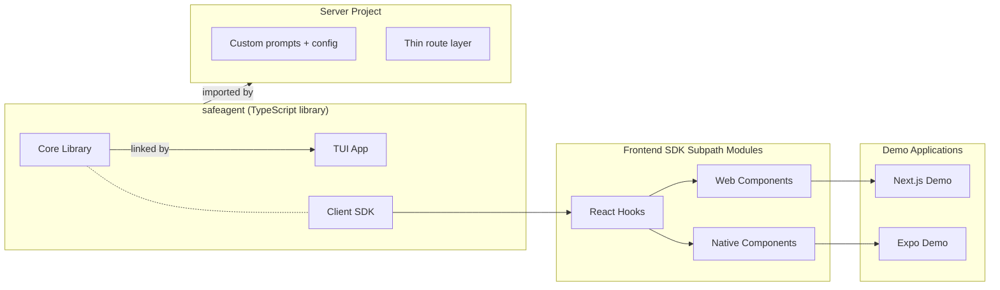

# safeagent — System Plan Overview

> **What**: `safeagent` — a highly-opinionated TypeScript library for creating AI agents with streaming guardrails, MCP compatibility, Gemini grounding, intelligent query routing, humanlike conversation, and agentic document Q&A — plus a thin API server, a full frontend SDK (React hooks, web components, React Native components), and demo applications.
>
> **Scale**: Designed for 10 million users from the ground up.
>
> **Runtime**: Bun-only TypeScript. All dependencies at latest — no pinning.

---

## Quick Start

- Read [Start Here](./start-here.md) for role-based reading paths.
- Read [Constraints](./constraints.md) before implementation decisions.
- Use [Execution Plan](./execution.md) as the scheduling and dependency truth.
- Use [Domain Playbooks](./domain-playbooks.md) for domain-by-domain implementation paths.
- Use [Quality Gates](./quality-gates.md) for completion criteria.
- Use [Operations](./operations.md) for runtime and incident-readiness context.

## High-Level System Architecture

## Request Lifecycle

---

## Table of Contents

Each document below is a self-contained reference for its domain. Documents are grouped by concern and each can be read independently. Per-module test specifications are co-located within each file.

### Preamble

- [Requirements & Constraints](./requirements.md) — All must-have and must-not-have requirements, task ownership traceability, definition of done
- [Research & Decisions](./research.md) — Spike findings, Metis review, architectural decisions (EXEMPT from review rules)
- [System Architecture](./architecture.md) — Component boundaries, infrastructure topology, data flows, scaling, connection management

### Governance (read before building)

- [Coding Standards](./coding-standards.md) — lintmax maximum strictness, Biome + oxlint + ESLint + Prettier, TypeScript strict mode, zero-warnings policy
- [API Governance & Consumer Migration](./api-governance.md) — Public API surface definition, stability tiers, semantic release policy, deprecation policy, breaking change protocol, migration guides, consumer upgrade testing, type contract governance
- [Developer Experience & Onboarding](./developer-experience.md) — Project creation flow, progressive API design, error taxonomy, local dev studio, testing utilities, template ecosystem, AI coding agent integration, TypeScript performance budget

### Foundation

- [Foundation](./foundation.md) — Core types, Zod schemas, configuration system, environment variables, storage factory
- [Extensibility](./extensibility.md) — 12 typed extension point contracts, lifecycle hooks, registration validation, composition patterns, security model, contract testing for extension authors

### Core Engine

- [Conversation Pipeline](./conversation.md) — Input validation → intent detection → query rewriting → source routing → response assembly
- [Agents & Orchestration](./agents.md) — Agent factory, orchestrator pattern, tool registry, provider management, computer use, MCP client protocol, location enrichment, generative UI governance, agent behaviors
- [Memory & Intelligence](./memory.md) — Three-layer memory, fact extraction, recall, emotional context, style adaptation, fact lifecycle
- [Document Processing](./documents.md) — Upload pipeline, multimodal-first processing, per-page summarization, file status management
- [Retrieval & Evidence](./retrieval.md) — Hybrid search with RRF, evidence bundle gate, file intelligence, visual grounding

### Safety & Transport

- [Guardrails & Safety](./guardrails.md) — Input/output guardrails, factories, zero-leak buffered mode, language and content safety
- [Streaming & Transport](./transport.md) — SSE streaming layer, CTA streaming, client SDK, event protocol

### Server & Interface

- [Server Implementation](./server.md) — Thin Elysia server, JWT auth, routes, middleware, startup sequence, error mapping
- [TUI App](./tui.md) — OpenTUI Solid terminal interface, component tree, command system, agent integration

### Operations

- [Observability](./observability.md) — Langfuse tracing, custom spans, Promptfoo automated eval, structured logging, PII filtering
- [Monitoring, Alerting, and Incident Response](./monitoring.md) — Real-time health, metrics collection, alerting, SLAs, dashboards, status page, incident lifecycle, runbooks, on-call rotation, disaster recovery, backup strategy, capacity forecasting
- [Infrastructure](./infrastructure.md) — Docker Compose, budget enforcement, rate limiting, circuit breaker, health checks, capacity planning
- [Durable Execution & HITL](./durable-execution.md) — Checkpoint backends, crash recovery, time-travel replay, background runs, human-in-the-loop approval gates, async suspension, escalation queues, configurable automation ratio
- [AI Operations](./ai-operations.md) — Semantic caching, dynamic model routing, prompt A/B testing, atomic bundle rollout, shadow mode, LLM-as-judge evaluation, CLASSic framework, per-agent cost attribution
- [Security & Compliance](./security-compliance.md) — Unified threat model, OWASP LLM Top 10 mapping, EU AI Act compliance, GDPR article mapping, DSAR workflow, breach notification, bias monitoring, decision audit trails, agent identity, data residency

### Frontend

- [Frontend SDK](./frontend-sdk.md) — React hooks, web components, React Native components, trace UI, CLI, Storybook, type safety
- [Demo Applications](./demos.md) — Next.js web demo, Expo mobile demo, server switching, verbosity toggle

### Delivery

- [Documentation Site](./documentation.md) — Fumadocs platform, TypeScript API reference, OpenAPI server reference, guides, search, theming
- [Release Pipeline](./release-pipeline.md) — CI/CD pipeline, PR governance, staged quality gates, release automation, canary deployment, rollback
- [Testing Strategy](./testing.md) — Test pyramid, coverage maps, CI pipeline, audit tasks, QA policy (per-module specs co-located with each file)
- [Execution Plan](./execution.md) — Parallel batches, dependency graph, task registry, agent dispatch, critical path

---

## Deliverables Summary

| Deliverable | Description |
|-------------|-------------|
| **safeagent** | TypeScript library — agent creation, guardrails, MCP, streaming, memory, RAG, upload, conversation pipeline, evidence gate, observability, eval |
| **Client SDK** | Framework-agnostic TypeScript client SDK module — SSE parsing, reconnection, offline queue, typed events |
| **safeagent-tui** | Interactive TUI testing app — streaming chat, /upload, commands, "as good as opencode" |
| **React Hooks** | React hooks module — ChatTransport, useSafeAgent, useTraceSteps, useFeedback, useUpload, useServerConnection, useVerbosity |
| **Web Components** | Web components module — shadcn + ai-elements adopted components, custom trace and server and thread components, Storybook, component CLI |
| **Native Components** | Native components module — NativeWind styling, offline-first behavior, native equivalents of web components |
| **Next.js Demo** | Web reference application — full-featured chat with server switching, verbosity toggle, trace timeline, file upload, feedback |
| **Expo Demo** | Mobile reference application — offline-first, tab navigation, server management, local SQLite persistence |
| **Server** | Thin API server — custom prompts, intent config, guardrail rules, MCP config, JWT auth |
| **Docker Compose** | Full infrastructure — Postgres+pgvector, SurrealDB, MinIO, Valkey, Trigger.dev, Langfuse stack |

---

## Key Architectural Decisions

| Decision | Choice | Rationale |
|----------|--------|-----------|
| Framework | @openai/agents + SDK bridge helper + Elysia (HTTP) | Agent/Runner/Handoff/Guardrail primitives with AI SDK model bridge and Bun-native HTTP layer |
| Runtime | Bun only | Performance, native TypeScript, zero external runtime dependency |
| Primary Model | Gemini Flash Lite (single model for everything) | Cost-efficient, fast, multimodal, structured output |
| Conversation Pipeline | Unified: embedding router → LLM intent → source routing → response | Single coherent flow from input to output with humanlikeness signals at every stage |
| Intent Detection | Two-stage: Embedding Router + LLM always validates | Maximum robustness with speculative pre-fetching |
| Multi-Intent | Orchestrator spawns parallel sub-agents | Clean isolation, true parallelism, live synthesis |
| Query Rewriting | Two-stage: LLM_INTENT (conversation-context) + REWRITE_TOOL (source-specific) | Complementary — context understanding vs retrieval optimization |
| Source Execution | Parallel with priority weighting | Fire all sources, weight by priority when merging |
| Source Failures | Circuit breaker wraps external API calls (per-call level, NOT pipeline-level) | Sources must be reliable — breakers on Gemini, RAGFlow, MCP individually |
| Evidence Gate | Configurable threshold per topic | Server chooses: hard refusal, soft caveat, or ask clarification |
| File References | Per-user FileRegistry across sessions | Temporal/ordinal resolution, ambiguity → ask to clarify |
| Anti-Hallucination | Evidence Bundle Gate pattern | Hallucination reduction from ~24% to ~3% |
| Document Processing | Multimodal-first with progressive retrieval | PDF pages sent directly to Gemini, ~47% cheaper |
| RAG | Own Drizzle page_index with RRF hybrid search | 3-arm fusion: vector summaries + vector raw text + keyword |
| Memory | Three-layer: thread short-term (Postgres) + user short-term (Postgres) + long-term (SurrealDB) | Conversation context + cross-thread continuity + persistent knowledge |
| Humanlikeness | 13 engine-level behaviors woven into conversation pipeline, agents, and memory | Correction handling, frustration detection, response energy, emotional context, style memory, fact supersession, clarification patience, and more |
| Streaming | Framework stream-event format throughout | No format bridge, direct streaming path via the framework's execution method, TripWire safety |
| Frontend SDK | Client SDK → React hooks → web components plus native components | Types flow once from engine through the frontend subpath module chain — zero duplication, shared hooks, separate JSX |
| Web Components | shadcn + ai-elements (48 adopted) + 8 custom | Mature Radix-backed primitives from AI SDK team, gap-fill only where needed |
| RN Components | NativeWind, separate JSX, shared hooks | No DOM, no Radix — native implementation with hook-level parity |
| Trace Visualization | Trace-step SSE events → TraceTimeline component | Real-time pipeline visibility in full verbosity mode, hidden in standard mode |
| Demo Strategy | Next.js web + Expo mobile reference apps | Production-quality references, not throwaway samples — server switching and verbosity as first-class UX |
| Scaling | Trigger.dev queue + horizontal workers | Configurable per deployment (queue-all vs in-process) |
| Library/Server | Library defaults + server overrides | Great out-of-box experience, full customizability |
| Error Messages | Typed error codes, server maps all (validated at startup) | Server controls user-facing tone, startup validation ensures completeness |
| Testing | Comprehensive: unit + integration + eval + load + adversarial + regression + chaos + property-based | Maximum risk coverage |
| Observability | Langfuse comprehensive: quality + latency + business metrics | Full agent tracing, cost tracking, user analytics |

---

## Estimated Scale

| Metric | Target |
|--------|--------|
| Total users | 10,000,000 (capacity-planned at 1% DAU = 100K daily active, with burst headroom to 10% — see [System Architecture](./architecture.md) and [Infrastructure](./infrastructure.md) capacity planning sections) |
| Request latency (p50) | < 200ms to first token (standard streaming mode). Buffered guardrail mode intentionally delays TTFT by the buffer fill window — this is a deliberate safety trade-off, not a performance failure (see [Guardrails & Safety](./guardrails.md)) |
| Intent classification | < 50ms (embedding), < 100ms (LLM validation) |
| Source queries | Parallel, < 500ms total |
| Document upload (50 pages) | ~10s (single key), ~2s (10-key pool) |
| Storage per user | 100MB quota (configurable) |
| Budget tracking | Sub-millisecond via Valkey atomic counters |
| Horizontal scaling | Stateless API server + Trigger.dev workers |

---
