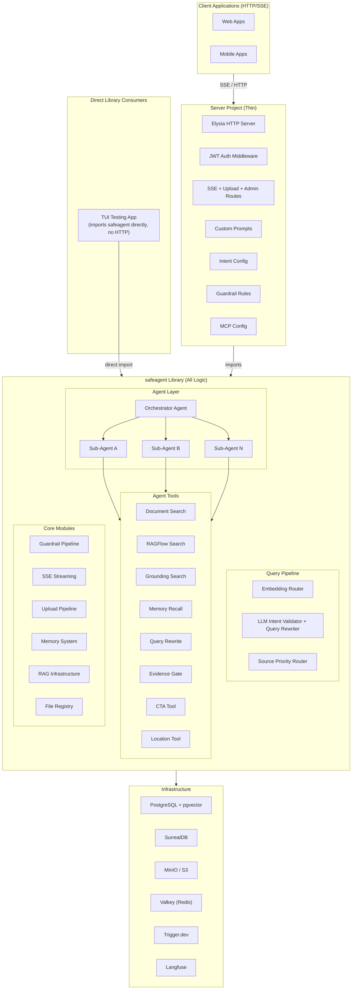
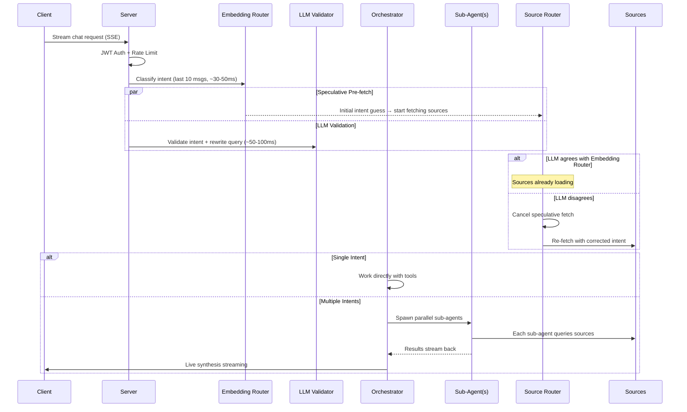
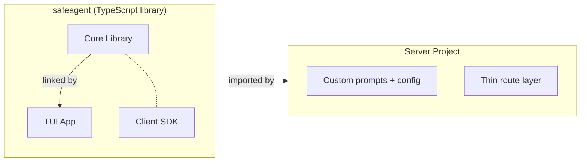

# safeagent — System Plan Overview

> **What**: Build `safeagent`, a highly-opinionated headless TypeScript library for creating AI agents with streaming guardrails, MCP compatibility, Gemini grounding, intelligent query routing, and agentic document Q&A — plus a thin API server that consumes it.
>
> **Scale**: Designed for 10 million users from the ground up.
>
> **Runtime**: Bun-only TypeScript. All dependencies at latest — no pinning — all at latest.

---

## High-Level System Architecture

## Request Lifecycle

---

## Table of Contents

Each document below is a self-contained reference for its domain. Files are numbered for reading order but each can be read independently.

### Architecture & Configuration

| # | Document | Description |
|---|----------|-------------|
| 01 | [System Architecture](./01-system-architecture.md) | Infrastructure, storage topology, data flow, Docker Compose, deployment model |
| 02 | [Configuration](./02-configuration.md) | Model constants, environment variables, library/server responsibility split, dependency policy |
| 03 | [Research & Decisions](./03-research-and-decisions.md) | All spike findings, Metis review, architectural decisions from discussion sessions |

### Core Library Modules

| # | Document | Description |
|---|----------|-------------|
| 04 | [Types & Foundation](./04-types-and-foundation.md) | Spike validation, repo scaffolding, type definitions, schemas, config system, storage, MCP, provider helpers |
| 05 | [Agent & Orchestration](./05-agent-and-orchestration.md) | Agent factory, orchestrator pattern, sub-agent spawning, multi-intent handling, live synthesis |
| 06 | [Guardrails & Safety](./06-guardrails-and-safety.md) | Input/output guardrails, factories, pipeline orchestrator, zero-leak buffered mode, evidence gate |
| 07 | [Memory System](./07-memory-system.md) | Short-term conversation memory (Postgres), long-term knowledge graph (SurrealDB), fact extraction, recall tool |
| 08 | [Document Processing](./08-document-processing.md) | Upload pipeline, multimodal-first PDF/DOCX processing, per-page summarization, image extraction, TXT chunking |
| 09 | [RAG & Retrieval](./09-rag-and-retrieval.md) | Hybrid search with RRF, page_index table, query tool, structured citations, cross-conversation RAG |

### Query Intelligence Pipeline (NEW)

| # | Document | Description |
|---|----------|-------------|
| 10 | [Intent & Routing](./10-intent-and-routing.md) | Embedding router, LLM intent validation, two-stage classification, server-defined IntentConfig |
| 11 | [Query Pipeline](./11-query-pipeline.md) | Conditional query rewriting, source-specific strategies, source priority execution, RAGFlow integration |
| 12 | [File Intelligence](./12-file-intelligence.md) | FileRegistry, evidence bundle gate, 28 file edge cases, visual grounding, anti-hallucination patterns |

### Transport & Server

| # | Document | Description |
|---|----------|-------------|
| 13 | [Streaming & Transport](./13-streaming-and-transport.md) | SSE streaming layer, RunStreamEvent streaming, CTA streaming, client SDK |
| 14 | [Server Implementation](./14-server-implementation.md) | Server scaffolding, agent config, routes, JWT auth, guardrail rules, MCP definitions, Docker |
| 15 | [TUI App](./15-tui-app.md) | OpenTUI Solid shell, chat display, input component, command system, agent integration, /upload |

### Operations & Quality

| # | Document | Description |
|---|----------|-------------|
| 16 | [Observability & Eval](./16-observability-and-eval.md) | Langfuse tracing, custom spans, user feedback, prompt management, Promptfoo eval, custom evaluation scorers |
| 17 | [Infrastructure](./17-infrastructure.md) | API key pool, Valkey cache, Trigger.dev jobs, rate limiting, structured logging, circuit breaker, TTL cleanup |
| 18 | [Testing Strategy](./18-testing-strategy.md) | Unit, integration, eval, load, adversarial, regression, chaos, property-based testing |

### Execution & Governance

| # | Document | Description |
|---|----------|-------------|
| 19 | [Execution Plan](./19-execution-plan.md) | Parallel batches, dependency matrix, agent dispatch, critical path, complete task registry |
| 20 | [Constraints & Success Criteria](./20-constraints-and-success.md) | Must have, must not have, Bun runtime clarification, conventions, DoD, final checklist |

---

## Deliverables Summary

| Deliverable | Description |
|-------------|-------------|
| **safeagent** | TypeScript library — agent creation, guardrails, MCP, streaming, memory, RAG, upload, intent routing, query pipeline, evidence gate, observability, eval |
| **@safeagent/client** | Framework-agnostic TypeScript client SDK — SSE parsing, reconnection, offline queue, typed events |
| **safeagent-tui** | Interactive TUI testing app — streaming chat, /upload, commands, "as good as opencode" |
| **Server** | Thin API server — custom prompts, intent config, guardrail rules, MCP config, JWT auth |
| **Docker Compose** | Full infrastructure — Postgres+pgvector, SurrealDB, MinIO, Valkey, Trigger.dev, Langfuse stack |

---

## Key Architectural Decisions

| Decision | Choice | Rationale |
|----------|--------|-----------|
| Framework | @openai/agents + aisdk() bridge + Elysia (HTTP) | Framework Agent/Runner/Handoff/Guardrail primitives with AI SDK model bridge and Bun-native HTTP layer |
| Runtime | Bun only | Performance, native TypeScript, zero external runtime dependency |
| Primary Model | Gemini Flash Lite (single model for everything) | Cost-efficient, fast, multimodal, structured output |
| Intent Detection | Two-stage: Embedding Router + LLM always validates | Maximum robustness with speculative pre-fetching |
| Multi-Intent | Orchestrator spawns parallel sub-agents | Clean isolation, true parallelism, live synthesis |
| Query Rewriting | Conditional, source-specific strategies | HyDE for vector, entity extraction for BM25, keywords for web |
| Source Execution | Parallel with priority weighting | Fire all sources, weight by priority when merging |
| Source Failures | Fail fast within source fan-out (no circuit breaker on query merging) | Sources must be reliable — circuit breakers wrap external service calls (Gemini, RAGFlow, MCP) per file 17 |
| Evidence Gate | Configurable threshold per topic | Server chooses: hard refusal, soft caveat, or ask clarification |
| File References | Per-user FileRegistry across sessions | Temporal/ordinal resolution, ambiguity → ask to clarify |
| Anti-Hallucination | Evidence Bundle Gate pattern | Hallucination reduction from ~24% to ~3% |
| Document Processing | Multimodal-first with progressive retrieval | PDF pages sent directly to Gemini, ~47% cheaper |
| RAG | Own Drizzle page_index with RRF hybrid search | 3-arm fusion: vector summaries + vector raw text + keyword |
| Memory | Dual: Postgres short-term + SurrealDB long-term graph | Conversation context + persistent user knowledge |
| Streaming | RunStreamEvent format throughout | No format bridge, direct streaming path via Runner.run(), TripWire safety |
| Scaling | Trigger.dev queue + horizontal workers | Configurable per deployment (queue-all vs in-process) |
| Library/Server | Library defaults + server overrides | Great out-of-box experience, full customizability |
| Error Messages | Typed error codes, server maps all (validated at startup) | Server controls user-facing tone, startup validation ensures completeness |
| Pipeline Types | Strongly typed TypeScript interfaces | Compile-time safety when composing pipeline stages |
| Testing | Comprehensive: unit + integration + eval + load + adversarial + regression + chaos + property-based | Maximum risk coverage |
| Observability | Langfuse comprehensive: quality + latency + business metrics | Full agent tracing, cost tracking, user analytics |

---

## Estimated Scale

| Metric | Target |
|--------|--------|
| Total users | 10,000,000 (capacity-planned at 1% DAU = 100K daily active, with burst headroom to 10% — see [01](./01-system-architecture.md) and [17](./17-infrastructure.md) capacity planning sections) |
| Request latency (p50) | < 200ms to first token (standard streaming mode). Buffered guardrail mode (`mode: 'buffered'`) intentionally delays TTFT by the buffer fill window — this is a deliberate safety trade-off, not a performance failure (see [06](./06-guardrails-and-safety.md)) |
| Intent classification | < 50ms (embedding), < 100ms (LLM validation) |
| Source queries | Parallel, < 500ms total |
| Document upload (50 pages) | ~10s (single key), ~2s (10-key pool) |
| Storage per user | 100MB quota (configurable) |
| Budget tracking | Sub-millisecond via Valkey atomic counters |
| Horizontal scaling | Stateless API server + Trigger.dev workers |
