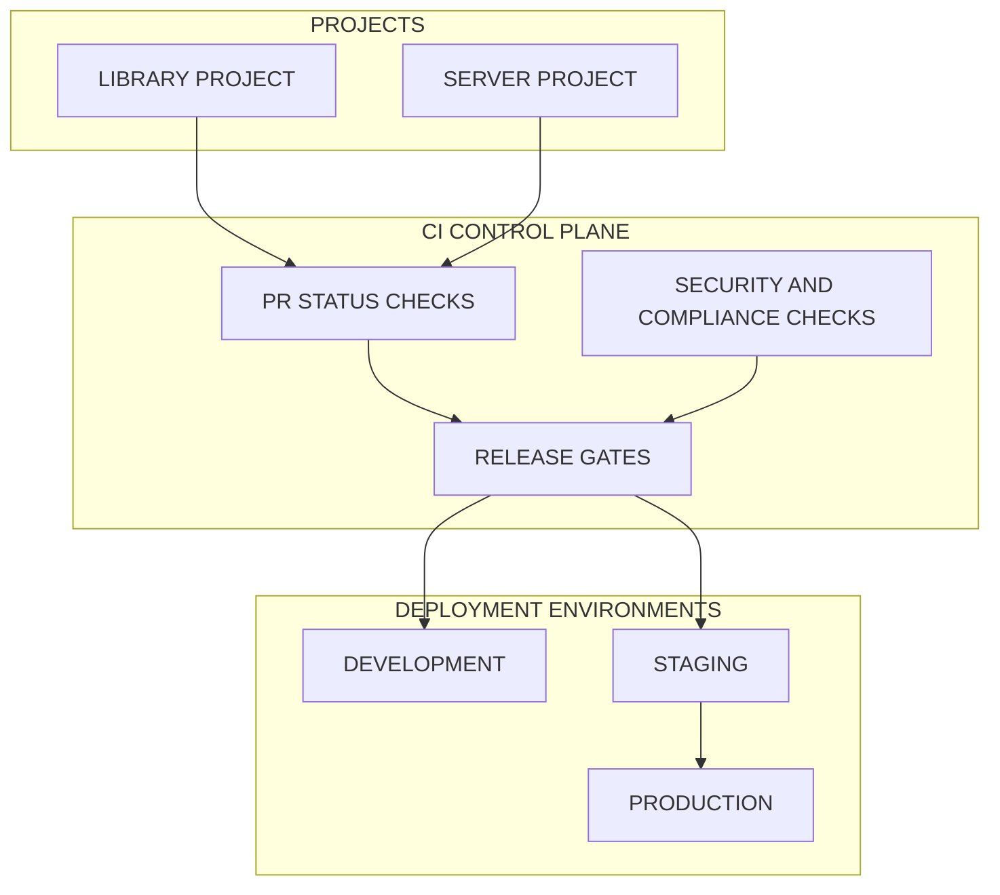
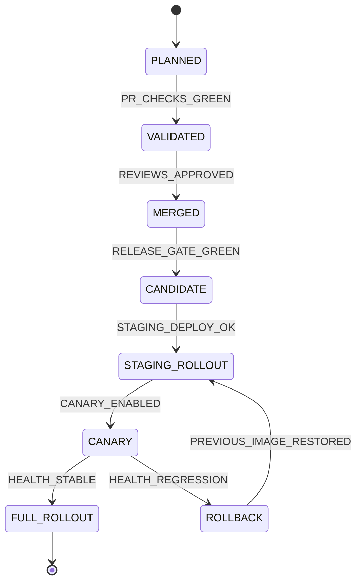

# Release Pipeline

> **Scope**: End-to-end CI/CD pipeline, deployment workflow, and release process across both projects, including PR governance, staged quality gates, containerized test orchestration, release automation, canary rollout control, rollback safety, dependency governance, secrets handling, and operational pipeline monitoring at 10M-user scale.
>
> **Tasks**: CI_PIPELINE (CI/CD Pipeline), RELEASE_PIPELINE (Release Automation and Deployment Workflow)

---

## Table of Contents
- [Architecture Overview](#architecture-overview)
- [PR Workflow](#pr-workflow)
- [Pre-Commit Quality Gates](#pre-commit-quality-gates)
- [CI Pipeline Stages](#ci-pipeline-stages)
- [Test Container Strategy](#test-container-strategy)
- [Release Process — Library (safeagent)](#release-process--library-safeagent)
- [Release Process — Server](#release-process--server)
- [Deployment Environments](#deployment-environments)
- [Canary and Rollback](#canary-and-rollback)
- [Dependency Management](#dependency-management)
- [Secrets Management](#secrets-management)
- [Monitoring the Pipeline](#monitoring-the-pipeline)
- [Scalability and Security Guardrails](#scalability-and-security-guardrails)
- [Cross-References](#cross-references)
- [Task Specifications](#task-specifications)
- [Delivery Checklist](#delivery-checklist)

## Architecture Overview

Release operations are split across both projects with clear responsibility boundaries.
The library project governs library packaging, quality gates, and artifact publication.
The server project governs container image promotion and runtime rollout safety.
Both projects share CI quality standards, deployment signals, and rollback discipline.

```mermaid
flowchart LR
  PR_OPEN[PR OPENED] --> STAGE_1[STAGE 1 FAST FEEDBACK]
  STAGE_1 --> STAGE_2[STAGE 2 COMPREHENSIVE]
  STAGE_2 --> REVIEW_GATE[REVIEW AND STATUS GATE]
  REVIEW_GATE --> MERGE_MAIN[MERGE TO MAIN]
  MERGE_MAIN --> STAGE_3[STAGE 3 EXPENSIVE]
  STAGE_3 --> RELEASE_TRIGGER[RELEASE TRIGGER]
  RELEASE_TRIGGER --> STAGE_4[STAGE 4 RELEASE GATE]
  STAGE_4 --> LIB_RELEASE[LIBRARY RELEASE]
  STAGE_4 --> SERVER_RELEASE[SERVER RELEASE]
  LIB_RELEASE --> STAGING_DEPLOY[DEPLOY STAGING]
  SERVER_RELEASE --> STAGING_DEPLOY
  STAGING_DEPLOY --> CANARY_PROMOTE[CANARY PROMOTION]
  CANARY_PROMOTE --> PROD_PROMOTE[PROMOTE TO PRODUCTION]
```

Operating principles:
- Enforce identical quality bars across both projects while preserving project-specific release outputs.
- Keep CI fast for contributor feedback and deep for merge and release confidence.
- Treat rollout safety as a first-class release criterion, not a post-release activity.
- Keep security policy embedded in every gate from pre-commit to production promotion.

## PR Workflow

Pull requests are the single change admission path for both projects.

### Branch Protection

- Main branch rejects force push and direct push to preserve immutable review history.
- Merge requires approvals from designated code owners for affected domains.
- Merge requires all mandatory status checks to pass before merge controls unlock.
- Merge requires branch to be up to date with main before final admission.
- Emergency bypass is reserved for incident command procedures with explicit audit logging.

### PR Title and Changelog Discipline

- PR titles follow conventional commit semantics so release notes can be generated automatically.
- Type and scope labels in titles align with changelog grouping for library and server outputs.
- Breaking-change intent is called out in title semantics and PR metadata to drive release impact classification.
- Draft-to-ready transitions preserve title compliance checks to avoid release-note drift.

### Draft PR Support

- Draft pull requests are first-class for in-progress collaboration and early pipeline feedback.
- Draft state allows iterative validation while preventing accidental merge.
- Required checks still run in draft state when enabled, improving early defect detection.

### Required Status Checks Before Merge

- Fast feedback checks must pass for linting, formatting, type safety, and fast tests.
- Comprehensive checks must pass for integration, contract, snapshot, and property-based coverage.
- Security and compliance checks must pass for dependency risk and license policy.
- Repository policy checks must pass for branch protections, review minimums, and required conversations.

## Pre-Commit Quality Gates

Local quality gates prevent low-quality changes from entering PR pipelines.

- Staged files run Biome lint and format checks through pre-commit hook automation.
- Monorepo-wide type checking runs before commit acceptance in the library project.
- Server project enforces equivalent type checking discipline before commit acceptance.
- ORM-only data access policy blocks raw SQL and raw SurrealQL patterns from commit entry.
- Hook failures block commit completion and require correction before re-attempt.
- Gate configuration favors deterministic failures with actionable diagnostics.

## CI Pipeline Stages

The CI pipeline is GitHub Actions based and Bun-native.
It runs on pull requests and main branch pushes with stage-specific trigger policies.

### Stage 1 — Fast Feedback (target under 2 minutes)

- Biome lint and format validation.
- Type checking across relevant workspace packages.
- Unit test tier from the testing pyramid.
- Parallel job layout optimized for immediate contributor feedback.

### Stage 2 — Comprehensive (target under 10 minutes)

- Integration tests backed by ephemeral infrastructure containers.
- Property-based tests for invariant validation.
- Contract tests validating boundary agreements between library and server.
- Snapshot tests for stable structural behavior.
- Parallelization balanced to maximize throughput without destabilizing shared resources.

### Stage 3 — Expensive (main merge only)

- End-to-end workflow verification.
- Eval quality suites powered by Promptfoo.
- Load baseline validation powered by k6.
- Adversarial suites for safety and abuse resilience.
- Execution restricted to main merges to control cost while preserving confidence.

### Stage 4 — Release Gate (release trigger only)

- Full suite rerun for release integrity.
- Package build verification for distributable correctness.
- Documentation site build verification for release parity.
- Publish dry-run to validate release readiness before public publication.
- Gate failure blocks release publication and deployment promotion.

## Test Container Strategy

Comprehensive test stages rely on disposable infrastructure containers for reproducibility.

- Each CI execution provisions ephemeral Postgres with pgvector, SurrealDB, Valkey, and MinIO services.
- Container health checks must pass before any integration or contract suite begins.
- Parallel tests use isolated database schemas to prevent data collision and cross-test contamination.
- Test jobs apply deterministic seed setup for stable assertions across reruns.
- All containers and transient volumes are removed after test completion.
- Failure diagnostics retain enough metadata for root-cause analysis without leaking sensitive data.

## Release Process — Library (safeagent)

Library release is commit-driven, automated, and traceable.

- Conventional commit history drives automated release calculation.
- Changelog is generated automatically from accepted commit history.
- Public registry publication executes only after release gate success.
- GitHub release is generated with changelog narrative and release artifacts.
- Documentation site rebuild is triggered immediately after successful publication.
- Post-release smoke validation runs against the published package to confirm install and baseline runtime behavior.
- Release metadata captures compatibility intent for downstream server alignment.

## Release Process — Server

Server release emphasizes container immutability and promotion safety.

- Release builds a production-grade container image and pushes it to the chosen registry.
- Release tags align with safeagent compatibility commitments.
- Staging deployment validates startup and service health before promotion eligibility.
- Promotion uses rolling replacement with zero-downtime target behavior.
- Health-gated traffic admission prevents unhealthy instances from receiving live requests.
- Rollback restores the previous image immediately when health regression is detected.

## Deployment Environments

Deployment environment progression aligns with infrastructure and testing plans.

- Development: local Docker Compose baseline for rapid iteration, matching infrastructure assumptions.
- Staging: topology mirror of production for pre-release realism and operational rehearsal.
- Production: horizontally scaled runtime with health-gated promotion and rollback controls.
- Environment drift detection is mandatory to preserve staging-to-production reliability.
- Promotion criteria include quality gates, health metrics, and security compliance checks.

## Canary and Rollback

Canary progression de-risks production rollout by limiting initial blast radius.

- New release starts with a constrained traffic slice routed to canary instances.
- Automated rollback triggers on error-rate spikes or failed health checks.
- Manual promotion step advances canary from partial traffic to full rollout.
- Rollback preserves database state; destructive migration patterns are excluded from release flow.
- Rollback path is rehearsed regularly to ensure instant execution confidence.

## Dependency Management

Dependency governance is automated and policy-driven.

- Automated dependency update pull requests are created on a recurring cadence.
- Dependency security scanning runs in CI to detect known vulnerability exposure.
- License compliance checks validate policy alignment before merge and release.
- Lock file integrity checks block tampered or inconsistent dependency states.
- High-risk dependency changes require elevated review and deeper test coverage.

## Secrets Management

Secrets handling follows strict least-privilege and zero-leak principles.

- CI secrets are stored only in GitHub Actions encrypted secrets.
- Secrets are prohibited from repository history, artifact payloads, and pipeline logs.
- Rotation procedure supports key replacement without service interruption.
- Staging and production use separate secret scopes and access boundaries.
- Incident procedures include immediate secret revocation and controlled re-issuance.

## Monitoring the Pipeline

Pipeline reliability is observed as an operational product surface.

- CI duration is tracked over time with alerts for regression thresholds.
- Flaky tests are detected, tagged, and quarantined to protect pipeline trustworthiness.
- Build cache performance is measured and tuned to reduce repeat execution latency.
- Pipeline failures notify the delivery team with failure class and ownership metadata.
- Release and deployment outcomes are tracked to correlate quality gates with production stability.

## Scalability and Security Guardrails

Scalability and security requirements are integrated into every release lane.

- Scale posture assumes sustained growth and burst behavior consistent with 10M-user planning.
- Gate concurrency and queue design prevent pipeline bottlenecks during peak contribution periods.
- Least-privilege permissions are enforced for CI tokens, release automation, and deployment controls.
- Supply-chain risk controls cover dependency provenance, integrity, and policy conformance.
- Deployment promotion remains health-gated, observable, and reversible by design.

## Cross-References

| Plan File | Relevant Scope | How It Connects To This Document |
|---|---|---|
| [Foundation](./foundation.md) | Runtime contracts, typed data boundaries, policy baseline | Establishes Bun-only and ORM-only constraints enforced in quality gates |
| [Infrastructure](./infrastructure.md) | Container topology, health checks, deployment posture | Provides container services and health model used by CI and rollout validation |
| [Testing](./testing.md) | Thirteen test types, suite separation, CI behavior | Defines test tiers mapped into staged pipeline gates |
| [Execution](./execution.md) | Batch sequencing, dependencies, delivery order | Places CI and release work on the project critical path and batch plan |

Integration notes:
- CI stages map directly to the testing stratification model.
- Deployment gates inherit infrastructure health semantics and degradation policy.
- Release automation aligns with execution dependencies so downstream work lands on stable quality gates.
- Security controls are shared across repository boundaries to prevent policy drift.

## Task Specifications

### CI_PIPELINE

**Task Name**
- CI_PIPELINE

**Objective**
- Establish a complete Bun-native CI/CD baseline with multi-stage quality gates across pull request, main merge, and release triggers.

**What To Do**
- Define branch-protected pull-request workflow with required approvals and status checks.
- Implement staged CI flow with fast, comprehensive, expensive, and release-gate tiers.
- Integrate pre-commit quality gate policy with Biome, type safety, and ORM-only enforcement.
- Provision ephemeral infrastructure containers for comprehensive test execution.
- Enforce health-check readiness and cleanup discipline for all test infrastructure.
- Integrate pipeline observability for duration, flaky detection, and failure notification.

**Depends On**
- SCAFFOLD_LIB
- CODE_STANDARDS

**Batch**
- FOUNDATION_B_BATCH

**Acceptance Criteria**
- All four CI stages execute with trigger-scoped behavior.
- Test containers initialize reliably and gate test start on health readiness.
- Type checking passes consistently across targeted repository surfaces.
- Lint and format checks pass under staged-file and CI contexts.
- Fast feedback stage completes within two-minute target under normal load.

**QA Scenarios**
- Open a pull request with a lint violation and verify fast stage failure.
- Open a pull request with contract drift and verify comprehensive stage failure.
- Merge clean pull request and verify expensive stage executes only on main.
- Trigger release flow and verify release gate reruns complete validation scope.
- Simulate unhealthy test container startup and verify tests do not begin until healthy.

**Implementation Notes**
- Keep stage responsibilities non-overlapping to simplify failure triage.
- Keep gate outputs explicit so reviewers can identify blocking dimensions quickly.
- Keep container lifecycle deterministic to reduce flaky infrastructure behavior.

### RELEASE_PIPELINE

**Task Name**
- RELEASE_PIPELINE

**Objective**
- Implement automated release publication and deployment promotion with staged safety checks, canary control, and instant rollback readiness.

**What To Do**
- Automate release publication flow for the library with automated changelog generation.
- Automate server container image release and registry publication workflow.
- Enforce staging validation before canary and production promotion.
- Implement canary progression controls with automated and manual decision gates.
- Implement rollback controls that restore prior image quickly without destructive data effects.
- Integrate dependency governance, secrets controls, and release observability into release gates.

**Depends On**
- CI_PIPELINE
- PKG_PUBLISH
- SERVER_ROUTES

**Batch**
- E2E_DEPLOY_BATCH

**Acceptance Criteria**
- safeagent publishes successfully to the public package registry through automated release flow.
- Server release produces and publishes deployable container image artifacts.
- Changelog generation reflects merged commit history accurately.
- Rollback restores previous runtime image rapidly after canary or production regression.
- Staging deployment validation completes successfully before production promotion.

**QA Scenarios**
- Execute a library release candidate and verify changelog and package publication outputs.
- Execute a server release candidate and verify container image availability for deployment.
- Deploy to staging and validate health, smoke behavior, and promotion eligibility.
- Trigger canary with controlled traffic and verify health-gated promotion path.
- Induce canary health regression and verify automated rollback path restores prior image.

**Implementation Notes**
- Keep library and server releases coordinated but independently recoverable.
- Keep canary metrics narrowly focused on user-impact signals.
- Keep rollback runbooks continuously validated through rehearsal drills.

### Delivery Checklist

- CI_PIPELINE implemented with four-stage gating, trigger scoping, and fast feedback target compliance.
- RELEASE_PIPELINE implemented with automated library publication and server rollout promotion.
- Ephemeral container strategy validated for comprehensive CI suites.
- Canary rollout and rollback controls validated under failure simulation.
- Dependency, license, and lock integrity controls enforced in pipeline gates.
- Secrets handling validated for encrypted storage, scope isolation, and rotation readiness.
- Pipeline monitoring baseline active for duration trends, flaky detection, and failure notifications.

## Test Specifications

> **Relationship to Task Specifications**: QA Scenarios prove task completion; Test Specifications prove behavioral correctness. Use both.

**PR workflow and branch protection**:

- Main branch requires passing status checks before merge.
- Main branch requires at least one approving review before merge.
- Force push to main is blocked by branch protection rules.
- Draft PRs do not trigger expensive CI stages.

**CI pipeline stage behavior**:

- Fast feedback stage completes in under two minutes for lint, type check, and unit tests.
- Comprehensive stage runs integration, property-based, contract, and snapshot tests with ephemeral test containers.
- Expensive stage runs only on main branch merges and includes E2E, eval, load, and adversarial tests.
- Release gate stage re-runs the full suite plus build verification and publish dry-run.
- Stage failure blocks promotion to subsequent stages.

**Test container orchestration**:

- Ephemeral containers for Postgres, SurrealDB, Valkey, and MinIO start before test execution.
- Container health checks pass before any test begins.
- Parallel test execution uses isolated database schemas to prevent cross-test contamination.
- Containers are cleaned up after test completion regardless of pass or failure.

**Library release automation**:

- Conventional commit messages drive semantic release decisions.
- Changelog generates automatically from commit history.
- Package publishes to the public npm registry on release trigger.
- Documentation site rebuild triggers automatically after successful release.
- Post-release smoke test validates the published package from the registry.

**Server deployment and rollback**:

- Docker image builds and pushes to the container registry on release.
- Health check validation passes before deployment promotion to production.
- Rolling deployment maintains zero downtime during release.
- Rollback restores the previous image instantly without manual intervention.
- Rollback preserves database state and does not execute destructive migrations.

**Canary deployment behavior**:

- Canary routes a configurable percentage of traffic to the new release.
- Error rate spike above threshold triggers automated rollback from canary.
- Health check failure during canary triggers automated rollback.
- Manual promotion from canary to full rollout requires explicit approval.

**Dependency and secrets governance**:

- Automated dependency update PRs surface available upgrades.
- Security vulnerability scanning blocks PRs with known critical vulnerabilities.
- CI secrets are stored in encrypted secret storage and never appear in logs.
- Staging and production use separate secret scopes.

**Pipeline observability**:

- Pipeline duration tracking detects regression in CI execution time.
- Flaky test detection quarantines unreliable tests from blocking the pipeline.
- Pipeline failure notifications reach the team within seconds of failure.
