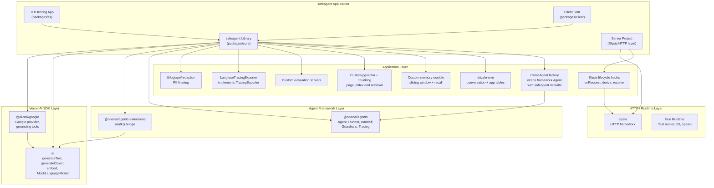
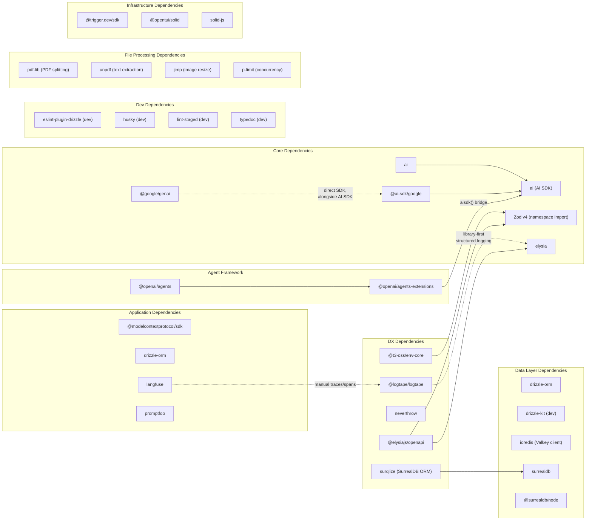
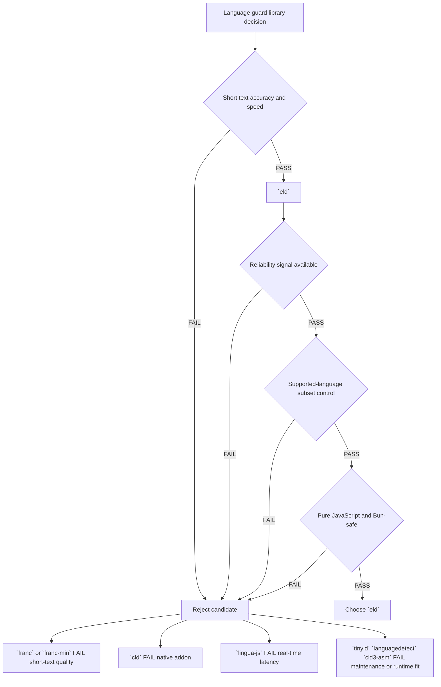
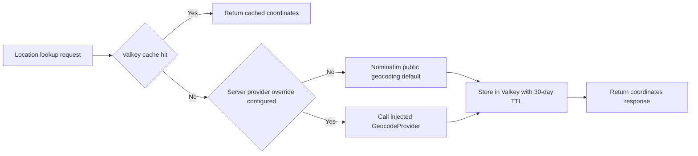

# Research & Decisions

> **This document is the complete research record.** Every spike finding, Metis review item, finalized discussion decision, and architectural choice that shaped the system is captured here. Other plan files reference this document for the "why" behind their design. Nothing in this document is speculative — every item was validated, reviewed, or explicitly decided.

## Technology Validation Overview

Before any implementation task could begin, the SPIKE_CORE_STACK spike validated every critical technology assumption against the actual Bun runtime. The spike was the initial blocking gate that no subsequent task could proceed without. The following decision tree shows what was spiked, what passed, what failed, and what alternatives were chosen.

### Technology Validation Decision Tree

### What the Decision Tree Means

Every item in the "Failed" column was caught during the spike before any implementation task depended on it. The alternatives listed are what the system actually uses. No workarounds were discovered later — the spike was comprehensive enough to catch all compatibility issues up front.

## SPIKE_CORE_STACK Spike Findings — All 11 Confirmed Items

These are the eleven items where runtime behavior diverged from what documentation or assumptions suggested. Each finding directly changed the implementation plan for one or more downstream tasks.

### Finding SPIKE_VALKEY_REDIS_PROTOCOL_URL: VALKEY_URL Must Use `redis://` Not `valkey://`

The ioredis client, which is the chosen Redis-compatible client for Valkey connectivity, does not recognize the `valkey://` URL scheme. Although Valkey is a Redis fork and is fully wire-compatible with Redis, ioredis parses the URL scheme and rejects anything other than `redis://` or `rediss://` (for TLS). Attempting to connect with `valkey://localhost:6379` causes ioredis to throw a connection error at client instantiation time.

The resolution is straightforward: the `VALKEY_URL` environment variable (see 02-Configuration) must use the `redis://` scheme (e.g., `redis://localhost:6379`). This is semantically correct since Valkey speaks the Redis protocol. `VALKEY_URL` is an environment variable with no default — when absent, the system falls back to in-memory cache. All connection code, Docker Compose service definitions, and documentation consistently use the `redis://` scheme.

### Finding SPIKE_HISTORICAL_ROUTE_OVERRIDE: Legacy route override finding (historical, no longer applicable after Elysia migration)

This finding was valid for the previous HTTP stack and is retained as historical context only. The current architecture uses Elysia as the HTTP layer, so this specific route-precedence conflict does not apply.

Current implementation direction is to compose request behavior with Elysia lifecycle hooks (`onRequest`, `derive`, `onBeforeHandle`, `resolve`, `guard`) rather than relying on post-init route overrides.

### Finding SPIKE_DRIZZLE_BUN_SQL_REVALIDATION: Drizzle `bun-sql` Adapter Re-Validation

The preferred Drizzle ORM adapter is `drizzle-orm/bun-sql`, which uses Bun's native SQL bindings for zero-dependency Postgres access. The original spike found this adapter failing during schema initialization.

The SPIKE_CORE_STACK re-spike includes bun-sql validation as a critical acceptance criterion. The adapter is expected to work with current Bun — Drizzle now ships a dedicated bun-sql adapter wrapping Bun's native SQL bindings.

### Finding SPIKE_SURREALDB_EMBEDDED_MTREE_LIMITATION: SurrealDB MTREE Index Syntax Fails in Embedded Mode

SurrealDB's MTREE vector index, which is used for efficient nearest-neighbor search on high-dimensional embeddings, does not work in embedded `mem://` mode. The `DEFINE INDEX ... MTREE DIMENSION ... DIST COSINE` syntax either errors or is silently ignored when SurrealDB runs as an in-memory embedded instance via `@surrealdb/node`.

However, the `vector::similarity::cosine` function works correctly without an explicit index — SurrealDB performs a brute-force scan. For the small-to-moderate per-user memory corpus in this system (hundreds to low thousands of facts), this is fast enough in both embedded tests and production server mode. MTREE is not required for the current memory design; sequential scan is the canonical approach unless future load testing proves otherwise.

### Finding SPIKE_PROCESS_OUTPUT_RESULT_NO_WRITER: processOutputResult Writer Not Available

The `processOutputResult` hook fires after the stream has completed. The original plan assumed this hook would have access to a writer that could inject additional chunks into the stream after the main content finished (for example, injecting a fallback message after detecting a violation in the final chunk).

The spike confirmed that the writer is NOT available in `processOutputResult`. By the time this hook fires, the stream is already closed to new writes. The related fix effort addressed hook firing reliability, but did not add post-stream write capability.

The architectural consequence is significant: all content injection (including fallback text for guardrail violations) must happen during `processOutputStream`, while the stream is still active. The production guardrail mode (see 06-Guardrails and Safety) buffers tokens and replaces violating chunks in-flight rather than appending fallback text after the stream ends.

### Finding SPIKE_STREAM_RESULT_NO_TRACE_ID: traceId Not on Stream Result

The assumption was that after consuming an `agent.stream` call, the result object would contain a `traceId` property (or the traceId would be accessible via `result.metadata?.traceId` or similar). This is needed to link user feedback (thumbs up/down via `POST /api/feedback`) back to the Langfuse trace for the agent run that produced the response.

The spike found that traceId is NOT accessible on the stream result object through any documented path. Neither `result.traceId`, `result.metadata?.traceId`, nor `result.rawResponse?.traceId` exist.

The resolution is to generate a UUID on the server side before calling `agent.stream`, store it in the structured logging context (AsyncLocalStorage — see 17-Infrastructure), and emit it as the first SSE custom data event (`session-meta`) to the client. The traceId is NOT part of `requestContext` (which carries only `{ userId, threadId }`). The server-generated traceId is used for Langfuse trace correlation and feedback linking.

### Finding SPIKE_CHUNK_LEVEL_REPLACEMENT_ONLY: Stream Chunk Replacement Only at Chunk Level

The `processOutputStream` hook can suppress individual chunks (return `null`) or replace them (return a different chunk), but this operates strictly at the per-chunk level. There is no mechanism to buffer multiple chunks and then emit a single consolidated replacement. Each invocation of `processOutputStream` receives exactly one chunk and must return either that chunk (pass through), a modified chunk (replacement), or null (suppression).

This means the sliding-window guardrail buffer (which accumulates text across multiple chunks to detect patterns that span chunk boundaries) must make its suppression and replacement decisions on a per-chunk basis. When a violation is detected, the guardrail can suppress the current chunk and inject a fallback replacement chunk, but it cannot retroactively suppress or modify chunks that have already been emitted. The buffer-and-release pattern accounts for this by holding chunks during the detection window and releasing them only after they pass the guardrail check.

### Finding SPIKE_ABORT_AFTER_STREAM_THROWS: Abort After Stream Throws — Must Try/Catch

Calling `abort` in `processOutputStream` after the stream has finished (or is in the process of finishing) throws a TripWire exception rather than silently no-oping. If the final text-delta chunk triggers a guardrail violation and the processor calls `abort`, the exception propagates to the stream consumer.

The implementation consequence is that all `abort` calls must be wrapped in try/catch. The guardrail processor catches the TripWire and handles it as a late-detection violation — emitting the violation event to the client as a structured error rather than letting the exception crash the request handler. The streaming layer (see 13-Streaming and Transport) includes a TripWire/error catcher at the HTTP boundary that converts these exceptions into clean SSE error events.

### Finding SPIKE_AISDK_CURRENT_MOCK_LANGUAGE_MODEL: Current MockLanguageModel in AI SDK

The AI SDK's test utilities export the current `MockLanguageModel` class from `ai/test`. Earlier iterations of this mock class were removed and are not available as exports. Any test code that attempts to import a previous mock class will fail with a missing export error.

All unit tests across the system use the current `MockLanguageModel` from `ai/test`. This is the sole mock model used for testing agent behavior without real LLM calls.

### Finding SPIKE_LIBREOFFICE_PACKAGE_UNAVAILABLE: LibreOffice File Converter Package Unavailable

The `@girilloid/libreoffice-file-converter` package, which was the planned programmatic wrapper for LibreOffice document conversion, is not available on the package registry. The package either was never published, was unpublished, or has a different name than documented.

The alternative is LibreOffice headless running as a Docker Compose sidecar service, called over the internal Docker network on a dedicated service port for DOCX-to-PDF conversion. This approach is simpler than a wrapper package — it has no JavaScript package-manager dependency, and the sidecar runs persistently with no cold-start cost per conversion. For local development without Docker, the conversion module falls back to a direct `Bun.spawn` subprocess call against a host-installed LibreOffice. DOCX files are converted to PDF through this path, and then processed through the same PDF pipeline (page splitting, summarization, indexing) as native PDF uploads.

### Finding SPIKE_PREBUILT_SCORER_PATH_UNUSED: Prebuilt scorer import path not used

The project no longer uses framework-provided eval scorers. Evaluation scoring is implemented with custom scorer functions in the eval module and wired into both production sampling and offline evaluation flows.

All eval-related code references application-defined scorer helpers only; there is no prebuilt scorer package dependency.

## Metis Review — All Critical Findings

The Metis review examined the plan's assumptions against AI SDK behavior, Bun runtime constraints, and ecosystem compatibility. Every finding below was addressed before implementation started.

### Finding METIS_HISTORICAL_FRAMEWORK_CLI: Historical framework CLI finding (no longer applicable)

Historical note: an earlier framework CLI path was validated and then removed from the architecture. The current stack has no framework CLI dependency and runs directly on Bun with Elysia.

Current direction: the application uses direct dependencies (`ai`, `@ai-sdk/google`, `drizzle-orm`, `langfuse`, `@modelcontextprotocol/sdk`) with no framework instance and no framework-specific configuration surface.

### Finding METIS_GEMINI_GROUNDING_TOOL_EXCLUSIVITY: Gemini Grounding + Custom Tools Mutually Exclusive

When using the AI SDK Google provider, Gemini's built-in grounding search tool (`google.tools.googleSearch`) cannot coexist with custom function tools in the same agent call. This is tracked as AI SDK bug #7173. If both grounding and custom tools are provided, the grounding metadata is silently dropped or the custom tools fail to register.

The architecture handles this by treating grounding as a separate agent mode. The agent factory (`createAgent`) accepts a `groundingMode` flag. When grounding is active, the agent uses only the grounding search tool and no custom tools. When custom tools are active (the default), grounding is not available. The orchestrator agent can delegate a sub-query to a grounding-mode agent when web search is needed. This is clean separation, not a hack — it matches the semantic difference between "search the web" and "use my tools."

### Finding METIS_TRIPWIRE_STREAM_FORMAT_CRASH: TripWire Exception Not a Stream Chunk

Calling `abort` in a guardrail processor throws a TripWire exception. TripWire is NOT an AI SDK stream chunk type — it is an out-of-band exception that propagates through normal JavaScript error handling. If treated as a chunk and passed to a format converter, it would crash because the converter has no handler for a `tripwire` type.

The resolution defines a hard architectural boundary: the safeagent library operates entirely in AI SDK stream format internally. All processors, guardrails, and agents produce and consume native AI SDK chunks. TripWire is an exception, not a chunk. At the HTTP boundary, the error catcher wraps the stream in try/catch — when TripWire is caught, it emits a structured `tripwire` SSE event and closes the stream. The TUI wraps its stream consumption in the same try/catch pattern, rendering the error banner and fallback message on catch. No custom chunk types exist inside the library; the custom SSE protocol (session-meta, text-delta, cta, citation, location, tripwire, done, error) is the only wire format exposed to HTTP clients.

### Finding METIS_PROMPTFOO_BETTER_SQLITE3_BUN_CRASH: Promptfoo's `better-sqlite3` Crashes on Bun

Promptfoo includes a transitive `better-sqlite3` dependency that is incompatible with Bun import paths. This incompatibility is isolated to Promptfoo itself.

Promptfoo is treated as an external dev tool, not an in-runtime library dependency. Operators run Promptfoo separately for offline eval regression testing, and safeagent code never imports Promptfoo modules.

### Finding METIS_PROCESS_OUTPUT_RESULT_WRITER_STATUS: processOutputResult Writer Bug Fix Status

Earlier hook assumptions were revised during the spike: post-stream hooks are used for completion-time processing only, while all stream injection occurs during active streaming.

This means the architecture for post-stream injection (originally planned for fallback message injection after late-detection guardrail violations) was revised. All injection happens during `processOutputStream` while the stream is active. The `processOutputResult` hook is used exclusively for fire-and-forget post-processing: long-term memory fact extraction, token usage recording, and observability span completion.

### Finding METIS_LIBSQLSTORE_ADAPTER_SCOPE: LibSQLStore Uses `@libsql/client` Not `bun:sqlite`

Legacy LibSQL wrapper behavior was reviewed during spike work and then removed from scope. The storage direction is Postgres-backed via Drizzle for production state, with application-managed alternatives for non-production needs.

For safeagent, production state is Postgres-backed and application-managed via Drizzle. No framework-owned storage layer is used.

### Finding METIS_MCP_NAMESPACING_DIVERGENCE: MCP Two Incompatible Namespacing Schemes

The MCP integration review found two namespacing patterns (`listTools` and `listToolsets`). These return tools in different namespacing formats. `listTools` returns tools with underscore-separated names (`serverName_toolName`), while `listToolsets` groups tools by server name.

The system exclusively uses `listTools` and the underscore namespacing format. This is the format used by the application agent runtime when resolving tool calls. Using `listToolsets` would introduce a second naming convention that could cause tool-not-found errors when the agent attempts to call a tool by its underscore-namespaced name. The convention is: one API, one format, no ambiguity.

### Finding METIS_MCP_CONNECTION_FAILURE_SWALLOW: Failed MCP Connections Silently Swallowed

When an MCP server fails to start (wrong command, missing binary, port conflict), `Client` from `@modelcontextprotocol/sdk`-based wrappers does not throw an error. The connection failure is silently swallowed, and the client reports zero tools for that server. This means a misconfigured MCP server disappears without any visible error, and the agent simply behaves as if the tools don't exist.

The library adds a health-check wrapper around MCP client initialization. After connecting, the wrapper calls `listTools` and verifies that at least one tool was returned (or that the expected tools for that server are present). If the health check fails, the wrapper logs a warning with the server name and configuration details. The server operator sees the warning at startup and can diagnose the configuration issue immediately.

### Finding METIS_AGENT_CONFIG_ID_NAME_REQUIRED: Agent Constructor Requires Both `id` AND `name`

The application agent factory requires both `id` and `name` for consistent routing, observability tagging, and display metadata. Omitting either is treated as invalid configuration.

The `createAgent` factory in the library enforces this: both `id` and `name` are required fields in the config. If the caller omits either, a TypeScript compilation error prevents the code from building. The types are designed so that this constraint is enforced at compile time, not runtime.

### Finding METIS_SSE_DIRECT_STREAMING_PATH: No stream bridge required for SSE

No bridge package or format translation layer is required between the AI SDK and SSE delivery. The spike validated direct `streamText` usage with server-controlled SSE generators, including first-event metadata delivery (`traceId`, `threadId`) and deterministic error handling.

Internally, the library processes AI SDK stream chunks (text-delta, tool-call, tool-result, finish, etc.). At the HTTP boundary, the stream handler maps these internal chunks to a custom named-event SSE protocol (session-meta, text-delta, cta, citation, location, tripwire, done, error). The TUI consumes internal chunks directly; external clients consume the custom SSE events. See 13-Streaming and Transport for the full wire protocol specification.

### Finding METIS_DIRECT_LANGFUSE_SDK: Direct `langfuse` SDK integration

Observability integrates directly through the `langfuse` SDK (`Langfuse` class) with application-defined trace and span instrumentation.

Tracing covers agent runs, model generations, and domain spans through explicit instrumentation. Configuration remains environment-driven (`LANGFUSE_PUBLIC_KEY`, `LANGFUSE_SECRET_KEY`, `LANGFUSE_BASE_URL`).

The direct SDK client is configured for development-real-time versus production-batched flushing, with ratio sampling controls for production trace volume.

Langfuse self-hosting requires six services: Web, Worker, Postgres, ClickHouse, Redis, and S3-compatible storage. The safeagent Docker Compose stack shares the existing Postgres (separate `langfuse` database) and MinIO (separate `langfuse-media` bucket) to save approximately 2GB of RAM compared to running independent instances. The Langfuse services are gated behind a Docker Compose profile (`profiles: [langfuse]`) so they are opt-in.

### Finding METIS_DRIZZLE_BUN_SQL_COMPATIBILITY: Drizzle ORM Adapter Compatibility

Drizzle ORM uses the `drizzle-orm/bun-sql` adapter for direct Bun-native Postgres access. The original spike found this adapter failing, but Drizzle now ships a dedicated bun-sql adapter wrapping Bun's native SQL bindings. The SPIKE_CORE_STACK re-spike validates this adapter as a critical acceptance criterion.

All Drizzle-managed tables (`file_uploads`, `user_storage_quotas`, `page_index`, `usage_events`, `user_budget_limits`) use this adapter. `drizzle-kit` is a dev dependency used for migration generation.

### Finding METIS_ZOD_V4_NAMESPACE_RECORD_SIGNATURE: Zod v4 Namespace Import + 2-Arg Record

Zod v4 changed its export pattern. The named import pattern that worked in previous Zod no longer works. The correct approach is the namespace import pattern. Additionally, the 1-argument form of `z.record` (where only the value schema was provided, with string keys assumed) was removed. Zod v4 requires the 2-argument form.

The spike confirmed the stack runs cleanly with Zod v4 schemas. All code throughout the system uses namespace import and the 2-argument `z.record` form.

### Finding METIS_HISTORICAL_FRAMEWORK_SUBPATH_IMPORT: Framework subpath import finding (no longer applicable)

Historical import-path notes from an earlier framework stack are no longer applicable. The current dependency set uses direct package imports (`ai`, `@ai-sdk/google`, `@openai/agents`, `@openai/agents-extensions`, `langfuse`, `drizzle-orm`) with no framework subpath constraints. `@modelcontextprotocol/sdk` is provided as an optional dependency of `@openai/agents-core` and does not need separate installation. `openai` is a transitive hard dependency of `@openai/agents-core` (always installed, not used at runtime when the `aisdk()` path is active). Promptfoo is an external dev tool run separately by operators and is not imported by library or server code.

### Finding METIS_AISDK_MOCK_MODEL_CURRENT_CLASS: AI SDK Mock Model — Current Class Only

The AI SDK test utilities provide the current `MockLanguageModel` class from `ai/test`. Previous iterations of this mock class were removed from the SDK. Any reference to an older mock class in tests will fail to import.

### Finding METIS_DIRECT_STREAMING_ONLY: Runner-managed streaming path

Agent execution uses `Runner.run()` from `@openai/agents` which returns `AsyncIterable<RunStreamEvent>`. The SSE handler iterates these events and translates them to the custom named-event protocol. The server keeps full control over SSE wire format, request context, and error handling.

### Finding METIS_STREAM_FORMAT_BOUNDARY_INVARIANT: Stream Format Boundary Invariant

The spike validated that TripWire exceptions, error conditions, and custom data events (like CTA events) are handled consistently at the SSE boundary. TripWire propagates as an exception (caught at the boundary and emitted as a `tripwire` SSE event). CTA and citation data flow as structured events mapped at the SSE boundary. The `@openai/agents` Runner emits `RunStreamEvent` items internally; the SSE handler maps these to the eight named SSE events.

### Finding METIS_OPENAI_AGENTS_ADOPTION: OpenAI Agents SDK Adoption

`@openai/agents` (MIT, actively developed by OpenAI) was adopted after evaluating Mastra (rejected: hard Node ≥22.13 requirement, Hono-locked, AI SDK type conflicts) and LangGraph.js (rejected: hard @langchain/core dependency, incompatible streaming).

The framework provides a provider-agnostic agent runner with clean abstractions: `Agent` (agent definition), `Runner` (execution loop with tool calls, maxTurns, retries), `Handoff` (tool-call-based agent-to-agent routing), `InputGuardrail`/`OutputGuardrail` (per-agent guardrails with `tripwireTriggered` pattern matching our TripWire design), and pluggable `TracingExporter`/`TracingProcessor` interfaces for observability.

Gemini support is via `@openai/agents-extensions` which provides `aisdk()` — a bridge wrapping any AI SDK `LanguageModelV2` as a framework-compatible `Model`. Usage: `aisdk(google('gemini-2.0-flash'))`. The framework's repo includes official Gemini examples.

The `openai` npm package is a hard transitive dependency of `@openai/agents-core` (~500KB, acceptable for server-side). It is not used at runtime when the `aisdk()` path is active. The `@modelcontextprotocol/sdk` is an optional dependency — only loaded when MCP features are used.

The framework does NOT own: HTTP transport, SSE wire format, memory/persistence, file processing, or RAG. These remain safeagent-managed.

## Framework Architecture

The system uses a three-layer runtime stack: `@openai/agents` for agent execution (runner loop, handoffs, guardrails, tracing), AI SDK for model abstraction (`@ai-sdk/google` via the `aisdk()` bridge), and Elysia for HTTP transport. The `createAgent` factory wraps the framework's `Agent` class with safeagent-specific defaults (memory, tools, guardrail pipeline, processor wiring).

### Framework Stack

### How the Layers Interact

The safeagent library imports AI SDK packages for model abstraction and embedding, direct MCP/Langfuse clients, and Drizzle-based storage modules. The library exports framework-agnostic stream processing (processor chains, event mapping, error handling) and an Elysia-specific `createStreamHandler` factory for convenience. The server imports this factory and registers it as a route — the library owns the streaming logic, but the server owns route registration and middleware configuration.

The server project imports `elysia` for HTTP transport and uses direct AI SDK streaming with SSE generators. The server is thin: it defines prompts, guardrail rules, intent configuration, and MCP server configs, then delegates all logic to the library.

The TUI app imports the library directly and consumes native AI SDK stream events without format conversion. The client SDK is an HTTP client that speaks the SSE protocol defined by the server.

## Dependency Map

### Complete Dependency Map

### Dependency Categories

**Always installed**: All packages listed above are installed during the SPIKE_CORE_STACK spike via `bun add` with no dependency specifiers. The `latest` tag is used for everything.

**DX dependencies**: `surqlize` (type-safe SurrealDB ORM), `@t3-oss/env-core` (compile-time typed environment variables with Zod v4 schemas), `neverthrow` (typed Result at module boundaries), `@logtape/logtape` with `@logtape/redaction` and `@logtape/otel` (library-first structured logging), `@elysiajs/openapi` (auto-generated OpenAPI spec from existing Zod v4 route schemas).

**Dev-only**: `drizzle-kit` is a dev dependency for migration generation. `eslint-plugin-drizzle` enforces type-safe query patterns and prevents raw SQL escape hatches. `husky` and `lint-staged` enforce pre-commit quality gates (Biome lint + format check on staged files). `typedoc` generates searchable API documentation from TypeScript source. None of these are imported at runtime.

**Removed dependencies**: `mammoth` (DOCX processing — replaced by LibreOffice CLI), `bunqueue` (job queue — replaced by Trigger.dev), `@girilloid/libreoffice-file-converter` (unavailable — replaced by direct CLI), `sharp` (image processing — not Bun-compatible, replaced by JIMP), `@aws-sdk/client-s3` (S3 client — replaced by Bun.S3Client where compatible).

**Bun compatibility notes**: `better-sqlite3` is a transitive dependency of the external Promptfoo CLI tool and is never imported by our code. Promptfoo is an external dev tool that operators run separately.

## Finalized Discussion Decisions — 5 New Requirements

These five requirements were added during plan refinement discussions. They did not exist in the original scope. Each represents a significant architectural addition with its own plan document. The decisions documented here are final — no further design iteration is needed.

### RAGFlow retrieval integration

**What was decided**: RAGFlow is integrated as a read-only external knowledge base. The system sends questions and receives ranked chunks. RAGFlow's built-in LLM and chat endpoints are not used.

**API surface**: A single endpoint — the RAGFlow retrieval endpoint — is the only RAGFlow API the system calls. Authentication is via `Authorization: Bearer <key>` header, where the key starts with `ragflow-`. There is no official JavaScript or TypeScript SDK for RAGFlow, so the client is a raw `fetch` wrapper.

**Configuration**: Three environment variables control the integration: `RAGFLOW_BASE_URL` (the RAGFlow instance URL), `RAGFLOW_API_KEY` (the Bearer token), and `RAGFLOW_DATASET_IDS` (comma-separated default dataset IDs). Per-topic dataset overrides are defined in `IntentConfig` via `TopicDefinition.datasetIds` — when set, they replace the global defaults for that topic's RAGFlow calls.

**Data mapping**: RAGFlow response chunks are mapped to the library's canonical `Citation` type before leaving the RAGFlow client module. The mapping populates canonical Citation fields (`quote` from chunk content, `source` from document keyword) plus retrieval metadata (`relevanceScore` from similarity score, `positions` from positions array, `keywords` from important keywords) used by the Evidence Bundle Gate for sufficiency scoring. All chunk-to-Citation mapping happens inside the RAGFlow client — downstream consumers never see RAGFlow's native response format.

**Constraint**: All dataset IDs in a single RAGFlow API call must use the same embedding model. Mixing datasets with different embedding models in one call is not supported. The system enforces this by grouping dataset IDs by embedding model if necessary, but in practice, a single embedding model is used across all datasets.

Full architecture details are in 11-Query Pipeline.

### Two-stage intent detection

**What was decided**: Every user message goes through a two-stage intent classification pipeline. Both stages always run — neither is optional.

**Embedding Router (~30-50ms)**: A fast semantic classifier that uses vector similarity with zero LLM calls. At server startup, the server provides `IntentConfig` with example phrases per topic (5-10 per topic). The library embeds all examples via the embedding provider and caches the vectors in Valkey. At query time, the current message plus the last 10 messages are concatenated and embedded, then compared against all cached topic vectors using cosine similarity. The best match with its confidence score is the embedding router's "guess."

**LLM Validator (~50-100ms)**: The LLM always runs — it is the authority. It receives the embedding router's guess as a hint, the full available intent/topic list, and the recent conversation context. It outputs a structured object via `generateObject`: validatedIntent, validatedTopics, rewrittenQuery (conditional), needsClarification flag, and detectedIntentsCount. The LLM can confirm the embedding router's guess, correct it, detect multiple intents, or flag the query as needing clarification.

**Speculative pre-fetching**: Because the embedding router finishes 30-50ms before the LLM, the system starts loading sources based on the embedding guess immediately. If the LLM agrees (expected ~80%+ of the time), the pre-fetched data is used directly — saving 30-50ms on the critical path. If the LLM disagrees, the speculative fetch is cancelled and a new fetch starts with the correct intent.

**IntentConfig**: Defined entirely by the server. The library provides zero built-in intents. The expected scale is 5-15 intents with 3-5 topics each, yielding 15-75 total topic embeddings. All topic embeddings fit in a single Valkey hash (~300KB for 75 topics with 3072-dimension vectors). Cache is invalidated on IntentConfig change (server restart or hot reload).

**Multi-intent handling**: When the LLM detects multiple intents (`detectedIntentsCount > 1`), it decomposes the message into sub-queries. The orchestrator agent (see 05-Agent and Orchestration) handles the split, spawning parallel sub-agents for each sub-query.

**No-match behavior**: Always ask the user to clarify. This is not configurable. When no intent matches, the agent responds with a clarification request rather than guessing. This is the safest behavior for preventing hallucinated answers in unknown domains.

Full architecture details are in 10-Intent and Routing.

### Parallel source priority execution

**What was decided**: When a topic routes to multiple sources, all sources execute in parallel with priority-based result weighting.

**Parallel execution**: All sources in a topic's `sourcesPriority` list start executing simultaneously. Priority does not mean sequential — it means the weight applied during result merging. This maximizes throughput: the slowest source determines total latency, not the sum of all sources.

**Priority weighting**: Each source's position in the `sourcesPriority` array determines its weight. The formula is `weight`. Index 0 (highest priority) gets weight 1.0. Each subsequent source gets a proportionally lower weight. A high-scoring result from a lower-priority source can still outrank a low-scoring result from a higher-priority source. Priority is a scaling factor and tiebreaker, not an absolute gate.

**Fail fast**: There is no circuit breaker and no silent fallback in the pipeline. If a source errors, the error propagates immediately. The orchestrator agent receives the error and decides how to proceed (retry, skip, surface the failure). The pipeline does not silently swallow errors or substitute empty results.

The "fail fast, no circuit breaker for sources" decision applies to the Source Priority Router (source queries). The circuit breaker module in 17-Infrastructure wraps individual external API calls (Gemini model provider and RAGFlow API) to prevent cascading failures from repeated timeouts. These are complementary, not contradictory.

**Empty result behavior**: Empty results are configurable per source per topic via `TopicDefinition.emptyResultBehavior`. Two behaviors exist: `normal` (empty results are expected and fine — for example, `memory_recall` often returns nothing for new users) and `suspicious` (empty results are unexpected and should be flagged — for example, `ragflow` returning nothing for a topic with a large knowledge base). Suspicious empty results trigger a warning log and inform the orchestrator agent.

**Available sources**: `ragflow` (external knowledge base), `document_qa` (uploaded document retrieval via page_index), `grounding_search` (web search via grounding provider), `memory_recall` (long-term memory from SurrealDB), `direct_answer` (agent answers from its own knowledge, no retrieval).

Full architecture details are in 11-Query Pipeline.

### Conditional query rewriting

**What was decided**: Query rewriting is conditional — it only fires when specific triggers are detected. When no trigger fires, the original query passes through unchanged. This avoids unnecessary LLM calls and prevents drift from the user's actual words.

**The 5 rewrite triggers**: (1) Pronoun referent — the query contains pronouns like "it", "that", "they", "this" that need resolution from conversation context. (2) Short query — fewer than 4 meaningful tokens, too sparse for vector or keyword search. (3) Multi-intent — detectedIntentsCount > 1, each sub-query needs its own rewrite. (4) Highly specific — the query contains model numbers, part numbers, error codes that need to be preserved and surfaced explicitly. (5) Jargon mismatch — the user's terms differ from the vocabulary used in indexed content (e.g., "cancel subscription" vs "terminate service agreement").

**Source-specific strategies**: Different retrieval backends respond best to different query formulations. The library exports three strategy modules as independently importable units:

- **HyDE (Hypothetical Document Embeddings)**: Generates a short hypothetical document that would answer the query, then embeds that document. Best for dense vector retrieval sources (ragflow, page_index). The intuition is that a hypothetical answer lives in the same embedding space as real answers, producing better retrieval than a question-shaped embedding.

- **EntityExtraction**: Extracts core entities, noun phrases, and discriminating terms from the query. Strips filler words and question structure. Best for BM25 and keyword-based retrieval.

- **DenseKeywords**: Expands the query into search-engine-optimized keyword phrases with synonyms and related terms. Avoids question syntax. Best for web search (grounding_search).

**Per-topic strategy override**: The server can override which strategy applies to which source for a given topic via `TopicDefinition.rewriteStrategies`. The library's defaults apply when no override is set. Resolution order: topic-level override first, library default second.

**Critical guardrail**: The rewrite engine must never replace the original query. It augments. All entities extracted from the original query — names, codes, dates, product identifiers — must appear verbatim in the rewritten output. If the guardrail detects that an entity was lost during rewriting, the rewrite is discarded and the original query is used. This prevents the rewriter from hallucinating a plausible-sounding but wrong query that loses the user's actual intent.

Full architecture details are in 11-Query Pipeline.

### File intelligence safeguards

**What was decided**: File-related queries are the highest-risk surface for hallucination. Without structural enforcement, the agent will fabricate page numbers, quote nonexistent text, and reference files the user never uploaded. Three structural mechanisms — the Evidence Bundle Gate, the FileRegistry, and the Attribute-First generation pattern — reduce hallucination from approximately 24% to approximately 3%.

**Evidence Bundle Gate**: A structural checkpoint between retrieval and user-facing prose generation. Before the agent writes a single word of prose, it must score the sufficiency of retrieved evidence (combining coverage, confidence, and completeness into a float between 0.0 and 1.0). If the sufficiency score does not pass the configured threshold, the response generation step never runs — there is no way for the model to "decide" to answer anyway. The threshold and the gate-closed behavior (hard refusal, soft caveat, or ask clarification) are both set by the server via `IntentConfig` per topic. A legal compliance topic might require 0.85 sufficiency; a casual summary might pass at 0.60. Gate scoring adds less than 10ms (it is arithmetic, not an LLM call).

**FileRegistry**: Resolves natural language file references ("yesterday's file", "the third document", "my tax return") to specific file IDs before any retrieval happens. It is a pre-processing step, not a retrieval step. The registry is per-user across sessions (not per-session) so that "yesterday's file" works even in a new conversation. Three resolver types handle references: temporal (upload timestamps), ordinal (chronological order, type-filtered), and named (fuzzy match against file names). Source of truth is Postgres; Valkey caches recent lookups with TTL. When multiple files match, the agent asks the user to clarify rather than guessing. When no file matches, the agent reports the absence explicitly — no retrieval is attempted, so no hallucination is possible.

**searchDocument tool**: The system exposes a single `searchDocument` tool rather than one tool per document. This scales to any number of uploaded documents without bloating the agent's tool list (which would consume context window at scale). The tool accepts a document ID (resolved by FileRegistry), a query string, and a top-k parameter. Cross-document comparisons use parallel `searchDocument` calls.

**Visual grounding at query time**: Images, charts, and tables are stored during upload processing but interpreted at query time by sending the image plus the user's question to the multimodal LLM. Pre-extracting chart data at upload time would create a stale, lossy intermediate representation. A chart's meaning depends on the question being asked — "What's the trend?" and "What's the exact value in Q3?" require different interpretations of the same chart.

**28 edge cases across 6 categories**: Every meaningful way a file query can fail or require special handling is documented and addressed. Category A covers content Q&A (6 cases: page-specific, location queries, contains-check, ordinal references, temporal references, summarization). Category B covers cross-reference scenarios (5 cases: compare with internet, compare documents, merge findings, which-file-has-X, file comparison). Category C covers visual queries (3 cases: show images, chart/table Q&A, extracted table questions). Category D covers ambiguity and negative cases (8 cases: source disambiguation, critique requests, OCR fallback, deleted files, never-uploaded files, corrupted files, too-large files, poor OCR quality). Category E covers conversational continuity (5 cases: session-context reference, navigation, follow-up deepening, mid-conversation file switching, multi-language). Category F covers format-specific handling (1 case: code files with syntax-aware chunking).

Full architecture details are in 12-File Intelligence.

### DX tooling standards

**What was decided**: Thirteen DX improvements adopted to maximize developer experience, type safety, and code quality enforcement across the safeagent library and server.

**surqlize for SurrealDB queries**: All SurrealDB interactions (fact storage, graph traversal, vector similarity search, TTL cleanup) use surqlize, the official type-safe ORM from the SurrealDB team. surqlize provides compile-time type safety for SurrealQL queries, eliminating raw string queries against the memory graph. The SURREALDB_CLIENT module wraps surqlize with the application's graph schema types.

**@t3-oss/env-core for environment variables**: All environment variable access goes through a typed env object validated at startup with Zod v4 schemas. Instead of reading `process.env.GOOGLE_API_KEY` (which returns `string | undefined` with no compile-time safety), the system reads from a validated env module where each variable is typed according to its schema. Typos in env var names become compile-time errors. Missing required variables crash at startup with a descriptive error listing all missing vars.

**neverthrow for typed error handling**: Critical module boundaries use `Result` types instead of throw/catch. Functions that can fail return explicit typed results, forcing callers to handle both success and error paths. This applies to: database operations, external API calls (RAGFlow, Gemini), guardrail execution, file validation, and configuration parsing. Internal module logic continues to use standard throw/catch where error types are not meaningful to callers.

**LogTape for structured logging**: LogTape is the structured logger. LogTape is library-first: the safeagent library calls `getLogger` with hierarchical categories (no configuration required), and the consuming application calls `configure` once at startup to set sinks, levels, and context propagation. LogTape provides `@logtape/redaction` for sensitive field scrubbing and `@logtape/otel` for Langfuse/OpenTelemetry span correlation.

**eslint-plugin-drizzle for raw SQL prevention**: The official Drizzle ESLint plugin is installed as a dev dependency. Combined with Biome for formatting and general linting, this enforces type-safe query patterns. All simple CRUD operations must go through Drizzle's typed query builder. The `sql` template tag is permitted only in designated query modules (hybrid RRF search, custom aggregations) where the type system cannot express the query.

**husky + lint-staged for pre-commit gates**: Pre-commit hooks run Biome check on staged files before every commit. Broken formatting or lint violations never enter the repository. This is enforced at the git level, not just CI — faster feedback loop.

**bun --watch for development**: The development workflow uses bun --watch exclusively. Bun's --hot mode has documented bugs with native modules that cause symbol-not-found errors after reload. The --inspect debugger also leaks resources under --hot. Watch mode (full process restart) avoids these issues.

**drizzle-orm/bun-sql re-spike**: The original spike found the bun-sql adapter failing during schema initialization. Drizzle now ships a dedicated bun-sql adapter wrapping Bun's native SQL bindings. The SPIKE_CORE_STACK acceptance criteria include validating this adapter. This is a critical spike validation — the system uses bun-sql exclusively.

**Typed event emitter pattern**: Internal agent lifecycle events (tool invocations, stream chunks, errors, guardrail triggers) use typed event maps with generic EventEmitter interfaces. Event names and payload shapes are enforced at compile time, preventing silent mismatches between event producers and consumers.

**@elysiajs/openapi for API documentation**: The server's REST endpoints use `@elysiajs/openapi` with Zod v4 schemas mapped via `mapJsonSchema: { zod: z.toJSONSchema }`. This generates an OpenAPI specification automatically from the same schemas used for runtime validation — zero duplication. The JSON spec is served at `/openapi/json` and Scalar UI is available at `/openapi`. For a system targeting 10M users, machine-readable API documentation is non-negotiable.

**Seed data for local development**: Both repositories include seed scripts that populate the local database with realistic test data. The library seed populates SurrealDB with sample user facts, graph relations, and vector embeddings. The server seed populates PostgreSQL with sample file metadata, upload records, budget limits, and page index entries, and uploads sample PDF/DOCX files to MinIO. Seed scripts are idempotent (safe to run multiple times) and scoped to a dedicated test user. Running the seed script gives a developer a fully populated local environment in under 30 seconds.

**Local development linking**: During active development of both repositories simultaneously, the server uses `bun link` to consume the local safeagent library instead of a published package. The SCAFFOLD_SERVER task sets up the `bun link` connection. Changes to library code are immediately reflected in the server without publishing. The CI pipeline uses the published package — `bun link` is development-only.

**TypeDoc for library API documentation**: The safeagent library generates searchable API documentation from TypeScript source using typedoc. Documentation is generated as a dev script and includes all public exports, type definitions, factory functions, and configuration interfaces. This complements IDE IntelliSense with a browsable reference that helps server developers discover available APIs without reading source code.

## Language detection library selection

**Selected library**: `eld` (Efficient Language Detector) is the selected language detector for the language guard because it is MIT-licensed, pure JavaScript, synchronous, and Bun-safe.

**Why `eld` wins**: On tweet-length benchmarks published by the project, `eld` reports 99.3-99.7 percent accuracy with approximately 0.38 seconds per corpus run, which is materially stronger than alternatives for short user prompts. The reliability signal (`isReliable()`) allows low-confidence detections to pass rather than false-blocking users. The language subset control (`setLanguageSubset()`) allows runtime restriction to the product's supported language set. The XS data footprint is 940KB, which keeps startup and memory impact low.

**Rejected alternatives**:

- `franc` and `franc-min`: approximately 89.8 percent short-text accuracy, too low for safety-critical blocking, and returns ISO 639-3 codes that require extra mapping.
- `cld` (CLD2): native C++ addon with node-gyp dependency, unsafe for Bun-first runtime guarantees.
- `tinyld`: abandoned package cadence and 12.2MB footprint make it a poor fit.
- `languagedetect`: stale maintenance and weak short-text behavior.
- `lingua-js`: benchmarked around 12,000x slower than `eld` on tweet corpora (4,790 seconds versus 0.38 seconds), not viable for real-time guardrails.
- `cld3-asm`: stale WASM package and Bun WASM loading friction.

**Architecture decision**: The language guard uses a two-stage design. Fast Detect is the `eld` fast path, typically below one millisecond, and handles most requests. Post-Intent Gate piggybacks on intent detection output for ambiguous cases, adding no extra round trip.

**Key insight from LLM_GUARD**: The guard must scan intended output language, not only input language. Policy risk is determined by what the model would produce for the user.

**Edge case strategy**: Translation intent is detected through multilingual keyword matching plus alias mapping, then target language extraction is validated against the supported set.

## Hate speech detection library selection

**Selected approach**: A hybrid detector combines `obscenity` for high-evasion English coverage, `@2toad/profanity` for multilingual coverage, and LDNOOBW lexicons from `naughty-words` as a supplement.

**Why hybrid wins**: `obscenity` handles common evasion patterns including leet substitutions, Unicode confusables, and character repetition, which materially improves block quality for adversarial text. It is strongest for English but not multilingual by itself. `@2toad/profanity` provides 12-language lists with 3,739 total entries across en, ar, de, es, fr, hi, it, ja, ko, pt, ru, and zh. The combined approach provides stronger adversarial resilience plus multilingual breadth.

**Data supplement**: LDNOOBW data loaded through `naughty-words` extends sparse language coverage, especially for Thai, Korean, and Arabic. LDNOOBW is CC-BY-4.0 and requires attribution to Shutterstock in licensing notices.

**Vietnamese gap strategy**: No npm package currently provides strong Vietnamese hate-speech coverage. Manual curation is required using open datasets from `blue-eyes-vn/vietnamese-offensive-words` (MIT) and `KienCuong2004/VNOffensiveWords` (MIT, 541 plus words, 13 categories).

**Consumer configurability**: The guard supports `enabled` toggle control, `excludeWords` whitelisting for false-positive reduction, `additionalWords` extension for domain-specific terms, and language list selection to load only required dictionaries.

**License requirement**: Any LDNOOBW-derived list requires CC-BY-4.0 attribution with Shutterstock credit in project notices.

## Geocoding provider selection

**Default provider**: Nominatim (OpenStreetMap) is the default geocoding provider because it is free, requires no API key, and is aligned with ODbL licensing.

**Public API constraints**: The public Nominatim endpoint has a hard limit of one request per second, which is not viable for uncached high-volume traffic.

**Self-hosted constraints**: Self-hosting removes public rate limits but requires very heavy infrastructure, including roughly one terabyte of disk and sixty-four gigabytes of RAM for full planet import operations.

**Caching decision**: A Valkey-first cache with a thirty-day TTL makes Nominatim practical as the default path. Cold-start bursts can be slower, but repeated popular place lookups become fast and stable.

**Architecture decision DECISION_GEOCODE_PROVIDER_PLUGGABLE**: Geocoding is implemented through a pluggable GeocodeProvider interface. The default is Nominatim public API plus aggressive Valkey caching, and server implementations can inject alternative providers.

**Override options**: Server operators can override geocoding with Google Maps, HERE, Mapbox, Photon (self-hosted, Apache 2.0), or any custom provider implementation.

**Rejected as default DECISION_GEOCODE_DEFAULT_REJECTIONS**: Google Maps, HERE, and Mapbox are not selected as defaults because they require API keys and introduce commercial constraints, including Google Maps cache limits under its terms.

**Key insight**: Place geocoding is highly cacheable over long periods because canonical place-to-coordinate mappings change slowly. With a thirty-day TTL, expected provider traffic drops to a small minority of requests at scale.

## Image search provider selection

**Default provider**: No default image provider is built into the library because all practical image search services require API keys.

**Architecture decision DECISION_IMAGE_PROVIDER_REQUIRED_CONFIG**: The library exposes a typed ImageSearchProvider interface and requires explicit server-side provider configuration. When no provider is configured, location events still emit coordinates and return an empty images array.

**Helper adapter**: The library exposes a convenience adapter for Google Places Photos through createGooglePlacesImageProvider(apiKey), including place imagery and coordinates support in one integration path.

**Service comparison**:
- Serper.dev delivers strong relevance for Google Images at low cost and has an active community package.
- Google Places Photos provides verified place imagery but has stricter caching limits for photo identifiers.
- Pexels has generous free usage and acceptable landmark coverage but weaker local food relevance.
- SearXNG is free when self-hosted and aggregates multiple search engines through a REST API.

**Discontinued option warning CONSTRAINT_IMAGE_SEARCH_API_DEPRECATION**: Google Custom Search JSON API is closed to new customers as of January 2026 and has end-of-life in January 2027, so it is excluded from the architecture baseline.

**Implementation consequence**: Location enrichment remains useful without images because map coordinates are independent of image provider selection.

Reference URLs:
- https://nominatim.org/release-docs/latest/api/Search/
- https://operations.osmfoundation.org/policies/nominatim/
- https://www.openstreetmap.org/copyright
- https://www.here.com/pricing
- https://www.mapbox.com/pricing
- https://photon.komoot.io/
- https://serper.dev/pricing
- https://developers.google.com/maps/documentation/places/web-service/place-photos
- https://www.pexels.com/api/
- https://docs.searxng.org/dev/search_api.html

## Key Architecture Decisions

These decisions define the system's structural patterns. They are referenced by multiple plan documents and affect how every module is designed.

### Library Defaults + Server Overrides Pattern

The safeagent library ships with sensible defaults for every configurable option. The server overrides only what is deployment-specific (prompts, guardrail rules, MCP configs, intent definitions). This means the library is usable out of the box — a developer can call `createAgent` with minimal configuration and get a working agent with default guardrails, memory, and streaming.

The override pattern follows a consistent resolution order everywhere: server-provided value first, library default second. No module in the library makes assumptions about the deployment context. All business logic (which intents exist, what topics have which sources, what guardrail rules apply) is defined by the server and injected into the library at startup.

### Orchestrator Agent Spawns Parallel Sub-Agents

For multi-intent queries, the orchestrator agent is the supervisor. It receives the classified intents from the intent detection pipeline, spawns one sub-agent per intent, and coordinates their parallel execution. Each sub-agent has its own tool set scoped to its intent. In multi-intent mode, the orchestrator does not execute any tools itself — it delegates all retrieval and reasoning to sub-agents. For single-intent messages, the orchestrator works directly with tools to avoid sub-agent overhead (see 05-Agent and Orchestration).

This pattern avoids the complexity of a single mega-agent that tries to handle all intents simultaneously. Each sub-agent has a focused context window with only the tools relevant to its task. The orchestrator's job is coordination and synthesis, not execution.

### Live Synthesis Streaming

When multiple sub-agents produce results for a multi-intent query, the orchestrator synthesizes them into a single coherent response. This synthesis happens as a streaming operation — the user sees text appearing as the orchestrator weaves together the sub-agent results. The synthesis is not a post-processing step that waits for all sub-agents to complete; it can begin as soon as the first sub-agent produces results.

### Strongly Typed Pipeline Interfaces

Every boundary between modules uses TypeScript types as contracts. The intent detection pipeline outputs a typed result. The source priority router accepts and returns typed interfaces. The Evidence Bundle Gate accepts typed evidence bundles. The Citation type is canonical across all sources.

These types are defined once in the types module and imported everywhere. No module defines its own copy of a shared type. Breaking a type boundary is a compilation error, not a runtime surprise.

### Typed Error Codes

The library emits typed error codes for all failure conditions. These are enums or string unions, not arbitrary strings. The server maps these codes to user-facing error messages. The mapping is validated at startup — if the server fails to provide a message for an error code the library can emit, the startup check fails immediately with a clear diagnostic.

This pattern ensures that all error conditions are accounted for. The library never generates user-facing text — it emits structured codes. The server never guesses what an error means — it has a complete mapping. The startup validation prevents the scenario where a new error code is added to the library but the server's mapping is stale.

### Scaling via Trigger.dev Queue

All background work runs as Trigger.dev tasks in isolated containers. This includes the background stage of document processing (raw text extraction and embedding), budget aggregation, and async file cleanup. Trigger.dev provides built-in dashboard, OpenTelemetry tracing, retries with exponential backoff, concurrency control, and scheduled tasks.

Task definitions live in the Trigger.dev project and import `@trigger.dev/sdk` for task registration and type definitions. The library's core runtime triggers tasks via the Trigger.dev HTTP API (task trigger endpoint) — the SDK dependency is used only by task definition modules and is not imported by the main library entry point. For local development, an in-process fallback runs the task function directly without requiring a Trigger.dev server.

This replaces the earlier plan to use bunqueue (SQLite-backed, single-machine, cannot horizontally scale).

### Rate Limiting: Sliding Window

The `createRateLimiter` factory uses Valkey sorted sets for sliding window rate limiting. Each request adds a member to a sorted set keyed by user ID, with the current timestamp as the score. Expired members are removed on each check. The window and maximum requests per window are configurable.

When the limit is exceeded, the server responds with HTTP 429 and a `Retry-After` header indicating how many seconds until the next request will be accepted. The rate limiter is applied per user, not per IP — userId is extracted from the JWT by the auth middleware.

### Testing: All 8 Types

The system uses eight distinct testing approaches, each serving a different verification purpose:

1. **Unit tests** (bun test): Must pass with zero secrets or API keys. All LLM calls mocked with `MockLanguageModel` from `ai/test`. All external services mocked. This is what CI runs.

2. **Integration tests** (`bun test --filter integration`): Require real API keys. All integration test files use conditional skip (`describe.skipIf`) as the outermost describe block — a test that fails because of a missing API key is a test infrastructure bug, not a test failure.

3. **TDD**: Red-Green-Refactor for every implementation task. Write the failing test first, implement the minimum to make it pass, then refactor.

4. **Promptfoo self-test**: Offline regression testing via Promptfoo. Promptfoo is an external dev tool that operators run separately.

5. **Custom evaluation scorers**: Production monitoring via application-defined scorer functions. Runs in-process for real-time quality scoring.

6. **QA Scenarios**: Every implementation task includes agent-executed QA scenarios with evidence saved to the evidence directory.

7. **Spike validation**: SPIKE_CORE_STACK spike validates all technology assumptions before any implementation begins.

8. **Startup validation**: Error code mappings, IntentConfig completeness, and configuration consistency are verified at server startup.

### Observability via Langfuse

All observability flows through Langfuse, self-hosted. The direct `langfuse` SDK client records traces, generations, and tool-related spans via explicit instrumentation. Custom spans are added for: input guardrail execution (with boolean pass/fail scores), streaming output guardrail execution, RAG pipeline stages (embed query → hybrid search → fetch context → answer), and file processing stages (split pages → summarize → enrich).

A custom PII filter via `@logtape/redaction` strips sensitive data from span attributes before export. User feedback (`POST /api/feedback`) creates Langfuse scores linked to traces via the server-generated traceId.

### Context Window Handled by Existing Memory System

Short-term memory (last 10 conversation turns) is managed by a custom sliding-window module backed by Drizzle. The `lastMessages: 10` configuration creates the conversation window injected into each agent call. Memory is scoped by direct `userId` and `threadId` parameters.

Long-term memory (user facts and preferences) is stored in SurrealDB as entities with vector embeddings and graph relations. After each agent response, a fire-and-forget `processOutputResult` hook extracts facts using the primary model. The agent recalls long-term facts via `createMemoryRecallTool` — a tool the agent decides to call when it needs historical context. Recall is not auto-injected.

### Error UX: Server Defines All Error Messages

The library emits typed error codes. The server maps those codes to user-facing error messages. The library never generates text that a user will see as an error message — this ensures that error messages can be localized, branded, and tone-adjusted without modifying the library.

The server's error message mapping is validated at startup. If a library update introduces error codes that the server's mapping doesn't cover, the startup check fails with a diagnostic listing the missing codes.

## Runtime Clarification

### Bun Only

All safeagent library code and server code runs on Bun. bun test is the test runner. bun run is the entrypoint. No Node.js anywhere in our code.

**External dev tools** (not part of our runtime):

- **Promptfoo**: An external CLI tool for offline eval regression testing. Its `better-sqlite3` dependency is irrelevant to us — we never import Promptfoo. Operators who want eval run Promptfoo in its own process.
- **MCP server processes**: Some MCP servers (e.g., `@modelcontextprotocol/server-filesystem`) use `bunx`. These are external processes spawned by configured commands — the safeagent library just starts the command and communicates over stdio or HTTP.

The safeagent library and server have zero Node.js dependency. Creating agents, streaming, guardrails, MCP tool calling, memory, file processing — all Bun.

## Dependency Strategy

### Use `latest` for Everything

All dependencies are installed with `bun add <package>` — no dependency specifiers, no pinning. The `latest` tag resolves at install time. Exact resolved packages are captured in `spike/packages-validated.json` as a debugging reference, but this snapshot is not enforced.

The rationale is pragmatic: during active development, pinning dependencies creates friction when upstream fixes are needed. The system is designed to work with current dependency updates. Dependency pinning will be introduced later, once the system works end-to-end and stability matters more than agility.

While dependencies use `latest` during active development, production deployments should use a lockfile (`bun.lock`) to ensure reproducible builds. The lockfile is committed to source control.

### Breaking Change Awareness

Two breaking changes in current dependency updates affect all code:

**Zod v4**: The import pattern changed from the named import to the namespace import. The 1-argument `z.record` form was removed — the 2-argument form is now required. All code uses these patterns.

**AI SDK MockLanguageModel**: The mock model for tests is `MockLanguageModel` from `ai/test`. Previous iterations of this class were removed. All test code uses the current mock class.

### What This Means for Tasks

Every implementation task installs dependencies with `bun add <package>` (no dependency specifier). If a newer dependency update breaks something, the fix is to update the code to match the new API, not to pin an older dependency build. The spike validated all dependencies at `latest` — any task that follows the patterns established by the spike will work with current dependency updates.

*Captures all SPIKE_CORE_STACK spike findings (11 items), all Metis review findings (17 items), all discussion decisions (5 new requirements), all architecture decisions, runtime clarification, and dependency strategy.*
