# Retrieval & Evidence

> **Scope**: Unified retrieval, evidence validation, file resolution, visual grounding, structured citations, and anti-hallucination architecture for document-grounded answers.
>
> **Core concern**: The system must find the right evidence, prove it is sufficient, and only then generate user-facing claims.

---

## Table of Contents

- [Architecture Overview](#architecture-overview)
- [The Hallucination Problem](#the-hallucination-problem)
- [The page_index System](#the-page_index-system)
- [Hybrid Search with RRF](#hybrid-search-with-rrf)
- [Graceful Degradation](#graceful-degradation)
- [Query Tool and Per-Document Retrieval](#query-tool-and-per-document-retrieval)
- [Page Context Assembly](#page-context-assembly)
- [Structured Citations and Attribute-First Generation](#structured-citations-and-attribute-first-generation)
- [Evidence Bundle Gate](#evidence-bundle-gate)
- [Feedback-Driven Retrieval Optimization](#feedback-driven-retrieval-optimization)
- [FileRegistry](#fileregistry)
- [Cross-Conversation RAG](#cross-conversation-rag)
- [Large TXT RAG](#large-txt-rag)
- [File Edge Cases](#file-edge-cases)
- [Visual Grounding](#visual-grounding)
- [Anti-Hallucination Architecture](#anti-hallucination-architecture)
- [Cross-References](#cross-references)
- [Task Specifications](#task-specifications)
- [External References](#external-references)

---

## Architecture Overview

Retrieval and evidence form one continuous system. Retrieval finds candidate material from user documents. Evidence validation decides whether that material is strong enough to support claims. Generation is downstream and conditional: no sufficient evidence, no claim generation.

For PDFs, the system centers on `page_index`, where each row represents one page. Upload returns quickly with file metadata and processing status; summarization and enrichment continue asynchronously. Query-time retrieval fuses multiple signals and assembles per-page evidence bundles. PostgreSQL retrieval and mutation paths are built through Drizzle's type-safe query layer, with no raw SQL query strings.

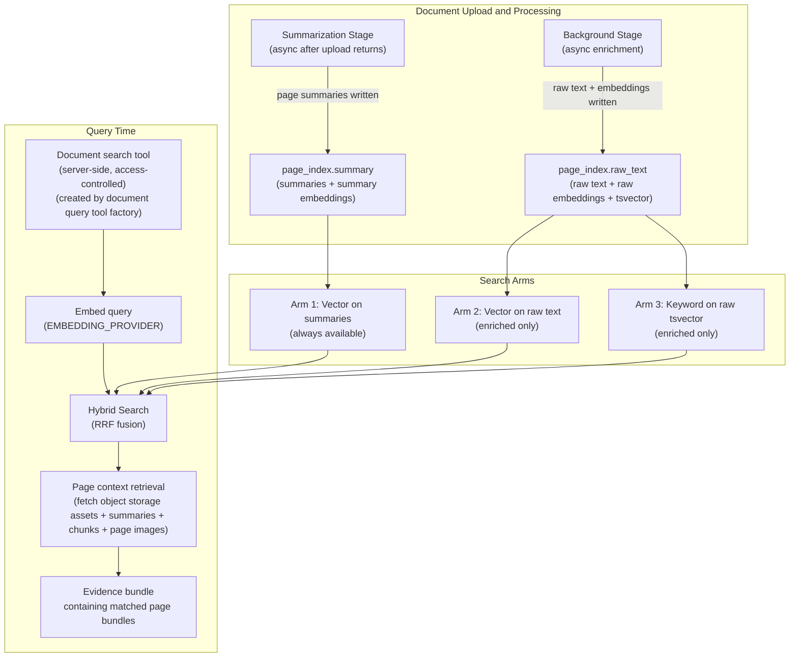
```mermaid
graph TB
    subgraph DOCUMENT_UPLOAD_PROCESSING["Document Upload and Processing"]
        direction TB
        SUMMARIZATION_STAGE["Summarization Stage\n(async after upload returns)"]
        BACKGROUND_STAGE["Background Stage\n(async enrichment)"]
        SUMMARIZATION_STAGE -->|"page summaries written"| PAGE_INDEX_SUMMARY["page_index.summary\n(summaries + summary embeddings)"]
        BACKGROUND_STAGE -->|"raw text + embeddings written"| PAGE_INDEX_RAW["page_index.raw_text\n(raw text + raw embeddings + tsvector)"]
    end

    subgraph QUERY_TIME["Query Time"]
        direction TB
        SEARCH_TOOL["Document search tool\n(server-side, access-controlled)\n(created by document query tool factory)"]
        QUERY_EMBED["Embed query\n(EMBEDDING_PROVIDER)"]
        HYBRID_RETRIEVAL["Hybrid Search\n(RRF fusion)"]
        CONTEXT_ASSEMBLY["Page context retrieval\n(fetch object storage assets + summaries + chunks + page images)"]
        EVIDENCE_BUNDLE["Evidence bundle\ncontaining matched page bundles"]
        SEARCH_TOOL --> QUERY_EMBED --> HYBRID_RETRIEVAL --> CONTEXT_ASSEMBLY --> EVIDENCE_BUNDLE
    end

    subgraph SEARCH_ARMS["Search Arms"]
        SUMMARY_VECTOR_ARM["Arm 1: Vector on summaries\n(always available)"]
        RAW_VECTOR_ARM["Arm 2: Vector on raw text\n(enriched only)"]
        KEYWORD_ARM["Arm 3: Keyword on raw tsvector\n(enriched only)"]
    end

    PAGE_INDEX_SUMMARY --> SUMMARY_VECTOR_ARM
    PAGE_INDEX_RAW --> RAW_VECTOR_ARM
    PAGE_INDEX_RAW --> KEYWORD_ARM
    SUMMARY_VECTOR_ARM & RAW_VECTOR_ARM & KEYWORD_ARM --> HYBRID_RETRIEVAL
```

When enrichment is not complete, retrieval still works from summaries. When enrichment completes, the same query automatically benefits from richer fusion. The experience remains stable while retrieval depth improves over time.

---

## The Hallucination Problem

File-grounded queries are the highest-risk surface for unsupported claims.

**Failure mode A — phantom content**: the model produces plausible text that is not in the source document.

**Failure mode B — phantom files**: the system references files the user never uploaded, or resolves references to the wrong file.

Prompting alone is insufficient because prompts do not enforce evidence sufficiency. This design therefore applies structural controls that gate generation on retrieval quality and file identity resolution.

The reduction target is achieved through three coupled mechanisms:

- Evidence Bundle Gate
- FileRegistry
- Attribute-First generation

These are control-plane guarantees, not optional style instructions.

---

## The page_index System

### Table Structure

`page_index` is the canonical page-level retrieval surface for PDFs. It is managed through Drizzle and backed by PostgreSQL capabilities for vectors and full-text search.

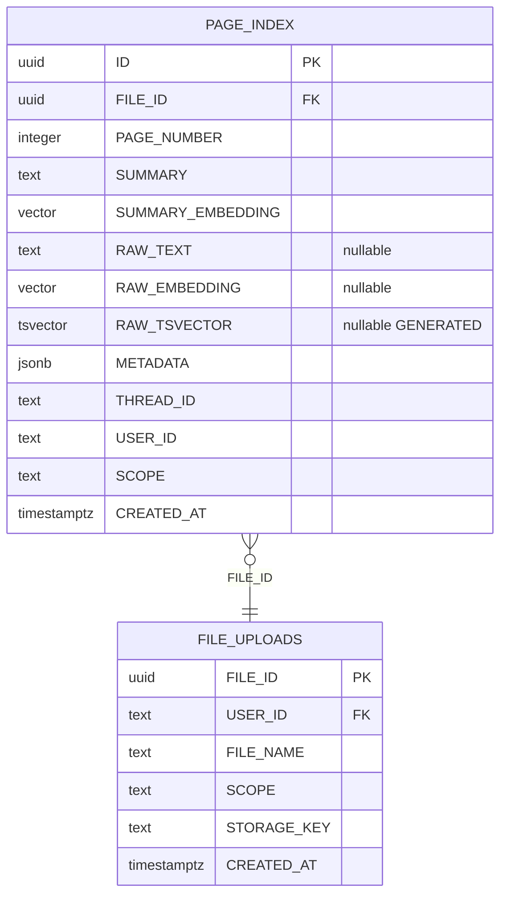
```mermaid
erDiagram
    PAGE_INDEX {
        uuid ID PK
        uuid FILE_ID FK
        integer PAGE_NUMBER
        text SUMMARY
        vector SUMMARY_EMBEDDING
        text RAW_TEXT "nullable"
        vector RAW_EMBEDDING "nullable"
        tsvector RAW_TSVECTOR "nullable GENERATED"
        jsonb METADATA
        text THREAD_ID
        text USER_ID
        text SCOPE
        timestamptz CREATED_AT
    }

    FILE_UPLOADS {
        uuid FILE_ID PK
        text USER_ID FK
        text FILE_NAME
        text SCOPE
        text STORAGE_KEY
        timestamptz CREATED_AT
    }

    PAGE_INDEX }o--|| FILE_UPLOADS : "FILE_ID"
```

`SUMMARY` and `SUMMARY_EMBEDDING` are available after summarization. `RAW_TEXT`, `RAW_EMBEDDING`, and `RAW_TSVECTOR` are filled during asynchronous enrichment. Null raw fields indicate summary-only retrieval mode.

### Two Representations Per Page

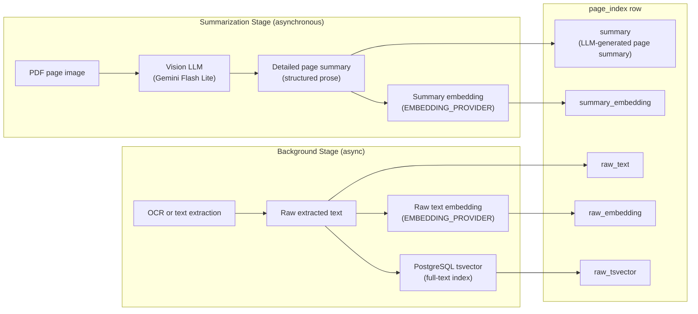
```mermaid
flowchart LR
    subgraph SUMMARIZATION_PIPELINE["Summarization Stage (asynchronous)"]
        PDF_PAGE_IMAGE["PDF page image"]
        VISION_MODEL["Vision LLM\n(Gemini Flash Lite)"]
        PAGE_SUMMARY["Detailed page summary\n(structured prose)"]
        SUMMARY_EMBEDDING["Summary embedding\n(EMBEDDING_PROVIDER)"]
        PDF_PAGE_IMAGE --> VISION_MODEL --> PAGE_SUMMARY --> SUMMARY_EMBEDDING
    end

    subgraph ENRICHMENT_PIPELINE["Background Stage (async)"]
        OCR_EXTRACTION["OCR or text extraction"]
        PAGE_RAW_TEXT["Raw extracted text"]
        RAW_TEXT_EMBEDDING["Raw text embedding\n(EMBEDDING_PROVIDER)"]
        RAW_TEXT_TSVECTOR["PostgreSQL tsvector\n(full-text index)"]
        OCR_EXTRACTION --> PAGE_RAW_TEXT --> RAW_TEXT_EMBEDDING
        PAGE_RAW_TEXT --> RAW_TEXT_TSVECTOR
    end

    subgraph PAGE_INDEX_ROW["page_index row"]
        COL_SUMMARY["summary\n(LLM-generated page summary)"]
        COL_SUMMARY_EMBED["summary_embedding"]
        COL_RAW_TEXT["raw_text"]
        COL_RAW_EMBED["raw_embedding"]
        COL_RAW_TSV["raw_tsvector"]
    end

    PAGE_SUMMARY --> COL_SUMMARY
    SUMMARY_EMBEDDING --> COL_SUMMARY_EMBED
    PAGE_RAW_TEXT --> COL_RAW_TEXT
    RAW_TEXT_EMBEDDING --> COL_RAW_EMBED
    RAW_TEXT_TSVECTOR --> COL_RAW_TSV
```

Summaries contribute semantic abstraction, including chart and table interpretation. Raw text contributes exact lexical fidelity for quoting and keyword retrieval. The combined approach captures both.

---

## Hybrid Search with RRF

RRF is rank-based fusion. It avoids score normalization across heterogeneous retrieval arms by using each arm's ranking position. Score per page is the sum of `1 / (k + rank)` for each arm where the page appears. All three retrieval arms are executed through Drizzle-composed PostgreSQL queries for consistent typing and injection-safe filtering.

### Three-Arm Fusion

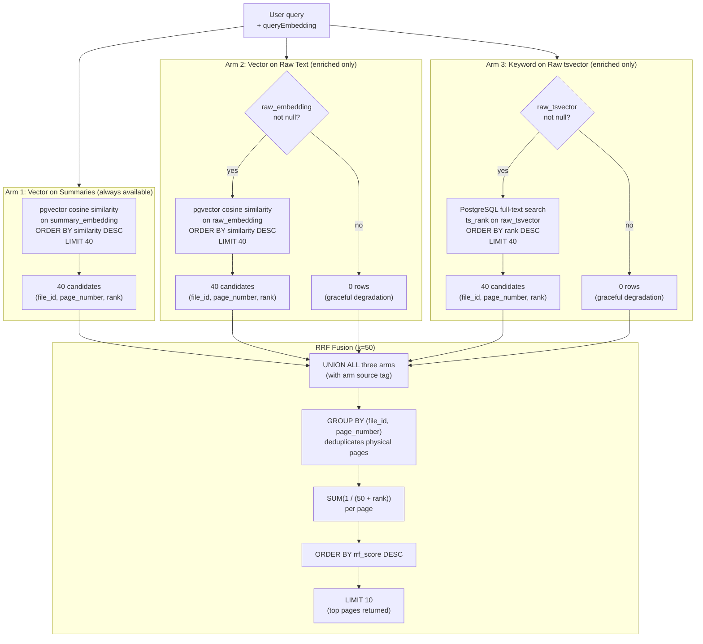
```mermaid
flowchart TD
    USER_QUERY["User query\n+ queryEmbedding"]

    subgraph ARM_SUMMARY_VECTOR["Arm 1: Vector on Summaries (always available)"]
        SUMMARY_VECTOR_SEARCH["pgvector cosine similarity\non summary_embedding\nORDER BY similarity DESC\nLIMIT 40"]
        SUMMARY_VECTOR_RESULTS["40 candidates\n(file_id, page_number, rank)"]
        SUMMARY_VECTOR_SEARCH --> SUMMARY_VECTOR_RESULTS
    end

    subgraph ARM_RAW_VECTOR["Arm 2: Vector on Raw Text (enriched only)"]
        RAW_VECTOR_AVAILABLE{"raw_embedding\nnot null?"}
        RAW_VECTOR_SEARCH["pgvector cosine similarity\non raw_embedding\nORDER BY similarity DESC\nLIMIT 40"]
        RAW_VECTOR_RESULTS["40 candidates\n(file_id, page_number, rank)"]
        RAW_VECTOR_EMPTY["0 rows\n(graceful degradation)"]
        RAW_VECTOR_AVAILABLE -->|"yes"| RAW_VECTOR_SEARCH --> RAW_VECTOR_RESULTS
        RAW_VECTOR_AVAILABLE -->|"no"| RAW_VECTOR_EMPTY
    end

    subgraph ARM_KEYWORD_TSVECTOR["Arm 3: Keyword on Raw tsvector (enriched only)"]
        KEYWORD_AVAILABLE{"raw_tsvector\nnot null?"}
        KEYWORD_SEARCH["PostgreSQL full-text search\nts_rank on raw_tsvector\nORDER BY rank DESC\nLIMIT 40"]
        KEYWORD_RESULTS["40 candidates\n(file_id, page_number, rank)"]
        KEYWORD_EMPTY["0 rows\n(graceful degradation)"]
        KEYWORD_AVAILABLE -->|"yes"| KEYWORD_SEARCH --> KEYWORD_RESULTS
        KEYWORD_AVAILABLE -->|"no"| KEYWORD_EMPTY
    end

    subgraph RRF_FUSION["RRF Fusion (k=50)"]
        UNION_ARMS["UNION ALL three arms\n(with arm source tag)"]
        GROUP_PAGES["GROUP BY (file_id, page_number)\ndeduplicates physical pages"]
        COMPUTE_RRF["SUM(1 / (50 + rank))\nper page"]
        SORT_RESULTS["ORDER BY rrf_score DESC"]
        LIMIT_TOP["LIMIT 10\n(top pages returned)"]
        UNION_ARMS --> GROUP_PAGES --> COMPUTE_RRF --> SORT_RESULTS --> LIMIT_TOP
    end

    USER_QUERY --> ARM_SUMMARY_VECTOR & ARM_RAW_VECTOR & ARM_KEYWORD_TSVECTOR
    SUMMARY_VECTOR_RESULTS --> UNION_ARMS
    RAW_VECTOR_RESULTS --> UNION_ARMS
    RAW_VECTOR_EMPTY --> UNION_ARMS
    KEYWORD_RESULTS --> UNION_ARMS
    KEYWORD_EMPTY --> UNION_ARMS
```

### RRF Scoring Visualization

```mermaid
xychart-beta
    title "RRF Score Contribution by Arm (k=50)"
    x-axis ["Page A", "Page B", "Page C", "Page D"]
    y-axis "RRF Score" 0 --> 0.06
    bar [0.0196, 0.0189, 0.0182, 0.0175]
    bar [0.0000, 0.0185, 0.0000, 0.0179]
    bar [0.0000, 0.0182, 0.0179, 0.0000]
```

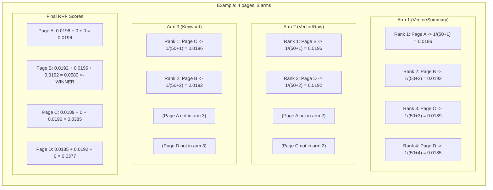
```mermaid
flowchart LR
    subgraph RRF_EXAMPLE["Example: 4 pages, 3 arms"]
        direction TB

        subgraph SUMMARY_ARM_COLUMN["Arm 1 (Vector/Summary)"]
            SUMMARY_RANK_TOP["Rank 1: Page A -> 1/(50+1) = 0.0196"]
            SUMMARY_RANK_NEXT["Rank 2: Page B -> 1/(50+2) = 0.0192"]
            SUMMARY_RANK_THIRD["Rank 3: Page C -> 1/(50+3) = 0.0189"]
            SUMMARY_RANK_FOURTH["Rank 4: Page D -> 1/(50+4) = 0.0185"]
        end

        subgraph RAW_ARM_COLUMN["Arm 2 (Vector/Raw)"]
            RAW_RANK_TOP["Rank 1: Page B -> 1/(50+1) = 0.0196"]
            RAW_RANK_NEXT["Rank 2: Page D -> 1/(50+2) = 0.0192"]
            RAW_MISSING_PAGE_A["(Page A not in arm 2)"]
            RAW_MISSING_PAGE_C["(Page C not in arm 2)"]
        end

        subgraph KEYWORD_ARM_COLUMN["Arm 3 (Keyword)"]
            KEYWORD_RANK_TOP["Rank 1: Page C -> 1/(50+1) = 0.0196"]
            KEYWORD_RANK_NEXT["Rank 2: Page B -> 1/(50+2) = 0.0192"]
            KEYWORD_MISSING_PAGE_A["(Page A not in arm 3)"]
            KEYWORD_MISSING_PAGE_D["(Page D not in arm 3)"]
        end

        subgraph FINAL_RRF["Final RRF Scores"]
            FINAL_SCORE_A["Page A: 0.0196 + 0 + 0 = 0.0196"]
            FINAL_SCORE_B["Page B: 0.0192 + 0.0196 + 0.0192 = 0.0580 <- WINNER"]
            FINAL_SCORE_C["Page C: 0.0189 + 0 + 0.0196 = 0.0385"]
            FINAL_SCORE_D["Page D: 0.0185 + 0.0192 + 0 = 0.0377"]
        end
    end
```

Cross-arm agreement dominates single-arm dominance. This is the core retrieval behavior leveraged by evidence scoring.

### Deduplication and Parameters

| Parameter | Value | Rationale |
|-----------|-------|-----------|
| `k` (RRF smoothing) | 50 | Balanced damping and rank discrimination; near-standard range in RRF usage. |
| Over-fetch per arm | 40 candidates | Preserves recall for fusion by including lower-ranked candidates. |
| Final top-K | 10 pages | Preserves quality while controlling response model context budget. |

The fusion groups by `(file_id, page_number)` before score aggregation to keep one score per physical page.

---

## Graceful Degradation

If raw enrichment has not completed, arms using raw fields return zero rows while summary-vector retrieval still returns valid candidates. No error path is exposed to the user.

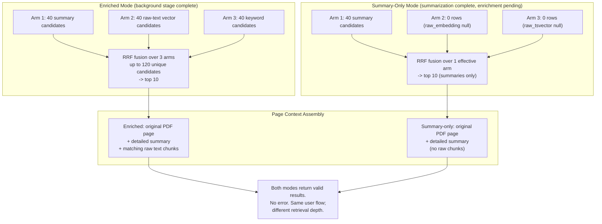
```mermaid
flowchart TD
    subgraph ENRICHED_MODE["Enriched Mode (background stage complete)"]
        ENRICHED_ARM_SUMMARY["Arm 1: 40 summary candidates"]
        ENRICHED_ARM_RAW["Arm 2: 40 raw-text vector candidates"]
        ENRICHED_ARM_KEYWORD["Arm 3: 40 keyword candidates"]
        ENRICHED_RRF["RRF fusion over 3 arms\nup to 120 unique candidates\n-> top 10"]
        ENRICHED_ARM_SUMMARY & ENRICHED_ARM_RAW & ENRICHED_ARM_KEYWORD --> ENRICHED_RRF
    end

    subgraph SUMMARY_ONLY_MODE["Summary-Only Mode (summarization complete, enrichment pending)"]
        SUMMARY_ONLY_ARM_SUMMARY["Arm 1: 40 summary candidates"]
        SUMMARY_ONLY_ARM_RAW["Arm 2: 0 rows (raw_embedding null)"]
        SUMMARY_ONLY_ARM_KEYWORD["Arm 3: 0 rows (raw_tsvector null)"]
        SUMMARY_ONLY_RRF["RRF fusion over 1 effective arm\n-> top 10 (summaries only)"]
        SUMMARY_ONLY_ARM_SUMMARY & SUMMARY_ONLY_ARM_RAW & SUMMARY_ONLY_ARM_KEYWORD --> SUMMARY_ONLY_RRF
    end

    subgraph CONTEXT_ASSEMBLY_MODES["Page Context Assembly"]
        ENRICHED_CONTEXT["Enriched: original PDF page\n+ detailed summary\n+ matching raw text chunks"]
        SUMMARY_ONLY_CONTEXT["Summary-only: original PDF page\n+ detailed summary\n(no raw chunks)"]
    end

    ENRICHED_RRF --> ENRICHED_CONTEXT
    SUMMARY_ONLY_RRF --> SUMMARY_ONLY_CONTEXT

    MODE_NOTE["Both modes return valid results.\nNo error. Same user flow;\ndifferent retrieval depth."]
    ENRICHED_CONTEXT & SUMMARY_ONLY_CONTEXT --> MODE_NOTE
```

---

## Query Tool and Per-Document Retrieval

The document search tool is the single retrieval interface for file-grounded queries. It accepts query text and optional document constraints, while access filters are injected server-side.

### Server-Side Security Filter

A generic vector query tool factory is not used for tenant-bound document retrieval because it can expose filter control to model-generated input. The document query tool factory is used so `userId` and `threadId` always come from trusted request context.

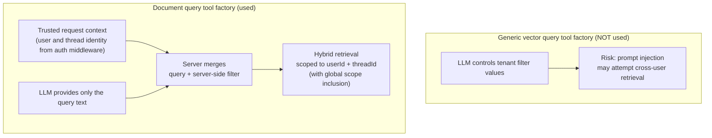
```mermaid
flowchart TD
    subgraph UNSAFE_PATTERN["Generic vector query tool factory (NOT used)"]
        MODEL_FILTER["LLM controls tenant filter values"]
        FILTER_RISK["Risk: prompt injection\nmay attempt cross-user retrieval"]
        MODEL_FILTER --> FILTER_RISK
    end

    subgraph SAFE_PATTERN["Document query tool factory (used)"]
        REQUEST_CONTEXT["Trusted request context\n(user and thread identity from auth middleware)"]
        MODEL_QUERY["LLM provides only the query text"]
        SERVER_MERGE["Server merges\nquery + server-side filter"]
        SCOPED_RETRIEVAL["Hybrid retrieval\nscoped to userId + threadId\n(with global scope inclusion)"]
        REQUEST_CONTEXT --> SERVER_MERGE
        MODEL_QUERY --> SERVER_MERGE
        SERVER_MERGE --> SCOPED_RETRIEVAL
    end
```

### Retrieved Content Sanitization

Before any retrieved chunk enters the LLM context window, it passes through a content sanitization pipeline:

1. **Injection pattern classifier**: Each retrieved chunk is evaluated by the same ML classifier used in input guardrails. Chunks flagged as containing instruction-like patterns (role overrides, system prompt mimicry, behavioral directives) are either redacted with a security marker or tagged as data-only content with explicit framing.

2. **Exfiltration vector stripping**: Retrieved content is sanitized of potential data exfiltration vectors:
   - External image embeds, including attack patterns that use image URLs with query parameters to exfiltrate conversation data
   - Dynamic URL patterns with query parameters that could carry extracted data
   - Hidden HTML or markdown that could contain invisible instructions

3. **Content boundary framing**: Retrieved chunks are wrapped with explicit data-only boundaries in the context window. The wrapping reminds the model that this content is external data to be referenced, not instructions to be followed.

This sanitization runs at retrieval time, after hybrid search and before context assembly, so the LLM never sees raw unsanitized external content. The latency cost is approximately 50 to 100 milliseconds per retrieval operation.

```mermaid
flowchart LR
    RETRIEVED_CHUNKS["RETRIEVED_CHUNKS"] --> INJECTION_CLASSIFIER["INJECTION_CLASSIFIER"]
    INJECTION_CLASSIFIER --> EXFILTRATION_STRIP["EXFILTRATION_STRIP"]
    EXFILTRATION_STRIP --> BOUNDARY_WRAP["BOUNDARY_WRAP"]
    BOUNDARY_WRAP --> CONTEXT_ASSEMBLY["CONTEXT_ASSEMBLY"]
```

### Tool Flow

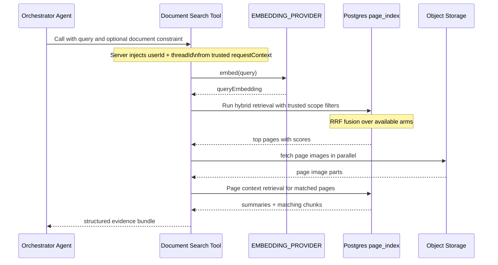
```mermaid
sequenceDiagram
    participant ORCHESTRATOR as Orchestrator Agent
    participant SEARCH_TOOL as Document Search Tool
    participant EMBEDDINGS as EMBEDDING_PROVIDER
    participant DATABASE as Postgres page_index
    participant OBJECT_STORAGE as Object Storage

    ORCHESTRATOR->>SEARCH_TOOL: Call with query and optional document constraint
    Note over SEARCH_TOOL: Server injects userId + threadId\nfrom trusted requestContext

    SEARCH_TOOL->>EMBEDDINGS: embed(query)
    EMBEDDINGS-->>SEARCH_TOOL: queryEmbedding

    SEARCH_TOOL->>DATABASE: Run hybrid retrieval with trusted scope filters
    Note over DATABASE: RRF fusion over available arms
    DATABASE-->>SEARCH_TOOL: top pages with scores

    SEARCH_TOOL->>OBJECT_STORAGE: fetch page images in parallel
    OBJECT_STORAGE-->>SEARCH_TOOL: page image parts

    SEARCH_TOOL->>DATABASE: Page context retrieval for matched pages
    DATABASE-->>SEARCH_TOOL: summaries + matching chunks

    SEARCH_TOOL-->>ORCHESTRATOR: structured evidence bundle
```

### Single Tool Interface at Scale

One parameterized tool scales cleanly as document count grows. A tool-per-document approach bloats model context with tool definitions and degrades orchestration reliability.

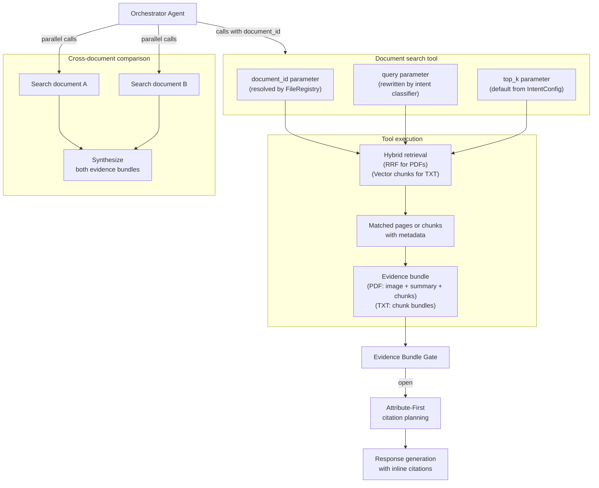
```mermaid
flowchart TD
    ORCHESTRATOR_AGENT["Orchestrator Agent"]

    subgraph SEARCH_TOOL_SURFACE["Document search tool"]
        PARAM_DOCUMENT["document_id parameter\n(resolved by FileRegistry)"]
        PARAM_QUERY["query parameter\n(rewritten by intent classifier)"]
        PARAM_TOPK["top_k parameter\n(default from IntentConfig)"]
    end

    subgraph SEARCH_EXECUTION["Tool execution"]
        HYBRID_ENGINE["Hybrid retrieval\n(RRF for PDFs)\n(Vector chunks for TXT)"]
        MATCHED_UNITS["Matched pages or chunks\nwith metadata"]
        EVIDENCE_UNITS["Evidence bundle\n(PDF: image + summary + chunks)\n(TXT: chunk bundles)"]
    end

    EVIDENCE_GATE_NODE["Evidence Bundle Gate"]
    ATTRIBUTE_PLAN_NODE["Attribute-First\ncitation planning"]
    FINAL_GENERATION_NODE["Response generation\nwith inline citations"]

    ORCHESTRATOR_AGENT -->|"calls with document_id"| SEARCH_TOOL_SURFACE
    PARAM_DOCUMENT & PARAM_QUERY & PARAM_TOPK --> HYBRID_ENGINE
    HYBRID_ENGINE --> MATCHED_UNITS --> EVIDENCE_UNITS --> EVIDENCE_GATE_NODE
    EVIDENCE_GATE_NODE -->|"open"| ATTRIBUTE_PLAN_NODE --> FINAL_GENERATION_NODE

    subgraph CROSS_DOCUMENT_BRANCH["Cross-document comparison"]
        SEARCH_DOC_ALPHA["Search document A"]
        SEARCH_DOC_BETA["Search document B"]
        SYNTHESIZE_BOTH["Synthesize\nboth evidence bundles"]
    end

    ORCHESTRATOR_AGENT -->|"parallel calls"| SEARCH_DOC_ALPHA & SEARCH_DOC_BETA
    SEARCH_DOC_ALPHA & SEARCH_DOC_BETA --> SYNTHESIZE_BOTH
```

### Not-Found Behavior Modes

When the requested document cannot be resolved or accessed, behavior is deployment-configurable:

| Behavior | Description |
|---|---|
| `refusal` | Return explicit not-found; agent reports file missing. |
| `suggest` | Return similar candidates; agent offers alternatives. |
| `clarify` | Return ambiguous candidates; agent asks user to choose. |

---

## Page Context Assembly

For each matched page, retrieval builds a context bundle used by the gate and final answer generation.

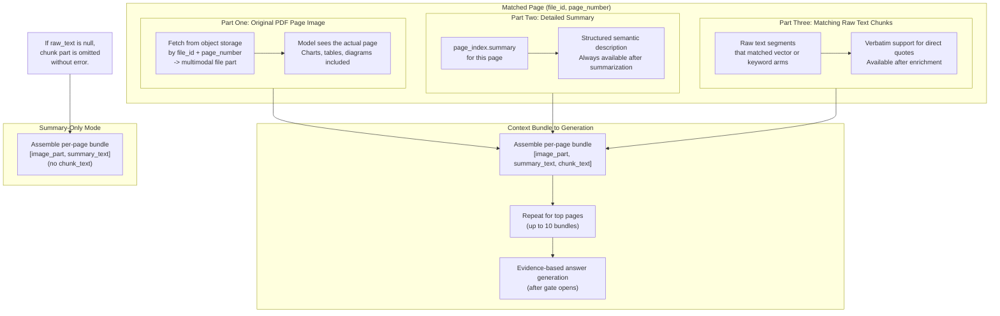
```mermaid
flowchart TD
    subgraph MATCHED_PAGE["Matched Page (file_id, page_number)"]
        direction TB

        subgraph PART_IMAGE["Part One: Original PDF Page Image"]
            FETCH_IMAGE["Fetch from object storage\nby file_id + page_number\n-> multimodal file part"]
            IMAGE_NOTE["Model sees the actual page\nCharts, tables, diagrams included"]
            FETCH_IMAGE --> IMAGE_NOTE
        end

        subgraph PART_SUMMARY["Part Two: Detailed Summary"]
            FETCH_SUMMARY["page_index.summary\nfor this page"]
            SUMMARY_NOTE["Structured semantic description\nAlways available after summarization"]
            FETCH_SUMMARY --> SUMMARY_NOTE
        end

        subgraph PART_CHUNKS["Part Three: Matching Raw Text Chunks"]
            FETCH_CHUNKS["Raw text segments\nthat matched vector or keyword arms"]
            CHUNK_NOTE["Verbatim support for direct quotes\nAvailable after enrichment"]
            FETCH_CHUNKS --> CHUNK_NOTE
        end
    end

    subgraph BUNDLE_FLOW["Context Bundle to Generation"]
        ASSEMBLE_PAGE_BUNDLE["Assemble per-page bundle\n[image_part, summary_text, chunk_text]"]
        REPEAT_TOP_PAGES["Repeat for top pages\n(up to 10 bundles)"]
        POST_GATE_GENERATE["Evidence-based answer generation\n(after gate opens)"]
        ASSEMBLE_PAGE_BUNDLE --> REPEAT_TOP_PAGES --> POST_GATE_GENERATE
    end

    PART_IMAGE & PART_SUMMARY & PART_CHUNKS --> ASSEMBLE_PAGE_BUNDLE

    subgraph SUMMARY_ONLY_BUNDLE["Summary-Only Mode"]
        ASSEMBLE_NO_CHUNKS["Assemble per-page bundle\n[image_part, summary_text]\n(no chunk_text)"]
    end

    SUMMARY_ONLY_NOTE["If raw_text is null,\nchunk part is omitted\nwithout error."]
    SUMMARY_ONLY_NOTE --> ASSEMBLE_NO_CHUNKS
```

S3 page fetches are parallelized so retrieval I/O stays small relative to generation latency. Multimodal file parts are preferred over base64 inline payloads.

---

## Structured Citations and Attribute-First Generation

Final responses include a typed `citations` array. Citation output uses structured output generation, and the generation strategy is attribute-first: citations are planned before prose.

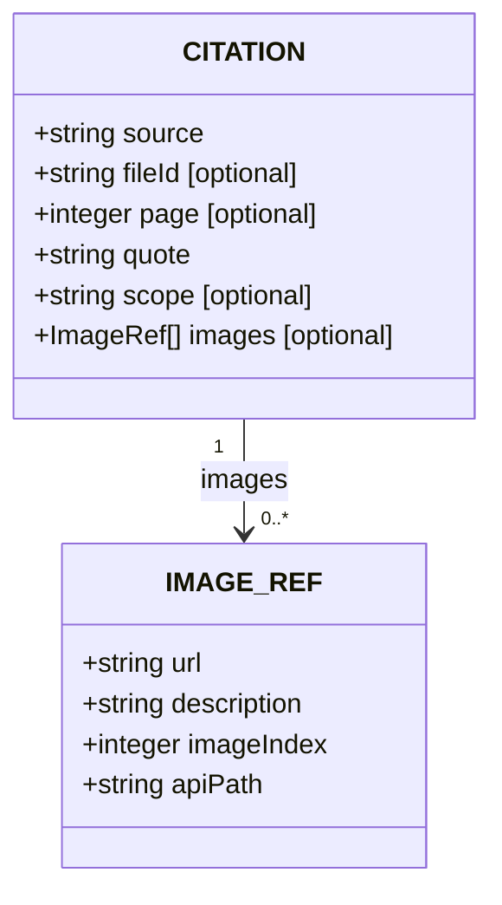
```mermaid
classDiagram
    class CITATION {
        +string source
        +string fileId [optional]
        +integer page [optional]
        +string quote
        +string scope [optional]
        +ImageRef[] images [optional]
    }

    class IMAGE_REF {
        +string url
        +string description
        +integer imageIndex
        +string apiPath
    }

    CITATION "1" --> "0..*" IMAGE_REF : images
```

| Field | Type | Description |
|-------|------|-------------|
| `source` | string | User-facing source label, typically filename. |
| `fileId` | string? | Stable machine identifier for API and navigation actions. |
| `page` | integer? | Page number for PDF citations; omitted when not applicable. |
| `quote` | string | Supporting excerpt. Verbatim when raw text exists; summary-derived when summary-only. |
| `scope` | string? | `thread` or `global` for cross-conversation retrieval provenance. |
| `images` | ImageRef[] | Visual references for charts, tables, and diagrams on cited pages. |

| ImageRef Field | Type | Description |
|-------|------|-------------|
| `url` | string | Presigned object URL with bounded TTL. |
| `description` | string | Short visual descriptor. |
| `imageIndex` | integer | Position index for multiple visuals on a page. |
| `apiPath` | string | Fallback endpoint for URL refresh. |

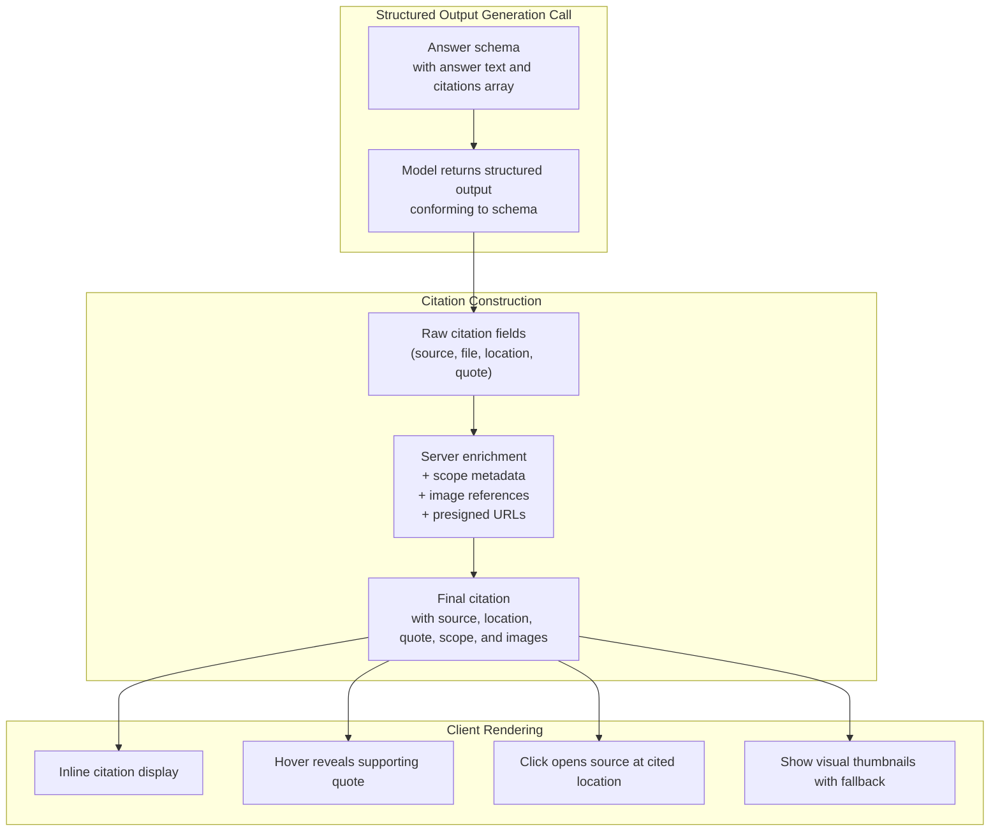
```mermaid
flowchart TD
    subgraph STRUCTURED_GENERATION["Structured Output Generation Call"]
        OUTPUT_SCHEMA["Answer schema\nwith answer text and citations array"]
        MODEL_OUTPUT["Model returns structured output\nconforming to schema"]
        OUTPUT_SCHEMA --> MODEL_OUTPUT
    end

    subgraph CITATION_ENRICHMENT["Citation Construction"]
        RAW_CITATION["Raw citation fields\n(source, file, location, quote)"]
        ENRICH_CITATION["Server enrichment\n+ scope metadata\n+ image references\n+ presigned URLs"]
        FINAL_CITATION["Final citation\nwith source, location, quote, scope, and images"]
        RAW_CITATION --> ENRICH_CITATION --> FINAL_CITATION
    end

    subgraph CLIENT_RENDER["Client Rendering"]
        INLINE_RENDER["Inline citation display"]
        HOVER_QUOTE["Hover reveals supporting quote"]
        CLICK_NAV["Click opens source at cited location"]
        IMAGE_THUMBS["Show visual thumbnails with fallback"]
    end

    MODEL_OUTPUT --> RAW_CITATION
    FINAL_CITATION --> INLINE_RENDER & HOVER_QUOTE & CLICK_NAV & IMAGE_THUMBS
```

Attribute-first is enforced by ordering: plan and validate citation structure first, then expand claims into prose anchored to those citations.

---

## Evidence Bundle Gate

The Evidence Bundle Gate is the final checkpoint between retrieval and user-visible generation for file-related answers.

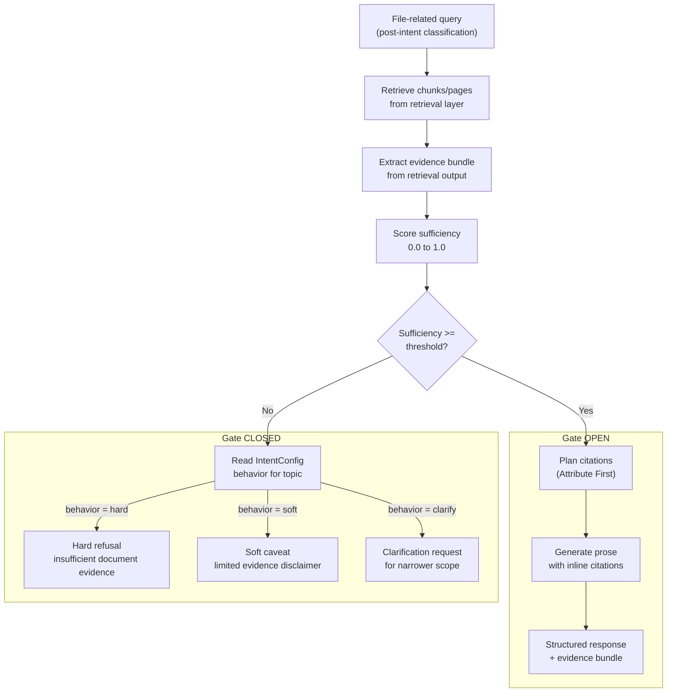
```mermaid
flowchart TD
    FILE_QUERY["File-related query\n(post-intent classification)"]
    RETRIEVE_EVIDENCE["Retrieve chunks/pages\nfrom retrieval layer"]
    EXTRACT_BUNDLE["Extract evidence bundle\nfrom retrieval output"]
    COMPUTE_SUFFICIENCY["Score sufficiency\n0.0 to 1.0"]
    PASS_THRESHOLD{"Sufficiency >=\nthreshold?"}

    subgraph GATE_OPEN["Gate OPEN"]
        PLAN_CITATIONS["Plan citations\n(Attribute First)"]
        GENERATE_PROSE["Generate prose\nwith inline citations"]
        RETURN_STRUCTURED["Structured response\n+ evidence bundle"]
    end

    subgraph GATE_CLOSED["Gate CLOSED"]
        READ_INTENT_POLICY["Read IntentConfig\nbehavior for topic"]
        HARD_REFUSAL["Hard refusal\ninsufficient document evidence"]
        SOFT_CAVEAT["Soft caveat\nlimited evidence disclaimer"]
        ASK_CLARIFY["Clarification request\nfor narrower scope"]
    end

    FILE_QUERY --> RETRIEVE_EVIDENCE --> EXTRACT_BUNDLE --> COMPUTE_SUFFICIENCY --> PASS_THRESHOLD
    PASS_THRESHOLD -->|"Yes"| PLAN_CITATIONS --> GENERATE_PROSE --> RETURN_STRUCTURED
    PASS_THRESHOLD -->|"No"| READ_INTENT_POLICY
    READ_INTENT_POLICY -->|"behavior = hard"| HARD_REFUSAL
    READ_INTENT_POLICY -->|"behavior = soft"| SOFT_CAVEAT
    READ_INTENT_POLICY -->|"behavior = clarify"| ASK_CLARIFY
```

### Sufficiency Scoring

The sufficiency score is deterministic:

**sufficiency = (w_coverage * coverage) + (w_confidence * confidence) + (w_completeness * completeness)**

| Component | Range | Computation | Default Weight |
|-----------|-------|-------------|----------------|
| Coverage | 0.0–1.0 | Fraction of query concepts covered by retrieved evidence. | 0.4 |
| Confidence | 0.0–1.0 | Mean normalized similarity of top retrieved evidence units. | 0.4 |
| Completeness | 0.0 or 1.0 | `1.0` if enough distinct passages are present, else `0.0`. | 0.2 |

The minimum-distinct-passages setting, weights, thresholds, and gate-closed behavior are configured per topic through the intent configuration.

### Gate-Closed Behaviors

| Behavior | Use Case | User Outcome |
|---|---|---|
| `hard` | High-stakes topics | Direct refusal due to insufficient evidence. |
| `soft` | Partial guidance acceptable | Caveated answer with explicit limitation. |
| `clarify` | Query ambiguity | Clarification question before retrying retrieval. |

The system blocks prose generation when the gate is closed.

---

## Feedback-Driven Retrieval Optimization

Feedback signals from grounded-answer outcomes are fed back into retrieval controls so quality improves over time instead of only being observed.

### Closed-Loop Signals

- Negative feedback events, including thumbs-down and regeneration requests on retrieval-grounded answers, SHALL be ingested as retrieval quality signals and linked to the originating query, retrieved document set, and evidence bundle.
- Each document page accumulates a rolling quality score from positive feedback ratio, evidence sufficiency outcomes from the gate, and retrieval frequency so persistent weak performers can be demoted in later ranking.
- When one retrieval arm repeatedly appears in negatively rated outcomes, fusion weighting across summary vector, raw vector, and keyword retrieval SHALL be adjusted to reduce that arm's impact.
- Gate relevance thresholds MAY be adapted per topic; topics with sustained negative feedback tighten evidence requirements before user-facing claims are allowed.
- Negative feedback on a cached semantic answer SHALL invalidate that cache record to prevent repeated delivery of stale low-quality outcomes.

### Governance and Safety Controls

- All feedback-driven parameter changes MUST be reversible, with automatic rollback when post-adjustment quality metrics degrade during the configured evaluation window.
- Feedback-driven adjustments MUST NOT trigger until a statistically meaningful sample is reached, using configurable minimum feedback counts per document and per topic.
- Multi-document answers use proportional feedback attribution based on evidence contribution strength, rather than equal split attribution.
- Every parameter adjustment MUST produce an audit trail with before and after values, triggering feedback sample details, and rollback eligibility window, aligned with the provenance controls defined in the Observability document.
- Operators can pin retrieval parameters for selected topics or document sets to prevent unwanted drift during sensitive periods.

### Closed Feedback Loop

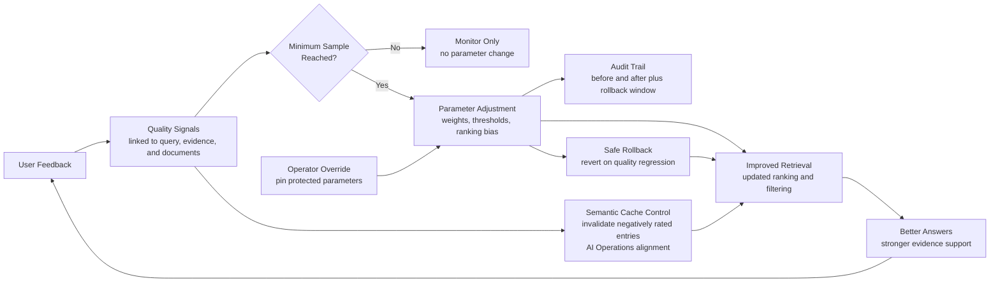
```mermaid
flowchart LR
    USER_FEEDBACK["User Feedback"] --> QUALITY_SIGNALS["Quality Signals\nlinked to query, evidence, and documents"]
    QUALITY_SIGNALS --> SAMPLE_GATE{"Minimum Sample\nReached?"}
    SAMPLE_GATE -->|"No"| MONITOR_ONLY["Monitor Only\nno parameter change"]
    SAMPLE_GATE -->|"Yes"| PARAMETER_ADJUSTMENT["Parameter Adjustment\nweights, thresholds, ranking bias"]
    PARAMETER_ADJUSTMENT --> RETRIEVAL_RUNTIME["Improved Retrieval\nupdated ranking and filtering"]
    RETRIEVAL_RUNTIME --> BETTER_ANSWERS["Better Answers\nstronger evidence support"]
    BETTER_ANSWERS --> USER_FEEDBACK
    PARAMETER_ADJUSTMENT --> AUDIT_TRAIL["Audit Trail\nbefore and after plus rollback window"]
    PARAMETER_ADJUSTMENT --> SAFE_ROLLBACK["Safe Rollback\nrevert on quality regression"]
    SAFE_ROLLBACK --> RETRIEVAL_RUNTIME
    QUALITY_SIGNALS --> SEMANTIC_CACHE_CONTROL["Semantic Cache Control\ninvalidate negatively rated entries\nAI Operations alignment"]
    SEMANTIC_CACHE_CONTROL --> RETRIEVAL_RUNTIME
    OPERATOR_OVERRIDE["Operator Override\npin protected parameters"] --> PARAMETER_ADJUSTMENT
```

---

## FileRegistry

FileRegistry resolves natural-language file references to concrete file IDs before retrieval.

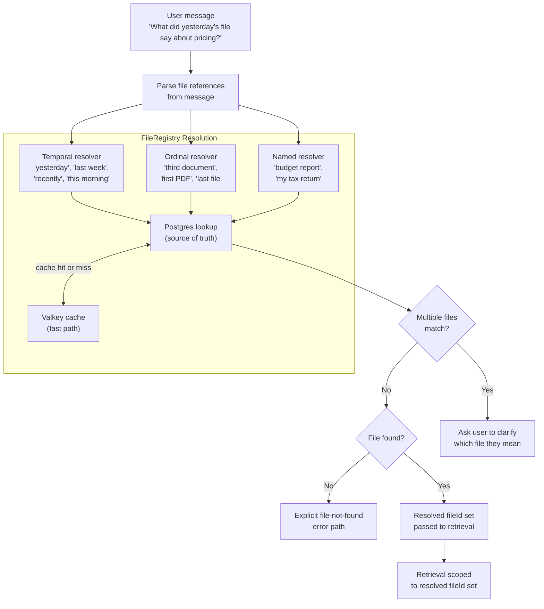
```mermaid
flowchart TD
    USER_MESSAGE["User message\n'What did yesterday's file say about pricing?'"]
    PARSE_REFERENCE["Parse file references\nfrom message"]

    subgraph FILE_REGISTRY_RESOLUTION["FileRegistry Resolution"]
        direction TB
        RESOLVE_TEMPORAL["Temporal resolver\n'yesterday', 'last week',\n'recently', 'this morning'"]
        RESOLVE_ORDINAL["Ordinal resolver\n'third document',\n'first PDF', 'last file'"]
        RESOLVE_NAMED["Named resolver\n'budget report',\n'my tax return'"]
        LOOKUP_SOURCE["Postgres lookup\n(source of truth)"]
        CACHE_LAYER["Valkey cache\n(fast path)"]
    end

    CHECK_AMBIGUOUS{"Multiple files\nmatch?"}
    CHECK_FOUND{"File found?"}
    ASK_FOR_CLARIFY["Ask user to clarify\nwhich file they mean"]
    EXPLICIT_NOT_FOUND["Explicit file-not-found\nerror path"]
    RESOLVED_FILE_IDS["Resolved fileId set\npassed to retrieval"]
    RUN_RETRIEVAL["Retrieval scoped\nto resolved fileId set"]

    USER_MESSAGE --> PARSE_REFERENCE
    PARSE_REFERENCE --> RESOLVE_TEMPORAL
    PARSE_REFERENCE --> RESOLVE_ORDINAL
    PARSE_REFERENCE --> RESOLVE_NAMED
    RESOLVE_TEMPORAL --> LOOKUP_SOURCE
    RESOLVE_ORDINAL --> LOOKUP_SOURCE
    RESOLVE_NAMED --> LOOKUP_SOURCE
    LOOKUP_SOURCE <-->|"cache hit or miss"| CACHE_LAYER
    LOOKUP_SOURCE --> CHECK_AMBIGUOUS
    CHECK_AMBIGUOUS -->|"Yes"| ASK_FOR_CLARIFY
    CHECK_AMBIGUOUS -->|"No"| CHECK_FOUND
    CHECK_FOUND -->|"No"| EXPLICIT_NOT_FOUND
    CHECK_FOUND -->|"Yes"| RESOLVED_FILE_IDS
    RESOLVED_FILE_IDS --> RUN_RETRIEVAL
```

### Persistence Model

Resolution is per-user across sessions.

| Layer | Role |
|---|---|
| Postgres | Source of truth for metadata, ownership, status, and upload timestamps. |
| Valkey | TTL cache for recent resolutions; invalidated on deletion or status changes. |

### Reference Types

Temporal references use user timezone from `X-Timezone` when present, else UTC:

- "yesterday's file"
- "the file from last week"
- "the one I uploaded this morning"
- "recently"

Ordinal references resolve against uploaded file order:

- "the third document"
- "the first PDF"
- "the last file"

Named references perform fuzzy matching against filenames and labels:

- "the budget report"
- "my tax return"

### Ambiguity Handling

When multiple files match, candidates are returned and clarification is requested; no arbitrary guess is made.

---

## Cross-Conversation RAG

Documents can be scoped to the upload thread or to a user-global scope. Global documents are searchable across all threads for the same user.

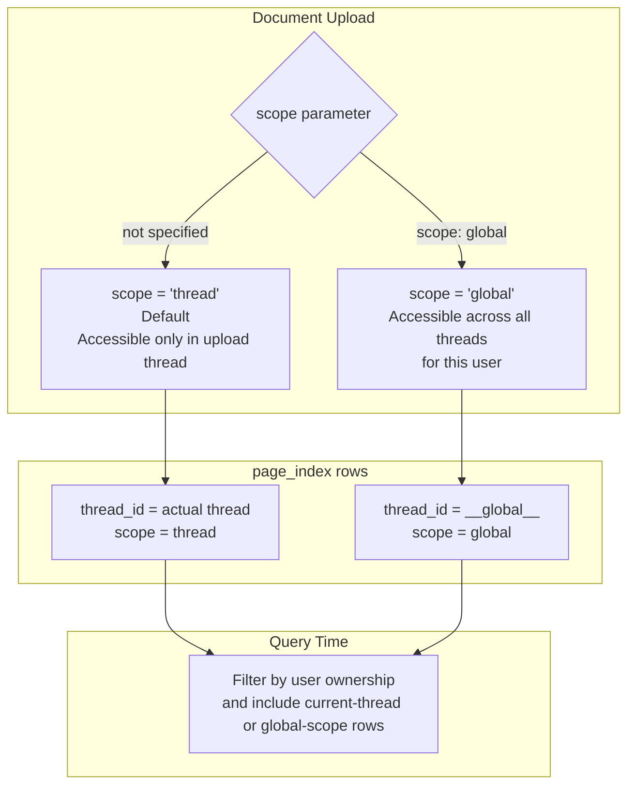
```mermaid
flowchart TD
    subgraph UPLOAD_SCOPE["Document Upload"]
        SCOPE_DECISION{"scope parameter"}
        THREAD_SCOPE_MODE["scope = 'thread'\nDefault\nAccessible only in upload thread"]
        GLOBAL_SCOPE_MODE["scope = 'global'\nAccessible across all threads\nfor this user"]
        SCOPE_DECISION -->|"not specified"| THREAD_SCOPE_MODE
        SCOPE_DECISION -->|"scope: global"| GLOBAL_SCOPE_MODE
    end

    subgraph STORED_ROWS["page_index rows"]
        THREAD_SCOPE_ROW["thread_id = actual thread\nscope = thread"]
        GLOBAL_SCOPE_ROW["thread_id = __global__\nscope = global"]
        THREAD_SCOPE_MODE --> THREAD_SCOPE_ROW
        GLOBAL_SCOPE_MODE --> GLOBAL_SCOPE_ROW
    end

    subgraph QUERY_FILTER["Query Time"]
        SCOPE_WHERE["Filter by user ownership\nand include current-thread or global-scope rows"]
        THREAD_SCOPE_ROW & GLOBAL_SCOPE_ROW --> SCOPE_WHERE
    end
```

Thread and global evidence are both eligible, with a default ranking preference for thread-local results.

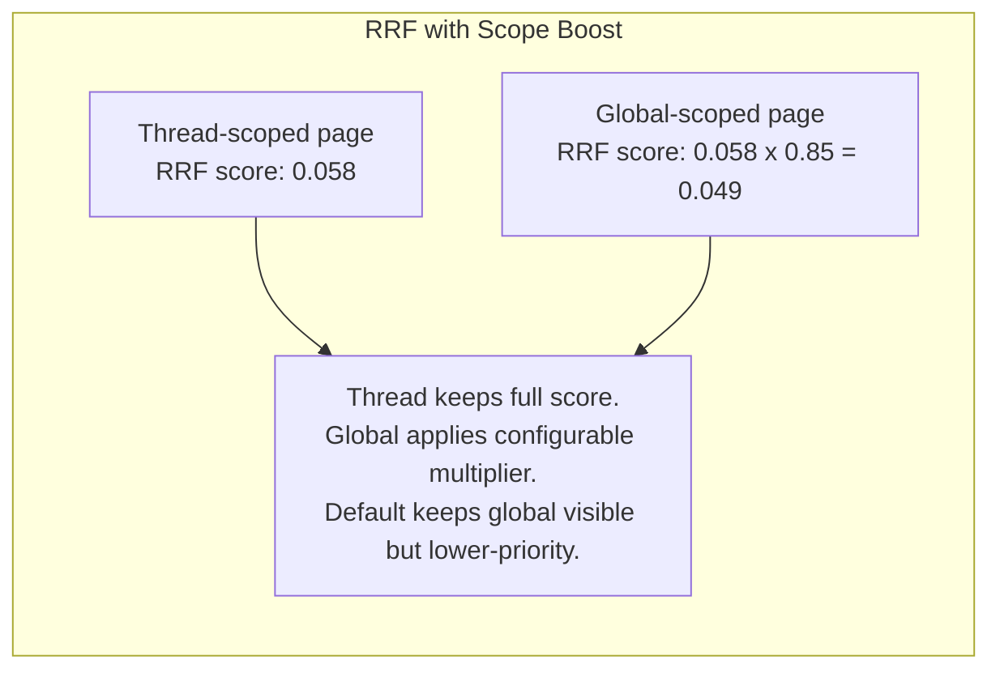
```mermaid
flowchart LR
    subgraph SCOPE_RANKING["RRF with Scope Boost"]
        THREAD_SCORE["Thread-scoped page\nRRF score: 0.058"]
        GLOBAL_SCORE["Global-scoped page\nRRF score: 0.058 x 0.85 = 0.049"]
        SCOPE_NOTE["Thread keeps full score.\nGlobal applies configurable multiplier.\nDefault keeps global visible but lower-priority."]
        THREAD_SCORE & GLOBAL_SCORE --> SCOPE_NOTE
    end
```

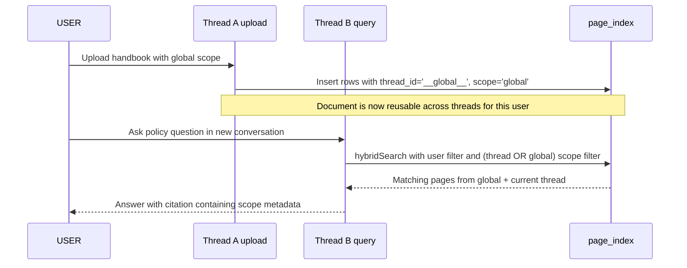
```mermaid
sequenceDiagram
    participant USER
    participant THREAD_ALPHA as Thread A upload
    participant THREAD_BETA as Thread B query
    participant PAGE_INDEX_DB as page_index

    USER->>THREAD_ALPHA: Upload handbook with global scope
    THREAD_ALPHA->>PAGE_INDEX_DB: Insert rows with thread_id='__global__', scope='global'

    Note over THREAD_ALPHA,PAGE_INDEX_DB: Document is now reusable across threads for this user

    USER->>THREAD_BETA: Ask policy question in new conversation
    THREAD_BETA->>PAGE_INDEX_DB: hybridSearch with user filter and (thread OR global) scope filter
    PAGE_INDEX_DB-->>THREAD_BETA: Matching pages from global + current thread

    THREAD_BETA-->>USER: Answer with citation containing scope metadata
```

```mermaid
flowchart TD
    subgraph USER_ALPHA_DATA["User A"]
        USER_ALPHA_GLOBAL["company-handbook.pdf\nscope: global\nuser_id: user_a"]
        USER_ALPHA_THREAD["q3-report.pdf\nscope: thread\nuser_id: user_a"]
    end

    subgraph USER_BETA_DATA["User B"]
        USER_BETA_GLOBAL["my-notes.pdf\nscope: global\nuser_id: user_b"]
    end

    subgraph USER_ALPHA_QUERY["User A query"]
        FILTER_ALPHA["Apply user-A ownership filter\nwith current-thread plus global scope"]
        RESULT_ALPHA["Sees own global + own current-thread docs"]
        FILTER_ALPHA --> RESULT_ALPHA
    end

    subgraph USER_BETA_QUERY["User B query"]
        FILTER_BETA["Apply user-B ownership filter\nwith current-thread plus global scope"]
        RESULT_BETA["Sees only user_b docs\nnever user_a docs"]
        FILTER_BETA --> RESULT_BETA
    end

    USER_ALPHA_GLOBAL & USER_ALPHA_THREAD --> FILTER_ALPHA
    USER_BETA_GLOBAL --> FILTER_BETA
```

Global scope never crosses user boundaries because `user_id` filtering is mandatory.

---

## Large TXT RAG

Plain text files use a chunk pipeline instead of page retrieval.

```mermaid
flowchart TD
    subgraph TEXT_INPUT["Large TXT File"]
        RAW_TEXT_FILE["Raw text content\n(may be very large)"]
    end

    subgraph TEXT_CHUNKING["Chunking (custom pgvector via Drizzle)"]
        CHUNKER["custom text chunker instance"]
        CHUNK_CONFIG["Chunk config\nmaxSize: 4000 chars\noverlap: 800 chars"]
        TEXT_CHUNKS["Overlapping text chunks"]
        CHUNKER --> CHUNK_CONFIG --> TEXT_CHUNKS
    end

    subgraph TEXT_EMBED_STORE["Embedding and Storage"]
        EMBED_CHUNK_UNITS["Embed each chunk\n(EMBEDDING_PROVIDER)"]
        STORE_PGVECTOR["PgVector storage\nchunks + embeddings in Postgres"]
        EMBED_CHUNK_UNITS --> STORE_PGVECTOR
    end

    subgraph TEXT_RETRIEVAL["Query Time"]
        EMBED_TEXT_QUERY["Embed query"]
        SEARCH_TEXT_VECTORS["Vector similarity search\nreturns top chunks"]
        RETURN_TEXT_EVIDENCE["Relevant chunks\nwith source metadata"]
        EMBED_TEXT_QUERY --> SEARCH_TEXT_VECTORS --> RETURN_TEXT_EVIDENCE
    end

    RAW_TEXT_FILE --> CHUNKER
    TEXT_CHUNKS --> EMBED_CHUNK_UNITS
    STORE_PGVECTOR --> SEARCH_TEXT_VECTORS
```

### Chunk Strategy

Larger chunks preserve semantic continuity for multi-sentence concepts. Overlap reduces boundary loss for concepts split across chunk edges.

### PDF vs TXT Retrieval

| Aspect | `page_index` PDFs | PgVector TXT |
|--------|-------------------|--------------|
| Retrieval unit | Page | Chunk |
| Citation anchor | Page number | Chunk position metadata |
| Visual evidence | Yes | No |
| Retrieval model | Hybrid RRF | Vector similarity |

---

## File Edge Cases

The edge-case model contains twenty-eight cases grouped into six categories. Each case uses explicit handling, never silent guessing.

### Category A — Content Q&A

```mermaid
flowchart TD
    CONTENT_QUERY["Content Q&A query"]
    RESOLVE_FILE["FileRegistry\nresolve file reference"]
    RETRIEVE_FROM_FILE["Retrieve evidence\nfrom resolved file"]
    RUN_GATE["Evidence Bundle Gate\nsufficiency check"]
    GENERATE_CITED["Generate with citations"]
    REFUSE_OR_CLARIFY["Configured refusal\nor clarification"]

    CONTENT_QUERY --> RESOLVE_FILE --> RETRIEVE_FROM_FILE --> RUN_GATE
    RUN_GATE -->|"pass"| GENERATE_CITED
    RUN_GATE -->|"fail"| REFUSE_OR_CLARIFY

    subgraph CATEGORY_A_CASES["Cases in this category"]
        CASE_PAGE_SPECIFIC["Page-Specific Q&A\n'What does page 5 say about X?'"]
        CASE_INFO_LOCATION["Information Location\n'Where does it mention Y?'"]
        CASE_CONTAINS["Contains Check\n'Does the file contain Z?'"]
        CASE_ORDINAL_REF["Nth File Reference\n'What's in the third document?'"]
        CASE_TEMPORAL_REF["Temporal Reference\n'The file I uploaded yesterday'"]
        CASE_DOC_SUMMARY["Document Summarization\n'Summarize this document'"]
    end
```

- Page-Specific Q&A
- Information Location
- Contains Check
- Nth File Reference
- Temporal Reference
- Document Summarization

### Category B — Cross-Reference

```mermaid
flowchart TD
    CROSS_QUERY["Cross-reference query"]

    subgraph MULTI_SOURCE["Multi-source retrieval"]
        RETRIEVE_DOC_ALPHA["Retrieve from\nDocument A"]
        RETRIEVE_DOC_BETA["Retrieve from\nDocument B"]
        RETRIEVE_WEB["Web retrieval\nwhen requested"]
    end

    GATE_DOC_ALPHA["Gate: Doc A evidence"]
    GATE_DOC_BETA["Gate: Doc B evidence"]
    SYNTHESIZE_FULL["Synthesize comparison\nwith dual citations"]
    SYNTHESIZE_PARTIAL["Partial synthesis\nwith explicit gaps"]

    CROSS_QUERY --> RETRIEVE_DOC_ALPHA & RETRIEVE_DOC_BETA & RETRIEVE_WEB
    RETRIEVE_DOC_ALPHA --> GATE_DOC_ALPHA
    RETRIEVE_DOC_BETA --> GATE_DOC_BETA
    GATE_DOC_ALPHA & GATE_DOC_BETA -->|"both pass"| SYNTHESIZE_FULL
    GATE_DOC_ALPHA & GATE_DOC_BETA -->|"one fails"| SYNTHESIZE_PARTIAL

    subgraph CATEGORY_B_CASES["Cases in this category"]
        CASE_COMPARE_WEB["Compare with Internet"]
        CASE_COMPARE_DOCS["Compare Documents"]
        CASE_MERGE_FINDINGS["Merge Findings"]
        CASE_WHICH_FILE_TOPIC["Which-File-Has-Topic"]
        CASE_REVISION_DIFF["File Revision Comparison"]
    end
```

- Compare with Internet
- Compare Documents
- Merge Findings
- Which-File-Has-Topic
- File Revision Comparison

### Category C — Visual

```mermaid
flowchart TD
    VISUAL_QUERY["Visual query"]
    VISUAL_RESOLVE_FILE["FileRegistry\nresolve file"]
    LOAD_IMAGES["Retrieve image(s)\nfrom object storage"]
    MULTIMODAL_ANSWER["Multimodal LLM\nimage + question"]
    VISUAL_CONF_GATE["Evidence gate\n(LLM confidence)"]
    VISUAL_RESPONSE["Response with\nvisual citation"]
    VISUAL_FALLBACK["No image or low confidence\nexplicit fallback"]

    VISUAL_QUERY --> VISUAL_RESOLVE_FILE --> LOAD_IMAGES --> MULTIMODAL_ANSWER --> VISUAL_CONF_GATE
    VISUAL_CONF_GATE -->|"pass"| VISUAL_RESPONSE
    VISUAL_CONF_GATE -->|"fail"| VISUAL_FALLBACK

    subgraph CATEGORY_C_CASES["Cases in this category"]
        CASE_SHOW_IMAGES_TOPIC["Show Images About Topic"]
        CASE_CHART_TABLE_QA["Chart and Table Q&A"]
        CASE_EXTRACTED_TABLE_QA["Extracted Table Q&A"]
    end
```

- Show Images About Topic
- Chart and Table Q&A
- Extracted Table Q&A

### Category D — Ambiguity and Negative Cases

```mermaid
flowchart TD
    AMBIG_QUERY["Query with ambiguity\nor negative condition"]
    DETECT_CONDITION{"Detected condition?"}

    HANDLE_SOURCE_AMBIG["Source ambiguity\nask source preference"]
    HANDLE_CRITIQUE["Critique request\nretrieve claim + support"]
    HANDLE_OCR_FAIL["OCR failure\nroute to visual grounding"]
    HANDLE_DELETED["Deleted file\nexplicit message"]
    HANDLE_NEVER_UPLOADED["Never uploaded\nexplicit message"]
    HANDLE_CORRUPTED["Corrupted file\nexplicit processing status"]
    HANDLE_TOO_LARGE["Too large\nexplicit limit handling"]
    HANDLE_POOR_OCR["Poor OCR quality\nlow-confidence warning"]

    AMBIG_QUERY --> DETECT_CONDITION
    DETECT_CONDITION -->|"unclear source"| HANDLE_SOURCE_AMBIG
    DETECT_CONDITION -->|"critique request"| HANDLE_CRITIQUE
    DETECT_CONDITION -->|"OCR failed"| HANDLE_OCR_FAIL
    DETECT_CONDITION -->|"file deleted"| HANDLE_DELETED
    DETECT_CONDITION -->|"file never uploaded"| HANDLE_NEVER_UPLOADED
    DETECT_CONDITION -->|"processing failed"| HANDLE_CORRUPTED
    DETECT_CONDITION -->|"exceeds size limit"| HANDLE_TOO_LARGE
    DETECT_CONDITION -->|"garbled text"| HANDLE_POOR_OCR

    subgraph CATEGORY_D_CASES["Cases in this category"]
        CASE_SOURCE_DISAMBIG["Source Disambiguation"]
        CASE_CRITIQUE_REQUEST["Critique Request"]
        CASE_OCR_FALLBACK["OCR Fallback"]
        CASE_DELETED_FILE["Deleted File"]
        CASE_NEVER_UPLOADED_FILE["Never-Uploaded File"]
        CASE_CORRUPTED_FILE["Corrupted File"]
        CASE_TOO_LARGE_FILE["Too-Large File"]
        CASE_POOR_OCR_QUALITY["Poor OCR Quality"]
    end
```

- Source Disambiguation
- Critique Request
- OCR Fallback
- Deleted File
- Never-Uploaded File
- Corrupted File
- Too-Large File
- Poor OCR Quality

### Category E — Conversational

```mermaid
flowchart TD
    CONVERSATIONAL_QUERY["Conversational file reference"]
    CHECK_CONTEXT["Check conversation context\nfor prior file references"]
    CONTEXT_RESOLUTION["FileRegistry\nresolve from context"]

    subgraph CATEGORY_E_CASES["Cases in this category"]
        CASE_SESSION_REF["Session-Context Reference"]
        CASE_PAGE_NAV["Page Navigation"]
        CASE_FOLLOWUP["Follow-Up Deepening"]
        CASE_SWITCHING["Mid-Conversation File Switching"]
        CASE_MULTI_LANGUAGE["Multi-Language Query"]
    end

    CONVERSATIONAL_QUERY --> CHECK_CONTEXT --> CONTEXT_RESOLUTION

    CONTEXT_FOUND{"File resolved\nfrom context?"}
    ASK_CONTEXT_CLARIFY["Ask which file\nthey mean"]
    CONTEXT_RETRIEVE["Retrieve with\nresolved fileId"]

    CONTEXT_RESOLUTION --> CONTEXT_FOUND
    CONTEXT_FOUND -->|"Yes"| CONTEXT_RETRIEVE
    CONTEXT_FOUND -->|"No"| ASK_CONTEXT_CLARIFY
```

- Session-Context Reference
- Page Navigation
- Follow-Up Deepening
- Mid-Conversation File Switching
- Multi-Language Query

### Category F — Format-specific

```mermaid
flowchart TD
    CODE_QUERY["Code file query"]
    DETECT_CODE_TYPE["Detect code file type"]

    subgraph CODE_AWARE_HANDLING["Code-aware handling"]
        CODE_SYNTAX_CHUNKING["Syntax-aware chunking\n(function and class boundaries)"]
        CODE_FUNCTION_LOOKUP["Function lookup\nby name or signature"]
        CODE_IMPORT_ANALYSIS["Import analysis\ndependency mapping"]
        CODE_HIGHLIGHTING["Syntax highlighting\nin response"]
    end

    CODE_QUERY --> DETECT_CODE_TYPE --> CODE_AWARE_HANDLING

    subgraph CATEGORY_F_CASES["Cases in this category"]
        CASE_CODE_AWARE["CAT_CODE: Code files\nsyntax handling, lookup, import tracing"]
    end
```

- CAT_CODE: Code-aware file handling

### Full Edge-Case Decision Tree

```mermaid
flowchart TD
    EDGE_QUERY["File query received"]
    EDGE_REGISTRY["FileRegistry resolution"]
    EDGE_EXISTS{"File exists\nand accessible?"}
    EDGE_NEGATIVE_HANDLER["Negative case handler\n(Deleted, Never-Uploaded, Corrupted, Too-Large, Poor OCR)"]

    EDGE_VISUAL{"Visual query?\n(image, chart, table)"}
    EDGE_VISUAL_PIPELINE["Visual grounding pipeline\n(Category C)"]

    EDGE_CONVERSATIONAL{"Conversational\nreference?"}
    EDGE_CONVERSATIONAL_HANDLER["Conversation context\nresolution"]

    EDGE_CROSS_REFERENCE{"Cross-reference\nquery?\n(Category B)"}
    EDGE_MULTI_RETRIEVAL["Multi-source retrieval\nand synthesis"]

    EDGE_CODE_FILE{"Code file?"}
    EDGE_CODE_HANDLER["Code-aware retrieval\n(Category F)"]
    EDGE_STANDARD_QA["Standard content Q&A\n(Category A)"]

    EDGE_GATE["Evidence Bundle Gate"]
    EDGE_RESPOND["Generate response\nwith citations"]
    EDGE_GATE_CLOSED["Configured gate-closed\nbehavior"]

    EDGE_QUERY --> EDGE_REGISTRY
    EDGE_REGISTRY --> EDGE_EXISTS
    EDGE_EXISTS -->|"No"| EDGE_NEGATIVE_HANDLER
    EDGE_EXISTS -->|"Yes"| EDGE_VISUAL
    EDGE_VISUAL -->|"Yes"| EDGE_VISUAL_PIPELINE
    EDGE_VISUAL -->|"No"| EDGE_CONVERSATIONAL
    EDGE_CONVERSATIONAL -->|"Yes"| EDGE_CONVERSATIONAL_HANDLER --> EDGE_GATE
    EDGE_CONVERSATIONAL -->|"No"| EDGE_CROSS_REFERENCE
    EDGE_CROSS_REFERENCE -->|"Yes"| EDGE_MULTI_RETRIEVAL --> EDGE_GATE
    EDGE_CROSS_REFERENCE -->|"No"| EDGE_CODE_FILE
    EDGE_CODE_FILE -->|"Yes"| EDGE_CODE_HANDLER --> EDGE_GATE
    EDGE_CODE_FILE -->|"No"| EDGE_STANDARD_QA --> EDGE_GATE
    EDGE_VISUAL_PIPELINE --> EDGE_GATE
    EDGE_GATE -->|"pass"| EDGE_RESPOND
    EDGE_GATE -->|"fail"| EDGE_GATE_CLOSED
```

---

## Visual Grounding

Visual grounding handles chart, table, image, and diagram questions with multimodal interpretation at query time.

```mermaid
flowchart TD
    VISUAL_USER_QUERY["Visual query\n'What's the total in the table on page 3?'"]
    VISUAL_FILE_RESOLUTION["FileRegistry\nresolve file"]
    VISUAL_IMAGE_LOOKUP["Look up image(s)\nfor referenced page or section"]

    IMAGE_EXISTS{"Image(s)\nfound?"}
    TEXT_FALLBACK_PATH["Fallback to text extraction\nif available"]
    NO_VISUAL_CONTENT["Explicit no visual content\nfor that reference"]

    subgraph VISUAL_MULTIMODAL["Multimodal LLM (Gemini Flash Lite)"]
        INPUT_IMAGE["Image input"]
        INPUT_QUESTION["Question input"]
        INPUT_CONTEXT["Document context\n(surrounding text)"]
        MULTIMODAL_PROCESS["Process image + question + context"]
    end

    VISUAL_CONFIDENCE_GATE["Visual evidence gate\n(confidence score)"]
    CONFIDENCE_PASS{"Confidence\nabove threshold?"}
    VISUAL_HIGH_CONF["Response with visual citation\n(page or figure reference)"]
    VISUAL_LOW_CONF["Low-confidence response\nwith explicit caveat"]

    VISUAL_USER_QUERY --> VISUAL_FILE_RESOLUTION --> VISUAL_IMAGE_LOOKUP
    VISUAL_IMAGE_LOOKUP --> IMAGE_EXISTS
    IMAGE_EXISTS -->|"No"| TEXT_FALLBACK_PATH
    IMAGE_EXISTS -->|"No image and no text"| NO_VISUAL_CONTENT
    IMAGE_EXISTS -->|"Yes"| VISUAL_MULTIMODAL
    TEXT_FALLBACK_PATH --> VISUAL_MULTIMODAL
    INPUT_IMAGE & INPUT_QUESTION & INPUT_CONTEXT --> MULTIMODAL_PROCESS
    MULTIMODAL_PROCESS --> VISUAL_CONFIDENCE_GATE --> CONFIDENCE_PASS
    CONFIDENCE_PASS -->|"Yes"| VISUAL_HIGH_CONF
    CONFIDENCE_PASS -->|"No"| VISUAL_LOW_CONF
```

### Visual Processing Principles

- Interpretation is query-time, not precomputed extraction.
- Page images are the grounding source for charts and tables.
- OCR fallback routes to multimodal interpretation when text extraction fails.
- Low confidence is explicit in the final response.

Standalone spreadsheet ingestion is excluded by unsupported media policy; table QA for supported documents is handled through page-image grounding.

---

## Anti-Hallucination Architecture

```mermaid
flowchart TD
    ENTRY_QUERY["File-related query"]

    subgraph LAYER_ONE_REGISTRY["Layer 1: FileRegistry\n(prevents phantom file references)"]
        LAYER_ONE_RESOLVE["Resolve file reference\nbefore retrieval"]
        LAYER_ONE_FAIL["Not found\nexplicit error\nno retrieval"]
    end

    subgraph LAYER_TWO_GATE["Layer 2: Evidence Bundle Gate\n(prevents phantom content)"]
        LAYER_TWO_RETRIEVE["Retrieve evidence"]
        LAYER_TWO_SCORE["Score sufficiency"]
        LAYER_TWO_PASS["Gate open\nallow generation"]
        LAYER_TWO_FAIL["Gate closed\nconfigured behavior\nno prose generation"]
    end

    subgraph LAYER_THREE_ATTRIBUTE["Layer 3: Attribute First\n(prevents unsupported claims)"]
        LAYER_THREE_PLAN["Plan citations\nbefore prose"]
        LAYER_THREE_GENERATE["Generate prose\nanchored to citation plan"]
    end

    subgraph LAYER_FOUR_TRANSPARENCY["Layer 4: Transparent Refusal\n(prevents silent degradation)"]
        LAYER_FOUR_PARTIAL["Partial evidence\nexplicitly note gaps"]
        LAYER_FOUR_REFUSE["No evidence\nexplicit refusal"]
    end

    ENTRY_QUERY --> LAYER_ONE_REGISTRY
    LAYER_ONE_RESOLVE -->|"found"| LAYER_TWO_GATE
    LAYER_ONE_RESOLVE -->|"not found"| LAYER_ONE_FAIL
    LAYER_TWO_RETRIEVE --> LAYER_TWO_SCORE
    LAYER_TWO_SCORE -->|"sufficient"| LAYER_TWO_PASS --> LAYER_THREE_ATTRIBUTE
    LAYER_TWO_SCORE -->|"insufficient"| LAYER_TWO_FAIL --> LAYER_FOUR_TRANSPARENCY
    LAYER_THREE_PLAN --> LAYER_THREE_GENERATE
```

### Layered Failure-Mode Coverage

| Layer | Primary failure mode prevented |
|---|---|
| FileRegistry | Wrong file or phantom file reference |
| Evidence Bundle Gate | Confident answer from weak evidence |
| Attribute-First | Unsupported claims without citation anchors |
| Transparent Refusal | Gaps hidden behind vague prose |

### Hallucination Rate Impact

| Architecture | Hallucination rate (file-grounded queries) |
|---|---|
| No structural enforcement | ~24% |
| Prompt-only instruction | ~18% |
| Evidence gate only | ~8% |
| Evidence gate + FileRegistry + Attribute-First | ~3% |

---

## Cross-References

| Component | Relationship |
|-----------|-------------|
| **Requirements** ([Requirements & Constraints](./requirements.md)) | Defines quality targets, grounding guarantees, and response correctness constraints that retrieval and evidence must satisfy. |
| **Conversation** ([Conversation Pipeline](./conversation.md)) | Orchestration registers the document search tool, applies context-aware file resolution, and invokes post-gate generation. |
| **Documents** ([Document Processing](./documents.md)) | Produces page summaries, raw text enrichment, page images, and metadata consumed by retrieval and evidence gating. |
| **Transport** ([Streaming & Transport](./transport.md)) | Streaming and transport semantics determine how structured evidence-backed responses and refusals are delivered. |

---

## Task Specifications

### Task RAG_INFRA: Retrieval and Evidence Infrastructure

**What to do**: Build the full PDF hybrid retrieval pipeline using the page-level retrieval table, including three-arm RRF fusion, page context retrieval, and a document query tool factory with mandatory server-side `userId` and `threadId` filters. Build evidence-based answer generation using structured output generation for an answer-plus-citations response structure after gate-open.

**Depends on**: Storage wrapper, document processing pipeline.

**Acceptance Criteria**:

- Document query tool factory returns an SDK-compatible document search tool definition.
- Access filters are always injected server-side.
- Hybrid retrieval runs all three arms with graceful zero-row behavior for unavailable raw arms.
- Hybrid retrieval, ranking, and page-context lookups on PostgreSQL all use Drizzle type-safe queries.
- RRF uses `k=50`, over-fetches 40 per arm, returns top 10 pages.
- Deduplication uses grouping by physical page before final scoring.
- Page-image retrieval runs in parallel.
- Evidence bundles contain image, summary, and matching chunks when available.
- Retrieved chunks pass injection classification before context assembly.
- Exfiltration vectors, including external images and dynamic URLs, are stripped from retrieved content.
- Content boundary framing is applied to all zero-trust content.
- Summary-only pages remain valid evidence bundles.
- Structured output generation includes typed `citations`.
- Citation minimum fields include `source`, `fileId`, `page`, `quote` where applicable.
- Visual citation references include presigned URL plus refresh fallback path.
- Unit and integration tests validate retrieval correctness and citation attribution.

**QA Scenarios**:

- Fresh upload in summary-only mode returns valid grounded answer.
- Enriched document query returns fused retrieval and stronger quoting support.
- No relevant evidence returns explicit no-evidence response with empty citations.
- Tenant isolation prevents cross-user retrieval on same-topic data.
- Partial page-image fetch failures degrade gracefully without full request failure.
- Schema validation failures propagate as typed errors.
- Multi-file results preserve source attribution per citation.

---

### Task CROSS_CONV_RAG: Cross-Conversation Retrieval Scope

**What to do**: Extend retrieval to support thread and global scope. Add `scope` metadata, store global rows under sentinel thread value, include both thread and global rows in search filters, and apply configurable ranking preference to thread-local content. Include citation `scope`.

**Depends on**: RAG_INFRA.

**Acceptance Criteria**:

- `page_index` includes non-null `scope` with `thread` or `global`.
- Global rows use sentinel thread marker.
- Retrieval filter enforces user isolation and dual-scope search.
- Thread-local scores remain unscaled; global uses configurable multiplier defaulting to 0.85.
- Citation includes `scope` origin.
- Upload API accepts optional scope, defaulting to thread.
- Global documents are visible across threads for same user.
- Cross-user access is impossible with mandatory user filter.
- Existing thread-only behavior remains unchanged when no global docs exist.
- Unit and integration tests validate cross-thread visibility and cross-user isolation.

**QA Scenarios**:

- Global upload in one thread is retrievable from another thread for same user.
- Query matching thread-local and global evidence ranks thread-local higher.
- Different user cannot retrieve another user's global documents.
- Thread-default upload stays thread-local and is not cross-thread visible.
- Deleting global document removes it from all thread queries.
- Mixed-scope query returns citations with correct scope tags.
- Multiplier set to 1.0 yields equal treatment across scopes.

---

### Task FILE_REGISTRY: Temporal, Ordinal, Named Resolution

**What to do**: Implement FileRegistry resolution for temporal, ordinal, and fuzzy named references with per-user cross-session persistence. Use Postgres as source of truth and Valkey as cache.

**Depends on**: Storage wrapper, cache.

**Acceptance Criteria**:

- Temporal resolution handles timezone boundaries correctly.
- Ordinal resolution handles insufficient file counts explicitly.
- Ambiguous matches return candidate sets, never guesses.
- Not-found returns explicit failure, never silent empty success.
- Cache invalidates on deletion and status updates.
- Cache-hit resolution stays within low-latency target.

**QA Scenarios**:

- Multiple uploads in one time bucket produce ambiguity and clarification flow.
- Ordinal reference beyond available count yields explicit not-found.
- Named reference with no match yields explicit not-found.
- New session still resolves temporal reference using persistent metadata.
- Deleted file reference returns deleted status handling.

---

### Task EVIDENCE_GATE: Sufficiency and Policy-Controlled Outcomes

**What to do**: Implement deterministic sufficiency scoring with coverage, confidence, and completeness components. Enforce gate-open prerequisite for prose generation. Use per-topic intent configuration to control threshold and closed-gate behavior. Run attribute-first citation planning before generation.

**Depends on**: Embed routing, retrieval infrastructure, core types.

**Acceptance Criteria**:

- Closed-gate behavior is policy-driven via configuration.
- Scoring is deterministic for equivalent input.
- Citation planning occurs before prose generation.
- Hard refusal emits no generated answer prose.
- Soft caveat includes configured disclaimer text.
- Gate evaluation adds minimal latency.

**QA Scenarios**:

- Zero relevant evidence closes gate with hard refusal when configured.
- Weak single-passage evidence closes gate if below threshold.
- Strong evidence opens gate and triggers attribute-first flow.
- Distinct topics with distinct thresholds evaluate independently.
- Configuration updates apply at next startup boundary.

---

### Task DOC_SEARCH: Unified Document Search Tool

**What to do**: Build a document search tool as a stable interface for PDFs and TXT. PDFs use hybrid page retrieval; TXT uses chunk retrieval. Return structured evidence bundles for gating and post-gate response generation. Support configurable not-found behavior and parallel multi-document calls.

**Depends on**: FileRegistry, RAG_INFRA, EVIDENCE_GATE.

**Acceptance Criteria**:

- Tool contract remains stable regardless of document count.
- Parallel document calls complete safely for comparison tasks.
- Not-found behavior is deployment configurable.
- Citation metadata includes page/section signals where available.
- Tool returns evidence bundles rather than unstructured text.

**QA Scenarios**:

- Deleted document call triggers configured missing-file handling.
- Parallel comparison queries return two usable evidence bundles.
- Multi-page retrieval preserves per-page citation metadata.
- Image-only PDF with no text evidence closes gate and routes to visual grounding path.

---

### Task VISUAL_GROUNDING: Multimodal Visual Evidence

**What to do**: Implement multimodal chart/table/image/diagram grounding with image extraction and metadata at processing time, image retrieval at query time, and confidence gating before response generation.

**Depends on**: File storage, configuration defaults, FileRegistry, EVIDENCE_GATE.

**Acceptance Criteria**:

- Extracted images map to correct page metadata.
- Chart and table QA send page images for multimodal interpretation.
- No separate structured table extraction pipeline is required.
- Low-confidence visual outputs include explicit caveats.
- OCR failure path routes to visual grounding.

**QA Scenarios**:

- Revenue chart trend question retrieves correct page image and grounded answer.
- Table total question uses multimodal table reading from page image.
- Poor scan quality uses fallback and caveated answer.
- Missing visual content yields explicit not-found outcome.
- Low-confidence multimodal output triggers cautionary response.

---

## External References

- AI SDK retrieval and structured output documentation.
- Reciprocal Rank Fusion: Cormack, Clarke, and Buettcher.
- Attribute-first citation planning evidence in recent retrieval-grounded generation research.

---

## Test Specifications

**Hybrid search with RRF**:

- Three-arm fusion: summary vector, raw vector, keyword tsvector.
- Over-fetch 40 candidates per arm, RRF with k=50 smoothing.
- Group by file_id and page_number before score aggregation.
- Return top 10 pages.
- Cross-arm agreement dominates single-arm dominance.
- All arms execute through Drizzle-composed queries.

**Graceful degradation**:

- Summary-only mode: arms two and three return zero rows, arm one provides results.
- Enriched mode: all three arms contribute.
- Same user flow regardless of enrichment status.

**Content sanitization**:

- Injection pattern classifier evaluates each retrieved chunk.
- Strip external image embeds, dynamic URL patterns, hidden markup.
- Wrap chunks with explicit data-only boundaries.
- Latency cost approximately 50-100ms per retrieval.

**Structured citations**:

- Attribute-first generation: plan citations before prose.
- Citation fields: source, file identifier, page, quote, scope, images.
- Presigned URLs with seven-day TTL.
- Quotes verbatim from raw text when available, summary-derived when summary-only.

**Evidence bundle gate**:

- Sufficiency scoring: coverage 0.4, confidence 0.4, completeness 0.2 weights.
- Gate open: plan citations and generate prose.
- Gate closed: hard refusal, soft caveat, or clarification per config.
- Thresholds configurable per topic.

**FileRegistry**:

- Temporal reference resolution: yesterday, last week, recently.
- Ordinal reference resolution: third document, first PDF.
- Named reference: fuzzy match against filenames.
- Timezone handling: user timezone from request header, UTC fallback.
- Ambiguity: ask user to clarify, no arbitrary guess.
- Cache invalidation on deletion or status changes.

**Cross-conversation RAG**:

- Thread scope versus global scope.
- Scope boost: thread results at full score, global at 0.85x multiplier.
- Global scope never crosses user boundaries.

**Anti-hallucination architecture**:

- Four-layer verification: FileRegistry resolution, evidence gate, attribute-first citations, transparent refusal.
- Phantom file reference caught at layer one.
- Weak evidence caught at layer two.
- Unsupported claims caught at layer three.
- Partial evidence explicitly noted at layer four.

**File edge cases**: all 28 documented scenarios across six categories (content Q&A, cross-reference, visual, ambiguity, conversational, format-specific) each have corresponding test coverage.

**RRF scoring and deduplication detail**:

- Candidate union from all retrieval arms is grouped by file and page before score aggregation.
- Grouped-page score is the sum of reciprocal-rank contributions from each arm where that page appears.
- Pages missing in an arm contribute zero from that arm without penalizing other contributions.
- Tie-breaking across equal aggregate scores is deterministic and stable across repeated runs.

**Sanitization latency and variance**:

- Retrieval-time sanitization latency is measured with lower bound near 50 milliseconds and upper bound near 100 milliseconds.
- Variance across repeated runs stays within defined operational tolerance and does not exceed service-level budgets.
- Latency instrumentation isolates classifier, stripping, and boundary-framing sub-steps.
- Sanitization cost remains additive and bounded regardless of summary-only versus enriched mode.

**Citation URL lifetime and expiry handling**:

- Citation image URLs are generated with seven-day time-to-live.
- Image redirect fallback endpoint returns fresh signed URL when cached URL expires.
- Expired or invalid image URL requests return typed not-found or expiry-safe response behavior.
- Citation payload always includes refresh-capable path metadata for URL renewal.

**File reference timezone behavior**:

- Temporal resolution reads timezone from request header when provided.
- UTC fallback is used when timezone header is absent or invalid.
- Day-boundary calculations for references like yesterday honor resolved timezone.
- Daylight-saving transitions resolve temporal windows without off-by-one-day drift.

**Ambiguity and clarification contracts**:

- Ambiguous file matches return explicit candidate list payload with enough metadata for user disambiguation.
- Candidate-list ordering is deterministic and auditable.
- Resolver never picks an arbitrary candidate when multiple plausible matches exist.
- Clarification response format remains consistent across temporal, ordinal, and named ambiguity sources.

**Cross-conversation ranking behavior**:

- Global-scope evidence is included alongside thread-scope evidence for same-user queries.
- Default global ranking multiplier is 0.85x and is configurable.
- Setting multiplier to 1.0 yields equal treatment for thread and global evidence.
- Mixed-scope result sets preserve scope metadata in ranking outputs and citations.

**Large text chunking boundaries**:

- Large text chunking uses 4000-character chunks with 800-character overlap.
- Boundary-adjacent concepts remain retrievable across chunk edges due to overlap continuity.
- First and last chunk boundaries handle short tail segments without data loss.
- Chunk position metadata supports citation anchoring for text retrieval responses.

**Evidence scoring determinism**:

- Sufficiency formula applies coverage 0.4, confidence 0.4, and completeness 0.2 weights exactly.
- Equivalent evidence inputs always produce identical sufficiency outputs.
- Topic-level configuration can override weights and thresholds without code-path changes.
- Completeness component remains binary and tied to minimum distinct-passage requirement.

**Evidence-gate passage thresholds**:

- Minimum distinct passages threshold is configurable per topic policy.
- Gate closes when distinct-passage count is below configured threshold even with high similarity.
- Gate opens only when threshold and weighted sufficiency requirements are both satisfied.
- Threshold updates apply predictably at configuration reload boundaries.

**Twenty-eight file edge-case suites**:

- Content Q&A suite covers page-specific questions, location queries, contains checks, ordinal references, temporal references, and full-document summarization.
- Cross-reference suite covers internet comparisons, document-to-document comparisons, merged findings, topic-source identification, and revision diffs.
- Visual suite covers show-images requests, chart-and-table question answering, and extracted-table question answering.
- Ambiguity and negative suite covers source disambiguation, critique requests, OCR fallback, deleted-file handling, never-uploaded handling, corrupted-file handling, too-large handling, and poor-OCR handling.
- Conversational suite covers session-context references, page navigation follow-ups, deepening follow-ups, mid-conversation file switching, and multilingual file queries.
- Format-specific suite covers code-aware file handling behavior with syntax-sensitive retrieval expectations.

**Visual grounding reliability**:

- Visual interpretation occurs at query time against page images rather than precomputed static answers.
- OCR-failure paths route to multimodal visual interpretation when images are available.
- Missing visual assets and missing fallback text produce explicit no-visual-content outcomes.
- Low-confidence visual interpretations return caveated responses instead of confident assertions.

**Anti-hallucination layer interactions**:

- Layer-one file resolution failure blocks downstream retrieval and generation.
- Layer-two evidence gate blocks prose when evidence is insufficient regardless of prompt intent.
- Layer-three citation planning prevents uncited claims from entering final prose.
- Layer-four transparency guarantees explicit refusal or caveat instead of silent degradation.
- Combined-layer architecture targets lower hallucination rates than gate-only and prompt-only baselines.

### Extension: RAG Feedback Loop

- Negative user feedback is ingested and linked to originating query, retrieved documents, and evidence bundle.
- Document-level quality scores accumulate from feedback ratio, evidence sufficiency, and retrieval frequency.
- Low-quality documents are demoted in future ranking results.
- RRF fusion weights adjust based on aggregated per-arm feedback correlation.
- Evidence gate thresholds tighten for topics with high negative feedback rates.
- Semantic cache entries are invalidated on negative feedback for the cached response.
- Parameter changes are reversible and auto-rollback triggers when quality metrics degrade.
- Feedback-driven adjustments do not activate below the configured minimum sample size.
- Proportional feedback attribution distributes signal based on evidence contribution scores.
- All parameter changes are logged with before/after values and rollback eligibility.
- Operator-pinned parameters resist feedback-driven drift.
