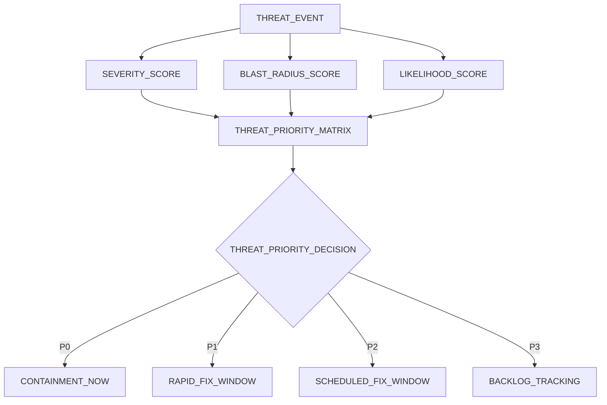
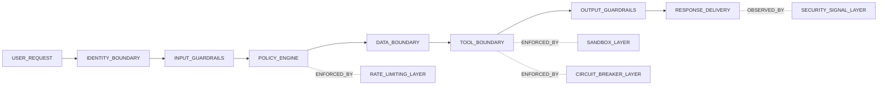
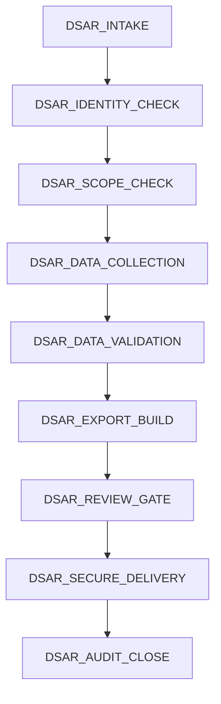
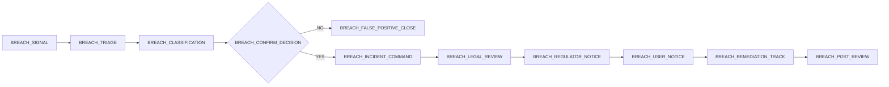
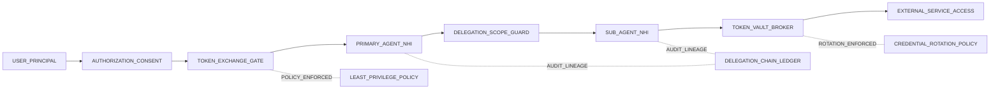

# Unified Security Strategy and Regulatory Compliance

> **Scope**: Governance architecture for security, auditability, and regulatory compliance for `safeagent` at 10M-user scale.
>
> **Tasks**: THREAT_GOVERNANCE (Unified Threat Governance), COMPLIANCE_ENABLEMENT (Regulatory Operations), INCIDENT_COMMAND (Security Incident Operations)

---

## Table of Contents
- [Strategic Context](#strategic-context)
- [Unified Threat Model](#unified-threat-model)
- [Attack Surface Inventory](#attack-surface-inventory)
- [OWASP Top 10 for LLM Applications Mapping](#owasp-top-10-for-llm-applications-mapping)
- [Threat Classification Framework](#threat-classification-framework)
- [Defense-in-Depth Composition](#defense-in-depth-composition)
- [Security Audit and Assessment](#security-audit-and-assessment)
- [Regulatory Compliance](#regulatory-compliance)
- [EU AI Act Mapping](#eu-ai-act-mapping)
- [GDPR Mapping](#gdpr-mapping)
- [Articles 12–22 — Data Subject Rights Governance](#articles-1222--data-subject-rights-governance)
- [Article 15 — Right of Access](#article-15--right-of-access)
- [Article 16 — Right to Rectification](#article-16--right-to-rectification)
- [Article 17 — Right to Erasure](#article-17--right-to-erasure)
- [Article 18 — Right to Restriction of Processing](#article-18--right-to-restriction-of-processing)
- [Article 20 — Right to Data Portability](#article-20--right-to-data-portability)
- [Article 21 — Right to Object](#article-21--right-to-object)
- [Article 22 — Safeguards for Solely Automated Decision-Making](#article-22--safeguards-for-solely-automated-decision-making)
- [Decision Audit Trail and Explainability](#decision-audit-trail-and-explainability)
- [DSAR Workflow](#dsar-workflow)
- [Breach Notification Procedure](#breach-notification-procedure)
- [Consent Management](#consent-management)
- [Data Classification Scheme](#data-classification-scheme)
- [Bias and Fairness Governance](#bias-and-fairness-governance)
- [Incident Response Program](#incident-response-program)
- [Agent Identity and Delegated Authorization](#agent-identity-and-delegated-authorization)
- [Data Residency and Geo-Compliance](#data-residency-and-geo-compliance)
- [Cross-References](#cross-references)
- [Delivery Checklist](#delivery-checklist)

## Strategic Context
- `safeagent` already includes strong technical controls across guardrails, authentication, observability, infrastructure, monitoring, and extension boundaries.
- Enterprise adoption requires one governance layer that maps those controls to measurable risk ownership, audit evidence, and legal duties.
- This plan focuses on the missing governance layer rather than redefining mechanics already documented elsewhere.
- EU AI Act duties apply on a phased enforcement timeline and depend on provider or deployer role plus system-risk category; active GDPR obligations make this governance model mandatory for market access.
- Runtime and dependency governance is Bun-only for `safeagent` as a single npm package.
- Security and compliance are treated as continuous operations, not checklist milestones.

## Unified Threat Model
- The threat model standardizes risk language across engineering, security, legal, and product teams.
- Every threat record includes attack path, impacted asset, likely impact, detection method, owner, and mitigation dependency.
- Threat classification combines severity, blast radius, and likelihood, then drives remediation order.
- Threat model updates are required after major architecture changes, incidents, and high-risk launches.
- Model outputs feed audit scope, penetration testing scope, and incident readiness drills.

## Attack Surface Inventory

### LLM Layer
- Prompt injection can alter instruction hierarchy and force unsafe behavior.
- Jailbreaking can bypass policy constraints under adversarial phrasing.
- Indirect injection can arrive through retrieved context, uploaded content, and external tool outputs.
- Baseline technical controls are defined in the Guardrails & Safety document and monitored in the Monitoring & Alerting document.
- Governance added here: ownership, risk scoring, escalation thresholds, and reporting obligations.

### Data Layer
- Memory poisoning can create durable false context that distorts future agent behavior.
- PII leakage risk spans outputs, telemetry, audit exports, and support workflows.
- Cross-user or cross-tenant leakage is a top-severity event.
- Retention beyond lawful purpose creates legal and trust risk.
- SurrealDB handling remains constrained to surqlize.
- Relational handling remains constrained to PostgreSQL through Drizzle ORM.

### Infrastructure Layer
- Availability attacks can target model routes, queue depth, storage systems, and streaming delivery.
- Credential theft can enable privilege abuse and lateral movement.
- Cost amplification attacks can trigger budget exhaustion and service instability.
- Baseline protective controls are in the Server Implementation and Infrastructure documents.
- Governance added here: resilience evidence requirements and risk acceptance criteria.

### Extension Layer
- Malicious extensions can attempt capability escalation, data exfiltration, or policy bypass.
- Isolation boundary failure can expose internal state across extension boundaries.
- Third-party supply risks can introduce unsafe execution dependencies.
- Baseline extension safeguards are in the Extensibility document.
- Governance added here: review gates, trust approval, quarantine, and post-incident controls.

## OWASP Top 10 for LLM Applications Mapping

| OWASP Category | Risk in safeagent | Existing Control Anchor | Governance Layer Added Here |
|---|---|---|---|
| LLM01 Prompt Injection | Instruction override and unsafe action steering | Guardrails & Safety, Monitoring & Alerting | Threat ownership and campaign-level escalation policy |
| LLM02 Insecure Output Handling | Harmful output consumed by downstream experiences | Guardrails & Safety, Observability | Release risk gate and rollback accountability |
| LLM03 Training Data Poisoning | Corrupted grounding and memory artifacts | Retrieval & Evidence, Observability | Data provenance review cadence and contamination response |
| LLM04 Model Denial of Service | Traffic abuse and resource exhaustion | Infrastructure, Monitoring & Alerting | Saturation classification and resilience evidence requirements |
| LLM05 Supply Chain Vulnerabilities | Dependency or extension compromise | Extensibility, Infrastructure | Supplier risk tiering and remediation SLA governance |
| LLM06 Sensitive Information Disclosure | Personal data exposure in output or logs | Observability, Guardrails & Safety | Breach workflow and regulator reporting controls |
| LLM07 Insecure Plugin Design | Unsafe extension capability boundaries | Extensibility | Mandatory security review and trust-level approvals |
| LLM08 Excessive Agency | Unbounded tool actions | Agents & Orchestration, Durable Execution | Human oversight gate policy and high-impact approvals |
| LLM09 Overreliance | Users misled by uncertain or low-confidence outputs | Observability, Monitoring & Alerting | Transparency and explainability quality obligations |
| LLM10 Model Theft | Unauthorized extraction and abuse | Server Implementation, Infrastructure | Access abuse thresholds and executive legal escalation |

## Threat Classification Framework
- Severity levels use `P0` through `P3` and apply to both vulnerabilities and active incidents.
- Blast radius uses four bands: session, tenant cohort, regional, and global.
- Likelihood is based on exploit complexity, observed attempts, and attack trend velocity.
- Classification drives SLA, escalation speed, and required mitigation depth.
- Scores are recalculated when architecture or threat intelligence changes materially.

### Severity Matrix
| Level | Definition | Typical Blast Radius | Initial Response Target | Governance Escalation |
|---|---|---|---|---|
| P0 | Confirmed compromise or high-sensitivity leakage | Regional or global | Immediate | Executive and legal required |
| P1 | Active high-risk exploit path with abuse evidence | Multi-tenant or major cohort | 30 minutes | Security leadership required |
| P2 | Contained weakness with moderate exploitability | Limited tenant scope | 4 hours | Team leadership required |
| P3 | Low-impact or hard-to-exploit weakness | Localized | Planned cycle | Security backlog governance |

## Defense-in-Depth Composition
- Defensive layers are intentionally redundant so single-control failure does not become systemic failure.
- Guardrails enforce policy at input and output boundaries.
- Identity and access controls protect all retrieval, memory, and tool pathways.
- Rate limiting and budget controls constrain abuse and cost spikes.
- Circuit breakers and sandboxing isolate unstable or compromised dependencies.
- Monitoring joins all layers into one incident timeline for rapid containment.

## Security Audit and Assessment

### Security Audit Schedule
| Cadence | Scope | Responsible Parties | Required Outputs |
|---|---|---|---|
| Monthly | Control health sample, open-risk aging, high-risk change review | Security engineering, platform lead | Risk aging report and closure actions |
| Quarterly | Full threat model refresh and compliance evidence review | Security governance, legal, product security | Updated risk register and evidence pack |
| Semiannual | Adversarial simulation across all attack layers | Internal red team, incident command | Attack-path findings and response gaps |
| Annual | Independent security assessment and enterprise readiness review | External assessors, executive risk committee | Independent assessment and remediation roadmap |

### Penetration Testing Framework
- Frequency is quarterly plus event-triggered for major trust-boundary changes.
- Testing includes authenticated and unauthenticated paths.
- Scenarios include prompt abuse, data exfiltration, privilege escalation, and availability pressure.
- Scope boundaries are explicit to avoid uncontrolled production risk.
- Findings are mapped to severity, compliance relevance, and remediation owner.
- Retests verify closure quality before findings are marked complete.

### Dependency Vulnerability Management
- Vulnerability scanning covers direct and transitive dependencies continuously.
- Prioritization accounts for real exploitability in this architecture, not score alone.
- Ownership assignment is mandatory at finding creation.
- Emergency patch process exists for active exploitation.
- Exceptions require documented risk acceptance and expiry date.
- Closure requires evidence of mitigation effectiveness.

### Vulnerability Remediation SLAs
| Severity | SLA Target | Escalation Trigger | Required Outcome |
|---|---|---|---|
| Critical | 24 hours | Missed target | Emergency mitigation or patch |
| High | 72 hours | Missed target | Priority release with leadership escalation |
| Medium | 14 days | Repeat deferral | Planned remediation with risk tracking |
| Low | 45 days | Aging backlog trend | Scheduled maintenance cycle |

### Security Review and Approval Gates
- Security review is mandatory for new extension classes, auth changes, and new data access patterns.
- Reviews require threat delta, compliance impact, and rollback plan.
- Approval cannot be self-granted by change authors.
- High-risk changes require security and product co-approval.
- Emergency changes receive expedited review plus retrospective audit.
- Post-release verification confirms expected control behavior under live traffic.

## Regulatory Compliance
- Compliance mapping converts legal duties into operational controls and evidence artifacts.
- Ownership is explicit per legal article and enforced through recurring review cadence.
- Evidence is retained in regulator-ready format with tamper-evident provenance.
- Transparency and oversight requirements are treated as core product behavior.
- Compliance status is reviewed alongside security risk and incident metrics.

## EU AI Act Mapping
- Applicability is phased and role-scoped; this library is governed primarily as a provider or enabler, while deployers or integrators hold context-of-use duties.
- Compliance evidence is separated by provider obligations and deployer or integrator obligations to prevent accountability gaps.

### Article 12 — Record-Keeping
- The library MUST provide immutable decision and policy event records with trace continuity from request through action and oversight intervention.
- The library MUST provide authority-request-ready record export capability and integrity attestation evidence.
- Deployers or integrators MUST define retention periods, lawful access controls, and authority engagement procedures for their operating context.

### Article 13 — Transparency
- The library MUST provide transparency artifacts that describe AI-mediated behavior, key limitations, and uncertainty posture.
- The library MUST provide human-readable decision summaries for consequential outcomes and completion evidence for transparency coverage.
- Deployers or integrators MUST deliver user-facing disclosures, jurisdiction-specific notices, and context-appropriate communication controls.

### Article 14 — Human Oversight
- The library MUST define human intervention points for high-impact actions and provide interrupt, halt, and override capabilities.
- The library MUST preserve immutable oversight intervention records, including rationale and timing evidence.
- Deployers or integrators MUST assign oversight operators, escalation authority, and operational readiness drills in production contexts.

### Article 15 — Accuracy and Robustness
- The library MUST define measurable accuracy, robustness, and cybersecurity objectives with recurring validation evidence.
- The library MUST provide safe fallback behavior during degraded confidence states and documented risk acceptance for unresolved gaps.
- Deployers or integrators MUST monitor live-risk conditions, perform context-specific assurance reviews, and maintain cybersecurity incident readiness.

### EU AI Act Evidence Matrix
| Article | Evidence Artifacts | Primary Owner | Audit Cadence |
|---|---|---|---|
| 12 | Decision logs, integrity checks, export attestations | Security governance | Quarterly |
| 13 | Transparency summaries and user communication templates | Product and legal | Quarterly |
| 14 | Oversight logs and intervention drill outcomes | Incident command | Monthly |
| 15 | Robustness tests and remediation closure evidence | Security engineering | Monthly |

## GDPR Mapping

### Article 5 — Principles
- Purpose limitation and minimization are enforced through policy-scoped data handling.
- Integrity and confidentiality are protected by layered controls.
- Accountability is maintained through ownership and auditable workflows.

### Article 6 — Lawfulness
- Processing basis is declared per integration context.
- Basis and purpose mapping is captured as evidence.
- Unsupported basis usage is blocked by governance policy.

### Article 7 — Consent
- Consent capture includes scope, purpose, and timestamp.
- Consent withdrawal is immediate for future processing.
- Consent history remains immutable and exportable.

### Articles 12–22 — Data Subject Rights Governance
- The system SHALL maintain rights-request intake, identity assurance, and timeline governance aligned to statutory deadlines.
- The system SHALL preserve auditable evidence for rights-request decisions, fulfillment status, and lawful exception handling.

### Article 15 — Right of Access
- The system SHALL provide data subjects access to personal data and associated processing context in a concise, intelligible, and commonly usable form.
- The system SHALL provide request-status evidence and fulfillment attestation suitable for supervisory review.

### Article 16 — Right to Rectification
- The system SHALL support correction of inaccurate personal data and completion of incomplete personal data with audit evidence.
- The system SHALL propagate approved rectification outcomes across governed records within defined operational timelines.

### Article 17 — Right to Erasure
- The system SHALL support erasure requests where legal grounds apply and SHALL document lawful exceptions where erasure is denied.
- The system SHALL provide erasure completion evidence and residual-data exception evidence for audit review.

### Article 18 — Right to Restriction of Processing
- The system SHALL support restriction status controls that prevent non-authorized processing while a restriction is active.
- The system SHALL preserve restriction activation, scope, and release evidence with accountable approval records.

### Article 20 — Right to Data Portability
- The system SHALL provide personal data portability in machine-readable and human-readable output formats.
- The system SHALL preserve portability fulfillment evidence, delivery status, and integrity assurance records.

### Article 21 — Right to Object
- The system SHALL support objection handling for processing tied to legitimate-interest or related legal bases.
- The system SHALL enforce objection outcomes for future processing and preserve rationale evidence for accepted or denied objections.

### Article 22 — Safeguards for Solely Automated Decision-Making
- The system SHALL provide safeguards for solely automated decisions, including human intervention pathways and rights to express a viewpoint and contest outcomes.
- The system SHALL preserve evidence that contestation workflows, review decisions, and remediation actions were completed.

### Articles 32–34 — Security and Breach Notification
- Security measures align with layered defense and tested incident operations.
- Breach classification drives regulator and user communication duties.
- 72-hour reporting window governance is mandatory.

### GDPR Capability Matrix
| GDPR Area | Library-Level Enablement | Integrator Responsibility |
|---|---|---|
| Principles and accountability | Decision audit trail requirements, policy enforcement points, retention governance controls | Define business-specific processing purpose |
| Consent lifecycle | Immutable consent records and withdrawal propagation requirements | User-facing consent experience and jurisdiction language |
| Data subject rights | Rights-request governance workflow and portability output requirements | Identity verification and legal exception review |
| Security and breach operations | Detection mechanisms and breach timeline governance requirements | Final regulatory filing and authority engagement |

## Decision Audit Trail and Explainability
- Audit trails include what happened and why a decision path was selected.
- Records link input context, retrieval context, model rationale summary, tool actions, and output.
- Oversight interventions are captured in the same immutable chain.
- Export supports regulator review and enterprise due diligence workflows.
- Integrity checks are run on a recurring schedule and after major incidents.

### Per-Decision Explainability Structure
- Input summary: intent and relevant constraints.
- Retrieval summary: evidence context and selection rationale.
- Reasoning summary: rationale path and uncertainty markers.
- Tool summary: action intent and outcome.
- Output summary: final response justification in plain language.

### Explainability Operating Rules
- Explanations must be clear, concise, and non-deceptive.
- Sensitive implementation details are redacted while preserving accountability.
- Contradictions between decision records and user-visible outcomes trigger review.
- High-impact decisions require richer rationale than routine responses.

## DSAR Workflow
- DSAR intake supports authenticated and scoped rights requests.
- Identity verification is mandatory before data retrieval.
- Data collection includes conversation artifacts, consent history, and audit records.
- Output formats MUST be machine-readable and human-readable.
- Target response timeline is 30 days with escalation for complex cases.
- Fulfillment completion is logged as immutable evidence.

## Breach Notification Procedure
- Breach handling starts with detection, triage, and impact classification.
- Confirmed incidents activate incident command and legal review immediately.
- Regulator notification preparation runs in parallel with containment.
- 72-hour reporting governance is measured from controller awareness of a personal data breach.
- Affected-user communication is risk-based and required where high risk to rights and freedoms is identified.
- Completion requires remediation tracking and post-incident review.

## Consent Management
- Consent records are immutable with scope, purpose, and timestamp.
- Withdrawal events apply immediately to future processing.
- Consent state is queryable for runtime governance checks.
- Consent history is included in DSAR exports.
- Consent governance includes periodic clarity review.

## Data Classification Scheme
| Data Category | Sensitivity | Core Risk | Control Posture |
|---|---|---|---|
| Public metadata | Low | Context misuse | Basic integrity and access controls |
| Telemetry without identifiers | Medium | Re-identification by correlation | Aggregation, minimization, retention bounds |
| Personal profile attributes | High | Privacy harm | Strict access controls and auditing |
| Conversation data with personal context | High | Sensitive exposure | Redaction, policy scope checks, deletion support |
| Special-category personal data | Critical | Severe legal and individual harm | Enhanced restrictions and elevated oversight |
| Security forensic records | High | Tampering risk | Immutability and restricted investigator access |

## Bias and Fairness Governance
- Fairness monitoring evaluates output behavior across demographic cohorts.
- Disparate impact detection combines statistical parity checks and trend analysis.
- Fairness metrics are tracked alongside safety and reliability metrics.
- Bias findings are handled through a defined remediation workflow with ownership.
- Governance emphasizes measurable parity improvements over one-off interventions.

### Output Distribution Monitoring
- Track response quality score distributions by cohort.
- Track refusal rate and policy-block rate differences by cohort.
- Track harmful-output concentration by cohort with high-sensitivity alerting.
- Track explainability completeness parity across cohorts.

### Fairness Metrics and Thresholds
| Metric | Target Band | Alert Trigger | Escalation |
|---|---|---|---|
| Outcome parity ratio | 0.8 to 1.25 | Outside band for two windows | Fairness governance board |
| False refusal disparity | Within 15 percent spread | Exceeds spread threshold | Product and safety leads |
| Harmful output disparity | Near-zero concentration | Any significant concentration | Security incident command |
| Explainability parity | Within 10 percent spread | Persistent cohort gap | Compliance governance |

### Bias Remediation Workflow
- Open fairness incident with affected cohorts and impact summary.
- Perform root-cause analysis across prompt, policy, retrieval, and data factors.
- Define mitigation owner, timeline, and validation method.
- Validate improvements before broad rollout.
- Monitor sustained parity during a stabilization window.

## Incident Response Program

### Security Incident Classification
| Level | Trigger Pattern | Command Structure | Required Communications |
|---|---|---|---|
| P0 | Confirmed major compromise or sensitive data breach | Full incident command with executive lead | Internal immediate, regulator prep, user-impact planning |
| P1 | Active high-risk exploit campaign | Security lead with legal and platform partners | Rapid internal stakeholder alignment |
| P2 | Contained exploit attempt with limited impact | Security operations lead | Team-level notifications |
| P3 | Low-risk anomaly without user harm | Standard triage owner | Logged status updates |

### Playbook: Prompt Injection at Scale
- Detect attack clusters and bypass trends.
- Tighten policy thresholds and isolate affected pathways.
- Validate downstream impact on data and tool actions.
- Communicate status and containment progress on fixed cadence.

### Playbook: Data Breach
- Confirm scope, sensitivity class, and affected cohorts.
- Contain exposure path and preserve forensic evidence.
- Activate 72-hour reporting workflow.
- Deliver user guidance aligned to validated impact.

### Playbook: Extension Compromise
- Quarantine extension identity and revoke elevated capabilities.
- Assess lateral impact across related pathways.
- Restore service through trusted fallback controls.
- Require full security review before any reinstatement.

## Post-Incident Review and Communication

### Post-Incident Review Process
- Run review within five business days for `P0` and `P1` incidents.
- Reconstruct timeline from immutable audit and monitoring records.
- Identify control gaps, process failures, and escalation friction.
- Assign corrective actions with owner and due date.
- Track remediation to verified closure.

### Communication Plan
- Internal updates follow severity-based cadence and ownership.
- Affected-user communications are clear, practical, and legally aligned.
- Regulator communications are factual and timely.
- Enterprise customer communication includes mitigation status and next milestones.

## Agent Identity and Delegated Authorization
- Agent identity is modeled as non-human identity, distinct from end-user identity, so every autonomous action is attributable to a unique operational principal.
- OAuth 2.0 Token Exchange under RFC 8693 governs delegated execution, allowing agents to act on behalf of users with explicit user-scoped permissions and bounded trust context.
- Delegated credentials for external services are stored in a dedicated token vault with strict separation by principal, purpose, and sensitivity class.
- Third-party access for GitHub, Slack, and Salesforce is brokered through vault-managed credentials so direct credential exposure is not permitted in runtime execution.
- Least-privilege enforcement applies per task intent, with permissions reduced to the minimum capability set required for completion and automatically narrowed when risk context changes.
- Delegation scope constraints define what each agent may delegate, which capabilities require elevated approval, and which operations are never delegable.
- Chained delegation is fully auditable, preserving lineage from initiating user through each delegation hop so a transfer from one agent to another remains reconstructable for forensics and regulator review.
- Credential rotation policy is automatic and recurring, with shortened rotation windows for high-sensitivity principals and immediate rotation after compromise indicators.

## Data Residency and Geo-Compliance
- Region-locked storage enforcement requires data tagged with residency obligations to remain in designated jurisdictions, with placement decisions bound to policy and legal classification.
- Residency controls apply consistently across SurrealDB access through surqlize and PostgreSQL access through Drizzle, preventing policy drift between operational data layers.
- GDPR Articles 44-49 mapping is maintained as transfer-governance policy covering adequacy decisions, standard contractual clauses, and binding corporate rules as the lawful basis set for international transfers.
- SCHREMS II implications are addressed through supplemental safeguards, including transfer impact assessment governance, enhanced access controls, and stricter oversight for EU-US transfer pathways.
- Cross-border transfer controls enforce jurisdiction boundaries technically, blocking unauthorized movement, triggering escalation on attempted violations, and requiring accountable override evidence where lawful exceptions apply.
- Data location attestation provides verifiable proof of storage geography through immutable evidence artifacts tied to policy decisions and retained for regulator and enterprise assurance.
- Regional deployment configuration adapts trust boundaries, retention posture, and transfer permissions by jurisdictional profile so each operational region follows its legal and risk baseline.
- Data sovereignty audit trail captures every residency classification, transfer decision, exception rationale, and approval chain to preserve end-to-end accountability.
- Existing infrastructure controls in the Infrastructure document remain the mandatory enforcement anchor for network segmentation, resilience boundaries, and regional isolation posture used by this governance layer.

## Cross-References
| Plan File | Connection |
|---|---|
| [Guardrails & Safety](./guardrails.md) | Prompt injection and policy enforcement controls governed here through risk ownership and compliance mapping. |
| [Server Implementation](./server.md) | Authentication and principal boundaries used as mandatory governance anchors. |
| [Observability](./observability.md) | PII redaction and trace controls extended here into regulator-facing record-keeping and explainability. |
| [Infrastructure](./infrastructure.md) | Rate limiting and resilience controls mapped here to audit and legal accountability. |
| [Monitoring & Alerting](./monitoring.md) | Security signal detection and monitoring alert thresholds. |
| [Monitoring, Alerting, and Incident Response](./monitoring.md) | Breach workflow, escalation governance, and disaster recovery procedures. |
| [Extensibility and Plugin Architecture Plan](./extensibility.md) | Extension control baseline connected here to approval gates and compromise response. |
| [Durable Execution and HITL Oversight](./durable-execution.md) | Human oversight controls linked here to Article 14 obligations and high-impact action governance. |

## Task Specifications

### Task SECURITY_COMPLIANCE: Security and Compliance Operations Baseline

**Task Name**
- SECURITY_COMPLIANCE

**Objective**
- Implement a unified security and compliance operating layer that ties technical controls to auditable governance outcomes.
- Ensure threat, privacy, and regulatory obligations can be continuously enforced and evidenced at scale.

**What To Do**
- Define and operationalize a unified threat model spanning model, data, infrastructure, and extension layers.
- Build governance mappings for OWASP LLM risk categories to prevention, detection, and escalation controls.
- Establish audit-trail requirements for decision lineage, oversight interventions, and policy execution outcomes.
- Formalize GDPR and EU AI Act evidence workflows for transparency, rights handling, and incident reporting readiness.
- Define DSAR operations with intake, identity verification, fulfillment evidence, and deadline governance.
- Define breach response governance with severity classification, command structure, and regulator-ready reporting timelines.
- Establish fairness monitoring governance with cohort-level parity checks, thresholds, and remediation ownership.
- Define security review gates for high-risk changes and a recurring audit cadence with required evidence outputs.
- Integrate compliance checkpoints with incident response, monitoring, and access-control ownership models.

**Depends On**
- MONITORING_INFRA
- JWT_AUTH
- GUARD_PIPELINE

**Batch**
- 10

**Acceptance Criteria**
- Threat governance exists with explicit ownership, severity model, and remediation SLAs.
- OWASP LLM risk mapping is complete and linked to enforceable governance controls.
- Decision and oversight audit trails are immutable, exportable, and regulator-review ready.
- DSAR workflow governance supports rights intake, fulfillment evidence, and timeline tracking.
- Breach governance enforces triage, classification, and 72-hour reporting readiness.
- Compliance mapping for EU AI Act and GDPR duties is explicit, measurable, and reviewable.
- Fairness governance includes monitored metrics, alert thresholds, and assigned remediation owners.
- Security review gates and audit cadence are documented and operationally actionable.

**QA Scenarios**
- Run a simulated high-severity threat review, verify classification, ownership assignment, and escalation path.
- Process a rights-request workflow, verify identity gating, fulfillment evidence, and deadline tracking.
- Trigger a breach tabletop scenario, verify triage timeline and reporting-readiness artifacts.
- Review a fairness alert scenario, verify threshold detection and remediation workflow ownership.
- Audit a high-risk release change, verify mandatory security-review gate completion before approval.

**Implementation Notes**
- Keep governance controls mapped to existing technical enforcement points to avoid duplicate policy surfaces.
- Treat evidence integrity and traceability as first-class acceptance gates for compliance readiness.
- Favor measurable control definitions so recurring audits remain objective and repeatable.

### Task MULTI_TENANT_CONFIG: Multi-Tenant Isolation and Configuration Hierarchy

**Task Name**
- MULTI_TENANT_CONFIG

**Objective**
- Implement tenant-aware configuration resolution that supports controlled overrides without violating isolation boundaries.
- Ensure every request resolves policy and runtime settings deterministically from the correct tenant context.

**What To Do**
- Define a five-level configuration hierarchy from global through request scope.
- Specify deterministic precedence rules and conflict resolution across all hierarchy levels.
- Implement tenant and organization boundary enforcement for configuration reads and merges.
- Bind identity context to configuration resolution so unauthorized cross-tenant access is rejected.
- Define schema-validated configuration contracts for each tier with strict shape guarantees.
- Add secure default fallbacks for missing tenant-specific overrides.
- Define audit requirements for configuration resolution decisions and override provenance.
- Establish isolation test cases for tenant crossover, malformed scope, and stale identity context.

**Depends On**
- CONFIG_DEFAULTS
- ZOD_SCHEMAS
- JWT_AUTH

**Batch**
- 4

**Acceptance Criteria**
- Configuration precedence across all five levels is deterministic and documented.
- Tenant-scoped resolution prevents cross-tenant leakage in all supported access paths.
- Identity-bound context is required for tenant-level and request-level override resolution.
- Schema validation rejects malformed or unsupported configuration structures.
- Missing lower-level config falls back safely to allowed upstream defaults.
- Resolution and override decisions are auditable with actor, scope, and outcome metadata.
- Configuration merges preserve required invariants under concurrent request load.

**QA Scenarios**
- Resolve config for two tenants with overlapping overrides, verify isolated and correct effective outcomes.
- Submit request without valid tenant identity, verify tenant-scoped override access is denied.
- Provide invalid scoped config payload, verify schema validation blocks activation.
- Remove tenant override and re-resolve, verify deterministic fallback to parent scope.
- Replay audited resolution event, verify scope chain and final effective values are reconstructable.

**Implementation Notes**
- Keep merge logic deterministic and side-effect free so behavior remains stable under replay.
- Separate identity verification from merge execution to simplify threat analysis and auditing.
- Align scope vocabulary with execution and server policy docs to avoid cross-module ambiguity.

## Delivery Checklist
- Unified threat model defined across LLM, data, infrastructure, and extension layers.
- OWASP Top 10 for LLM Applications mapped with governance actions.
- Threat classification and response targets documented.
- Defense-in-depth composition documented with layered interaction model.
- Security audit cadence and penetration testing framework established.
- Dependency vulnerability management and remediation SLAs defined.
- Security review gates defined for extension, auth, and data access changes.
- EU AI Act Articles 12, 13, 14, and 15 mapped to evidence artifacts and owners.
- GDPR Articles 5, 6, 7, 12-22, and 32-34 mapped to operational workflows.
- Decision audit trail includes rationale chain and regulator export posture.
- Per-decision explainability includes input, retrieval context, reasoning, tools, and output.
- DSAR workflow includes programmatic export capability and 30-day response target.
- Breach workflow includes detection, classification, and 72-hour reporting governance.
- Consent lifecycle includes record, withdrawal, and immutable audit trail.
- Data classification scheme defines sensitivity levels and control posture.
- Bias and fairness governance includes monitoring, thresholds, and remediation flow.
- Incident response includes `P0` to `P3` classification and required scenario playbooks.
- Cross-reference mapping includes Guardrails & Safety, Server Implementation, Observability, Infrastructure, Monitoring & Alerting, Extensibility, and Durable Execution.

## Test Specifications

**Threat governance and OWASP coverage behavior**:

- Threat model governance covers LLM, data, infrastructure, and extension attack surfaces with explicit ownership and update cadence.
- Threat classification combines severity, blast radius, and likelihood to drive response priority and mitigation depth.
- Defense-in-depth composition remains resilient when a single layer fails and preserves containment through layered controls.
- OWASP LLM Top 10 mapping remains complete with governance actions tied to each category.

**Decision traceability and explainability behavior**:

- Decision audit trails are immutable, tamper-evident, and exportable for regulator and enterprise due-diligence workflows.
- Audit chain continuity links input context, retrieval context, reasoning summary, tool actions, oversight events, and final output.
- Per-decision explainability provides clear trace narratives from request intent through outcome justification.
- Explainability quality checks detect contradictions between recorded decisions and user-visible outcomes.

**Regulatory workflow behavior**:

- DSAR workflow enforces identity verification, scoped data collection, structured export, and completion evidence logging.
- DSAR timeline governance enforces response deadlines and escalates delay risk before breach of obligations.
- Breach workflow performs detection, triage, and classification, then enforces 72-hour regulator-notification governance from confirmation.
- Breach response communications and remediation tracking remain synchronized with incident command records.

**Consent and fairness governance behavior**:

- Consent records capture scope, purpose, and timestamp with immutable history and immediate withdrawal propagation.
- Consent history is queryable for runtime governance and included in subject-access exports.
- Bias monitoring tracks output distribution and harmful-disparity signals across cohorts over time.
- Disparate-impact detection routes threshold breaches into owned remediation workflows with sustained parity verification.

**Security operations behavior**:

- Security incident response enforces P0 through P3 classification with severity-aligned command structures and communication duties.
- Incident playbooks execute predictable containment, investigation, and recovery sequences for major attack classes.
- Security audit compliance enforces required cadence, scope, and evidence output across monthly to annual reviews.
- Dependency scanning and vulnerability remediation governance maintain ownership, SLA tracking, and closure evidence.

### Extension: Agent Identity and Data Residency

- Agent NHI credentials are distinct from user credentials.
- OAuth token exchange produces correctly scoped delegated tokens.
- Token vault encrypts credentials at rest and rotates them on schedule.
- Chained delegation audit trail captures the complete delegation chain.
- Least-privilege enforcement denies over-scoped agent requests.
- Region-locked storage rejects writes to non-designated regions.
- GDPR transfer-basis validation blocks transfers without legal basis.
- Data location attestation produces verifiable proof of storage location.
- Cross-border transfer controls enforce configured policies.
