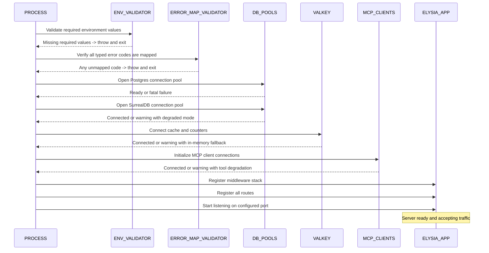
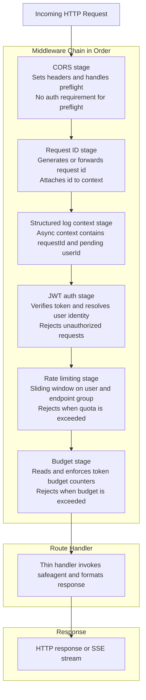
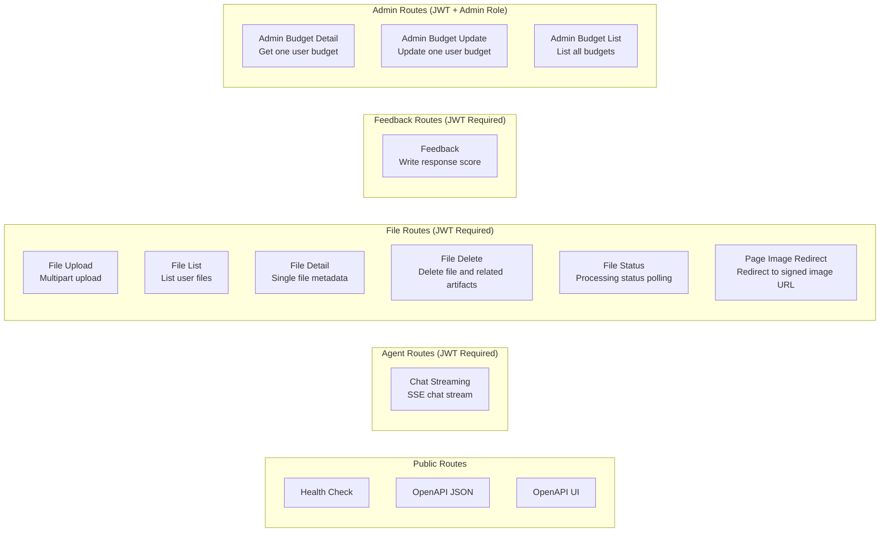
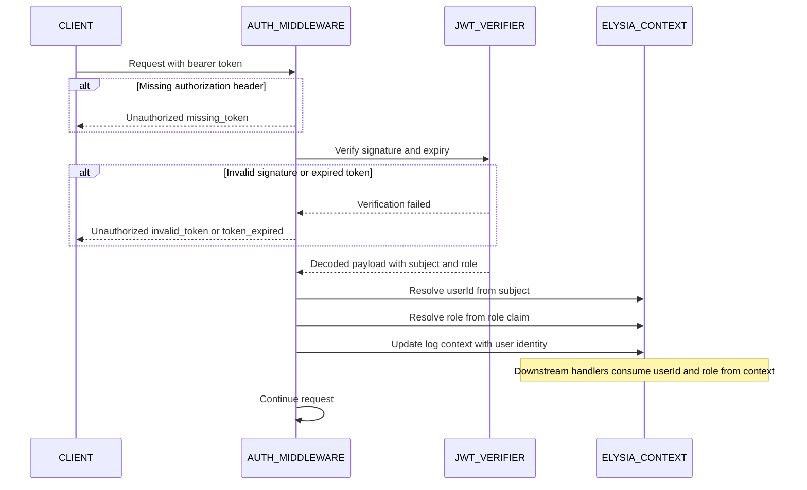
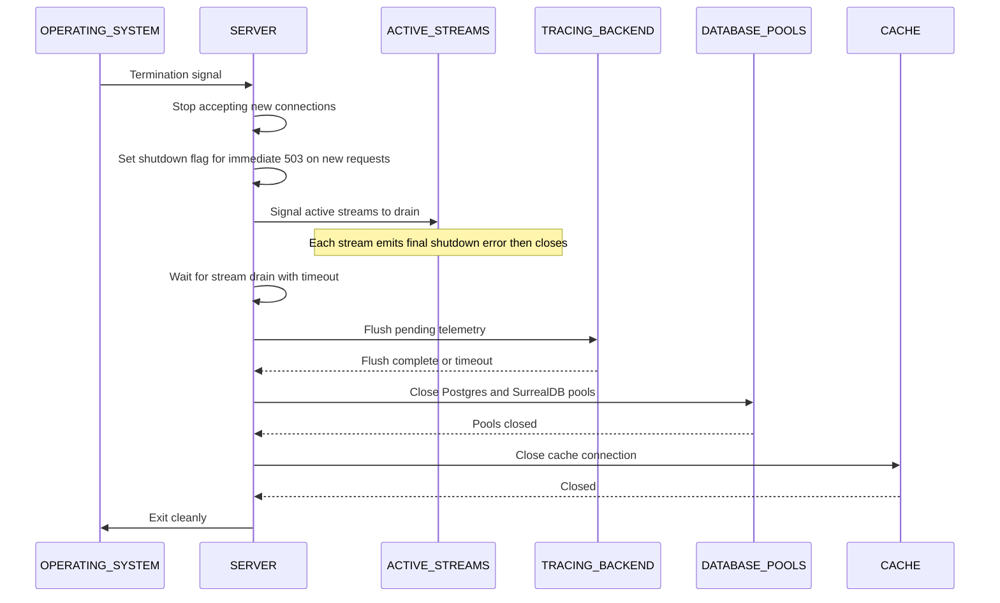

# Server Implementation
> **Scope**: The server is intentionally thin. It is mostly configuration: prompts, intent definitions, guardrail rules, and MCP server configuration. Core execution logic lives in the safeagent library. The server wires those pieces together and exposes them over HTTP with Elysia.
>
> **Tasks**: SCAFFOLD_SERVER (Scaffolding), SERVER_AGENT_CFG (Agent Config), SERVER_ROUTES (Routes), SERVER_MCP (MCP Definitions), SERVER_GUARDRAILS (Guardrail Rules), UPLOAD_ENDPOINT (Upload Endpoint), FEEDBACK_ENDPOINT (Feedback Endpoint), FILE_CRUD (File CRUD), JWT_AUTH (JWT Auth), ADMIN_API (Admin API)
---
## Table of Contents
- [Thin Server Philosophy](#thin-server-philosophy)
- [Server Startup Sequence](#server-startup-sequence)
- [Request Lifecycle](#request-lifecycle)
- [Route Map](#route-map)
- [JWT Auth](#jwt-auth)
- [Middleware Stack](#middleware-stack)
- [Agent Configuration](#agent-configuration)
- [Location Tool Configuration](#location-tool-configuration)
- [Guardrail Rules](#guardrail-rules)
- [MCP Definitions](#mcp-definitions)
- [Endpoints](#endpoints)
- [Input Validation](#input-validation)
- [Error Message Mapping](#error-message-mapping)
- [Graceful Shutdown](#graceful-shutdown)
- [Health Endpoint](#health-endpoint)
- [Cross-References](#cross-references)
- [Task Specifications](#task-specifications)
- [OpenAPI Documentation](#openapi-documentation)
---
## Thin Server Philosophy
The server has one job: accept HTTP requests, authenticate them, and hand off to safeagent with the correct configuration. It does not implement agent reasoning, guardrail execution internals, streaming internals, memory internals, or RAG internals. Those concerns remain in the library. This keeps the server stateless and horizontally scalable behind load balancers.
What the server owns:
- Prompts: full system prompt text per agent
- Intent definitions: available intents, sample utterances, and source priority
- Guardrail rules: GuardrailFn arrays and their detection composition
- Language guard configuration: supported output languages and fallback policy for LANG_GUARD
- Hate speech guard configuration: hybrid matcher toggles and vocabulary overrides for HATE_SPEECH_GUARD
- MCP server configuration: which MCP servers to connect to and transport details
- Error message mapping: user-facing strings for every typed error code emitted by the library
- CTA catalog: typed call-to-action definitions the agent can emit
- Location tool provider configuration: provider wiring and image limits for enrichment
- Route handlers: thin HTTP-to-library adapters
The server depends on stable safeagent public API surfaces for agent factory wiring, guardrails, MCP integration, streaming handlers, upload handling, file registry operations, memory adapters, budget operations, feedback submission, typed errors, and health checks.
Module ownership alignment:
- errors is produced by CORE_TYPES
- feedback submission is produced by LANGFUSE_MODULE
- health checking is produced by MCP_HEALTH
- budget APIs are produced by COST_TRACKING
- all are re-exported via BARREL_EXPORTS
---
## Server Startup Sequence
Before accepting traffic, the server runs validation and dependency initialization. Startup fails fast when critical conditions are missing, rather than serving partial unsafe behavior. Connection pools are initialized with explicit limits so scale-out replicas can share database capacity predictably.

Key rules:
- Postgres connectivity is startup-fatal.
- JWT_SECRET is startup-fatal when environment is production.
- Authentication is a hard security boundary and must fail closed in production.
- Missing JWT_SECRET in non-production enables explicit dev-bypass mode with startup warning and default development user context.
- Missing LLM provider credentials degrades LLM-dependent endpoints to unavailable behavior.
- SurrealDB, object storage, cache, background jobs, and tracing dependencies degrade gracefully.
- Error map completeness is startup-fatal and validated against all typed error codes.
- MCP startup connection failures are non-fatal; tools become unavailable and health reflects status.
- Valkey failures are non-fatal; cache becomes in-memory fallback, rate limiting may degrade, and budget enforcement fails open.
---
## Request Lifecycle
All requests move through an ordered middleware chain before route handling. Ordering matters; CORS must run first so browser preflight does not require JWT authentication.

Ordering rationale:
- CORS first for preflight success.
- Request ID before logs so all logs are traceable.
- Auth before rate limit so limits are user-scoped.
- Rate limit before budget so budget checks are not spent on already-rejected traffic.
- Budget check late because it is the most expensive middleware check.
- Middleware remains stateless per request so any healthy instance can serve any request without sticky sessions.
---
## Route Map

Route policy:
- Public routes are limited to health and OpenAPI endpoints.
- All other routes require JWT when JWT secret configuration exists.
- Admin routes require JWT plus admin role claim.
- When JWT secret is absent in non-production, dev-bypass mode assigns default development user identity and skips token verification.
- Dev-bypass mode is for local development only.
Production enforcement:
- If production mode is enabled and JWT secret is missing, startup hard-fails.
- This differs from graceful degradation rules used for non-security dependencies.
- Authentication never fails open in production.
---
## JWT Auth
Authentication middleware is created through auth middleware factory in the server auth module. It composes Elysia lifecycle hooks and can be registered app-wide or per route group.
Token verification uses symmetric signing with HS256 and shared secret configuration. Verification includes signature and expiry, with optional issuer and audience constraints when configured.

Role gating helper:
- role authorization guard runs after authentication middleware on admin endpoints.
- It reads resolved role from context and returns forbidden response when role mismatches.
- Separation keeps auth failure and role failure as distinct error categories.
Auth outcome table:
| Scenario | Status | Error code |
|---|---|---|
| Missing authorization | 401 | missing_token |
| Malformed bearer format | 401 | invalid_token |
| Invalid signature | 401 | invalid_token |
| Expired token | 401 | token_expired |
| Valid token with wrong role | 403 | insufficient_role |
| Valid token with correct role | pass | none |
---
## Middleware Stack
### CORS
CORS uses explicit allowed origin, method, and header controls. Origins are environment-driven from comma-separated configuration. Development may allow wildcard behavior; production should allow only known client origins.
Policy shape:
- Methods: GET, POST, PUT, DELETE, OPTIONS
- Allowed headers: Content-Type, Authorization, request id header
- Exposed headers: request id header
- Credentials: true for cookie-compatible fallback scenarios
### Request ID
Each request receives a unique request ID. If a client sends a request ID, it is forwarded. Otherwise the server generates one. The value is stored in context and echoed in response headers. All logs generated during the request include this identifier.
### Structured Logging Context
Async context carries a structured logging envelope through the full asynchronous call chain. Context includes requestId, userId after auth, agentId for agent routes, and traceId generated before an agent run. The same traceId is used for observability and feedback correlation.
### Rate Limiting
Rate limiting uses sliding windows backed by Valkey sorted sets. Keys are user-scoped and endpoint-group scoped. Endpoint groups are coarse buckets so related endpoints share limits.
On exceed:
- Return a rate-limit response
- Include retry-after header for seconds until reset
### Budget Check
Budget enforcement reads daily and monthly token spend from atomic counters. Counters are user-scoped and period-scoped. Limits are loaded from persistent storage and cached briefly in Valkey.
Budget enforcement model:
- Before model execution, reserve estimated token usage using INCRBY.
- Compare new total against configured limit.
- If over limit, immediately reverse reservation with DECRBY and reject request.
- After completion, reconcile estimate with actual usage by adjusting the same counters.
- Daily counters expire at UTC day boundary.
- Monthly counters expire at month boundary.
---
## Agent Configuration
The server defines all agent configuration content, while safeagent supplies factories and runtime behavior.
### Agent Definitions
Server builds agents using agent factory and orchestrator agent factory. Each definition includes:
- Stable id used by route parameters
- Full system instructions text
- Model selection from shared configuration constants
- Tool registry wiring
- Guardrail array wiring from server guardrail module
- Memory configuration wiring
- Thinking level configuration
- Grounding mode configuration
- Guard mode configuration for development or production behavior
### CTA Catalog
The server defines the CTA catalog that agents can surface as typed stream events. Each CTA includes identity, display label, action type, and any action parameters.
### Location Tool Configuration
Server configures location enrichment through LocationToolConfig:
- Optional geocoding provider
- Optional image search provider
- Max images limit with default of five
Default geocoding can run without external API keys by using Nominatim plus Valkey-backed caching.
Image search provider is server-supplied and can use ecosystem providers. Adapter helpers are available to simplify provider integration.
Location tooling is opt-in and only active when location tool factory is included in agent tool wiring.
If image search provider is omitted, location events still include coordinates and metadata with empty image arrays.
### Model Configuration
Model constants are loaded from shared configuration surfaces, not hardcoded in server definitions.
### Processor Wiring
Guardrail arrays are passed into agent factories and library internals wire pre and post processing pipelines. Server code does not manipulate processor internals directly.
---
## Guardrail Rules
The server defines detection logic; the library provides interfaces and helper factories.
### Structure
Two exported arrays:
- inputGuardrails as GuardrailFn array run before model input
- outputGuardrails as GuardrailFn array run on emitted output chunks
Each GuardrailFn evaluates text and returns a GuardrailVerdict with severity and concept identifier. Aggregation is worst-wins.
### Concept Registry
Server owns a ConceptRegistry mapping concept identifiers to ConceptConfig metadata and fallback content. This gives server-controlled policy language without library modification.
Required concept identifiers include:
- unsupported_language for LANG_GUARD fallback behavior
- hate_speech_detected for HATE_SPEECH_GUARD fallback behavior
### Factory Helpers
Common helper factories:
- keyword guardrail factory
- regex guardrail factory
- LLM guardrail factory
Topic boundary behavior is server composition, commonly via composite wiring of keyword, regex, and classifier guardrails.
### Language Guard Configuration
LanguageGuardConfig defines supported output languages, fallback behavior, minimum text length, confidence threshold, and optional translation keyword overrides. The created language guard can enforce at both input and output stages.
### Hate Speech Guard Configuration
HateSpeechGuardConfig enables or disables the guard and optionally defines excluded vocabulary, additional vocabulary, and language constraints. Produced guardrails can enforce at both input and output stages.
Both language and hate-speech guardrails are opt-in and are only attached when configured and enabled.
### Severity Levels
| Level | Input behavior | Output behavior |
|---|---|---|
| p2 | pass through | pass through |
| p1 | log and flag, pass through | log and flag, pass through |
| p0 | emit tripwire and block | suppress chunk and inject fallback |
---
## MCP Definitions
The server defines which MCP servers are available. The library manages connection lifecycle and tool registration.
Each MCP configuration includes:
- Stable id
- Transport discriminator: stdio, sse, or streamable-http
- Connection details using command or URL
- Optional transport environment values for stdio
- Optional tool allowlist to expose subset of tools
The server passes MCPServerConfig array into agent factory wiring.
Runtime behavior:
- MCP failures during calls are non-fatal to server process.
- Tool errors are surfaced to agent runtime.
- Retry behavior is owned by MCP server side, not by this server layer.
---
## Endpoints
### Memory Control Endpoints
The server exposes two JWT-protected memory control endpoints as thin wrappers:
- Memory inspect endpoint calls memoryInspect for authenticated user and returns structured memory views.
- Memory delete endpoint calls memoryDelete with user-scoped query and returns candidate matches for confirmation before deletion execution.
User identity is always derived from token context; clients cannot target other users.
---
### Chat Streaming Endpoint
SSE endpoint accepts chat input and streams typed events.
Request body fields:
- message text
- optional thread identifier
- optional list of file identifiers for contextual grounding
Query parameters:
- optional verbosity level (`standard` or `full`, default `standard`). When `full`, trace-step events are emitted alongside user-facing events for real-time pipeline visibility. The server should enforce that `full` verbosity requires developer-level permissions (see [Streaming & Transport](./transport.md) for verbosity security considerations)
Flow:
1. Middleware chain executes in standard order.
2. Handler resolves target agent from registry by requested agent id.
3. Handler reads verbosity from query parameters (default `standard`).
4. Handler delegates stream orchestration to stream handler factory configured with server error map and verbosity level.
5. Handler sets SSE response headers and starts stream piping.
6. Stream emits typed events until completion or error. When verbosity is `full`, `trace-step` events are interleaved with user-facing events at their natural pipeline positions.
7. Final usage accounting updates budget counters.
SSE event families:
- session-meta carrying trace and thread metadata
- text-delta for incremental text
- trace-step for pipeline visibility (only when verbosity is `full`) — see [Streaming & Transport](./transport.md)
- cta for call-to-action events
- citation for source references
- location for location enrichment data and optional images
- tripwire for guardrail block signaling
- done for stream completion
- error for typed failures
Primary failure mapping:
- Unknown agent id maps to not found.
- Rate limit and budget rejections map to too many requests.
- Mid-stream failure emits typed error event and closes stream.
---
### File Upload Endpoint
Multipart upload endpoint enforces upload constraints and delegates processing.
Request shape:
- multipart with file payload
- optional metadata payload
- optional scope value with thread default and global alternative
Flow:
1. Middleware executes.
2. Handler delegates to handleUpload with stream, user identity, and configuration.
3. Library validates type, size, and quota.
4. Library stores raw object and creates metadata record.
5. Response returns created file in uploading state.
6. Blocking document preparation stage runs in-process.
7. Background enrichment stage is enqueued after blocking stage.
Validation failures map to typed errors for unsupported type, oversize payload, quota exceeded, and malformed multipart body.
Success response is created status with file record payload.
---
### File List Endpoint
Returns authenticated user files with pagination and optional status filter.
Query fields:
- optional status filter: uploading, summarizing, ready, enriching, enriched, failed
- cursor for pagination
- limit with bounded maximum
Delegates to listFiles and returns files plus next cursor.
---
### File Detail Endpoint
Returns full metadata for one user-scoped file.
Delegates to getFile with file id and authenticated user identity.
Returns success for owned records and not found for missing or non-owned records.
---
### File Delete Endpoint
Deletes file and associated derived artifacts through user-scoped delete operation.
Delegates to deleteFile.
Deletion semantics include object removal, soft delete marker on file record, index removal, and embedding cleanup.
Returns no-content on success and not found for missing or non-owned records.
---
### File Status Endpoint
Lightweight polling endpoint for processing progression.
Delegates to getFileStatus.
Response includes file id, status, optional progress fields while active, and optional error details when failed.
---
### Page Image Redirect Endpoint
Returns redirect to signed object URL for extracted page images.
Path fields include file id, page number using one-based indexing, and image index using zero-based indexing.
Delegates to getPageImageUrl and responds with redirect.
Signed URL time-to-live is seven days.
Returns not found when target image does not exist.
---
### Feedback Endpoint
Accepts user feedback score associated with a trace.
Request fields:
- trace identifier from stream session metadata event
- binary score value
- optional comment
Before submission, ownership is validated in persistent trace ownership mapping to ensure trace belongs to authenticated user.
Then submitFeedback is called and tracing score is recorded when tracing integration is configured.
Success response returns ok true, with traced false when tracing backend is not configured.
Returns not found when trace does not exist or is not owned by requesting user.
---
### Admin Budget Detail Endpoint
Admin-only endpoint returning one user budget configuration and current spend.
Delegates to getUserBudget.
Returns not found when user does not exist.
---
### Admin Budget Update Endpoint
Admin-only endpoint setting or updating user token limits.
Request fields:
- daily token limit
- monthly token limit
- optional immediate reset flag for current counters
Delegates to setUserBudget, updates persisted budget, and invalidates cached budget entry.
Returns updated budget record.
---
### Admin Budget List Endpoint
Admin-only endpoint listing budget records with pagination and optional over-budget filter.
Query fields:
- cursor
- limit with bounded maximum
- optional overBudget filter
Delegates to listUserBudgets and returns records plus next cursor.
---
## Input Validation
Validation is enforced at server boundaries so route handlers stay thin and downstream runtime remains protected.
Chat validation:
- Input message length is capped by MAX_INPUT_MESSAGE_LENGTH, default thirty-two thousand characters.
- Exceeding the cap returns bad-request with mapped explanation.
- This prevents context domination and protects token budget behavior.
- Message and metadata payloads are schema-sanitized at boundary parsing time to prevent unsafe field shapes and malformed nested content from reaching orchestration logic.
Upload validation:
- Multipart structure must be valid.
- Type allowlist is enforced.
- Size constraints are enforced.
- Storage quota constraints are enforced.
Feedback validation:
- score must be binary.
- trace ownership must be validated against authenticated user.
Admin validation:
- admin role is required.
- request body and query schemas enforce allowed ranges and shape.
OpenAPI and runtime validation use the same Zod v4 schemas so validation and documentation remain aligned.
---
## Error Message Mapping
The library emits typed error codes only. The server maps those codes to user-facing messages.
Startup validation imports all typed codes and verifies complete map coverage. Any missing mapping causes startup failure.
Map structure allows static string values and dynamic message functions that incorporate error metadata.
Representative coverage includes:
| Code | Example message |
|---|---|
| missing_token | Authentication required. |
| invalid_token | Session invalid. Sign in again. |
| token_expired | Session expired. Sign in again. |
| insufficient_role | Permission denied. |
| rate_limited | Too many requests. Try again shortly. |
| budget_exceeded | Usage limit reached. |
| file_type_not_allowed | File type not supported. |
| file_too_large | File too large for configured maximum. |
| storage_quota_exceeded | Storage quota reached. |
| file_not_found | File not found. |
| agent_not_found | Agent not found. |
| guardrail_block | Request blocked by policy. |
| guardrail_critical | Conversation cannot continue safely. |
| upload_malformed | Upload payload malformed. |
| trace_not_found | Feedback trace not found. |
---
## Graceful Shutdown
On termination signals, the server drains in-flight work and releases dependencies in controlled order.

Timeout policy:
- Active streams have thirty seconds to drain; then force-close.
- Tracing flush has ten-second timeout.
- Database pool close is expected fast and synchronous.
After shutdown flag is set:
- New requests receive service unavailable.
- Retry-after header indicates drain window.
- Load balancers should stop routing new traffic to instance.
---
## Health Endpoint
Health, OpenAPI JSON, and OpenAPI UI endpoints are unauthenticated.
Health response includes:
- overall status: ok, degraded, or down
- uptime in seconds
- build metadata
- per-service checks for core dependencies
- per-MCP-server health map
Core checks include Postgres, SurrealDB, object storage, Valkey, background execution service, and tracing integration.
Status rules:
- ok when Postgres is reachable and all checks pass
- degraded when Postgres is reachable but at least one non-critical dependency fails
- down when Postgres is unreachable
Probe behavior:
- all probes run in parallel
- each probe has five-second timeout
- total endpoint latency is bounded by five seconds
HTTP status behavior:
- 200 for ok and degraded
- 503 for down
---
## Cross-References
| Document | Relationship |
|----------|-------------|
| **Requirements** ([Requirements & Constraints](./requirements.md)) | Defines user and operational constraints this server enforces through route security, runtime behavior, and failure semantics. |
| **Foundation** ([Foundation](./foundation.md)) | Supplies shared runtime contracts, environment assumptions, and configuration baselines consumed by startup and middleware. |
| **Agents** ([Agents & Orchestration](./agents.md)) | Defines agent factories and orchestration capabilities that the server configures and exposes through HTTP and SSE routes. |
| **Guardrails** ([Guardrails & Safety](./guardrails.md)) | Defines guardrail semantics and safety modes that server-owned guardrail arrays plug into. |
| **Streaming & Transport** ([Streaming & Transport](./transport.md)) | Defines stream transport event contracts and protocol behavior implemented by server streaming endpoints. |
| **Infrastructure** ([Infrastructure](./infrastructure.md)) | Defines dependency services and degradation model used by startup validation, health reporting, budget enforcement, and shutdown behavior. |
| **Frontend SDK** ([Frontend SDK](./frontend-sdk.md)) | Consumes server SSE endpoints through the React hooks module; verbosity parameter drives frontend trace visualization. |
| **Demos** ([Demos](./demos.md)) | Demo applications that consume this server's chat streaming and file upload endpoints. |
---
## Task Specifications
---
### Task SCAFFOLD_SERVER: Server Scaffolding
What to do:
Set up the HTTP server project, wire safeagent dependency integration for development and CI modes, implement server entrypoint with lifecycle stack registration, start listening on default port behavior, expose basic liveness health endpoint, and include container build support.
Depends on: SPIKE_CORE_STACK
Acceptance criteria:
- Server starts and listens on configured port with default behavior.
- Health endpoint returns ok without authentication.
- Chat streaming endpoint returns unauthorized without JWT.
- Unimplemented routes return not found.
- Server consumes safeagent through expected dependency mode in development and CI.
- Container image builds and starts successfully.
QA scenarios:
- Start server and verify health response.
- Call protected route without auth and verify unauthorized.
- Call unknown route and verify not found.
- Build and run container and verify health externally.
- Terminate process and verify clean non-hanging shutdown.
---
### Task SERVER_AGENT_CFG: Agent Configuration
What to do:
Define all server-exposed agents with prompts, model constants, guardrail arrays, MCP configuration, CTA catalog wiring, and optional location tool providers. Export registry for route resolution by agent id.
Depends on: SCAFFOLD_SERVER, CTA_STREAMING, LOCATION_TOOL
Acceptance criteria:
- Every agent has unique stable id.
- System prompts are non-empty and purpose-aligned.
- Model values come from shared constants.
- Guardrails are wired from server guardrail module.
- MCP configs are wired from server MCP module.
- CTA catalog is defined and attached where used.
- Location tool supports custom provider configuration.
- Registry lookup returns correct agent or undefined for unknown id.
QA scenarios:
- Resolve each registered agent by id.
- Resolve unknown id and verify undefined.
- Verify guardrail arrays are populated.
- Verify model config aligns with shared config definitions.
- Verify CTA entries include required fields.
---
### Task SERVER_ROUTES: Routes
What to do:
Build all route handlers described in this document with thin handler design: validate request, delegate to library function, map response. Organize route groups with appropriate middleware and apply role authorization guard to admin routes.
Define all routes with API documentation integration using Zod v4 request and response schemas and aligned schema mapping configuration. Serve OpenAPI JSON and Scalar UI from public endpoints.
The chat streaming endpoint must accept an optional verbosity control parameter (`standard` or `full`, default `standard`) validated by the verbosity-level schema. The handler passes the verbosity value to the stream handler factory. When `full`, the server should verify the requesting user has developer-level permissions before allowing trace-step event emission.
Depends on: SCAFFOLD_SERVER, SERVER_AGENT_CFG, SSE_STREAMING
Acceptance criteria:
- All mapped routes are registered on correct HTTP methods.
- Protected routes enforce unauthorized behavior without valid JWT.
- Admin routes enforce forbidden behavior for non-admin role.
- Each route delegates to correct library function.
- Handlers remain thin and avoid business logic.
- OpenAPI JSON includes all routes and valid schema definitions.
- Every route documents request and response schemas.
- Security requirements are documented per route.
- SSE endpoint documents stream response behavior.
- SSE endpoint accepts optional verbosity control parameter and passes it to stream handler factory.
- Error responses use server error message map.
QA scenarios:
- Validate unauthorized behavior across protected routes.
- Validate forbidden behavior for admin routes with non-admin token.
- Validate admin token reaches admin handlers.
- Validate known agent stream endpoint behavior and headers.
- Validate unknown agent stream behavior as not found.
- Validate upload success and malformed upload error mapping.
- Validate verbosity `standard` produces no `trace-step` events.
- Validate verbosity `full` includes `trace-step` events interleaved with user-facing events.
- Validate invalid verbosity value returns bad request.
---
### Task SERVER_MCP: MCP Definitions
What to do:
Define MCPServerConfig array for required MCP servers, including transport, connection details, and optional tool allowlists. Export array for agent configuration wiring.
Depends on: SCAFFOLD_SERVER, MCP_CLIENT
Acceptance criteria:
- At least one MCP config exists.
- Each config uses unique stable id.
- Stdio transport entries include command and needed environment values.
- SSE transport entries include URL.
- Tool allowlists include only valid tool names.
- Array type checks against MCPServerConfig.
QA scenarios:
- Verify non-empty MCP config export.
- Verify required fields per entry.
- Start with MCP unavailable and confirm warning plus continued startup.
- Verify health endpoint reports per-server MCP status.
---
### Task SERVER_GUARDRAILS: Guardrail Rules
What to do:
Define inputGuardrails and outputGuardrails arrays using guardrail factories and define ConceptRegistry vocabulary. Export all for agent configuration wiring.
Depends on: SCAFFOLD_SERVER, INPUT_GUARD, OUTPUT_GUARD, GUARD_FACTORY, LANG_GUARD, HATE_SPEECH_GUARD
Acceptance criteria:
- inputGuardrails is non-empty GuardrailFn array.
- outputGuardrails is non-empty GuardrailFn array.
- ConceptRegistry is defined and referenced by guardrail logic.
- LANG_GUARD and HATE_SPEECH_GUARD are opt-in and include unsupported_language and hate_speech_detected concepts.
- Guardrails return valid GuardrailVerdict shapes.
- At least one guardrail enforces topic boundaries.
- At least one guardrail detects harmful content.
- Arrays pass type checks.
QA scenarios:
- Benign input yields pass behavior.
- Blocked input yields p0 behavior.
- Benign output chunk yields pass behavior.
- Blocked output chunk yields p0 behavior.
- Concept registry covers all referenced concept identifiers.
---
### Task UPLOAD_ENDPOINT: Upload Endpoint
What to do:
Implement upload route handler that parses multipart payload, extracts file and metadata, delegates to handleUpload, and maps validation errors through error message map.
Depends on: SERVER_ROUTES, UPLOAD_PIPELINE
Acceptance criteria:
- Accept multipart payload with file.
- Accept optional metadata.
- Accept optional scope with thread default and global option.
- Delegate correctly to handleUpload.
- Return created response on success.
- Return mapped validation errors for invalid payloads.
- Return payload-too-large on oversize.
- Return quota-exceeded on storage limit violation.
- Stream through library without whole-file in-memory buffering.
QA scenarios:
- Upload valid document and verify created uploading record.
- Upload unsupported type and verify mapped error.
- Upload oversize file and verify rejection.
- Upload missing file field and verify validation error.
- Upload malformed multipart and verify validation error.
- Simulate quota exceed and verify quota response.
---
### Task FEEDBACK_ENDPOINT: Feedback Endpoint
What to do:
Implement feedback route handler with request validation, trace ownership verification, feedback submission delegation, and response mapping.
Depends on: SERVER_ROUTES, LANGFUSE_MODULE
Acceptance criteria:
- Accept trace identifier, binary score, optional comment.
- Enforce binary score values only.
- Delegate submission with authenticated user identity.
- Return ok on success with traced false variant when tracing backend absent.
- Return not found when trace is missing or not owned by user.
- Return bad request on invalid score.
QA scenarios:
- Submit valid positive score and verify success.
- Submit valid negative score and verify success.
- Submit invalid score and verify validation failure.
- Submit unknown trace and verify not found.
- Submit foreign-user trace and verify not found.
---
### Task FILE_CRUD: File CRUD
What to do:
Implement file list, detail, delete, status, and page image redirect handlers using library file APIs with strict user scoping.
Depends on: SERVER_ROUTES, FILE_REGISTRY
Acceptance criteria:
- List endpoint returns paginated user-scoped results.
- Detail endpoint returns not found for non-owned records.
- Delete endpoint returns no-content on success and not found otherwise.
- Status endpoint returns current state and progress.
- Image endpoint returns redirect for existing image and not found for missing image.
- All endpoints enforce user scoping without cross-user access.
QA scenarios:
- List with no files returns empty set.
- List with files returns expected records.
- Fetch owned file returns success.
- Fetch non-owned file returns not found.
- Delete owned file returns no-content.
- Delete non-owned file returns not found.
- Poll uploading file returns uploading status.
- Request valid page image returns redirect.
- Request non-existent page image returns not found.
---
### Task JWT_AUTH: JWT Auth
What to do:
Implement auth middleware factory and role authorization guard with JWT verification, user and role context resolution, and route group registration on protected routes.
Depends on: SCAFFOLD_SERVER
Acceptance criteria:
- auth middleware factory returns valid Elysia lifecycle wiring.
- Middleware resolves userId and role on success.
- Missing authorization maps to missing_token.
- Malformed bearer and invalid signature map to invalid_token.
- Expired token maps to token_expired.
- role authorization guard rejects non-admin role with insufficient_role.
- role authorization guard passes admin role.
- Log context is updated with user identity post-auth.
QA scenarios:
- Missing authorization returns missing_token.
- Invalid bearer token returns invalid_token.
- Wrong-secret token returns invalid_token.
- Expired token returns token_expired.
- Non-admin token on admin route returns insufficient_role.
- Admin token reaches admin handler.
- Downstream handler observes resolved userId and role.
---
### Task ADMIN_API: Admin API
What to do:
Implement admin budget detail, update, and list endpoints with role authorization guard enforcement and budget API delegation.
Depends on: SERVER_ROUTES, JWT_AUTH, COST_TRACKING
Acceptance criteria:
- All admin budget routes require admin role.
- Detail endpoint returns requested user budget record.
- Update endpoint writes limits and optionally resets spend.
- List endpoint returns paginated records with optional over-budget filter.
- resetNow true resets active-period spend counters.
- Routes return not found for non-existent users.
QA scenarios:
- Call admin routes without auth and verify unauthorized.
- Call admin routes with non-admin token and verify forbidden.
- Call detail with admin token and valid user and verify success.
- Call detail with missing user and verify not found.
- Call update with token limits and verify persistence.
- Call update with resetNow true and verify spend reset.
- Call list with over-budget filter and verify filtered results.
- Call list with pagination and verify cursor behavior.
---
## OpenAPI Documentation
The server defines API contracts with OpenAPI integration and Zod v4 schemas for both validation and documentation generation.
Design goals:
- One schema source for runtime validation and docs generation.
- Public OpenAPI JSON endpoint without authentication.
- Public interactive Scalar UI endpoint without authentication.
- Route metadata includes summary, tags, and security requirements.
- Request, path, query, and response schemas are all documented per route.
Spec coverage includes:
- All public API routes
- Authentication requirements per route
- Error response schemas for common failure classes
- Upload constraints and validation semantics
- SSE streaming endpoint event-stream documentation
Development workflow:
- Use watch-mode restart workflow for development.
- Use debugger with restart flow rather than hot-reload behavior that can destabilize native-module environments.
- Production runs entrypoint without watch behavior.

## Test Specifications

**Middleware chain**:

- Ordering enforced: CORS before RequestID before LogContext before JWT before RateLimit before Budget before Handler.
- CORS runs first for preflight success without authentication.
- Request ID generated or forwarded from client header.
- JWT verification: signature, expiry, optional issuer and audience.
- Rate limiting per user and endpoint group with sliding window.
- Budget check reads counters from cache before agent execution.

**JWT authentication edge cases**:

- Missing authorization header returns 401 missing_token.
- Malformed bearer format returns 401 invalid_token.
- Invalid signature returns 401 invalid_token.
- Expired token returns 401 token_expired.
- Valid token with wrong role returns 403 insufficient_role.
- Missing JWT_SECRET in production refuses startup.
- Missing JWT_SECRET in development enables dev-bypass with warning.

**Startup validation**:

- Postgres connectivity validated before accepting traffic.
- Error map completeness validated against all typed error codes.
- Missing required environment values cause startup failure.
- Optional service unavailability logs warning with degraded mode.

**Route handlers**:

- Chat streaming: SSE response, agent resolution, verbosity control, usage accounting after stream.
- File upload: multipart handling, validation, per-thread or global scope handling, blocking preparation, background enrichment enqueue.
- File management: list, detail, delete, status, page image redirect with signed URLs.
- Feedback: trace ownership validation, binary score, rate limiting.
- Admin budget: detail, update with optional reset, list with over-budget filter.
- Health: unauthenticated, parallel probes, five-second timeout, ok/degraded/down status, uptime, build metadata, and per-service connectivity details.

**Error handling**:

- Every typed error code mapped to user-facing message.
- Missing error code mapping causes startup failure.
- Mid-stream errors emit typed error event and close stream.

**Verbosity authorization**:

- Full-detail verbosity is restricted to developer-authorized users.

**Graceful shutdown**:

- Stop accepting new connections on termination signal.
- Active streams receive shutdown signal before dependency closure.
- Active streams signaled to drain with thirty-second timeout.
- Tracing backend flushed with ten-second timeout.
- Database and cache connections closed.
- New requests during shutdown receive 503 with Retry-After header.

**Thin-server boundary enforcement**:

- Server tests verify configuration ownership while core execution behavior stays delegated to shared library.
- Server route handlers remain stateless request adapters with no embedded orchestration logic.
- Library boundary checks prevent server-local duplication of memory, retrieval, or guardrail internals.
- Statelessness is validated under multi-instance routing without sticky-session assumptions.

**Startup-failure and degradation matrix**:

- Postgres dependency failure is startup-fatal and blocks listener startup.
- Missing token-secret in production is startup-fatal and blocks listener startup.
- Missing token-secret in non-production enables explicit development bypass with warning.
- Missing language-model credentials degrades language-model-dependent endpoints to unavailable responses.
- Surreal datastore, object storage, cache, background jobs, and tracing failures degrade gracefully with warnings.
- Typed error-message map coverage is validated at startup and missing entries are fatal.
- MCP connection failures are non-fatal with tool unavailability surfaced in health state.
- Cache-layer failures are non-fatal with documented fallback behavior for cache, rate limit, and budget paths.

**Request lifecycle and middleware detail**:

- Middleware order is fully enforced and audited for every protected route.
- Request identifier is forwarded when present or generated when absent, then propagated into logs.
- Structured logging context carries request, user, agent, and trace identifiers through async call graph.
- Rate limit uses sliding-window counters keyed by user and endpoint group.
- Sliding-window storage uses sorted-set semantics with deterministic retry-after calculation.
- Budget middleware performs reservation before model execution and reconciliation after completion.
- Over-budget reservation path performs immediate rollback before rejection.
- Daily counter expiry aligns with UTC day boundary.
- Monthly counter expiry aligns with month boundary.

**Agent configuration contracts**:

- Agent registry entries include stable identifier, instructions, model constants, tools, guardrails, memory, and behavior toggles.
- Model selection values are loaded from shared configuration constants rather than hardcoded literals.
- Guardrail arrays are wired from server policy module into each agent definition.
- Factory responsibilities and server-supplied configuration responsibilities remain strictly separated.
- Unknown agent identifiers resolve to typed not-found behavior.

**Location tool server configuration**:

- Location configuration includes optional geocoder, optional image provider, and image-count limit.
- Default geocoder behavior works with Nominatim-compatible path when no paid provider is configured.
- Image provider wiring is server-supplied and opt-in.
- Location events emit empty image arrays when image provider is not configured.
- Location tooling remains inactive unless explicitly wired into agent toolset.

**Guardrail policy wiring**:

- Server owns input and output guardrail arrays and concept registry content.
- Concept registry includes required unsupported-language and hate-speech concept mappings.
- Guardrail verdict severity mapping follows pass, flag, and block behaviors exactly.
- Policy composition tests cover topic-boundary and harmful-content rule sets.

**MCP definition and runtime behavior**:

- MCP definitions declare availability, stable identifiers, transport mode, and connection details.
- MCP lifecycle initialization runs at startup with non-fatal failure handling.
- Optional allowlists restrict exposed tools per MCP definition.
- MCP call failures surface to runtime as tool-level errors without crashing server process.
- Retry responsibility remains on MCP provider side, not server route layer.

**Chat streaming endpoint coverage**:

- Request schema validates message, optional thread identity, optional file references, and verbosity parameter.
- Full verbosity access is rejected for non-developer callers.
- Handler resolves agent, delegates stream to transport layer, and passes verbosity through.
- Stream completion updates usage accounting and budget reconciliation.
- Typed error mapping applies to stream-time error emissions.

**Upload endpoint coverage**:

- Multipart schema validation handles malformed payload rejection with typed errors.
- Upload constraints enforce type allowlist, size limits, and quota limits before persistence.
- Upload scope defaults to thread and supports explicit global scope.
- Success response returns uploading state while blocking and background stages proceed.
- Upload processing ownership stays in library pipeline with thin server delegation.

**File-management endpoint coverage**:

- List endpoint enforces pagination, optional status filter, and user scoping.
- Detail endpoint returns metadata for owned records and typed not-found for missing or non-owned records.
- Delete endpoint executes full deletion semantics and returns no-content on success.
- Status endpoint returns status plus progress and failure details when relevant.
- Page-image redirect endpoint enforces one-based page and zero-based image indexing with seven-day signed URL behavior.

**Feedback and admin endpoint coverage**:

- Feedback endpoint enforces ownership check of trace identifier before submission.
- Feedback score validation allows only binary values.
- Tracing-disabled deployments return success with traced-false indicator.
- Admin budget endpoints enforce admin role for detail, update, and list.
- Admin update supports optional immediate counter reset flag.
- Admin list supports pagination and optional over-budget filter behavior.

**Boundary input-validation guarantees**:

- Chat message length cap enforces default thirty-two-thousand-character maximum.
- Payload schema sanitization removes malformed or unsafe nested structures.
- Multipart requests enforce structure validity and file presence requirements.
- Upload validation enforces allowed types, file-size limits, and quota constraints.
- Feedback validation enforces binary score and owned-trace requirements.
- Admin validation enforces role and request-shape constraints.

**Typed error-map enforcement**:

- Library emits typed codes only and server maps each code to user-facing message.
- Startup completeness check fails when any typed code lacks mapping.
- Mapping supports both static strings and metadata-aware dynamic message builders.
- Stream and non-stream routes both use the same mapped message source.

**Graceful shutdown sequencing**:

- Shutdown flips stop-accepting state before dependency teardown.
- New requests after shutdown flag receive service-unavailable response.
- Active streams are given up to thirty seconds to drain before forced close.
- Tracing flush is attempted with ten-second timeout budget.
- Database pools close quickly after stream-drain stage.
- Retry-after guidance supports load balancer traffic drain coordination.

**Health endpoint behavior**:

- Health endpoint is unauthenticated and available without token.
- Response includes overall status, uptime, build metadata, service checks, and MCP health map.
- Core service probes run in parallel with per-probe five-second timeout.
- Overall response latency remains bounded by five seconds.
- Overall status is ok when critical datastore is healthy and optional checks pass.
- Overall status is degraded when critical datastore is healthy and at least one non-critical check fails.
- Overall status is down when critical datastore is unreachable.
- HTTP status returns two-hundred for ok or degraded and five-hundred-three for down.
